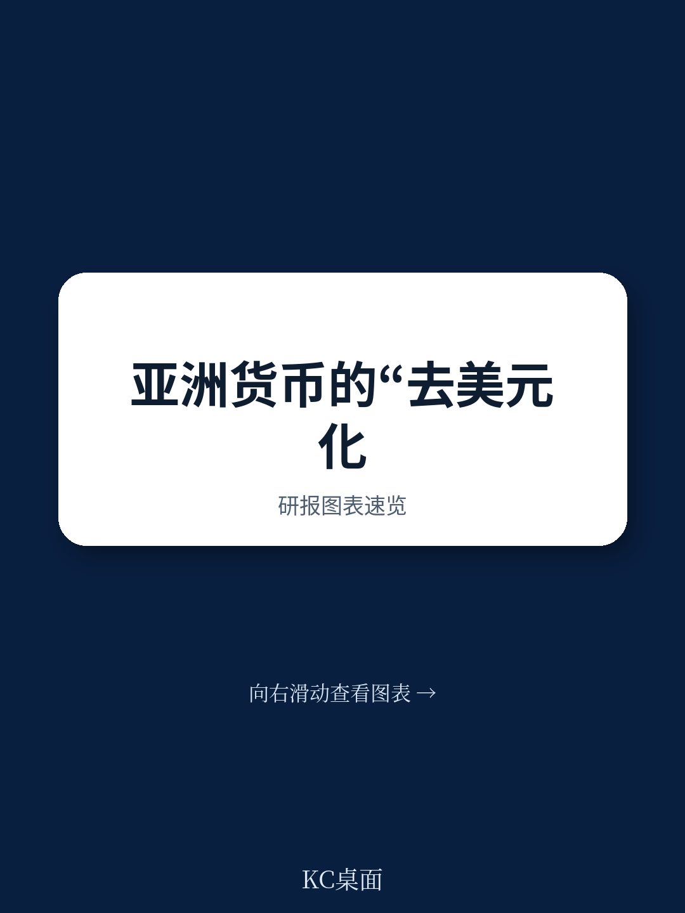
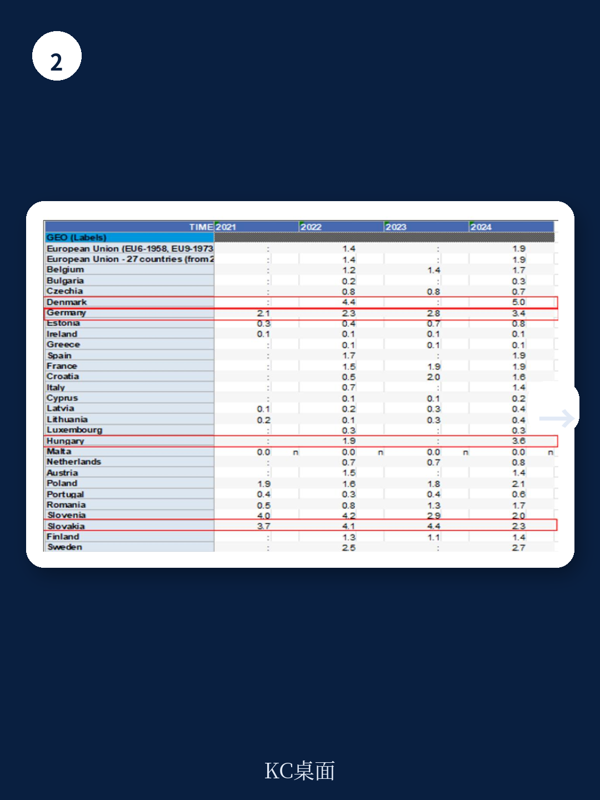

# 亚洲开发银行：去美元化不是选择题，而是基础设施竞赛

全球货币体系正在经历一场静水流深的底层重组。自2010年代末以来，地缘政治紧张——尤其是中美之间的结构性博弈——已经开始实质性地影响亚洲贸易和投资中的货币选择。美元依然是主导性国际货币，但一个不容忽视的趋势正在加速：新兴经济体正越来越多地推动本币计价交易。

亚洲开发银行研究所（ADBI）在2026年7月发布的第1540号工作论文，提供了一个难得的系统性视角。这份报告没有停留在“去美元化”的口号层面，而是深入拆解了中国人民币、泰铢、印尼盾、马来西亚林吉特等亚洲货币在本币结算中的真实进展、结构性瓶颈和政策边界。

核心判断是：去美元化的可持续扩张，不取决于政治意愿，而取决于外汇市场的深度、双边和多边政策框架的可信度，以及资本账户开放的节奏。那些在放松管制上走得最快的经济体——如泰国——正在收获实实在在的结算份额增长；而那些试图通过管制来推动本币使用的经济体，反而陷入了停滞。

这不仅是央行官员和交易员需要理解的变化。对于任何在亚洲供应链中配置资产、管理外汇风险、或评估区域贸易格局的决策者而言，理解本币结算的真实边界，是判断未来五年贸易金融成本和区域货币格局的前提。

## 1. 本币结算的真实进展比媒体报道温和得多，但结构性拐点已经出现

报告最值得关注的一点，是它对“去美元化”进展的诚实评估。SWIFT数据显示，人民币在国际支付中的占比仅为2.74%，很难将其视为真正的国际结算货币。但报告同时指出，SWIFT统计存在天然盲区——它无法捕捉通过人民币跨境支付系统（CIPS）完成的交易。

CIPS是中国央行主导建立的替代性金融基础设施。报告虽然没有给出CIPS的精确交易量，但明确指出，人民币的使用路径已经呈现出清晰的阶段性：从最初的人民币计价进口货物，扩展到人民币计价出口货物，再到服务贸易、人民币计价的直接投资和证券投资等资本交易。地理分布上，从最初集中在中国与香港之间，逐步向东南亚和欧洲扩散。

> **KC评论：** 这意味着，人民币国际化的叙事需要从“全球支付占比”切换到“区域结算网络密度”。SWIFT的2.74%是存量视角，CIPS的增长才是流量视角。真正值得关注的不是人民币什么时候取代美元，而是CIPS网络覆盖了多少条贸易走廊。这份报告对CIPS的讨论只是引子，完整报告里有更细致的国别数据拆解和CIPS与SWIFT的对比分析。

这里埋下了第一个伏笔：如果只看SWIFT数据，你会低估去美元化的真实速度；但如果只看政策宣传，你又容易高估其可持续性。真正有价值的信息，藏在各国央行公布的贸易结算币种细分数据里——而这份报告恰恰提供了大量这类数据。

## 2. 泰国的成功经验揭示了一个反直觉的规律：管制越少，本币结算增长越快

报告对泰国、马来西亚、印度尼西亚三个地理接近、且都实施了“本币结算框架”（LCSF）的经济体进行了对比分析。结论非常清晰：在三个经济体中，只有泰铢的结算份额出现了显著上升，而马来西亚林吉特和印尼盾的交易量并未稳步增长。

原因并不复杂。泰国在放松货币和外汇管制方面走得最远，而马来西亚和印尼自2010年代后半期以来，实际上收紧了非居民对本币的使用和持有，以及外汇交易的各种规定。报告指出，各经济体的对外投资头寸的差异——包括其价值和构成——反映了这些资本流动（包括资本交易）的差异，而这些差异可能是增加本币计价交易数量的有用线索。

这个发现对政策制定者有直接含义：推动本币结算不能靠行政命令，而要靠降低交易成本。泰国央行报告的一个细节尤其值得注意：当出口方收到对方货币后，一部分会以对方货币（外币）持有，并用于未来的对外支付。这意味着，本币结算的增长部分来自真实的“需求驱动”——企业持有并循环使用贸易伙伴的货币，而不是在收到后立即兑换回美元。

> **KC评论：** 对于在东南亚有业务布局的企业来说，泰铢结算的上升意味着两件事：一是泰铢的流动性和可交易性正在改善，二是未来与泰国交易时，美元中间环节的成本可能逐步下降。但马来西亚和印尼的情况则相反——管制收紧反而抑制了本币的使用。报告没有展开的是，这种分化对区域内供应链的货币选择会产生怎样的二阶影响。

## 3. 直接外汇市场是去美元化的隐形基础设施，但其深度仍是最大瓶颈

报告反复强调一个常被忽视的机制：本币计价交易的可持续增长，需要“直接外汇市场”作为支撑。所谓直接外汇市场，是指交易和结算直接使用本币货币对，不经过美元中介。

中国与部分东南亚经济体之间，正在建立和培育这样的直接外汇市场。报告引用Tomizawa（2023）的研究指出，从增加本币计价交易的角度看，在母国或伙伴国形成能够交易多种货币（包括新兴市场货币）的外汇市场是必要的。更重要的是，这类外汇市场的存在，使得即使在资本管制仍然存在的新兴经济体之间，也可能实现本币交易和结算。

但这里隐藏着一个关键约束：外汇市场的深度和流动性。美元之所以成为主导货币，不仅仅是因为美国的政治经济实力，更是因为全球外汇市场每天数万亿美元的交易量中，美元对几乎任何货币都有足够的流动性。新兴市场货币之间的直接交易，往往面临买卖价差大、交易深度不足的问题。

报告虽然没有直接给出流动性数据，但通过对比澳大利亚元的情况提供了侧面证据。澳大利亚元在亚洲贸易结算中的份额显著高于大多数亚洲经济体——这与其高度发达、深度流动的外汇市场直接相关。澳大利亚元的数据表明，一个经济体即使不是全球最大的贸易国，只要拥有深度、开放的外汇市场，其货币在区域贸易中的使用就能远超其经济规模所对应的水平。

## 4. 人民币的角色正在从双边工具演变为第三方交易媒介，但可兑换性仍是天花板

报告揭示了一个新的、值得关注的维度：人民币的使用正在从中国与特定双边伙伴之间的贸易，扩展到第三方经济体之间的交易——例如巴西与俄罗斯之间的贸易。

这一趋势的背后，是中国的五大银行在海外建立的分支机构网络、双边和多边政治谅解备忘录、货币互换安排以及清算结算系统。报告明确指出，当政府（如中国政府）通过政策措施主动推动人民币计价交易时——即存在双边或多边的政治谅解备忘录或倡议、互换安排、清算结算系统，以及中国五大银行的海外分支网络扩张——人民币的使用会扩大。

但报告也坦诚地指出了制约因素：人民币不能被视作完全可兑换货币，各种关于货币和外汇交易的法规仍然存在。这意味着，人民币虽然在特定贸易走廊和特定交易类型中快速增长，但要成为真正的国际结算货币，还需要在资本账户开放上迈出实质性步伐。

> **KC评论：** 这里有一个微妙的张力。报告发现，中国政府在推动人民币使用上“有领导力”——尤其是在新兴经济体之间的贸易中。但同时，资本管制又限制了人民币作为“价值储藏”手段的吸引力。对于企业来说，愿意用人民币结算是一回事，愿意持有人民币资产是另一回事。完整报告中有大量关于人民币在不同贸易伙伴中的使用份额变化图表，以及与中国五大银行海外网点分布的关联分析，这些图表比文字更能说明问题。

## 5. 报告尚未完全回答的关键问题：美元主导地位的“惯性”到底有多强？

报告引用了Perez-Saiz,Zhang和Iyer（2023）的研究，指出由于网络效应和转换成本，货币使用存在强大的惯性。尽管地缘政治风险正在加速国际货币体系的多极化，但惯性本身是一个需要被量化、被拆解的因素。

报告识别了几个惯性来源：战略互补性（与竞争对手使用相同货币定价的激励）、全球价值链整合（中间品贸易的美元计价传统）、以及外汇市场的深度差异。但报告没有完全回答的问题是：当这些惯性因素开始松动时，临界点在哪里？是某个贸易份额阈值，还是某个金融基础设施的覆盖度，抑或是某种地缘政治事件？

另一个未充分展开的问题是：日本企业在亚洲供应链中的美元使用。报告引用Ito et al.（2018）和Shimizu et al.（2021）的研究指出，美元在亚洲供应链的贸易交易中仍然占据主导地位，尤其是涉及日本企业的交易。日本企业的美元惯性有多强？什么条件下会发生变化？报告提及但未深入。

## 6. 决策者的观察框架：三个信号比一个口号更重要

对于需要跟踪这一趋势的读者，报告提供了三个比“去美元化”口号更有操作性的观察维度

第一，外汇市场深度。不要只看政策声明，要看本币货币对的买卖价差、交易量和可交易期限结构。泰国之所以成功，是因为它率先放松了管制，让市场深度自然生长。

第二，资本账户开放的节奏。报告明确指出，过度的货币和资本管制可能阻碍长期进展。马来西亚和印尼的案例表明，收紧管制反而抑制了本币使用。这是一个反直觉但非常重要的政策教训。

第三，清算结算基础设施的覆盖度。CIPS的节点数量、参与银行、支持的货币对种类，比SWIFT的人民币支付占比更能反映真实进展。同样，泰国央行的数据披露方式——区分出口方收到对方货币后的持有和再使用行为——也为其他经济体提供了方法论参考。

这三个维度合在一起，构成了一个比“人民币是否取代美元”更有意义的判断框架：不是看谁替代谁，而是看哪些贸易走廊、哪些货币对、哪些交易类型正在逐步摆脱美元中介。

---

去美元化不是一场速决战，而是一场基础设施竞赛。ADBI这份报告的价值，在于它提供了一个冷静的、基于数据的分析框架，而不是一个充满情绪的口号。它告诉我们，本币结算的增长是真实的，但条件是苛刻的；政策推动是有效的，但管制可能适得其反；人民币的角色在上升，但可兑换性仍是天花板。

这些结论背后，是数十张图表、数百个数据点和细致的国别比较。完整报告对每个经济体的本币结算数据、外汇市场结构、政策框架演变都有更深入的拆解。如果你正在跟踪亚洲货币格局的变化、评估人民币国际化的真实进展、或者需要为企业的跨境结算策略提供依据，这些原始数据和KC评论的每日汇编可以成为你的决策参考。

更多国际信源汇编和评论，每日更新，汇总国际主流叙事、数据和图表，帮助观测边际变化。我们的社区汇聚了头部券商、PE/VC、投行、并购基金、对冲基金、资管机构、战略咨询和智库的朋友，期待与你交流。

Personal reading notes and learning share only. Not investment advice.
