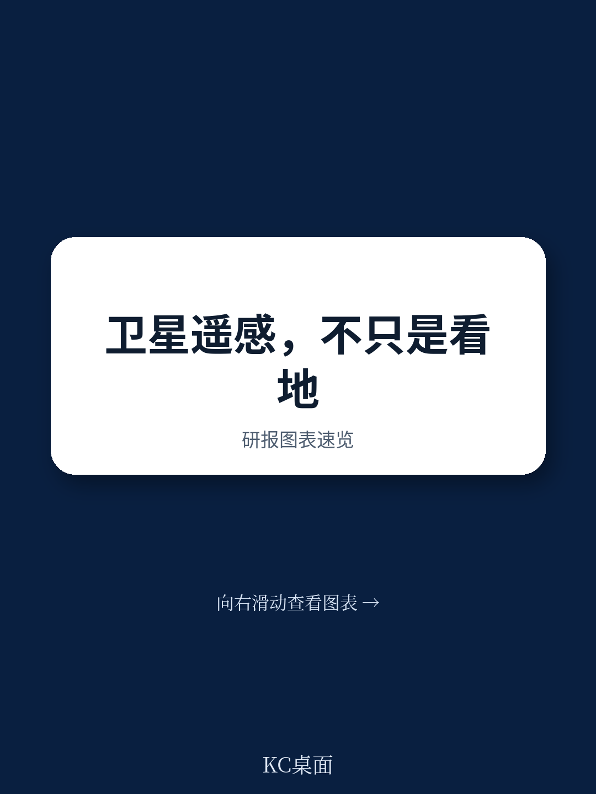
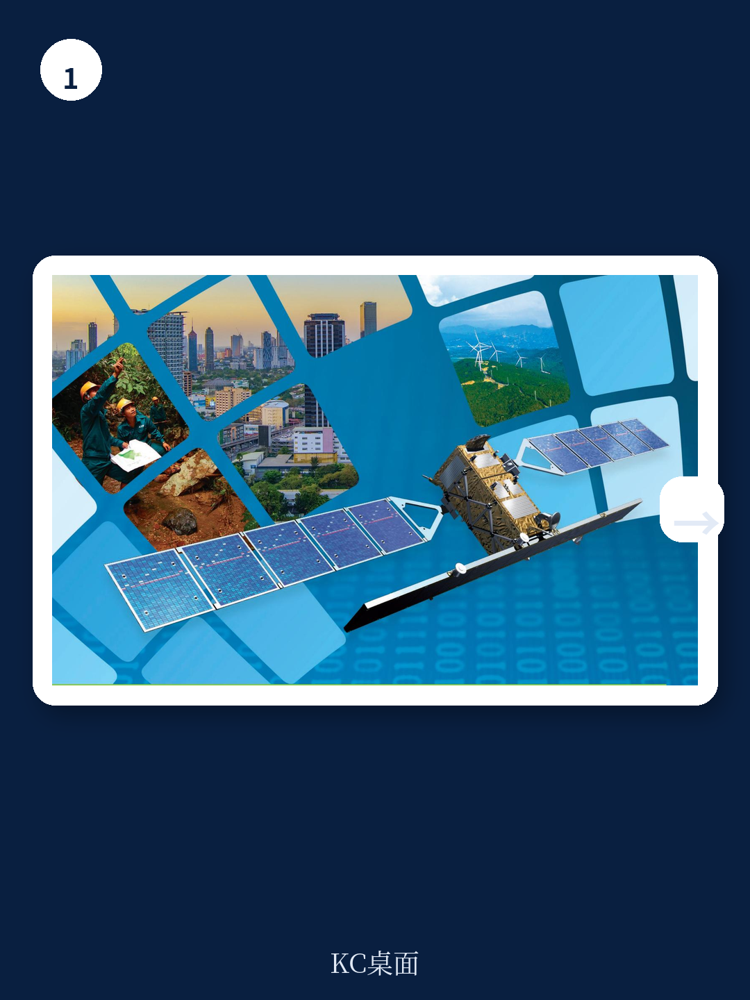
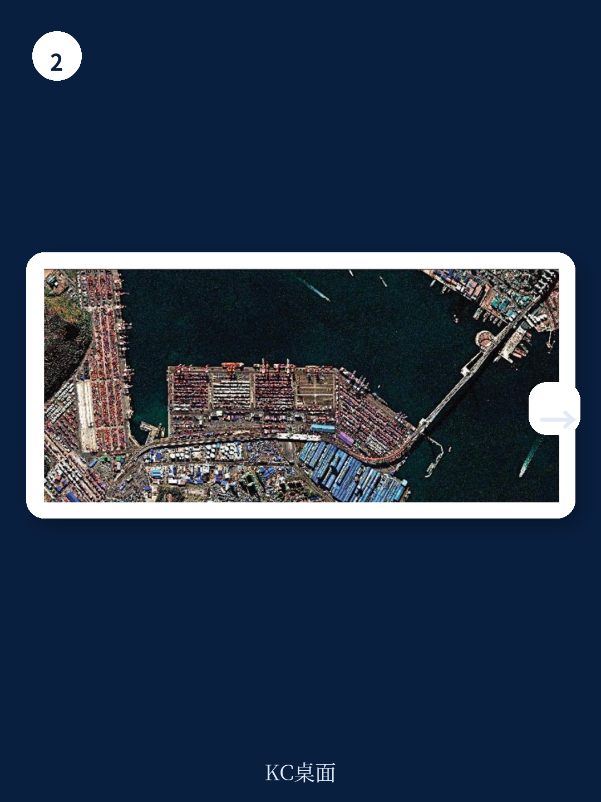

# 亚洲开发银行：不是卫星数量，而是数据应用，亚洲发展的新测量逻辑

一份来自亚洲开发银行（ADB）的详细技术报告，其核心判断并非关于某项技术突破，而是关于一个正在发生的结构性转变：**卫星地球观测（EO）正从科研工具演变为亚洲发展中国家基础设施投资、气候行动和项目评估的“基线数据基础设施”**。这份报告的价值在于，它系统性地展示了EO如何从“可选的补充信息”变成“决策链条中不可替代的一环”。

这并非一篇关于太空竞赛的报道。它讨论的是，当多边开发银行和各国政府开始将卫星数据嵌入项目全生命周期——从规划、监测到灾后评估——时，整个发展项目的效率、透明度和可问责性将发生怎样的变化。对于关注亚洲基础设施、气候风险、农业和城市化的决策者而言，这份报告提供了一个理解“数据如何重塑发展金融”的观测框架。

报告指出，亚洲和太平洋地区预计将成为未来十年全球EO领域增长最快的区域。这背后是多重动力的汇合：更低的卫星发射成本、AI分析能力的成熟、以及发展中国家日益增长的环境监测需求。但真正值得关注的，不是卫星的数量，而是这些数据如何被转化为可操作的决策信息。

> **KC评论：** 如果你只关心卫星技术本身，可能会错过报告的核心主张。ADB的视角是“应用驱动的投资回报”。它关心的不是卫星能拍多清楚，而是这些图像能否帮助一个道路项目避开未来20年的洪水风险，或者能否以更低的成本完成一个国家的森林碳汇核算。这才是发展金融机构和主权政府真正买单的理由。

## 1. 市场增长的核心驱动力不是技术，是“可验证的需求”

报告给出了清晰的市场数据：EO数据市场在2022年达到17.8亿美元，年复合增长率约6%；而下游的EO服务和数据分析市场已达28.6亿美元，年增长率达9%。预计到2032年，两个市场的总和将超过76亿美元。

但比数字更重要的是增长结构。报告明确指出，增长的主要驱动力来自对“甚高分辨率（亚米级）影像”的需求。这并非偶然。当发展项目的监测、灾害损失评估、以及碳汇核算都需要精确到地块或建筑物级别的数据时，低分辨率的免费数据已无法满足需求。购买商业高分辨率影像，正在成为项目成本结构中一个常规且必要的支出项。

关键在于，这种需求正在从少数发达国家扩散到亚洲发展中国家。报告提到，2019年发展中国家仅有约241家活跃的EO相关企业，贡献了全球市场2.2%的份额。这个看似微小的比例，恰恰是未来增长的起点。随着亚洲各国政府将EO纳入国家空间政策和数字基础设施建设，本地化的数据服务和解决方案提供商将迎来结构性增长机会。

## 2. “NewSpace”革命正在降低亚洲的准入门槛

报告特别强调了“NewSpace”趋势——即由小型化、低成本卫星星座驱动的商业航天浪潮。这一趋势始于美国，欧洲正在追赶，而报告认为，亚洲和太平洋地区“有望在未来十年成为这一创新领域增长最快的区域”。

这意味着什么？传统的大型政府卫星系统（如欧洲的哥白尼计划）提供了免费、全球覆盖的中分辨率数据，但其更新频率和灵活性有限。NewSpace的私营公司正在填补这一空白：它们可以按需提供特定区域的每日或每周更新数据，且成本正在快速下降。

> **KC评论：** 对于亚洲的发展中国家而言，这是一个关键的“技术民主化”进程。过去，只有拥有航天预算的国家才能获取高频次、高分辨率的卫星数据。现在，通过购买商业服务，任何政府或开发机构都可以获得类似的能力。这直接改变了基础设施规划、农业保险和灾害预警的可行性边界。完整报告中对NewSpace公司的详细分类和商业模型分析，值得仔细阅读。

## 3. AI和云平台是“数据洪流”的唯一解药

报告提到一个经常被忽视的瓶颈：数据量增长的速度远超人工处理能力。欧洲空间局处理的数据量正在呈指数级增长，而调查显示，数据科学家将大部分时间花在数据准备和清理上，而非实际分析。

解决这一问题的路径已经清晰：高性能云计算基础设施、数据立方体、数字孪生，以及AI驱动的分析技术。报告将这些称为“释放EO潜力的关键”。这意味着，未来EO领域的竞争壁垒，将从“谁能发射更多的卫星”转向“谁能更快、更准地从海量数据中提取出决策信号”。

对于亚洲发展项目而言，这意味着监测成本的大幅下降。例如，利用AI模型自动识别非法采伐、计算作物生长状况、或评估建筑物在洪水中的受损程度，正在从实验阶段走向规模化应用。报告中的六个应用案例（土地覆盖、灾害风险、气候韧性、海岸带、森林、温室气体）均展示了这种技术路径的成熟度。

## 4. 六个应用场景揭示了一个“可测量的治理”未来

报告的核心部分是六个来自ADB实际运营项目的EO应用案例。它们共同指向一个结论：EO正在使发展干预的效果变得可量化、可追溯、可问责。

以“灾害风险管理”为例，报告展示了2022年巴基斯坦特大洪水的卫星损害与损失评估图。通过对比灾前和灾后的高分辨率影像，可以精确到建筑物级别的受损判定。这不仅是人道主义响应的工具，更是保险理赔、财政拨款和国际援助分配的依据。

在“森林监测与管理”案例中，EO数据被用于估算地上生物量，这是碳汇交易和REDD+（减少毁林和森林退化所致排放）项目的基础。报告指出，全球地上生物量地图已可以公开获取，这意味着发展中国家在参与碳市场时，不再完全依赖昂贵的实地调查。

而在“城市环境”案例中，EO被用于识别非正式定居点（贫民窟）的空间分布，并评估其与医院、学校等公共设施的距离。这种数据直接服务于城市规划和社会公平性的评估。

> **KC评论：** 这些案例的共同点在于，它们都在回答同一个问题：**钱花在了哪里，效果如何？** 对于多边开发银行和主权政府而言，EO提供的不是“酷炫”的画面，而是审计和评估的客观依据。报告中对每个案例的技术路径、数据源和处理流程都有详细拆解，这是理解“如何将遥感数据转化为决策证据”的关键章节。

## 5. 报告尚未完全回答的关键问题：商业模式的可持续性

尽管报告对EO的技术和应用前景充满信心，但它也坦诚地指出了当前市场的挑战：全球通胀、地缘政治紧张、以及疫情后的经济调整，正在迫使商业EO运营商重组、降本增效。竞争正在变得激烈。

一个尚未被完全回答的问题是：**对于亚洲发展中国家的本地EO服务商而言，可持续的商业模式是什么？** 报告显示，全球EO市场仍由北美主导，欧洲次之。亚洲的份额虽然增长最快，但基数极低。依赖政府合同和开发银行项目能否支撑起一个健康的产业生态？还是说，真正的增长将来自商业农业、保险和物流等行业的需求？报告提供了趋势判断，但具体的商业路径和风险分析，值得每一位关注该领域的投资者和创业者深入思考。

另一个值得追问的问题是：**数据的标准化和互操作性如何解决？** 报告提到了“十项提高卫星地球观测社会价值的规则”，但并未深入讨论不同国家、不同卫星系统之间的数据格式、坐标系和元数据标准差异。如果数据无法无缝集成，AI模型的泛化能力将受到严重制约。

## 6. 一个决策者的观测框架：从“看数据”到“用数据”

基于这份报告，我们可以提炼出一个针对亚洲发展项目决策者的行动框架

**第一，将EO纳入项目设计的前置环节。** 不要等到项目出了问题才想到用卫星图。在可行性研究阶段，就应利用历史EO数据评估气候风险、土地利用变化和人口分布。这是提高项目韧性的最有效方式。

**第二，建立“数据-决策”的闭环。** 购买卫星数据只是第一步。需要配套的数据处理平台、分析人才和决策流程。报告反复强调，EO的价值链很长，从原始数据到最终决策，需要多个环节的协同。

**第三，关注本地能力建设。** 报告指出，亚洲和太平洋地区是增长最快的市场。这意味着本地人才的培养、数据中心的建设、以及与全球EO服务商的合作，将成为国家竞争力的组成部分。单纯依赖进口数据和分析服务，长期来看不可持续。

**第四，评估碳市场和气候金融中的EO应用机会。** 随着全球碳定价机制的成熟，基于卫星的碳监测和生物量核算将成为硬通货。提前布局这一领域的标准化方法，将为项目争取到更多的气候融资。

报告对上述每一个维度都有详实的数据、图表和案例支撑，但受限于篇幅，本文只能勾勒出核心逻辑。真正有价值的部分——包括各应用场景的技术细节、市场参与者的竞争格局、以及ADB在具体项目中的操作经验——都在完整报告之中。

---

更多国际信源汇编与评论，每日更新。我们每日将全球主流机构报告、数据图表和关键信号整理为中文摘要与KC评论，便于快速扫读市场动态，也便于喂给AI进行二次分析。社群汇聚了头部券商、PE/VC、投行、并购、对冲基金、资管机构、战略咨询和智库的朋友，期待与你交流。

Personal reading notes and learning share only. Not investment advice.
