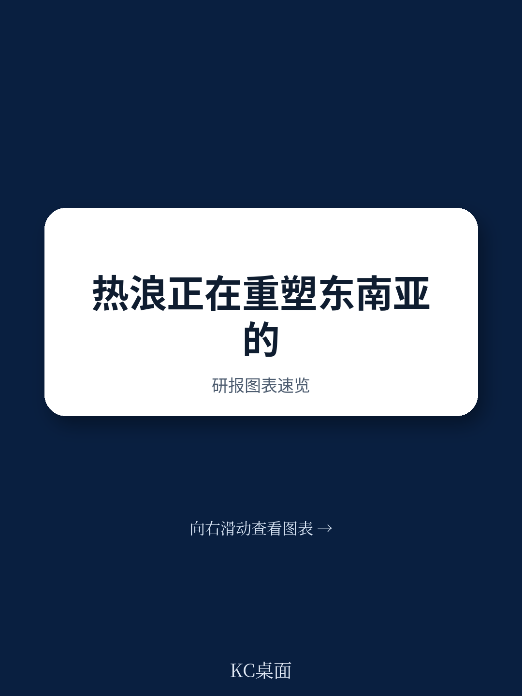
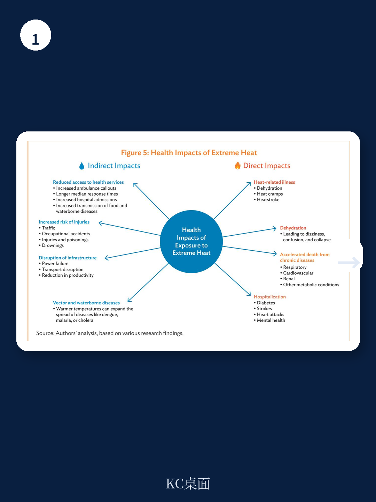
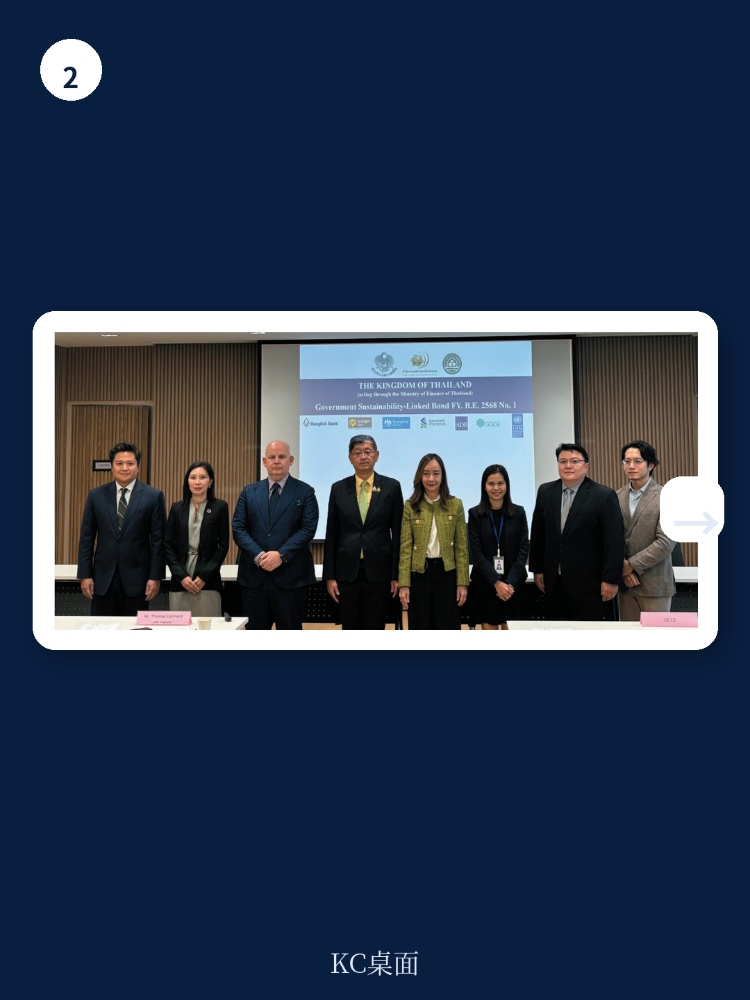

# 亚洲开发银行：高温导致2.4万亿美元生产力损失，亚洲开发银行警告东南亚风险

2024年成为有记录以来最热的一年，全球平均气温较1850-1900年基准高出1.45至1.60摄氏度。这个数字本身已经足够惊人，但真正值得关注的不是温度本身，而是温度背后正在发生的变化：极端高温不再是一个季节性的不适，它正在变成一场持续、全面、且影响深远的危机。

亚洲开发银行最新发布的这份报告，核心判断可以用一句话概括：极端高温正在从“气候问题”演变为“治理问题”，而东南亚——尤其是泰国——正处在这场转变的前沿。报告指出，到2048年，极端高温可能导致泰国GDP损失高达45%。这个数字的冲击力在于，它不是在讨论一个遥远的气候情景，而是在描述一个已经启动的经济结构性调整。

## 1. 高温的经济代价已经大到保险公司不再称之为“隐形风险”

报告中最值得注意的一个信号是：保险行业已经不再将极端高温视为“隐形风险”，而是开始系统性地评估其投资风险和连锁成本。这意味着高温的影响已经从物理层面穿透到了金融定价层面。

2025年，极端高温预计将造成2.4万亿美元的生产力损失，以及上市公司4480亿美元的固定资产损失。这两个数字放在一起看，传递的信息非常明确：高温正在同时侵蚀两个最核心的经济变量——人的产出能力和资本的价值。

对于东南亚而言，问题更加严峻。该地区高度依赖户外劳动密集型产业（农业、建筑业、旅游业），同时又面临大规模的非正规就业。报告指出，对于依赖非正规劳动力的经济体，生产力损失可能变成结构性嵌入——也就是说，即使经济总量在增长，人均产出效率也可能因为高温持续下降。

> **KC评论：** 这份报告最有价值的洞察之一，是把高温的影响从“人道主义关切”拉到了“资产负债表”层面。当保险行业开始重新定价，当上市公司固定资产开始缩水，高温就不再只是环保部门的议题，而是CFO和董事会必须面对的风险因子。完整报告中对不同行业暴露度的量化拆解，值得仔细阅读。

这里需要补充一个视角：继续阅读原文，真正有价值的是报告中对不同行业生产力损失的细分图表、关键假设的推导路径，以及不同情景下的敏感性分析。这些内容在每日汇编中有完整的中文摘要和图表整理。

## 2. 泰国站在最前线，但它的脆弱性不是孤例

报告用大量篇幅分析了泰国的特殊脆弱性。泰国不仅是东南亚最易受气候波动影响的国家之一，而且其经济核心支柱——农业、渔业、旅游业——全部暴露在高温风险之下。曼谷和沿海旅游城市同时面临高温、海平面上升和海岸侵蚀的三重压力。

但泰国的案例之所以值得关注，不是因为它的特殊性，而是因为它代表了一种普遍困境：经济结构越依赖自然资源和户外劳动，受高温冲击就越直接；而越缺乏财政余力和制度准备，应对能力就越弱。

报告特别提到了泰国湾的生态压力。这个与邻国共享的浅海半封闭水域，正因过度捕捞、海洋热浪、珊瑚白化和污染而承受严重生态压力。这不是一个孤立的环境问题——它为沿海社区提供食物安全和生计，为旅游业提供休闲资源。生态系统的退化，会直接传导到就业、收入和公共财政。

> **KC评论：** 泰国的案例验证了一个重要判断：高温风险的传导路径不是线性的，而是通过生态系统、劳动力市场、基础设施和公共服务形成多重反馈。报告中对这些传导路径的图解，比文字描述更有说服力。完整报告中的这些图表和假设条件，是理解风险传导的关键。

## 3. 应对高温的真正瓶颈不是技术，而是治理

报告识别了五个核心障碍：政策与制度层面的认知不足、项目开发方式的碎片化、数据与监测系统的缺失、以及巨大的融资缺口。但贯穿这些障碍的一条主线是治理问题。

报告直言不讳地指出：“热应激不仅是气候或健康挑战，也是治理挑战。”管理热应激需要气象、卫生、劳动、城市规划、教育和灾害管理等多个部门的协调行动，需要有共享的数据和一致的任务授权。如果没有一个整合的治理架构，任何技术方案都只能停留在试点阶段。

这恰恰是大多数发展中国家面临的核心困境。高温不是一个部门能解决的问题，但现有的政府架构几乎都是按部门划分的。气象局管预报，卫生局管中暑，劳动局管工时，城市规划管绿化——但没有人管“高温风险”这个整体。

报告提出的“国家热行动计划”框架，本质上就是试图打破这种部门壁垒。它要求建立一个跨部门的协调机制，从预警系统到应急响应，从城市规划到劳动保护，从融资机制到社区参与，形成一个闭环。

> **KC评论：** 报告最务实的部分不是技术方案清单，而是这个治理框架。它承认了一个现实：在大多数国家，系统性的热应对方案不可能一步到位，但可以从建立协调机制、共享数据和制定统一标准开始。完整报告中对泰国现有政策缺口和制度瓶颈的具体分析，是理解“从哪开始”的关键。

## 4. 融资缺口需要新的思维：从公共财政到混合融资

报告指出，应对高温的融资缺口正在扩大。传统上，极端天气事件的应对主要依赖公共财政和国际援助，但面对高温这种长期、慢性的风险，这种模式不可持续。

报告提出了一些新的融资思路：绿色债券、公私合作伙伴关系、以及专门的气候融资工具。但真正值得关注的是报告中提到的“风险化解”逻辑——不是简单地增加资金来源，而是通过公共资金去化解项目的早期风险，从而撬动私人资本进入。

这个思路在基础设施融资领域已经比较成熟，但在高温应对领域还处于早期阶段。报告引用了一些国际案例，包括英国的绿色热网基金和印度尼西亚的绿色融资设施，展示了公共资金如何通过担保、优先损失吸收等方式降低私人投资者的风险感知。

> **KC评论：** 高温应对的融资困境本质上是“收益错配”问题。高温缓解的社会收益（减少死亡、提高生产力、降低医疗支出）是巨大的，但这些收益分散在多个部门和未来多年，很难转化为单一项目的现金流。报告中对不同融资工具的适用场景和局限性的分析，是理解这个问题的核心。完整报告中关于风险化解机制的图表和案例比较，值得仔细研究。

## 5. 报告尚未完全回答的关键问题

尽管这份报告在问题识别和框架构建上非常出色，但它也留下了一些值得追问的问题。

第一，高温对供应链的影响。报告重点分析了高温对本地劳动力和生产力的影响，但没有深入讨论高温如何通过供应链传导到更广泛的区域和全球经济。东南亚是全球制造业和农产品供应链的重要节点，高温导致的产能下降和成本上升，会如何影响全球价格和贸易格局？这需要更深入的分析。

第二，技术方案的经济可行性。报告列出了一系列技术解决方案，从城市绿化到建筑改造，从预警系统到冷却中心。但这些方案的成本效益分析并没有充分展开。在财政资源有限的情况下，哪些方案应该优先？不同方案的投资回报周期有多长？这些信息对于决策者来说至关重要。

第三，行为变化的路径。报告提到了公众意识和行为改变的重要性，但没有深入讨论如何推动这种改变。高温应对不仅仅是政府和企业的责任，也涉及个人和社区的行为调整。从认知到行动的转化路径，是一个被低估的挑战。

## 6. 一个观察框架：如何评估一个经济体的高温韧性

基于这份报告的分析，我们可以提炼出一个评估框架，用于判断一个经济体或城市的高温韧性水平。

第一层：认知水平。政策制定者和公众是否认识到高温是一个系统性风险，而不仅仅是天气现象？这可以通过政策文件、媒体报道和公众调查来评估。

第二层：治理架构。是否存在跨部门的协调机制？是否有明确的责任分配和问责机制？数据是否在部门之间共享？

第三层：基础设施准备。城市绿化覆盖率、建筑热性能标准、冷却中心分布、应急响应系统是否到位？

第四层：经济缓冲能力。劳动力保护政策是否完善？社会保障体系能否覆盖高温导致的收入损失？企业是否有应对高温的业务连续性计划？

第五层：融资可持续性。高温应对是否有稳定的资金来源？是否已经引入了私人资本和混合融资工具？

这五个层次可以作为一个诊断工具，帮助识别一个经济体在高温韧性方面的短板和最优先的改进方向。

---

高温正在重塑东南亚的经济和社会结构。这份报告的价值在于，它把高温从一个“环境议题”重新定义为“发展风险和治理挑战”。对于关注东南亚市场的投资者和企业决策者来说，理解高温对生产力、供应链和资产价值的影响，已经不再是可选项，而是必答题。

更多国际信源汇编和评论，扫码交流，每日更新。每日汇编会将单篇报告放回当天的主线叙事中，整理成中文摘要、KC评论和图表合集，便于喂给AI进行深度分析，也便于人工快速扫描市场动态和边际变化。社群汇聚了头部券商、PE/VC、投行、并购、hedge fund、资管机构、战略咨询、智库等朋友，期待与各位交流。

Personal reading notes and learning share only. Not investment advice.
