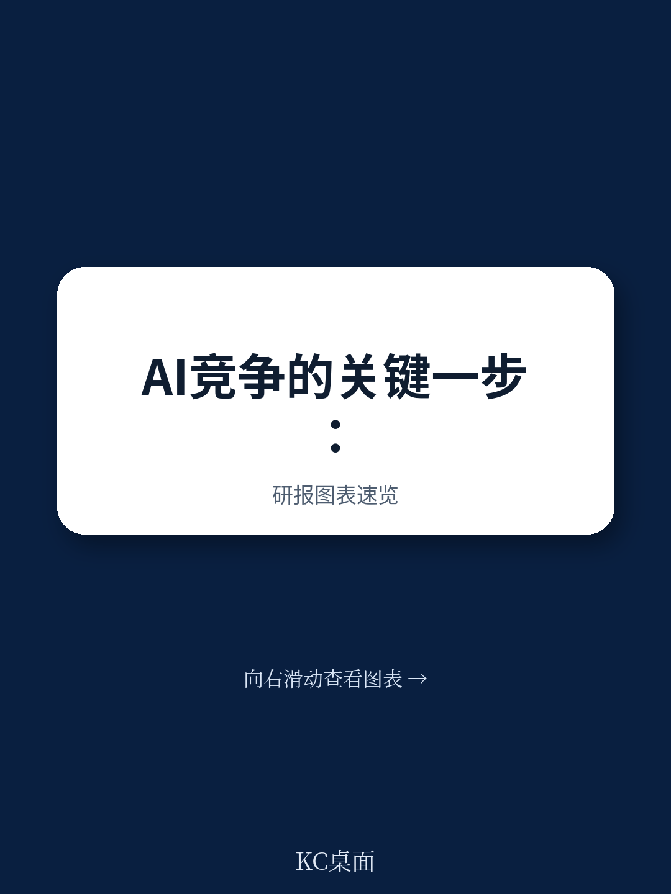

# 布鲁盖尔研究所：数字市场法案要求谷歌开放系统，第三方AI服务迎来转机

欧洲AI竞争格局正站在一个关键转折点上。2026年4月，欧盟委员会发布了针对Google Android系统的《数字市场法案》第6条第7款的首份规范草案，要求Google向第三方AI服务提供商开放操作系统核心接入点。这不仅仅是一次监管行动，更是一个信号：欧盟正在用一套事前干预机制，试图避免AI服务市场重蹈搜索市场被一家企业垄断的覆辙。布鲁盖尔研究所（Bruegel）高级研究员Fiona Scott Morton在这份研报中系统论证了为什么这项规范是“正确的工具、正确的时机”，以及为什么它可能比美国耗时十年的反垄断诉讼更有效。

> **KC评论：** 这篇报告的核心判断值得所有关注AI产业竞争格局的人仔细读一遍——欧盟正在做的不是“监管AI”，而是用互操作性条款维护AI服务市场的可竞争性。报告里最关键的图表是第3节对四个接入点的拆解图，以及第4节对Google搜索垄断历史的对比分析。这些图表和假设路径在完整报告中才能看到全貌。

继续看原文，真正有价值的是图表、假设和验证路径；完整报告与KC评论在每日汇编。

## 1. 这轮AI竞争的关键瓶颈不在技术，而在手机操作系统对第三方AI服务的接入控制

报告指出，AI助手要真正有用，必须依赖四个核心功能：调用（invocation）、上下文（context）、动作（actions）和资源访问（resources）。所有这四个功能都需要通过设备的操作系统实现。以Google Android为例，长按Home键调用搜索功能、始终在线的热词检测“Hey Google”、AppSearch集中式设备数据API、App Actions和App Functions等结构化集成通道、以及AICore设备端模型服务——这些关键接入点目前全部被保留给Google自己的AI服务Gemini。

问题不在于Google在技术上领先多少，而在于它控制了用户与AI服务交互的物理入口。用户通常只携带和使用一部手机，这意味着任何AI服务提供商要触达用户，都必须通过这个单一渠道。如果第三方AI服务在调用速度、上下文获取能力、执行动作的流畅度上因为操作系统限制而体验不佳，用户自然会选择Gemini——不是因为Gemini更好，而是因为操作系统在“帮”它更好。

> **KC评论：** 这段分析的价值在于它把一个技术问题翻译成了竞争经济学问题。报告里有一张图表清晰展示了这四类接入点在Android系统中的封闭状态，以及每个接入点对第三方AI服务的影响程度。这张图在完整报告中才能看到。

## 2. Google在AI领域的自我优待策略，是搜索垄断历史的重演

报告第4节用了一个极具说服力的对比：Google在搜索领域的垄断是通过“支付数十亿美元锁定默认位置”完成的——向Android设备制造商、独立浏览器、运营商甚至苹果支付巨额费用，确保几乎每一次移动设备上的搜索查询都流经Google Search。这些分销安排耗资每年数百亿美元，挤占了竞争对手改进产品所需的查询量。

现在，同样的剧本正在AI服务领域上演。Google将移动AI接入点保留给Gemini，本质上是在重复同一套封锁策略。区别在于：AI服务市场的竞争阶段比当年的搜索市场更早期、更不确定，但也因此更容易被“锁定”。如果Google成功将美国市场“倾斜”（tip），或者这种倾斜的风险持续存在，新兴AI公司将没有意愿进入美国市场进行投资。

报告特别强调了一个时间点：2026年5月，Google宣布搜索将在几天内被AI体验替代，新的AI格式搜索将于7月正式上线。这意味着任何想要保护AI服务竞争的监管机构，都需要立即建立防护机制——而不是等到垄断形成后再花十年打官司。

## 3. 欧盟的DMA第6条第7款是“事前干预”，比美国反垄断诉讼更有效

报告的核心论证逻辑是：欧盟的DMA提供的是“事前义务”（ex-ante obligations），而不是等待个案反垄断执法。第6条第7款要求守门人（gatekeeper）向第三方服务提供商提供与操作系统功能的有效互操作性，且条件必须与守门人自身服务获得的相同。

具体来说，这份规范草案要求Google

- 允许第三方AI服务通过长按Home键等调用表面被调用，并接收上下文数据
- 允许第三方在设备数字信号处理硬件上注册自己的声音模型，并与Google的热词并发运行
- 允许第三方通过AppSearch并发访问设备上存储的用户数据，包括Google自家应用（如地图、日历、Gmail）中的数据
- 允许第三方通过App Actions、App Functions等结构化通道执行应用内操作
- 允许第三方使用系统级的设备端基础模型（如Gemini Nano），并允许后台执行

这些要求不是“建议”，而是具有法律约束力的义务。如果最终确定并有效执行，它们将从根本上改变第三方AI服务在Android设备上的竞争条件。

> **KC评论：** 报告最精彩的部分是第3节对四个接入点的技术细节拆解，以及第4节对Google搜索垄断历史的对比分析。这些内容在完整报告中以图表和假设路径的形式呈现，值得仔细阅读。

## 4. 欧盟正在用监管创造AI创新吸引力，而美国可能正在失去这个机会

报告提出了一个反直觉的判断：DMA第6条第7款规范可能成为欧洲AI创新的催化剂。原因在于，规范为AI创新者提供了法律确定性——他们知道在欧盟，他们可以通过Android设备获得分销渠道。一个欧洲AI创业公司可以调用Home按钮、使用设备上的热词检测、读取用户内容、执行应用内操作、使用设备端模型。它可以在这些功能之上进行差异化创新来吸引用户。

相比之下，美国没有类似的工具。美国监管机构可能会对Google提起反垄断诉讼，但这类诉讼需要多年才能完成，而市场很可能在案件成功之前就已经倾斜。这意味着：一个有雄心的AI创业者可能会选择在欧盟设立公司，因为在那里她可以确保获得终端用户并规模化业务。风险投资人也更愿意投资那些有稳定终端用户市场准入的初创公司。

报告直接回应了“欧洲监管扼杀创新”的常见批评：第6条第7款规范不指定产品特性、不挑选赢家、不设定价格，而是维护竞争。它通过识别守门人已经关闭的接入点，并要求守门人免费、对等地分享这些功能，增加了市场的可竞争性和可进入性。

## 5. 报告没有完全回答的关键问题：iOS侧的缺口和Gemini-Apple合作

报告坦率地指出了当前框架的一个重大缺口：iOS侧。苹果尚未完全遵守DMA，其Siri与Google Gemini的合作关系可能需要单独调查，以确保不会削弱AI服务竞争。报告认为，苹果可能不会等待太久才向5亿欧洲公民销售支持Siri的手机，但苹果的合规行为将决定是否需要对其与Google的合作展开调查。

这个问题之所以关键，是因为苹果控制着高端手机市场的重要份额，而苹果与Google的合作可能形成另一种形式的封锁——不是通过操作系统直接封锁，而是通过排他性合作协议间接封锁。报告建议欧盟委员会对Google与苹果的Gemini合作展开平行调查。

> **KC评论：** iOS侧的缺口是这份报告最值得追问的部分。报告没有展开的是：如果苹果也完全开放，欧洲AI服务市场的竞争格局会变成什么样？如果苹果选择不完全开放，欧盟是否有足够的工具迫使它开放？这些问题的答案取决于后续的监管行动和苹果的合规策略。

## 6. 对读者的观察框架：三个需要持续追踪的信号

基于这份报告的逻辑，我们可以建立一个观察AI服务竞争格局的分析框架

第一个信号是欧盟委员会2026年7月27日的最终决定。如果规范被最终确定并强制执行，这将是全球首个对移动AI服务互操作性的系统性监管。它的执行效果将决定其他司法管辖区是否跟进。

第二个信号是苹果的合规行为。苹果是否会在iOS上提供类似的互操作性？苹果与Google的合作关系是否需要被调查？这些问题的答案将决定欧洲AI服务市场的竞争边界。

第三个信号是AI创业公司的地理选择。如果欧洲真的成为一个“公平竞争场”，我们应该看到更多AI创业公司在欧洲设立总部，更多风险投资流向欧洲AI初创公司。这个指标可能需要12-24个月才能显现。

报告本身也没有完全回答的一个问题是：互操作性规范是否足以防止Google通过其他方式（如云服务、数据优势、用户习惯锁定）维持主导地位？这可能需要后续的监管迭代和市场观察。

---

这份报告的完整版本包含了更详细的接入点技术拆解、Google搜索垄断历史的对比分析、以及欧盟委员会规范草案的具体条款。如果你希望获得这些内容，欢迎加入我们的社群。

更多国际信源汇编与评论，扫码交流，每日更新。我们汇总国际主流叙事、数据与图表，观测边际变化。每日汇编将单篇报告放回当天主线，整理成中文摘要、KC评论和图表合集，便于喂给AI，也便于人工快速扫描市场动态。社群汇聚了头部券商、PE/VC、投行、并购、对冲基金、资管机构、战略咨询、智库等朋友，期待与你交流。

Personal reading notes and learning share only. Not investment advice.
