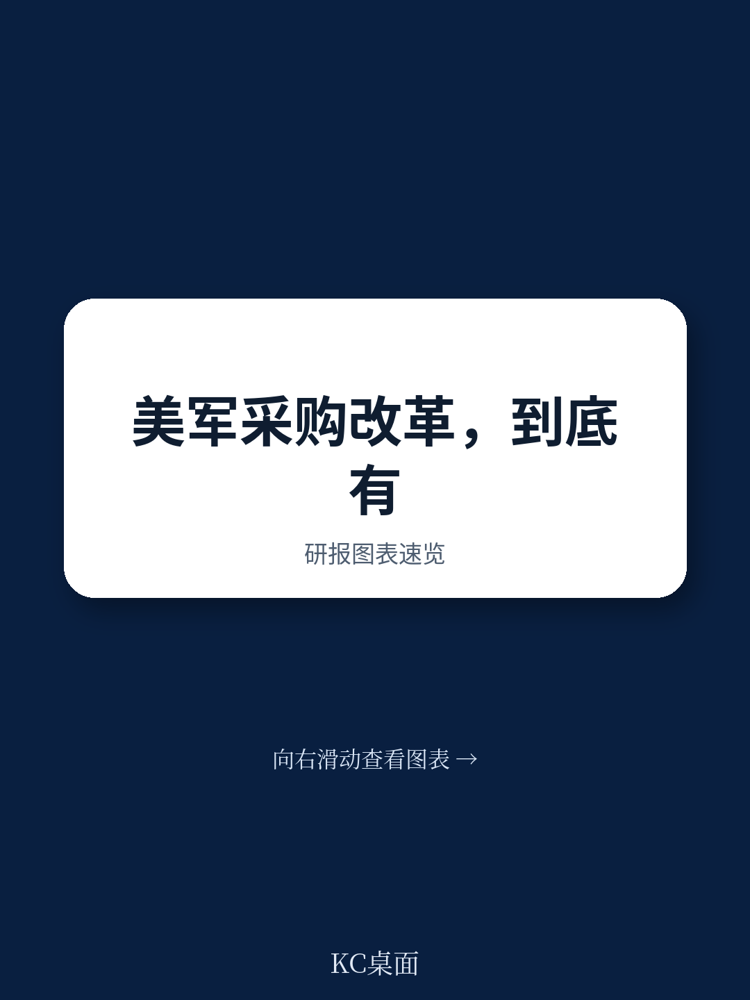
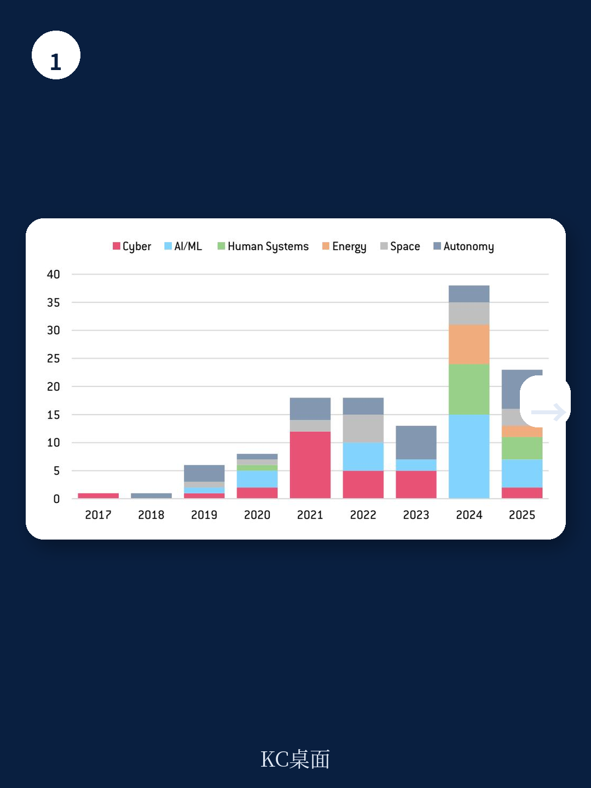
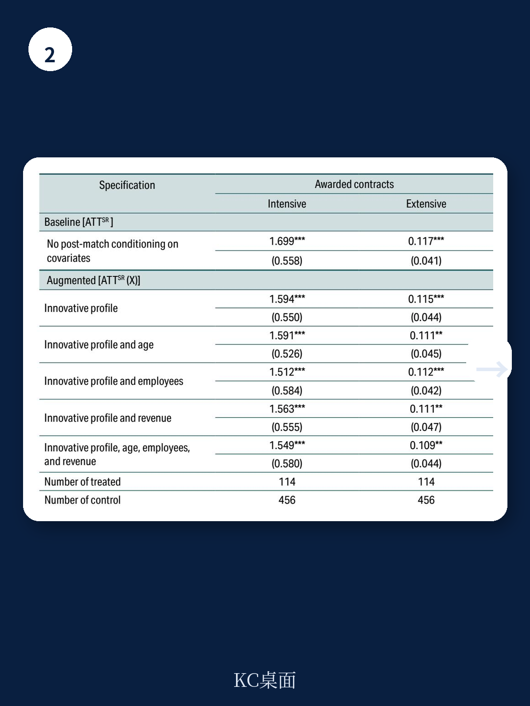

# 布鲁盖尔研究所：五角大楼用十年验证，硅谷创新如何真正融入国防

美国国防部在2015年成立了一个名为“国防创新单元”（Defense Innovation Unit,DIU）的机构，旨在打破传统军工巨头的垄断，让硅谷的商业科技公司也能参与国防采购。十年后，布鲁盖尔研究所（Bruegel）发布了一份实证评估报告，首次用因果识别方法验证了这一改革的效果。结论清晰：DIU不仅显著提高了商业科技公司获得国防合同的可能性，还大幅增加了合同金额。这一发现对正在效仿美国模式推进国防创新改革的欧洲、印度和加拿大等国，具有直接的决策参考意义。

这份报告的核心判断是：通过降低信息不对称和交易成本，专门的国防创新机构可以系统性地扩大和深化国防供应商基础。这不是一个“锦上添花”的增量改革，而是对传统国防采购“锁定效应”的结构性突破。

> **KC评论：** 传统国防采购的逻辑是“大而全”——只有那些能承受漫长合规流程、熟悉官僚体系、拥有政府关系的大型承包商才能生存。DIU的逻辑是“快而专”——它用商业解决方案开放（CSO）机制，让企业主动提出技术方案，而不是被动响应军方写好的技术规格。这看似只是流程变化，实则是对国防创新生态的根本重构。

继续看原文，真正有价值的是布鲁盖尔研究所如何构建反事实对照组、如何剥离其他政策干扰（如SBIR改革），以及那些图表背后的二阶影响——比如DIU对合同金额的拉动效应是否集中在少数明星公司身上，还是广泛分布于整个供应商网络。完整报告与KC评论在每日汇编。

## 1. DIU的机制设计精准回应了“为什么硅谷不愿为五角大楼打工”

传统国防采购的最大问题不是技术缺口，而是制度摩擦。联邦采购条例（FAR）设计的初衷是确保大规模采购的合规性和公平性，但这对于小型商业科技公司而言，意味着极高的进入成本：需要专门的法务和合规团队、需要应对漫长的招标周期、需要理解军方特有的需求语言。这导致了一个自我强化的锁定效应——大型承包商越来越懂国防采购，国防采购也越来越依赖大型承包商，新进入者几乎不可能破局。

DIU的设计恰恰针对这两个核心障碍。它采用的“商业解决方案开放”（CSO）机制，不是让企业去响应军方写好的技术规格书，而是由DIU提出一个宽泛的国防问题，让企业提交简短的技术方案。这大幅降低了企业的提案成本。更重要的是，DIU的团队具备“双重语言能力”——既懂国防需求，又懂商业技术，能够充当翻译官和桥梁。成功通过评估的企业，其产品会被列入DIU的商业解决方案目录（Commercial Solutions Catalogue），供整个国防部系统采购。

这一机制的本质是：用专门的中间机构来替代市场自发的匹配过程。在传统国防市场中，信息不对称和交易成本太高，市场自发形成的匹配往往是低效的。DIU通过制度化的中介服务，人为降低了这两个摩擦，让商业科技公司的创新成果能够更顺畅地流入国防体系。

## 2. 因果识别：DIU带来的合同概率提升不是“幸存者偏差”

布鲁盖尔研究所面临的最大挑战是选择性偏差。你可能会问：会不会是那些本来就更有竞争力的公司主动选择了DIU，而DIU只是“摘了低垂的果实”？为了排除这种可能，研究团队构建了一个极为严谨的因果识别框架。

他们首先从美国总务管理局（GSA）的行政采购数据中，提取了2017年至2025年所有与国防部有合同关系的企业，构建了一个包含118,159家企业的平衡面板数据。然后，他们使用倾向得分匹配（Propensity Score Matching），在行业、地理位置、产品类型、企业规模、营收、员工数、专利活动等维度上，为每一家DIU目录中的企业（共122家）找到最相似的非DIU企业作为对照组。

在此基础上，他们采用交错采用的双重差分模型（Staggered Difference-in-Differences），比较两组企业在DIU目录上市前后的合同变化。结果非常显著：在DIU目录上市后，企业获得国防合同的可能性显著提升，合同金额也显著增加。而且，这一效应在多重稳健性检验中依然成立——包括排除单一企业驱动效应的留一法检验、随机分配治疗组的安慰剂检验等。

> **KC评论：** 这份报告的实证方法值得所有关注政策评估的读者仔细阅读。它没有停留在“DIU合作企业后来拿到了更多合同”这种描述性结论，而是通过构建反事实对照组，回答了“如果没有DIU，这些企业会怎样”的问题。对于决策者来说，这种因果推断远比相关性分析有说服力。完整报告中的图表——特别是倾向得分匹配前后的协变量平衡图、事件研究图——是理解这一论证过程的关键。

## 3. 报告尚未完全回答的关键问题：DIU的规模效应能否持续

尽管DIU的效果在统计上显著，但报告也坦诚地指出了几个尚未完全回答的问题。首先，DIU的覆盖范围仍然有限——截至2025年，仅有127家企业的产品被列入其商业解决方案目录。相较于国防部每年数万家供应商的体量，这一规模仍然微不足道。DIU能否从“小而美”的试点机构，成长为能够系统性改变国防采购生态的规模化力量，仍是一个开放问题。

其次，DIU的效果是否集中在少数“明星企业”身上？报告中的留一法检验显示，没有单一企业驱动整体效应，但这并不意味着所有DIU企业都获得了同等程度的收益。报告没有进一步拆解，哪些类型的企业（如AI/ML领域 vs. 能源领域）受益最大，哪些企业只是“拿了合同但没有规模扩张”。这一异质性分析对于政策优化至关重要。

第三，DIU与传统SBIR/STTR项目之间的关系尚未厘清。报告将SBIR/STTR获奖企业排除在对照组之外，但DIU企业中有相当一部分也同时获得了SBIR资助。这些企业究竟是“DIU的功劳”还是“SBIR的功劳”，或者两者存在互补效应？报告没有完全解决这一混淆问题。

## 4. 对读者的观察框架：如何判断一个国防创新机构是否真正有效

基于布鲁盖尔研究所的分析框架，我们可以提炼出一个评估任何国防创新机构的四维观察框架

第一，进入门槛是否真正降低。DIU的成功在于它用CSO机制替代了传统的RFI/RFP流程。一个国防创新机构如果仍然沿用传统的技术规格书和长篇提案要求，那么它只是在“旧瓶装新酒”，不会产生实质性变化。

第二，中介能力是否足够强。DIU的“双重语言能力”是其核心资产。如果机构团队既不懂国防需求，也不懂商业技术，那么它无法降低信息不对称，只会增加一层官僚成本。人员构成——是否有来自硅谷的技术专家、是否有来自军方的一线用户——是评估机构能力的关键指标。

第三，采购转化率是否可持续。DIU的目录只是第一步，真正的考验是目录中的产品能否被国防部各机构实际采购。报告显示DIU确实提高了合同概率，但合同金额的增长是否足以支撑企业的商业模型，仍需观察。如果一个企业只拿到几十万美元的试点合同，却无法获得数百万美元的规模化订单，那么DIU的价值就会大打折扣。

第四，是否形成了自我强化的网络效应。一个成功的国防创新机构应该能够吸引更多企业主动申请、更多采购官员主动使用目录、更多资金愿意投入。DIU的提案数量从2018年的不到500份增长到2020年的超过1000份，这是一个积极的信号。但这一增长趋势能否持续，取决于DIU能否建立起正向反馈循环。

## 5. 对全球国防创新改革的启示：制度设计比资金投入更重要

布鲁盖尔研究所的研究对正在推进国防创新改革的欧洲、印度和加拿大等国具有直接的借鉴意义。法国在2018年成立了国防创新局（Agence de l'Innovation de Défense），加拿大在2025年成立了国防创新安全中心（DISHs），德国在2026年成立了联邦国防军创新中心（Innovationszentrum Bundeswehr），印度则直接与美国DIU合作推出了INDUS-X。

这些机构的共同挑战是：它们能否复制DIU的成功，还是只会成为一个新的官僚层级？报告给出的启示是：关键不在于预算规模，而在于制度设计。具体来说，以下三个要素不可或缺

其一，机构必须独立于传统采购体系。DIU直接向国防部长汇报，而不是隶属于某个军种或采购部门，这保证了它能够不受传统利益格局的束缚。其二，必须采用“自下而上”的提案机制，而不是“自上而下”的任务分配。DIU的CSO机制让企业主动提出解决方案，而不是被动响应军方需求，这释放了商业创新的活力。其三，必须建立可量化的评估体系。DIU之所以能够被布鲁盖尔研究所评估，正是因为其商业解决方案目录提供了清晰的治疗变量。没有可量化的数据，任何改革都无法被验证和优化。

---

DIU的故事远未结束。它证明了“让硅谷为五角大楼创新”是可行的，但如何从“127家企业”扩展到“12700家企业”，如何从“试点合同”升级为“规模采购”，如何从“美国经验”转化为“全球模板”，这些问题都需要更深入的研究和更长时间的观察。

这些未解问题，恰恰是布鲁盖尔研究所这份报告最有价值的地方——它不是一个“盖棺定论”的终章，而是一个“打开新问题”的序曲。顺着这些未解问题，完整报告的图表、假设和验证路径值得每一位关注国防创新、产业政策或政府采购改革的读者仔细研读。

更多国际信源汇编与评论，扫码交流，每日更新。我们汇总国际主流叙事、数据与图表，观测边际变化。每日汇编将单篇报告放回当天主线，整理成中文摘要、KC评论和图表合集，便于喂给AI，也便于人工快速扫描市场动态。目前社群汇聚了头部券商、PE/VC、投行、并购、hedge fund、资管机构、战略咨询、智库等朋友，期待与你交流。

Personal reading notes and learning share only. Not investment advice.
