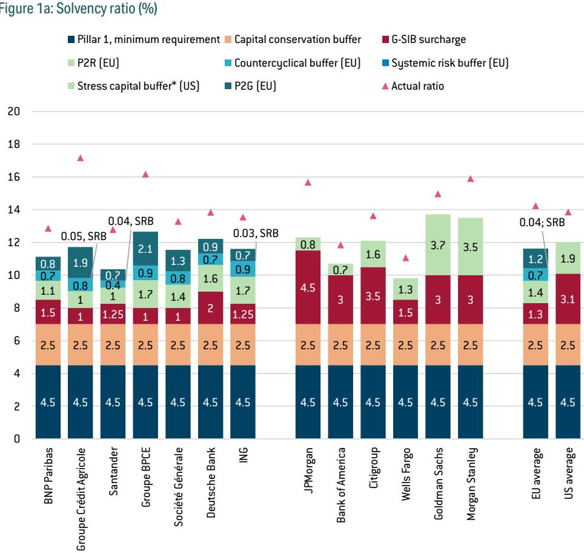
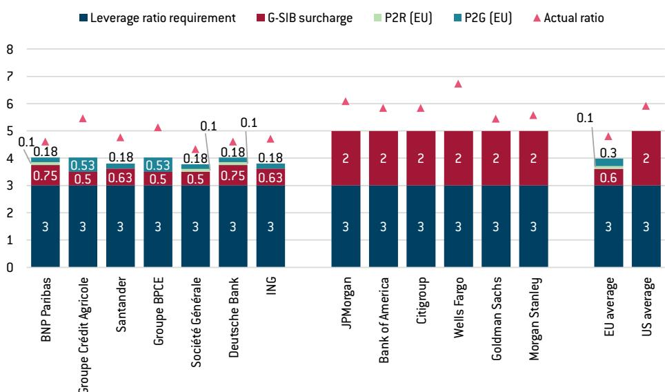
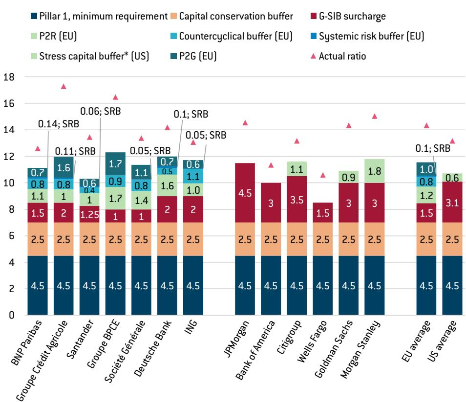
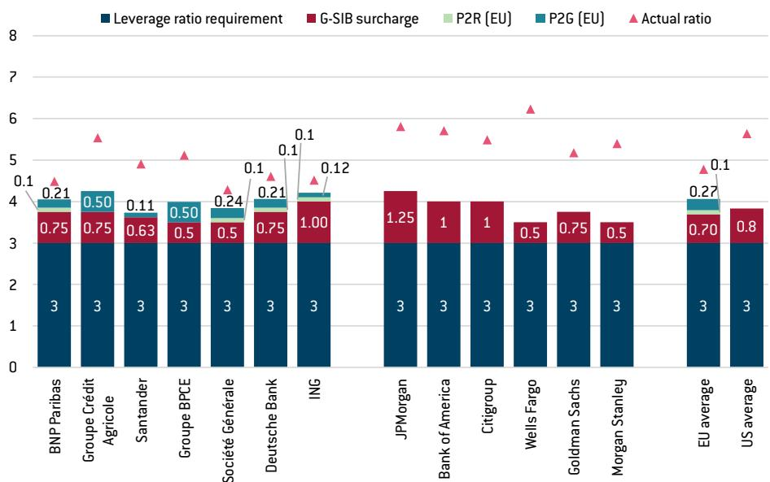

# European Union capital requirements on megabanks: the low road or the high road

Juan Mejino-López and Nicolas Véron

In the second half of 2026, banking issues are expected to gain prominence within the broader European Union Savings and Investments Union (SIU) project, in parallel with continued discussions on capital-markets reform. We focus on capital requirements on the very largest banks, or megabanks. We consider these in their historical context and compared to similar banks in the United States, the EU's main peer banking jurisdiction. We find that, at end-2024, requirements on US megabanks were generally stricter than requirements on EU megabanks and the minimum levels under the Basel Framework, in line with longstanding US practice.

We also find a marked change by end-2025 under the second Trump administration, erasing much of the prior discrepancy between EU and US requirements. Even so, at this point the US is not actually undercutting EU requirements and is therefore not creating crippling competitive pressures for EU megabanks. Furthermore, some current US banking-sector policies are reckless, following a 'low road' of deregulation and de-supervision that increases systemic risk rather than long-term competitiveness.

History suggests that low roads lead to ruin. EU policymakers must instead address lingering EU banking policy fragmentation, even within the euro area, and tackle the roots of current complexity in capital requirements and in banking regulation more generally. Building on the successes of integrated euro-area microprudential bank supervision, the EU should aim at similar integration of macroprudential bank policy and crisis response, while more consistently supporting the Basel Framework to help mitigate future international systemic shocks.

Juan Mejino-López is a former Research Analyst at Bruegel
Nicolas Véron (nicolas.veron@bruegel.org) is a Senior Fellow at Bruegel

## Contents

1 Capital requirements on megabanks within EU banking policy 3
2 Capital requirements on megabanks in the EU and US up to 2025 8
3 The US takes the low road 14
4 The EU's high road to competitiveness: maintain capital requirements in line with Basel and end internal banking policy fragmentation 19
References 23
Appendix: The prudential policy framework and 'capital stacks' 26
A1 Definitions and summary of EU and US arrangements 26
A2 Capital stacks in the EU and US 30

For their substantial feedback, the authors thank Valerio Bachetti, Ravi Balakrishnan, Jesper Berg, Sylvain Broyer, Claudia Buch, Fredrik Bystedt, Christopher Cant, Jacopo Carmassi, Ali Cavalla, Nicolas Charnay, James Chew, Rebecca Christie, Linas Čiapas, Tom Dechaene, Sharon Donnery, Édouard Fernandez-Bollo, Andrea Filtri, Hans Geeroms, Michael Gibson, Martin Gruenberg, Patrick Honohan, Stefan Ingves, Daniel Kapp, Christine Sif Fuchs Larsen, Katja Lautar, Álvaro López Barceló, Ivo Maes, Cyprien Milea, Robert Ophèle, Cosimo Pacciani, Peter Palus, Laura Parisi, Birger Buchhave Poulsen, Peter Praet, Massimiliano Rimarchi, Eoin Sheanon, Graham Steele, Katja Taipalus, Jukka Topi, Ángel Ubide, Harald Waiglein, Guntram Wolff, and Ianna Georgieva Yordanova. Adam Posen and Jeromin Zettelmeyer are thanked for their encouragement and support. Opinions expressed are the authors' alone.

# 1 Capital requirements on megabanks within EU banking policy

Banking-sector reform is coming back onto the European Union agenda, after a few comparatively quiet years. The EU faces several interrelated challenges, including the lingering fragmentation of the EU banking policy framework along national lines; fragilities and inefficiencies resulting from the incompleteness of the euro area's banking union; and the generally excessive complexity of its prudential framework, shaped by multiple rounds of reforms.

Simultaneously, some banking-sector advocates push for lower capital requirements. While such discourse echoes many previous episodes, it has reached a high level of intensity, which some advocates imply is justified by competitive pressures from the United States.

The European Commission plans a new phase of debates and negotiations with a report on the state of the EU banking system, expected in mid-July 2026. Legislative proposals are expected in early 2027, with the aim of finalising the corresponding acts by the end of the current EU term, in spring 2029.

The requirement for the Commission to produce the banking competitiveness report was stipulated in the last round of bank capital legislation in 2024, with a deadline then set at late-2028 $^{1}$ . In its March 2025 communication on Savings and Investments Union (SIU), the Commission brought that deadline forward two years (European Commission, 2025). It has also made it increasingly explicit that the report will include an effort to revive the goal of completing the banking union, namely the ambitious reform project initiated in mid-2012 and memorably defined then as the “imperative to break the vicious circle between banks and sovereigns” $^{2}$ .

In this context, this paper surveys the evolving transatlantic landscape and makes recommendations for policy priorities. We first explain our focus, including our definition of megabanks, and how it fits within the broader current agenda of EU banking policy reform. Section 2 summarises how EU capital requirements have compared with the global reference standards (the Basel Framework) and the US benchmark, up to the end of the Biden administration. Section 3 summarises and assesses ongoing US banking sector policy changes under the second Trump administration. Section 4 describes policy trade-offs and formulates recommendations for EU decisions to come.

Banking policy is a high-jargon area. Some key concepts and expressions are explained in the appendix.

## 1.1 The EU banking policy agenda

The challenges faced by EU banking policymakers boil down to three interrelated themes, all of which may be covered in some form in the European Commission report expected in mid-July 2026 $^{3}$ .

1. Completing the banking union is the most important and arguably most contentious item. As defined by euro-area leaders in 2012, that means phasing out the bank-sovereign nexus in the euro area. For it to happen, the crisis-response framework (including bank resolution, deposit insurance, and any liquidity or solvency support that might be required under crisis circumstances) must be integrated at the euro-area level, which will in turn allow the elimination of current practices by member states of ringfencing bank capital and liquidity ('home-host issues') that prevent the emergence of a genuine internal market for banking services. To prevent the corresponding risk-pooling from being subverted by national governments to unduly facilitate their own borrowing, the creation of a European bank crisis-response framework must be complemented with capital surcharges that deter excessively concentrated domestic sovereign exposures $^{4}$ .

2. Streamlining capital requirements comes next on the agenda, because the corresponding legislation and implementation practices have become mind-numbingly complex and call for a redesign. The terms of that redesign, however, are contested. Many banking-sector advocates view it as an opportunity to lower capital requirements, a matter in which they generally have a direct financial interest. European authorities, by contrast, have emphasised "simplification without deregulation", asserting that overall levels of capital (and other loss-absorbency) requirements should be broadly maintained, but that the complexity involved in their setting must be reduced (eg ECB, 2025b).

3. Other simplification initiatives are often invoked as an imperative, but also frequently left vague by advocates. A debate has developed about the incentives of the three main European authorities with competence over the banking sector. These are the European Central Bank (ECB), which plays the central role in the Single Supervisory Mechanism (SSM) that covers all euro-area banks; the Single

Resolution Board (SRB), entrusted with critical decisions in case of failure of any of the larger euro-area banks; and the European Banking Authority (EBA), which supports regulatory decision-making by the European Commission, among other tasks $^{5}$ . The simplification agenda might also be extended to areas of banking-sector policy that do not pertain directly to the prudential framework, such as financial consumer protection.

## 1.2 A focus on megabanks

This paper does not aim to cover the entire EU banking reform agenda as sketched above. Instead, it focuses on a part of it for which we identify an urgent need for fact-based input: capital requirements $^{6}$ on megabanks and specifically the EU-US comparison in terms of group-level requirements.

There are two main reasons for this choice. First, megabanks account for the bulk of direct transatlantic activity and transatlantic bank-level competition. For example, as of mid-2025, the seven EU megabanks (as defined below) together represented 66 percent of aggregate assets of all affiliates of EU banks in the US $^{7}$ . Therefore, arguments about a transatlantic regulatory 'level playing field' resonate for these banks much more than for others. Second, megabanks are highly vocal and have generally privileged access to political leaders and policymakers, so they collectively set many of the terms of public debates about banking on both sides of the Atlantic $^{8}$ .

We define megabanks as those that are systemically important on a global level and hold above a trillion in total assets, measured respectively in US dollars for US banks and in euros for EU banks $^{9}$ . Our definition of global systemic importance is a bank's designation as a Global Systemically Important Bank (GSIB) by the Financial Stability Board (FSB) $^{10}$ . Megabanks are thus defined as a subset of GSIBs, which in turn are a subset of the 'large internationally active banks' for which the set of international

Megabanks
collectively set
many of the terms
of public debates
about banking on
both sides of the
Atlantic

prudential standards known as the Basel Framework (set by the Basel Committee on Banking Supervision, see appendix) is specifically intended $^{11}$ .

Based on these definitions, there are currently seven megabanks in the EU. By decreasing order of total assets, these are: BNP Paribas, Crédit Agricole, Santander, BPCE, Société Générale, Deutsche Bank and ING $^{12}$ . In the US, there are six: JPMorgan Chase, Bank of America, Citigroup, Wells Fargo, Goldman Sachs and Morgan Stanley $^{13}$ . Banks that are large but not megabanks, of which there are significantly more in the EU than in the US $^{14}$ , typically do not compete head-on with peers across the Atlantic $^{15}$ .

## 1.3 The rest of the agenda

In choosing our focus, we consciously skip discussions on important policy matters that include:

• Systemic risk associated with non-bank financial institutions $^{16}$ ;

\- Other components of the bank prudential framework than capital requirements, such as liquidity and resolvability requirements, stress testing, or reporting obligations;

\- Jurisdictions other than the EU and US, some of which play significant roles in the

11 The Basel Committee has never provided a precise definition of what it views as a large internationally active bank, leaving the determination to each individual jurisdiction. The US has always adopted a restrictive interpretation and imposed the Basel Framework only on its very largest banks, excluding some banks that might be considered large and internationally active on common-sense criteria. For example, Silicon Valley Bank, which at the time of its failure in March 2023 was among the top twenty US banks by assets and had an active subsidiary in the UK, was largely exempted from the Basel Framework under US rules.

12 Our megabank definition thus includes all seven EU GSIBs. It excludes Crédit Mutuel, which has total assets above €1 trillion but has never been designated as a GSIB and encompasses several subgroups that operate largely independently from each other. Germany's two large IPS-bound banking networks, the Sparkassen-Finanzgruppe and the German Cooperative Banking Group, would both be above the trillion-euro assets threshold if considered on a consolidated basis, but are not treated as integrated groups in the EU prudential framework and therefore not included in our definition of megabanks.

13 Our megabank definition thus includes six of the eight US GSIBs. It excludes BNY and State Street, which are designated as GSIBs mainly for their specialised roles as global custodians, but which have significantly smaller assets, respectively \$416 billion and \$353 billion (at end-2024 per The Banker).

14 Again using The Banker database at end-2024, we count 11 non-megabank EU banks with assets above \$500 billion (by decreasing order of total assets: Credit Mutuel, Intesa Sanpaolo, UniCredit, BBVA, La Banque Postale, DZ Bank, CaixaBank, Rabobank, Nordea, Commerzbank and Danske Bank) against only three US groups in the same range (US Bank, PNC and Truist).

15 In addition to the EU GSIBs, six EU banks reported sizeable US assets in the \$30 billion to \$70 billion range as of mid-2025 (BBVA, Commerzbank, Handelsbanken, LBBW, Rabobank and SEB; see footnote 7). Much of these exposures, however, may be presumed to be related to their provision of global services to EU-based corporate clients. Of the three above-listed mid-sized US banks, PNC and Truist have no subsidiary in the EU; US Bank has an Irish subsidiary with less than €30 billion in total assets.

16 While non-bank financial institutions can plainly contribute to systemic risk, the US regional banking crisis of March 2023 was a reminder that systemic financial instability is often associated with banking-sector fragility. We would include US credit unions (technically non-banks) in our descriptive scope in the US, because of their economic similarity with cooperative banks in the EU, but there are no mega-entities in that category. Until 2008, broker-dealers in the US were another non-bank segment too important to ignore for the purposes of systemic risk analysis, but in that year the largest broker-dealers either disappeared as stand-alone entities (Bear Stearns, Lehman Brothers, Merrill Lynch) or became banks (Goldman Sachs, Morgan Stanley). Our analysis leaves aside government-guaranteed non-banks such as Fannie Mae and Freddie Mac in the US, and KfW, Caisse des Dépôts or Cassa Depositi e Prestiti in the EU, for which (not unlike Chinese megabanks) capital requirements are less critical given the explicit public sponsorship. We similarly leave aside crypto-asset service providers and non-bank stablecoin issuers, whose significance from a systemic risk perspective remains limited.

global financial system $^{17}$ ;

\- Banks other than megabanks, which play important roles in credit intermediation but typically do not directly compete on a transatlantic basis;

\- Capital requirements at the sub-group entity level, eg on deposit-taking subsidiaries of megabank groups $^{18}$ .

The fourth of the above points includes what US parlance generally refers to as tailoring and the EU as proportionality, namely the differentiation of prudential requirements based on a bank's size and systemic importance. In the EU, these debates are more complex because, unlike in the US, most small banks participate in mutual support arrangements such as institutional protection schemes (IPSs), raising distinct considerations about systemic risk. The prominence of IPSs in a few EU countries, including Germany, is the main reason why the EU has always chosen to apply the Basel Framework to all banks, instead of adopting a form of tailoring as most other jurisdictions do. While this situation may not be optimal, we view it as unlikely to change significantly in the near future $^{19}$ .

Recommendations on completing the banking union, formulated in Véron (2024), are not repeated here. As for the issue of tweaking the mandates of the EBA, ECB and/or SRB to make them more competitiveness-friendly, the arguments in favour are not compelling. The ECB, in its banking supervisory capacity, is a pure supervisor with no rulemaking authority $^{20}$ , the EBA's role in rulemaking is essentially advisory $^{21}$ and the SRB similarly is not a stand-alone rule maker. Balancing the potentially competing considerations of systemic risk and competitiveness involved in the regulatory process is ultimately a task for the European Commission and EU co-legislators (the European Parliament and Council), which already have the appropriate mandates. Advocates of changing the mandates generally take inspiration from US practice and/or from recent reforms of the United Kingdom's Prudential Regulation Authority. But the latter has been granted independent rule-making authority only since Brexit, and US federal authorities have had such authority for a long time under Congressional scrutiny. These references are thus unsuited to the EU context, where regulation and supervision are entrusted to separate entities.

As also mentioned above, our choice of focus leaves aside considerations about the bank resolvability framework, which has become a significant driver of regulatory complexity for EU banks. Ultimately, these concerns are best addressed within a broader effort of completing the banking union. They also have less direct impact on the economics of banking business than the capital framework that is our focus here, and for that reason are not raised as intensely by banking sector advocates.

## 2 Capital requirements on megabanks in the EU and US up to 2025

This section aims at a holistic transatlantic comparison, with awareness that like-for-like benchmarking is extremely difficult in practice because of different political economies, institutional legacies and even semantics. The summarised description of the main Basel Framework concepts in the appendix introduces the two key ratios, referred to hereafter respectively as the solvency ratio (Common Equity Tier-1 capital over risk-weighted assets) $^{22}$ and the leverage ratio (Tier-1 capital over non-risk-weighted assets).

## 2.1 EU and US compliance with the Basel Framework until 2025

The original Basel I accord (1988), developed partly because of US concerns about competition from Japanese banks, calibrated a minimum solvency ratio at 4 percent for Tier-1 (T1) capital and 8 percent for all capital (also including Tier-2, or T2) $^{23}$ . The next iteration or Basel II (2004) introduced greater flexibility in risk-weighting calculations, by allowing banks to use internal models as an alternative to the so-called standardised approach of Basel I.

Starting in mid-2007, the great financial crisis and subsequent euro-area crisis exposed major flaws in the Basel Framework, not least an overly complacent definition of capital and possibilities for banks to abuse the flexibility offered by internal models. In response, the Basel III accord was developed in stages, with a first major release in 2010 and the last component in 2017. The latter is often referred to in the US as the 'Basel III endgame', an expression we also adopt for the sake of concision $^{24}$ . Among many novel features, Basel III tightened the definition of capital by focusing on Common Equity Tier-1 (CET1) and raised its minimum requirement significantly; introduced a leverage ratio in addition to the solvency ratio and separate liquidity ratios; tightened consideration of market risk via the so-called Fundamental Review of the Trading Book (FRTB, finalised in its current form only in 2019); and (in the 'endgame') limited the extent to which capital requirements may be reduced by the use of internal models via a backup calculation known as the output floor.

Table 1 summarises for three dates the state of implementation by the EU and US of Pillar 1 (ie mandatory features, see appendix) of the successive Basel accords: 1995, after initial implementation of Basel I by both jurisdictions; 2007, just before the great financial crisis; and 2025, just before changes introduced by the second Trump administration. Basel II was implemented by the EU with legislation enacted in 2006, whereas the US delayed its own implementation schedule, partly out of concern that it may excessively favour large banks that use models over smaller banks that do not (Herring, 2018, p.15).

In practice, that made the EU ostensibly compliant and the US over-compliant with the Basel Framework, even though the EU complained at the time about the US reluctance to embrace Basel II $^{25}$ . The first batch of Basel III was adopted by both the EU (Regulation (EU) 575/2013, known as the first Capital Requirements Regulation or CRR1) and US, albeit with some differences in implementation: at that time in the early 2010s, the Basel Committee introduced a so-called Regulatory Consistency Assessment Programme (RCAP) to assess compliance by individual jurisdictions, and in 2014 found that the EU implementation of the Basel III solvency ratio reform was "materially noncompliant" whereas the US was "largely compliant" $^{26}$ . Later legislation (Regulation (EU) 2019/876, or CRR2) included the EU's first-time adoption of a mandatory leverage ratio, while the US opted for over-compliance with a so-called enhanced supplementary leverage ratio calibrated above the Basel minimum (see appendix). In 2024, the EU adopted further legislation (Regulation (EU) 2024/1623, or CRR3) transposing the Basel III endgame, albeit with a long period of phase-in extending to 2033, thus the mention 'ex endgame' in Table 1 for requirements applicable in 2025. The US, by contrast, has not at time of writing adopted endgame rules; that yet-to-be-implemented component is further detailed in the next section.

Table 1: Simplified overview of Pillar-1 capital requirements on megabanks in the EU and US, 1995-2025

<table><tr><td rowspan="2"></td><td colspan="2">Solvency ratio</td><td colspan="2">Leverage ratio</td></tr><tr><td>EU</td><td>US</td><td>EU</td><td>US</td></tr><tr><td>1995</td><td>Basel I</td><td>Basel I</td><td>None</td><td>Domestic</td></tr><tr><td>2007</td><td>Basel II</td><td>Basel I (over-compliant with Basel II)</td><td>None</td><td>Domestic</td></tr><tr><td>2025</td><td>Basel III (ex endgame) with deviations</td><td>Basel III (ex endgame)</td><td>Basel III</td><td>Over-compliant with Basel III</td></tr></table>

Source: Bruegel.

The upshot is that, by and large until the end of the Biden administration, US requirements on megabanks were generally over-compliant with the Basel Framework (gold-plating in industry jargon), while EU requirements have been generally under-compliant to just compliant, depending on the specific time and issue considered.

Comparative EU under-compliance with the Basel Framework is ironic, because EU countries have always been collectively overrepresented in Basel Committee membership $^{27}$ . Thus, arguments that the Basel Framework is structurally tilted against EU banks, occasionally made by some EU banking-sector advocates, are implausible $^{28}$ . What is true, however, is that EU banks – including megabanks – have generally had to make great efforts to adjust to banking policy reforms in the last 15 years, primarily because their starting point was so low. For example, EU banks have had to comply with the Basel-defined leverage ratio since 2021, whereas US banks have been exposed to leverage requirements for decades. From 2016 to 2023, EU banks had to contribute to the establishment of the euro area's Single Resolution Fund (€81 billion in aggregate levies, including those paid by non-megabanks). In multiple EU countries, they simultaneously had to provide the financial resources for the transition from unfunded to pre-funded national deposit guarantee schemes $^{29}$ . That said, US banks also had to pay for the replenishment of the Federal Deposit Insurance Corporation's (FDIC) Deposit Insurance Fund after its near-depletion in 2008-2009, and again after its use in the regional banking crisis of March 2023.

27 Since 2014, 13 of the Basel Committee's 45 full members, or 28 percent of the total, have been institutions based in the EU (11 in the euro area), against only four from the US and two from China, the world's largest banking jurisdiction. The 28 jurisdictions represented on the Committee include the EU (represented by both the ECB and its bank supervisory arm) and no fewer than seven euro-area countries (Belgium, France, Germany, Italy, Luxembourg, the Netherlands and Spain) plus Sweden (in the EU but outside the euro area).
28 To be sure, banks in different jurisdictions face different environmental conditions such as taxation, labour-market constraints, housing finance frameworks, etc. Global prudential standards, by definition, must be agnostic relative to these. The US government sponsorship of Fannie Mae and Freddie Max, two giant financial enterprises that buy mortgages from banks, is one prominent such jurisdiction-specific policy choice that is alleged by some EU banking-sector advocates to represent a competitive distortion with reference to the Basel framework. But there is no shortage of policy quirks in the EU itself.

29 These can be tracked on a country-by-country basis on the EBA website: see EBA, 'Deposit Guarantee Schemes data', https://www.eba.europa.eu/activities/single-rulebook/regulatory-activities/depositor-protection/deposit-guarantee-schemes-data.

## 2.2 Compared capital requirements and levels at end-2024

Figure 1 summarises the capital requirements (vertical bars) and actual capital levels (triangles) for EU and US megabanks as defined above, observed at end-2024 and applicable in 2025. Figure 1a is about solvency ratio requirements, and Figure 1b is about leverage ratio requirements. The various components of the respective 'capital stacks' are detailed in the appendix. For EU banks, the P2G component is our estimate and probably differs from the actual values, which are not publicly disclosed (details also in appendix). The two bars on the right show unweighted averages for the respective samples of EU and US megabanks. The chart also indicates that actual observed ratios are always above the minimum requirements (each triangle is above the corresponding vertical bar); the difference is sometimes referred to as 'capital headroom'.

We find that, considered without retreatments, minimum solvency ratio requirements on US megabanks at end-2024 were slightly higher on average than those on EU megabanks, albeit not by much and with less capital headroom resulting in marginally lower actual solvency ratios on the US side. That comparison is not like-for-like, however, given generally more permissive EU risk-weighting practices, as mentioned above. Thus, and as further observed below in this section, the chart's averages for EU and US megabanks (right-hand bars) underestimate the extent to which solvency ratio requirements and levels were higher on the US than the EU side. As for the leverage ratio comparison, we observe significantly higher requirements and actual levels on the US side at end-2024. That comparison, by contrast to the solvency ratio, can be viewed as broadly like-for-like.

Our findings are in line with the holistic assessment of Basel compliance summarised in Table 1, and justify scepticism about claims of more lenient past US policies put forward by some EU banking sector advocates, at least for the megabanks. Our findings also echo more in-depth analysis by prudential authorities, keeping in mind that even for these, a truly like-for-like comparison remains elusive $^{30}$ :

\- In the early 2010s, Thomas Hoenig, by then chair of the US FDIC, attempted a comparison of leverage ratios using harmonised definitions on a sample of eight US and 16 non-US banks, including all those we label megabanks. For the latter, Hoenig's calculations yielded an average of 3.0 percent for the seven EU megabanks and 4.1 percent for the six US megabanks, as of end-2012 (Attachment 2 in Hoenig, 2013, and authors' calculations) $^{31}$ .

\- In 2025, the Bank of England Financial Policy Committee compared solvency ratio requirements for samples of, respectively, 14 UK banks, 109 in the euro area and 19 in the US, including all the respective GSIBs; using end-2024 numbers, they found weighted averages somewhat higher in the US (9.8 percent) than in the euro area (9.0 percent) and the UK (8.7 percent) (BoE, 2025, p.30). Unlike Hoenig, the BoE study did not detail bank-level data.

Figure 1: Minimum requirements and observed levels, EU/US megabanks, end-2024  
Figure 1a: Solvency ratio (%)  

Figure 1b: Leverage ratio (%)  
  
Sources and notes: see appendix. (\*) In the US stack the ‘stress capital buffer’ in the chart actually refers to any part of that buffer that comes on top of the capital conservation buffer.

\- ECB researchers, looking at a sample of 26 large euro-area banks including all seven GSIBs, found that the application of US policies would increase their capital requirements by around 8.5 percent (average), with quartile limits respectively at around 2 percent and around 17.5 percent (Dzezulskis et al, 2026, Figure 14 on p.37). The ECB also does not provide further intra-sample details. If one assumes that GSIBs (seven out of 26) are all in the quartile of highest EU-US differences, that would imply all EU megabanks would incur capital requirements at least 17.5 percent higher if US requirements applied $^{32}$ .

Comparative research by independent private-sector analysts, with no access to non-public supervisory information, generally also finds somewhat higher past capital ratios for US than EU megabanks on an attempted like-for-like basis $^{33}$ .

Going further back, we estimate that similar or even larger discrepancies also existed in earlier years, probably going all the way back to the EU implementation of Basel II in the 2000s $^{34}$ .

It is important to emphasise how much the choice of sample influences such findings and that our findings on megabanks are not to be extrapolated beyond that category. Among non-megabank significant institutions (above €30 billion total assets) in the EU, observed solvency ratio levels were generally significantly higher than for their US peers at end-2024, as they were in previous years. Such mid-to-large banks also rely less on internal models than the megabanks, implying generally less discrepancy with US solvency ratio requirements. Observed leverage ratios, by contrast, were higher in the US also for those mid-to-large banks (Mejino-López and Véron, 2025, pp.30-31) $^{35}$ .

32 Somewhat similarly, Cant et al (2026, p.4) noted with reference to the ECB research: "we presume that [EU] G-SIBs specifically may have been calculated to have a higher delta than for Category I & II overall [the full sample of 26 banks], but that this data was removed from the final draft". Sensitivities about publishing that result are not new: the 2026 paper updated research that the ECB conducted in 2022-2023, but chose not to publish at the time. It was reported that according to that ECB research, "for the biggest EU banks, the application of US rules would increase their minimum capital levels by a double-digit percentage": see Martin Arnold, 'ECB split over report showing big EU banks' capital requirements lower than US rivals', Financial Times, 18 November 2024, https://www.ft.com/content/48f84e00-836d-4659-9d78-60ababfa83ed. In a public reference to the same research, the ECB's then supervision head noted less specifically that "requirements would be significantly higher for the European G-SIBs" (Enria, 2023).

33 For example, S&P Global Ratings use a standardised methodology to compare banks' 'risk-adjusted capital' on a global basis. Their findings indicate an average of that ratio at 10.28 percent for US megabanks and 9.9 percent (4 percent lower) for EU megabanks at end-2024 (authors' calculations based on Albrecht and El Mrabet, 2025). Cant et al (2026) noted that the EU-US discrepancy is likely to be reversed in the near future.

34 See eg ECB (2007), Chart A.1 for 1991-2004. Bayoumi (2017) detailed the drivers of European banks' balance-sheet expansion without proportional capital strengthening in the two decades leading to the great financial crisis.

35 The latter findings are about observed capital levels, not about minimum regulatory requirements, for which we have been unable to find comparable bank-level data for this scope of medium-sized banks.

## 3 The US takes the low road

Actions taken up to time of writing by the second Trump administration mark a radical shift in US banking sector policy. While there have been multiple cycles during that policy's long history, the speed of change since January 2025 is arguably without equivalent outside of systemic crises. The new direction is one of deregulation, understood as loosening of the rules that apply to banks, and de-supervision, or reduction of the administrative capacity of public authorities to enforce the applicable rulebook. This de-supervision affects key federal agencies such as the Federal Reserve Board (FRB), the Office of the Comptroller of the Currency (OCC), FDIC and the Consumer Financial Protection Bureau (CFPB). Furthermore, banking deregulation and de-supervision take place in a context of broader erosion of the public institutions that support the US financial system, including the judicial system, constitutional checks on executive arbitrariness and norms of behaviour, such as the avoidance of conflicts of interest. In the following summary, we focus on the aspects of these developments that most affect megabanks.

## 3.1 Bank deregulation

US Treasury Secretary Scott Bessent has been explicit about the administration's intent of "responsibly deregulating the financial sector" and "re-leveraging the private sector" $^{36}$ . Specifically on bank capital, he has argued: "Outdated capital requirements on some exposures are misaligned with actual risk, imposing unnecessary burdens on financial institutions" $^{37}$ . In line with this political direction, relevant US agencies have taken several initiatives that have resulted in reduced capital requirements for US megabanks $^{38}$ . Three such initiatives stand out:

\- Changes in stress-testing scenarios and methodology, resulting in generally lower stress capital buffers $^{39}$ ;

\- A significant reduction in the enhanced supplementary leverage ratio requirement $^{40}$ ;

36 See U.S. Department of the Treasury, Secretary Statements and Remarks of 6 March 2025, 'Treasury Secretary Scott Bessent Remarks at the Economic Club of New York', https://home.treasury.gov/news/press-releases/sb0045.

37 See U.S. Department of the Treasury, Secretary Statements and Remarks of 21 July 2025, 'Treasury Secretary Scott Bessent Remarks at the Federal Reserve Capital Conference', https://home.treasury.gov/news/press-releases/sb0202.

38 In line with our focus, we leave aside here the impact of recent deregulatory decisions on US banks (and credit unions) other than megabanks.

39 This includes changes that affected the 2025 stress testing round (reflected in Figure 2) and proposals for further changes that would affect future rounds; see Federal Reserve Board press release of 24 October 2025, 'Federal Reserve Board requests comment on proposals to enhance the transparency and public accountability of its annual stress test', https://www.federalreserve.gov/newsevents/pressreleases/bcreg20251024a.htm.

40 See FRB, OCC and FDIC press release of 25 November 2025, 'Agencies issue final rule to modify certain regulatory capital standards', https://www.federalreserve.gov/newsevents/pressreleases/bcreg20251125b.htm. See appendix for details.

\- Implementation of the Basel III endgame that is expected to result in decreased minimum solvency ratio requirements, combined with changes in the calculation of the capital surcharges on US GSIBs $^{41}$ .

The latter set of new rules has not been finalised at time of writing, thus the analysis presented here is based on the proposed document released for comment in March 2026. Based on past experience, it is likely that the final rules will differ somewhat from the draft issued in March, probably with somewhat lower requirements than initially proposed.

The first two of the three above-mentioned points have already had observable impacts on capital requirements.

Figure 2 updates the findings of Figure 1 by showing the same metrics one year later: minimum requirements for 2026 and observed levels at end-2025. Two changes stand out. First, in terms of solvency ratios, stress capital buffers have gone down markedly for all US megabanks, resulting in a somewhat lower minimum requirement on the average US megabank than in the EU – even though there was a slight decrease in EU levels as well, and the previously-mentioned difference between EU and US risk-weighting practices means that US requirements may remain above those in the EU on a like-for-like basis. Second, the minimum leverage ratios are no longer higher in the US than in the EU; they are even slightly lower. It is likely that the new rules currently being discussed will lead to further slight decreases in capital requirements on US megabanks in the next years.

Other recent US deregulatory moves are less sweeping but also affect the environment for megabanks. For example, in July 2025 the FRB, OCC and FDIC allowed for reduced transparency on borrower distress, following a change in US accounting standards $^{42}$ . In November 2025, the OCC and FDIC lifted constraints on leveraged lending that were adopted in 2013 in the wake of the great financial crisis $^{43}$ .

41 See FRB, OCC and FDIC press release of 19 March 2026, 'Agencies request comment on proposals to modernize the regulatory capital framework and maintain the strength of the banking system', https://www.federalreserve.gov/newsevents/pressreleases/bcreg20260319a.htm. These proposals replaced an earlier release in July 2023 under the Biden administration for the implementation of the Basel III endgame, which had generated unusually intense public backlash from the US banking industry: see FRB, OCC and FDIC press release of 27 July 2023, 'Agencies request comment on proposed rules to strengthen capital requirements for large banks', https://www.federalreserve.gov/newsevents/pressreleases/bcreg20230727a.htm, and Austin Anton, 'New BPI Ad Campaign Encourages Americans to Demand Accountability from Regulators for Higher Loan Prices', Bank Policy Institute, 5 September 2023, https://bpi.com/new-bpi-ad-campaign-encourages-americans-to-demand-accountability-from-regulators-for-higher-loan-prices/.
42 See FDIC Call Reports and Other FFIEC Related Forms and Reports of 11 July 2025, 'Revisions to the Consolidated Reports of Condition & Income (Call Reports) & the FFIEC 002 Report', https://www.fdic.gov/news/financial-institution-letters/2025/revisions-consolidated-reports-condition-income-call, and Joshua Franklin, 'US banks could hide troubled loans under new reporting rules', Financial Times, 3 September 2025, https://www.ft.com/content/8ee34ef9-bc80-4d09-aafc-cf29bff58595.

43 See FDIC press release of 5 December 2025, 'Interagency Statement on OCC and FDIC Withdrawal from the Interagency Leveraged Lending Guidance Issuances', https://www.fdic.gov/news/press-releases/2025/interagency-statement-occ-and-fdic-withdrawal-interagency-leveraged; see also Martin Arnold and Eric Platt, 'US watchdogs drop post-crisis safeguard on risky lending', Financial Times, 5 December 2025, https://www.ft.com/content/1e089ea7-0011-4efe-b795-867664d26dfb.

Figure 2: Minimum requirements and observed levels, EU/US megabanks, end-2025  
Figure 2a: Solvency ratio (%)  

Figure 2b: Leverage ratio (%)  
  
Sources and notes: see appendix. (\*) In the US stack the 'stress capital buffer' in the chart actually refers to any part of that buffer that comes on top of the capital conservation buffer.

Overall, the Trump administration's deregulatory initiatives put an end to the longstanding pattern of US regulatory capital requirements on megabanks that go beyond those stipulated by the Basel accord, let alone implemented in the EU. In colloquial terms, the US is no longer gold-plating on the Basel Framework, for the first time since the publication of Basel I $^{44}$ .

## 3.2 Bank de-supervision

Possibly even more impactful for megabanks than the above-described deregulatory changes, the supervisory capacity of US federal banking authorities is being sharply reduced, in both quantitative and qualitative terms.

Under the leadership of Vice Chair for Supervision Michelle Bowman, the Federal Reserve has announced a headcount reduction in its Division of Supervision and Regulation by about 30 percent, from 500 to 350 $^{45}$ . The OCC has signalled an intent to cut its headcount by about a third $^{46}$ , and the FDIC has cut theirs by about 20 percent, from about 6,300 to 5,000 $^{47}$ . At the National Credit Union Administration, the staff reduction in 2026 vs. 2025 is 23 percent $^{48}$ . At the CFPB, the ongoing staff reduction exceeds two-thirds $^{49}$ .

It is hard, of course, to determine the optimal headcount (and pay levels) for a bank supervisor. It may be noted that the FDIC invoked insufficient resources in its report on its failure to prevent the collapse of Signature Bank in March 2023 (FDIC, 2023); this could, however, have been at least partly self-serving. Even assuming that there was slack in the system, the speed at which the downsizing is taking place entails a significant loss of institutional memory: numerous experienced specialists left the agencies in 2025 and early 2026, many with hard-to-replace skills. In past cycles of US banking policy deregulation, there had not been any such reduction of supervisory capacity.

Advocates of staff cuts argue that the agencies had become bloated and that their downsizing will not do any harm. The downsizing, however, is part of a broader pattern of impairing supervisory effectiveness. The independence of US supervisors is being sharply reduced in the wake of Executive Order 14215 of 24 February 2025, which places all federal agencies (including the Federal Reserve in its regulatory and supervisory roles) under direct control of the executive branch, including in principle for individual supervisory decisions and sharing of confidential supervisory information. Meanwhile, the Federal Reserve has adopted a new supervisory stance that deters examiners from looking for weaknesses in governance and risk management if these have not already resulted in significant financial losses (Gruenberg, 2026, pp.14-18). In November 2025, Federal Reserve Governor (and former Vice Chair for Supervision) Michael Barr referred to "the diminished focus on governance and controls, the weakening of forward-looking tools, and the constraints placed on supervisory action" in addition to the erosion of supervisory resources as factors that "undermine supervisors' ability to adequately protect against excessive risk taking" (Barr, 2025).

Even as individual agencies are being downsized, there has been no attempt by the Trump administration to rationalise the US bank supervisory architecture with its coexistence of multiple and partly overlapping authorities, which contrasts in this respect with the more streamlined Single Supervisory Mechanism in the euro area.

## 3.3 Broader institutional erosion and financial stability implications

Deregulation and de-supervision in the US have by no means been limited to the banking sector since early 2025; in multiple ways, they are even more pronounced in other building blocks of the financial system's oversight regime. For example, headcount at the US Commodity Futures Trading Commission (CFTC) has been cut by over 20 percent, leading to what has been described as a "catastrophic loss of institutional memory" $^{50}$ . At the Securities and Exchange Commission (SEC), a departing commissioner in late 2025 described a trajectory in which the "appetite to deregulate has been rapacious", also mentioning staff cuts of 15 to 20 percent (Crenshaw, 2025). The core of the SEC's mission is the protection of the integrity of US capital markets; on this count, the perception, let alone reality, of leniency towards allegations of insider trading by family or friends of the President could be particularly damaging at a structural level $^{51}$ . Similar capacity reductions have happened in US audit oversight $^{52}$ and anti-money laundering enforcement. In the latter area, fines fell by 61 percent in 2025 compared to the previous year $^{53}$ . Since most significant US banks (and all megabanks) are listed companies, the erosion of transparency and quality of governance of listed firms would also directly affect the banking sector and result in a loss of what the Basel Framework refers to as market discipline, one of the pillars of the prudential construct.

These developments are hard to disentangle from a broader trend towards erosion of the rule of law and constitutional checks and balances in the US, including the freedom of expression of financial analysts, policing of white-collar crime and absence of favouritism in government procurement, which have long been viewed as essential to the global competitiveness of the US financial system $^{54}$ .

The impact on financial stability of such trends is impossible to quantify presently. Together with the ongoing deterioration in the geopolitical environment, they can certainly be viewed as representing an increase in systemic risk, not just for the US but also globally.

# 4 The EU's high road to competitiveness: maintain capital requirements in line with Basel and end internal banking policy fragmentation

The developments in the US confront the EU with a stark choice. Some EU banking-sector advocates predictably call for the EU to follow the US, effectively advocating a similar low road of deregulation and de-supervision, though they typically do so in indirect language, such as emphasising the desirability of a 'level playing field'. However, the increase in systemic risk justifies a renewed emphasis on banking-sector resilience, to a greater degree than even two years ago when the single market and competitiveness reports by Enrico Letta (2024) and Mario Draghi (2024) were published, notwithstanding that the competitiveness imperative has not become any less urgent $^{55}$ .

To escape a false dilemma of growth vs stability, the EU should take actions it has delayed for too long: complete its unfinished banking union and, in so doing, move decisively towards the vision of a single financial market, thus freeing resources for megabanks and enhancing competitiveness.

## 4.1 Financial stability and credit availability

Financial stability analysis and policy are far from exact sciences. Financial crises tend to be rare and do not easily lend themselves to statistical analysis. Any analytical attempt faces measurement challenges, including in terms of asset accounting and quantitative risk assessment. Furthermore, some research is tainted by the possibility of conflicts of interest $^{56}$ .

The experience of practitioners can be highly valuable but is not a failsafe guide to policy either, because of the heterogeneity of cases but also because practical memories tend to erode over time, and time intervals between crises tend to be long. Awareness of earlier history is helpful, with the caveat that long-past episodes cannot be directly compared with the present, even if they offer lessons for it.

The pattern of protests from the banking industry when a tightening of capital requirements is proposed, and otherwise of advocacy in favour of easing the existing requirements, is well-established. When the first elements of Basel III were proposed in the early 2010s, some bank leaders on both sides of the Atlantic deployed considerable resources to thwart them, alleging they would cripple credit provision and economic growth $^{57}$ . With hindsight, the vicious circle that such advocates predicted clearly did not materialise (eg BCBS, 2019, 2022).

Beyond the analytical literature, the economic benefits of sufficient capital requirements have been visible on both sides of the Atlantic in recent times. Most obvious is the gain in market share and competitive position, both in Europe and globally, of US megabanks against their EU peers in the two decades to 2025 (Goodhart and Schoenmaker, 2016; Resti, 2025), a period during which, as analysed in section 2, capital requirements were generally higher for the US than the EU. To be sure, numerous factors contributed to the greater recent strength of US banks. At a minimum, the episode demonstrates that a level playing field in capital requirements is not a necessary condition for banks' competitive success. Then-FDIC chair Sheila Bair went further when arguing early in that sequence in September 2009, that "higher capital levels are a competitive strength, they're not a competitive weakness" $^{58}$ .

Another significant data point is the resilience of the EU banking sector against significant macroeconomic shocks since the post-crisis reforms entered into force in the late 2010s, including COVID-19 (admittedly with the help of massive fiscal intervention), the Ukrainian war and energy shock of 2022, and the tariff shock and geopolitical turmoil of 2025.

Higher capital requirements, it seems, have delivered tangible outcomes, especially when compared to banking-sector fragility in the EU during previous cycles. There is no current or recent evidence of broad-based scarcity of bank credit in the EU. Lower capital requirements are likely to benefit overwhelmingly the banks' shareholders, via higher dividends and stock buybacks, with no tangible benefits for the economy as a whole. That is indeed exactly what appears to be happening now in the US, as a result of ongoing deregulation and de-supervision $^{59}$ .

## 4.2 Basel compliance and competition between megabanks

Another consideration for EU policymakers is the preservation of the Basel Framework as a global reference for prudential policy. Some EU banking-sector advocates imply that the EU should abandon compliance with Basel, because the US is doing so and continued adherence to the international framework would be crippling. Such a discourse is a misrepresentation of reality.

As previously mentioned, compliance with the early phase of Basel III implementation for megabanks has been generally spottier on the EU than on the US side. As for the endgame, no in-depth compliance assessment has been undertaken yet, and the Basel Committee's Regulatory Consistency Assessment Programme (RCAP) reports on the EU and US solvency ratio requirements are not expected until 2029 $^{60}$ .

Currently, it appears likely that neither the EU nor the US will be found fully compliant, but the extent of their deviation from the Basel Framework is debatable. US megabanks find advantage in being viewed by global investors as Basel-compliant, and have not pushed for a radical US departure from the Basel Framework, even under an administration that is generally unfriendly to global standards. As noted above, US proposals under the second Trump administration put an end to a long era of over-compliance, but they don't amount to outright noncompliance, even though there appear to be significant deviations on the consideration of operational risk and market risk, namely the Fundamental Review of the Trading Book (FRTB). As for credit risk, US proposals do not explicitly refer to the Basel concept of output floor, but are widely viewed as ensuring a level of requirements that is at least equivalent.

The EU's own implementation of the endgame, as enshrined in the CRR3 legislation of 2024, maintains some of the earlier EU features that shaped the 2014 RCAP assessment of material non-compliance, and adds delays in implementing the output floor (Mazzocchi and Spitzer, 2025; Dzezulskis et al, 2026). As for the FRTB, which shapes the area of most direct competition between EU and US megabanks, namely wholesale banking and trading, the EU has opted for a prolonged implementation delay, as has the UK $^{61}$ . That delay, while unfortunate, appears justifiable given the direct competitive impact. The best option on that front may be for the Basel Committee to initiate a new round of FRTB renegotiation.

Aside from the FRTB point, the EU should maintain the implementation of the rest of Basel III in line with CRR3, and should resist calls for further delays, such as freezing the output floor at a low level, as has been advocated by some banking industry representatives $^{62}$ . Conversely, overt EU noncompliance would certainly impair the Basel Framework's global reference status. At a broader level, the EU should also start a candid reflection about phasing out the redundant membership of individual euro-area countries within the Basel Committee $^{63}$ . Addressing that anachronistic legacy would bolster the legitimacy of the Basel Framework, not least in countries outside the rich North Atlantic region, and ultimately serve the EU's strategic goals.

## 4.3 The high road forward: ending EU banking-policy fragmentation

Rather than emulating reckless US policies or departing from the Basel Framework, the EU should boost its banking sector's competitiveness by addressing its banking-policy fragmentation problem – the root cause of international comparative disadvantage that burdens EU banks. The first phase of banking union, with the establishment of the SSM, is a success to build on. It is time for the EU to finish that work.

The unfinished pieces span macroprudential supervision and policy (see appendix for definitions), crisis response and conduct-of-business regulation and supervision of banks. Those with a direct impact on capital requirements and their current disorienting 'buffer salad' are macroprudential and crisis response. Specifically, the fragmentation of macroprudential authority between the national and EU levels is the core driver of the proliferation of capital buffers in the EU, as illustrated on Figures 1 and 2.

The SSM should be the decision-maker for all macroprudential buffers. To be sure, it makes sense for the foreseeable future to keep country-specific buffers as part of the framework (even though it may be noted that no equivalents exist in the US), given lingering differences between the structural features of EU countries, especially their property market cycles. But the SSM has full capacity to determine those, with due consultation of national and other European authorities, and can do so more independently from political influence than the national authorities currently in charge. That would ensure consistency across euro-area countries and with the SSM's own microprudential supervision.

An integrated crisis-response framework would entail an overhaul of the bank-resolution process, deposit insurance, liquidity assistance and the regulatory treatment of banks' sovereign exposures, as briefly mentioned above and further detailed in Véron (2024) $^{64}$ . That reform programme, while certainly ambitious, can be achieved without treaty change and without the politically more onerous endeavour of a fiscal union in the euro area. Among many benefits, it would further support competitiveness and the single market by allowing for the elimination of country-specific ring-fencing of capital and liquidity, thus liberating 'trapped capital' within integrated European banking groups. It would thus allow European banking groups to deploy their activities seamlessly across the jurisdiction, something they are effectively prevented from doing now. By unlocking the potential for cross-border synergies, it would powerfully incentivise further cross-border banking consolidation. As the EU moves closer to fulfilling the vision of a single banking jurisdiction, its megabanks would gain a better home basis to deploy capital internationally and compete on a stronger footing with peers from around the world, including the US $^{65}$ .

The trade-off for the EU on banking policy is not between stability and growth, or between resilience and competitiveness. It is between all of these and the continued protection of entrenched interests, both in the private and public sectors. The challenging international environment facing the EU may change the calculation and tip the balance in favour of long-delayed reform.

## References

Albrecht, M. and M. El Mrabet (2025) 'Top 200 Rated Banks' Capital Ratios: In A Consolidating Phase', S&P Global Ratings, 1 October, available at https://www.spglobal.com/ratings/en/regulatory/article/top-200-rated-banks-capital-ratios-in-a-consolidating-phase-s101645547

Barr, M. (2025) 'The Case for Strong, Effective Banking Supervision', speech at the Kogod School of Business, American University, Washington DC, 18 November, available at https://www.federalreserve.gov/newsevents/speech/barr20251118a.htm

BCBS (2014) Basel III Monitoring Report, Basel Committee on Banking Supervision, available at https://www.bis.org/publ/bcbs278.pdf

BCBS (2019) 'The costs and benefits of bank capital – a review of the literature', Working Paper 37, Basel Committee on Banking Supervision, available at https://www.bis.org/bcbs/publ/wp37.pdf

BCBS (2022) Evaluation of the Impact and Efficacy of the Basel III Reforms, Basel Committee on Banking Supervision, available at https://www.bis.org/bcbs/publ/d544.pdf

Behn, M. and A. Reghezza (2025) 'Capital requirements: a pillar or a burden for bank competitiveness?' Occasional Paper Series 376, European Central Bank, available at https://www.ecb.europa.eu/pub/pdf/scpops/ecb.op376.en.pdf

BoE (2025) Financial Stability in Focus: The FPC's assessment of bank capital requirements, Financial Policy Committee, Bank of England, available at https://www.bankofengland.co.uk/financial-stability-in-focus/2025/fsif-the-fpcs-assessment-of-bank-capital-requirements

Boissay, F., C. Cantú, S. Claessens and A. Villegas (2019) "Impact of financial regulations: insights from an online repository of studies", BIS Quarterly Review, March, Bank for International Settlements, available at https://www.bis.org/publ/qtrpdf/r\_qt1903f.htm

Cant, C., L. Li and M. Evison (2026) 'Global Banks: A gaffer tape job', Autonomous Research, May

65 For the sake of brevity, these stylised recommendations for EU banking policy integration omit specific consideration of EU countries that remain outside of the euro area, a group which is in any case set to become smaller given Hungary's credible intent to adopt the euro and ongoing debates in Denmark, Romania and Sweden. Obviously, appropriate arrangements must be found for countries that retain monetary policy autonomy to keep national control over key microprudential, macroprudential and crisis-response decisions.

Choi, A.H. and J.Y. Zhang (2025) 'Creditors, Shareholders, and Losers In Between: A Failed Regulatory Experiment', Cornell Law Review 110: 27, available at https://publications.lawschool.cornell.edu/lawreview/wp-content/uploads/sites/2/2025/04/Choi-Zhang-final.pdf

Clement, P. (2010) 'The term 'macroprudential': origins and evolution', BIS Quarterly Review, March, Bank for International Settlements, available at https://www.bis.org/publ/qtrpdf/r\_qt1003h.pdf

Cline, W.R. (2017) The Right Balance for Banks: Theory and Evidence on Optimal Capital Requirements, Peterson Institute for International Economics

Crenshaw, Caroline A. (2025) 'The Rubble and the Rebuild: The Future of Financial Regulation Series at The Brookings Institution', speech, 11 December, available at https://www.sec.gov/newsroom/speeches-statements/creshaw-remarks-future-financial-regulation-series-brookings-institute-121125

CRS (2023) Bank Capital Requirements: A Primer and Policy Issues, Congressional Research Service, available at https://www.congress.gov/crs-product/R47447

Dewatripont, S., M. Montigny and G. Nguyen (2021) 'When trust is not enough: Bank resolution, SPE, Ring-fencing and group support', Working Paper 403, National Bank of Belgium, available at https://www.nbb.be/en/publications-research/publications/publications/when-trust-not-enough-bank-resolution-spe-ring

Dzezulskis, S., M. Libertucci and S. McPhilemy (2026) 'Understanding the banking sector capital framework in the European Union', Occasional Paper Series No. 387, European Central Bank, available at https://www.bankingsupervision.europa.eu/ecb/pub/pdf/ssm.other\_publications\_banking\_sector\_framework.en.pdf

ECB (2007) 'Bank capital in Europe and the US', Financial Stability Review, December, European Central Bank, available at https://www.ecb.europa.eu/pub/pdf/fsr/art/ecb.fsrart200712\_01.en.pdf

ECB (2024) Aggregated results of the 2024 SREP, European Central Bank, available at https://www.bankingsupervision.europa.eu/activities/srep/2024/html/ssm.srep202412\_aggregatedresults2024.en.html

ECB (2025a) Aggregated results of the 2025 SREP, European Central Bank, available at https://www.bankingsupervision.europa.eu/activities/srep/2025/html/ssm.srep202511\_aggregatedresults2025.en.html

ECB (2025b) Simplification of the European prudential regulatory, supervisory and reporting framework, European Central Bank, available at https://www.ecb.europa.eu/press/pubbydate/2025/html/ecb.simplification\_supervisory\_reporting\_framework202512.en.html

Enria, A. (2021) 'How can we make the most of an incomplete banking union?' speech at the Eurofi Financial Forum in Ljubljana, 9 September, available at https://www.bankingsupervision.europa.eu/press/speeches/date/2021/html/ssm.sp210909\~18c3f8d609.en.html

Enria, A. (2023) 'Banking supervision beyond capital', speech at the Eurofi Financial Forum in Santiago de Compostela, 14 September, available at https://www.bankingsupervision.europa.eu/press/speeches/date/2023/html/ssm.sp230914\~c6c0be0cc6.en.html

European Commission (2025) 'Savings and Investments Union: A Strategy to Foster Citizens' Wealth and Economic Competitiveness in the EU', COM/2025/124 final, available at https://eur-lex.europa.eu/legal-content/EN/TXT/?uri=CELEX:52025DC0124

FDIC (2023) FDIC's Supervision of Signature Bank, Financial Deposit Insurance Corporation, available at https://www.fdic.gov/news/press-releases/2023/pr23033a.pdf

FRB (2024) 'Large Bank Capital Requirements', Federal Reserve Board, August, available at https://www.federalreserve.gov/publications/files/large-bank-capital-requirements-20240828.pdf

FRB (2025) 'Large Bank Capital Requirements', Federal Reserve Board, August, available at https://www.federalreserve.gov/publications/files/large-bank-capital-requirements-20250829.pdf

FSB (2025) '2025 List of Global Systemically Important Banks (G-SIBs)', Financial Stability Board, November, available at https://www.fsb.org/uploads/P271125.pdf

Gambacorta, L. and H.S. Shin (2016) 'Why bank capital matters for monetary policy', BIS Working Paper 558, Bank for International Settlements, available at https://www.bis.org/publ/work558.htm

Goodhart, C. (2011) The Basel Committee on Banking Supervision: A History of the Early Years 1974-1999, Cambridge University Press

Goodhart, C. and D. Schoenmaker (2016) 'The United States dominates global investment banking: does it matter for Europe?' Policy Contribution 2016/06, Bruegel, available at https://www.bruegel.org/system/files/wp\_attachments/pc\_2016\_06-1.pdf

Gruenberg, M.J. (2026) 'Lecture 2: Weakening Banking Regulation – Failing to Learn the Lessons of the Past', Paul A. Volcker Lecture Series, Yale School of Management, available at https://som.yale.edu/media/21298/download

Haldane, A. and V. Madouros (2012) 'The dog and the frisbee', speech at the Federal Reserve Bank of Kansas City's 366th economic symposium, 31 August, available at https://www.bis.org/review/r120905a.pdf

Herring, R.J. (2018) 'The Evolving Complexity of Capital Regulation', mimeo, The Wharton School, University of Pennsylvania, available at https://wifpr.wharton.upenn.edu/wp-content/uploads/2022/09/Evolution-of-Complexity-in-Cap-Rega-1.23.18.pdf

Hoenig, T.M. (2013) 'Avoiding Taxpayer Funded Bailouts by Returning to Free Enterprise and Pro Growth Bank Regulatory Policies', Statement before the Committee on Financial Services, U.S. House of Representatives, 26 June, available at https://financialservices.house.gov/uploadedfiles/hhrg-113-ba00-wstate-thoenig-20130626.pdf

Lehmann, A. and N. Véron (2021) Tailoring prudential policy to bank size: The application of proportionality in the US and euro area, Study requested by the ECON Committee, European Parliament, available at https://www.europarl.europa.eu/thinktank/en/document/IPOL\_IDA(2021)689462

Mazzocchi, R. and K.G. Spitzer (2025) 'The implementation of Basel III: progress, divergence and policy challenges', In-Depth Analysis, European Parliament, available at https://www.europarl.europa.eu/RegData/etudes/IDAN/2025/773694/ECTI\_IDA(2025)773694\_EN.pdf

Mejino-López, J. and N. Véron (2025) EU Banking Sector & Competitiveness: Framing the Policy Debate, Study requested by the ECON Committee, European Parliament, available at https://www.europarl.europa.eu/thinktank/en/document/ECTI\_STU(2025)764188

Resti, A. (2025) How have European banks developed along different dimensions of international competitiveness? Study requested by the ECON Committee, European Parliament, available at https://www.europarl.europa.eu/RegData/etudes/IDAN/2025/764380/ECTI\_IDA(2025)764380\_EN.pdf

Saurina, Jesús (2026) 'Simpler and stronger bank solvency and resolution requirements', forthcoming

Soederhuizen, B., B. Kramer, H. van Heuvelen and R. Luginbuhl (2023) 'Optimal capital ratios for banks in the euro area', CPB Discussion Paper, CPB Netherlands Bureau for Economic Policy Analysis, available at https://doi.org/10.34932/yy4h-xp73

Tröger, T. and A. Kotovskaia (2022) 'National interests and supranational resolution in the European Banking Union', SAFE Working Paper No. 340, available at https://doi.org/10.2139/ssrn.4024343 Ugolini, S. (2017) The Evolution of Central Banking: Theory and History, Springer

## Appendix: The prudential policy framework and 'capital stacks'

## A1 Definitions and summary of EU and US arrangements

The prudential policy framework, aimed at keeping the financial system safe and sound, is usefully summarised as encompassing regulation, supervision and crisis response, a taxonomy that can be used in all major jurisdictions. The distinction between regulation, understood as rulemaking, and supervision has become commonplace, both in Europe and in international bodies – even though US practice often refers to financial supervisors as ‘regulators’, in part because they have long had more autonomous rulemaking authority than many of their European counterparts. By ‘crisis response’ we refer holistically to policies that include processes for the resolution or otherwise orderly liquidation of non-viable banks, deposit insurance, and emergency liquidity support or government-led recapitalisation.

## The Basel Framework and key capital ratios

The Basel Committee on Banking Supervision (BCBS), established in 1974, is the reference global body that formulates global banking prudential standards, known as the Basel Framework. In Basel parlance, that framework rests on three pillars: mandatory minimum requirements applicable to all banks (Pillar 1); additional requirements set by prudential supervisory authorities on a bank-by-bank basis (Pillar 2); and requirements for public disclosures by banks to enhance market discipline (Pillar 3). In addition to capital, the framework includes other factors such as liquidity, large exposures and risk management $^{66}$ .

Capital requirements represent the centrepiece of both Pillar 1 and Pillar 2 within the Basel Framework. They have grown in specificity and complexity over the past half-century, but their intended aim has not changed: by forcing banks to maintain capacity to absorb losses that may come from multiple and unexpected sources, they contribute to ensuring resilience of the banking system and thus to broader financial stability. There are two main types of capital ratio, referred to hereafter as solvency ratios and leverage ratios:

\- A solvency ratio is a quotient of capital to risk-weighted assets (RWAs); the latter are a total in which each of a bank's assets is multiplied by a coefficient, or risk weight, intended to represent its riskiness;

\- A leverage ratio is a quotient of capital to non-risk-weighted assets $^{67}$ .

The combination of solvency and leverage ratios represents a 'belt-and-braces' approach to capital requirements, as each of them taken alone has material shortcomings: the solvency ratio is prone to manipulation, whereas the leverage ratio does not account for differences in asset riskiness $^{68}$ .

The measure of capital used in a solvency or leverage ratio can itself be more or less restrictive, as banks often issue various capital instruments with diverse degrees of loss absorbency. The Basel Framework categorises these into several layers or 'tiers'. The most restrictive measure of capital is referred to as Common Equity Tier-1 (CET1) capital, which includes common voting shares and accrued retained earnings. Other instruments deemed T1 but not CET1 are referred to as Additional Tier-1 (AT1) capital, such as some preferred stock and contingent convertible debt. Tier-2 capital, such as subordinated long-term debt, has less loss absorbency than Tier-1. In current prudential practice, solvency ratios most often use CET1 capital as numerator, whereas leverage ratios almost always use T1 capital $^{69}$ . T2 capital played an important role in the first and second Basel accords, but has been de-emphasised in Basel III.

An additional layer of complexity is introduced by the distinction between so-called microprudential and macroprudential requirements, in line with a conceptual framework first developed at the Bank for International Settlements (BIS) $^{70}$ . Macroprudential requirements are aimed at strengthening the entire banking system, as opposed to individual institutions. As a subset of these, prudential authorities in the EU include macroprudential buffers in their 'stack' of capital requirements, as detailed below, whereas US authorities generally avoid using the macroprudential semantics.

## Additional requirements beyond capital

Resolvability frameworks are intended to ensure that banks in distress can be taken out of the market, or resolved, without triggering systemic instability. They include requirements for loss-absorbing capacity that complement capital requirements, sometimes referred to as ‘gone-concern’ requirements, intended to minimise or eliminate the need for external financing to ensure a distressed bank’s exit from the market, while preserving system stability.

The Financial Stability Board (FSB) supports resolvability-related policy coordination at the global level and has issued standards for so-called Total Loss-Absorbing Capacity applicable to megabanks. EU legislation refers to Minimum Requirements for own funds and Eligible Liabilities, which extend the additional loss-absorbency concept to all banks that may undergo a resolution process.

## Implementation of the Basel Framework in the EU and US

In the EU, Pillar-1 capital requirements are enshrined in legislation, based on an initial proposal by the European Commission. The legislation consists of directives (EU acts that must be transposed into the national legislative framework of each member state) and regulations (in the EU sense, namely EU legislative acts that are directly applicable without national transposition) $^{71}$ . The EU has implemented the first and second Basel accords (first adopted respectively in 1988 and 2004) entirely through directives, resulting in significant variations in their application across its member states. By contrast, most of the EU implementation of Basel III (2010-2017) has taken the form of a regulation, the Capital Requirements Regulation (CRR) first enacted in 2013 and subsequently updated, allowing for greater harmonisation. The CRR, complemented by a Capital Requirements Directive (CRD) for residual non-harmonized elements, forms the core of EU banking regulatory policy.

The CRR/CRD legislation is in turn complemented by technical standards prepared by the European Banking Authority and enacted by the European Commission; the legal form of such binding standards, which can be updated more flexibly than the CRR/CRD legislation, is also called regulation in EU parlance. Altogether, the great financial crisis and its euro-area crisis aftermath marked a decisive shift in the EU towards a 'single rulebook' for the banking prudential framework; a similar shift happened a decade later with anti-money laundering legislation, finalised in 2024. By contrast, other aspects of banking-sector policy, such as customer protection, are still legislated either at the national level or via EU directives that include many national options and discretions, and are therefore far

from harmonised.

In the US, most of the banking prudential framework is set at the federal level, even though US states also legislate on non-prudential matters such as consumer protection. Prudential legislation made by the US Congress typically has a narrower scope than in the EU and only sets general parameters, not least for tailoring (as defined in section 1). The bulk of the US capital requirements rulebook, including practically all matters of calibration, consists of regulations issued directly (and when possible, jointly) by the key relevant federal supervisory agencies ('regulators'), namely the FRB, OCC and FDIC, under Congressional scrutiny $^{72}$ . In addition, the CFPB, while not technically a prudential supervisor, oversees conduct-of-business practices of US banks that may indirectly impact their safety and soundness. Aside from this last element (the CFPB was established in 2011), the division of labour in the US has been fairly stable over recent decades.

Prudential supervision, including the setting of bank-specific requirements under Pillar 2, was fundamentally transformed in the EU after the great financial crisis. Until 2014, banking supervision was entirely the responsibility of EU national authorities, with a very limited role for European coordination performed by various successive bodies since the first establishment of a 'contact group' of national banking supervisors in 1972. Legislation enacted in October 2013 (Regulation (EU) No 1024/2013) and fully implemented in November 2014 pooled banking supervision in the euro area (then 17 countries, now 21) into the SSM, with the ECB as its central institution $^{73}$ . This has resulted in generally more effective and consistent supervision in the euro area than was the case under the highly heterogeneous earlier national supervisory regimes, whereas in the six remaining non-euro EU countries (Czechia, Denmark, Hungary, Poland, Romania and Sweden), banking supervision remains a national prerogative with significant cross-country variations $^{74}$ . Even in the euro area, macroprudential policy, including the setting of macroprudential capital buffers, remains mostly in the remit of national authorities (often national central banks), with a limited backup role for the ECB.

In the US, the prudential supervision of credit institutions involves a broader set of authorities than in the EU, with a somewhat complex division of labour between the Federal Reserve System (including the FRB and the twelve regional Federal Reserve Banks), OCC, FDIC and National Credit Union Administration at the federal level, plus state-level authorities such as the California Department of Financial Protection and Innovation and the New York Department of Financial Services. State-chartered banks and credit unions are supervised at both state and federal levels, with arrangements in place to mitigate duplication and overlap, whereas 'national' (federally chartered) banks and credit unions are only supervised by federal agencies.

## A2 Capital stacks in the EU and US

This subsection details the 'buffer salad' resulting from the above-described framework and displayed in Figures 1 and 2, as well as corresponding data sources and calculations.

## EU and US solvency ratio requirements

For EU megabanks, we collected data from individual bank disclosures, with the exception of our P2G estimates as described below. Vertical bars on Figures 1a and 2a include:

\- Basel III's minimum Pillar-1 requirement at 4.5 percent of risk-weighted assets;

\- Basel III's Capital Conservation Buffer at 2.5 percent of risk-weighted assets;

• A GSIB surcharge, based on the indicative levels published by the FSB;

\- A Pillar 2 Requirement (P2R), set for each bank by the SSM and incorporating information from the SSM's Supervisory Review and Evaluation Process (SREP);

\- A Countercyclical Buffer set by national authorities, in line with the above-described division of labour;

\- A Pillar 2 Guidance (P2G), set for each bank by the SSM and technically non-binding; unlike the other components of the capital stack, the P2G is not disclosed by either the banks or the SSM. Our estimation methodology is detailed below.

To produce our P2G estimates, we use stress tests results as published by the EBA, which include for each megabank a metric they refer to as "ratio depletion" for both the solvency ratio and the leverage ratio. We assume P2G for the solvency ratio to be proportional to the solvency ratio depletion, multiplied by a coefficient calibrated so that the aggregate P2G for the seven megabanks is as disclosed each year by the ECB $^{75}$ . Thus calculated, nearly all our estimates fall reassuringly within the P2G ranges published by the ECB for the respective 'buckets' for both 2025 and 2024 $^{76}$ ; this, however, by no means establishes full accuracy.

The capital stack for US megabanks is comparatively simpler and more transparently disclosed by the Federal Reserve (source: FRB, 2024 and 2025). Vertical bars on Figures 1a and 2a include:

\- Basel III's minimum Pillar-1 requirement at 4.5 percent of risk-weighted assets;

\- A Stress Capital Buffer, which includes the Basel-defined Capital Conservation Buffer at 2.5 percent of risk-weighted assets, plus a component determined by the stress tests conducted by the FRB which represents a form of Pillar-2 requirement;

• A GSIB surcharge, which US authorities calculate specifically for each megabank.

The Federal Reserve can also apply a countercyclical buffer, but has never used that option to date.

## EU and US leverage ratio requirements

For EU megabanks, we collected data from individual bank disclosures, with the exception of our P2G estimates as described below. The leverage ratio stack includes:

• A Leverage Ratio Requirement, at 3 percent of leverage exposures per Basel III;

\- A GSIB surcharge, at 50 percent of the GSIB surcharge for the solvency ratio as stipulated in Basel III;

• P2R and P2G, both set by the SSM for each megabank.

For our P2G estimates, we lack the aggregate P2G indication that the ECB provided for solvency ratio P2G. Instead of calibrating on that basis, we calculate each megabank's P2G proportionally to their respective leverage ratio capital depletion $^{77}$ (as per EBA, 2025), so that a bank with the maximum capital depletion in each bucket (110 basis points in bucket 1, 220 in bucket 2) would be given the maximum P2G for that bucket (35 basis points in bucket 1, 70 in bucket 2).

For US megabanks $^{78}$ , the Basel-III calibration at 3 percent was until 2025 'enhanced' with a GSIB surcharge at 2 percent (CRS, 2023), as displayed in Figure 1b. From late 2025, the GSIB surcharge is reduced and set on a bank-by-bank basis as half of the solvency ratio GSIB surcharge known as 'Method 1', indicated for each bank by FSB (2025) $^{79}$ .

## Actual capital levels and ratios

For EU megabanks, Figure 1 shows capital ratios at end-2024 (triangles) from the EBA transparency exercise $^{80}$ . As end-2025 data was unavailable from that source at the time of writing, the ratios in Figure 2 are from individual company reports.

For US megabanks, ratios in Figures 1 and 2 are from the Federal Financial Institutions Examination Council portal, which aggregates data collected by the respective federal supervisory authorities $^{81}$ .

© Bruegel 2026. Bruegel publications can be freely republished and quoted according to the Creative Commons licence CC BY-ND 4.0. Please provide a full reference, clearly stating the relevant author(s) and including a prominent hyperlink to the original publication on Bruegel's website. You may do so in any reasonable manner, but not in any way that suggests the author(s) or Bruegel endorse you or your use. Any reproduction must be unaltered and in the original language. For any alteration (for example, translation), please contact us at press@bruegel.org. Publication of altered content (for example, translated content) is allowed only with Bruegel's explicit written approval. Bruegel takes no institutional standpoint. All views expressed are the researchers' own.

Bruegel, Rue de la Charité 33, B-1210 Brussels (+32) 2 227 4210
info@bruegel.org
www.bruegel.org