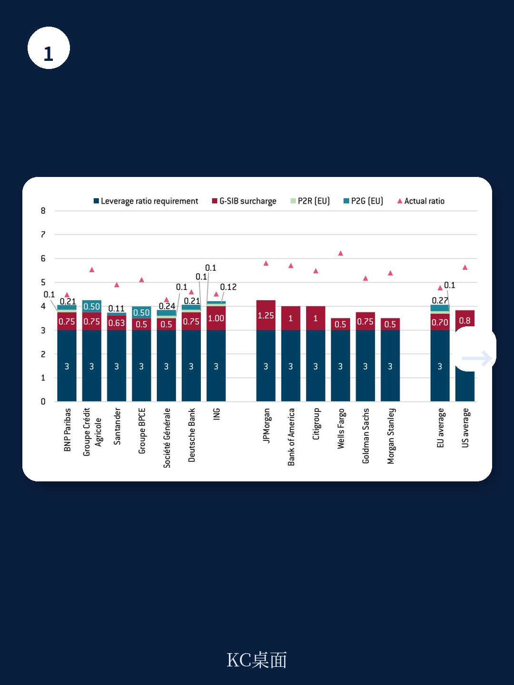
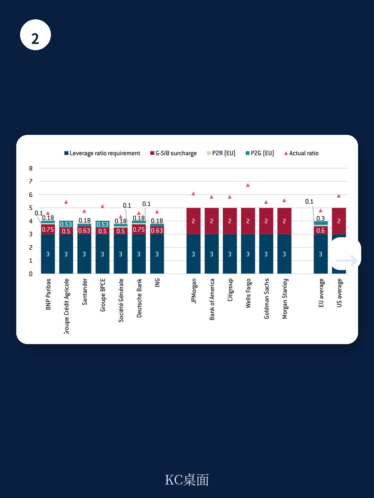

# 布鲁盖尔研究所：欧盟银行业政策碎片化才是真正挑战，而非美国监管竞争

全球银行业监管正在经历一场静默的分岔。当美国在第二任特朗普政府治下加速放松金融监管、削减大型银行资本要求时，欧盟正站在一个关键的十字路口：是追随美国走“低路”，以放松管制换取短期竞争力，还是坚持“高路”，维持巴塞尔框架的纪律并完成银行业联盟的未竟改革？

布鲁盖尔研究所（Bruegel）近期发布的一份深度报告，系统梳理了这一跨大西洋的监管博弈。报告的核心判断是：美国当前的政策转向并非源于对欧盟的竞争压力，而是一种增加系统性风险的“低路”选择。历史反复证明，低路终将通向危机。对于欧盟而言，真正的挑战不在于与美国比谁更松，而在于解决自身银行业政策碎片化的根本顽疾。

这份报告的价值在于，它不仅用详实的数据对比了美欧大型银行的资本要求，更从历史和政治经济学的视角，揭示了监管放松背后的逻辑与风险。对于关注全球金融格局、跨境资本流动以及系统性风险的读者而言，这是一份不可多得的分析框架。

> **KC评论：** 这份报告最值得关注的点在于，它明确指出美国当前的放松并非“竞争性放松”，而是一种缺乏远见的短期行为。对于投资者而言，这意味着需要重新评估欧美大型银行的系统性风险溢价，而非简单认为美国银行因此更具投资价值。报告中对美欧资本要求的具体拆解和图表，是理解这一判断的关键。

继续看原文，真正有价值的是报告中对“资本堆叠”（capital stack）的逐层拆解、美欧监管框架差异的图表对比，以及作者对巴塞尔框架未来走向的推演。这些细节和图表，以及KC评论的进一步解读，在每日汇编中都有完整呈现。

---

## 1. 美国监管转向的本质：不是竞争，是“低路”冒险

报告用大量篇幅论证了一个反直觉的结论：美国当前的政策调整，并非为了应对欧盟银行的竞争，而是源于一种根深蒂固的“放松监管等于竞争力”的意识形态。

截至2024年底，美国对大型银行的资本要求普遍高于欧盟，也高于巴塞尔框架的最低标准，这符合美国长期以来的监管传统。然而，到2025年底，在第二任特朗普政府的推动下，这一差距已大幅收窄。报告认为，即便如此，美国的要求并未低于欧盟，因此并未对欧盟银行形成所谓的“毁灭性竞争压力”。

真正的问题在于美国政策的方向。报告用“reckless”（鲁莽）一词形容当前美国的银行业政策，认为其“低路”选择——放松监管和弱化监督——正在增加系统性风险，而非提升长期竞争力。这种路径在历史上屡见不鲜，最终都以危机告终。

这一判断对投资框架的含义是：当市场热议美国银行因监管放松而获得优势时，需要警惕伴随而来的风险积累。监管周期的波动本身，就是系统性风险的重要来源。

## 2. 欧盟的“高路”选择：维持巴塞尔纪律，破解内部碎片化

面对美国的转向，欧盟应当如何应对？报告给出的建议清晰而坚定：不应堕入“比谁更松”的竞赛，而应坚持“高路”。

所谓“高路”，包含两个核心支柱。第一，维持资本要求与巴塞尔框架一致，不因外部竞争压力而降低标准。报告指出，欧盟银行业政策面临的核心挑战，不是资本要求过高，而是政策框架的碎片化——尤其是在欧元区内部。银行业联盟（Banking Union）至今未完成，危机应对框架（包括银行处置、存款保险和流动性支持）仍未在欧元区层面实现一体化。这导致各国在银行资本和流动性上“各自为政”，阻碍了真正的内部单一市场形成。

第二，简化资本要求。报告承认，当前的审慎监管框架已经复杂到“令人麻木”（mind-numbingly complex）的地步，亟需重新设计。但简化不等于放松。欧盟当局，如欧洲央行，已明确表态支持“不放松监管的简化”，即维持总体资本水平，但减少设定过程中的复杂性。

> **KC评论：** 对于关注欧洲金融股的投资者来说，这份报告提供了一个重要的分析框架：评估欧洲银行时，不能只看其资产质量和盈利水平，更要看其所在国的监管碎片化程度。那些在银行业联盟框架下运营更顺畅的银行，可能享有隐性的成本优势。报告中对“资本堆叠”的详细拆解，是理解这一复杂问题的关键工具。

## 3. 大型银行的“资本堆叠”：美欧差异的微观透视

报告的核心贡献之一，是对美欧大型银行“资本堆叠”的详细对比。这绝非简单的数字罗列，而是揭示了两个体系在哲学和操作层面的根本差异。

报告定义的“大型银行”（megabanks），是指全球系统重要性银行（GSIB）且总资产超过1万亿欧元的机构。欧盟有7家（BNP Paribas,Crédit Agricole,Santander,BPCE,Société Générale,Deutsche Bank,ING），美国有6家（JPMorgan Chase,Bank of America,Citigroup,Wells Fargo,Goldman Sachs,Morgan Stanley）。

通过对比2024年底和2025年底的资本要求，报告清晰地展示了美国监管转向的力度。美国的核心变化在于：大幅削减了杠杆率（leverage ratio）的GSIB附加资本要求，并调整了“压力资本缓冲”（Stress Capital Buffer）的计算方式。这使得美国大型银行的整体资本要求显著下降，但仍略高于巴塞尔框架的最低水平。

报告的对比图表（需看完整报告）直观地展示了这一变化。对于投资者而言，这意味着需要重新审视美欧银行之间的风险权重和资本充足率比较。美国的放松，并非为银行释放了巨额的资本空间，但确实改变了边际监管成本。

## 4. 报告未完全回答的关键问题：巴塞尔框架的终极命运

尽管报告分析深刻，但它也留下了一个核心悬念：巴塞尔框架本身，是否还能作为全球监管的锚点？

报告默认巴塞尔框架是“高路”的基石。但美国的行为——无论是主动放松还是被动调整——都在事实上削弱了巴塞尔框架的权威性。如果全球最大的两个金融中心之一开始“开倒车”，其他经济体是否会跟进？巴塞尔委员会是否有足够的政治权威来约束成员国的“竞次”行为？

报告对此着墨不多，但这一问题是所有读者必须思考的。如果巴塞尔框架的约束力持续减弱，那么全球系统性风险的管理将更加碎片化，跨国银行的套利空间将重新打开。这对于2008年危机后建立的全球金融监管架构，无疑是一次严峻的考验。

## 5. 观察框架：如何跟踪这场监管博弈？

对于希望持续跟踪这一议题的读者，报告提供了一个清晰的观察框架。

第一，关注2026年7月欧盟委员会即将发布的“银行业竞争力报告”。这份报告将决定欧盟下一步的立法方向，是坚持“高路”还是向“低路”妥协，届时将有更明确的信号。第二，关注美国监管机构的实际执法力度。放松规则是一回事，放松执行是另一回事。美国当前“去监管化”的深度，最终取决于监管机构的实际操作。第三，关注大型银行的风险偏好变化。资本要求的变化，最终会体现在银行的资产负债表扩张速度、风险资产配置以及交易行为上。这些微观指标，是判断监管效果的最佳窗口。

> **KC评论：** 这份报告的价值，不在于给出一个“买美国银行还是欧洲银行”的简单答案，而在于为读者提供了一个理解全球金融监管周期的分析工具。监管周期本身，就是驱动金融资产价格的重要变量。想要获取报告中完整的图表、数据以及更细致的KC评论，请加入我们的知识星球。

---

这份报告的完整版包含了大量详实的图表、数据来源和附录，对“资本堆叠”的每一层都进行了技术性拆解。这些内容对于深入理解美欧监管差异至关重要，也是日常投研中难以快速获取的一手资料。

我们每日汇编会将这份报告放回当天的宏观叙事主线中，整理成中文摘要、KC评论和图表合集，便于喂给AI，也便于人工快速扫描市场动态。这些内容汇聚了头部券商、PE/VC、投行、并购、hedge fund、资管机构、战略咨询、智库等朋友，期待与您交流。更多国际信源汇编与评论，欢迎扫码交流，每日更新。

Personal reading notes and learning share only. Not investment advice.
