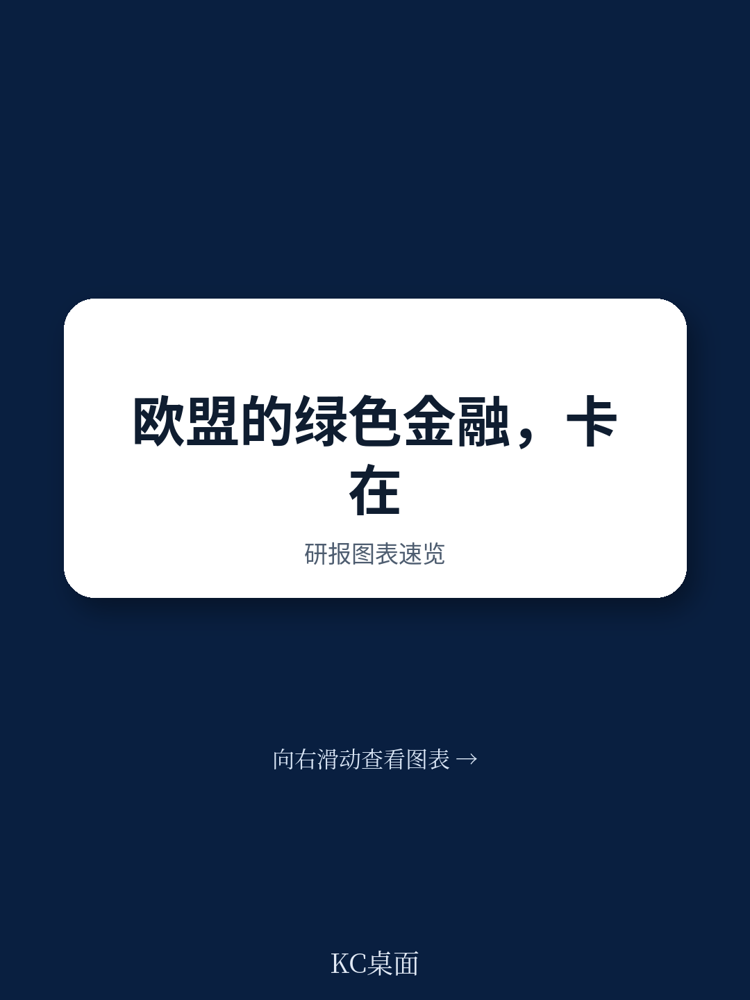

# 布鲁盖尔研究所：不是规则太少，而是规则太复杂，欧盟绿色金融的结构性矛盾

欧盟在绿色金融领域的雄心壮志，正在被自身复杂的规则体系所拖累。这份来自布鲁盖尔研究所的最新研报，揭示了一个正在发生的结构性矛盾：欧盟试图通过信息披露来引导资本流向绿色项目，但其规则设计的过度复杂化，不仅未能有效撬动市场，反而可能成为资本流动的障碍。报告的核心判断是，欧盟必须将可持续金融政策与资本市场发展真正融合，否则绿色转型的融资缺口将难以弥合。

这不仅仅是一份关于监管的讨论。它触及了欧洲当前最核心的竞争力和增长命题。欧洲央行行长拉加德在2021年就曾指出，绿色转型是构建真正欧洲资本市场的历史性机遇。然而，五年过去了，欧盟的可持续金融规则与资本市场政策仍处于“各自为政”的状态。这种割裂，使得欧洲在需要大规模动员资本的时代，反而制造了额外的摩擦成本。

报告指出，欧盟的可持续金融框架根植于2020年的《欧洲绿色协议》，其核心目标是2050年实现气候中性。这本身没有问题。问题在于，政策制定者将“偏好”直接嵌入到了信息披露过程中，期望通过强制要求企业披露更多信息，来迫使资本做出“正确”的选择。这种“自上而下”的监管思路，与资本市场“自下而上”的定价逻辑之间存在根本性冲突。

**KC评论：** 这份报告最犀利的地方在于，它直接点出了欧盟可持续金融政策的“致命伤”——用信息披露替代了市场激励。企业花费大量资源编制报告，但84%的受访者认为这些披露对投资者“没有显著用处”，83%的人认为披露被用作营销工具而非决策依据。这提醒我们，在评估任何绿色金融政策时，不能只看“有没有规则”，更要看规则是否真正改变了资金流向。

继续看原文，真正有价值的是报告对欧盟“双重重要性”（double materiality）原则的剖析，以及它与全球主流标准（ISSB）之间的结构性差异。完整报告与KC评论在每日汇编中。

## 1. 欧盟的绿色规则正在制造“合规性通胀”，而非市场繁荣

报告引用了多组数据来支撑这一判断。欧洲财务报告咨询小组（EFRAG）在2025年的成本收益分析中，虽然能轻易识别出简化规则带来的约40亿欧元节省，但对于数据使用者的收益，却只能用“定性”方式评估。这本身就说明，规则的复杂性已经超过了其带来的实际效益。

更令人担忧的是，复杂的规则体系正在产生反效果。欧洲央行（ECB）的研究指出，如果合规负担过重，反而会抑制可持续金融的资本配置。这违背了“更好的信息会激发投资”的原始假设。企业在应对合规要求时，可能将大量资源投入到“如何满足披露要求”上，而非真正优化其绿色业务。这种“合规性通胀”会挤占实际用于创新和转型的资金。

报告还指出，欧盟在制定规则时，长期独立于甚至超前于国际可持续准则理事会（ISSB）等全球标准制定者。这种“布鲁塞尔效应”的假设——即欧盟标准会成为全球标准——在绿色金融领域并未实现。目前全球有超过50种绿色分类法在使用或开发中，而符合欧盟分类法的绿色债券发行量在2025年只占市场的不到10%。欧盟自家的下一代欧盟（NGEU）绿色债券计划，也使用的是国际资本市场协会（ICMA）的标准，而非其自己的欧洲绿色债券标准。

**KC评论：** 这里有一个值得深思的对比。欧盟在会计标准上要求企业使用国际会计准则（IASB），但在绿色金融上却另起炉灶。这种“内外有别”的做法，增加了跨国企业的合规成本，也削弱了欧盟规则在全球的竞争力。报告没有完全展开的是，这种割裂是否会促使资本从欧洲流向规则更统一、成本更低的市场。

## 2. 资本市场联盟的“空转”才是绿色金融最大的障碍

报告反复强调一个观点：绿色金融的发展，首先需要的是一个深度、流动、一体化的欧洲资本市场。然而，欧盟在资本市场联盟（CMU）方面的进展，远不如其在银行联盟方面的成就。

报告提到，德拉吉2024年的报告明确指出，资本市场的碎片化是欧洲经济增长和竞争力的首要障碍。莱塔2024年的报告则建议将“资本市场联盟”更名为“储蓄与投资联盟”（SIU），以强调其最终受益者——储蓄者和企业。这个名称的变化，本身就暴露了问题的本质：欧洲并不缺储蓄，缺的是将这些储蓄有效转化为长期投资的渠道。

可持续金融政策与资本市场政策在欧盟的组织架构中处于“横向政策”单元，而非核心的政策工作流。这意味着，它们被定位为“市场赋能者”，而非“市场驱动者”。这种定位上的边缘化，使得绿色金融政策难以与更广泛的资本市场监管、跨境破产、初创企业融资等核心议题产生协同效应。

报告引用了欧洲央行行长拉加德2021年的观点：绿色转型所需的投资规模巨大，这恰恰为构建一个真正统一的欧洲资本市场提供了历史性机遇。然而，从实际进展来看，这个机遇正在被浪费。如果资本市场本身无法高效运作，那么再精妙的绿色金融规则，也只是在“无水之舟”上做文章。

## 3. 绿色债券之外，更广阔的资产类别被忽视

报告指出，欧盟的可持续金融政策过度聚焦于绿色债券市场，而忽视了股权、风险投资和其他资产类别。这是一个重大的结构性缺陷。

从风险收益特征来看，绿色债券更适合为成熟的基础设施项目融资，而绿色转型中大量需要的是早期技术研发、商业模式创新和规模化扩张，这些更需要股权资本和风险投资的支持。欧盟的规则体系，在推动股权类绿色投资方面，几乎处于空白状态。

报告建议，欧盟应该“超越绿色债券”，将可持续金融框架扩展到更广泛的资产类别。这包括考虑如何为绿色初创企业提供更友好的上市和融资环境，以及如何通过资产证券化等市场工具，将分散的绿色项目打包成可投资的金融产品。

报告也提到了一个现实挑战：美国和欧洲的资产管理公司在绿色投资上的态度正在分化。欧洲的资管机构仍在积极参与，而美国的同行则在政治压力下越来越多地对环境和社会的相关提案投反对票。这种分化，使得欧盟在推动全球绿色金融标准时，面临更大的阻力。

## 4. “简化”与“去复杂化”是当前最迫切的改革方向

报告对欧盟2025年提出的“综合法案”（Omnibus）简化方案进行了评价，认为这些方案虽然方向正确，但力度和深度都远远不够。简化方案被批评为“回避了影响评估”和“忽视了问责程序”，尤其是可持续金融立法部分，被认为程序不佳。

报告提出了几个具体的改革建议，这些建议直指当前规则体系的核心痛点

- **减少欧盟分类法的角色**：分类法试图对每一项经济活动进行“绿色”或“非绿色”的二元划分，但现实世界的经济结构远比这复杂。报告建议，应该让分类法回归其“参考工具”的本位，而不是成为决定投资是否“合格”的硬性门槛。
- **简化数据收集**：当前企业需要披露大量数据，但很多数据的使用频率极低。报告建议，应当优先收集那些对投资者决策真正有用的关键数据，而不是追求“大而全”的信息披露。
- **缩小“双重重要性”的范围**：这是最核心的争议点。报告建议，欧盟应该让“双重重要性”规则与ISSB的“单一重要性”标准更兼容。所谓“双重重要性”，要求企业不仅要报告气候变化对自身财务的影响（财务重要性），还要报告自身活动对气候的影响（环境重要性）。后者在操作上极其复杂，且缺乏统一的市场定价机制，容易沦为合规负担。

**KC评论：** 报告没有完全回答的一个关键问题是：如果欧盟放弃或弱化“双重重要性”，它是否会失去其在全球绿色金融领域的“道德领导力”？这是一个两难选择。但报告的核心逻辑是清晰的：一个无法被市场有效使用的规则，无论其设计多么精巧，最终都只会被市场抛弃。完整报告中对这一取舍的利弊权衡，值得仔细研读。

## 5. 报告尚未完全回答的关键问题：如何衡量“绿色金融”的真实效用

尽管报告提出了极具洞察力的框架和犀利的批评，但它也坦诚地指出了几个尚未被充分解答的问题。

**第一，信息披露与资本成本之间的因果关系仍然模糊。** 报告引用了研究指出，强制性的企业社会责任披露可能会降低企业盈利能力。那么，更严格的绿色信息披露，究竟是降低了还是提高了企业的融资成本？目前缺乏足够有力的实证证据来支撑任何一种结论。

**第二，绿色金融的“增量”效应难以量化。** 即使绿色债券市场在增长，我们很难区分这些资金是“新增”的绿色投资，还是仅仅将原本就计划进行的投资“重新贴标”为绿色。报告提到，有研究显示绿色债券的增长与温室气体排放之间并无显著关联。这暗示着，市场可能正在发生“漂绿”行为，而非真正的绿色转型。

**第三，政策制定者与市场参与者对融资需求的估算存在巨大差异。** 有的估算认为全球可持续投资潜力可达25万亿美元，而另一些基于气候目标的测算则聚焦于“融资缺口”。这两种口径的差异，反映了对“绿色金融”功能定位的根本分歧：它是创造新市场的工具，还是弥补公共资金的缺口？

这些未解问题，恰恰是读者在阅读完整报告时最需要关注的。它们决定了我们如何评估欧盟未来政策调整的方向和效果。

## 6. 给观察者与决策者的框架：从“规则导向”转向“市场导向”

基于报告的分析，我们可以提炼出一个用于观察欧洲绿色金融未来走向的框架。这个框架的核心是：判断政策是否在推动“从规则导向到市场导向”的转变。

**观察维度一：规则是否降低了交易成本。** 如果新的简化方案能够显著降低企业的合规成本，同时提高数据的可比性和使用率，那么它就是正向的。反之，如果简化只是将旧的复杂规则替换为新的复杂规则，那么市场将不会有实质性的改善。

**观察维度二：资本市场的改革是否与绿色金融政策同步。** 欧盟正在推进的“储蓄与投资联盟”改革，能否真正解决跨境投资、破产清算、税收协调等深层次障碍？如果资本市场改革停滞不前，绿色金融政策再高明也难有作为。

**观察维度三：全球标准的趋同程度。** 欧盟是否愿意与ISSB等全球标准制定者进行更务实的对接？如果欧盟坚持“例外主义”，其绿色金融市场的规模和流动性将受到限制，因为全球资本会更倾向于流向规则更统一、成本更低的市场。

**观察维度四：公共资金的角色是否被准确定位。** 报告建议，应“有节制地使用担保和补贴”。这意味着，公共资金应该扮演“催化者”和“风险承担者”的角色，而非替代私人资本。如果欧盟的绿色金融政策越来越依赖于财政预算和国家援助，那说明其资本市场动员私人资本的功能依然失效。

这份报告为我们提供了一个清晰的坐标系：欧洲的绿色金融正站在一个十字路口。一边是继续沿着复杂、孤立、自上而下的规则路径走下去，结果可能是“合规繁荣、市场萧条”；另一边是回归市场逻辑，简化规则、对接全球、深化资本市场，让绿色金融真正成为推动转型的引擎。选择权在政策制定者手中，但市场的反馈已经非常清晰。

---

更多国际信源汇编与深度评论，扫码交流。每日更新，汇总国际主流叙事、数据与图表，观测边际变化。每日汇编将单篇报告放回当天主线，整理成中文摘要、KC评论和图表合集，便于喂给AI或人工快速扫描市场动态。这里汇聚了头部券商、PE/VC、投行、并购、对冲基金、资管机构、战略咨询、智库等业界朋友，期待交流。

Personal reading notes and learning share only. Not investment advice.
