# Progress made by EU candidate countries on accession-related reforms

## Marek Dabrowski and Maria Catarina Louro

The European Union enlargement process is both politically driven and merit-based. Politically, the process is driven by the determination of a candidate country to join the EU, and the willingness of incumbent EU countries to let it in. In terms of merit, becoming an EU member requires adopting the EU acquis communautaire – the accumulated body of EU law – codified in 35 negotiation chapters and grouped into six thematic clusters.

This paper analyses the progress made by EU candidate countries on accession-related reforms using a novel method involving the quantification of the European Commission's annual qualitative assessment of countries' preparedness. The results of our analysis are contrasted with the actual status of accession negotiations for each country.

To some extent, progress in accession negotiations is tracking progress in acquis adoption. This is especially visible for Montenegro, the most advanced EU candidate in terms of reform. Montenegro could complete accession negotiations in 2026 or early 2027. However, there are also opposite examples where, despite good reform scores, negotiations have stalled, as in the case of North Macedonia.

The authors would like to thank Heather Grabbe and Nina Vujanović for their comments and suggestions on an earlier draft of this Working Paper.

This Working Paper was produced with financial support from Open Society Foundations Western Balkans.

## Contents

1 Introduction 3
2 Methodology 4
3 Reform progress by individual chapters, 2020-2025 7
4 The weighted scores of reform progress, 2020-2025 9
5 Comparison with other surveys 14
6 Preparedness for membership vs accession negotiation status 19
7 Summary 22
References 23

## 1 Introduction

The European Union's accession process is both politically driven and merit-based. Politically, the process is driven by the political determination of a candidate country to join the EU, and willingness of incumbent EU countries to let it in. In terms of merit, becoming an EU member requires adopting the EU acquis communautaire, codified into 35 negotiation chapters, grouped since 2020 into six thematic clusters. Ideally, the political dimension of the EU enlargement process should be determined by a merit-based assessment – that is, the candidate's progress in adopting the acquis. In reality, however, adopting the acquis and formal accession negotiations sometimes diverge for political reasons. The requirement for unanimous consent by all EU countries to approve each step in accession negotiations is the main factor causing such divergence. Occasionally, the domestic political considerations of an incumbent or its bilateral disputes with a candidate prevail over a merit-based assessment of its preparedness to join the EU.

In this Working Paper, our analysis focuses on the candidates' progress in adopting the acquis, based on the European Commission's annual reports (the so-called enlargement packages), which assess the level of preparedness of individual candidates for EU membership and their progress in EU accession-related reforms $^{1}$ . Following the methodological approach of Emerson and Blockmans (2025), we translate these annual Commission assessments into numeric scores for each negotiation chapter and then aggregate them into the chapters' thematic groups and overall reform progress. To reflect the various degrees of difficulty in adopting individual negotiation chapters, we apply respective weights. We cover eight candidate countries in the Western Balkan and Eastern Europe regions $^{2}$ : Albania, Bosnia and Herzegovina, Montenegro, North Macedonia and Serbia, for the period 2020-2025, and Georgia, Moldova and Ukraine for the period 2023-2025.

To bring in the political dimension of the accession process, we compare the results of our analysis with the actual progress of EU accession negotiations.

We start our analysis by discussing details of our methodological approach in section 2. In section 3, we present the reform progress for individual chapters by each candidate country for 2020-2025. Section 4 analyses the overall reform progress by negotiation clusters per country. Our results are compared with other reform or governance rankings in section 5, and then the actual status of accession negotiations in section 6. Section 7 contains policy conclusions and recommendations.

## 2 Methodology

Our methodological approach borrows from Emerson and Blockmans (2025). However, we build on their contribution in at least three ways. First, we conduct a dynamic analysis for six years instead of one year. Second, we apply weights to assess the difficulty in negotiating individual chapters and carrying out related reforms. Third, we use interim assessments verbatim, which the other authors do not, therefore allowing for more granularity in our scores.

## 2.1 Data sources

Our assessment of the progress in the EU accession-related reforms is based on the annual enlargement reports published by the Commission $^{3}$ . Candidate countries are assessed on their efforts to align their legislation, institutions and practices with the 33 EU accession negotiation chapters $^{4}$ . The Commission's reports provide a narrative qualitative assessment for each country and chapter, typically evaluating both the level of preparation (ie the extent of alignment with EU acquis) and the progress made over the preceding year. These assessments are expressed through standardised qualitative labels that appear explicitly in each chapter of the reports, which are consistent across years and countries.

## 2.2 Data collection and structure

For Western Balkan countries, the analysis covers the period from 2020 to 2025. However, for Ukraine, Moldova and Georgia, which were granted candidate status only in 2022-2023, the time coverage is more limited and begins in 2023.

We constructed a novel dataset based on the Commission's enlargement reports from 2020 to 2025, which were collected and systematically processed to extract chapter-level assessments (Bruegel Dataset, 2026).

The unit of analysis is defined at the country-year-chapter level, covering up to 33 chapters per country-year. This structure allows for consistent comparison across countries and over time.

A large language model (LLM) was used to read these reports and extract the qualitative assessments of the level of a country's preparation for and alignment with the acquis.

## 2.3 Translating qualitative assessment into quantitative scores

Quantifying qualitative characteristics is always a difficult and disputable exercise. However, it is the only available tool to measure progress in different policy areas and conduct a cross-country comparative analysis of various aspects of governance and regulation. It also allows the dynamic analysis of regulatory and policy changes in individual countries over time.

Once the Commission's assessments were catalogued, we translated them into an ordinal scale. The full mapping between the Commission's verbatim categories and the numerical values assigned in this paper is presented in Table 1.

Table 1: Commission qualitative assessments of the level of preparation and respective numerical scores:

<table><tr><td>Commission assessment (verbatim)</td><td>Ordinal value</td><td>Standardised score (0-100)</td></tr><tr><td>Early stage</td><td>1</td><td>0</td></tr><tr><td>Between the early stage and some level of preparation</td><td>2</td><td>13</td></tr><tr><td>Some level of preparation</td><td>3</td><td>25</td></tr><tr><td>Between some and a moderate level of preparation</td><td>4</td><td>28</td></tr><tr><td>Moderately prepared</td><td>5</td><td>50</td></tr><tr><td>Between a moderate and a good level of preparation</td><td>6</td><td>63</td></tr><tr><td>Good level of preparation</td><td>7</td><td>75</td></tr><tr><td>Between a good and advanced level of preparation</td><td>8</td><td>88</td></tr><tr><td>Well advanced</td><td>9</td><td>100</td></tr></table>

Source: Bruegel.

This ordinal scale has been subsequently transformed into continuous indicators on a 0-100 scale, preserving their ranking while enabling comparison and aggregation across chapters, countries, time and other surveys.

The dataset combines automated extraction with manual verification to ensure robustness. A subset of observations was cross-checked against the original reports, and systematic inconsistencies were addressed through harmonisation rules and targeted corrections.

## 2.4 Weights reflecting the chapters' complexity and reform difficulty

The reform agendas required by each negotiation chapter are unequal in terms of their implementation difficulty. To address this problem, we apply a set of weights ranging from 1 to 4 to each chapter (Table 2).

The negotiation chapters were weighted according to their relative implementation difficulty. In assigning weights, six dimensions were considered: (1) the scale of legislative harmonisation required; (2) the administrative and technical capacity needed for implementation; (3) the need for specialised or independent institutions; (4) the extent of inter-ministerial coordination required; (5) the financial and infrastructural costs of compliance; and (6) the political sensitivity and enforcement difficulty associated with the acquis area.

The highest weight (4) was adopted for Chapters 23 (Judiciary and Fundamental Rights) and 24 (Justice, Freedom and Security), which constitute the core of the 'Fundamentals' cluster and are widely regarded as the backbone of EU conditionality. These chapters require not only legislative approximation, but also sustained improvements in judicial independence, rule of law, anti-corruption frameworks, border management, asylum systems and the protection of fundamental rights.

Table 2: Negotiation chapters' difficulty weights

<table><tr><td>Chapter number</td><td>Chapter name</td><td>Cluster</td><td>Weight</td></tr><tr><td>1</td><td>Free movement of goods</td><td>Internal Market</td><td>2</td></tr><tr><td>2</td><td>Free movement for workers</td><td>Internal Market</td><td>2</td></tr><tr><td>3</td><td>Right of establishment and freedom to provide services</td><td>Internal Market</td><td>2</td></tr><tr><td>4</td><td>Free movement of capital</td><td>Internal Market</td><td>2</td></tr><tr><td>5</td><td>Public procurement</td><td>Fundamentals</td><td>2</td></tr><tr><td>6</td><td>Company law</td><td>Internal Market</td><td>2</td></tr><tr><td>7</td><td>Intellectual property law</td><td>Internal Market</td><td>3</td></tr><tr><td>8</td><td>Competition policy</td><td>Internal Market</td><td>3</td></tr><tr><td>9</td><td>Financial services</td><td>Internal Market</td><td>2</td></tr><tr><td>10</td><td>Information society and media</td><td>Competitiveness &amp; Inclusive Growth</td><td>2</td></tr><tr><td>11</td><td>Agricultural and rural development</td><td>Resources, Agriculture &amp; Cohesion</td><td>3</td></tr><tr><td>12</td><td>Food safety, veterinary and phytosanitary policy</td><td>Resources, Agriculture &amp; Cohesion</td><td>2</td></tr><tr><td>13</td><td>Fisheries</td><td>Resources, Agriculture &amp; Cohesion</td><td>2</td></tr><tr><td>14</td><td>Transport policy</td><td>Green Agenda &amp; Sustainable Connectivity</td><td>3</td></tr><tr><td>15</td><td>Energy</td><td>Green Agenda &amp; Sustainable Connectivity</td><td>3</td></tr><tr><td>16</td><td>Taxation</td><td>Competitiveness &amp; Inclusive Growth</td><td>1</td></tr><tr><td>17</td><td>Economic and monetary policy</td><td>Competitiveness &amp; Inclusive Growth</td><td>1</td></tr><tr><td>18</td><td>Statistics</td><td>Fundamentals</td><td>1</td></tr><tr><td>19</td><td>Social policy and employment</td><td>Competitiveness &amp; Inclusive Growth</td><td>1</td></tr><tr><td>20</td><td>Enterprise and industrial policy</td><td>Competitiveness &amp; Inclusive Growth</td><td>1</td></tr><tr><td>21</td><td>Trans-European Networks</td><td>Green Agenda &amp; Sustainable Connectivity</td><td>1</td></tr><tr><td>22</td><td>Regional policy and coordination of structural instruments</td><td>Resources, Agriculture &amp; Cohesion</td><td>2</td></tr><tr><td>23</td><td>Judiciary and fundamental rights</td><td>Fundamentals</td><td>4</td></tr><tr><td>24</td><td>Justice, freedom and security</td><td>Fundamentals</td><td>4</td></tr><tr><td>25</td><td>Science and research</td><td>Competitiveness &amp; Inclusive Growth</td><td>1</td></tr><tr><td>26</td><td>Education and culture</td><td>Competitiveness &amp; Inclusive Growth</td><td>1</td></tr><tr><td>27</td><td>Environment and climate change</td><td>Green Agenda &amp; Sustainable Connectivity</td><td>3</td></tr><tr><td>28</td><td>Consumer and health protection</td><td>Internal Market</td><td>1</td></tr><tr><td>29</td><td>Customs union</td><td>Competitiveness &amp; Inclusive Growth</td><td>2</td></tr><tr><td>30</td><td>External relations</td><td>External Relations</td><td>1</td></tr><tr><td>31</td><td>Foreign, security and defence policy</td><td>External Relations</td><td>1</td></tr><tr><td>32</td><td>Financial control</td><td>Fundamentals</td><td>2</td></tr><tr><td>33</td><td>Financial and budgetary provisions</td><td>Resources, Agriculture &amp; Cohesion</td><td>1</td></tr></table>

Source: Bruegel.

Chapters 7 (Intellectual Property Law) and 8 (Competition Policy) receive weights of 3 because they require more complex regulatory frameworks, strong enforcement institutions and significant administrative capacity. Effective implementation in these areas depends not only on legal transposition, but also on the capacity to ensure market oversight, state aid control, competition enforcement and judicial effectiveness.

The weights of 3 are also attributed to Chapter 11 (Agriculture and Rural Development) and several chapters within the ‘Green Agenda and Sustainable Connectivity’ cluster, notably transport, energy and environment. These policy areas involve substantial financial costs, large-scale infrastructure investment and long-term structural transformation. Alignment with the EU acquis in these fields often requires extensive public investment, administrative coordination and implementation over many years.

The intermediate weights (2) have been applied to most of the 'Internal Market' and 'Resources, Agriculture & Cohesion' chapters (considering reforms that EU candidates already conducted during implementation of association and free trade agreements with the EU), two 'Fundamentals' chapters ('Public Procurement' and 'Financial Control') and a few others.

Chapters with intermediate or lower weights generally involve less institutionally demanding forms of acquis alignment, or areas in which substantial approximation had already occurred through earlier association agreements with the EU.

For each negotiation chapter, weighted scores are equal to: Chapter Score (0-100) × Weight. Cluster scores are calculated as weighted averages across all chapters belonging to the same enlargement cluster: Cluster Score = Sum (Score × Weight) / Sum (Weight). Overall country scores are calculated as weighted averages across all acquis chapters: Overall Score is equal to: Sum (Score × Weight) / Sum (Weight)

## 3 Reform progress by individual chapters, 2020-2025

Figure 1 presents the annual advancement of reforms in 2020-2025 by each candidate country and negotiation chapter $^{4}$ .

Table 3 presents a summary of Figure 1 in the form of simple averages of individual chapter scores.

Table 3 shows Montenegro leading, followed by three other Western Balkan countries: Serbia, North Macedonia and Albania. Montenegro also recorded a visible acceleration in the reform process in 2024-2025, like Moldova, which, however, lags behind the leadership group. On the other hand, Serbia and North Macedonia, despite their relatively higher scores, recorded very slow progress. The scores of Bosnia and Herzegovina and Georgia have stagnated at low levels.

However, these are unweighted averages, which do not reflect the difficulty of completing individual chapters and their relative importance for the accession process. For example, looking at chapters 23 and 24, considered as the most difficult to adopt (and sustain) and most important for the progress in accession negotiations $^{6}$ , only

Montenegro recorded in 2025 a 'good' level of preparation (Figure 1). Other candidates recorded either a 'moderate' (Albania, North Macedonia, Serbia in Chapter 24) or 'some' level of preparation.

Figure 1: The level of preparation, by negotiation chapter, 2020-2025  
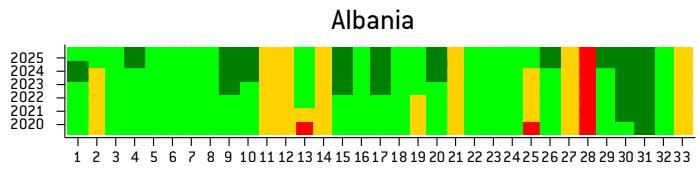

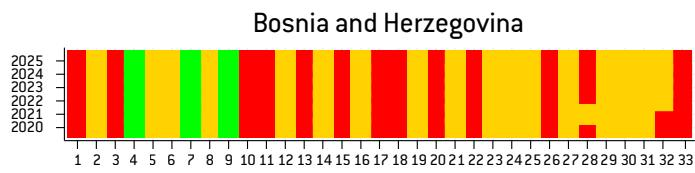

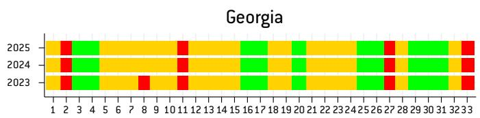

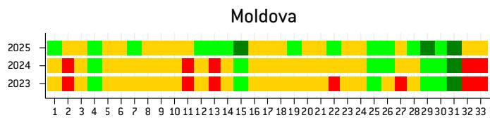

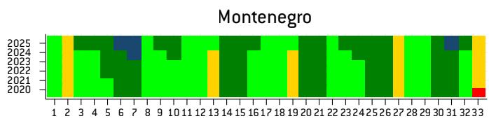

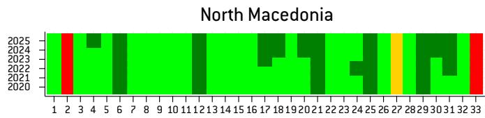

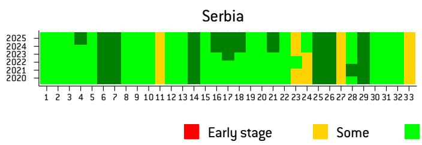

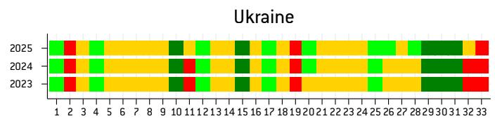  
Source: Bruegel based on European Commission annual ‘enlargement packages’, 2020-2025. Note: for the chapter names, see Table 2. For Georgia, Moldova and Ukraine, comparable assessments are available only from 2023.

Table 3: Progress in adoption of acquis, 2020-2025, an overall unweighted average of chapters' scores

<table><tr><td>Country</td><td>2020</td><td>2021</td><td>2022</td><td>2023</td><td>2024</td><td>2025</td></tr><tr><td>Albania</td><td>38</td><td>41</td><td>41</td><td>44</td><td>46</td><td>47</td></tr><tr><td>Bosnia and Herzegovina</td><td>16</td><td>16</td><td>17</td><td>17</td><td>17</td><td>17</td></tr><tr><td>Georgia</td><td>n/a</td><td>n/a</td><td>n/a</td><td>28</td><td>28</td><td>28</td></tr><tr><td>Moldova</td><td>n/a</td><td>n/a</td><td>n/a</td><td>23</td><td>25</td><td>36</td></tr><tr><td>Montenegro</td><td>52</td><td>53</td><td>53</td><td>53</td><td>55</td><td>61</td></tr><tr><td>North Macedonia</td><td>50</td><td>50</td><td>51</td><td>51</td><td>52</td><td>53</td></tr><tr><td>Serbia</td><td>51</td><td>52</td><td>52</td><td>51</td><td>53</td><td>53</td></tr><tr><td>Ukraine</td><td>n/a</td><td>n/a</td><td>n/a</td><td>32</td><td>32</td><td>34</td></tr></table>

Source: European Commission annual 'enlargement packages', 2020-2025, authors' estimates.

# 4 The weighted scores of reform progress, 2020-2025

In this section, we analyse the overall weighted scores and compare them with the unweighted ones, followed by the analysis of weighted scores by clusters.

## 4.1 Overall scores

Table 4 presents the weighted averages of individual chapter scores. Figure 2 compares them with the unweighted averages shown in Table 3.

Figure 2 superficially suggests that overall weighted scores do not differ much from unweighted ones. However, a more detailed analysis shows that, in most cases, they are marginally lower (by 1 point) than unweighted averages. In Montenegro, these scores have been the same since 2022. In Georgia, the gap is bigger: 2-3 points, depending on the year.

Bosnia and Herzegovina is the exception, with overall weighted scores higher than the unweighted ones by 1-2 points, depending on the year. This likely reflects the country's relatively stronger performance in the negotiation chapter on intellectual property law, which was assigned a higher weight than most other chapters. Nevertheless, among all analysed candidates, it is the least advanced in adopting acquis.

The weighted averages also allow for the identification of reform-reversal episodes unseen in unweighted averages. This relates to Serbia and North Macedonia (both in 2023) and Georgia (2024).

Figure 2: Evolution of overall weighted and unweighted preparedness scores, 2020–2025  
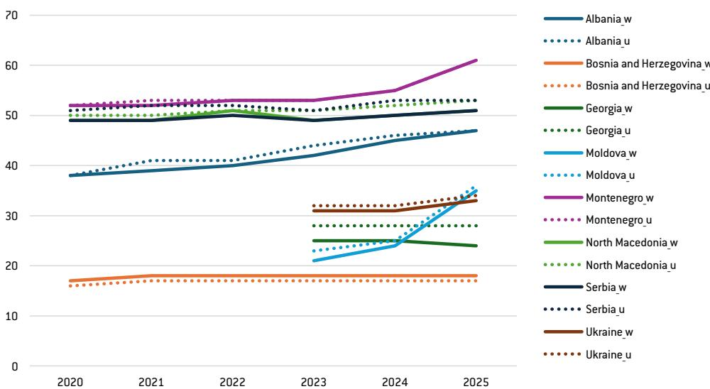  
Source: Bruegel based on European Commission annual 'enlargement packages', 2020-2025. Note: solid lines represent overall weighted average preparedness scores and dotted lines represent overall unweighted average preparedness scores.

Table 4: Progress in adoption of acquis, 2020-2025, an overall weighted average of chapters' scores

<table><tr><td>Country</td><td>2020</td><td>2021</td><td>2022</td><td>2023</td><td>2024</td><td>2025</td></tr><tr><td>Albania</td><td>38</td><td>39</td><td>40</td><td>43</td><td>45</td><td>47</td></tr><tr><td>Bosnia and Herzegovina</td><td>17</td><td>18</td><td>18</td><td>18</td><td>18</td><td>18</td></tr><tr><td>Georgia</td><td>n/a</td><td>n/a</td><td>n/a</td><td>25</td><td>25</td><td>24</td></tr><tr><td>Moldova</td><td>n/a</td><td>n/a</td><td>n/a</td><td>21</td><td>24</td><td>35</td></tr><tr><td>Montenegro</td><td>52</td><td>52</td><td>53</td><td>55</td><td>55</td><td>61</td></tr><tr><td>North Macedonia</td><td>49</td><td>49</td><td>51</td><td>49</td><td>50</td><td>51</td></tr><tr><td>Serbia</td><td>49</td><td>49</td><td>50</td><td>49</td><td>50</td><td>51</td></tr><tr><td>Ukraine</td><td>n/a</td><td>n/a</td><td>n/a</td><td>31</td><td>31</td><td>33</td></tr></table>

Source: Bruegel based on European Commission annual 'enlargement packages', 2020-2025.

The ranking of individual countries in adoption of the acquis and the speed of accession-related reforms looks similar when one uses the weighted and unweighted averages. Montenegro is the undisputed leader, followed by Serbia, North Macedonia and Albania. The Western Balkan region (except Bosnia and Herzegovina) is more advanced than the Eastern European candidates. Montenegro and Moldova have demonstrated the most visible acceleration of reforms since 2023, while in Albania progress has been slower but systematic since 2022.

## 4.2 Cluster scores

In this subsection, we assess candidate countries' performance across six negotiation clusters, using the weighted chapter scores presented above. This allows us to identify not only overall progress towards EU accession, but also the specific policy areas in which countries are advancing or lagging.

Figure 3: Evolution of weighted preparedness scores in the Cluster 1 'Fundamentals', 2020-2025  
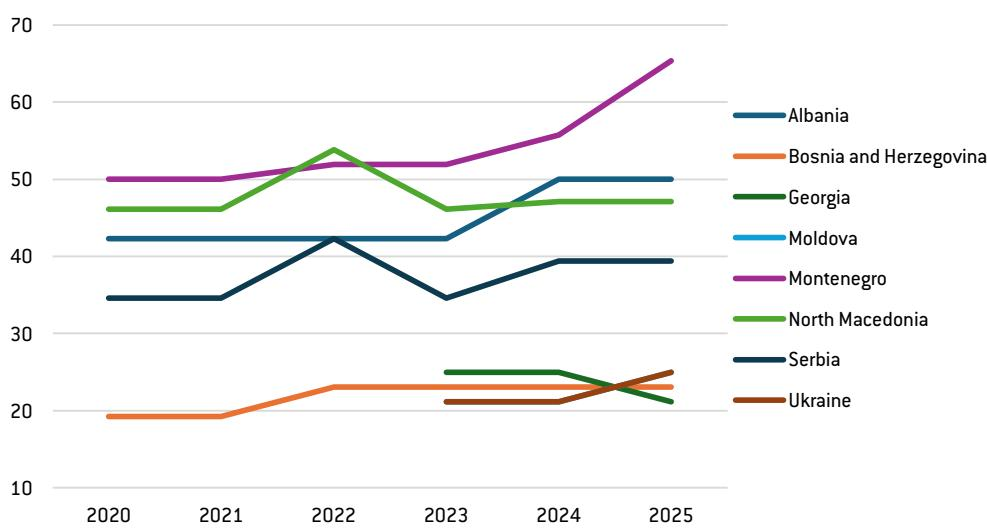  
Source: Bruegel based on European Commission annual ‘enlargement packages’, 2020-2025. Note: Moldova’s score matches that of Ukraine, whose line overlaps it.

We start our cluster analysis from the Cluster 1 'Fundamentals', the most difficult to adopt in new democracies and politically the most important to be admitted as a new EU member.

Figure 3 shows an even larger gap between the Western Balkan candidates and the Eastern European ones – plus Bosnia and Herzegovina – than in the overall scores (Figure 2). However, two of four leaders suffered substantial reform reversals in 2023 (North Macedonia by 7 points, and Serbia by 8 points) and were overtaken by Albania. More generally, fluctuations in ‘Fundamentals’ scores help to explain the incidences of deterioration in overall scores analysed in section 4.1.

Again, Montenegro has been an undisputed leader, recording a systematic improvement in this category since 2022.

Cluster 2 ('Internal market') is also difficult in terms of acquis adoption. However, some progress has already been accomplished and anchored during the implementation of bilateral association and free trade agreements with the EU. Hence, Cluster 2 scores look more stable (Figure 4). In most cases, there is slow or no progress over time. Montenegro, Moldova and Albania saw more progress after 2022. In 2025, Montenegro recorded the highest score of 66, followed by Serbia (58), North Macedonia (49), Albania (45), Moldova (35), Ukraine (27), Bosnia and Herzegovina, and Georgia (both 26). Again, there is a gap between the four Western Balkan candidates and Eastern European ones (plus Bosnia and Herzegovina).

Figure 4: Evolution of weighted preparedness scores in the Cluster 2 'Internal Market', 2020-2025  
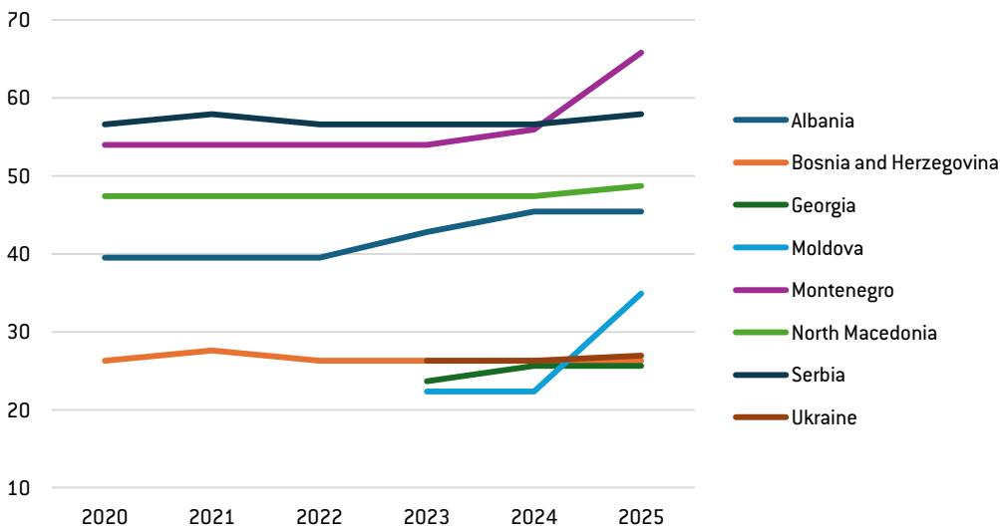  
Source: Bruegel based on European Commission annual 'enlargement packages', 2020-2025.

A somewhat similar picture is presented by Figure 5 for Cluster 3 ('Competitiveness & Inclusive Growth') with one important difference: a smaller gap between four Western Balkan leaders and three Eastern European countries (but with Bosnia and Herzegovina still lagging behind others).

Figure 5: Evolution of weighted preparedness scores in the Cluster 3 'Competitiveness & Inclusive Growth', 2020-2025  
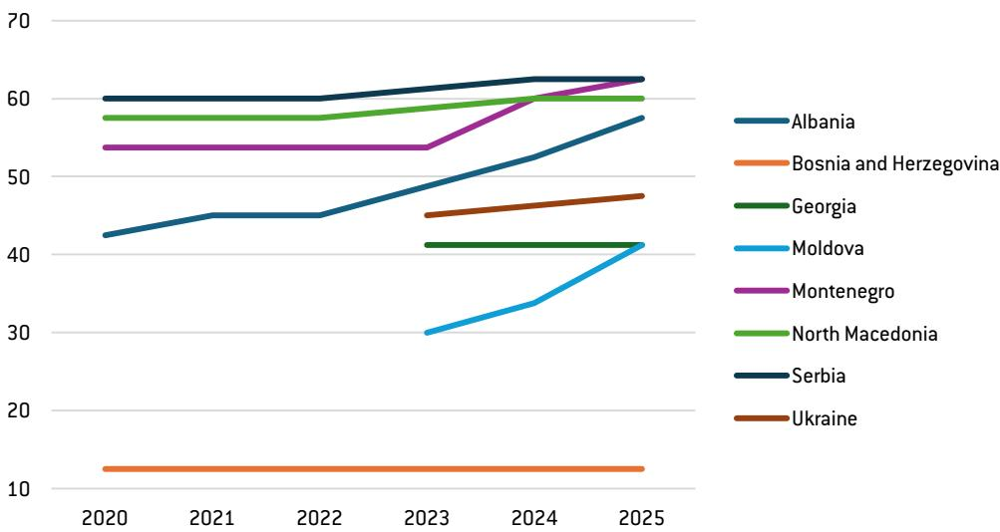  
Source: Bruegel based on European Commission annual 'enlargement packages', 2020-2025.

As mentioned earlier, Cluster 4 ('Green agenda & sustainable connectivity') can be considered as the second most difficult cluster after 'Fundamentals'. Figure 6 shows a moderate level of reform advancement and lack of progress during the analysed period, except for Moldova, Albania (both starting from low levels of preparedness), and, marginally, Serbia. Unlike in Clusters 1-3, there are smaller differences between the four Western Balkan and three Eastern European countries, with Ukraine having higher scores in 2023-2024 than Albania, but contrary to the latter, recording no progress.

Figure 6: Evolution of weighted preparedness scores in the Cluster 4 'Green agenda & sustainable connectivity', 2020–2025  
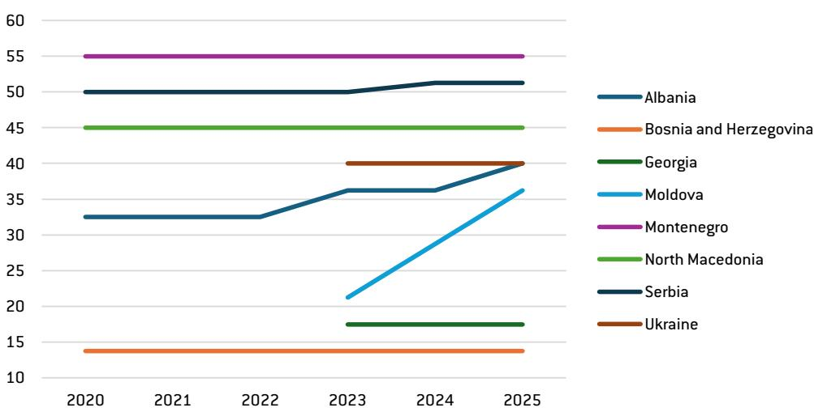  
Source: Bruegel based on European Commission annual 'enlargement packages', 2020-2025.

A similar picture can be obtained in the Cluster 5 'Resources, agriculture & cohesion' (Figure 7): moderate levels of advancement, smaller interregional differences, but more progress in the analysed period. Moldova recorded rapid progress from a very low level, Albania had significant progress (but from a slightly higher starting point than Moldova)

and Montenegro and Ukraine recorded moderate progress. In 2025, North Macedonia was a leader in this category (the score of 50), followed by Montenegro (47), Serbia (39), Albania and Moldova (both 33), Ukraine (24), Georgia (13) and Bosnia and Herzegovina (6).

Figure 7: Evolution of weighted preparedness scores in the Cluster 5 'Resources, agriculture & cohesion', 2020-2025  
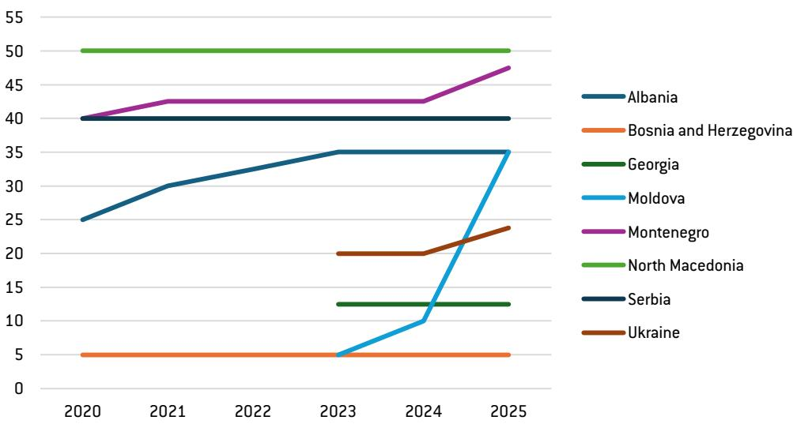  
Source: Bruegel based on European Commission annual 'enlargement packages', 2020-2025.

Cluster 6 'External relations' includes only two chapters (30 and 31) with weights of 1 in our analysis (Figure 8). In 2025, four countries represented a high degree of alignment with acquis: Montenegro (the score of 88), Albania, North Macedonia and Ukraine (all three at 75). They were followed by Moldova (63), Serbia (50), Georgia (44, a deterioration from 2022-2023, and Bosnia and Herzegovina (25).

Figure 8: Evolution of weighted preparedness scores in the Cluster 6 'External relations', 2020-2025  
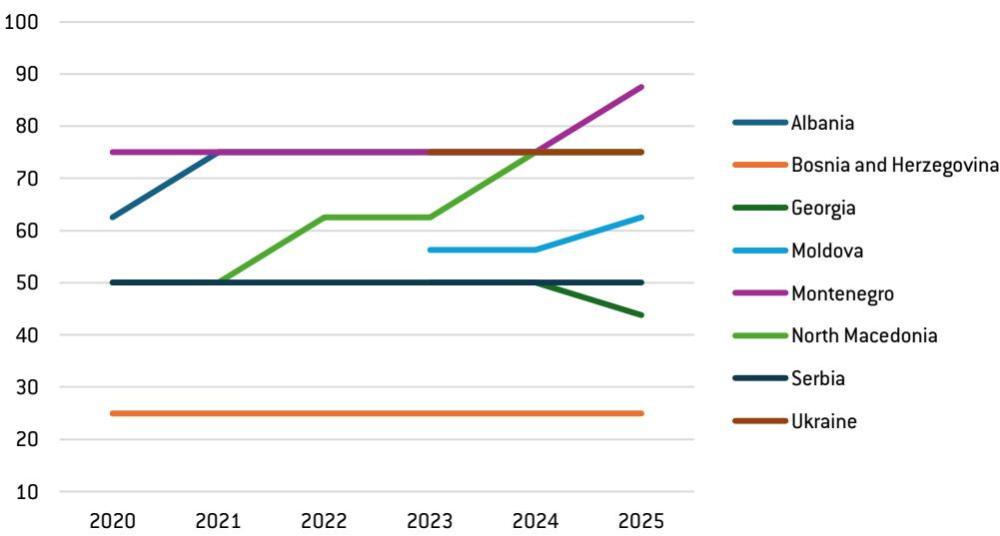  
Source: Bruegel based on European Commission annual 'enlargement packages', 2020-2025.

Finally, Figure 9 shows the contribution of six clusters to the overall weighted scores in 2025. The decomposition is based on the weighted chapter preparedness scores within each cluster, expressed as a share of the country's total weighted preparedness score. This allows us to identify which policy areas contribute most to the overall level of acquis alignment in each candidate country. In all analysed countries except Bosnia and Herzegovina, the main contribution comes from reforms conducted in Clusters 2 and 3. Montenegro, North Macedonia and Albania can claim a significant contribution coming from reforms in Cluster 1. Other candidates are less advanced in the alignment with the acquis in this politically most important cluster. Overall, the picture offered by Figure 9 is in line with our earlier findings (Figures 3-8).

Figure 9: Decomposition of weighted preparedness scores by cluster, 2025  
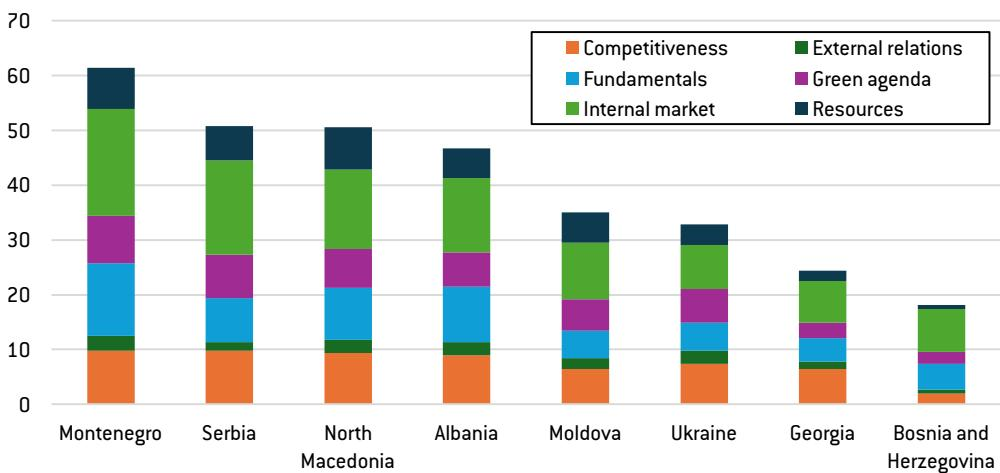  
Source: Bruegel based on European Commission annual enlargement packages, 2025.

## 5 Comparison with other surveys

Changes in economic, political and institutional systems are the subject of many global surveys. For a comparison with the results of our analysis, we chose the World Bank's World Governance Indicators (WGIs; World Bank, 2025) and the 'well-governed' scores developed by the European Bank for Reconstruction and Development (EBRD), one of its six qualities of a sustainable market economy $^{7}$ . In both cases, the comparison has an indicative character, but due to differences in the assessed content, applied scales and weights and other methodological discrepancies, it cannot be considered an exact comparison of the same characteristics.

## 5.1 World Bank WGI s

The WGI's consist of scores for six indicators on a scale of 0-100 for the years 2020-2024. These indicators are Voice and Accountability, Rule of Law, Political Stability, Government Effectiveness, Regulatory Quality and Control of Corruption. Hence, we can consider them as an additional assessment of public governance and institutions, largely covered by Cluster 1 ('Fundamentals') of the accession negotiations.

It is important to note, however, that the WGIs differ substantially from our acquis-based scores in both methodology and scope. While our accession scores measure the degree of alignment with the EU acquis and progress in adopting and implementing specific EU rules, legislation and institutional requirements, the WGIs reflect a broader perception-based assessment of governance quality and state capacity. In particular, the WGIs aggregate information from surveys of firms, citizens, experts and international organisations, capturing how institutions function in practice rather than formal compliance with EU accession benchmarks.

At the beginning, we calculated simple averages of six WGI scores, presented in Figure 10. When comparing it with our 'Fundamentals' weighted scores (Figure 11), we see one striking difference: the leadership of Georgia, only overtaken by Montenegro in 2024.

Figure 10: World Governance Indicators, simple average of six dimensions, 2020-2024  
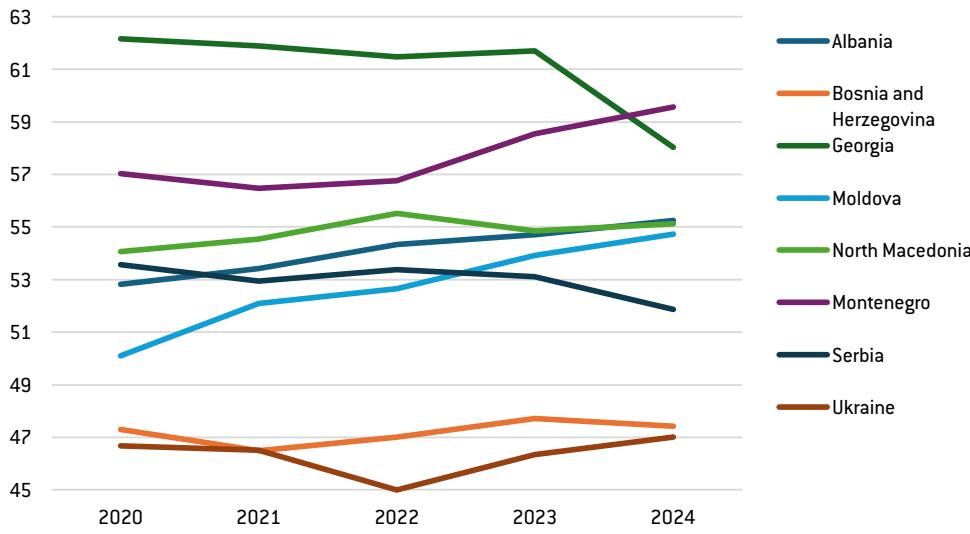  
Source: Bruegel based on the World Bank.

It seems that Georgia benefitted, for a long time, from radical institutional, deregulation and anti-corruption reforms in the second half of the 2000s, during the presidency of Mikhael Saakashvili (Steenland and Gigitashvili, 2018), which strengthened state capacity and improved regulatory quality. This was also reflected in other global and regional surveys, such as the World Bank's Doing Business (published until 2020) $^{8}$ , Transparency International Corruption Perception Index $^{9}$ , or Heritage Foundation Index of Economic Freedom $^{10}$ . They have not necessarily focused on the alignment with the EU acquis; rather, they reflected business and experts' opinions.

Georgia's reform gains from the second half of the 2000s have gradually eroded, especially in the areas of political freedom and the rule of law (this is seen in Figures 10, 12 and 13). The erosion of democratic governance accelerated in 2024-2025 with the adoption of the Russian-style 'foreign agents' law $^{11}$ , contested parliamentary elections in 2024, and growing repression against political opposition, media and civil society organisations.

Figure 11: Cluster 1 performance vs the average WGIs (2024)  
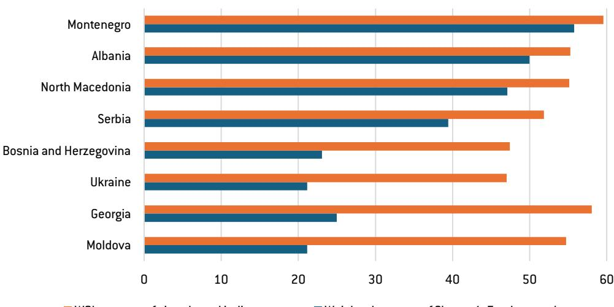  
■ WGI: average of six selected indicators  
Source: Bruegel based on the World Bank.  
■ Weighted average of Cluster 1: Fundamentals

Figure 12: World Governance Indicators, Voice and Accountability scores, 2020-2024  
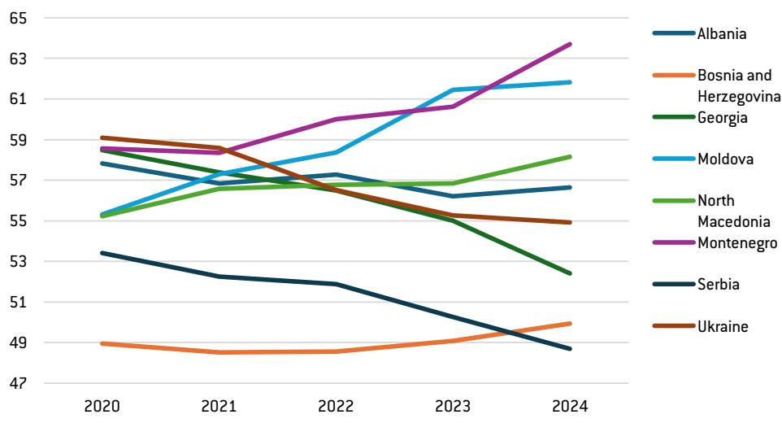  
Source: Bruegel based on the World Bank.

By contrast, its Cluster 1 'Fundamentals' preparedness scores were lower in 2024 (Figures 3 and 11), suggesting that the Commission's accession-related assessments have become increasingly critical regarding democratic governance, judicial independence and institutional checks and balances. This divergence illustrates that broader governance indicators such as the WGI's may react more slowly to recent political deterioration than EU accession assessments. One could arguably expect that these developments will be reflected in WGI scores for 2025 and 2026.

The EU accession process was subsequently suspended both by the EU institutions and the Georgian government $^{12}$ shortly after Georgia obtained EU candidate status in December 2023.

Figure 13: World Governance Indicators, Rule of Law scores, 2020-2024  
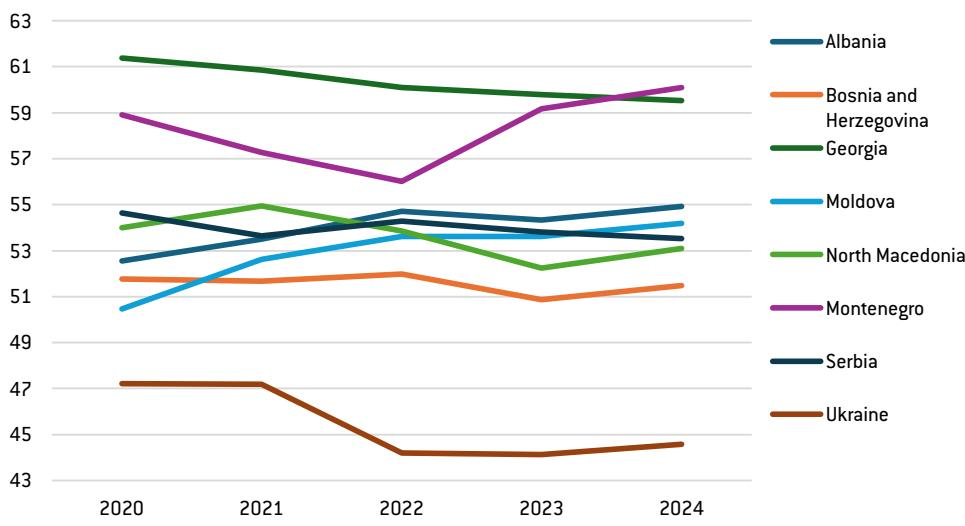  
Source: Bruegel based on the World Bank.

Other results of the WGI survey are largely in line with results presented in Figure 3, in terms of the reported quality of governance, changes over time and differences between individual countries (although differences between Moldova and Ukraine, on the one hand, and four Western Balkan countries are smaller than in our scores).

To make an additional comparison, we also present the Voice and Accountability (Figure 12) and Rule of Law (Figure 13) scores. The former is the measure of political freedom and the strength of democratic institutions and practices, and the latter characterises legal order and legal institutions. Figure 12 shows democratic backsliding in Georgia, Serbia and Ukraine (the latter likely due to the war and martial law), stagnation in Albania and Bosnia and Herzegovina, slow improvement in North Macedonia, and more visible progress in Montenegro and Moldova. Figure 13 shows backsliding in Georgia (although from a relatively high level) and Ukraine (again, likely from martial law), progress in Montenegro in 2023-2024 (after deterioration in 2020-2022), Moldova and Albania, and stagnation in other candidates.

## 5.2 EBRD 'well-governed' scores

In Figure 14, we compare our weighted scores for Cluster 1 of accession negotiations (Figure 3) with the EBRD 'well-governed' scores $^{13}$ . According to the EBRD, 'well-governed' is a measure of the quality of public institutions and the processes through which authority, decision-making and accountability are exercised.

Figure 14: Cluster 1 performance vs the EBRD 'well-governed' score (2025)  
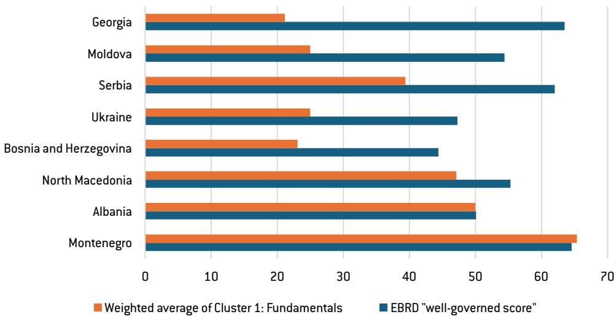  
Source: Bruegel based on EBRD.

This measure covers public economic governance – including the rule of law, control of corruption and institutional quality – as well as corporate governance (part of Cluster 2 of the acquis), which deals with the rules and practices through which firms are directed and controlled. It is estimated on a scale of 1-10; for the sake of comparison in a single figure, the values are multiplied by 10.

Similar to the WGI's discussed in section 5.1, the EBRD's well-governed scores differ from our acquis-based measures in both purpose and methodology. While our weighted Cluster 1 scores assess progress in adopting and implementing the 'Fundamentals' cluster of the EU acquis, the EBRD indicator provides a broader assessment of institutional quality and governance effectiveness from the perspective of economic transition and sustainable market economy development.

The results are partly similar to our comparison between Cluster 1 weighted average scores and WGI average scores (Figure 9). The EBRD also rates Georgia much higher (in comparison with other candidates) than our analysis of weighted averages in section 4.2. The order of ranking of other countries is more in line with our findings, although the differences between them are smaller.

Georgia's outstanding (although deteriorating) performance under the EBRD ‘well-governed’ indicator can be explained similarly to the WGI s (see section 5.1). Differences in the content of the assessed characteristics may be another factor influencing results.

## 6 Preparedness for membership vs accession negotiation status

The next step in the analysis is to check whether our estimates of candidates' preparedness for EU membership are reflected in the progress of their accession negotiations (as of mid-June 2026 – see Figure 15).

After the Council's invites a candidate country to open accession negotiations, the first step involves the acquis screening, ie, an analytical examination of the EU acquis and preparing a list of reforms needed to implement them by a candidate country $^{14}$ . After completing the acquis screening, a candidate can be invited to open negotiations on the subsequent clusters, starting with Cluster 1 'Fundamentals'. Montenegro and Serbia, which started negotiations before the introduction of the Revised Enlargement Methodology, opened negotiations on individual chapters. After the adoption of the acquis by a candidate, a given chapter is provisionally closed. When negotiations on all chapters are completed, the accession treaty is drafted, signed and ratified by a candidate and all EU countries.

Montenegro, an EU candidate country since December 2010 and the leader in our overall weighted scores, is also the most advanced in the accession negotiations, which were opened in June 2012. By June 2020, Montenegro had all 33 negotiation chapters open. Fourteen of them (chapters 3, 4, 5, 6, 7, 10, 11, 13, 20, 21, 25, 26, 30, 32) were provisionally closed $^{15}$ . Montenegro also met interim benchmarks in chapters 23 and 24. In November 2025, the Commission signalled the possibility of closing accession negotiations by the end of 2026 $^{16}$ . In April 2026, the Council of the European Union established a Working Group for drafting Montenegro's Accession Treaty $^{17}$ .

Serbia, which opened accession negotiations in June 2013, has 22 chapters opened, but only two (chapters 25 and 26) are provisionally closed $^{18}$ . No new chapters have been opened since December 2021, and no chapter has been provisionally closed since February 2017.

North Macedonia $^{19}$ , an EU candidate since December 2005, formally opened accession negotiations in March 2020, but the First Intergovernmental Conference (IGC)

In November 2025, the Commission signalled the possibility of closing accession negotiations with Montenegro by the end of 2026

was held only in July 2022. The resulting acquis screening was completed in December 2023. No further steps have been taken since then. The stalemate has been caused by the bilateral dispute with neighbouring Bulgaria on historical and cultural issues. Bulgaria demands changes in the constitution of North Macedonia to recognise the Bulgarian minority, as a condition of unblocking accession negotiations $^{20}$ .

Figure 15: Status of EU accession negotiations by a candidate country (10 June 2026)  
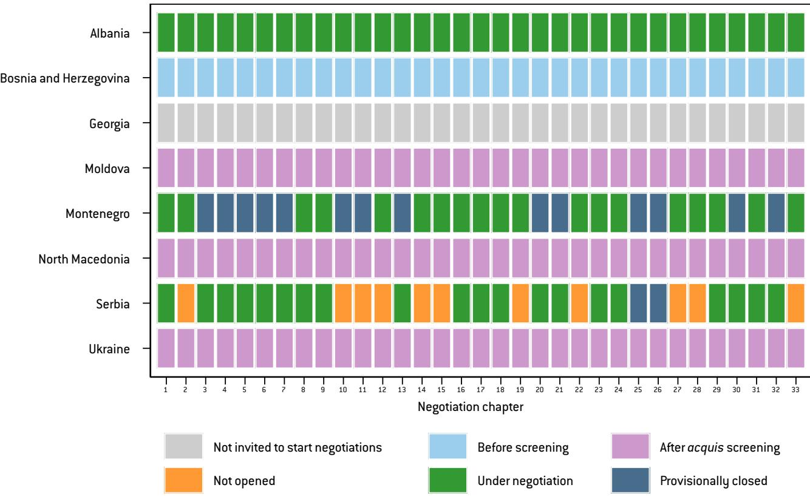  
Source: Bruegel based on European Commission.

Similarly to North Macedonia, Albania $^{21}$ (a candidate from June 2014) opened accession negotiations in March 2020, held the First ICG in July 2022, and completed acquis screening in December 2023. Fortunately, unlike North Macedonia, it could continue negotiations. It has all negotiation clusters (and chapters) opened, but none of them are provisionally closed yet. In the November 2025 enlargement package, the Commission mentioned Albania's goal to complete accession negotiations in $2027^{22}$ .

Ukraine $^{23}$ and Moldova $^{24}$ , both EU candidates from June 2022, opened accession negotiations in December 2023, held the First ICGs in June 2024, and completed the screening process in September 2025. Hungary blocked opening negotiations with Ukraine on Cluster 1, and because Moldova's negotiations have been informally linked with those of Ukraine, this stalled them as well. The new government of Hungary, however, has since lifted the block. On 15 June 2026, the negotiations on Cluster 1 were opened for both countries $^{25}$ . In the earlier quoted press release, which accompanied the 2025 enlargement package, the Commission noted the declared goals to complete negotiations by early 2028 by the Government of Moldova, and by the end of 2028 by the Government of Ukraine.

The European Council granted Bosnia and Herzegovina EU candidate status in December 2022 and approved opening accession negotiations in March 2024. No further accession steps have been taken $^{26}$ .

Comparing the results of our analysis on Chapters 3 and 4 with the actual negotiation status of individual candidates, one can see both similarities and differences. Montenegro, the most advanced in the acquis adoption, is also closest to completing accession negotiations. Less reformed Albania is also less advanced in accession negotiations, although they are ongoing with respect to all clusters. Even less reformed Moldova and Ukraine are still at the very beginning of the negotiation process. Bosnia and Herzegovina, with its low level of acquis adoption, opened accession negotiations only formally.

Looking at discrepancies between the level of preparedness for EU membership and accession negotiation progress, North Macedonia is the most striking case. Being relatively advanced in the adoption of the EU membership-related reforms, more than 20 years after obtaining a candidate status, it cannot start accession negotiations beyond the acquis screening. First, it was blocked for more than a decade by Greece's demand that it change its official name. This conflict was resolved by the Prespa agreement of 2018, whereupon Macedonia changed its name to North Macedonia $^{27}$ . Since 2020, North Macedonia's accession negotiations have been blocked by Bulgaria.

Serbia is also relatively advanced in acquis adoption, but it does not have prospects of becoming an EU member soon. This is a consequence of its own political and geopolitical choices: democratic backsliding, inability to normalise relations with Kosovo and fully align its foreign policy with the EU's Common Foreign and Security Policy (CFSP).

The differences between the preparedness scores and actual accession negotiation status are the result of political factors influencing negotiation decisions. The annual Commission reports assessing individual countries' preparedness for EU membership have a predominantly technocratic character. Decisions on each accession negotiation step require a unanimous vote by the Council of the EU or the European Council – ie all incumbent EU countries. Some of them wield their veto for domestic political reasons (for example, domestic opposition to enlargement) or as leverage in bilateral disputes with the candidate, often on issues unrelated to their candidacy.

On the other hand, political or geopolitical considerations can work to accelerate EU enlargement. This was observed immediately after Russia invaded Ukraine in February 2022. The new perception of geopolitical instability in Europe resulted in granting Ukraine, Moldova and Georgia the EU candidate status and the acceleration of the accession process in the Western Balkan region. However, such positive momentum is usually time-limited.

## 7 Summary

This analysis, based on the Commission's annual assessments of candidates' preparedness for EU membership, and using a novel methodology of quantifying these assessments, shows that four of the Western Balkan countries (Montenegro, North Macedonia, Serbia and Albania) are more advanced in the acquis adoption than the three Eastern European ones. However, only Montenegro and Albania have the indicative goal of finalising membership negotiations in the foreseeable future. Montenegro may realistically complete this process by the declared deadline – the end of 2026. Albania may require more time: all clusters have been opened, but none of them have been closed.

Meanwhile, despite relative success in acquis adoption, North Macedonia is blocked by Bulgaria due to a bilateral dispute with no clear resolution. To revive stagnated membership negotiations, Serbia must return to the path of political and institutional reforms, especially related to Cluster 1, after recent democratic backsliding. It also must fully normalise its relations with Kosovo.

The two Eastern European candidates which started membership negotiations (Moldova and Ukraine) are behind the four Western Balkan leaders in the acquis adoption. Moldova has recorded visible progress since obtaining the EU candidate status in 2022; Ukraine – less so. Russia’s war against Ukraine and the resulting martial law in Ukraine can explain part of this stagnation. However, there are also internal political obstacles to adopting and implementing the accession-related legislation (RRR4U, 2026).

Ukraine and (indirectly) Moldova have been blocked by Hungary's veto from opening negotiations on Cluster 1, though the new Hungarian government appointed in May 2026 has since waived these objections. However, there is still a long way to go to complete negotiations, given the still-low degree of acquis adoption in both countries.

Ukraine faces specific challenges related to the ongoing war. During the war, it will be difficult to adopt and implement all the acquis, especially those related to Clusters 1 and

4. In addition, in the context of obligations set in Article 42.7 of the Treaty on European Union $^{28}$ , the incumbent EU countries may be reluctant to accept a new member in a state of active war (Darvas et al, 2024).

The accession perspectives of two other candidates analysed in our paper are even more unclear. Bosnia and Herzegovina, despite being invited to open accession negotiations in March 2024, is struggling to meet several institutional preconditions set by the Council of the EU. Its degree of acquis adoption is very low, as shown in sections 3 and 4. Georgia's scores look a bit better, but its accession process was frozen in 2024, before formal negotiations opened, due to democratic backsliding and increasing divergence from the EU CFSP.

Looking ahead, maintaining the momentum for enlargement generated by recent geopolitical events – Russian aggression, an increasingly isolationist United States, the rise of China – is in the interest of both candidate and incumbent EU countries. Adopting the acquis now is more difficult than for those who joined the EU in 2004, 2007 and 2011. The reason is simple: the EU is now more institutionally developed and integrated than 25 years ago. Therefore, candidates require more political, financial, and technical support in their adoption of the acquis and stronger incentives to move in this direction (sometimes against the opposition of various domestic interest groups).

Regarding incentives, the most important one is the accession negotiations themselves. They should be maximally merit-based and free of attempts to use them by the incumbent EU countries for domestic political purposes or in bilateral disputes with a candidate on issues unrelated to accession. Achieving such a goal would require eliminating the unanimity requirement for enlargement-related decisions in favour of qualified majority voting (QMV).

## References

Bruegel Dataset (2026) 'EU candidate countries acquis alignment dataset (2020-2025)', version of 30 June 2026, available at https://doi.org/10.64153/PTGV7515

Darvas, Z., M. Dabrowski, H. Grabbe, L.L. Moffat, A. Sapir and G. Zachmann (2024) The impact on the European Union of Ukraine's potential future accession, Bruegel Report, available at https://www.bruegel.org/system/files/2024-04/Report%2002.pdf

Emerson, M. and S. Blockmans (2025) 'A redynamised EU Enlargement Process, but hovering between Accession and the Alternatives', SCEEUS Guest Report No.1, Stockholm Centre for Eastern European Studies, available at https://cdn.ceps.eu/wp-content/uploads/2025/01/a\_redynamised\_eu\_enlargement\_process\_sceeus\_2025.pdf

28 Article 42(7) of the Treaty on European Union obliges other member states to provide a victim of aggression "... aid and assistance by all the means in their power"; see EEAS, 'Article 42(7) TEU - The EU's mutual assistance clause', 6 October 2022, https://www.eeas.europa.eu/eeas/article-427-teu-eus-mutual-assistance-clause\_en.

Maintaining the momentum for enlargement generated by recent geopolitical events is in the interest of both candidate and incumbent EU countries

European Commission (2025) 'Serbia 2025 Report', SWD(2025) 755 Final, available at https://enlargement.ec.europa.eu/document/download/6e68ce26-b95b-48e1-921a-c60c12da8f00\_en

Steenland, R. and G. Gigitashvili (2018) 'Georgia's Post-Soviet Transformation: The Role and Legacy of Mikheil Saakashvili', Analysis 08/2018, Centre for International Relations, available at https://csm.org.pl/wp-content/uploads/2018/08/CIR\_ANALYSIS-Georgia-s-post-soviet-transformation-08.2018.pdf

RRR4U (2026) 'Ukraine is not meeting its partners' requirements. What will happen to the funding?' Monitoring Implementation of the IMF programme and EU assistance 25, Resilience, Reconstruction and Relief for Ukraine, available at https://rrr4u.org/en/analytics/monitoring-implementation-of-the-imf-program-and-eu-assistance-march-2026/

World Bank (2025) The Worldwide Governance Indicators: Revised Methodology for Measuring Governance Using Perception Data, Dataset, World Bank Group, available at https://www.worldbank.org/en/publication/worldwide-governance-indicators

© Bruegel 2026. Bruegel publications can be freely republished and quoted according to the Creative Commons licence CC BY-ND 4.0. Please provide a full reference, clearly stating the relevant author(s) and including a prominent hyperlink to the original publication on Bruegel's website. You may do so in any reasonable manner, but not in any way that suggests the author(s) or Bruegel endorse you or your use. Any reproduction must be unaltered and in the original language. For any alteration (for example, translation), please contact us at press@bruegel.org. Publication of altered content (for example, translated content) is allowed only with Bruegel's explicit written approval. Bruegel takes no institutional standpoint. All views expressed are the researchers' own.

Bruegel, Rue de la Charité 33, B-1210 Brussels (+32) 2 227 4210
info@bruegel.org
www.bruegel.org