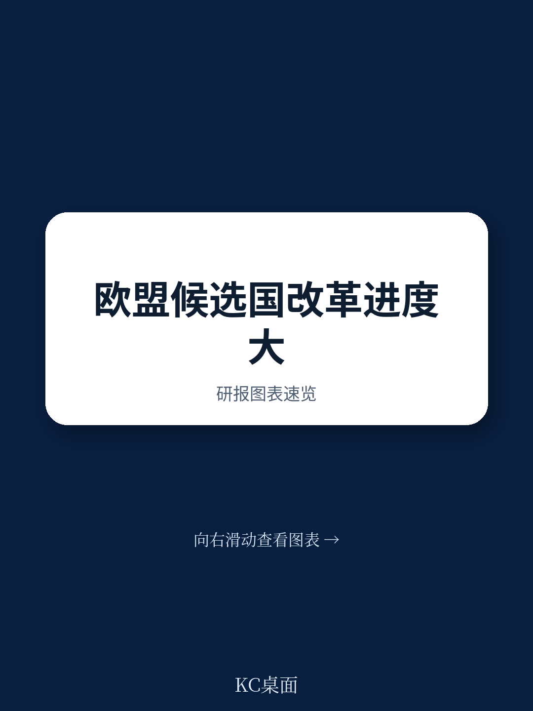
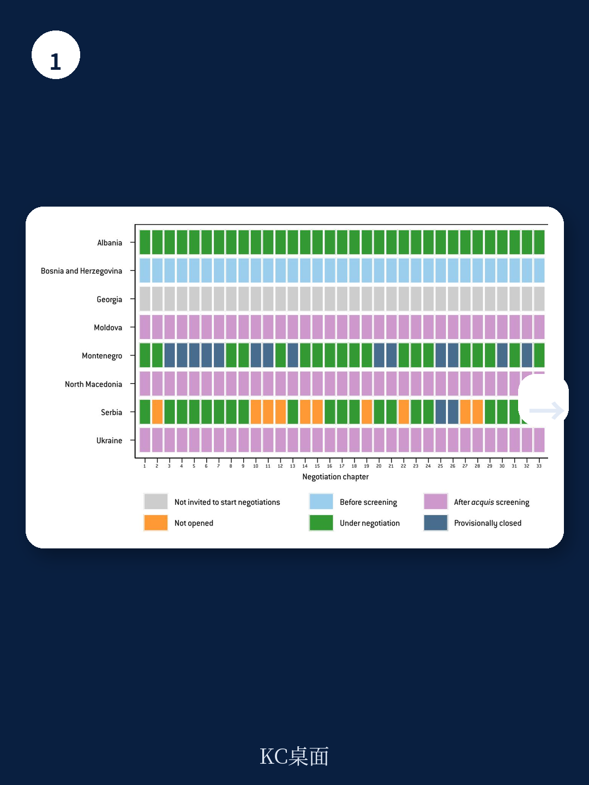
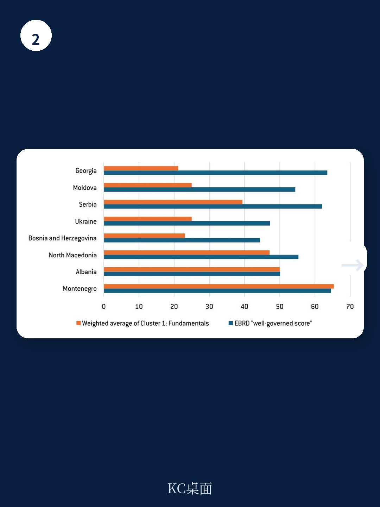

# 布鲁盖尔研究所：世界银行数据之外，欧盟候选国法治改革才是入盟关键

欧盟东扩进程正处于一个微妙时刻。地缘政治冲击——俄罗斯全面入侵乌克兰、美国战略重心转向印太、中国在全球南方影响力上升——本应成为加速扩员的催化剂。然而，布鲁盖尔研究所一份最新的工作论文通过量化欧盟委员会年度评估报告，揭示了一个令人警醒的现实：候选国在采纳欧盟法律体系方面的进展参差不齐，且改革进度与谈判进程之间出现了系统性脱节。这份报告的核心判断是：**政治因素正在系统性地扭曲基于功绩的扩员原则，而解决这一问题的钥匙不在于候选国，而在于欧盟自身决策机制的改革。**

这份报告的价值不仅在于它提供了一套可量化的评估框架，更在于它揭示了“谈判政治化”这一制度性障碍。对于关注欧洲地缘经济格局变迁的读者而言，理解这些候选国的真实改革进度，是判断欧盟未来边界、内部市场扩大以及地缘政治影响力延伸的关键前提。报告覆盖了西巴尔干五国（阿尔巴尼亚、波黑、黑山、北马其顿、塞尔维亚）以及东欧三国（格鲁吉亚、摩尔多瓦、乌克兰），时间跨度从2020年至2025年。

> **KC评论：** 这份报告最值得关注的不是单个国家的分数，而是它建立了一套“改革难度权重”体系。它将欧盟谈判的35个章节按实施难度分为1-4级，其中第23章（司法与基本权利）和第24章（司法、自由与安全）权重最高，达到4。这意味着，即便一个国家在低权重章节上得分很高，如果在核心法治领域进展缓慢，其整体“入盟准备度”仍然存疑。这对于理解欧盟扩员谈判的真实瓶颈至关重要——不是农业补贴或关税同盟，而是法治与司法独立。完整报告中的权重表格和评分方法值得仔细研读，它直接决定了我们如何解读每个国家的分数。继续看原文，真正有价值的是图表、假设和验证路径；完整报告与KC评论在每日汇编。

## 1. 黑山是唯一有望在2026-2027年完成谈判的候选国，但其领先优势并非不可撼动

在所有候选国中，黑山的表现最为突出。根据报告的量化评分，黑山在2025年的整体加权得分达到61（满分100），远超其他候选国。更重要的是，它在第23章和第24章这两个最核心的“基本面”章节上，是唯一在2025年达到“良好准备水平”的国家。报告明确指出，按照当前进度，黑山可能在2026年底或2027年初完成入盟谈判。

然而，黑山的领先地位并非没有风险。报告指出，其改革进程在2024-2025年出现了明显加速，但这种加速是否可持续，取决于国内政治稳定性和欧盟方面是否持续施压。黑山面临的一个独特挑战是，其国内政治极化可能影响司法改革和反腐进程的持续性。对于投资者而言，黑山是西巴尔干地区最具“欧盟化”前景的经济体，但其法治环境的可持续性仍需观察。

## 2. 塞尔维亚和北马其顿的“高分低能”现象说明：改革评分好不等于谈判推进快

报告揭示了一个反直觉的现象：塞尔维亚和北马其顿在改革评分上并不低，2025年整体加权得分分别为53和53，与黑山的差距并不像谈判进度所显示的那么大。但它们的入盟谈判却几乎陷入停滞。塞尔维亚的谈判自2021年以来进展甚微，北马其顿则因保加利亚的否决而长期无法开启谈判。

这种“高分低能”现象的背后是政治化的谈判进程。塞尔维亚面临的问题是其与科索沃关系正常化的政治障碍，以及部分欧盟成员国对其民主倒退的担忧。北马其顿则被保加利亚的双边争端所困。报告的分析表明，当候选国的改革表现与谈判进度出现显著背离时，问题几乎总是出在欧盟内部的政治分歧或双边争端上。

> **KC评论：** 这是报告最核心的洞察之一。它告诉我们，评估一个候选国的“入盟前景”，不能只看欧盟委员会的技术评估报告，更要看欧盟内部的权力博弈。塞尔维亚和北马其顿的例子表明，即便一个国家在技术上做好了准备，政治障碍仍然可以无限期拖延其入盟进程。对于商业决策者而言，这意味着不能将“改革评分高”等同于“市场准入风险低”。完整报告中关于塞尔维亚和北马其顿的章节对比分析，以及它们与其他调查（如世界银行治理指标）的相关性图表，是理解这一现象的关键。

## 3. 乌克兰和摩尔多瓦的改革速度最快，但战争和匈牙利否决权构成双重不确定性

报告数据显示，乌克兰和摩尔多瓦在2023-2025年期间的改革增速是所有候选国中最快的。摩尔多瓦的整体加权得分从2023年的23跃升至2025年的36，乌克兰则从32微升至34。这种加速反映了地缘政治压力带来的改革动力——两国都将入盟视为对抗俄罗斯影响力和保障国家安全的核心战略。

然而，这两国的前景面临一个独特的双重不确定性。首先是战争状态本身。报告指出，在战争期间全面采纳欧盟法律体系，特别是涉及内部市场、农业和结构性政策的章节，几乎是不可能的。其次，匈牙利在2026年5月之前一直否决开启乌克兰和摩尔多瓦的“集群1”（基本面）谈判，尽管新政府上任后解除了这一障碍，但政治风险并未完全消除。报告还援引欧盟条约第42.7条指出，现有成员国可能不愿接受一个处于战争状态的新成员，因为这可能触发集体防御义务。

## 4. 波黑和格鲁吉亚陷入“低分低能”困境，改革意愿而非能力才是核心问题

报告中最令人担忧的案例是波黑和格鲁吉亚。波黑的整体加权得分在2020-2025年间始终徘徊在17左右，几乎没有进步。格鲁吉亚的得分略高（28），但自2023年以来也完全停滞。更关键的是，格鲁吉亚的入盟进程在2024年因民主倒退和与欧盟共同外交与安全政策的背离而被冻结。

这两个案例的共同特点是：问题不在于它们没有能力改革，而在于缺乏改革的政治意愿。波黑长期受困于复杂的民族分权体制，改革动力被内部政治博弈消解。格鲁吉亚则出现了明显的政策转向，执政党“格鲁吉亚梦想”在2024年后与欧盟的关系急剧恶化。报告揭示了一个残酷的现实：对于这些国家，技术援助和资金支持无法替代政治领导力和国内改革共识。

## 5. 报告尚未完全回答的关键问题：欧盟能否克服“全体一致”的制度性瘫痪？

报告在结论部分提出了一个关键建议：取消扩员决策中的全体一致原则，改用合格多数投票制。这是解决谈判政治化问题的根本方案，但报告并未深入分析这一改革的政治可行性。

这里存在一个明显的悖论：要加速扩员，需要改革欧盟自身的决策机制；但要改革决策机制，又需要现有成员国的一致同意。这意味着，那些最可能阻挠扩员的国家（如匈牙利、保加利亚）也同时拥有否决决策机制改革的权力。报告没有给出这个悖论的解决方案，而是将其留给了政策制定者和学术界。

> **KC评论：** 这是整份报告最值得追问的问题。如果欧盟无法改革其扩员决策机制，那么“基于功绩的扩员”将永远只是一个理想。对于关注欧洲一体化未来的读者而言，理解这一制度性障碍，比关注任何单个国家的改革评分都更重要。完整报告的第6节详细对比了改革评分与谈判进展的差异，并绘制了相关图表，这些图表直观地展示了政治化谈判对候选国改革动力的负面影响。建议读者在阅读完整报告时，重点关注这一节的图表和假设。

## 6. 给读者的观察框架：如何判断一个候选国的真实入盟前景

基于这份报告的分析框架，我们可以建立一个三层次的判断体系

第一层：看改革评分与趋势。关注报告中的加权评分，特别是第23章和第24章的得分。如果这两个核心章节得分低，即便整体评分高，入盟前景也不乐观。

第二层：看谈判政治化程度。比较改革评分与谈判进展。如果两者出现显著背离，说明存在政治障碍。需要进一步分析是双边争端（如北马其顿-保加利亚）还是地缘政治分歧（如塞尔维亚-科索沃）造成的。

第三层：看欧盟内部政治风向。关注欧盟内部关于扩员的政治讨论，特别是匈牙利、波兰等国家的立场变化。扩员的最终决定权在欧盟理事会，而非欧盟委员会。委员会的技术评估只是参考，政治博弈才是决定因素。

对于企业和投资者而言，这一框架可以帮助判断不同候选国的市场准入风险和时间表。黑山可能在未来2-3年内完成谈判，是风险最低的选择；乌克兰和摩尔多瓦前景可期但充满不确定性；塞尔维亚和北马其顿则受制于政治博弈；波黑和格鲁吉亚短期内看不到突破。

---

报告的核心价值在于它用数据证明了：欧盟东扩的最大障碍不在候选国，而在欧盟自身。当改革评分与谈判进展脱节时，损失的不仅是候选国的改革动力，更是欧盟作为规范性力量的信誉。未来几年，扩员进程能否真正加速，取决于布鲁塞尔能否找到打破“全体一致”瘫痪的路径。

更多国际信源汇编与评论，欢迎扫码交流。每日更新，汇总国际主流叙事、数据和图表，帮助读者观测地缘政治与经济的边际变化。我们的社群汇聚了头部券商、PE/VC、投行、并购、对冲基金、资管机构、战略咨询和智库的朋友，期待与您交流。每日汇编将单篇报告放回当天主线，整理成中文摘要、KC评论和图表合集，便于喂给AI，也便于人工快速扫描市场动态。

Personal reading notes and learning share only. Not investment advice.
