# To what extent can green infrastructure investment mitigate China's clean-energy overcapacity?

Alicia García-Herrero and Haoxin Mu

China's industrial policies have made it the global leader in the manufacturing of solar panels, wind turbines and other renewable technologies, but at the cost of severe overcapacity that is now compressing margins across the entire sector. This paper evaluates greater investment in power infrastructure as a potential solution to stimulate energy demand, reduce curtailment and alleviate the renewable tech manufacturing overcapacity problem. Using scenario analysis, we show that grid expansion provides meaningful near-term demand relief, though supply-side consolidation remains necessary to restore durable market equilibrium.

Alicia García-Herrero (alicia.garcia-herrero@bruegel.org) is a Senior Fellow at Bruegel Haoxin Mu is an Economist at Natixis Corporate & Investment Banking

## Contents

1 Introduction 3
2 Literature review 4
3 China's supply-driven approach to the energy transition 5
4 The hidden costs: subsidies, overcapacity and involution 8
5 Infrastructure as a demand-side solution 12
6 Scenario analysis: the medium-term impact of infrastructure investment 14
7 Conclusions 17
References 17

## 1 Introduction

Few topics sit so squarely at the intersection of geoeconomics, industrial policy and climate policy as China's energy transition. Since 2020, China has installed more than 1,300 gigawatts of renewable power capacity (for comparison, total installed capacity in Europe in 2024 was 848 GW $^{1}$ ), accounting for approximately 60 percent of all new global installations over the period. China's rise in renewable energy capacity has been built on a comprehensive industrial strategy anchored in state subsidisation, the strategic acquisition of foreign technology and the cultivation of a hyper-competitive domestic market (García Herrero, 2026). This model has achieved unparalleled production capacity, but has also exposed internal contradictions.

For example, China now manufactures 92 percent of the world's solar modules and 82 percent of wind turbines, and has already built sufficient capacity in terms of production of renewable energy technologies to supply the entire global energy transition (García Herrero and Mu, 2025). However, it now faces severe overcapacity precisely because actual global demand remains far below levels needed to reduce greenhouse gas emissions to net-zero. Prices have collapsed across nearly all renewable products, and sector-wide profitability has turned sharply down or even negative, especially for solar, for which demand elasticity is higher because of its retail nature.

This paper focuses on the domestic dimension, with particular emphasis on the proposed infrastructure remedy. García Herrero and Mu (2025) argued that China should redirect its green capital expenditure from manufacturing to green infrastructure. The State Grid Corporation of China has since committed to a 40 percent expansion in capital expenditure over the next five years, and grid investment surged 43 percent year-on-year in the first quarter of 2026 $^{2}$ . This paper tests whether that commitment, if delivered, is sufficient to rebalance the market.

China faces
overcapacity
precisely because
global demand for
renewable energy
technologies is far
below levels needed
to reduce emissions
to net-zero

We make three contributions. First, we provide an updated account of how China's supply-driven model produced structural overcapacity. Second, we quantify the transmission infrastructure gap and its relationship to renewable curtailment. Third, we model two scenarios to evaluate the medium-term trajectory of manufacturing utilisation rates.

Section 2 presents a short literature review on this topic. Section 3 introduces the history and strategic logic of China's energy transition. Section 4 analyses the hidden costs of China's green industrial policies. Section 5 examines grid infrastructure expansion as a demand-side solution. Section 6 presents the scenario analysis. Section 7 concludes.

## 2 Literature review

The overcapacity that has resulted from China's supply-driven energy transition has shifted the analytical focus from manufacturing dominance to consumption constraints. While its total installed renewable power capacity of over 1800 GW has established China as a global clean energy titan, the structural efficacy of this model is increasingly bottlenecked by lagging downstream infrastructure. García Herrero and Mu (2025) noted that China's national carbon and energy intensities have dropped less than expected compared to the rapid upstream capacity additions. This paradox arises because fossil fuels still provide the actual baseline power load, leaving a relatively high portion of newly installed wind and solar farms sitting idle, waiting to connect to the grid (IEA, 2024).

China has become a global clean energy titan, but the structural efficacy of its model is increasingly bottlenecked by lagging downstream infrastructure

This consumption gap is the direct product of a severe investment asymmetry within China's energy portfolio. Following the 2020 'dual carbon' declaration – goals of peaking carbon emissions by 2030 and reaching carbon neutrality by $2060^{3}$ – capital flowing into power generation grew exponentially, while capital expenditures earmarked for power-grid infrastructure remained comparatively stagnant. Empirical tracking by the Centre for Research on Energy and Clean Air (CREA) shows that this divergence has triggered a sharp rise in green energy curtailment rates, or periods in which solar or wind power generators are forced to disconnect from the grid because of insufficient power load. Curtailment has reached unprecedented highs in western provinces as local networks failed to keep pace with generation capacity (Myllyvirta, 2026). This rise in curtailment is depressing capacity factors, eroding the predictable revenue streams of renewable projects $^{4}$ .

Unable to export or integrate this power, the domestic market has turned inward, aggravating 'involution,' a pattern of self-defeating competition in which firms undercut one another below cost in pursuit of market share, eroding the viability of the industry as a whole (García Herrero, 2026). This hyper-competitive landscape has created severe industrial strain, forcing multiple large solar manufacturers into technical bankruptcy (Hove, 2026). To resolve these interconnected crises, García Herrero and Mu (2025) advocated a fundamental macroeconomic shift: redirecting green capital expenditure away from overbuilt manufacturing sectors and to green infrastructure. Because grid modernisation constitutes a non-tradable asset, this structural pivot avoids triggering further international tariff escalations with the EU or the US (García Herrero, 2024). Crucially, doubling the allocation of grid infrastructure within national fixed-asset investment frameworks could cushion the economic slowdown by boosting overall growth by 1.1 percentage points (García Herrero and Mu, 2025).

As highlighted by the State Grid Corporation of China's commitment to a 40 percent expansion in capital expenditure and a 43 percent year-on-year investment surge in the first quarter of 2026, Beijing is actively attempting to operationalise this remedy. This infrastructure drive is explicitly centred on ultra-high voltage (UHV) transmission networks, which do most of the work of cross-region grid networks because they offer lower transmission loss.

This pivot sets the stage for our empirical analysis. While the capital injection is clear, the core macroeconomic question remains whether this targeted infrastructure remedy can catch up with the sheer scale of the supply glut. The following sections test whether this commitment is sufficient to bridge the transmission gap, reduce curtailment and ultimately rebalance manufacturing utilisation rates.

## 3 China's supply-driven approach to the energy transition

China is increasingly recognised as a frontrunner in the global energy transition as it has achieved rapid deployment and extensive domestic production of renewable technology at a scale that has reshaped global markets. In 2025 alone, China installed 434 GW, more than the combined installed renewable capacities of France, Germany, Italy and Spain, as of 2024, according to data from the International Renewable Energy Agency and Global Wind Energy Council.

However, China's energy transition considerably predates the post-2020 acceleration. China's share of global renewable power generation remained broadly flat until 2005, when the National People's Congress enacted the Renewable Energy Law $^{5}$ . The government subsequently introduced quantitative capacity targets from 2007, prompting a sustained surge in renewable installation since then.

A critical structural driver of this transition was China's accession to the World Trade Organisation (WTO) in 2001. Prior to that, domestic energy production covered more than 95 percent of consumption. The ensuing wave of industrialisation and integration into global value chains generated a sharp increase in energy demand and a corresponding rise in fossil-fuel imports, particularly crude oil, reducing energy self-sufficiency to approximately 85 percent by the mid-2000s (Figure 2). This dependence on imported fossil fuels introduced strategic vulnerabilities that Beijing moved to address through the clean energy transition.

Figure 1: China's share of global emissions and energy (%)  
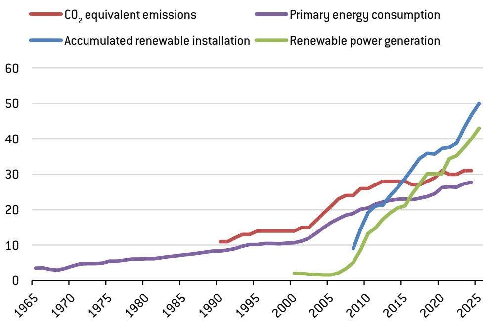  
Source: Bruegel based on International Renewable Energy Agency, Global Wind Energy Council, British Petroleum.

Figure 2: Chinese domestic energy production as a share of demand (%)  
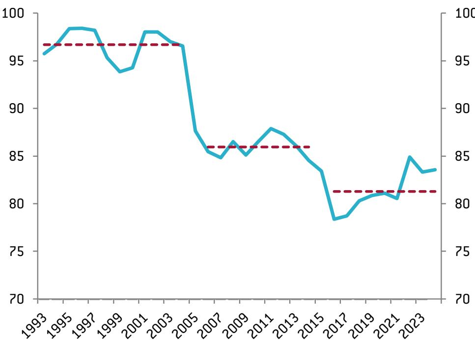  
Source: Bruegel based on National Bureau of Statistics.

The government's response was to frame the clean-energy transition as a dual-purpose project: reducing environmental externalities while restoring energy independence. From 2007, Beijing deployed an expanding toolkit of support measures, including the Development Plan for Renewable Energy, consistent efforts spanning multiple Five-Year Plans and the New Energy Security Strategy, as summarised in Table 1.

Table 1: Main renewable energy policy milestones in China

<table><tr><td>Period</td><td>Year</td><td>Policy</td><td>Content</td><td>Outcome</td></tr><tr><td>Preparation</td><td>2001</td><td>The 10th Five-Year Plan</td><td>Promoted renewable energy as long-term strategy for the sustainable development of the energy industry; planned to promote solar energy in resource-rich rural areas and accelerate the domestication of wind power supply chain</td><td></td></tr><tr><td rowspan="5">Exploration</td><td>2005</td><td>Renewable Energy Law</td><td>Provided a legal framework for the expansion of renewable energy sector with supportive policies including mandatory grid connection and purchase, favourable pricing and cost sharing</td><td></td></tr><tr><td>2007</td><td>11th Five-Year Plan</td><td>Targeted an increase in non-fossil fuel energy&#x27;s share of primary energy consumption to 8.1%</td><td>Non-fossil fuel energy&#x27;s share increased to 9.4% by 2010</td></tr><tr><td>2007</td><td>Medium and Long-term Development Plan for Renewable Energy</td><td>Targeted an increase in hydro power capacity to 190 GW, wind to 10 GW, and solar to 0.3 GW by 2010</td><td>Hydro power capacity increased to 220 GW, wind to 31 GW and solar to 0.86 GW by 2010</td></tr><tr><td>2010</td><td>Decision of the State Council on Accelerating the Cultivation and Development of Strategic Emerging Industries</td><td>Outlined renewable energy as a strategic energy industry and paved the way for more policy support</td><td></td></tr><tr><td>2011</td><td>12th Five-Year Plan</td><td>Targeted an increase in non-fossil fuel energy&#x27;s share of energy consumption to 11.4% by 2015, while increasing hydro power capacity to 290 GW, wind to 100 GW and solar to 21 GW</td><td>Non-fossil fuel energy&#x27;s share increased to 12.1%; hydro power capacity increased to 320 GW, wind to 130 GW and solar to 43 GW by 2015</td></tr><tr><td rowspan="2">Foundation</td><td>2014</td><td>New Energy Security Strategy (&#x27;Four Revolutions&#x27; and &#x27;One Cooperation&#x27;)</td><td>Formalised the central role of renewable energy in China&#x27;s energy security strategy and promoted a faster energy transition</td><td></td></tr><tr><td>2016</td><td>13th Five-Year Plan</td><td>Targeted an increase in non-fossil fuel energy&#x27;s share in energy consumption to 15% by 2020, while increasing hydro power capacity to 340 GW, wind to 210 GW and solar to 110 GW</td><td>Non-fossil fuel energy&#x27;s share increased to 15.9%; hydro power capacity increased to 370 GW, wind to 280 GW and solar to 250 GW by 2020</td></tr><tr><td rowspan="3">Acceleration</td><td>2020</td><td>‘3060&#x27; Dual Carbon Targets</td><td>Targeted at achieving carbon emission peak by 2030 and carbon neutrality by 2060</td><td></td></tr><tr><td>2022</td><td>14th Five-Year Plan for a Modern Energy System</td><td>Targeted an increase in non-fossil fuel energy&#x27;s share in energy consumption to 20% by 2025, while increasing hydro power capacity to 380 GW by 2025, and wind and solar combined to 1200 GW by 2030</td><td>Hydro power capacity increased to 445 GW, and wind and solar combined to 1760 GW by 2025</td></tr><tr><td>2025</td><td>Energy Law</td><td>Formalied the prioritised role of renewable energy in China&#x27;s energy system</td><td></td></tr></table>

Source: Bruegel.

The massive installation not only reversed China's reliance on imported energy but also fostered economies of scale that dramatically reduced the cost of renewable technology. Since 2010, the levelised cost of energy (LCOE) for solar photovoltaic power in China has fallen by approximately 90 percent, while onshore wind has declined by around 67 percent (IRENA, 2025). By 2025, as Figure 3 illustrates, the LCOE for both technologies had fallen below those of coal-fired and nuclear power.

Figure 3: Levelised cost of power generation by energy source (renminbi/kWh, 2025)  
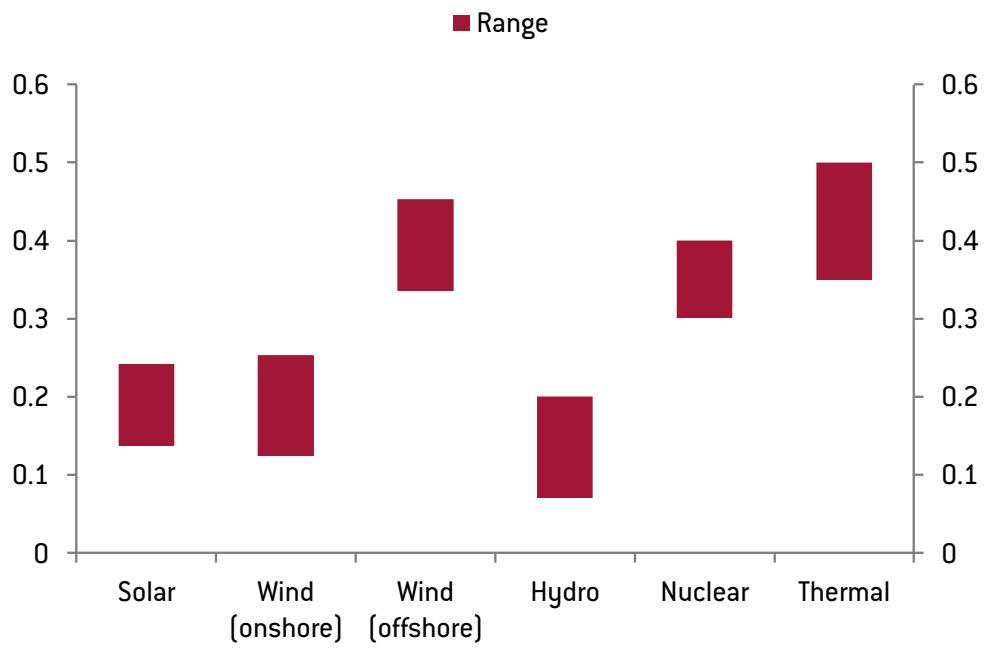  
Source: Bruegel based on China Power Equipment Management.

## 4 The hidden costs: subsidies, overcapacity and involution

## 4.1 The fiscal burden of renewable subsidies

China's renewable build-out was not achieved without substantial fiscal transfers. From 2011, the government levied a renewable power surcharge to fund a price floor for on-grid renewable electricity set materially above the benchmark coal power price (Figure 4). Official data indicates that the surcharge accumulated a deficit of 821 billion renminbi (\$126 billion) between 2012 and 2024, equivalent to 5.5 percent of total expenditure from the Government Fund account (Ministry of Finance of China, 2025).

Even after the formal removal of above-cost support in 2020, renewable power continued to be priced with reference to the benchmark coal tariff, effectively maintaining a floor price. Our estimate suggests that the embedded premium in renewable power pricing had generated an accumulative transfer of approximately 1.4 trillion renminbi (\$220 billion) as of 2024, exceeding the cumulative fiscal deficit from the renewable power surcharge. Figure 5 shows the evolution of effective subsidies over time.

Figure 4: China on-grid power price\* by energy source (RMB/kWh)  
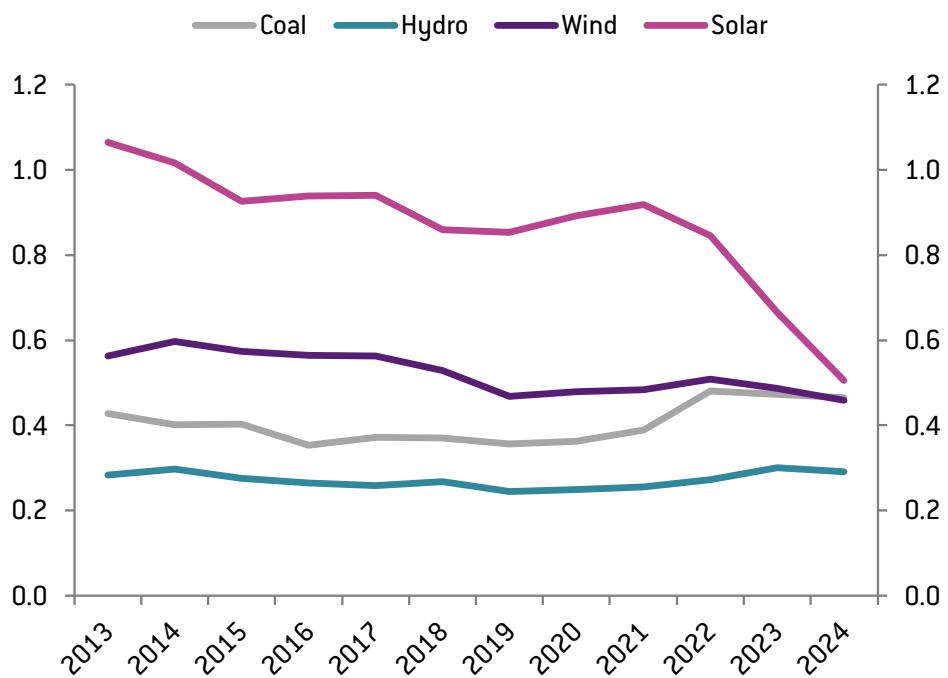  
Source: Bruegel based on National Energy Administration. Note: \* the on-grid power price is the amount the grid company pays to solar/wind farms after accounting for subsidies.

Figure 5: Effective subsidies from renewable power sales (RMB billions)  
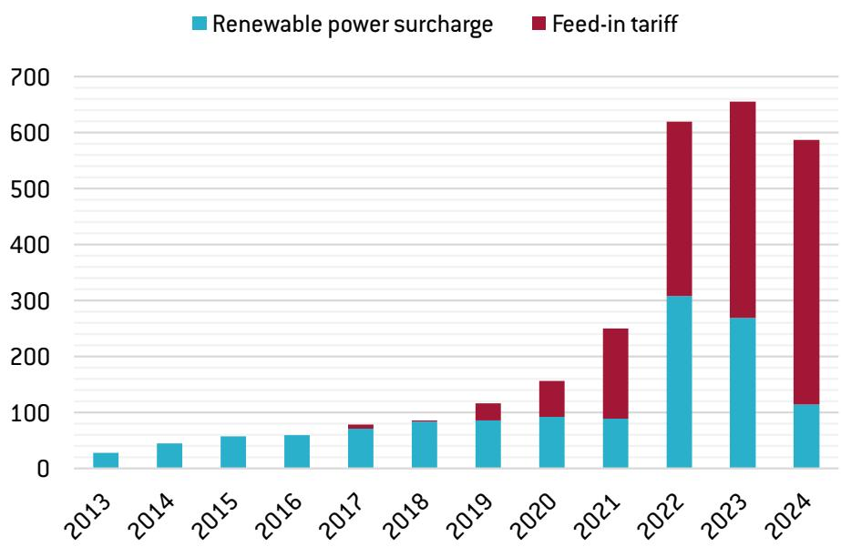  
Source: Bruegel based on China's Ministry of Finance.

## 4.2 The overcapacity problem

Following President Xi Jinping's announcement of China's 'dual-carbon' targets – peak carbon emissions by 2030 and carbon neutrality by 2060 (see section 2) – renewable equipment manufacturers dramatically expanded capital expenditure. Total solar manufacturing capacity increased by six to seven times across all production stages between 2020 and 2024 (Figure 6), reaching a level approximately twice the world's entire annual installation demand.

Figure 6: Chinese solar manufacturing capacity (GW)  
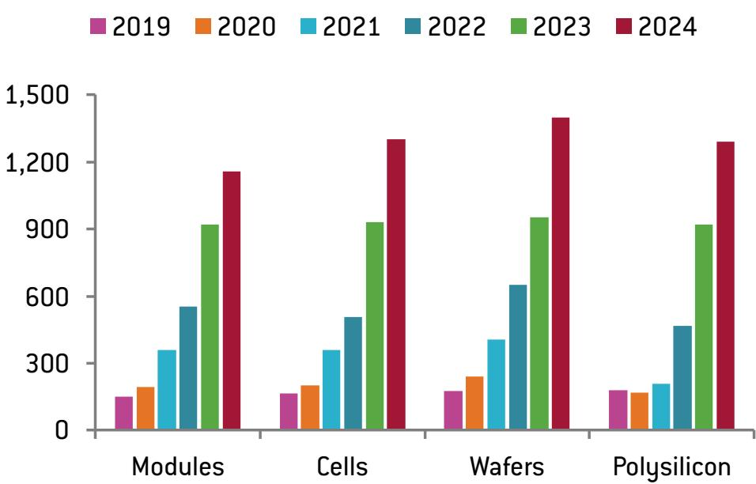  
Source: Bruegel based on Natixis.

Figure 7: Solar product prices (indexed, 3 November 2020 = 100)  
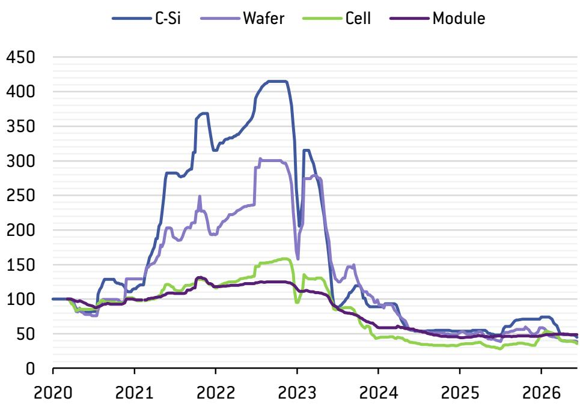  
Source: Bruegel based on Natixis, CEIC.

The surge in capacity proved poorly calibrated to demand. Overseas demand for Chinese renewable equipment decelerated sharply from 2023, as tighter financial conditions and deteriorating fiscal positions in many importing countries prompted reductions or elimination of renewable energy subsidies. Between 2023 and 2025, the value of China's solar module exports fell by more than 40 percent, while export volumes rose by approximately 60 percent, implying that export prices were cut by around two-thirds. Figure 7 tracks the resulting collapse in solar product prices.

The price war spread quickly to the domestic market and intensified into what Chinese commentators term 'involution' $^{6}$ (内卷; see section 2), eroding the viability of the industry as a whole. This mirrors the dynamics Garcia Herrero and Xu (2019) identified in earlier rounds of Chinese industrial overexpansion.

The financial consequences have been severe (Figure 8). The industry-wide return on equity for Chinese solar manufacturers collapsed from approximately 25 percent in 2022 to -5 percent in 2024, indicating sector-wide losses. The EBITDA-to-interest expense ratio deteriorated from roughly 34x to 8x over the same period, signalling rapidly declining debt-service capacity.

Figure 8: Renewable sector financial health  
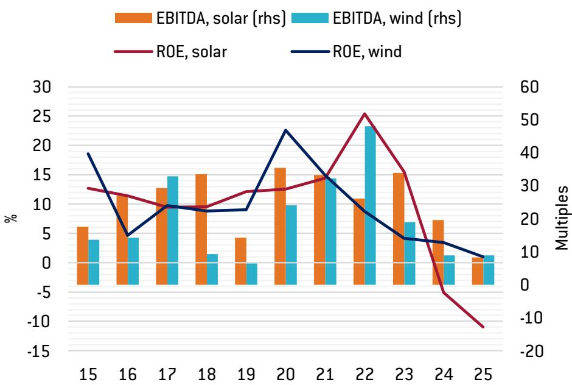  
Source: Bruegel based on company annual reports. Note: EBITDA = earnings before interest, taxes, depreciation and amortisation.

## 5 Infrastructure as a demand-side solution

## 5.1 The grid-generation gap

Since late 2024, Chinese authorities have publicly acknowledged the ‘involution’ dynamic and called on companies to exercise pricing discipline (see footnote 5). However, the structural economics of the renewable tech sector make voluntary restraint inherently unstable: with predominantly private ownership and highly fragmented production, the sector is caught by a textbook prisoner’s dilemma in which price-cutting remains the dominant individual strategy.

Accordingly, Chinese policymakers have shifted attention to the demand side, with power grid infrastructure as the primary lever. Renewable energy sources accounted for approximately 47 percent of China's total installed generation capacity as of 2025, yet contributed only around 22 percent of total electricity generation (Figure 9). This echoes Body's (2026) findings of not only intermittency but structurally inadequate transmission infrastructure.

Figure 9: China's power mix: installed capacity vs. generation (%)  
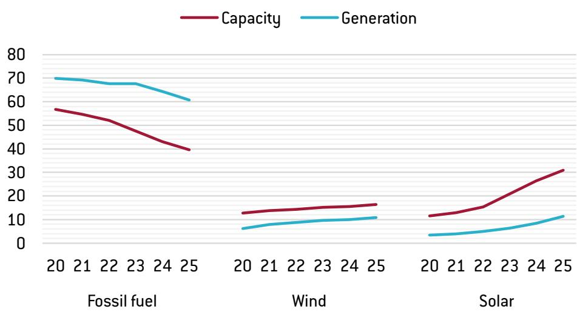  
Source: Bruegel based on Natixis, China Electricity Council.

Figure 10 illustrates the investment divergence that underlies this gap. Annual investment in power generation capacity accelerated from approximately 328 billion renminbi (\$50 billion) in 2019 to 1.2 trillion renminbi (\$185 billion) in 2024, driven by the rapid installation of solar and wind projects. Grid investment, which involves longer planning, regulatory approval and construction timelines, remained flat and failed to keep pace with the upstream generation expansion, elevating curtailment rates across renewable projects.

Figure 10: Chinese power investment by category (RMB billions)  
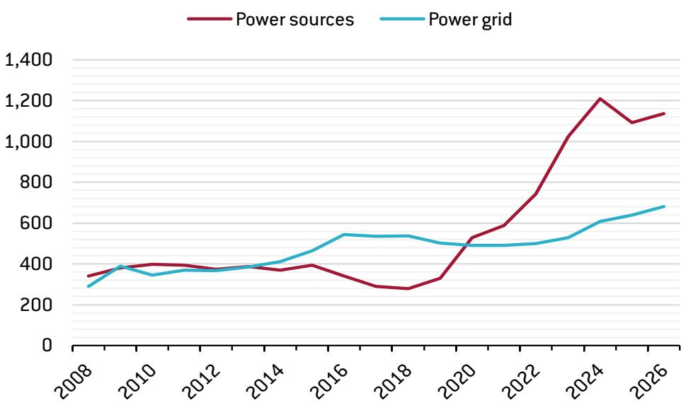  
Source: Bruegel based on Natixis, China Electricity Council.

Figure 11: Power supply surplus/deficit by region (TWh)  
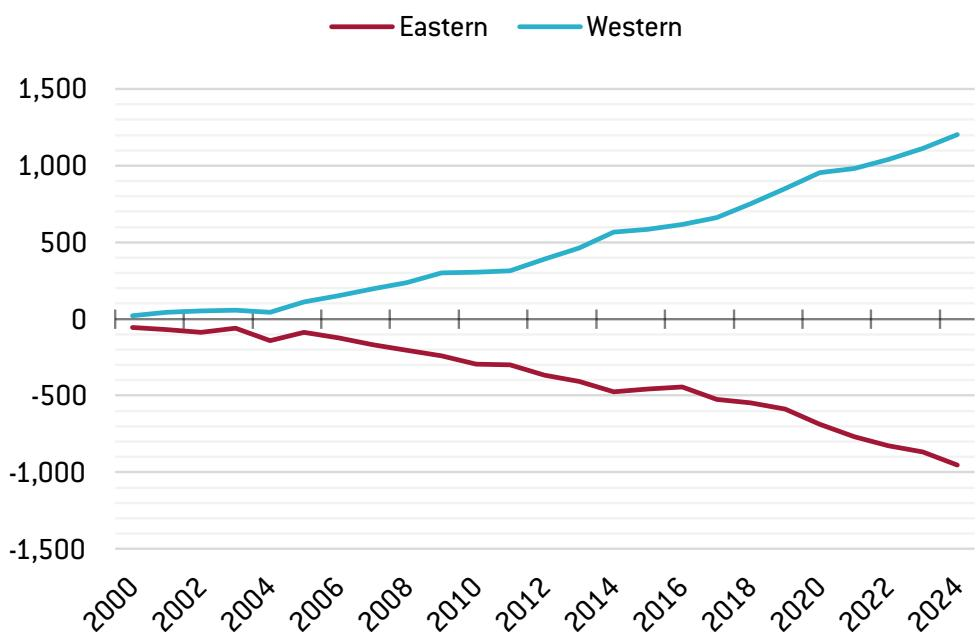  
Source: Bruegel based on China National Bureau of Statistics.

## 5.2 The east-west dimension

The geography of China's energy system imposes another fundamental structural challenge. China's most abundant wind and solar resources are concentrated in the sparsely populated western provinces, while electricity demand is heavily concentrated in the eastern coastal industrial centres. As Figure 11 shows, the east-west deficit in power supply has widened consistently, creating a mismatch that local grid infrastructure cannot resolve without long-distance, high-capacity transmission links. Therefore, the demand for large-scale, cross-regional grid infrastructure is ever growing.

In this context, China restarted the construction of ultra-high voltage (UHV) transmission lines in 2022, contributing to a 10 percent annual increase in grid investment over the next two years. In the first quarter of 2026, grid investment growth accelerated to 43 percent year-on-year.

## 6 Scenario analysis: the medium-term impact of infrastructure investment

## 6.1 Modelling framework

To assess the impact of infrastructure investment on China's renewable energy demand and manufacturing utilisation rates, we construct two stylised scenarios based on China Energy's forecast of power demand growth, incorporating binding policy targets, including raising the share of non-fossil fuels in total primary energy consumption to 25 percent by 2030 and 80 percent by 2060. We hold manufacturing capacity constant over the next decade and assume a modest increase in external demand for Chinese solar modules. Figure 12 sets out the baseline power demand trajectory.

Figure 12: Annual power demand forecast for China (TWh)  
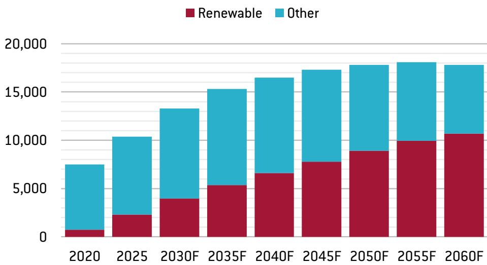  
Source: Bruegel.

The two scenarios are defined by contrasting assumptions about the demand effect of grid improvements, drawing on the theoretical dichotomy between demand frontloading and permanent demand stimulation under Jevons' paradox (Alcott, 2005; Jevons, 1865).

## 6.2 Scenario 1: demand frontloading

In the first scenario, improved grid infrastructure primarily accelerates, rather than augments, the overall demand trajectory. Better connectivity and lower curtailment rates incentivise faster installation between 2026 and 2030 by improving project economics, but the total volume of installations between 2030 and 2060 is correspondingly reduced as deferred projects are absorbed earlier. In this scenario, annual renewable demand increases by approximately 133 percent over the next five years, translating to solar and wind installation rates of approximately 320 GW and 170 GW per year by 2030 (Figure 13).

Figure 13: Scenario 1, five-year demand frontloading  
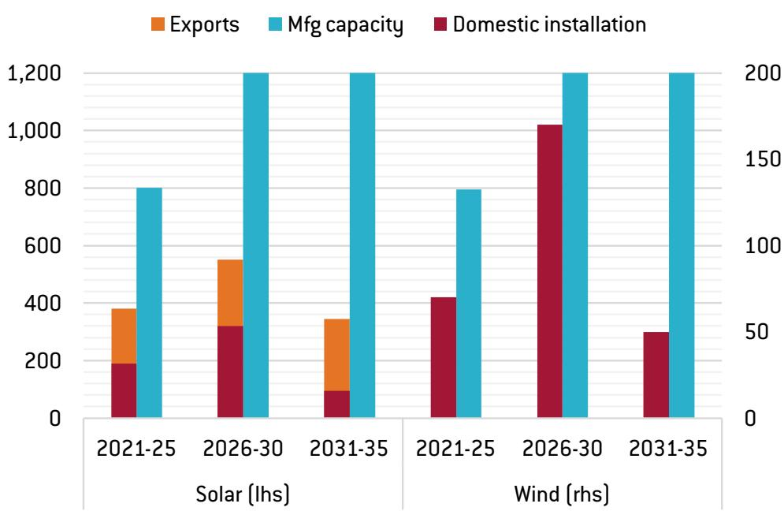  
Source: Bruegel.

The near-term relief is significant: wind equipment manufacturing utilisation rates would recover from approximately 53 percent in 2021–2025 to 85 percent in 2026–2030. However, after 2030, annual installation would fall sharply, pushing manufacturing utilisation to 29 percent and 25 percent for solar and wind respectively. In this scenario, infrastructure investment merely shifts the timing of overcapacity, rather than resolving it.

## 6.3 Scenario 2: demand uplift via the Jevons effect

The second scenario draws on Jevons' paradox: as the effective cost of consuming renewable electricity declines through improved grid efficiency and reduced curtailment, new applications become economically viable, generating additional electricity demand that would not otherwise materialise. We model a 1.2x positive shock to total renewable energy demand up to 2060, representing a structural expansion of demand. Figure 14 shows the resulting installation profile.

Figure 14. Scenario 2, 20 percent uplift in renewable demand  
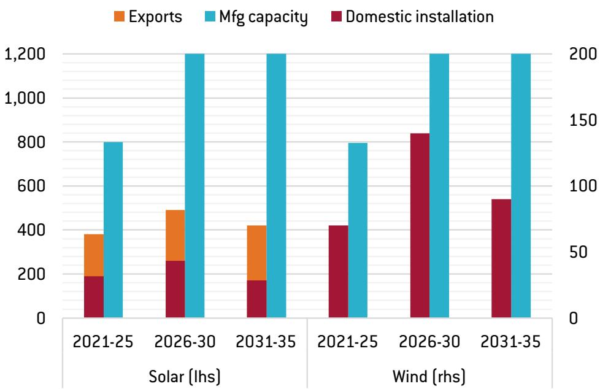  
Source: Bruegel.

This scenario produces a more modest near-term demand increase of approximately 108 percent, equivalent to annual solar and wind installation of 260 GW and 140 GW respectively. Manufacturing utilisation for wind reaches approximately 70 percent in 2026–2030 then declines gradually to 45 percent in 2031–2035. The longer-term trajectory is considerably more stable and avoids the sharp utilisation cliff associated with pure frontloading.

## 6.4 Summary

Table 2 summarises the utilisation outcomes in both scenarios. The real-world trajectory will almost certainly combine both effects. However, the critical finding is invariant to the scenario mix: even under optimistic demand assumptions, solar manufacturing utilisation rates will remain far below financially viable thresholds. The overcapacity problem is structural, not cyclical.

Table 2: Manufacturing utilisation rate projections in two scenarios (%)

<table><tr><td rowspan="2">Scenarios</td><td colspan="3">Solar mfg utilisation rate (%)</td><td colspan="3">Wind mfg utilisation rate (%)</td></tr><tr><td>2021-2025</td><td>2026-2030</td><td>2031-2035</td><td>2021-2025</td><td>2026-2030</td><td>2031-2035</td></tr><tr><td>5Y frontloading</td><td>48</td><td>46↓</td><td>29↓</td><td>53</td><td>85↑</td><td>25↓</td></tr><tr><td>20% uplift in demand</td><td>48</td><td>41↓</td><td>35↓</td><td>53</td><td>70↑</td><td>45↓</td></tr></table>

Source: Bruegel.

## 7 Conclusions

This paper has examined whether China's planned expansion of power-grid infrastructure can credibly resolve the structural overcapacity that has accumulated in its renewable energy manufacturing sector. Our analysis yields two main conclusions.

First, China's overcapacity problem is the direct consequence of a supply-driven industrial policy model that successfully achieved cost competitiveness and energy deployment at scale, but at the cost of a persistent and severe mismatch between manufacturing capacity and sustainable demand. As documented by García Herrero (2026), the policy instruments that propelled China to global leadership in renewables also created incentive structures that systematically encouraged overinvestment. The resulting involution dynamic has inflicted severe financial damage on manufacturers and brings material risks to the long-term viability of the sector's current structure.

Second, infrastructure investment is a necessary but insufficient condition for market rebalancing. The transmission gap between China's renewable-rich west and its energy-hungry east is real and material. Addressing this constraint will provide genuine near-term demand relief, and the State Grid's commitment to a 40 percent increase in capital expenditure over the next five years suggests the policy intent is credible. However, as our scenario analysis demonstrates, the demand boost from infrastructure improvement is insufficient to absorb the existing capacity surplus on a sustained basis. The infrastructure pivot has been the key policy lever, but our finding confirms that the overcapacity cannot be fixed through infrastructure demand stimulus alone.

## References

Alcott, B. (2005) 'Jevons' paradox', Ecological Economics 54(1): 9–21, available at https://doi.org/10.1016/j.ecolecon.2005.03.020

Body, P. (2026) 'China's power grid: leading the world and barely keeping up', CKGSB Knowledge, 4 January, available at https://english.ckgsb.edu.cn/knowledge/article/china-power-grid-challenges/

García Herrero, A. (2026) 'China green tech and its industrial policy', WIDER Working Paper 46/2026, UNU-WIDER, available at https://doi.org/10.35188/UNU-WIDER/2026/721-3

García Herrero, A. and H. Mu (2025) 'China can decarbonise the world – but even that won't fix its overcapacity problem', Analysis 34/2025, Bruegel, available at https://www.bruegel.org/analysis/china-can-decarbonise-world-even-wont-fix-its-overcapacity-problem

García Herrero, A. and J. Xu (2019) 'China's investment in Africa: what the data really say, and the implications for Europe', Bruegel Blog, 22 July, available at https://www.bruegel.org/blog-post/chinas-investment-africa-what-data-really-says-and-implications-europe

Hove, A. (2026) 'China's Messy Power Sector Mid-Game', OIES Energy Comment, April, Oxford Institute for Energy Studies, available at https://www.oxfordenergy.org/wpcms/wp-content/uploads/2026/04/Comment-Chinas-Messy-Power-Sector-Mid-Game.pdf

IEA (2024) Renewables 2024: Analysis and forecasts to 2030, International Energy Agency, available at https://www.iea.org/reports/renewables-2024

IEA (2025) World Energy Investment 2025, International Energy Agency, available at https://www.iea.org/reports/world-energy-investment-2025

IRENA (2025) Renewable Power Generation Costs in 2024, International Renewable Energy Agency, available at https://www.irena.org/-/media/Files/IRENA/Agency/Publication/2025/Jul/IRENA\_TEC\_RPGC\_in\_2024\_2025.pdf

Jevons, W.S. (1865) The Coal Question, Macmillan, available at https://oll.libertyfund.org/titles/jevons-the-coal-question

Ministry of Finance of China (2025) Report on Government Fund Account Revenues and Expenditures 2024

Myllyvirta, L. (2026) 'Analysis: China's CO2 climbs 2% in early 2026 due to "wasted" wind and solar', Carbon Brief, 4 June, available at https://www.carbonbrief.org/analysis-chinas-co2-climbs-2-in-early-2026-due-to-wasted-wind-and-solar/

© Bruegel 2026. Bruegel publications can be freely republished and quoted according to the Creative Commons licence CC BY-ND 4.0. Please provide a full reference, clearly stating the relevant author(s) and including a prominent hyperlink to the original publication on Bruegel's website. You may do so in any reasonable manner, but not in any way that suggests the author(s) or Bruegel endorse you or your use. Any reproduction must be unaltered and in the original language. For any alteration (for example, translation), please contact us at press@bruegel.org. Publication of altered content (for example, translated content) is allowed only with Bruegel's explicit written approval. Bruegel takes no institutional standpoint. All views expressed are the researchers' own.

Bruegel, Rue de la Charité 33, B-1210 Brussels (+32) 2 227 4210
info@bruegel.org
www.bruegel.org