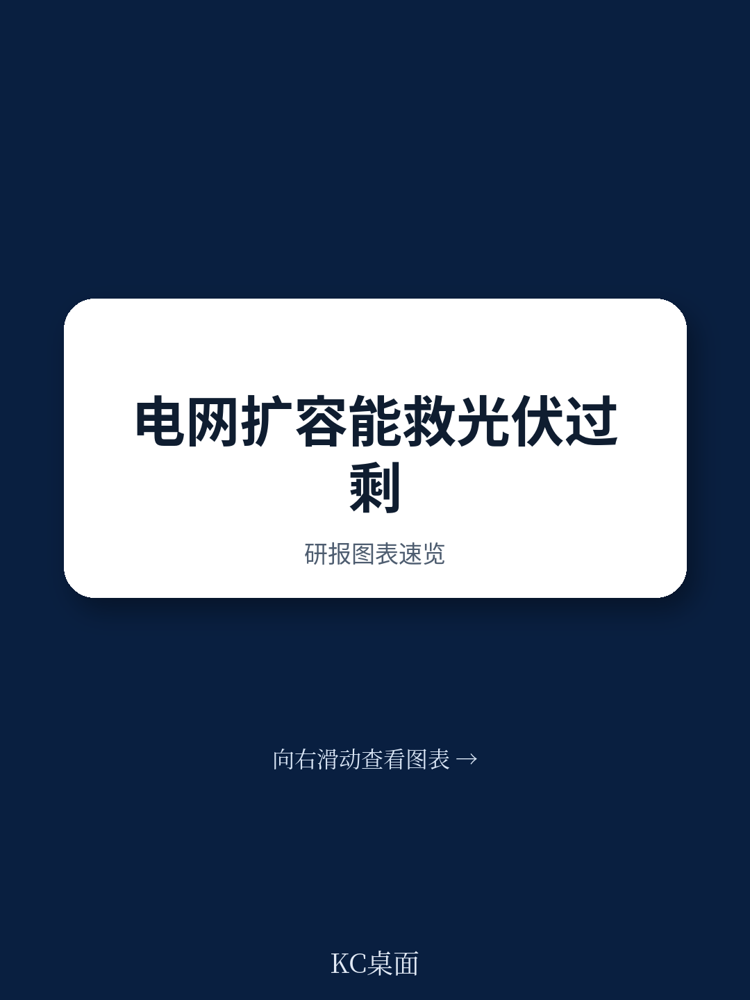
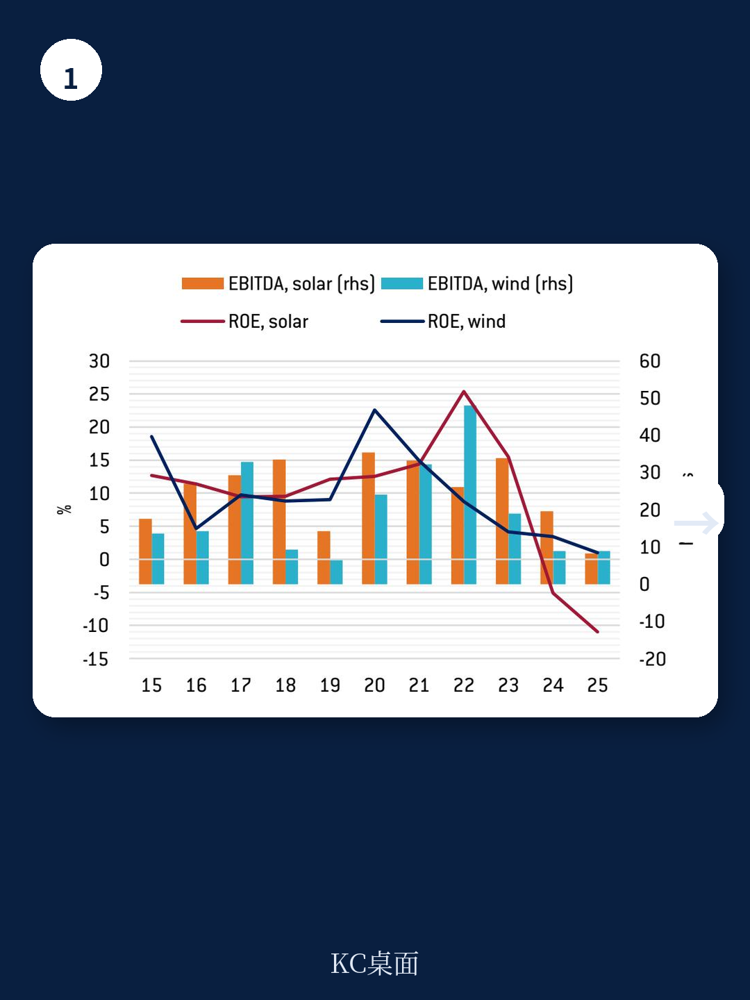
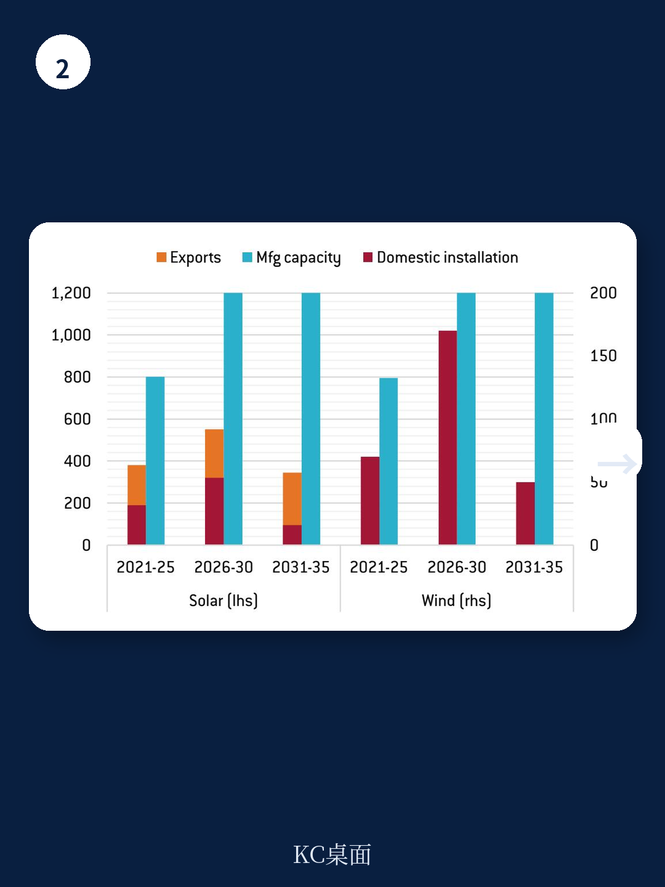

# 布鲁盖尔研究所：中国光伏行业利润率转负，布鲁盖尔研究所警告产能过剩是结构性的

中国在太阳能板、风机等可再生能源制造领域已占据全球主导地位，但这种成功付出了产能严重过剩的代价——全行业利润率正在被压缩至负值。市场普遍期待国家电网40%的资本支出扩张计划能成为解药。但布鲁盖尔研究所在最新发布的研报中给出了一个反直觉的判断：电网投资是必要但不充分的方案。即便在最乐观的基础设施投资假设下，太阳能制造产能利用率在2031-2035年间仍将降至29%-35%，远低于财务可持续的阈值。中国绿能制造业的产能过剩是结构性的，而非周期性的。

这份报告的核心价值在于，它没有停留在“产能过剩”这个已经被广泛讨论的结论上，而是用量化情景分析回答了“如果加大电网投资，到底能吸收多少过剩产能”。结果并不乐观。对于关注中国新能源产业链、全球能源转型投资逻辑以及中美欧贸易博弈的读者来说，这份报告提供了一个关键的分析框架：区分“需求侧缓解”和“供给侧出清”是两个完全不同的命题。

## 1. 中国的绿能制造业已经进入“内卷”式亏损，财务指标恶化速度超预期

报告用一组数据清晰地展示了问题的严重性。2020年至2024年间，中国太阳能制造总产能扩张了6至7倍，达到全球年安装需求的两倍。与此同时，2023年至2025年间，中国太阳能组件出口额下降超过40%，但出口量却上升约60%——这意味着出口价格被砍掉了约三分之二。

价格战迅速从出口市场蔓延至国内市场，演变为中国语境下的“内卷”。财务后果是残酷的：中国太阳能制造商的行业平均净资产收益率从2022年的约25%骤降至2024年的-5%，意味着全行业陷入亏损。EBITDA对利息支出的覆盖倍数从约34倍恶化至8倍，债务偿付能力正在快速削弱。

> **KC评论：** 8倍的EBITDA/利息覆盖倍数在制造业中仍算安全，但趋势方向比绝对值更重要。如果价格战持续，2025年这一指标可能进一步恶化至5倍以下，届时部分中小企业将面临现金流断裂风险。报告没有展开的是，这种财务压力是否会倒逼行业整合，以及整合的时间表和路径是什么——这些恰恰是完整报告中值得细读的部分。

继续看原文，真正有价值的是图表、假设和验证路径；完整报告与KC评论在每日汇编。

## 2. 补贴体系已积累约1.4万亿元隐性转移，远超官方赤字规模

报告揭示了一个容易被忽视的财政维度。自2011年起，中国政府对可再生能源电力征收附加费，用于补贴高于煤电标杆价的上网电价。官方数据显示，2012-2024年间，该附加费累计赤字达8210亿元人民币（约1260亿美元）。但报告指出，即便在2020年正式取消高于成本的补贴后，可再生能源电力仍参照煤电标杆价定价，实质上维持了一个隐性价格下限。

报告估算，截至2024年，这种隐性溢价已累计形成约1.4万亿元人民币（约2200亿美元）的转移支付，远超官方可再生能源附加费的累计赤字。这意味着，中国绿能产业的成本优势部分建立在财政转移支付的基础上，而这一隐性补贴规模之大，可能超出多数市场参与者的预期。

这个发现对理解行业竞争格局有直接含义：如果财政压力倒逼政府调整补贴机制，那些依赖隐性补贴生存的企业将面临更大的经营压力。但报告没有完全展开的是，这种隐性补贴的退出节奏和方式，将如何影响不同规模企业的竞争地位。

## 3. 电网投资确实在加速，但“传输缺口”的缓解效果被高估了

报告认可了中国在电网基础设施方面的努力。国家电网已承诺未来五年资本支出扩张40%，2026年第一季度电网投资同比增长43%，重点投向特高压输电网络。这些投资旨在解决中国可再生能源“西多东少”的区域错配问题——西部丰富的风光资源因输电能力不足而被大量弃用。

但报告的情景分析表明，即使采用最激进的假设——将五年内的电网投资需求集中前置——太阳能制造业的产能利用率在2026-2030年间也仅能从当前水平微幅改善至46%，随后在2031-2035年间进一步下滑至29%。在“需求提升20%”的温和情景下，这一指标更低，分别为41%和35%。

> **KC评论：** 这个结论的关键在于，电网投资解决的是“已装机发电量的消纳问题”，而不是“已建成制造产能的消化问题”。两者之间存在数量级的差异。中国太阳能制造产能已经是全球年安装需求的两倍，即便国内电网完全消纳所有新增可再生能源装机，也无法吸收制造端的过剩产能。这个逻辑链条在报告的图表和假设中有更详细的展开。

## 4. 报告尚未完全回答的关键问题：供给侧出清何时发生

这份报告最有价值的部分在于它明确指出了“电网投资不是万能药”，但同时也留下了一个尚未完全回答的问题：供给侧出清何时以及如何发生。

报告提到了“内卷”导致多家大型太阳能制造商进入技术性破产，但没有深入分析行业整合的具体路径。从历史经验看，中国制造业的产能出清往往不是通过市场化的破产清算完成的，而是通过地方政府干预下的兼并重组，或者通过出口市场扩张来消化过剩产能。但当前全球贸易环境正在收紧——欧盟和美国都在加征对中国绿能产品的关税——出口消化路径正在变窄。

报告也没有量化讨论“如果供给侧出清发生，需要淘汰多少产能才能恢复行业盈利”。这是一个对投资者和产业决策者都至关重要的变量。

## 5. 对读者的观察框架：区分“需求侧缓解”和“供给侧出清”是两个独立变量

综合这份报告的分析，我们可以提炼出一个实用的观察框架。对于跟踪中国新能源产业链的读者，需要同时追踪两个独立变量

第一个变量是需求侧缓解的速度和规模，包括国内电网投资进度、全球可再生能源装机增速、以及贸易政策变化对出口的影响。报告已经证明，即便这一变量表现最优，也无法单独解决问题。

第二个变量是供给侧出清的深度和节奏，包括行业亏损持续的时间、企业现金流断裂的临界点、以及地方政府对“僵尸企业”的容忍度。这个变量目前仍存在较大的不确定性。

两个变量的交叉决定了行业拐点的时间。如果供给侧出清加速而需求侧保持稳定，行业可能在2027年前后迎来盈利修复。如果供给侧出清被政策干预延缓，而需求侧又受贸易摩擦拖累，行业可能经历更长时间的“L型底部”。

这份报告的价值在于，它为读者提供了一个拒绝简单叙事的框架。当市场热议“电网投资利好新能源板块”时，报告提醒我们：基础设施投资解决的是电力消纳问题，不是制造产能过剩问题。这两个问题需要不同的政策工具和市场机制来解决。

---

以上是基于布鲁盖尔研究所研报的分析与延伸。更多国际信源汇编与KC评论，欢迎扫码交流。每日更新，汇总国际主流叙事、数据与图表，观测边际变化。每日汇编会将单篇报告放回当天主线，整理成中文摘要、KC评论和图表合集，便于喂给AI，也便于人工快速扫描市场动态。目前汇聚了头部券商、PE/VC、投行、并购、对冲基金、资管机构、战略咨询、智库等朋友，期待交流。

Personal reading notes and learning share only. Not investment advice.
