Talent Abroad

## A Review of Greek Emigrants

# A Review of Greek Emigrants

This work is issued under the responsibility of the Secretary-General of the OECD, and does not necessarily reflect the official views of OECD Member countries.

This document, as well as any data and map included herein, are without prejudice to the status of or sovereignty over any territory, to the delimitation of international frontiers and boundaries and to the name of any territory, city or area.

The statistical data for Israel are supplied by and under the responsibility of the relevant Israeli authorities. The use of such data by the OECD is without prejudice to the status of the Golan Heights, East Jerusalem and Israeli settlements in the West Bank under the terms of international law.

## Note by the Republic of Türkiye

The information in this document with reference to “Cyprus” relates to the southern part of the Island. There is no single authority representing both Turkish and Greek Cypriot people on the Island. Türkiye recognises the Turkish Republic of Northern Cyprus (TRNC). Until a lasting and equitable solution is found within the context of the United Nations, Türkiye shall preserve its position concerning the “Cyprus issue”.

Note by all the European Union Member States of the OECD and the European Union

The Republic of Cyprus is recognised by all members of the United Nations with the exception of Türkiye. The information in this document relates to the area under the effective control of the Government of the Republic of Cyprus.

Please cite this publication as:

OECD (2026), A Review of Greek Emigrants, Talent Abroad, OECD Publishing, Paris, https://doi.org/10.1787/729f06a5-en.

ISBN 978-92-64-51275-7 (print)
ISBN 978-92-64-99894-0 (PDF)
ISBN 978-92-64-47223-5 (HTML)

Talent Abroad
ISSN 2790-282X (print)
ISSN 2790-2838 (online)

Photo credits: Cover © Colin Anderson/Blend Images/Inmagine LTD.

Corrigenda to OECD publications may be found at: https://www.oecd.org/en/publications/support/corrigenda.html.

## Attribution 4.0 International (CC BY 4.0)

This work is made available under the Creative Commons Attribution 4.0 International licence. By using this work, you accept to be bound by the terms of this licence (https://creativecommons.org/licenses/by/4.0/).

Attribution – you must cite the work.

Translations – you must cite the original work, identify changes to the original and add the following text: In the event of any discrepancy between the original work and the translation, only the text of the original work should be considered valid.

Adaptations – you must cite the original work and add the following text: This is an adaptation of an original work by the OECD. The opinions expressed and arguments employed in this adaptation should not be reported as representing the official views of the OECD or of its Member countries.

Third-party material – the licence does not apply to third-party material in the work. If using such material, you are responsible for obtaining permission from the third party and for any claims of infringement.

You must not use the OECD logo, visual identity or cover image without express permission or suggest the OECD endorses your use of the work.

Any dispute arising under this licence shall be settled by arbitration in accordance with the Permanent Court of Arbitration (PCA) Arbitration Rules 2012. The seat of arbitration shall be Paris (France). The number of arbitrators shall be one.

# Foreword

Emigration is often framed as a challenge for countries of origin, particularly when it coincides with skills shortages or demographic pressures. At the same time, emigrants constitute a significant reservoir of human capital that can contribute to economic and social development. Through their trajectories abroad, emigrants accumulate skills, work experience and international networks that can support trade, investment, knowledge transfer and innovation. Such contributions can take place through a range of mobility pathways, including skills circulation as well as short-term or permanent return, underscoring the importance of both sustained engagement with the diaspora currently abroad and policies that encourage and facilitate return migration.

Realising this potential requires sustained engagement with emigrant populations and the development of policies that are responsive to their needs and trajectories. A key prerequisite is the availability of robust evidence on the scale, composition and dynamics of emigration. This includes understanding who has left the country, when and where they have migrated, the factors shaping these movements, and the socio-demographic characteristics, skills profiles and labour market outcomes of emigrants in destination countries. It also requires insight into emigrants' aspirations, including intentions regarding circulation, return or permanent settlement abroad, as well as their perceptions of the economic, institutional and administrative barriers that may hinder return or slow reintegration. Such knowledge is essential for the design of effective and differentiated strategies for diaspora engagement, return migration and reintegration.

Addressing these questions requires bringing together evidence from multiple, complementary data sources. This report takes OECD migration databases as its analytical starting point, notably the OECD Database on Immigrants in OECD Countries (DIOC), which provides destination-country information on the size, geographic distribution, educational attainment and labour market outcomes of Greek-born emigrants across OECD countries. This analysis is complemented by census-based evidence on return migration to Greece, a large-scale database mapping Greek scientist in Greece and abroad, and selected survey data sources that shed light on migrants' trajectories, intentions and experiences. Together, these sources provide a comprehensive view of Greek emigration, skills circulation and return.

This report is part of the OECD's series of country reviews on Talent Abroad, which aims to provide accurate, up-to-date and dynamic evidence on emigrant populations by country of origin. Drawing on comparative analysis and accumulated experience across countries, these reviews support the formulation of policy recommendations on how to engage emigrants more effectively, facilitate return and circular mobility, and mobilise skills to support economic and social development at home.

The present volume focusses on Greece, a country that has experienced sustained emigration over the past two decades alongside profound economic adjustment and, more recently, a phase of recovery. Against the backdrop of evolving labour market needs, demographic change and renewed mobility dynamics, the report provides an in-depth analysis of the Greek-born population residing abroad, examining its size and geographical distribution, socio-demographic and educational profile, labour market outcomes in destination countries, and recent emigration and return trends. Particular attention is paid to students and researchers, reflecting Greece's strong integration into international education and research networks and the importance of scientific mobility within the broader skills landscape.

New to this edition, the report also includes a dedicated chapter on Greece's institutional and policy framework for diaspora engagement and return. It reviews key actors and recent policy developments, and examines how measures on engagement, return migration, research and innovation, and labour market integration interact to support skills circulation and reintegration.

## Acknowledgements

This review was written by Lisa Andersson and Isobel McPhee. The OECD Secretariat gratefully acknowledges the support of the Greek National Documentation Centre (EKT) and its Director, Dr. Kyriakos Tolias, for funding and monitoring this study, and extends its sincere thanks to the Greek Ambassador to the OECD, Professor George Pagoulatos, for his support of the project and for providing insightful feedback. The authors are also particularly grateful for the support, contributions and feedback received from Dr. Stylianos Ioannis Tzagkarakis, Dr. Grigorios Painesis, Dr. Dimitris Stogiannis and Dr. Eleni Malliou at EKT during the implementation of the project (contributing to the ideation, conceptualisation, review, synthesis and providing data). The Secretariat is grateful to Katerina Kalioti and the Hellenic Statistical Authority (ELSTAT) for providing additional data, and the Greek Ministry of Foreign Affairs, in particular the Secretariat General of Greece Abroad and Public Diplomacy, for their input and feedback. This publication further benefited from comments from Jean-Christophe Dumont. Finally, the authors would like to thank Philippe Hervé and Taehoon Lee for their help with OECD data sources, and Dominika Andrezejczak, Marie-Aurélie Elkurd and Lucy Hulett for their editorial assistance.

## Table of contents

Foreword 3   
Acknowledgements 5   
Acronyms and abbreviations 11   
Executive summary 12   
1 An overview of the numbers and locations of Greek emigrants abroad 14   
In Brief 15   
Introduction 16   
Historical patterns and drivers of Greek emigration to OECD countries 17   
Two decades of Greek emigration: Patterns, drivers, and shifts 18   
Demographic patterns and characteristics of the Greek-born population abroad 22   
Destination patterns of Greek emigrants: Stability and new growth corridors 26   
Who lives where? 29   
Citizenship acquisition patterns among Greek emigrants 40   
Annex 1.A. Supplementary tables 43   
References 44   
Notes 44   
2 Recent trends in emigration from Greece 45   
In Brief 46   
Introduction 47   
Greek emigration to all destination countries 47   
Greek emigration to OECD destination countries 48   
Net migration trends highlight shifting mobility pressures and recovery dynamics 53   
Gender patterns in Greek emigration inflows across destination countries 55   
References 57   
Notes 57   
3 Labour market outcomes in destination countries 58   
In Brief 59   
Introduction 60   
The labour market outcomes of Greek-born emigrants 64   
The occupational profile of Greek emigrants 70   
Intra-OECD mobility of Greek doctors 77   
Remittances to Greece 80

References 83   
4 Return migration to Greece 84   
In Brief 85   
Introduction 86   
Historical and recent trends in return migration 87   
Characteristics of return migrants 89   
Motivations and reasons for return 99   
Labour market integration of return migrants 102   
Return intentions among Greeks abroad 114   
References 117   
Annex 4.A. Supplementary tables 118   
5 Greek emigrants engaged in research and study abroad 120   
In Brief 121   
Introduction 122   
International mobility of Greek students 124   
The emigration of Greek doctoral holders 132   
Insights into the return of Greek PhD holders 138   
Greek-origin scientific diaspora and researcher mobility patterns 141   
The return of Greek researchers: Trends, drivers and barriers 146   
References 152   
Annex 5.A. Supplementary tables 153   
Notes 154   
6 Strengthening Greece's framework for engaging with its diaspora and facilitating return 155   
Introduction 156   
Evolution of Greece's diaspora and return-migration policies 156   
Institutional landscape for diaspora engagement 158   
Key policy domains and recent reforms 160   
International experience of diaspora engagement and return migration policy 170   
Conclusions and suggested ways forward for Greece 173   
References 175

## FIGURES

Figure 1.1. The majority of Greek emigrants are living in OECD countries 18  
Figure 1.2. The stock of Greek-born emigrants in OECD countries has been on the rise since 2005 20  
Figure 1.3. The stock of Greek emigrants has been growing steadily but at a modest rate over the past decade 21  
Figure 1.4. Emigration rates from Greece are high relative to other OECD European countries 22  
Figure 1.5. Just over half of Greek emigrants are men 23  
Figure 1.6. The age profile of Greeks who remained in Greece is slightly younger than that of the emigrant population 24  
Figure 1.7. The share of Greek emigrants of working age has declined over time 25  
Figure 1.8. Most Greek emigrants are married, but men are more likely to be single 26  
Figure 1.9. Germany has remained host to the largest number of Greek emigrants over the last decade 27  
Figure 1.10. The number of Greek emigrants living in the United States, Canada, and Australia has consistently declined since 2000/01 28  
Figure 1.11. Greek-born men outnumber women in many major destination countries 30  
Figure 1.12. Greek emigrants of working age are largely concentrated in European OECD countries 31  
Figure 1.13. Greek emigrants to Sweden are highly concentrated in the Stockholm region 36

Figure 1.14. In Canada, Greek emigrants are mainly settled in Ontario and Quebec 37
Figure 1.15. In Australia, Greek emigrants are heavily concentrated in the states of Victoria and New South Wales 38
Figure 1.16. In the United States, Greek emigrants are predominantly concentrated in states with major metropolitan areas 39
Figure 1.17. A high share of Greek-born emigrants acquired citizenship in traditional, more distant destination countries 40
Figure 1.18. Acquisition of nationality in the United Kingdom has been increasing over the past decade 41
Figure 1.19. Acquisitions of nationality in Switzerland and Belgium have increased since 2020 42
Figure 2.1. Outflows of Greek emigrants peaked during the crisis years, but have been steadily declining ever since 47
Figure 2.2. Inflows of Greek citizens to OECD countries peaked between 2012 and 2019 49
Figure 2.3. Inflows of Greek citizens to Australia have been declining since 2014 50
Figure 2.4. Inflows of Greek citizens to Germany increased sharply during the financial crisis but stabilised in recent years 51
Figure 2.5. Inflows of Greek citizens to the Netherlands have risen steadily over the past two decades, with a slight decline in 2023 and 2024 52
Figure 2.6. Despite year-to-year variation, inflows of Greek citizens to Nordic countries show an overall upward trend since 2005 53
Figure 2.7. Net migration of Greek citizens to selected European destinations has remained positive since 2008, with the largest increases in the Netherlands and Switzerland 54
Figure 2.8. In 2024, net migration flows to Germany were negative for the first time since 2009 55
Figure 2.9. Less than half of Greek emigrants to Australia, Canada and the United States are women 56
Figure 2.10. The share of women among Greek emigrant inflows to Nordic countries has risen steadily 56
Figure 2.11. Women remain a minority among Greek emigrant inflows to most Western and Central European destinations 57
Figure 3.1. Over half of Greek emigrants in selected destination countries have medium or high educational attainment 61
Figure 3.2. Greek-born emigrants are more likely to have high educational attainment, while native-born populations are more often medium-educated in major destination countries 62
Figure 3.3. Greek-born women living in OECD countries are slightly more likely to have achieved high educational attainment than their male counterparts 63
Figure 3.4. Recent cohorts of Greek-born migrants exhibit higher levels of educational attainment in OECD countries 64
Figure 3.5. Greek-born emigrants have very similar employment rates to the native born in the host country 65
Figure 3.6. Outcomes for Greek-born and native-born populations in the host country are broadly similar across major destination countries, though notable cross-country variation persists 66
Figure 3.7. Employment rates of Greek-born emigrants are the highest in the United Kingdom and Switzerland 67
Figure 3.8. Low-educated emigrants in France show particularly low employment rates 68
Figure 3.9. Greek-born migrants faced higher unemployment than native-born populations in most major destination countries in 2020/21 69
Figure 3.10. Greek-born women experienced substantially higher unemployment than their native-born peers in Canada, Germany and Switzerland in 2020/21 70
Figure 3.11. Across the OECD, Greek-born workers are predominantly employed in medium and high-skilled occupations 71
Figure 3.12. Greek-born emigrants show a stable occupational skill structure across major destination countries over time 72
Figure 3.13. Greek-born emigrants are often underrepresented in medium skilled positions when compared with their native-born counterparts 73
Figure 3.14. The largest shares of Greek emigrants are employed as professionals and in clerical and support occupations 74
Figure 3.15. Greek-born women are more likely than men to work in medium- or high-skilled occupations 75
Figure 3.16. Greek-born workers are present both in knowledge-intensive professions and in lower-skill service and clerical roles 76
Figure 3.17. In Switzerland and France, Greek-born workers are less likely to be overqualified than the native-born population 77
Figure 3.18. Four in five foreign trained physicians in Greece are Greek born 78
Figure 3.19. The number of Greek-born doctors has tripled between 2000/01 and 2020/21 79
Figure 3.20. Greece is a net sender of doctors to several EU/EEA countries 80
Figure 3.21. Remittances to Greece peaked during the financial crisis 81

Figure 3.22. In 2024, about two-thirds of all remittances to Greece originating from OECD countries came from the United States, the United Kingdom and Germany 82
Figure 3.23. Remittances from Central and Eastern Europe, Central and South Africa, and Western Asia have been on the rise in recent years 83
Figure 4.1. Greece shifted from negative to positive net migration in the period between 1970-2000 88
Figure 4.2. Beginning in 2021, inflows of Greek citizens to Greece have consistently increased 89
Figure 4.3. Return migration to Greece was higher in 2006-2011 than in 2016-2021 90
Figure 4.4. A larger share of return migrants are men 91
Figure 4.5. A majority of return migrants are aged 20-39, especially in recent returns 92
Figure 4.6. A majority of return migrants have completed tertiary education 93
Figure 4.7. Educational attainment is higher among more recent return cohorts 94
Figure 4.8. Four in five return migrants previously resided in another European country 95
Figure 4.9. The most common countries of previous residence are Germany and the United Kingdom 96
Figure 4.10. In eight of Greece's 13 regions, more than half of return migrants are coming from other countries within the EU 98
Figure 4.11. Greek return migrants from Northern and Central Greece are more likely to return to their region of birth than those from the Attica region or the Aegean Islands and Crete 99
Figure 4.12. Repatriation is a growing reason for return among Greeks emigrants 100
Figure 4.13. Returns for work play a less prominent role among those returning from North America and Oceania 101
Figure 4.14. Repatriation was the most commonly cited reason for return among all age groups 102
Figure 4.15. Economic activity patterns reflect gradual labour market reintegration among recently returned migrants 103
Figure 4.16. Employment rates are lower among more recent return cohorts 104
Figure 4.17. Greek return migrants show slightly lower employment outcomes than non-migrants, especially among older cohorts 105
Figure 4.18. Unemployment rates are most pronounced among those returning during the onset of the economic crisis 106
Figure 4.19. Unemployment rates are lower among highly skilled return migrants 107
Figure 4.20. Higher unemployment among more recent returnees suggests gradual labour market integration, with doctoral graduates experiencing the lowest adjustment barriers 108
Figure 4.21. Half of all return migrants work in professional or managerial positions 109
Figure 4.22. Return migrants are more likely to be health or science and engineering professionals, while non-migrants are more likely to be teaching professionals 110
Figure 4.23. Professional specialisation among return migrants differs slightly by time since return 111
Figure 4.24. Recent migrants are less likely to be self-employed with personnel compared to those who have been back longer 112
Figure 4.25. Self-employment is more common among those who have not lived abroad 113
Figure 4.26. Among the economically inactive, return migrants are more likely to be students and less likely to be pensioners when compared to non-migrants 114
Figure 4.27. More functional institutions and greater labour market meritocracy are believed to encourage emigrants to return 116
Figure 5.1. Over half of young adults (ages 20-24) in Greece are enrolled in higher education 124
Figure 5.2. Overqualification and unemployment rates of young professionals in Greece are above the EU/OECD averages 125
Figure 5.3. International student mobility from Greece has remained relatively stable, with a slight decline in recent years 126
Figure 5.4. The United Kingdom remains the leading destination country for Greeks undertaking tertiary studies abroad 127
Figure 5.5. The United Kingdom experienced a sharp decline in Greek student enrolment in 2022 128
Figure 5.6. Germany, Bulgaria and the Netherlands have seen rising enrolment of Greek students 129
Figure 5.7. Greek students' enrolment in bachelor's degrees has increased modestly in recent years 130
Figure 5.8. Greek students favour the United Kingdom for undergraduate and PhD degrees 130
Figure 5.9. Greek enrolment in bachelor's programmes abroad has been rising in the Netherlands and declining in the United Kingdom 131
Figure 5.10. Bulgaria and the Netherlands are emerging as primary destinations for Greek students completing their master's degree abroad 132
Figure 5.11. Number and share of Greek PhD holders in OECD countries in 2020/21 and 2015/16 133
Figure 5.12. One in three Greek emigrants with a PhD is aged 35-44 134
Figure 5.13. About one in seven new Greek PhD holders intend to settle abroad 135

Figure 5.14. Over half of PhD holders intending to settle abroad studied natural sciences or medical and health sciences 136  
Figure 5.15. Continuation of research activity and pursuing one's academic career are the leading reasons for Greek PhD holders to settling abroad 137  
Figure 5.16. The United States, the United Kingdom, and Germany are the leading destinations of interest for Greek PhD holders intending to settle abroad 138  
Figure 5.17. Four in five returning Greek doctoral holders are between the ages of 30-49 139  
Figure 5.18. Over four in five returning Greek PhD holders are coming from Europe 140  
Figure 5.19. Just under half of Greek PhD holders return for the purpose of repatriation 141  
Figure 5.20. Inflows and outflows of scientific authors by last main recorded affiliation (%), 2021 143  
Figure 5.21. Greek-origin scientists are concentrated in biomedical research 145  
Figure 5.22. Top performing Greek-origin scientists are located abroad 146  
Figure 5.23. A majority of surveyed Greek academics abroad have poor perceptions of Greek universities 147  
Figure 5.24. Greek academics from Canada are most interested in returning to Greece 148  
Figure 5.25. Greek academics without stable long-term positions are most interested in returning to Greece 149  
Figure 5.26. Greek academics in the arts, law, and humanities are most interested in returning to Greece 149  
Figure 5.27. Greek academics who completed their studies abroad are more likely to be interested in return than those who studied in Greece 150  
Figure 5.28. Higher salaries are the top recommendation to incentivise the return of Greek academics from abroad 151

## TABLES

Table 1.1. The Greek-born population in the Netherlands, Norway, and Ireland about tripled between 2010/11 and 2020/21 29
Table 1.2. Germany, the United States, and Australia, the three countries with largest Greek-born emigrant population, show sizeable diasporas 32
Table 4.1. The share of returnees to the Athens metropolitan area is higher in 2021 than it was in 2011 97
Table 5.1. The United States is the most common country of affiliation for Greek-origin scientists 144
Table 6.1. Overview of main policy domains and key policies and initiatives 162

Annex Table 1.A.1. All destination countries for Greek-born emigrants in the OECD 2000/01 to 2020/21 43
Annex Table 4.A.1. Main descriptive statistics, by return migrants and non-migrants 118
Annex Table 4.A.2. Economic activity rate of Greek return migrants by region, % 119
Annex Table 5.A.1. Overview of population definitions used in the chapter 153
Annex Table 5.A.2. Research fields of Greek-origin scientists affiliated in Greece and abroad 154
Annex Table 5.A.3. Characteristics of Greek-origin scientists' publishing in Greece and abroad 154

## Acronyms and abbreviations

<table><tr><td>AADE</td><td>Independent Authority for Public Revenue (Greece)</td></tr><tr><td>ACS</td><td>American Community Survey</td></tr><tr><td>AHEPA</td><td>American Hellenic Educational Progressive Association</td></tr><tr><td>AHI</td><td>American Hellenic Institute</td></tr><tr><td>DIOC</td><td>Database on Immigrants in OECD Countries</td></tr><tr><td>DYPA</td><td>Public Employment Service (Greece)</td></tr><tr><td>EADD</td><td>National Archive of Doctoral Theses (Greece)</td></tr><tr><td>EEA</td><td>European Economic Area</td></tr><tr><td>EKT</td><td>National Documentation Centre (Greece)</td></tr><tr><td>ELIDEK</td><td>Hellenic Foundation for Research and Innovation</td></tr><tr><td>ELSTAT</td><td>Hellenic Statistical Authority</td></tr><tr><td>EMBO</td><td>European Molecular Biology Organization</td></tr><tr><td>ESCO</td><td>European Skills, Competences, Qualifications and Occupations</td></tr><tr><td>EU</td><td>European Union</td></tr><tr><td>EURES</td><td>European Employment Services</td></tr><tr><td>EUNIC</td><td>European Union National Institutes for Culture</td></tr><tr><td>GDP</td><td>Gross Domestic Product</td></tr><tr><td>GGAE</td><td>General Secretariat for Greeks Abroad (Greece)</td></tr><tr><td>ICT</td><td>Information and Communication Technologies</td></tr><tr><td>ISCED</td><td>International Standard Classification of Education</td></tr><tr><td>ISCO</td><td>International Standard Classification of Occupations</td></tr><tr><td>MFA</td><td>Ministry of Foreign Affairs (Greece)</td></tr><tr><td>MOUs</td><td>Memoranda of Understanding</td></tr><tr><td>SAE</td><td>World Council for Hellenes Abroad</td></tr><tr><td>SEESOX</td><td>South East European Studies at Oxford</td></tr><tr><td>UNDESA</td><td>United Nations Department of Economic and Social Affairs</td></tr><tr><td>WHIA</td><td>World Hellenic Inter-Parliamentary Association</td></tr></table>

## Executive summary

Today, more than 800 000 Greek-born individuals reside in OECD countries, forming a large, diverse and predominantly well-established diaspora. Many more people of Greek origin or Greek descent are residing outside of Greece. Greece's contemporary migration landscape reflects the combined influence of long-standing historical migration pathways and the profound economic shifts of the past two decades. Although Greek emigrants remain highly concentrated in a limited number of destination countries, the geography of emigration has evolved. Traditional settlement countries such as Germany, the United States, Australia and Canada continue to host sizeable and multi-generational communities, yet since the sovereign debt crisis Greek mobility has increasingly reoriented toward Northern and Western Europe, as part of intra-European circulation. At the same time, the profile of the diaspora is changing, with younger and more highly educated cohorts gaining importance.

A defining feature of recent Greek emigration is its strong educational selectivity. Across OECD countries, more than two-thirds of Greek-born emigrants hold medium or high levels of education, and recent cohorts are even more highly qualified. This pattern is reflected in the broad occupational footprint of the diaspora, which spans high-skill scientific, technical and professional roles alongside service-sector and clerical employment. Particularly notable is the sustained mobility of Greek-trained medical professionals, whose numbers abroad have tripled since 2000/01. This trend underscores Greece's deep integration into international professional labour markets, while also highlighting the importance of ensuring the long-term sustainability of domestic health-care capacity.

Labour market integration of Greek emigrants abroad is generally strong. Greek emigrants display high labour-force participation rates, often equal to or exceeding those of native-born populations in destination countries. Employment outcomes vary across host countries and population groups, and Greek-born women can encounter lower employment rates or greater job-quality challenges in several European labour markets. Nonetheless, more than half of all Greek-born emigrants work in medium or high-skilled occupations in all major destination countries.

Return migration has re-emerged as a meaningful component of Greece's mobility cycle. Since 2021, estimated annual inflows of returning Greek citizens have risen steadily, and 2023 marked the first year since the 2009 economic crisis in which inflows exceeded outflows. Census evidence shows that recent returnees are disproportionately young and highly educated, far more so than the non-migrant population, offering a valuable opportunity to reinforce Greece's human-capital base. Return migrants are also heavily concentrated in professional and high-skill occupations, particularly in health, science and engineering, ICT and education.

Reintegration into the Greek labour market is typically gradual rather than immediate. Employment rates among returnees improve over time as individuals complete the initial administrative procedures, rebuild professional networks and secure suitable housing. Highly educated returnees, especially those holding master's and doctoral degrees, tend to reintegrate more quickly and face lower unemployment risks. By contrast, returnees with lower educational attainment face more persistent barriers, highlighting the importance of differentiated reintegration support and the role of local labour market conditions.

Greece's position in the global knowledge economy is further shaped by the international mobility of its students and research community. Large numbers of young Greeks continue to pursue higher education abroad, particularly in European destinations offering English-taught programmes, competitive tuition structures and favourable post-study employment prospects. Beyond student mobility, Greece maintains a sizeable and highly visible scientific diaspora, deeply embedded in international research networks and contributing to high levels of academic output abroad. This outward mobility supports global connectivity and knowledge exchange, while also highlighting the challenge of further strengthening of domestic research, innovation and teaching capacity.

Taken together, Greece's migration dynamics are undergoing a gradual but meaningful transition. While emigration remains significant, its scale, composition and direction have evolved, with mobility increasingly shaped by intra-European circulation and a younger, more highly educated diaspora. At the same time, declining outflows and a renewed rise in return migration signal a potential turning point. Rather than a one-way loss of talent, these developments point to a more complex pattern of circulation, selective return and renewed engagement.

In response, recent policy developments signal a more strategic and outward-looking approach to engaging Greeks abroad. Policy efforts have expanded from traditional cultural ties and consular modernisation toward measures that mobilise skills, strengthen research and innovation linkages, facilitate return and reintegration, and encourage entrepreneurship and investment. Tax incentives for returnees, reforms to qualification recognition, improvements in digital public services, and the development of research- and innovation-oriented initiatives have contributed to a more supportive environment for highly skilled mobility.

Looking ahead, the challenge is about continuing to develop, consolidate and align the policy framework across institutions and policy domains. Stronger co-ordination can help ensure that diaspora engagement, return migration, research policy, labour market measures and regional development operate as mutually reinforcing elements of a shared strategy. Further progress will also depend on making services more user-centred, especially for returnees navigating complex administrative, employment and family-related transitions, and on embedding mobility considerations more systematically into skills and innovation policies.

Against this backdrop, the report puts forward a set of forward-looking recommendations designed to support the continued evolution of Greece's mobility and diaspora framework. These include:

\- Establishing a permanent inter-ministerial mechanism to ensure sustained co-ordination on diaspora engagement and return migration across relevant ministries and policy domains;

\- Continue to develop an integrated digital entry point for emigration, diaspora engagement and return-related information, consolidating information, procedures and support services;

\- Strengthening reintegration services, including administrative guidance, labour market matching, family support and regional integration measures;

\- Aligning national instruments with EU-level talent, research and innovation initiatives, enhancing opportunities for researcher mobility, collaboration and retention;

\- Placing greater emphasis on outcome-focused monitoring and evaluation, to assess how policies translate into employment, innovation and retention results;

\- Expanding and harmonising data collection on emigrants, the diaspora and return migrants, including through better use of administrative and survey sources; and

\- Building a central knowledge hub to consolidate evidence, disseminate good practices and inform future policy development.

## An overview of the numbers and locations of Greek emigrants abroad

This chapter provides an overview of the scale, composition, and geographic distribution of the Greek-born population residing in OECD countries. Drawing primarily on the OECD Database on Immigrants in OECD Countries alongside complementary national and international sources, it documents the evolution of Greek emigration stocks over the past two decades, identifies the principal destination countries and regions, and examines shifts in age and gender structures. The chapter situates contemporary patterns within their historical context, highlighting how successive migration waves and the economic crisis of the late 2000s have shaped today's diaspora. It further reviews evidence on citizenship acquisition, regional settlement patterns in key host countries, and outcomes of second-generation Greeks abroad.

## In Brief

\- More than 800 000 Greek-born individuals lived in OECD countries in 2020/21. Following a modest decline between 2000 and 2005, the size of the Greek emigrant population in OECD countries grew steadily, with the sharpest increases during and after the global financial crisis.

\- Greece's emigration rate is high compared with most European OECD countries. With an emigration rate of around $7\%$ in 2020/21, Greece compares to Switzerland and is well above larger European economies such as Germany, Italy and France.

\- The Greek emigrant population is highly concentrated, with 12 countries hosting 93% of all Greek emigrants to OECD countries. Germany, the United States, Australia, the United Kingdom and Canada remain the primary destinations, reflecting long-standing ties and established migration channels. At the same time, notable growth in destinations such as the Netherlands and Switzerland points to the emergence of more diversified mobility corridors within Europe.

\- The age structure of the Greek-born population abroad points to an ageing but evolving diaspora. Individuals aged 65 and over represent a substantial and growing share of emigrants, particularly in traditional settlement countries such as Australia, the United States and Canada. Yet the increase in the shares of 15-24 year-olds in 2020/21 also suggests renewed education-related and early-career mobility among younger Greeks.

\- Destination patterns have shifted toward intra-European mobility over the past decade. While historical Greek communities in Australia, Canada and the United States continue to be sizeable, and the United Kingdom and Germany remain leading destination countries, growth since 2010/11 has been strongest in Northern and Western Europe, including the Netherlands, Norway, Luxembourg and Ireland, highlighting a reorientation of Greek mobility towards EU and neighbouring labour markets.

\- Across major destination countries, Greek-origin populations have become well-established and increasingly multigenerational. Germany and Sweden host substantial first and second-generation communities, Canada's second generation now exceeds the Greek-born population, and the United States and Australia each contain large ancestry-based diasporas of more than 1 million and 425 000 persons respectively, reflecting historical settlement.

\- Regional settlement within major destination countries is highly concentrated, often centred around long-standing hubs. Greek communities cluster in major metropolitan areas, such as Stockholm in Sweden, Ontario and Quebec in Canada, Victoria and New South Wales in Australia, and New York, California and Illinois in the United States. These geographic patterns reflect the combined effects of historic settlement, labour market opportunities and local diasporic networks.

\- Citizenship acquisition rates vary widely across destination countries, reflecting different migration histories and institutional contexts. In non-EU countries with long-established Greek communities, such as Australia, Canada and the United States, between 80% and 95% of Greek emigrants hold the citizenship of their host country. By contrast, in EU destinations, acquisition rates remain far lower, suggesting that free movement diminishes the need for naturalisation among Greek nationals.

## Introduction

This chapter provides an overview of the Greek-born population residing in OECD countries, offering a snapshot of the scale, geographic reach and demographic profile of Greece's diaspora today. By focussing on migrant stocks, it captures the cumulative outcome of emigration over time, reflecting both long-standing migration corridors and more recent waves linked to economic and institutional developments.

The chapter identifies the main destination countries of Greek emigrants and examines how their age and gender compositions have evolved, highlighting changes in both the size and geographic distribution of the Greek-born population between 2000/01 and 2020/21. $^{1}$ The chapter also includes a section on destination regions, as well as a section on second-generation Greeks living abroad, with a particular focus on main destination countries with available data. Finally, the chapter draws on available evidence to shed light on patterns of citizenship acquisition. See Box 1.1 for more information on the data sources used.

By establishing the migration patterns and profiles of the Greek diaspora and outlining the main data sources used in the report, this chapter provides the foundation for the subsequent analysis of emigration flows and labour market outcomes of Greek emigrants in OECD countries that follows in Chapters 2 and 3.

## Box 1.1. Data sources and methodologies, Chapters 1-3

The first three chapters of this report draw primarily on two OECD data sources for its analysis of emigrant populations: the OECD Database on Immigrants in OECD Countries (DIOC) and the OECD International Migration Database. To complement these sources, the report also incorporates data from ELSTAT, as well as other national statistical sources, in order to reflect country-specific trends where relevant.

## OECD Database on Immigrants in OECD Countries (DIOC), 2000/01, 2005/06, 2010/11, 2015/16, 2020/21

The Database on Immigrants in OECD Countries (DIOC) covers the OECD destination countries for which data were collected both in 2000/01, 2005/06, 2010/11, 2015/16, and 2020/21. The main sources of DIOC data are national administrative registers and population censuses. In the censuses carried out in 2000/01, almost all OECD countries collected information on the country of origin of emigrants, so that it became possible to have a comprehensive overview of the numbers of migrants in OECD countries. Where census data was not available or incomplete, labour force surveys were used as a substitute (for more general information on DIOC, see (OECD, 2025[1]).

DIOC contains information on populations from more than 200 countries of origin residing in OECD destinations. The main variables are country of residence, country of birth, gender and level of education. Other variables – age, duration of stay, labour force status and occupation – can be cross-tabulated with the core variables but not always with each other. Data on employment and occupation are available for the population aged 15 years or older. For analytical purposes, references to OECD countries may also encompass OECD candidate countries (Bulgaria and Romania), reflecting their significance for Greece.

## OECD International Migration Database

The OECD International Migration Database covers annual flows of legal migration. The annual flows of the foreign population (inflows and outflows by nationality) are estimated on the basis of national population registers, residence and/or work permits, and specific national surveys. This database is largely based on the individual contributions of national correspondents (the OECD Expert Group on Migration) and covers most OECD countries as well as the Baltic countries, Bulgaria and Romania. The data has not necessarily been harmonised internationally and should therefore be interpreted with caution. For example, flows to the United States only include permanent migrants, while other countries also include temporary migrants such as seasonal workers, students or refugees. In addition, the registration criteria and the conditions for obtaining a residence permit vary across countries, which has important repercussions on the measurements obtained. Finally, irregular migration is only partially covered, so it is important to note that actual migration flows are likely to be higher than legal migration flows.

## Historical patterns and drivers of Greek emigration to OECD countries

Greek communities were established abroad long before the 21st century, but this review focusses primarily on the country's more recent emigration while recognising that current patterns have historical roots. Throughout this period, Greek emigration has remained predominantly oriented towards OECD countries, reflecting long-standing migration corridors and institutional ties that continue to shape the geographic distribution of the diaspora today.

## Contemporary mobility builds on deep-rooted historical migration pathways

Two major waves of mass emigration followed the formation of the modern Greek state in the early 1830s. The first, between the late 19th and early 20th centuries, was largely driven by an economic crisis in 1893. From 1890-1924, nearly one-sixth of the population emigrated. This period also strengthened the sense of "Hellenism" abroad, giving rise to the concept of a global Greek diaspora (Kassimi and Kasimis, 2004[2]; Kasimis, 2013[3]).

The second wave, spanning from the 1950s to 1970s, saw over 1 million Greeks leave, motivated by economic opportunities as well as the aftermath of the 1946-1949 civil war and the 1967-1974 military junta. Germany, Australia, the United States and Canada were the principal destinations. The oil crises of the 1970s, along with restrictive immigration policies in receiving countries, reduced these flows and ultimately encouraged return migration. By the mid-1980s, a substantial share of the post-war emigrants had returned, aided by Greece's restored democracy in 1974 and the economic prospects that followed its accession to the European Economic Community in 1981 (Kassimi and Kasimis, 2004[2]; Kasimis, 2013[3]).

In 1988, remaining restrictions on the free movement of Greek workers within the European Community were lifted, expanding opportunities for mobility of Greek citizens, although this did not initially translate into large-scale emigration. Mobility during this period was limited and primarily concerned specific groups, including minority populations and students or professionals seeking opportunities abroad (Labrianidis and Pratsinakis, 2016[4]).

Although outward mobility remained relatively moderate in the early 2000s, the global financial crisis of 2008, and Greece's subsequent sovereign debt crisis, triggered a sharp rise in emigration. The rapid increase in unemployment, combined with prolonged economic uncertainty and fiscal adjustment programmes, prompted many young and highly educated Greeks to relocate (Cavounidis, 2015[5]).

The consequences of recent emigration waves are wide-ranging and continue to shape Greece's social and economic landscape. Emigration can, at once, lead to transnational networks; facilitate the transfer of knowledge, skills and professional practices; strengthen links to global labour markets; and support innovation and entrepreneurial activity. At the same time, sustained outflows also have long-term implications. In Greece, particular attention is paid to the continued loss of skilled workers which can affect the country's future demographic and economic development. As such, this publication examines the composition and characteristics of the Greek diaspora, highlighting the key demographic patterns and defining features of Greece's emigrant population.

## The majority of Greek emigrants are located in OECD countries

The distribution of Greek emigrants across destination regions has remained highly concentrated in OECD countries over the past three decades. According to UNDESA data, OECD destinations have consistently hosted the vast majority of Greek-born migrants, accounting for around 90% of the total stock in 1990. This share declined only slightly over time, reaching 88% by 2024 (Figure 1.1). Outside the OECD, Greek-born populations are primarily located in neighbouring countries, particularly Albania and Cyprus, followed by Bulgaria and Romania.

## Figure 1.1. The majority of Greek emigrants are living in OECD countries

Share of Greek-born emigrants in OECD destination countries, 1990-2024  
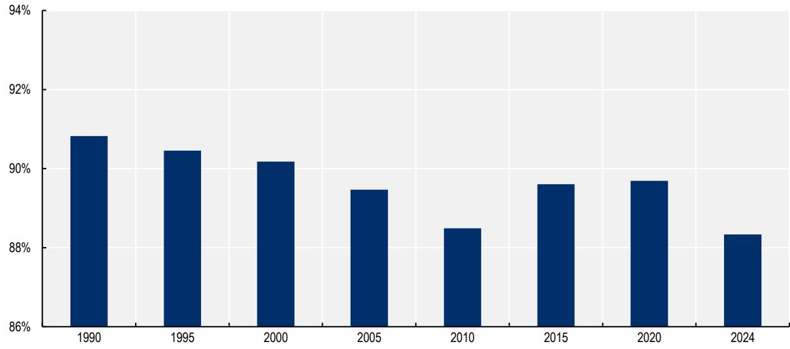  
Source: UN DESA, Population Division – International Migrant Stock (IMS), 2024 revision.

## Two decades of Greek emigration: Patterns, drivers, and shifts

This report focusses primarily on Greek emigration to, and the presence of Greek-born migrants in OECD countries. This section outlines the overall size and long-term evolution of the Greek emigrant population in OECD countries, drawing on data from the OECD's Database on Immigrants in OECD Countries, to understand changes in the total number of Greek-born individuals living abroad.

## Over 800 000 Greek emigrants were residing in OECD countries in 2020/21

Several estimates for the total number of Greeks residing abroad have been advanced in recent years, and the figure depends on who is counted as a Greek abroad. In this review, the term “Greek emigrants” is largely reserved for persons who were born in Greece but reside abroad (see Box 1.2). Censuses conducted across OECD countries establish that just under 750 000 Greek emigrants aged 15 and above resided in OECD countries in 2020/21 (see Box 1.1 for more about the data sources). When including Greek-born children aged below 15, the total number of Greek emigrants abroad reaches just over 810 000.

## Box 1.2. Definitions of Greeks abroad

There is no single definition that captures all those who might reasonably be regarded as Greeks abroad. The definition most frequently used in the context of emigration identifies “Greeks abroad” as persons who were born in Greece but reside abroad. The main alternative is to identify “Greeks abroad” as Greek citizens who reside abroad.

Both definitions have advantages and disadvantages. The group of Greek-born persons does not include individuals who were born elsewhere but hold Greek citizenship, such as children of Greek citizens born abroad or persons who acquired Greek citizenship but do not live in Greece. This definition does include persons who were born in Greece to foreign parents and who reside abroad nor does it include those who either never obtained Greek citizenship or later gave it up. In the case of Greece, a country with a long history of emigration, the definition based on citizenship could possibly be more relevant than that based on country of birth because the former would allow coverage of the descendants of emigrants. Due to reasons of data availability, this review employs the definition based on country of birth but also presents certain results for Greek citizens.

“Diaspora” is a broader concept that also lacks a single definition. Unlike definitions based strictly on birthplace or citizenship, “diaspora” refers to populations that maintain real or perceived connections to a country of origin across multiple generations. This includes first-generation emigrants as well as their descendants, regardless of whether they hold the country’s citizenship or were born there. Diaspora communities are typically understood through shared elements such as heritage, identity, cultural affinity, or ongoing social, economic, or professional ties to the ancestral homeland. This definition captures a wider circle of people of Greek origin who may meaningfully engage with Greece, even when they fall outside formal statistical categories based on birthplace or citizenship.

Overall, the number of Greek emigrants residing in the OECD has shown a sustained upward trend over the past two decades, rising from just under 700 000 in the early 2000s to just over 811 000 by 2020 (see Figure 1.2). More specifically, the stock of Greek emigrants in OECD countries declined slightly between 2000 and 2005, before increasing steadily thereafter. The onset of the Greek financial crisis in 2008-2009 and the deep recession that followed marked the period with the highest growth in emigration from Greece: the number of emigrants abroad jumped from 707 000 in 2010 to 782 000 in 2015.

Figure 1.2. The stock of Greek-born emigrants in OECD countries has been on the rise since 2005

Stock of Greek-born emigrants in OECD destination countries, all ages, 2000/01 to 2020/21  
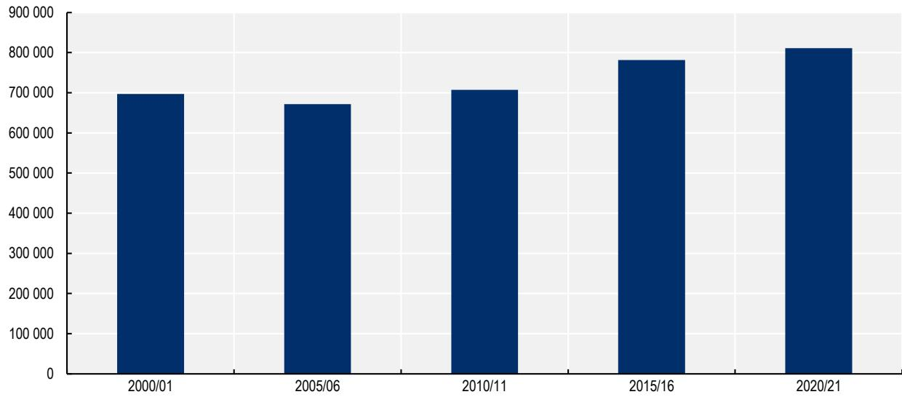  
Note: For analytical purposes, besides OECD Member countries, destination countries here also encompass OECD candidate countries Bulgaria and Romania, reflecting their significance for emigration from Greece in recent years.
Source: OECD Database on Immigrants in OECD Countries (DIOC), 2000/01-2020/21.

Between 2010/11 and 2020/21, most European countries recorded an increase in the size of their emigrant populations, although the magnitude of this growth differed considerably across origins. Poland and Spain saw the fastest expansions among the selected countries, with their emigrant populations rising by 41% and 44%, respectively (see Figure 1.3). France also experienced substantial growth of 26%, while Italy recorded a more moderate increase of 11%. In contrast, Germany and the United Kingdom registered comparatively modest changes (both 5%), and Denmark showed almost no change (1%), indicating relatively stable levels of outward mobility over the decade.

Greece's emigrant population in OECD countries increased from about 707 000 nationals in 2010/11 to 811 000 in 2020/21, a rise of $15\%$ . This places Greece in the mid-range of European countries: the growth is significantly lower than in countries such as Poland and Spain, but more pronounced than in countries like Germany and the United Kingdom. Greece's evolution reflects steady outward mobility over the decade, substantial enough to indicate continued emigration, but not on the same scale as the diaspora expansion observed in several other European countries.

Figure 1.3. The stock of Greek emigrants has been growing steadily but at a modest rate over the past decade  
Stock of emigrant population from selected OECD countries (left scale), growth 2010/11 to 2020/21 in percentages (right scale), all ages  
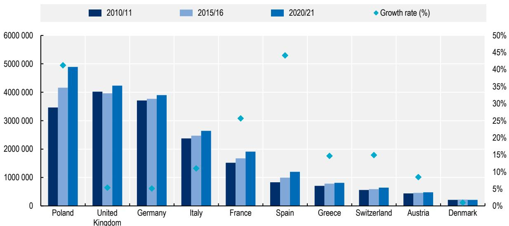  
Note: The growth rate is the difference between the levels in 2010/11 and 2020/21, as a percentage of the level in 2010/11. Source: OECD Database on Immigrants in OECD Countries (DIOC), 2010/11-2020/21.

While Greece has a relatively small Greek-born population in OECD countries in absolute numbers, its rate of emigration is high relative to many other OECD countries. Ireland, New Zealand and Poland stand out among the comparison countries as exhibiting particularly high emigration rates in 2020/21, at $14.9\%$ , $13.2\%$ and $12.8\%$ respectively, with Poland's rate almost doubling compared with 2000/01 (see Figure 1.4). Greece follows among the higher-emigration countries, with an emigration rate of $7.2\%$ in 2020/21, a level comparable to that observed in Switzerland $(7.3\%)$ and the United Kingdom $(6.6\%)$ . Greece's position contrasts with that of several large Western European economies, which host much larger emigrant populations in absolute terms but display more moderate emigration rates, including Germany $(4.9\%)$ , Italy $(4.4\%)$ and France $(3.0\%)$ .

Figure 1.4. Emigration rates from Greece are high relative to other OECD European countries
Emigration rates from selected origin countries in the OECD, ages 15 and above, 2000/01 to 2020/21  
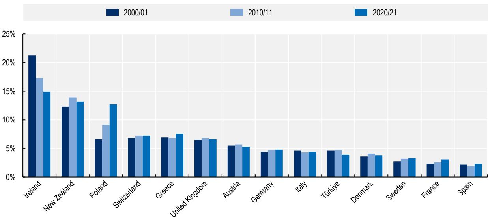  
Note: The emigration rate corresponds to the share of persons born in a country who reside abroad, relative to the total number of persons born in that country, regardless of their current place of residence.  
Source: OECD Database on Immigrants in OECD Countries (DIOC), 2000/01-2020/21.

## Demographic patterns and characteristics of the Greek-born population abroad

This section presents key socio-demographic characteristics of the Greek-born emigrants in OECD countries, focussing on patterns by age, gender, and marital status. These indicators offer an overview of the population structure of Greeks abroad. For detailed information on educational attainment and labour market integration, readers are referred to Chapter 3.

## More than half of Greek emigrants are of working age

Among Greek emigrants in the OECD area in 2020/21, men (approximately 419 000 or 52%) slightly outnumbered women (approximately 392 000 or 48%) (see Figure 1.5). This gender pattern was already present in 2000/01, when there were about 366 000 male emigrants compared with 331 000 female emigrants. The gender gap remained unchanged over the two decades: the female share remained 48% in 2000/01 and in 2020/21. In 2020, the fact that men outnumber women among Greek emigrants mirrors the pattern observed in the United Kingdom, but contrasts with some of the other comparison countries, such as Austria, Switzerland, and Germany where women constitute a larger share of the emigrant population.

When compared with the age and gender composition of all those living in Greece, the gender composition of those in Greece swings the other direction. According to 2020/21 DIOC data, among Greeks in Greece, 49% of individuals are men while 51% are women.

Figure 1.5. Just over half of Greek emigrants are men
Stock of Greek emigrants by gender, OECD countries, 2020/21  
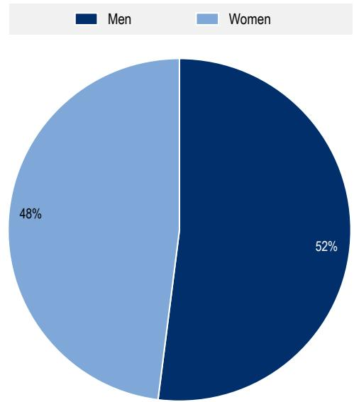  
Source: OECD Database on Immigrants in OECD Countries (DIOC), 2020/21.

In 2020/21, individuals of working age made up nearly 59% of all Greek emigrants in the OECD area: 8% were aged 15-24, while 51% were between 25 and 64 years old (see Figure 1.6). Greek emigrants aged 0-14 represented 8%, and those aged 65 and over made up a notably large share, at 34%, highlighting the sizable presence of older Greek nationals who remained abroad.

Overall, the age structure of Greeks residing in Greece is younger than that of Greeks living abroad. According to the 2020/21 DIOC data, children and young people account for a larger share of the Greek-born population in Greece, with 13% aged 0-14 and 10% aged 15-24. By contrast, the working-age population (25-64) represents 54% of the resident population, while individuals aged 65 and over account for 23%. Taken together, these figures point to a slightly younger age profile among Greeks living in Greece compared with those residing abroad, which likely reflects past emigration waves dominated by working-age adults who have remained abroad over time.

Figure 1.6. The age profile of Greeks who remained in Greece is slightly younger than that of the emigrant population

Stock of Greek emigrants in OECD countries and Greeks in Greece by age, 2020/21

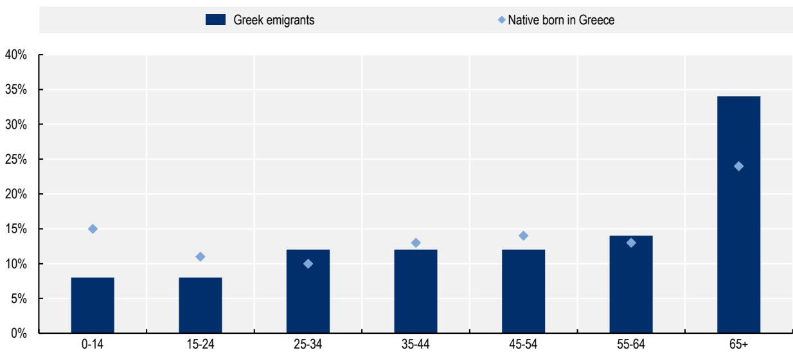  
Source: OECD Database on Immigrants in OECD Countries (DIOC), 2020/21.

The age composition of Greek emigrants of working age in the OECD area has shifted gradually over the past two decades. In 2000/01, the majority of emigrants were of working age (25-64), accounting for 70% of the total, while younger adults aged 15-24 made up only 5%, and those aged 65 and over represented 25% (see Figure 1.7). Over time, the share of prime working-age emigrants declined steadily, falling to 55% by 2020/21. Conversely, the proportion of older emigrants (65+) increased to 37% by 2020/21. The 15-24 age group, while remaining a relatively small fraction of total emigrants in the early 2000s, increased in 2020/21 to 8%, perhaps reflecting greater youth mobility linked to education, internships, and early-career employment opportunities abroad. Overall, these patterns suggest a gradual ageing of the Greek emigrant population, alongside early signs of emerging mobility among younger adults.

Figure 1.7. The share of Greek emigrants of working age has declined over time

Stock of Greek emigrants in OECD countries by age, ages 15 and above, 2000/01 to 2020/21  
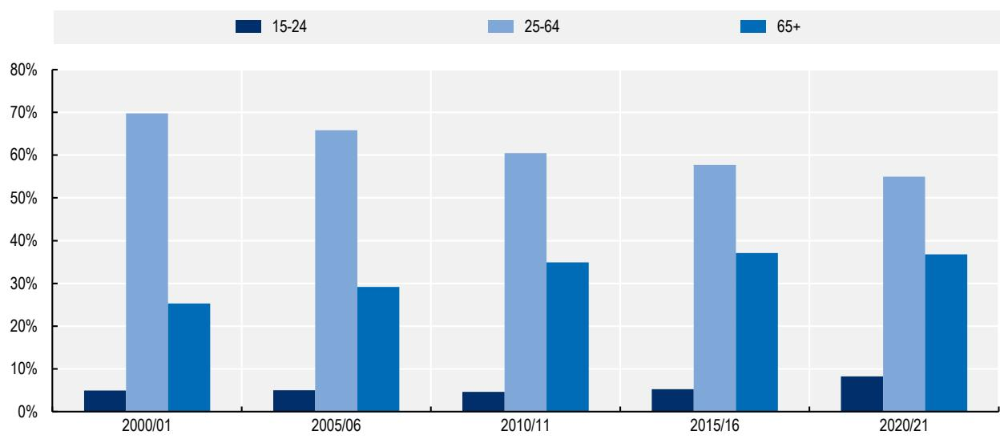  
Source: OECD Database on Immigrants in OECD Countries (DIOC), 2000/01-2020/21.

The marital status profile of Greek emigrants in 2020/21 points to a predominantly partnered population, with married individuals representing the largest share among both men (61%) and women (53%) (see Figure 1.8). A notable gender difference emerges among those who have never married, 26% of men compared with 18% of women, suggesting that male emigrants are, on average, more likely to be single. By contrast, widowed, divorced or separated women account for a much larger share (28%) than men (13%), reflecting both gendered life-course patterns and perhaps the older age structure observed among Greek-born women abroad.

Figure 1.8. Most Greek emigrants are married, but men are more likely to be single

Stock of Greek emigrants in OECD countries by marital status, ages 15 and above, 2020/21  
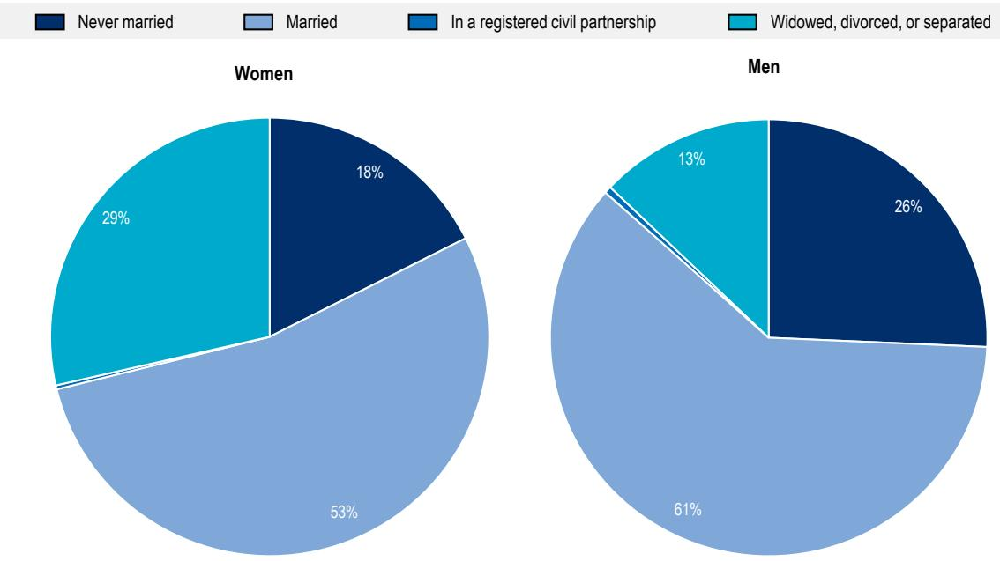

Source: OECD Database on Immigrants in OECD Countries (DIOC), 2020/21.

## Destination patterns of Greek emigrants: Stability and new growth corridors

According to OECD DIOC data, the stock of Greek emigrants in OECD countries is concentrated in a relatively small number of destination countries. This section examines the main destinations of Greek emigrants, identifies the countries that have experienced the largest increases in Greek migrant stocks, and analyses changes in the geographical distribution of Greek emigration over time.

## Twelve countries hosted 93% of Greece's emigrants in the OECD area in 2020/21

Greek emigrants in the OECD area are highly concentrated in a small number of destination countries. Three in four Greek emigrants are concentrated in five OECD countries: Germany, the United States, Australia, the United Kingdom, and Canada. What is more, 93% of Greek emigrants in the OECD in 2020/21 resided in just 12 countries (see Figure 1.9). Germany was the largest host country, with approximately 237 000 Greek emigrants in 2020/21, followed by the United States (139 000) and Australia (92 000). The United Kingdom, with 87 000 Greek emigrants, is also a significant destination country. Canada hosted 58 000 Greeks, while Türkiye accounted for 31 000. Other countries with substantial Greek communities included the Netherlands (24 000), Sweden (20 000), Belgium (18 000), Switzerland (17 000), Italy (16 000), and France (15 000). For a complete list of destination countries of Greek emigrants, see Annex Table 1.A.1.

From a regional perspective, the data indicate that in 2020/21, two-thirds of all Greek emigrants (64%) were concentrated within Europe. Among the remaining 36% living outside Europe but in the OECD area, nearly all (99%) were concentrated in three principal destination countries: the United States (47%), Australia (32%), and Canada (20%).

Figure 1.9. Germany has remained host to the largest number of Greek emigrants over the last decade  
Stock of Greek-born emigrants in the OECD by destination country, 2010/11 – 2020/21  
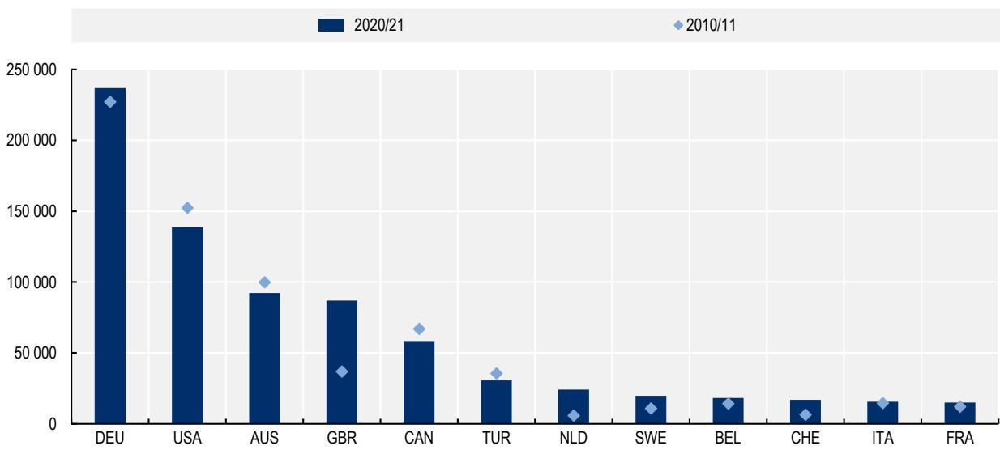  
Note: Data for 2020/21 for the Netherlands are based on estimates: the DIOC 2015/16 data were adjusted via raking to be consistent with existing and publicly available data for 2020/21. The European Labour Force Survey (EU LFS) provided updated distributions by aggregated regions of birth for sex, age and education. Eurostat's Unified Demographic Data Collection (UNIDEMO) provided updated totals by detailed country of birth, sex, and age). DIOC 2015/16 data were first iteratively raked to the control distributions from the EU LFS. The resulting intermediate totals were then iteratively raked to the UNIDEMO totals.  
Source: OECD Database on Immigrants in OECD Countries (DIOC), 2010/11-2020/21.

## The number of Greek emigrants in Germany has risen over the past two decades

Long-term trends across the five largest destination countries underscore both the persistence of established migration corridors and the gradual reshaping of Greece's diaspora landscape. Germany has remained the dominant hub throughout the past two decades, with its Greek-born population rising from around 160 000 in 2000/01 to a peak of nearly 282 000 in 2015/16 before easing to 237 000 in 2020/21 – still the largest community by a substantial margin (see Figure 1.10). By contrast, the Greek-born populations in the United States, Australia and Canada have steadily declined, reflecting the ageing of long-established migrant cohorts paired with more limited new inflows. Between 2000/01 and 2020/21, numbers fell from 174 000 to 139 000 in the United States, from 115 000 to 92 000 in Australia, and from 76 000 to 58 000 in Canada. The United Kingdom stands out showing strong growth: its Greek-born population more than doubled between 2010/11 and 2020/21, rising from 37 000 to nearly 87 000, a shift likely driven by post-crisis mobility among younger and highly educated Greeks.

Taken together, these patterns reveal a slow but notable reorientation of the Greek diaspora away from historic long-distance destinations toward a more European-centred distribution, with Germany continuing to anchor the largest share of Greek emigrants across the OECD. Shifts in the age structure of Greek emigrants (as seen in Figure 1.7) also suggest that traditional but waning hubs are characterised by an increasingly older migrant population, while newer and expanding destinations likely display a markedly younger demographic profile.

Figure 1.10. The number of Greek emigrants living in the United States, Canada, and Australia has consistently declined since 2000/01  
Stock of Greek-born emigrant population, Germany, the United States, Australia, the United Kingdom, Canada, 2000/01 – 2020/21  
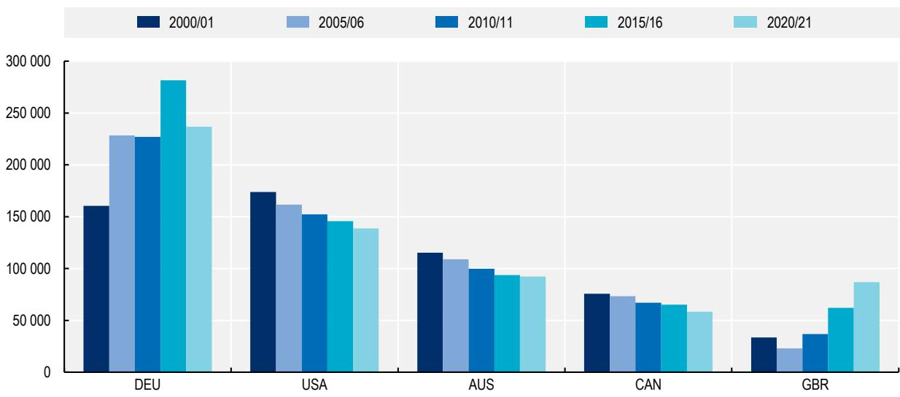  
Source: OECD Database on Immigrants in OECD Countries (DIOC), 2000/01-2020/21.

## Between 2010/11 and 2020/21, the largest percentage increases in the stock of Greek-born emigrants were observed in Bulgaria, the Netherlands and Norway

When considering per cent change between 2010/11 and 2020/21, it is important to note that destinations with a very small initial Greek-born emigrant population can exhibit large percentage increases over time. The largest expansion occurred in Bulgaria, where the Greek-born population grew by nearly twentyfold (+1 948%) (see Table 1.1). Northern and Western European countries also registered substantial growth: the Netherlands (+305%), Norway (+294%) and Ireland (+280%) all tripled their Greek-born populations over the decade, while Luxembourg (+202%) and Romania (+196%) experienced surges as well. Strong increases were also observed in Finland (+169%), Austria (+160%), Denmark (+157%) and Switzerland (+157%), suggesting a shift toward Northern and Central European destinations.

Table 1.1. The Greek-born population in the Netherlands, Norway, and Ireland about tripled between 2010/11 and 2020/21  
Change in the stock of Greek-born emigrants in OECD and selected destination countries among those with positive percentage growth, 2010/11 to 2020/21

<table><tr><td></td><td>2010/11</td><td>Share among total Greek emigrants in OECD (2010/11)</td><td>2020/21</td><td>Share among total Greek emigrants in OECD (2020/21)</td><td>% change 2010/11 to 2020/21</td></tr><tr><td>BGR</td><td>455</td><td>0.1%</td><td>9 320</td><td>1.1%</td><td>1948%</td></tr><tr><td>NLD</td><td>5 989</td><td>0.8%</td><td>24 260</td><td>3.0%</td><td>305%</td></tr><tr><td>NOR</td><td>955</td><td>0.1%</td><td>3 761</td><td>0.5%</td><td>294%</td></tr><tr><td>IRL</td><td>575</td><td>0.1%</td><td>2 183</td><td>0.3%</td><td>280%</td></tr><tr><td>LUX</td><td>1 209</td><td>0.2%</td><td>3 651</td><td>0.5%</td><td>202%</td></tr><tr><td>ROU</td><td>2 187</td><td>0.3%</td><td>6 471</td><td>0.8%</td><td>196%</td></tr><tr><td>FIN</td><td>698</td><td>0.1%</td><td>1 879</td><td>0.2%</td><td>169%</td></tr><tr><td>AUT</td><td>2 893</td><td>0.4%</td><td>7 518</td><td>0.9%</td><td>160%</td></tr><tr><td>DNK</td><td>1 477</td><td>0.2%</td><td>3 801</td><td>0.5%</td><td>157%</td></tr><tr><td>CHE</td><td>6 572</td><td>0.9%</td><td>16 893</td><td>2.1%</td><td>157%</td></tr><tr><td>GBR</td><td>36 933</td><td>5.2%</td><td>86 936</td><td>10.7%</td><td>135%</td></tr><tr><td>ESP</td><td>2 185</td><td>0.3%</td><td>4 886</td><td>0.6%</td><td>124%</td></tr><tr><td>SWE</td><td>10 860</td><td>1.5%</td><td>19 740</td><td>2.4%</td><td>82%</td></tr><tr><td>POL</td><td>3 415</td><td>0.5%</td><td>5 368</td><td>0.7%</td><td>57%</td></tr><tr><td>CZE</td><td>1 637</td><td>0.2%</td><td>2 223</td><td>0.3%</td><td>36%</td></tr><tr><td>HUN</td><td>1 074</td><td>0.2%</td><td>2 183</td><td>0.2%</td><td>28%</td></tr><tr><td>BEL</td><td>14 348</td><td>2.0%</td><td>18 206</td><td>2.2%</td><td>27%</td></tr><tr><td>FRA</td><td>12 269</td><td>1.7%</td><td>15 069</td><td>1.9%</td><td>23%</td></tr><tr><td>ITA</td><td>14 596</td><td>2.1%</td><td>15 631</td><td>1.9%</td><td>7%</td></tr><tr><td>DEU</td><td>227 138</td><td>32.1%</td><td>236 831</td><td>29.2%</td><td>4%</td></tr></table>

Note: Data include only countries with available information between 2010/11 and 2020/21 and sample sizes above 1 000 in 2020/21. Data for 2020/21 for the Netherlands are based on estimates: the DIOC 2015/16 data were adjusted via raking to be consistent with existing and publicly available data for 2020/21. The European Labour Force Survey (EU LFS) provided updated distributions by aggregated regions of birth for sex, age and education. Eurostat's Unified Demographic Data Collection (UNIDEMO provided updated totals by detailed country of birth, sex, and age. DIOC 2015/16 data were first iteratively raked to the control distributions from the EU LFS. The resulting intermediate totals were then iteratively raked to the UNIDEMO totals.  
Source: OECD Database on Immigrants in OECD Countries (DIOC), 2010/11-2020/21.

Bulgaria experienced the largest relative increase in emigration over the decade 2010/11 to 2020/21. In 2020/21, a notably young age profile characterised migration flows to Bulgaria, with around one-third of emigrants being children under the age of 15. This composition suggests that recent emigration to Bulgaria is driven less by individual labour mobility and more by family-based relocation, with entire households choosing to settle across the border.

Several factors may help explain this pattern. Geographic proximity and regional interconnectedness reduce relocation costs and facilitate the maintenance of social and economic ties between Greece and Bulgaria. In addition, Bulgaria's accession to the European Union, combined with its comparatively low cost of living, may increase its attractiveness as a destination for Greek families seeking more affordable living conditions within the EU framework (Eurostat, 2025[6]).

## Who lives where?

This section draws on OECD DIOC data to examine the distribution of Greek emigrants across key OECD destination countries, focussing on variations in their gender, age and regional settlement patterns. Based on national data sources, it further provides a brief overview of the size of the second-generation Greeks and the Greek diaspora population in selected destination countries.

## EU countries host younger, more male-dominated Greek populations

Notable differences exist across destination countries in terms of gender composition of the Greek-born population. Women constituted a slight majority in Australia (53%) and Türkiye (54%) and made up exactly half of the Greek-born population in Canada and Belgium (see Figure 1.11). By contrast, men outnumbered women in several destinations, including the Netherlands, where men represented 57% of Greek-born residents, as well as Sweden (56%), the United States (53%) Germany, and the United Kingdom (both 52%).

Figure 1.11. Greek-born men outnumber women in many major destination countries  
Gender distribution of Greek-born emigrant stocks in selected OECD countries, 2020/21  
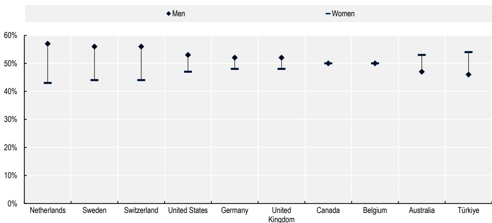  
Note: Data for 2020/21 for the Netherlands are based on estimates: the DIOC 2015/16 data were adjusted via raking to be consistent with existing and publicly available data for 2020/21. The European Labour Force Survey (EU LFS) provided updated distributions by aggregated regions of birth for sex, age and education. Eurostat's Unified Demographic Data Collection (UNIDEMO provided updated totals by detailed country of birth, sex, and age. DIOC 2015/16 data were first iteratively raked to the control distributions from the EU LFS. The resulting intermediate totals were then iteratively raked to the UNIDEMO totals.  
Source: OECD Database on Immigrants in OECD Countries (DIOC), 2020/21.

The age and gender structure of Greek-born emigrants differs markedly across destinations, reflecting both historical migration patterns and more recent mobility trends. In long-established destinations such as Australia and Canada, the age profile is overwhelmingly older: between 68-76% of Greek-born men and women are aged 65 and over, while only 1-2% are children and fewer than 3% are young adults (see Figure 1.12). These patterns point to communities formed through earlier migration waves that have aged in place. Women in these countries are especially concentrated in older age groups, for example, over 75% of Greek-born women in Australia are aged 65+, compared with just under 70% of men, pointing to the long-term settlement profile of these communities.

By contrast, the Greek-born populations in Northern and Western Europe are substantially younger and more recently arrived. In the Netherlands and the United Kingdom, the 25-64 age group makes up the clear majority, accounting for roughly 67-75% of both men and women. In these destinations, the share of

15-24 year-olds is higher than elsewhere, likely reflecting the sizeable number of young Greeks moving abroad for study-related reasons (as discussed in Chapter 4). Women are slightly more represented within this group, for example, in the United Kingdom and the Netherlands, around 16% of Greek-born women fall into the 15-24 age bracket compared with 13% of men, suggesting that student-driven mobility may be somewhat more common among young women.

Intermediate patterns emerge in Germany and Sweden, where the working-age population remains the largest group, around 57-62%, but older adults also represent a meaningful share, at 19-25%. Children and young adults are present in modest numbers, with 8-14% in most cases, indicating more mixed migration histories combining postcrisis mobility with earlier arrivals.

In the United States, the Greek-born population is split almost evenly between the working-age and older groups – each representing around 46-49%, while in Türkiye, the working-age share (44-47%) slightly exceeds the older population (40-45%). These distributions suggest a blend of historical migration pathways and more recent movements, with an ageing population and women generally more concentrated in the older population than men.

Taken together, these distributions illustrate a consistent pattern: older age structures characterise Greek-born communities in long-distance destinations shaped by earlier migration waves, while European destinations host younger, predominantly working-age and often newer arrivals. Gender differences are generally modest but systematic, women are more represented among older emigrants in established destinations, while in Europe they are slightly more present in youth and young adult groups. These patterns reflect not only different migration histories but also shifting opportunities and motivations across cohorts and destinations.

Figure 1.12. Greek emigrants of working age are largely concentrated in European OECD countries
Gender and age composition of Greek-born emigrant stock living in selected OECD countries, 2020/21  
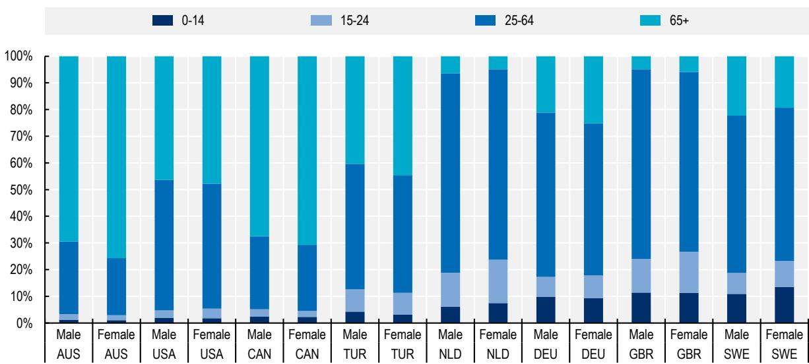  
Note: Data for 2020/21 for the Netherlands are based on estimates: the DIOC 2015/16 data were adjusted via raking to be consistent with existing and publicly available data for 2020/21. The European Labour Force Survey (EU LFS) provided updated distributions by aggregated regions of birth for sex, age and education. Eurostat's Unified Demographic Data Collection (UNIDEMO provided updated totals by detailed country of birth, sex, and age. DIOC 2015/16 data were first iteratively raked to the control distributions from the EU LFS. The resulting intermediate totals were then iteratively raked to the UNIDEMO totals.  
Source: OECD Database on Immigrants in OECD Countries (DIOC), 2020/21.

## Second-generation and Greek diasporas are sizeable in long-standing destination countries

Successive waves of Greek emigration over past decades have given rise to sizeable and long-established Greek-origin communities across a number of destination countries. Although detailed information on the second and third generations is available for only a limited set of these destinations, examining these populations is important for understanding the longer-term implications of earlier migration episodes. The selection of destination countries included in this section – Australia, Canada, Germany, Sweden and the United States – reflects the availability of publicly accessible data for major destination countries and provides an analytically informative sample. These countries encompass both traditional English-speaking settlement destinations and European countries that have received Greek emigrants through earlier postwar labour migration as well as more recent mobility following the global financial crisis.

Comparative analysis of second-generation Greeks across destination countries requires careful attention to definitional differences. As outlined in Box 1.3, countries vary in whether they define generational status strictly based on country of birth and parents' country of birth or rely on self-reported ancestry. For the purposes of this chapter, second generation refers to persons born in the destination country with at least one foreign-born parent. It should be noted, however, that in countries where ancestry-based measures are used, second-generation Greeks cannot be cleanly distinguished from third and later generations, limiting direct comparability across countries.

Among the countries with comparable generational data, the size and structure of the Greek-origin population differ markedly. Germany hosts the largest Greek-origin population in Europe. In 2024, around 259 000 Greek-born persons resided in Germany, alongside approximately 170 000 persons born in Germany to at least one foreign-born parent of Greek origin (see Table 1.2). This configuration reflects both earlier labour migration waves and continued population renewal, resulting in a sizeable first generation co-existing with a substantial second generation.

In Sweden, the Greek-origin population is considerably smaller in absolute terms but displays a similar intergenerational profile. In 2024, around 21 500 Greek-born persons and nearly 16 000 second-generation Greeks were recorded in the population register. While the numbers are modest relative to Germany, the presence of a significant second generation indicates durable settlement and family formation over time.

In 2021, about 73 500 Greek-born persons were recorded in Canada, compared with over 100 000 Canadian-born persons with at least one foreign-born parent of Greek origin. The second generation thus exceeds the first, pointing to the long-standing character of Greek settlement in Canada and the demographic transition from primarily immigrant-based communities to established, native-born populations of Greek descent.

Table 1.2. Germany, the United States, and Australia, the three countries with largest Greek-born emigrant population, show sizeable diasporas

Overview of diaspora populations (second-generation and ancestry based) in selected destination countries

<table><tr><td></td><td>First-generation</td><td>Second-generation</td><td>Ancestry-based</td><td>Year</td><td>Data source</td></tr><tr><td>Germany</td><td>259 000</td><td>170 000</td><td>.</td><td>2024</td><td>Microcensus</td></tr><tr><td>Sweden</td><td>21 520</td><td>15 862</td><td>.</td><td>2024</td><td>Register data</td></tr><tr><td>Canada</td><td>73 490</td><td>100 605</td><td>.</td><td>2021</td><td>Census data</td></tr><tr><td>United States</td><td>118 932</td><td>.</td><td>1 203 356</td><td>2024</td><td>American Community Survey</td></tr><tr><td>Australia</td><td>92 314</td><td>.</td><td>424 744</td><td>2021</td><td>Census data</td></tr></table>

Notes: See Box 1.3 for an overview of how the Greek diaspora and second-generation Greeks are defined across countries.
Source: Statistisches Bundesamt (Destatis), Statistics Sweden, Statistics Canada, the United States Census Bureau (ACS 5-Year estimates detailed tables), Australian Bureau of Statistics.

In contrast, Australia and the United States rely primarily on ancestry-based measures to capture populations of Greek origin (see Box 1.3). While these data do not allow a clean distinction between second and later generations, they provide a crucial perspective on the full demographic footprint of the Greek diaspora. As shown in Table 1.2, the inclusion of ancestry-based populations reveals diaspora communities that are several times larger than the Greek-born population alone. In the United States, more than 1.2 million individuals reported Greek ancestry in 2024, compared with fewer than 120 000 Greek-born residents, while in Australia around 425 000 persons reported Greek ancestry in 2021, relative to just over 90 000 Greek-born. These figures underscore the highly multi-generational nature of the Greek diaspora in long-standing settlement countries and highlight the importance of looking beyond first-generation stocks to fully capture the scale, longevity and demographic significance of Greek emigrant communities abroad.

Taken together, the data from across these major destination countries shows the different stages of demographic maturity across destinations. Germany combines a large foreign-born population with a strong but smaller second generation. Sweden hosts a smaller yet established community. Canada exhibits a more advanced intergenerational profile, with the second generation outnumbering the first. In Australia and the United States, ancestry data reveal large and long-standing Greek-origin populations, but do not permit a precise assessment of the second generation as defined elsewhere in this chapter.

## Box 1.3. Defining the Greek diaspora and second-generation Greeks: A methodological note

National statistical systems use different concepts to identify migrant populations, diaspora groups and their descendants. As a result, the definitions and measurements of first- and second-generation Greeks vary across countries.

## Second-generation Greeks in Canada, Germany and Sweden

In Canada, Germany and Sweden, generational status is typically defined based on country of birth of the individual and their parents, allowing a clear distinction between first- and second-generation populations.

In Germany, individuals with a migration background are identified using two definitions. The broad definition includes persons born in Germany with at least one foreign-born parent, while the narrow definition is restricted to those with two foreign-born parents. First- and second-generation populations are distinguished based on whether the individual has their own migration experience. This framework allows origin-specific identification of second-generation Greeks under both definitions. This report uses the broader definition to define second-generation Greeks as German-born individuals with at least one parent born in Greece.

In Sweden, Statistics Sweden classifies individuals according to their own country of birth and that of their parents. The term foreign background typically refers to foreign-born persons and those born in Sweden with two foreign-born parents, while individuals with only one foreign-born parent are identified separately. This structure enables consistent identification of second-generation Greeks.

In Canada, Statistics Canada defines the first generation as persons born outside Canada and the second generation as persons born in Canada with at least one foreign-born parent. Second-generation Greeks are identified by combining generational status with information on self-reported ethnic origin, which makes it possible to capture Canadian-born individuals with Greek ancestry.

This report applies a broad definition of the second generation, including persons born in the host country with at least one foreign-born parent.

## Diaspora populations in Australia and the United States

In contrast, the United States and Australia do not use an official “migration background” or generational framework in their population statistics. Instead, both countries rely primarily on self-reported ancestry or ethnic origin collected through the census. In the United States, individuals with a Greek background are identified through responses to the ancestry question, which captures first- and subsequent-generation descendants but does not allow a consistent distinction between first and second generation based on parents’ country of birth.

Similarly, in Australia, Greek background is primarily ancestry-based. Country of birth allows identification of the Greek-born (first-generation) population, but standard published census tables do not distinguish second-generation Greeks from later generations. While Australian census data do collect information on parents' country of birth, which would allow identification of Australian-born individuals with one or two parents born in Greece, these data are not publicly released as standard outputs for origin-specific generational analysis. As a result, analyses for Australia typically rely on ancestry-based measures rather than explicit generational definitions.

Consequently, for Australia and the United States, figures presented in this report reflect ancestry-based diaspora populations, which are not fully comparable with the first- and second-generation definitions used in Germany, Sweden and Canada.

## High levels of education, labour-force participation, and homeownership characterise the Greek-ancestry population in the United States

According to the 2024 American Community Survey one-year estimates, the demographic profile of the Greek American population has a median age of 40 and nearly equal shares of individuals under 18 (20.4%) and those aged 65 and over (19.6%). Women account for a slight majority (51.3%). Educational attainment is comparatively high: while around 25% have less than a high school diploma and 15.2% holding a high school degree, a substantial share has pursued postsecondary education. More than one-fifth (22.7%) hold a bachelor's degree, and notable proportions have completed graduate training, including 10.9% with a master's degree, 3.1% with a professional degree, and 2.5% with a doctorate. Labour force participation stands at nearly two-thirds (65.9%) among individuals aged 16 and over.

Patterns of birthplace, migration, language retention, and housing reinforce the picture of an established yet culturally distinct community. The vast majority (88%) of Greek Americans are native-born, while 12% are foreign-born, including nearly 9% born in Greece and another 3% originating from other countries. Among foreign-born individuals, migration has occurred over several decades: only about 1% arrived between 2019-2024, another 1% between 2014-2018.

English is the dominant home language for 78% of Greek Americans, while Greek remains actively used by about one in five Greek Americans. Housing patterns indicate strong socio-economic stability: over three-quarters of Greek Americans are homeowners, with 24% owning their homes outright and 53% owning with a mortgage.

## Many Greek emigrants are concentrated in urban areas across major destination countries

National and regional data sources allow the examination of the geographical distribution of Greek emigrants across major destination countries. These sources include the U.S. Census Bureau's pooled 2010-2022 American Community Survey (2018-2022[7]), census and administrative data in Canada (2021[8]), Australia (2021[9]), and Sweden (2024[10]). These countries represent the major destinations for

Greek emigrants for which sufficiently detailed and publicly accessible data are available. While other large destinations exist, comparable subnational or administrative statistics are not systematically released, making these four countries the most suitable for analysing regional settlement patterns of Greek emigrants.

## About half of all Greek-born emigrants in Sweden live in the Stockholm region

In Sweden, Greek-born emigrants are concentrated overwhelmingly in a small number of counties. Stockholm stands out as the primary hub, hosting 10 819 Greek-born residents, or roughly half of all Greeks in the country (see Figure 1.13). This strong concentration in the capital aligns with Stockholm's role as Sweden's largest labour market, its universities and research centres, and the presence of established migrant networks that likely continue to attract new arrivals. The regions of Västra Götaland (home to Gothenburg) and Skåne (anchored by Malmö and Lund university) form the next major centres of settlement, together accounting for nearly 5 300 residents. Beyond these primary metropolitan regions, Greek-born residents are present in smaller but still notable numbers in Uppsala, another major university city hosting 1 246 migrants. Midsized regions such as Östergötland, Kalmar, and Jönköping each host several hundred residents, while most other regions contain fewer than 300 Greek-born individuals, indicating limited diffusion beyond major urban and academic centres.

Figure 1.13. Greek emigrants to Sweden are highly concentrated in the Stockholm region
Distribution of Greek-born individuals in Sweden by region, 2024  
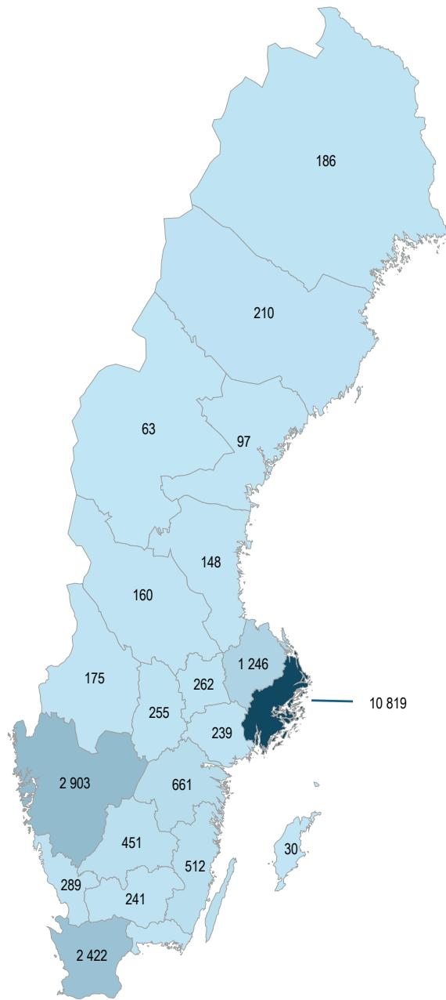

<table><tr><td>County</td><td>Greek-born population</td></tr><tr><td>Stockholm län</td><td>10 819</td></tr><tr><td>Västra Götalands län</td><td>2 903</td></tr><tr><td>Skåne län</td><td>2 422</td></tr><tr><td>Uppsala län</td><td>1 246</td></tr><tr><td>Östergötlands län</td><td>661</td></tr><tr><td>Kalmar län</td><td>512</td></tr><tr><td>Jönköpings län</td><td>451</td></tr><tr><td>Hallands län</td><td>289</td></tr><tr><td>Västmanlands län</td><td>262</td></tr><tr><td>Örebro län</td><td>255</td></tr><tr><td>Kronobergs län</td><td>241</td></tr><tr><td>Södermanlands län</td><td>239</td></tr><tr><td>Västerbottens län</td><td>210</td></tr><tr><td>Norrbottens län</td><td>186</td></tr><tr><td>Värmlands län</td><td>175</td></tr><tr><td>Dalarnas län</td><td>160</td></tr><tr><td>Blekinge län</td><td>151</td></tr><tr><td>Gävleborgs län</td><td>148</td></tr><tr><td>Västernorrlands län</td><td>97</td></tr><tr><td>Jämtlands län</td><td>63</td></tr><tr><td>Gotlands län</td><td>30</td></tr></table>

Note: This map is for illustrative purposes and is without prejudice to the status of or sovereignty over any territory covered by this map.
Source: Statistics Sweden (2024[10]), Folkmängden efter region, födelseland och kön. År 2000 – 2024, https://www.statistikdatabasen.scb.se/pxweb/sv/ssd/START\_BE\_BE0101\_BE0101E/FolkmRegFlandK/.

Almost nine in ten Greek-born emigrants live in Ontario and Quebec, reflecting the pull of Canada's largest urban centres

In Canada, Greek-born emigrants are highly concentrated in just two provinces. Ontario and Quebec together account for 87% of all Greek-born residents, with Ontario hosting around 31 650 individuals and

Quebec a further 16 130 (see Figure 1.14). These two provinces are home to Canada's two largest cities and to some of the country's largest universities, and to Canada's largest Greek-born populations. Beyond these two provinces, the Greek-born population is more modest but still regionally differentiated. British Columbia hosts a noticeable community of roughly 3 350 individuals. Alberta and Manitoba each have smaller populations, around 1 895 and 770, respectively, suggesting more limited but nonetheless present factors drawing Greek emigrants to the Prairie provinces. The remaining provinces and territories, including Nova Scotia, Saskatchewan, New Brunswick, Newfoundland and Labrador, Prince Edward Island and the Northwest Territories, host only small numbers of Greek-born residents. Yukon and Nunavut have negligible or no reported presence.

## Figure 1.14. In Canada, Greek emigrants are mainly settled in Ontario and Quebec

Distribution of Greek-born individuals (place of birth) among the immigrant population in private households, in Canada by provinces and territories, 2021

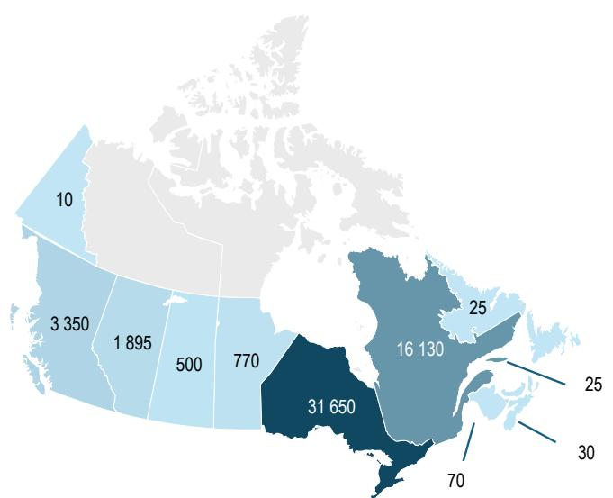

<table><tr><td>Province / Territory</td><td>Greek-born population</td></tr><tr><td>Ontario</td><td>31 650</td></tr><tr><td>Quebec</td><td>16 130</td></tr><tr><td>British Columbia</td><td>3 350</td></tr><tr><td>Alberta</td><td>1 895</td></tr><tr><td>Manitoba</td><td>770</td></tr><tr><td>Saskatchewan</td><td>500</td></tr><tr><td>Nova Scotia</td><td>300</td></tr><tr><td>New Brunswick</td><td>70</td></tr><tr><td>Newfoundland and Labrador</td><td>25</td></tr><tr><td>Prince Edward Island</td><td>10</td></tr><tr><td>Yukon</td><td>10</td></tr><tr><td>Northwest Territories</td><td>0</td></tr><tr><td>Nunavut</td><td>0</td></tr></table>

Note: This map is for illustrative purposes and is without prejudice to the status of or sovereignty over any territory covered by this map. Source: Statistics Canada (2021[8]), Census Profile, https://www12.statcan.gc.ca/census-recensement/2021/dp-pd/hlt-fst/imm/List-geo.cfm?Lang=Eng&T=9810034902.

About three in four Greek-born emigrants in Australia live in Victoria or New South Wales, likely reflecting the pull of Melbourne and Sydney

In Australia, Greek-born emigrants are overwhelmingly concentrated in the states of Victoria and New South Wales, which together account for nearly 80% of the Greek-born population (see Figure 1.15). Victoria hosts around 46 600 Greek-born residents and New South Wales a further 29 400. This concentration reflects longstanding migration corridors anchored around Melbourne and Sydney. These two states also contain Australia's largest and most diverse urban labour markets, offering employment opportunities that have historically attracted new arrivals.

South Australia hosts the third-largest Greek-born population, with over 8 100 residents. Other states and territories, including Queensland, Western Australia, the Northern Territory, Tasmania and the Australian Capital Territory, host smaller Greek-born populations. These more dispersed communities, though modest in size, highlight a degree of geographic diversification while still underscoring the dominant pull of the country's major urban centres.

Taken together, the distribution suggests that Greek emigrants in Australia have gravitated toward states with strong economic opportunities, large metropolitan areas and established diaspora institutions. This pattern aligns with earlier migration waves from Greece to Australia, which were closely tied to urban industrial employment and community-based settlement, and continues to shape the spatial footprint of Greek-born residents today.

Figure 1.15. In Australia, Greek emigrants are heavily concentrated in the states of Victoria and New South Wales

Distribution of Greek-born individuals in Australia by states and territories, 2021

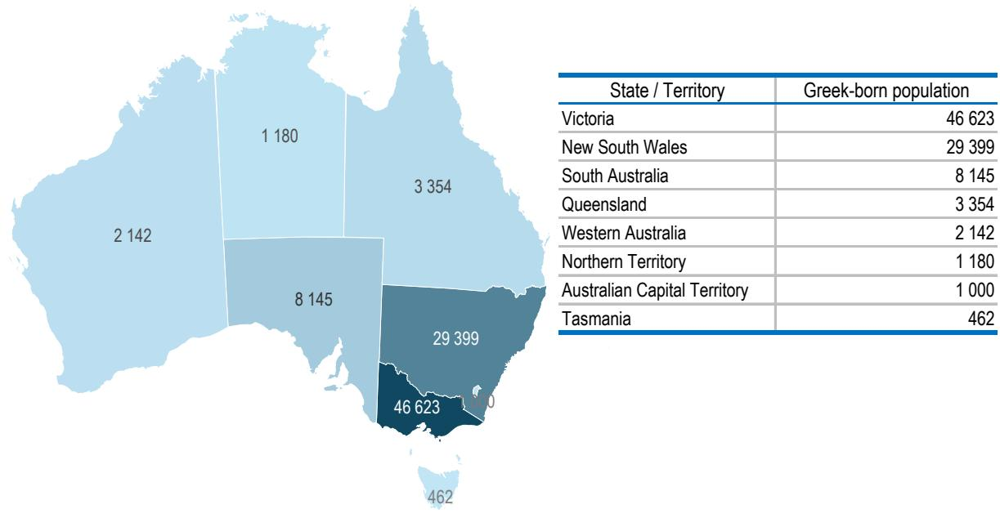

<table><tr><td>State / Territory</td><td>Greek-born population</td></tr><tr><td>Victoria</td><td>46 623</td></tr><tr><td>New South Wales</td><td>29 399</td></tr><tr><td>South Australia</td><td>8 145</td></tr><tr><td>Queensland</td><td>3 354</td></tr><tr><td>Western Australia</td><td>2 142</td></tr><tr><td>Northern Territory</td><td>1 180</td></tr><tr><td>Australian Capital Territory</td><td>1 000</td></tr><tr><td>Tasmania</td><td>462</td></tr></table>

Note: This map is for illustrative purposes and is without prejudice to the status of or sovereignty over any territory covered by this map. Source: Australia Bureau of Statistics, (2021[9]), People in Australia who were born in Greece, https://www.abs.gov.au/census/find-census-data/quickstats/2021/3207\_AUS.

## New York is host to the largest Greek-born population in the United States

In the United States, Greek-born emigrants remain concentrated predominantly in a small number of large, coastal, and highly urbanised states, reflecting longstanding migration corridors and the economic pull of major metropolitan centres. New York hosts by far the largest Greek-born population, with an estimated 28 604 residents, consistent with its historic role as a major point of entry and home to one of the oldest and most established Greek communities in the country (see Figure 1.16). Large Greek-born populations are also found in Illinois (10 720), California (10 538), Massachusetts (10 043) and Florida (8 980), each of which contains significant urban hubs, including Chicago, Los Angeles, Boston and Miami. New Jersey is another notable destination, hosting approximately 7 501 Greek-born residents, and remains closely linked to the Greater New York metropolitan area, where Greek communities developed early in the twentieth century and remain among the largest in the United States.

Beyond these states, Greek-born residents are present in smaller but still substantial numbers across several midsized and economically diverse states. These include Pennsylvania (5 438) and Connecticut (4 063), which are also neighbours to New York, and Texas (3 811), Virginia (3 225), Michigan (2 721), Ohio (2 690), and North Carolina (2 520). Additional states also host meaningful communities, such as Maryland (2 415), Indiana (1 317), South Carolina (1 296), Georgia (1 253), Arizona (1 080), Wisconsin (843), Washington (819) and Tennessee (793).

Figure 1.16. In the United States, Greek emigrants are predominantly concentrated in states with major metropolitan areas

Distribution of estimated Greek-born individuals in the United States by state, 2018-2022

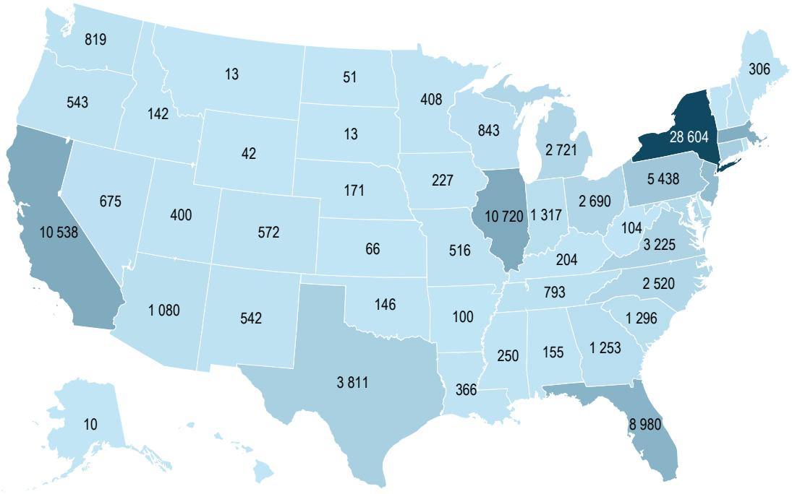

<table><tr><td>State</td><td>Greek-born population</td><td>State</td><td>Greek-born population</td><td>State</td><td>Greek-born population</td><td>State</td><td>Greek-born population</td><td>State</td><td>Greek-born population</td></tr><tr><td>New York</td><td>28 604</td><td>Michigan</td><td>2 721</td><td>Tennessee</td><td>793</td><td>Utah</td><td>400</td><td>Vermont</td><td>136</td></tr><tr><td>Illinois</td><td>10 720</td><td>Ohio</td><td>2 690</td><td>New Hampshire</td><td>719</td><td>Louisiana</td><td>366</td><td>West Virginia</td><td>104</td></tr><tr><td>California</td><td>10 538</td><td>North Carolina</td><td>2 520</td><td>Nevada</td><td>675</td><td>Maine</td><td>306</td><td>Arkansas</td><td>100</td></tr><tr><td>Massachusetts</td><td>10 043</td><td>Maryland</td><td>2 415</td><td>Rhode Island</td><td>603</td><td>Mississippi</td><td>250</td><td>Kansas</td><td>66</td></tr><tr><td>Florida</td><td>8 980</td><td>Indiana</td><td>1 317</td><td>Colorado</td><td>572</td><td>Iowa</td><td>227</td><td>North Dakota</td><td>51</td></tr><tr><td>New Jersey</td><td>7 501</td><td>South Carolina</td><td>1 296</td><td>Oregon</td><td>543</td><td>Kentucky</td><td>204</td><td>Hawaii</td><td>50</td></tr><tr><td>Pennsylvania</td><td>5 438</td><td>Georgia</td><td>1 253</td><td>New Mexico</td><td>542</td><td>Nebraska</td><td>171</td><td>Wyoming</td><td>42</td></tr><tr><td>Connecticut</td><td>4 063</td><td>Arizona</td><td>1 080</td><td>Missouri</td><td>516</td><td>Alabama</td><td>155</td><td>Montana</td><td>13</td></tr><tr><td>Texas</td><td>3 811</td><td>Wisconsin</td><td>843</td><td>Delaware</td><td>451</td><td>Oklahoma</td><td>146</td><td>South Dakota</td><td>13</td></tr><tr><td>Virginia</td><td>3 225</td><td>Washington</td><td>819</td><td>Minnesota</td><td>408</td><td>Idaho</td><td>142</td><td>Alaska</td><td>10</td></tr></table>

Note: This map is for illustrative purposes and is without prejudice to the status of or sovereignty over any territory covered by this map. The foreign-born population includes anyone who is not a U.S. citizen at birth, including those who have become U.S. citizens through naturalisation. Source: 2018-2022 American Community Survey, 5-year estimates, US foreign-born population, https://www.census.gov/library/visualizations/interactive/foreign-born-population-2018-2022.html.

## Citizenship acquisition patterns among Greek emigrants

Citizenship acquisition varies widely across countries of destination, often reflecting differences in migration histories, integration pathways and the incentives created by national legal frameworks. This section highlights the differences in acquisition between those in long-established destinations outside Europe, such as Australia, Canada and the United States, and in EU Member States, where free movement reduces the need for citizenship.

## About half of the Greek-born emigrants in OECD countries have acquired citizenship of the host country

According to DIOC data for 2020/21, about half of all Greek emigrants (49%) were citizens of the OECD country in which they reside. In historically popular settlement countries such as Australia, Canada and the United States, the vast majority of Greek-born persons hold the country's citizenship, representing 81-95% of the population (see Figure 1.17). Italy and France present a more equally divided profile, with roughly half of Greek-origin residents having citizenship. By contrast, several European destinations, most notably Belgium, Germany and the United Kingdom, exhibit very high shares of Greek-born immigrants not holding the citizenship of the destination country, ranging from 82% (United Kingdom) to 97% (Belgium).

Overall, the distribution of citizenship status among Greek emigrants may reflect both the seniority of migration flows and the citizenship laws of destination countries. In EU Member States, the lower prevalence of citizenship acquisition can be explained by the fact that freedom of movement within the European Union reduces the incentives for Greeks to naturalise, while in non-EU destinations, such as Australia, Canada and the United States, earlier migration waves and more established settlement trajectories may have resulted in higher rates of citizenship among Greek-origin populations.

Figure 1.17. A high share of Greek-born emigrants acquired citizenship in traditional, more distant destination countries  
Stock of Greek-born emigrants aged 15 and above holding citizenship of their country of residence, 2020/21  
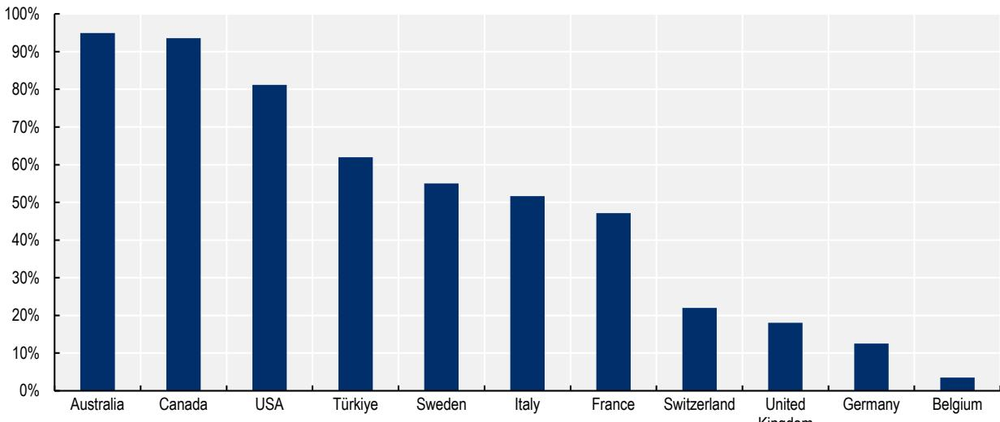  
Note: Owing to the unavailability of comparable data for the Netherlands, this country is not included in the figure. Source: OECD Database on Immigrants in OECD Countries (DIOC), 2020/21.

Many countries show a rise in citizenship acquisition between 2012 and 2024. The selection of countries in this section captures a range of migration contexts: post-Brexit dynamics in the United Kingdom, the long-established Greek diaspora in the United States, major EU destinations with substantial and evolving Greek communities such as Germany, Sweden and the Netherlands, and traditional settlement countries outside Europe, including Canada and Australia.

The United Kingdom shows a pronounced upward trajectory over the decade, with annual acquisitions rising from around 550 in 2013 to about 3450 by 2024, likely reflecting policy changes post-Brexit (see Figure 1.18). The United States exhibits relatively stable levels of naturalisation, fluctuating between roughly 800 and 1200 per year, and reaching a height of 1500 in 2022. Germany continues to account for the largest number of acquisitions overall, although its figures gradually declined from about 3500 in 2013 to 2800 in 2024. Sweden displays a stable yearly trend of acquisitions through most of the period, with a moderate increase in 2020.

Figure 1.18. Acquisition of nationality in the United Kingdom has been increasing over the past decade  
Acquisition of nationality of Greek citizens in selected OECD countries, 2013-2024  
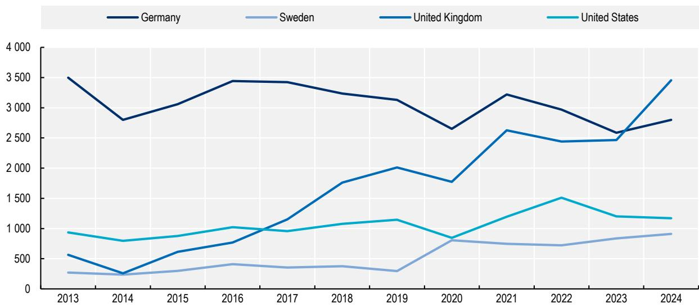  
Source: OECD International Migration Database, http://dx.doi.org/10.1787/data-00342-en.

Figure 1.19. Acquisitions of nationality in Switzerland and Belgium have increased since 2020
Acquisition of nationality of Greek citizens in selected OECD countries, 2013-2024  
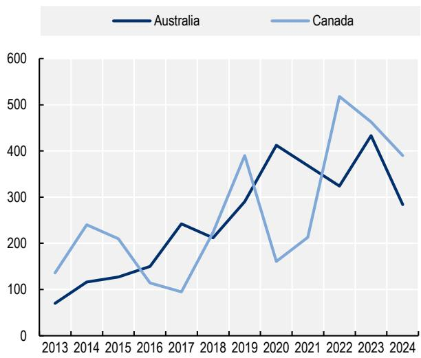

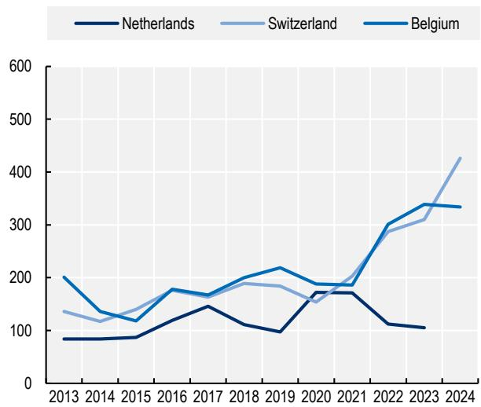  
Note: Data for 2024 are not available for the Netherlands, and 2021 data are not available for Australia. Data is not available for Türkiye. Source: OECD International Migration Database, http://dx.doi.org/10.1787/data-00342-en.

In settlement countries such as Australia and Canada, the numbers are smaller, but naturalisation numbers have generally trended upward as well. Australia experienced a rise in acquisitions, from 70 in 2013 to over 430 by 2023, and a decline to just over 280 in 2024 (see Figure 1.19). Canada similarly reached more than 500 acquisitions in 2022 before declining in 2023 and 2024. In Europe, the Netherlands displays relative stability, with annual acquisitions typically between 80 and 170, while Switzerland and Belgium record a more pronounced and consistent increase, largely since 2020.

## Annex 1.A. Supplementary tables

Annex Table 1.A.1. All destination countries for Greek-born emigrants in the OECD 2000/01 to 2020/21

Stock of Greek-born emigrants in OECD destination countries, 2000/01 to 2020/21

<table><tr><td></td><td>2000/01</td><td>2005/06</td><td>2010/11</td><td>2015/16</td><td>2020/21</td></tr><tr><td>DEU</td><td>160 460</td><td>228 401</td><td>227 138</td><td>281 671</td><td>236 831</td></tr><tr><td>USA</td><td>173 880</td><td>161 645</td><td>152 417</td><td>145 763</td><td>138 772</td></tr><tr><td>AUS</td><td>115 258</td><td>109 049</td><td>99 938</td><td>93 722</td><td>92 306</td></tr><tr><td>GBR</td><td>33 637</td><td>23 028</td><td>36 933</td><td>62 186</td><td>86 936</td></tr><tr><td>CAN</td><td>75 660</td><td>73 340</td><td>67 070</td><td>65 175</td><td>58 410</td></tr><tr><td>TUR</td><td>58 373</td><td></td><td>35 557</td><td>26 929</td><td>30 565</td></tr><tr><td>NLD</td><td></td><td>5 831</td><td>5 989</td><td>7 853</td><td>24 260</td></tr><tr><td>SWE</td><td>10 220</td><td>10 440</td><td>10 860</td><td>17 015</td><td>19 740</td></tr><tr><td>BEL</td><td>14 522</td><td>12 818</td><td>14 348</td><td>16 609</td><td>18 206</td></tr><tr><td>CHE</td><td>6 122</td><td>5 015</td><td>6 572</td><td>12 681</td><td>16 893</td></tr><tr><td>ITA</td><td>14 407</td><td>13 709</td><td>14 596</td><td>14 830</td><td>15 631</td></tr><tr><td>FRA</td><td>11 371</td><td>11 103</td><td>12 269</td><td>13 261</td><td>15 068</td></tr><tr><td>BGR</td><td>1 935</td><td></td><td>455</td><td></td><td>9 320</td></tr><tr><td>AUT</td><td>2 863</td><td>4 058</td><td>2 893</td><td>5 736</td><td>7 518</td></tr><tr><td>ROU</td><td>4 600</td><td></td><td>2 187</td><td></td><td>6 471</td></tr><tr><td>POL</td><td>879</td><td>356</td><td>3 415</td><td>2 685</td><td>5 368</td></tr><tr><td>ESP</td><td>900</td><td>1 786</td><td>2 185</td><td>1 263</td><td>4 886</td></tr><tr><td>DNK</td><td>955</td><td>1 096</td><td>1 477</td><td>2 834</td><td>3 801</td></tr><tr><td>NOR</td><td>504</td><td>593</td><td>955</td><td>2 567</td><td>3 761</td></tr><tr><td>LUX</td><td>781</td><td>649</td><td>1 209</td><td>1 124</td><td>3 651</td></tr><tr><td>CZE</td><td>1 736</td><td>2 893</td><td>1 637</td><td>778</td><td>2 223</td></tr><tr><td>IRL</td><td>270</td><td>417</td><td>575</td><td>1 092</td><td>2 183</td></tr><tr><td>FIN</td><td>450</td><td>546</td><td>698</td><td>1 239</td><td>1 879</td></tr><tr><td>ISR</td><td>4 193</td><td>3 008</td><td>3 027</td><td>2 053</td><td>1 722</td></tr><tr><td>HUN</td><td>1 187</td><td></td><td>1 074</td><td>1 163</td><td>1 379</td></tr><tr><td>NZL</td><td>924</td><td>939</td><td></td><td></td><td>840</td></tr><tr><td>SVK</td><td>&lt;50</td><td></td><td>174</td><td>488</td><td>507</td></tr><tr><td>PRT</td><td>105</td><td>69</td><td>195</td><td></td><td>388</td></tr><tr><td>ISL</td><td></td><td></td><td>&lt;50</td><td>53</td><td>342</td></tr><tr><td>CHL</td><td>185</td><td>&lt;50</td><td>630</td><td>119</td><td>253</td></tr><tr><td>MEX</td><td>270</td><td>320</td><td>389</td><td></td><td>235</td></tr><tr><td>JPN</td><td></td><td>155</td><td>156</td><td>547</td><td>214</td></tr><tr><td>EST</td><td></td><td></td><td>&lt;50</td><td>83</td><td>182</td></tr><tr><td>SVN</td><td>50</td><td></td><td>99</td><td>101</td><td>128</td></tr><tr><td>COL</td><td>86</td><td></td><td></td><td></td><td>102</td></tr><tr><td>LTU</td><td></td><td></td><td></td><td></td><td>73</td></tr><tr><td>LVA</td><td></td><td></td><td>&lt;50</td><td></td><td>59</td></tr><tr><td>CRI</td><td>&lt;50</td><td></td><td>&lt;50</td><td></td><td></td></tr><tr><td>Total</td><td>696 829</td><td>671 295</td><td>707 222</td><td>781 620</td><td>811 104</td></tr></table>

Note: Numbers below five are not included in this table.  
Source: OECD Database on Immigrants in OECD Countries (DIOC), 2000/01-2020/21.

## References

Australia Bureau of Statistics (2021), People in Australia who were born in Greece, https://www.abs.gov.au/census/find-census-data/quickstats/2021/3207\_AUS.

Cavounidis, J. (2015), “The changing face of emigration: Harnessing the potential of the new Greek diaspora”, Migration Policy Institute, https://www.migrationpolicy.org/sites/default/files/publications/TCM-Emigration-Greece-FINALWEB.pdf.

Eurostat (2025), Comparative price levels of consumer goods and services, https://ec.europa.eu/eurostat/statistics-explained/index.php?title=Comparative\_price\_levels\_of\_consumer\_goods\_and\_services. [6]

Kasimis, C. (2013), Greece, migration 1830s to present, Wiley-Blackwell.

Kassimi, C. and C. Kasimis (2004), “Greece: A History of Migration”, Migration Policy Institute. [2]

Labrianidis, L. and M. Pratsinakis (2016), “Greece’s New Emigration at Times of Crisis”, Hellenic Observatory (European Institute), https://eprints.lse.ac.uk/66811/1/GreeSE-No.99.pdf. [4]

OECD (2025), Database on Immigrants in OECD and non-OECD Countries, [1] https://www.oecd.org/en/data/datasets/database-on-immigrants-in-oecd-and-non-oecd-countries.html.

Statistics Canada (2021), Census Profile, https://www12.statcan.gc.ca/census-recensement/2021/dp-pd/prof/index.cfm?Lang=E.

Statistics Sweden (2024), Folkmängden efter region, födelseland och kön. År 2000 - 2024, [10] https://www.statistikdatabasen.scb.se/pxweb/sv/ssd/START BE BE0101 BE0101E/FolkmRegFlandK/.

US Census Bureau (2018-2022), US Foreign Born Population, https://www.census.gov/library/visualizations/interactive/foreign-born-population-2018-2022.html.

## Notes

$^{1}$ OECD Database on Immigrants in OECD Countries (DIOC), compiled from national population censuses and population registers and harmonised ex post to ensure cross-country comparability by country of birth, nationality and educational attainment. The 2020/21 round is the most recent available wave, reflecting the periodic nature of censuses and the time required for data processing, validation and international harmonisation.

## 2 Recent trends in emigration from Greece

This chapter analyses recent emigration flows from Greece. Using national statistics and the OECD International Migration Database, it traces the evolution of outflows since the mid-2000s, highlighting the sharp surge during the sovereign-debt crisis and the subsequent stabilisation. The chapter compares movements towards major and emerging destination countries, showing a gradual reorientation from traditional long-distance settlement countries towards shorter-distance European destinations, particularly within the European Union.

## In Brief

\- Emigration flows from Greece to other OECD countries have undergone major shifts since the mid-2000s, with the sovereign-debt crisis marking a decisive turning point. After remaining relatively stable at around 14 000-15 000 departures annually between 2005 and 2010, according to OECD data, flows rose sharply during the crisis, reaching almost 33 000 in 2011 and peaking between 46 000 and 56 000 from 2012 to 2019.

\- Beginning in 2020, emigration flows have been steadily declining. Since 2021, outflows of Greek citizens have continued to decline, approaching their 2010 level, with about 32 100 departures recorded.

\- Long-distance emigration to traditional settlement countries is stable but increasingly marginal relative to intra-European mobility. The United States continues to attract the highest number of Greek migrants among long-distance destinations, followed by Canada and Australia. These flows rose during the crisis years but have since stabilised or declined, especially in Australia, where new inflows remain low.

\- Germany remains a primary destination for Greek emigrants, though its dominance has weakened over time. Crisis-era inflows exceeded 32 000 in both 2012 and 2013, but numbers have moderated since, declining to around 16 500 in 2024. Despite this decline, Germany continues to play a central role in attracting Greeks, supported by EU freedom of movement and established migrant networks.

\- Emigration towards smaller European destinations has expanded considerably, likely driven by labour market conditions and student mobility. The Netherlands stands out, with inflows increasing about sevenfold since 2005 and reaching more than 6 000 in 2022.

\- Nordic countries have become increasingly attractive destinations, although they account for a relatively limited share of total flows. Sweden has consistently received the largest Greek inflows in the region, with entries surging during the crisis and again after 2020. Norway and Denmark also show steady increases, likely reflecting favourable labour market conditions and targeted recruitment initiatives in selected sectors.

\- Net inflows have been consistently positive in many European destinations, with especially large increases in the Netherlands and Switzerland since 2010. In contrast, net migration to Germany turned negative in 2024 for the first time since the crisis years.

\- Greek emigration remains male-dominated overall, but gender patterns vary by destination. Traditional settlement countries record near parity, with women representing 45-49% of inflows to the United States and Australia. Nordic destinations show a clear upward trend in female migration, with Sweden approaching parity. By contrast, in Western and Central Europe, especially Austria and Germany, women consistently account for less than half of new arrivals.

## Introduction

This chapter draws on data on annual migration flows to present recent trends in emigration from Greece. Because these flows capture recent decisions to emigrate, they provide insight into current emigration behaviour, offering a timely picture of how migration patterns have evolved in the years following the economic crisis, the pandemic, and the implementation of new policies and practices (see Chapter 6). Unlike migrant stocks discussed in Chapter 1, which reflect the cumulative outcome of past movements shaped by earlier historical conditions, flows capture current mobility decisions and are therefore particularly informative about contemporary drivers and destinations.

## Greek emigration to all destination countries

Estimates of total emigration from Greece to all destination countries, based on calculations by the national statistical office (ELSTAT), display that outflows of Greek citizens rose sharply in the aftermath of the global financial and sovereign debt crises, reflecting a pronounced wave of emigration, but have been steadily declining since 2012.

## Outflows of Greek citizens from Greece have been steadily declining since 2012

Annual departures more than doubled from 28 300 in 2010 to a peak of 65 264 in 2012, before gradually easing but remaining elevated through the mid-2010s (around 54 000-56 000 per year between 2014 and 2016) (see Figure 2.1). From 2017 onwards, outflows steadily declined, falling below 50 000 in 2018 and to 45 478 in 2019. Since 2021, outflows of Greek citizens have continued to decline, approaching their 2010 level, with 32 141 departures recorded.

Figure 2.1. Outflows of Greek emigrants peaked during the crisis years, but have been steadily declining ever since  
Outflows of Greek citizens from Greece, 2010-2024  
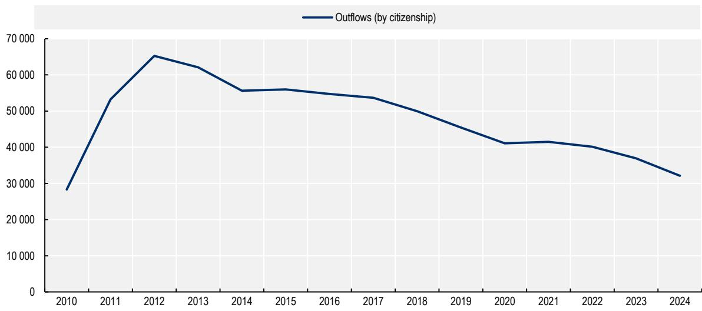  
Note: Emigration is defined as the action by which a person, having previously been usual resident in the territory of the country, ceases to have his or her usual residence in the country for a period that is, or is expected to be, at least 12 months. Migration flows are estimated (except persons related to international or temporary protection requests) based on regression models. Disaggregation of estimated emigration flows by age is based on 2021 census results.  
Source: Hellenic Statistical Authority, Statistics – ELSTAT, https://www.statistics.gr/en/statistics/-/publication/SPO15/-.

## Greek emigration to OECD destination countries

This section outlines the evolution of Greek emigration flows to OECD countries since the mid-2000s, describing how annual movements have changed over time and by country of destination. This section presents flow data for main destination countries identified in Chapter 1 for which reliable data are available in the International Migration Database.

## The economic crisis marked a turning point in recent Greek emigration patterns

Migration flows from Greece to OECD countries were stable between 2005 and 2010, fluctuating around 14 000-15 000 persons annually before increasing to over 19 500 in 2010 (see Figure 2.2). A sharp rise followed the onset of the Greek sovereign-debt crisis: flows to other OECD countries more than doubled between 2009 and 2011, reaching close to 33 000 (OECD, 2021[1]), and then surged further to nearly 52 000 in 2012. This escalation coincides with the deep contraction of the Greek economy, severe labour market deterioration, and historically high unemployment rates, particularly among youth (OECD, 2016[2]). Flows remained around 46 000 to 56 000 between 2012 and 2019.

After peaking at 55 760 in 2019, migration flows from Greece to OECD countries declined sharply to 32 543 in 2020, likely reflecting the widespread mobility restrictions and economic uncertainty associated with the COVID-19 pandemic. This drop mirrors global patterns observed across OECD countries, where border closures, travel disruptions, and the suspension of visa processing significantly curtailed international mobility (OECD, 2021[1]). As restrictions eased, flows began to increase again, rising to over 34 000 in 2021 and over 38 000 in 2023, although remaining below pre-pandemic levels (see Figure 2.2). The gradual rebound is consistent with evidence indicating that migration intentions persisted despite the pandemic, with movement resuming once public health measures were lifted and labour market conditions stabilised in major destination countries. It is also consistent with Greece's introduction of targeted return-incentive measures during this period (see Chapter 6), which may have supported the recovery of return flows.

Figure 2.2. Inflows of Greek citizens to OECD countries peaked between 2012 and 2019
Inflows of Greek citizens to OECD countries, 2005-2023  
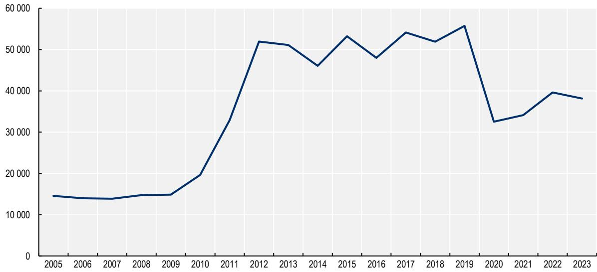  
Note: The OECD International Migration Database captures annual legal migration flows of both permanent and temporary entries, except for the United States, Canada, and Australia where only permanent migrants are recorded. Data refer exclusively to OECD destination countries and are based on immigration statistics reported by receiving countries; these data are not fully harmonised across destinations. All figures are obtained as the sum of standardised gross flows for countries where they are available. Data is not complete for Ireland, Latvia, Lithuania, Portugal, Türkiye, and the United Kingdom.  
Source: OECD International Migration Database, http://dx.doi.org/10.1787/data-00342-en.

Emigration from Greece to English-speaking settlement countries has remained broadly stable over the last two decades, with a notable increase during the economic crisis

An examination of flows to long-distance English-speaking destinations shows how mobility patterns have evolved outside Europe over the past two decades. $^{1}$ Across these countries, the United States consistently receives the largest number of Greek emigrants, with annual inflows ranging from around 650 to over 1 400 between 2005 and 2024 (see Figure 2.3). After a decline during the onset of the economic crisis, arrivals rose sharply from 2011 onward, reaching 1 302 in 2013 and peaking at 1 422 in 2016, before stabilising between 900 and 1 300 in more recent years.

In Canada, inflows are smaller but show a clear upward trajectory during the crisis years. Arrivals increased from around 100 per year in the mid-2000s to a high of 477 in 2015, before settling into a range of 245 to 415 in the years that followed. Much like the United States, Canada saw a noticeable increase in arrivals beginning in 2011.

Similarly, in Australia, annual arrivals remained modest through the mid-2000s, but the economic crisis in Greece prompted a brief resurgence of interest in Australia as a destination. Inflows rose sharply from 296 in 2012 to 531 in 2013, peaking at 604 in 2014, as some Greeks sought opportunities beyond Europe during the most acute years of the recession. Yet this surge proved temporary. From 2015 onward, arrivals declined steadily, falling back to 124 by 2024, suggesting that Australia’s appeal during the crisis years did not translate into a sustained new migration wave.

Figure 2.3. Inflows of Greek citizens to Australia have been declining since 2014
Inflows of Greek citizens to Australia, Canada and the United States, 2005-2024  
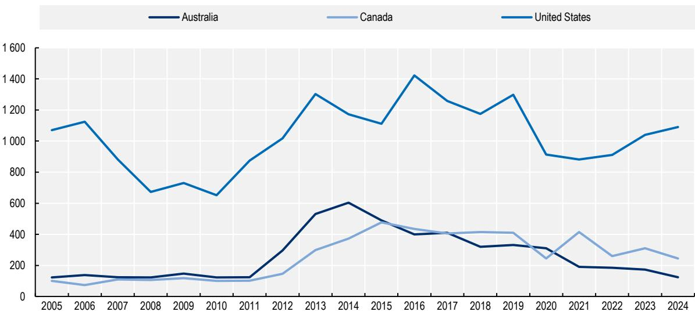  
Note: The OECD International Migration Database captures annual legal migration flows of both permanent and temporary entries, except for the United States, Canada and Australia where only permanent migrants are recorded.
Source: OECD International Migration Database, http://dx.doi.org/10.1787/data-00342-en.

## With about 16 500 Greek emigrants arriving in 2024, Germany has remained a major destination for Greek emigrants

Germany has remained a major destination for Greek emigrants, with flows rising markedly during the years of the economic crisis. Following relatively stable levels of around 8 000-9 000 entrants annually before 2010, movements increased sharply thereafter, peaking at over 32 000 in 2012 and 2013 (see Figure 2.4). This surge suggests that Germany's labour market conditions, combined with the advantages of EU freedom of movement, may have made it an especially attractive option for Greeks seeking employment opportunities during the crisis period. Established networks in the country may have also contributed to Germany being a preferred destination country at this time.

While inflows gradually declined after 2014, they have remained well above pre-crisis levels, indicating that Germany continues to play a significant role as a destination for Greek talent. More recently, flows have continued to decline between 2022 and 2024 from about 19 500 to 16 500 yearly, pointing to a sustained yet declining interest in Germany as a migration destination even as economic conditions in Greece have improved.

Figure 2.4. Inflows of Greek citizens to Germany increased sharply during the financial crisis but stabilised in recent years  
Inflows of Greek citizens to Germany, 2005-2024  
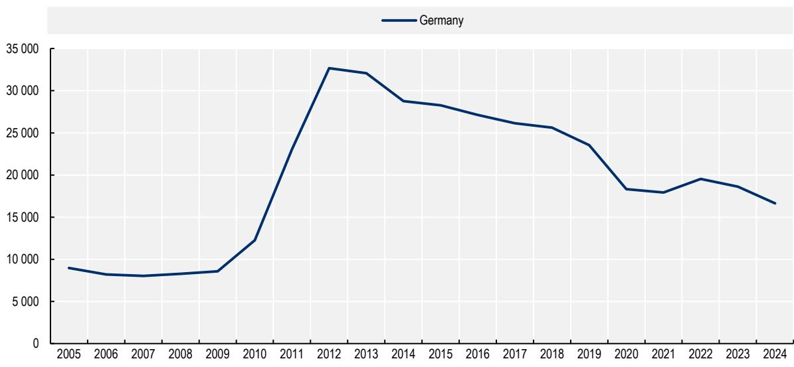  
Source: OECD International Migration Database, http://dx.doi.org/10.1787/data-00342-en.

## Greek emigration to smaller European destinations has generally exhibited growth in recent years

Emigration from Greece to smaller European destinations such as Belgium, the Netherlands and Switzerland has generally exhibited steady growth over the past two decades, although total flows remain modest compared with Germany (see Figure 2.5). In Belgium, flows rose from 716 in 2005 to just over 1 500 by 2022. Switzerland also attracted growing numbers, from 331 in 2005 to 2 452 in 2023. The Netherlands shows a particularly notable increase, from 846 in 2005 to 6 292 in 2022, which is likely related to Greek students' heightened interest in studying in the Netherlands post Brexit (see Chapter 5).

These findings are consistent with Eurostat data on EU free movement which shows that in recent years the Netherlands consistently ranks among the top destinations for intra-EU movers. In fact, in 2021, the Netherlands accounted for around 8% of all intra-EU movement (Eurostat, 2023[3]). Another factor that may help explain the marked increase in Greek migration to the Netherlands since the onset of the COVID-19 pandemic is that the Netherlands maintained a high employment rate even during the pandemic (European Employment Services, 2025[4]) It is also worth noting that the number of international students in the country tripled between 2005 and 2022, reaching 115 000 and comprising 40% of university enrolment (OECD, 2024[5]). This is consistent with findings in Chapter 5, that indicate an increase in Greek student enrolment in the Netherlands between 2014 and 2022.

Figure 2.5. Inflows of Greek citizens to the Netherlands have risen steadily over the past two decades, with a slight decline in 2023 and 2024

Inflows of Greek citizens to Belgium, the Netherlands and Switzerland, 2005-2024

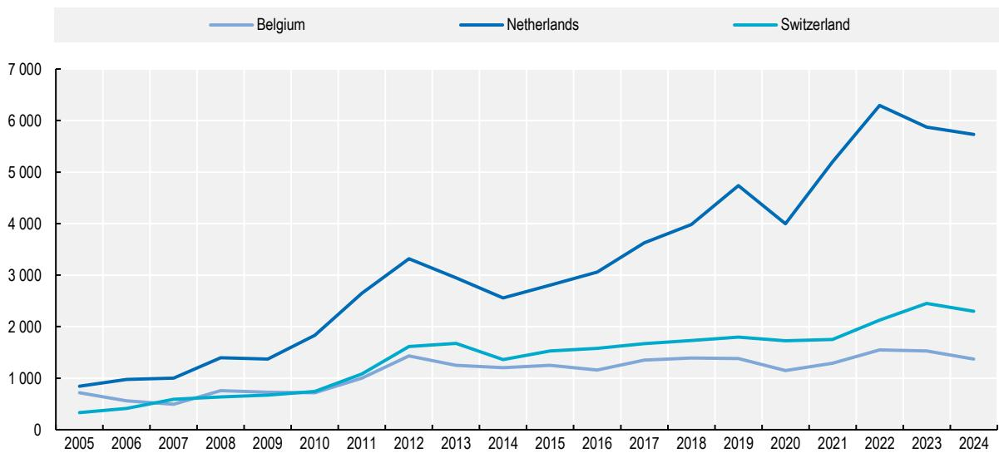  
Source: OECD International Migration Database, http://dx.doi.org/10.1787/data-00342-en.

Greek emigration to the Nordic countries has remained relatively modest, but flows have shown gradual growth. Sweden has consistently received the largest number of Greek migrants in the region, with annual inflows rising from around 300 in 2005, reaching over 1 300 in 2012 and 2013, decreasing to about 750 in 2020 and 2021, and increasing again to over 1 200 in 2022 (see Figure 2.6). Norway and Denmark have experienced smaller but steadily increasing flows, with Greek arrivals rising from roughly 50-70 per year in the mid-2000s to over 700 in Norway and more than 800 in Denmark in recent years. While total numbers remain modest relative to Germany or the Netherlands, the sustained increase suggests that the Nordic countries have appeal as destinations offering stable labour markets and support.

Historical migration links and sustained institutional co-operation may help explain the relatively high and persistent emigration from Greece to Sweden. Labour migration flows in the 1960s and 1970s established strong bilateral ties, resulting in a pool of Greek workers with Swedish language skills and familiarity with the Swedish labour market among Greeks. Since the mid-2010s, organisations such as EURES Sweden have reinforced these connections by organising joint Sweden – Greece European Job Days, for example, facilitating the recruitment of Greek health professionals, IT specialists and life science experts. This targeted co-operation may be one factor that can help account for Sweden's attractiveness and the continued momentum of Greek emigration to Sweden (European Employment Services, 2017[6]).

Figure 2.6. Despite year-to-year variation, inflows of Greek citizens to Nordic countries show an overall upward trend since 2005  
Inflows of Greek citizens to Denmark, Norway and Sweden, 2005-2024  
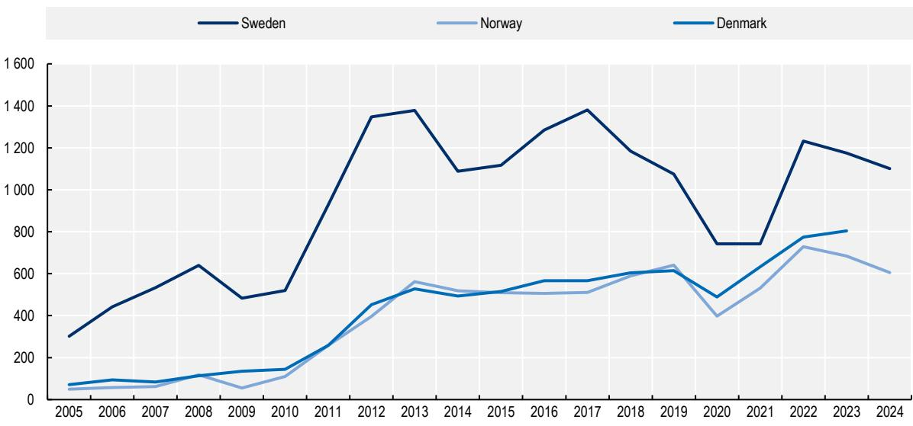  
Note: 2024 data for Denmark was not yet available at the time of publication.
Source: OECD International Migration Database, http://dx.doi.org/10.1787/data-00342-en.

## Net migration trends highlight shifting mobility pressures and recovery dynamics

This section provides an overview of how net migration of Greeks from various OECD countries has shifted over time, setting the stage for a closer examination of the drivers behind these movements. Net flows of Greeks are positive whenever more Greek citizens migrate to a particular OECD country than leave it, while the reverse results in negative net flows.

The section draws on the limited outflow data available from destination countries, thus focussing on destination countries with more comprehensive and consistent reporting. Because migration flow statistics are collected differently across countries and often rely on administrative systems that do not fully capture all movements, the figures presented here should be interpreted with caution. Even for the selected destinations, gaps in coverage and differences in recording practices mean that the data provide useful indications of trends rather than precise measures of total flows. For the Netherlands, Sweden, Switzerland, Belgium and Germany, data are available on both the arrivals and departures of Greek citizens. In these cases, it is possible to calculate net migration flows of Greek citizens by subtracting the number of departures from the number of arrivals.

## Net migration has remained positive in many major European destinations

Among major destination countries, patterns vary, but overall trends point to sustained Greek populations. Net migration to the Netherlands has grown markedly over the past two decades, rising from 166 in 2005 to more than 3 300 in 2022 before easing to around 1 760 in 2024 (see Figure 2.7). In the Netherlands, the sharp drop in net migration in 2020 coincides with the COVID-19 mobility restrictions and may also reflect the high share of Greek students in the country, whose movements are particularly sensitive to travel disruptions and university-related shifts.

Switzerland shows a similar pattern of persistent increases, with net inflows rising from 416 in 2010 to over 1 700 in 2023 and easing but remaining relatively high in 2024. Sweden experienced a peak during the crisis years, reaching around 1 100 in 2012 and 2013, followed by moderate levels since the COVID-19 pandemic. Belgium shows smaller but consistently positive net inflows after 2008, indicating ongoing though more modest expansion of Greek communities in these destinations.

Figure 2.7. Net migration of Greek citizens to selected European destinations has remained positive since 2008, with the largest increases in the Netherlands and Switzerland  
Net migration flows of Greek citizens, Switzerland, the Netherlands, Belgium and Sweden, 2005-2024  
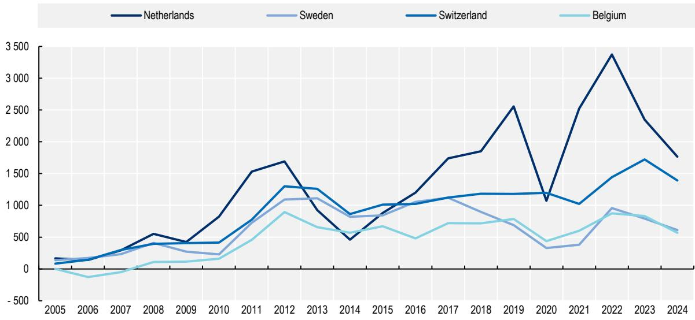  
Note: Countries were selected based on major destination countries from Greece with available inflow and outflow data. Figures refer to the difference between the annual gross inflow and the annual gross outflow of Greek citizens of all ages from each destination country.
Source: OECD International Migration Database, http://dx.doi.org/10.1787/data-00342-en.

Net migration flows between Greece and Germany have shifted dramatically over the past two decades. Between 2005 and 2009, net migration was consistently negative, with annual losses of between 6 000 and 8 000 Greeks (see Figure 2.8). A pronounced turning point occurred in 2010, followed by a rapid surge: by 2011 net migration had climbed above 12 600, rising further to more than 20 000 in 2012. These exceptionally high values coincide with the peak years of the sovereign debt crisis, when Germany's labour market and freedom of movement offered comparatively accessible opportunities for Greek workers seeking stability. Since 2012, net flows have continued to decline, leading to a return to a negative flow of around 1 200 persons in 2024.

Figure 2.8. In 2024, net migration flows to Germany were negative for the first time since 2009
Net migration flows of Greek citizens, Germany, 2005-2024  
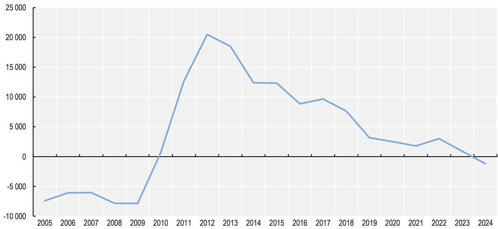  
Note: Figures refer to the difference between the annual gross inflow and the annual gross outflow of Greek citizens of all ages. Source: OECD International Migration Database, http://dx.doi.org/10.1787/data-00342-en.

## Gender patterns in Greek emigration inflows across destination countries

This section introduces recent trends in the gender composition of Greek emigrant inflows to major destination countries with available data. It examines how the share of women and men among new arrivals has evolved over time.

## Greek emigration between 2005 and 2023 has largely remained male-dominated

Across long-standing destinations such as the United States, Australia and Canada, Greek emigration between 2005 and 2023 has consistently remained male-dominated, although the degree of imbalance varies across years and destinations. In the United States, the share of women remained just below parity, generally between 45% and 49%, with only a few temporary dips pushing the female share lower (see Figure 2.9). Australia shows a similar pattern: while the gender distribution fluctuates, most years fall within the 41-49% range, aside from a short-lived dip in 2012 and rise in 2021. Canada exhibits somewhat greater variability, but the overall pattern remains the same: women account for less than half of new arrivals in most years, with only occasional years in which the female share reached parity.

Across the Nordic destinations, the share of women among Greek emigrant inflows has trended upward over time, even if it generally remains below half. In Denmark, women accounted for roughly one-third to just under one half of arrivals, rising from mid-30s in 2008-2010 to about 42-47% in recent years (see Figure 2.10). Norway shows a similar pattern, increasing from below 30% in 2005 to about 41-44% by 2021-2023. Sweden records the highest and most sustained female shares, climbing from the high 30% range in the mid-2000s to around 49% in 2019, briefly exceeding half in 2020-2021, then easing to 45-47% by 2022-2023.

Figure 2.9. Less than half of Greek emigrants to Australia, Canada and the United States are women Inflows of Greek citizens who are women to Australia, Canada and the United States, 2005-2023  
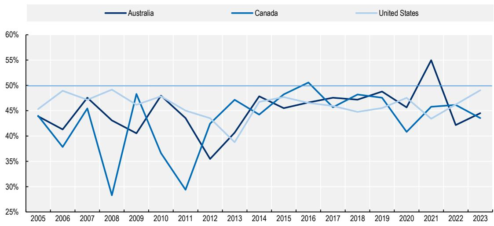  
Note: The OECD International Migration Database captures annual legal migration flows of both permanent and temporary entries, except for the United States, Canada and Australia where only permanent migrants are recorded.
Source: OECD International Migration Database, http://dx.doi.org/10.1787/data-00342-en.

Figure 2.10. The share of women among Greek emigrant inflows to Nordic countries has risen steadily  
Inflows of Greek citizens who are women to Denmark, Norway and Sweden, 2005-2023  
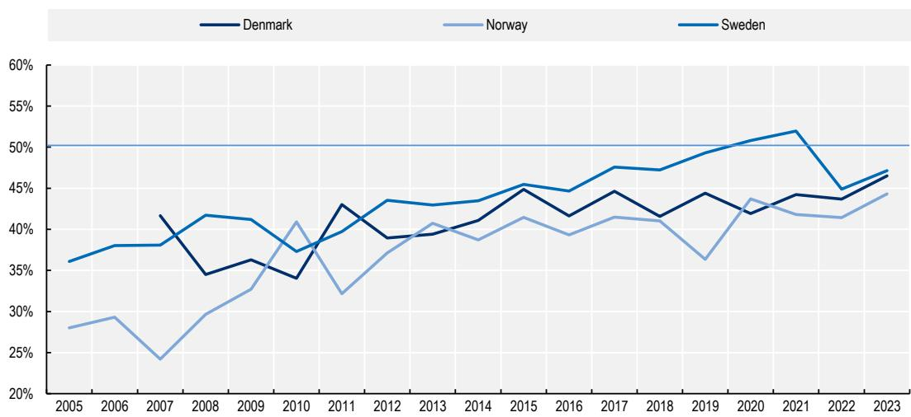  
Source: OECD International Migration Database, http://dx.doi.org/10.1787/data-00342-en.

Across major Western and Central European destinations, women continue to represent less than half of arrivals in most countries (see Figure 2.11). Germany shows a stable pattern, with women representing about 38-42% of new arrivals throughout the period, indicating limited change over time. The Netherlands records slightly higher female shares, generally in the low-40s. Switzerland shows a comparable pattern, with female shares hovering around the mid-40% range over the past decade. Belgium stands out with consistently higher female representation, often reaching 48-55%.

Figure 2.11. Women remain a minority among Greek emigrant inflows to most Western and Central European destinations

Inflows of Greek citizens who are women to Belgium, Germany, the Netherlands and Switzerland, 2005-2023

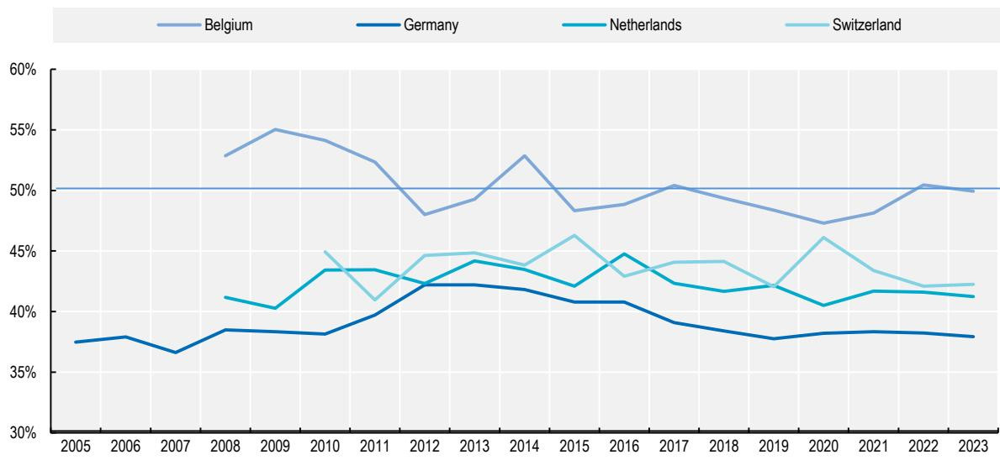  
Source: OECD International Migration Database, http://dx.doi.org/10.1787/data-00342-en.

## References

European Employment Services (2025), Labour Market Information: Netherlands, https://eures.europa.eu/living-and-working/labour-market-information/labour-market-information-netherlands\_fr.

European Employment Services (2017), Sweden invites Greek health specialists to move north. [6]

Eurostat (2023), Migration and Asylum in Europe, https://ec.europa.eu/eurostat/web/interactive-publications/migration-2023.

OECD (2024), International Migration Outlook 2024, OECD Publishing, Paris, https://doi.org/10.1787/50b0353e-en.

OECD (2021), International Migration Outlook 2021, OECD Publishing, Paris, https://doi.org/10.1787/29f23e9d-en.

OECD (2016), OECD Economic Surveys: Greece 2016, OECD Publishing, Paris, https://doi.org/10.1787/eco\_surveys-grc-2016-en.

## Notes

$^{1}$ Reliable annual inflow data for the United Kingdom are not available and are therefore not included in this section, allowing the analysis to focus on three destinations: Australia, Canada and the United States.

## Labour market outcomes in destination countries

This chapter provides a comprehensive overview of the educational attainment, labour market integration, occupational profiles, and remittance patterns of Greek emigrants living in OECD countries. It highlights the strong educational selectivity of recent emigrant cohorts, the varied employment and unemployment outcomes across host countries, and the roles Greek emigrants play in both high-skilled and lower-skilled segments of foreign labour markets. The chapter also examines overqualification risks, gender gaps in labour market integration, and the mobility of Greek-trained medical doctors, concluding with an analysis of remittance flows sent to Greece.

## In Brief

\- Most Greek emigrants in OECD countries have medium or high levels of educational attainment, with recent cohorts displaying particularly strong qualifications. Destinations such as Germany and Italy continue to host a sizeable share of Greek migrants with low or medium education. In contrast, countries such as Switzerland, France and the United Kingdom exhibit highly skilled Greek-born populations, with more than six in ten migrants holding tertiary degrees.

\- Greek emigrants in OECD countries exhibit slightly higher labour force participation than the native-born population in the host countries, with comparable employment rates across groups. Participation gaps by gender are similar among both Greek-born and native-born individuals, as men show higher participation and employment than women, while overall outcomes for Greek-born workers closely mirror those of their native-born peers.

\- Education is a major determinant of employment outcomes for Greek-born migrants, with higher qualifications consistently linked to stronger labour market performance. However, returns on education vary widely across destination countries: employment rates among those with low or medium education differ substantially – from relatively strong outcomes in countries such as the United Kingdom, Germany, Switzerland and the United States, to much lower rates in Italy and France. By contrast, highly educated Greek-born workers achieve consistently high employment rates across nearly all major destinations.

\- Greek emigrants are concentrated in medium- and high-skilled occupations, often in line with their qualifications but pockets of overqualification remain. Overqualification rates among Greek emigrants vary widely across OECD destinations. In countries such as Australia and Switzerland, Greek-born workers show levels of overqualification similar to native-born and foreign-born populations, whereas in Belgium and Italy their rates are broadly comparable to natives and below foreign-born averages. In Switzerland and France, Greek-born workers are even less likely to be overqualified than the native-born population.

\- Gender differences in occupational outcomes are pronounced. Greek-born women are more likely to work in higher-skilled non-manual occupations such as professional, clerical, and service roles. By contrast, Greek-born men are more concentrated in craft, machine operation, and technical positions. These differences reflect broader gendered labour market patterns but also suggest potential segmentation in occupational pathways for emigrants.

\- Emigration of Greek medical doctors raises important challenges for the long-term sustainability of Greece's health-care workforce. Greece also records the highest share of native-born foreign-trained doctors in the OECD, reflecting substantial outflows of students pursuing medical degrees abroad. At the same time, the number of Greek-born doctors practising in other OECD countries has tripled since 2000/01. Greece is a net sender of medical doctors to several EU/EEA countries as well as the United States and the United Kingdom.

\- Remittance flows to Greece remain modest relative to GDP, yet they reflect enduring diaspora ties. Despite Greece's long-standing emigration history, remittances represent only around $0.2\%$ of GDP, far below levels observed in neighbouring countries. Remittances peaked during the financial crisis and continue to originate primarily from OECD destinations, especially the United States, the United Kingdom and Germany.

## Introduction

This chapter examines education attainment and the labour market integration of Greek emigrants across OECD destination countries. Understanding labour force participation, employment, and unemployment patterns among Greek nationals abroad provides insights into how effectively emigrants can use their skills and qualifications in foreign labour markets. The chapter highlights where and in which contexts emigrants might experience barriers to integration, and sheds light on gender and sectoral disparities.

The chapter presents key indicators of labour market participation, employment, and unemployment for Greek nationals abroad, with results disaggregated by gender and country of residence. It also examines the sectoral and occupational distribution of Greek emigrants, with particular attention to overqualification in the workplace. Finally, the chapter concludes with a case study on the emigration of Greek doctors, illustrating both the opportunities and challenges faced by professionals in one of the most internationally mobile sectors. The focus on doctors is particularly timely given the recent Greek legislation aimed at simplifying the recognition of medical qualifications obtained abroad, notably Law 5 099/2024, which seeks to ease return pathways for foreign-trained physicians and address persistent shortages in the domestic health-care system (see Chapter 6 for more details).

## Most Greek emigrants have medium or high educational attainment

The educational profile of Greek-born migrants varies substantially across destination countries, reflecting both the selectivity of migration flows and the characteristics of host-country labour markets. It is important to note that across all destinations, data do not distinguish whether educational qualifications were attained in the country of origin, the country of residence, or elsewhere.

Educational attainment is classified according to the International Standard Classification of Education (ISCED 2011), which provides a harmonised framework for comparing education levels across countries. ISCED distinguishes eight levels of education, ranging from early childhood education (ISCED 0) to doctoral or equivalent programmes (ISCED 8). Lower levels correspond to primary and lower secondary education (ISCED 1 and 2), while upper secondary and post-secondary non-tertiary education are classified under ISCED 3 and 4. Tertiary education comprises short-cycle tertiary programmes (ISCED 5), bachelor's or equivalent degrees (ISCED 6), master's or equivalent degrees (ISCED 7), and doctoral or equivalent degrees (ISCED 8). For analytical purposes, educational attainment is grouped into three categories: low educational attainment (ISCED 0-2), medium educational attainment (ISCED 3-4), and high educational attainment (ISCED 5-8).

Germany and Italy emerge as key destination countries where Greek-born migrants are disproportionately concentrated in the low- and medium-educated groups. In Germany, about four in five Greek-born residents have attained at most a medium level of education, a pattern that likely reflects Germany's long-standing role as an attractive destination for Greek factory and manual workers. The corresponding share in Italy reaches 67% (see Figure 3.1). In parallel, only around one-fifth of Greek-born migrants in Germany hold a tertiary degree (high educational attainment). These patterns are consistent with broader evidence across several European countries, where immigrant populations tend to be overrepresented in lower educational attainment groups. This may be partially attributed to the fact that certain countries with long-standing, labour-driven migration histories, often facilitated by free movement within Europe, can be characterised by limited skills-based selection mechanisms. By contrast, in countries such as Switzerland, the United Kingdom and France, the majority of Greek-born migrants hold tertiary qualifications, with high educational attainment reaching 63% in Switzerland, 68% in the United Kingdom, and 72% in France.

Figure 3.1. Over half of Greek emigrants in selected destination countries have medium or high educational attainment  
Educational attainment of Greek-born emigrants in selected OECD countries, ages 15-64, 2020/21  
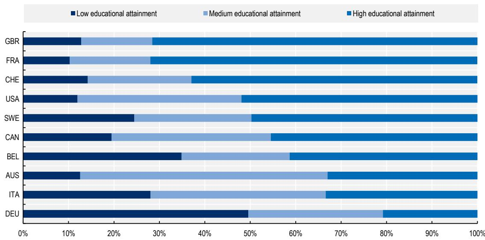  
Note: For Belgium, Australia, the United Kingdom, Sweden and the United States, educational attainment is not fully available, as a non-negligible share of the population is classified as having unknown educational attainment. As a result, those who are unknown have been removed from the distribution and estimates for these countries should be interpreted with caution. Due to data limitations for the Netherlands and Türkiye, these countries are not included.  
Source: OECD Database on Immigrants in OECD Countries (DIOC), 2020/21.

## A larger share of Greek-born emigrants has achieved high educational attainment in most destination countries when compared with the native-born populations

In Germany, Belgium, Sweden, Canada and Australia, Greek-born adults are more likely than the native born to have low educational attainment. Nonetheless, gaps are small across most major destination countries, aside from Germany where 50% of Greeks are low educated compared with 17% of the native born (see Figure 3.2). In most destination countries, the share of Greek-born adults with medium educational attainment is substantially lower than among the native born. The differences exceed 20 percentage points (p.p.) in Germany (30% versus 53%), Switzerland (23% versus 47%), Sweden (26% versus 51%), France (18% versus 44%), and the United Kingdom (16% versus 41%). Australia, Italy and Canada, show much smaller gaps.

When considering high educational attainment, Greek-born adults are strongly represented in several destinations. In France, 72% of Greek-born adults are highly educated, compared with 35% of the native born. Large positive gaps are also observed in the United Kingdom (72% versus 36%), Switzerland (63% versus 39%), the United States (52% versus 38%), Sweden (50% versus 33%) and Italy (33% versus 20%). In Canada, the share of highly educated Greek-born adults (45%) is close to that of native-born adults (47%). By contrast, the share of highly educated Greek-born adults remains below that of the native born in Australia (33% versus 36%), and Germany (21% versus 30%).

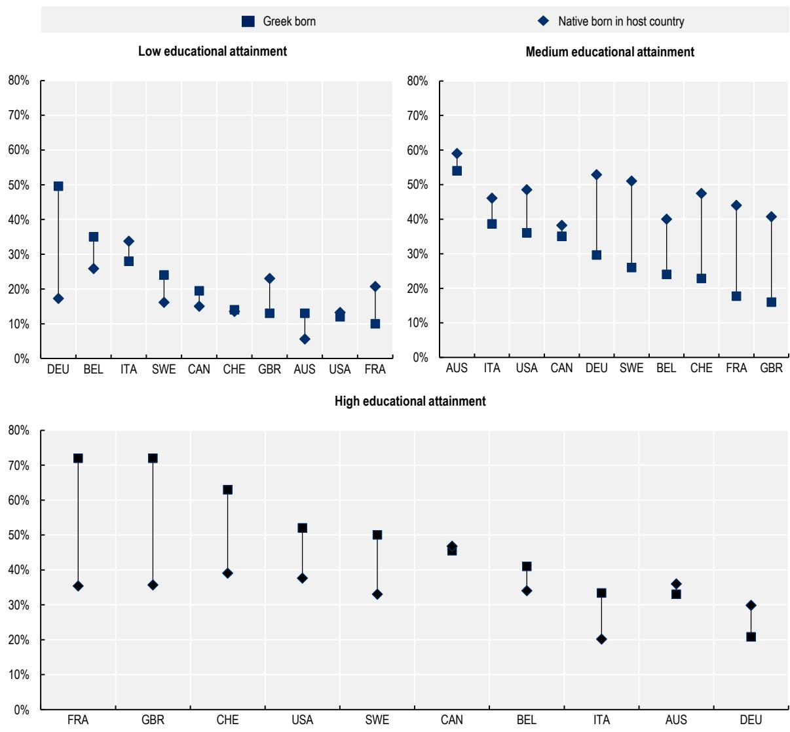  
Figure 3.2. Greek-born emigrants are more likely to have high educational attainment, while native-born populations are more often medium-educated in major destination countries  
Note: For Belgium, Australia, the United Kingdom, Sweden and the United States, educational attainment is not fully available, as a non-negligible share of the population is classified as having unknown educational attainment. As a result, those who are unknown have been removed from the distribution and estimates for these countries should be interpreted with caution.
Source: OECD Database on Immigrants in OECD Countries (DIOC), 2020/21.

Educational attainment of Greek-born and native-born populations in selected OECD countries, ages 15-64, 2020/21

Across OECD countries, Greek-born women and men display broadly similar levels of educational attainment. Shares with low education are identical for both groups (28%). Men are slightly overrepresented at medium levels of education, while women hold a modest advantage among the highly educated, exceeding men by around 3 p.p. (see Figure 3.3).

Figure 3.3. Greek-born women living in OECD countries are slightly more likely to have achieved high educational attainment than their male counterparts  
Educational attainment of Greek-born emigrants in OECD destination countries by gender, ages 15-64, 2020/21  
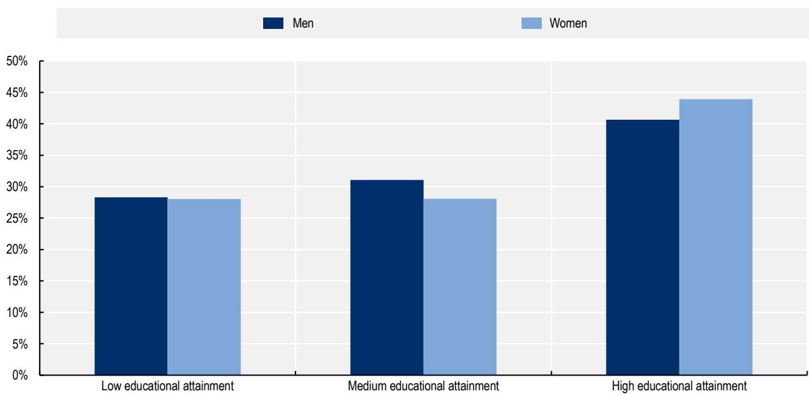  
Note: For Belgium, Australia, the United Kingdom, Sweden and the United States, educational attainment is not fully available, as a non-negligible share of the population is classified as having unknown educational attainment. As a result, those who are unknown have been removed from the distribution and estimates for these countries should be interpreted with caution.
Source: OECD Database on Immigrants in OECD Countries (DIOC), 2020/21.

The educational profile of Greek-born migrants in OECD countries varies markedly by time of arrival, reflecting cohort differences and pointing to ongoing signs of brain drain since the early economic crisis-driven emigration waves. Recently arrived Greek-born migrants display a clear concentration at the upper end of the educational distribution. Among Greek emigrants residing in an OECD country for fewer than five years, the highly educated constitute the dominant group (49%), while just over one in four has low educational attainment (see Figure 3.4). These patterns persist among migrants with five to ten years of residence, with 30% reporting low educational attainment, 24% reporting medium educational attainment and 46% reporting high educational attainment. In contrast, Greek-born migrants who have lived in the host country for more than a decade are substantially more represented at lower (44%) and medium (31%) levels of education, while the share of the highly educated drops sharply (25%). Differences across duration-of-stay reflect changes in the educational selectivity of Greek emigration over time and possibly a legacy of earlier, less-educated migration waves.

## Figure 3.4. Recent cohorts of Greek-born migrants exhibit higher levels of educational attainment in OECD countries

Educational attainment of Greek-born emigrants by duration of stay in OECD destination countries, ages 15 and above, 2020/21  
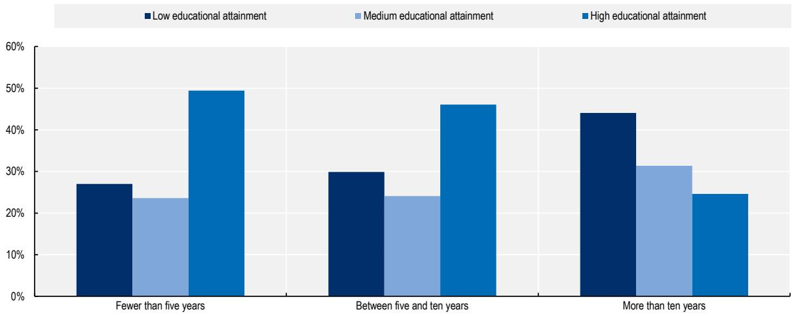  
Note: For Belgium, Australia, the United Kingdom, Sweden and the United States, educational attainment is not fully available, as a non-negligible share of the population is classified as having unknown educational attainment. As a result, those who are unknown have been removed from the distribution and estimates for these countries should be interpreted with caution.
Source: OECD Database on Immigrants in OECD Countries (DIOC), 2020/21.

## The labour market outcomes of Greek-born emigrants

This section examines the labour market integration of working-age Greek-born emigrants in OECD destination countries. Employment rates of the Greek-born population are compared with those of native-born and other foreign-born populations in the ten OECD countries hosting the largest concentrations of Greek-born individuals in working age in 2020/21, based on OECD DIOC data. The analysis further disaggregates employment outcomes by gender and level of educational attainment to highlight key differences in labour market integration across population subgroups.

## Greek emigrants exhibit similar or slightly higher labour market participation than the native-born population in OECD countries

Greek emigrants show higher labour market participation than the native-born population in OECD countries, although their employment rates are only slightly higher. According to the available data, 75% of individuals born in Greece and living in OECD countries participate in the labour market, compared with 72% among the native-born population (see Figure 3.5).

This pattern holds for both men and women. Among men, participation rates reach 80% for those born in Greece and 78% among the native-born population. Among women, participation stands at 69% for the Greek-born population, compared with 67% among native-born women. As a result, the gender gap in labour market participation is similar between the two groups.

Employment rates follow a broadly comparable pattern, though with narrower differences. Among all individuals aged 15-64, 69% of Greek-born persons in OECD countries are employed, compared with 68% of the native-born persons. Among men, the employment rate is 74% for the Greek-born population and 73% for the native-born population. For women, employment rates are equal across the two groups, with

63% employed in both cases. These figures suggest that Greek emigrants are highly active in the labour market and achieve employment outcomes that closely mirror those of the native-born population.

Figure 3.5. Greek-born emigrants have very similar employment rates to the native born in the host country

Labour market participation and employment rates by country of birth and gender, ages 15-64, OECD, 2020/21  
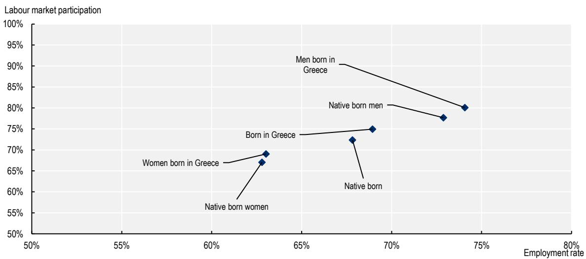  
Source: OECD Database on Immigrants in OECD Countries (DIOC), 2020/21.

Figure 3.6 compares labour market participation and employment rates by gender and country of birth in the four OECD countries hosting the largest populations of Greek-born individuals aged 15-64. Across destination countries, labour market outcomes for Greek-born migrants show clear and sometimes contrasting patterns, often with notable gender differences.

In Germany and Australia, Greek-born migrants, especially women, tend to have weaker labour market outcomes than the native-born populations. In both contexts, Greek-born men participate actively in the labour market yet are still below those of native-born men. For women, the gaps are more substantial: in Germany, Greek-born women participate at about 68%, well below native-born women, and in Australia the participation shortfall is even larger, around a 16-p.p. gap, the widest observed in the countries analysed.

In contrast, the United Kingdom stands out as a case where Greek-born migrants perform strongly relative to the native-born. Both men and women born in Greece have higher or comparable participation and employment rates, with Greek-born men participating at around 86%, considerably above native-born men. Women also show stronger or similar outcomes, making the United Kingdom unusual in offering a context where Greek-born migrants outperform the native-born populations across genders.

The United States presents a mixed picture that combines elements from both groups. Greek-born men show high labour market participation, over 80%, similar to Germany and higher than among US-born men and show similarly high employment rates. Among women, participation levels and employment rates are close to the native-born benchmark.

Figure 3.6. Outcomes for Greek-born and native-born populations in the host country are broadly similar across major destination countries, though notable cross-country variation persists

Labour market participation and employment rates by country of birth, gender, and country of residence, ages 15-64, 2020/21

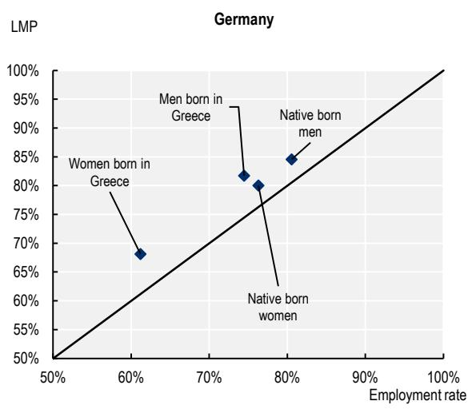

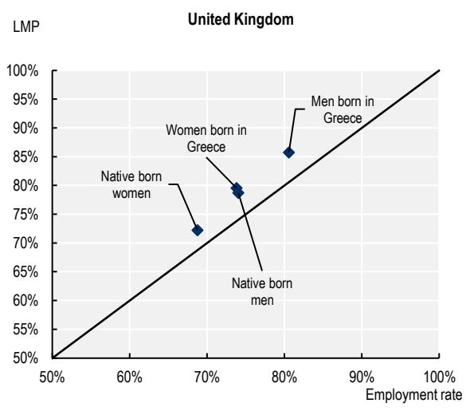

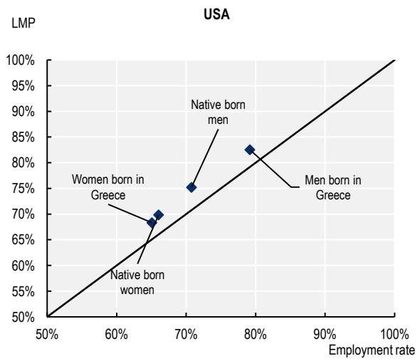

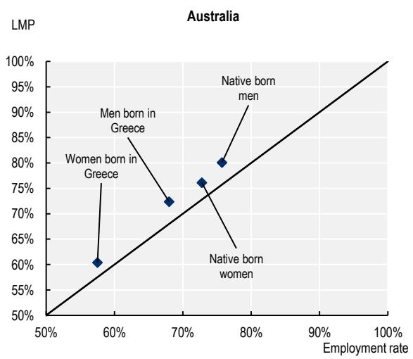  
Note: LMP denotes labour market participation.  
Source: OECD Database on Immigrants in OECD Countries (DIOC), 2020/21.

Across major destination countries, employment rates for Greek-born migrants increased between 2010/11 and 2015/16 in nearly all cases. The largest improvements occurred in the United Kingdom, where employment rose from 62% in 2010/11 to 79% in 2015/16, and in the United States, where it increased from 55% to 72%. Sweden also recorded notable gains, rising from 51% to 60%, while Australia saw employment increase from 55% to 60% over the same period (see Figure 3.7). Activity rates also recorded modest increases across most major destination countries, broadly mirroring trends observed in employment rates.

Labour market participation and employment rates of Greek-born emigrants by country of residence, ages 15-64, 2010/11 and 2015/16

Figure 3.7. Employment rates of Greek-born emigrants are the highest in the United Kingdom and Switzerland  
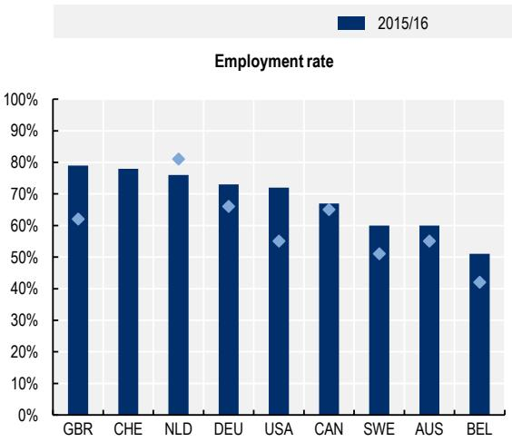

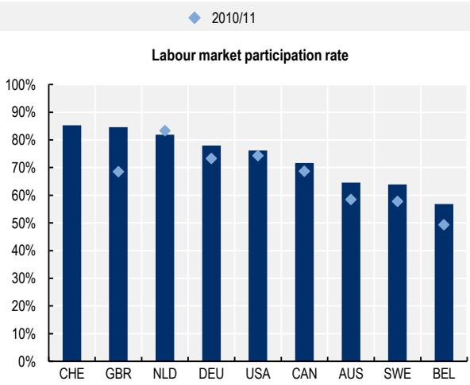  
Source: OECD Database on Immigrants in OECD Countries (DIOC), 2020/21.

## Higher levels of educational attainment are associated with stronger employment outcomes among Greek-born migrants

Across major destination countries, employment rates among Greek-born individuals vary markedly by educational attainment, though the overall pattern is clear: higher education is strongly associated with better labour market outcomes. Employment levels among those with low education are generally modest and show wide cross-country differences. Rates range from the mid-thirties in Italy (36%) and Australia (37%) to substantially higher levels in the United Kingdom (62%) and Germany (60%), with countries such as the United States (51%) and Switzerland (47%) positioned in between (see Figure 3.8.).

Among individuals with medium educational attainment, employment rises considerably across nearly all countries. Levels reach the low seventies in Germany and Switzerland (both 73%), sit in the high sixties in the United States (68%) and Canada (67%), and remain noticeably lower in Italy (51%) and France (47%). For the highly educated, employment outcomes are consistently strong across all destinations. Rates exceed 80% in several countries: Switzerland (86%), the United Kingdom (85%), the United States (82%) and Germany (82%). The only country with rates below 70% is Italy, with a rate of 68% among the highly educated. Taken together, the evidence points to a pronounced and consistent gradient across destination countries: higher educational attainment is associated with significantly higher employment rates for Greek-born migrants, with the strongest and most uniform outcomes observed among the highly educated.

Figure 3.8. Low-educated emigrants in France show particularly low employment rates
Employment rates of Greek-born emigrants in selected OECD countries by educational attainment, ages 15-64, 2020/21  
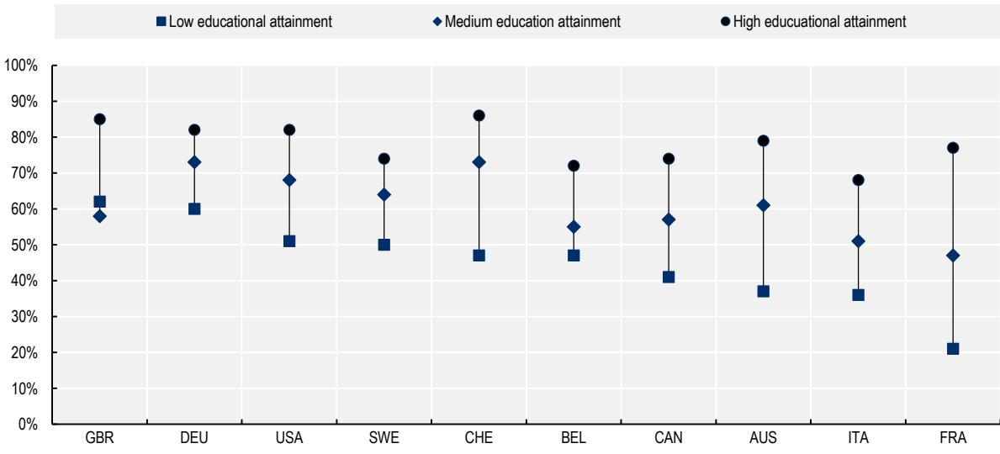  
Source: OECD Database on Immigrants in OECD Countries (DIOC), 2020/21.

## Greek-born women faced higher unemployment rates than both Greek-born men and native-born women and men

Examining unemployment rates among migrants is essential for assessing their economic integration in host countries. Employment outcomes capture not only the extent to which migrants are able to translate their skills and qualifications into work but also the inclusiveness and functioning of labour markets for foreign-born populations. While employment rates provide insight into how effectively OECD labour markets integrate Greek emigrants, unemployment rates indicate how efficiently these markets absorb those actively seeking work.

As shown in Figure 3.9, the unemployment rate of Greek-born individuals in 2020/21 varied across OECD destination countries and, in every case aside from the United States, exceeded that of the native-born population in 2020/21. On average, unemployment among Greek-born migrants aged 15-64 ranged from 4% in the United States to 16% in Canada, compared with 3-11% among native-born populations in the same countries (see Figure 3.9). In Canada, Italy and France, Greek-born individuals faced the largest gaps, with unemployment rates 5-6 p.p. higher than those of native-born workers.

In some destination countries, Greek-born migrants exhibited unemployment outcomes comparable to or slightly lower than those of the native-born population. In Australia, unemployment was identical for both groups, at 5%, while in the United States, Greek-born migrants had a slightly lower unemployment rate than the native-born population (4% vs. 6%). These outcomes should be interpreted in the context of overall labour market conditions, as both the United States and Australia recorded the lowest unemployment rates among the main destination countries for Greek emigrants in 2020/21.

Figure 3.9. Greek-born migrants faced higher unemployment than native-born populations in most major destination countries in 2020/21

Unemployment rates of Greek-born and native-born persons in selected OECD countries, ages 15-64, 2020/21

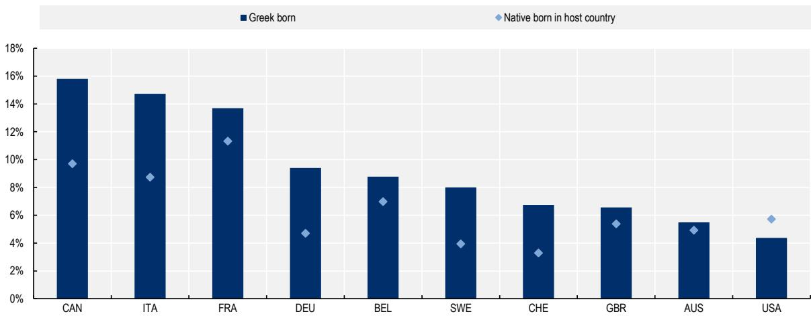  
Source: OECD Database on Immigrants in OECD Countries (DIOC), 2020/21.

The labour market outcomes of Greek-born migrants were generally more reflective of the native-born population or the foreign-born population in 2020/21. Among men, unemployment rates in 2020/21 for Greek-born individuals were generally closer to those of native-born men than to the wider foreign-born population. For example, in France, Sweden and Belgium, foreign-born men faced substantially higher unemployment rates than Greek and native-born men (see Figure 3.10).

Among women, unemployment outcomes for Greek-born emigrants in 2020/21 varied markedly across destination countries and did not follow a uniform pattern relative to native-born and foreign-born women. In several European destinations, unemployment among Greek-born women tended to lie closer to that of the foreign-born female population than to the significantly lower rates observed among native-born women. This was the case in Germany, where the unemployment rate among Greek-born women stood at 10%, compared with 12% among foreign-born women and just 5% among native-born women, and in Switzerland, where unemployment among Greek-born women (10%) exceeded that of foreign-born women (8%) but remained well above the very low rate recorded among native-born women (3%). In other countries, Greek-born women faced particularly high unemployment rates. In Canada, unemployment among Greek-born women reached 17%, substantially higher than among both native-born (10%) and foreign-born women (12%). By contrast, in other long standing destination countries such as the United Kingdom, the United States and Australia, unemployment rates among Greek-born women were relatively low and closely aligned with those of native-born women.

Figure 3.10. Greek-born women experienced substantially higher unemployment than their native-born peers in Canada, Germany and Switzerland in 2020/21

Unemployment rate of Greek-born and native-born persons in selected OECD countries by gender, ages 15-64, 2020/21

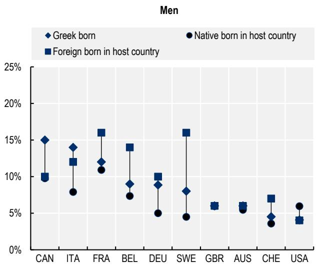  
Source: OECD Database on Immigrants in OECD Countries (DIOC), 2020/21.

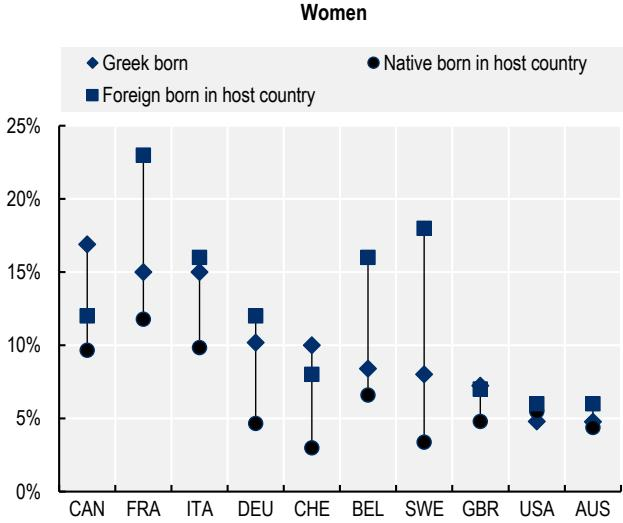

## The occupational profile of Greek emigrants

This section examines the occupational distribution of Greek-born emigrants, considering both skill levels and detailed occupations classified according to ISCO codes. It compares outcomes with those of native-born and broader foreign-born populations and includes a focussed analysis of Greek-trained medical doctors residing abroad.

## Greek emigrants tend to be concentrated in medium- and high-skilled jobs

Job quality is a central dimension of integration, as it shapes earnings prospects, career progression, job stability, and overall well-being. Across the OECD, Greek-born workers are predominantly employed in medium-skilled occupations, which account for just over half of total employment (see Figure 3.11). Highly skilled jobs represent around one-third of employment among Greek-born migrants, while low-skilled occupations account for a smaller share, at around 8% on average; for approximately 4% of Greek-born individuals in the OECD aged 15-64, the skill level of employment is unknown.

Country-level patterns reveal heterogeneity. In Germany and Australia, medium-skilled occupations dominate, accounting for around half of employment among Greek-born workers, reflecting patterns in the OECD broadly. In Italy and Sweden, over 40% of Greek-born workers are in highly skilled occupations, alongside sizable shares in medium- and low-skilled jobs. By contrast, in Belgium, Switzerland, and particularly France, Greek-born migrants are predominantly concentrated in highly skilled occupations. Highly skilled employment accounts for 57% of Greek-born workers in Belgium, 65% in Switzerland, and over three-quarters in France, while low-skilled employment is comparatively limited in these countries. Taken together with evidence on educational attainment, these patterns suggest that occupational outcomes for Greek-born migrants generally appear to reflect educational attainment.

Figure 3.11. Across the OECD, Greek-born workers are predominantly employed in medium and high-skilled occupations  
Distribution of Greek-born workers in employment by occupation, ages 15 and above, OECD and selected destination countries, 2020/21  
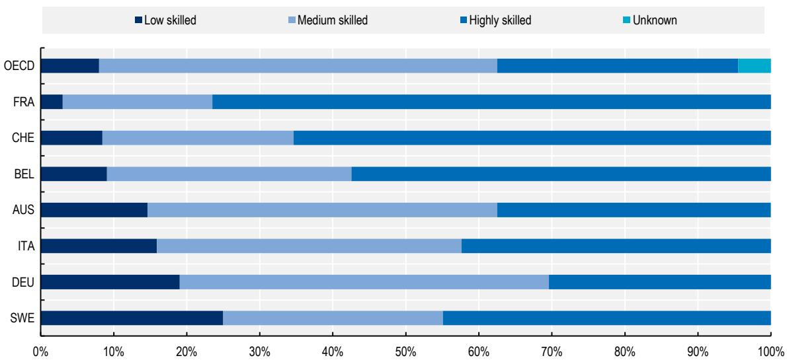  
Note: Among the top ten destination countries for Greek emigrants in the OECD, only those with available data are included. Similarly, the OECD-wide analysis is restricted to countries with available data.
Source: OECD Database on Immigrants in OECD Countries (DIOC), 2020/21.

A comparison of the occupational skill distribution of Greek-born emigrants in 2010/11 and 2015/16 reveals broad stability in major destination countries, while revealing some notable shifts. At the OECD level, the share of Greek-born workers in highly skilled occupations rose markedly, from 17% in 2010/11 to 30% in 2015/16, while medium-skilled employment remained broadly stable (53% to 55%) and low-skilled employment declined substantially (28% to 15%) (see Figure 3.12). This upward shift in skill intensity is also visible in several destination countries. In Sweden, for example, the share of highly skilled Greek-born workers doubled between 2010/11 and 2015/16 (17% to 34%), reflecting a movement away from medium-skilled jobs. Germany, by contrast, saw a rise in medium-skilled employment (56% to 62%) accompanied by a decline in the highly skilled share (23% to 16%).

Figure 3.12. Greek-born emigrants show a stable occupational skill structure across major destination countries over time

Distribution of Greek-born workers by occupation, ages 15 and above, OECD, 2015/16 and 2010/11

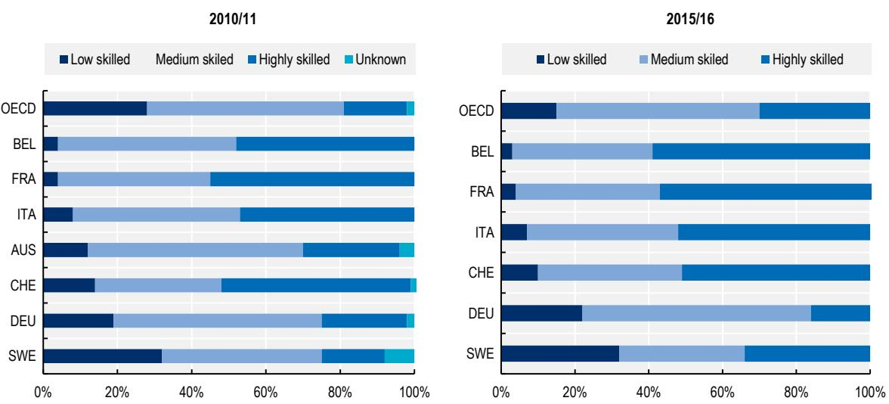  
Note: Among the top ten destination countries for Greek emigrants in the OECD, only those with available data are included. Similarly, the OECD-wide analysis is restricted to countries with available data.
Source: OECD Database on Immigrants in OECD Countries (DIOC), 2020/21.

Across most major destination countries, Greek-born emigrants exhibit notable differences in occupational skill distribution relative to native-born populations. In Sweden, Greek-born workers are more heavily concentrated in low-skilled occupations (25% versus 12% among natives) than native-born workers yet are underrepresented in medium-skilled roles (30% versus 43%), while shares in highly skilled occupations are broadly similar (see Figure 3.13). In Germany, low- and medium-skilled roles account for a larger share of Greek-born employment than for native-born workers, with only 30% of Greek-born migrants in highly skilled occupations compared with 51% of their native-born counterparts. In Australia, the occupational distribution of Greek-born migrants is closer to that of the native-born population, with only slightly higher representation in low-skilled jobs (15% versus 10%) and somewhat lower shares in highly skilled roles (37% versus 42%), perhaps reflecting the country's long-standing history as a destination for Greek migrants.

By contrast, in Belgium, Switzerland and France, Greek-born emigrants are more likely than natives to be employed in highly skilled occupations. In Belgium, 57% of Greek-born workers are in high-skilled roles compared with 47% of native-born workers, while in Switzerland the gap is even larger (65% versus 54%). In France, the concentration of Greek-born migrants in high-skilled occupations is particularly pronounced, at 76% compared with 48% among their native-born counterparts.

Figure 3.13. Greek-born emigrants are often underrepresented in medium skilled positions when compared with their native-born counterparts

Distribution of Greek-born and native-born workers by occupation, ages 15 and above, selected OECD countries, 2020/21

France  
Switzerland  
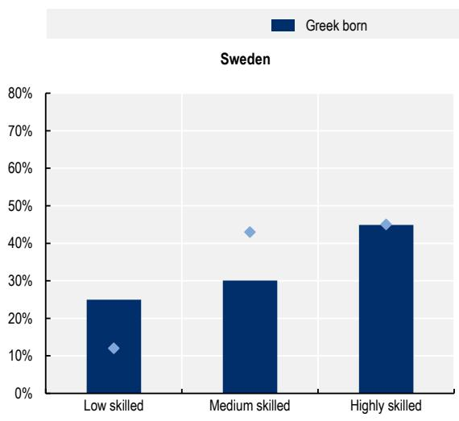

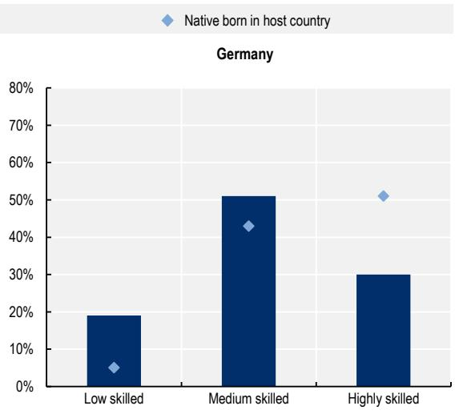

Australia  
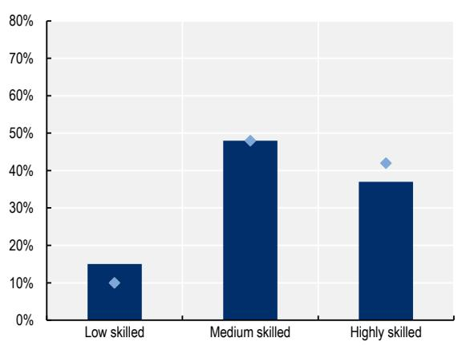

Belgium  
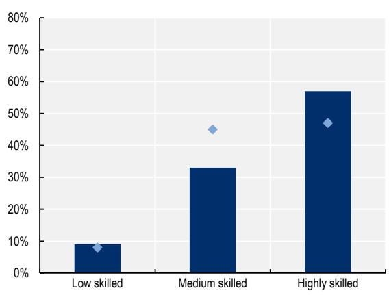

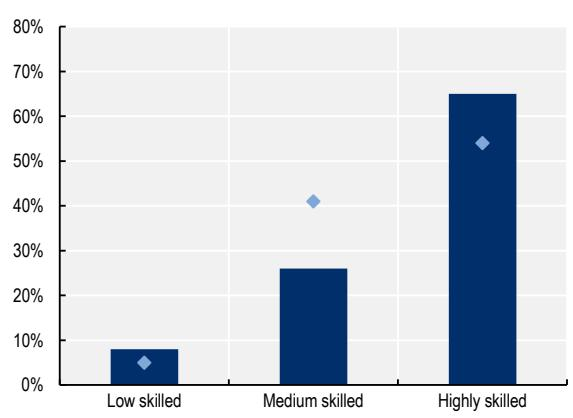

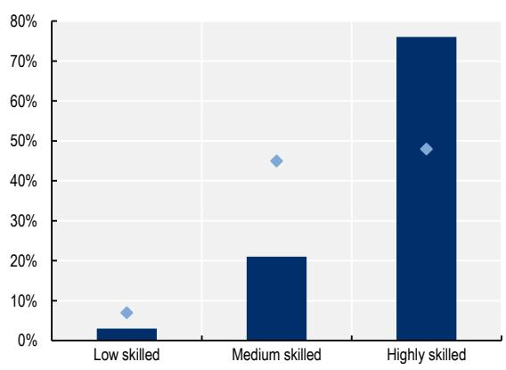  
Note: Among the top ten destination countries for Greek emigrants in the OECD, only those with available data are included. Source: OECD Database on Immigrants in OECD Countries (DIOC), 2020/21.

To examine occupational outcomes in greater detail, employment can be analysed using the International Standard Classification of Occupations (ISCO), which categorises jobs into major groups ranging from ISCO 0 to ISCO 9. These groups distinguish occupations by skill level and specialisation, from highly skilled managerial and professional roles (ISCO 1-3) to medium-skilled clerical, service, and skilled trade occupations (ISCO 4-8), and lower-skilled elementary occupations (ISCO 9). Analysing employment using the ISCO classification allows for a more granular assessment of labour market integration, capturing not only whether Greek-born individuals are employed, but also the type and quality of jobs they hold.

In France, Greek-born workers are particularly concentrated in ISCO 2 roles which include professionals, technicians, and associate professionals, which account for over half of all employment (56%) (see Figure 3.14). Similarly, Switzerland, Belgium and Sweden show strong representation in ISCO 2 roles (41% in Switzerland, 36% in Belgium, and 34% in Sweden) as well as medium-skilled ISCO groups. In Australia and Italy, Greek-born migrants are more evenly spread across medium- and lower-skilled ISCO groups, with substantial proportions in ISCO 5, 7, 8, and 9, reflecting employment in service, clerical, and skilled trade sectors. Germany presents a distinct profile, with relatively high shares in lower-skilled ISCO groups (ISCO 8 and 9 together account for over 30%) and smaller shares in high-skilled managerial or professional roles.

Figure 3.14. The largest shares of Greek emigrants are employed as professionals and in clerical and support occupations  
Distribution of Greek-born workers by occupation (ISCO 0-9), ages 15 and above, 2020/21  
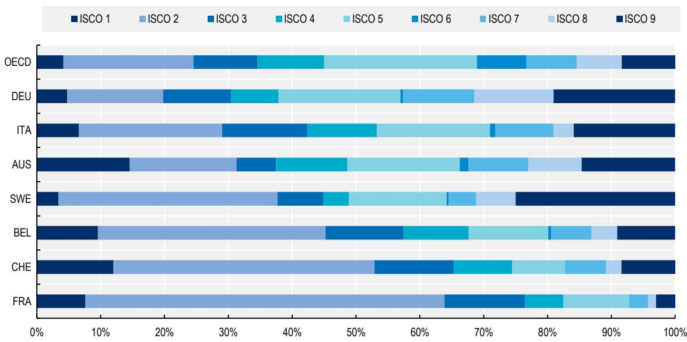  
Note: Among the top ten destination countries for Greek emigrants in the OECD, only those with available data are included. Similarly, the OECD-wide analysis is restricted to countries with available data.  
Source: OECD Database on Immigrants in OECD Countries (DIOC), 2020/21.

Just under three in four Greek-born women and just under three in five Greek-born men are employed in medium- or high-skilled occupations. More specifically, Greek-born women in the OECD are more strongly represented in higher-skilled non-manual occupations than men, while Greek-born men in the OECD are disproportionately concentrated in manual and technical occupations (see Figure 3.15). In particular, women are more likely than men to work as professionals (ISCO 2), which account for nearly one-quarter of female employment (25%), compared with one-fifth among men (20%). Women are also more likely to work as technicians and associate professionals (ISCO 3) clerical workers (ISCO 4) and service and sales

Note: Analysis are restricted to top destination countries with available data.

professionals (ISCO 5), which together employ 44% of Greek-born women, compared with around 36% of men. By contrast, men are more frequently employed in craft-related and machine-operating occupations, with 14% working as craft workers (ISCO 7) and a further 14% as plant and machine operators (ISCO 8), compared with only 3% of women in each category.

At the lower end of the occupational distribution, gender gaps are also pronounced. Elementary occupations (ISCO 9) employ one-fifth of Greek-born women across the OECD, compared with 14% of men. Managerial positions (ISCO 1) remain slightly more male-dominated, with 8% of Greek-born men employed as managers, compared with just over 5% of women. Agricultural occupations (ISCO 6) play only a marginal role for Greek-born emigrants regardless of gender.

Figure 3.15. Greek-born women are more likely than men to work in medium- or high-skilled occupations  
Distribution of Greek-born workers by occupation (ISCO 1-9) and gender, ages 15 and above, 2020/21  
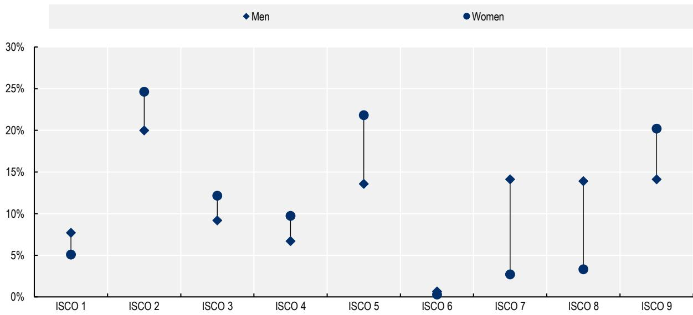  
Source: OECD Database on Immigrants in OECD Countries (DIOC), 2020/21.

A more granular perspective on occupational outcomes can be obtained by examining employment by detailed ISCO occupational sections (often referred to as ISCO 1-100 categories in analytical work). These finer occupational categories allow for a closer assessment of where migrants are concentrated within broad skill groups and help identify specific segments of the labour market in which foreign-born workers are more or less concentrated relative to the native-born population. The following analysis focusses on the top 23 sectors employing the largest shares of Greek-born emigrants.

Across OECD countries, Greek-born workers continue to display a distinctive occupational profile, with a strong presence in personal services, routine service occupations and selected technical and manual jobs, alongside a notable representation in professional roles. The largest single occupational group among Greek-born workers is personal services workers (8.4%), a share more than twice as high as that observed among the native-born (3.7%), underscoring the importance of service-oriented activities in their employment structure (see Figure 3.16). Greek-born individuals are also markedly over-represented among cleaners and helpers (6.7% versus 2.1%) and labourers in mining, construction, manufacturing and transport (4.4% versus 2.1%), highlighting a concentration in physically demanding and routine occupations.

In addition, Greek-born workers show higher shares than the native-born in food preparation assistants (2.1% compared with 0.5%), hospitality, retail and other services managers (2.4% versus 0.9%), and drivers and mobile plant operators (5.7% versus 3.4%). These patterns point to a strong presence in hospitality-related activities, transport and operational roles, as well as in certain supervisory positions within the service sector. By contrast, Greek-born workers are less represented than natives in clerical and administrative support roles overall, including general and keyboard clerks (2.1% versus 3.0%) and business and administration associate professionals (2.9% versus 5.8%).

At the same time, Greek-born migrants maintain a solid foothold in knowledge-intensive professions. Their shares exceed those of the native-born in health professions (3.6% versus 2.7%), ICT professions (2.6% versus 1.6%) and science and engineering professions (3.4% versus 2.8%), suggesting relatively strong integration into high-skill technical and professional occupations. Overall, this distribution highlights a dual pattern in which Greek-born workers are present both in knowledge-intensive professions and in lower-skill service and manual roles.

Figure 3.16. Greek-born workers are present both in knowledge-intensive professions and in lower-skill service and clerical roles

Distribution of Greek-born workers by occupation (ISCO 0-100), ages 15 and above, 2020/21

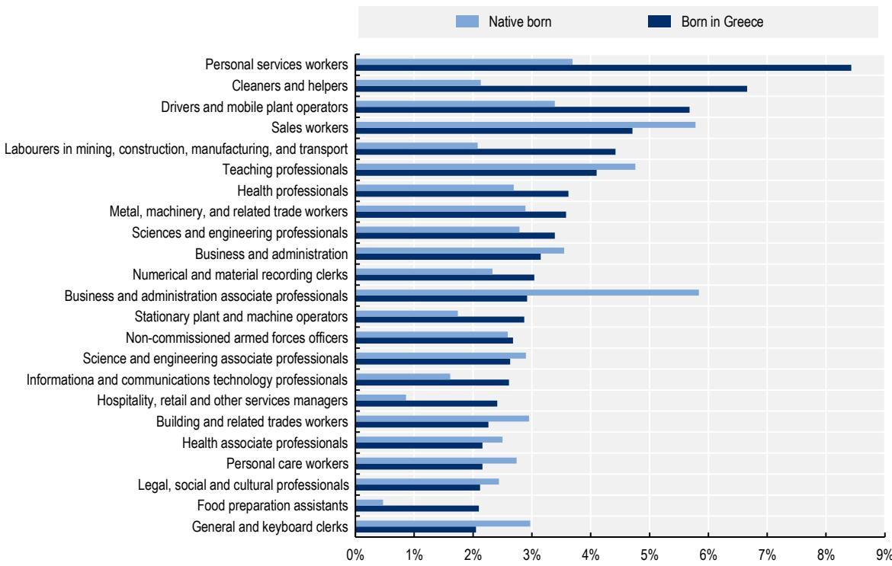

Note: Only countries with available data are included. Only occupations representing at least 2% of the Greek-born population are shown.
Source: OECD Database on Immigrants in OECD Countries (DIOC), 2020/21 and https://webapps.ilo.org/ilostat-files/ISCO/newdocs-08-2021/ISCO-08/ISCO-08%20EN%20Vol%201.pdf.

## Patterns of overqualification among Greek-born emigrants differ substantially across destination countries

Overqualification occurs when an individual's level of formal education exceeds the requirements of their occupation. It is measured as the share of tertiary-educated individuals employed in low- or medium-skilled jobs. Among migrants, qualifications, work experience, and language skills acquired in the country of origin are not always fully recognised in the host country. Overqualification may also reflect labour market frictions, imperfect information on job opportunities, institutional barriers to the recognition of foreign credentials, or discrimination.

Figure 3.17 illustrates that Greek-born emigrants exhibit varying levels of overqualification across major OECD destination countries, often differing from both native-born and foreign-born populations. In Australia and Switzerland, for example, there is little variation in overqualification between the Greek-born, foreign-born, and native-born populations. In Belgium and Italy, overqualification among Greek-born workers is broadly comparable to the native-born populations (18% vs. 20% in Belgium; 29% vs. 27% in Italy) and remains lower than the broader foreign-born averages (31% and 57%). In Switzerland and France, Greek-born workers are actually less likely to be overqualified than the native-born population (16% vs. 21% and 14% vs. 24%), and well below the foreign-born rates of 22% and 32%. These patterns may reflect stronger alignment between Greek qualifications and the skill requirements in particular sectors, differences in occupational composition, or the presence of established Greek communities that facilitate integration into the labour market.

Figure 3.17. In Switzerland and France, Greek-born workers are less likely to be overqualified than the native-born population

Overqualification rates of Greek-born workers by country of destination, ages 15 and above, 2020/21

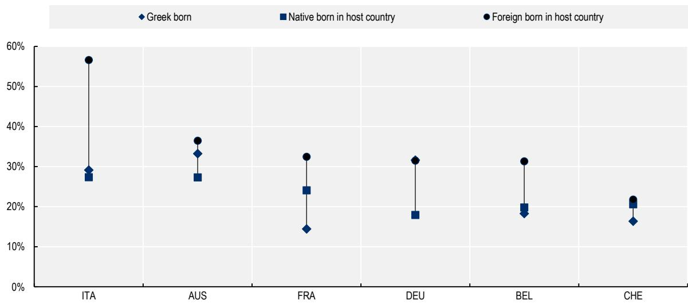  
Note: Analysis are restricted to top destination countries with available data. Overqualification refers to the share of highly skilled individuals who are employed in jobs that are classified as lower or medium skilled.
Source: OECD Database on Immigrants in OECD Countries (DIOC), 2020/21.

## Intra-OECD mobility of Greek doctors

Many OECD countries turn to foreign-trained doctors to expand their medical workforce quickly and at relatively low cost. In 2023, foreign-trained doctors represent, on average, 20% of the medical workforce across OECD countries. Most of the foreign-trained doctors are practicing in only three destination countries (the United States, the United Kingdom and Germany). In Greece, the share of foreign-trained doctors is 22% (OECD, 2025[1]).

## Greece has the highest share of foreign-trained, native-born doctors in the OECD

However, not all foreign-trained doctors are foreign-born. Many of these are in fact native-born citizens who obtained their first medical degree abroad before returning home for postgraduate training and practice. Greece stands-out in these statistics, with 80% of the foreign-trained physicians in Greece being Greek-born. This is the highest share among the OECD countries with available statistics (Figure 3.18). Other countries with important shares of native-born persons among the foreign-trained physicians include Colombia (74%) Norway (57%), Israel (55%) and Sweden (25%). This pattern reflects the internationalisation of medical education and an expanding cross-border market for medical degrees. Greek medical students studying abroad is further discussed in Chapter 5 in the section on international students.

## Figure 3.18. Four in five foreign trained physicians in Greece are Greek born

Total number of foreign-trained and number and share of native-born, foreign-trained doctors in selected OECD countries, 2023  
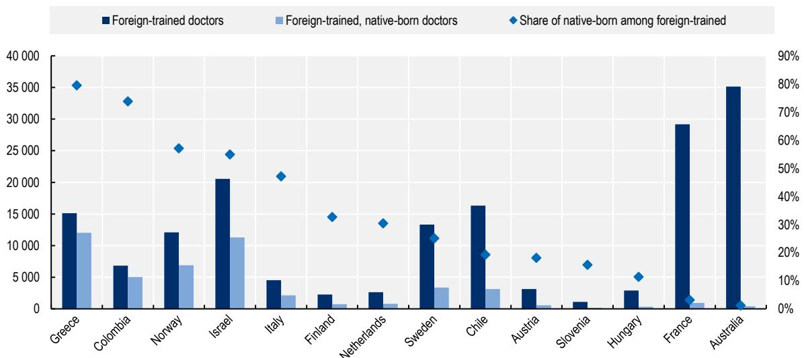  
Note: The figure includes countries with available data. Data is from 2023, except for Finland and Sweden (2022) and the United States (2016). Source: OECD (2025[1]), International Migration Outlook 2025, https://doi.org/10.1787/ae26c893-en, OECD Data Explorer (DF\_HEALTH\_WFMI).

There is also an important number of Greek-born doctors, whether trained in Greece or abroad, working in other OECD countries. The number of Greek-born migrant doctors has more than threefold since 2000/01, from about 2900 in 2000/01 to almost 10000 in 2020/21 (Figure 3.19). The associated emigration rate, defined as the number of Greek-born migrant doctors relative to the total workforce of Greek doctors in Greece and abroad, reached 13% in 2020/21, placing Greece among the countries with the highest levels of medical-doctor emigration in the OECD.

Greece is also experiencing net emigration of nursing professionals, although on a more limited scale. The number of Greek-born nurses working abroad increased from around 1 300 in 2000/01 to just over 3 500 by 2020/21, corresponding to an emigration rate of approximately 8%. While substantially lower than among doctors, this pattern nonetheless points to sustained outward mobility among health-care professionals more broadly.

Figure 3.19. The number of Greek-born doctors has tripled between 2000/01 and 2020/21

Stocks of migrant doctors to the OECD by country of origin and emigration rates, 2000/01 and 2020/21  
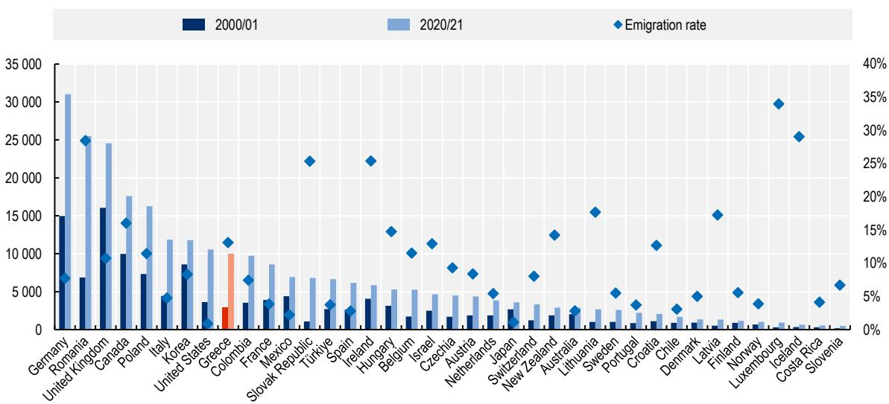  
Note: Emigration rates are calculated as the number of migrant doctors in relation to the total number of doctors in the workforce of the origin country (residing abroad and in the country of origin).  
Source: OECD (2025[1]), International Migration Outlook 2025, https://doi.org/10.1787/ae26c893-en, based on DIOC 2020/21.

Intra-OECD migration patterns of doctors are complex. Figure 3.20 illustrates the countries for which Greece is a net sender of at least 500 doctors, these include several EU/EEA countries (Germany, Italy, Sweden and Switzerland) as well as the United States and the United Kingdom. Overall, the United States, Australia and Switzerland are the only three countries that are net gainers in relation to every other OECD country. Other countries, such as France or Austria, both lose doctors to Switzerland but gain from Italy, which in turn is a net recruiter from Greece. Greece, together with Hungary and Poland, only experience net losses of doctors to other OECD countries.

Net migrant stocks above 500 between OECD countries for migrant doctors to and from the OECD, 2020/21

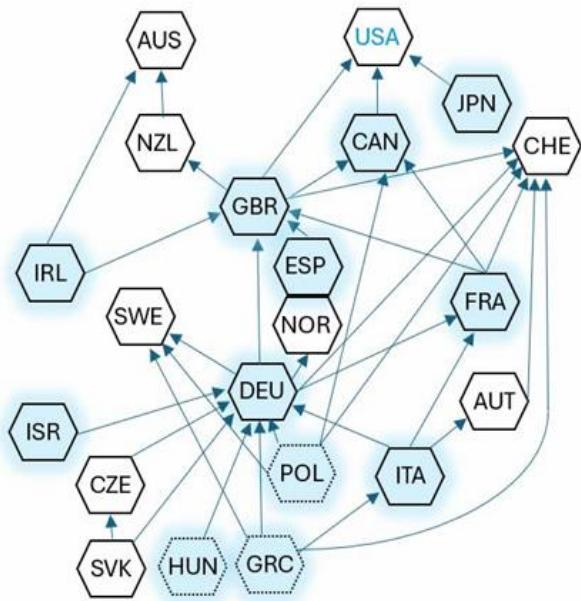  
Note: Countries highlighted in blue should show arrows towards the United States. Those with dotted lines should show arrows towards the United Kingdom. Includes countries with available data and net stocks above 500 with another country.
Source: OECD (2025[1]), International Migration Outlook 2025, https://doi.org/10.1787/ae26c893-en, based on DIOC and EU-LFS.

## Remittances to Greece

Remittances are financial transfers sent by emigrants to relatives or households in their country of origin. They represent an important channel through which migration can support household incomes, fund education or health expenditures, and contribute to local development. In addition, remittance flows can serve as an indirect indicator of the economic integration of emigrants in host countries, reflecting both their employment outcomes and their capacity to generate disposable income abroad.

For Greece, remittances provide a lens into the economic ties maintained by its diaspora. Despite longstanding emigration, the share of remittances in GDP remains relatively low, suggesting that Greek emigrants contribute only modestly to the domestic economy through financial transfers. Nevertheless, for recipient households, remittances can constitute a meaningful source of support, helping to smooth consumption and buffer economic shocks. Understanding remittance patterns complements other measures of emigrant outcomes providing insights into the financial resources Greek emigrants channel back home.

## Remittances sent by Greek emigrants remain modest as a share of the GDP despite long-standing emigration patterns

In 2023, Greece received approximately EUR 500 million in remittances sent by Greek emigrants abroad, corresponding to $0.2\%$ of the 2023 GDP. Despite Greece's longstanding emigration flows, this share remains low compared with neighbouring countries. For example, remittances equated to around $2.8\%$ of the GDP in Romania, $2.2\%$ in Bulgaria, $2.9\%$ in North Macedonia, and $8.7\%$ in Albania. Remittances to

Greece are similar to Italy, where they reached 0.5% of the GDP that same year (World Bank, 1970-2024 $^{[2]}$ ).

In line with the geographical distribution of the Greek diaspora, according to Eurostat data, over two-thirds of remittances originated from OECD countries in 2024. Over the past decade, remittances peaked in 2013, reaching EUR 607 million, likely in response to the Euro sovereign debt crisis (see Figure 3.21). Between 2015 and 2018, remittances declined to a low of EUR 355 million. From 2019 through 2022, remittance inflows rose again, although they dropped. At the same time, the gap between remittances from OECD and non-OECD countries widened, reaching 37 p.p. (EUR 210 million) in 2022.

## Figure 3.21. Remittances to Greece peaked during the financial crisis

Remittances from Greek emigrants to Greece, OECD and world, EUR millions, 2012-2023

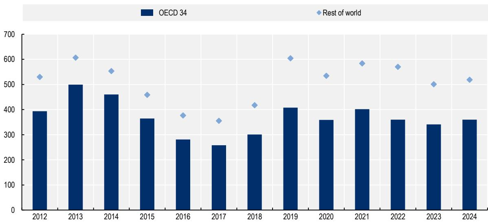  
Note: Remittances include workers remittances and compensation of employees.  
Source: Eurostat, balance of payment data.

In 2023, the majority of remittances to Greece from OECD countries continued to originate from the United States, the United Kingdom and Germany. Remittance flows from Germany have remained consistently substantial, ranging from EUR 46.8 million in 2015 to EUR 73.0 million in 2021, before moderating slightly to 59.8 million euros in 2023, reflecting a long-established and stable Greek diaspora (see Figure 3.22). The United Kingdom has contributed smaller but steadily increasing remittances, rising from EUR 24.1 million in 2012 to a peak of EUR 62.4 million in 2018, and stabilizing at EUR 56.5 million in 2024. Remittances from the United States, available in this dataset from 2016 onwards, exhibit greater year-to-year variability, reaching EUR 76.4 million in 2019 and EUR 79.5 million in 2021, before declining to EUR 59.1 million in 2024. Part of this volatility likely reflects exchange-rate movements between the euro and the US dollar, which can amplify or dampen the euro-denominated value of remittances even when underlying transfer behaviour remains broadly stable.

In contrast to major OECD destinations such as Germany, the United Kingdom and the United States, where remittance flows to Greece have remained broadly stable since 2016, remittance flows to Greece from Central and Eastern Europe, Central and Southern Africa, and Western Asia saw significant growth beginning around the same time (see Figure 3.23). The most pronounced increase occurred among those in Western Asia, where annual remittance inflows to Greece more than quadrupled, rising from EUR 14.2 million in 2016 to EUR 61.3 million in 2019. Although flows from these regions have stabilised or slightly declined in recent years, the upward trend observed after 2018 signals a growing role played by countries that had not been significant contributors to remittance inflows to Greece in the years prior. Eurostat data do not provide a detailed breakdown of remittance flows by individual sending countries within these regional groupings. However, complementary evidence helps shed light on the likely drivers of this growth. World Bank remittance data for 2021 indicate Türkiye is a relatively important country for remittances to Greece (MPI, 2022[3]). In addition, given that Eurostat's Western Asia aggregate includes Gulf Co-operation Council (GCC) countries, remittance inflows from Gulf economies employing smaller but economically active Greek populations, often hired in high-earning sectors, may also be contributing to the observed trend. Within Central and Eastern Europe, Albania remains the largest single sending country. No country in Central and Southern Africa appears among the top sending countries of remittances to Greece, but remittance inflows are likely driven primarily by South Africa, which hosts the largest concentration of Greek emigrants in the region according to UN-DESA data.

Figure 3.22. In 2024, about two-thirds of all remittances to Greece originating from OECD countries came from the United States, the United Kingdom and Germany

Remittances to Greece sent from Germany, the United Kingdom and the United States, EUR millions, 2012-2024

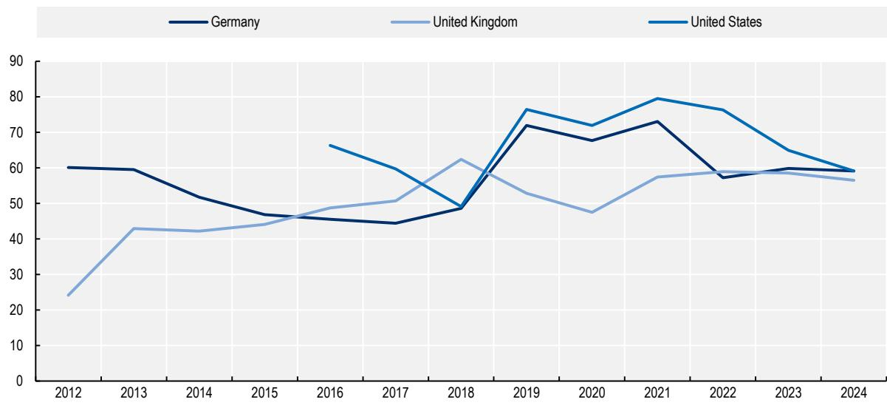  
Note: Remittances include workers remittances and compensation of employees. Data for remittances from the United States are shown from 2016 onwards. Earlier years are not included due to methodological revisions and/or reporting inconsistencies in Eurostat's balance-of-payments personal transfer series, which can lead to unusually high or non-comparable values.
Source: Eurostat, balance of payment data.

World Bank (1970-2024), Remittances Recieved (% of GDP), [2] https://data.worldbank.org/indicator/BX.TRF.PWKR.DT.GD.ZS.

Figure 3.23. Remittances from Central and Eastern Europe, Central and South Africa, and Western Asia have been on the rise in recent years  
Remittances to Greece sent from Central and Eastern Europe, Central and South Africa, and Western Asia, EUR millions, 2012-2024  
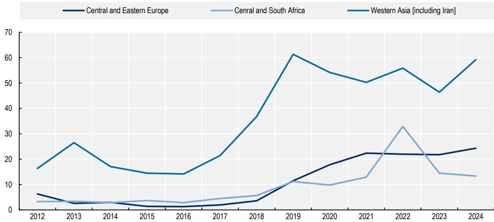  
Note: Remittances include workers remittances and compensation of employees.
Source: Eurostat, balance of payment data.

## References

MPI (2022), Bilateral Remittance Flows, tabulations of data from the KNOMAD/World Bank Bilateral Remittance Matrix 2021, https://www.migrationpolicy.org/programs/data-hub/charts/bilateral-remittance-flows.

OECD (2025), International Migration Outlook 2025, OECD Publishing, Paris, https://doi.org/10.1787/ae26c893-en.

## Return migration to Greece

This chapter provides an overview of recent return-migration dynamics to Greece, drawing on the Greek census to examine the scale and composition of return. The chapter initially reviews the balance between emigration and return and further explores the demographic and educational profile of returnees, their origins abroad, and their settlement patterns within Greece. The chapter also outlines key labour market indicators, including participation, employment and occupational structure, and explores the motivations that may shape return decisions.

## In Brief

\- Return migration to Greece has increased in recent years, with estimated inflows now exceeding outflows. In 2023, 46 000 Greek citizens returned to Greece, exceeding the 37 000 who left that year. This marks a shift from the prolonged net outflows following the 2010 economic crisis and suggests a gradual rebalancing of Greece's human-capital flows.

\- Returnees are predominantly young and highly educated, offering an important opportunity to reinforce Greece’s skills base. More than half (54%) of those who returned between 2016 and 2021 were aged 20-39 and three in five held a tertiary degree, compared with just 23% among their peers in Greece who never emigrated.

\- The majority of recently arrived returnees came from other European countries, particularly Germany and the United Kingdom. About 83% of returnees previously resided elsewhere in Europe, and 56% in EU countries. Germany and the United Kingdom account for a combined 43% of all returnees, reflecting strong circular mobility within the EU.

\- Return migration is concentrated in Greece's major urban centres: 42% of returnees settle in Attica (Athens) and 18% in Central Macedonia (Thessaloniki). Four in five returnees returned to their region of origin, with higher rates in Northern and Central Greece, and lower rates in the Attica region.

\- Repatriation remains the dominant driver of return, but economic motivations are also prominent. Over half of returnees cite repatriation as their main reason, while 18-22% return for employment, depending on the period of their return.

\- Labour market outcomes among return migrants vary by time since return and region, with lower employment rates observed among more recent return cohorts. Among return migrants captured in the 2021 census, the employment rate was considerably higher among returnees that had spent 5 years in the country (at $72\%$ ) compared to those who just returned (at $46\%$ ). This indicates that labour market reintegration upon return might take time.

\- Educational attainment plays a central role in labour market outcomes among return migrants. Unemployment remains comparatively low for those with higher qualifications, at $12\%$ among doctoral-degree holders and $15\%$ among those with a master's degree, underscoring the strong employment advantages associated with tertiary education.

\- Entrepreneurship remains modest among returnees and is somewhat more common among those who never emigrated. Only 4-7% of returnees are self-employed with personnel, and 13-17% without personnel, compared with slightly higher rates among non-migrants.

\- Return migrants are heavily concentrated in professional and high-skilled occupations. Nearly half (47%) work as professionals, far exceeding the share among non-migrants (18%). Returnees are especially represented in health, science and engineering, and ICT.

\- Survey evidence shows that while many Greek emigrants maintain strong emotional ties to the country, their short-term intention to return remains limited, particularly among the young. Concerns about limited professional prospects, institutional effectiveness, and meritocracy are the main deterrents, whereas potential incentives for return include more competitive pay, targeted tax relief, and improved work – life balance.

## Introduction

Return migration plays a central role in shaping the long-term impact of emigration on a country's labour force, skills base and economic performance. Its effects depend not only on how many people leave, but also on how many ultimately come back, and with what skills, experience and aspirations. Returnees often bring enhanced professional competences and workplace practices acquired abroad, which can support productivity growth and organisational upgrading (Wahba, 2025[1]). In addition, return migrants may act as channels for knowledge transfer and innovation, drawing on savings, international networks and exposure to foreign business environments to start firms or strengthen the international orientation of domestic SMEs (Gittins and Fink, 2015[2]).

Against this backdrop, this chapter examines the prospects, patterns and motivations underpinning return migration to Greece. The analysis draws on multiple data sources, summarised in Box 4.1, which shed light on different aspects of return behaviour. A crucial distinction in this chapter is between return flows and return stocks, each capturing a different dimension of return migration. Return flows measure the number of individuals arriving in Greece in a given year, providing insight into the pace and timing of return movements. They highlight how emigration can be temporary, circular or onward-oriented. By contrast, return stocks, derived from census data, capture all those who returned in the years preceding the census and remained in Greece up to the reference date. Because they exclude individuals who returned and subsequently re-emigrated, stock measures do not necessarily move in parallel with annual flows. Using both sources together provides a more complete picture of return migration dynamics, including both the immediacy of new returns and the longer-term patterns of settlement.

## Box 4.1. Data sources and methodologies for Chapter 4

## Hellenic Statistical Authority (ELSTAT) Population and Housing Censuses (2011, 2021)

The Population and Housing Censuses conducted by ELSTAT in 2011 and 2021 constitute the most comprehensive demographic data sources available for Greece. Both are full enumerations of the resident population, collecting harmonised information on demographic characteristics, education, labour market status and previous place of residence.

Return migrants are identified through a combination of questions on country of previous residence, year of settlement in Greece, and reason for settlement. In this report, returnees are defined as Greek citizens (including dual citizens) born in Greece who reported having previously lived abroad and who arrived in Greece during the five years preceding the census reference date. Non-migrants are defined as Greek-born Greek citizens who reported never having lived abroad at the time of the census. These individuals serve as the baseline population for comparing characteristics of return migrants such as education, labour market outcomes and regional settlement patterns.

Because the census is a cross-sectional instrument, it captures returnees who remained in Greece until the census date. As a result, it does not include individuals who may have returned and subsequently re-emigrated within the five years prior to the census date, nor does it observe any returns that occurred outside the census reference periods (i.e. between 2011-2016). Census-based indicators therefore measure stocks of return migrants, not the annual pace of return movements, limiting insights into the timing, duration and sequencing of migration cycles. In addition, census information on migration histories is necessarily partial: it records previous country of residence but does not document the year of departure from the country of origin, the length of time spent abroad, or internal mobility prior to emigration. As a result, while census data allow for robust analysis of the socio-demographic characteristics and settlement patterns of returnees, they do not permit a full reconstruction of individual migration trajectories or of the dynamic processes underlying return and onward mobility.

## ELSTAT Migration Inflow and Outflow Estimates (annual)

ELSTAT produces annual estimates of immigration and emigration flows as part of the official population-balance statistics. These estimates are not derived from a population register; instead, they are calculated through post-censal demographic methods. ELSTAT uses regression-based statistical models, together with annual vital statistics and census benchmarks, to estimate the number of people entering and leaving Greece each year. These estimates capture the annual pace of return and emigration, providing an indication of how mobility patterns evolve over time. Because they reflect flows, they include individuals who may subsequently leave again, and therefore offer insights into temporary, circular or short-term migration dynamics. They complement the census-based stock measures, which only capture returnees who remained in Greece until the census date.

Note: More information related to ELSTAT estimations of migration flows are available in a number of methodological notes on the ELSTAT website https://www.statistics.gr/.

## Historical and recent trends in return migration

This section provides an overview of how return migration to Greece has evolved over recent decades, drawing on ELSTAT's annual estimates of migration inflows and outflows.

## A brief overview of return migration in the post-war period

Return migration has been a defining feature of Greece's modern migration history. After Greece recorded a net outflow of over 600 000 Greek citizens between 1951 and 1970, the following decade was characterised by a growing inflow of return migrants. Over 625 000 returnees settled back in Greece between 1971 and 1986 (Vergeti, $2003_{[3]}$ ; Triandafyllidou and Maroufof, $2008_{[4]}$ ) (see Figure 4.1).

Greece's accession to the European Union (1981) and establishment of free movement (1988) facilitate emigration towards other EU countries, but also return to Greece, leading to more circular migration patterns (Haas, Vezzoli and Villares-Varela, 2019[5]). This makes it more difficult to identify and enumerate return migrants, not only because few EU countries adequately track exits, but also because return migrants are less likely to be captured in surveys if they stay in their country of origin for only a short time before moving again.

Figure 4.1. Greece shifted from negative to positive net migration in the period between 1970-2000
Net migration of Greek citizens from Greece, 1951-2000  
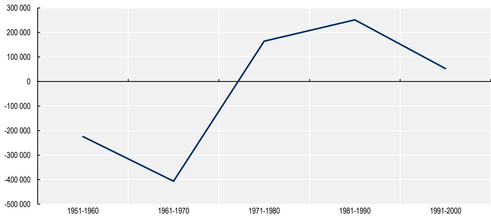  
Source: Triandafyllidou and Maroufof (2008[4]), “Immigration towards Greece at the Eve of the 21st Century: A Critical Assessment”, https://www.eliamep.gr/wp-content/uploads/en/2009/02/immigration-towards-greece-at-the-eve-of-the-21st-century-a-critical-assessment.pdf, based on National Statistical Service of Greece data.

## Inflows of Greek citizens exceeded outflows in 2023

Since 2010, Greece has experienced significant net emigration of its citizens. According to Hellenic Statistical Authority (ELSTAT) estimates, annual outflows of Greek citizens consistently exceeded inflows throughout the 2010s. While outflows have gradually declined since 2012, return migration remained steady, with annual inflows of Greek citizens increasing slightly, and reaching just under 31 000 in 2019 (see Figure 4.2). In 2020, both outflows and inflows of Greek citizens declined markedly, likely reflecting the broader mobility constraints associated with the COVID-19 pandemic. Inflows fell from around 34 000 in 2019 to just under 21 000 in 2020.

Since 2021, inflows have consistently increased while outflows have declined. In 2023, inflows of Greek citizens surpassed outflows, with about 46 000 entries compared with roughly 37 000 departures. Although cumulative outflows since 2010 still far exceed inflows, this recent net positive balance points to a gradual rebalancing of Greece's human-capital flows. The faster growth of inflows measured by citizenship relative to country of birth may indicate that recent returns increasingly include Greek citizens born abroad, pointing to a potentially growing role of second-generation and diaspora-linked mobility alongside traditional return migration. This gap widened further in 2024, with almost 52 000 entries and about 32 000 departures. The rise in return migration also coincides with a period in which Greece expanded programmes to reconnect with its diaspora, such as targeted tax incentives and recognition reforms, indicating that current return patterns are unfolding within a policy environment increasingly oriented toward supporting skilled mobility (see Chapter 6 for more information).

Figure 4.2. Beginning in 2021, inflows of Greek citizens to Greece have consistently increased
Estimated annual inflows of Greeks by citizenship and country of birth and outflows of Greeks by citizenship, Greece, 2010-2024  
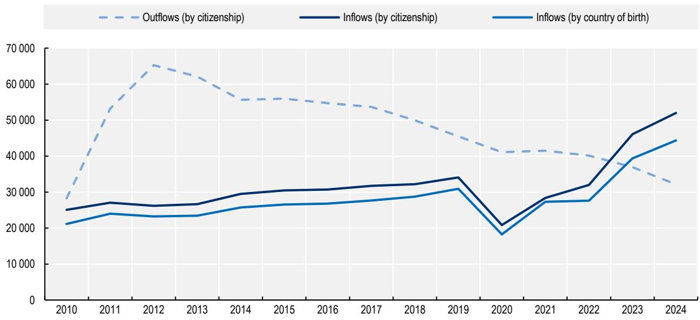  
Source: Hellenic Statistical Authority (ELSTAT).

## Characteristics of return migrants

The analysis in the following section draws on data from the Greek Population and Housing Censuses to examine the characteristics of return migration to Greece. The main reference point is the most recent census conducted in 2021, which provides detailed information on returnees who had settled in Greece during the five years preceding the census date. These data are complemented by comparison with equivalent information from the 2011 census, allowing the chapter to assess how patterns of return migration have evolved over time (see Figure 4.3). As census data are cross-sectional, they capture only individuals present in Greece at the time of enumeration and therefore do not reflect returns that have occurred since 2021.

Figure 4.3. Return migration to Greece was higher in 2006-2011 than in 2016-2021

Resident population with Greek citizenship (dual citizenship is included) and Greece as country of birth who settled down in Greece from abroad during the last five years before the Census 2011 reference date and the Census 2021 reference date

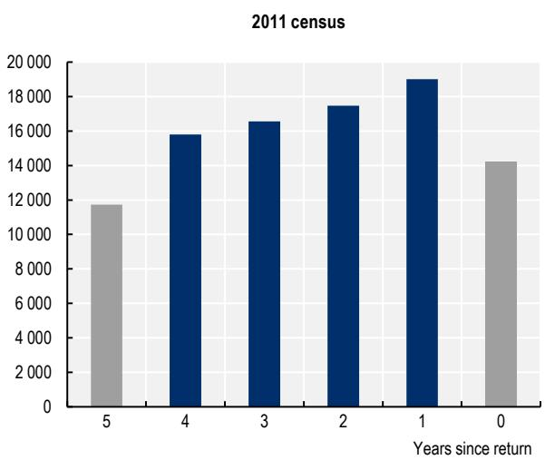

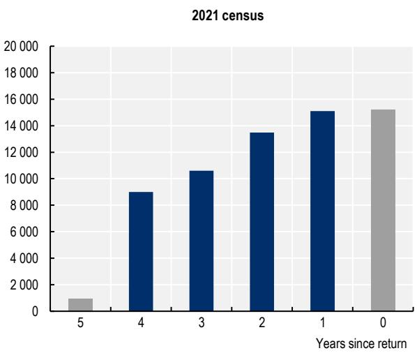  
Note: The bars for 2006, 2011, 2016, and 2021 are shown in grey because they do not represent full calendar years. In the 2011 Census, the reference window includes only arrivals from 10 May–31 December 2006 and 1 January–9 May 2011, while in the 2021 Census it covers 23 October–31 December 2016 and 1 January–22 October 2021. As a result, these years capture only partial periods of return migration and should be interpreted with caution, particularly 2016, which reflects only about two months of arrivals.  
Source: Hellenic Statistical Authority (ELSTAT), 2011 and 2021 Population and Housing Census: Statistical Data on Greece (Greek and Foreign Citizens), Athens.

## Return migration is concentrated among younger adults

According to the 2021 Population and Housing Census, approximately 64 350 Greek-born citizens returned from abroad during the five years prior to the census reference date. Among those recorded in the 2021 census, 54% were men and 46% were women (see Figure 4.4). This gender composition is broadly in line with the gender profile of Greek emigration overall as reported in Chapter 1, where men account for a slight majority of all emigrants in OECD countries (52%). During the earlier period of 2006-2011, as captured in the 2011 census, an estimated 94 774 Greek-born citizens returned to Greece, with men again representing a slightly higher share of returnees (55%). Age patterns were broadly similar in the 2011 census. A comparison across the 2011 and 2021 census rounds shows that return migration to Greece has consistently been concentrated among younger working-age adults, but with a clear strengthening of returns among individuals aged 20-39 in the more recent period (Figure 4.4).

Figure 4.4. A larger share of return migrants are men Greek return migrants by age and gender, 2021 and 2011 census  
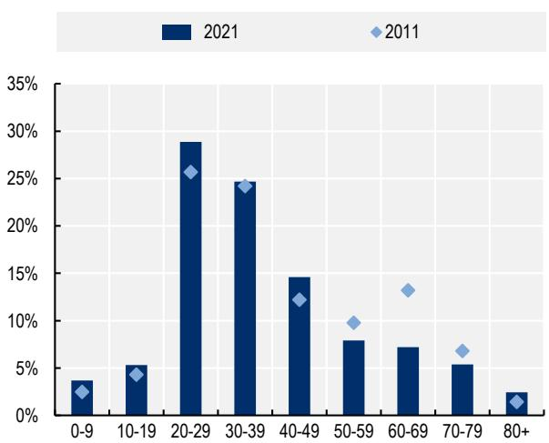

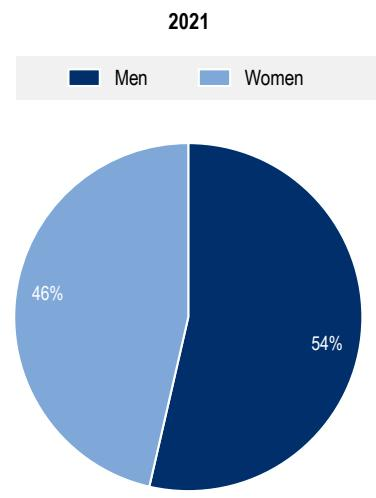  
Source: Hellenic Statistical Authority (ELSTAT), 2011 and 2021 Population and Housing Census: Statistical Data on Greece (Greek and Foreign Citizens), Athens.

The concentration of return migrants in the age group 20-39 captured in the 2021 data is largely driven by returns reported as having occurred in the years immediately preceding enumeration, with especially strong representation of those aged 20-29. This marks a sharper concentration of recent return among younger cohorts than observed in the 2011 census, where returns were still centred on younger adults but displayed a relatively larger presence of older age groups (Figure 4.5).

The 2021 data also point to a slight shift in the gender profile of younger returnees. Among individuals aged 20-29 who reported returning most recently, women slightly outnumber men, a pattern not observed in the 2011 census, when men accounted for a higher share of returnees across most age groups, including among younger adults. Gender differences remain more limited in the 30-39 age group, while men continue to represent a larger share of returnees at older working ages. Taken together, the evidence suggests that recent return migration captured in the 2021 census is increasingly shaped by younger, and in the youngest cohort, more female, return flows, alongside continuing male predominance at later career stages. The concentration of recent return migrants in the 20-39 age group also broadly mirrors the patterns seen in Chapter 1, with recent years showing a growing share of young cohorts among Greek emigrants.

Figure 4.5. A majority of return migrants are aged 20-39, especially in recent returns

Greek return migrants by age and gender, by years since return, 2011 (top) and 2021 (bottom) census data  
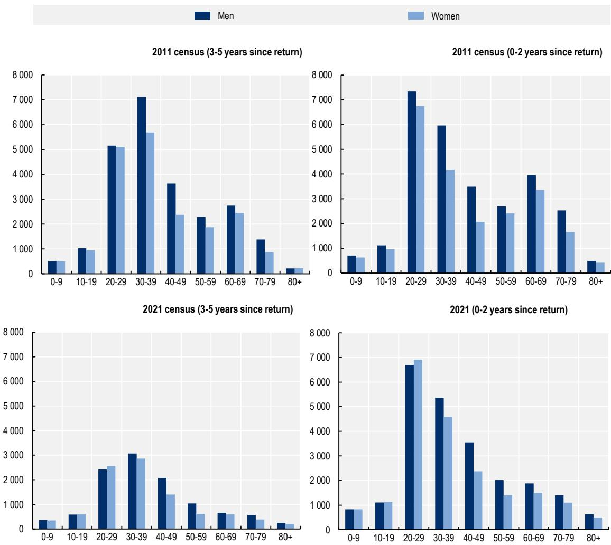  
Note: Years since return reflect the reported year of return to Greece, captured retrospectively in the 2011 and 2021 censuses.
Source: Hellenic Statistical Authority (ELSTAT), 2011 and 2021 Population and Housing Census: Statistical Data on Greece (Greek and Foreign Citizens), Athens.

## Three in five return migrants have completed tertiary education

Return migrants tend to be highly educated, with three in five (60%) having completed tertiary education (see Figure 4.6). This share exceeds that observed among Greek emigrants currently abroad: among recent emigrants, defined as those who arrived in the destination country less than five years ago, around half (50%) hold tertiary qualifications, while the share is lower among earlier cohorts, at about 46% among those who emigrated five to ten years ago. The educational profile of return migrants therefore reflects a positively selected group relative to the broader emigrant population.

The share of tertiary-educated returnees is also considerably higher than among those who never emigrated, of whom 23% have completed tertiary education. Among non-migrants, 23% completed at most primary education and 54% completed at most post-secondary non-tertiary education, shares that are significantly higher than among those who have lived abroad, of whom just 11% completed at most primary education and 29% at most post-secondary non-tertiary education.

Figure 4.6. A majority of return migrants have completed tertiary education  
Greek return migrants and those who never left Greece by highest level of education attained, ages 15 and above, 2021 census  
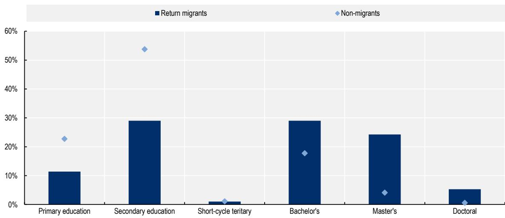  
Note: Primary education includes those who have started primary education but not completed it (ISCED 0-1). Similarly, secondary education includes those who have started secondary education but not completed it, as well as those who have completed post-secondary non-tertiary education (ISCED 2-4). For the purposes of this analysis, non-migrants are defined as Greek-born Greek citizens who reported never having lived abroad at the time of the census.  
Source: Hellenic Statistical Authority (ELSTAT), 2021 Population and Housing Census: Statistical Data on Greece (Greek and Foreign Citizens), Athens.

Return migrants to Greece in the 2021 census were more highly educated than those arriving in earlier periods and captured in the 2011 census. Around $60\%$ of returnees in the 2021 census held tertiary level degree, compared to around $45\%$ among return migrants in the 2011 census. The shift towards higher educated return migrants over time is largely driven by rising shares of returnees with master's and doctoral qualifications (see Figure 4.7). A more detailed analysis of the return of Greek doctoral holders is provided in Chapter 5. Within the group of tertiary educated return migrants in the 2021 census, those arriving more recently tend to be slightly more likely to have a bachelor's degree than a master's degree compared to those that settled in the years before, the differences are small.

By contrast, in the 2011 census results, return migration was more concentrated among individuals with lower levels of education: those with primary or secondary education accounted for roughly 50% (among those arriving 3-5 years before the census enumeration) to 56% (among those who arrived just before the census enumeration) of all returnees, while the combined share of individuals holding a tertiary education degrees was substantially lower than among return migrants in the 2021 census. These shifts indicate an increase in the education level of return migrants after 2011, with more recent returnees bringing significantly higher levels of tertiary and postgraduate training than those who returned a decade earlier.

As outlined in Chapter 6, recent reforms aim to improve conditions for skilled professionals and strengthen incentives for highly qualified Greeks abroad to return. The census evidence presented here shows that such policies have the potential to reinforce an already substantial inflow of tertiary-educated workers, provided that reintegration pathways and labour market absorption continue to improve.

Figure 4.7. Educational attainment is higher among more recent return cohorts  
Educational attainment of Greek return migrants, ages 15 and above, by years since return, 2011 census and 2021 census  
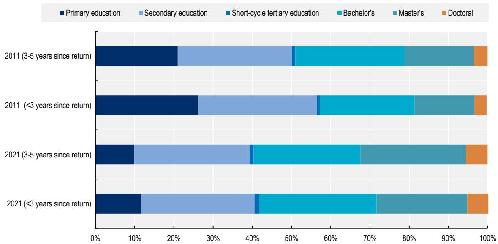  
Note: Primary education includes those who have started primary education but not completed it (ISCED 0-1). Similarly, secondary education includes those who have started secondary education but not completed it, as well as those who have completed post-secondary non-tertiary education (ISCED 2-4). As the census collection began in October 2016, the year 2016 is not included in this figure. Years since returned is captured retrospectively in the 2011 and 2021 population censuses.  
Source: Hellenic Statistical Authority (ELSTAT), 2021 Population and Housing Census: Statistical Data on Greece (Greek and Foreign Citizens), Athens.

## Over four in five returning Greek emigrants previously lived in Europe

Among Greek emigrants returning between 2016 and 2021, as captured in the 2021 census, the vast majority had previously lived elsewhere in Europe, which accounted for 83% of all returns. More than half of returnees (56%) came back from EU member states, underlining the continued importance of intra-EU mobility for Greek migrants (see Figure 4.8). A further 9% returned from North America, while the remaining 8% came from a wide range of other destinations across Asia, Oceania, Africa, and the Caribbean, Central and South America.

Figure 4.8. Four in five return migrants previously resided in another European country Region of previous residence of Greek return migrants, by years since return, 2021 census  
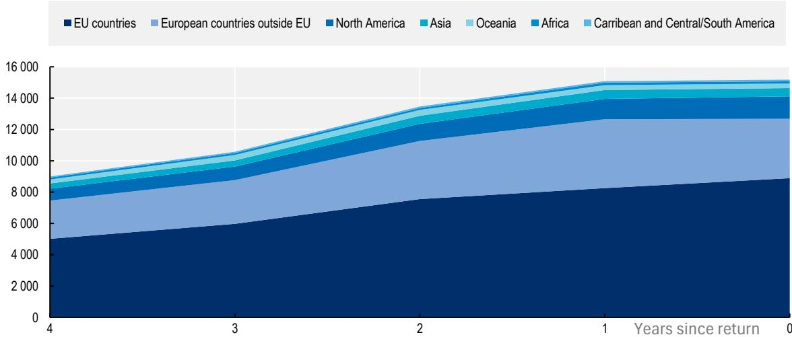  
Note: The 2021 census period covers 23 October–31 December 2016 and 1 January–22 October 2021. As a result, 2016 is not included in this figure and 2021 (corresponding to 0 years since return) should be interpreted with caution. While the census allows returnees to be classified by specific country of previous residence, it does not permit the analysis of country of previous residence in combination with duration of return within the reference period.

Source: Hellenic Statistical Authority (ELSTAT), 2021 Population and Housing Census: Statistical Data on Greece (Greek and Foreign Citizens), Athens.

Looking more closely at countries of previous residence, Germany and the United Kingdom remain the two main origin countries, together accounting for just over two-fifths of all returnees. However, the relative importance of these destinations differs across return cohorts captured in the two most recent census rounds. Germany's share declined markedly, falling from $31\%$ among return migrants recorded in the 2011 census to $22\%$ among those recorded in the 2021 census, while returns from the United Kingdom remained broadly stable at around $20\%$ (see Figure 4.9).

At the same time, returns from several neighbouring or traditionally close destinations increased. Cyprus stands out, with its share doubling from 5% to 10%, while smaller but notable increases are observed for Bulgaria, the Netherlands and Switzerland. By contrast, returns from major long-distance destinations declined, including a reduction in the share returning from the United States, from 9% to 6%.

Figure 4.9. The most common countries of previous residence are Germany and the United Kingdom

Country of previous residence of Greek return migrants, 2011 census and 2021 census

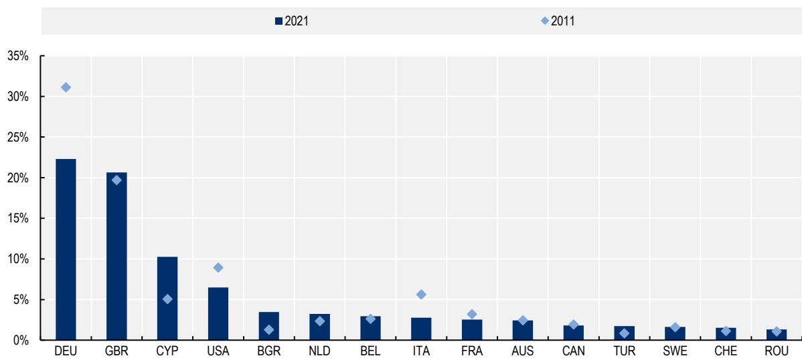  
Source: Hellenic Statistical Authority (ELSTAT), 2021 Population and Housing Census: Statistical Data on Greece (Greek and Foreign Citizens), Athens.

## Three in five return migrants settled in the regions of Attica and Central Macedonia

In both the 2011 and 2021 censuses, more than half of all return migrants resettled in Attica and Central Macedonia, home to Greece's two major urban centres, the Athens metropolitan area and Thessaloniki. Returns to Attica increased markedly over time, rising from $35\%$ in 2011 to $42\%$ in 2021, indicating a growing concentration of returnees in the country's largest and most economically dynamic metropolitan region. By contrast, the shares settling in Central Macedonia and Eastern Macedonia and Thrace declined slightly, from $20\%$ to $18\%$ and $10\%$ to $8\%$ , respectively (see Table 4.1). Because information on the regional distribution of emigrants prior to departure is not available, it is not possible to directly compare these return patterns with the geography of outflows from Greece. What can be assessed, however, is the extent to which return migrants resettle in their region of birth, a pattern examined in Figure 4.11.

These regional shifts are also reflected in patterns of previous residence abroad among returnees. In the 2021 census, returns from EU countries dominated in much of mainland Greece: EU origins accounted for 77% of returns to Western Greece, 76% to Epirus, 74% to Thessaly, 72% to Eastern Macedonia and Thrace, and 71% to Central Macedonia (see Figure 4.10).

Attica, however, stands out for its more globally diversified profile: only 45% of returnees had previously lived in EU member states, while a comparatively large share (36%) came from non-EU European countries (likely a large share of whom are coming from the United Kingdom). A number of other regions, including the Ionian Islands (27%), Crete (27%), Western Macedonia (25%), and Eastern Macedonia and Thrace (24%), also display sizeable non-EU European return channels.

Long-distance return linkages are concentrated in coastal and island regions. Returns from North America are most common to the Peloponnese (28%), the Ionian Islands (23%), and the South and North Aegean (20% and 19%). Notably, these are three regions with the lowest rates of return from EU countries. Oceania-linked return flows are especially visible in the South Aegean (15%) and present in the North

Aegean (8%), the Ionian Islands (6%), and Western Macedonia (6%), reflecting longer-standing migration networks with Australia.

Table 4.1. The share of returnees to the Athens metropolitan area is higher in 2021 than it was in 2011  
Geographic distribution of Greek return migrants, 2011 census and 2021 census

<table><tr><td></td><td>2011 Census</td><td>2021 Census</td></tr><tr><td>Attica – (Athens)</td><td>35%</td><td>42%</td></tr><tr><td>Central Macedonia – (Thessaloniki)</td><td>20%</td><td>18%</td></tr><tr><td>Eastern Macedonia and Thrace</td><td>10%</td><td>8%</td></tr><tr><td>Thessaly</td><td>6%</td><td>6%</td></tr><tr><td>Crete</td><td>4%</td><td>4%</td></tr><tr><td>Peloponnese</td><td>3%</td><td>4%</td></tr><tr><td>Western Greece</td><td>3%</td><td>4%</td></tr><tr><td>South Aegean</td><td>3%</td><td>3%</td></tr><tr><td>Epirus</td><td>4%</td><td>3%</td></tr><tr><td>Central Greece</td><td>2%</td><td>3%</td></tr><tr><td>Western Macedonia</td><td>3%</td><td>2%</td></tr><tr><td>North Aegean</td><td>2%</td><td>2%</td></tr><tr><td>Ionian Islands</td><td>2%</td><td>2%</td></tr></table>

Source: Hellenic Statistical Authority (ELSTAT), 2021 Population and Housing Census: Statistical Data on Greece (Greek and Foreign Citizens), Athens.

Taken together, these findings highlight how return migration to Greece reflects both metropolitan concentration and diverse regional linkages. The growing share of returnees settling in the Athens metropolitan area suggests a strengthening pull toward the country's principal economic, educational and administrative centre, while Thessaloniki continues to play an important role as the second major urban destination. At the same time, settlement patterns across the rest of the country reveal distinct return corridors: EU-centred return flows dominate much of the northern and western mainland, whereas island and coastal regions attract returnees from long-standing and long-distance destinations, particularly North America and Oceania.

Figure 4.10. In eight of Greece's 13 regions, more than half of return migrants are coming from other countries within the EU

Geographic distribution by region of previous residence of Greek return migrants, 2021 census

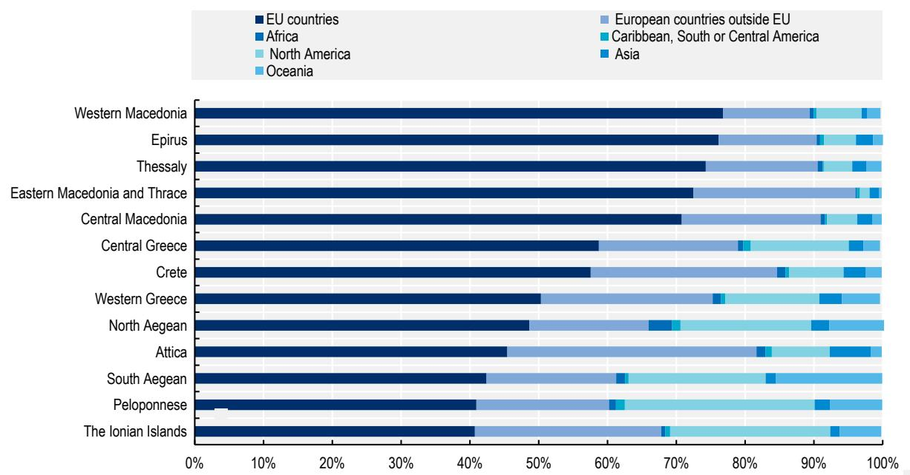  
Source: Hellenic Statistical Authority (ELSTAT), 2021 Population and Housing Census: Statistical Data on Greece (Greek and Foreign Citizens), Athens.

Return migrants in Greece overwhelmingly tend to resettle in the region in which they were born, and this tendency is more pronounced among more recently settled return migrants across all regions. Nationwide in 2021, the share of returnees living in their region of origin was 77% among those who returned 3-5 years prior to the census enumeration in 2021 compared to 80% among those who returned less than 3 years before the census enumeration, a pattern that may reflect a heightened propensity to return to familiar environments during the COVID-19 pandemic (see Figure 4.11). Resettlement back to the place of origin is particularly pronounced in Northern Greece, where the share of return migrants that returned to their birth region was between 82% (for those that returned 3-5 years earlier) and 84% (for those who spent less than three years since return), and in Central Greece, where the respective shares were 77% and 81%. Even in regions traditionally associated with higher mobility, such as Attica, the Aegean Islands and Crete, the proportion of returnees resettling in their region of birth was slightly higher among more recent return migrants. These patterns suggest a strong preference among return migrants to reestablish themselves in familiar local contexts, where family networks, housing ties and social support remain particularly strong.

Figure 4.11. Greek return migrants from Northern and Central Greece are more likely to return to their region of birth than those from the Attica region or the Aegean Islands and Crete

Share of Greek return migrants whose current region of residence is the same as their place of birth, by years since return, 2021 census

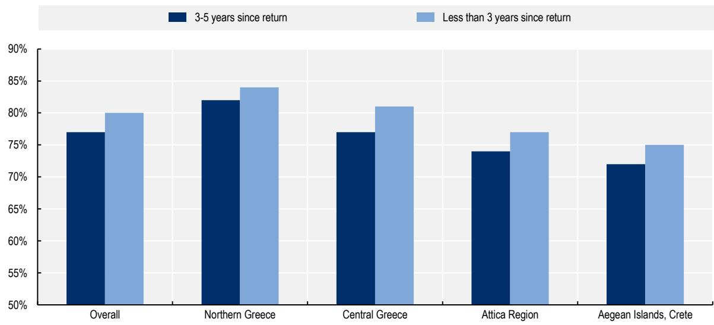  
Source: Hellenic Statistical Authority (ELSTAT), 2021 Population and Housing Census: Statistical Data on Greece (Greek and Foreign Citizens), Athens.

## Motivations and reasons for return

Understanding why Greek emigrants choose to return can help with interpreting broader mobility patterns and designing policies that effectively support reintegration. Return decisions often reflect a combination of personal, economic, and family considerations, and shifts in these motivations can signal changing conditions both abroad and in Greece.

## Repatriation is the dominant reason for return, followed by return for work

Reasons for return among Greek emigrants show broad stability across return cohorts, with repatriation consistently the main driver (see Figure 4.12). Across all cohorts captured in the 2011 and 2021 censuses, more than four in ten returnees cite repatriation as their primary reason, rising among the most recent returnees. Work-related motives are the second most common, accounting for roughly 15-22% of returns depending on the cohort, while family reunification remains stable at around 13-15% and study-related returns are limited (6-7%). A clear pattern is that employment-related motives are less prominent among cohorts whose return coincided with periods of heightened economic or global uncertainty, including the sovereign-debt crisis and the onset of the COVID-19 pandemic, when repatriation considerations played a relatively larger role.

Figure 4.12. Repatriation is a growing reason for return among Greeks emigrants Greek return migrants by reason for return and years since return, 2011 census and 2021 census  
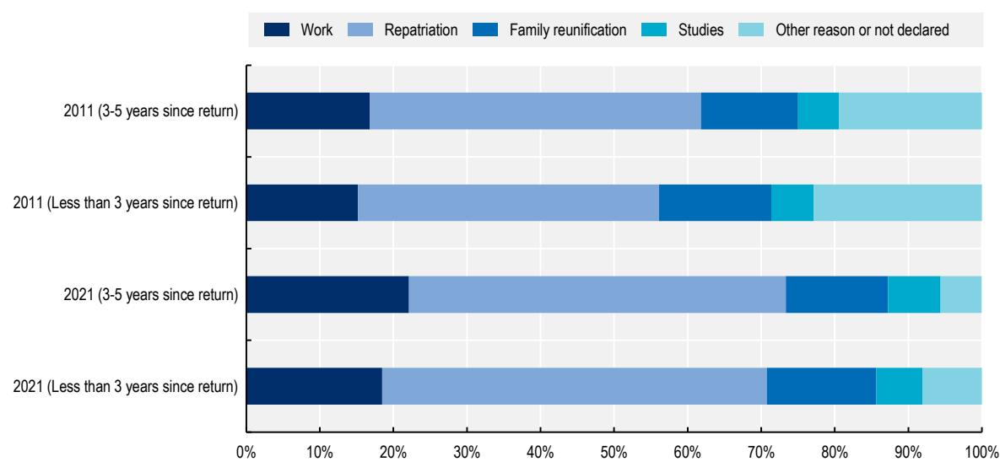  
Source: Hellenic Statistical Authority (ELSTAT), 2021 Population and Housing Census: Statistical Data on Greece (Greek and Foreign Citizens), Athens.

Across different regions of previous residence, the motivations for return reveal distinct patterns. Repatriation remains the predominant driver everywhere, but it is especially pronounced among returnees from Oceania (66%) and North America (65%), where long-distance separation and the fact that these migrant cohorts are older likely play a stronger role in prompting a return for repatriation rather than work or study (see Figure 4.13).

By contrast, returnees from European countries outside the EU report a more varied set of reasons: while nearly half (47%) return for repatriation, a comparatively high share cite work-related motives (23%) or studies (8%). Return migrants from the EU, Africa, and Asia display broadly similar profiles, with repatriation accounting for just over half of returns (52-53%) and work emerging as the second most common reason (20%). Meanwhile, those returning from the Caribbean, Central and South America show the most balanced distribution of motives, combining relatively high shares of repatriation (49%), work (21%), and family reunification (19%).

Figure 4.13. Returns for work play a less prominent role among those returning from North America and Oceania  
Greek return migrants by reason for return migration and region of previous residence, 2021 census  
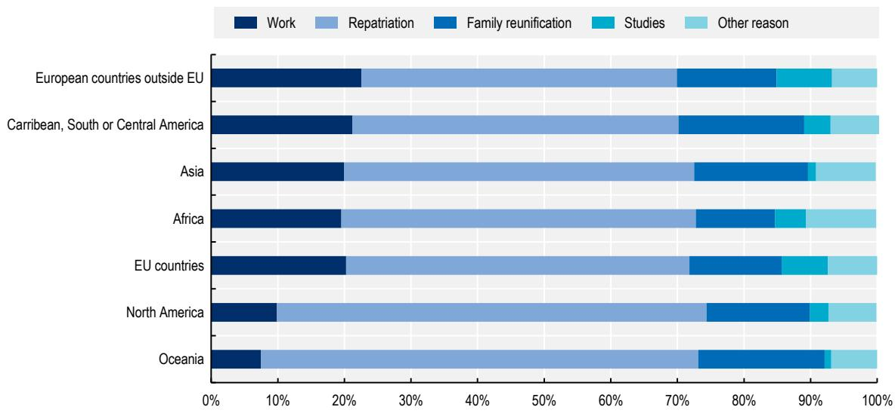  
Source: Hellenic Statistical Authority (ELSTAT), 2021 Population and Housing Census: Statistical Data on Greece (Greek and Foreign Citizens), Athens.

Reasons for return vary systematically with age. Among 20-29 year-olds, studies (16%) are a distinctive driver alongside work (19%), while repatriation (44%) remains the most common motive (see Figure 4.14). In 30-39 and 40-49, work peaks (29% and 28%, respectively) as career reintegration becomes central, yet repatriation still accounts for roughly half of returns (49-50%), with family reunification steady at 13-14% and studies fading to marginal shares (4-1%). From 50-59 onward, return is increasingly anchored in repatriation (52% at 50-59, 70% at 60-69, 76% at 70+), while work recedes and family reunification remains broadly stable (12-16%). The 2011 census data show very similar patterns.

Figure 4.14. Repatriation was the most commonly cited reason for return among all age groups Greek return migrants by age and reason for return, ages 20 and above, 2021 census  
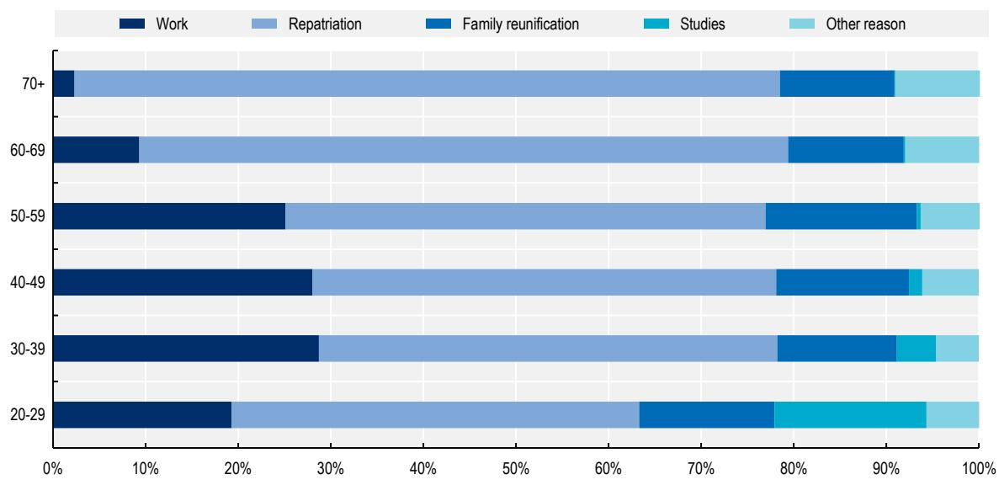  
Source: Hellenic Statistical Authority (ELSTAT), 2021 Population and Housing Census: Statistical Data on Greece (Greek and Foreign Citizens), Athens.

## Labour market integration of return migrants

Return migrants often arrive with valuable international experience and skills, yet their contribution depends on whether they can transition smoothly into suitable jobs, navigate recognition of qualifications, and access the incentives designed to attract them back. Examining labour market outcomes therefore provides a critical lens on the effectiveness of existing measures and helps identify where additional support may be needed to ensure that Greeks return and can fully deploy their skills.

## Labour market reintegration is uneven across regions, with Attica showing the strongest outcomes

Return migrants who arrived more recently are less likely to be economically active than those who returned earlier. Those who returned in 2016 show the highest level of labour force participation, at 70%, while labour force participation falls with year since return: 64% for those returning in 2019; 61% in 2020 and 54% in 2021 (see Figure 4.15). A similar timing-related gradient appears across all regions: more recently arrived return migrants are less likely to be active in the labour market. In Northern Greece, labour force participation ranges from 63% among those who returned in 2016 to 46% among those arriving in 2021. The pattern is comparable in Central Greece (from 67% to 51%), while Attica consistently records the highest activity levels (from 77% to 65%), suggesting that returnees entering the capital region may transition into employment or job-seeking somewhat more rapidly. The Aegean Islands and Crete follow the same timing-driven pattern, with labour force participation falling from 65% to 49% across the period.

These differences are best interpreted as features of the reintegration process. Returning to Greece typically involves a series of steps, such as updating administrative documentation, securing housing, re-establishing local networks and searching for suitable employment, all of which take time. Return migrants who arrived only shortly before the census had less opportunity to complete this transition and are therefore more likely to appear temporarily outside the labour force. Seen in this light, the regional differences also offer insight into where reintegration may be faster: Attica's smaller decline across cohorts suggests that its larger and more diversified labour market provides more immediate entry points into employment. For a more detailed breakdown by region, see Annex Table 4.A.2 in the Annex 4.A.

Figure 4.15. Economic activity patterns reflect gradual labour market reintegration among recently returned migrants

Economic activity of Greek return migrants by region, all ages, by year since return, 2021 census

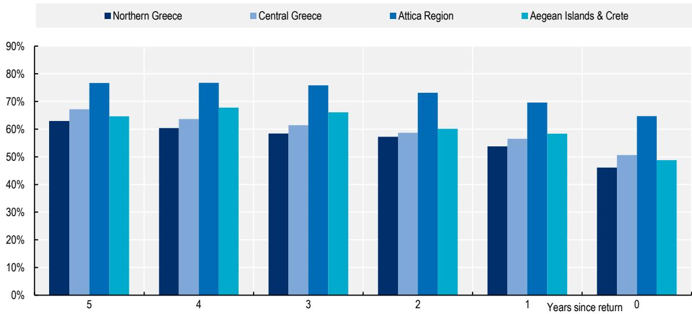  
Note: Years since return to Greece is captured retrospectively in the 2011 and 2021 censuses.  
Source: Hellenic Statistical Authority (ELSTAT), 2021 Population and Housing Census: Statistical Data on Greece (Greek and Foreign Citizens), Athens.

## Unemployment was most pronounced during the economic crisis

Employment outcomes among Greek return migrants display clear cohort patterns that reflect both broader economic conditions and the time required for reintegration into the labour market. Earlier cohorts take time to reintegrate, beginning at 60% for returnees who settled in 2006 and falling progressively to 57% for those who settled in 2007, 54% for those returning in 2008, and 51% for the 2009 cohort. The sharpest drops appear for those returning during the most acute phase of the economic crisis, with employment rates decreasing to 39% for the 2010 cohort and reaching a low of 27% among individuals who returned in 2011 (see Figure 4.16).

More recent cohorts exhibit a similar trajectory, though starting from significantly higher initial employment levels. Returnees arriving in 2016 recorded the strongest outcomes, with 72% employed. This is followed by 69% for 2017 returnees, 66% for 2018, 61% for 2019, and 57% for those returning in 2020. The most recent group, returnees from 2021, essentially only including individuals returning with a job offer, shows an employment rate of 46%.

Figure 4.16. Employment rates are lower among more recent return cohorts  
Employment rates of Greek return migrants by years since return, ages 15-69, 2011 and 2021 census  
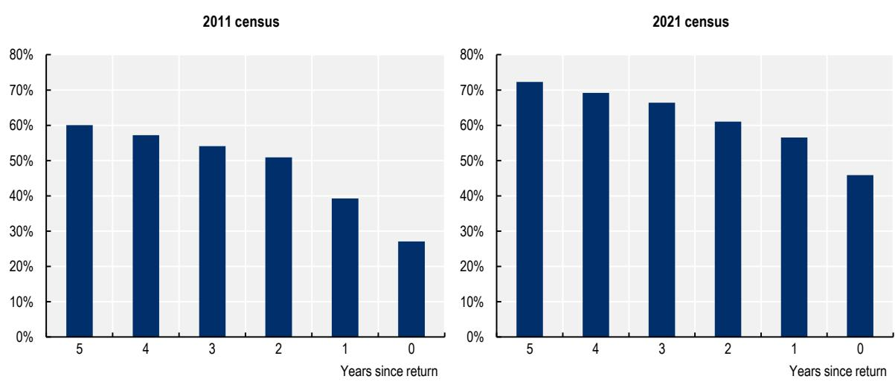  
Note: Year since return to Greece is captured retrospectively in the 2011 and 2021 censuses.  
Source: Hellenic Statistical Authority (ELSTAT), 2021 Population and Housing Census: Statistical Data on Greece (Greek and Foreign Citizens), Athens.

Comparing return migrants with non-migrants provides important insight into how effectively returnees re-enter the Greek labour market and how this process evolves across the life course. The data show that return migrants are slightly more likely to be employed than non-migrants at younger ages (50% vs. 48% among those aged 20-29) (see Figure 4.17). However, this pattern reverses from age 30 onwards. Non-migrants maintain higher employment levels through mid-career stages, reaching 76% in both the 30-39 and 40-49 age groups, compared with 74% and 71% among return migrants. The gap widens further at older ages: among individuals aged 50-59, employment among returnees falls to 56%, 9 percentage points (p.p.) lower than among non-migrants (65%).

This divergence becomes especially pronounced in the 60-69 age group, where only 16% of return migrants are employed, compared with 23% of non-migrants. At these ages, lower employment among return migrants is likely to reflect, at least in part, earlier or more frequent transitions into retirement following return, alongside reduced incentives or opportunities to re-engage in paid employment late in the working life. Taken together, the patterns suggest that while younger returnees tend to reintegrate relatively well, labour-market participation among older return migrants is shaped both by reintegration challenges and by life-course factors related to retirement.

Figure 4.17. Greek return migrants show slightly lower employment outcomes than non-migrants, especially among older cohorts

Employment rates of Greek return migrants and those who never left Greece by age, ages 20-69, 2021 census

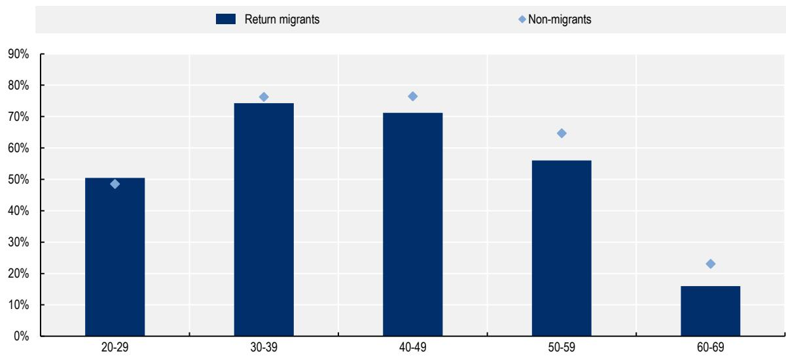  
Note: For the purposes of this analysis, non-migrants are defined as Greek-born Greek citizens who reported never having lived abroad at the time of the census.  
Source: Hellenic Statistical Authority (ELSTAT), 2021 Population and Housing Census: Statistical Data on Greece (Greek and Foreign Citizens), Athens.

## Educational attainment is a key determinant of labour market integration for Greek return migrants

Unemployment rates among return migrants in 2021 were higher for return cohorts observed closer to the census date, consistent with the time needed to re-enter local labour markets and with broader macroeconomic conditions. Among those who returned less than three years prior to the census enumeration, unemployment stood at 25%, above the 16% observed for who had returned 3-5 years prior to the census enumeration, suggesting many recent returnees were still in transition at the time of enumeration (see Figure 4.18). In the 2011 census, unemployment reached 32% for recently returned migrants, compared with 21% among those who had returned 3-5 years prior to the census enumeration, likely also reflecting the severe labour market stress during Greece's economic crisis. Taken together, these patterns indicate that both reintegration timing and contextual shocks, i.e. the economic crisis in the late 2000s and the COVID-19 pandemic in 2020-2021, contributed to higher unemployment among the most recently returned cohorts.

Figure 4.18. Unemployment rates are most pronounced among those returning during the onset of the economic crisis  
Unemployment rates of Greek return migrants, ages 15 and above, by years since return, 2011 census and 2021 census  
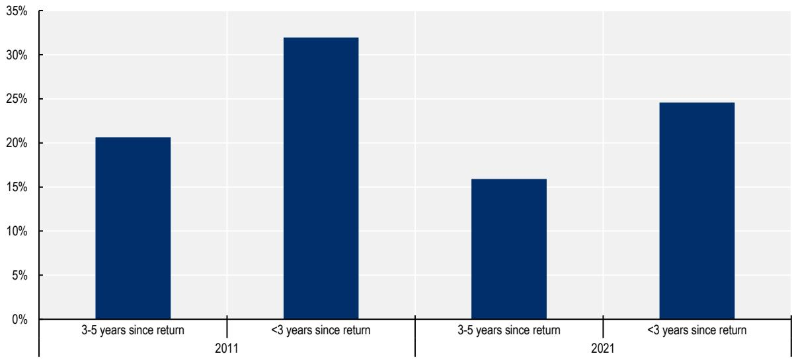  
Note: Year since return to Greece is captured retrospectively in the 2011 and 2021 censuses.

Source: Hellenic Statistical Authority (ELSTAT), 2021 Population and Housing Census: Statistical Data on Greece (Greek and Foreign Citizens), Athens.

Upon a closer look at all returnees captured in the 2021 census, educational differentials are also evident across the broader population of economically active return migrants. Only $12\%$ of those with doctoral degrees and $15\%$ of those with master's degrees are unemployed, levels that are at or below Greece's overall 2021 unemployment rate of $14.8\%$ (see Figure 4.19). In contrast, nearly $40\%$ of returnees with at most primary education and approximately one-third of those with lower or upper secondary education are unemployed. Among individuals with post-secondary non-tertiary, short-cycle tertiary, or bachelor's education, roughly one in four is unemployed, with the largest reduction in unemployment observed between bachelor's and master's degrees (an 8-p.p. decline). These disparities highlight that higher qualifications remain a critical buffer against unemployment, though even skilled returnees have experienced increasing vulnerability in recent years.

Figure 4.19. Unemployment rates are lower among highly skilled return migrants  
Unemployment rates of economically active Greek return migrants by educational attainment, ages 15 and above, 2021 census  
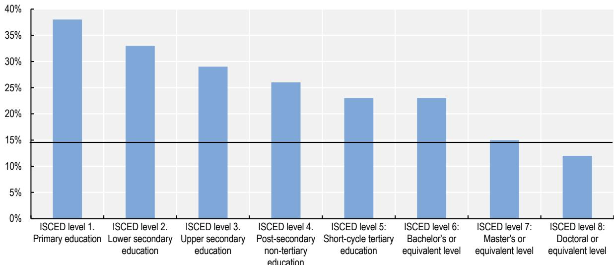  
Note: The reference line represents the average employment rate in 2021, which stood at 14.8%. Those in the categories “Illiterate” and ISCED level 0 are not included due to small sample size.  
Source: Hellenic Statistical Authority (ELSTAT), 2021 Population and Housing Census: Statistical Data on Greece (Greek and Foreign Citizens), Athens. OECD, Unemployment rates.

Across all years, highly educated returnees show faster and more stable reintegration, with the lowest unemployment among doctoral degree holders, ranging from 7-9% among those who returned 3-5 years before the 2021 census enumeration to 14% among those who returned 1 year before the census enumeration and 17% among those returning the same year as the census. This likely reflects that many recent return migrants were still in transition phase and had not yet fully settled (see Figure 4.20). Master's degree holders follow a similar trajectory: unemployment remained relatively contained for those who spent longer duration in the country since return (9-11% among those who returned 3-5 years ago) and for cohorts observed closer to the census date reaches 17% in 2020 and 22% in 2021. Bachelor's level returnees exhibit the steepest gradient, from 11% for those who spent 5 years in the country to 33% for those who just returned, indicating that individuals with undergraduate qualifications may experience a longer adjustment period, particularly in years marked by broader labour market disruptions such as the COVID-19 pandemic.

Taken together, these patterns underscore two central dynamics. First, unemployment rates are higher for returnees who arrived close to the census year, as many have not yet completed the reintegration process. Second, while higher education consistently facilitates a quicker and more stable return to employment, the transition is not immediate, even for the highly skilled. The comparative resilience of doctoral and master's level returnees highlights the value of advanced qualifications in smoothing re-entry into the labour market, while the more gradual integration of bachelor's degree-holders points to structural constraints and varying levels of labour market absorption across skill tiers.

Figure 4.20. Higher unemployment among more recent returnees suggests gradual labour market integration, with doctoral graduates experiencing the lowest adjustment barriers

Unemployment rates of economically active Greek tertiary educated return migrants, ages 15 and above, by educational attainment and years since return

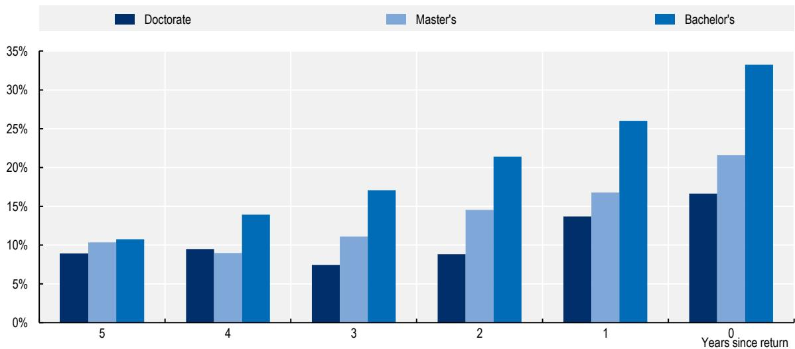  
Note: Year since return to Greece is captured retrospectively in the 2011 and 2021 censuses.  
Source: Hellenic Statistical Authority (ELSTAT), 2021 Population and Housing Census: Statistical Data on Greece (Greek and Foreign Citizens), Athens.

## Nearly half of all returnees work as professionals, while fewer than one in five non-migrants occupy professional roles

Nearly half of all returnees work as professionals (47%), far exceeding the share among non-migrants (18%), reflecting the strong tertiary-educated composition of the returnee population and their tendency to re-enter high-skilled roles (see Figure 4.21). In contrast, non-migrants are far more concentrated in mid and lower-skilled occupations: service and sales workers (25%), skilled agricultural and fishery workers (8%), and elementary occupations (8%), compared with much smaller shares among return migrants (17%, 2%, and 3% respectively). Managerial, clerical, and technical roles show broadly similar levels across the two groups, with 4% of both groups working as managers and around 9-11% as clerical support workers and technicians and associate professionals. Overall, the distribution suggests that return migrants are substantially more likely to reintegrate into high-skilled roles, particularly as professionals, while non-migrants remain more heavily represented in routine, service sector, and manual occupations.

Figure 4.21. Half of all return migrants work in professional or managerial positions
Occupational distribution of Greek return migrants and non-migrants, ages 15 and above, 2021 census  
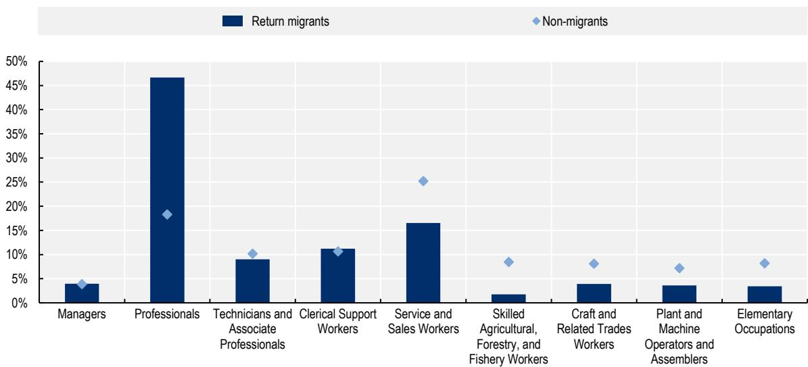  
Note: For the purposes of this analysis, non-migrants are defined as Greek-born Greek citizens who reported never having lived abroad at the time of the census.  
Source: Hellenic Statistical Authority (ELSTAT), 2021 Population and Housing Census: Statistical Data on Greece (Greek and Foreign Citizens), Athens.

The occupational profile of return migrants observed in the 2021 census is largely stable across return cohorts, with little variation by time since return. Regardless of whether return occurred three to five years prior to enumeration or more recently, around half of returnees work as professionals, and the distribution across other occupational groups remains broadly unchanged. This suggests that occupational reintegration does not substantially evolve with time spent back in Greece, at least as observed at the point of the 2021 census.

## Almost half of return migrants in professional occupations are working in health, science, and engineering

Among those employed in professional roles, return migrants are particularly concentrated in science and engineering (22%) and health professions (23%). By contrast, non-migrants are much more heavily represented in teaching professions (37% compared with 17% among return migrants) (see Figure 4.22). Return migrants also account for a comparatively larger share of ICT professionals (9% versus 5%). In other professional fields – such as business and administration as well as legal, social and cultural professions – the occupational distributions of return migrants and non-migrants are broadly similar.

Figure 4.22. Return migrants are more likely to be health or science and engineering professionals, while non-migrants are more likely to be teaching professionals

Occupational distribution of Greek return migrants and those who never left Greece, ages 15 and above, 2021 census

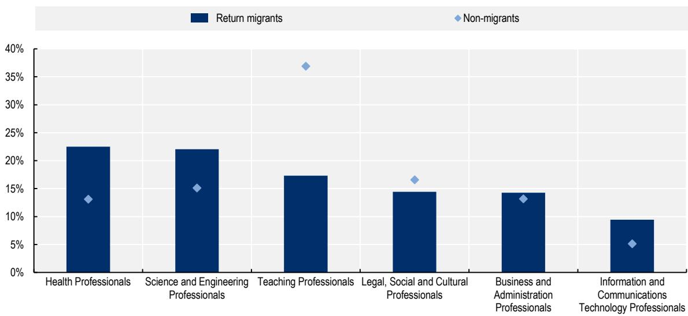  
Note: For the purposes of this analysis, non-migrants are defined as Greek-born Greek citizens who reported never having lived abroad at the time of the census.  
Source: Hellenic Statistical Authority (ELSTAT), 2021 Population and Housing Census: Statistical Data on Greece (Greek and Foreign Citizens), Athens.

Among return migrants recorded in the 2021 census and employed in professional occupations, the occupational distribution varies somewhat by time since return (see Figure 4.23). Science and engineering professionals consistently represent one of the largest groups across all return cohorts. By contrast, health professionals are relatively less represented among the most recent return cohorts, a pattern likely linked to pandemic-related disruptions affecting mobility and labour-market conditions at the time of return. It should be noted that legislative reforms introduced in 2025 to enable the automatic recognition of qualifications of medical professionals trained abroad are not reflected in the census data and their effects, if any, will only be observable in future data (see Chapter 6). Teaching professionals, by contrast, account for a larger share among more recent return cohorts, while ICT and business-related professions are also more prevalent among recent returnees. Legal, social and cultural professions display little variation across cohorts, indicating a broadly stable occupational presence.

Figure 4.23. Professional specialisation among return migrants differs slightly by time since return  
Occupational distribution (ISCO 21-26) of economically active Greek return migrants in professional occupations (ISCO 2), ages 15 and above, by years since return, 2021 census  
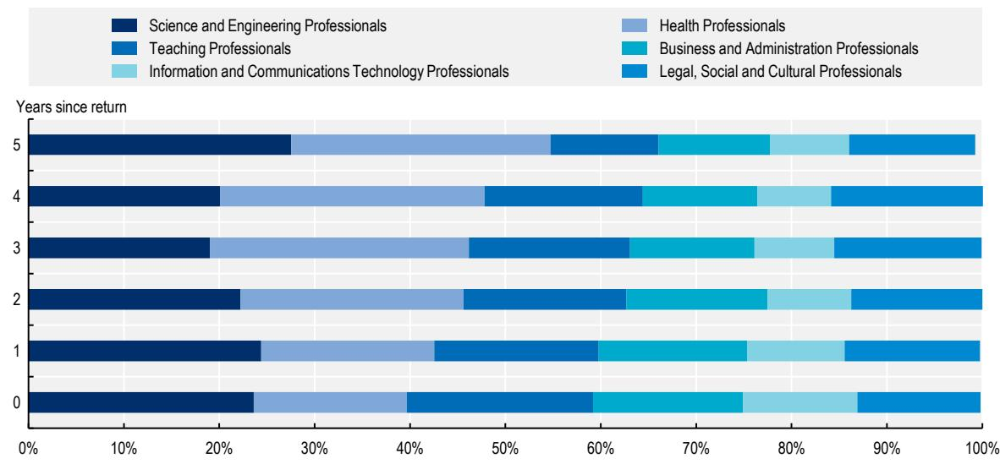  
Note: Years of return to Greece are captured retrospectively in the 2011 and 2021 censuses.

Source: Hellenic Statistical Authority (ELSTAT), 2021 Population and Housing Census: Statistical Data on Greece (Greek and Foreign Citizens), Athens.

## Self-employment remains more prevalent among Greeks who never migrated

Among Greek returnees recorded in the 2021 census, self-employment remains a relatively limited mode of labour-market engagement (see Figure 4.24). Return migrants who had been back in Greece for 3 to 5 years are more likely to be self-employed with personnel (around 7%) than those who returned more recently (around 4%), while self-employment without personnel shows only modest variation across cohorts, remaining broadly within the 13-17% range.

These differences are best interpreted as reflecting reintegration timing rather than shifts in entrepreneurial behaviour. Establishing a business, particularly one employing others, typically requires time, access to capital, and familiarity with local administrative and market conditions. As a result, return migrants who arrived closer to the census enumeration are less likely to appear as self-employed, especially with personnel. Overall, the evidence suggests that while some returnees do transition into entrepreneurship over time, self-employment is not a dominant immediate pathway upon return, and business creation tends to emerge gradually rather than at the point of re-entry.

Figure 4.24. Recent migrants are less likely to be self-employed with personnel compared to those who have been back longer

Self-employment rates of Greek return migrants, ages 15 and above, by years since return, 2021 census

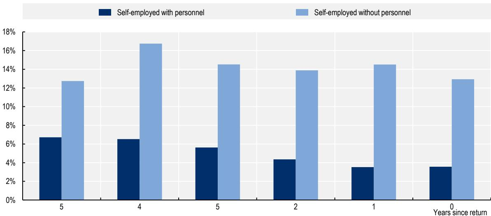  
Note: The share of self employment is calculated as the number of self employed individuals divided by the total number of individuals in employment. The 2021 census period covers 23 October–31 December 2016 and 1 January–22 October 2021. As a result, 2016 and 2021 should be interpreted with caution. Years since return to Greece are captured retrospectively in the 2011 and 2021 censuses.
Source: Hellenic Statistical Authority (ELSTAT), 2021 Population and Housing Census: Statistical Data on Greece (Greek and Foreign Citizens), Athens.

Self-employment is more prevalent among individuals who have remained in Greece (25%) than among those who have lived abroad and returned (19%). Regional patterns also differ between return migrants and non-migrants. Across most regions, self-employment, both with and without personnel, is more common among the population that has not experienced emigration. An exception is self-employment without personnel in the Attica region, where return migrants report slightly higher rates. Attica nonetheless records the lowest overall levels of self-employment for both groups. By contrast, Central Greece exhibits the highest incidence of self-employment without personnel, reaching 18% among return migrants and 25% among non-migrants (see Figure 4.25), corresponding to the largest observed gap between the two groups, at seven p.p.

Figure 4.25. Self-employment is more common among those who have not lived abroad
Self-employment rates of Greek return migrants and of those who never left Greece by region, ages 15 and above, 2021 census  
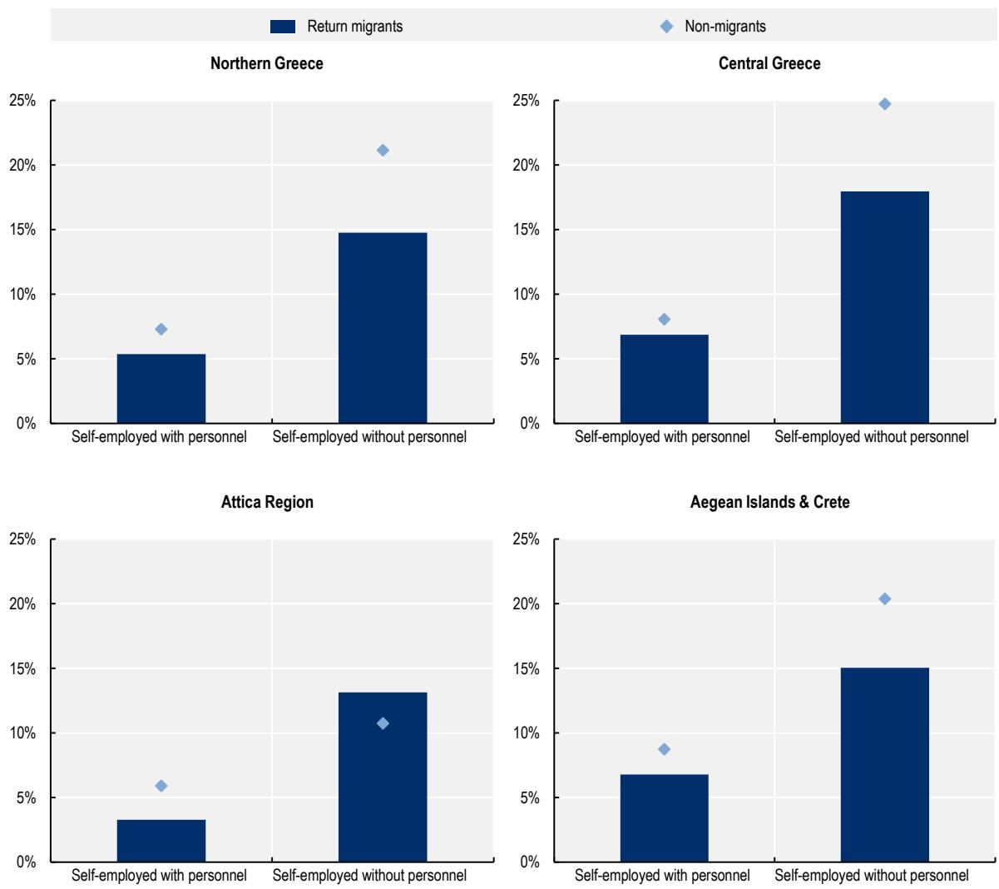  
Note: The share of self-employment is calculated as the number of self-employed individuals divided by the total number of individuals in employment.  
Source: Hellenic Statistical Authority (ELSTAT), 2021 Population and Housing Census: Statistical Data on Greece (Greek and Foreign Citizens), Athens.

## Among the inactive, return migrants are more likely to be students than those who never migrated

Economic inactivity among return migrants provides additional insight into how their circumstances differ from those of non-migrants. Among inactive returnees, students constitute the largest group (40%), compared with 34% among non-migrants, highlighting the prominence of study-related transitions among those who have returned from abroad (see Figure 4.26). By contrast, pensioners account for a smaller share of inactive returnees (33%) than among inactive non-migrants (40%). Return migrants are also slightly more likely to report capital income as their main status (3%, compared with virtually none among non-migrants), suggesting the presence of financial resources or arrangements maintained outside Greece. In other inactivity categories, such as housekeeping and other statuses, the distributions of returnees and non-migrants are broadly similar.

Figure 4.26. Among the economically inactive, return migrants are more likely to be students and less likely to be pensioners when compared to non-migrants

Activity status among economically inactive Greek return migrants and those who never left Greece, all ages, 2021 census

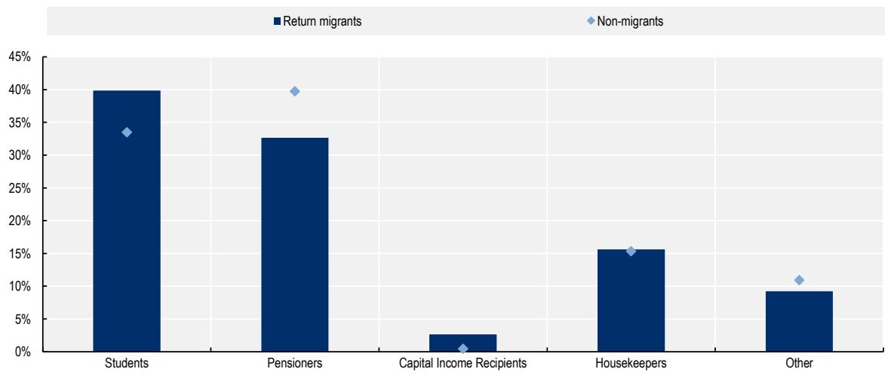  
Note: For the purposes of this analysis, non-migrants are defined as Greek-born Greek citizens who reported never having lived abroad at the time of the census.  
Source: Hellenic Statistical Authority (ELSTAT), 2021 Population and Housing Census: Statistical Data on Greece (Greek and Foreign Citizens), Athens.

## Return intentions among Greeks abroad

While Greek census data provide valuable insights into the outcomes of return migrants to Greece, targeted surveys can capture the motivations behind decisions to stay abroad or return, as well as more about the experiences of those who do return.

## Improved professional prospects, tax relief and improved quality of life could incentivise return

A recent online survey of Greeks living in Greece and abroad provides additional insight into return intentions and the institutional conditions shaping return decisions (Metron Analysis, 2025[6]). The survey was conducted in 2025 using a structured online questionnaire and targeted men and women aged 20-50 residing in Greece and in countries of destination. The final sample comprised 848 respondents, combining visitors to in.gr with participants drawn from an online panel; results were post-stratified by age and gender. While not based on a fully probabilistic design, the survey was explicitly designed to capture population groups most exposed to emigration and return decisions and is therefore best interpreted as providing indicative evidence on attitudes and intentions rather than population-level estimates.

In the final sample, 73% of respondents resided in Greece, while 27% lived abroad at the time of the survey. Among emigrants, around half reported having left Greece during the crisis period of 2010-2018, while a further 38% migrated after 2019, pointing to the persistence of outward mobility beyond the peak crisis years. More recent emigrants were disproportionately represented among younger respondents and women, in line with broader evidence on the evolving profile of post-crisis emigration.

Intentions to return in the short term appear limited. Overall, 85% of emigrants reported that they were unlikely to return within the next two years, with this share rising to 92% among respondents aged 20-30, suggesting particularly low short-term return propensity among younger cohorts. When asked about potential factors that could motivate a return, respondents most frequently cited competitive remuneration packages (52%), followed by tax relief measures to reduce the financial cost of return (36%) and improvements in work – life balance (25%).

The survey also highlights a range of perceived structural barriers to return. Respondents pointed to limited trust in Greek institutions, weak or uncertain professional prospects, concerns about career advancement opportunities, and deficits in meritocracy as key deterrents. Together, these findings suggest that, despite strong emotional, social or cultural attachment to Greece, many emigrants remain sceptical about the country's capacity to offer stable and rewarding career pathways that would justify a near-term return.

## Nearly half of Greek return migrants report challenges adjusting to life back in Greece

To better understand the characteristics and experiences of return migrants, the National Documentation Centre (EKT) commissioned a survey published in October 2024 (Kapa Research / EKT, 2024[7]). Its aim was to map the socio-economic profile, motivations, and reintegration experiences of returnees, with particular attention to their potential contribution to Greece's development. The survey is based on a relatively limited sample of 602 return migrants, defined as individuals aged 18 and above who had lived and worked abroad during 2010-2019 and are now employed in Greece. The sample was constructed using a multistage stratified design with quotas for key demographic variables (gender, age, and region), aligned with 2021 census benchmarks to support representativeness across Greece's 13 regions. Data collection followed a mixed-mode approach, combining primarily online questionnaire with a smaller number of telephone interviews to improve coverage. While this design ensures a reasonably balanced sample, it remains partly non-probability-based, particularly due to online recruitment, and may therefore be subject to some selection bias.

According to the survey, returnees are predominantly active in the private sector (50%) or are self-employed or business owners (26%), while smaller shares work in the public sector (11%) or are unemployed (6%). Notably, 7% work remotely for employers based abroad, reflecting the growing prevalence of hybrid and remote work arrangements. The survey also indicates that self-employed individuals are somewhat over-represented relative to census data, a difference that may reflect sample composition or the stronger engagement of entrepreneurial returnees with survey participation.

Employment among returnees is concentrated in construction (11%), ICT (10%), education (10%), consulting (7%), and healthcare (7%), followed by wholesale and retail trade, tourism, and the energy and renewables sector. A strong majority report making active use of their international experience: 74% apply skills acquired abroad in their current role, and 73% believe this experience has enhanced their competitiveness in the Greek labour market.

Income levels vary considerably. The largest group earns EUR 1 001-1 500 per month (29%), followed by those earning EUR 1 501-3 000 (27%). At the lower end, 22% report monthly earnings below EUR 1 000, while 17% earn more than EUR 3 000. These income levels remain below broader wage benchmarks in Greece, which itself lags behind the OECD average monthly wage of approximately EUR 2 300. Despite these constraints, 40% of returnees report managing financially (31% somewhat easily and 9% very easily), and 44% express being somewhat or very satisfied with their working conditions.

Reintegration nonetheless presents challenges. Nearly half of respondents (46%) report difficulties adjusting to life back in Greece, although a comparable share express optimism about their future.

Only 55% view Greece positively or somewhat positively as a place to live. When asked what would encourage return, respondents emphasised more effective institutions, stronger labour-market meritocracy, and the modernisation of state structures, factors ranked ahead of macroeconomic improvement or sectoral convergence with other European countries (see Figure 4.27).

Finally, 14% of returnees report having benefited from targeted tax incentives, such as the reduced income-tax regime for return migrants. Given the eligibility criteria associated with these measures (discussed in Chapter 6), this suggests that financial incentives alone are not a dominant driver of return, underscoring the importance of broader institutional and labour-market conditions.

Figure 4.27. More functional institutions and greater labour market meritocracy are believed to encourage emigrants to return

Greek return migrants' responses to "What would help encourage the repatriation of more Greeks living abroad?"

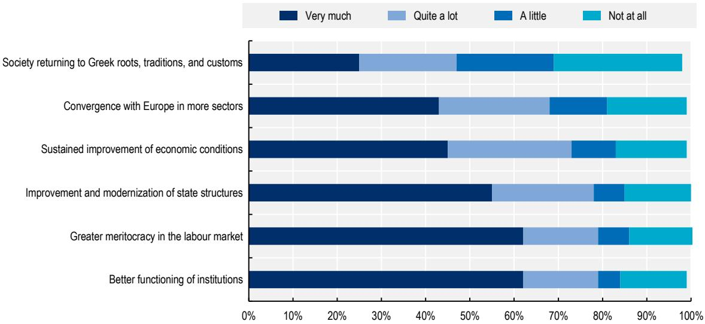  
Source: Kapa Research/EKT (2024[7]), Mapping the return of highly skilled Greeks: A study of the brain gain phenomenon, https://www.kaparesearch.com/project-items/mapping-the-return-of-highly-skilled-greeks-a-study-of-the-brain-gain-phenomenon/.

Taken together, the two surveys highlight a multifaceted picture of return migration to Greece. While many emigrants retain strong ties to the country, their short-term intention to return remains limited, mainly due to concerns about professional prospects, institutional effectiveness, and meritocracy. Those who do return often bring valuable skills, international experience and professional networks acquired in more competitive labour markets, including exposure to advanced technologies, modern management practices and high-performance research or business environments. This pattern is consistent with recent Greece-specific evidence showing that highly skilled returnees accumulate human capital and international linkages while abroad, which they are able to mobilise upon return (Labrianidis and Sykas, 2024[8]; Kapa Research / EKT, 2024[7]). Empirical research further suggests that these attributes can translate into measurable though modest gains in knowledge transfer and innovation. Using census-scale data on Greek PhD holders, Labrianidis and Sykas (2024[8]) find that highly skilled return migrants have a limited but statistically significant positive effect on patenting activity and scientific citations in Greece, indicating a limited but tangible brain-gain effect (Labrianidis and Sykas, 2024[8]). This evidence aligns with the broader literature on brain circulation, which shows that return migration and temporary mobility can partially offset the negative innovation effects of skilled emigration by facilitating the diffusion of knowledge, research practices and international collaboration networks (Mayr and Peri, 2008[9]; Batista et al., 2025[10]).

At the same time, the literature also underscores that such benefits are neither automatic nor fully realised in the absence of supportive domestic conditions. As the survey evidence from Greece shows, returnees frequently face adjustment challenges and lower earnings relative to OECD benchmarks. As a result, while financial incentives such as tax relief can facilitate return for some, the findings suggest that improvements in career opportunities, institutional quality, and everyday living conditions are equally central to making return migration more attractive, more sustainable, and more effective in leveraging the potential contributions of returning talent.

Chapter 5 will explore in more detail the specific return barriers faced by Greek researchers, while Chapter 6 will examine the current policy framework to encourage return migration and outline ways in which Greece can further strengthen its approach.

## References

Batista, C. et al. (2025), “Brain drain or brain gain? Effects of high-skilled international emigration on origin countries”, Science, Vol. 388/6749, https://doi.org/10.1126/science.adr8861.

Gittins, T. and M. Fink (2015), “Return migration, informal learning, human capital development and SME internationalization in the CEE region: A systematic literature review”, Journal of East European Management Studies, Vol. 20/3, pp. 279-303, https://doi.org/10.5771/0949-6181-2015-3-279.

Haas, H., S. Vezzoli and M. Villares-Varela (2019), Opening the Floodgates: European migration under restrictive and liberal border regimes 1950-2010, https://www.migrationinstitute.org/publications/opening-the-floodgates-european-migration-under-restrictive-and-liberal-border-regimes-1950-2010.

Kapa Research / EKT (2024), Mapping the return of highly skilled Greeks: A study of the brain gain phenomenon, https://www.kaparesearch.com/project-items/mapping-the-return-of-highly-skilled-greeks-a-study-of-the-brain-gain-phenomenon/. [7]

Labrianidis, L. and T. Sykas (2024), “The Impact of Highly Skilled Returning Emigrants on the Origin Country’s Innovation Performance: Evidence from Greece”, in European Studies of Population, Population Studies in the Western Balkans, Springer International Publishing, Cham, https://doi.org/10.1007/978-3-031-53088-3\_14.

Mayr, K. and G. Peri (2008), Return Migration as a Channel of Brain Gain, National Bureau of Economic Research, Cambridge, MA, https://doi.org/10.3386/w14039.

Metron Analysis (2025), Έρευνα Κοινής Γνώμης για το Brain Drain| Brain Drain – Retain & Regain survey, conducted for in.gr.

Triandafyllidou, A. and M. Maroufof (2008), “Immigration towards Greece at the Eve of the 21st Century: A Critical Assessment”, Hellenic Foundation for European and Foreign Policy (ELIAMEP), https://www.eliamep.gr/wp-content/uploads/en/2009/02/immigration-towards-greece-at-the-eve-of-the-21st-century-a-critical-assessment.pdf.

Vergeti, M. (2003), Παλιννόστηση και Κοινωνικός Αποκλεισμός’ (Return Migration and Social Exclusion), Thessalonica. [3]

Wahba, J. (2025), Return migration and economic development: opportunities and challenges, https://doi.org/10.1016/j.worlddev.2025.107225.

## Annex 4.A. Supplementary tables

## Annex Table 4.A.1. Main descriptive statistics, by return migrants and non-migrants

<table><tr><td>Category</td><td>Return migrants</td><td>Non-migrants</td></tr><tr><td colspan="3">Individual characteristics</td></tr><tr><td>Female</td><td>46</td><td>51</td></tr><tr><td>Single household</td><td>56</td><td>43</td></tr><tr><td>Born in region of current residence</td><td>79</td><td>84</td></tr><tr><td>Economically Active (all ages)</td><td>62</td><td>42</td></tr><tr><td>Economically Active (ages 20 and above)</td><td>68</td><td>53</td></tr><tr><td colspan="3">Region of Residence</td></tr><tr><td>Northern Greece</td><td>31</td><td>28</td></tr><tr><td>Central Greece</td><td>17</td><td>26</td></tr><tr><td>Attica Region</td><td>42</td><td>35</td></tr><tr><td>Aegean Islands and Crete</td><td>10</td><td>11</td></tr><tr><td colspan="3">Educational Attainment</td></tr><tr><td>Illiterate</td><td>0</td><td>1</td></tr><tr><td>ISCED 0-1</td><td>10</td><td>18</td></tr><tr><td>ISCED 2-4</td><td>27</td><td>45</td></tr><tr><td>ISCED 5-8</td><td>56</td><td>20</td></tr><tr><td>Not applicable (under 15 years)</td><td>6</td><td>16</td></tr><tr><td colspan="3">Highly Educated (among highly educated)</td></tr><tr><td>Short-cycle tertiary educated</td><td>2</td><td>5</td></tr><tr><td>Bachelor&#x27;s</td><td>48</td><td>76</td></tr><tr><td>Master&#x27;s</td><td>41</td><td>17</td></tr><tr><td>Doctoral</td><td>9</td><td>2</td></tr><tr><td colspan="3">Employment (ages 20 and above)</td></tr><tr><td>Employed</td><td>54</td><td>46</td></tr><tr><td>Unemployed – Former Employed</td><td>15</td><td>11</td></tr><tr><td>Unemployed – New Unemployed</td><td>7</td><td>3</td></tr><tr><td colspan="3">Economically Inactive (among total economically inactive)</td></tr><tr><td>Students</td><td>40</td><td>34</td></tr><tr><td>Pensioners</td><td>33</td><td>40</td></tr><tr><td>Housekeeping</td><td>16</td><td>15</td></tr><tr><td>Other</td><td>12</td><td>11</td></tr><tr><td colspan="3">Status in Employment (among employed)</td></tr><tr><td>Self-employed with personnel</td><td>5</td><td>7</td></tr><tr><td>Self-employed without personnel</td><td>14</td><td>18</td></tr><tr><td>Employee or wage earner</td><td>80</td><td>74</td></tr><tr><td>Other</td><td>1</td><td>1</td></tr></table>

Source: Hellenic Statistical Authority (ELSTAT), 2021 Population and Housing Census: Statistical Data on Greece (Greek and Foreign Citizens), Athens.

Annex Table 4.A.2. Economic activity rate of Greek return migrants by region, %

<table><tr><td></td><td>2016</td><td>2017</td><td>2018</td><td>2019</td><td>2020</td><td>2021</td><td>Total</td></tr><tr><td>Anatoliki Macedonia, Thraki</td><td>46</td><td>54</td><td>53</td><td>52</td><td>49</td><td>41</td><td>49</td></tr><tr><td>Kentriki Macedonia</td><td>69</td><td>64</td><td>62</td><td>61</td><td>58</td><td>50</td><td>58</td></tr><tr><td>Dytiki Macedonia</td><td>83</td><td>56</td><td>48</td><td>46</td><td>51</td><td>44</td><td>48</td></tr><tr><td>Ipeiros</td><td>64</td><td>56</td><td>57</td><td>54</td><td>46</td><td>39</td><td>48</td></tr><tr><td>Thessalia</td><td>73</td><td>63</td><td>63</td><td>61</td><td>59</td><td>55</td><td>60</td></tr><tr><td>Sterea Ellada</td><td>61</td><td>69</td><td>61</td><td>62</td><td>56</td><td>50</td><td>57</td></tr><tr><td>Ionia Nisia</td><td>65</td><td>66</td><td>57</td><td>58</td><td>56</td><td>41</td><td>56</td></tr><tr><td>Dytiki Ellada</td><td>64</td><td>66</td><td>69</td><td>59</td><td>57</td><td>55</td><td>61</td></tr><tr><td>Peloponnisos</td><td>64</td><td>57</td><td>52</td><td>51</td><td>52</td><td>43</td><td>50</td></tr><tr><td>Attiki</td><td>77</td><td>77</td><td>76</td><td>73</td><td>70</td><td>65</td><td>72</td></tr><tr><td>Voreio Aigaio</td><td>57</td><td>56</td><td>53</td><td>47</td><td>55</td><td>44</td><td>50</td></tr><tr><td>Notio Aigaio</td><td>50</td><td>64</td><td>64</td><td>57</td><td>48</td><td>41</td><td>53</td></tr><tr><td>Kriti</td><td>83</td><td>73</td><td>74</td><td>69</td><td>67</td><td>57</td><td>67</td></tr></table>

Source: Hellenic Statistical Authority (ELSTAT), 2021 Population and Housing Census: Statistical Data on Greece (Greek and Foreign Citizens), Athens.

## Greek emigrants engaged in research and study abroad

This chapter examines the international mobility of Greek students and researchers, highlighting its potential role in shaping Greece’s human capital, research capacity, and engagement in the global knowledge economy. It analyses student mobility, focussing on the numbers, destinations, and motivations of young Greeks studying abroad. The chapter also explores the mobility of Greek researchers, mapping their presence in foreign scientific networks and assessing their contributions to international collaboration and innovation. Finally, it considers patterns of return migration and the implications for Greece’s higher education and research systems, underscoring both the opportunities and challenges posed by academic outflows for national capacity and innovation.

## In Brief

\- International mobility is a structural feature of Greece’s higher-education and research system, shaping both domestic capacity and global knowledge linkages. Large-scale international mobility has enabled Greek students and researchers to integrate into leading education and research environments abroad, strengthen international networks and acquire advanced skills. At the same time, sustained outflows raise challenges about Greece’s teaching, research and innovation capacity.

\- Greece combines high tertiary enrolment with comparatively weak graduate labour outcomes, contributing to sustained student outflows. Over half of Greeks aged 20-24 are enrolled in higher education, one of the highest rates in the OECD, yet unemployment among tertiary-educated youth remains the highest in the OECD (13% vs. 5% OECD average). Overqualification also affects 37% of tertiary-educated youth, which is well above the EU-27 average of 22%, signalling persistent labour-market mismatch.

\- Outbound student mobility remains above EU and OECD averages, though Greece has seen a slight decline in recent years. Around 4% of Greek tertiary students were enrolled abroad in 2023, consistently above the OECD averages. However, international mobility dipped between 2020 and 2022, contrasting with increases elsewhere in Europe.

Destination patterns for international students are shifting, with the United Kingdom declining post-Brexit and Bulgaria, Germany and the Netherlands gaining prominence. UK enrolments fell notably from around 10 000 annually to just over 7 000 in 2022 following changes in tuition and visa rules for EU students. Meanwhile, However, the United Kingdom remains the number one destination for Greek international students, especially for Bachelor and PhD studies. Master's enrolment, however, is concentrated in Bulgaria (20%), the Netherlands (15%) and Germany (13%), reflecting divergent linguistic, financial and programme-specific considerations.

\- More than 17 000 Greek doctorate holders live abroad, forming a significant share of the country's potential research pipeline. OECD data show large concentrations in the United States, Germany, the United Kingdom, Switzerland and France.

\- Return among Greek PhD holders is concentrated in Europe, with comparatively limited return from the United States despite its prominence as a destination for Greeks with a doctoral degree. When benchmarked against the distribution of Greek PhD holders abroad, doctoral return appears more closely linked to European research systems that support circular mobility, while Greek PhD holders based in the United States are less likely to return.

\- A substantial and high-performing Greek-origin scientific diaspora, covering both Greek-born scientists and later-generation scientists of Greek origin, exists, with most top-impact researchers located abroad. Of roughly 64 000 Greek-origin scientists mapped in 2021, $44\%$ are affiliated abroad; among the most highly cited, $80\%$ of the global top $1\%$ and $86\%$ of the top $0.1\%$ work outside Greece.

\- Greek academics abroad express interest in returning – especially those without permanent positions, but remain concerned about salaries, research funding and institutional governance. While 59% would consider an academic post in Greece, concerns include low pay, limited research funding, bureaucracy and weak meritocracy. Higher salaries, increased research resources and governance reforms emerge as key conditions for incentivising return.

## Introduction

The international mobility of students and researchers is a defining feature of today's knowledge economy and a critical dimension of Greece's engagement with global human capital and innovation systems. Greece has experienced notable outflows of academically trained talent, driven by a combination of economic pressures, limited domestic opportunities, and international career aspirations (Labrianidis and Sykas, 2023[1]; Labrianidis and Sykas, 2015[2]). While mobility can enrich national capabilities through knowledge exchange and collaboration, sustained emigration at scale raises concerns about capacity in research, teaching and innovation.

Recent research has attempted to quantify some of these effects. Analyses of Greek PhD holders show that the large-scale departure of highly educated scientists has reduced Greece's scientific output, particularly citations and patenting, thus constraining the pool of knowledge producers during and after a prolonged economic crisis (Labrianidis and Sykas, 2023[1]). At the same time, mobility redirects research networks toward host countries: highly skilled Greek researchers are disproportionately drawn to innovation-intensive systems, and their presence abroad contributes measurably to those countries' knowledge and technology outputs. These dynamics underscore a dual challenge for Greece: mitigating the domestic performance impacts of emigration while engaging with the diaspora and/or facilitating- effective return.

This chapter examines mobility across two related lenses. It first considers students, outlining domestic push factors and shifts in destinations. Recognising that no single dataset fully captures Greek researchers at home and abroad, the chapter then uses PhD holders as a proxy for the research pipeline in two complementary ways: Greek-born PhD holders living in OECD countries (to locate potential talent abroad) and the census of new PhD graduates from Greek universities (to gauge emerging supply and mobility intentions). The analysis subsequently turns to author-based evidence, drawing on publication affiliation data and mappings of Greek-origin scientists, to characterise the distribution, performance and collaboration patterns of Greek researchers abroad. The chapter concludes with return dynamics, combining quantitative indicators and survey evidence to assess the scale and constraints of return, and to discuss policy levers for retaining, engaging and reattracting highly skilled researchers. For more information on the data sources and population definitions used in this chapter, please see Box 5.1 and Annex Table 5.A.1 in the Annex 5.A.

The insights developed here provide the analytical foundation for Chapter 6, which examines the policy framework in detail and considers how Greece can strengthen retention, engage its scientific diaspora and support the return of highly skilled researchers.

## Box 5.1. Data sources and methodologies for Chapter 5

This chapter draws on a wide range of data sources. In addition to the datasets used throughout the report, including the OECD Database on Immigrants in OECD Countries (DIOC), the 2021 Greek Population and Housing Census (ELSTAT), the analysis also incorporates several additional sources described below.

## OECD – Education at a Glance Database

Data on international student mobility come from the OECD Education at a Glance database, based on the joint UIS/OECD/Eurostat data collection. They are compiled from administrative enrolment records reported by destination countries. International students are identified using available information on residence or prior education. The data measure students enrolled abroad at a given point in time, providing a snapshot of student mobility rather than migration flows. For more information please see the Education at a Glance 2025 Sources Methodologies, and Technical Notes (OECD, 2025[3]).

## EKT Database on PhD holders graduating from Greek universities

The annual data from the National Documentation Centre's (EKT) series “Statistics on PhD holders graduating from Greek universities” for 2021-2024 is compiled from the mandatory registration of all new doctorates in the National Archive of Doctoral Theses (EADD). Because EADD registration is required for official recognition of a PhD, the series provides full population coverage of recent PhD graduates from Greek higher education institutions, capturing both Greek and foreign citizens (with Greek citizens accounting for about 98% of graduates in 2022 and little change thereafter).

Collected at the point of graduation via a standardised electronic questionnaire, the data offer consistent information on fields of study and immediate postgraduation plans. The data enable analysis of future mobility intentions among new PhD holders as a practical proxy for the potential scale and characteristics of forthcoming outflows of Greek researchers, complementing other sources that track actual researcher movements or diaspora stocks. While intentions are not equivalent to realised moves and the series does not follow earlier cohorts or Greeks who earned PhDs abroad, its comprehensive, census-style coverage of all recent PhD graduates in Greece makes it uniquely valuable for anticipating mobility dynamics of early-career Greek researchers.

## Comprehensive mapping of local and diaspora scientists of Greek (first- and later generation) origin

In this academic publication, the authors identified scientists of Greek origin, covering both Greek-born and second- and later generation scientists of Greek origin, using Scopus, a major bibliometric database that provides standardised author profiles, publications, citations, and affiliations. Scientists were included if they had at least five indexed publications and were of Greek origin, whether born in Greece or abroad. The approach combined Greek-specific surname and first name lists, developed through manual screening of Scopus-affiliated names in Greece and from existing lists of highly cited scientists, with targeted retrieval of all matching Scopus author IDs. Each profile was then manually reviewed to verify Greek origin. Several validation exercises, including checks against Google Scholar profiles and diaspora scientist lists, confirmed high overall sensitivity and specificity. The final dataset contains 63 951 validated author IDs with associated publication and citation information. For more information about the methodology, please see the full report by Ioannidis et al. (2021[4]).

## Deon Policy Institute Greek Academic Diaspora survey

The survey and associated report Greek Academic Diaspora, Is Brain Regain in Greek Academia Possible, is based on an online survey with individuals of Greek descent (either citizens or Greek ancestry, or both) currently working as academics at a university based outside of Greece. The survey generated 494 valid responses (based on a sampling frame of 3879) of Greek academics based in 106 different universities in 19 countries. Respondents were primarily based in English-speaking countries (69%), led by the United States (30%) and the United Kingdom (26%), followed by Australia (8%) and Canada (5%). The remaining 30% were concentrated in continental Europe, particularly Sweden (7%) and Germany (7%). Most respondents were early- or mid-career researchers (51% aged 26-45), and the majority held Greek citizenship (84%). A non-probability sampling method was used. For more information, please see the full report by Deon Policy Institute (2025[5]).

## International mobility of Greek students

This section analyses the international mobility of Greek students mapping their primary destinations and examining the factors driving their decisions to move abroad. It begins by outlining the domestic context of higher education and graduate employment in Greece, before tracing the evolution of student outflows.

The domestic context: Greeks experience high educational attainment but limited labour market opportunities

Greece combines one of the highest rates of tertiary education enrolment in the OECD with persistently challenging labour market outcomes for graduates. High unemployment among tertiary-educated youth indicate that educational enrolment and attainment do not consistently translate into stable, high-quality employment. This structural mismatch, compounded by long-term effects of the sovereign debt crisis, reduces domestic opportunities for highly skilled graduates. As a result, many Greek students may view studying abroad as a pathway to accessing better employment prospects and developing skills that are better aligned with labour market needs in their own country or abroad.

Greece exhibits one of the highest rates of higher education enrolment among OECD and EU countries. More than half (51%) of young adults aged 20 to 24 in Greece are enrolled in tertiary education programmes, a figure significantly above the OECD average of just over one-third (see Figure 5.1). While high enrolment rates in tertiary education can be a major achievement in human capital development, they can also lead to a structural challenge when it comes to ensuring that graduates can translate educational attainment into meaningful employment opportunities.

In this context, it is worth noting that although Greece experiences high enrolment rates in tertiary education, a 2022 study by the Hellenic Authority for Higher Education indicates that graduation rates in the country remain relatively low when compared with the EU-25 average and OECD average, which stand at 44% and 43%, respectively (Hellenic Authority for Higher Education, 2022[6]; OECD, 2025[7]). $^{1}$

Figure 5.1. Over half of young adults (ages 20-24) in Greece are enrolled in higher education  
Enrolment rate of 20-24 year-olds in tertiary education (%), 2023  
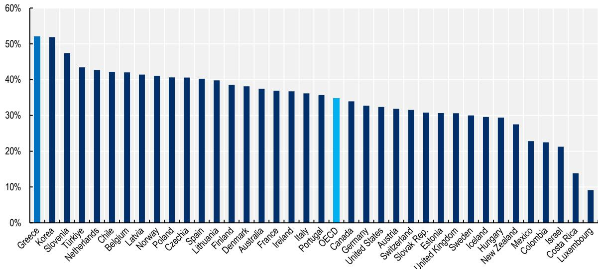  
Source: OECD, Enrolment rate by age, https://data-explorer.oecd.org/s/41k.

The European sovereign debt crisis (from late 2009) had lasting consequences for the education-to-employment trajectories of young people in Greece. By 2013, youth unemployment (ages 15-24) had peaked at almost 60%. More recently, unemployment among graduates ages 25-34 in 2024 stood at 12%, which is significantly higher than the OECD average (5%) (see Figure 5.2).

Beyond persistently high unemployment rates, Greece faces a pronounced and enduring mismatch between graduate skills and labour market needs, a challenge that was likely exacerbated by the economic crisis. The phenomenon of overqualification, often referred to as “brain waste,” occurs when highly educated individuals are employed in positions that do not utilise their skills, which can lead to reduced productivity, wage stagnation, and diminished job satisfaction. Among tertiary educated aged 20-34, the overqualification rate has followed a rising trend since 2010, before showing signs of decline and stabilisation in recent years, although still significantly surpassing the stable EU 27 average. In 2024, 37% of highly educated Greek citizens in the age group 20-34 was overqualified for their job, compared with an average of 22% across the EU (Figure 5.2, Panel B).

Figure 5.2. Overqualification and unemployment rates of young professionals in Greece are above the EU/OECD averages

Unemployment rate (Panel A) and overqualification among young tertiary educated (Panel B) (%), Greece and EU 27, 2024

A. Unemployment among tertiary educated, aged 25-34

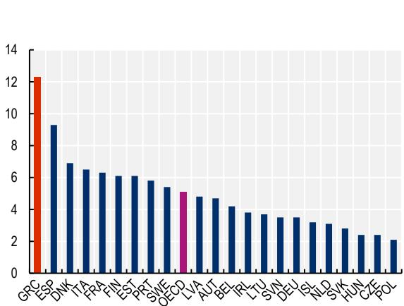

B. Overqualification among youth aged 20-34  
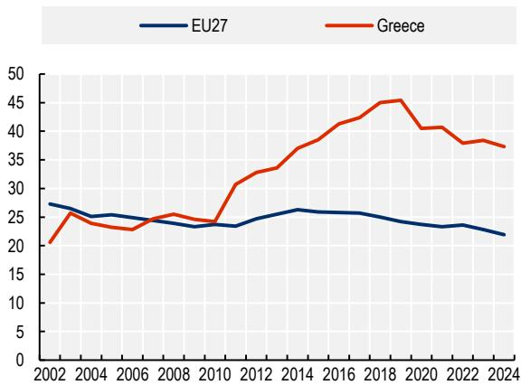

Note: Unemployment rates are for 2024 except for Iceland (2023). Over-qualified employed people are defined as persons with tertiary level educational attainment working in low- or medium-skilled occupations. Note that the age groups across Panel A and Panel B are not the same. Source: OECD, Unemployment rates of adults, by educational attainment, age group and gender, https://data-explorer.oecd.org/s/41l and Eurostat.

## Greek students' enrolment in higher education abroad is above the OECD average

When it comes to international student mobility, data show that among all tertiary students from Greece, the share of Greek students enrolled in higher education abroad has consistently remained above the OECD average and slightly above the EU averaged over the past decade. Just under one in 20 Greek students was enrolled in a higher education programme abroad in 2023. Between 2020 and 2023, however, Greece recorded a slight decline in the number of students studying abroad, in contrast with a modest increase observed across the European Union as a whole.

Greece also consistently exhibits a relatively high share of national tertiary students enrolled abroad compared with other Southern European OECD countries. In 2022, 3.9% of Greek students pursued higher education abroad, a figure surpassed by Portugal (4.7%) but higher than Italy and Spain (see Figure 5.3).

Figure 5.3. International student mobility from Greece has remained relatively stable, with a slight decline in recent years

Share of national tertiary students enrolled in tertiary education abroad (%), 2015-2023

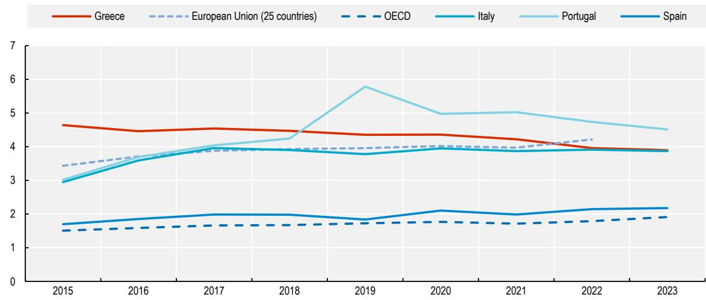  
Source: OECD (2025), Education at a Glance 2025: OECD Indicators, https://doi.org/10.1787/1c0d9c79-en.

The United Kingdom remains the leading destination country for Greek students, but other European countries are becoming increasingly attractive.

Over the last decade, the United Kingdom has stood as the principal destination for Greek students studying abroad, reflecting its globally recognised universities, the dominance of English-language instruction, and, until recently, its accessible position within the European Union. Behind the United Kingdom, Germany and Bulgaria followed, each attracting around 4 400 Greek students (see Figure 5.4). The Netherlands emerged as a major destination with a little over 3 800 students, pointing to its growing appeal across Europe for English-taught programmes. Türkiye (around 2 600), France (around 2 500) and the United States (around 2 200) also played notable roles in attracting Greek students. Italy and Romania accounted for more modest shares, with about 1 700 and 1 000 Greek international students respectively.

Figure 5.4. The United Kingdom remains the leading destination country for Greeks undertaking tertiary studies abroad  
Number of mobile students of Greek origin enrolled in tertiary education abroad, 2022  
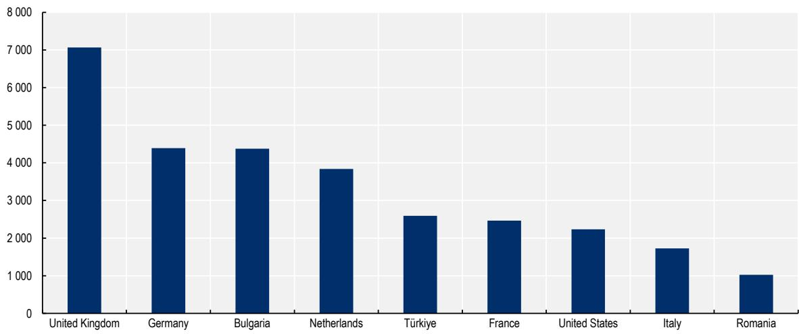  
Source: OECD (2025), Education at a Glance 2025: OECD Indicators, https://doi.org/10.1787/1c0d9c79-en.

However, the withdrawal of the United Kingdom from the EU has contributed to a structural shift in Greek student mobility patterns. While total enrolments remained relatively stable between 2014 and 2018, at around 10 000 Greek students per year, a gradual decline began in 2019, preceding the formal introduction of international-fee status for EU students in 2021. This modest but consistent reduction suggests that Greek students may have started adjusting their destination choices in anticipation of Brexit-related changes, as uncertainty about future fee levels, visa conditions and overall study prospects in the United Kingdom increased following the 2016 referendum. The decline intensified sharply in 2022, when enrolments fell to around 7 000 (Figure 5.5). Across the EU, Brexit led to a significant contraction in student inflows to the United Kingdom, driven by the loss of home-fee status, access to UK student loans and free-movement rights. Between 2020/21 and 2023/24, new EU enrolments fell by $57\%$ , one of the steepest declines in decades. Although the largest reductions were recorded among Romanian and Polish students, Greece also experienced a substantial fall in enrolments, consistent with broader post-Brexit trends (Migration Observatory, 2025[8]).

Figure 5.5. The United Kingdom experienced a sharp decline in Greek student enrolment in 2022
Number of mobile students of Greek origin enrolled in tertiary education in the United Kingdom, 2014-2022  
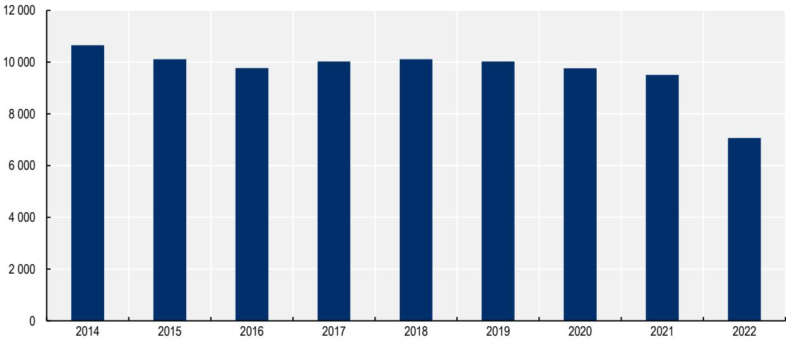  
Source: OECD (2025), Education at a Glance 2025: OECD Indicators, https://doi.org/10.1787/1c0d9c79-en.

Enrolment of Greek students in tertiary education in Italy has also declined sharply over the past decade, falling to around half of its 2014 level by 2022. (Figure 5.6). In contrast, both Bulgaria and the Netherlands have experienced substantial and sustained increases, with Greek student numbers nearly doubling since 2014. Bulgaria's rise has been steady and uninterrupted, placing it alongside Germany as a leading destination by 2022, while the Netherlands has accelerated particularly after 2019, approaching the levels of the top destinations. Germany has also seen notable step-increases, especially in 2018 and 2020, reinforcing its position as a major hub for Greek students. Meanwhile, enrolments in the United States have remained relatively stable over the period.

According to the National Statistical Institute of Bulgaria (2024[9]), Greece was the leading country of origin among foreign students in Bulgarian higher education in the 2023/24 academic year, accounting for $21\%$ of all international students, with most enrolled in health-related fields and nearly half studying medicine. Greek doctoral candidates also represent a sizeable share of Bulgaria's foreign PhD population $(17\%)$ , second only to China. Together, these developments point to a broader rebalancing of Greek student mobility away from long-standing destinations like Italy and toward a cluster of countries, particularly Bulgaria, Germany and the Netherlands, that offer attractive academic pathways, including the expansion of English-taught programmes in Germany and the Netherlands and well-established, affordable medical and health-related study options in Bulgaria.

Figure 5.6. Germany, Bulgaria and the Netherlands have seen rising enrolment of Greek students
Number of Greek international students studying in selected destination countries, 2014-2022  
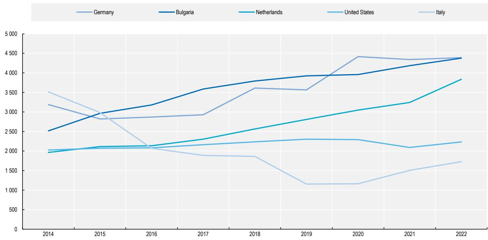  
Note: Five of the ten most common destination countries for Greek students completing tertiary education abroad were selected for analysis, with particular attention given to countries exhibiting notable trends or shifts in student mobility patterns.
Source: OECD (2025), Education at a Glance 2025: OECD Indicators, https://doi.org/10.1787/1c0d9c79-en.

## Enrolment abroad by degree type has remained stable over time

Between 2013 and 2022, the number of Greek students enrolled in higher education abroad evolved differently across degree types. Bachelor's enrolments grew steadily from 11 399 in 2013 to a peak of 14 654 in 2021, before easing slightly in 2022 (Figure 5.7). PhD enrolments followed a similar upward trajectory, rising from 3 193 in 2013 to 4 461 in 2021, with a modest decline thereafter. Master's programmes continued to attract the largest number of Greek students abroad throughout the period, although overall enrolments remained relatively stable, fluctuating only marginally from year to year.

Figure 5.7. Greek students' enrolment in bachelor's degrees has increased modestly in recent years  
Greek students' enrolment abroad by degree type, 2013-2022  
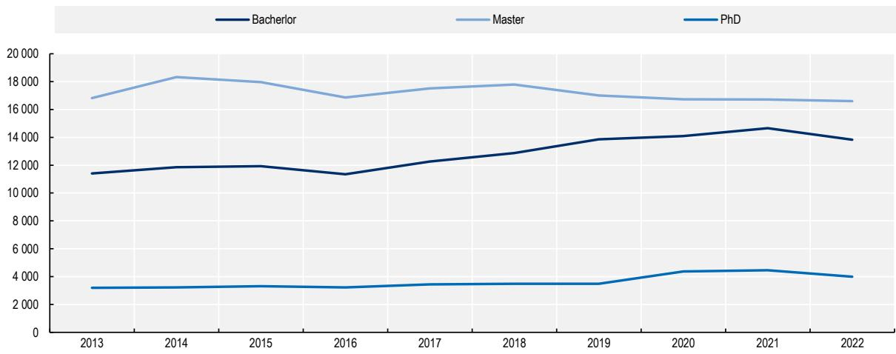  
Source: OECD (2025), Education at a Glance 2025: OECD Indicators, https://doi.org/10.1787/1c0d9c79-en.

At the bachelor's level, the United Kingdom dominates as the primary destination, hosting nearly one in three Greek undergraduates abroad (32%), followed by Türkiye (12%) and the Netherlands (10%) (see Figure 5.8). For master's programmes, the pattern becomes more diversified: Bulgaria (20%) and the Netherlands (15%) attract substantial shares, and Germany (13%) and the United Kingdom (10%) remain important destinations as well. At the doctoral level, the United Kingdom again leads (25%), with France (9%) emerging as significant hosts for advanced research training. These variations suggest that Greek students' choices are shaped by both linguistic and institutional factors, favouring English-speaking systems for undergraduate and doctoral study, and a wider range of European destinations for postgraduate education.

Figure 5.8. Greek students favour the United Kingdom for undergraduate and PhD degrees  
Greek tertiary students studying abroad, by destination and degree type, as a share of all Greek outbound students by degree type, 2022  
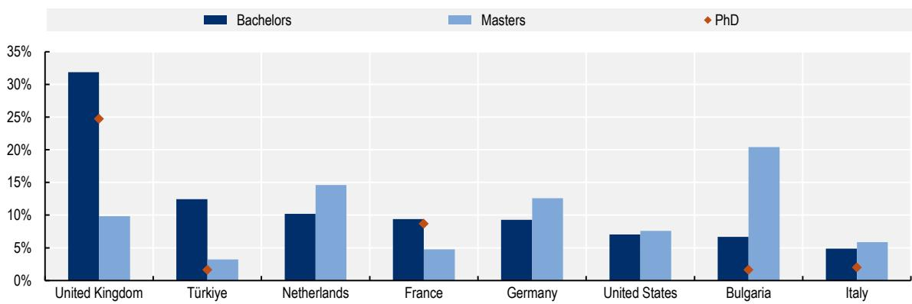  
Note: Data is not available regarding doctoral enrolment for the Netherlands, Germany and the United States. Source: OECD (2025), Education at a Glance 2025: OECD Indicators, https://doi.org/10.1787/1c0d9c79-en.

Over the past decade, the destination choices of Greek bachelor students abroad have undergone notable shifts in the United Kingdom and the Netherlands. While remaining a top destination, the share of those studying in the United Kingdom declined steadily from 42% in 2013 to 32% in 2022 (see Figure 5.9). In contrast, the Netherlands has emerged as an increasingly attractive destination, with its share rising more than threefold, from 3% to 10% over the same period. This trend is likely driven in part by the expansion of English-taught programmes in Dutch institutions, and changing cost and access dynamics in the United Kingdom following Brexit as discussed above.

Figure 5.9. Greek enrolment in bachelor's programmes abroad has been rising in the Netherlands and declining in the United Kingdom

Share of Greek bachelor students enrolled in the Netherlands (left) and the United Kingdom (right) among all Greek students enrolled in bachelor studies abroad, 2013-2022

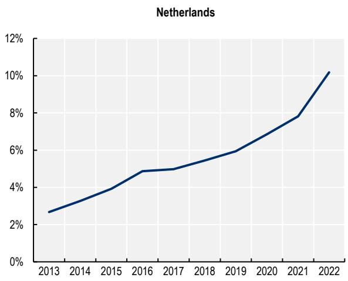

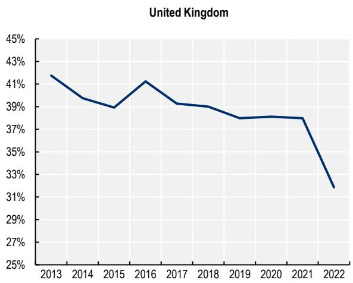  
Source: OECD (2025), Education at a Glance 2025: OECD Indicators, https://doi.org/10.1787/1c0d9c79-en.

The sharp decline in the number of Greek students in the United Kingdom is even more pronounced among master's students, dropping from one in four Greek master's students abroad in 2013 to one in ten in 2022 (see Figure 5.10). Over the same period, Bulgaria consolidated its position as a key destination, with enrolment shares doubling from $10\%$ to $20\%$ , while the Netherlands also gained prominence, increasing from $9\%$ to $15\%$ . Italy, once a notable destination, experienced a substantial decrease, falling from $14\%$ in 2013 to under $6\%$ in 2022.

Figure 5.10. Bulgaria and the Netherlands are emerging as primary destinations for Greek students completing their master's degree abroad

Share of Greek master students enrolled in selected destination countries among all Greek students enrolled in master studies abroad, 2013-2022

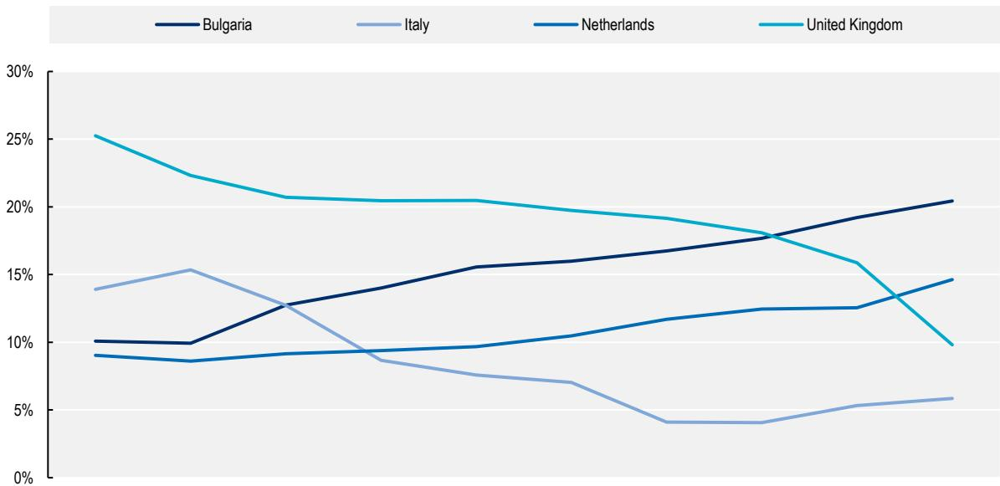  
Note: Among the most common destination countries for Greek students completing tertiary education abroad, these were selected for analysis, with particular attention given to countries exhibiting notable trends or shifts in student mobility patterns.
Source: OECD (2025), Education at a Glance 2025: OECD Indicators, https://doi.org/10.1787/1c0d9c79-en.

## The emigration of Greek doctoral holders

In the absence of a single dataset that comprehensively tracks Greek researchers abroad and at home, this section first uses PhD holders as a proxy for the research workforce, focussing on two complementary populations: (i) Greek-born PhD holders currently residing in other OECD countries, based on OECD DIOC data, and (ii) all newly graduated PhD holders from Greek universities (a group composed overwhelmingly of Greek citizens) based on a compulsory survey for all PhD graduates graduating from Greek universities (see Box 5.1). Although not all doctorate holders pursue academic careers, PhD graduates form the principal pipeline into research-intensive occupations, and their international distribution closely mirrors the opportunities and pathways that shape later research mobility. Mapping where Greek-born PhD holders live abroad indicates the size and location of the potential research talent pool outside Greece, while trends among new PhD graduates in Greece illuminate emerging supply and mobility intentions at home. Together, these perspectives complement the following section, which identifies Greek researchers abroad primarily through author-based (publication-affiliation) data.

## The United States, the United Kingdom and Germany are the top destinations of Greek doctoral holders

Based on DIOC 2020/21, more than 17 200 Greek doctorate holders were identified across OECD countries, not including the United Kingdom, for which a comparable educational breakdown is unavailable in that year. The geographical distribution of Greek doctorate holders is concentrated in a small number of OECD countries, with the United States, the United Kingdom and Germany standing out as the principal destinations. In 2020/21, the United States hosted by far the largest number, close to 7 000 Greek PhD holders, followed by Germany with around 3 000. For the United Kingdom, detailed educational breakdowns are not available for 2020/21; however, earlier data (2015/16) indicate that the United Kingdom hosted more than 3 000 Greek doctorate holders, consistent with its historical role as a major hub. Complementing this picture, national UK statistics show that Greek nationals are among the top nationalities employed by UK universities, with 3 910 academic staff of Greek nationality in 2022/23, the seventh-largest international group (Universities UK, n.d.[10]). Beyond these leaders, other continental European countries, including Switzerland, France and Sweden, each hosted between 500 and 1 500 Greek doctorate holders, with numbers dropping off sharply outside the top five (see Figure 5.11).

Greek doctorate holders also account for a sizable share of the overall Greek emigrant population in several destinations. In Ireland, Switzerland, Denmark and Sweden, between 8% and 15% of Greek emigrants hold a doctoral degree, pointing to a selective emigration pattern in which highly educated Greeks are over-represented in countries with strong research systems and high demand for advanced skills. Taken together, these patterns suggest that Greek PhD holders are both numerous and geographically concentrated in robust research and innovation ecosystems.

Figure 5.11. Number and share of Greek PhD holders in OECD countries in 2020/21 and 2015/16  
The number of Greek PhD holders and the share of PhD holders as percentage (%) of total emigrants in destination countries hosting more than 150 Greek PhD holders, 2020/21  
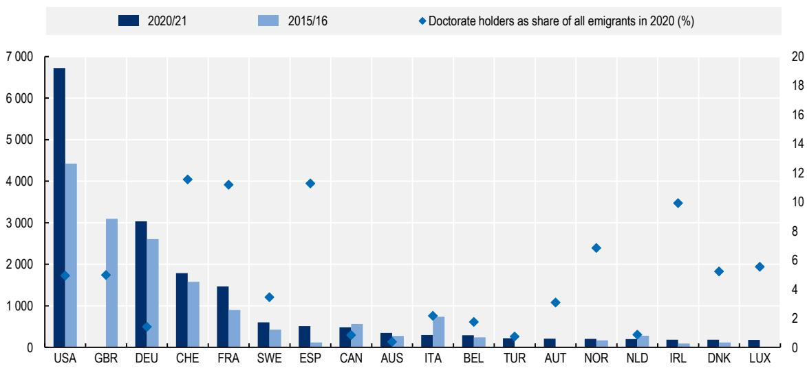  
Note: The graph shows destination countries hosting at least 150 Greek PhD holders in 2020/21. Detailed breakdowns for Great Britain are not available in the 2020/21 data, and the share of doctorate holders as percentage of all emigrants in the United Kingdom is based on 2015/16 data. Source: OECD Database on Immigrants in OECD Countries (DIOC), 2020/21 and 2015/16.

The age distribution of Greek PhD-holder emigrants shows a broad spread across the life course, but with a clear concentration in mid-career. Individuals aged 35-44 account for nearly one in three (32%), making this group the single largest segment (see Figure 5.12). The remaining age groups are more evenly distributed: 15% are aged 25-34, 20% are 45-54, 14% fall within 55-64, and 19% are aged 65 or over. The high concentration of PhD-educated emigrants aged 35-44 represents a potentially significant pool of mid-career researchers who could contribute to Greece's brain-regain efforts.

Figure 5.12. One in three Greek emigrants with a PhD is aged 35-44
Age distribution of Greek emigrants who are PhD holders, ages 25-65+, OECD countries, 2020/21  
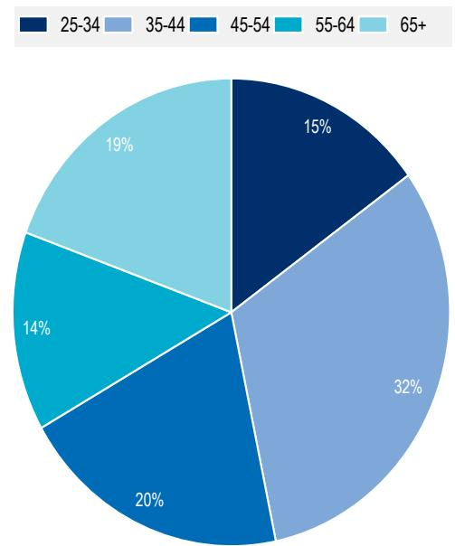  
Source: OECD Database on Immigrants in OECD Countries (DIOC), 2020/21.

International mobility intentions are strongest among recent PhD graduates in science and technology

According to an EKT survey conducted with all recent PhD holders graduating from Greek universities, Greece awarded 2 042 doctoral degrees in 2024 (National Documentation Center (EKT), 2022[11]). In the same year, $15\%$ of graduates indicated an intention to relocate abroad in the near future. This number has been relatively consistent across recent years (2021 - 2024), with about one in seven new Greek PhD holders intending to settle abroad (see Figure 5.13).

Figure 5.13. About one in seven new Greek PhD holders intend to settle abroad  
Percentage distribution of new PhD holders based on their intention to settle abroad, 2021-2024 (as percentage of responses), Greece, 2021-2024  
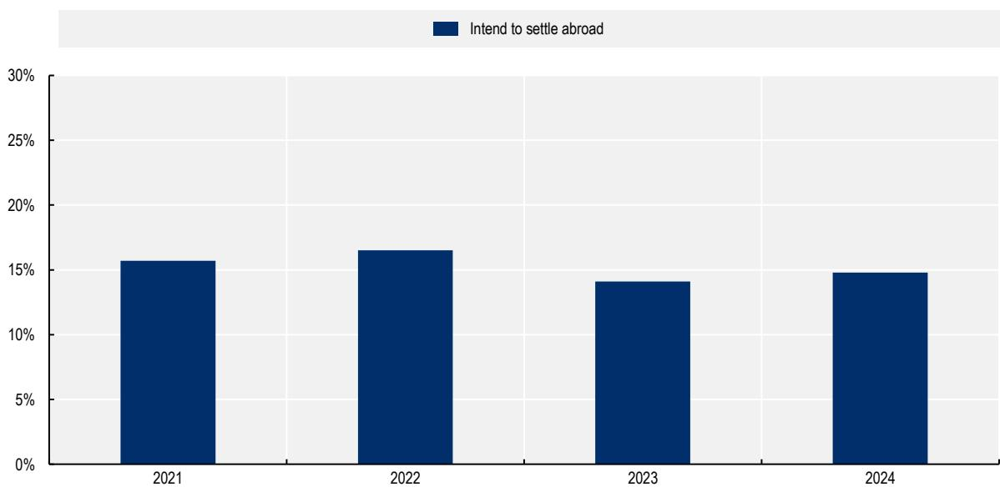  
Source: National Documentation Centre (2022[11]).

Among PhD holders considering permanent settlement abroad, the largest shares are found among those with degrees in natural sciences and engineering and technology, suggesting strong international mobility potential in science and technology fields (see Figure 5.14). The data further shows a steady increase in the share of PhD holders in the natural science fields intending to move abroad, from 29% in 2021 to 35% in 2024. Medical and health sciences degree holders remained the second-largest group intending to move abroad, with shares fluctuating between 21% and 27% over the same period. In contrast, engineering and technology degree holders showed lower intentions to move abroad over time (between 19% and 23%), while those with degrees in social sciences and humanities displayed lower interest in moving abroad overall, and more marked year-to-year volatility in intentions. These trends highlight the predominance of scientific and technical disciplines among prospective emigrant PhD holders from Greece, in line with broader international mobility patterns of highly skilled researchers.

Figure 5.14. Over half of PhD holders intending to settle abroad studied natural sciences or medical and health sciences

Percentage distribution of new PhD holders by intention to settle abroad and scientific field of dissertation (as a percentage of those intending to settle abroad), Greece, 2021-2024

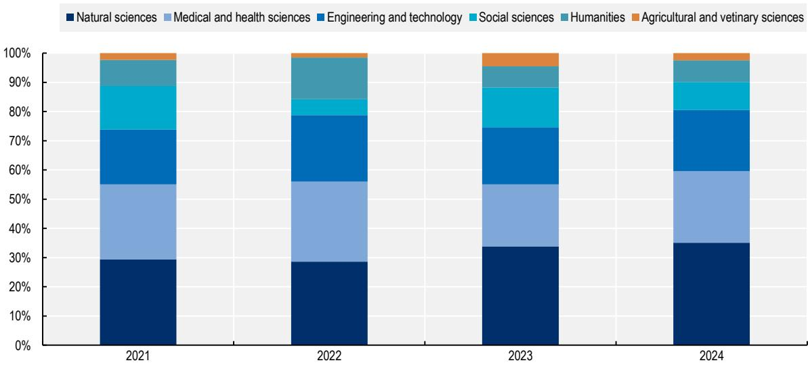  
Source: National Documentation Centre (2022[11]).

Among new PhD holders from Greece intending to settle permanently abroad, the continuation of research activity remains the primary motivation, though its relative importance decreased sharply in 2024 (see Figure 5.15). Between 2021 and 2023, this reason accounted for over 40% of prospective emigrants, peaking at 46% in 2023, before declining to 36% in 2024. The share citing academic career opportunities rose from 21% in 2021 to 25% in 2024, indicating a sustained link between international mobility and career advancement in higher education and research. Meanwhile, intentions driven by other professional employment outside research remained stable, representing roughly one-quarter of respondents. Family or personal reasons and other factors continued to play a comparatively minor role.

Figure 5.15. Continuation of research activity and pursuing one's academic career are the leading reasons for Greek PhD holders to settling abroad

Percentage distribution of new PhD holders by reason for intending permanent settlement abroad (as a percentage of those intending to settle abroad), Greece, 2021-2024

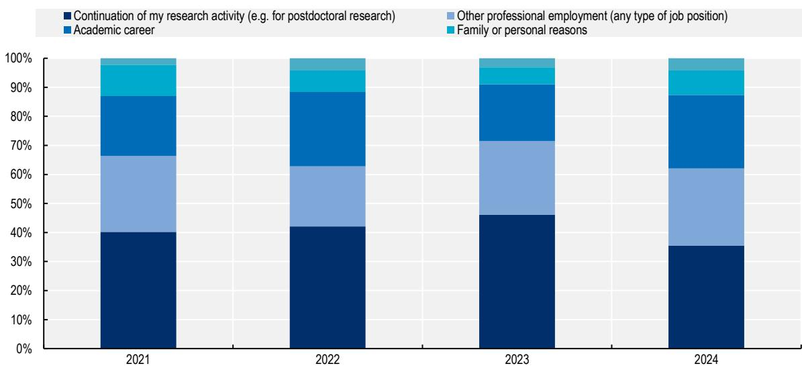  
Source: National Documentation Centre (2022[11]).

Among new PhD holders expressing an intention to settle abroad, the distribution by destination shows notable variation over the 2021-2024 period. Other EU member states consistently account for the largest share, increasing from 31% in 2021 to 33% in 2024 (see Figure 5.16). The proportion of graduates uncertain about their future destination rose sharply from 16% in 2021 to 28% in 2023 before declining to 22% in 2024. The United States and the United Kingdom remain key destinations, though both show fluctuations: the share moving to the United States decreased from 15% in 2021 to 8% in 2023 before rebounding slightly to 11% in 2024, while the United Kingdom declined from 15% to 9% over 2021-2023 and recovered to 13% in 2024. Germany maintained a relatively stable share around 9-10%.

Figure 5.16. The United States, the United Kingdom, and Germany are the leading destinations of interest for Greek PhD holders intending to settle abroad

Percentage distribution of new PhD holders by country of potential permanent settlement (as percentage of those intending to settle abroad)

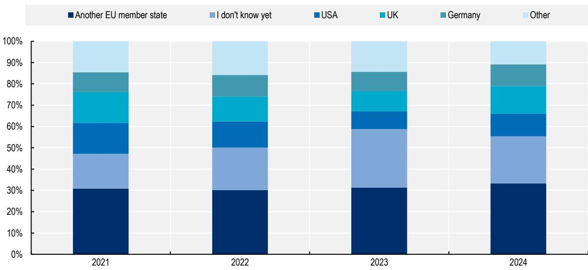  
Source: National Documentation Centre (2022[11]).

Among new PhD holders planning to move abroad, the balance between those with secured employment and those still seeking opportunities has changed between 2021 and 2024. In 2021, just over half (51%) of intending movers had already obtained a job abroad. However, the proportion of graduates with confirmed positions abroad declined to 40% in 2023, before increasing to 44% in 2024. Taken together with rising rates of individuals uncertain about their destination abroad (although still intending to move abroad), these patterns may indicate that an increasing number of new PhD holders are considering international mobility prior to securing employment. This underscores a sustained interest in the global labour market, even in the absence of a confirmed job offer.

## Insights into the return of Greek PhD holders

This section examines return migration among Greek PhD holders, whose mobility and reintegration patterns may differ from those of return migrants overall. Doctoral graduates follow highly specialised academic and professional career paths and face distinct constraints related to research funding, institutional opportunities and international competition.

## Return among Greek PhD holders is concentrated among mid-career professionals returning from Europe

According to the 2021 Greek Population Census, just over 3 000 Greek-born doctoral graduates returned to Greece in the five years preceding the census. The age profile of returnees shows a strong concentration in yearly to mid-career groups: nearly half were aged 30-39 (46%), followed by 34% aged 40-49 (see Figure 5.17). Younger doctoral holders (20-29) represented 6% of returns, while those aged 50-59 accounted for 8%, and smaller shares were observed among older cohorts (4% aged 60-69). This pattern suggests that return migration among doctoral graduates is primarily driven by individuals in the early- to mid-career stages. While return migrants overall are predominantly in the 20-39 age range (as shown in

Source: Hellenic Statistical Authority (ELSTAT), 2011 and 2021 Population and Housing Census: Statistical Data on Greece (Greek and Foreign Citizens), Athens.

Note: Due to the fact that the reference population is comprised of persons settled down in Greece from abroad during the last five years before the Census 2021 reference date, 2021 covers the period 1.1.2021-2022.10.2021, whereas 2016 cover the period 23.10.2016-2031.12.2016. Return migrants include Greek citizens previously abroad who returned in the five years prior to data collection.

Chapter 4, Figure 4.4), doctoral degree holders form a comparatively older return cohort reflecting the fact that highly educated emigrants tend to come back later in their careers, particularly given that many PhD students studying abroad are less likely to complete their studies before age 30.

A similar number of PhD holders returned in the period 2006 and 2011. Returning PhD holders in this period were somewhat younger: 13% were aged 20-29 and 57% were aged 30-39, while only 18% fell into the 40-49 group. Smaller shares were observed among those aged 50-59 (6%), 60-69 (4%), and 70-79 (1%). This earlier period therefore shows a more concentrated return flow among those under 40, in contrast to the more recent 2016-2021 trend, in which a larger share of doctoral returnees are in their 40s. Taken together, the two periods suggest that highly educated emigrants may now be spending longer time abroad before returning, either due to extended doctoral and postdoctoral trajectories, or evolving labour market and career conditions that shape when return becomes feasible or attractive.

## Figure 5.17. Four in five returning Greek doctoral holders are between the ages of 30-49

Distribution of Greek citizens born in Greece who returned to Greece with doctoral degrees in the five years prior to the census by age, ages 20-69, 2021 and 2011 census  
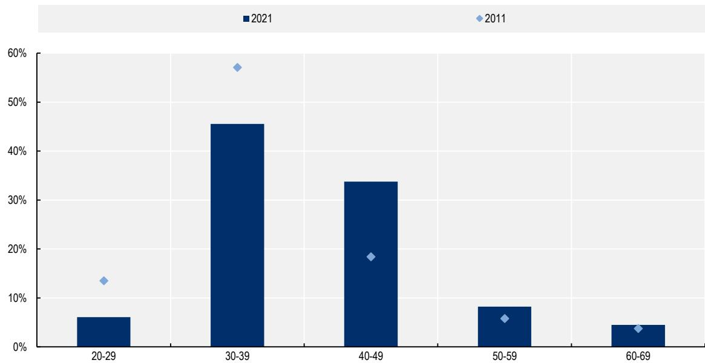

Return among Greek PhD holders is overwhelmingly concentrated in European countries. Just over four in ten returned from European countries outside the EU (43%), making this the single largest group, followed closely by returnees from EU countries (41%) (see Figure 5.18). The high share originating from non-EU European countries likely reflects post-Brexit shifts in mobility patterns as the United Kingdom is hosting an important share of highly educated Greek emigrants. This pattern aligns closely with the distribution of Greek PhD holders abroad documented earlier in this chapter, where Europe, particularly countries such as Germany and the United Kingdom, hosts a substantial share of Greece's doctoral-level emigrant population. The prominence of European origins among returnees underscores the importance of intra-EU academic mobility corridors, where institutional compatibility, geographic proximity and established research networks appear to facilitate return at the doctoral level.

At the same time, returns from the North America are comparatively limited when benchmarked against the strong presence of Greek PhD holders in the region, and particularly in US research institutions. While the United States represents one of the largest destinations for Greek doctoral-level emigration and hosts a significant share of Greek PhD holders abroad (Figure 5.11), a relatively limited proportion of returning PhD holders (11%) report prior residence in North America. This divergence suggests that doctoral-level emigration to the United States and Canada is more likely to translate into longer-term or permanent settlement.

Returns from other world regions were comparatively limited: 3% came from countries in Asia, 1% from Africa, and 1% from the Caribbean, Central, and South America, while returns from Oceania accounted for virtually none.

In 2006-2011, as captured in the 2011 census, returns were overwhelmingly concentrated among doctoral graduates coming from EU countries (77%) (which at the time included the United Kingdom), with only a very small share returning from European countries outside the EU (3%). Returns from North America (17%), Asia (2%), and Africa (1%) were limited but present, while virtually no returns came from the Caribbean, South and Central America, or Oceania.

## Figure 5.18. Over four in five returning Greek PhD holders are coming from Europe

Distribution of Greek citizens born in Greece who returned to Greece with doctoral degrees in the five years prior to the census by region of previous residence, 2021 and 2011 census

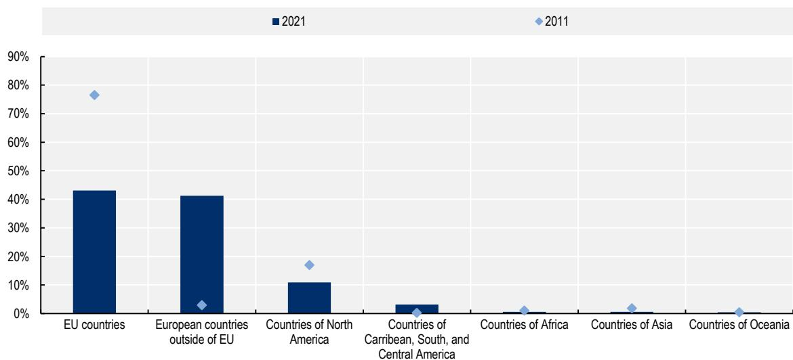  
Note: Due to the fact that the reference population is comprised of persons settled down in Greece from abroad during the last five years before the Census 2021 reference date, 2021 covers the period 1.1.2021-2022.10.2021, whereas 2016 cover the period 23.10.2016-2031.12.2016. Return migrants include Greek citizens previously abroad who returned in the five years prior to data collection. In the 2021 census, the United Kingdom is classified as a non-EU European country following Brexit. As a result, part of the observed increase in returns from non-EU European countries over time reflects changes in country classification rather than a shift in destination patterns.
Source: Hellenic Statistical Authority (ELSTAT), 2011 and 2021 Population and Housing Census: Statistical Data on Greece (Greek and Foreign Citizens), Athens.

Among returning emigrants in 2021 with doctoral degrees, repatriation emerges as the predominant driver of return, accounting for 47% of all cases (see Figure 5.19). A further 29% cited work-related reasons, indicating that professional opportunities in Greece continue to draw back a substantial share of highly educated individuals. Family reunification played a meaningful (though smaller) role, motivating 13% of returns. Other motivations were less common: 6% returned for reasons classified as “other,” and 4% cited studies as their primary reason for coming back.

Figure 5.19. Just under half of Greek PhD holders return for the purpose of repatriation  
Distribution of Greek citizens born in Greece who returned to Greece with doctoral degrees in the five years prior to the census by reason for return, 2021 and 2011 census  
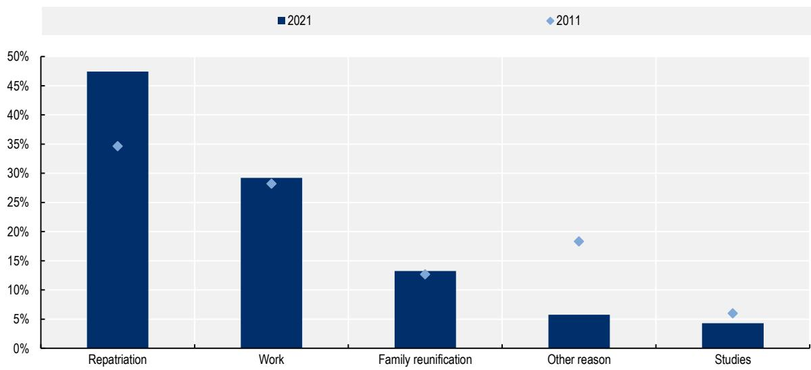  
Note: Due to the fact that the reference population is comprised of persons settled down in Greece from abroad during the last five years before the Census 2021 reference date, 2021 covers the period 1 January 2021 to 22 October 2021, whereas 2016 cover the period 23 October 2016 to 31 December 2016. Return migrants include Greek citizens previously abroad who returned in the five years prior to data collection.
Source: Hellenic Statistical Authority (ELSTAT), 2011 and 2021 Population and Housing Census: Statistical Data on Greece (Greek and Foreign Citizens), Athens.

## Greek-origin scientific diaspora and researcher mobility patterns

Interest in the Greek scientific diaspora has intensified in recent years, reflecting concerns about the scale, location and implications of scientific talent working outside Greece. Building on the preceding proxy analysis based on PhD holders, this section turns to researcher-centred evidence to examine where Greek and Greek-origin scientists are located and how they move across research systems.

The analysis draws on two complementary sources. First, the OECD Scientific Author Mobility Database provides internationally comparable indicators of inflows, outflows and returnees based on publication affiliations, offering insight into institution-to-institution mobility connected to Greece. As detailed in Box 5.2, these indicators are affiliation-based and should not be interpreted as direct measures of emigration or return of Greek-born or Greek-origin researchers. Second, the Comprehensive Mapping of Local and Diaspora Scientists database applies a broader diaspora definition than applied elsewhere in the chapter, identifying roughly 64 000 scientists of Greek origin, including both Greek-born researchers and second- and later-generation diaspora scientists, regardless of nationality or place of birth, and documents their geographic distribution, fields and citation impact.

Together, these sources move beyond a doctorate-holder perspective to focus on actively publishing and collaborating scientists, while clearly distinguishing between migration-based, affiliation-based and ancestry-based concepts of mobility. By combining these approaches, with different scopes and limitations, the section provides a complementary view of the size, location and mobility patterns of Greek-affiliated and Greek-origin scientific talent, with particular attention to high-impact researchers and the role of the diaspora.

## Box 5.2. OECD database on international mobility of scientific authors

This box presents evidence on the international mobility of scientific authors based on OECD indicators derived from publication affiliations. These data provide a complementary perspective to the analyses elsewhere in this chapter, which focus on Greek-born PhD holders and researchers of Greek origin identified through census, bibliometric and demographic approaches.

Unlike migration-based indicators, the OECD scientific author mobility database tracks changes in the institutional affiliation reported in scientific publications, rather than researchers' country of birth, nationality, or ancestry. Mobility episodes are identified when an author's main recorded affiliation changes from one country to another between publication periods. As a result, these indicators capture institutional mobility linked to research employment, not population movements of researchers themselves.

This methodological distinction is important. Affiliation-based indicators:

\- Do not identify all Greek researchers abroad, as they exclude scientists who do not publish during the observation window;

\- Do not measure inflows or outflows of Greek-born or Greek-origin researchers;

\- May miss mobility that does not immediately result in a change in publication affiliation; and

\- May understate movements in contexts where researchers retain foreign affiliations or hold multiple affiliations simultaneously.

The latter is particularly relevant for Greece, where reforms introduced after 2019 expanded the possibility for researchers to maintain foreign affiliations while being employed domestically, including dual or visiting appointments. As a result, affiliation-based indicators may not fully capture return movements that occur without a corresponding shift in publication records.

Within these constraints, the indicators nonetheless provide useful insights into the direction and relative intensity of institution-to-institution mobility flows connected to Greece. According to the OECD database on scientific author mobility, Greece recorded relatively low inflows of scientific authors in 2021. Less than 2% (1.96%) of Greek-affiliated authors were classified as newly inflowing, while 2.21% were identified as returnees (see Figure 5.20). Despite modest inflows overall, Greece stands out for its comparatively high share of returning scientific authors, exceeding the OECD average and surpassing several large research systems such as Germany, France and the United States. Within the OECD, only a small number of countries, notably Iceland, Costa Rica and Israel, reported higher returnee shares in that year.

At the same time, outflows from Greece reached 5.02% in 2021, resulting in a negative net flow of -0.85 percentage points (p.p.). This places Greece among a group of OECD countries where more affiliated scientific authors left than arrived or returned, indicating ongoing net losses in affiliation-based scientific mobility. These patterns should be interpreted as reflecting institutional affiliation dynamics, rather than definitive evidence on the scale or composition of Greek researcher emigration or return.

Figure 5.20. Inflows and outflows of scientific authors by last main recorded affiliation (%), 2021  
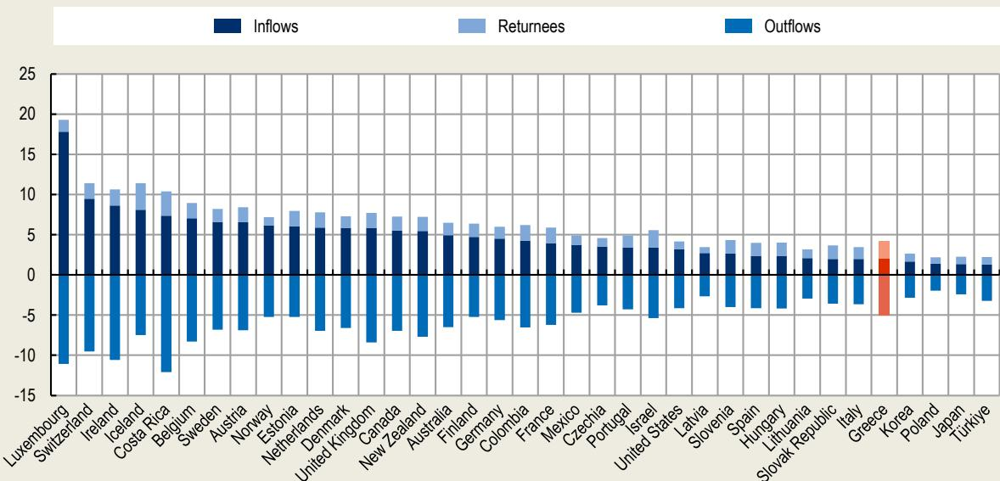  
Note: This dataset identifies the international mobility of scientific authors using Scopus Author IDs, focussing on authors with two or more publications. Mobility episodes are defined when an author's affiliation in 2021 differs from their prior recorded affiliation in a different country. Source: OECD (2025), OECD Scientific Author Mobility Database, https://www.oecd.org/en/topics/research-careers-and-mobility.html.

## Over two in five scientists of Greek origin are located abroad

This section draws on the bibliometric study and database developed by Ioannidis et al. (2021[4]), which applies a broad and inclusive definition of the Greek scientific diaspora. In contrast to most other parts of this chapter, which focus on Greek-born PhD holders or migration-based indicators, this approach identifies scientists of Greek origin regardless of country of birth, nationality or generation, including both Greek-born researchers and second- and later-generation diaspora scientists (see Box 5.1 for more information about the definition of Greek-origin scientists). The objective is to capture the full global footprint of Greek-origin scientific talent actively engaged in research and publishing.

Using this broad definition, Ioannidis et al. (2021[4]) assemble a comprehensive inventory of 63 951 scientists of Greek origin who meet a minimum productivity threshold based on Scopus publication records. Of these, 35 116 scientists $(56\%)$ are affiliated with institutions in Greece, while 28 058 $(44\%)$ are affiliated with institutions abroad, forming a sizeable Greek-origin scientific diaspora. The authors further estimate that the true number of Greek-origin scientists satisfying the productivity criteria may lie between 80 000 and 100 000, suggesting that, if fully captured, diaspora-based scientists could constitute the majority of high-productivity researchers of Greek origin worldwide.

Among scientists of Greek origin affiliated abroad, the United States emerges as the principal destination, hosting approximately 9 500 researchers, equivalent to 33% of the measured Greek-origin scientific diaspora (see Table 5.1). The United Kingdom follows with 22%, and Germany with 7%, underscoring the strong presence of Greek-origin scientists in leading English-speaking and European research systems. Other important destination countries include Switzerland, France, Canada and Australia, each accounting for roughly 3% of the diaspora captured in the study. This distribution mirrors broader patterns of Greek international mobility, with concentration in countries offering established research infrastructures, linguistic accessibility, and strong academic and professional opportunities.

In absolute terms, of the 28 058 Greek-origin scientists affiliated outside Greece, the largest numbers are found in the United States (9 339), the United Kingdom (6 165) and Germany (2 083). Smaller but still notable contingents are located in Cyprus (1 688), Australia (1 155), France (1 141), Canada (1 110) and Switzerland (994). Overall, the evidence points to a highly internationalised and globally dispersed Greek-origin scientific community, with strong representation across major research hubs in North America, Europe and Oceania.

## Table 5.1. The United States is the most common country of affiliation for Greek-origin scientists

Distribution of the Greek-origin scientists by top countries of affiliation, 2021

<table><tr><td>Country</td><td>Affiliated Greek-origin scientists</td></tr><tr><td>United States</td><td>9 339</td></tr><tr><td>Great Britain</td><td>6 165</td></tr><tr><td>Germany</td><td>2 083</td></tr><tr><td>Cyprus</td><td>1 688</td></tr><tr><td>Australia</td><td>1 155</td></tr><tr><td>France</td><td>1 141</td></tr><tr><td>Canada</td><td>1 110</td></tr><tr><td>Switzerland</td><td>994</td></tr><tr><td>The Netherlands</td><td>603</td></tr><tr><td>Sweden</td><td>559</td></tr><tr><td>Italy</td><td>558</td></tr><tr><td>Belgium</td><td>439</td></tr><tr><td>Spain</td><td>262</td></tr><tr><td>Austria</td><td>220</td></tr><tr><td>Denmark</td><td>199</td></tr><tr><td>Norway</td><td>166</td></tr><tr><td>Ireland</td><td>144</td></tr><tr><td>South Africa</td><td>137</td></tr></table>

Note: This table includes countries with over 100 affiliated Greek-origin scientific authors. Greek-origin scientific authors include both Greek-born scientists and second- and later-generation diaspora scientists.  
Source: Ioannidis (2021[4]), “Comprehensive Mapping of Local and Diaspora Scientists”, https://doi.org/10.1162/qss\_a\_00136.

## One in three Greek-origin scientists abroad works in biomedical research

Greek-origin scientists show some variation in their fields of work depending on whether they are based in Greece or abroad, although the overall disciplinary distribution remains broadly similar. Biomedical research is the most common field in both groups, but it accounts for a larger share among scientists affiliated in Greece (41%) than among those abroad (32%) (Figure 5.21).

By contrast, fields such as mathematics and statistics, economics and business, historical studies and engineering are more strongly represented among Greek-origin scientists abroad. This pattern suggests that international academic systems may provide more opportunities or more competitive research environments in these disciplines. Conversely, areas such as clinical medicine, ICT and earth and environmental sciences have a higher concentration of scientists working in Greece. Smaller fields, including psychology, communications and theology, constitute only a modest share of Greek-origin scientists overall but display slightly higher representation among those abroad.

Overall, these patterns indicate that while biomedical research remains dominant both domestically and abroad, Greek-origin scientists abroad are distributed across a wider range of scientific and scholarly fields. This reflects both the diversity of opportunities available internationally and the selective nature of outward mobility among Greek-origin academics.

Figure 5.21. Greek-origin scientists are concentrated in biomedical research  
Distribution of Greek-origin scientists by field (%), affiliated in Greece and abroad, 2021  
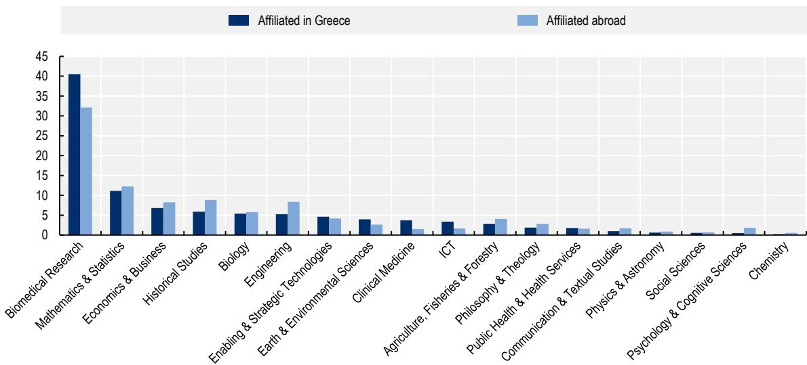  
Note: Greek-origin scientific authors include both Greek-born scientists and second- and later-generation diaspora scientists. Source: Ioannidis (2021[4]), “Comprehensive Mapping of Local and Diaspora Scientists”, https://doi.org/10.1162/qss\_a\_00136.

## Top-impact Greek-origin scientists are predominantly based abroad

The authors also assign each scientist to a “subfield ranking” based on normalised citation counts (or citation impact measures) relative to peers within the same scientific domain. In practice, the procedure involves aggregating a researcher’s citations (or suitably weighted citations) and comparing them against citation percentiles within the researcher’s assigned discipline or subfield. Scientists are then classified into impact tiers such as the top 20%, top 1%, or top 0.1% of their subfield.

According to this method, the distribution of Greek-origin scientists by impact tier reveals a pronounced concentration of top-performing scientists abroad. While 45% of those in the top 20% of their subfields remain in Greece, the majority (55%) are based abroad (see Figure 5.22). This trend becomes substantially more pronounced at higher tiers of scientific achievement: 80% of those in the global top 1% and 86% of those in the top 0.1% are part of the diaspora. Among the top 15 scientists of Greek-origin, an overwhelming 94% are located outside the country. On average, scientists abroad also tend to have more citations and higher rankings across all sciences and within their particular subfields (see Annex Table 5.A.2 in the Annex 5.A).

Figure 5.22. Top performing Greek-origin scientists are located abroad  
Comparative distribution of high-impact Greek-origin scientists affiliated in Greece and abroad, 2021  
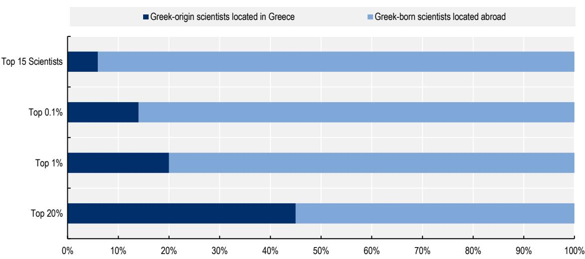  
Note: Greek-origin scientific authors include both Greek-born scientists and second- and later-generation diaspora scientists. Source: Ioannidis (2021[4]), “Comprehensive Mapping of Local and Diaspora Scientists”, https://doi.org/10.1162/qss\_a\_00136.

## The return of Greek researchers: Trends, drivers and barriers

Building on the analysis of student and researcher outward mobility in the preceding sections, this final part of the chapter examines the dynamics of return among Greek researchers and the factors that shape their decisions. Return migration has the potential to mitigate some of the pressures created by sustained emigration of highly skilled Greeks, and evidence shows that returning scientists can make a positive, albeit limited, contribution to domestic research and innovation performance (Labrianidis and Sykas, 2023[1]). While the inflow of highly skilled returnees can strengthen the national research base, these gains have not yet offset the broader losses associated with the departure of top talent.

Decisions to return are influenced by a distinctive set of incentives and constraints, including income levels, research funding and infrastructure, administrative burdens, and perceptions of meritocracy. Understanding these factors is essential for assessing the prospects of return and the potential for future engagement with the Greek-origin scientific diaspora.

Against this backdrop, this section reviews recent patterns of return among researchers and explores the motivations and barriers for the potential return of Greek-origin researchers abroad.

## Interest in return among Greek academics abroad is often shaped by academic position

While Census-based evidence captures realised return, survey data help identify the motivations and constraints shaping future return among Greek academics currently abroad. The remainder of the chapter examines the return prospects of Greek-origin academics currently employed abroad. It draws on findings from an online survey conducted by the Deon Policy Institute (2025[5]), which collected information on the profiles, career paths and return intentions of nearly 500 Greek-origin academics working in higher education institutions outside Greece (see Box 5.1). The survey targeted individuals of Greek ancestry, citizenship or both. While the sample is not nationally representative, the results provide useful indicative evidence on the motivations behind emigration and factors that could support return.

According to the survey, 28% of respondents rated the situation in Greece as “fair,” while the remainder were almost evenly split between more positive and more negative evaluations (Figure 5.23). Only around one in ten respondents viewed conditions as either “very poor” or “very good.”

Perceptions of the higher education sector, however, were considerably less favourable. Close to half of respondents (48%) assessed the situation in Greek universities as poor or very poor, whereas only 16% expressed a positive view, describing conditions as good or very good. These findings highlight persistent concerns regarding the quality and functioning of higher education institutions in Greece.

Figure 5.23. A majority of surveyed Greek academics abroad have poor perceptions of Greek universities

Respondents' aggregate perceptions of Greece and of Greek universities, 2024

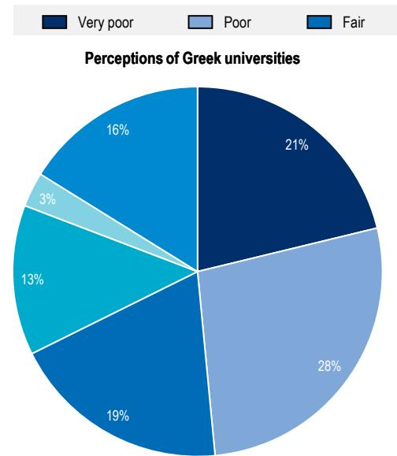  
Source: Deon Policy Institute (2025[5]).

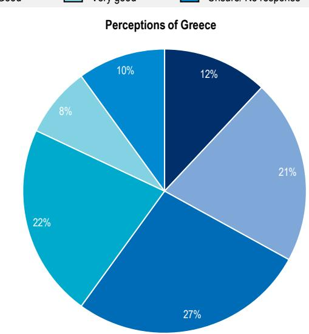

Despite the concerns about the quality of the higher education sector in Greece, a majority of respondents (59%) would consider working at a university in Greece in the next five years. Respondents in medicine (78%), arts (71%), and business (66%) were most likely to consider return. Willingness to relocate declined as research budgets of respondents increased, suggesting that those facing tighter funding conditions abroad may view a potential return to Greece more positively. Women and older academics (aged 46-75) expressed slightly greater willingness to return.

Interest in returning varies markedly across destination countries. Respondents in Canada exhibited the highest willingness to return (72%) (see Figure 5.24). This group largely consisted of individuals having completed undergraduate studies in Greece (50%) and postgraduate education in North America (72%). Most held tenure-track positions (78%), particularly in life sciences (33%) and engineering/technology (17%). A similar profile was observed in Australia, where 67% expressed interest in academic return. Most had not lived in Greece (73%) and held stable academic positions, with 50% in tenure-track and 35% lecturers across diverse fields, including management and business (15%), education and social work (15%), health sciences (12%), and law (12%). Notably, despite strong interest, respondents in both countries had limited personal or professional experience in Greece, having completed most of their studies abroad.

In contrast, respondents in Switzerland reported the lowest inclination to return, with 68% responding negatively. This group differed sharply: most completed undergraduate studies in Greece (87%) and postgraduate studies in Greece or elsewhere in Europe (80%), were primarily PhD students (47%), and predominantly male (66%). Similar trends were observed in the Netherlands (52% negative to return) and Sweden (only 52% willing to return, below the survey average). Negative responses were concentrated among PhD candidates who completed undergraduate studies in Greece, particularly in informatics, computer science, and medicine.

Figure 5.24. Greek academics from Canada are most interested in returning to Greece  
Share of survey respondents interested in moving to Greece in the next five years by current country of residence, 2024  
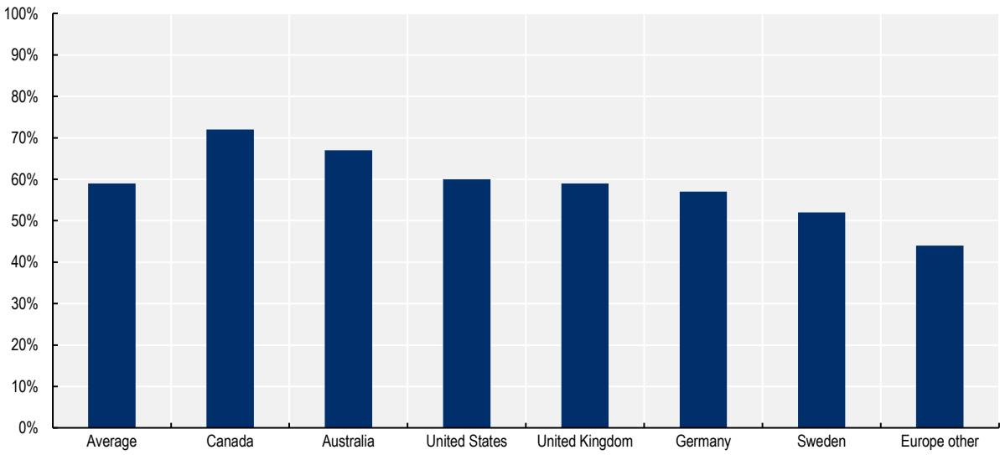  
Note: The figure shows the share of respondents that answered “yes” to the question: “Would you consider working at a university in Greece in the next five years?”  
Source: Deon Policy Institute (2025[5]).

When it comes to academic position, lecturers emerged as the group most interested in relocating to Greece within the next five years, with 80% expressing positive interest in return (see Figure 5.25). This cohort, primarily aged 36-65 (88%), largely completed undergraduate studies abroad (58%) and is mainly based in the United States (28%), the United Kingdom (25%), and Australia (23%). They span multiple disciplines, notably social sciences (18%), humanities (18%), and life sciences (15%). As lecturers often occupy non-tenure positions and lack independent research funding (50%), they represent a more flexible and mobile segment of the Greek academic diaspora.

Figure 5.25. Greek academics without stable long-term positions are most interested in returning to Greece  
Share of respondents interested in moving to Greece in the next five years by current academic position, 2024  
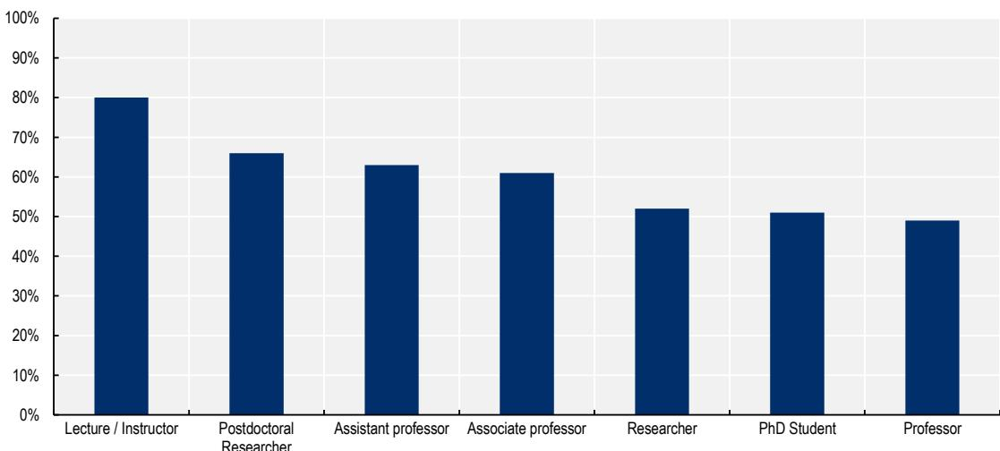  
Note: The figure shows the share of respondents that answered “yes” to the question: “Would you consider working at a university in Greece in the next five years?”  
Source: Deon Policy Institute (2025[5]).

Those in arts report the highest propensity to consider relocating, with 86% expressing interest, followed by law (72%) and humanities (71%) (see Figure 5.26). Business and social sciences show moderate interest, at 66% and 59% respectively, while life sciences, engineering and technology, and natural sciences are relatively less inclined to return, with just over half indicating willingness (57%, 54%, and 53%, respectively).

Figure 5.26. Greek academics in the arts, law, and humanities are most interested in returning to Greece  
Share of respondents interested in moving to Greece in the next five years by academic field, 2024  
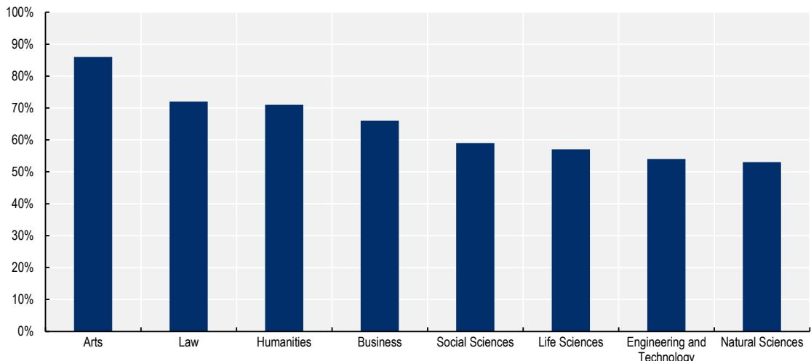  
Note: The figure shows the share of respondents that answered “yes” to the question: “Would you consider working at a university in Greece in the next five years?”  
Source: Deon Policy Institute (2025[5]).

A closer examination of return intentions by location of undergraduate and graduate studies reveals that the proportion of individuals expressing a desire to return to Greece varies according to the country in which their degree was completed: 53% of those who completed their undergraduate studies in Greece, 61% of those who completed their studies in Europe (excluding Greece), 67% of those in the United States, and 74% of those in other countries indicated a willingness to return (Figure 5.27). When considering the location of graduate studies, 44% of those who studied in Greece, 59% in Europe or the United States, and 68% in other countries expressed interest in returning. These patterns across countries of undergraduate and graduate studies suggest that completing academic studies outside Greece is associated with a higher propensity to consider returning.

Figure 5.27. Greek academics who completed their studies abroad are more likely to be interested in return than those who studied in Greece

Share of respondents interested in moving to Greece in the next five years by country of undergraduate (left) and graduate studies (right), 2024

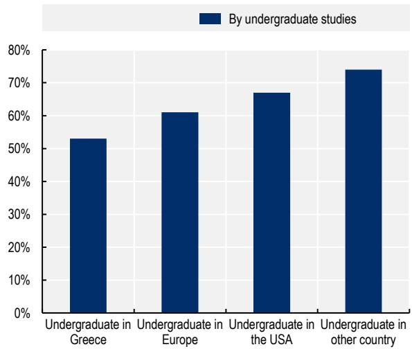

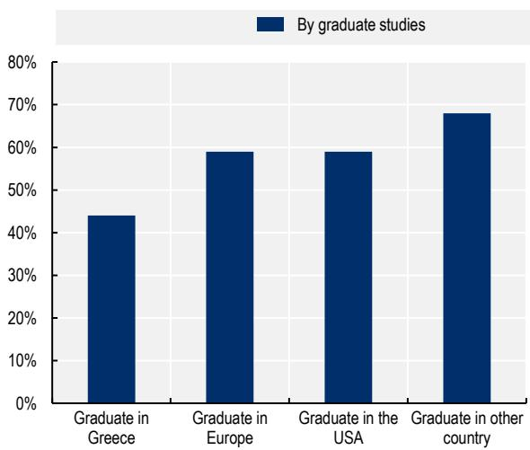  
Note: The survey included two questions asking about the country of undergraduate study and the country of graduate study. In cases where respondents completed multiple graduate degrees, the country reported corresponds to that of the most recently completed degree.
Source: Deon Policy Institute (2025[5]).

Reservations about returning to Greece persist and considerations for incentivising return reflect reservations

Among the perceived challenges of living and working in Greece by those considering return, salary-related concerns were the most frequently reported, with 18% highlighting low pay and 11% noting the misalignment of salaries with the cost of living (see Figure 5.28). Salary levels are widely considered to be misaligned with living costs, with housing expenses noted as a particular concern, especially for academics with families. Research funding and grant opportunities are also viewed as limited, with certain respondents characterising the national research support system as inadequate.

Beyond financial considerations, concerns were reported regarding governance and institutional culture: merit-based processes are perceived as limited, while administrative and bureaucratic procedures are seen as potential constraints on academic work. Institutional challenges were also significant: 12% of respondents pointed to limited meritocracy and 8% to bureaucratic obstacles. Broader aspects of work environment and governance were further considerations, with 7% citing work culture, 7% corruption, and 6% the political climate as factors that reduce the attractiveness of returning to Greece. Together, these

Reservations when it comes to living and working in Greece

findings suggest that both economic incentives and structural reforms are critical to addressing hesitations among Greek academics considering repatriation.

Greek academics abroad highlighted very similar areas for improvement if they were to consider returning to Greece. On the financial front, the most frequent recommendation was to increase salaries and wages, with 36% of respondents emphasising the need for compensation that not only covers living costs but also allows for savings. An additional 7% noted competitive compensation packages. Respondents also stressed the importance of increased research funding (19%) and more grant and research opportunities (13%), calling for predictable, recurring funding and, in some cases, a national research funding agency modelled on international standards. Collaboration with private companies and the creation of more joint research projects were also frequently mentioned. Beyond individual salaries and research funding, 7% of respondents advocated for more funding for universities, particularly to reduce bureaucracy and hire additional support staff.

Academics also pointed to governance and institutional issues similar to the findings from Chapter 4. Nearly one-fifth (18%) recommended addressing issues of meritocracy, while others called for transparent processes (10%) and a reduction of nepotism and political influence (8%) in hiring and promotion. Respondents suggested centralised platforms for posting academic positions, international best-practice standards for promotions, and merit-based allocation of research funding. About 9% also emphasised the need to reduce bureaucracy. Beyond governance, smaller but notable shares of respondents highlighted working culture and conditions (6%), campus safety and security (6%), and modernised facilities and infrastructure (6%), including better research labs and cleaner, safer campuses. Other suggestions included aligning universities with international standards, increasing autonomy from the Ministry of Education, flexible work arrangements, more English-language programmes, and targeted tax incentives.

These findings of who leaves, who returns and under what conditions form the analytical basis for Chapter 6, which examines the policy tools available to Greece to enhance retention, strengthen engagement with the scientific diaspora and encourage the return of highly skilled researchers.

Figure 5.28. Higher salaries are the top recommendation to incentivise the return of Greek academics from abroad

Reservations and recommended changes for Greek universities by academics abroad, 2024

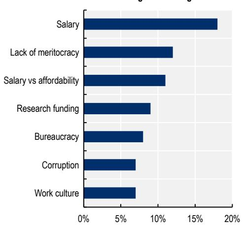

Recommendations for incentivising the return of Greek academics  
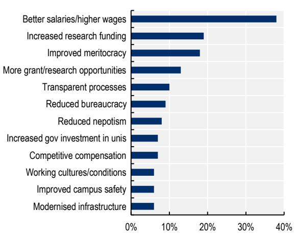  
Note: Respondents were allowed to select multiple answers for each question; therefore, the totals across all response categories do not sum to 100%. The question was only applicable to those responding Yes to Working in Greece Question.
Source: Deon Policy Institute (2025[5]).

## References

Deon Policy Institute (2025), Greek Academic Diaspora: Is Brain Regain in Greek Academia Possible, https://studyingreece.edu.gr/wp-content/uploads/2025/02/Deon-Policy-Institute-Bringing-Back-Greek-Scholars.pdf.

Hellenic Authority for Higher Education (2022), Eurograduate 2022: 2nd Phase of the European Pilot Survey of Higher Education Graduates, https://graduate-tracking.ethaae.gr/images/articles/apotelesmata/2024.12.04\_EG\_2022\_Greece\_Report.pdf.

Ioannidis, J. et al. (2021), “Comprehensive Mapping of Local and Diaspora Scientists”, Quantitative Science Studies, pp. 733-752, https://doi.org/10.1162/qss\_a\_00136.

Labrianidis, L. and T. Sykas (2023), “The impact of highly skilled emigrants on the origin country’s innovation performance: the case of Greece”, Emerald Insight, https://doi.org/10.1007/978-3-031-53088-3\_14.

Labrianidis, L. and T. Sykas (2015), “Why high school students aspire to emigrate: evidence from Greece”, Journal of International Migration and Integration, pp. 107-130, https://doi.org/10.1007/s12134-015-0468-3.

Migration Observatory (2025), EU students in the UK after Brexit., University of Oxford., https://migrationobservatory.ox.ac.uk/resources/briefings/eu-students-in-the-uk-after-brexit/.

National Documentation Center (EKT) (2022), Στατιστικά στοιχεία για τους διδάκτορες που αποφοίτησαν από τα ελληνικά AEI το 2022, https://metrics.ekt.gr/sites/metrics-ekt/files/ekdoseis-pdf/2024/EKT\_PhDstatistics\_2022\_el.pdf.

National Statistical Institute of the Republic of Bulgaria (2024), EDUCATION IN THE REPUBLIC OF BULGARIA, https://www.nsi.bg/sites/default/files/files/pressreleases/Education2023\_en\_08NKATC.pdf.

OECD (2025), Education at a Glance 2025 Sources, Methodologies and Technical Notes, OECD Publishing, Paris, https://doi.org/10.1787/fcfaf2d1-en.

OECD (2025), Education at a Glance 2025: OECD Indicators, OECD Publishing, Paris, https://doi.org/10.1787/1c0d9c79-en.

Universities UK (n.d.), International staff data, https://www.universitiesuk.ac.uk/what-we-do/policy-and-research/publications/features/uk-higher-education-data-international/international-staff-data (accessed on 22 February 2026).

## Annex 5.A. Supplementary tables

Annex Table 5.A.1. Overview of population definitions used in the chapter

<table><tr><td>Population category</td><td>How individuals are identified</td><td>Population represented</td><td>Section(s) where used in Chapter 5</td><td>Notes / limitations</td></tr><tr><td>Greek-affiliated scientific authors</td><td>Identified through institutional affiliation in Scopus author records (OECD Scientific Author Mobility Database).</td><td>Scientific authors whose current affiliation is in Greece (or abroad when tracking outflows/returnees).</td><td>Greek diaspora and researcher mobility patterns (inflows, outflows, returnees).</td><td>Measures affiliation, not nationality; does not capture diaspora unless they previously published from Greece.</td></tr><tr><td>Scientists of Greek origin</td><td>Identified through surname-based screening + manual validation in Ioannidis et al. (2021).</td><td>Researchers of Greek origin worldwide with =5 Scopus publications.</td><td>Greek diaspora and researcher mobility patterns (diaspora size, field distribution, impact).</td><td>May miss individuals without Greek surnames; includes multi-generation diaspora.</td></tr><tr><td>Greek-born PhD holders abroad (DIOC)</td><td>Identified by country of birth and doctoral-level education in the OECD DIOC database.</td><td>Greek-born individuals with a PhD living in OECD countries.</td><td>The emigration of Greek doctoral holders (distribution, destinations, age profile).</td><td>Does not capture Greek-origin PhDs born abroad; UK data unavailable in 2020/21.</td></tr><tr><td>Returning Greek PhD holders (census)</td><td>Greek citizens born in Greece with a doctoral degree, recorded as having settled in Greece in the previous 5 years.</td><td>Doctoral-level return migrants.</td><td>Return of Greek researchers (age, region of prior residence, return motivations).</td><td>Census does not track study or work histories abroad.</td></tr><tr><td>Proxy for returning international students (census)</td><td>Individuals aged 20-29, with tertiary education, who returned within 5 years before the census.</td><td>Younger tertiary-educated returnees, used as a proxy for former international students.</td><td>Insights into the return of Greek students after studying abroad.</td><td>Cannot distinguish between former international students and other temporary migrants.</td></tr><tr><td>Doctoral graduates from Greek universities (EKT)</td><td>Mandatory registration of all PhD recipients in EKT / EADD (98% Greek citizens).</td><td>All new PhD graduates trained in Greece, including mobility intentions.</td><td>Emigration of Greek doctoral holders and international mobility intentions among new PhD holders.</td><td>Excludes Greek PhD holders trained abroad; captures intentions, not realised moves.</td></tr></table>

Annex Table 5.A.2. Research fields of Greek-origin scientists affiliated in Greece and abroad

<table><tr><td>Category</td><td>Affiliation in Greece</td><td>Affiliation Abroad</td></tr><tr><td>Research Field</td><td></td><td></td></tr><tr><td>Agriculture, Fisheries &amp; Forestry</td><td>1 252</td><td>391</td></tr><tr><td>Biology</td><td>1 152</td><td>442</td></tr><tr><td>Biomedical Research</td><td>1 774</td><td>2 194</td></tr><tr><td>Built Environment &amp; Design</td><td>224</td><td>224</td></tr><tr><td>Chemistry</td><td>1 570</td><td>1 101</td></tr><tr><td>Clinical Medicine</td><td>13 756</td><td>8 448</td></tr><tr><td>Communication &amp; Textual Studies</td><td>74</td><td>145</td></tr><tr><td>Earth &amp; Environmental Sciences</td><td>1 352</td><td>688</td></tr><tr><td>Economics &amp; Business</td><td>960</td><td>1 077</td></tr><tr><td>Enabling &amp; Strategic Technologies</td><td>1 826</td><td>1 513</td></tr><tr><td>Engineering</td><td>2 303</td><td>2 173</td></tr><tr><td>Historical Studies</td><td>176</td><td>188</td></tr><tr><td>Information &amp; Communication Technology</td><td>3 786</td><td>3 221</td></tr><tr><td>Mathematics &amp; Statistics</td><td>594</td><td>423</td></tr><tr><td>Philosophy &amp; Theology</td><td>26</td><td>78</td></tr><tr><td>Physics &amp; Astronomy</td><td>2 000</td><td>2 321</td></tr><tr><td>Psychology &amp; Cognitive Sciences</td><td>160</td><td>475</td></tr><tr><td>Public Health &amp; Health Services</td><td>320</td><td>449</td></tr><tr><td>Social Sciences</td><td>639</td><td>743</td></tr><tr><td>Visual &amp; Performing Arts</td><td>12</td><td>17</td></tr><tr><td>Total</td><td>33 956</td><td>26 311</td></tr></table>

Source: Ioannidis (2021[4]), "Comprehensive Mapping of Local and Diaspora Scientists", https://doi.org/10.1162/qss\_a\_00136.

Annex Table 5.A.3. Characteristics of Greek-origin scientists' publishing in Greece and abroad

<table><tr><td>Characteristics</td><td>Greek affiliation</td><td>Affiliation abroad</td></tr><tr><td>Number of papers</td><td>13</td><td>14</td></tr><tr><td>Year of first paper</td><td>2002</td><td>2004</td></tr><tr><td>Ranking across all sciences, thousands (excl. self-citation)</td><td>3505</td><td>2812</td></tr><tr><td>Ranking across all sciences, thousands (incl. self-citation)</td><td>3508</td><td>2801</td></tr><tr><td>Citations</td><td>139</td><td>184</td></tr><tr><td>Citing papers</td><td>131</td><td>169</td></tr><tr><td>Ranking in main subfield (incl. self-citation)</td><td>28711</td><td>21378</td></tr><tr><td>Ranking in main subfield (excl. self-citation)</td><td>28693</td><td>21324</td></tr><tr><td>Percentile in main subfield</td><td>46</td><td>37</td></tr></table>

Source: Ioannidis (2021[4]), “Comprehensive Mapping of Local and Diaspora Scientists”, https://doi.org/10.1162/qss\_a\_00136.

## Notes

$^{1}$ The OECD's education division collects data on graduation rates from bachelor's programmes for member and partner countries. However, Greece did not report data for this indicator. The figure showing this data is entitled Completion rates of new entrants to bachelor's programmes, by timeframe (2023) from Education at a Glance (OECD, 2025[7]).

## Strengthening Greece's framework for engaging with its diaspora and facilitating return

This chapter provides an overview of Greece’s evolving institutional and policy framework for engaging with its diaspora and supporting return migration. It traces how Greece’s approach has shifted from primarily cultural and consular outreach toward a broader set of measures aimed at mobilising diaspora skills, fostering research and innovation links, and facilitating the return and reintegration of Greek citizens abroad. The chapter reviews key strategies and recent policies and initiatives across domains including diaspora engagement, mobilising diaspora skills, fostering research and innovation links, and facilitating the return and reintegration of Greek citizens abroad. It further summarises relevant international practices from OECD countries and proposes a number of actions that Greece can take to strengthen its diaspora institutional and policy framework.

## Introduction

Greek diaspora and return-migration policies have evolved significantly over recent decades, shaped by shifts in emigration patterns, labour-market needs and broader socio-economic developments. Whereas earlier approaches focussed primarily on cultural preservation and maintaining ties with long-established diaspora communities, more recent efforts reflect a strategic turn toward mobilising the skills, experience and economic potential of Greeks abroad. This shift follows more than a decade of substantial outward mobility, particularly among young and highly educated workers, which has heightened the policy importance of leveraging diaspora linkages, encouraging return, and supporting knowledge and investment flows.

At their core, diaspora and return-migration policies pursue four interrelated objectives:

\- Maintaining and strengthening ties with citizens and people of Greek origin abroad through cultural, linguistic, civic and consular engagement;

\- Mobilising diaspora resources and expertise to support national development, including through knowledge exchange, research co-operation, and investment;

\- Strengthening networking and co-operation between Greece and Greek diaspora organisations and their members;

\- Facilitating return and reintegration for those who wish to come back, by reducing administrative barriers, introducing financial incentives, facilitating qualification recognition, and improving the conditions that influence long-term settlement decisions.

Over the past five years, Greece has introduced a wide array of initiatives across these objectives, ranging from the introduction of its first diaspora strategy and consular modernisation to fiscal incentives for returnees, academic mobility programmes and automatic qualification recognition for medical professionals. These developments reflect growing recognition of the diaspora and return migrants to contribute to skills accumulation, innovation and demographic renewal. The initiatives form part of an emerging policy ecosystem, rather than a single, stand-alone return-migration or diaspora strategy.

Recent policy developments also reflect an implicit shift towards recognising international mobility as a continuum rather than a binary choice between emigration and return. In practice, Greece's approach to engaging with its diaspora operates across three partially overlapping modes: engagement without return, temporary or circular engagement, and permanent or long-term return. These modes correspond to different time horizons, policy instruments and target groups, and together form the basis of an emerging and increasingly differentiated engagement framework.

This chapter examines how Greece's institutional and policy framework in this field has evolved, how key initiatives operate, and where current policies and institutional frameworks could be strengthened. It is organised into four parts. It first provides an overview of the evaluation of key diaspora and return-migration policies as well as the institutional landscape. It then discusses the key policies and initiatives recently introduced in more detail and highlights international experience in diaspora and return-migration policy. Finally, it provides conclusions and recommendations for how Greece can continue developing its framework for engaging the diaspora, mobilising diaspora resources and skills, and facilitating return and reintegration.

## Evolution of Greece's diaspora and return-migration policies

Greece's approach to its diaspora has undergone a significant transformation over time, evolving from informal and largely cultural outreach into a more comprehensive policy framework spanning engagement, mobility, return and reintegration. This evolution mirrors broader changes in migration patterns, shifts in

Greece's socio-economic context, and the increasing global competition for skills. As outlined in Chapter 1, Greek emigration has taken place in multiple waves over a long period, shaping both the size and the character of the Greek diaspora.

The early formation of the diaspora, and the first elements of diaspora policy, emerged decades ago, albeit in limited and largely informal ways. Since the establishment of the modern Greek state in the 19th century, governance was shaped by a distinction between native citizens (aftochthones) and those originating outside the historical core (heterochthones). This internal divide, combined with large-scale emigration occurring before the finalisation of Greece's post-war borders in 1948, constrained the development of a coherent and inclusive diaspora strategy (Anastasakis and Kalantzi, 2021[1]).

Throughout the 19th century and much of the 20th century, state engagement with Greeks abroad remained selective. It largely focussed on influential overseas groups, particularly merchants and actors in the shipping sector, while broader diaspora communities were only loosely connected to the state. More structured policy foundations began to emerge only after the Second World War, in response to large post-war emigration flows. These included the emigration policy embedded in the 1950-1953 Development Plan and a series of bilateral labour agreements, most notably with West Germany in 1960, which facilitated the emigration of an estimated 381 000 Greek workers. By the late 1960s and 1970s, policy priorities gradually shifted towards encouraging return migration, with incentives such as tax reductions and favourable import duties for returnees (Cavounidis, 2015[2]).

The 1975 Constitution formalised the state's role in supporting Greeks abroad and maintaining their ties with the homeland, including provisions for voting from abroad (Anastasakis and Kalantzi, 2021[1]). However, this right was not activated in practice until 2021. During the 1980s and 1990s, the institutional landscape for diaspora engagement expanded further, notably with the establishment of the General Secretariat for Greeks Abroad, now a central co-ordination body, the World Council for Hellenes Abroad (SAE), and a range of institutions dedicated to promoting Greek language and culture (Anastasakis and Kalantzi, 2021[1]).

The post-2009 economic crisis placed significant strain on these structures. Fiscal consolidation led to reduced consular capacity and a contraction of cultural and educational activities abroad, while SAE's role and operations gradually diminished (Anastasakis and Kalantzi, 2021[1]). At the same time, the crisis triggered a new wave of emigration, predominantly among young and highly educated workers. This gave rise to a largely first-generation diaspora with strong ongoing ties to Greece, adding to longstanding communities in traditional settlement countries, as detailed in Chapters 1 and 2.

Historically, Greek diaspora policy has been strongly anchored in descent, cultural affinity, religion and language (Moutselos and Mavrodi, 2020[3]; Cavounidis, 2015[2]). Despite the size of the Greek diaspora, the overall framework remained relatively lightly formalised (Moutselos and Mavrodi, 2020[3]). Policies traditionally targeted both Greek citizens abroad and foreign nationals of Greek origin, with more structured engagement focussed on older diaspora communities formed through earlier, more formalised migration channels. By contrast, more recent emigrants, typically younger, highly educated and increasingly mobile within Europe, were less well reflected in earlier policy approaches.

Since the crisis, Greek diaspora policy has gradually shifted from a predominantly cultural and representational focus toward a more comprehensive framework emphasising skills, economic linkages, return migration and internationalisation. This evolution reflects both the changing profile of Greek emigrants and broader global competition for talent. A growing set of initiatives, summarised in Table 6.1, now underpins Greece's approach to diaspora engagement, return and academic and research mobility. The main policy domains and key initiatives currently in place are examined in greater detail below, outlining their objectives, core features and modes of implementation. Taken together, these measures form an increasingly co-ordinated policy ecosystem addressing multiple dimensions of diaspora engagement, knowledge transfer, and return and reintegration.

## Institutional landscape for diaspora engagement

Greece's approach to diaspora engagement is supported by a range of governmental, advisory and non-state actors, each contributing distinct functions in cultural outreach, economic diplomacy and return-migration support.

## Key governmental and non-state actors

Greece's diaspora engagement system is shaped by a combination of formal state institutions and a broad network of non-state actors. The Ministry of Foreign Affairs (MFA) serves as the main government body responsible for relations with Greeks abroad. Its extensive diplomatic network delivers consular and administrative services, cultural outreach, and community support. Within the MFA, the General Secretariat for Greeks Abroad (GGAE) plays a central role in implementing policies for Greek citizens and individuals of Greek descent living abroad, as well as overseeing initiatives related to cultural promotion, language education and co-operation with diaspora organisations.

The Hellenic Parliament also contributes to diaspora governance through the Special Permanent Committee for Diaspora Greeks, a 30-member parliamentary body tasked with strengthening ties with Greek communities worldwide, highlighting issues affecting Greeks abroad and representing parliamentary interests in international diaspora fora. Its work complements that of the MFA and GGAE and reflects the multi-layered nature of Greece's institutional architecture in this field.

Beyond governmental actors, several advisory and civil-society institutions influence policy debates and engagement strategies, and shape Greece's diaspora engagement landscape. The World Council of Hellenes Abroad (SAE), although currently dormant, remains constitutionally recognised as the principal advisory body for people of Greek heritage worldwide and continues to be referenced in discussions on future reforms to diaspora representation.

Additionally, several long-established advocacy groups have significantly shaped relations between Greece and its overseas communities. The World Hellenic Inter-Parliamentary Association (WHIA) is an international organisation that brings together parliamentarians of Greek origin from different countries around the world. Its mission is to strengthen co-operation and communication among these legislators and to promote issues of Greek interest, Greek culture and the Greek diaspora, through conferences, meetings, and joint initiatives.

The “INIOCHOS” Network of Greek Elected Local Government Officials of Europe is a European network that brings together Greek elected representatives serving in local governments across various European countries. The network aims to strengthen co-operation and communication among Greek local officials, promote the exchange of experience and best practices in local governance, and support initiatives that benefit Greek communities throughout Europe, through meetings, partnerships, and joint activities.

Diaspora organisations and federations, professional associations and chambers of commerce, such as Enterprise Greece and Elevate Greece, facilitate economic networking and business co-operation between Greece and expatriate communities.

Research and policy institutions, such as ELIAMEP, SEESOX's Greek Diaspora Project, and Deon Policy Institute play a significant role in generating evidence, analysing evolving diaspora dynamics, and engaging with policymakers on institutional gaps and emerging needs. Civil-society organisations contribute to mobilisation efforts and economic engagement, and support investment, philanthropy and entrepreneurship initiatives that link diaspora resources to development in Greece. These include the Hellenic Initiative (THI), the American Hellenic Educational Progressive Association (AHEPA), the American Hellenic Institute (AHI), the Hellenes Abroad, the National Hellenic Society, the European Hellenic Foundation etc.

Several other players further shape Greece's diaspora engagement efforts. Political parties maintain long standing transnational networks and mobilise voters abroad; religious actors, particularly the Greek Orthodox Church, continue to serve as key cultural and community anchors for diaspora populations.

Together, this constellation of governmental, advisory, research and civil-society actors reflect the diverse channels through which Greece engages with its global population.

## Co-ordination across institutions

Despite the wide range of actors involved, Greece does not currently operate a formal, permanent intra-governmental co-ordination mechanism dedicated to aligning diaspora engagement, mobility, return and reintegration policies across ministries. Responsibilities for different aspects of diaspora policy, including cultural, educational, economic, civic and return-related measures, are distributed across several ministries and public bodies, reflecting the cross-cutting nature of the portfolio.

At the same time, more targeted forms of inter-ministerial collaboration have emerged in recent years. A notable example is the 2024 Memorandum of Co-operation between the Ministry of Foreign Affairs (through the General Secretariat for Greeks Abroad) and the Public Employment Service (DYPA). The agreement establishes a structured framework for information-sharing, joint actions and co-ordinated outreach activities aimed at informing Greeks abroad about employment, training and entrepreneurship opportunities in Greece, while also supporting potential return. Its provisions include co-ordinated communication through MFA consular networks, the co-organisation of Career Days abroad, and the exchange of data and programme information on national and EU labour-market initiatives relevant to returnees (Public Employment Service (DYPA), 2024[4]).

In parallel, the Ministry of Foreign Affairs has concluded a growing number of memoranda of understanding (MoU) with institutions, local authorities and foundations, reflecting a pragmatic, partnership-based approach to diaspora engagement. These include:

\- MoU with Study in Greece (2024), aiming to strengthen links between diaspora youth and Greek universities;

\- MoU with the Municipality of Athens (2024), focussing on the joint organisation of summer hosting programmes;

\- MoU with Crafting Greece and the King's Foundation (2025), promoting co-operation in crafts and traditional arts;

\- MoU with the National and Kapodistrian University of Athens (2025), supporting Greek-language programmes for diaspora youth;

\- MoU with Endeavor Greece (2025), aimed at fostering innovation-oriented engagement with the diaspora;

\- MoU with EKKOMED – Creative Greece S.A. (2025), promoting collaboration in cinema, documentaries, cultural festivals and digital education programmes; and

\- MoU with the Foundation of the Hellenic World (2025), focussing on educational initiatives and broader synergies with diaspora communities.

Taken together, these agreements illustrate a progressive strengthening of sector-specific co-ordination and partnership-based engagement. Nevertheless, Greece continues to rely primarily on ad hoc or bilateral co-ordination arrangements, rather than a centralised, standing mechanism for diaspora and return-migration policy. Unlike several OECD countries that have established permanent inter-ministerial committees or co-ordination bodies, co-ordination in Greece is currently supported through general government-wide structures and targeted agreements focussed on specific policy domains. These instruments facilitate co-operation on individual initiatives but do not yet constitute a comprehensive, overarching framework for strategic co-ordination.

## Key policy domains and recent reforms

This section reviews the main policy developments shaping Greece's response to emigration, diaspora engagement and return migration. Its primary focus is on explicit diaspora-, mobility- and return-related policies and initiatives, which are examined in detail in the subsections that follow. At the same time, and as the analysis in earlier chapters has shown, decisions to emigrate or return are rarely driven by migration-specific policies and conditions alone. Rather, they are strongly influenced by broader economic, labour market, housing and family-policy conditions that shape career prospects, living standards and long-term security.

Against this backdrop, the section begins with an overview of recent policy measures and reforms that indirectly can influence emigration and return dynamics, even though they are not formally framed as diaspora or return-migration policies. These measures address several of the key barriers to return identified earlier in the report, including income levels, job quality and stability, research and innovation opportunities, and work – family balance. In combination, labour-market reforms, housing measures, innovation policies and investment initiatives are gradually reshaping the structural context underpinning return decisions, even where they are not explicitly framed as migration policies. For many skilled Greeks who left during the economic crisis, these developments reduce the perceived risks associated with return.

Building on this contextual overview, the section then turns to Greece's dedicated diaspora, mobility and return-migration policy instruments. Together, these explicit measures, summarised in Table 6.1 and discussed in subsequent subsections, complement the broader reform agenda by targeting international engagement, facilitating knowledge circulation, supporting return and reintegration, and strengthening links between the Greek state, its diaspora and internationally mobile talent.

## Addressing structural drivers of emigration and return

Greece has introduced a broad range of policy measures across several domains that, while not explicitly framed as diaspora or return-migration policies, address many of the structural conditions shaping decisions to emigrate and to return. As highlighted in earlier chapters, return intentions among Greeks abroad are strongly influenced by perceptions of income prospects, career stability and institutional quality. Recent reforms seek to improve these conditions by strengthening labour-market performance, boosting disposable incomes, supporting innovation and investment, and easing constraints related to housing and family formation.

A central pillar of this evolving policy mix concerns income growth and labour-market conditions. Significant increases in the minimum wage, from EUR 650 in 2021 to EUR 880 in 2025, with a target of EUR 950 by 2027, combined with reductions in social-security contributions and tax reforms lowering the entry income-tax rate to 9%, have improved net earnings and purchasing power. In the public sector, the first salary increases in 14 years have resulted in average wage gains of around 20% through successive reforms affecting civil servants, healthcare professionals, academics and security forces. Together, these measures address key barriers identified in earlier chapters, particularly concerns about remuneration and long-term professional prospects relative to other OECD labour markets. Labour-market improvements are also reflected in declining unemployment across the working-age population. According to ELSTAT, women's unemployment fell from 20.6% in December 2020 to 9.9% in December 2025, alongside broader employment growth. While challenges remain, these trends point to a labour market that is gradually strengthening, improving overall perceptions of employment stability among potential returnees.

Beyond general labour-market reforms, innovation-oriented policies further shape the return environment. While specific tax regimes for returnees are discussed later in this chapter, broader measures – such as enhanced tax deductions for research and development and incentives for start-ups and angel investors – contribute to a more dynamic innovation ecosystem. This is particularly important for returnees whose career trajectories depend on access to advanced research infrastructure, cutting-edge technologies and entrepreneurial opportunities. This context has been reinforced by the establishment of Pharos, the Greek AI Factory approved under the EuroHPC Joint Undertaking. Pharos brings together academia, research institutions, the public sector and private enterprise, combining advanced computational infrastructure, high-quality datasets, upskilling opportunities and business-support services. While not a return-migration instrument per se, it improves professional framework conditions and can act as a pull factor for highly skilled Greeks abroad evaluating return in light of long-term career prospects.

Housing affordability may also be a critical determinant of return migration, especially for young households and families. In response, Greece has implemented a broad package of housing measures, including subsidised mortgage schemes such as My Home, renovation subsidies, tax incentives to increase long-term rentals, and the return of one annual rent payment to many tenants. Additional programmes support energy-efficient renovation and expand housing availability through public – private partnerships. Together, these measures aim to reduce relocation costs and ease access to housing, which are central considerations for return decisions.

## Overview of explicit diaspora, mobility and return-migration policies

The remainder of this section turns to explicit policy instruments that are specifically designed to engage with the Greek diaspora, facilitate international mobility and support return and reintegration. Table 6.1 presents an overview of the main policy domains and key recent initiatives, grouping them into four broad areas: diaspora engagement; return and reintegration; academic and research mobility, circulation and return; and diaspora investment and entrepreneurship. The subsections that follow examine each of these domains in turn, describing their objectives, core instruments and implementation approaches, and situating them within Greece's evolving policy framework for engagement, circulation and return.

Table 6.1. Overview of main policy domains and key policies and initiatives

<table><tr><td>Initiative / policy</td><td>Primary objective</td><td>Target group</td><td>Responsible authority</td><td>Year (legal basis and/or revisions)</td></tr><tr><td colspan="5">Diaspora engagement</td></tr><tr><td>Strategic Plan for the Greek diaspora 2024-2027</td><td>Strengthen the ties between Greece and Greeks abroad (umbrella strategy) through many proposed actions.</td><td>Greek citizens and diaspora communities abroad (all generations)</td><td>Ministry of Foreign Affairs</td><td>2024</td></tr><tr><td>Digitisation and modernisation of Consular Services (virtual assistant, myConsulLive, e-passports)</td><td>Facilitation of consular procedures</td><td>Greek citizens and diaspora communities abroad (all generations)</td><td>Ministry of Foreign Affairs</td><td></td></tr><tr><td>Greek Youth Diaspora Symposium</td><td>Fostering networking, collaboration and youth diaspora engagement</td><td>Greek Youth Diaspora</td><td>Ministry of Foreign Affairs</td><td>2024</td></tr><tr><td>Greek Youth Diaspora Ambassadors initiative</td><td>Enhancing collaboration and youth diaspora engagement</td><td>Greek Youth Diaspora</td><td>Ministry of Foreign Affairs</td><td>2024</td></tr><tr><td>Policy to support Greek studies in foreign universities</td><td>Promotion of Greek language and Greek studies</td><td>Foreign Universities and academic community</td><td>Ministry of Foreign Affairs</td><td>2024</td></tr><tr><td>Scholarships</td><td>Strengthening people-to-people ties</td><td>Greek Youth Diaspora and Philhellenes</td><td>Ministry of Foreign Affairs</td><td>2024</td></tr><tr><td>Students' Digital Newspaper</td><td>Promotion of Greek language and strengthening people-to-people ties</td><td>Students of diaspora</td><td>Ministry of Foreign Affairs</td><td>2025</td></tr><tr><td>Voting from abroad (out-of-country voting)</td><td>Strengthen political participation and civic inclusion of Greeks residing abroad</td><td>Greek citizens abroad</td><td>Ministry of Interior</td><td>2019 (expanded 2023, 2024 and 2026)</td></tr><tr><td colspan="5">Return and reintegration</td></tr><tr><td>ReBrain Greece digital platform</td><td>Institutionalised matching mechanism to encourage return migration of highly skilled professionals by matching diaspora talent with private-sector job opportunities in Greece</td><td>Highly skilled Greek professionals abroad</td><td>Ministry of Labour and Social Security</td><td>2023</td></tr><tr><td>Tax incentive for transfer of tax residence to Greece (50% exemption on employment/business income)</td><td>Attract returning workers / self-employed by reducing tax on Greek-source income</td><td>Individuals that have not been a Greek tax resident for five of the six years preceding their relocation</td><td>Independent Authority for Public Revenue (AADE) / Ministry of Finance</td><td>2021</td></tr><tr><td>Automatic recognition of qualifications of medical professions</td><td>Facilitate the return of Greek doctors trained abroad</td><td>Greek and EU citizen doctors with a medical degree from a selected number of non-EU countries</td><td>Ministry of Health and Ministry of Education</td><td>2025</td></tr><tr><td colspan="5">Academic and research mobility, circulation and return</td></tr><tr><td>Visiting Professors / Visiting Researchers Programme</td><td>Promote temporary return, international collaboration and knowledge transfer to Greek universities and research centres</td><td>Researchers and academics abroad (all nationalities)</td><td>Ministry of Education and Religious Affairs (with universities)</td><td>2022 (legal basis)/2024 (funding instrument in place)</td></tr><tr><td>ELIDEK postdoctoral and early-career researcher calls</td><td>Support reintegration and independent research careers in Greece, including researchers based abroad</td><td>Early-career researchers and post-doctoral scholars</td><td>Hellenic Foundation for Research and Innovation (ELIDEK)</td><td>2018</td></tr><tr><td>EMBO Installation Grants (Greece participation)</td><td>Facilitate return and establishment of independent research groups in the life sciences</td><td>Early-career life science researchers abroad</td><td>EMBO (co-funded / hosted by GSRI or Greek institutions)</td><td>2022</td></tr><tr><td>Knowledge Bridges initiative</td><td>Foster collaboration and “brain circulation” between Greek researchers abroad and domestic institutions</td><td>Greek scientific diaspora</td><td>National Documentation Centre (EKT)</td><td>2017 (implemented 2017-2023)</td></tr><tr><td>Framework for the operation of non-profit branches of foreign universities</td><td>Internationalise higher education and strengthen links with global academic and diaspora networks</td><td>Foreign universities; diaspora academics</td><td>Ministry of Education</td><td>2024</td></tr><tr><td>Hosting programmes</td><td>Strengthen ties with Greek culture and language</td><td>Children, students, young entrepreneurs and professionals, elderly</td><td>Ministry of Foreign Affairs</td><td>2024</td></tr><tr><td colspan="5">Diaspora investment and entrepreneurship</td></tr><tr><td>Enterprise Greece (diaspora-oriented investment promotion)</td><td>Attract diaspora investment, entrepreneurship and export activity</td><td>Greek diaspora entrepreneurs and investors</td><td>Enterprise Greece (Ministries of Foreign Affairs / Development)</td><td>2020 (diaspora focus strengthened)</td></tr><tr><td>Elevate Greece</td><td>Support start-ups and scale-ups, including diaspora-led and returnee ventures</td><td>Entrepreneurs and start-up founders (incl. returnees)</td><td>Ministry of Development</td><td>2020</td></tr></table>

## Diaspora engagement policy

Diaspora engagement is a prominent component of Greece's policy landscape, reflecting the scale of emigration and the growing recognition of the diaspora as a long-term economic, cultural and political asset. The measures introduced span strategic co-ordination frameworks, cultural and educational initiatives, and reforms aimed at strengthening civic participation from abroad. These policies and initiatives primarily target engagement without return, focussing on maintaining connections, facilitating collaboration and enabling participation from abroad.

## Greece's diaspora strategy

Greece has recently moved toward a more structured approach to diaspora engagement through the adoption of the Ministry of Foreign Affairs' Strategic Plan for the Greek Diaspora 2024-2027 (see Box 6.1). The strategy seeks to strengthen ties between Greece and the Greek population abroad, targeting both first-generation emigrants and second-and-later-generation diaspora communities. It is led by the Ministry of Foreign Affairs through the General Secretariat for Greeks Abroad and Public Diplomacy and functions as an overarching framework rather than a single dedicated programme, aiming to align existing initiatives and guide the development of new ones across different policy areas.

The plan identifies six strategic objectives, each accompanied by a package of specific actions and designated implementing bodies. Beyond the Ministry of Foreign Affairs, the plan explicitly involves several other ministries and agencies depending on the thematic area, including the Ministry of Education, the Ministry of Culture, the Ministry of Digital Governance, and the Ministry of Labour and Social Security. Examples of planned measures include the creation of a Register of diaspora organisations, the establishment of dedicated networks of Greek academics, scientists and entrepreneurs worldwide, the promotion of Hellenic Studies and cultural exchanges, and the digitalisation and modernisation of consular services.

The introduction of the diaspora strategy marks an important step toward a more co-ordinated and articulated approach to diaspora policy, providing an overarching framework to guide future action and signal policy priorities. At the same time, the strategy remains primarily strategic and directional in nature. It is not accompanied by a detailed action plan or more details on implementation timelines, annual funding allocations and project-level reporting and monitoring.

While the strategy acknowledges links with other policy areas, such as return migration, research and innovation, higher education and economic development, these are reflected mainly through selective collaborations and memoranda of understanding (as discussed in the section on institutional co-ordination), rather than through fully articulated operational arrangements. Many planned activities focus on the development of digital platforms, registries and networks, which can facilitate outreach, visibility and communication with the diaspora. The effectiveness of these tools, however, will depend on sustained institutional follow-up, adequate resourcing, and clearly defined governance and implementation arrangements.

Taken together, these features point to scope for further development at the implementation stage, particularly in strengthening co-ordination mechanisms across ministries and aligning the strategy more closely with existing planning, monitoring and evaluation frameworks in related policy domains.

## Box 6.1. Strategic Plan for Greeks Abroad 2024-2027: Objectives and governance

Greece's current approach to diaspora engagement is framed by the Strategic Plan for Greeks Abroad 2024-2027, embedded within the broader Ministry of Foreign Affairs Strategic Plan 2024-2027. The strategy reflects a shift towards a more structured and forward-looking engagement with Greek communities abroad, responding to the growing scale and changing profile of Greek emigration over the past decade.

The strategic plan sets out six core objectives, including:

\- Supporting and developing networks and bodies of the diaspora, focussing on new organisational methods. This includes actions such as creating a website for Greeks abroad, a register of Greek and foreign diaspora organisations and developing professional and thematic networks among Greek academics, scientists and entrepreneurs abroad.

Collaboration with the diaspora to enhance the country's image. Planned actions include expanding public diplomacy partnerships with diaspora media and associations, and organising diaspora led events that promote Greece's international profile.

\- Strengthening the Greek language, history, tradition, and culture by engaging and enhancing relations with the younger generation. Key actions include enriching the StaEllinika digital Greek-learning platform, supporting Hellenic Studies departments abroad, and expanding youth programmes and cultural exchanges for children of the Greek diaspora.

\- Maintaining and strengthening ties with the ecclesiastical institutions of Orthodoxy as a cohesive factor between Greece and the diaspora. Actions include joint cultural and community activities with Orthodox institutions abroad and strengthening their role in preserving Greek identity within dispersed communities.

\- Enhancing bilateral and multilateral co-operation on diaspora issues. The plan envisages co-operation agreements and international partnerships on education, culture and diaspora affairs, as well as scientific and academic exchanges involving diaspora experts.

\- Upgrading of consular services. Key actions include digitising consular procedures, modernising service delivery and improving access through enhanced online platforms and unified communication channels.

The General Secretariat for Greeks Abroad and Public Diplomacy shapes, develops and implements the Greek diaspora strategy. The strategic plan reflects greater attention to long-term planning and inter-ministerial collaboration, its impact will depend on operationalisation, resource allocation and the establishment of clear monitoring and evaluation tools.

Source: Ministry of Foreign Affairs (2024[5]), “Strategic Plan for Greeks Abroad 2024-2027: Strengthen Ties with the Greek Diaspora”.

## Language, culture and education policy

Greece has a long tradition of engaging with its diaspora through cultural and educational initiatives, reflecting the view that language proficiency and cultural familiarity are essential to maintaining long-term ties with the homeland (Moutselos and Mavrodi, 2020[3]). Numerous policies support this objective. The Ministry of Education operates Greek primary and secondary schools abroad in major diaspora hubs. It also offers postgraduate study grants in Greece and provides preferential admissions pathways for diaspora youth applying to Greek universities (Moutselos and Mavrodi, 2020[3]).

The General Secretariat for Greeks Abroad and Public Diplomacy implements a strategy to support Chairs of Greek studies in foreign universities. In 2024, 43 Chairs of Greek Studies at universities abroad were supported, whereas in 2025 the number of Chairs exceeded 80. At the same time, it takes actions to register Chairs of Greek Studies facing difficulties, and to encourage the creation of new Chairs worldwide.

In addition to a variety of cultural events and activities included in the annual plan, Greek cultural diplomacy and educational programmes (not only for the diaspora but also for foreign audiences) are implemented and promoted by a number of Greek Studies departments at universities abroad. They are consistently and attentively supported by the Greek Ministry of Foreign Affairs.

Furthermore, the General Secretariat for Greeks Abroad and Public Diplomacy organises numerous exchange programmes, Greek language courses, and programmes in Greece for children and youth of the diaspora. It also organises the annual Greek Youth Diaspora Forum, established for the first time in 2024, in order to foster networking among active members of the diaspora youth. A key highlight of the Symposium was the launch of the Greek Youth Diaspora Ambassadors initiative, through which the young representatives who participated in the abovementioned symposium actively promote Greek culture and values through targeted actions, supported by ongoing guidance and mentorship.

In 2024, for the first time, the General Secretariat for Greeks Abroad and Public Diplomacy launched hosting programmes across various thematic areas, including environmental awareness and dance training. In 2026, new programmes are about to be introduced, focussed on innovation and technology, maritime education and volunteerism. In addition, the Secretariat is planning to run internship programmes, giving the young people from diaspora the chance to experience contemporary Greece first-hand. Other initiatives include scholarships, and mentorship programmes exist as well.

Greece's cultural diplomacy and diaspora education programmes operate across a range of ministries and agencies (Moutselos and Mavrodi, 2020[3]). The Greek Ministry of Foreign Affairs, in co-operation and co-ordination with the competent Ministries of Culture and Education set the strategic objectives and annual planning for cultural diplomacy and diaspora education programmes. The Greek Diplomatic Missions implement the annual plan, which is monitored by the Ministry of Foreign Affairs.

Modern Greek Language Teaching Centers operate in many countries abroad under the umbrella of the Greek embassies and the supervision of the Greek Ministry of Education, Religious Affairs, and Sports. These centres participate in the clusters of EUNIC (EU National Institutes for Culture) operating around the world.

## Diaspora voting

The question of whether and how Greeks abroad should participate in national elections has been one of the most debated issues in Greece's diaspora policy, reflecting long-standing sensitivities around representation and political influence. Greece first recognised the voting rights of its citizens abroad in the 1975 Constitution, but failed for decades to implement the necessary legislation, with unsuccessful attempts in 2001 and 2009. A shift occurred during the post-2009 economic crisis, when large-scale emigration, a changing political class and heightened public debate reshaped attitudes toward diaspora engagement. These developments created the conditions for broad parliamentary consensus, culminating in the adoption of the long-delayed law in December 2019, which finally allowed Greeks abroad to vote from their country of residence.

In this context, in 2023 the first national elections for the Greeks abroad took place, in which, according to official statistics, 25 610 Greeks were registered to vote and 17 365 ultimately cast their ballots, corresponding to a 67.8% turnout among registered overseas voters.

The bill stipulated strict eligibility conditions, including recent residence in Greece (minimum two years over the last 35 years), tax registration requirements for the election year or the year preceding the election, and other criteria that significantly limited the number of eligible Greek diaspora voters (Anastasakis and Kalantzi, 2021[1]).

Recent institutional reforms have gone further: Greece successfully piloted postal voting in the 2024 European Parliament elections, and in the beginning of 2026, a new bill extending postal voting to national elections was adopted taking effect as the next national elections, alongside establishing a specific three-seat global diaspora electoral district that would allow overseas voters to elect their own Members of Parliament (Newsroom, 2026[6]). However, this specific reform will not take effect before 2031. With these steps, Greece is beginning to align with many other OECD – EU countries that already offer long-established voting rights, often with postal and sometimes electronic options, for citizens overseas.

## Return and repatriation policy

Alongside these engagement-oriented measures, Greece has increasingly turned its attention to the permanent or long-term return as a strategic component of economic recovery and innovation. The government has recently launched targeted initiatives that combine financial incentives, digital platforms, and streamlined professional recognition to encourage the return of Greeks abroad with a focus on highly skilled diaspora members.

## Rebrain Greece

In 2019, the Greek Government launched a platform entitled Rebrain Greece, an initiative aimed at addressing brain drain by providing resources for members of the Greek diaspora to return and contribute to the domestic labour market. This project aims to act as a digital hub to connect highly skilled Greeks abroad with job opportunities in Greece, particularly in sectors such as information and communication technologies (ICT), financial services, and engineering. The initiative is led by the Hellenic Ministry of Labour and Social Security.

Greek companies, many of which operate in specialised industries, post job vacancies online, while Greek professionals abroad can browse the roles and apply directly through the site. The platform uses the European Skills, Competences, Qualifications and Occupations (ESCO) classification system to standardise and categorise job profiles. The Greek Government has promoted Rebrain Greece through network events in countries with significant Greek communities, including the United Kingdom (London), the Netherlands (Amsterdam), the United States (New York), and Germany (Munich). These outreach efforts involve targeted events and information sessions aimed at informing potential returnees about the opportunities and benefits of relocating back to Greece (Hellenic Ministry of Labour and Social Security, 2025[7]).

Public reporting indicates that Rebrain Greece has generated growing engagement but remains in an early implementation phase. As of August 2024, several news sources report approximately 2 100 registrations on the platform, including around 1 900 highly skilled professionals, and participation from more than 200 businesses that collectively posted over 450 job listings (Kokkinidis, 2024[8]; Newsroom, 2024[9]). The programme's official platform displays cumulative real-time statistics on applications, postings, and matches (around 2 600 applications from high-skilled workers, 1 200 job postings, and 136 confirmed hires at the end of February 2026), though these reflect overall platform activity rather than confirmed returns from abroad.

## Income Tax Incentives for Returnees

In 2020, Greece adopted Law 4 758/2020, introducing a special tax regime designed to attract expatriates and encourage the return of skilled professionals, entrepreneurs, and investors. The scheme offers eligible individuals a 50% reduction in income tax on their annual Greek employment or business income. This benefit remains in place for seven years following their relocation to Greece.

To qualify, individuals must satisfy several conditions. They must not have been Greek tax residents for five of the six years prior to moving to Greece, and they must transfer their tax residence from an EU or EEA member state, or from a country that maintains an administrative co-operation agreement with Greece in the field of taxation. They are also required to provide services in Greece under an employment relationship with a Greek company or through the permanent establishment of a foreign firm, or to conduct individual business activity within the country. Additionally, they must formally declare their intention to remain in Greece for at least two years. Several OECD countries have introduced similar tax regimes to attract international talent and diaspora populations. These tax incentive schemes generally do not impose a minimum stay requirement; however, both Italy and Greece oblige beneficiaries to commit to a stay of at least two years, with Italy extending this to four years as of 2024 (OECD, 2024[10]).

Applications for this regime must be submitted to the Greek Tax Administration by the end of the calendar year in which the individual begins their employment or business activities in Greece. If the application is filed during the year following the start of these activities, it will instead take effect in the subsequent year. There is currently no publicly available information on the uptake of this incentive and no formal evaluation of its outcomes to date, although limited survey evidence presented in Chapter 4 provides some initial insights into returnees' awareness and use of the scheme.

Greece also offers tax relief on relocation to Greece from abroad. This also includes moving investments goods and other equipment items or moving a business from abroad to Greece. Other EU citizens can also benefit from these financial incentives to move their businesses, but the process is expediated for Greek citizens (Moutselos and Mavrodi, 2020[3]).

## Recognition of foreign-trained Greek doctors' qualifications

In April 2025, Greece introduced a legislative reform aimed at facilitating the return of Greek doctors trained in the United States. Law 5 194/2025 enables Greek physicians holding U.S. board certifications to have their specialties and subspecialties automatically recognised in Greece. In October 2025, an amendment to the law expanded the automatic recognition of medical specialisation titles to a broader group of countries with large Greek diasporas, namely Australia, Canada, New Zealand, Switzerland and the United Kingdom. This change allows Greek and EUcitizen doctors who trained in these countries to have their foreign specialisation recognised directly and without additional procedures, through a simplified ministerial decision. Prior to this reform, Greek doctors returning from these countries faced a complex and time-consuming bureaucratic process to validate their medical qualifications. They were required to undergo additional exams, extend their residency, or complete rural service. The new legislation allows returning physicians to submit a simplified application to the Panhellenic Medical Association for the automatic recognition of their specialties and subspecialties. Given its recent implementation, it is still too early to assess the policy's uptake.

## Academic and research mobility, circulation and return

Over the past two decades, Greece has introduced a series of reforms and targeted programmes intended to modernise its higher-education system, strengthen research capacity, and support greater international mobility and collaboration. These measures have also sought to create more attractive conditions for the return of Greek researchers abroad and to enhance knowledge exchange with the global scientific diaspora.

Academic and research mobility illustrates particularly clearly the growing importance of temporary and circular forms of engagement, alongside permanent return. While Greece continues to experience outward mobility of students and researchers, recent policy developments have expanded opportunities for sustained professional involvement from abroad. Since 2019, reforms have increased flexibility around retaining foreign institutional affiliation, allowing Greek researchers and academics to remain based outside the country while participating more actively in Greece-based teaching, research and innovation activities.

This approach supports a form of circulatory or “revolving-door” mobility, in which internationally mobile researchers contribute to domestic human capital without requiring immediate or permanent relocation. For many researchers, particularly at early and mid-career stages, short-term or hybrid engagement may be more feasible than permanent return. By lowering institutional barriers to collaboration and part-time engagement, these measures can strengthen knowledge transfer, research networks and institutional capacity, while remaining compatible with sustained international careers. Over time, circular engagement may also serve as a stepping stone toward longer-term return for some, while for others it may represent a stable and productive form of engagement in its own right. In this sense, policies supporting academic circulation complement return-focused measures, reinforcing a broader strategy that recognises multiple pathways through which internationally mobile researchers can contribute to Greece’s research system and innovation performance.

## Legal reforms supporting internationalisation of higher education

Greece has undertaken significant legal reforms to modernise university governance, strengthen accountability and align the higher-education system more closely with European and international standards. A major milestone was Law 4 009/2011, which enhanced institutional autonomy, reinforced internal and external quality assurance, encouraged co-operation with international and non-state actors, and abolished the longstanding “university asylum” regime, a framework that had restricted the intervention of law-enforcement and other public authorities on university campuses. Its removal clarified governance responsibilities, strengthened universities’ capacity to manage their campuses effectively, and restored the application of standard legal and administrative frameworks to higher-education institutions. Subsequent reforms further introduced clearer admission rules, limits on study duration and additional measures to improve efficiency and academic quality, as documented in Eurydice’s overview of national legislation.

A long-standing constraint on internationalisation has been the constitutional provision limiting the provision of university-level education to public-law institutions. In 2024, however, Law 5 094/2024 established a licensing and accreditation framework for non-profit branches of foreign universities (University-Legal Entities) to operate in Greece. This reform aims to expand educational opportunities, strengthen Greece's international attractiveness, encourage the return of Greek academics, and contribute to economic development through enhanced human-capital formation. The constitutionality of this new framework was subsequently upheld by the Council of State, confirming its alignment with national and European legal standards.

## Programmes supporting research mobility, circulation and return

Several national programmes have been launched to attract international researchers, encouraging the return of Greek-born and Greek diaspora researchers abroad, and facilitate sustained collaboration with the global Greek scientific community abroad.

The Visiting Professors / Visiting Researchers Programme, implemented by the Ministry of Education and funded through the Greece 2.0 Recovery and Resilience Plan, supports the temporary recruitment of academics of any nationality to Greek universities to strengthen research, teaching and knowledge transfer. Early evidence suggests limited uptake, partly due to the programme's requirement for a formal collaboration with a private-sector partner, which has proven difficult to fulfil in some disciplines (Lakasas, 2023[11]).

The Hellenic Foundation for Research and Innovation (ELIDEK/HFRI) has become a key instrument for supporting the return of Greek researchers. Its first postdoctoral call in 2018 funded 192 projects, including 37 awards (around 20%) to postdoctoral researchers returning from abroad, enabling them to establish independent research activity in Greece (National Documentation Centre, 2018[12]).

The Knowledge and Partnership Bridges initiative, operated by the National Documentation Centre (EKT), promotes ongoing collaboration and “brain circulation” by connecting Greek professionals and researchers abroad with counterparts and institutions in Greece, offering networking services, mentoring, and information on funding and partnership opportunities.

Greece's participation in EMBO Installation Grants since 2022 provides early-career life-science researchers with EUR 50 000 annually for five years to establish independent laboratories in participating countries, including Greece. Recent rounds confirm new laboratories being created in Greece under this scheme, supported by the General Secretariat for Research and Innovation.

## Other initiatives by non-governmental institutions

Alongside these publicly funded programmes, the Greek Diaspora Fellowship Program (GDFP), funded by the Stavros Niarchos Foundation and implemented by the Institute of International Education with support from Fulbright Greece, provides short-term fellowships for Greek-born academics abroad to collaborate with Greek universities on curriculum development, mentoring and research. Across both the pilot and post-pilot phases, the programme has been accompanied by systematic monitoring and evaluation, contributing to ongoing learning and adaptation. These evaluations show positive results in terms of strengthened collaboration between Greek universities and the academic diaspora. The pilot-phase review found that the first 49 fellowships generated meaningful partnerships and improvements in research capacity and curriculum development, with many collaborations continuing beyond the funded period. A subsequent impact evaluation confirmed these outcomes, documenting sustained joint research, publications and durable academic networks that support wider “brain circulation” between Greece and its diaspora (Andersen-Holt and Valuy, 2022[13]; Institute of International Education, 2017[14]).

## Diaspora investment and entrepreneurship

Recent initiatives in Greece increasingly focus on building structured bridges between global Greek talent and the domestic innovation ecosystem. Organisations such as Endeavor Greece and The Hellenic Initiative have expanded their role beyond advocacy and philanthropy to actively convene diaspora founders, investors, technologists, academics and senior executives. Through international “Greeking Out” events, accelerator-linked networks and cross-border mentoring programmes, these actors are creating platforms that deliberately connect global expertise, capital and market access with emerging entrepreneurial opportunities in Greece.

This shift towards more organised diaspora engagement comes at a pivotal moment for Greece's start-up ecosystem. Estimates suggest that the Greek diaspora underpins substantial high-value entrepreneurial activity abroad: diaspora-founded companies are valued at over USD 100 billion, while Greek-founded start-ups based outside Greece are estimated at around USD 150 billion in total valuation. At the same time, Greece's domestic ecosystem has expanded rapidly in recent years. According to the OECD Start-up

Database, Greece hosts 899 start-ups, including 676 venture-capital-backed firms, which have attracted USD 5.22 billion in total VC funding (Berger et al., 2026[15]).

Broader investment trends reinforce this picture. Recent OECD analysis on business investment in the digital transformation identifies Greece as one of the stronger performers across the OECD in both digital and non-digital investment growth. Real digital investment is estimated to have increased by more than 8% per year over the past decade, reflecting sustained improvements in firm-level capabilities and infrastructure (Gal et al., 2026[16]).

## International experience of diaspora engagement and return migration policy

OECD countries differ widely in how they design and implement diaspora strategies, particularly regarding the extent to which these strategies are whole-of-government, linked to economic and labour market objectives, and supported by monitoring and delivery capacity A comparison with Ireland and Israel, complemented by Portugal and Italy as closer EU peers, helps situate Greece's approach in an international context.

## Diaspora institutional framework and engagement policy

In the OECD, several but far from all countries have a dedicated diaspora law or policy strategy. In a mapping from 2024, diaspora laws or strategies were identified in 12 EU member countries besides Greece (the three Baltic countries, Bulgaria, Cyprus, Finland, Hungary, Ireland, Poland, Romania, Slovenia and the Slovak Republic). In terms of co-ordination, several countries have also created intra-ministerial co-ordination bodies to enhance and streamline the implementation of diaspora policies (Tongson, 2025[17]). A number of countries also have cultural and educational institutes that organise cultural exhibitions and serve as a space for diaspora members abroad to gather and participate in their cultures and languages, including for example France, Germany, Spain, Sweden and the United Kingdom (Tongson, 2025[17]).

Ireland has established one of the most institutionalised diaspora-engagement systems globally, combining strong political leadership with co-ordinated implementation across government. A dedicated Minister of State for the Diaspora, supported by the Interdepartmental Committee on the Irish Abroad, ensures that diaspora affairs remain prominent on the national agenda and that Ireland's Diaspora Strategy 2020-2025 is implemented cohesively across departments, with the committee responsible for monitoring progress and addressing emerging issues affecting Irish communities worldwide. Ireland explicitly frames its diaspora as a strategic national asset, aiming to maximise its human and economic capital through a wide suite of initiatives that strengthen links with Irish communities abroad, mobilise their cultural and economic contributions, and support return and reintegration, consistent with the broader objectives of the Global Ireland framework to expand the country's international presence and influence (Rabat Process Secretariat, 2020[18]; Tongson, 2025[17]).

Across the OECD, many governments have expanded digitised consular and public services for citizens abroad, enabling online access to administrative procedures, document renewal and virtual support. France, for example, has modernised external service delivery through its France Consulaire system, offering a range of consular services online for its citizens overseas, while Portugal provides digital public services to its diaspora via the Portal das Comunidades and dedicated tools such as the Office for Diaspora Investor Support (GAID). Estonia, however, has gone furthest in creating a fully integrated digital ecosystem accessible regardless of location (Tongson, 2025[17]). Recognised by the OECD as a global leader in digital government, Estonia enables citizens abroad to use a secure digital identity to conduct nearly all public-service interactions online, from tax filing and business registration to healthcare access and legally binding digital signatures.

## Return and reintegration policy

Portugal's Programa Regressar offers a practical example of how a return-migration scheme can link financial incentives with labour market reintegration while also providing structured support to those navigating the process. The programme provides financial assistance to emigrants and their families who return to take up employment in mainland Portugal, covering relocation costs and allowing employers to receive reimbursement when they support a worker's return. Its design ties assistance to a formal employment contract, helping ensure that returnees enter the labour market on a stable footing, and recent adjustments, including extended eligibility periods and increased budget allocations, reflect its ongoing adaptation to demographic and economic needs. In addition to financial measures, the programme also establishes dedicated contact points to guide diaspora participants through the return process, offering a more personalised support structure that helps ease administrative and logistical challenges (Rabat Process Secretariat, 2020[18]).

Regions are increasingly developing their own diaspora and return migration strategies as part of broader efforts to address labour and skills shortages. The Basque Country's talent agency, Bizkaia Talent, strengthens regional workforce strategies by systematically surveying local university graduates to track their location and skills, using this information to organise targeted meetups that encourage skilled individuals to return. In Canada, Newfoundland and Labrador's “Come Home” initiative similarly aims to attract back workers, with a particular focus on facilitating the recruitment of returning health-care professionals (OECD, 2025[19]).

## Research mobility and attracting innovation talent

France and Hungary have developed national platforms that link diaspora experts with domestic research and innovation ecosystems and centralise knowledge on their scientific communities abroad. France operates France Alumni (managed by Campus France), a state-led hub that connects international graduates with French employers, institutions and innovation networks, and that is explicitly used to facilitate professional mobility, scientific collaboration and career pathways in France. Hungary has taken a distinct institutional approach through the Research Institute for Hungarian Communities Abroad, which stands out as the only diaspora-dedicated research institute among EU Member States. Founded in 2011, the Institute's mandate is to conduct scientific research on Hungarian communities abroad and to feed this evidence into national policymaking. Its activities span three core areas: generating knowledge through research and analysis; presenting and disseminating this knowledge through publications, events and other outreach formats; and transferring knowledge via educational opportunities that help build understanding of the Hungarian diaspora among scholars, policymakers and practitioners (Tongson, 2025[17]).

Italy's recent call for researchers abroad illustrates how EU Member States can align diaspora-attraction measures with broader European research funding instruments. The initiative targets researchers who have secured highly competitive ERC Starting and Consolidator Grants and offers substantial top-up funding to encourage them to return or relocate to Italy, with individual projects eligible for up to EUR 1 million. By building its programme around EU-funded excellence schemes, Italy effectively leverages European research investments while reinforcing national capacity, ensuring that EU-supported frontier research can be conducted within Italy's own institutions. This approach demonstrates how Member States can use EU-level initiatives and funding streams to attract global research and innovation talent as the backbone of their diaspora-focussed talent-attraction policies, as highlighted in the next section.

## Recent EU-level initiatives

Recent EU-level initiatives to attract global research and innovation talent offer opportunities for Greece to strengthen its engagement with its skilled diaspora and to position itself more competitively within the European Research Area. The most prominent of these is the Choose Europe initiative, launched in May 2025. The initiative introduces a comprehensive package to attract international researchers, academics and highly skilled professionals to Europe through long-term support and improved funding structures. Its measures include a EUR 500 million package for 2025-2027, enhanced support for scientific mobility and the strengthening of research freedom at EU level.

The initiative's most directly relevant components for Greece include the introduction of seven-year “super-grants”, which double the existing top-up amounts under the European Research Council, and the integration of a “MSCA Choose Europe” pilot into the Marie Skłodowska-Curie Actions. The pilot is designed to attract early-career researchers with higher allowances, longer contracts, and potential pathways into more stable academic positions. These instruments create a favourable environment for scientific return migration by reducing the opportunity costs of relocating to Europe, including for Greek researchers currently based in the United States or other major science hubs.

Choose Europe is also linked to wider EU plans to address innovation and scale-up challenges. The European Commission aims to establish a European Innovation Act and a Start-up and Scale-up Strategy, intended to remove regulatory barriers to innovation and facilitate access to venture capital for high-growth companies.

The initiative further stresses the need to streamline entry and residence conditions for top researchers and highly skilled workers, including simplifying administrative processes related to mobility and strengthening the legal protection of research freedom. These principles are aligned with Greece's ongoing efforts to reduce bureaucratic obstacles for returning researchers and professionals, suggesting that regulatory convergence with EU-level mobility frameworks could help Greece build more accessible pathways for its skilled diaspora.

Finally, Choose Europe is explicitly linked to the EU's emerging Union of Skills, which seeks to attract, develop and retain international talent and includes support for connecting skilled workers more effectively with public research institutions and innovative enterprises.

Together, these EU-level initiatives provide Greece with a set of complementary tools that can be integrated into its diaspora strategy, research-mobility measures and innovation policies. By aligning national programmes with EU funding schemes, mobility reforms and innovation frameworks, Greece could reinforce its attractiveness to returning researchers, tech professionals and entrepreneurs, and anchor diaspora return within a broader European talent strategy.

## Diaspora investment and entrepreneurship

Diaspora investment and entrepreneurship programmes are increasingly used to help countries connect globally dispersed talent with domestic innovation ecosystems. Ireland's Back for Business initiative offers hands-on support to emigrants who have returned or are considering returning, and the state also partners with start-up organisations, including private-sector actors, active in diaspora engagement. New Zealand's Kea network is frequently cited as a leading model of a diaspora innovation hub: it nurtures a global community of Kiwi entrepreneurs and connects them with New Zealand businesses, investors, and start-ups, supporting business introductions, market intelligence, mentoring networks, and sector-specific innovation exchanges.

## Conclusions and suggested ways forward for Greece

Greece has made meaningful progress in recent years to modernise its approach to diaspora engagement and return migration. The current institutional and policy framework reflects a growing recognition of the diaspora's strategic importance for national development and of the need to better support those who consider returning. The strategic plan has helped articulate clearer priorities, expand digital services and open new channels for engaging with Greek professionals, researchers and entrepreneurs abroad.

The broader migration patterns examined in this report provide essential context for shaping future policy directions. Over the past decades, Greece has experienced significant outflows of highly educated workers, creating a large and diverse pool of highly skilled Greek emigrants abroad. This represents both a substantial loss of talent for the domestic labour market and a major opportunity if connections with these individuals can be strengthened. Encouragingly, recent years have shown a rise in return migration, particularly among younger and highly educated Greeks. This trend has unfolded not only alongside improving economic conditions, but also in the context of targeted policy efforts to attract back Greek emigrants and members of the diaspora. These developments hold important potential for skills development and innovation in Greece but also highlight the need for well-structured policies that support sustainable reintegration.

The large number of Greek academics and researchers holds a strong potential to significantly strengthen Greece's research capacity and advance its ambition to become a more innovation-driven economy. As shown in the report, many Greek researchers express interest in returning or re-engaging with Greece through temporary, project-based or circular mobility. However, persistent barriers, such as low salaries relative to international standards, limited research funding, administrative complexity and uncertainty around career trajectories, continue to deter both permanent and short-term return. Here, Greece has considerable scope to better align its national efforts with EU-level mobility and talent-attraction initiatives, which offer funding, platforms and structured frameworks to support researcher circulation, collaboration and return.

Recent policy developments demonstrate that Greece has moved beyond ad hoc or narrowly targeted measures towards a more coherent approach to engaging with its diaspora and supporting return migration. The challenge ahead is to consolidate, align and scale this emerging framework, ensuring that individual instruments reinforce one another and respond to the increasingly complex patterns of mobility, circulation and return documented in this report. In this context, the following policy directions aim to support the continued maturation of Greece's approach to emigration, diaspora engagement and return.

## 1. Strengthening governance and co-ordination through an inter-ministerial mechanism

As policy efforts increasingly span taxation, skills, research and innovation, labour market integration and digital public services, effective co-ordination will become ever more important. Establishing a permanent inter ministerial mechanism dedicated to diaspora engagement and return migration would help anchor these issues at the centre of government and ensure strategic continuity. Such a mechanism could serve as a forum for aligning objectives, sequencing reforms and monitoring progress across policy domains, while also facilitating structured engagement with social partners, regional authorities and relevant diaspora actors.

## 2. Improving service delivery and user experience

Recent initiatives point to tangible progress in strengthening digital engagement with Greeks abroad. The forthcoming launch of diaspora.mfa.gr, developed by the Ministry of Foreign Affairs, represents an important step toward creating a unified digital space for expatriate Greeks. Conceived as a dynamic platform to promote diaspora activities, facilitate networking and disseminate information, it has the potential to function as a cultural and professional hub, an educational resource and a space for interaction and exchange. The planned development of a complementary mobile application further enhances accessibility and reflects a user-centred approach.

Looking ahead, the platform's continued development offers scope to gradually evolve it into a more integrated digital entry point for emigration, diaspora engagement and return-related information. As usage expands, its scope could be broadened through clearer signposting to administrative procedures relevant to return migration, labour-market opportunities, research and innovation programmes, and family-related services such as education and social protection. Strong co-ordination with other public administrations would be important to ensure coherence and avoid fragmentation across digital interfaces.

Over the longer term, the value of the platform will depend not only on the breadth of information provided, but also on its governance, adaptability and responsiveness to user needs. Regular user engagement, modular development allowing additional functionalities over time, and the use of analytics to better understand user profiles could support continuous improvement. In this way, the platform could progressively serve not only as an information and networking hub, but also as a flexible digital foundation supporting broader objectives related to diaspora engagement, mobility and return.

At the same time, reinforcing reintegration services at national and local level remains key. Targeted administrative guidance, labour market intermediation, and family support measures, such as education and childcare information, can ease transition costs and shorten reintegration timelines. Differentiating support by profile, especially for younger returnees and those outside high income or highly regulated professions, would help ensure that reintegration services are responsive to varied needs.

## 3. Deepening links to skills, research and innovation policy

The evidence in this report points to Greece's growing role within systems of brain circulation, rather than one-way talent loss. To capitalise on this, national tools could be further aligned with EU-level talent, research and innovation initiatives, creating clearer pathways for collaboration, temporary mobility and longer-term return. Facilitating participation of diaspora researchers and professionals in national research infrastructures, innovation ecosystems and entrepreneurial networks, whether from abroad or following return, can strengthen knowledge transfer.

## 4. Enhancing monitoring, evidence and learning

As Greece's mobility landscape becomes more complex, policy design and adjustment will increasingly depend on robust evidence. Strengthening outcome-focused monitoring and evaluation, tracking not only take-up of measures but also employment, reintegration and innovation outcomes, would improve feedback loops between policy intent and impact. Expanding and harmonising data collection on emigrants, diaspora members and returnees, including greater use of administrative sources and targeted surveys, would further support this effort.

In this context, establishing a central knowledge hub could help consolidate research, policy evaluations and good practices, serving both as an internal co-ordination tool and as a platform for dialogue with external stakeholders, including academia and the diaspora itself. The hub can serve as a repository for research produced by existing Greek-focussed research centres, observatories and knowledge hubs located in Greece and abroad, ensuring that international insights and evidence are captured systematically. This centralised platform would support strategic planning and promote more coherent and evidence-based policy development.

## References

Anastasakis, O. and F. Kalantzi (2021), Homeland crisis, party policits and the greek diaspora vote, University of Oxford.

Andersen-Holt, S. and E. Valuy (2022), Building bridges through diaspora exchange: Impact evaluation of the Greek Diaspora Fellowship Program., https://www.iie.org/wp-content/uploads/2022/12/GDFP\_Report\_Evaluation\_Impact.pdf.

Berger, M. et al. (2026), “The OECD Start-ups Database: A new lens on the global entrepreneurial ecosystems”, OECD Science, Technology and Industry Working Papers, No. 2026/04, OECD Publishing, Paris, https://doi.org/10.1787/be8e5317-en.

Cavounidis, J. (2015), “The changing face of emigration: Harnessing the potential of the new Greek diaspora”, Migration Policy Institute, https://www.migrationpolicy.org/sites/default/files/publications/TCM-Emigration-Greece-FINALWEB.pdf.

Gal, P. et al. (2026), “Business investment in the face of the digital transformation: Initial evidence”, OECD Economics Department Working Papers, No. 1859, OECD Publishing, Paris, https://doi.org/10.1787/4f89aa3e-en.

Hellenic Ministry of Labour and Social Security (2025), Rebrain Greece. [7]

Institute of International Education (2017), Final evaluation of the Greek Diaspora Fellowship Program, https://www.iie.org/publications/greek-diaspora-fellowship-program/. [14]

Kokkinidis, T. (2024), “Greece’s brain gain: Reversing the exodus of top talent”, GreekReporter., [8] https://greekreporter.com/2024/10/13/greece-brain-gain-reversing-exodus-top-talent/.

Lakasas, A. (2023), “Visiting professor’ scheme sees lackluster support.”, eKathimerini, [11] https://www.ekathimerini.com/news/1225991.

Ministry of Foreign Affairs (2024), Strategic Plan for Greeks Abroad 2024-2027: Strengthen Ties with the Greek Diaspora, Hellenic Republic Ministry of Foreign Affairs. [5]

Moutselos, M. and G. Mavrodi (2020), “Diaspora Policies, Consular Services and Social Protection for Greek Citizens Abroad”, in IMISCOE Research Series, Migration and Social Protection in Europe and Beyond (Volume 2), Springer International Publishing, Cham, https://doi.org/10.1007/978-3-030-51245-3\_13.

National Documentation Centre (2018), ELIDEK: The results of the action for the support of postdoctoral researchers have been finalised, https://www.knowledgebridges.gr/en/elidek-the-results-of-the-action-f. [12]

Newsroom (2026), “New constituency foreseen for Greeks abroad”, eKathimerini, https://www.ekathimerini.com/politics/diaspora-politics/1295572/new-constituency-foreseen-for-greeks-abroad/. [6]

Newsroom (2024), “Rebrain Greece aiming to repatriate high-skilled Greeks.”, Tovima.com, https://www.tovima.com/society/rebrain-greece-aiming-to-repatriate-high-skilled-greeks/.

OECD (2025), From roots to returns: Engaging diasporas to tackle skills gaps, https://oecdcogito.blog/2025/11/20/from-roots-to-returns-engaging-diasporas-to-tackle-skills-gaps/.

OECD (2024), Why do OECD countries offer tax relief programmes to attract foreign migrants and returning nationals?, OECD Publishing, Paris, https://doi.org/10.1787/5a23e2a3-en. [10]

Public Employment Service (DYPA) (2024), DYPA and the Ministry of Foreign Affairs join forces for brain gain [Press release]., https://www.dypa.gov.gr/storage/deltia-typoy/dt-dypa-kai-ypoyrghio-eksoterikwn-enwnoyn-tis-dinameis-toys-ghia-brain (accessed on 20 February 2026).

Rabat Process Secretariat (2020), Collection of diaspora engagement practices., [18] https://www.rabat-process.org/en/activities/publications/publication-collection-diaspora-engag.

Tongson, M. (2025), Reaching out: How EU Member States engage their diasporas, International Centre for Migration Policy Development (ICMPD) / EU Global Diaspora Facility (EUDiF), https://diasporafordevelopment.eu/wp-content/uploads/2025/05/EU-MS-Engag (accessed on 20 February 2026).

## A Review of Greek Emigrants

In recent years, Greece has undergone major economic and social transformations. Given the significant emigration of the Greek population and the recognition of the contributions of the diaspora, Greek authorities are seeking to better understand this pool of talent residing abroad, which has great potential to contribute to the economic and social development of the country. This review presents the first comprehensive portrait of the Greek diaspora in OECD countries. Through a detailed profiling of Greek emigrants' demographic characteristics, educational attainment and labour market outcomes, this review aims to strengthen the evidence base on Greeks abroad and support the design, refinement and consolidation of policies aligned with Greece's evolving approach to diaspora engagement.