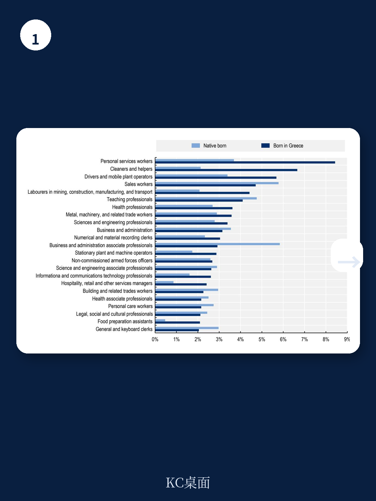
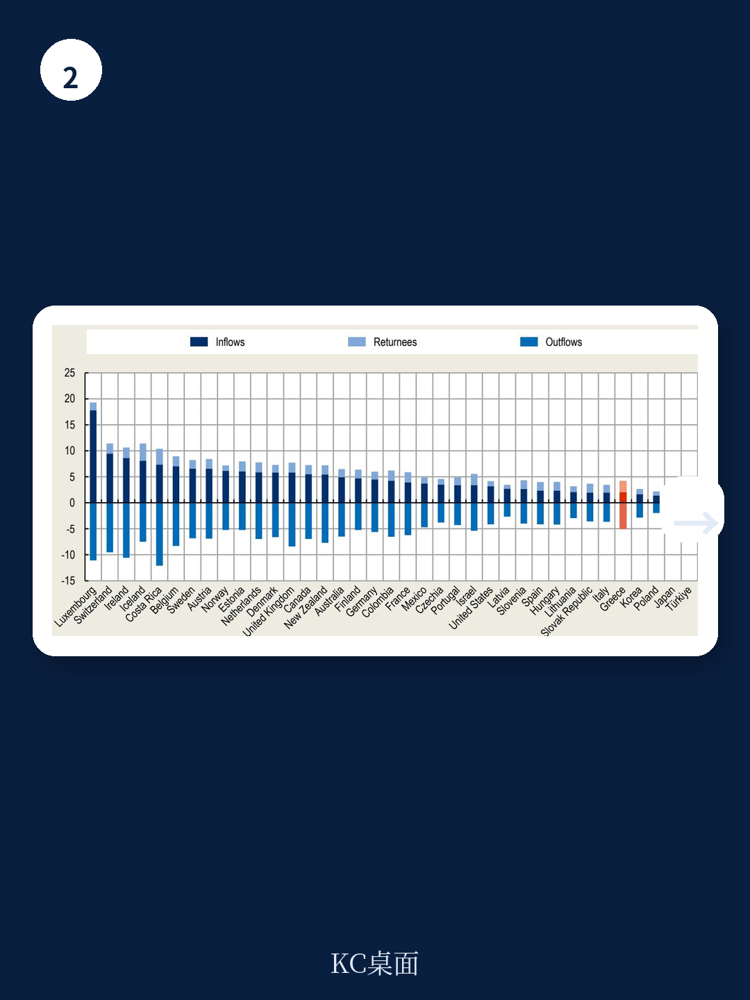

# 经合组织：希腊人才外流真相，不是流失，而是待激活的全球网络

希腊过去二十年经历了深刻的经济调整与复苏周期，伴随而来的是持续且规模可观的人才外流。当外界习惯性地将“人才流失”视为一个国家竞争力的负面信号时，经合组织（OECD）最新发布的《海外人才：希腊移民回顾》报告却提供了一个截然不同的分析框架：希腊海外侨民并非单纯的“流失”，而是一个规模庞大、教育水平高、且与本土经济存在持续互动潜力的“未激活资产”。报告的核心判断是，希腊面临的真正挑战不是如何阻止人才离开，而是如何通过制度设计，将海外人才的知识、网络和资本转化为国内经济增长的动力。

这份报告并非简单的数据罗列，它整合了OECD移民数据库、人口普查、希腊科学家全球分布图谱以及多项调查数据，首次对希腊侨民的人口结构、教育水平、劳动力市场表现、回流趋势以及政策框架进行了系统性的全景扫描。其结论对于任何一个面临人口结构转型和全球人才竞争的经济体，都具有参照价值。

> **KC评论：** 我们通常关注“人才流失”对母国的负面影响，但这份报告提醒我们，在全球化时代，人才流动的收益并非单向。关键问题在于母国是否具备“激活”海外人才网络的能力。报告中的图表和细分数据，恰恰揭示了哪些国家、哪些行业的人才回流潜力最大，这些细节比宏观结论更有价值。
>
> 继续看原文，真正有价值的是图表、假设和验证路径；完整报告与KC评论在每日汇编。

## 1. 海外希腊侨民规模持续扩大，但增速已放缓，结构性特征正在转变

报告数据显示，截至2020/21年，生活在OECD国家的希腊裔人口已超过110万，占希腊本土人口的约10%。这一数字自2005年以来持续上升，但增速在近十年已明显放缓。与许多欧洲国家相比，希腊的移民率（侨民占本土人口比例）处于较高水平，但并非最高。

更值得关注的是人口结构的变迁。早期移民（尤其是二战后移居德国、美国、澳大利亚的群体）正在老去，而近二十年的新移民则呈现出截然不同的画像：更年轻、更高学历、更多集中在知识密集型行业。报告特别指出，希腊侨民中的高学历（高等教育）比例显著高于希腊本土人口，也高于许多目的国本土人口的平均水平。这意味着，流出的并非“剩余劳动力”，而是经过本土教育体系投资后的优质人力资本。

从目的地分布看，德国依然是希腊侨民最大的聚居国，但美国、加拿大、澳大利亚等传统目的地由于早期移民自然减少，存量持续下降。与此同时，流向英国、瑞士、荷兰以及北欧国家的新移民在过去十年显著增加。这种地理分布的变化，反映了全球劳动力市场对高技能人才需求的区域分化。

## 2. 希腊移民的劳动力市场表现优于刻板印象，但存在结构性错配

一个反直觉的发现是：希腊侨民在目的国的劳动力市场表现并不差。报告数据显示，希腊裔移民的就业率与目的国本土人口基本持平，甚至在某些国家（如英国、瑞士）更高。失业率方面，虽然在2020/21年疫情期间有所上升，但整体差异并不悬殊。

然而，深入分析职业分布后，结构性错配问题浮现。希腊侨民在“专业人员”（professionals）和“文职与支持岗位”中占比最高，但在“中等技能”岗位（如技术工人、操作员）中明显低于目的国本土人口。这暗示了一个可能的“过度教育”或“资质不匹配”现象：许多希腊移民从事的职业低于其教育水平所对应的技能要求。

报告专门分析了希腊籍医生的跨国流动。数据显示，希腊是欧盟/欧洲经济区内的“医生净输出国”，2020/21年海外希腊籍医生数量是2000/01年的三倍。医生群体的高流动性，既是希腊医疗体系人才培养能力的体现，也反映了国内职业发展空间与薪酬竞争力的不足。

> **KC评论：** “劳动力市场表现不差”与“结构性错配”并存，是理解侨民经济贡献的关键。前者说明希腊人才具有全球竞争力，后者则提示，如果希腊能改善国内就业环境，吸引这些人才回流，其边际收益可能高于从零培养新人。报告中对医生群体的专门章节，值得医疗政策制定者仔细研读。

## 3. 回流趋势正在增强，但回流者的劳动力市场整合仍面临挑战

报告揭示了一个积极的信号：自2021年以来，希腊公民的回流人数持续增加。这得益于希腊经济复苏、部分行业（尤其是科技和旅游）的就业机会改善，以及政府推出的“Rebrain Greece”等人才回流计划。数据显示，2016-2021年间回流的移民中，超过一半拥有高等教育学历，且年龄集中在20-39岁——这正是劳动力市场中最具活力的群体。

然而，回流并非自动意味着成功整合。报告指出，回流者在重新融入国内劳动力市场时，面临多重障碍：职业资格认证的繁琐程序、对国内商业环境和行政流程的陌生感、以及薪资水平与国际经验不匹配。这些障碍不仅降低了回流的吸引力，也可能导致部分回流者选择再次离开。

一个值得注意的现象是，回流者中男性比例高于女性，且大多数人此前居住在另一个欧洲国家（德国和英国是最主要来源国）。这意味着，回流政策的设计需要针对不同性别、不同来源国和不同职业背景的群体进行差异化调整。

## 4. 希腊的侨民参与政策正在演进，但碎片化和评估缺失仍是短板

报告第六章专门评估了希腊的侨民参与和回流政策框架。近年来，希腊政府确实采取了一系列措施：设立“海外希腊人总秘书处”、推出“Rebrain Greece”计划、提供税收优惠吸引高技能人才回国、以及计划为海外侨民设立专门的议会选区。这些举措表明，政策制定者已经意识到侨民作为战略资源的重要性。

但报告同时指出了几个关键短板。第一，政策碎片化严重，多个部委和机构各自为政，缺乏统一的协调机制。第二，政策效果缺乏系统性的监测和评估，多数措施停留在“推出”层面，而无法回答“是否有效”以及“对谁有效”。第三，数据基础设施薄弱，对侨民规模、特征、意愿的实时追踪能力不足，导致政策制定依赖过时或不完整的证据。

报告建议，希腊应当建立一个“中央知识中心”，整合分散的研究、政策评估和最佳实践，并强化结果导向的监测评估体系。这一建议实际上指向了一个更深层的问题：政策制定者需要从“我们想要他们回来”的单向思维，转向“如何与他们建立互利互惠的长期关系”的双向视角。

> **KC评论：** 政策的碎片化和评估缺失，是许多国家侨民政策的通病。报告提出的“中央知识中心”建议，本质上是要建立一个“信息闭环”——只有知道谁在海外、他们想要什么、回来之后过得怎么样，政策才能精准有效。这一点对于中国各地“人才引进”政策的优化，同样具有借鉴意义。

## 5. 报告尚未完全回答的关键问题：回流意愿的真实驱动因素是什么？

尽管报告提供了详尽的定量分析，但在一个核心问题上仍有待深入：究竟是什么因素驱动了希腊侨民的回流意愿？报告中提到，部分调查显示“家庭原因”“文化归属感”是重要动机，但经济因素（薪资、职业发展、住房成本）和制度因素（行政效率、营商环境、公共服务质量）的相对权重，并未得到充分量化。

此外，报告对“回流后再次离开”的现象着墨不多。如果回流只是短暂过渡，而非长期定居，那么政策设计的逻辑就需要从“吸引回流”转向“促进循环流动”——即允许人才在国内外之间灵活切换，而不必做出“永久回归”的承诺。这一思路，对于高度全球化的高技能人才群体（如科研人员、工程师、金融从业者）可能更具现实意义。

这些未解问题，恰恰是读者在读完这份报告后最想继续探讨的方向。政策制定者需要的不只是“有多少人回来了”，更是“为什么回来”以及“如何让他们留下来”。

## 6. 对读者的观察框架：如何评估一个国家的“人才竞争力”

这份报告提供了一个超越希腊国别的分析框架，可以用来评估任何一个经济体在全球人才竞争中的位置。读者可以关注以下几个维度

第一，存量与流量的关系。不要只看侨民总数，要看新移民的增速、年龄结构和教育水平，这些才是未来竞争力的先行指标。

第二，劳动力市场的“质量匹配”而非“数量匹配”。高就业率不等于高效利用，过度教育和资质不匹配是隐性的人才浪费。

第三，回流政策的“漏斗模型”。从“意愿”到“行动”到“成功整合”，每个环节都存在流失，政策需要针对每个环节的障碍进行设计。

第四，制度能力的“基础设施”属性。数据、协调机制、评估体系，这些看似“软性”的要素，往往决定了人才政策的最终效果。

希腊的故事并非孤例。在人口老龄化、技术迭代加速的背景下，如何与海外人才建立可持续的互利关系，是几乎所有中等收入和高收入国家面临的共同课题。经合组织这份报告的价值，不仅在于提供了关于希腊的实证，更在于它展示了一种系统性的分析路径。

---

更多国际信源汇编与评论，扫码交流。每日更新，将单篇报告放回当天全球主线，汇总国际主流叙事、数据和图表，便于喂给AI进行深度分析，也便于人工快速扫描市场动态。这里汇聚了头部券商、PE/VC、投行、并购、对冲基金、资管机构、战略咨询和智库的朋友，期待与您交流。

Personal reading notes and learning share only. Not investment advice.
