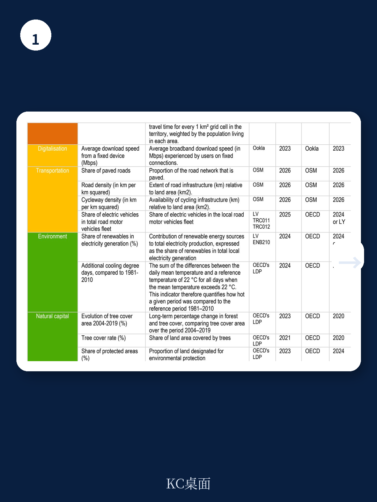
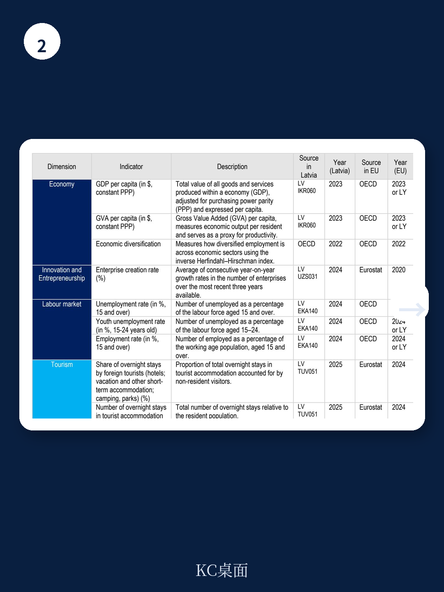

# 经合组织：拉脱维亚地方经济，真正的隐形资产，不是GDP而是森林和博物馆

拉脱维亚的地方经济正面临一个看似矛盾的局面：大量自然与文化资产并未转化为经济增长动力，而传统经济指标——GDP、就业率、人口——又无法捕捉这一结构性错配。经合组织（OECD）最新发布的拉脱维亚区域吸引力报告，首次在OECD国家中将“区域吸引力框架”下沉至市级层面，为42个市镇绘制了六维度的竞争力与生活质量诊断图。结论清晰：拉脱维亚最需要关注的，不是里加还能增长多少，而是那些拥有森林、博物馆、可再生能源，却留不住人、招不来游客的地区，到底缺什么。

这份报告的价值不在于描述“城乡差距大”这一已知事实，而在于提供了一个可横向比较、可纵向追踪的系统性诊断工具。它揭示了三层此前未被量化的结构性矛盾：第一，经济吸引力高度集中于里加及周边少数市镇，拉特加尔地区的人均产出甚至低于欧盟最落后地区的基准；第二，自然与文化资产是拉脱维亚多数地区真正的“隐形优势”，但从旅游收入、绿色产业到人才吸引，这些优势几乎没有转化为经济结果；第三，数字与物理连接性不足，是比经济差距更普遍、更基础的限制因素，它削弱了所有地区——无论经济强弱——利用自身资产的能力。

> **KC评论：** 这份报告最值钱的地方，不是它告诉你拉脱维亚有区域差距——这谁都知道。它真正做的是把“差距”拆解成了可操作的问题：哪些资产被浪费了？哪些连接断了？哪些市镇之间可以互补而不是竞争？完整报告里有一张“吸引力罗盘”图表，把每个市镇在六个维度上的表现画成一个雷达图，一眼就能看出哪个维度是短板。这种可视化工具，对地方政府制定优先级、对投资者判断选址，都比看GDP数据有用得多。

继续看原文，真正有价值的是这些图表背后的假设和验证路径——比如为什么有些市镇森林覆盖率远超欧盟均值，但旅游人数只有可比较地区的零头；为什么里加周边的市镇并没有享受到预期的经济溢出。完整报告与KC评论在每日汇编中提供，包含全部图表、数据来源和OECD的分析框架。

## 1. 经济吸引力高度集中，但真正的瓶颈不在经济本身

报告用六个维度衡量区域吸引力：经济表现、连通性、福祉、环境质量、自然资本、文化资产。在拉脱维亚，经济维度的分化最剧烈。里加及其周边少数市镇在人均GDP、劳动生产率、就业率等指标上接近或达到欧盟中位数，但其余大多数市镇远低于欧盟基准。拉特加尔地区的人均产出甚至低于欧盟最贫困地区的水平。

然而，报告的洞察不止于此。它发现，一些经济表现最弱的市镇，房价增速反而是全国最快的。这听起来反直觉，但仔细分析就能理解：当里加房价上涨迫使一部分人口向外迁移时，周边经济较弱的市镇承接了这部分需求，但并未因此带动本地产业升级或就业增长。房价上涨在这里不是经济活力的信号，而是结构性压力的溢出——它意味着人口在迁移，但经济活动没有跟上。

> **KC评论：** 这个发现提醒我们，不能只看单一指标做判断。一个地区房价涨得快，不一定说明它“好起来”了，可能只是说明它被“挤进来”了。完整报告里对每个市镇都做了这种多维度的交叉分析，比如把房价增速和就业增长率放在一起看，就能区分出“真增长”和“被动溢出”。这种分析框架，对任何关注区域经济的人都有参考价值。

## 2. 自然与文化资产是“沉睡的资本”，转化路径尚未打通

这是报告最令人意外的发现之一。拉脱维亚多数市镇在自然资本和文化资产维度上表现突出——森林覆盖率远超欧盟均值，可再生能源在部分市镇几乎占电力生产的100%，博物馆、剧院等文化设施密度也高于许多可比较的欧盟地区。但这些资产几乎没有转化为旅游收入、绿色产业或人才吸引力。

报告举了一个典型例子：某些拥有丰富文化遗产和自然景观的市镇，每年吸引的游客数量只有可比较欧盟地区的几分之一。问题出在哪里？报告指向了连通性和服务配套——旅行时间过长、数字基础设施不足、住宿和餐饮服务有限，导致“有资源、没流量”。换句话说，这些资产不是没有价值，而是因为连接性差，无法被市场“发现”和使用。

这一判断对政策制定者的含义很直接：与其在每个市镇都追求产业多元化，不如先解决“连接”问题——物理连接（道路、公共交通）和数字连接（宽带速度、5G覆盖）。只有连接通了，自然和文化资产才有可能被激活。

> **KC评论：** 这个逻辑可以推广到很多类似场景。一个地方有资源，不等于它能变现。中间缺的是“可及性”——人能不能方便地到达、能不能住下来、能不能发朋友圈。报告里有一张旅行时间到最近学校的图，你会发现拉脱维亚很多市镇的数值是欧盟中位数的几倍。这就是“连接性差距”最直观的体现。完整报告里还有数字连接速度的对比，同样触目惊心。

## 3. 连接性差距是比经济差距更基础的限制因素

报告将“连通性”拆分为两个子维度：数字连接（宽带速度）和物理连接（道路密度、旅行时间到学校和医院）。数据显示，拉脱维亚在这两个子维度上的内部差距，比经济维度上的差距更广泛、更均匀。也就是说，不仅是经济弱的地区连接性差，一些经济表现中等的市镇，其数字和物理连接也远低于欧盟基准。

这一点非常关键。因为连接性不足会系统性削弱其他维度的表现——没有好的网络，远程办公和数字创业就不可能；没有便捷的通勤，人才就不会选择居住；没有快速的物流，本地产品就难以进入全国市场。报告的逻辑链条很清楚：连接性不是区域发展的“锦上添花”，而是所有其他维度的基础条件。

> **KC评论：** 这也是为什么报告建议，拉脱维亚在制定区域政策时，应该优先解决连接性问题。不是因为其他维度不重要，而是因为连接性是“乘数”——它决定了其他资产能被利用到什么程度。一个森林覆盖率高但网络速度慢的地区，连吸引远程工作者都做不到，更别说发展生态旅游了。这个分析框架，对任何面临区域发展问题的国家都有启发。

## 4. 报告尚未完全回答的关键问题：治理能力的转化效率

报告花了大量篇幅分析拉脱维亚的多层级治理框架，指出了一些结构性问题：中央与地方的协调机制不够系统化，规划区域在投资决策中的话语权有限，市镇层面的数据能力和绩效评估能力参差不齐。2021年行政-领土改革虽然合并了市镇、扩大了财政基础，但改革后的治理体系能否真正将吸引力数据转化为政策行动，报告没有给出明确答案。

这里有一个报告没有完全展开的追问：即使有了更好的数据和更清晰的诊断，拉脱维亚的地方政府是否有足够的能力和授权去执行基于这些诊断的政策？报告提到了爱尔兰的“区域发展监测”模型作为参考——该模型将区域指标直接与法定规划义务挂钩，确保数据不只是被“看”，而是被“用”。但拉脱维亚目前缺少类似的制度化机制。

> **KC评论：** 这是报告最“麦肯锡”的地方：它不光给你诊断，还给你一个监测框架。但监测只是手段，不是目的。真正的挑战是：谁来推动执行？谁有预算？谁对结果负责？报告提到了爱尔兰模式，但没有深入讨论拉脱维亚的实际情况——比如市镇层面的人力资源是否足够、中央是否有意愿下放更多财权。这些是读完报告后值得继续追问的问题。

## 5. 对读者的观察框架：从“看GDP”转向“看六维雷达图”

综合这份报告的分析逻辑，可以提炼出一个更通用的观察框架，适用于任何一个面临区域发展问题的国家或地区

首先，不要只看经济指标。GDP、就业率、人口这些传统指标只能告诉你“怎么样”，不能告诉你“为什么”。你需要一套多维度的诊断工具，把经济、连接、环境、文化、福祉放在一起看，才能发现真正的瓶颈在哪里。

其次，区分“资产”和“可及性”。一个地区有森林、有博物馆、有可再生能源，不等于它能从中获益。真正决定资产能否变现的，是连接性——物理连接和数字连接。如果连接性差，再好的资产也是“沉睡的资本”。

第三，关注“错配”而不是“差距”。报告最有价值的发现，不是拉脱维亚有区域差距，而是这些差距的形态是“错配”的——文化资产丰富但旅游收入低，自然资本充足但绿色产业弱，房价上涨但就业没有跟上。错配意味着存在未被利用的机会，也意味着政策干预的切入点更清晰。

最后，治理能力是转化效率的瓶颈。即使有最好的数据和最清晰的诊断，如果地方政府没有能力、没有授权、没有预算去执行，这些诊断就只是纸上谈兵。报告的价值在于提供了一个可操作的起点，但真正的挑战在于如何把诊断转化为行动。

---

更多国际信源汇编与评论，扫码交流，每日更新。我们汇总国际主流叙事、数据与图表，观测市场边际变化。每日汇编会把单篇报告放回当天主线，整理成中文摘要、KC评论和图表合集，便于喂给AI，也便于人工快速扫市场dynamics。汇聚了头部券商、PE/VC、投行、并购、hedge fund、资管机构、战略咨询、智库等朋友，期待交流。

Personal reading notes and learning share only. Not investment advice.
