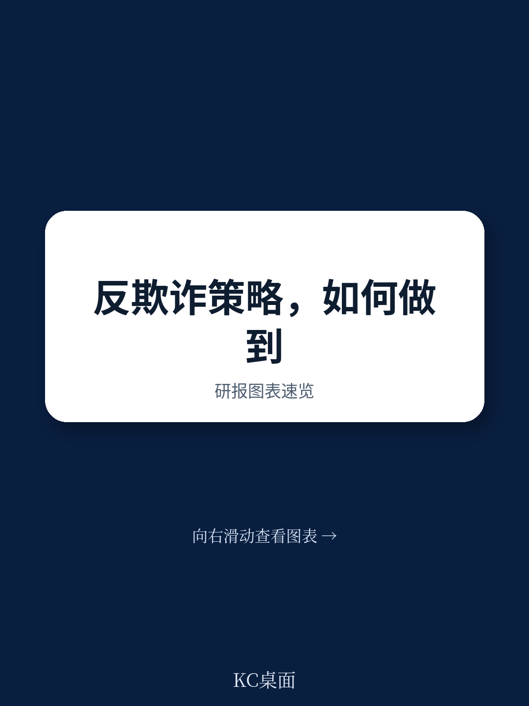
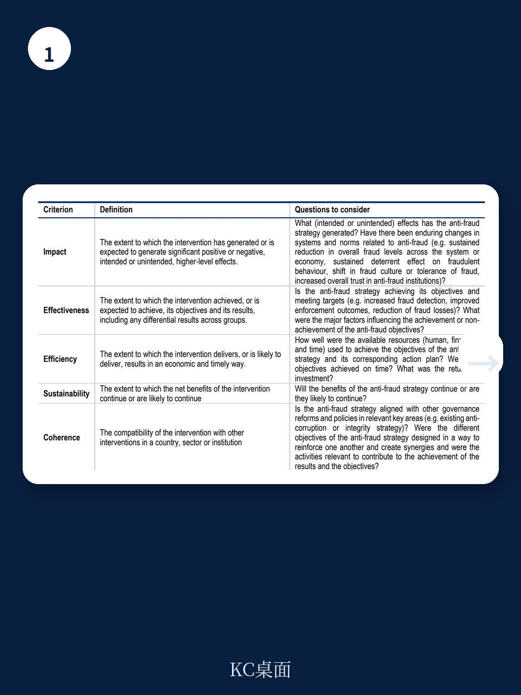
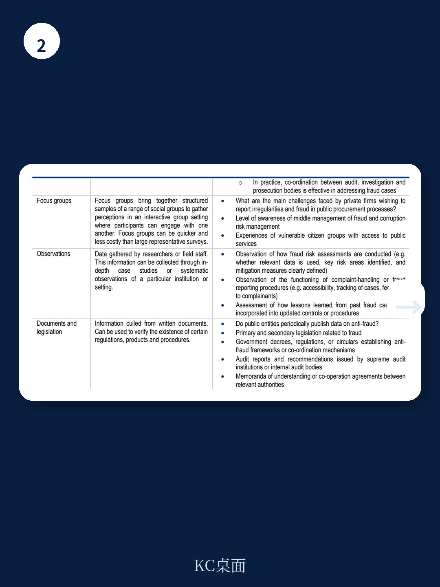

# 经合组织：5万亿美元欺诈损失背后，经合组织揭示战略评估缺失

全球欺诈规模正在以惊人的速度膨胀。根据注册舞弊审查师协会（ACFE）的全球调查，各类组织每年因职业欺诈损失的金额约占其总收入的5%，折合超过5万亿美元。欧洲检察官办公室（EPPO）2025年年度报告显示，欺诈及其他损害欧盟预算的犯罪所造成的损失估计约为250亿欧元，同比激增22.5%，其中超过一半与跨境增值税欺诈相关，且系统性涉及有组织犯罪。

面对这一趋势，各国政府并非毫无作为。越来越多的国家已采纳国家反欺诈战略（NAFS），试图从碎片化的机构干预转向“全政府”协同应对。然而，经合组织（OECD）最新发布的《评估、更新与监测反欺诈策略：方法论》报告揭示了一个尴尬的现实：大多数国家的反欺诈努力，卡在了“如何证明自己有效”这一环节。

这份报告的核心判断是：当前反欺诈战略的最大短板，并非技术能力不足或法律框架缺失，而是缺乏一套设计严谨、嵌入战略周期、能够产生可验证证据的监测与评估（M&E）体系。没有这套体系，战略更新就只能依赖直觉而非证据，资源分配就难以优先排序，而公众信任也将因无法看见结果而持续流失。

> **KC评论：** 如果用一个词概括这份报告的核心主张，那就是“证据链”。报告提供的不是一本反欺诈操作手册，而是一套方法论——如何设计指标、如何评估影响、如何将评估结果反馈到下一轮战略制定。对于任何一个正在制定或更新反欺诈战略的国家或机构，这套框架的价值不在于告诉你“该做什么”，而在于告诉你“如何知道自己做得对不对”。继续看原文，真正有价值的是图表、假设和验证路径；完整报告与KC评论在每日汇编。

## 1. 反欺诈战略的M&E体系，最晚应在战略设计阶段就嵌入

报告明确指出，监测与评估体系最有效的设计时机，是在战略周期的最早期——而不是在执行中后期才“补课”。这意味着，反欺诈战略的制定者需要在设定战略目标的同时，就明确回答三个问题：我们如何知道进展顺利？我们如何判断措施有效？我们如何识别需要调整的信号？

报告提出的核心工具是“变革理论”（Theory of Change,ToC）。这不是一个抽象的概念框架，而是一个具体的因果链条：从输入（资源、人员、资金）到活动（培训、审计、数据共享），再到产出（完成的检查数量、发布的指南）、成果（欺诈风险下降、检测率提升）和最终影响（公共支出完整性增强、公众信任恢复）。

以预防阶段为例，报告展示了一个完整的ToC模型：如果投入资源开展针对特定欺诈类型的宣传活动，那么产出是宣传活动覆盖的公民数量，成果是公民对欺诈风险的认知提升，最终影响是欺诈报告数量的增加和欺诈成功率的下降。关键在于，每一个环节都必须有可衡量的指标，且这些指标必须建立在可靠的基线数据之上。

> **KC评论：** 报告反复强调的“基线数据”是很多机构最容易忽视的一环。没有基线，就没有办法衡量变化。一个常见的错误是只追踪“做了多少培训”“发了多少指南”，而不去追踪“培训后欺诈行为是否减少”“指南是否被实际用于决策”。这正是报告所说的“行政报告陷阱”——看起来在忙，但无法证明忙出了什么结果。完整报告中的指标设计章节和附件B的成果与影响指标目录，值得仔细研读。

## 2. 中期评估的价值被严重低估，它不仅是“纠偏工具”，更是“学习机制”

报告将评估分为中期评估和终期评估，并特别强调了中期评估的战略价值。在很多国家的实践中，评估往往被视为一个“期末作业”——战略周期结束后，写一份报告归档，然后开始制定下一轮战略。这种做法的致命缺陷在于：评估结果无法影响正在执行的战略。

中期评估的核心价值在于，它能够在战略执行过程中提供“实时反馈”。报告建议，对于5年期的反欺诈战略，中期评估应在第2-3年进行。此时，战略已执行了一段时间，有足够的数据来判断哪些措施有效、哪些措施需要调整，同时还有足够的时间窗口来实施纠偏。

报告借鉴了OECD发展援助委员会（DAC）的六项评估标准：相关性、一致性、有效性、效率、影响和可持续性。将这套框架应用于反欺诈战略，意味着评估者需要回答：战略目标是否仍然符合当前的欺诈风险格局？各项措施之间是否存在冲突或重叠？资源投入是否产生了预期的产出和成果？是否存在意想不到的正面或负面影响？战略成果能否在外部环境变化后持续？

> **KC评论：** 这里有一个容易被忽略的洞察：评估的“独立性”比评估的“专业性”更重要。报告提到，如果评估由执行机构自行完成，往往存在“报喜不报忧”的倾向。真正有价值的评估，应该由独立的第三方或至少是战略协调机构来主导，且评估结果必须公开。这不是为了“找茬”，而是为了让整个系统形成“基于证据的自我纠偏”文化。完整报告中的评估工作流图和评估问卷样本，是实操性最强的部分。

## 3. 监测不是“填表汇报”，而是“风险信号系统”

报告将监测与评估严格区分：监测是持续性的、系统化的数据收集和分析，目的是追踪执行进度、识别瓶颈和风险；评估是阶段性的、深度的因果判断，目的是回答“为什么有效或无效”。

在实践中，很多国家的监测体系沦为“行政汇报”——各部门定期提交一份表格，列出完成了多少培训、发布了多少指南、处理了多少案件。这些数据固然有用，但报告指出，它们只能回答“做了多少”，无法回答“做得好不好”，更无法回答“欺诈风险是否真的降低了”。

真正的监测体系应该具备三个特征：第一，指标设计要覆盖从输入到成果的全链条，而不仅仅是产出层面；第二，数据来源要多元化，不能仅依赖执行机构的自我报告，还应包括独立验证、公民反馈、第三方审计等；第三，监测结果要能够触发决策——当发现某项措施严重滞后或偏离预期时，必须有明确的机制来启动调整程序。

报告特别提到了“参与式监测”的价值。哥伦比亚的案例显示，让公民社会组织、学术界、媒体和私营部门参与监测，不仅能拓宽数据来源、提高分析质量，还能增强问责机制和公众信任。乌克兰的国家反腐败计划监测门户网站，则提供了一个技术层面的范例——所有监测结果公开透明，公众可以实时查看各项措施的执行进度。

> **KC评论：** 报告没有完全展开的一个关键问题是：如何确保监测数据不被“美化”？当执行机构知道自己被监测时，数据质量可能反而下降——因为存在粉饰业绩的动机。这个问题在反腐败和反欺诈领域尤为突出。报告提到了独立验证的重要性，但没有给出具体的机制设计建议。这可能是读者在阅读完整报告后需要进一步思考的方向——如何设计一个“防操纵”的监测体系？

## 4. 反欺诈传播是一把双刃剑：过度警示可能适得其反

这份报告的一个独特贡献在于，它专门讨论了反欺诈战略中的传播策略，并提出了一个反直觉的判断：过度强调欺诈的普遍性，可能反而会助长欺诈行为。

报告警告说，如果传播内容过于渲染欺诈的严重程度和普遍性，可能会产生两种负面效应：一是“正常化效应”——当人们觉得“大家都在这么做”时，自己的道德约束会放松；二是“无力感效应”——当人们觉得问题太大、无法解决时，会倾向于放弃举报或配合。

因此，反欺诈传播的核心原则应该是：聚焦于可信、建设性的信息，针对不同受众定制内容，并与具体的改革行动和问责机制挂钩。与其说“欺诈损失高达5万亿美元”，不如说“我们正在通过X项具体措施，将某类欺诈的检测率提升了Y%”。

报告提出了一套反欺诈宣传活动的一般设计原则，包括：明确目标受众、使用具体案例而非抽象数据、强调正面行动（如举报渠道和奖励机制）、避免使用可能引发恐惧或无助感的语言。这些原则看似简单，但在实际执行中经常被违反——尤其是当政府希望通过“震撼性数据”来争取公众支持时。

> **KC评论：** 这个洞察对任何国家的政策传播都有启发意义。在反欺诈、反腐败、公共卫生等领域，“恐吓式传播”往往短期有效、长期有害。报告没有展开的是：如何量化传播策略的“副作用”？如何判断一条反欺诈信息是“激励了举报”还是“助长了无力感”？这需要更精细的监测指标，可能也是完整报告中值得继续深挖的部分。

## 5. 报告尚未完全回答的关键问题：M&E体系的“成本-收益”如何衡量？

尽管这份方法论报告在M&E体系的设计上提供了详尽的框架，但它对一个根本性问题着墨不多：建立一个高质量的监测与评估体系，本身需要投入多少资源？这些投入的回报如何衡量？

报告承认，很多国家之所以缺乏有效的M&E体系，部分原因在于“资源约束”——无论是人力、财力还是技术能力。但报告没有给出一个清晰的“成本-收益”分析框架。对于一个中等规模的国家而言，建立一个覆盖全国的反欺诈M&E体系，需要多少专职人员？需要什么样的数据基础设施？每年需要多少预算？这些投入与减少的欺诈损失之间，是否存在可量化的比例关系？

这是一个关键的缺口。如果没有这个分析框架，决策者在面对“是否要投资M&E体系”这个问题时，仍然缺乏充分的决策依据。报告提到的“欺诈损失测量框架”（IPSFF）提供了一个方向，但距离一个完整的M&E投资回报模型还有距离。

## 6. 读者可以带走的观察框架：用三个问题检验任何反欺诈战略

基于报告的核心逻辑，我们可以提炼出一个简洁的观察框架，用于审视任何一个国家或机构的反欺诈战略是否“靠谱”

第一，这个战略是否在制定之初就明确了“如何证明自己有效”？如果战略文件中没有出现“监测指标”“基线数据”“评估计划”等关键词，那么它大概率会落入“行政汇报”陷阱。

第二，这个战略是否设计了“中期纠偏机制”？如果战略周期是5年，但唯一的评估安排在期末，那么它本质上是一个“死战略”——无法适应外部环境的变化。

第三，这个战略的传播策略是否经过了审慎设计？如果公众看到的只是“欺诈损失惊人”的恐吓性信息，而没有“我们正在做什么、效果如何”的建设性信息，那么传播本身可能正在削弱反欺诈努力。

这三个问题看似简单，但报告提供的证据表明，能够同时满足这三条的反欺诈战略，在全球范围内仍属少数。

这份报告的价值，不仅在于它提供了一套M&E方法论，更在于它揭示了反欺诈领域一个被长期忽视的悖论：我们越是急于证明反欺诈努力的有效性，就越需要先投入资源去建立一个能够证明有效性的体系。没有这个体系，再多的培训、审计和宣传活动，都只是在黑暗中掷骰子。

更多国际信源汇编与评论，每日更新，汇总国际主流叙事、数据与图表，观测边际变化。每日汇编会将单篇报告放回当天主线，整理成中文摘要、KC评论和图表合集，便于喂给AI，也便于人工快速扫描市场dynamics。这里汇聚了头部券商、PE/VC、投行、并购、hedge fund、资管机构、战略咨询、智库等朋友，期待交流。

Personal reading notes and learning share only. Not investment advice.
