OECD Social, Employment and Migration Working Papers
No. 333

Geographic disparities in service accessibility in Estonia and the Netherlands: How transport modes, proximity and capacity shape accessibility across cities, towns and rural areas

Vanda Almeida,
Filippo Brunelli,
Jakub Caisl,
Alessandro Giordano,
Claire Hoffmann,
Sebastian Königs,
Ana I. Moreno-Monroy,
Tainá Pacheco,
Mauricio Salazar-Lozada

# Geographic disparities in service accessibility in Estonia and the Netherlands

How transport modes, proximity and capacity shape accessibility across cities, towns and rural areas

JEL classification: I24, J13, O18, R23, R53

Vanda ALMEIDA (ELS/JAI; vanda.almeida@oecd.org);

Filippo BRUNELLI (EC DG JRC; filippo.brunelli@ec.europa.eu);

Jakub CAISL (EC DG EMPL; jakub.caisl@ec.europa.eu);

Alessandro GIORDANO (EC DG JRC ; alessandro.giordano@ec.europa.eu)

Tainá PACHECO (CFE/EDS; taina.pacheco@oecd.org);

Mauricio SALAZAR-LOZADA (formally CFE/EDS)

## Disclaimers

The opinions expressed and arguments employed are those of the authors. This work, as well as any data and map included herein, should not be reported as representing the views of the OECD Member countries or the OECD Secretariat or of the European Commission.

ISBN 978-92-68-41040-0

Catalogue number KE-01-26-075-EN-N

© OECD/European Union 2026

## Attribution 4.0 International (CC BY 4.0)

This work is made available under the Creative Commons Attribution 4.0 International licence. By using this work, you accept to be bound by the terms of this licence (https://creativecommons.org/licenses/by/4.0/).

Attribution – you must cite the work.

Translations – you must cite the original work, identify changes to the original and add the following text: In the event of any discrepancy between the original work and the translation, only the text of the original work should be considered valid.

Adaptations – you must cite the original work and add the following text: This is an adaptation of an original work by the OECD and the European Union. The opinions expressed and arguments employed in this adaptation should not be reported as representing the official views of the OECD, its Member countries or the European Union.

Third-party material – the licence does not apply to third-party material in the work. If using such material, you are responsible for obtaining permission from the third party and for any claims of infringement.

You must not use the OECD's or the European Commission's respective logo, visual identity or cover image without express permission or suggest the OECD or the European Commission endorse your use of the work.

Any dispute arising under this licence shall be settled by arbitration in accordance with the Permanent Court of Arbitration (PCA) Arbitration Rules 2012. The seat of arbitration shall be Paris (France). The number of arbitrators shall be one.

## Abstract

Access to enabling services is an important determinant of labour market participation and social inclusion. This paper examines the role of capacity constraints and public transport access in shaping the accessibility of early childhood education and care (ECEC), primary schools and Public Employment Services (PES) at the municipal level and across degrees of urbanisation in Estonia and the Netherlands, drawing on data on service locations, capacity, enrolment and local transport infrastructure. The results confirm a clear urban-rural gradient in physical accessibility. However, proximity alone provides an incomplete picture: people in more densely populated areas benefit from shorter travel times, but high demand pressure and capacity constraints can result in lower competitive accessibility compared to less densely populated areas. In both countries, 13% to 14% of children in primary school face a double disadvantage of longer travel times and below-median competitive accessibility. For PES, geographic disparities in public transport provision can represent a source of vulnerability for people without access to a private motor vehicle.

## Acknowledgements

The authors gratefully acknowledge the inputs and advice provided by the Dutch and Estonian authorities, notably Ousmane Macalou and Tara Vissenberg from Dutch Ministry of Social Affairs and Employment, Bart Wezeman and Athithya Loganathan from the Dutch Central Bureau for Statistics, Eha Lannes from the Estonian Ministry of Social Affairs as well as Eda Tagamets from the Estonian Ministry of Education and Research.

The paper has benefited from comments provided by various EC and OECD colleagues, including Stéphane Carcillo (OECD Directorate for Employment, Labour and Social Affairs), Rüdiger Ahrend and Bernhard Nöbauer (OECD Centre for Entrepreneurship, SMEs, Regions and Cities), Anais Gradinger, Katarina Jaksic and Alina Winter (DG EMPL), and Lewis Dijkstra, Juan Nicolas Ibañez, Klara Nosan and Jaime Sierra (Joint Research Centre of the European Commission).

Earlier versions of this paper were discussed at the Employment, Labour and Social Affairs Committee in March 2025, at the Working Party on Territorial Indicators in November 2025, at the Working Party on Social Policy in March 2026, at the Regional Development Policy Committee in April 2026, and at the ISI Regional Statistics Conference and the EC-JRC Transport Poverty and Accessibility Workshop in May 2026.

This document was produced with the financial assistance of the European Union, EC-OECD grant “Monitoring inequalities for inclusive policy responses”. The opinions expressed and arguments employed herein do not necessarily reflect the official views of the OECD member countries or the European Union.

# Table of contents

Abstract 3   
Acknowledgements 4   
1. Introduction 7   
2. Institutional background 10   
2.1. Early childhood education and care and primary education in Estonia and the Netherlands 10   
2.2. Public employment services in Estonia and the Netherlands 11   
3. Indicators, transport modelling and data 13   
3.1. Accessibility indicators 13   
3.2. Transport modelling and data 16   
3.2.1. Transport modelling 16   
3.2.2. Service demand 17   
3.2.3. Service locations and capacity 17   
3.3. The geographic distribution of service facility locations 19   
4. Results 22   
4.1. When accessing ECEC and primary school services most families face a trade-off between competitive accessibility and travel times 22   
4.1.1. Travel times are generally longer in less densely populated areas, and access to a motor vehicle often remains essential for bridging this gap 22   
4.1.2. For short travel times, competitive accessibility is higher in cities and towns than in rural areas, but the gap often narrows at longer travel times 23   
4.1.3. The case for applying travel time thresholds that vary by the degree of urbanisation 25   
4.1.4. Many families face a trade-off between the travel time to reach a certain service and the local competition they face for the capacity of this service 26   
4.2. Travel times to public employment services can be long for users who depend on public transport and those living in lower-accessibility areas 32   
4.2.1. Travel times to PES centres by motor vehicle are short for the median person 32   
4.2.2. Without access to a motor vehicle, the median person often faces long travel times to the nearest PES, except in cities 34   
4.2.3. For people with lower accessibility, taking public transport may not be a viable option even in cities 37   
5. Conclusions 38   
References 40

## 6

Annex A. Data sources and processing 45  
Annex B. Transport modelling 47  
Driving, cycling and walking networks 47  
Public transport networks 47  
Annex C. Additional results 48

## Tables

Table 1. Degree of urbanisation (DEGURBA level 1) definitions 15  
Table 2. Population statistics for Estonia and the Netherlands by degree of urbanisation 16  
Table 3. Measured capacity relative to demand is lower for ECEC than for primary schools, and shows greater variation by degree of urbanisation 18  
Table 4. Distribution of facilities and capacity by degree of urbanisation 21  
Table A.1. Data sources for service facilities 45  
Table C.1. Median travel time thresholds by service, transport mode and degree of urbanisation 52

## Figures

Figure 1. Primary schools are evenly distributed in space in both Estonia and the Netherlands 19  
Figure 2. In the Netherlands, unlike in Estonia, PES facilities are located exclusively in cities 20  
Figure 3. Travel times to the nearest ECEC facility and primary school are longer in rural areas than in cities and towns by walking and public transport, but similar by driving 23  
Figure 4. In Estonia, competitive accessibility levels are much higher in cities at short travel times, but converge across area types at longer travel times 25  
Figure 5. In the accessibility to primary schools, many children in cities face short travel times but lower competitive accessibility 28  
Figure 6. In Estonia, spatial variation is large in the share of children facing a double penalty of above-median travel times and below-median competitive accessibility 29  
Figure 7. A transport poverty indicator reveals clear urban-rural disparities, with low competitive accessibility even at long travel times for the least well-served in rural parts of Estonia 31  
Figure 8. In most LAUs, driving times to the closest PES facility are shorter than 30 minutes for the median person, both in Estonia and the Netherlands 33  
Figure 9. Only few people in Estonia and the Netherlands are located further than a 20-minute drive from a PES centre in cities, or a 40-minute drive in rural areas 34  
Figure 10. For the median user, taking public transport adds substantially to travel times in many localities, not just in rural areas 36  
Figure 11. For the $20\%$ of people with lowest accessibility, public transport is often not a viable alternative to a motor vehicle 37  
Figure C.1. ECEC facilities are evenly distributed in space in both Estonia and the Netherlands 48  
Figure C.2. Accessibility by walking is similar across area types, but for public transport disparities arise between cities and towns and rural areas at longer travel times 49  
Figure C.3. In the accessibility of ECEC, many children in cities face short travel times but lower competitive accessibility 50  
Figure C.4. Median travel times to the closest PES by public transport are higher than 40 minutes in most LAUs 51

## Boxes

Box 1. The degree of urbanisation classification 15
Box 2. Transport poverty as a measure of accessibility disadvantage 30

## 1. Introduction

Ensuring good and equitable accessibility of enabling services is fundamental for labour market and social inclusion, territorial and social cohesion and people's well-being. Poor access to key services – such as childcare, education, employment support and training, and medical care – limits people's chances to build human capital, constrains labour supply, and implies higher financial and time burdens on individuals. Limited access to childcare services and schools can also hinder children's opportunities to learn and acquire new skills, reinforcing existing inequalities and the intergenerational transmission of disadvantage. At the territorial level, poor service accessibility may accelerate depopulation in economically lagging regions and weaken local labour markets, contributing to widening regional disparities (OECD, 2021[1]; 2023[2]). Against this backdrop, accessibility of enabling services lies at the centre of the employment and social policy agenda in many OECD and EU countries. $^{1}$

Studies that empirically assess people's accessibility to enabling services have mostly focused on physical accessibility, measured as distances or travel times to reach the nearest service facility, and the associated costs (Almeida et al., 2024[3]; Bruno et al., 2022[4]; Giordano, Aycart and Ibáñez, 2025[5]; Luo and Qi, 2009[6]; Martínez et al., 2021[7]; OECD/EC-JRC, 2021[8]; Pennerstorfer and Pennerstorfer, 2020[9]). This literature shows that physical accessibility often varies systematically along the urban-rural gradient, with rural residents having fewer nearby service options, hence often facing longer travel times. Recent methodological advances, such as new measures of competitive accessibility, provide a more comprehensive picture by accounting also for capacity constraints and local competition for the available services (Jacobs-Crisioni et al., 2023[10]; Moreno-Monroy, Lovelace and Ramos, 2018[11]). These measures reveal potential trade-offs between proximity and service capacity, which may alter – or even reverse – conclusions based solely on physical accessibility.

Beyond the choice of accessibility indicators, the selection of transport modes is crucial when measuring accessibility. While driving and walking are the modes most commonly used in empirical analysis (Pérez, 2025[12]; Mouratidis, 2026[13]), public transport and cycling play an important role for many services users. This is true particularly for individuals who do not have access to a private motor vehicle or those facing long driving times, either due to congestion or because they live in a place where road infrastructure is patchy. However, modelling public transport in accessibility analysis poses significant challenges as it requires capturing highly complex, dynamic systems. Public transport networks operate on schedules that often change by time of day, weekday versus weekend, and season, making accessibility measures sensitive to temporal assumptions used in models. Data limitations further complicate the analysis: service reliability, delays, and overcrowding are often poorly captured, or excluded altogether. Moreover, first- and last-mile connections, walking environments, and transfer times are difficult to quantify, yet can be decisive in determining whether services are realistically reachable. For all these reasons, public transport data are difficult to obtain, being available for research purposes only in few countries and regions.

This paper contributes to the literature on service accessibility in three main ways. First, it develops a methodological framework for measuring geographic disparities in service accessibility combining minimum travel times and competitive accessibility, hence allowing for a joint assessment of proximity and capacity constraints. $^{2}$ Second, it applies this framework using a multimodal transport modelling that considers walking, cycling, driving and public transport. Third, in contrast to most existing studies that focus on larger territorial units (often small NUTS3/TL3 regions), the analysis presents indicators by degree of urbanisation and at the level of local administrative units (LAU). This approach offers important analytical and policy advantages: LAU-level data capture fine-grained spatial variation that is often masked in regional analysis enabling a more accurate identification of local inequalities, service gaps, and place-specific needs. At the same time, classifying results by degree of urbanisation provides a consistent framework for comparing areas with similar settlement patterns across regions and countries.

The paper applies this framework to study geographic disparities in service accessibility in two countries, Estonia and the Netherlands. While both countries have a similar surface area, they substantially differ in population density: the Netherlands, with its around 18 million people, is one of the most densely populated countries in Europe. Estonia has only about 1.4 million people, and large areas of the country are only sparsely populated. Estonia and the Netherlands also provide an interesting comparison in their spatial settlement patterns and models of service provision: Estonia combines dispersed settlement structures with relatively decentralised service provision, while the Netherlands combines high density with greater spatial concentration of certain services. These differences offer a valuable opportunity to study how spatial structures, transport networks and institutional choices jointly shape people's ability to reach enabling services. $^{3}$ However, both Estonia and the Netherlands are relatively small and flat countries, and the results from the analysis may not generalise to larger, geographically more diverse countries.

Out of the broad scope of services that are critical to preserving life, health, public safety and the basic functioning of EU and OECD societies, the analysis focuses on three types of services that are key for labour market and social participation: early childhood education and care (ECEC), primary education, and public employment services (PES). In doing so, it closely follows earlier related work on service accessibility by Almeida et al. (2024[3]), whose service geolocation data the analysis builds on. The focus on these services partly reflects their importance at a time where many EU and OECD societies are increasingly affected by the labour market and societal effects of the demographic transition, including growing skill shortages. Access to quality ECEC services and primary education is an important factor in the residential choices, family formation, and labour supply decisions of young couples, and has therefore the potential to affect the supply of skilled labour. Access to quality ECEC is important also for child well-being and development, with unequal access to ECEC being one of the root causes of socio-economic inequalities later in life (OECD, 2021[14]). Meanwhile, PES play a central role in addressing skills shortages by providing jobseekers with guidance, counselling and job search assistance and connecting them with employers and training opportunities (Lauringson and Lüske, 2021[15]).

## The main findings from the analysis are:

\- Service proximity follows a clear urban-rural gradient. In both countries, median travel times to the nearest ECEC facility and primary school consistently increase from cities to towns and semi-dense areas, and further to rural areas, mirroring earlier findings presented at regional level in Almeida at al. (2024[3]). For example, in Estonia, the median family in a city can walk to the nearest ECEC facility or primary school within 10 minutes, while the median family in a rural area far from a city needs more than 40 minutes. These differences remain large when considering service accessibility by public transport but disappear for driving. This highlights the role of access to a motor vehicle for overcoming accessibility gaps in rural areas.

\- Proximity alone provides an incomplete picture of ECEC and primary school accessibility, as it does not account for possible capacity constraints and competition for available seats. Competitive accessibility indicators show that there can be significant trade-offs between these two dimensions. While families in cities typically benefit from shorter travel times to the nearest service facility, higher demand pressure and capacity constraints can result in lower competitive accessibility than in towns, semi-dense and rural areas.

\- Most families either face a trade-off between travel times and competition for available seats or enjoy favourable access conditions along both dimensions. However, in both countries, a sizeable share of families – around 14% of children attending primary school – face both longer travel times and lower competitive accessibility than usual for families living in areas with the same degree of urbanisation. Patterns vary across degrees of urbanisation and transport modes, underlining persistent inequalities in access to enabling services. For example, in the Netherlands, the share of children facing a double disadvantage of long travel times and low competitive accessibility using public transport is twice as high in rural areas close to a city than in cities (24% vs 12%).

\- Important gaps in public transport provision remain a source of vulnerability for families without access to a private motor vehicle in reaching PES. In many LAUs, travel times by motor vehicle to the next PES facility are below 20 minutes for the median user, but they often exceed 40 minutes by public transport. This can make it impractical, or even unfeasible, for people to reach the nearest PES using this transport mode.

The remainder of this paper is organised as follows. Section 2. describes the institutional context in Estonia and the Netherlands. Section 3. presents the data, indicators, and transport models used in the analysis. Section 4. provides the main results and derives some key policy messages. Section 5. concludes.

## 2. Institutional background

This section describes the institutional background, providing information on the organisational structure and responsibilities of service provision for ECEC and primary education (Section 2.1) and PES (Section 2.2) in Estonia and the Netherlands that may matter for the interpretation and comparability of results.

## 2.1. Early childhood education and care and primary education in Estonia and the Netherlands

Local governments in Estonia are required to provide all children aged 1.5 to 7 years who permanently live in their catchment areas with ECEC (ISCED level 0) in the form of childcare (for children aged 1.5 to 3 years) or kindergarten (age 3 to 7 years) (European Commission, 2025[16]; 2025[17]). $^{4}$ Most children who participate in ECEC attend institutions $^{5}$ that provide fully integrated kindergarten/pre-school services (koolieelne lasteasutus) and that fall under the responsibility of the Ministry of Education and Research. Until 2025, Estonia also had a separate system of centre- or home-based daycare services (regulated childminders, lapsehoiuteenus) primarily for children up to the age of 3 years and under the responsibility of the Ministry of Social Affairs. Since the entry into force of the new Early Childhood Education Act in September 2025, these childcare services have been integrated into the formal ECEC system under the Ministry of Education and Research. ECEC attendance is voluntary, and almost all children from the age of three to compulsory-schooling age participate (over 95%, above the EU average). Participation for children below three years of age is considerably lower, at about 37%, falling slightly below the EU average (Eurostat, 2025[18]). $^{6}$

Primary education (ISCED level 1) in Estonia is compulsory for children who reach the age of 7 by the start of October of a given year until they reach the age of 13 years (Estonian Ministry of Education and Research, 2024[19]; OECD, forthcoming[20]). It is offered in primary schools (grades 1 to 6) and basic schools (grades 1 to 9).

In the Netherlands, various forms of ECEC exist for children from the age of six weeks up until they leave primary school at the age of 12 (European Commission, 2025[21]):

\- Daycare centres (kinderdagverblijven, KDV), operated under the Ministry of Social Affairs and Employment, are available for children up to the age of 4 years, as the main solution for the youngest children.

\- Primary schools (basisscholen), operated under the Ministry of Education, Culture and Science, provide ECEC free of charge for children aged 4 and 5 (kleuterklas). Although provided in primary schools, these two first years of basisschool still correspond to pre-primary education (ISCED level 0). Primary schools are also legally obliged to organise out-of-school care (buitenschoolseopvang, BSO) for pupils outside of school hours upon parents' request.

\- Regulated childminders (voorziening voor gastouderopvang, VGO) provide home-based ECEC for children up to the age of 13. They fall under the remit of the Ministry of Social Affairs and Employment and are registered in the Dutch National Childcare Register.

\- Targeted early childhood education programmes (voor- en vroegschoolse educatie, VVE) provide additional support to children from disadvantaged backgrounds between the ages of 2.5 and 6 years (European Commission, 2025[21]). $^{7}$

Participation rates are high, with almost 80% of children below three years of age and more than 95% of pre-school children above this age participating (Eurostat, 2025[22]). However, it is typical for children to participate in formal ECEC only a few days per week. $^{8}$

Primary education (ISCED level 1) in the Netherlands starts at age 6 with group 3 of basisschool and usually goes up to the age of 12 under the responsibility of the Ministry of Education, Culture and Science (OECD, forthcoming[20]). An important implication is that – for the purposes of this paper – the demand for primary school services is larger than just the demand for primary education, as it includes the two years of pre-primary education.

## 2.2. Public employment services in Estonia and the Netherlands

The provision of public employment services in Estonia lies with the Estonian Unemployment Insurance Fund (EUIF, Eesti Töötukassa), which operates under the supervision of the Ministry of Economic Affairs and Communications. It is responsible, inter alia, for the management of the jobseeker register, the design and implementation of active labour market policies (ALMPs), the assessment of people's work capacity, and the disbursement of unemployment benefits and work ability allowance for people with partial or no work capacity (OECD, 2021[23]; Estonian Unemployment Insurance Fund, 2025[24]). The EUIF also provides and coordinates training services for both unemployed and employed workers, including labour market training to acquire general or professional skills necessary for securing employment, and vocational training grants for employers. Means-tested subsistence benefits are administered separately by local governments, who assess needs, determine eligibility, and pay out benefits to households whose income falls below established subsistence levels.

In the Netherlands, public employment services are overseen by the Ministry of Social Affairs and Employment, who delegates benefit administration and the implementation of labour market policy to the Employee Insurance Agency (Uitvoeringsinstituut Werknemersverzekeringen, UWV) (De Moraes, Gomez Tamayo and Andrea, 2023[25]). The UWV manages unemployment and disability insurance schemes, conducts labour market analysis, and oversees employer services such as dismissal assessments and work permits. Through its operational arm, UWV Werkbedrijf, it delivers employment services, including jobseeker registration, benefit payouts, job placement, and profiling. UWV Werkbedrijf commissions vocational training, work placements, and soft-skills development from accredited private reintegration providers under performance-based contracts and procures these ALMPs through competitive tender processes. Municipalities administer means-tested social assistance benefits and oversee the reintegration of social assistance benefit recipients, playing a significant role in ALMP delivery.

Across EU and OECD countries, public employment services have taken substantial steps towards the digitalisation of their services and operations, a process that was accelerated to meet the unprecedented challenges posed by the COVID-19 crisis (OECD, 2022[26]). Such initiatives have focused on the digitalisation of jobseeker registration process and benefit administration and payment as well as changes to the delivery models of training, job search support and counselling. Both Estonia and the Netherlands have been at the forefront of such digitalisation efforts, implementing sophisticated “digital-first” strategies and reducing the need for face-to-face interaction. In Estonia, jobseekers register as unemployed through the EUIF’s self-service platform, which automatically checks their application against information contained in various administrative registers and often takes an immediate decision the jobseeker’s registration. Since late 2020, the Estonian PES has been using an AI-powered profiling tool to channel jobseekers into different service streams based on their predicted chances of reintegration into employment, thereby freeing up counsellors’ time to focus on jobseekers who most benefit from additional counselling and guidance (Leinuste, 2021[27]). The Dutch public employment service underwent comprehensive modernisation efforts from 2012 to 2015, partly driven by budget cuts, shifting from face-to-face to computerised services as the primary contact channel. This coincided with a substantial reduction in its previously much more extensive service network, though additional employment support is delivered by the municipal welfare offices.

Despite the shift towards digital provision the physical accessibility of PES facilities remains important for at least three reasons. First, digital provision does not fully ensure inclusive and effective employment support for more vulnerable populations. In Estonia, 37% of people still lack at least a basic level of digital skills, and only 68% access public services online. While training in digital literacy can help, it is likely a lengthy and imperfect process, especially for certain people with disabilities and low levels of education (European Commission, 2022[28]). Second, more intensive employment support often still requires in-person interaction. Although the internet-based strategy has strongly increased the uptake of online employment service interaction in the Netherlands – 98% of jobseekers currently register online when they become unemployed – in-person meetings remain relevant for individuals needing more intensive support, including those requiring reintegration after longer periods of sick leave (OECD, 2023[29]). Third, a sizeable share of service users still expresses a desire or need for service provision that takes place at least partially in person. In the most recent OECD Risks that Matter Survey, one-in-five respondents in Estonia and over one-in-three respondents in the Netherlands expressed a preference for paper-based or in-person applications for government services and benefits over digital solutions (OECD, 2025[30]). For these reasons, the empirical analysis in this paper examines geographic accessibility to physical PES locations as a relevant complement to digital access.

# 3. Indicators, transport modelling and data

This section outlines the empirical framework used to measure geographic accessibility of the three types of services considered in this paper. Section 3.1 introduces two accessibility measures used in the analysis: 1) minimum travel times and share of population with access as proximity-based measures of access; and 2) competitive accessibility to account for capacity constraints and competing demand. Section 3.2 describes the multimodal transport modelling used to estimate travel times across different transport modes, and presents the data sources and key assumptions used to approximate service demand and supply. Section 3.3 documents the geographic distribution of service facilities in Estonia and the Netherlands as context for the empirical results presented thereafter.

## 3.1. Accessibility indicators

The analysis first considers two proximity indicators used in previous analysis by Almeida et al. (2024[3]):

1. Travel time to reach the nearest facility, i.e. the time spent traveling from the point of origin to the destination point;

2. Share of population with access to at least one facility within a given time threshold, i.e. the sum of individuals across grid cells in a given area who have access to a facility within the pre-defined time threshold divided by the total number of individuals in the area.

The analysis then looks at an additional indicator, competitive accessibility, which measures how accessible seats in ECEC facilities and primary schools are when considering competition by other users. Following earlier analysis of geographic inequalities in access to schools (Moreno-Monroy, Lovelace and Ramos, 2018[11]), the competitive accessibility indicator for a specific area $i$ , $A_i$ , is calculated as:

$$
A _ {i} = \sum_ {j} \left(\frac {O _ {j}}{\sum_ {k} P _ {k f (c _ {k j})}}\right) f (c _ {i j})
$$

where:

$$
f (c _ {i j}) = \left\{ \begin{array}{c} 1, i f c _ {i j} \leq p r e - d e f i n e d t h r e s h o l d \\ 0, o t h e r w i s e \end{array} \right.
$$

The origin location i connects to destination j, where one or several facilities are located, through a function $f(c_{ij})$ that takes the value of 1 if travel time between origin i and destination j, $c_{ij}$ , is below a pre-determined threshold, and 0 otherwise. The number of seats supplied at destination j, $O_{j}$ , is adjusted by the total demand P from all origins k, weighted by $f(c_{kj})$ . A value of $A_{i}$ above 1 means that there are more seats available than demanded in area i; the opposite is the case for a value of $A_{i}$ below 1. At very long travel times, $A_{i}$ converges to the global capacity-to-population ratio. $^{9}$

Intuitively, competitive accessibility measures to what extent families in a given area compete for ECEC or school seats, considering both how many seats are available nearby and how many other families can reach those same seats within a given travel time. A value of $A_{i}$ greater than 1 means that more seats are accessible to residents in origin i than necessary to meet local demand in origin i (i.e. competition is low, and families in area i are relatively well served); a value of $A_{i}$ below 1 means that there are fewer accessible seats than the number of children competing for them (i.e. competition is high). A value of 0.5, for example, can be interpreted as there being approximately one seat for every two children who can reach it; a value of 2 indicates two accessible seats per child.

Values of $A_{i}$ well below 1 may reflect poor transport connectivity (people reach a relatively small geographic area within a given travel time), low availability of service facilities (families reach few facilities within this area), low capacity of the facilities within reach (families face strong competition for seats from other families), or a combination of these factors. In this sense, marginal improvements in connectivity in a dense area, e.g. due to improvements in the transport infrastructure, may not necessarily translate into improvements in competitive accessibility – they can even decrease competitive accessibility, notably if existing facilities have low capacity.

In the analysis in this paper, indicators are calculated at the $1km^{2}$ grid level for four possible transport modes: walking, cycling, driving, and public transport. Depending on the analysis, the paper presents indicator aggregated by degree of urbanisation (see Box 1 for further details), or by Local Administrative Unit (LAU). $^{10}$

## Box 1. The degree of urbanisation classification

The degree of urbanisation (DEGURBA) classification at level 1 combines population size and population density thresholds to define three mutually exclusive classes at the grid level: cities, towns and semi-dense areas, and rural areas. These classes result from thresholds for population size and density at the $1 km^{2}$ grid cell level as well as contiguity (or neighbouring cells), as described in Table 1.

Table 1. Degree of urbanisation (DEGURBA level 1) definitions

<table><tr><td>DEGURBA level 1</td><td>Minimum population density in grid cells (km2)</td><td>Minimum population in the cluster</td><td>Percent of population within cluster</td></tr><tr><td>Cities</td><td>1500</td><td>50000</td><td>≥ 50%</td></tr><tr><td>Towns and semi-dense areas</td><td>1500 (dense)300 (semi-dense)</td><td>5000</td><td>&lt; 50% above 1500 km2&lt; 50% below 300 km2</td></tr><tr><td>Rural areas</td><td>-</td><td>-</td><td>≥ 50% below 300 km2</td></tr></table>

Source: (UNSD, 2020[31]) “A recommendation on the method to delineate cities, urban and rural areas for international statistical comparisons”, https://unstats.un.org/unsd/statcom/51st-session/documents/BG-Item3j-Recommendation-E.pdf

From this grid cell classification, it is possible to obtain a classification at the LAU level as follows:

\- Cities (or densely populated areas): local units that have at least 50% of their population in urban centres;

\- Towns and semi-dense areas (or intermediate density areas): local units that have less than $50\%$ of their population in urban centres and less than $50\%$ of their population in rural grid cells;

\- Rural areas (or thinly populated areas): local units that have at least 50% of their population in rural grid cells.

The analysis further distinguishes between rural areas close to a city and far from cities by computing the travel time by car from each 1 km $^{2}$ grid cell to the nearest grid cell located in a LAU classified as a city. A LAU falls into the category rural far from cities if the population-weighted median travel time is greater than 45 minutes; otherwise, it falls into the category rural close to cities.

Population density in Estonia and the Netherlands differs substantially even between LAUs with the same degree of urbanisation (Table 2). This is true particularly outside of cities, where population density between the Netherlands and Estonia differs by a factor of around four (in towns and semi-dense areas and rural areas close to cities) to over five (in rural areas far from cities). These differences contribute to explaining some of the differences in service accessibility between the two countries.

For the Netherlands, the analysis does not present results for rural areas far from cities because only five LAUs, and 0.01% of the population, fall into this category.

Table 2. Population statistics for Estonia and the Netherlands by degree of urbanisation

<table><tr><td>Enhanced DEGURBA level 1</td><td>Number of LAUs in which the specific DEGURBA 1+ is prevalent</td><td>Population shares</td></tr><tr><td colspan="3">Estonia</td></tr><tr><td>Cities</td><td>2</td><td>39.9%</td></tr><tr><td>Towns and semi-dense areas</td><td>22</td><td>30.7%</td></tr><tr><td>Rural areas close to a city</td><td>23</td><td>15.1%</td></tr><tr><td>Rural areas far from cities</td><td>32</td><td>14.3%</td></tr><tr><td>Total</td><td>79</td><td>100%</td></tr><tr><td colspan="3">Netherlands</td></tr><tr><td>Cities</td><td>98</td><td>54.6%</td></tr><tr><td>Towns and semi-dense areas</td><td>187</td><td>36.2%</td></tr><tr><td>Rural areas close to a city</td><td>52</td><td>9.1%</td></tr><tr><td>Rural areas far from cities</td><td>5</td><td>0.1%</td></tr><tr><td>Total</td><td>342</td><td>100%</td></tr></table>

## 3.2. Transport modelling and data

## 3.2.1. Transport modelling

The analysis considers specific network structures and data sources to represent realistic travel scenarios for four transport modes: walking, cycling, driving with congestion, and use of public transport. These scenarios serve as the basis for running algorithms to solve earliest-arrival optimisation problems, which connect the residential population at $1 \, km^{2}$ resolution to service facilities. In particular,

\- The modelling of driving accessibility incorporates data on the entire range of roadways accessible to vehicles, from major highways to local streets, and incorporates congestion data derived from real-time speed observations to account for realistic traffic conditions. In the remainder of the paper, the term “driving” is used as shorthand for driving under congested conditions.

\- Public transport modelling integrates the static timetable schedules of all available public transport services, such as buses, trains, trams, metros, and ferries, including information on routes and stop locations, to effectively capture the complexity of multi-modal journeys and the intricacies of transfer times.

\- Walking and cycling networks allow for adjustments in speed to account for varying gradients across the road network.

The model also integrates short walking segments to account for individuals' access to the transport network from their points of origin (at most 2 km), for transfers between stops for service changes (at most 1 km), and for the connection from the last stop to their final destinations (at most 2 km). No account is taken of the financial cost of different transport options, transport capacity, or the accessibility for persons with disabilities. The model also does not account for the age of service users; when considering access to ECEC and primary schools by motor vehicle or public transport, the implicit assumption is hence that parents accompany their young children. Annex B describes the transport modelling in greater detail.

## 3.2.2. Service demand

Since precise population data for narrow age groups at very fine geographic scales are not available, the paper approximates demand by combining grid level numbers for broader age groups with less granular LAU-level numbers available for narrower age groups. For both Estonia and the Netherlands, the analysis produces estimates of the number of below-5, 5-9, and 10-14 year-olds at the grid level by multiplying the population estimates of number of 0-14 year-olds from GEOSTAT's census population 1-km $^{2}$ grid (Eurostat, 2025 $^{[32]}$ ) with the LAU-level shares of below-5, 5-9 and 10-14 year-olds relative to all 0-14 year-olds. The underlying assumption is that the age distribution among 0-14 year-olds does not strongly vary across the grid cells within a specific LAU. $^{11}$

These numbers are then further adjusted to account for country-specific age thresholds depending on the institutional context of each country:

\- For Estonia, the demand for ECEC services is approximated by the number of children between the ages of 1.5 and 7 years – the age group catered for the integrated kindergarten / pre-school services (koolieelne lasteasutus). Demand for primary education is approximated by the number of children aged 8 to 13 years, which broadly corresponds to children's ages in grades 1 to 6.

\- For the Netherlands, the demand for ECEC services is approximated by the (much narrower) age group of children up to the age 3 – the age group that typically attends daycare centres (kinderdagverblijven, KDV) and childminders (voorziening voor gastouderopvang, VGO). $^{12}$ Demand for primary school services is approximated by the number of children aged 4 to 11, which broadly corresponds to the eight years of primary school (basisschool), combining both pre-primary and primary education.

No attempt was made to estimate service demand for PES. While the working-age population or the number of unemployed or inactive people may serve as reasonable proxies, PES capacity is also difficult to estimate, as outlined below. For this reason, no analysis of competitive accessibility was done for PES.

## 3.2.3. Service locations and capacity

Data on the geolocations and capacity of service facilities of the three types come from different administrative sources and have undergone smaller adjustments to prepare them for use in the analysis (see Annex A).

A challenge for measuring capacity is the limited availability of adequate data, and inconsistencies in their definition. While ideally capacity is measured as the number of available seats in a facility, such data are available only for daycare facilities in Estonia and for ECEC in the Netherlands; comparable data are missing for pre-schools and primary schools in Estonia and for primary schools in the Netherlands. In these cases, the analysis instead uses data on student enrolment, the implicit assumption being that these facilities operate at full capacity. As small rural schools are more likely to operate below capacity (OECD/EC-JRC, 2021[8]), the analysis likely underestimates competitive accessibility in rural relative to urban schools, i.e. families in rural areas can potentially access a greater number of seats than considered in the analysis.

Total primary school enrolment relative to estimated demand amounts to 93% in both countries. In both countries, it is close to 100% in cities (96% in Estonia, 94% in the Netherlands) but somewhat lower in rural areas (88% in rural areas far from cities in Estonia; 91% in rural areas close to a city in the Netherlands; Table 3). As primary education is mandatory, these deviations from 100% likely reflect measurement error when approximating student enrolment and service demand, as well as the fact that certain types of facilities are excluded from the analysis. $^{13}$

Total ECEC capacity/enrolment amounts to 74% of the population-based demand measure in Estonia, and to 58% in the Netherlands. Across degrees of urbanisation, the values tend to be higher in less dense areas and lower in cities (Table 3). These lower values compared to primary schools mostly reflect that ECEC is non-mandatory, as not all parents seek formal ECEC services for their children, and indeed participation below the age of three is far from universal. Particularly in the Netherlands, high part-time participation may imply that the same seat serves several children. Furthermore, the analysis does not consider all forms of ECEC provision. $^{14}$ $^{15}$

Table 3. Measured capacity relative to demand is lower for ECEC than for primary schools, and shows greater variation by degree of urbanisation

<table><tr><td></td><td colspan="2">Estonia</td><td colspan="2">The Netherlands</td></tr><tr><td></td><td>ECEC</td><td>Primary schools</td><td>ECEC</td><td>Primary schools</td></tr><tr><td>Cities</td><td>0.70</td><td>0.96</td><td>0.56</td><td>0.94</td></tr><tr><td>Towns and semi-dense areas</td><td>0.77</td><td>0.91</td><td>0.59</td><td>0.93</td></tr><tr><td>Rural areas, close to a city</td><td>0.78</td><td>0.93</td><td>0.68</td><td>0.91</td></tr><tr><td>Rural areas, far from cities</td><td>0.74</td><td>0.88</td><td>n.a.</td><td>n.a.</td></tr><tr><td>Country wide</td><td>0.74</td><td>0.93</td><td>0.58</td><td>0.93</td></tr></table>

Note: The capacity-to-demand ratio refers to the ratio of available seats for daycare in Estonia and ECEC in the Netherlands, and enrolment otherwise, relative to potential demand (children aged 1.5-7 for ECEC and 8-13 for primary schools in Estonia, and aged 0-3 for ECEC and 4-11 for primary schools in the Netherlands). For the Netherlands, results are not reported for rural areas far from cities because only a very small share of the population lives in areas of this category.  
Source: Based on service data specified in Annex A, Eurostat (2025[33]) population grids and the Eurostat (2024[34]) degree of urbanisation classification at LAU level.

The analysis of service capacity does not easily extend to PES, for which capacity is more difficult to measure. One reason is that PES staff can fulfil a broad range of different roles, including: guidance, counselling and placement for jobseekers; employer services; the provision of active labour market programmes and analysis of labour market data; and the administration of benefits. To the extent that not all these functions are relevant for an analysis of PES capacity for helping jobseekers move into employment, such analysis would require detailed data on staff numbers and their precise roles at local level. Another reason is that digital services play an increasingly important role for the provision of employment support, and the availability, or “capacity”, of such services may be poorly approximated by PES staff numbers. As a result, unlike for ECEC and primary schools, the analysis of PES accessibility presented in Section 4.2 does not provide any competition-adjusted analysis but focuses only on proximity-based measures: median travel times to the nearest facility and the share of the population with access to at least one facility within a given time threshold.

## 3.3. The geographic distribution of service facility locations

ECEC facilities and primary schools are evenly distributed across space in Estonia and in the Netherlands, with all LAUs in both countries hosting at least one facility of each type (Figure 1 for primary schools and Figure C.1 for ECEC facilities):

\- In Estonia, the number of ECEC facilities per 1 000 children of ECEC age is similar to that of primary care facilities per 1 000 children of primary-school age, with figures ranging from 5.1 to 9.2 facilities per 1 000 children for ECEC and from 3.0 to 9.5 facilities for primary schools. The median capacity per facility is considerably lower for ECEC facilities (up to 150 children) than for primary schools (up to 317 pupils enrolled per school).

\- In the Netherlands, the number of ECEC facilities per 1 000 children of ECEC age is ten times higher than that of primary schools per 1 000 children of primary school age (ranging from 30 to 57 versus from 3.4 to 6.7). At the same time, the median capacity in ECEC is roughly ten times lower than enrolment in primary schools (up to 18 versus up to 276). This contrast reflects the important role that small-scale childminders play in ECEC provision, which accommodate up to six children.

Figure 1. Primary schools are evenly distributed in space in both Estonia and the Netherlands

Distribution of primary schools across LAUs, by degree of urbanisation, in Estonia and the Netherlands

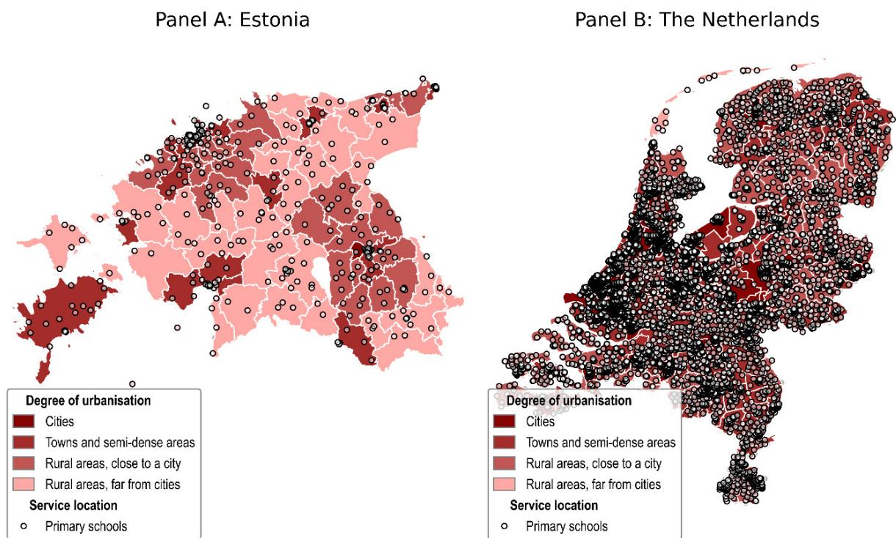  
Source: Based on service data specified in Annex A and the Eurostat (2024 $^{[34]}$ ) degree of urbanisation classification at LAU level.

By contrast, the geographic distribution of PES facilities differs significantly between Estonia and the Netherlands, reflecting disparities in the two countries' geographic environment as well as policy choices (Figure 2 and Table 4):

\- Estonia, as a sparsely populated country, has a relatively high number of PES centres per capita, counting around 3 centres per 100 000 working-age individuals. These centres are spread relatively evenly across the different types of territories, with $26\%$ of PES facilities being situated in cities, $41\%$ in towns and suburbs, and the remaining $33\%$ in rural areas; $50\%$ of towns and semi-dense areas and $16\%$ of rural areas have at least one PES centre.

\- In the Netherlands, as a country with high population density, the relative number of PES facilities is lower, at 0.4 centres per 100 000 working-age individuals. Following a substantial reduction in network size during the 2012-2015 reform, PES are now largely located in densely populated areas: 84% of PES facilities are in cities, and the remaining 16% in towns and semi-dense areas, with no facilities in rural areas. Given the relatively lower number of facilities overall, only 30% of cities and 4% of towns and semi-dense areas have a PES facility. In addition to this, municipal welfare offices provide employment services for social assistance benefit recipients.

These differences in the geographic distribution of service facilities imply different accessibility logics. ECEC and primary education represent locally distributed services with capacity constraints and relatively uniform demand, which makes them well-suited for analysis of competitive accessibility. Public employment services are more spatially concentrated and increasingly complemented by digital provision. This makes them a useful contrast to test how transport accessibility matters for more centralised services.

Figure 2. In the Netherlands, unlike in Estonia, PES facilities are located exclusively in cities  
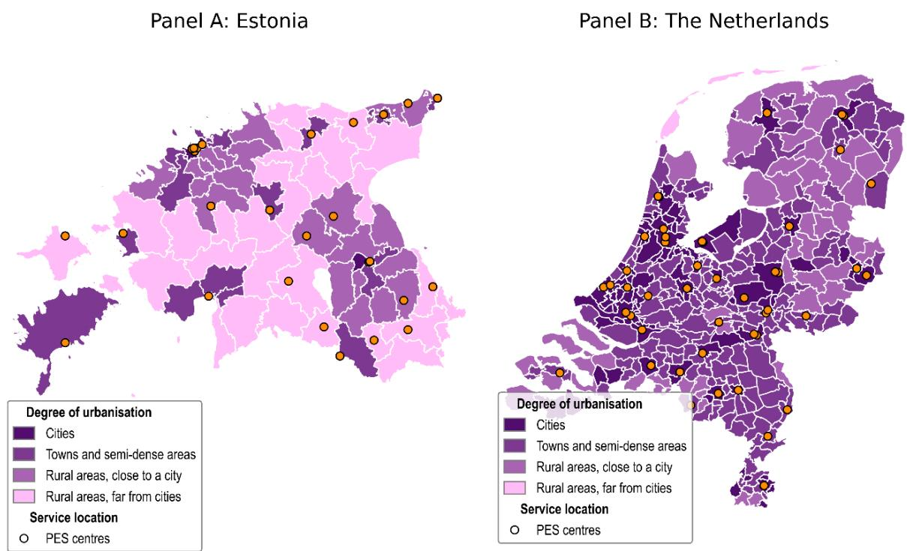  
Source: Maps based on service data specified in Annex A and the Eurostat (2024 $^{[34]}$ ) degree of urbanisation classification at LAU level.

<table><tr><td></td><td colspan="2">PES facilities</td><td colspan="3">ECEC facilities</td><td colspan="3">Primary schools</td></tr><tr><td>Degree of urbanisation</td><td>Number (share) of facilities</td><td>Number of facilities per 100 000 working-age individuals</td><td>Number (share) of facilities</td><td>Number of facilities per 1 000 children of ECEC age</td><td>Median capacity</td><td>Number (share) of facilities</td><td>Number of facilities per 1 000 children of primary school age</td><td>Median enrolment</td></tr><tr><td colspan="9">Estonia</td></tr><tr><td>Cities</td><td>7 (26%)</td><td>2.1</td><td>181 (35%)</td><td>5.1</td><td>138*</td><td>111 (25%)</td><td>3.0*</td><td>317</td></tr><tr><td>Towns and semi-dense areas</td><td>11 (41%)</td><td>4.4</td><td>139 (27%)</td><td>5.1</td><td>150*</td><td>128 (29%)</td><td>4.3*</td><td>211</td></tr><tr><td>Rural areas, close to a city</td><td>4 (15%)</td><td>3.2</td><td>100 (19%)</td><td>6.4</td><td>121*</td><td>88 (20%)</td><td>5.6*</td><td>167</td></tr><tr><td>Rural areas, far from cities</td><td>5 (18%)</td><td>4.3</td><td>103 (19%)</td><td>9.2</td><td>80*</td><td>114 (26%)</td><td>9.5*</td><td>92</td></tr><tr><td>Total</td><td>27 (100%)</td><td>3.2</td><td>523 (100%)</td><td>5.8</td><td>-</td><td>441 (100%)</td><td>4.7*</td><td>-</td></tr><tr><td colspan="9">The Netherlands</td></tr><tr><td>Cities</td><td>41 (84%)</td><td>0.6</td><td>11 784 (46%)</td><td>30.6</td><td>18</td><td>2 723 (44%)</td><td>3.4*</td><td>276</td></tr><tr><td>Towns and semi-dense areas</td><td>8 (16%)</td><td>0.2</td><td>10 612 (41%)</td><td>43.0</td><td>14</td><td>2 520 (41%)</td><td>4.8*</td><td>193</td></tr><tr><td>Rural areas, close to a city</td><td>-</td><td>0</td><td>3 417 (13%)</td><td>57.5</td><td>12</td><td>865(14%)</td><td>6.7*</td><td>134</td></tr><tr><td>Total</td><td>49 (100%)</td><td>0.4</td><td>25 845 (100%)</td><td>37.3</td><td>-</td><td>6 127 (100%)</td><td>4.2*</td><td>-</td></tr></table>

Table 4. Distribution of facilities and capacity by degree of urbanisation  
Note: \* refers to median values where enrolment is used as a proxy for capacity. For Estonia, ECEC enrolment is used for preschools, while the number of seats is used for daycare. For the Netherlands, results are not reported for rural areas far from cities because only a very small share of the population lives in areas of this category.

## 4. Results

This section examines how proximity, competitive accessibility and transport networks interact to produce geographic inequalities in accessibility, and how these differ between locally distributed services (ECEC and primary education) and more centralised services (PES). Section 4.1 focuses on ECEC and primary education. It starts by presenting minimum travel times to the nearest facility to provide a first indication of spatial disparities in service accessibility. It then moves on to present results on competitive accessibility and discusses the trade-offs that arise when considering capacity constraints. Section 4.2 provides evidence on geographic disparities in the accessibility of PES, focusing alone on geographic proximity.

## 4.1. When accessing ECEC and primary school services most families face a trade-off between competitive accessibility and travel times

## 4.1.1. Travel times are generally longer in less densely populated areas, and access to a motor vehicle often remains essential for bridging this gap

In both Estonia and the Netherlands, median travel times to the nearest ECEC facility and primary school follow a clear urban-rural gradient: they increase from cities to towns and semi-dense areas, and then further to rural areas. This pattern, which is consistent with earlier analysis by Almeida et al. (2024[3]), holds for three of the four transport modes considered: walking, cycling, and use of public transport. Only service accessibility by driving shows little variation between area types in Estonia; in the Netherlands, travel times are even longer in cities than in towns and semi-dense areas and in rural areas. This underlines the importance of access to a motor vehicle for bridging accessibility gaps in rural areas.

The comparison of travel times between ECEC facilities and primary schools yields different results for Estonia and the Netherlands. In Estonia, median travel times to the nearest ECEC facility and primary school are comparable, reflecting the similar distribution of facilities of the two service types across the territory (Figure 3, Panel A and Table C.1). In the Netherlands, median travel times to the nearest ECEC facility are consistently shorter than those to the closest primary school – a result of the much larger number of ECEC facilities relative to primary schools (Figure 3, Panel B and Table C.1).

While these travel times provide a first indication of people's potential access to educational services, capacity constraints can also limit access to ECEC services or primary schools: a nearby facility may be of limited value if waiting lists are long and the chances of admission are poor. Densely populated areas usually provide shorter travel times to the nearest facility, but they may also be marked by the strongest competition for seats.

While Figure 3 shows how easily a facility can be reached, measures of competitive accessibility account for both the spatial distribution of facilities and the pressure of competing demand from nearby families, therefore providing a more realistic picture of families' access to ECEC and primary schools. The analysis that follows studies competitive accessibility using two modes of transport: walking and public transport. Median travel times by driving and cycling are generally short in both countries and vary only little by degree of urbanisation (Figure 3 and Table C.1).

## Figure 3. Travel times to the nearest ECEC facility and primary school are longer in rural areas than in cities and towns by walking and public transport, but similar by driving

Travel times to the nearest ECEC facility and primary school for the median user by transport mode and degree of urbanisation, in Estonia and the Netherlands

Panel A: Estonia  
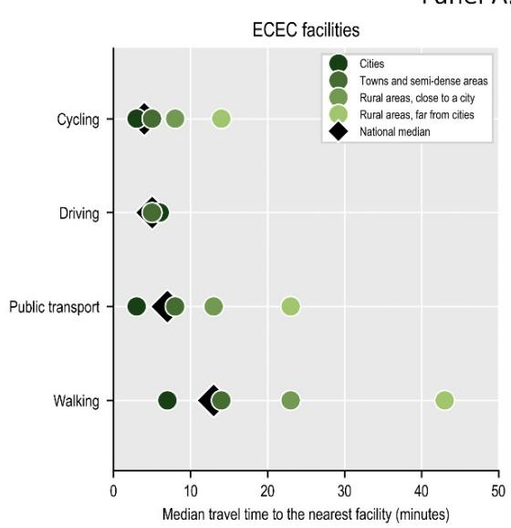

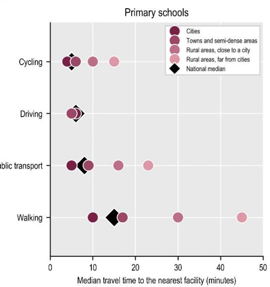

Panel B: The Netherlands  
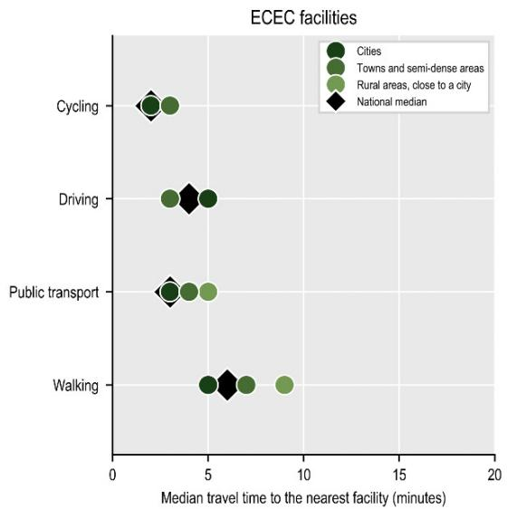

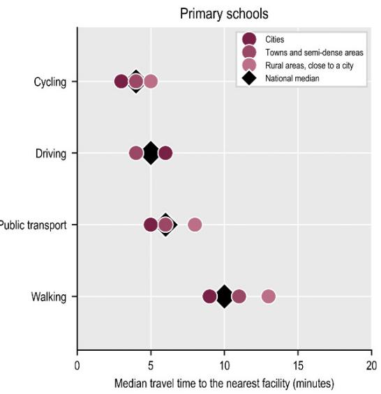  
Note: For the Netherlands, results are not reported for rural areas far from cities because only a very small share of the population lives in areas of this this category.  
Source: Based on service data specified in Annex A, Eurostat (2025[33]) population grids and the Eurostat (2024[34]) degree of urbanisation classification at LAU level.

## 4.1.2. For short travel times, competitive accessibility is higher in cities and towns than in rural areas, but the gap often narrows at longer travel times

Disparities in competitive accessibility depend on the travel time considered. At very short travel times, the indicator is zero, indicating that no facility can be reached (see Figure 4). Once users reach the median travel times shown in Figure 3 for every service, mode, and degree of urbanisation, competitive accessibility increases sharply. It then stabilises around the same value for long travel times, and can even be higher for rural areas than elsewhere. $^{16}$ This process happens much sooner in cities, where the usual travel time to the nearest facility is shorter. $^{17}$ As a result, for travel times just above these minimum thresholds – i.e. within the first 10-20 minutes in Estonia (Figure 4) and within 5-10 minutes in the Netherlands (Figure C.2) – competitive accessibility is much higher in cities and towns and semi-dense areas than in rural areas. However, the analysis may underestimate competitive accessibility of primary schools particularly in rural areas, because – for lack of better data – capacity is being proxied by enrolment.

While this pattern holds generally for both services and transport modes, expanding the availability of public transport may reduce travel times without leading to improvements in competitive accessibility. Indeed, the results show that competitive accessibility by public transport can decline at long travel times and plateau at a lower level, for instance in rural areas close to a city in Estonia (Figure 4, Panel B) and in towns and semi-dense areas and rural areas in the Netherlands (Figure C.2, Panel B). The explanation is that longer travel times allow families to reach a greater number of service facilities, and hence a higher number of seats. The same facilities however become accessible also to a greater number of other potential users. Both service supply and demand therefore rise as travel times get longer, which limits the net gains in competitive accessibility.

Figure 4. In Estonia, competitive accessibility levels are much higher in cities at short travel times, but converge across area types at longer travel times

Variation in competitive accessibility by travel time across degrees of urbanisation, service type and transport mode, in Estonia.

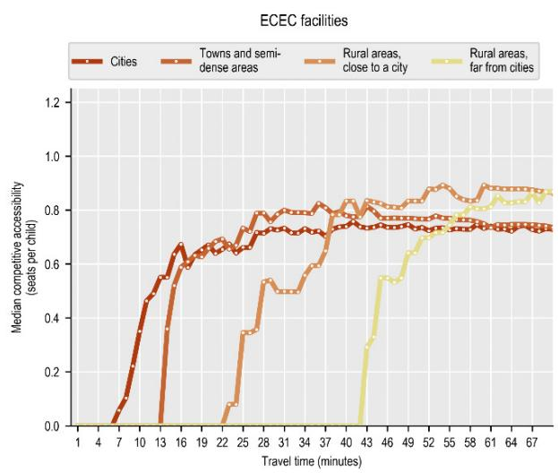

Panel A: Walking  
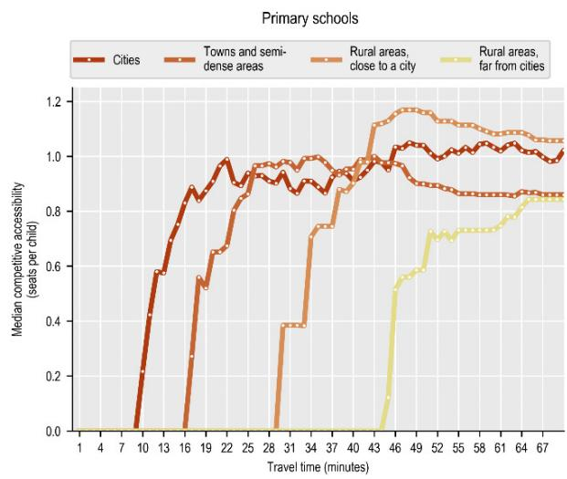

Panel B: Public transport  
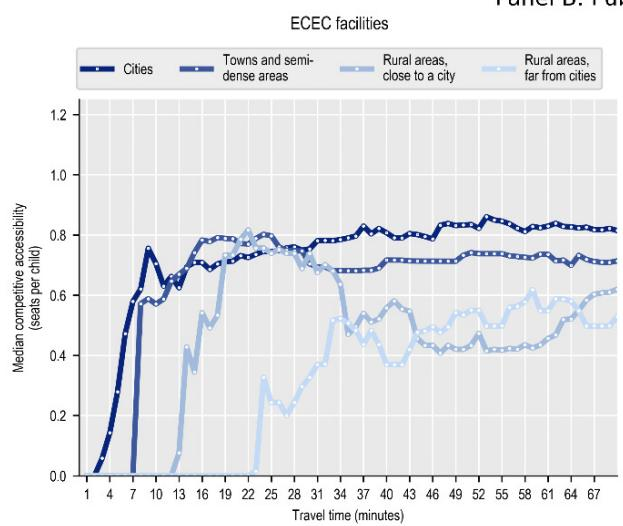

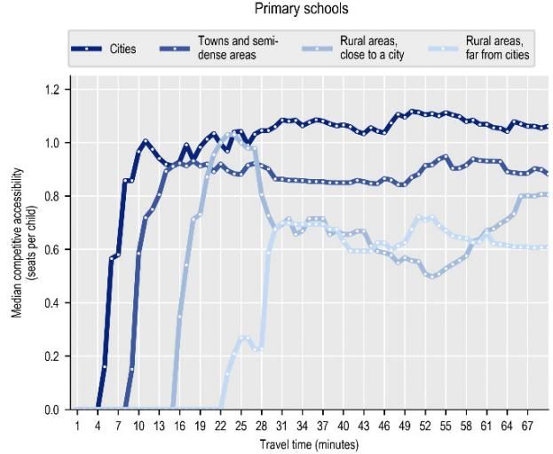  
Note: The lines show the competitive accessibility for ECEC and primary schools for the median child across areas with a certain degree of urbanisation for walking and public transport and at various travel time thresholds. For comparable results for the Netherlands, see Figure C.2. Source: Based on service data specified in Annex A, Eurostat (2025[33]) population grids and the Eurostat (2024[34]) degree of urbanisation classification at LAU level.

## 4.1.3. The case for applying travel time thresholds that vary by the degree of urbanisation

A key take-away from these results is that disparities in competitive accessibility across areas with different degrees of urbanisation strongly depend on the travel time considered – indeed much more so than for proximity-based accessibility metrics (see, for example, Figure 3). This matters, because comparisons of competitive accessibility across places often require choosing thresholds for the “permitted” travel time. Using a single, national travel time threshold for such comparisons – such as the national median travel time to the nearest facility – produces results that can be misleading. The reason is that such uniform national-level travel time thresholds do not account for the systematically shorter travel times in denser, relative to less dense, areas: they are generous when used for measuring service provision in cities and overly restrictive when applied to rural areas. $^{18}$ The results obtained mechanically reproduce urban-rural divides, likely misrepresenting the actual trade-offs faced by service users in different parts of a country.

An alternative approach – used in this paper – is to apply travel time thresholds that vary not just by transport mode and service type, but also by degree of urbanisation within countries. This approach avoids confusing differences in accessibility that arise from settlement structure with those that reflect local service demand and supply. $^{19}$ It puts the attention on disparities in travel times and competitive accessibility among service users living in parts of a country that can be deemed broadly comparable, identifying – within each degree of urbanisation – places that are better and less well served.

Following this approach, the remainder of this section characterises the accessibility situation of each service user relative to that of the median among users in places with the same degree of urbanisation $^{20}$ , based on the travel time thresholds listed in Table C.1 and presented in Figure 3. As illustrated in Figure 4, competitive accessibility may not necessarily rise with longer travel times, because not only the number of accessible seats (i.e. service supply) but also the number of users who compete for those seats (i.e. service demand) may increase if users are willing to travel further. The interplay of these two forces means that the situation of each service user can be characterised as one of the following three cases:

\- A situation of trade-off: the service user faces above-median travel times to reach a service, but also above-median competitive accessibility of that service; or below-median travel times, but also below-median competitive accessibility;

\- A situation of double reward: the service user faces below-median travel times but nonetheless above-median competitive accessibility;

\- A situation of double penalty: the service user faces above-median travel times but nonetheless below-median competitive accessibility.

In the discussion that follows, this methodology and framing is applied to the trade-offs faced by parents when accessing primary schools by walking and public transport. The results extend to competitive accessibility of ECEC, which are shown in Annex Figure C.3.

## 4.1.4. Many families face a trade-off between the travel time to reach a certain service and the local competition they face for the capacity of this service

Even for travel time thresholds that vary by degree of urbanisation, Estonia displays clear geographic differences in the accessibility of primary schools by walking (Figure 5, Panel A). These reflect regional differences in population density, the density of service facilities, and transport networks in the country:

\- In cities and towns and semi-dense areas, many children find themselves in a situation of trade-off between travel times and competitive accessibility. Many others are in double-reward situations characterised by short travel times and high competitive accessibility. Few children face a double-penalty situation of long travel times and low competitive accessibility.

\- In rural areas, particularly those far from cities, service accessibility is more varied. A relatively large share of children reap a double reward, but a considerable share also faces a double penalty. The share of children in a trade-off situation is much smaller.

In other words, children's access to primary school services in Estonia is relatively more homogenous in cities, with many children facing a trade-off situation and notably fewer users facing a situation of relative disadvantage (in form of a double penalty); it is more polarised in rural areas, with greater shares of children experiencing particularly good (double reward) or particularly poor (double penalty) service accessibility.

The Netherlands – as a country that is much more densely populated – shows much narrower disparities in children's walking accessibility of primary school services across areas with different degrees of urbanisation (Figure 5, Panel B, walking). In particular,

\- Across cities, towns and semi-dense, and rural areas close to a city alike, a majority of children faces trade-offs between travel times and competitive accessibility.

\- In rural areas close to a city, a greater share of children than elsewhere benefit from a double reward situation, and only relatively few users face a double penalty.

In the Netherlands, a situation of trade-off dominates across degrees of urbanisation, but children in rural areas are more likely to benefit from a double reward – and less likely to suffer a double penalty – than children elsewhere.

In both countries, the effect of public transport on accessibility differs across types of areas: in cities and towns and semi-dense areas, public transport has the effect of reducing the share of children in a situation of double penalty, indicating that it can play an important role in improving service access for the least-well served (Figure 5). By contrast, in rural areas close to a city, the share of users who face a double penalty increases when considering public transport rather than walking. This is in line with findings from Figure 4 that suggested that public transport may increase relative disadvantages for children with weak access to public transport networks by making schools more accessible for others.

Figure 5. In the accessibility to primary schools, many children in cities face short travel times but lower competitive accessibility

Share of primary school children facing a double reward, trade-off, or double penalty in their access to primary schools, by country, degree of urbanisation, and transport mode

Note: The bars show the percentage of children who face a double-reward, a trade-off or a double-penalty situation in access to primary school across degrees of urbanisation. The classification compares each child's travel time and competitive accessibility with the median thresholds for these indicators by degree of urbanisation. The countrywide share is obtained by aggregating the results for each degree of urbanisation, weighted by the corresponding population. This value still reflects the travel time thresholds specific to each degree of urbanisation and mode of transport, rather than to impose a single national threshold. For comparable results for the accessibility of ECEC facilities, see Figure C.3. Source: Based on service data specified in Annex A, Eurostat (2025[33]) population grids and the Eurostat (2024[34]) degree of urbanisation classification at LAU level.  
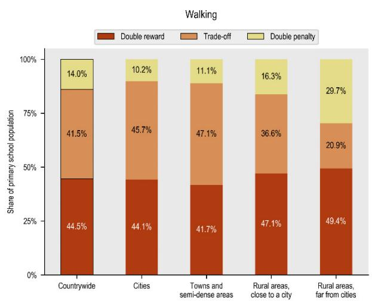

Panel A: Estonia  
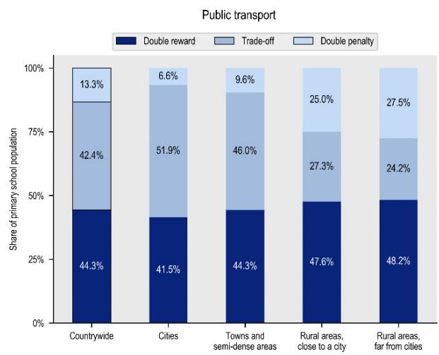

Panel B: The Netherlands  
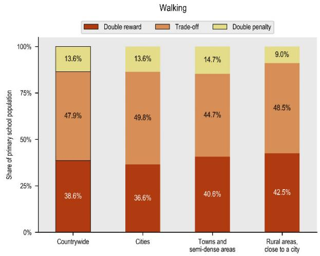

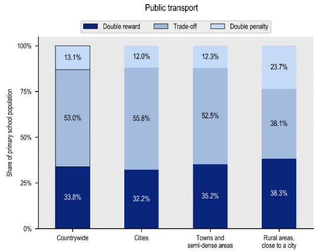

From a policy perspective, children who face a double penalty deserve particular attention, and LAUs with high shares of children facing a double penalty may be considered as offering relatively poor service accessibility:

\- Estonia shows relatively large variation across LAUs in the share of children facing a double penalty, ranging – for walking access – from below 1% in Viru-Nigul to nearly 80% on the island of Muhu, both rural LAUs far from cities (Figure 6, Panel A). LAUs with high shares of children facing a double penalty are spread across the country, whether considering access by walking or public transport. The share of children facing a double penalty is lowest in LAUs located in the central north-west, near the capital city of Tallinn.

\- In the Netherlands, spatial variation in the share of children facing a double penalty is much lower, and the shares are lower throughout (Figure 6, Panel B). In most of the country, less than $15\%$ of children in a LAU face a double penalty, though the value reaches around $50\%$ in some.

It is worth noting though that among LAUs where a large share of children face a double penalty, some may equally have a high share of children benefiting from a double reward, namely if accessibility conditions within the LAU are strongly polarised. Box 3 puts a spotlight on children with low competitive accessibility despite long travel times using the alternative concept of transport poverty.

Figure 6. In Estonia, spatial variation is large in the share of children facing a double penalty of above-median travel times and below-median competitive accessibility

Percentage of children facing a double penalty of above-median travel times and below-median competitive accessibility to primary schools, by LAU, in Estonia and the Netherlands

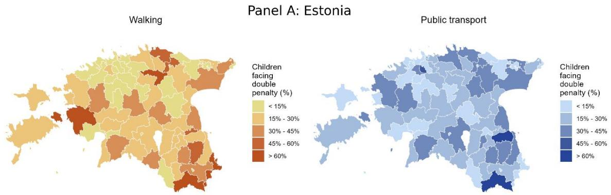

Panel B: The Netherlands  
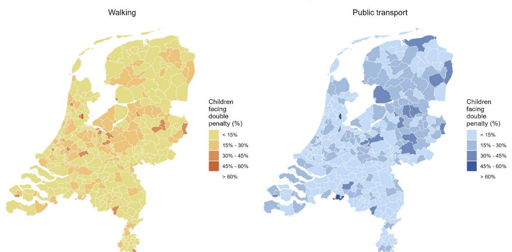  
Source: Based on service data specified in Annex A, Eurostat (2025[33]) population grids and the Eurostat (2024[34]) degree of urbanisation classification at LAU level.

## Box 2. Transport poverty as a measure of accessibility disadvantage

An alternative, complementary, way of assessing competitive accessibility is to universally fix a travel time threshold across territories that is considered a “reasonable” upper bound, and to study the populations with low accessibility above this time threshold. This is the intuition behind indicators focusing on the accessibility dimension of transport poverty $^{1}$ , which have been used in both the academic and policy literature to identify users who do not reach a certain minimal level of accessibility even within a long travel time, and who may therefore face accessibility disadvantage and the risk of social exclusion (Cludius et al., 2024 $^{[35]}$ ; European Commission, 2024 $^{[36]}$ ). $^{2}$

This box presents evidence on the incidence of transport poverty in competitive accessibility of primary schools $^{3}$ by walking and public transport across LAUs in Estonia and the Netherlands. Specifically, it identifies the share of children in each LAU who do not have access to one seat per child when considering competition within a travel time range of 40-50 minutes – because of travel times exceeding this limit, limited school capacity relative to demand, or a combination of both.

## The Foster-Greer-Thorbecke (FGT $_{2}$ ) indicator for measuring transport poverty

The analysis relies on the Foster-Greer-Thorbecke (FGT $_2$ ) indicator (Foster, Greer and Thorbecke, 1984[37]), which enables assessing both the extent and severity of people's accessibility deficits (Martens, 2016[38]). This is an advantage compared to indicators that focus on headcounts and therefore capture solely the extent of transport deprivation. Intuitively, the FGT $_2$ indicator gives the share of individuals who fall below a pre-defined accessibility sufficiency threshold weighted by the size of their shortfall from this threshold. For a specific territory, it is calculated as:

$$
F G T _ {2} = \frac {1}{N} \sum_ {i = 1} ^ {H} \left(\frac {z - y _ {i}}{z}\right) ^ {2}
$$

where N is the relevant population size of territory; z is the pre-defined sufficiency threshold (expressed here as one seat per child after accounting for competition), $y_{i}$ is the number of seats per child that can be accessed by the relevant population i (i.e., those with insufficient accessibility) after accounting for competition within the pre-defined upper-bound travel time threshold, and H is the relevant population in the territory who falls below z, meaning they have insufficient accessibility. The $FGT_{2}$ indicator is bounded between 0 and 1: a value of 0 indicates that all individuals in a specific territory are above the sufficiency threshold, i.e. that no user is transport-poor; as the indicator approaches 1, a growing number of individuals fall below the threshold and experience accessibility deficits. For the application in this box, the upper-bound travel time threshold has been fixed universally across territories to 40-50 minutes – a choice that has been informed by the empirical literature. $^{4}$ The $FGT_{2}$ indicator is also calculated only for the less-well served, specifically at the $20^{th}$ percentile of the accessibility distribution. Here, a value of 1 indicates that no user in the bottom quintile of the accessibility distribution can access any primary school seat.

## In rural Estonia, a sizeable share of children does not achieve good competitive accessibility within a 40-50-minute walk or public transport journey

Estonia displays a strong urban-rural gradient in its transport poverty measure. In cities, practically every child has access to one seat in a primary school within a 40-50-minute public transport journey ( $FGT_{2}$ close to zero). By contrast, the $FGT_{2}$ indicator reveals accessibility deficits in rural areas, with values of 0.30 and 0.40 for children living in LAUs close to and far from a city, respectively. When zooming in on the least-well served, in rural areas far from cities, no child in the bottom quintile of the accessibility distribution can reach any school by public transport within 40-50 minutes ( $FGT_{2}=1$ ). Disparities become even more marked when considering walking as a transport mode. This indicates that in Estonia's rural areas, especially those far from cities, a sizeable share of families requires access to a motor vehicle to secure good competitive accessibility for their children within a 40-50-minute travel time.

## Figure 7. A transport poverty indicator reveals clear urban-rural disparities, with low competitive accessibility even at long travel times for the least well-served in rural parts of Estonia

Severity of accessibility deficits for primary schools, in Estonia and the Netherlands

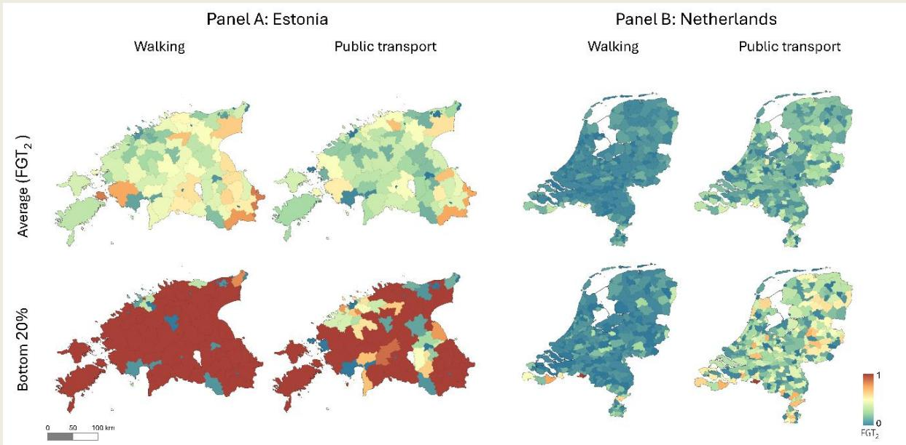  
Note: $FGT_{2}$ and Bottom 20% severity of accessibility deficits for primary schools with ideal sufficiency threshold of one seat per child. The indicator is calculated for a 40-50 minute travel time by walking and by multimodal public transport combined with short walks.
Source: Joint Research Centre (forthcoming) based on service data specified in Annex A, Eurostat (2025 $^{[33]}$ ) population grids and the Eurostat (2024 $^{[34]}$ ) degree of urbanisation classification at LAU level.

## In the Netherlands, urban-rural disparities in transport poverty are much less pronounced, reflecting high population density

In the Netherlands, the urban-rural gradient in transport poverty is much less marked, reflecting the country's high population density and tight transport networks. Across LAUs, almost every child in the $20\%$ of children who are least well-served has access to at least one primary school seat within a 40-50-minute walk. A mild urban-rural gradient arises when looking at public transport – the $\mathrm{FGT}_2$ is close to zero for cities, rises to 0.16 in towns and semi-dense areas, and reaches 0.23 in rural areas close to cities. These disparities widen when focusing on the bottom quintile of children with lowest access by public transport ( $\mathrm{FGT}_2$ of 0.48 for rural areas close to cities) but remain less pronounced than in Estonia.

$^{1}$ Transport poverty is a multidimensional concept, encompassing aspects other than accessibility, such as affordability, availability, and adequacy. This analysis focuses only on the accessibility dimension.

$^{2}$ The European Commission's Recommendation on transport poverty (European Commission, 2025[39]) emphasises the need for spatial accessibility indicators for informing policy making. On this basis, the EC has introduced initial transport poverty indicators to support decision-makers and researchers addressing transport equity issues. These are accessible on a dedicated platform, the European Transport Poverty Hub (European Commission, 2025[40]).

$^{3}$ Similar patterns apply in both countries when focusing on deficits in competitive accessibility to ECEC facilities.

$^{4}$ In the transport poverty literature, the sufficiency threshold is usually chosen based on the median number of destinations that individuals can reach within the upper-bound limits of people's typical willingness to travel. While this limit may vary according to service type, a 40-50-minute range is widely reported as the upper threshold for frequent, regular commutes in surveys (Tiznado Aitken, Palm and Farber, 2024[41]; Golub and Martens, 2014[42]; Klumpenhouwer and Karner, 2025[43]). To improve robustness, the results in this box reflect an average obtained when applying an upper-bound travel time threshold of 40, 45, and 50 minutes.

Source: Joint Research Centre (forthcoming). JRC Working Paper Series

## 4.2. Travel times to public employment services can be long for users who depend on public transport and those living in lower-accessibility areas

This subsection explores how the interplay between service locations and the features of the transport network translates into differences in the accessibility of PES in Estonia and the Netherlands. It focuses on geographic disparities in service accessibility by motor vehicle and the viability of using public transport, examining variation across LAUs and by degree of urbanisation.

## 4.2.1. Travel times to PES centres by motor vehicle are short for the median person

In both Estonia and the Netherlands, PES centres are accessible within a relatively short drive for most people. In Estonia, for the median person, the driving time by motor vehicle to the closest PES facility is 11 minutes, while it is 18 minutes in the Netherlands. This also reflects that the median person lives in a town or semi-dense area in Estonia and in a city in the Netherlands, where driving times generally tend to be relatively short (see Figure 8). In only 18 out of 79 LAUs in Estonia, and 44 out of 342 LAUs in the Netherlands, driving times for the median person surpass 30 minutes, with these LAUs accounting for only 7.6% and 8% of the overall population, respectively. These results are consistent with earlier analysis of geographic inequalities in accessibility of enabling services at the level of small (TL3) regions by Almeida et al. (2024[3]).

Figure 8. In most LAUs, driving times to the closest PES facility are shorter than 30 minutes for the median person, both in Estonia and the Netherlands

Travel times to the closest PES facility by motor vehicle for the median person, by LAU, in Estonia and the Netherlands

Panel A: Estonia

Panel B: The Netherlands

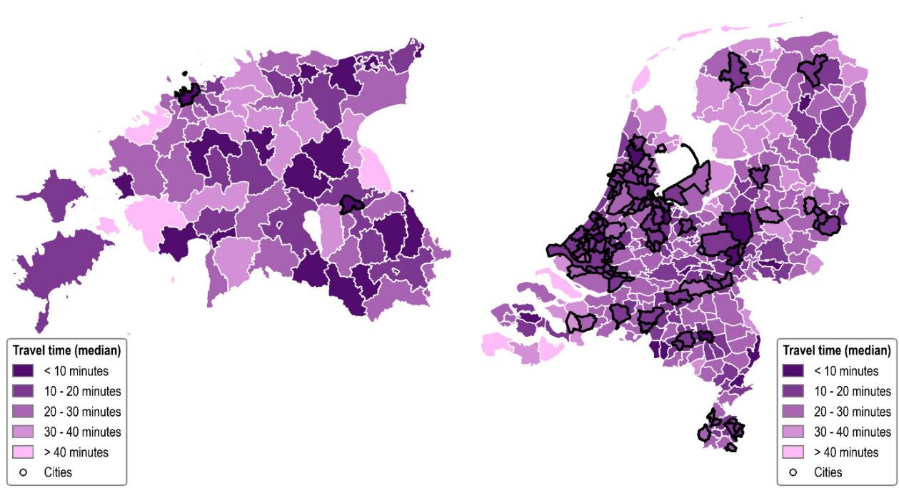  
Note: The figure shows the travel time to the closest PES facility by motor vehicle for the median person in a local area after accounting for congestion effects. Cities are marked with a black outline.  
Source: Maps are on service data specified in Annex A, Eurostat (2025[33]) population grids and the Eurostat (2024[34]) degree of urbanisation classification at LAU level.

Looking beyond the median user and considering the entire distribution of travel times, Estonia reveals persistently shorter driving times than the Netherlands across all types of LAUs. This is illustrated, for example, by comparing the shares of people who can – or cannot – access a PES facility within a certain travel time, such as a 20-minute drive, $^{21}$ as implied by a vertical “cut” through the travel time distributions shown in Figure 9.

Figure 9. Only few people in Estonia and the Netherlands are located further than a 20-minute drive from a PES centre in cities, or a 40-minute drive in rural areas

Share of population with access to a PES facility by motor vehicle, by degree of urbanisation and multiple travel time thresholds, in Estonia and the Netherlands

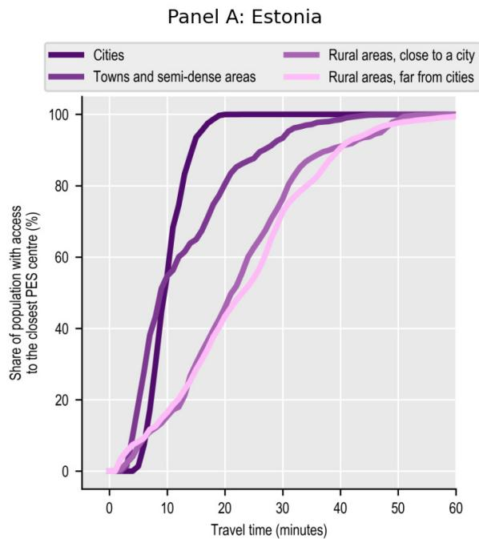

Panel B: The Netherlands  
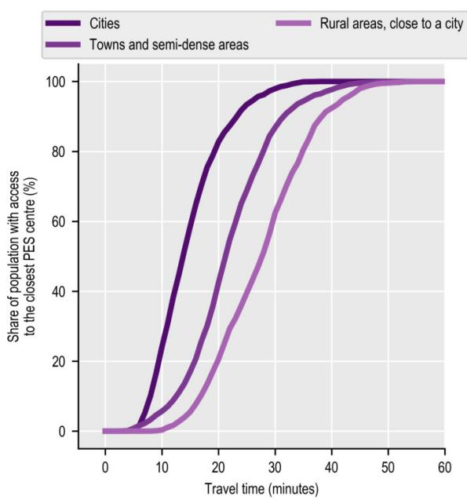  
Note: In the Netherlands, all LAUs classified as rural areas far from cities are located on islands without a PES centre and no road access to the mainland, such that PES access by motor vehicle is not possible.  
Source: Based on service data specified in Annex A, Eurostat (2025[33]) population grids and the Eurostat (2024[34]) degree of urbanisation classification at LAU level.

These results reflect the interplay of population density and the location of PES centres in the two countries. In Estonia, where population density is lower and a larger share of the population lives outside the two cities (Table 2), ensuring driving accessibility to services is generally more challenging. However, with a relatively large number of PES centres per inhabitant, many of which located outside of cities, Estonia provides short driving times even for many residents of rural areas. In the densely populated and highly urbanised Netherlands, the number of PES centres per inhabitant is lower, centres are mostly located in cities, but not all cities have their own PES centre; as a result, even among people living in cities, 17% do not have access to a PES within a 20-minute drive.

## 4.2.2. Without access to a motor vehicle, the median person often faces long travel times to the nearest PES, except in cities

While most residents in Estonia and the Netherlands have relatively good driving access to PES facilities, not all people can rely on a motor vehicle for accessing public services. This may be because they live in carless households, or because an existing vehicle is being used by a different household member. As of 2022, both countries had relatively high motorisation rates, but car ownership varied, with 0.63 private vehicles per inhabitant in Estonia and 0.50 the Netherlands (OECD, 2025[44]). Low-income households and people out of work will likely be overrepresented among those facing greater difficulties accessing a motor vehicle. Also from a sustainability perspective, many EU and OECD countries strive to promote service accessibility by means of transport other than the private motor vehicle, and regions and cities increasingly develop strategies to promote the use of public transport and other forms of climate-friendly transport, such as cycling and walking (OECD, 2020[45]).

Travel times to the closest PES facility double for the median user when considering access by public transport, rather than by motor vehicle. The median person in Estonia takes about 22 minutes to reach the nearest PES facility by public transport, compared to 11 minutes by motor vehicle; in the Netherlands, the travel time for the median person rises to 36 minutes using public transport, up from 18 minutes by motor vehicle. In some LAUs, however, travel times by public transport can be much longer than that even for the median person: in Estonia, 53 out of 79 LAUs record median public transport travel times above 40 minutes (covering 31% of the population), in the Netherlands, the same is true for 216 out of 342 LAUs (43% of the population).

Median travel times by bicycle are higher still. To reach the closest PES facility by bike, the median person in Estonia and the Netherlands takes 20 minutes and 42 minutes, respectively. This implies that while the bike may represent a popular alternative to reach a PES centre for people with below-median travel times, it is likely not a viable or attractive alternative to a motor vehicle or use of public transport for many others. The remainder of the analysis therefore focuses on access by motor vehicle and public transport.

The travel time gap between driving and public transport closely relates to the degree of urbanisation. In rural areas, sparse networks and infrequent service typically imply long public transport journeys. As a result, the time “penalty” from using public transport instead of driving to access a PES centre is generally larger in rural areas than in cities or semi-dense areas. However, it is substantial even in many cities and semi-dense areas, surpassing 20 minutes for the median person in many towns and semi-dense areas (Figure 10).

However, there are places where public transport provides a viable alternative to driving. This is true, for example, in Estonia's two cities, Tallinn and Tartu, and in 17 out of 79 towns and semi-dense areas in the country, where taking public transport adds less than 10 minutes to the journey compared to driving. In the Netherlands, 136 out of 342 LAUs (home to $61\%$ of the population) record a difference of under 20 minutes between modes.

Figure 10. For the median user, taking public transport adds substantially to travel times in many localities, not just in rural areas

Median travel times to the closest PES facility by motor vehicle and public transport across LAUs

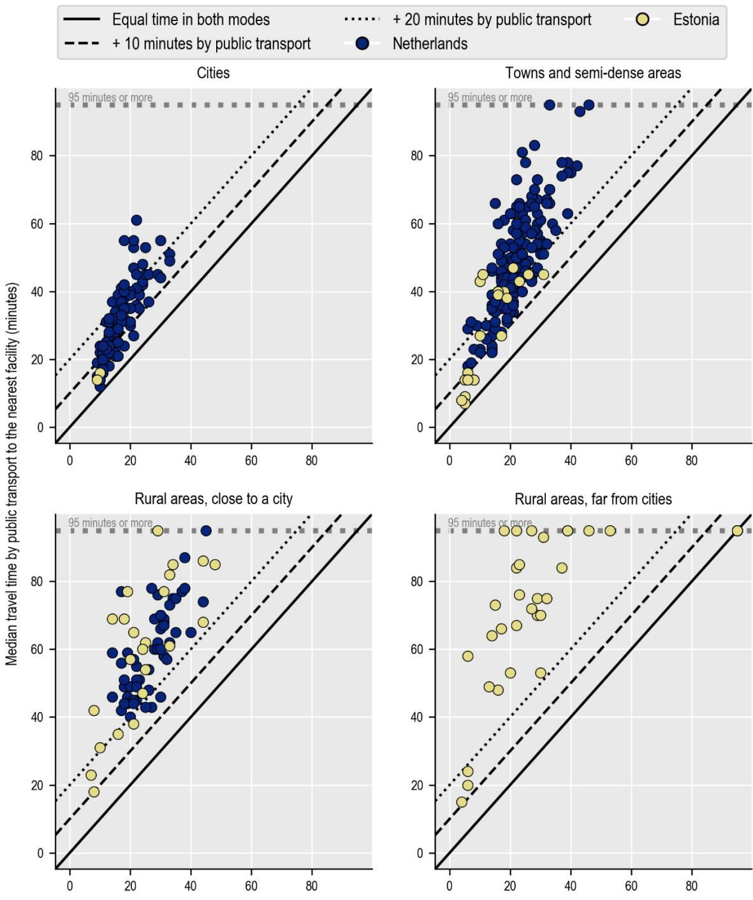  
Median travel time by motor vehicle to the nearest facility (minutes)

Note: In the Netherlands, all LAUs classified as rural areas far from cities are located on islands without a PES centre and no road access to the mainland, such that PES access is possible neither by motor vehicle nor by public transport.
Source: Calculations on service data specified in Annex A, Eurostat (2025[33]) population grids and the Eurostat (2024[34]) degree of urbanisation classification at LAU level.

Panel B: Public transport

## 4.2.3. For people with lower accessibility, taking public transport may not be a viable option even in cities

Looking beyond the median user, public transport is often not a viable option for those with relatively lower accessibility even outside of rural areas. Within cities, the large majority of users are within a 40-minute journey to the closest PES centre by public transport, with only 2% of people in Estonian cities and 17% in Dutch cities facing travel times above 40 minutes. However, in towns and semi-dense areas, the share of people who cannot access the closest PES within a 40-minute ride lies at 26% in Estonia, and 68% in the Netherlands, and shares are even higher in rural areas close to a city (69% in Estonia, 88% in the Netherlands) and far from cities (84% in Estonia, non-applicable in the Netherlands).

For people with the lowest service accessibility, access to a motor vehicle consequently cuts travel times by a substantial margin relative to the use of public transport. This is illustrated in Figure 11, which directly compares travel times by motor vehicle and public transport for people with the 20% highest travel times. For them, average travel times by public transport are around one hour; only in Estonian cities they average substantially below 40 minutes; access to a motor vehicle reduces travel times to little above 20 minutes on average in both Estonia and the Netherlands, and to below 40 minutes in rural areas.

Figure 11. For the 20% of people with lowest accessibility, public transport is often not a viable alternative to a motor vehicle

Average travel times to the closest PES by motor vehicle and public transport for the 20% of people with lowest accessibility by degree of urbanisation

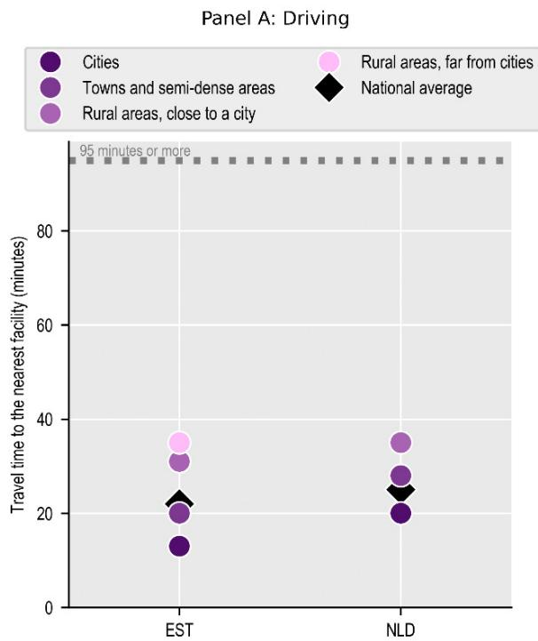

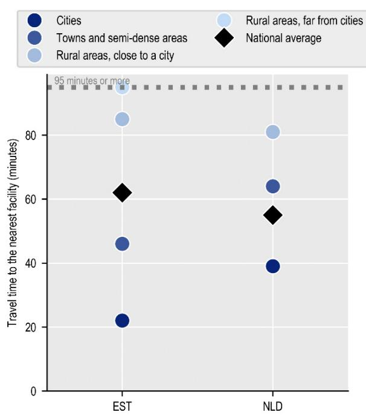  
Source: Calculations on service data specified in Annex A, Eurostat (2025[33]) population grids and the Eurostat (2024[34]) degree of urbanisation classification at LAU level.

## 5. Conclusions

This paper examines geographic disparities in the accessibility of ECEC services, primary education and PES in Estonia and the Netherlands. It develops and applies a comprehensive methodological framework for the analysis of service accessibility that combines rich multimodal transport modelling with complementary accessibility indicators accounting for physical and competitive accessibility. In doing so, the paper extends existing approaches that focus mainly on proximity by integrating capacity constraints and competition for services into a multimodal accessibility framework, enabling a more realistic and complete assessment of the trade-offs people face when accessing enabling services. The analysis, conducted at the LAU level by degree of urbanisation, captures fine-grained spatial variation that is often masked in regional averages, enabling a more accurate identification of local inequalities, service gaps, and place-specific needs. The case studies of Estonia and the Netherlands illustrate how differences in spatial structure, service organisation and transport systems jointly shape accessibility outcomes.

The results confirm a clear urban-rural gradient in physical accessibility at the local level: in both countries, minimum travel times to the nearest ECEC facility and primary school for the median user consistently increase from cities to towns and semi-dense areas, and further to rural areas, mirroring the metropolitan/non-metropolitan disparities documented at regional level in Almeida et al. (2024[3]). However, proximity alone provides an incomplete picture of service accessibility, as it fails to capture capacity constraints and competition for available seats. A joint analysis of these two dimensions reveals significant trade-offs: while people in urban areas typically benefit from shorter travel times to the nearest facility, high demand pressure and capacity constraints can result in lower competitive accessibility compared to towns, semi-dense areas and rural areas. Moreover, a non-negligible share of families face a double disadvantage, reflecting important inequalities in access to enabling services: both in Estonia and in the Netherlands, $13\%$ to $14\%$ of children in primary school experience both longer travel times and lower competitive accessibility than the median child in LAUs with the same degree of urbanisation. Geographic disparities in public transport provision represent a source of vulnerability for people without access to a private motor vehicle: in many LAUs, the median user can reach the nearest PES facility in under 20 minutes by motor vehicle, while the same journey exceeds 40 minutes by public transport.

From a methodological perspective, the findings underline the importance of adopting a multidimensional approach to accessibility. Focusing exclusively on proximity overlooks constraints arising from limited service capacity and competition for seats; failing to account for multimodal transport options can obscure significant disparities in accessibility outcomes. These patterns call for approaches that systematically integrate service capacity and transport planning, rather than treating them as separate policy domains.

From a policy perspective, the paper's findings speak to several strategic priorities. First, they provide evidence to inform territorial planning and regional development policies, helping to identify where improvements in service provision or transport infrastructure could most effectively reduce accessibility gaps. Second, they contribute to ongoing EU efforts to monitor the accessibility of enabling services, including work on accessibility indicators and the implementation of the European Pillar of Social Rights. Third, by comparing two distinct national contexts using harmonised methods, the paper offers an analytical framework for cross-country comparison that can support broader EU and OECD work on spatial inequalities and service accessibility.

The analysis is not without limitations. It focuses on physical accessibility and capacity without considering other important dimensions such as service quality, opening hours and costs, as well as administrative allocation mechanisms such as catchment areas or priority rules. These factors may significantly affect effective access, and their omission implies that the results should be interpreted as capturing potential rather than realised access. In parts of the analysis, capacity had to be approximated using enrolment for lack of data. To the extent that some facilities – particularly small rural schools – operate below full capacity, this may lead to an underestimation of competitive accessibility in less dense areas, and hence understate urban-rural disparities in competition for places.

Future work could expand the analysis to other, larger countries to provide additional insights into the role of spatial structure and institutional settings in shaping service accessibility, and extend the scope of services covered. Looking at healthcare services would be particularly relevant, though there are important conceptual challenges given the large number of different types of services that could be considered.

## References

Almeida, V. et al. (2024), “Geographic inequalities in accessibility of essential services”, OECD Social, Employment and Migration Working Papers, No. 307, OECD Publishing, Paris, https://doi.org/10.1787/12bab9fb-en.

Bastiaanssen, J. and B. Marnix (2022), Toegang voor iedereen? Een analyse van de (on)bereikbaarheid van voorzieningen en banen in Neder-, PBL Planbureau voor de Leefomgeving, https://www.pbl.nl/uploads/default/downloads/pbl-2022-toegang-vooriedereen-4932.pdf.

Bruno, G. et al. (2022), “Geographical accessibility to upper secondary education: an Italian regional case study”, The Annals of Regional Science, Vol. 69/2, pp. 511-536, https://doi.org/10.1007/s00168-022-01146-6.

Cludius, J. et al. (2024), Transport poverty – Definitions, indicators, determinants, and mitigation strategies – Final report, European Commission, https://data.europa.eu/doi/10.2767/0662480.

Copernicus Data Space Ecosystem (2024), Copernicus DEM - Global and European Digital Elevation Model, https://dataspace.copernicus.eu/explore-data/data-collections/copernicus-contributing-missions/collections-description/COP-DEM.

De Moraes, G., S. Gomez Tamayo and P. Andrea (2023), The Delivery of Employment Services in a Multi-Country Case Study Series: Netherlands, World Bank Group, http://documents.worldbank.org/curated/en/099120123110099043.

Estonian Economic Activities Register (2025), Estonian Economic Activities Register, https://mtr.ttja.ee/.

Estonian Ministry of Education and Research (2024), Pre-school, basic and secondary education, https://www.hm.ee/en/education-research-and-youth-affairs/general-education/general-education-estonia#compulsory-school-at.

Estonian Unemployment Insurance Fund (2025), “About Töötukassa”, https://www.tootukassa.ee/en/about-tootukassa.

European Commission (2026), European Child Guarantee, https://employment-social-affairs.ec.europa.eu/policies-and-activities/social-protection-social-inclusion/addressing-poverty-and-supporting-social-inclusion/investing-children/european-child-guarantee\_en.

European Commission (2025), Commission Recommendation (EU) 2025/1021 of 22 May 2025 on transport poverty: ensuring affordable, accessible and fair mobility, http://data.europa.eu/eli/reco/2025/1021/oj.

European Commission (2025), Eurydice National Education Systems - Estonia,

https://eurydice.eacea.ec.europa.eu/eurypedia/estonia/overview.

European Commission (2025), Eurydice National Education Systems - Netherlands, https://eurydice.eacea.ec.europa.eu/eurypedia/netherlands/overview.

European Commission (2025), “Key data on early childhood education and care in Europe 2025”, Eurydice report, https://eurydice.eacea.ec.europa.eu/publications/key-data-early-childhood-education-and-care-europe-2025.

European Commission (2025), Transport Poverty Hub, https://regions-and-cities.ec.europa.eu/cities-portal/eu-initiatives-cities/transport-poverty-hub\_en.

European Commission (2024), Report on access to essential services in the EU – Commission staff working document, https://data.europa.eu/doi/10.2767/447353.

European Commission (2022), A European Care Strategy for caregivers and care receivers, https://employment-social-affairs.ec.europa.eu/news/european-care-strategy-caregivers-and-care-receivers-2022-09-07\_en. [52]

European Commission (2022), Service delivery by Public Employment Services in the wake of the COVID-19 crisis, https://employment-social-affairs.ec.europa.eu/document/download/c7571ca9-8776-4059-a30c-97264a3eb680\_en. [28]

European Commission (2020), Territorial Agenda 2030 - A future for all places, https://territorialagenda.eu/.

European Commission (2018), European Pillar of Social Rights, https://employment-social-affairs.ec.europa.eu/policies-and-activities/european-pillar-social-rights-building-fairer-and-more-inclusive-european-union\_en.

Eurostat (2025), Children in formal childcare or education by age group and duration - % over the population of each age group, https://doi.org/10.2908/ILC\_CAINDFORMAL. [18]

Eurostat (2025), Children in formal childcare or education by age group, duration and risk of poverty or social exclusion, https://doi.org/10.2908/ILC\_CAINDFORM25. [22]

Eurostat (2025), “GEOSTAT population grid - GEOSTAT 2011 and 2021 datasets”, Census grid 2021, https://ec.europa.eu/eurostat/web/gisco/geodata/population-distribution/geostat (accessed on 2025 19 May).

Eurostat (2025), GISCO Population grids, [32] https://ec.europa.eu/eurostat/web/gisco/geodata/population-distribution/population-grids.

Eurostat (2024), Local administrative units (LAU), https://ec.europa.eu/eurostat/web/nuts/local-administrative-units.

Foster, J., J. Greer and E. Thorbecke (1984), “A class of decomposable poverty measures.”, Econometrica 52, pp. 761–766, https://doi.org/10.2307/1913475.

Giordano, A., J. Aycart and J. Ibáñez (2025), “Comparing access to services by public and private transport in Ireland to measure transport poverty”, Transport Transitions: Advancing Sustainable and Inclusive Mobility. TRAconference 2024. Lecture Notes in Mobility, pp. 654–661, https://doi.org/10.1007/978-3-031-85578-8\_88.

Golub, A. and K. Martens (2014), “Using principles of justice to assess the modal equity of [42]

regional transportation plans", Journal of Transport Geography, Vol. 41, pp. 10-20, https://doi.org/10.1016/j.jtrangeo.2014.07.014.

Jacobs-Crisioni, C. et al. (2023), “Estimating school provision, access and costs from local pupil counts under decentralised governance”, Journal of Geographical Systems, Vol. 26/1, pp. 7-46, https://doi.org/10.1007/s10109-023-00425-w.

Klumpenhouwer, W. and A. Karner (2025), “Where to draw the line: Impacts of threshold choice on measures of transport poverty”, OSF preprint, https://osf.io/download/95qbv.

Lauringson, A. and M. Lüske (2021), “Institutional set-up of active labour market policy provision in OECD and EU countries: Organisational set-up, regulation and capacity”, OECD Social, Employment and Migration Working Papers, No. 262, OECD Publishing, Paris, https://doi.org/10.1787/9f2cbaa5-en.

Leinuste, K. (2021), Decision support tool „OTT“ for employment counsellors in the Estonian PES, https://www.oecd.org/els/emp/PES-Digital-Oct2021-Estonia.pdf. [27]

Luo, W. and Y. Qi (2009), “An enhanced two-step floating catchment area (E2SFCA) method for measuring spatial accessibility to primary care physicians”, Health & Place, Vol. 15/4, pp. 1100-1107, https://doi.org/10.1016/j.healthplace.2009.06.002.

Martens, K. (2016), Transport Justice: Designing Fair Transportation Systems, Routledge. [38]

Martínez, M. et al. (2021), “Accessibility Indicators for the Geographical Assessment of Transport Planning in a Latin American Metropolitan Area”, Geographies, Vol. 1/2, pp. 124-142, https://doi.org/10.3390/geographies1020008.

Ministry of Education, Culture and Science (2025), DUO Open Onderwijsdata, [48] https://duo.nl/open\_onderwijsdata/.

Moreno-Monroy, A., R. Lovelace and F. Ramos (2018), “Public transport and school location impacts on educational inequalities: Insights from São Paulo”, Journal of Transport Geography, Vol. 67, https://doi.org/10.1016/j.jtrangeo.2017.08.012.

Mouratidis, K. (2026), “The 15-minute city revisited: A GIS approach to measuring, visualizing, and analyzing accessibility by proximity and by public transport supply”, Travel Behaviour and Society, Vol. 42, p. 101151, https://doi.org/10.1016/j.tbs.2025.101151.

Negm, H. and A. El-Geneidy (2026), “Operationalizing accessibility thresholds: Identifying perceived minimum and sufficient accessibility in Canada (Manuscript under review)”, Manuscript under review.

OECD (2025), More Effective Social Protection for Stronger Economic Growth: Main Findings from the 2024 OECD Risks that Matter Survey, OECD Publishing, Paris, https://doi.org/10.1787/3947946a-en. [30]

OECD (2025), New Frontiers for Social Policy: Investing in the Future - Chairs' Statement, [56] https://www.oecd-events.org/social-ministerial/en/content/ministerial-meeting.

OECD (2025), OECD Database on Regions, Cities and Local Areas, [44] https://www.oecd.org/en/topics/regions-cities-and-local-statistics.html.

OECD (2023), Contracted Employment Services in the Netherlands: Study Visit Report, [29] https://www.oecd.org/content/dam/oecd/en/topics/policy-issues/employment-

services/sweden/Project-21SE03-Study-Visit-Report.pdf.

OECD (2023), OECD Regional Outlook 2023: The Longstanding Geography of Inequalities, OECD Publishing, Paris, https://doi.org/10.1787/92cd40a0-en.

OECD (2022), “Harnessing digitalisation in Public Employment Services to connect people with jobs”, Policy Brief on Active Labout Market Policies, https://www.oecd.org/en/publications/harnessing-digitalisation-in-public-employment-services-to-connect-people-with-jobs\_367a51f3-en.html.

OECD (2022), Policy Statement on Moving Beyond the COVID-19 Crisis to a Better Labour Market that Works for All, https://legalinstruments.oecd.org/api/print?id=684&lang=en. [57]

OECD (2021), Delivering Quality Education and Health Care to All: Preparing Regions for Demographic Change, OECD Rural Studies, OECD Publishing, Paris, https://doi.org/10.1787/83025c02-en. [1]

OECD (2021), Improving the Provision of Active Labour Market Policies in Estonia, Connecting People with Jobs, OECD Publishing, Paris, https://doi.org/10.1787/31f72c5b-en. [23]

OECD (2021), Measuring What Matters for Child Well-being and Policies, OECD Publishing, Paris, https://doi.org/10.1787/e82fded1-en. [14]

OECD (2020), Improving Transport Planning for Accessible Cities, OECD Urban Studies, OECD Publishing, Paris, https://doi.org/10.1787/fcb2eae0-en. [45]

OECD (forthcoming), Education at a Glance 2026: OECD Indicators, OECD Publishing, Paris. [20]

OECD/EC-JRC (2021), Access and Cost of Education and Health Services: Preparing Regions for Demographic Change, OECD Rural Studies, OECD Publishing, Paris, https://doi.org/10.1787/4ab69cf3-en.

Overheid.nl (2025), Gegevens kinderopvanglocaties LRK, [47] https://data.overheid.nl/dataset/gegevens-kinderopvanglocaties-lrk.

Paez, A., C. Higgins and S. Vivona (2019), “Demand and level of service inflation in Floating Catchment Area (FCA) methods”, Plos one, Vol. 14/6, p. e0218773, https://doi.org/10.1371/journal.pone.0218773.

Pennerstorfer, A. and D. Pennerstorfer (2020), “Inequalities in Spatial Accessibility of Childcare: The Role of Non-profit Providers”, Journal of Social Policy, Vol. 50/1, pp. 122-147, https://doi.org/10.1017/s0047279419000990.

Pérez, V. (2025), “A GIS-Based Framework for Modeling Hospital Accessibility in Spain Using Open and Collaborative Data”, Geographical Analysis, Vol. 58/1, https://doi.org/10.1111/gean.70026.

Tiznado Aitken, I., M. Palm and S. Farber (2024), “Exploring the interplay of transportation, time poverty, and activity participation”, Transportation Research Interdisciplinary Perspectives, Vol. 26, p. 101175, https://doi.org/10.1016/j.trip.2024.101175.

Tomasi, C. et al. (forthcoming), “VelociRAPTOR: A new algorithm for multimodal all-pairs time-dependent shortest paths at European scale”. [51]

UNSD (2020), A recommendation on the method to delineate cities, urban and rural areas for international statistical comparisons, http://unstats.un.org/unsd/statcom/51st-session/documents/BG-Item3j-Recommendation-E.pdf.

UWV (2025), Adressen UWV-kantoren en Werkpleinen, https://www.uwv.nl/nl/contact/kantooradressen.

# Annex A. Data sources and processing

Table A.1. Data sources for service facilities

<table><tr><td>Service</td><td>Sources</td><td>National authority</td><td>Link to website</td></tr><tr><td colspan="4">Estonia</td></tr><tr><td>ECEC</td><td>Daycare data downloaded from the Estonian Economic Activity Register;kindergarten data sent by national authorities</td><td>Nurseries:SotsiaalministeeriumKindergartens:Haridus- jaTeadusministeerium</td><td>Daycare:https://mtr.ttja.ee/Kindergartens:https://www.hm.ee/en</td></tr><tr><td>Primary schools</td><td>Data sent by national authorities</td><td>Haridus- jaTeadusministeerium</td><td>https://www.hm.ee/enhttps://www.hm.ee/en</td></tr><tr><td>PES</td><td>OECD questionnaire*, file provided</td><td>Töötukassa</td><td>https://www.ootukassa.ee/et/kontaktid/esindusedhttps://www.ootukassa.ee/et/kontaktid/esindused</td></tr><tr><td></td><td></td><td></td><td></td></tr><tr><td colspan="4">The Netherlands</td></tr><tr><td>ECEC</td><td>Data downloaded from Overheid.nl (open data from the Dutch government)</td><td>Ministrie van Onderwijs, Cultuur en Wetenschap</td><td>https://data.overheid.nl/dataset/gegevens-kinderopvanglocaties-lrk#panel-descriptionhttps://data.overheid.nl/dataset/gegevens-kinderopvanglocaties-lrk#panel-description</td></tr><tr><td>Primary schools</td><td>Data downloaded from Duo.nl (open data from the Dutch government)</td><td>Ministrie van Onderwijs, Cultuur en Wetenschap</td><td>Location data:https://duo.nl/open_onderwijsdata/primair-onderwijs/scholen-en-adressen/schoolvestigingen-basisonderwijs.jspCapacity data:https://duo.nl/open_onderwijsdata/primair-onderwijs/aantal-leerlingen/prognose-leerlingen.jsp</td></tr><tr><td>PES</td><td>Web-scraped</td><td>UWV</td><td>https://www.uwv.nl/particulieren/klantenservice/contact/uwv-kantoren.aspxhttps://www.uwv.nl/particulieren/klantenservice/contact/uwv-kantoren.aspx</td></tr></table>

\* OECD questionnaire on digitalisation in Public Employment Services to support the provision of active labour market policies", distributed in March 2023.

## Data processing for Estonia:

\- Addresses and capacity numbers of daycare facilities (lapsehoiuteenus, ISCED 01) were downloaded from the website of the Estonian Economic Activity Register (2025[46]), based on data from the Ministry of Social Affairs. Geolocation and capacity data for kindergarten / preschool (koolieelne lasteasutus, ISCED 02) and primary schools (ISCED 1) were obtained from the Ministry of Education and Research.

Data for ECEC facilities combine all formal early childhood education and care facilities in Estonia, including kindergartens, pre-primary units in general education schools, and registered daycare centres providing services at a dedicated facility. For primary schools, institutions offering primary education (ISCED 1) were included, whether provided separately or in combination with pre-primary (ISCED 0) or lower-secondary (ISCED 2) education. Schools offering only lower- or upper-secondary education (ISCED 3) were excluded. For schools covering more than one ISCED level, enrolment data by educational level were available, which allowed separating capacity between ECEC and primary education. School offering education at ISCED level 0 were also included among the preschool facilities, and a small number of further ad-hoc adjustments were made to ensure accuracy. The ECEC data do not account for informal services provided at home.

Addresses refer to the main school building without any additional sites that a school may have. Accessibility estimates may therefore underestimate physical accessibility in places where schools have multiple sites located at a distance from the main school building.

\- Geolocation data of PES facilities were collected through the OECD Questionnaire on Digitalisation in Public Employment Services to Support the Provision of Active Labour Market Policies, which was distributed by the OECD Secretariat to national authorities in March 2023, see Almeida et al. (2024[3]).

Data processing for the Netherlands:

\- Geolocation and capacity data on daycare centres (kinderdagverblijven, KDV) and regulated childminders (voorziening voor gastouderopvang, VGO) were downloaded from Overheid.nl, the open-data portal of the Dutch Government (Overheid.nl, 2025[47]). Primary school location and enrolment data were obtained from the Duo Open Education Data portal of the Ministry of Education, Culture and Science (2025[48]). ECEC data represent all formal Dutch facilities of type KDV and VGO. Primary school data include all regular Dutch primary schools (basisonderwijs). Special schools (SBO - speciaal basisonderwijs), mobile schools (rijdende scholen), and seafaring schools (landelijk onderwijs voor varende kinderen) were excluded. Data do not allow disentangling enrolment in pre-primary and primary education, such that in the analysis these are considered jointly as primary school services. Data on out-of-school care (buitenschoolseopvang, BSO), while in principle available, are not considered in the analysis to avoid double-counting, since these services are provided for children attending primary school. For the Netherlands, address and enrolment data are available at the school-site level, allowing for more accurate estimates of accessibility than for Estonia.

\- Addresses of PES facilities were scraped from the website of the national PES (UWV, 2025[49]).

In cases where only address data rather than geocoordinates were available, the addresses were geocoded using the ArcGIS geocoder package in Python.

## Annex B. Transport modelling

## Driving, cycling and walking networks

The driving, cycling and walking networks used in the analysis are based on the commercial MultiNet 2023 data by TomTom. They encompass over 135 million road sections from main highways to local and pedestrian roads. The model computes the earliest-arrival time paths from each origin point (i.e., the centroids of the $1 \, km^2$ populated grid cells) to all destinations using the three types of road networks. The analysis considers fixed radii of 120 km for driving, 40 km for cycling, and 10 km for walking, and is conducted by calculating the routes with a Dijkstra-based algorithm implemented in MATLAB.

For driving, the network includes all road categories, except those closed to traffic. Driving speeds are adjusted according to traffic conditions on a typical weekday morning between 7am and 9am, sourced from real-time speed observations available on TomTom MultiNet. The calculations foresee extra travel time for parking the vehicle depending on degree of urbanisation at grid level – 4 minutes in urban areas, 2 minutes in towns and semi-dense areas, and no parking time in rural areas. Cycling and walking networks additionally include roads that are cyclable and walkable but closed to car traffic, such as cycle lanes and stairs, but exclude roads that are non-cyclable and non-walkable, such as highways. The effects of topography on cycling and walking speeds, and hence on transport time calculations, are approximated using detailed elevation information at a 10-meter resolution from the Copernicus EEA-10 Digital Elevation Model dataset (Copernicus Data Space Ecosystem, 2024[50]).

As points of origin, the transport model uses the centroids of $1 \, km^{2}$ populated grid cells. The model integrates origins and destinations into the network through artificial links using the closest five junctions (i.e., endpoints of road sections) within a 4 km radius at fixed low cruising speeds. The assumed speeds are 15 km/h for driving, 7.5 km/h for cycling, and 2.5 km/h for walking. For cycling and walking, these speeds are half of what is assumed for flat topographic conditions. The destinations are ECEC facilities and primary schools.

## Public transport networks

The public transport networks are developed drawing on relevant static timetable data from countries' National Access Points (NAPs), institutional one-stop open platforms for information on public transport services. The data come in GTFS (General Transit Feed Specification) format. Information on school buses is not included in the NAP data for either country, such that they are not considered in the analysis.

A realistic multi-modal public transport network model computes the earliest-arrival time solutions from each origin to all relevant destinations. This large-scale optimisation problem is solved using the schedule-based VelociRAPTOR routing solver (Tomasi et al., forthcoming[51]). The model does not impose any maximum distance constraint within the country borders, but the total possible travel time is limited to 95 minutes. The model integrates walks along straight lines between points, at $5\mathrm{km / h}$ to connect the origins and destinations to the public transport network and for transfers between transport services. The upper bounds for initial and final connections to and from the network are set to $2\mathrm{km}$ , and for the transfers between public transport stops to $1\mathrm{km}$ . The timetable data used to build the network were extracted for a specific date, Thursday, 16 May 2024, chosen to represent a typical weekday service provision, for the morning time window from 7.30am to 10am. The results find earliest-arrival time journeys for approximately 850 000 origin-destination pairs for Estonia and 47 500 000 origin-destination pairs in the Netherlands within the travel time and morning time window limits.

## Annex C. Additional results

Figure C.1. ECEC facilities are evenly distributed in space in both Estonia and the Netherlands
Distribution of ECEC facilities across LAUs by degree of urbanisation, in Estonia and the Netherlands

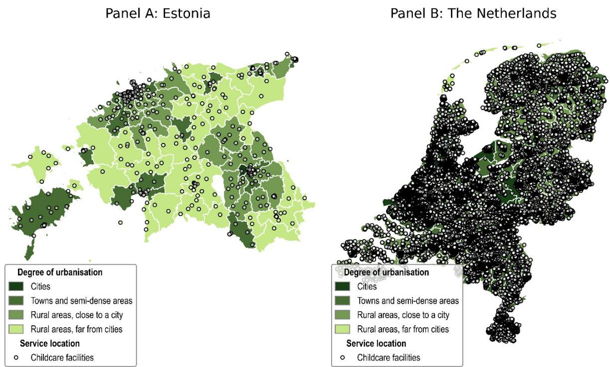  
Source: Based on service data specified in Annex A and the Eurostat (2024[34]) degree of urbanisation classification at LAU level.

Figure C.2. Accessibility by walking is similar across area types, but for public transport disparities arise between cities and towns and rural areas at longer travel times

Variation in competitive accessibility by travel time for the median child across LAUs with a certain degree of urbanisation, by service type and transport mode, in the Netherlands

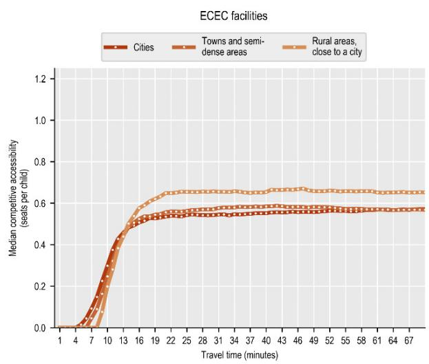  
Panel A: Walking

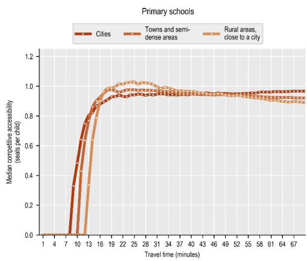

Panel B: Public transport  
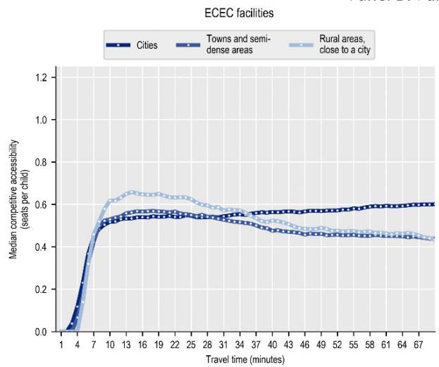

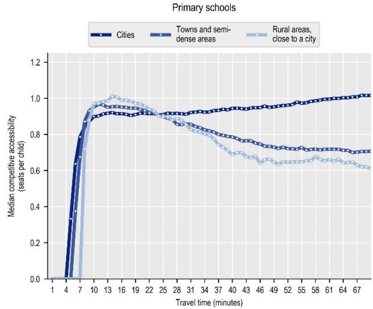  
Note: The lines show the competitive accessibility for ECEC and primary schools for the median child across areas with a certain degree of urbanisation for walking and public transportation and various travel time thresholds. For comparable results for Estonia, see Figure 4.
Source: Based on service data specified in Annex A, Eurostat (2025[33]) population grids and the Eurostat (2024[34]) degree of urbanisation classification at LAU level.

Figure C.3. In the accessibility of ECEC, many children in cities face short travel times but lower competitive accessibility

Share of ECEC-aged children facing a double reward, trade-off, or double penalty in their access to ECEC facilities, by country, degree of urbanisation, and transport mode

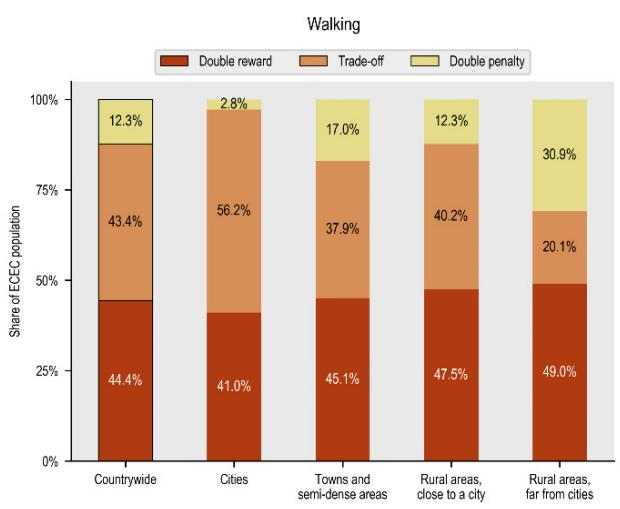  
Panel A: Estonia

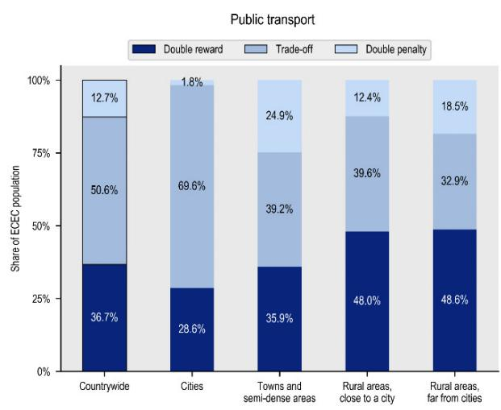

Panel B: The Netherlands  
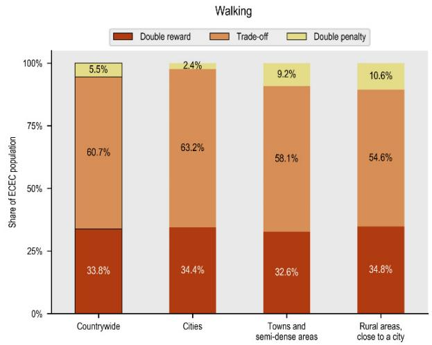

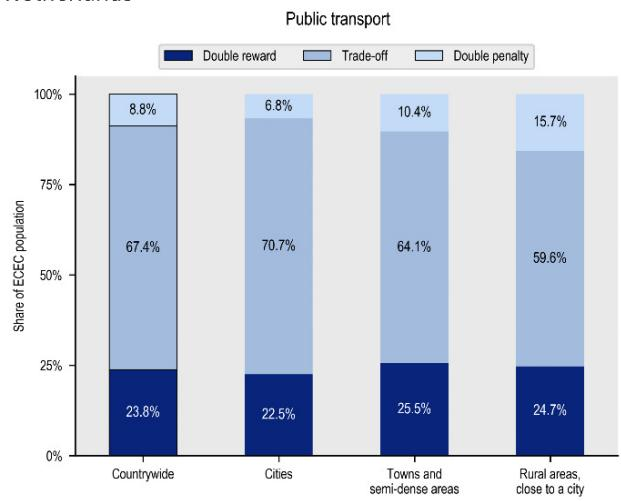

Note: The bars show the percentage of children who face a double reward, a trade-off or a double penalty situation in access to ECEC facilities across degrees of urbanisation. The classification compares each child's travel time and competitive accessibility with the median thresholds for these indicators within each degree of urbanisation. The countrywide share is obtained by aggregating the results for each degree of urbanisation, weighted by the corresponding population. For comparable results for the accessibility of primary schools, see Figure 5.
Source: Based on service data specified in Annex A, Eurostat (2025[33]) population grids and the Eurostat (2024[34]) degree of urbanisation classification at LAU level.

Figure C.4. Median travel times to the closest PES by public transport are higher than 40 minutes in most LAUs

Median travel times to the closest PES by public transport across LAUs, in Estonia and the Netherlands

Panel A: Estonia

Panel B: The Netherlands

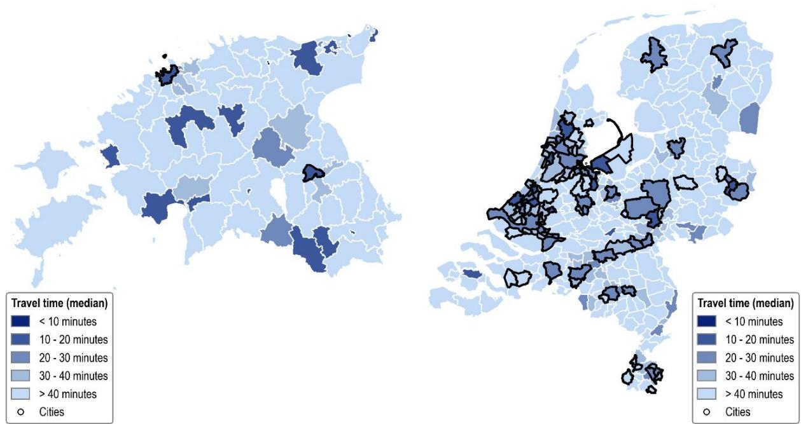  
Source: Based on service data specified in Annex A, Eurostat (2025[33]) population grids and the Eurostat (2024[34]) degree of urbanisation classification at LAU level.  
Note: Cities are marked with a black outline.

Table C.1. Median travel time thresholds by service, transport mode and degree of urbanisation In minutes

<table><tr><td></td><td>Cities</td><td>Towns and semi-dense areas</td><td>Rural areas, close to a city</td><td>Rural areas, far from cities</td><td>National median</td></tr><tr><td colspan="6">Estonia</td></tr><tr><td colspan="5">Walking</td><td></td></tr><tr><td>ECEC facilities</td><td>7</td><td>14</td><td>23</td><td>43</td><td>13</td></tr><tr><td>Primary schools</td><td>10</td><td>17</td><td>30</td><td>45</td><td>15</td></tr><tr><td colspan="5">Biking</td><td></td></tr><tr><td>ECEC facilities</td><td>3</td><td>5</td><td>8</td><td>14</td><td>4</td></tr><tr><td>Primary schools</td><td>4</td><td>6</td><td>10</td><td>15</td><td>5</td></tr><tr><td colspan="5">Public transport</td><td></td></tr><tr><td>ECEC facilities</td><td>3</td><td>8</td><td>13</td><td>23</td><td>7</td></tr><tr><td>Primary schools</td><td>5</td><td>9</td><td>16</td><td>23</td><td>8</td></tr><tr><td colspan="6">Driving</td></tr><tr><td>ECEC facilities</td><td>6</td><td>5</td><td>5</td><td>5</td><td>5</td></tr><tr><td>Primary schools</td><td>6</td><td>5</td><td>5</td><td>5</td><td>6</td></tr></table>

Netherlands

<table><tr><td colspan="5">Walking</td><td></td></tr><tr><td>ECEC facilities</td><td>5</td><td>7</td><td>9</td><td>-</td><td>6</td></tr><tr><td>Primary schools</td><td>9</td><td>11</td><td>13</td><td>-</td><td>10</td></tr><tr><td colspan="5">Biking</td><td></td></tr><tr><td>ECEC facilities</td><td>2</td><td>3</td><td>3</td><td>-</td><td>2</td></tr><tr><td>Primary schools</td><td>3</td><td>4</td><td>5</td><td>-</td><td>4</td></tr><tr><td colspan="5">Public transport</td><td></td></tr><tr><td>ECEC facilities</td><td>3</td><td>4</td><td>5</td><td>-</td><td>3</td></tr><tr><td>Primary schools</td><td>5</td><td>6</td><td>8</td><td>-</td><td>6</td></tr><tr><td colspan="6">Driving</td></tr><tr><td>ECEC facilities</td><td>5</td><td>3</td><td>3</td><td>-</td><td>4</td></tr><tr><td>Primary schools</td><td>6</td><td>4</td><td>4</td><td>-</td><td>5</td></tr></table>

Source: Based on service data specified in Annex A, Eurostat (2025[33]) population grids and the Eurostat (2024[34]) degree of urbanisation classification at LAU level.