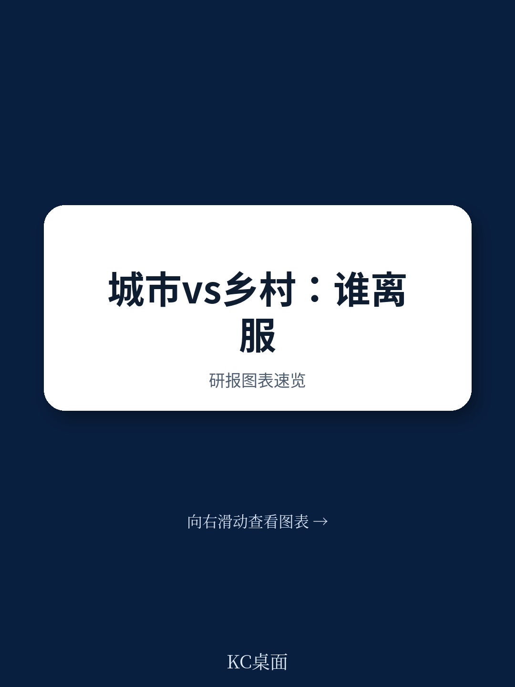
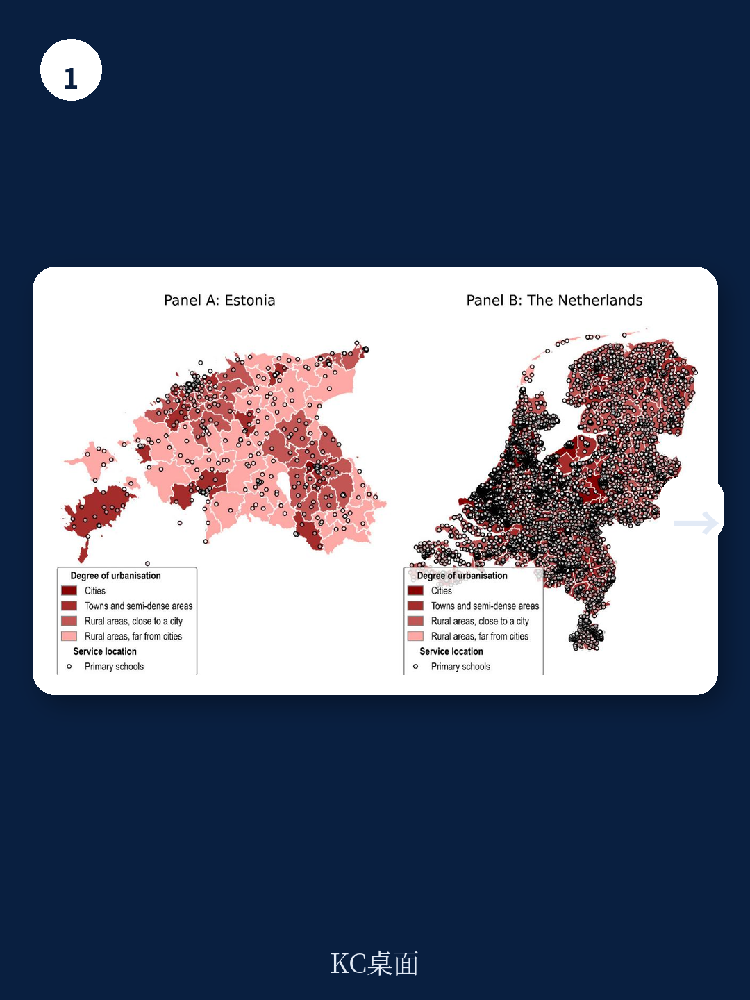
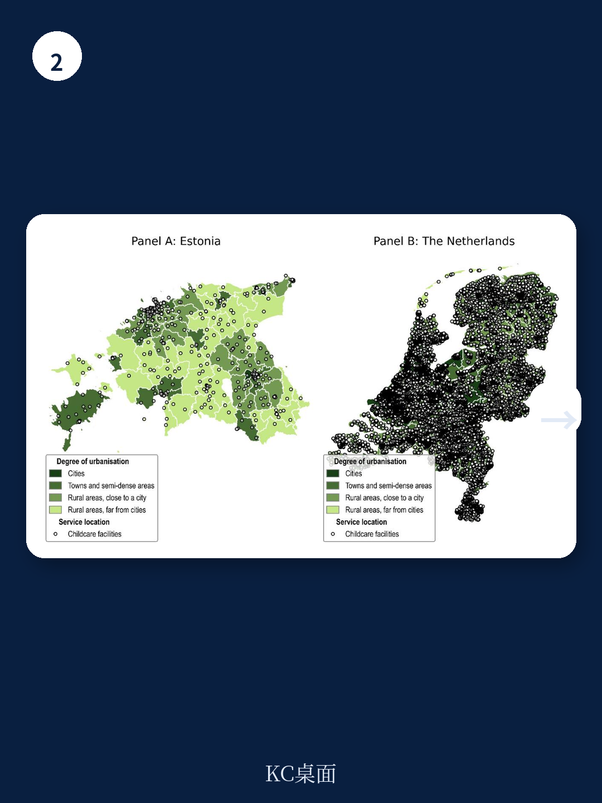

# 经合组织：中国城镇化启示，服务公平不是缩短距离，而是匹配容量

这份来自经合组织（OECD）的工作论文，表面上是在比较爱沙尼亚和荷兰两个小国的服务可及性，但它提出的核心判断，对任何一个关注人口流动、劳动力市场与社会公平的经济体都有深刻的政策含义：**“近”不等于“易得”，“远”不等于“不可达”。** 当我们将“竞争性可及性”（competitive accessibility）——即考虑了服务容量和本地需求压力的指标——纳入分析框架时，传统“城乡二元论”的结论被显著修正。城市居民享受短途通勤的便利，但往往面临更激烈的学位、名额或服务供给竞争；农村居民虽然需要更长的通勤时间，但一旦到达，其获得服务的实际概率可能更高。这一发现，直接挑战了当前许多国家在公共服务均等化政策中单纯追求“缩短物理距离”的路径依赖。

**这篇报告的核心价值不在于它的具体数据，而在于它提供了一个可复制的分析框架：如何用“时间+容量+竞争”三个维度，重新定义“公平”。** 对于中国这样正在经历城镇化后期、面临人口收缩与公共服务布局调整的决策者与产业观察者而言，这个框架远比具体的爱沙尼亚或荷兰案例更具启发性。

> **KC评论：** 如果你只关心“我家附近有没有学校/医院”，那你看的是最浅层的服务地图。这篇报告告诉你，更关键的问题是：这所学校有多少名额？有多少人同时在抢？你的通勤时间是否换来了更高的录取概率？这才是真实的“可及性”。

继续看原文，真正有价值的是报告中对“双重重罚”群体的识别方法、分交通模式的可及性对比（步行、骑行、驾车、公共交通），以及“交通贫困”指标的构建逻辑。这些方法论和图表，在完整报告中均有详细拆解和可视化呈现。完整报告与KC评论在每日汇编中更新。

## 1. 物理距离只是冰山一角：竞争性可及性如何改写“公平”的定义

传统意义上的服务可及性研究，几乎全部聚焦于“到最近服务设施的距离或时间”。这构成了几乎所有公共服务规划的基础逻辑：在偏远地区多建一所学校，就等于缩小了城乡差距。但这份报告通过引入“竞争性可及性”指标，揭示了一个被长期忽视的现实：**即使物理距离相同，服务供给与需求之间的匹配程度，才是决定真实可及性的关键。**

具体而言，竞争性可及性衡量的是：在给定的旅行时间阈值内，一个人所能接触到的服务设施的总容量，除以该区域内同样在竞争这些容量的总人口。这本质上是一个“人均可获得服务容量”的指标。报告以爱沙尼亚和荷兰的学前教育（ECEC）和小学为例，清晰地展示了这一维度的价值：在爱沙尼亚城市中，步行10分钟内可及的学前教育设施数量远多于农村，但由于城市中适龄儿童密度极高，每个儿童实际可竞争到的“人均容量”反而低于许多农村地区。农村儿童虽然要走40分钟，但到达后，学校或幼儿园的学位相对充裕。

**这意味着，单纯用“15分钟生活圈”或“30分钟医疗圈”作为政策标准，可能会误导资源投放。** 如果一个城市已经达到15分钟步行可达幼儿园的标准，但每个幼儿园都超负荷运转，那么真正的短板不是设施数量，而是容量与人口密度的错配。政策重点应从“补网点”转向“扩容量”或“调分布”。

## 2. 双重重罚群体：13%至14%的学龄儿童同时承受时间与竞争的双重挤压

报告最有力的发现之一，是识别出了一群“双重重罚”的儿童：他们既面临高于中位数的通勤时间，又面临低于中位数的竞争性可及性。在爱沙尼亚和荷兰，这一比例在小学阶段均达到13%至14%。这些孩子既没有享受到城市的便捷，也没有享受到农村的相对充裕。

这一发现的政策含义极为明确：**传统的“城乡分类施策”无法覆盖这一群体。** 他们可能生活在城市边缘的“通勤带”，既不属于高密度的城市核心，也不属于典型的农村。他们的困境是空间结构、交通网络与服务供给三重因素叠加的结果。报告特别指出，在爱沙尼亚，这一群体的空间分布呈现出极大的区域差异，某些地方行政单元（LAU）中这一比例远高于全国均值。

> **KC评论：** 如果你在做城市规划或公共服务投资，这篇报告最值得你细看的部分，不是全国平均数据，而是那些“双重重罚”群体的空间分布图。它告诉你：问题不在城市或农村，而在“城市与农村之间的灰色地带”。完整报告中的图6和图C.3，提供了按交通模式和城市化程度拆分的详细数据，以及用于识别这些群体的方法论阈值。

## 3. 交通模式的选择，决定了服务可及性的真实边界

报告对交通模式的细致建模，是其另一大亮点。它并非简单地假设“所有人都能开车”，而是分别测算了步行、骑行、驾车和公共交通四种模式下的可及性。结果揭示了两个关键洞察

**第一，驾车几乎消除了城乡差距。** 在爱沙尼亚，无论住在哪里，驾车到最近学前教育设施或小学的中位时间均为5-6分钟。这印证了一个老生常谈但常被忽视的事实：在汽车普及的社会，服务可及性不平等的主要来源不是距离，而是“是否拥有汽车”。

**第二，公共交通在填补这一缺口方面表现极不稳定。** 对于公共就业服务（PES）而言，报告发现：在没有私家车的情况下，即使是在城市中，公共交通也可能不是可行的选择。在爱沙尼亚和荷兰的许多地方行政单元，中位居民乘坐公共交通到达最近的PES中心的时间超过40分钟。对于最弱势的20%人口，公共交通几乎无法成为替代方案。

**这一结论对中国的启示尤为直接。** 中国许多城市正在大力推进公共交通导向的开发（TOD），但报告提醒我们：公共交通的“可及性”高度依赖于时刻表、换乘效率、首末班车时间和最后一公里衔接。如果这些环节不打通，公共交通就无法真正替代私家车，也无法弥合服务可及性的城乡鸿沟。

## 4. 报告尚未完全回答的关键问题：容量约束的动态性与政策杠杆

尽管报告提供了极为精细的静态分析，但它也坦诚地指出了几个尚未完全解决的问题，这些恰恰是后续研究和政策设计中最值得深挖的方向

**第一，容量约束是静态的吗？** 报告中的竞争性可及性是基于当前设施容量和人口分布计算的。但在现实中，容量是动态的：一个幼儿园可以通过增加班级、延长服务时间或调整师生比来扩大容量；一个PES中心可以通过数字化手段服务更多求职者。报告没有建模这些“供给侧弹性”，而这一弹性恰恰决定了政策干预的空间。

**第二，人口流动与设施布局的互动如何建模？** 报告承认，家庭在选址时，服务可及性是一个重要但非唯一的因素。如果城市核心区的竞争过于激烈，家庭是否会被“挤出”到郊区或小城镇？这种“用脚投票”的行为，反过来会重塑人口分布和服务需求，形成一个动态均衡。报告没有纳入这一双向反馈机制。

**第三，不同类型的服务，其“可接受通勤时间”是否应差异化？** 报告提出了一个极具启发性的建议：应根据城市化程度设定差异化的旅行时间阈值（例如，城市15分钟、农村30分钟）。但这一建议背后的福利经济学逻辑——即不同人群对通勤时间的边际效用不同——报告没有展开。

> **KC评论：** 报告的方法论是工具箱，不是政策答案。它给你的是如何测量问题的尺子，而不是解决问题的锤子。如果你想进一步理解这些未解问题，以及如何将这套框架应用于中国或亚洲其他经济体，完整报告中的Annex部分提供了详细的模型设定、数据来源和参数选择，是方法论研究者最值得细读的部分。

## 5. 对读者的观察框架：如何用“时间-容量-竞争”三角重新审视你身边的公共服务

基于报告的框架，我们建议读者在观察或评估任何公共服务布局时，可以尝试以下三个问题

**第一，你所在区域的服务可及性，是“时间问题”还是“容量问题”？** 如果一个社区抱怨“没有学校”，这可能是时间问题（需要新建设施）；如果一个社区抱怨“学校太挤”，这就是容量问题（需要扩建或分流）。两种问题的政策工具完全不同。

**第二，谁在承担“双重重罚”？** 关注那些既远离设施又面临高竞争压力的群体。他们往往不是最显眼的“贫困社区”，而是城市边缘、通勤带或产业区周边的“夹心层”。他们的需求最容易被平均数据掩盖。

**第三，交通模式是否被低估了？** 在评估一个区域的公共服务可及性时，是否充分考虑了没有私家车的人群？公共交通的可靠性和时效性是否被理想化了？报告的数据表明，很多“理论上可达”的服务，在实践中对弱势群体而言是“不可达”的。

**这篇报告的价值不在于给出爱沙尼亚和荷兰的答案，而在于提供了一套通用的诊断工具。** 对于中国这样一个幅员辽阔、人口密度差异极大、城镇化进程仍在推进的国家，这套工具尤其值得政策研究者、城市规划者和公共服务投资者认真研读。

---

更多国际信源汇编与评论，扫码交流。每日更新，汇总国际主流叙事、数据与图表，观测边际变化。每日汇编会将单篇报告放回当天的主线，整理成中文摘要、KC评论和图表合集，便于喂给AI，也便于人工快速扫描市场dynamics。这里汇聚了头部券商、PE/VC、投行、并购、hedge fund、资管机构、战略咨询、智库等朋友，期待交流。

Personal reading notes and learning share only. Not investment advice.
