Social Institutions and Gender Index

# Masculinity and Gender Equality Insights from Côte d'Ivoire and Senegal

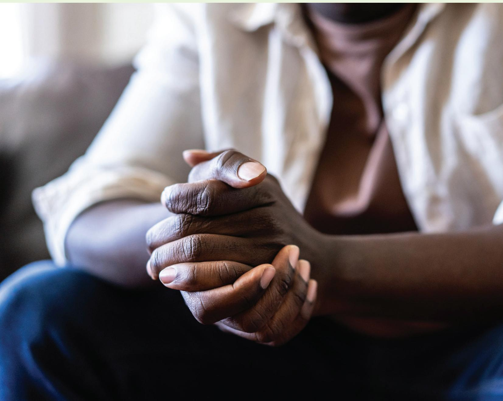

# Masculinity and Gender Equality

INSIGHTS FROM CÔTE D'IVOIRE AND SENEGAL

This work is published under the responsibility of the Secretary-General of the OECD. The opinions expressed and arguments employed herein do not necessarily reflect the official views of the Member countries of the OECD or its Development Centre.

This document, as well as any data and map included herein, are without prejudice to the status of or sovereignty over any territory, to the delimitation of international frontiers and boundaries and to the name of any territory, city or area.

OECD (2026), Masculinity and Gender Equality: Insights from Côte d'Ivoire and Senegal, Social Institutions and Gender Index, OECD Publishing, Paris, https://doi.org/10.1787/3973b760-en.

ISBN 978-92-64-70352-0 (print)

ISBN 978-92-64-91661-6 (PDF)

ISBN 978-92-64-67561-2 (HTML)

Social Institutions and Gender Index
ISSN 2663-4716 (print)
ISSN 2663-4724 (online)

Photo credits: Cover © Vladimir Vladimirov/Getty Images.

Corrigenda to OECD publications may be found at: https://www.oecd.org/en/publications/support/corrigenda.html.
© OECD 2026

## Attribution 4.0 International (CC BY 4.0)

This work is made available under the Creative Commons Attribution 4.0 International licence. By using this work, you accept to be bound by the terms of this licence (https://creativecommons.org/licenses/by/4.0/).

Attribution – you must cite the work.

Translations – you must cite the original work, identify changes to the original and add the following text: In the event of any discrepancy between the original work and the translation, only the text of the original work should be considered valid.

Adaptations – you must cite the original work and add the following text: This is an adaptation of an original work by the OECD. The opinions expressed and arguments employed in this adaptation should not be reported as representing the official views of the OECD or of its Member countries.

Third-party material – the licence does not apply to third-party material in the work. If using such material, you are responsible for obtaining permission from the third party and for any claims of infringement.

You must not use the OECD logo, visual identity or cover image without express permission or suggest the OECD endorses your use of the work.

Any dispute arising under this licence shall be settled by arbitration in accordance with the Permanent Court of Arbitration (PCA) Arbitration Rules 2012. The seat of arbitration shall be Paris (France). The number of arbitrators shall be one.

## Foreword

In 2021, the OECD Development Centre's report Man Enough? Measuring Masculine Norms to Promote Women's Empowerment introduced a conceptual framework to analyse and measure restrictive masculinities and their implications for gender equality. Masculinities encompass the various socially constructed ways of being and acting, values and expectations associated with being and becoming a man in a given society, location and temporal space. They relate to perceived notions, shared by both men and women, about how men are expected to behave in specific settings in order to be considered “real” men. The report articulated a ten-norm framework capturing key expectations surrounding men’s roles, behaviours and authority, and proposed an initial set of indicators to address the limited availability of systematic and comparable data on masculine norms across contexts.

This report takes that framework from concept to application. Following a successful pilot by Ireland, it applies the conceptual and measurement tools developed in Man Enough? to country contexts, using new empirical evidence from Côte d'Ivoire and Senegal. Drawing on original, nationally representative survey data from Côte d'Ivoire and qualitative research from Senegal, the report examines how restrictive masculine norms manifest themselves in everyday life and how they shape gender equality outcomes in these two countries.

The analysis focuses on the interaction between masculinities, women's economic empowerment and gender-based violence, while recognising that restrictive norms also affect men and boys themselves. By applying the framework in Côte d'Ivoire and Senegal, the report enhances the understanding of how masculine norms are maintained, experienced and negotiated across different social and geographic contexts.

This work builds on the Development Centre's long-standing expertise in identifying and measuring discriminatory social institutions, notably through the Social Institutions and Gender Index (SIGI). As with SIGI, the report is grounded in a central premise: advancing gender equality requires more than measuring unequal outcomes. It also requires “making the invisible visible”, by examining the social norms, expectations and practices that underpin them. Restrictive masculinities form part of this broader institutional environment, shaping assumptions around authority, paid work, care responsibilities and social roles.

Beyond its analytical contribution, the report advances the measurement agenda by operationalising indicators to measure and monitor masculine norms at country level. These tools are intended to support policymakers, civil society organisations, development partners and other stakeholders in identifying entry points for policies and programmes that promote positive and gender-equitable masculinities. By applying a consistent framework across country contexts, the report aims to inform future research, policy dialogue and collective action to address the social foundations of gender inequality.

# Acknowledgements

This report was prepared by the OECD Development Centre and benefited from excellent collaboration with the Governments of Côte d'Ivoire and Senegal.

The report was produced under the guidance of Ragnheiður Elín Árnadóttir, Director of the OECD Development Centre, and Bathylle Missika, Head of the Inclusive Development Partnerships Division of the Development Centre (DEV/INDP) and Head of the Pact for Prosperity, People and the Planet Secretariat hosted at the OECD. The project was led by Hyeshin Park, Head of the Development Centre's Gender and Development Unit.

The report was prepared by Hyeshin Park, Marinella Cirillo, Carolin Beck and Gorazd Režonja. Yannick Malalanirina, Anamika Jain and Melik Topci provided statistical, research and drafting support. Sonja Marki and Tamara Shchelkunova provided administrative support.

The data collection and fact-finding work in Côte d'Ivoire and Senegal was carried out with the participation of a network of statistical agencies, local experts and researchers. For Côte d'Ivoire, primary data were collected through a household survey in collaboration with the National Institute of Statistics of Côte d'Ivoire (Agence Nationale de la Statistique). For Senegal, the qualitative evidence draws on valuable insights from key informant interviews and participatory discussions.

A special thanks goes to all participants, partners and members of the Technical Advisory Groups in both countries, chaired by the UNESCO Chair “Women, Water and Decision-making power” in Côte d’Ivoire and the Department for Gender Equity and Equality, Ministry of Family, Social Action and Solidarity in Senegal, whose guidance helped ensure contextual relevance and national ownership of the tools and findings.

For Côte d'Ivoire, the team specifically acknowledges the contributions of Euphrasie KOUASSI YAO, Alexis TCHIAKPÉ, Cyrille BADO, Eric d'Assan KOFFI, Rose KOFFI-NEVRY, Assiénin Henri Lopèze KOUAMÉ, Aya Rudie Karen AÏDEDJI, wife of KOUASSI, Jean MESSINGUÉ (UNESCO Chair); Nina BECHEHIN AMON (COCOFCI); Daniel KAKOU, Max YAO, Masseba DOSSO (MFFE); Rebecca ASSA, Larissa EBA-BALLET, Mame Ibrahima N'DOYE (UFHB); Awa DIALLO, Koffi KOUAKOU (AfDB); Alfred AFFA, Christophe Richard EKRA GNANKOU (CNRCT); Laurenne DJIRIGA, Fabrice Elisée ODI (BLOOM); Doria Guepie DEZA (ANStat); Raïssa ANONGBA (Gender Expert); Chantal AYEMOU (RIDDEF); Ibrahim BAMBA (Journalist); Marius BLY (PDFA); Sogodogo BOSSOH (RESIFILLE); Bernadette DIA KAMGNIA (Academia); Mawa DIABY (Femmes Élites); Clarisse DJEDJE AKM (University Alassane Ouattara); Christ DJOSSA GODJO (CGIS); Irad GBAZALE (Femme en Action); Léon Rivière KOMENAN KOUADJO (UNESCO); Dounamba CISSE, wife of KONE (Clinic Farah); Léopoldine TOSSOU (Expert); Apo Cynthia AGUIE (MSLP); Emmanuel AKPA (Chief Adjoukrou); Affoué Lucie ALLOU, wife of KACOUTIER (Chief Baoulé); Adépo ASSI (CNPS); Thiery DOURA DOURA (CGECI); Raphael EHUI TIEMELE (ONEG); Fousseni FOFANA (COSIM); G. ANEY KABRAN (Archdiocese of Abidjan); KIENON KABORE (IHAAA); Aka KONIN ELOGNE (Chief Koulango/Agni); Paule Danielle KRAKOU (EM-CI); Pehe LAMY (Chief animist); Anne Marie LOBE (Overcome); Draman MANIGA (Chief Dan); Mariette YAO, wife of KOUADIO (PNLVBG).

For Senegal, the team specifically acknowledges the contributions of Astou DIOUF GUEYE, El Hadji Abdoul Aziz NDAO, Ismaila DIOP, Abdoulaye DIOP, Haby BA, Mody SAKHO and Mansour CISSE (DEEG); Débo SOW (CGE MEPC); Lydie SANKA and Estel PEREZ NOVES (UNFPA); Babacar NDIONE (RSP Bargny); Aissatou DIALLO (CGE MSHP); Moustapha WELLE (RIP); Papa Ndické SAMB (CCS); Coumba FALL VEN (FAS); Fatou Bintou TOURE (APE); Amadou Assane SYLLA (CRSD); Fatou FALL (Plan International); Dieynaba SARR (FAS); Khady MBACKE KA (CGE MCAT); Adama THIARE (CGE MSP); Babacar DIOUF (DDH); Samba DIOUF (DAEF); Aminata SOCK (CLVF); Ndèye Astou DIOUF (REPSFECO); Saassy Marie Augustine (KAYAM Sénégal); Mama DIOUF (DF); Khadidiatou GAYE (DDCH); Seynabou MBAYE (CGE MEN); Fatou CISS (AJS); Amayel DIOP (UCAD).

The team also gratefully acknowledges the members of the Global Technical Advisory Group for their technical expertise and valuable suggestions throughout the process.

The report greatly benefited from the support of the Austrian Development Agency (ADA).

The team sincerely appreciates the insightful comments and inputs provided by Federico Bonaglia, Jenny Hedman, Lucie Fayoux, Pierre de Boisséson and Valentina Patrini from the OECD.

Finally, the team acknowledges Henri-Bernard Solignac-Lecomte, Delphine Grandrieux and Elizabeth Nash from the OECD Development Centre's Communications and Publications Unit, who edited, laid out and produced the report.

## Table of contents

Foreword 3   
Acknowledgements 4   
Abbreviations and acronyms 9   
Executive summary 10   
1 Overview: Masculinities, gender-based violence and economic empowerment in Côte d'Ivoire and Senegal 13 Why masculinities matter 14 Restrictive masculinities in Côte d'Ivoire and Senegal: Persistence, pressures and change 15 How restrictive masculinities shape women's economic empowerment and gender-based violence 19 Promoting positive masculinities: Pathways for change 23 Policy recommendations 24 References 27   
2 Masculine norms in Côte d'Ivoire 29 In brief 30 Insights from the OECD's Masculinities Index for Côte d'Ivoire 32 A "silent gap" between personal beliefs and social expectations creates space for change 39 Restrictive masculinities harm men as well as women - making transformation urgent 41 Conclusion and policy recommendations 43 Annex 2.A. OECD Masculinities Index results for Côte d'Ivoire 46 Annex 2.B. Methodology for the construction of the OECD Masculinities Index 47 References 50 Notes 53   
3 Masculine norms in Senegal 55 In brief 56 Positive masculinity is gaining policy traction, but restrictive norms remain widespread 57 Restrictive masculinities are sustained through socialisation, sanctions and structural pressures 59 Pressures and misperceptions create both tensions and opportunities for change 61 Conclusion and policy recommendations 62 Annex 3.A. Conceptual framework on restrictive masculine norms in Senegal 65 References 66

4 How masculinity norms shape women's economic empowerment 67
In brief 68
Restrictive masculinities shape women's access to employment and decent work 69
Unpaid care and domestic work are a central pathway through which restrictive masculinities constrain women's paid employment 73
Restrictive masculinities constrain women's agency in decision-making and control over resources 78
Conclusion and policy recommendations 82
References 84
Notes 86
5 Transforming masculinities to prevent gender-based violence 89
In brief 90
Gender-based violence is widespread and extends beyond intimate relationships 91
Shame, social pressure and acceptance of violence limit reporting and obscure the full scale of gender-based violence 95
Restrictive masculinities explain perpetration, not victimisation 96
Normalisation of violence and weak accountability allow abuse to persist 98
Conclusion and policy recommendations 99
References 101
Notes 103

## FIGURES

Figure 1.1. The ten norms of restrictive masculinities 15  
Figure 1.2. People overestimate men's support for restrictive masculinities and underestimate women's support 18  
Figure 1.3. Women do most unpaid care and domestic work, and most people believe it is their job 20  
Figure 1.4. Acceptance of violence depends on how and where it occurs 22  
Figure 2.1. Sampling frame for the masculinities study in Côte d'Ivoire 31  
Figure 2.2. Restrictive masculinities are widespread in Côte d'Ivoire but vary across regions 32  
Figure 2.3. Young men express higher support for restrictive masculinities than young women 34  
Figure 2.4. The provider and decision maker norms are central to restrictive masculinities 36  
Figure 2.5. Higher educational attainment is associated with lower adherence to restrictive masculinities 38  
Figure 2.6. People overestimate men's and underestimate women's support for restrictive masculinities 40  
Figure 2.7. Strong expectations about gender roles limit women's and men's opportunities 43  
Figure 3.1. Economic indicators highlight the vulnerability of Senegalese youth 60  
Figure 3.2. People overestimate others' support for restrictive masculinities 62  
Figure 4.1. In Côte d'Ivoire and Senegal there are significant gaps in labour force participation 70  
Figure 4.2. A large share of women in Côte d'Ivoire and Senegal is employed in vulnerable forms of employment 71  
Figure 4.3. Gender-based occupational segregation remains substantial in Côte d'Ivoire and Senegal 72  
Figure 4.4. Women bear a disproportionate burden of unpaid care and domestic work in Côte d'Ivoire and Senegal 74  
Figure 4.5. There are significant gender gaps in unpaid care and domestic work in all regions of Côte d'Ivoire 75  
Figure 4.6. Low early childhood enrolment undermines women's economic empowerment 76  
Figure 4.7. Unpaid care and domestic work is widely perceived as a "women's job" in Côte d'Ivoire 77  
Figure 4.8. Uneven expectations: Men's contribution to unpaid care and domestic work by task 78  
Figure 4.9. In Côte d'Ivoire and Senegal, women have less control over economic decisions 79  
Figure 4.10. Gender gaps in asset ownership rates persist in Côte d'Ivoire and Senegal 81  
Figure 5.1. Prevalence of intimate-partner violence varies by region and type of abuse in Côte d'Ivoire 92  
Figure 5.2. Men are more often perpetrators of violence than women in Côte d'Ivoire 93  
Figure 5.3. Psychological and physical violence are the most common forms of violence against women in Senegal 94  
Figure 5.4. A non-negligible share of the population justifies men's use of violence 96

## TABLES

Table 2.1. Applying the OECD masculinity framework in Côte d'Ivoire 35  
Table 2.2. The breadwinner norm is the strongest norm across most regions 37  
Table 2.3. Health outcomes differ by gender in Côte d'Ivoire 42  
Table 3.1. Prevalence of masculine norms in Senegal 58

Annex Table 2.A.1. OECD Masculinities Index scores for Côte d'Ivoire 46  
Annex Table 3.A.1. Ten-norm conceptual framework on restrictive masculine norms 65

## BOXES

Box 1.1. Good practices and initiatives promoting positive masculinity 23  
Box 2.1. Data collection and analysis on masculinities in Côte d'Ivoire 31  
Box 2.2. The North-South Divide 33  
Box 2.3. Calculating the OECD's Masculinities Index 35  
Box 3.1. Data collection and analytical approach 57  
Box 4.1. Data sources and comparability 69  
Box 5.1. Data sources and comparability 94

## Abbreviations and acronyms

<table><tr><td>ADA</td><td>Austrian Development Agency</td></tr><tr><td>ANSD</td><td>Agence Nationale de la Statistique et de la Démographie</td></tr><tr><td>ANSTAT</td><td>Agence Nationale de la Statistique</td></tr><tr><td>CIV</td><td>Côte d’Ivoire</td></tr><tr><td>DHS</td><td>Demographic and Health Surveys</td></tr><tr><td>EIGE</td><td>European Institute for Gender Equality</td></tr><tr><td>EU</td><td>European Union</td></tr><tr><td>FGD</td><td>Focus group discussion</td></tr><tr><td>GBV</td><td>Gender-based violence</td></tr><tr><td>HIV</td><td>Human immunodeficiency virus</td></tr><tr><td>IPV</td><td>Intimate partner violence</td></tr><tr><td>ISIC</td><td>International Standard Industrial Classification of All Economic Activities</td></tr><tr><td>KII</td><td>Key informant interview</td></tr><tr><td>NGO</td><td>Non-governmental organisation</td></tr><tr><td>OECD</td><td>Organisation for Economic Co-operation and Development</td></tr><tr><td>SDGs</td><td>United Nations Sustainable Development Goals</td></tr><tr><td>SEN</td><td>Senegal</td></tr><tr><td>SIGI</td><td>Social Institutions and Gender Index</td></tr><tr><td>TAG</td><td>Technical Advisory Group</td></tr><tr><td>UCDW</td><td>Unpaid care and domestic work</td></tr><tr><td>UNESCO</td><td>United Nations Educational, Scientific and Cultural Organization</td></tr></table>

# Executive summary

In both Côte d'Ivoire and Senegal, masculinities – understood as socially constructed roles, behaviours and expectations associated with being a man – continue to shape gender relations through norms about men's roles as providers, decision makers and figures of authority. Such restrictive expectations can limit women's economic opportunities and agency, contribute to environments in which gender-based violence can be tolerated, and place pressure on men and boys to meet narrow ideals of manhood. Understanding these norms is therefore essential to identify why gender inequalities persist and where change is possible.

This report analyses masculine norms in Côte d'Ivoire and Senegal through a single framework, implemented through distinct data collection methods in each country. In Côte d'Ivoire, the report draws on new household survey data to examine how restrictive masculinities are distributed across the population and how they relate to women's economic empowerment and violence. In Senegal, it draws on qualitative interviews and a participatory workshop to explore how these norms are understood, reproduced and contested in everyday life. This combined approach makes it possible to identify common patterns across the two countries while recognising important differences in context and evidence.

## Masculinities remain anchored in provision, authority and control

The report finds that restrictive masculinities remain widespread and strongly organised around expectations that men should provide financially, exercise authority and maintain control, while women are expected to carry primary responsibility for unpaid care and domestic work. In both countries, the male provider role remains central to adult male status and social recognition, helping legitimise men's authority within households and communities. In Côte d'Ivoire, nearly all respondents (96%) agree that men should be the main providers, and more than 90% of men report feeling stressed at the prospect of not being able to provide.

Young people are at the centre of both social change and the tensions that accompany it. Younger generations may be more exposed to egalitarian ideas, but generational change is neither automatic nor uniform. In Côte d'Ivoire, young women aged 15 to 24 express the most progressive views, while men in the same age group remain more attached to restrictive norms. In Senegal, youth are generally perceived as more open to gender equality and positive masculinities. However, young men face pressure and difficulties meeting social expectations to succeed economically and socially while young women increasingly demand equality. In both countries, these dynamics can create tensions affecting social cohesion, family well-being and healthy, non-violent relationships if left unaddressed.

A further finding is that restrictive norms can persist because people misperceive what others believe. In Côte d'Ivoire, respondents systematically overestimate men's conservatism and women's progressiveness, suggesting that perceived social expectations do not always align with personal beliefs. In Senegal, stakeholders describe situations where people may privately support more equitable practices but hesitate to express them for fear of social judgement. This gap can sustain silence and conformity, but it can also point to areas where change may be more socially acceptable than decision makers assume.

## Restrictive masculinities constrain women's economic agency and increase the risk of violence

Women in Côte d'Ivoire and Senegal continue to face significant obstacles to their economic empowerment. Labour force participation gaps remain substantial, at around 15 percentage points in Côte d'Ivoire and nearly 30 percentage points in Senegal. Women who work are more likely to be in vulnerable forms of employment, with lower and less stable earnings and more limited access to social protection. While women's economic participation is essential to sustain livelihoods and achieve nation-wide economic development goals, labour market participation does not automatically translate into actual economic empowerment.

Restrictive masculinities help explain the gaps in economic empowerment. In Côte d'Ivoire, women are less likely to work, participate in household decision making, or own and control productive assets where restrictive norms are stronger. They also carry a disproportionate burden of unpaid care and domestic work. In Senegal, qualitative evidence shows that women's economic participation may be welcomed when it helps to meet household needs, but often remains conditional on women continuing to fulfil domestic responsibilities and not challenging men's status as primary providers. Across both countries, norms around provision and authority shape not only whether women work, but also whether their work brings greater agency, recognition and control over resources.

The report also finds that gender-based violence remains widespread, recurrent and underreported in both countries, both within and beyond intimate relationships. Masculinities are especially relevant for understanding the perpetration of violence. Men who endorse restrictive norms are more likely to perpetrate violence, particularly if they perceive pressure to meet economic and sexual masculinity ideals. Overall, these norms sustain an environment in which violence may be tolerated, justified or treated as a private matter.

Weak accountability and social silence compound the problem. Shame, stigma, fear of retaliation, social pressure and limited trust in institutions discourage reporting and help keep violence hidden and unaddressed. Childhood exposure to violence reinforces these dynamics, as harmful norms and behaviours can be learned early and transmitted across generations. Ending gender-based violence therefore requires both stronger response systems and prevention efforts to challenge the norms that legitimise male dominance, control and the use of violence.

## Promoting positive masculinities is key to advancing gender equality and social cohesion

The report underlines the importance of promoting positive, gender-equitable masculinities as a pathway towards greater gender equality. More inclusive and caring models of masculinity can support women's economic agency, reduce tolerance of violence and improve men's own well-being. Promoting positive masculinities is not a marginal or symbolic objective, but a practical entry point for linking women's economic empowerment, violence prevention and inclusive development.

In pursuit of that objective, policymakers should aim to address restrictive norms and structural constraints together, engage men and boys as agents of change, tailor interventions to the local context, strengthen women's economic agency beyond participation alone, and embed norm change within broader strategies to prevent violence and end perpetrator impunity. Using evidence on personal beliefs and perceived social expectations can help them to identify where reforms may be more feasible and where more sustained engagement is needed.

By applying a consistent framework across country contexts, this report establishes a baseline to inform policy dialogue, programme design and collective action aimed at addressing the social foundations of gender inequality.

## Overview: Masculinities, gender-based violence and economic empowerment in Côte d'Ivoire and Senegal

This overview chapter examines how restrictive masculinities shape women's economic empowerment and gender-based violence in Côte d'Ivoire and Senegal. Using quantitative and qualitative evidence, it shows that norms linking masculinity to financial provision, authority and control constrain women's economic agency and are strongly associated with men's perpetration of intimate partner violence. The chapter also highlights the social costs of these norms for men and identifies opportunities to promote more equitable, non-violent and care-inclusive gender roles through integrated policy approaches.

Restrictive masculine norms shape who provides, who decides, who cares and, too often, who controls. In doing so, they influence women's and men's rights, responsibilities and opportunities across all spheres of life. Although restrictive masculinities exist in all societies, they take specific forms across contexts and have concrete implications for gender equality. This report focuses on two critical policy areas where these norms are particularly consequential: women's economic empowerment and the prevention of gender-based violence. In Côte d'Ivoire and Senegal, these dynamics unfold against a backdrop of persistent gender gaps. Women spend about five more hours per day than men on unpaid care and domestic work in both countries. Gender gaps in labour force participation remain substantial, at 15 percentage points in Côte d'Ivoire and 28 percentage points in Senegal. Women also continue to face exposure to intimate partner violence. Understanding masculinities is therefore essential to understanding how gender inequality is reproduced, and how it can be transformed.

This chapter provides an overview of the report's main findings and policy messages, drawing on new evidence from Côte d'Ivoire and Senegal. In line with the African Union's commitment to promote positive masculinity, the OECD collaborated with both countries' governments to generate innovative evidence on the links between masculine norms and gender equality outcomes. The findings show that restrictive masculinities in Côte d'Ivoire and Senegal remain organised around expectations of male provision, authority, control, and distance from care. These expectations constrain women's economic empowerment, limit their agency in household and community life, and contribute to the persistence of gender-based violence. At the same time, they impose costs on men and boys by tying social recognition to ideals of masculinity that are increasingly difficult to fulfil. Yet the evidence also points to openings for change, particularly where care, non-violence, shared decision making and women's economic participation are increasingly recognised as compatible with more positive and equitable forms of masculinity.

## Why masculinities matter

Masculinities refer to shared ideas about how men and boys are expected to be and behave. These ideas shape social expectations around men's roles in the household, the economy and public life, influencing how they are expected to provide, lead, exercise authority, undertake care work or express emotions. While masculinities are diverse within and across societies and can change over time, they become restrictive when they limit women's rights, safety and agency, narrow the range of socially acceptable roles available to men and boys, or reinforce unequal power relations. In this sense, restrictive masculinities are part of a wider system of social expectations that structures gender relations. Examining masculinities therefore helps explain why gender inequality persists, why progress is often uneven, and where change may be possible.

This report builds on the OECD Development Centre's Man Enough? Measuring Masculine Norms to Promote Women's Empowerment, which proposed a unique framework for identifying and measuring norms of restrictive masculinities across countries at different levels of development, including OECD and non-OECD countries (OECD, 2021[1]). While this framework does not provide an exhaustive list of restrictive norms, it focuses on those with the most significant implications for girls' and women's rights, opportunities and well-being. Applied to Côte d'Ivoire and Senegal in close collaboration with national authorities, this framework helps examine how masculine norms operate in practice across household decision making, divisions of labour, control over resources, caregiving responsibilities and the tolerance of gender-based violence. It also shows how these norms affect both women and men, constraining women's agency while placing pressure on men to meet expectations of provision, authority and control.

## A framework for analysing restrictive masculinities

The OECD Development Centre's framework on restrictive masculinities is applied to both countries to measure the prevalence of these norms and analyse how they affect gender equality outcomes, with a focus on women's economic empowerment and gender-based violence (Figure 1.1). In Côte d'Ivoire, the framework is operationalised through a household survey conducted for this study, allowing the report to assess the prevalence and distribution of restrictive masculine norms and construct a Masculinities Index. In Senegal, the same framework guides the qualitative data collection on how these norms are understood, reproduced and contested in context. This shared approach makes it possible to identify common patterns and country-specific dynamics, while recognising that the evidence from the two countries is not directly comparable in statistical terms.

Figure 1.1. The ten norms of restrictive masculinities  
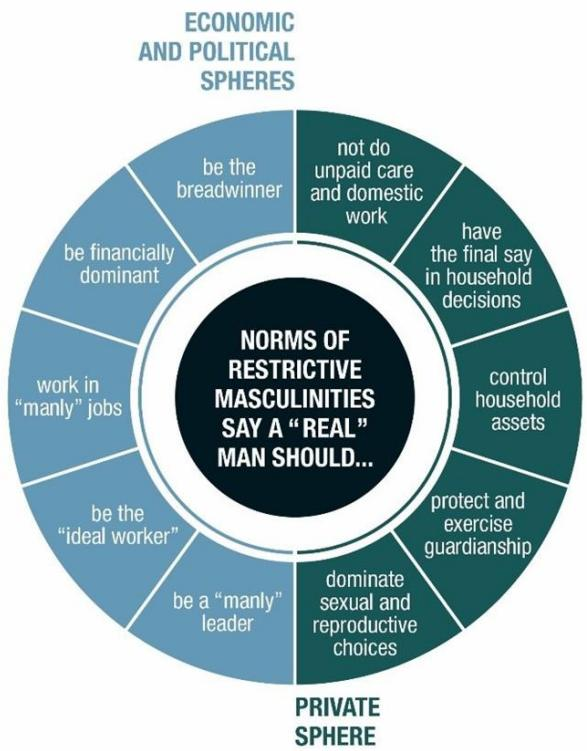  
Note: This is not an exhaustive list of all norms of restrictive masculinities. The objective in the creation of this list was to account for those norms which have the most significant and direct impact on the empowerment of women and girls.
Source: OECD (2021[1]), Man Enough? Measuring Masculine Norms to Promote Women's Empowerment.

Restrictive masculinities in Côte d'Ivoire and Senegal: Persistence, pressures and change

## The expectation that men should provide remains the central organising norm of masculinities

In both Côte d'Ivoire and Senegal, masculinities remain strongly organised around the expectation that men should be the sole or main financial providers for their families. This expectation is not inherently restrictive: economic provision can be an important source of responsibility, care and social contribution.

It becomes restrictive when it defines men's social value primarily through their ability to provide, placing pressure on men to fulfil this role while constraining women's opportunities to participate equally in paid work, income generation and household economic decision making. Expectations around men's role as providers continue to shape perceptions of male responsibility, authority and status. They also structure how women's and men's roles are understood across household, economic and public life, with women still more closely associated with unpaid care and domestic work. Being the main provider or breadwinner therefore has a wider significance: it is not simply an economic role, but a norm through which authority and social recognition are organised.

In Côte d'Ivoire, household survey data show that all ten restrictive masculinity norms remain widespread, confirming that restrictive masculinities are not limited to a single attitude or behaviour but affect several dimensions of the economic, political and private spheres. Within this broader pattern, provider expectations and decision-making norms are particularly central: masculinities continue to be organised around men's perceived responsibility to provide and to exercise authority within the household. The data also show that these norms are not distributed evenly across the population and territories. Support for restrictive masculinities is stronger in rural areas and in the North compared to urban areas and the southern regions of Côte d'Ivoire. Regardless of place of residence and other socioeconomic characteristics, including age, marital status and economic status, higher levels of education are systematically associated with more egalitarian attitudes.

In Senegal, qualitative interviews and locally led participatory workshop discussions with selected stakeholders similarly point to financial provision as a central norm of masculinities, alongside expectations that men should lead, decide and remain relatively distant from unpaid care and domestic work. The Senegal evidence helps unpack how these expectations fit together as a socially recognised normative structure. Ensuring the financial provision for the family gives men legitimacy and authority, while gendered divisions of labour reinforce the idea that care and domestic responsibilities belong primarily to women. Male provider expectations are therefore sustained not only as individual beliefs, but as part of a wider social logic linking economic responsibility, authority and gendered roles. The results for Côte d'Ivoire mirror these dynamics, where experts confirm the centrality of being the main family breadwinner in defining manhood.

Differences in views on specific masculine norms indicate that masculinities are being renegotiated over time and across population groups, albeit in a selective and uneven manner. Across both countries, the evidence suggests that some restrictive norms are less dominant than others, including those related to being a “manly” leader, working in “manly” jobs and controlling assets, including land. These patterns suggest entry points for change, particularly around women’s economic roles and access to resources. In Côte d’Ivoire, women increasingly express disagreement with norms that limit their economic opportunities, including unequal access to assets and unequal pay. In Senegal, qualitative evidence shows that women increasingly claim equal economic rights and opportunities, pursuing careers in previously male dominated sectors and aiming for decision-making roles. At the same time, more deeply embedded expectations around financial provision, household authority and gendered divisions of labour remain difficult to dislodge in both countries.

Finally, young people's endorsement of dominant masculine norms is changing compared to older age groups in both Senegal and Côte d'Ivoire. In Côte d'Ivoire, survey data show a clear gender divide among younger cohorts: women aged 15 to 24 express the most progressive views, while men in the same age group remain more attached to restrictive masculinity norms, particularly around reproductive dominance, financial power and leadership in the workplace. In Senegal, qualitative findings suggest that younger generations are generally perceived as more open to gender equality and positive masculinities, but also under growing pressure. Young men in particular may face heightened expectations to succeed economically and socially, including through access to stable work, while some young women are becoming more assertive in demanding greater equality. Where young men experience limited opportunities or perceive themselves as losing ground, these tensions may feed frustration, resentment or backlash. This dynamic is not only observed in Côte d'Ivoire and Senegal but also in other countries around the world (see Chapters 2 and 3). Youth focused approaches and targeted policies are therefore essential, but they need to address both the aspirations and agency of girls and young women and the economic and social pressures that restrictive masculinities place on boys and young men in Côte d'Ivoire and Senegal.

## Restrictive norms often persist because people think others are more conservative than they are themselves

One of the report's most policy-relevant findings is that restrictive norms of masculinities are sustained not only by what individuals believe, but also by what they think others believe. In Côte d'Ivoire, respondents systematically overestimate men's support for restrictive norms and underestimate women's support for them (Figure 1.2). For instance, while about $76\%$ of the Ivorian population agrees that men make better political leaders, respondents expect $62\%$ of women and $83\%$ of men in their area to agree with this statement. In Senegal, stakeholders similarly describe a context in which individuals often assume that others are less supportive of positive masculinities than they are themselves. This suggests that restrictive norms may persist partly because they are perceived to be more widely shared than they actually are, leading individuals to conform to what they believe to be socially expected. This phenomenon, known as pluralistic ignorance, occurs when individuals privately hold views that differ from the perceived norm, while incorrectly assuming that most others support that norm. The examples of Côte d'Ivoire and Senegal contribute to a growing body of research on pluralistic ignorance and its role in social norms change across different contexts (see Chapters 2 and 3).

These misperceptions matter because they can generate self-censorship and reinforce silence, caution and conformity. Individuals may align their behaviour with what they perceive to be socially acceptable, even when their personal beliefs are more progressive, or may conceal more egalitarian views and practices. Anecdotal evidence from Senegal suggests, for example, that some men who contribute to household chores do so discreetly to avoid social judgement, particularly where such involvement is seen as conflicting with their role as financial provider. In this way, restrictive masculinities can continue to shape behaviour even when personal beliefs are beginning to shift.

This “silent gap” between personal beliefs and perceived social expectations is also important for policy and programming. It can help identify areas where policy reform may be more socially acceptable than commonly assumed, and where resistance may be lower than expected. This is particularly the case for restrictive norms where individuals’ private support is much weaker than perceived social support. In Côte d’Ivoire, for example, reforms related to women’s access to employment, equal pay or shared care responsibilities may receive broader support than decision makers expect. At the same time, norms that remain widely accepted, such as the breadwinner role or men’s authority over women, are likely to require more gradual and context-sensitive approaches. Education, communication, awareness raising and community dialogue are important in this context, not only to shift individual attitudes, but also to reduce the gap between what people personally believe and what they think others believe, making existing support for more equitable norms more visible and easier to express.

Figure 1.2. People overestimate men's support for restrictive masculinities and underestimate women's support  
Personal beliefs about restrictive masculine norms and perceptions of women's and men's support for these norms in Côte d'Ivoire  
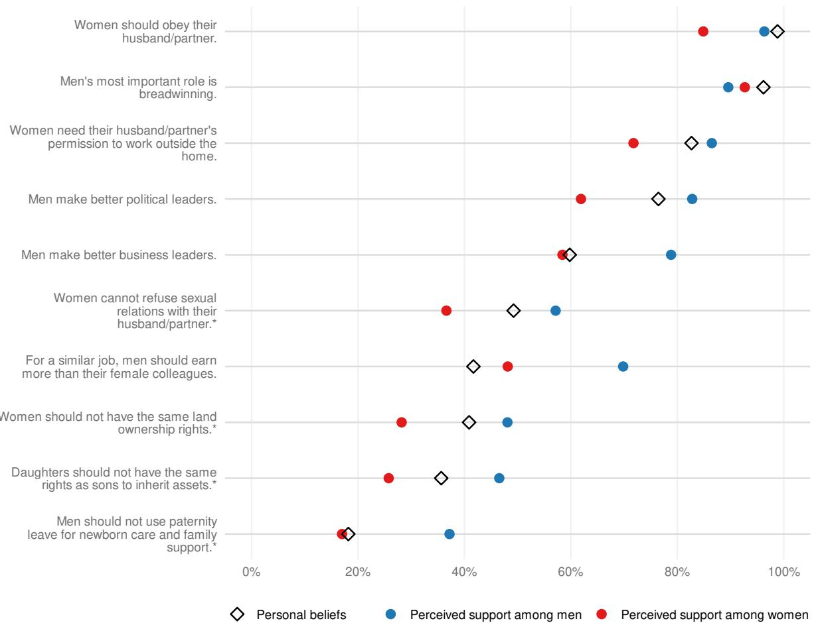

Note: Data presented in this figure was collected through a sequence of three questions which (1) ask the respondent whether they agree or not with the specific statement; (2) ask the respondent to estimate how many out of 10 men in their area would agree with the statement; (3) ask the respondent to estimate how many out of 10 women in their area would agree with the statement. The population-weighted responses for type (1) questions are labelled as “Personal beliefs” and the responses to type (2) and (3) are labelled as “Perceived support among men” or “Perceived support among women”, referring to respondents’ estimated shares of women and men who would support the different statements. For instance, on average 98% of the population agrees that women should obey their husband/partner and the population expects 85% of women and 96% of men to agree with this. The applied methodology follows a literature-based approach.

Statements marked with an asterisk were initially asked in the opposite way – e.g. instead of “I think women cannot refuse sexual relations with their husband” the question was asked as “I think women can refuse sexual relations with their husband”. To present all data in a harmonised way, the mean values for the social expectations on men and women for these statements were reversed.
Source: OECD (2026[2]), OECD Masculinities Database for Côte d'Ivoire, https://data-explorer.oecd.org/s/4sy.

## Restrictive masculinities also place heavy pressure on men and boys

Restrictive masculinities do not only affect women's rights and opportunities. They also place significant pressure on men by tying social recognition to their ability to provide, lead and remain in control, even in contexts where these expectations may be difficult or impossible to fulfil. In Côte d'lvoire, more than $90\%$ of men report feeling stressed at the prospect of not being able to provide for their families. This shows that the provider norm is not only socially central, but also personally burdensome.

In Senegal, qualitative evidence points to a similar tension around the breadwinner role, especially among younger men facing economic uncertainty and limited opportunities. Stakeholders described growing difficulty in meeting established expectations of provision and authority, even as those expectations remain socially powerful. This creates a difficult situation in which restrictive norms of masculinities are maintained despite becoming harder to fulfil. In such contexts, frustration, insecurity and pressure to reassert traditional masculine identities can become part of the social landscape.

These pressures are closely linked to broader social and economic change. Men and boys may be expected to fulfil traditional ideals of manhood in contexts where economic opportunities are uncertain, gender gaps in education are narrowing, and women are increasingly entering the labour market, including in traditionally male dominated domains and senior roles. These shifts can expand opportunities for women and girls, but they may also unsettle established ideas of male provision, authority and status. Understanding these pressures is essential for identifying credible pathways towards more equitable masculinities.

## How restrictive masculinities shape women's economic empowerment and gender-based violence

Restrictive masculinities shape gender inequality through multiple and interconnected pathways. The evidence from Côte d'Ivoire and Senegal shows that these norms influence both women's economic empowerment and gender-based violence, although not in the same way. In the economic sphere, restrictive masculinities shape women's access to paid work, the conditions under which they work, the degree of agency they can exercise, and their control over income, assets and decisions. In relation to violence, they help sustain a social environment in which violence may be tolerated, justified or insufficiently sanctioned, while also increasing the likelihood that men who endorse restrictive norms perpetrate violence. In both areas, restrictive masculinities interact with wider structural inequalities, rather than operating in isolation.

## Restrictive masculinities constrain women's economic participation and agency

Women in Côte d'Ivoire and Senegal continue to face substantial disadvantages in economic empowerment, despite progress in girls' education and women's economic participation. These disadvantages are visible not only in access to paid work, but also in job quality, unpaid care and domestic work, decision making power, and ownership or control of productive assets (see Chapter 4). Labour force participation gaps remain large, at around 15 percentage points in Côte d'Ivoire and nearly 30 percentage points in Senegal. Women who do work are also more likely to be concentrated in vulnerable forms of employment, with lower and less stable earnings and more limited access to social protection. These gaps show that women's economic participation, while essential, does not automatically translate into secure earnings, autonomy or long-term economic security, including access to a pension.

The report shows that restrictive masculinities are a key, yet often overlooked, constraint on women's economic empowerment. Norms that position men as primary breadwinners, protectors and decision makers, and women as dependants responsible for unpaid care and domestic work, shape both women's access to economic opportunities and the terms on which they participate in economic life. In Côte d'Ivoire, new OECD survey evidence shows that population's stronger endorsement of restrictive masculinity norms is associated with poorer economic outcomes for women, even after accounting for differences in education, fertility, geography and household characteristics. These norms are linked to lower probabilities of employment, heavier unpaid care and domestic work burdens, reduced participation in household decision making, and a lower likelihood of women owning or controlling productive assets such as land.

Panel B. Reason why men should not do UCDW

This dynamic is visible in unpaid care and domestic work, where women perform most of the work and many people continue to view it as women's responsibility (Figure 1.3).

Figure 1.3. Women do most unpaid care and domestic work, and most people believe it is their job  
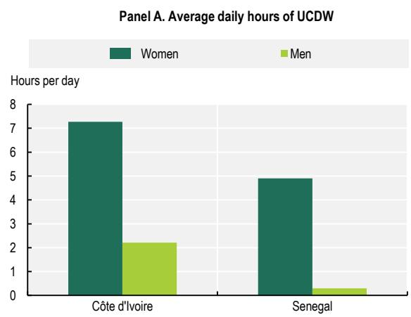

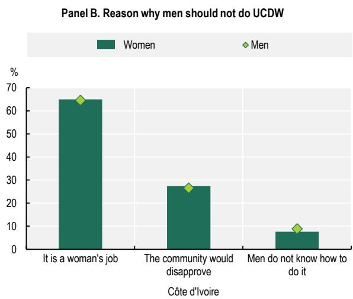  
Note: Panel A shows the average daily hours that men and women in Côte d'Ivoire and Senegal spend on unpaid care and domestic work (UCDW). Panel B shows the reasons why people believe that men should not do unpaid care and domestic work in Côte d'Ivoire. Source: OECD (2026[2]), OECD Masculinities Database for Côte d'Ivoire, https://data-explorer.oecd.org/s/4sy; Agence Nationale de la Statistique et de la Démographie (2022[3]), Enquête Nationale sur l'Emploi du Temps au Sénégal.

These patterns are closely linked to the provider and decision-making norms described earlier. Where masculinity is associated with men's responsibility to provide and exercise authority, women's economic activity may be treated as secondary, conditional or less legitimate, even when it is essential to household livelihoods. Restrictive masculinities can therefore affect whether women work, but also whether their work translates into income security, control over resources, bargaining power and recognition. In this sense, women's economic empowerment depends not only on access to work, but also on whether women can exercise agency over the benefits of that work.

The influence of norms also depends on household economic conditions. In Côte d'Ivoire, restrictive masculinities appear to exert their strongest influence in middle- and higher-income households, where women's paid work may be less economically necessary and households may have more room to conform to traditional gender roles. In poorer households, by contrast, women's economic engagement appears less sensitive to restrictive norms because income constraints often require the participation of all adult members. This does not mean that provider expectations are weaker among poorer households. Rather, economic necessity may limit the extent to which households can act on the male breadwinner ideal. Even when women work, restrictive norms may continue to shape whether their income is recognised, who controls resources, and who makes decisions.

Qualitative evidence from Senegal points to similar dynamics. Stakeholders describe how expectations around male provision, household authority and women's responsibility for unpaid care and domestic work continue to shape women's economic choices and opportunities. Women's economic participation may be welcomed when it helps meet household needs but often remains conditional on women fulfilling domestic responsibilities and not challenging men's status as primary providers. This helps explain why women's increasing presence in the labour market does not necessarily translate into equal decision-making power, control over resources or recognition of their economic contributions.

Overall, the evidence highlights that women's economic empowerment depends on both structural factors, such as local labour market conditions or supporting policies, and social norms, and especially on how the two interact. Expanding access to education, decent jobs, affordable childcare, land and productive assets remains essential. Yet, these measures are unlikely to be sufficient if restrictive masculinities continue to limit women's choices, time use and control over resources. Policies aimed at closing gender gaps therefore need to combine economic and labour market reforms with deliberate efforts to transform norms that confine women to unpaid care and domestic roles and associate authority, provision and economic independence primarily with men.

## Restrictive masculinities sustain violence and increase the risk of perpetration

Gender based violence remains widespread, recurrent and largely underreported in both Côte d'Ivoire and Senegal, despite progress in legal frameworks and in holistic service provision for survivors, including shelters, legal aid and medical care. Available data show that around 30% of women and 20% of men in Côte d'Ivoire, and 70% of women in Senegal, have experienced intimate partner violence at least once in their lives. Psychological violence is the most common form, often overlapping with physical, sexual and economic abuse. Violence is also rarely isolated. In Côte d'Ivoire, more than two-thirds of intimate partner violence survivors report repeated incidents, often occurring several times per month. These patterns point to entrenched dynamics of abuse within relationships and across social settings.

The report shows that restrictive masculinities play a central role in shaping patterns of violence perpetration, rather than directly predicting who experiences violence. Men who endorse norms emphasising male authority, control over women, breadwinning dominance and sexual entitlement are significantly more likely to perpetrate both intimate and non-intimate partner violence. These associations hold even after accounting for education, income, employment status and other socio-demographic factors. By contrast, women's general endorsement of restrictive masculinities does not predict their likelihood of experiencing violence. This underscores that exposure to violence is shaped by broader relational, community and structural conditions, rather than by individual attitudes alone.

Restrictive masculinities also matter because they help sustain a social environment in which violence can be tolerated, justified or insufficiently sanctioned. In both countries, a sizeable share of the population justifies men's use of violence under certain circumstances, and many still consider domestic violence a private matter (Figure 1.4). Shame, stigma, fear of retaliation, social pressure and limited trust in institutions discourage disclosure and reporting, meaning that observed prevalence likely understates the true scale of violence. Childhood exposure to violence further reinforces these dynamics. Individuals, particularly men, who witnessed intimate partner violence during childhood are more likely to justify or perpetrate violence later in life, highlighting how harmful norms can be learned early and transmitted across generations.

Figure 1.4. Acceptance of violence depends on how and where it occurs  
Agreement that a man can physically hurt his wife in Côte d'Ivoire or Senegal if she ...  
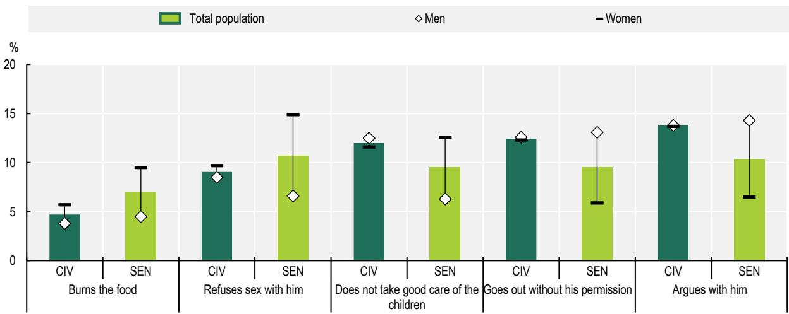  
Note: This figure shows the share of the population (total, women, men) in Senegal (SEN) and Côte d'Ivoire (CIV) agreeing that a man has the right to beat, slap, kick or physically hurt his wife or partner if she burns the food; argues with him; goes out without telling him or asking for his permission; does not take good care of their children; or refuses to have sexual relations with him.  
Source: OECD (2026[2]), OECD Masculinities Database for Côte d'Ivoire, https://data-explorer.oecd.org/s/4sy; Agence Nationale de la Statistique et de la Démographie (2023[4]), Enquête Démographique et de Santé continue 2023.

The finding that restrictive masculinities are closely linked to the perpetration of violence has important implications for policy and programming. Legal reforms, stronger justice systems and survivor-centred services are indispensable, but they are unlikely to end gender-based violence on their own if the normative environments that legitimise male dominance and the use of violence remain unchanged. Promoting positive masculinities therefore emerges as a critical entry point for prevention, alongside stronger institutional accountability, trusted reporting pathways and early interventions targeting children, families and communities. This means reshaping expectations around authority, conflict resolution, economic roles and sexuality, while ensuring that survivors can access protection, justice and support.

## Norms and structural inequalities reinforce one another

Across women's economic empowerment and gender-based violence, the findings point to the same broader conclusion: restrictive masculinities matter, but they matter in interaction with structural inequalities. Norms do not operate in a vacuum. They interact with education, employment opportunities, poverty, rural residence, access to assets, institutional trust, legal protection, childcare provision and survivor-centred services. This helps explain why restrictive masculinities can remain influential even where some attitudes are shifting, and why progress in one area – such as higher female labour force participation – does not automatically translate into progress in another, such as more equal division of care and domestic work.

This interaction between norms and structural inequalities has important implications for policy and programming. Responses focused only on changing attitudes are unlikely to be sufficient. At the same time, structural reforms alone will not guarantee transformation if the social expectations that govern authority, care, control and violence remain unchallenged. Effective action therefore requires integrated approaches that expand women's access to opportunities, resources, protection and services while also transforming the restrictive norms that shape how power is exercised in households, communities and institutions.

## Promoting positive masculinities: Pathways for change

While restrictive masculinities remain deeply embedded in both Côte d'Ivoire and Senegal, the findings of this report also point to the possibility of change. Masculinities are not fixed. They are socially constructed, shaped by institutions and reinforced through everyday interactions. They can thus be reinterpreted and transformed. This makes positive masculinities an important pathway for change. Rather than defining men through authority, control and distance from care, positive masculinities promote more equitable, caring and non-violent ways of being a man. They open space for shared responsibility within households, more equitable and respectful relations between women and men, and forms of masculinity less tied to domination or rigid role expectations.

The evidence presented in this report suggests that such a shift matters for both women's economic empowerment and gender-based violence prevention. In the economic sphere, more equitable masculinities can support women's agency by encouraging shared caregiving, more joint decision-making and less restrictive attitudes towards access to resources and participation in economic life. In the area of violence prevention, positive masculinities can replace norms that equated masculinity with authority, control or entitlement, and they can reduce the social acceptability of violence as a means of enforcing gendered expectations. The findings from Côte d'lvoire are particularly suggestive in this regard: men who hold views in line with positive masculinity are less likely to perpetrate intimate- and non-intimate partner violence. This points to the importance of promoting alternative masculinities not only as a matter of values, but also as a practical strategy for reducing harm.

Positive masculinities also benefit men themselves. As highlighted earlier, restrictive norms place considerable pressure on men by tying social recognition to their ability to provide, lead and remain in control, even in contexts where these expectations may be difficult or impossible to fulfil. This can generate stress, anxiety, frustration and, at times, harmful coping behaviours. Positive masculinities broaden the range of socially acceptable roles and behaviours available to men, including caregiving, emotional expression, shared responsibility and non-violent conflict resolution. By loosening the pressure to conform to rigid expectations, they can contribute to men's well-being while also supporting more equal gender relations.

## Box 1.1. Good practices and initiatives promoting positive masculinity

A growing number of regional, national and community-based initiatives seek to promote more equitable forms of masculinity and encourage behavioural change.

## Advocacy, role models and political momentum

\- The African Union's 3rd Men's Conference on Positive Masculinity (2023) highlighted positive masculinity as part of wider efforts to end violence against women and girls and strengthen women's empowerment in Africa.

\- In 2025, UN Women and partners convened a regional workshop in Nairobi on positive masculinities and the fight against GBV, linking the issue to girls' and young women's leadership and broader gender transformation.

\- The MenCare Changemaker Summit (Brazil 2026), led by Equimundo and partners, illustrates growing international momentum around caring masculinities, care policy, men's well-being and the social value of care.

## Community and programme-based approaches

\- In Senegal, Schools for husbands work with respected male community members to encourage support for women's rights, reproductive health and greater male involvement in domestic responsibilities.

\- In Senegal, INFOP clubs for boys, meaning “Together” in Wolof, engage young people, especially out of school youth, on positive masculinities, mental health, social pressure and livelihoods, supporting youth focused GBV prevention and norm change.

\- In Côte d'Ivoire, the Bla ni Agba project integrates women's economic empowerment with action on unpaid care, household roles and responsible fatherhood in rural cassava-producing communities.

\- More broadly, the MenCare approach shows how engaging men and fathers in caregiving can be used as an entry point for reducing women's unpaid care burden and promoting more equitable gender relations.

These examples suggest that positive masculinities are already being advanced through multiple entry points, including violence prevention, care, health, youth engagement and women's economic empowerment.

Source: (African Union, 2023[5]; Barbara, 2025[6]; Ministère de la Famille et des Solidarités, 2024[7]; UNFPA, 2025[8]; Desjardins, 2026[9]; Equimundo, 2026[10]).

At the same time, pathways towards more positive masculinities are neither linear nor uniform. Some approaches work by directly challenging unequal power relations and restrictive gender roles, for instance through programmes that encourage boys and men to reflect on dominant norms, adopt more equitable behaviours and respond constructively to peer pressure. Others seek change more gradually by reframing existing roles in more equitable ways, for example by emphasising responsible fatherhood, caregiving or non-violence without fully questioning male authority within the household. Such approaches may be more socially acceptable and politically feasible, particularly in contexts where restrictive norms remain widely shared. However, their transformative potential may also be more limited. This highlights the importance of designing interventions that are both context-sensitive and sufficiently ambitious to expand equality rather than simply soften existing hierarchies.

Positive masculinities are therefore more than an abstract concept. They provide a practical framework for linking women's economic empowerment, violence prevention and men's own well-being. For Côte d'Ivoire and Senegal, the challenge is not only to identify the harms associated with restrictive masculinities, but also to support credible and contextually grounded alternatives. Framed in this way, positive masculinities provide an important foundation for the policy directions set out in the next section.

## Policy recommendations

The findings of this report point to a clear conclusion: restrictive masculinities cannot be addressed through isolated interventions or awareness-raising efforts alone. Because they are embedded in social expectations, institutional arrangements and material inequalities, effective responses must combine norm-transformative approaches with structural reforms that address inequalities. Policies should therefore aim not only to shift attitudes, but also to change the structural conditions that sustain unequal power relations, limit women's agency and enable violence.

The recommendations that follow set out an integrated approach to transforming restrictive masculinities. This approach recognises that more equitable and positive masculinities benefit women, men and society as a whole. By reducing the pressures associated with rigid gender roles, expanding women's economic agency and addressing the underlying causes of violence, policies that engage with masculinities can contribute to more inclusive, equitable and resilient development pathways.

## Address restrictive norms and structural inequalities together

Restrictive masculinities are sustained not only by beliefs, but also by economic insecurity, unequal access to resources, weak public services and institutional arrangements that reinforce traditional gender roles. Policy responses should therefore combine efforts to transform norms with reforms that expand access to education, decent work, childcare, social protection and justice. To move beyond a theoretical recognition of restrictive masculinities, gender equality and women's empowerment interventions should explicitly identify how these norms affect the outcomes they seek to improve, integrate actions to address them into programme design, and measure whether shifts in norms contribute to better results for women, girls, men and boys. This requires including restrictive masculinities in theories of change, results frameworks and monitoring and evaluation systems, alongside indicators on structural barriers and gender equality outcomes. Such an approach is particularly important where structural reforms are necessary but insufficient: for example, where new opportunities do not translate into women's control over income or decision making, or where stronger legal frameworks do not reduce violence because norms around authority control and silence remain intact.

## Engage men and boys as part of the solution

Transforming masculinities requires working directly with men and boys, not only as potential allies, agents of change and role models for more equitable norms, but as individuals affected by restrictive expectations. Policies and programmes should promote culturally sensitive and more equitable, caring and non-violent models of masculinity through schools, youth initiatives, peer dialogue, media campaigns and community-based engagement. Particular attention should be paid to young men, who are navigating new social and economic realities while dominant gender models continue to link masculinity to provision, authority and status. Supporting men and boys to adopt alternative roles and behaviours is essential for both women's empowerment and violence prevention.

## Tailor interventions to context

Restrictive masculinities are not expressed in identical ways across contexts. The report highlights significant differences linked to geography, education, generation and local social dynamics. This means that interventions should be adapted to local realities rather than applied uniformly. In rural areas, for example, where support for restrictive norms may be stronger and service access more limited, community-based engagement and locally trusted actors are especially important. This includes engaging religious and community leaders, who play a central role in shaping social norms and can help frame positive masculinities in ways that are locally acceptable. More broadly, efforts to promote positive masculinities should be framed in ways that are socially credible, context specific and ambitious in their commitment to equality.

## Strengthen women's economic agency, not only participation

Increasing women's participation in economic activity is not sufficient if underlying constraints on agency, bargaining power and control over resources remain unaddressed. Policies should therefore strengthen women's economic agency by expanding access to productive assets, decent work, financial services, childcare and safe mobility, while also promoting more equal decision making within households and workplaces. Skills training and capacity building in areas such as entrepreneurship, project management, financial literacy and income generation can support this objective, particularly when women also have access to the tools, finance, information, and mentoring needed to apply these skills. Interventions that encourage shared caregiving and reduce women's unpaid care and domestic work are especially important if economic participation is to translate into greater autonomy, control over resources and empowerment. These efforts should be embedded within broader gender equality strategies that strengthen women's agency, voice and autonomy in both public and private life.

## Strengthen GBV prevention, accountability and survivor support

Preventing gender-based violence requires both stronger institutions and greater attention to the norms that can normalise or justify violence. Governments should continue to strengthen legal frameworks, reporting mechanisms, survivor-centred integrated services and accountability systems, while complementing these efforts with prevention strategies that address the norms underpinning tolerance of violence, male control and entitlement. Particular attention should be paid to repeated violence and the intergenerational transmission of violence, including through early childhood exposure to violence. Building trust in institutions is also essential to ensure that survivors can seek support and justice without fear of stigma, retaliation or inaction.

## Use social expectations as a lever for change

One of the report's most promising findings is that restrictive masculinities are often sustained by a gap between what people personally believe and what they think others believe. People may comply with norms they privately question, or conceal more egalitarian views and practices, because they assume that others remain more conservative than they are. Understanding this gap can help policymakers identify areas where reform may face less resistance than expected, while also revealing where norms remain more entrenched and require more gradual engagement. Communication campaigns, public dialogue and community-based approaches can help make existing support for more equitable norms more visible and easier to express, thereby shifting perceived social norms as well as individual attitudes.

## References

African Union (2023), 3rd Men's conference on positive masculinity in leadership to end violence against women and girls in Africa, https://au.int/sites/default/files/newsevents/reports/43262-rp-DECLARATION-3RD MENS CONFERENCE ON POSITIVE MASCULINITY ENGLISH.pdf (accessed on 27 May 2026).

Agence Nationale de la Statistique et de la Démographie (2022), Enquête Nationale sur l'Emploi du Temps au Sénégal, Ministère de l'Economie, du Plan et de la Coopération, République du Sénégal, https://www.ansd.sn/sites/default/files/2023-04/RAPPORT\_ENET\_2021.pdf.

ANSD; The DHS Program (2023), Sénégal : Enquête Démographique et de Santé Continue (EDS Continue), https://dhsprogram.com/Countries/Country-Main.cfm?ctry\_id=36&c=Senegal&Country=Senegal&cn=&r=1.

Barbara, R. (2025), Redefining Positive Masculinity to Combat Gender-Based Violence, https://achcqa.org/redefining-strength-kenyan-workshop-champions-positive-masculinity-to-combat-gender-based-violence/ (accessed on 27 May 2025).

Desjardins (2026), Bla ni Agba project: Empowering women to lead sustainable transformation of agri-food systems, https://www.desjardins.com/qc/en/news/bla-ni-agba-project-empowering-women-lead-sustainable-transformation-agri-food-systems.html (accessed on 27 May 2026).

Equimundo (2026), Meet the MenCare Changemakers: Global Leaders Advancing Caring Manhood and Gender Equality, https://www.equimundo.org/pt/meet-the-mencare-changemakers/ (accessed on 6 May 2026).

Ministère de la Famille et des Solidarités (2024), Examen approfondi de la mise en œuvre du programme d'action de Beijing, République du Sénégal, https://www.unwomen.org/sites/default/files/2024-09/b30\_report\_senegal\_fr.pdf (accessed on 27 May 2026).

OECD (2026), OECD Masculinities Database for Côte d'Ivoire, Nationally representative household survey on masculine norms conducted by the OECD and ANStat, https://data-explorer.oecd.org/s/4sy.

OECD (2021), Man Enough? Measuring Masculine Norms to Promote Women's Empowerment, [1] Social Institutions and Gender Index, OECD Publishing, Paris, https://doi.org/10.1787/6ffd1936-en.

UNFPA (2025), Kolda: Training Boys in “Positive Masculinity” for Gender Equality, United Nations Population Fund, https://senegal.unfpa.org/fr/news/kolda-former-les-gar%C3%A7ons-%C3%A0-la-%C2%AB-masculinit%C3%A9-positive-%C2%BB-pour-l%C3%A9galit%C3%A9-de-genre (accessed on 2026).

This chapter presents findings from the OECD's research on masculinities in Côte d'Ivoire. Drawing on a novel OECD Masculinities Index, it analyses patterns across gender, regions and specific norms, and identifies key levers for promoting more positive masculinities at both national and sub-national levels. The chapter also examines misperceptions between individuals' personal beliefs and their perceptions of others' views, revealing important entry points for change notably when individuals overestimate others' support for restrictive norms. It further explores how restrictive masculinities affect men's well-being and health and concludes with policy implications based on this new evidence.

## In brief

## Key findings on masculinity norms in Côte d'Ivoire

\- Restrictive masculinities remain deeply entrenched. Nearly all Ivorians (96%) believe a man's most important role is to provide financially, with men widely expected to act as providers and decision makers across private, economic and public life.

\- Some norms are beginning to shift, but unevenly. Men's involvement in caregiving, especially for children and older family members, is gaining acceptance, while their participation in routine domestic work remains more contested. At the same time, women are increasingly challenging norms that limit their economic opportunities, including access to assets and equal pay.

\- Gender differences in attitudes towards masculinities and gender equality are modest overall, but are widening among younger cohorts. Men hold slightly more restrictive views than women overall, but younger generations show diverging trends: young men remain more attached to traditional norms, while young women are moving towards more egalitarian attitudes.

\- People often misperceive others' support for restrictive norms. Individuals systematically overestimate men's conservatism and women's progressiveness. Identifying these misperceptions offers a powerful but underused lever for policy and legal change, especially in areas where people privately hold more egalitarian views than they believe their peers do.

\- Education is the strongest driver of more egalitarian masculinities. Higher levels of education are consistently associated with less restrictive views, but lasting change also requires addressing deeply rooted social norms beyond the education system.

\- Regional and urban-rural disparities remain significant. Support for restrictive masculinities is stronger in rural areas and in the North, reflecting longstanding inequalities in development, education and economic opportunities.

\- Restrictive masculinities place a heavy burden on men. They are associated with poorer well-being, stress and anxiety, and can contribute to harmful behaviours, including violence. In Côte d'Ivoire, over 90% of men report feeling stressed at the prospect of not being able to provide for their families.

Promoting gender equality as a driver of inclusive and sustainable development is a clear political priority in Côte d'Ivoire. National policies and action plans explicitly acknowledge the role of social and cultural norms in shaping gender equality outcomes, aligning with the OECD's emphasis on discriminatory social institutions as root causes of persistent inequalities (OECD, 2023[1]). To close gender gaps in key areas of human and socio-economic development – such as education, employment and health (Chapters 3 and 4) – the National Gender Policy (Politique Nationale sur l'Égalité, l'Équité et le Genre, 2024–2030) (Ministère de la Femme, de la Famille et de l'Enfant, 2024[2]) prioritises gender mainstreaming across all policies and sectors, inclusive economic and financial development, particularly for women, and the transformation of harmful gender norms and stereotypes. Gender equality is treated as a cross-cutting priority and is also embedded in broader frameworks, including the National Development Strategy (2021–2025) (Ministère du Plan et du Développement, 2021[3]) and the National Gender and Climate Change Strategy (2020–2024) (République de Côte d'Ivoire, 2020[4]), which notably identifies positive masculinity as a lever to advance gender equality objectives.

## Box 2.1. Data collection and analysis on masculinities in Côte d'Ivoire

Data were collected through a nationally representative household survey conducted by Côte d'Ivoire's National Statistics Office (ANStat) between September and October 2025. The survey covered a sample of 1 530 households, including 1 401 women and 1 386 men. The sampling strategy ensured national and sub-national representativeness across Côte d'Ivoire's 33 regions and 8 linguistic zones, enabling analysis of masculinities norms across diverse socio-cultural contexts.

## Figure 2.1. Sampling frame for the masculinities study in Côte d'Ivoire

33 regions and 8 linguistic zones in Côte d'Ivoire

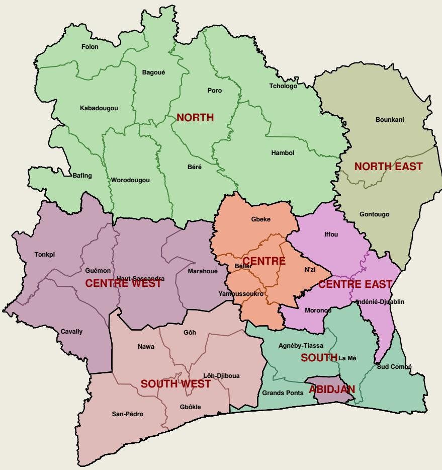

Source: ANStat.

The questionnaire was developed by the OECD Development Centre and validated and tailored to the national context through a consultative process led by a national Technical Advisory Group. Chaired by the UNESCO Chair on Water, Women and Decision-making Power in Côte d'Ivoire, the group brought together representatives from government institutions – including the Ministry of Women, Family and Children – alongside civil society organisations, religious and customary leaders, academic experts and development partners. Data analysis was conducted by the OECD in close collaboration with ANStat and the Technical Advisory Group, which contributed significantly to the contextualisation of findings and formulation of policy recommendations.

In this context, addressing restrictive masculinity norms constitutes a critical policy lever for reducing gender inequalities. However, designing effective and targeted policies and programmes requires a robust evidence base on how these norms shape behaviours and outcomes. In line with Côte d'Ivoire's national priorities and the African Union's Agenda on Positive Masculinity (African Union, 2021[5]), this chapter draws on new empirical evidence on masculinities in Côte d'Ivoire (Box 2.1). It analyses prevailing masculine norms and their implications through the lens of the OECD's Masculinities Index.

## Insights from the OECD's Masculinities Index for Côte d'Ivoire

The OECD's Masculinities Index offers unique insights into the state of masculine norms. Developed based on the OECD ten-norm framework on restrictive masculinities (OECD, 2021[6]), it has been calculated for the first time for Côte d'lvoire. The index is a useful tool to understand differences by socio-demographic characteristics such as regions, gender or age, and enables nuanced analysis across its different subcomponents, supporting comparisons across population groups (see Box 2.3 and Annex 2.A).

## Restrictive masculinities are widespread – but they are neither uniform nor fully uncontested

General support for gender norms that enshrine men's dominant position over women remains high in Côte d'Ivoire. In other words, restrictive masculinities are deeply entrenched, shaping expectations of men as providers and decision-makers at home, at work and in public spaces. This is reflected in an average score of 57 on the OECD's Masculinities Index, which ranges from 0 to 100, with higher scores indicating stronger endorsement of restrictive masculinities (see Box 2.3 for the methodology). At the same time, the index reveals that people's support for masculine norms varies across regions, social groups and domains (Figure 2.2 and Figure 2.4). This reflects that masculinities are not static but flexible, context-specific social constructs.

Figure 2.2. Restrictive masculinities are widespread in Côte d'Ivoire but vary across regions OECD Masculinities Index scores (0-100), 2026  
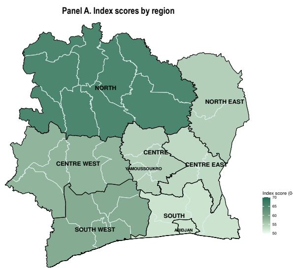

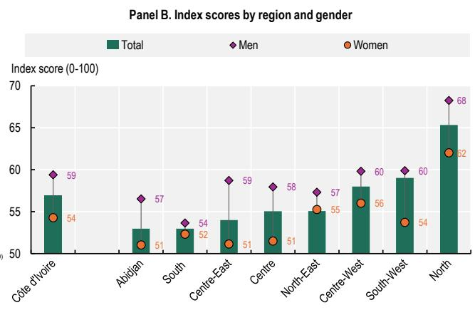  
Note: The OECD Masculinities Index scores range from 0 to 100, where higher scores indicate stronger support for restrictive norms of masculinity.  
Source: OECD (2026[7]), OECD Masculinities Database for Côte d'Ivoire, https://data-explorer.oecd.org/s/4sy.

The OECD's Masculinities Index highlights significant regional variation in adherence to restrictive masculine norms. While levels remain high overall, the lowest prevalence is observed in Abidjan and the surrounding Southern region of Côte d'Ivoire, whereas the highest levels are found in the North (Figure 2.2), in line with previous SIGI country studies on gender norms in Côte d'Ivoire (OCDE, 2022[8]). This clear North-South divide in norms partially reflects broader regional differences rooted in historical patterns of investment and unequal access to public services, exacerbated by political upheavals and geography (Box 2.2). Differences also emerge between rural and urban populations across all regions, with individuals in rural areas, on average, expressing slightly more restrictive views on masculinities (Annex Table 2.A.1). At the national level, this is reflected in Masculinities Index scores of 55 in urban areas and 59 in rural areas.

## Box 2.2. The North-South Divide

Regional disparities in Côte d'Ivoire between the largely rural North and the urbanised Southern regions are driven by a range of historical, political and socio-economic factors.

Under French colonial rule, public investment and infrastructure development were concentrated in the southern forest zone to support high-value export-oriented cocoa and coffee production. Northern savannah regions received comparatively limited investment in transport infrastructure, education, and health services. These patterns largely persisted after independence, as development strategies continued to prioritise agricultural industrialisation in the South, while labour migration from the North was encouraged by the government. As a result, a structural imbalance emerged between Abidjan and surrounding regions, which functioned as the country's economic hubs, and the North, which remained reliant on lower yielding crops and activities such as cotton, cashew, and livestock farming (UNRISD, 2010[9]).

Political dynamics further deepened this regional divide. In the 1990s, the ideology of Ivoirité promoted exclusionary definitions of citizenship that disproportionately affected northern, predominantly Muslim populations, thereby limiting political participation and contributing to rising grievances. These tensions culminated in the 2002 rebellion, which split the country between a rebel-held north and a government-controlled south and produced nearly a decade of intermittent civil war and de facto partition (Langer, 2006[10]). During this period, public investment and basic services were severely weakened in the North. Since the end of the conflict in 2011, successive governments have prioritised reducing regional disparities; however, the legacy of conflict, combined with emerging security risks due to the presence of armed groups in northern border areas, continues to deter investment and constrain inclusive territorial development (Bertelsmann Stiftung, 2024[11]).

The resulting disparities are reflected in socio-economic outcomes across territories. Poverty rates sharply differ between urban and rural areas (24% and 51% of residents, respectively, live below the poverty line). Overall, poverty is most prevalent in the northern and western regions, whereas Abidjan shows a significantly lower rate of around 10% (UNDP, 2025[12]). Education and human capital show a similar pattern: school enrolment, literacy, and completion rates are substantially higher in the southern regions. Meanwhile, the North has fewer public schools – a gap complemented through informal and/or religious schools. These institutions do not fully implement the national curriculum which can limit acquisition of relevant skills for future access to higher-paying employment (Sany, 2010[13]). Additionally, living conditions and economic growth are constrained by limited access to public services including transport, electricity, safe water, healthcare, and finance – despite important progress made (Bertelsmann Stiftung, 2024[11]).

Differences in index scores by gender are relatively small. Men consistently express higher levels of acceptance of restrictive norms than women, but such norms are upheld by both men and women, with

Masculinities Index scores of 59 and 54, respectively. $^{1}$ Interestingly, gender gaps appear to be widening among younger generations in Côte d'Ivoire (Figure 2.3). After men aged 65 and older, young men aged 15-24 express the highest levels of support for restrictive masculinities, while women in the same age group show the lowest levels of support. These diverging attitudes point to growing tensions among younger cohorts, with potential implications for social cohesion, family relations and well-being in the coming years. This is particularly the case for norms related to men's reproductive dominance, financial power and leadership in the workplace. Conversely, views among young men and women are more closely aligned on men's involvement in unpaid care and domestic work and on household decision-making than among older cohorts. $^{2}$

Young men's return to some restrictive masculine norms may reflect, in part, the limited attention paid to how changing gender relations affect boys and men. While sustained efforts by government, civil society and development partners to advance the rights and opportunities of girls and women remain essential, these efforts have not always been accompanied by equivalent approaches to help boys and men navigate evolving gender expectations. Ivorian experts note that young women's stronger academic performance, combined with a strained labour market, may contribute to young men turning to traditional masculine norms in search of identity, status and purpose. This resurgence of restrictive views among young men is not unique to Côte d'lvoire. Similar dynamics have emerged in several high-income countries, including France, Korea and the United Kingdom (King's Global Institute for Women's Leadership and Ipsos, 2024[14]; Lee, 2024[15]; HCE, 2025[16]). Promoting positive models of masculinity at the local and global level is therefore increasingly important to prevent further polarisation between young women and men, at a time when broad societal engagement is essential to advance gender equality goals.

Figure 2.3. Young men express higher support for restrictive masculinities than young women  
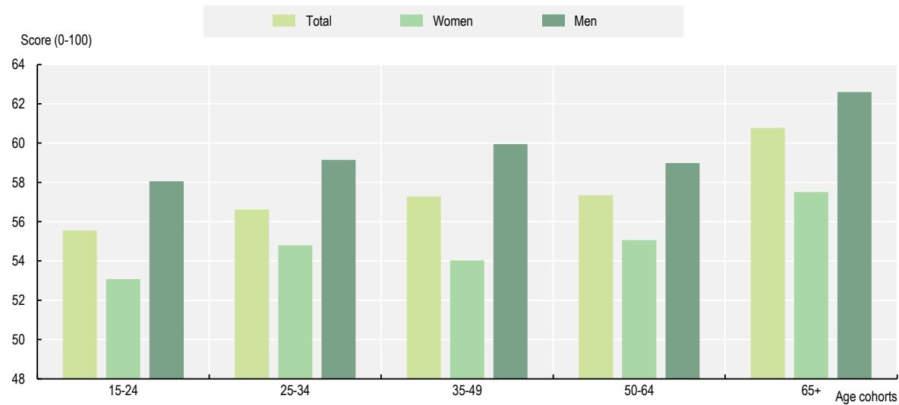  
Note: The OECD masculinities index scores range from 0 to 100, where higher scores indicate stronger support for restrictive norms of masculinity.  
Source: OECD (2026[7]), OECD Masculinities Database for Côte d'Ivoire, https://data-explorer.oecd.org/s/4sy.

## Box 2.3. Calculating the OECD's Masculinities Index

The OECD's Masculinities Index is a new measurement tool designed to assess the prevalence of restrictive masculine norms at the population level. The methodology builds around ten core masculine norms identified in the OECD's Man Enough? report (OECD, 2021[6]). While these norms are not an exhaustive representation of restrictive masculinity, they were selected because of their direct impact on women's rights and opportunities. Each norm is measured through two or more attitudinal statements, with respondents indicating their level of agreement on an ordinal scale (Table 2.1).

Table 2.1. Applying the OECD masculinity framework in Côte d'Ivoire

<table><tr><td>Norm</td><td>Survey item</td></tr><tr><td colspan="2">Public sphere</td></tr><tr><td rowspan="2">Be the breadwinner</td><td>When jobs are scarce, I think employers should give priority to hiring men.</td></tr><tr><td>I think the most important role of a man is to provide financially for his family.</td></tr><tr><td rowspan="2">Be financially dominant</td><td>I think it&#x27;s shameful for a man to earn less money than his wife.</td></tr><tr><td>For a similar job or activity, I think that a man should earn more than his female colleague.</td></tr><tr><td rowspan="2">Work in “manly” jobs</td><td>I think some jobs are made for men and others for women.</td></tr><tr><td>A man who works in “feminine jobs”, such as a nurse, nanny, or teacher, etc., would be judged.</td></tr><tr><td rowspan="2">Be the ideal worker</td><td>I think that a man should prioritise work over spending time with his family.</td></tr><tr><td>A man who takes paternity leave should take that leave to care for the newborn and meet the needs of his family.</td></tr><tr><td rowspan="3">Be a ‘manly’ leader</td><td>I think that men are better political leaders than women.</td></tr><tr><td>I think that men are better business leaders than women.</td></tr><tr><td>To be successful, a leader (man or woman) must be tough, aggressive and competitive and not show too much emotion.</td></tr><tr><td colspan="2">Private sphere</td></tr><tr><td rowspan="2">Not do unpaid care and domestic work</td><td>In your view, how often should a man contribute to the following tasks: Cooking for the family/Cleaning the house/Repairing the house/Doing the laundry/Collecting water and wood for the family&#x27;s needs/Providing for the children&#x27;s needs (feeding, bathing, medical care)/Supervising children&#x27;s homework/Spending time and playing with children and taking them to their activities/Caring for elderly and/or sick people in the household.</td></tr><tr><td>I think a man who stays at home to look after his children and do housework would be judged.</td></tr><tr><td rowspan="2">Have the final say in household decisions</td><td>I think it is up to the man to give his wife permission to do paid work outside the home, the family business or the family plot.</td></tr><tr><td>I think that a man should have the final word about important household decisions.</td></tr><tr><td rowspan="3">Control household assets</td><td>I think that a woman should have the same rights as a man to own property.</td></tr><tr><td>I think a daughter should have the same rights as a son to inherit assets.</td></tr><tr><td>I think the man alone should decide how to spend the household&#x27;s money.</td></tr><tr><td rowspan="2">Protect and exercise guardianship</td><td>I think a woman should obey or be submissive to her husband or partner.</td></tr><tr><td>I think it is normal for a man to use physical force or violence to assert his authority or resolve a conflict.</td></tr><tr><td rowspan="3">Dominate sexual and reproductive choices</td><td>In your opinion, in a couple, who should decide over contraceptive use, birth spacing and the number of desired children?</td></tr><tr><td>A woman can refuse to have sexual relations with her husband or partner.</td></tr><tr><td>Men should always be ready to engage in sexual relations.</td></tr></table>

Norms positioning men as breadwinners and household decision-makers are the most prevalent forms of restrictive masculinities in Côte d'Ivoire. For instance, 96% of the population agree that men's most important role is to meet the family's financial needs, and 84% believe that men should have the final say in important household decisions. Other norms – such as expectations that men should be “manly” leaders, work in ‘manly’ jobs and exercise authority over women rather than engage in care and domestic work – are also widely shared, albeit to a lesser extent. By contrast, norms that enshrine the importance of financial superiority either through higher pay or control of assets, receive relatively lower support, as it is the case for male domination over sexual and reproductive choices (see Annex 2.A for detailed results).

Figure 2.4. The provider and decision maker norms are central to restrictive masculinities OECD Masculinities Index (0-100) scores by gender and residence, disaggregated for all ten norms  
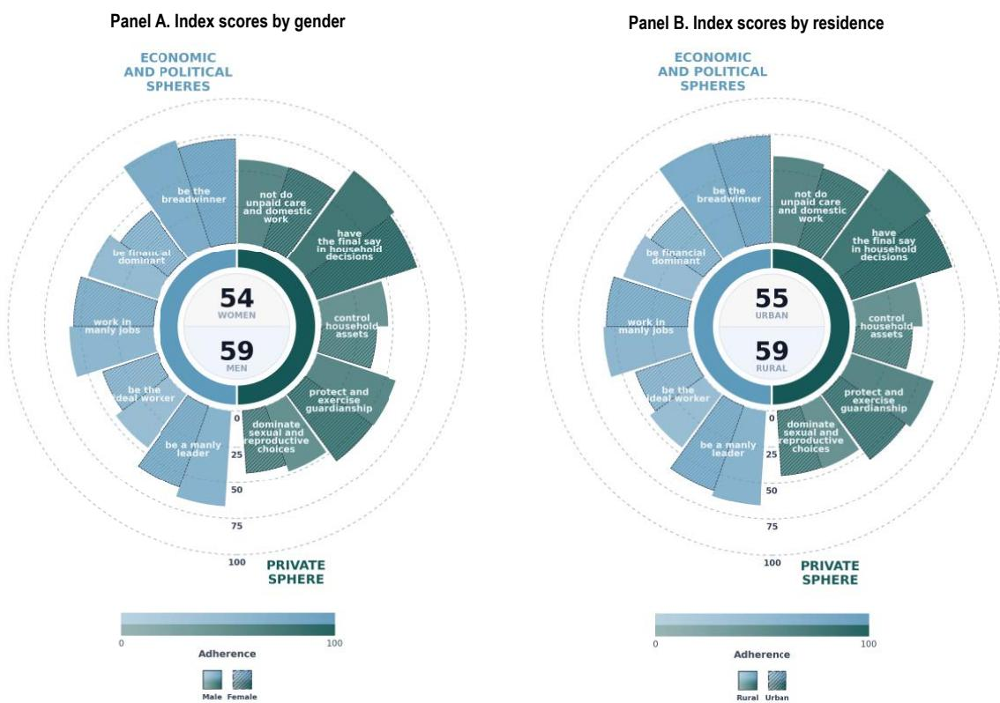  
Note: The scores for each norm range from 0 to 100, where higher a higher score indicates stronger support for the specific restrictive norm of masculinity.  
Source: OECD (2026[7]), OECD Masculinities Database for Côte d'Ivoire, https://data-explorer.oecd.org/s/4sy.

Small but consistent differences by residence and gender also emerge when examining each of the ten norms that compose the Masculinities Index separately. $^{3}$ Across both rural and urban areas, as well as between men and women, patterns are broadly similar: rural populations and men tend to express stronger support for each restrictive masculine than urban populations and women (Figure 2.4). The same patterns are thus observed at both the overall index level as well as its sub-components.

At the same time, variation across specific norms reveals important nuances. Agreement is uniformly high that men should be the breadwinner, regardless of residence. This norm becomes restrictive when breadwinning is treated as a primary marker of men's worth and authority, placing significant pressure on men to fulfil the role of main or sole provider while limiting women's ability to take on or share this responsibility equally with their partner. By contrast, the greatest variation – both geographically and by gender – concerns norms related to financial power, such as control over assets, income dominance, and household decision making. These differences suggest that men's ability to fulfil socially expected roles may be more closely tied to access to and control over assets in rural areas, where economic opportunities are more limited than in urban settings. Qualitative evidence tends to support this interpretation. In Côte d'lvoire, women's autonomy in agricultural activities is sometimes perceived by men as a threat to their authority and masculinity, exposing them to a potential loss of social status within the community (Yeo et al., 2024[17]). Overall, the data suggest that women are increasingly challenging norms that visibly constrain their ability to achieve financial parity with men such as the belief that men should control household assets or earn more than women in similar jobs (OECD, 2026[7]).

These patterns are also reflected at the sub-national level. Table 2.2 shows that norms associated with men's roles as breadwinners and household decision-makers consistently receive the highest levels of support across regions. However, important regional differences persist. A clear trend emerges: support for restrictive masculinities is strongest in the North across most norms. Two exceptions stand out – norms related to men being “manly” leaders and having the final say in household decisions receive their highest support in the South-West, followed closely by the North.

Overall, disaggregated results by residence, gender and region confirm that men's roles as providers and decision-makers remain widely accepted, while other dimensions of restrictive masculinities – though less strongly endorsed – continue to shape gender relations and constrain women's autonomy.

Table 2.2. The breadwinner norm is the strongest norm across most regions  
OECD Masculinities Index scores (0-100) for each norm by region

<table><tr><td>Norm</td><td>Abidjan</td><td>Centre</td><td>Centre-East</td><td>Centre-West</td><td>North</td><td>North-East</td><td>South</td><td>South-West</td></tr><tr><td>Breadwinner</td><td>71</td><td>75</td><td>71</td><td>77</td><td>81</td><td>73</td><td>72</td><td>78</td></tr><tr><td>Financial dominance</td><td>42</td><td>51</td><td>37</td><td>50</td><td>60</td><td>49</td><td>43</td><td>44</td></tr><tr><td>Manly jobs</td><td>54</td><td>54</td><td>49</td><td>62</td><td>65</td><td>48</td><td>46</td><td>61</td></tr><tr><td>Ideal worker</td><td>38</td><td>43</td><td>34</td><td>51</td><td>54</td><td>39</td><td>44</td><td>40</td></tr><tr><td>Manly leader</td><td>61</td><td>55</td><td>65</td><td>65</td><td>69</td><td>66</td><td>61</td><td>72</td></tr><tr><td>Not do UCDW</td><td>56</td><td>59</td><td>63</td><td>56</td><td>69</td><td>51</td><td>53</td><td>63</td></tr><tr><td>Final say</td><td>69</td><td>70</td><td>79</td><td>76</td><td>81</td><td>70</td><td>74</td><td>83</td></tr><tr><td>Asset control</td><td>38</td><td>37</td><td>39</td><td>44</td><td>52</td><td>48</td><td>34</td><td>48</td></tr><tr><td>Guardianship</td><td>57</td><td>56</td><td>60</td><td>55</td><td>64</td><td>61</td><td>60</td><td>59</td></tr><tr><td>Reproductive dominance</td><td>44</td><td>50</td><td>43</td><td>43</td><td>58</td><td>45</td><td>43</td><td>44</td></tr></table>

Note: The scores for each norm range from 0 to 100, where higher a higher score indicates stronger support for the specific restrictive norm of masculinity. Cells highlighted in orange indicate the strongest masculinity norm per each region, and cells highlighted in green indicate the weakest masculinity norm per each region. Numbers in bold indicate the overall highest score obtained per norm.
Source: (OECD, 2026[7]), OECD Masculinities Database for Côte d'Ivoire, https://data-explorer.oecd.org/s/4sy.

## Support for restrictive masculinities follows educational inequalities and longstanding value systems

This section examines how individual characteristics – such as education, age, religion, ethnicity or economic situation – help explain differences in adherence to restrictive masculinities across gender, regions and places of residence. Drawing on econometric analysis that goes beyond descriptive patterns, it identifies the factors most strongly associated with more egalitarian attitudes, and therefore potential levers for promoting less restrictive forms of masculinity. $^{4}$

Across all results, education clearly stands out as the most consistent and influential factor associated with rejecting restrictive masculinities and supporting more positive alternatives. Whether considering the overall Masculinities Index or specific norms, higher levels of education are linked to markedly lower support for restrictive views. This relationship is gradual and robust: even primary compared to no formal education is associated with less restrictive attitudes, while secondary and higher education correspond to substantially larger shifts across key domains, including breadwinner expectations, control over resources, leadership roles and reproductive decision-making (Figure 2.5).

Figure 2.5. Higher educational attainment is associated with lower adherence to restrictive masculinities  
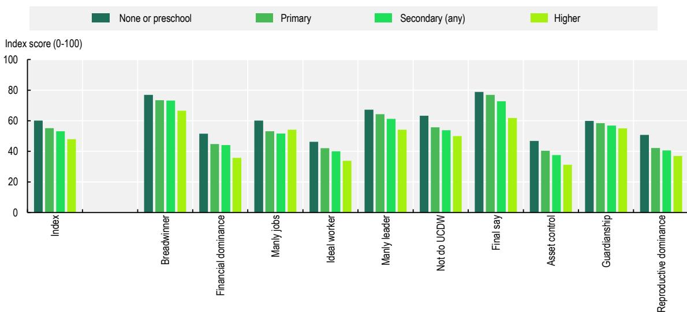  
Note: The scores for each norm range from 0 to 100, where higher a higher score indicates stronger support for the specific restrictive norm of masculinity.  
Source: OECD (2026[7]), OECD Masculinities Database for Côte d'Ivoire, https://data-explorer.oecd.org/s/4sy.

These patterns hold at both national and sub-national levels, although the strength of the effect varies by region. In Abidjan and in the Centre, Centre-West and South-West, the association between education and less restrictive views is particularly strong. By contrast, this effect is weaker in the North and North-East. This regional variation suggests that, while education remains the most reliable pathway for promoting positive masculinities, its normative influence is shaped by local socio-economic and cultural contexts. Further research should also incorporate informal and religious education systems in order to comprehensively assess if different educational institutions shape people's adherence to restrictive masculinities in distinct ways.

By contrast, other factors show weaker, inconsistent or context-specific relationships with masculinity norms, underlining how deeply entrenched these norms are across Ivorian society. Younger men, for example, appear more supportive of restrictive masculinities in descriptive comparisons (see Figure 2.3), but age effects are inconsistent and largely disappear once education, ethnicity, region and other factors are taken into account. $^{5}$ Similarly, apparent differences by religion should be interpreted with caution. While Christian respondents tend, on average, to express lower support for restrictive norms than Muslim respondents, $^{6}$ religious affiliation follows a clear North-South divide that reflects wider regional disparities (Box 2.2). Support for restrictive masculinities also varies by ethnic group, though results should again be interpreted cautiously due to possible overlap with other factors. For example, the Mandé du Nord – largely represented in the North of Côte d'Ivoire – show significantly higher support for restrictive norms compared to the Akan which show the lowest support. $^{7}$ Economic factors – including income, employment status and sector – also show no systematic association with restrictive views, with effects varying or even reversing across regions.

Taken together, these findings reinforce a central message: restrictive masculinities are widespread and deeply rooted across society, but education stands out as the most promising lever for fostering more positive masculinities and more egalitarian norms.

## A “silent gap” between personal beliefs and social expectations creates space for change

Personal beliefs alone do not determine social norms. What also matters are people's expectations about what others believe and how they behave. Social norms therefore define what is considered appropriate or acceptable behaviour in a given context and are upheld through informal enforcement mechanisms such as approval, stigma, ridicule, or social exclusion (Bicchieri, 2016[18]; Zhang et al., 2023[19]; Young, 2015[20]). Importantly, people's personal beliefs can differ from what individuals think others believe. Identifying these misperceptions can open opportunities for change (Bursztyn, 2023[21]). For example, a man may support equal caregiving in principle but avoid participating in childcare because he assumes his peers disapprove. However, if he were aware that others also support more equal caregiving, he might change his behaviour. When individuals act on overly conservative assumptions about social expectations, despite holding more progressive personal beliefs, this is known as pluralistic ignorance. Such misperceptions can create a "conformity trap" where change for the better does not happen, a phenomenon that has been increasingly studied and documented in the literature (Bussolo et al., 2023[22]; Matavelli et al., 2025[23]; Smerdon, Offerman and Gneezy, 2020[24]).

Data from Côte d'Ivoire reveal widespread misperceptions about masculinities. Most strikingly, people systematically overestimate both men's support for and women's opposition to restrictive masculinities, regardless of their own gender (Figure 2.6). In other words, while women and men hold different personal views on some issues, their expectations about other people's beliefs are largely similar, reflecting shared social norms. For instance, on average, 76% of the population (81% of men and 71% of women) agree that men make better political leaders. However, on average, they expect 62% of women compared to 83% of men in their area to share this view. $^{8}$

Figure 2.6. People overestimate men's and underestimate women's support for restrictive masculinities  
Personal beliefs about masculine norms and expectations about other women's and men's support for such norms in Côte d'Ivoire  
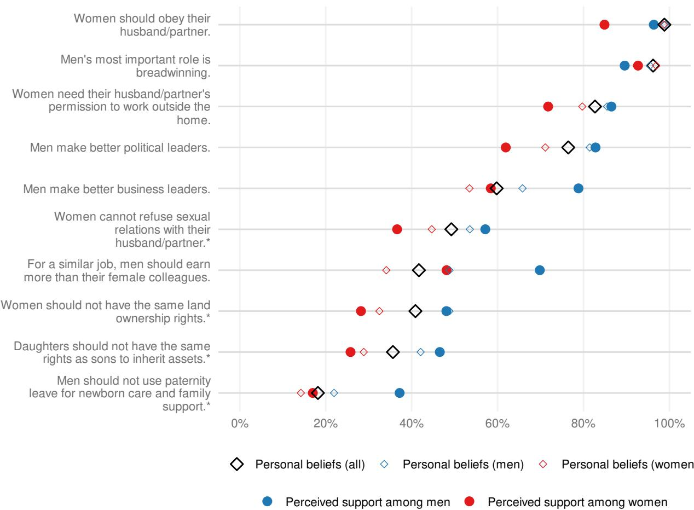

Note: Data presented in this figure was collected through a sequence of three questions which (1) ask the respondent whether they agree or not with the specific statement; (2) ask the respondent to estimate how many out of 10 men in their area would agree with the statement; (3) ask the respondent to estimate how many out of 10 women in their area would agree with the statement. The population-weighted responses for type (1) questions are labelled as “Personal beliefs (all/women/men)” and the responses to type (2) and (3) are labelled as “Perceived support among men” or “Perceived support among women”, referring to respondents’ estimated shares of women and men who would support the different statements. For instance, on average 98% of the population agrees that women should obey their husband/partner and the population expects 85% of women and 96% of men to agree with this. The applied methodology follows (Bursztyn, 2023[21]) approach.

Statements marked with an asterisk were initially asked in the opposite way – e.g. instead of “I think women cannot refuse sexual relations with their husband” the question was asked as “I think women can refuse sexual relations with their husband”. To present all data in a harmonised way, the mean values for the social expectations on men and women for these statements were reversed.
Source: OECD (2026[7]), OECD Masculinities Database for Côte d'Ivoire, https://data-explorer.oecd.org/s/4sy.

Identifying and addressing gaps between personal beliefs and perceived support for restrictive masculinities offers promising entry points for normative change. This is particularly the case when people significantly overestimate men's support for restrictive masculine norms. For instance, fewer than $20\%$ of the population disagree with fathers taking parental leave, yet respondents expect almost $40\%$ of men to hold this view. Similarly, opposition to equal pay is widely overestimated, particularly among men. While about $40\%$ of the population believe that men should earn more than women for the same or similar work, respondents estimate that $48\%$ of women and $70\%$ of men hold this view.

Targeted communication on actual levels of support for more equitable masculine norms can help pave the way for policy and legal reform and implementation. For example, equal pay is already mandated by the law, and fathers are entitled to three days of paternity leave (OECD, 2023[25]). Public awareness campaigns highlighting broad support for equal pay could encourage men to express support more openly, empower women to challenge discriminatory outcomes – including persistent gender pay gaps, which stood at $27\%$ in 2022 – and reduce the tendency of employers to justify unequal pay as socially accepted (ILO, n.d.[26]). Similarly, policymakers could consider expanding the duration of paternity leave given the population's broad acceptance of fathers' involvement in childcare. By encouraging and normalising men's participation in caregiving, such measures could contribute to a more equitable distribution of responsibilities within households and, ultimately, support more equal opportunities for women and men in the labour market.

Conversely, resistance to change may be higher when personal beliefs and social expectations are more closely aligned. This is notably the case for norms that already enjoy broad societal support, such as the belief that men's most important role is to provide financially for their families, or that women should be submissive and seek their husband's permission to engage in paid work. In these cases, actual support even exceeds perceived social expectations among both women and men, pointing to deeply entrenched and widely shared beliefs that are likely to be resistant to immediate change. Policies or programmes aiming to transform such norms should therefore adopt longer-term, gradual and context-specific approaches.

Taken together, these findings suggest that efforts to promote more positive masculinities may be most effective when they target norms characterised by large misperceptions and existing support for change, while also addressing more deeply rooted beliefs through education and awareness raising.

## Restrictive masculinities harm men as well as women – making transformation urgent

Restrictive masculine norms can negatively affect men's health and well-being, harming both those who conform to these norms and those who do not (OECD, 2021[6]; Kato-Wallace et al., 2016[27]; Connell, 1995[28]). A well-established body of evidence shows that behaviours linked to restrictive masculinities – such as avoidance of help-seeking, dismissal of healthcare needs and sick leave, or engagement in risky behaviours – are associated with poorer physical and mental health outcomes (Wong et al., 2017[29]; Ragonese, Shand and Barker, 2019[30]). Experts consulted for this study confirm similar dynamics in Côte d'Ivoire, describing a vicious circle in which the masculine norms men aspire to fulfil can also harm them. These patterns often emerge early in life, as boys seek ways to prove their masculinity and when stigma and shame contribute to boys' disengagement from healthcare services (Verma and Khurana, 2023[31]). The resulting outcomes include higher rates of substance use, unsafe sex, occupational risk-taking, depression, and suicidal ideation, with emotional distress frequently expressed through risk-taking rather than care-seeking (Courtenay, 2000[32]).

Outcomes in Côte d'Ivoire are consistent with these gendered health patterns, even though direct links to masculinity norms cannot be fully established with available data. Men's life expectancy is lower than women's (60 compared to 64 years), and suicide rates are 4.6 times higher among men. Other health indicators show a mixed picture: tobacco use is higher among men, while obesity and HIV/AIDS are greater concerns for women. Data on mental health remain limited, though feelings of loneliness are widespread among both women and men (Table 2.3). Taken together, these indicators reflect health challenges commonly associated in the literature with restrictive masculinities.

Table 2.3. Health outcomes differ by gender in Côte d'Ivoire

<table><tr><td>Selected health indicators</td><td>Men</td><td>Women</td><td>Year</td></tr><tr><td>Life expectancy at birth (years)</td><td>60</td><td>64</td><td>2024</td></tr><tr><td>Suicide mortality rate per 100 000 population (%) (Number of suicide deaths in a year, divided by the population and multiplied by 100 000)</td><td>12.0</td><td>2.6</td><td>2021</td></tr><tr><td>Age-standardised prevalence of tobacco smoking among people aged 15 years and older (%) (SDG 3.a.1)</td><td>15.3</td><td>0.7</td><td>2025</td></tr><tr><td>Age-standardised prevalence of obesity among people aged 18 years and above (%)</td><td>7.7</td><td>15.7</td><td>2022</td></tr><tr><td>Share of women/men aged 15 years and older among the population living with HIV (%)</td><td>32.0</td><td>68.0</td><td>2024</td></tr><tr><td>General feeling of loneliness among people aged 15 years and above (%)</td><td>56.4</td><td>55.4</td><td>2025</td></tr></table>

Note: Data based on the most recent year available. HIV stands for human immunodeficiency virus.  
Source: (WHO, n.d.[33]; UNAIDS, 2024[34]; World Bank Group, n.d.[35]; Gallup, 2025[36]).

Restrictive masculinity norms can generate significant psychological pressure, particularly when men feel unable to meet entrenched expectations such as providing financially for their families. Research shows that perceived threats to masculinity can increase stress and anxiety and prompt compensatory behaviours, including risk-taking and violence (Vandello and Bosson, 2013[37]). Broader socio-economic circumstances, such as the decline of traditionally male-dominated industries or high unemployment rates can intensify these pressures (Matavelli et al., 2025[23]; Kimmel, 2012[38]). In such situations, some men may seek to reassert their status through exaggerated masculine behaviours, often at the expense of women's rights and safety.

Evidence from Côte d'Ivoire aligns with these findings and highlights the central role of the breadwinner norm in shaping men's well-being. More than 90% of men report that they would feel stressed or anxious if they were unable to provide financially for their families. This “provider anxiety” is especially pronounced among men who more strongly endorse restrictive masculinities, particularly norms linking manhood to financial provision and “manly” work. $^{9\ 10}$ It can also affect life choices and behaviours, including by delaying marriage among economically precarious young men, fuelling chronic anxiety and contributing to compensatory behaviours such as risk-taking, substance use or violence. At the same time, the near-universal nature of this anxiety suggests that pressure to fulfil the breadwinner role is widely shared across socio-economic groups, rather than confined to specific circumstances. Importantly, these norms are also associated with harmful gender outcomes: men who more strongly adhere to restrictive masculine ideals and feel pressure to conform to them are more likely to perpetrate violence against women than those with more egalitarian beliefs (see Chapter 5).

Sexuality represents another domain where restrictive masculinities strongly shape men's experiences and well-being. In Côte d'lvoire, as in many contexts, sexual activity and performance are central to socially sanctioned notions of masculinity (Greene et al., 2019[39]). Two thirds of Ivorian men agree that men should always be ready to have sexual relations, and more than $80\%$ consider male sexual underperformance embarrassing or shameful (OECD, 2026[7]). Analysis reveals that adherence to restrictive masculinity, and notably norms that enshrine men's sexual dominance and decision-making power show the strongest association with perceived shame related to sexual performance – largely irrespective of age, education, marital status, income, or place of residence.[11] Together, these findings highlight that different norms influence men and women through distinct channels, and not all norms are equally relevant for specific health and well-being outcomes.

Figure 2.7. Strong expectations about gender roles limit women's and men's opportunities  
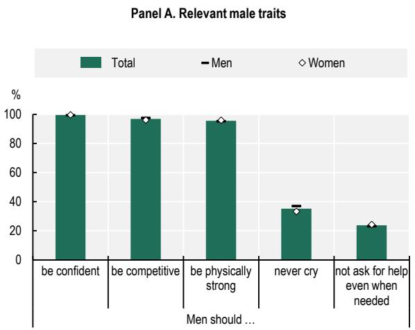

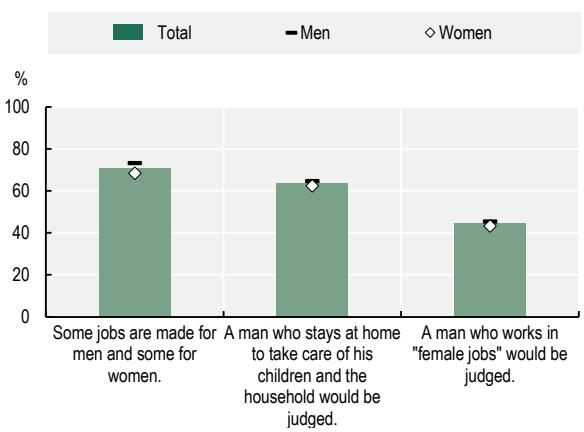  
Source: OECD (2026[7]), OECD Masculinities Database for Côte d'Ivoire, https://data-explorer.oecd.org/s/4sy.

Finally, strong pressure to conform to narrow masculine ideals can also limit men's life choices, including their engagement in caregiving and career paths. Across countries, men's uptake of parental leave, for example, remains low due to a combination of traditional norms, stigma, financial constraints and policy design, causing many to miss opportunities for caregiving that benefit both fathers and children (OECD, 2025[40]; Parental leave corporate taskforce, 2022[41]; Rudman and Mescher, 2013[42]). In Côte d'Ivoire, access to paid paternity leave is further compounded by high informality rates (Chapter 4). Evidence from Nigeria, Senegal and South Africa shows that while some men engage in childcare out of conviction, others conceal their involvement due to peer pressure (Omobowale, Adebayo and Iyanda, 2023[43]; Morrell and Jewkes, 2011[44]; OECD, 2026[45]). Similar dynamics shape employment choices. Fear of stigma discourages men from entering occupations perceived as insufficiently masculine. In Côte d'Ivoire, such beliefs are widespread and shared by both women and men, with over $40\%$ agreeing that men working in traditionally female-dominated occupations would be negatively judged (Figure 2.7 and see Chapter 4).

## Conclusion and policy recommendations

Restrictive masculinities remain deeply embedded in Côte d'Ivoire, shaping expectations of men as providers and decision-makers across all spheres of life. While these norms are widely shared by both men and women, they are neither uniform nor static. Important variations across regions, social groups and domains – and growing divergence among younger generations – highlight that masculinities are socially constructed and can evolve over time.

The findings also point to critical levers for change. Education emerges as the most consistent factor associated with more egalitarian attitudes, although its impact varies across contexts and is mediated by broader socio-economic and cultural conditions. At the same time, widespread misperceptions about others' beliefs sustain restrictive norms: individuals tend to overestimate support for unequal gender roles, particularly among men. This identified gap offers a powerful and underutilised entry point for accelerating norm change, especially in areas where more egalitarian attitudes already exist.

Not all norms are equally amenable to change. While some – such as attitudes towards caregiving or equal pay – show signs of transformation and provide opportunities for intervention, others, particularly the breadwinner norm, remain deeply entrenched and may require longer-term strategies. Addressing restrictive masculinities therefore requires a differentiated approach that combines short-term behavioural interventions, legal and policy reforms with sustained efforts to shift underlying value systems.

Importantly, restrictive masculinities do not only constrain women's rights and opportunities; they also impose significant costs on men, including psychological pressure, reduced well-being and limited life choices. In some cases, these pressures are associated with harmful coping strategies, including violence. Promoting more positive masculinities is therefore not only a matter of gender equality, but also of broader social and economic well-being.

While this chapter offers unique evidence from the first national representative study on masculine norms in Côte d'Ivoire, it is important to recognise some limitations. The analysis relies in part on self-reported data on social norms, which may be influenced by social desirability bias and cultural differences in how attitudes and behaviours are perceived and reported. In addition, the study does not aim to capture the full spectrum of masculinities or masculine norms but rather focuses on the ten norms identified as those having the most adverse impacts on women's rights and gender equality. Future research could explore more profoundly how these norms affect men themselves across different dimensions of well-being and life outcomes. In addition, qualitative research could provide deeper insights into the complex interplay between cultural, religious, ethnic and structural factors that shape adherence to social norms and gender expectations.

## Moving forward: Policy priorities

The analysis together with concrete recommendations made by Ivorian stakeholders representing the government, academia, civil society, customary and religious leaders, identifies the importance of promoting positive masculinities – as defined and encouraged by the African Union – as a key pillar to enhance gender equality, public health, social cohesion and prevent gender-based violence (also see Chapters 4 and 5).

"Positive Masculinity" means a societal approach that develops transformed mindsets, behaviors, and attitudes among men and boys, to respect, promote, and protect the rights and empowerment of women and girls, including equality, non-discrimination, non-violence, conflict resolution, and healthy relationships with women and girls (African Union, 2025[46]).

The following actions should be prioritised, acknowledging that women and men across all socio-economic groups can be gatekeepers, allies and agents of change.

\- Develop a national strategy and programme on positive masculinity. Develop a National Strategy for the Promotion of Positive Masculinity (2026–30), aligned with the National Policy for Equity, Equality and Gender (2024–30), and establish a dedicated national programme to support implementation. The strategy should engage men and boys as partners for gender equality, while addressing the pressures that restrictive masculinities place on them, including around provision, authority and social status. Ensure a multi-stakeholder approach through institutionalised dialogue with traditional and religious leaders, while engaging the private sector to integrate positive masculinity objectives into corporate social responsibility initiatives. Family-centred programmes, including initiatives inspired by the “École des Maris” model (see Chapters 1 and 3), can help promote caregiving, responsible fatherhood and equitable gender relations within households.

\- Address misperceptions and accelerate norm change through targeted communication and policy action. Implement evidence-based communication campaigns and norm-change interventions that target particularly young men, fathers and community influencers at both local and national levels. These efforts should be complemented by policy and legal reforms, as well as stronger enforcement of existing legislation, particularly in areas where public support for positive masculinity may be greater than commonly assumed, such as men's involvement in caregiving and equal pay for equal work.

\- Expand access to inclusive and gender-transformative education across all learning environments: Integrate positive masculinity, gender equality and non-violent relationship skills into formal, non-formal and religious education curricula. Strengthen collaboration with education authorities and higher education institutions to ensure that curricula, teacher training and community-based learning programmes promote equitable gender norms from an early age.

\- Reduce regional and socio-economic inequalities that reinforce restrictive masculine norms. Prioritise investments and targeted interventions in regions and communities where restrictive gender norms remain particularly prevalent. Efforts to expand educational opportunities, economic inclusion and access to public services can help address structural inequalities that contribute to the persistence of harmful norms and unequal gender relations.

\- Mobilise indigenous knowledge and community institutions to promote positive masculinity. Build on Côte d'Ivoire's rich cultural traditions and community-based mechanisms to promote positive masculine identities. Initiation rites, councils of elders, oral traditions, mentoring relationships between generations and respected community figures can serve as powerful vehicles for transmitting values such as responsibility, self-discipline, respect and non-violence.

\- Strengthen evidence, monitoring and learning on positive masculinity. Invest in regular data collection, monitoring and evaluation to track changes in masculine norms and assess the effectiveness of interventions. Strengthen knowledge sharing across sectors and countries to support evidence-based policymaking and the scaling of successful approaches.

# Annex 2.A. OECD Masculinities Index results for Côte d'Ivoire

The primary data of the OECD study on masculinities in Côte d'Ivoire, conducted in close partnership with the national statistical office and the Ivorian government in 2025, have been treated in order to create an index capturing the overall support for restrictive masculinities in the country. The index score ranges from 0 to 100, where 0 indicates the absence of support or restrictive masculinities and 100 the full support. The index builds on ten norms of restrictive norms, in accordance with the OECD's masculinity framework (OECD, 2021[6]). As for the overall index, a score per norm has been calculated based on the averaged and normalised survey responses for the respective questions used to assess each norm. The scores per norm and overall index score for Côte d'Ivoire are presented in Annex Table 2.A.1. More details on the methodology can be assessed in Annex 2.B.

## Annex Table 2.A.1. OECD Masculinities Index scores for Côte d'Ivoire

Index scores at the national level, by residence (urban/rural), zone and gender

<table><tr><td rowspan="3" colspan="2"></td><td colspan="10">Index scores for individual norms</td></tr><tr><td colspan="5">Public sphere</td><td colspan="5">Private sphere</td></tr><tr><td>Breadwinner</td><td>Financial dominance</td><td>Manly jobs</td><td>Ideal worker</td><td>Manly leader</td><td>Not do UCDW</td><td>Final say</td><td>Asset control</td><td>Guardianship</td><td>Reproductive dominance</td></tr><tr><td>Côte d&#x27;lvoire</td><td>56.89</td><td>75.19</td><td>47.30</td><td>57.03</td><td>43.68</td><td>64.45</td><td>58.91</td><td>75.45</td><td>42.60</td><td>58.31</td><td>46.03</td></tr><tr><td>Men</td><td>59.38</td><td>78.06</td><td>51.60</td><td>58.25</td><td>46.93</td><td>67.93</td><td>58.90</td><td>77.65</td><td>46.91</td><td>58.99</td><td>48.61</td></tr><tr><td>Women</td><td>54.28</td><td>72.17</td><td>42.78</td><td>55.75</td><td>40.25</td><td>60.79</td><td>58.91</td><td>73.13</td><td>38.06</td><td>57.60</td><td>43.31</td></tr><tr><td>Urban</td><td>55.30</td><td>74.60</td><td>45.22</td><td>56.21</td><td>41.67</td><td>62.78</td><td>57.62</td><td>73.14</td><td>39.62</td><td>56.79</td><td>45.36</td></tr><tr><td>Rural</td><td>59.13</td><td>76.02</td><td>50.23</td><td>58.18</td><td>46.50</td><td>66.80</td><td>60.72</td><td>78.69</td><td>46.77</td><td>60.45</td><td>46.97</td></tr><tr><td>Abidjan</td><td>52.96</td><td>71.34</td><td>41.86</td><td>54.29</td><td>37.80</td><td>60.57</td><td>55.69</td><td>69.45</td><td>38.27</td><td>56.75</td><td>43.59</td></tr><tr><td>Centre</td><td>55.05</td><td>75.16</td><td>50.85</td><td>54.14</td><td>42.86</td><td>55.41</td><td>59.23</td><td>70.27</td><td>36.61</td><td>56.26</td><td>49.68</td></tr><tr><td>Centre-East</td><td>54.00</td><td>70.96</td><td>37.49</td><td>49.14</td><td>34.05</td><td>64.84</td><td>62.82</td><td>79.16</td><td>38.74</td><td>59.84</td><td>42.93</td></tr><tr><td>Centre-West</td><td>57.99</td><td>77.03</td><td>50.34</td><td>62.20</td><td>50.84</td><td>65.36</td><td>55.70</td><td>76.38</td><td>43.99</td><td>54.74</td><td>43.34</td></tr><tr><td>North</td><td>65.32</td><td>80.95</td><td>59.76</td><td>65.29</td><td>54.18</td><td>69.31</td><td>69.36</td><td>80.60</td><td>51.58</td><td>64.14</td><td>57.98</td></tr><tr><td>North-East</td><td>55.07</td><td>73.26</td><td>49.15</td><td>48.45</td><td>39.04</td><td>65.51</td><td>50.50</td><td>70.32</td><td>47.98</td><td>61.32</td><td>45.20</td></tr><tr><td>South</td><td>52.97</td><td>72.23</td><td>43.13</td><td>45.94</td><td>43.58</td><td>60.83</td><td>53.05</td><td>74.45</td><td>34.22</td><td>59.53</td><td>42.76</td></tr><tr><td>South-West</td><td>59.01</td><td>77.59</td><td>44.34</td><td>61.14</td><td>39.71</td><td>71.72</td><td>62.84</td><td>82.59</td><td>47.83</td><td>58.72</td><td>43.59</td></tr></table>

Source: (OECD, 2026[7]), OECD Masculinities Database for Côte d'Ivoire, https://data-explorer.oecd.org/s/4sy.

# Annex 2.B. Methodology for the construction of the OECD Masculinities Index

This annex provides additional details on the construction and validation of the OECD Masculinities Index presented in Chapter 2. While Box 2.1 describes the conceptual framework and survey module used to measure masculine norms, this annex explains the methodological steps used to build the norm indicators and the composite index.

## Survey module and normative framework

The OECD Masculinities Index builds on the conceptual framework introduced in Man Enough? Measuring Masculine Norms to Promote Women's Empowerment (OECD, 2021[6]). The framework identifies ten core masculine norms that shape expectations about men's roles in both the public and private spheres. These norms relate to economic provision, authority within households, leadership roles, control over assets, engagement in unpaid care work, and sexual and reproductive decision-making.

Each norm is measured through two or more survey questions capturing individuals' attitudes towards gender roles and expectations about men's behaviour. Respondents indicate their level of agreement with each statement using ordinal Likert-type scales. The survey module was implemented as part of nationally representative household surveys conducted in Côte d'Ivoire in 2025–2026.

## Coding and normalisation of survey responses

Survey responses were first recoded to ensure that higher values consistently reflect stronger support for restrictive masculinity norms. For example, statements expressing gender-equitable views were reverse-coded so that agreement corresponds to lower endorsement of restrictive norms.

To ensure comparability across questions with different response scales, item responses were normalised to a common scale ranging from 0 to 1 using a min-max transformation:

$$
\text { Normalised   score } = \frac {\text { Response   Value } - \text { Minimum   Value }}{\text { Maximum   Value } - \text { Minimum   Value }}
$$

Under this transformation,

• 0 represents gender-equitable attitudes, and

• 1 represents the strongest endorsement of restrictive norms.

Binary variables used in some norms (e.g. attitudes towards unpaid care work or reproductive decision-making) were already coded on a 0-1 scale and therefore did not require further normalisation.

## Construction of norm-specific indicators

For each of the ten masculine norms, a norm-specific indicator was calculated as the simple average of the normalised item responses belonging to that norm:

$$
\text { Norm   Indicator } _ {j} = \frac {1}{n _ {j}} \sum_ {i = 1} ^ {n _ {j}} \text { Score } _ {i, j}
$$

Where:

\- $Score_{i,j}$ is the normalised response to item $i$ iii for norm $j$ , and

\- $n_{j}$ is the number of items used to measure that norm.

Each norm indicator therefore ranges from 0 (gender-equitable norms) to 1 (strongly restrictive norms). For communication purposes, the index is rescaled to a 0–100 range.

The decision to use a simple average reflects both conceptual and statistical considerations. Conceptually, each item captures a distinct but related dimension of the same normative domain. Empirically, exploratory factor analysis confirmed that items within most norms load on a single underlying dimension, supporting their aggregation into a composite indicator.

## Construction of the composite masculinities index

The OECD Masculinities Index is calculated as the unweighted average of the ten norm-specific indicators:

$$
\text { Masculinities   Index } = \frac {1}{1 0} \sum_ {j = 1} ^ {1 0} \text { Norm   Indicator } _ {j}
$$

The resulting score ranges from 0 to 1, where higher values indicate stronger endorsement of restrictive masculinity norms across multiple domains of social life.

For communication purposes, the index is rescaled to a 0–100 range, where:

\- 0 represents the absence of support for restrictive norms, and

• 100 represents the strongest support for restrictive masculinities.

## Statistical validation

Several diagnostic tests were conducted to assess the robustness of the index construction.

## Descriptive analysis

The distribution of each survey item was examined using frequency tables, histograms, and summary statistics. As expected for attitudinal data, most variables show non-normal distributions and some degree of skewness. However, none exhibited extreme floor or ceiling effects that would justify removing them from the index.

## Internal consistency

Cronbach's alpha coefficients were calculated for each norm to assess internal consistency between items. While several norms show moderate reliability, lower alpha values were expected given the small number of items per norm and the fact that items capture related but distinct aspects of masculinity norms.

## Dimensionality analysis

Principal Component Analysis (PCA) was used to examine whether items within each norm and across norms load onto a common latent dimension. For most norms, the first principal component explains more than 50% of the variance, indicating a coherent underlying construct.

At the composite level, PCA results confirm the presence of a dominant common factor across the ten norms. The first component explains approximately one-third of the total variance, which is considered acceptable in social norms research where multiple dimensions contribute to the overall construct. These findings support the aggregation of the ten norms into a single composite index.

## Sensitivity checks

Alternative aggregation approaches were explored during the validation process, including weighted aggregation using factor loadings and alternative normalisation methods. Results were broadly consistent across specifications, supporting the use of the simple average approach due to its transparency and interpretability.

## Population estimates

Population-level estimates were calculated using survey sampling weights to account for the survey design and ensure representativeness. Weighted means of the norm indicators and the composite index were computed for the national population and disaggregated by gender, place of residence, and region.

Statistical tests based on survey-weighted regression models were used to assess differences in index scores across groups.

## References

African Union (2025), African Union Convention on Ending Violence Against Women and Girls, https://au.int/sites/default/files/newsevents/workingdocuments/44174-wd-EN\_AU\_Convention\_onEnding\_Violence\_Against\_Women\_and\_Girls\_CEVAWG\_27.05.2025.pdf.

African Union (2021), Kinshasa Declaration and Call to Action on Positive Masculinity to End Violence Against Women and Girls in Africa, https://au.int/sites/default/files/pressreleases/41226-pr-Declaration\_Mens\_Conference\_English.pdf. [5]

Bertelsmann Stiftung (2024), BTI 2024 Country Report -- Côte d'Ivoire. [11]

Bicchieri, C. (2016), “Norms in the Wild: How to Diagnose, Measure, and Change Social Norms”, [18] Oxford University Press.

Bursztyn, L. (2023), “How are gender norms perceived?”, National Bureau of Economic Research, Vol. No. w31049, [21] https://www.nber.org/system/files/working\_papers/w31049/w31049.pdf.

Bussolo, M. et al. (2023), “Social Norms and Gender Disparities with a Focus on Female Labor Force Participation in South Asia”, The World Bank Research Observer, Vol. 39/1, pp. 124-158, https://doi.org/10.1093/wbro/lkad010.

Connell, R. (1995), Masculinities, University of California press.

Courtenay, W. (2000), “Constructions of masculinity and their influence on men’s well-being: a theory of gender and health”, Social Science & Medicine, Vol. 50/10, pp. 1385-1401, https://doi.org/10.1016/s0277-9536(99)00390-1.

Gallup (2025), Gallup World Poll, https://www.gallup.com/analytics/318875/global-research.aspx. [36]

Greene, M. et al. (2019), Getting to Equal: Men, Gender Equality, and Sexual and Reproductive Health and Rights., Promundo-US, https://www.equimundo.org/wp-content/uploads/2020/02/BLS19364\_PRO\_Men-and-SRH-report\_018.1-WEB.pdf.

HCE (2025), État des lieux du sexisme en France à l'heure de la polarisation, Haut Conseil à l'Égalité entre les femmes et les hommes, République française, https://www.haut-conseil-legalite.gouv.fr/rapport-2025-sur-letat-du-sexisme-en-france-lheure-de-la-polarisation. [16]

ILO (n.d.), Country profile Côte d'Ivoire, International Labour Organization, https://ilostat.ilo.org/data/country-profiles/civ/ (accessed on 6 February 2026).

Kato-Wallace, J. et al. (2016), Adolescent Boys and Young Men: Engaging Them as Supporters of Gender Equality and Health and Understanding their Vulnerabilities, Promundo-US and UNFPA. [27]

Kimmel, M. (2012), The History of Men: Essays on the History of American and British Masculinities, State University of New York Press. [38]

King's Global Institute for Women's Leadership and Ipsos (2024), Emerging tensions? How younger generations are dividing on masculinity and gender equality, https://www.kcl.ac.uk/policy-institute/assets/emerging-tensions.pdf. [14]

Langer, A. (2006), “Horizontal Inequalities and Violent Group Mobilisation in Côte d’Ivoire”, Oxford Development Studies, Vol. 33, pp. 25-45, https://doi.org/10.1080/13600810500099634.

Lee, S. (2024), “Anti-Gender Politics, Economic Insecurity, and Right-Wing Populism: The Rise of Modern Sexism among Young Men in South Korea”, Social Politics: International Studies in Gender, State & Society, Vol. 32/3, pp. 584-611, https://doi.org/10.1093/sp/jxae016.

Matavelli, I. et al. (2025), “Masculinity Norms and Their Economic Implications”, Annual Review of Economics, In press, https://doi.org/10.1146/annurev-economics-051624-065932.

Ministère de la Femme, de la Famille et de l'Enfant (2024), Politique Nationale sur l'Égalité, l'Équité et le Genre en Côte d'Ivoire 2024–2030, République de Côte d'Ivoire, https://famille.gouv.ci/uploads/publications/176951693037.pdf.

Ministère du Plan et du Développement (2021), Plan National de Développement, République de Côte d'Ivoire, https://cepici.africa/admin/pdf/strategie/1763732821.pdf.

Morrell, R. and R. Jewkes (2011), “Carework and caring: A path to gender equitable practices among men in South Africa?”, International Journal for Equity in Health, Vol. 10/1, p. 17, https://doi.org/10.1186/1475-9276-10-17.

OCDE (2022), Institutions sociales et égalité femmes-hommes en Côte d'Ivoire: Rapport pays SIGI, Éditions OCDE, Paris, https://doi.org/10.1787/c798990a-fr.

OECD (2026), OECD Masculinities Database for Côte d'Ivoire, Nationally representative household survey on masculine norms conducted by the OECD and ANStat, https://data-explorer.oecd.org/s/4sy.

OECD (2026), Qualitative evidence on masculine norms in Senegal, Key informant interviews and participatory workshop facilitated by the OECD and the Department for Gender Equity and Equality, Ministry of Family, Social Action and Solidarity in Senegal.

OECD (2025), Paid leave for fathers: Recent OECD policy trends, OECD Publishing, Paris, https://doi.org/10.1787/07442bed-en.

OECD (2023), Gender, Institutions and Development Database (GID-DB) 2023, https://data-explorer.oecd.org/s/4j4. [25]

OECD (2023), SIGI 2023 Global Report: Gender Equality in Times of Crisis, Social Institutions and Gender Index, OECD Publishing, Paris, https://doi.org/10.1787/4607b7c7-en. [1]

OECD (2021), Man Enough? Measuring Masculine Norms to Promote Women's Empowerment, [6] Social Institutions and Gender Index, OECD Publishing, Paris, https://doi.org/10.1787/6ffd1936-en.

Omobowale, O., A. Adebayo and T. Iyanda (2023), “Male Involvement in Childcare: A Qualitative Exploration of Men’s Opinion in Nigeria”, Journal of Community Health Research, Vol. 12/1, pp. 126-133, https://jhr.ssu.ac.ir/article-1-820-fa.pdf.

Parental leave corporate taskforce (2022), Putting Fathers' Care to Work. Landscape report on working fathers' uptake of parental leave, https://www.equimundo.org/wp-content/uploads/2022/06/PLCTF\_Putting-Dads-Care-to-Work\_Final.pdf.

Ragonese, C., T. Shand and G. Barker (2019), Masculine norms and men's health: Making the connections, Promundo-US, http://www.equimundo.org/wp-content/uploads/2019/02/Masculine-Norms-Mens-Health-Report\_007\_Web.pdf.

République de Côte d'Ivoire (2020), Stratégie Nationale Genre et Changements Climatiques de Côte d'Ivoire, République de Côte d'Ivoire, https://genderclimatetracker.org/sites/default/files/Resources/Cote%20d%20Ivoire%20Strategie-genre-changement-climatique.pdf.

Rudman, L. and K. Mescher (2013), “Penalizing Men Who Request a Family Leave: Is Flexibility Stigma a Femininity Stigma?”, Journal of Social Issues, Vol. 69/2, pp. 322-340, https://doi.org/10.1111/josi.12017.

Sany, J. (2010), Education and Conflict in Côte d'Ivoire, United States Institute of Peace, https://www.usip.org/sites/default/files/resources/SR235Sany\_final\_lowres-1.pdf.

Smerdon, D., T. Offerman and U. Gneezy (2020), “‘Everybody’s doing it’: on the persistence of bad social norms”, Experimental Economics, Vol. 23/2, pp. 392-420, https://doi.org/10.1007/s10683-019-09616-z.

UNAIDS (2024), Côte d'Ivoire Scorecards, https://files-hivpreventioncoalition.unaids.org/gpc/attachments/cote-divoire-scorecards-2024-0.pdf (accessed on 26 February 2026).

UNDP (2025), Independent Country Programme Evaluation - Côte d'Ivoire, https://www.undp.org/evaluation/publications/icpe-cote-divoire.

UNRISD (2010), Combatting poverty and inequality, United Nations Research Institute for Social Development, https://cdn.unrisd.org/assets/library/publication-aux-pages/pdf-files/combating-poverty-and-inequality/povrep-small.pdf. [9]

Vandello, J. and J. Bosson (2013), “Hard won and easily lost: A review and synthesis of theory and research on precarious manhood.”, Psychology of Men & Masculinity, Vol. 14/2, pp. 101-113, https://doi.org/10.1037/a0029826. [37]

Verma, R. and N. Khurana (2023), “Healthy masculinities and the wellbeing of young men and boys”, BMJ, p. p385, https://doi.org/10.1136/bmj.p385. [31]

WHO (n.d.), Health data overview for the Republic of Côte d'Ivoire, https://data.who.int/countries/384 (accessed on 26 February 2026).

Wong, Y. et al. (2017), “The link between men’s zero-sum gender beliefs and mental health: Findings from Chile and Croatia”, Psychology of Men & Masculinity, Vol. 18/1, pp. 12-19, https://doi.org/10.1037/men0000035. [29]

World Bank Group (n.d.), World Bank Open Data, https://data.worldbank.org/ (accessed on 26 February 2026). [35]

Yeo, P. et al. (2024), Situation of Inclusion of Women and Young People in Agricultural and Rural Areas in Côte d'Ivoire: Study Report, Africa Rice Center, https://hdl.handle.net/10568/173288. [17]

Young, H. (2015), “The Evolution of Social Norms”, Annual Review of Economics, Vol. 7/1, pp. 359-387, https://doi.org/10.1146/annurev-economics-080614-115322.

Zhang, W. et al. (2023), “How we learn social norms: a three-stage model for social norm learning”, Frontiers in Psychology, Vol. 14, https://doi.org/10.3389/fpsyg.2023.1153809.

## Notes

$^{1}$ Differences in mean index scores by gender and residence (urban and rural) are statistically significant at the 1% (p < 0.01) and 5% (p < 0.05) levels, respectively, based on survey-weighted Wald tests.

$^{2}$ Differences in mean scores by age groups and gender for the individual ten norms that constitute the masculinities index reveal the most striking gender gaps for the youngest cohort (15-24 years) for financial dominance (12-point gap); manly leader (9-point gap) and reproductive dominance (8-point gap) in comparison to the gender gaps observed for other age cohorts for the same norm. For unpaid care and domestic work and final say in household decisions, the trend is reversed. The gender gap among the youngest cohorts is significantly smaller than the eldest cohort.

$^{3}$ For most of the ten norms, mean differences by gender and residence (urban vs. rural) are statistically significant at the 1% or 5% levels based on survey-weighted Wald tests. However, differences by residence are not significant for norms expecting men to be the breadwinner, financially dominant, work in “manly” jobs, and dominate sexual and reproductive decisions, nor for the norm that men should not engage in unpaid care and domestic work; this latter norm also shows no significant difference by gender.

$^{4}$ Associations between support for restrictive masculinities and individual characteristics such as age, education, ethnicity, religion or economic status are estimated using a fractional logit model. Different specifications are used with the Masculinities Index and the norms-specific indicators as key explanatory variables, respectively. The explanatory variables used are age, gender, education, place of residence, household expenditure, religion, labour status, formal/informal employment and sector of employment. The different specifications were run for the full sample (national level) as well as at the sub-national level – for the different zones.

$^{5}$ When age is modelled continuously, the results indicate a small but statistically significant decline in support for restrictive masculinities as age increases. When age is modelled using age groups, only respondents aged 35–49 show significantly lower support for restrictive norms compared with the youngest cohort (15–24), while differences for older groups are not statistically significant.

$^{6}$ Differences between Christians and Muslims are statistically significant at least at the 5% level for the following norms: manly jobs, ideal worker, manly leader, final say, asset control and reproductive dominance.

$^{7}$ The OECD Masculinities Index score by ethnic group are as follows: Akan (53), Mandé du Sud (54), Krou (55); other ethnicity (55), Voltaïque/ Gur (59) and Mandé du Nord (60).

$^{8}$ For example, on average, women estimate that 63% of women and 83% of men agree that men are better political leaders. Men estimate that 61% of women and 83% of men agree that men are better political leaders.

$^{9}$ Estimates are based on logistic regression models using a sample of male respondents. The dependent variable is a binary indicator equal to 1 if the respondent reports feeling stressed or anxious about not being able to provide financially for himself or his family, and 0 otherwise. The key explanatory variable is the OECD's Masculinities Index, a standardised index ranging from 0 to 100 that captures endorsement of restrictive masculinity norms across multiple dimensions. Control variables include age, education, income, marital status, employment status, religion, ethnicity, number of children, and urban–rural residence. Survey weights are applied in all estimations.

$^{10}$ Associations between specific masculinity norms and men's well-being outcomes are estimated using logistic regression models. The explanatory variables include individual indicators for the ten masculinity norms captured in the Masculinities Index framework: breadwinner expectations, financial authority, gendered division of jobs, ideal worker norms, leadership norms, norms related to unpaid care and domestic work, household decision-making authority, asset control, guardianship, and reproductive and sexual decision-making. Models control for individual socio-demographic characteristics including age, education, income, marital status, employment characteristics, number of children, religion, ethnicity, and urban-rural residence. Robust standard errors are clustered at the household level. The analytical sample consists of male respondents with valid information on the relevant well-being outcome.

$^{11}$ Estimates are based on logistic regression models examining the association between restrictive masculinity norms and sexual performance–related shame. The dependent variable is a binary indicator equal to 1 if the respondent agrees that a man should feel embarrassed if he cannot perform sexually, and 0 otherwise. The main explanatory variable is the OECD's Masculinities Index, which ranges from 0 to 100 and measures the degree of endorsement of restrictive masculinity norms across ten normative domains. The regressions control for age, education, income, marital status, employment characteristics, number of children, religion, ethnicity, and urban–rural residence. Survey weights are applied in all estimations.

$^{12}$ Associations between specific masculinity norms and men's well-being outcomes are estimated using logistic regression models. The explanatory variables include individual indicators for the ten masculinity norms captured in the Masculinities Index framework: breadwinner expectations, financial authority, gendered division of jobs, ideal worker norms, leadership norms, norms related to unpaid care and domestic work, household decision-making authority, asset control, guardianship, and reproductive and sexual decision-making. Models control for individual socio-demographic characteristics including age, education, income, marital status, employment characteristics, number of children, religion, ethnicity, and urban-rural residence. Robust standard errors are clustered at the household level. The analytical sample consists of male respondents with valid information on the relevant well-being outcome.

This chapter presents findings from the OECD's research on masculinities in Senegal. Drawing on qualitative evidence, it examines which norms of masculinities are most widespread in Senegal and why – by shedding light on the underlying social, religious and structural factors. The chapter further assesses how socioeconomic pressures and transformations along with misperceptions around dominant masculine norms can create both tensions but also entry points for change. It concludes with targeted policy recommendations on how to accelerate the implementation of Senegal's positive masculinity agenda.

## In brief

## Key findings on masculinity norms in Senegal

\- Restrictive norms of masculinity remain widely recognised in Senegal, particularly expectations that men provide financially, hold authority in household decisions, and do not engage in unpaid care and domestic work.

\- At the same time, Senegal's policy framework increasingly addresses the role of men and boys in advancing gender equality, including through initiatives framed around positive masculinity.

Qualitative evidence suggests that support for women's economic participation is often genuine but conditional: women's income is welcomed when it reduces pressure on men but may be resisted when perceived as challenging men's role as the primary provider and decision-maker.

\- Restrictive norms persist through interconnected mechanisms: early gender socialisation, strong community-level enforcement and fear of social judgement, as well as selective interpretations of religion and tradition.

\- There are signs of positive change, especially among younger generations, but these shifts can also generate tension and frustration among young men who seemingly face difficulties in meeting the expectation to be the main provider for the household.

\- Perceived social expectations often appear more conservative than people's actual personal views, suggesting that targeted communication about the actual support of positive masculinities remains an underused entry point for accelerating change.

In Senegal, expectations about what it means to be a man remain strongly defined. Across discussions with policymakers, practitioners, researchers, technical and financial partners and civil society representatives, a consistent picture emerges: men are expected to provide for their households, lead decision-making, and remain largely absent from unpaid care and domestic work. These expectations are widely recognised and rarely questioned in principle, even as social and economic conditions evolve.

At the same time, Senegal is increasingly addressing the role of men and boys in national policies and initiatives, in line with continental efforts such as the African Union's agenda on positive masculinity and the African Union Convention on Ending Violence Against Women and Girls (African Union, 2025[1]; African Union, 2021[2]). This policy direction is reflected in Senegal's National Gender Equity and Equality Strategy (Stratégie Nationale pour l'Egalité et l'Equité de Genre, 2016-2026) and the National Strategy to Promote Positive Masculinity (Stratégie nationale « École des Maris » et de Promotion de la Masculinité positive, 2021-2035) (République du Sénégal, 2015[3]; République du Sénégal, 2021[4]).

Both strategies recognise that persistent gender inequalities are rooted in male dominance, unequal power relations and unequal access to resources – dynamics that are reinforced by discriminatory social institutions. The emphasis on positive masculinity therefore reflects an important shift in how gender issues are framed, with a greater attention to the norms and behaviours that sustain inequality. Importantly, positive masculinity does not need to be understood as a new or externally imported concept. Many of its core principles, including responsibility, mutual respect, non-violence, care for family well-being and social cohesion, resonate with existing cultural and religious values in Senegal. The challenge is to unlock and scale these principles in ways that transform everyday practices, including by advancing women's economic empowerment and preventing gender-based violence.

This chapter examines these dynamics based on qualitative evidence from key informant interviews and a locally-led participatory workshop, triangulated with existing literature and relevant secondary data. It focuses on how masculine norms are organised, how they are sustained, and how they are evolving in practice. The findings notably show that breadwinning, male authority and the gendered division of unpaid labour remain central to dominant masculine norms in Senegal. These norms are reinforced through socialisation, structural pressures, as well as cultural and religious frames of reference. At the same time, they are increasingly under strain, particularly among younger generations, creating both openings for change and new forms of tension.

## Box 3.1. Data collection and analytical approach

This chapter draws on qualitative data collected in Senegal through a combination of key informant interviews (KIIIs) and a participatory multi-stakeholder workshop, conducted in collaboration with the Technical Advisory Group (TAG) chaired by the Department for Gender Equity and Equality, Ministry of Family, Social Action and Solidarity.

The interviews involved nine stakeholders from government institutions, civil society organisations, research institutions and development partners. They explored perceptions of masculine norms, how they manifest in different domains of life, and the factors that sustain or challenge them.

The participatory workshop brought 22 stakeholders together to identify and prioritise the most prevalent restrictive norms of masculinity in Senegal. Participants completed a structured exercise, producing a list of ten masculine norms ordered by perceived prevalence. This provides an empirical basis for identifying core norms that structure masculine identity and areas of convergence and divergence across participants.

While the qualitative evidence is not statistically representative, it provides in-depth and context-sensitive insights into how masculine norms are understood, reproduced and contested. The combination of methods supports a nuanced analysis of both the content of norms and the mechanisms through which they persist and evolve.

## Positive masculinity is gaining policy traction, but restrictive norms remain widespread

Positive masculinity is a central concept guiding Senegal's gender equality efforts. Stakeholders describe it as an approach that promotes responsibility, protection, co-operation and benevolence rather than male domination. They further emphasise that it is intended to redefine men's roles in ways that support social cohesion, reduce gender-based violence and help close persistent gender gaps. At the same time, experts recognise that dominant norms remain largely restrictive and continue to limit women's rights, opportunities and safety.

“Positive Masculinity” means a societal approach that develops transformed mindsets, behaviours, and attitudes among men and boys, to respect, promote, and protect the rights and empowerment of women and girls, including equality, non-discrimination, non-violence, conflict resolution, and healthy relationships with women and girls (African Union, 2025[1]).

The qualitative evidence shows that effective implementation requires clear and shared definitions of “positive masculinity”, including the use of locally meaningful terms and languages. Without this clarity, the concept risks being interpreted inconsistently, either as a challenge to men, an abstract policy label, or an externally driven agenda. Framing positive masculinity through locally recognised values of dignity, responsibility, non-violence and mutual respect can help show that it is not new nor imported but rooted in principles that are consistent with the values of Senegalese society.

## Breadwinning, household authority and avoidance of unpaid care work are perceived as the most prevalent masculine norms

Based on the OECD ten-norm framework adapted to the Senegalese context (Annex Table 3.A.1), workshop participants identified three norms as particularly prevalent: not doing unpaid care and domestic work, being the breadwinner, and having exclusive decision-making power within the household. Expectations that men exercise authority over women also ranked highly, conversely to other aspects often associated with masculinity such as financial dominance and control of household assets, expectations related to men's work ethic and jobs, or domination of reproductive choices (Table 3.1).

Men's involvement in unpaid care and domestic work remains stigmatised and is often accepted only under specific conditions. Social norms delegating such tasks to women remain deeply anchored even if this traditional gendered division of unpaid and paid tasks is weakening. Moreover, stakeholders repeatedly highlighted a common distinction: boys and men may help their mothers, but participation in household chores tends to decline after marriage, when domestic work becomes more clearly defined as a wife's role. In practice, this means that women spend over four hours per day on housework, child and dependent care compared to only 30 minutes for men (Government of Senegal; ANSD, 2022[5]), illustrating how masculine norms shape expectations for men while simultaneously prescribing women's role (see Chapter 4).

## Table 3.1. Prevalence of masculine norms in Senegal

Masculine norms are ranked according to their perceived prevalence in Senegal

<table><tr><td>Masculine norms</td><td>Distribution of votes per norm (%)</td></tr><tr><td>Not do unpaid care and domestic work</td><td>24.2</td></tr><tr><td>Be the breadwinner</td><td>17.7</td></tr><tr><td>Have exclusive decision-making within the household</td><td>17.7</td></tr><tr><td>Exercise authority over women</td><td>16.1</td></tr><tr><td>Be financially dominant</td><td>4.8</td></tr><tr><td>Work in “manly” jobs</td><td>4.8</td></tr><tr><td>Be a strong leader</td><td>4.8</td></tr><tr><td>Control household assets</td><td>4.8</td></tr><tr><td>Dominate reproductive health choices</td><td>3.2</td></tr><tr><td>Be the ideal worker</td><td>1.6</td></tr></table>

Note: During a participatory workshop, experts distributed three votes across ten identified norms (62 votes in total). Results are expressed as percentages. Annex 3.A provides and overview of the ten-norm framework.  
Source: (OECD, 2026[6]), Qualitative evidence on masculine norms in Senegal.

Closely connected to this is men's role as the main breadwinner, which is widely described as central to masculinity. Men's role as primary economic providers is almost non-negotiable although women's economic participation is often welcomed, particularly when it helps manage household expenditure. However, qualitative evidence suggests that support for women's economic empowerment is often conditional: women's contributions are encouraged as long as they do not undermine men's identity as the primary provider or disrupt established domestic roles. In practice, this can mean that women contribute in informal or discreet ways, while men retain symbolic control over provider status. It may also result in women opting out of formal employment in favour of more flexible, yet often informal, work arrangements, enabling them to continue meeting domestic responsibilities (see Chapter 4). Afrobarometer data suggests that women question these gendered roles more than men: $60\%$ of men but only $36\%$ of women agree that men should have more right to a job when jobs are scarce (Afrobarometer, 2022[7]). Overall, the evidence reveals that women's economic empowerment is mostly negotiated within existing norms.

Household authority and exclusive decision-making remain closely tied to masculine identity. Stakeholders describe persistent expectations that men act as heads of household and hold final authority over major decisions, such as women's work, children's schooling and family members' mobility including e.g. decisions over healthcare visits. In rural contexts, this may also include decision-making over agricultural production processes (see Chapter 4). Several respondents noted that expectations on men's authority can legitimise coercion in family relations and can lead to violence as a means of “discipline” or conflict resolution. Viewed through the lens of positive masculinity, stakeholders suggest redefining these norms by shifting expectations of male roles away from inherent authority and towards a greater emphasis of moral and material responsibility within the household.

Dominance over reproductive decisions was perceived as less prevalent than other household decisions. This may reflect Senegal's long-standing efforts to engage men through health-related entry points, which served as an initial channel for promoting positive masculinity. Early initiatives notably focused on encouraging men's involvement in maternal and reproductive health. These efforts also underscored the importance of framing concepts in ways that resonate with religious and cultural norms. For example, "family planning" is sometimes perceived as a Western concept and at odds with Islam, whereas the notion of "birth spacing" is more readily accepted as consistent with existing cultural and religious practices.

The findings should be interpreted with caution given the small sample and may thus not be representative of all contexts in Senegal. Nonetheless, they offer a useful indication of which norms are more prevalent and, therefore, more resistant to change due to their role in shaping masculinities.

## Restrictive masculinities are sustained through socialisation, sanctions and structural pressures

Across interviews and workshop discussions, stakeholders emphasised that restrictive norms are sustained less through explicit ideology than through everyday socialisation and collective enforcement including through education and media. These are reinforced by cultural and religious frames of reference, social media narratives and structural pressures that can make a shift towards positive masculinity difficult in practice.

Stakeholders consistently describe early and gendered socialisation as a core mechanism shaping what children learn is “appropriate” behaviour. Norms are transmitted through family role modelling, especially around chores and authority, schooling, peer groups and youth cultures, religious education and marital preparation. Girls are often socialised early into domestic responsibility, while boys may assist during childhood but withdraw from unpaid care and domestic work once married.

Strong social sanctions reinforce these roles. Consistent with social norms theory (see Chapter 2), conformity is often enforced through ridicule, stigma and fear of reputation loss, with men in particular concerned about losing their masculine status. Stakeholders repeatedly referred to the power of “what people will say” in discouraging behavioural change, including situations where men help with domestic tasks in private but avoid doing so publicly. Women may also resist men’s help because they anticipate community judgement.

Stakeholders also described the role of religious and cultural frames in legitimising male dominance, not necessarily through religion itself, but through selective interpretations and the blending of discriminatory traditions with religious principles. Respondents stressed that engaging religious leaders can be crucial in showing that gender-equal behaviour and positive masculinity do not conflict with faith, in correcting religious misinterpretations, and in avoiding the instrumental use of Islam to legitimise unequal gender hierarchies. This is particularly important in Senegal, where Islam plays a central role in social life and moral reasoning, and where Muslims represent the large majority (98%) of the population (Pew Research Centre, 2020[8]).

For instance, as early as 1995, imams organised under the “Réseau Islam Population” to address controversial interpretations of the Quran, emphasising that Islam promotes dignity, social justice, non-violence and mutual respect, and helping to build acceptance for gender equality, which is sometimes portrayed as a Western concept. A recurrent example is family planning, which, when referred to as birth spacing, is less likely to be regarded as a Western concept and more likely to be understood as consistent with Islamic principles. Such religiously and culturally sensitive framing can help legitimise reforms and support the adoption of norms aligned with positive masculinities and gender equality. The challenge is therefore to identify, legitimise, and scale existing, socially acceptable values that support more equitable and non-violent relationships.

Structural factors can also reinforce restrictive masculine norms and hinder change. Economic insecurity, unemployment and rising living costs in urban centres were identified as factors that heighten men's, and particularly young men's, anxiety about meeting breadwinner expectations. Labour statistics confirm that youth ages 15–24 are especially vulnerable, performing worse than older groups across key indicators such as unemployment, informal employment and working poverty (Panel A, Figure 3.1). Over one third of them (35%) are not in education, employment or training. While young men generally fare better than young women on some labour market indicators (Panel B, Figure 3.1), qualitative evidence suggests that entrenched gender norms linking masculinity to breadwinning may make economic insecurity a particular source of pressure and frustration for young men. This can fuel resistance to women's autonomy and increase the risk of household conflict as traditional gender role models no longer align with economic realities.

Figure 3.1. Economic indicators highlight the vulnerability of Senegalese youth  
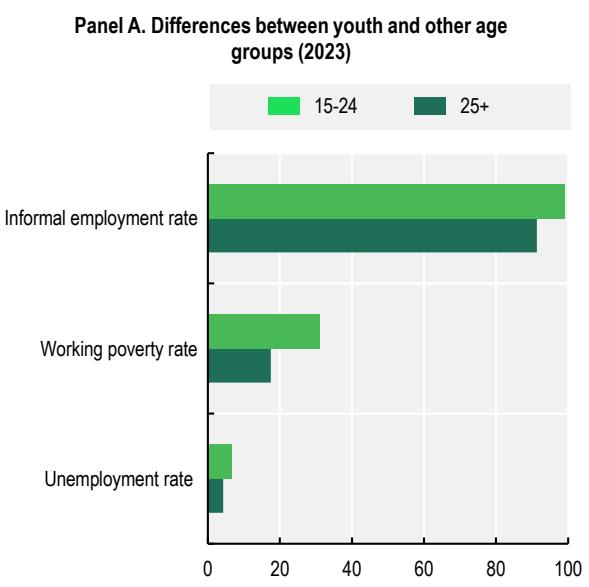  
Panel B. Gender differences among youth (15-24)

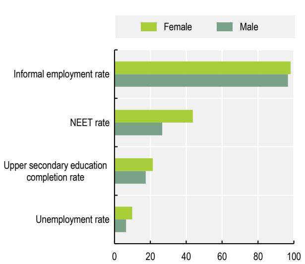  
Note: Working poverty rate refers to the percentage of employed living below USD 3 PPP; NEET rate refers to the share of youth not in employment, education or training (NEET).  
Source: ILO (2023[9]), ILOSTAT, https://ilostat.ilo.org/.

Pressures and misperceptions create both tensions and opportunities for change

## Masculinities under pressure

Stakeholders widely agreed that women's economic participation can benefit households and the wider economy, including by reducing financial pressure on men. Yet this support is often negotiated within existing expectations. Many respondents described tensions around maintaining men's provider role and household authority, especially when policies are perceived as prioritising women's access to opportunities without addressing boys' and men's constraints.

The gathered evidence suggests that failing to meet dominant masculine ideals can contribute to frustration, stress and, in some cases, use of violence among men. Mirroring the existing body of literature and findings from Côte d'Ivoire (see Chapter 2), Senegalese experts note that restrictive masculinities can negatively affect men's health and well-being, as well as women's rights and safety. This is especially the case when men resort to violence to assert authority over women in contexts where they perceive their masculinity to be threatened (see Chapter 5).

Across interviews and workshop discussions, stakeholders noted that younger generations tend to hold more egalitarian views on gender roles and are generally more open to positive masculinities. At the same time, some tensions persist. Some young men may experience heightened pressure to “succeed” economically and socially, particularly in contexts of precarity where these expectations are difficult to meet. Conversely, some young women are described as increasingly assertive in demanding greater gender equality. In certain contexts, especially those marked by gender-based violence, they may also express mistrust towards men and boys. If left unaddressed, these dynamics can contribute to more polarised gender relations and create risks of backlash despite a general openness towards positive masculinities.

Recognising that youth are central to sustained norms change, policymakers and CSOs are increasingly involving boys and men in gender equality work through school and community initiatives, youth clubs and intergenerational dialogue. These initiatives often focus on practical skills such as assertive and respectful communication, non-violence conflict resolution, emotional regulation, and strategies to counter stigma and peer pressure. To reach all Senegalese youth, relevant modules should be integrated in school curricula, and initiatives should be scaled up across all regions to the possible extent. Overall, existing programmes highlight the mutual benefits of gender equality for women and men, while anchoring positive masculinities in culturally and religiously accepted justifications.

## A “silent gap” between personal beliefs and social expectations

As highlighted in Chapter 2, social norms depend not only on personal beliefs but also on what people think others believe and expect. Senegal's workshop-based evidence suggests that participants often perceive wider society as more supportive of restrictive norms than they personally are, a pattern consistent with “pluralistic ignorance” dynamics discussed in the literature (Bicchieri, 2016[10]; Bussolo et al., 2023[11]; Matavelli et al., 2025[12]). While the data are not nationally representative and reflect a group of stakeholders rather than the general population, the pattern is still informative: respondents perceive men, and to a lesser extent women, as more supportive of restrictive masculinities than respondents report being themselves. The pattern is slightly different regarding gender differences in perceived support for the breadwinner norm. Participants expect a similar share of women and men to share this belief, underscoring once more its salience in Senegal (Figure 3.2).

Such misperceptions can quietly sustain restrictive norms through self-censorship, but they can also create entry points for change once identified. Individuals may align their behaviour with what they perceive to be socially acceptable, despite holding more progressive views, or conceal such views and practices. Anecdotal evidence from Senegal suggests, for example, that some men who contribute to household chores, which can be seen as conflicting with their role as financial providers, do so discreetly to avoid social judgement.

Against this backdrop, three key insights emerge. First, support for more positive forms of masculinity may be more widespread than commonly assumed, suggesting that policies and programmes could encounter less resistance, particularly when individuals recognise that their views are shared. Second, not all norms are equally resistant to change. Efforts may be more effective when targeting areas where endorsement of restrictive masculinities is already relatively low, such as women's land rights, access to employment and equal pay. Programmes focusing on norms change, policy and legal reforms or strengthened enforcement of existing legislation in areas where equal rights are already established, such as equal pay, are well placed to support progress in practice. Third, norms that remain widely accepted, such as the breadwinner role or men's authority over women, are likely to be more resistant to change, underscoring the need for more gradual and context-sensitive approaches.

Figure 3.2. People overestimate others' support for restrictive masculinities  
Agreement with statements capturing restrictive masculine norms (non-representative sample)  
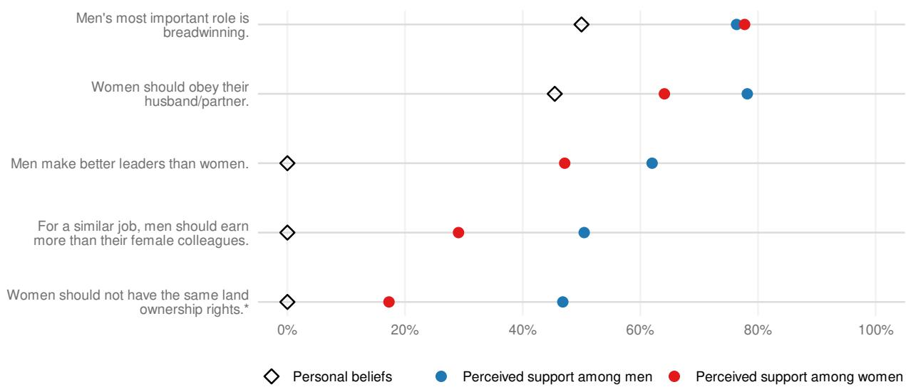

Note: Data presented in this figure was collected through a sequence of three questions which (1) ask the respondent whether they agree or not with the specific statement; (2) ask the respondent to estimate how many out of 10 men in their area would agree with the statement; (3) ask the respondent to estimate how many out of 10 women in their area would agree with the statement. The answers for type ((1) questions are labelled as “Personal beliefs” and the responses to type (2) and (3) are labelled as “Perceived support among men” or “Perceived support among women”, referring to respondents’ estimated shares of women and men who would support the different statements. The applied methodology follows (Bursztyn, 2023[13]) approach.

Data in this figure is not nationally representative as it was collected among 22 participants during the participatory workshop.

The statement marked with an asterisk were initially asked in the opposite way – e.g. instead of “I think women should not have the same land ownership rights as men” the question was asked as “I think women should have the same land ownership rights as men”. To present all data in a harmonised way, the mean values for the social expectations on men and women for this statement were reversed.

Source: OECD (2026[6]), Qualitative evidence on masculine norms in Senegal.

## Conclusion and policy recommendations

Qualitative evidence from Senegal indicates that breadwinning, household authority and the gendered division of unpaid care and domestic work remain central reference points for masculinity. These norms are reproduced through early socialisation, community-level enforcement, reputational pressures and selective cultural and religious interpretations. Structural pressures, especially constrained employment opportunities and perceived income precarity, make it harder to meet provider expectations but also heighten their importance as a source of masculine recognition and status.

Despite such tensions, the evidence suggests meaningful space for change. Younger generations appear to be a central sphere of both opportunity and tension. While they are often perceived as more receptive to gender equality and positive masculinities, some young men also face acute pressure to meet provider expectations, which can generate frustration and resistance. In addition, perceived social expectations often appear more conservative than many individuals' own beliefs. This gap can sustain conformity, but it can also be leveraged when people recognise that support for more equitable masculinities is more widespread than assumed.

Senegal's positive masculinity agenda can therefore build on locally resonant values and practices. The priority is to translate this potential into concrete changes in everyday life, including reduced unpaid care burdens for women, stronger support for women's economic participation, shared decision-making and prevention of violence against women and girls. This requires a combined strategy that clarifies positive masculinity in local terms, shifts norms through education and community platforms, corrects misperceptions that sustain conformity, and eases provider pressure by linking norm-change agendas to inclusive economic opportunities, particularly for young men.

## Moving forward: Policy priorities

Drawing on the analysis and concrete recommendations made by Senegalese stakeholders, the promotion of positive masculinities emerges as a central, cross-cutting theme linking women's economic empowerment, violence prevention, education, and social cohesion (see Chapters 4 and 5). To support the implementation of Senegal's positive masculinity agenda, the following actions should be prioritised:

\- Clarify and localise “positive masculinity” to build a shared understanding and reduce resistance. The government in consultation and collaboration with civil society organisations and religious and traditional leaders and academia should agree on a practical and locally grounded definition of positive masculinity, illustrated through everyday examples such as shared caregiving, respectful partnerships and non-violent conflict resolution. Framing should emphasise constructive role evolution and shared benefits, particularly for family well-being and social cohesion, women’s economic empowerment and violence prevention.

\- Use locally grounded norms and behavioural change communication to legitimise transformation and ease “what will people say” pressures. Develop context-specific communication tools anchored in religious and cultural discourse to demonstrate that positive masculine norms are consistent with local values. Campaigns and efforts should make existing support visible and highlight the benefits of positive masculinity for family well-being, economic stability, public health, women’s empowerment and social cohesion.

\- Embed positive masculinity and gender equality modules across education systems. Schools and universities are critical norm-shaping institutions. Integrating age-appropriate modules into basic, secondary, technical and professional education can influence attitudes before restrictive norms are internalised. Content should be adapted to socio-cultural contexts and respectful of religious values, combining gender-mixed activities with single-gender spaces to enable safe dialogue, reflection and exchange on rights, responsibilities and relationships. Teachers should be provided with targeted training on gender norms and positive masculinity to ensure the effective deliver of this content.

\- Scale community programmes that engage men and boys as partners and agents of change. Given the role of community-level enforcement in sustaining norms, interventions should expand proven locally designed approaches such as the government's Schools of Husbands, boys' youth clubs and intergenerational dialogue groups. Peer-led diffusion, where respected men model behaviours aligned with positive masculinity, can enhance credibility, uptake and sustainability.

\- Adopt a dual approach that addresses provider norms alongside economic constraints. Reducing the psychological “provider pressure” experienced by young men requires targeted interventions that gradually challenge the expectation that men’s worth and status depend primarily on being the family provider. At the same time, norm change is more likely to be sustained where livelihoods are secure and economic opportunities are available. Youth employment, skills, apprenticeship and entrepreneurship programmes can support this dual approach by combining economic inclusion with positive masculinity components, including peer dialogue, mentoring and life-skills modules on shared responsibility, caregiving, non-violence and emotional well-being. Complementary measures to reduce household financial stress can further support the practical adoption of more equitable roles.

# Annex 3.A. Conceptual framework on restrictive masculine norms in Senegal

Annex Table 3.A.1. Ten-norm conceptual framework on restrictive masculine norms

<table><tr><td></td><td>Norm</td><td>Underlying concept</td></tr><tr><td colspan="3">In the private sphere</td></tr><tr><td rowspan="5">A restrictive conception of masculinity implies that a man...</td><td>... does not take care of domestic tasks</td><td>Unpaid care and domestic work are considered women&#x27;s responsibility; men who engage in these activities are stigmatised.</td></tr><tr><td>... has exclusive decision-making power within the household</td><td>A man is expected to be the head of the household and to have sole authority over major decisions, particularly those involving children&#x27;s education, access to health care, decisions about visiting others such as family or friends, and the choice to work outside the home.</td></tr><tr><td>... controls household assets</td><td>Men are expected to control household resources, assets, and finances. This includes owning assets such as land or other property and receiving a larger share of inheritance. It also includes having authority over household expenditures, including basic necessities such as food and clothing, as well as long-term financial investments, major purchases, and savings.</td></tr><tr><td>... exercises abusive authority over women</td><td>Men&#x27;s role as head of household implies women&#x27;s obedience and may include the use of violence to resolve conflicts and protect the household. This also includes control over women&#x27;s movements.</td></tr><tr><td>... dominates choices and decisions related to reproductive health</td><td>Some men are expected to make decisions regarding reproductive choices (use of contraception and number of children).</td></tr><tr><td colspan="3">In the public sphere</td></tr><tr><td rowspan="5">A restrictive conception of masculinity implies that a man...</td><td>... is the primary financial provider for the family</td><td>A man&#x27;s role is to be the main breadwinner and financial provider of the household. Conversely, women are not seen as having an essential role in the labour market.</td></tr><tr><td>... is financially dominant</td><td>As a consequence of the norm that men should be the primary providers, it is considered normal for men to be better paid than women and for pay gaps to be acceptable. This idea is also linked to household hierarchy, according to which a man should earn more than his spouse when both are working.</td></tr><tr><td>... works in a sector or occupation considered &quot;masculine&quot;</td><td>Social norms play a crucial role in defining what is considered a male or female occupation. These perceptions reinforce horizontal segregation in the labour market, with women confined to jobs associated with feminine traits. Men working in female-dominated sectors are socially penalised (e.g., as nurses).</td></tr><tr><td>... is the ideal worker</td><td>An ideal male worker is expected to prioritise work at all times: being constantly available, working full-time, working long hours, prioritising work over family life, and being willing to travel or relocate for work.</td></tr><tr><td>... is a powerful and strong leader</td><td>Leadership is often associated with masculine traits such as competitiveness, toughness, aggressiveness, emotional restraint, and assertiveness. Men are therefore perceived as natural leaders, while women who aspire to leadership positions are expected to conform to these &quot;masculine&quot; traits.</td></tr></table>

Note: This framework was developed in collaboration with the Senegalese Technical Advisory Group, based on the OECD's ten-norm framework as published in 2021 (OECD, 2021[14]).  
Source: Based on (OECD, 2021[14]), Man Enough? Measuring Masculine Norms to Promote Women's Empowerment.

Afrobarometer (2022), Senegal Round 9 data (2022). [7]

## References

African Union (2025), African Union Convention on Ending Violence Against Women and Girls, https://au.int/sites/default/files/newsevents/workingdocuments/44174-wd-EN\_AU\_Convention\_onEnding\_Violence\_Against\_Women\_and\_Girls\_CEVAWG\_27.05.2025.pdf.

African Union (2021), Kinshasa Declaration and Call to Action on Positive Masculinity to End Violence Against Women and Girls in Africa, [2] https://au.int/sites/default/files/pressreleases/41226-pr-Declaration\_Mens\_Conference\_English.pdf.

Bicchieri, C. (2016), “Norms in the Wild: How to Diagnose, Measure, and Change Social Norms”, Oxford University Press. [10]

Bursztyn, L. (2023), “How are gender norms perceived?”, National Bureau of Economic Research, Vol. No. w31049, https://www.nber.org/system/files/working\_papers/w31049/w31049.pdf.

Bussolo, M. et al. (2023), “Social Norms and Gender Disparities with a Focus on Female Labor Force Participation in South Asia”, The World Bank Research Observer, Vol. 39/1, pp. 124-158, https://doi.org/10.1093/wbro/lkad010. [11]

Government of Senegal; ANSD (2022), Enquête nationale sur l'emploi du temps au Sénégal 2021. Rapport final, https://anads.ansd.sn/index.php/catalog/249/related-materials. [5]

ILO (2023), ILOSTAT data explorer, https://ilostat.ilo.org/ (accessed on 4 May 2026). [9]

Matavelli, I. et al. (2025), “Masculinity Norms and Their Economic Implications”, Annual Review of Economics, In Press, https://doi.org/10.1146/annurev-economics-051624-065932. [12]

OECD (2026), Qualitative evidence on masculine norms in Senegal, Key informant interviews and participatory workshop facilitated by the OECD and the Department for Gender Equity and Equality, Ministry of Family, Social Action and Solidarity in Senegal.

OECD (2021), Man Enough? Measuring Masculine Norms to Promote Women's Empowerment, [14] Social Institutions and Gender Index, OECD Publishing, Paris, https://doi.org/10.1787/6ffd1936-en.

Pew Research Centre (2020), Religious Composition by Country, 2010-2020, Pew Research Center, https://www.pewresearch.org/religion/feature/religious-composition-by-country-2010-2020/ (accessed on 4 May 2026).

République du Sénégal (2021), Stratégie Nationale « Ecole Des Maris », Ministère de la Femme, de la Famille, du Genre et de la Protection des Enfants, https://www.scribd.com/document/616030704/Strategie-Nationale-Ecole-Des-Maris-Version-02-Juil-21-Vf. [4]

République du Sénégal (2015), Stratégie Nationale pour l'Équité et l'Égalité de genre 2016-2026, Ministère de la Femme, de la Famille et de l'Enfance du Sénégal, https://www.sante.gouv.sn/sites/default/files/sneeg%281%29\_0.pdf.

# 4 How masculinity norms shape women's economic empowerment

This chapter examines how norms of restrictive masculinities shape women's economic empowerment in Côte d'Ivoire and Senegal, drawing on OECD research from Côte d'Ivoire and related evidence from both countries. It first analyses gender gaps in labour market outcomes and the extent to which restrictive norms affect women's employment, alongside other important drivers such as education, local labour market conditions and care responsibilities. It then turns to women's agency, focusing on decision-making power, autonomy over income, and ownership and control of productive assets. The chapter concludes by outlining policy implications for addressing both restrictive norms and structural barriers to strengthen women's economic empowerment more effectively in Côte d'Ivoire and Senegal.

## In brief

## Key findings on the linkages between masculinities and women's economic empowerment

\- Women in Côte d'Ivoire and Senegal continue to face persistent barriers to economic empowerment. Gender gaps remain substantial in labour force participation, job quality, decision-making power, control over income, and ownership of productive assets such as land and housing.

\- Restrictive masculinities help explain why these gaps persist. Norms that position men as primary providers, household heads, decision makers and controllers of resources can limit women's employment prospects, reduce their agency over income and assets, and constrain their role in household decisions.

\- Women's employment does not automatically translate into empowerment. Even when women work, they are often concentrated in informal, lower-paid or less secure jobs. Paid work or income does not necessarily expand agency if women cannot decide how resources are used or fully benefit from them.

\- Household income shapes how restrictive masculinities affect women's employment. In Côte d'Ivoire, restrictive norms are particularly associated with a higher likelihood of women being out of the workforce in middle- and higher-income households, where families may have greater economic room to conform to male breadwinner norms.

\- Unpaid care and domestic work are a central pathway through which restrictive masculinities constrain women's economic opportunities. Women spend far more time than men on these tasks, reducing their time, mobility and flexibility to access decent work, training, entrepreneurship and career progression.

\- Restrictive masculinities also constrain women's agency over household decisions, income and assets. In Côte d'lvoire, stronger endorsement of restrictive norms is associated with lower women's decision-making power, reduced control over their own income, and a lower likelihood of owning land.

\- Norms matter, but they do not operate in isolation. Education, local labour market conditions, care services, legal frameworks and institutional barriers also shape women's economic opportunities and control over resources.

\- Advancing women's economic empowerment requires an integrated policy approach. Priorities include redistributing unpaid care and domestic work, expanding childcare and care services, strengthening women's access to land, housing, credit and markets, promoting positive masculinities, and mainstreaming women's economic empowerment across national policies and budgets.

Women's economic empowerment goes beyond participation in paid work. It encompasses women's ability to access decent economic opportunities, including stable work in the formal economy, exercise choice, control resources and influence decisions that affect their economic lives. A woman is economically empowered when she has both the ability to succeed and progress economically, and the agency to make and act on economic decisions. This requires skills, knowledge and resources to compete in markets, as well as fair and equal access to economic institutions and opportunities. It also requires the power to make decisions and act on them, including in relation to income, employment, assets, investment and the use of time.

Drawing on new OECD Development Centre evidence, this chapter shows that restrictive masculinities help explain persistent gender gaps in economic empowerment in Côte d'Ivoire and Senegal. Restrictive masculinities refer to norms that associate men with breadwinning, authority, leadership and control over resources, and that can reinforce expectations that women assume primary responsibility for unpaid care and domestic work. These norms can weaken women's employment prospects, limit their influence over income and assets, and reduce their role in key household decisions, even when they are economically active. They can also intensify women's unpaid care and domestic work burden, limiting the time, mobility and flexibility needed to access decent work, training, entrepreneurship and career progression.

Addressing restrictive masculinities is therefore a critical policy lever for advancing women's economic empowerment, but norm change alone is not sufficient. Evidence from Côte d'Ivoire and Senegal shows that restrictive norms operate alongside broader structural constraints, including education gaps, local labour market conditions, care responsibilities, limited care services, and legal and institutional barriers to women's control over productive resources. The chapter also considers how these norms interact with wider economic and social conditions that shape women's opportunities, choices and control over resources.

## Restrictive masculinities shape women's access to employment and decent work

Women's access to economic opportunities, particularly to quality employment, is an important pillar of women's economic empowerment. Paid work can enable women to generate income, strengthen household income security, and enhance their bargaining power within the household and in society more broadly. Yet, employment alone does not guarantee empowerment. Its transformative potential depends on the conditions under which women work, including earnings, security, access to social protection, opportunities for skills development and progression, and control over the income earned. When women are concentrated in low-paid, insecure, or informal jobs, paid work may generate income without significantly improving their economic security, autonomy or bargaining power. In Côte d'Ivoire and Senegal, these employment outcomes are shaped not only by education, labour market conditions and care responsibilities, but also by restrictive norms that define men as a primary provider.

## Box 4.1. Data sources and comparability

This chapter combines different types of evidence from Côte d'Ivoire and Senegal. For Côte d'Ivoire, it draws primarily on original nationally representative household survey data collected for this report (hereafter referred to as survey data from Côte d'Ivoire), which include information on attitudes towards masculinities, economic agency and labour market participation. For Senegal, it relies on secondary quantitative sources together with qualitative evidence from key informant interviews and participatory discussions, including with government institutions, civil society organisations and international partners.

These data are complementary but not fully comparable. Differences in methodology, definitions, indicators, and reference periods mean that certain estimates, e.g. time spent on unpaid care and domestic work, may not be fully comparable based on survey design or population coverage. In this chapter, the Côte d'Ivoire data are used to examine patterns of women's economic empowerment and the roles of norms in driving the observed gaps, while the qualitative evidence from Senegal offers in-depth insights how masculine norms operate in practice and shape women's work and economic agency. For both countries, national experts were consulted to contextualise the data results.

## Women continue to face major barriers to full economic empowerment

Côte d'Ivoire and Senegal both face persistent gender gaps in labour force participation. At 15 percentage points in Côte d'Ivoire and 28 percentage points in Senegal, gender gaps are among the highest relative to comparator economies in Africa, surpassed only by Morocco and Tunisia. Côte d'Ivoire records a higher female labour force participation rate, at 60%, compared with 38% in Senegal (Figure 4.1 – Panel A), although women's labour force participation in Senegal has increased slightly since 2010 (Figure 4.1 – Panel B).

Figure 4.1. In Côte d'Ivoire and Senegal there are significant gaps in labour force participation  
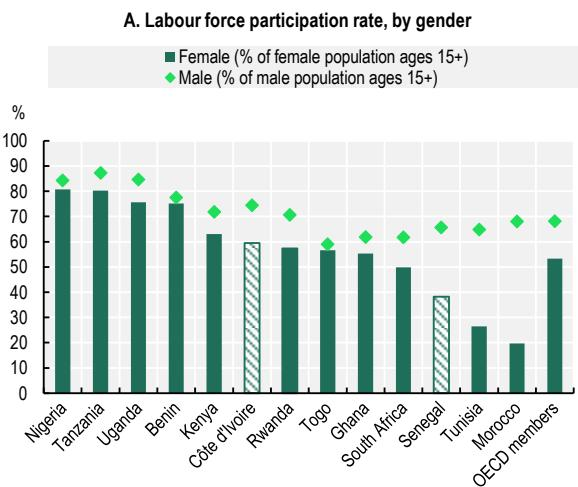

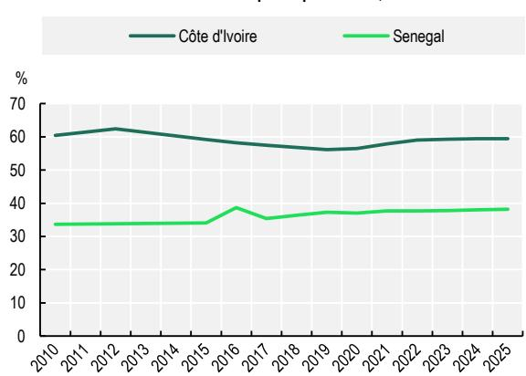  
Note: The OECD members group refers to the 38 members countries.  
Source: World Bank (2026[1]), World Development Indicators (database), https://databank.worldbank.org/source/world-development-indicators.

When in paid work, employment does not necessarily guarantee decent working conditions for women in Côte d'Ivoire and Senegal. In both countries, women are more likely than men to be engaged in vulnerable employment (Figure 4.2), including own-account work and contributing family work, which is generally associated with less secure and less formal working arrangements, lower and less stable earnings, and more limited access to social protection than wage and salaried employment.

Despite formal equal pay provisions in the Labour Codes of both Côte d'Ivoire and Senegal, which mandate equal remuneration for work of equal value regardless of gender, women also continue to face substantial wage disparities. Gender pay gaps are estimated at 27% for Côte d'Ivoire in 2019 and 13% for Senegal in 2024 (ILO, 2022[2]; ILO, 2024[3]). Within households, women's earning also tend to remain lower than men's: in Senegal, 76% of women report earning less than their husbands, while 11% report earning the same or more. In Côte d'Ivoire, the corresponding figures are 87% and 9%, respectively (DHS Senegal, 2023[4]; DHS Côte d'Ivoire, 2021[5]).

Figure 4.2. A large share of women in Côte d'Ivoire and Senegal is employed in vulnerable forms of employment

Panel A. Type of employment among those working in Côte d'Ivoire

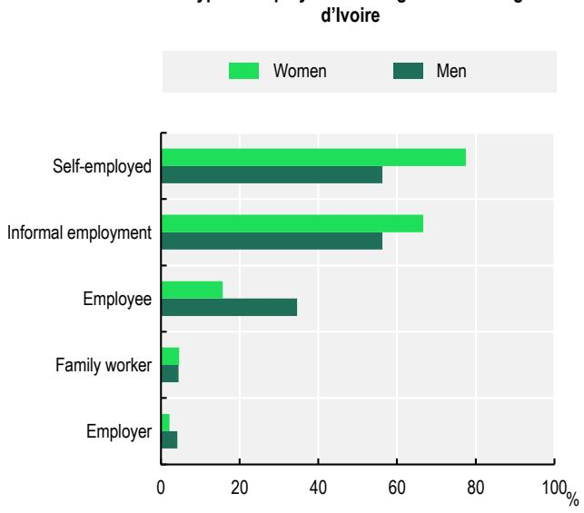  
Panel B. Type of employment among those working in Senegal

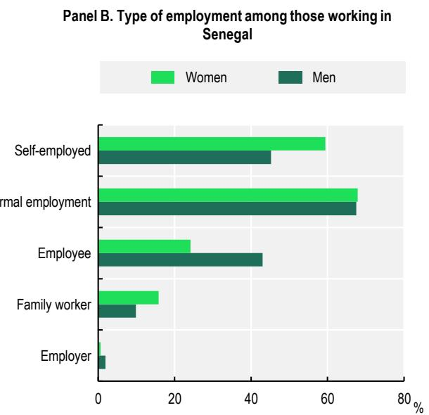  
Note: Responses in Panels A and B are non-mutually exclusive; individuals may report multiple categories, implying that reported shares are not constrained to sum to 100%. Data for Côte d'Ivoire refer to 2026, while data for Senegal refer to 2021.

Source: Panel A – Authors' elaboration based on OECD (2026[6]), OECD Masculinities Database for Côte d'Ivoire, https://data-explorer.oecd.org/s/4sy. Panel B - OECD (2026[7]), Key Indicators of Informality based on Individuals and Households (KIIbIH) Database, https://data-explorer.oecd.org.

## Restrictive masculinities can limit women's employment

OECD Development Centre's granular analysis, based on evidence from Côte d'Ivoire, shows that restrictive masculinities are negatively associated with women's probability of being employed. This relationship is evident both when considering overall measures of masculinity, captured by the OECD Masculinities Index (see Chapter 2), and when examining specific restrictive norms. $^{1}$

Norms that position men as protectors and guardians of women, leaders and primary breadwinners appear to be particularly strongly associated with lower employment prospects for women. When men are seen as protectors and women as dependants, women's mobility, job search, and access to education, training and professional networks may be restricted. At the same time, norms that define men as primary providers can frame women's employment as secondary or conditional, especially when women's paid work is seen as undermining men's expected role as the main providers for the household.

The analysis further suggests that women's employment in Côte d'Ivoire is shaped not only by gender norms, but also by education, local labour market conditions and care responsibilities. Education is consistently associated with a higher probability of formal employment. In addition, significant differences at the sub-national level persist, suggesting that the availability and quality of local economic opportunities matter for women's, as well as men's, employment outcomes. At the household level, having biological children is negatively associated with women's employment, pointing to the role of time constraints and unequal care responsibilities in limiting women's engagement in paid work.

Qualitative evidence from Senegal points to similar dynamics. Stakeholders describe broad social acceptance of women's economic participation and decision-making power, but this acceptance often remains conditional. Women's work and financial contributions to household income are generally accepted insofar as they continue to fulfil domestic responsibilities and do not visibly challenge men's role as primary family breadwinner (see Chapter 3). This points to an important tension: while women's access to education, skills and jobs is widely supported, married women's economic opportunities often still have to be negotiated within marital and family structures. At the same time, where women's economic contribution is considered acceptable only insofar as it does not disrupt established domestic roles, women may be channelled into forms of work that are informal, flexible or home-based, allowing them to remain available for childcare, household responsibilities or unforeseen family needs. As a result, even when women are able to enter the labour market, they may remain concentrated in more precarious jobs, reinforcing labour-market vulnerability and limiting opportunities for career progression (ILO, 2018[7]; OECD, 2019[8]).

Restrictive masculinities can also shape the type of work considered appropriate for women and men. Norms that associate leadership with masculine traits may bias hiring and promotion in favour of men, discourage women from pursuing positions of authority, and contribute to both horizontal segregation across occupations and vertical segregation within organisational hierarchies (Figure 4.3). In Côte d'Ivoire, a substantial share of both men (50%) and women (44%) consider secretarial work better suited to women, while mining engineering is less commonly viewed as exclusively male, suggesting some openness to women's entry into traditionally male fields. However, leadership norms remain more restrictive: 66% of men and 53% of women believe that men make better business leaders, while 81% of men and 71% of women believe that men make better political leaders (OECD, 2026[6]). Afrobarometer data suggest that these views are less entrenched in Senegal, where 31% of men and 15% of women agree that men are better political leaders (Afrobarometer, 2022[9]). These patterns are not specific only to Côte d'Ivoire and Senegal but are part of broader global issues. Experimental labour-market evidence shows that, despite women's rising educational attainment and labour-market participation, labour markets around the world remain marked by horizontal and vertical gender segregation (Lozano, Ranehill and Reuben, 2023[10]).

Where such attitudes are prevalent, they can limit women's access to higher-quality jobs and leadership roles by reinforcing occupational segregation and the perception that positions of authority are more appropriate for men (see Chapter 2). In this way, restrictive masculinities affect not only whether women work, but also the sectors, occupations and levels of responsibility they are able to access.

Figure 4.3. Gender-based occupational segregation remains substantial in Côte d'Ivoire and Senegal  
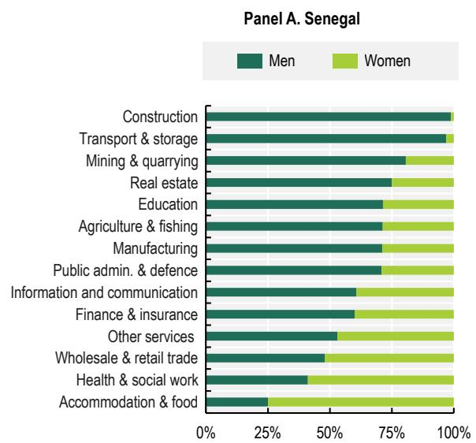

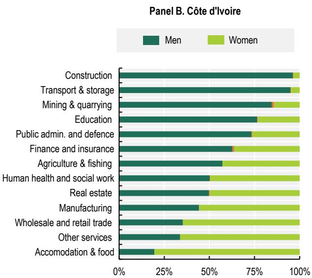  
Note: Economic activity is classified using the International Standard Industrial Classification of All Economic Activities, revision 4 (ISIC rev 4). Category "other services" aggregates workers from categories R, S, T and U of ISIC rev 4, corresponding respectively to "Arts, entertainment and recreation" (R), "Other service activities" (S), "Activities of households as employers; undifferentiated goods - and services producing activities of households for own use" (T), and "Activities of extraterritorial organisations and bodies" (U).

Source: ILO (2022; 2024[11]), ILO.Stat Data Explorer, https://data.ilo.org/.

The relationship between restrictive gender norms and women's employment is particularly evident in middle- and high-income households, where families may have greater economic room to conform to traditional gender roles. $^{2}$ The stronger the endorsement of norms that expect men to be the main breadwinners, the more likely women are to be out of work. A similar pattern appears with norms that give men control over household assets, although the relationship is weaker. In low-income households, however, this link disappears. Economic necessity often requires women to contribute to household income, even when employment is informal, insecure or poorly paid. This suggests that restrictive norms may have a stronger influence on women's employment where households have the financial means to act on them, whereas economic constraints can limit the extent to which such preferences shape labour market participation. These dynamics are consistent with the U-shaped relationship between economic development and female labour force participation. In low-income, agrarian contexts, women's participation tends to be high because economic necessity compels their contribution to household survival. It often declines in the early stages of industrialisation before recovering as the service economy expands and women's educational attainment increases (Goldin, 1994 $[12]$ ; Kabeer, 2012 $[13]$ ). This pattern suggests that participation driven by poverty reflects vulnerability rather than empowerment, and that declines associated with rising incomes should not be interpreted as a long-term outcome.

## Unpaid care and domestic work are a central pathway through which restrictive masculinities constrain women's paid employment

Unpaid care and domestic work are a key mechanism shaping women's economic empowerment, particularly through labour market outcomes. Restrictive norms that define such work as women's responsibility and falling outside men's expected roles strengthen these outcomes. When women bear a disproportionate share of unpaid care and domestic responsibilities, they have less time for income-generating activities, training, networking, rest and health, and face greater constraints in accessing full-time, stable and better-paid jobs (OECD, 2023[14]). This matters not only for labour-force participation, but also for the quality of their economic participation. Heavy unpaid care and domestic workloads can push women into informal, part-time, lower-paid or flexible jobs that are easier to combine with household responsibilities, while reducing their opportunities for career progression and limiting the extent to which paid work translates into greater autonomy. Even when women enter the labour market, paid work is often added to existing care and domestic responsibilities rather than replacing or redistributing them. This is particularly visible in low-income contexts, where women's income may be an economic necessity, creating substantial role overload and contributing to women working significantly longer total hours than men (Oropesa, 1993[15]; Chopra and Zambelli, 2017[16]; OECD, 2022[17]). These dynamics are reinforced by restrictive masculinities that define men primarily as providers and women as caregivers and household managers, making the unequal distribution of unpaid care and domestic work appear natural rather than negotiable.

## Women continue to bear a disproportionate share of unpaid care and domestic work

Mirroring global patterns, women in Côte d'Ivoire and Senegal spend significantly more time than men on unpaid care and domestic tasks. Globally, women spend on average 2.6 times as much time as men on these activities. In Côte d'Ivoire, women spend about seven hours per day on unpaid care and domestic work, compared with around two hours for men, or 3.5 times as much time (OECD, 2023[14]). The gap is even wider in Senegal, where women devote about five hours per day to these tasks, compared with only 30 minutes for men, or roughly 10 times as much time. These figures point to a substantial and persistent imbalance in the allocation of unpaid work, with women bearing the overwhelming share in both countries (Figure 4.4).

Figure 4.4. Women bear a disproportionate burden of unpaid care and domestic work in Côte d'Ivoire and Senegal  
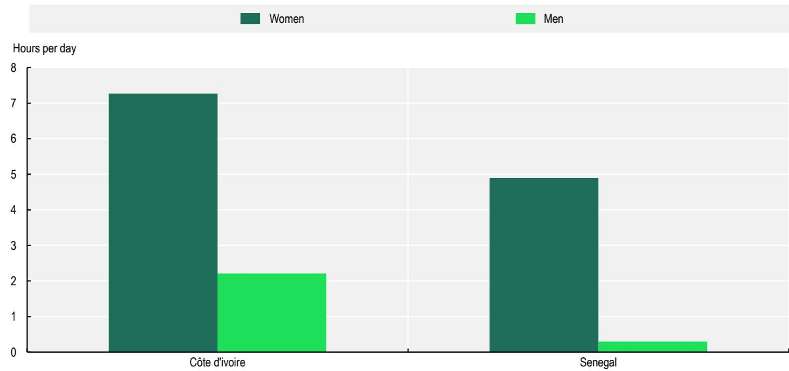  
Note: In Côte d'Ivoire, unpaid care and domestic work includes activities such as cooking, cleaning, house repairs, laundry, collecting water and firewood, providing for children's needs (feeding, bathing, and medical care), supervising homework, spending time with and accompanying children to activities, and caring for elderly or sick household members. In Senegal, there are slight differences in the activities included. While cooking, cleaning, fetching water or firewood, and caring for children, the elderly, or sick family members are covered, activities such as house repairs and laundry are not mentioned. In addition, the scope of “caring for children” is not clearly defined. These differences in definitions may contribute to lower reported time spent on unpaid care and domestic work in Senegal.  
Source: OECD (2026[6]), OECD Masculinities Database for Côte d'Ivoire, https://data-explorer.oecd.org/s/4sy; (Agence Nationale de la Statistique et de la Démographie, 2022[18]), Enquête Nationale sur l'Emploi du Temps au Senegal.

Survey data from Côte d'Ivoire further show that gender differences in unpaid care and domestic work are pronounced across the entire country, particularly for household tasks. The Central West region records the highest levels of unpaid work for women in both household tasks and care (Figure 4.5 – Panel A). On the other hand, men in the Central West also appear to spend more time on household tasks and care than men in other regions, which can be seen from the lower women-to-man ratio of hours spend on household tasks and care in comparison to other regions. By contrast, South West, North East and North, the data indicate extremely limited male participation, especially in household task (Figure 4.5 – Panel B). Large gender gaps in household tasks across Côte d'Ivoire suggest that any meaningful reduction in women's time burden will require greater male participation in routine domestic tasks.

Across the South West, North, and North East, women's disproportionate agricultural labour coexists with systematic exclusion from land ownership and productive assets, further compounded by chronic water scarcity. The South West is the economic heartland of cocoa production. Based on the latest available data, women in Côte d'Ivoire own 25% of cocoa farms and form 68% of the cocoa labour force yet only earn 21% of the income generated from cocoa production – they are usually perceived as helpers in cocoa tasks and responsible for food crop production (Marston, 2016[19]). In practice, even when a household's cash income comes from cocoa, which is mostly controlled by the husband, women bear large responsibility for ensuring the family is fed, managing a separate subsistence agriculture track on top of contributing to cocoa production. In the northern regions, where the agricultural system centres on cashew nuts and cotton, a similar pattern of exclusion persists. Women rarely hold ownership of agricultural land (only 8% hold a land title compared to 22% of men) (Kalsi and Memon, 2020[20]). Beyond the farm, water infrastructure deficits compound women's unpaid care burden in ways that do not affect men equally. The northern part of Côte d'Ivoire, with only one rainy season, faces serious water infrastructure deficits compounded by climate vulnerability (GIZ, 2021[21]). In rural Ivorian communities, women are considered the guardians of water and the scarcity of potable water compels them to travel long distances for collection, exposing them to physical fatigue and reducing the time available for paid or productive activities (Aser and Seri, 2023[22]).

<table><tr><td>Women-to-men ratio of hours spent on HH tasks and care</td><td>■ HH tasks</td><td>■ Care</td></tr></table>

Figure 4.5. There are significant gender gaps in unpaid care and domestic work in all regions of Côte d'Ivoire  
Panel A. Regional distribution of household tasks and care in Côte d'Ivoire in terms of hours spent

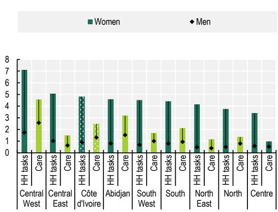

Panel B. Regional variation in the time women spend on household tasks and care relative to men in Côte d'Ivoire  
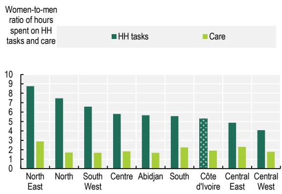  
Note: In Côte d'Ivoire, household tasks (HH tasks) include activities such as cooking, cleaning, house repairs, laundry, and the collection of water and firewood, while care activities include providing for children's needs (feeding, bathing, and medical care), supervising homework, spending time with children, accompanying them to activities, and caring for elderly or sick household members.
Source: Authors' elaboration based on OECD (2026[6]), OECD Masculinities Database for Côte d'Ivoire, https://data-explorer.oecd.org/s/4sy.

Low participation in early childhood education, together with the limited availability of affordable care services, is likely to intensify women's unpaid care and domestic work burden in both countries. This is particularly consequential in low- and middle-income contexts, where fragmented care systems deepen women's time poverty and further constrain their economic participation. Both Senegal and Côte d'Ivoire have relatively low levels of participation in early childhood education compared with the other countries presented (Figure 4.6). Limited access to affordable and quality care services can reinforce women's responsibility for childcare within the household, reducing the time and flexibility they have to engage in paid work, training or entrepreneurship. Data from Côte d'Ivoire reveal several reasons behind low participation in early childhood education. One important factor is the limited availability of pre-school facilities in rural areas. This is reflected in the large rural–urban gap in enrolment: only around 5% of children in rural areas are enrolled, compared with 30% in urban areas. Economic barriers further compound this divide. Enrolment is particularly low among children from the poorest households, at just 1.5%, compared with 51.4% among children from the richest quintile. Safety concerns also appear to play a role, as some parents who choose not to enrol their children report that schools do not provide a sufficiently secure environment (MENAET, 2019[23]).

Figure 4.6. Low early childhood enrolment undermines women's economic empowerment Gross enrolment rate, early childhood education (%)  
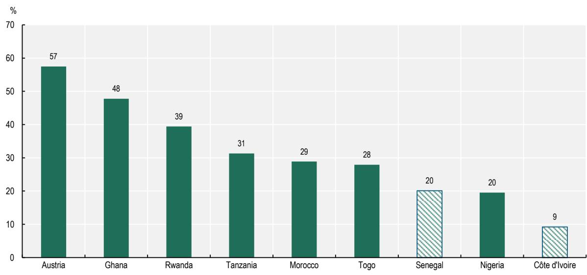  
Note: Data refer to 2023 for Austria, Rwanda, Tanzania, Morocco, Togo, Senegal and Côte d'Ivoire, and to 2021 for Ghana and Nigeria. Source: World Bank (2026[24]) Gross enrolment rate, early childhood education (%), https://humancapital.worldbank.org/en/indicator/WB\_HCP\_ECEDU.

## Restrictive gender norms reinforce the unequal distribution of unpaid care and domestic work

The unequal distribution of unpaid care and domestic work is not only a matter of household arrangements or service provision; it is also sustained by restrictive norms that define such work as women's responsibility and confine them to the domestic sphere. Evidence from Côte d'lvoire further suggests that this unequal distribution is underpinned by powerful social norms: around two-thirds of both women and men report that men should not engage in unpaid care and domestic work because it is considered “a woman’s job”, whereas far fewer cite community disapproval or men’s lack of know-how (Figure 4.7). This suggests that the main barrier is not only practical, but deeply normative: unpaid care and domestic work are widely perceived as falling outside men’s expected roles.

Figure 4.7. Unpaid care and domestic work is widely perceived as a “women’s job” in Côte d’Ivoire People’s views on why men should not do unpaid care and domestic work  
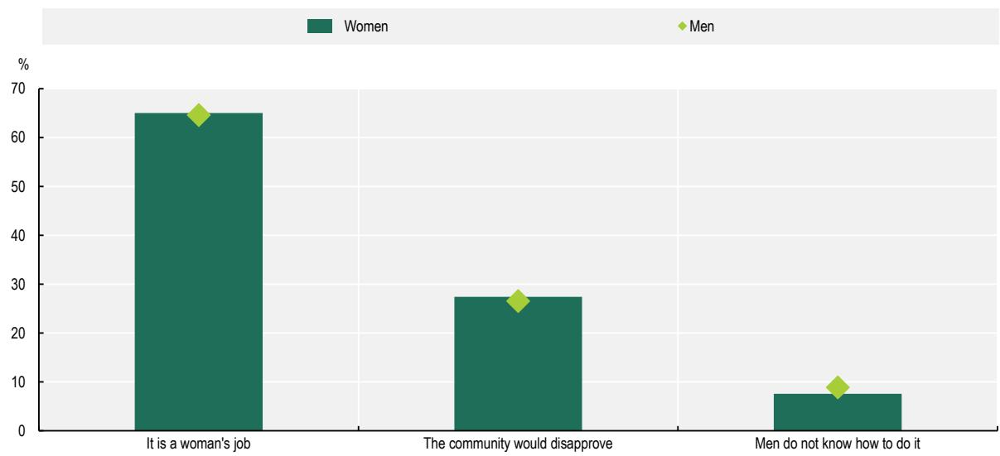  
Source: Authors' elaboration based on OECD (2026[6]), OECD Masculinities Database for Côte d'lvoire, https://data-explorer.oecd.org/s/4sy.

Social expectations regarding men's contribution vary considerably by task. Men in Côte d'Ivoire are expected to contribute most regularly to supervising children's homework, with $43\%$ of respondents saying men should do this every day and a further $37\%$ several times a week. Expectations of men's involvement are also relatively stronger for childcare and care for sick elders, where only small minorities say men should never contribute. By contrast, routine domestic tasks remain much more strongly feminised. Around $43\%$ of respondents believe men should never do laundry, while $37\%$ say the same for cleaning, $35\%$ for cooking and $33\%$ for collecting water and wood (Figure 4.8). These patterns suggest that men's involvement is more socially accepted when it is linked to children's education or occasional care, but remains much less accepted for daily, repetitive domestic tasks that make up a large share of women's unpaid work burden.

OECD analysis from Côte d'Ivoire further shows that restrictive masculinities are associated with more time spent by women on unpaid care and domestic work. This pattern holds both for the OECD Masculinities Index and for specific norm dimensions. $^{3}$ Norms that appear to increase women's unpaid work burden include those that position men as dominant in sexual and reproductive decision-making, give them control over household assets and final authority over household decisions, and define them as breadwinners, financially dominant, “manly” leaders, and suited to “manly” jobs. These norms operate through several channels. Norms that allow men to dominate sexual and reproductive choices limit women's agency by exerting control over fertility and birth spacing. Norms that give men control over household assets or final decision-making authority can also limit women's ability to redirect resources towards childcare, labour-saving goods or a more equal division of labour. At the same time, the norms of men having to be the breadwinner, “manly” leaders and the “ideal worker” reinforces the perception that men's time should be used for paid work while framing women's work as secondary, making women the default providers of unpaid care and domestic labour (OECD, 2021 $[25]$ ).

Figure 4.8. Uneven expectations: Men's contribution to unpaid care and domestic work by task % of all respondents  
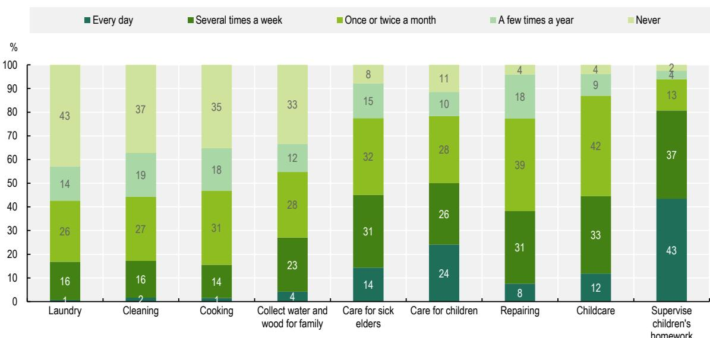  
Note: The figure presents the distribution for the overall sample, estimated as a weighted average of the percentage shares for men and women. Differences in reported views by sex are minimal.  
Source: Authors' elaboration based on OECD (2026[6]), OECD Masculinities Database for Côte d'Ivoire, https://data-explorer.oecd.org/s/4sy.

Qualitative evidence from Senegal points to similar dynamics. Stakeholders identified the norm that men should not engage in unpaid care and domestic work as the most prevalent restrictive masculinity norm (see Chapter 3). Men's contribution to care and household tasks remains limited, strongly stigmatised and generally accepted only when framed as support to mothers rather than as a shared responsibility within marriage or partnership. In practice, this reinforces the view that unpaid care and domestic responsibilities are inherently women's work, placing the primary burden of household maintenance and caregiving on women.

The unequal division of care and domestic work, reinforced by restrictive masculine norms, undermines women's economic empowerment by reducing their time, mobility, earnings potential, job quality and bargaining power. It also limits the extent to which access to paid work can translate into greater autonomy. Increasing men's participation in unpaid care and domestic work is therefore not only essential for reducing women's “time poverty”, understood as the lack of sufficient time to balance paid work and unpaid care work, but also for expanding socially accepted roles for men as caregivers and partners. Addressing this imbalance requires expanding care services and labour-saving infrastructure, while also transforming the restrictive norms that protect men's time for paid work while normalising women's responsibility for unpaid care and domestic work.

## Restrictive masculinities constrain women's agency in decision-making and control over resources

Women's ability to participate in economic decision-making and exercise control over resources is a core dimension of agency and a key driver of women's economic empowerment. It determines whether women can make and act on choices that affect their economic lives, including how income is used, whether to save or invest, how household resources are allocated, and whether to acquire or control productive assets. This matters because access to paid work or income does not automatically translate into

Panel B. Women, either alone or jointly, taking decisions within households on important matters

empowerment if women cannot decide how resources are used or benefit from them. In Côte d'Ivoire and Senegal, restrictive masculinities can limit this agency by reinforcing men's authority as household heads, final decision makers and primary controllers of income, assets and productive resources. As a result, women may work, earn income or contribute substantially to household production without gaining equal autonomy or bargaining power. These constraints are visible in women's limited role in household and work-related decision-making and their weaker control over income, and in persistent gender gaps in ownership of land, housing and other assets.

## Restrictive masculinities limit women's agency in household decision-making and control over income

Gender gaps in decision-making persist in Côte d'Ivoire and Senegal, particularly within the household. Survey data from Côte d'Ivoire show that around 60% of employed women report being able to take important decisions in their work, compared with 69% of men (Figure 4.9 – Panel A). However, the disparities are even more pronounced in household decision-making. In Côte d'Ivoire and Senegal, less than 40% of women can make important household decisions, either alone or jointly, including decisions about their own health care and large household purchases (Figure 4.9 – Panel B). The analysis presented below therefore focuses primarily on household decision-making and control over income, where restrictive masculinities appear to play a particularly important role.

Panel A. Decision-making autonomy at work

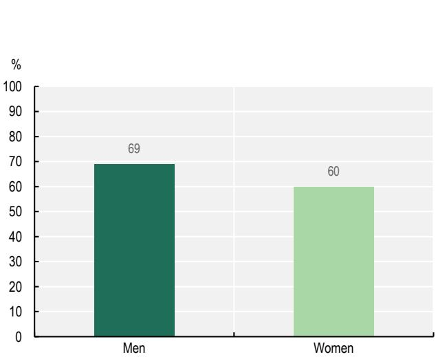

Figure 4.9. In Côte d'Ivoire and Senegal, women have less control over economic decisions  
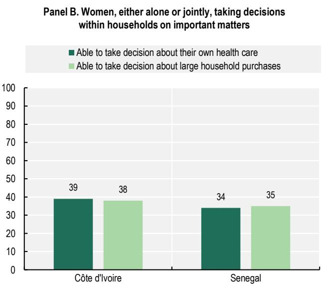  
Note: The data shown in the first panel are drawn from the survey conducted in Côte d'Ivoire as part of this project and reflect respondents' perceptions in 2026. The data in the second panel come from the Demographic and Health Surveys and refer to 2023 for Senegal and 2021 for Côte d'Ivoire. The two panels are therefore not directly comparable given difference in reference year.  
Source: Panel A – Authors' elaboration based on OECD (2026[6]), OECD Masculinities Database for Côte d'Ivoire, https://data-explorer.oecd.org/s/4sy; Panel B – DHS Côte d'Ivoire (2021[5]), Standard DHS, Phase 8, https://dhsprogram.com/methodology/survey/survey-display-559.cfm; DHS Senegal (2023[4]), Continuous DHS, Phase 8, https://dhsprogram.com/methodology/survey/survey-display-611.cfm.

OECD analysis based on data from Côte d'Ivoire shows that women's agency is significantly constrained in contexts where restrictive masculinities are strongly endorsed. Restrictive norms are strongly associated with the view that men alone should hold decision-making power in important family matters. This pattern is consistent across several domains of household decision-making, including major household purchases, everyday purchases, healthcare spending and expenditures on children's education. Norms portraying men as asset holders, leaders, ideal workers, and breadwinners appear particularly important in limiting women's autonomy in household decision-making. $^{4}$ These findings mirror the normative mechanisms described in the OECD's framework on restrictive masculinities, where men's authority within the household is reinforced by expectations around provision, control and leadership (OECD, 2021 $[25]$ ).

Qualitative findings from Senegal point to similar dynamics. Stakeholders highlighted persistent expectations that men should remain the primary breadwinners and main decision makers within the household (Chapter 3). These norms constrain women's agency by limiting their ability to participate meaningfully in household decision-making. When invited to reflect on this norm through the lens of positive masculinity, stakeholders largely agreed that men should act responsibly by considering women's views and opinions, rather than exercising sole authority over final decisions.

Restrictive masculinities also limit women's control over their own earnings. $^{5}$ The data from Côte d'lvoire reveal that 63% of women and 74% of men freely decide over the use of their income. While these figures reveal a persisting gender gap, they also suggest that women have greater decision-making power over their own income than over financial decisions at the household level (OECD, 2026 $[6]$ ). Nonetheless, in contexts where restrictive norms are strongly endorsed, women's likelihood of having agency over their own income is lower. Qualitative evidence from Senegal is consistent with these findings. Stakeholders described that women often maintain control over their income because it is largely considered a “supplement” rather than an integral part of household income, reflecting entrenched norms that position men as solely responsible for providing financially for the family (OECD, 2026 $[26]$ ).

Women's influence appears stronger in sectors where they traditionally make significant contributions, such as agriculture. In Côte d'lvoire, women appear to exercise greater decision-making authority over agricultural inputs and activities than over other key household matters: $59\%$ report making such decisions all the time, while only about $15\%$ report having sole decision-making power in other important areas of household life. This pattern is consistent with evidence on the gendered division of labour in agriculture, which shows that women are heavily engaged in food-crop production, watering, storage and food processing, while men concentrate on land clearing, land preparation and cash-crop cultivation (Akua Duncan and Brants, 2004[27]).

However, women's greater decision-making over agricultural inputs should not be interpreted straightforwardly as broader economic empowerment. It may instead reflect women's responsibility for day-to-day and subsistence-oriented production, while men retain stronger positions in more commercially valuable segments of agriculture. In Côte d'Ivoire, female-headed households were 35 percentage points less likely than male-headed households to produce export crops in 2008 and 38 percentage points less likely in 2016, with lower adoption of export crops identified as a key driver of the remaining gender gap in agricultural productivity (Donald, Lawin and Rouanet, 2024[28]). In Senegal, community-based research finds that women are commonly expected to cultivate crops for household consumption, while men are more closely associated with cash crops, financial provision, and primary authority over agricultural and financial decisions (Gueguen, Lepine and Mattern, 2023[29]). These findings suggest that women may exercise relatively greater influence over routine production decisions, while men retain stronger control over commercial crop production and the allocation of agricultural income within the household.

## Constraints on asset ownership and control, particularly land, reflect both restrictive norms and institutional barriers

Significant gender gaps in asset ownership persist in Côte d'Ivoire and in Senegal, particularly in relation to land. In Côte d'Ivoire, 25% of men report owning or co-owning land, compared with 9% of women. In Senegal, the corresponding shares are 23% of men and only 4% of women. Gender disparities are also visible in house ownership: 28% of men in Côte d'Ivoire and 22% in Senegal own or co-own a house, compared with 17% and 7% of women, respectively (Figure 4.10). Survey data from Côte d'Ivoire also show a sizable gap in family business ownership, with 5% of men reporting ownership compared with 1% of women.

OECD analysis based on data from Côte d'Ivoire shows that restrictive masculinities are associated with a lower likelihood of women owning land. $^{6}$ However, the role of specific norms is less clear. This suggests that women's access to land may be shaped less by individual attitudes in isolation than by the interaction between restrictive norms and broader institutional constraints. In many contexts, inheritance systems and marital property arrangements favour men as primary asset holders, limiting women's ability to acquire or retain land and housing. Women may also face institutional barriers in accessing credit or financial services, further limiting their ability to accumulate productive assets (Agarwal, 1994 $^{[31]}$ ; Deere and Doss, 2006 $^{[32]}$ ; Doss et al., 2015 $^{[33]}$ ).

In Côte d'Ivoire, inheritance is largely governed by customary norms and traditions, which frequently disadvantage widows and daughters and constrain women's access to property. Since inheritance remains the main pathway for acquiring land, these practices have significant implications for women's ownership. Although statutory law recognises surviving spouses and children as rightful heirs, its implementation is often undermined by customary systems that limit women's ability to claim equal shares (OECD, 2022[30]).

Figure 4.10. Gender gaps in asset ownership rates persist in Côte d'Ivoire and Senegal  
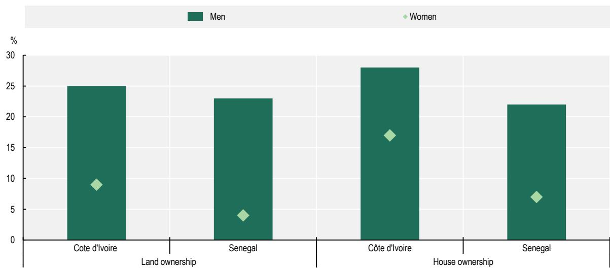  
Source: OECD (2026[6]), OECD Masculinities Database for Côte d'lvoire, https://data-explorer.oecd.org/s/4sy; OECD (2025[31]), SIGI Country Profile: Senegal.

At the same time, attitudes towards women's rights to own and inherit assets in Côte d'Ivoire appear relatively progressive compared with views on women's participation in other economic domains. A majority of respondents (59%) believe that women should have the same rights as men to own land (as also set by the Constitution of the Republic of Côte d'Ivoire from 2016 and amended in 2020 (UN Women, 2026[32]), and 64% support equal inheritance rights for daughters and sons. This suggests that support for gender equality in asset rights is stronger at the level of stated norms than in actual practice. As also observed in the OECD SIGI Côte d'Ivoire report, comparatively favourable attitudes towards women's property and inheritance rights coexist with wide gender gaps in asset ownership, pointing to the persistence of customary succession rules, unequal intra-household power relations and social norms that continue to privilege men's control over productive assets (OECD, 2022[33]). This is also reflected in the analysis presented in the previous section on women's role in decision-making over agricultural inputs. Although women and men may formally enjoy the same ownership rights, these rights do not necessarily translate into equal control and management over productive assets in practice. Women tend to have greater influence over day-to-day production decisions, while men retain stronger authority over commercial crop production and the use of agricultural income within the household.

In Senegal, this pattern may take a somewhat different form. Qualitative research suggests that the expectation that men should control household assets, including land, is not a central element of dominant masculinities. Persistent gender gaps in asset ownership may therefore be sustained less by explicit normative support for male control over property and more by broader inheritance practices, household bargaining dynamics and institutional constraints. This occurs despite the fact that women and men have equal legal rights to own property and land (UN Women, 2026[34]). At the same time, Muslim succession rules and customary practices continue to influence the distribution and management of assets, including land, in practice (World Bank, 2024[35]). This distinction is important for policies: while norm change remain relevant, improving women's control over land and other productive assets also requires addressing legal implementation gaps, customary practices, administrative barriers and women's access to credit and financial services.

## Conclusion and policy recommendations

The evidence presented in this chapter shows that women in Côte d'Ivoire and Senegal continue to face significant and persistent inequalities in economic empowerment and outcomes. Gender gaps in labour force participation remain substantial and, even when women are employed, they are often concentrated in more constrained forms of work, including informal, lower-paid and less secure jobs. Women also face limits in their ability to make decisions, especially within households, exercise control over their income, and own productive assets such as land.

OECD findings suggest that restrictive masculinities are an important constraint on women's economic empowerment. Norms that position men as primary providers, decision makers, asset holders and figures of authority can reduce women's employment prospects, limit their control over income and assets, and weaken their role in household decision-making. These effects are particularly visible in better-off households, where there may be greater economic room to conform to male breadwinner norms. At the same time, women's economic outcomes are shaped not only by gender norms, but also by education, local labour market conditions, access to productive resources and care responsibilities as well as restrictive formal and informal laws over the inheritance or access to land and non-land assets.

The burden of unpaid care and domestic work is a particularly important pathway through which restrictive masculinities constrain women's economic opportunities. Where restrictive norms are more strongly endorsed, women tend to spend more time on unpaid care and domestic work, reducing the time, flexibility and mobility needed to access decent work, training, entrepreneurship and career progression. Overall, the findings show that women's economic participation does not automatically translate into empowerment when unequal norms, care responsibilities and institutional barriers continue to limit women's agency and control over resources.

## Moving forward: Policy priorities

Addressing restrictive gender norms should be part of broader strategies to advance women's economic empowerment and requires co-ordinated action across multiple actors. Norm-change efforts are most effective when combined with structural reforms that expand women's access to decent work, reduce unpaid care burdens, strengthen control over resources, including inheritance and create enabling institutional conditions. Governments, parliaments and relevant public institutions in both countries should establish and enforce enabling policies and legal frameworks, while communities and civil society organisations play a central role in driving norm change and ensuring local ownership. Development partners and donors can reinforce these efforts through financing and technical assistance, and the media can influence public attitudes and visibility of gender issues. Specific policy priorities in this comprehensive agenda include:

\- Recognise, reduce, and redistribute unpaid care and domestic work. Governments should strengthen policies and services that reduce women's unpaid work burden, including affordable and quality childcare services, early childhood education, parental leave policies, and investments in labour-saving infrastructure. These measures should be accompanied by awareness-raising initiatives and community programmes that encourage men's participation in caregiving and domestic work, helping to reduce the time constraints that limit women's economic opportunities. In addition, policies should recognise the economic value of unpaid care work by improving women's access to social protection, insurance and pension schemes, including for those who remain outside the formal labour market due to care responsibilities.

\- Transform restrictive gender norms and promote positive masculinities. Programmes aimed at changing restrictive norms should engage both women and men, as well as families, schools, communities, employers and local leaders. Community-based initiatives, educational programmes and public awareness campaigns can help promote more equitable understandings of masculinity based on shared economic responsibilities, joint decision-making, care, respect and non-violence. Such interventions are particularly important during early stages of socialisation, when attitudes towards gender roles are formed.

\- Strengthen women's access to productive assets, particularly land and credit. Improving women's access to and control over productive assets is critical for strengthening their economic security, bargaining power and ability to invest in income-generating activities. This requires effective implementation of existing statutory legal frameworks on inheritance, property and marital rights, alongside measures to address customary practices, administrative barriers and unequal household bargaining dynamics. Expanding women's access to credit, financial services and land registration support is also essential.

\- Invest in women's skills, capacities and economic agency. Training in foundational and other skills, entrepreneurship, project management, financial literacy and income-generating activities can strengthen women's ability to benefit from economic opportunities. Such support should be linked to practical measures that enable women to apply these skills, including access to information, finance, markets, mentoring, networks and business development services. Programmes should also aim to strengthen women's agency, confidence and decision-making power, rather than focusing only on technical skills. Given women's concentration in specific sectors, training should avoid reinforcing labour market segregation and instead expand women's access to higher-productivity and non-traditional sectors through targeted training, certification, apprenticeships, and links to employers and value chains.

\- Mainstream women's economic empowerment across national policies, budgets and local development strategies. Women's economic empowerment should be integrated across employment, agriculture, education, social protection, care, finance (especially access to credit and financial literacy) and private sector development policies. Policy responses should recognise the diversity of economic contexts across regions. In areas where informal activities and agriculture dominate, interventions may need to focus on improving productivity, access to social protection schemes, access to markets, financial services and the business environment. In more urbanised contexts, policies addressing barriers to formal employment, career progression and leadership opportunities may be particularly important.

Afrobarometer (2022), Senegal Round 9 data (2022). [10]

Agarwal, B. (1994), A Field of One's Own: Gender and Land Rights in South Asia, Cambridge University Press, https://www.cambridge.org/core/books/field-of-ones-own/4F8F9B2FFE77ECB16BCC634D97738FFA.

## References

Agence Nationale de la Statistique et de la Démographie (2022), Enquête Nationale sur l'Emploi du Temps au Sénégal, Ministère de l'Economie, du Plan et de la Coopération, République du Sénégal, https://www.ansd.sn/sites/default/files/2023-04/RAPPORT\_ENET\_2021.pdf.

Akua Duncan, B. and C. Brants (2004), Access To and Control Over Land From a Gender Perspective: A Study Conducted in the Volta Region of Ghana, https://openknowledge.fao.org/items/177ccacd-596b-430f-8edf-bab9bb088f2c.

Aser, J. and E. Seri (2023), “Women: guardians of water and cultural link amid drinking water scarcity in Gboguhé Sub-Prefecture, Central-West Côte d’Ivoire”, Discover Water 2023 3:1, Vol. 3/1, pp. 19-, https://doi.org/10.1007/S43832-023-00043-Z.

Chopra, D. and E. Zambelli (2017), No Time to Rest: Women's Lived Experiences of Balancing Paid Work and Unpaid Care Work, https://opendocs.ids.ac.uk/articles/online\_resource/No\_Time\_to\_Rest\_Women\_s\_Lived\_Experiences\_of\_Balancing\_Paid\_Work\_and\_Unpaid\_Care\_Work/26440183?file=48088708 (accessed on 4 May 2026).

Deere, C. and C. Doss (2006), “The Gender Asset Gap: What do we know and why does it matter?”, Feminist Economics, Vol. 12, https://doi.org/10.1080/13545700500508056.

DHS Côte d'Ivoire (2021), Standard DHS, Phase 8, https://dhsprogram.com/methodology/survey/survey-display-559.cfm.

DHS Senegal (2023), Continuous DHS, Phase 8, [4] https://dhsprogram.com/methodology/survey/survey-display-611.cfm.

Donald, A., G. Lawin and L. Rouanet (2024), “Gender differences in agricultural productivity in Côte d’Ivoire: Distribution, drivers, and changes over time”, Canadian Journal of Agricultural Economics, Vol. 72/1, pp. 77-100, https://doi.org/10.1111/CJAG.12352;WGROUP:STRING:PUBLICATION.

Doss, C. et al. (2015), “Gender inequalities in ownership and control of land in Africa: myth and reality”, Agricultural Economics, Vol. 46/3, https://doi.org/10.1111/agec.12171. [33]

GIZ (2021), Climate Risk Profile: Côte d'Ivoire Summary, https://www.pik-potsdam.de/en/institute/departments/climate-resilience/projects/project-pages/agrica/giz\_climate-risk-profile-cote-d2019ivoire\_en\_final\_2 (accessed on 2 June 2026).

Goldin, C. (1994), The U-Shaped Female Labor Force Function in Economic Development and Economic History, https://www.nber.org/papers/w4707 (accessed on 1 June 2026). [13]

Gueguen, C., V. Lepine and M. Mattern (2023), In Senegal, Supporting Rural Women Starts with Reshaping Gender Norms, https://www.cgap.org/blog/in-senegal-supporting-rural-women-starts-with-reshaping-gender-norms (accessed on 6 May 2026).

[3] ILO (2024), Country Profile: Senegal, https://ilostat.ilo.org/data/country-profiles/sen/ (accessed on 22 April 2026).

[2] ILO (2022), Country Profile: Côte d'Ivoire, https://ilostat.ilo.org/data/country-profiles/civ/ (accessed on 22 April 2026).

[8] ILO (2018), Care work and Care Jobs for the Future of Decent Work, https://www.ilo.org/publications/major-publications/care-work-and-care-jobs-future-decent-work (accessed on 1 June 2026).

[12] ILO (2022; 2024), ILOSTAT data explorer, https://ilostat.ilo.org/data/ (accessed on 5 May 2026).

[14] Kabeer, N. (2012), Women's economic empowerment and inclusive growth: labour markets and enterprise development, Centre for Development Policy & Research; School of Oriental & African Studies, University of London, https://soas-repository.worktribe.com/output/384662/womens-economic-empowerment-and-inclusive-growth-labour-markets-and-enterprise-development.

[21] Kalsi, K. and F. Memon (2020), Women's Economic Empowerment in Côte d'Ivoire, https://assets.publishing.service.gov.uk/media/6051c4c6e90e0752897ab0f6/Query-55-WEE-in-Cote-D\_Ivoire.pdf (accessed on 2 June 2026).

[11] Lozano, L., E. Ranehill and E. Reuben (2023), "Gender and Preferences in the Labor Market: Insights from Experiments", Handbook of Labor, Human Resources and Population Economics, pp. 1-34, https://doi.org/10.1007/978-3-319-57365-6\_118-1.

[20] Marston, A. (2016), Women's Rights in the Cocoa Sector: Examples of emerging good practice, https://oxfamilibrary.openrepository.com/server/api/core/bitstreams/9d413521-2ec9-4494-bdd2-abd7e9dbabbd/content (accessed on 3 June 2026).

[24] MENAET (2019), Profile of pre-primary provision in Abidjan and Bouaké, Education Partnerships Group, https://curated-library.iiep.unesco.org/library-record/profile-pre-primary-provision-abidjan-and-bouake-review-and-policy-implications.

[7] OECD (2026), Key Indicators of Informality based on Individuals and Households (KIIbIH) Database, https://data-explorer.oecd.org.

[6] OECD (2026), OECD Masculinities Database for Côte d'Ivoire, Nationally representative household survey on masculine norms conducted by the OECD and ANStat, https://data-explorer.oecd.org/s/4sy.

[27] OECD (2026), Qualitative evidence on masculine norms in Senegal, Key informant interviews and participatory workshop facilitated by the OECD and the Department for Gender Equity and Equality, Ministry of Family, Social Action and Solidarity in Senegal.

[35] OECD (2025), SIGI Country Profile: Senegal, https://webfs.oecd.org/devsigi/SIGI%202023%20Country%20Profiles/Africa/country\_profile\_SEN\_Senegal.pdf.

[15] OECD (2023), SIGI 2023 Global Report, https://www.oecd.org/content/dam/oecd/en/publications/reports/2023/07/sigi-2023-global-report\_a65d7f7f/4607b7c7-en.pdf.

OECD (2022), Institutions sociales et égalité femmes-hommes en Côte d'Ivoire: Rapport pays SIGI, Éditions OCDE, Paris, https://doi.org/10.1787/c798990a-fr. [37]

OECD (2022), SIGI Country Report for Tanzania, Social Institutions and Gender Index, OECD Publishing, Paris, https://doi.org/10.1787/06621e57-en. [18]

OECD (2022), Social Institutions and Gender Equality in Côte d'Ivoire: SIGI Country Report, Éditions OCDE, https://doi.org/10.1787/c798990a-fr. [34]

OECD (2021), Man Enough? Measuring Masculine Norms to Promote Women's Empowerment, [26] Social Institutions and Gender Index, OECD Publishing, Paris, https://doi.org/10.1787/6ffd1936-en.

OECD (2019), Enabling Women's Economic Empowerment: New Approaches to Unpaid Care Work in Developing Countries, OECD Publishing, Paris, https://doi.org/10.1787/ec90d1b1-en. [9]

Oropesa, R. (1993), “Using the service economy to relieve the double burden”, https://journals.sagepub.com/doi/pdf/10.1177/019251393014003006 (accessed on 4 May 2026).

UN Women (2026), Global Gender Equality Constitutional Database - Constitution of the Republic of Côte d'Ivoire, https://constitutions.unwomen.org/en/countries/africa/cote-divoire (accessed on 3 June 2026). [36]

UN Women (2026), Global Gender Equality Constitutional Database - Senegal, [38] https://constitutions.unwomen.org/en/countries/africa/senegal (accessed on 3 June 2026).

World Bank (2026), Gross enrollment rate, early childhood education (%), [25] https://humancapital.worldbank.org/en/indicator/WB\_HCP\_ECEDU (accessed on 5 May 2026).

World Bank (2026), World Development Indicators, https://databank.worldbank.org/source/world-development-indicators. [1]

World Bank, T. (2024), Land rights and gender inequality in Senegal, http://www.worldbank.org. [39]

## Notes

$^{1}$ These results are based on a logit model estimated using a subsample of working-age women and men. The dependent variable is a binary indicator equal to 1 if the individual is employed and 0 otherwise. The main explanatory variable is an interaction between the OECD Masculinities Index, an individual continuous measure ranging from 0 to 100 (with higher values indicating more restrictive masculinity norms), and a gender indicator equal to 1 for women and 0 for men. This interaction term makes it possible to assess whether the association between restrictive masculinity norms and employment status differs between women and men. The model controls for age, education level, income, marital status, religion, whether the individual has biological children, and area of residence. In addition, area fixed effects are included to account for unobserved differences across areas in Côte d'Ivoire. The analysis is also extended to examine specific normative dimensions in order to identify which norms are most strongly associated with women's employment. In these extensions, the OECD Masculinities Index is replaced by measures specific to each norm, defined at the individual level and ranging from 0 to 100, with higher values reflecting more restrictive masculinity norms.

$^{2}$ These results are based on a logit model estimated using a subsample of working-age women and men, for which the dependent variable is a binary indicator equal to 1 if the individual is out of the labor force and 0 otherwise. An individual is considered out of the labor force if they are of working age, are not employed, and have neither been available for work nor undertaken any job search activities in the past four weeks. The main explanatory variable is a triple interaction. The first component is the OECD Masculinities Index, a continuous measure ranging from 0 to 100 (with higher values indicating more restrictive masculinity norms). The second component is a gender indicator equal to 1 for women and 0 for men. The third component captures household income level, measured using monthly household expenditures and categorised into low-expenditure households and middle- and high-expenditure households, with the latter two categories combined due to the small proportion of high-expenditure households (1% of the sample). This interaction term makes it possible to assess whether the association between restrictive masculinity norms and labor force participation differs between women and men across income levels. The model controls for age, education level, income, marital status, religion, whether the individual has biological children, and area of residence, with area fixed effects included to account for unobserved differences across areas in Côte d'Ivoire. As before, the analysis is extended to examine specific normative dimensions to identify the norms most strongly associated with women's labour force participation. In these extensions, the OECD Masculinities Index is replaced by measures specific to each norm, ranging from 0 to 100, with higher values reflecting more restrictive masculinity norms.

$^{3}$ This result is based on an ordinary least squares (OLS) regression model using the full sample of women and men. The dependent variable is the total number of minutes per week spent on unpaid care and domestic work, including but not limited to cooking, cleaning, and childcare. The main explanatory variable the OECD Masculinities Index, a continuous individual level measure ranging from 0 to 100 where a higher value indicates more restrictive masculine norms. The model controls for age, level of education, income, marital status, religion, having biological children, and area of residence. In addition, zone fixed effects are included to capture unobserved differences across zones in Côte d'Ivoire.

$^{4}$ These results are based on a multinomial logit model estimated using the full sample of women and men. The dependent variable identifies the main decision maker for specific household decisions, distinguishing between decisions made solely by a man, solely by a woman, or jointly by a man and a woman. Separate regressions are estimated for each decision type, namely major household purchases, day to day household purchases, health related care, investment in children's education, and decisions to borrow money or goods. The key explanatory variable is an interaction between the OECD Masculinities Index, a continuous individual level measure ranging from 0 to 100 where a higher value indicates more restrictive masculine norms, and a sex dummy equal to 1 for women and 0 for men. This interaction term shows whether the association between restrictive masculine norms and household decision making differs between women and men. The model controls for age, level of education, income, marital status, religion, having biological children, and area of residence. In addition, zone fixed effects are included to capture unobserved differences across zones in Côte d'Ivoire. The analysis is further extended to examine specific normative dimensions to identify which norms are most strongly associated with women's decision-making. In these extensions, the OECD Masculinities Index is replaced by each norm specific measure, which is defined at the individual level and ranges from 0 to 100, with a higher value reflecting more restrictive masculine norms.

and 0 otherwise, meaning that income use is constrained by others or by family and community expectations. The key explanatory variable is an interaction between the OECD Masculinities Index, a continuous individual level measure ranging from 0 to 100 where a higher value indicates more restrictive masculine norms, and a sex dummy equal to 1 for women and 0 for men. This interaction term shows whether the association between restrictive masculine norms and household decision making differs between women and men. The model controls for age, level of education, income, marital status, religion, having biological children, and area of residence. In addition, zone fixed effects are included to capture unobserved differences across zones in Côte d'Ivoire. The analysis is further extended to examine specific normative dimensions to identify which norms are most strongly associated with women's financial autonomy. In these extensions, the OECD Masculinities Index is replaced by each norm specific measure, which is defined at the individual level and ranges from 0 to 100, with a higher value reflecting more restrictive masculine norms.

$^{6}$ These results are based on a logit model estimated using the full sample of women and men. The dependent variable is a binary indicator equal to 1 if the respondent owns or co-owns a land cultivated by the household and 0 otherwise. The key explanatory variable is an interaction between the OECD Masculinities Index, a continuous individual level measure ranging from 0 to 100 where a higher value indicates more restrictive masculine norms, and a sex dummy equal to 1 for women and 0 for men. This interaction term shows whether the association between restrictive masculine norms and land ownership differs between women and men. The model controls for age, level of education, income, marital status, religion, having biological children, and area of residence. In addition, zone fixed effects are included to capture unobserved differences across zones in Côte d'Ivoire. The analysis is further extended to examine specific normative dimensions to identify which norms are most strongly associated with women's land ownership. In these extensions, the OECD Masculinities Index is replaced by each norm specific measure, which is defined at the individual level and ranges from 0 to 100, with a higher value reflecting more restrictive masculine norms.

# Transforming masculinities to prevent gender-based violence

This chapter presents new evidence on the relationship between masculine norms and gender-based violence (GBV), drawing on the OECD's research in Côte d'Ivoire and Senegal. After outlining the prevalence of GBV, the chapter empirically assesses how adherence to masculine norms shapes individuals' likelihood of experiencing or perpetrating GBV. It then examines additional social and structural drivers that foster environments of impunity in which violence can be perpetrated repeatedly despite existing legal and institutional frameworks to fight GBV. The chapter concludes by outlining policy recommendations emphasising the need to promote positive masculinities to prevent GBV more effectively.

## In brief

## Key findings on the linkages between masculinities and gender-based violence

\- A paradigm shift is needed to better prevent and end GBV, given persistently high prevalence in Côte d'Ivoire and Senegal. New OECD Development Centre survey data show that around 30% of women and 20% of men in Côte d'Ivoire have experienced intimate partner violence (IPV) at least once in their lifetime. In Senegal, official data indicate that 70% of women have experienced IPV since their first union. Despite methodological differences, both estimates underscore the widespread nature and significant burden of IPV. Promoting positive masculine norms should be leveraged more systematically as part of GBV prevention strategies.

\- Positive masculinities can reduce the likelihood of violence perpetration. Evidence from Côte d'Ivoire shows that men who endorse restrictive masculine norms are more likely to perpetrate violence, while men who hold more equitable views are less likely to do so. At the same time, these norms do not predict who experiences violence, reflecting the ubiquitous nature of GBV.

\- Pressure on men to fulfil social expectations can heighten the risk of their using violence, particularly where rigid masculine norms are strong. This is especially the case when men face difficulties meeting expectations linked to their role as financial provider.

\- Reported prevalence is likely to understate the true scale of GBV. Shame, stigma, fear of retaliation and the view that violence is a “private matter” reduce disclosure and reporting. In Senegal, for instance, 44% of the population consider domestic violence to be a private family issue.

\- Different forms of violence often overlap, and violence is frequently recurrent. In Côte d'Ivoire, more than two-thirds of IPV victims/survivors $^{1}$ report having experienced violence several times a month or more in the past 12 months. This suggests that violence is rarely an isolated incident but often forms part of ongoing dynamics of control and abuse within relationships.

\- GBV also extends beyond domestic and intimate partner contexts. In Senegal, prevalence of non-IPV is particularly high, despite regional variations. Psychological and physical violence are the most common forms, while sexual abuse and harassment also remain serious concerns for women's health and integrity.

\- Witnessing intimate partner violence as a child can shape attitudes and behaviour later in life. Prevention efforts should therefore start early and include family settings, as evidence shows that individuals, and particularly men, who witnessed violence as children are more likely to justify or perpetrate violence in adulthood.

\- Overall, the evidence points to a dual challenge: GBV remains frequent and underreported, while restrictive masculine norms and weak accountability mechanisms increase the risk of perpetration. Preventing and ending GBV therefore requires both shifting harmful norms and strengthening trusted reporting, justice and survivor support pathways.

Gender-based violence (GBV) remains widespread across countries, despite progress in legal frameworks, greater awareness and support services for survivors. The OECD's work, particularly through the Social Institutions and Gender Index (SIGI), has shown that discriminatory social norms continue to shape both the prevalence of violence and the effectiveness of policy responses (OECD, 2023[1]; OECD,

2023[2]). These norms are not only reflected in laws, but also in everyday expectations about the roles of women and men. This includes expectations that position men as primary decision makers, providers, or figures of authority within the household and society. Looking at masculinities from this perspective helps to explain how some of these expectations, especially those related to control over women's choices and bodies or the acceptance of violence in certain situations, can contribute to environments where GBV is tolerated or minimised and reduce the effectiveness of prevention.

Drawing on evidence from Côte d'Ivoire and Senegal, this chapter examines how expectations placed on men shape patterns of violence perpetration and the broader social acceptance of violence. The analysis does not suggest a direct relationship between restrictive masculinities and who experiences violence. Rather, it shows how norms influence behaviour and contribute to environments in which violence is more likely to occur and less likely to be sanctioned. In these contexts, attitudes that reinforce men's dominance over women and that justify the use of violence for discipline and conflict resolution contribute to the normalisation of abusive behaviour. In such circumstances, and particularly when violence is seen as a private matter, accountability remains limited, weakening the deterrent effect of laws and creating additional barriers for survivors seeking support or justice.

The chapter's findings thus point to the need of strengthening prevention alongside existing support systems. Justice systems, legal protection and services for victims are essential, but they are unlikely to reduce GBV sustainably if the relevant social norms remain unchanged. Addressing expectations placed on men becomes therefore a central part of prevention as norms that associate masculinity with authority, control over women's behaviour and bodies, or the acceptability of violence shape attitudes long before violence occurs. Shifting these expectations can reduce social acceptance of violence, influence responses to relationship conflict, and increase the likelihood that abusive behaviour is questioned or sanctioned by peers and communities. This also helps create conditions in which survivors are more likely to seek support and in which institutions are more likely to respond effectively. In line with the African Union's agenda on ending violence against women and girls, efforts to support positive masculinities offer a practical entry point for preventing GBV by addressing its underlying drivers rather than its consequences.

## Gender-based violence is widespread and extends beyond intimate relationships

Nationally representative data from Côte d'Ivoire show that GBV is widespread and follows clear gendered patterns. While both women and men report experiencing violence, women are more frequently reported as victims, whereas men are more frequently reported as perpetrators. On average, 28% of women and 19% of men report having experienced intimate-partner violence (IPV) at least once in their lifetime. Important regional variations also emerge. Among women, reported prevalence ranges from around 17% in the South-West to over 40% in the North-East and South. For men, rates vary from 12% in the Centre to just over 40% in the North-East (Figure 5.1, Panel A).

IPV takes multiple forms which often overlap. Emotional or psychological violence (e.g. threats, constant criticism, insults or controlling behaviour) is the most commonly reported form, followed by physical violence and forced sexual relations, while economic violence (e.g. acts aimed at creating financial dependence by controlling access to money, sabotaging work, or preventing employment) is less frequently reported (Figure 5.1, Panel B). The data also point to the cumulative nature of abuse: nearly half of Ivorian women (45%) who report IPV have experienced multiple forms of violence, and a large majority (64%) indicate that incidents occur repeatedly, at least once or twice per month. These patterns suggest that violence is rarely isolated and instead forms part of ongoing dynamics within relationships.

Figure 5.1. Prevalence of intimate-partner violence varies by region and type of abuse in Côte d'Ivoire

Panel A. IPV lifetime prevalence by region and gender

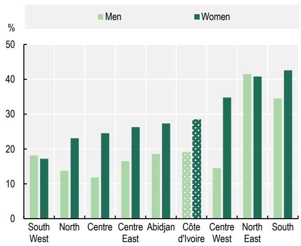  
Panel B. Types of IPV experienced among victims/survivors over lifetime

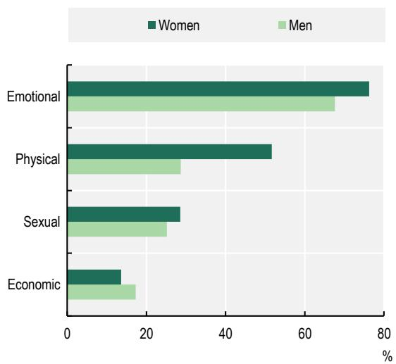  
Note: Gender differences by region are statistically significant at the 1% level. Gender differences by type of IPV are statistically significant at least at the 5% level, except for economic violence.  
Source: OECD (2026[3]), OECD Masculinities Database for Côte d'Ivoire, https://data-explorer.oecd.org/s/4sy.

Information on perpetrators of violence further underscores the gendered nature of GBV. In Côte d'Ivoire, 20% of men and 15% of women report having committed some form of violence against a spouse or partner in the past 12 months. While both women and men report engaging in emotional, physical, sexual and economic violence, men do so more frequently overall, and emotional violence is the most commonly reported form for both groups (Figure 5.2). Gender gaps in IPV perpetration are relatively small in the Centre, Centre-East and South, but markedly wider in the North-East and Centre-West.

Violence occurring outside of intimate or marital relationships is also a significant concern, although less prevalent than IPV. In Côte d'Ivoire, 8% of women and men report having experienced physical and/or sexual violence by someone other than an intimate partner in the past 12 months. Sexual harassment is the most reported form, followed by physical violence and sexual abuse. $^{2}$ Patterns of perpetration broadly mirror these findings: 10% of men and 5% of women report having physically hurt, sexually harassed and/or abused someone other than an intimate partner over the past 12 months. The relatively small gap between IPV and non-IPV perpetration in the Centre and in Abidjan suggests a particular need to address violence beyond the private sphere in these areas (Figure 5.2).

Figure 5.2. Men are more often perpetrators of violence than women in Côte d'Ivoire

Share of women and men in Côte d'Ivoire declaring to have committed intimate and non-intimate partner violence over the past 12 months, national and regional levels

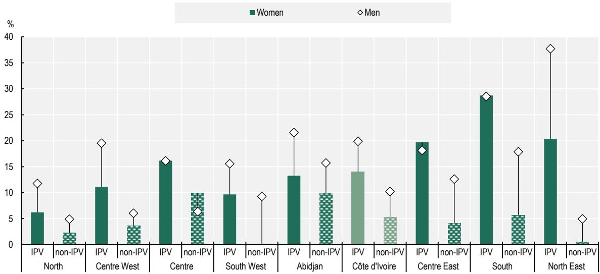  
Note: IPV refers to intimate partner violence and non-IPV refers to acts of violence committed outside of intimate relationships. Source: OECD (2026[3]), OECD Masculinities Database for Côte d'Ivoire, https://data-explorer.oecd.org/s/4sy.

Available data from Senegal also point to high levels of violence against women, although the estimates are not directly comparable with those from Côte d'Ivoire or latest available SDG data because of differences in data sources, definitions and reference periods. $^{3}$ In particular, the available SDG IPV estimates for Senegal from 2018 only consider sexual and/or physical violence (UN Women, n.d. $^{[4]}$ ), whereas the more recent national estimates from 2024 include also psychological and economic violence. According to these data, 70% of women in Senegal have experienced IPV at least once since their first union, and 22% in the past 12 months (ANSD, 2024 $^{[5]}$ ). The high lifetime prevalence is driven primarily by psychological violence, reported by 61% of women, while physical, sexual and economic violence are reported at substantially lower levels, ranging from 8% to 30% (Figure 5.3). As in Côte d'Ivoire, prevalence varies substantially across regions. Rates are highest in Matam (85%), followed by Thiès, Louga, and Tambacounda (each above 70%), while Kaffrine records the lowest prevalence of IPV (49%) (ANSD, 2024 $^{[5]}$ ).

Violence outside intimate relationships is very widespread in Senegal. On average, about 90% of women report having experienced such violence over their lifetime and 22% in the past 12 months, with important regional variations ranging from 8% in Fatick to 39% in Diourbel (ANSD, 2024[5]). Psychological violence is the most commonly reported form, while economic and sexual violence are reported at much lower levels (Figure 5.3). Available data also indicate that physical violence outside intimate relationships is most often perpetrated by family members, including siblings and parents, as well as by friends (ANSD, 2024[5]). Additional evidence points to specific vulnerabilities among younger women. Most women who have experienced any form of non-IPV over their lifetime were exposed to it before the age of 18. Digital violence also appears widespread, with 20% of women below the age of 18 reporting experience of digital violence (ANSD, 2024[5]).

Figure 5.3. Psychological and physical violence are the most common forms of violence against women in Senegal

Forms of violence women endure over their lifetime or in the past 12 months within or outside of intimate relationships (IPV or non-IPV)

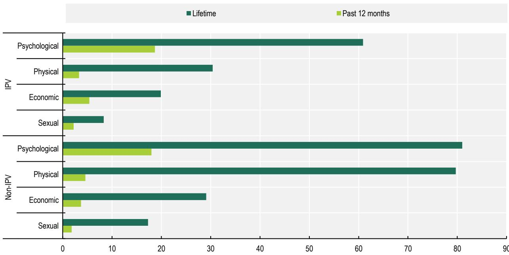  
Note: IPV refers to intimate partner violence and non-IPV refers to acts of violence experienced outside of intimate relationships. Lifetime prevalence for different types of IPV is calculated since the woman's first union.
Source: Authors' own elaboration based on ANSD (2024[5]), Enquête nationale de référence sur les violences faites aux femmes.

## Box 5.1. Data sources and comparability

This chapter combines different types of evidence from Côte d'Ivoire and Senegal. For Côte d'Ivoire, it draws primarily on national representative, original household survey data collected for this report, which include information on attitudes towards masculinities, experiences of violence, and self-reported perpetration (see Chapter 2). For Senegal, it relies on secondary quantitative sources together with qualitative evidence from key informant interviews and participatory discussions (see Chapter 3).

These data are complementary but not fully comparable. Differences in methodology, definitions, indicators, and reference periods mean that prevalence estimates should be interpreted with caution across countries and studies. In this chapter, the Côte d'Ivoire data are used mainly to examine patterns of violence and perpetration, while the Senegal evidence provides additional insights into social norms, reporting behaviours, and the broader context in which violence occurs. For both countries, national experts were consulted to contextualise the data results.

Across both Côte d'Ivoire and Senegal, the available evidence points to high levels of violence against women, within and outside intimate relationships, while also highlighting important differences in how such violence is experienced and reported. Prevalence rates should, however, be interpreted with caution across countries, as they are shaped by differences in data sources, definitions, and reporting contexts. Similar caution is needed when examining regional variations in perpetration rates, since self-reported data are sensitive to social desirability bias, differences in how violent behaviours are understood, and the aggregation of diverse forms of violence. These factors may influence both reporting patterns and the comparability of findings across settings.

## Shame, social pressure and acceptance of violence limit reporting and obscure the full scale of gender-based violence

To understand the full scale of GBV, it is necessary to look beyond prevalence alone and consider how social and institutional factors influence whether violence is recognised, disclosed and addressed. In both Côte d'Ivoire and Senegal, a range of social and institutional factors limits reporting and obscures the full magnitude of gender-based violence. Shame, stigma, fear of retaliation, social pressure to remain silent, and limited trust in public authorities all shape whether victims seek support or turn to formal complaint mechanisms (OECD, 2023[2]). Available data are therefore likely to underestimate the prevalence of violence, particularly where certain forms of abuse are normalised or treated as private matters.

Evidence from Senegal illustrates these dynamics clearly. Afrobarometer data show that 46% of the population believe that women would likely be criticised or harassed if they reported experiences of GBV, while 44% consider domestic violence to be a private matter that should be resolved within the family (Afrobarometer, 2022[6]). Data from a 2023 survey supports this, finding that most survivors do neither seek medical assistance, psychological support or alert the policy (Tine et al., 2026[7]). Qualitative evidence points in the same direction, highlighting shame, concerns about preserving family honour, and limited knowledge of legal rights as important barriers to disclosing and reporting violence to appropriate authorities (OECD, 2026[8]). These findings help explain why reported prevalence may not fully reflect the scale of violence, or specific types of violence, even in a context where available survey data already point to high levels of abuse.

Comparable patterns are observed in Côte d'Ivoire. Afrobarometer data indicate that the main perceived reasons for not reporting violence are a preference for amicable settlement (34%), fear of retaliation in case of reporting (26%), shame (17%), lack of knowledge of legal rights or procedures (11%), and social pressure to remain silent (11%). In addition, only 17% of the population think that victims will likely file a complaint with the relevant institutions (Afrobarometer, 2024[9]). Differences between reported prevalence and public perceptions further suggest that some forms of violence are more widely recognised than they are formally reported. For example, 26% of the population believe that women are often or always harassed in public places, while 38% think that girls and young women often or always face discrimination or harassment in educational settings. Yet, on average, only 6% of women in Côte d'Ivoire declare having experienced from sexual harassment (OECD, 2026[3]).

Beyond reporting, social norms also shape the degree to which violence is tolerated or justified. In Côte d'Ivoire, 30% of both women and men agree that a man has the right to hit or physically hurt his wife under at least one circumstance – i.e. when she burns the food, argues with him, does not take good care of the children, goes out without his permission or refuses to have sex with him (OECD, 2026[3]). In Senegal, 21% of women and 14% of men agree with such a statement, revealing important gender gaps in attitudes compared to more homogenous views in Côte d'Ivoire (ANSD; The DHS Program, 2023[10]). This pattern of more women than men justifying men's use of violence holds for most circumstances in Senegal, except for arguing or going out without the husband's permission for which the gender gap in attitudes is reversed. Conversely, in Côte d'Ivoire, men's and women's views are closely aligned for any situation. Refusal of sex is the most accepted justification for men's use of violence in Senegal contrarily to Côte d'Ivoire where this is the least frequently selected case after burning the food (Panel A, Figure 5.4). A perception survey conducted among Senegalese youth also finds that sexual violence within intimate relationships is largely accepted in contrast to abuse occurring outside of such relationships (van Tuijl et al., 2025[11]).

Acceptance of physical IPV also varies across regions, suggesting that violence is embedded in local normative environments and that the social tolerance of abuse is stronger in some settings than in others. For instance, in Côte d'Ivoire regional rates range from just over 15% in the South to around 40% in the North-East and North (Panel B, Figure 5.4). In Senegal, the share of women justifying men's use of violence at least under one circumstance varies from 55% in Fatick to 90% in Ziguinchor (ANSD; The DHS Program, 2023[10]). Such attitudes matter because they shape not only whether violence is perpetrated, but also whether it is reported, condemned and sanctioned. $^{4}$ Where violence is seen as normal, justified or best handled within the family, survivors face greater barriers to seeking support and perpetrators are less likely to face social or institutional consequences. The same norms that limit the visibility of violence can also shape the behaviours through which violence is committed.

Figure 5.4. A non-negligible share of the population justifies men's use of violence  
Panel A. Agreement that a man can physically hurt his wife in Côte d'Ivoire or Senegal if she ...  
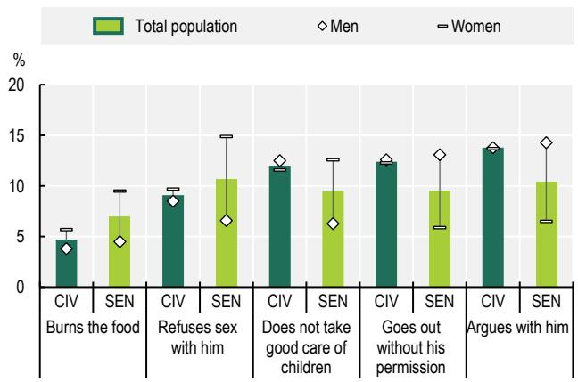

Panel B. Justification of male violence at least under one circumstance in Côte d'Ivoire, by region and gender  
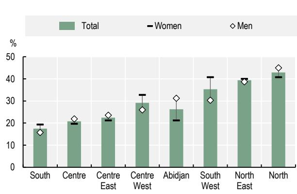  
Note: Panel A indicates the share of the population (total, women, men) in Senegal (SEN) and Côte d'Ivoire (CIV) agreeing that a man has the right to beat, slap, kick or physically hurt his wife or partner if she burns the food; argues with him; goes out without telling him or asking for his permission; does not take good care of their children; or refuses to have sexual relations with him. Panel B indicates the share of the population (total, women, men) in Côte d'Ivoire by region who agree that a man can physically hurt his wife or partner at least under one of the circumstances mentioned for Panel A.  
Source: OECD (2026[3]), OECD Masculinities Database for Côte d'lvoire, https://data-explorer.oecd.org/s/4sy; ANSD (2023[10]), Enquête Démographique et de Santé continue 2023.

## Restrictive masculinities explain perpetration, not victimisation

The evidence from Côte d'Ivoire shows that restrictive masculinities help understand patterns of violence perpetration rather than victimisation. This does not imply that all men who endorse such norms perpetrate violence, nor that violence is committed only by men. Rather, it suggests that adherence to norms emphasising male authority, control over women and rigid gender roles can increase the likelihood of violent behaviour in some circumstances.

Existing literature often suggests that women who internalise norms emphasising male authority and female subordination may be more vulnerable to violence, as such norms can normalise unequal power relations and reduce women's ability to recognise, resist or report abuse (Bernard, Bernard and Bernard, 1985[12]). The findings presented here, however, do not show a statistically significant relationship between women's overall endorsement of restrictive masculinities and their likelihood of experiencing IPV. This does not mean that masculine norms are irrelevant to women's experiences of violence. Rather, it suggests that victimisation is shaped by a broader set of interacting factors and cannot be explained by women's attitudes towards masculinity alone. This is in line with ecological approaches conceptualising violence as a multifaceted phenomenon, emphasising the role of individual, relational, community and structural determinants (Heise, 1998[13]).

Other socio-demographic factors offer more insight into who may be at greater risk of experiencing violence. In Côte d'Ivoire, women who are employed and women who live in rural areas report higher rates of IPV, while women with higher levels of education are less likely to have experienced such violence (OECD, 2026[3]). In Senegal, a study found that women working in the informal sector are more likely than those in the public sector to experience physical violence (Tine et al., 2026[7]). These patterns point to the importance of structural and relational dynamics beyond individual beliefs. For example, resource theory suggests that shifts in women's economic position may challenge established power relations within couples, potentially triggering violent reactions among men to reassert control; particularly in contexts where norms around male authority remain strong (Macmillan and Gartner, 1999[14]). Rural residence may also be associated with greater acceptance of discriminatory norms and more limited access to legal protection and support services. By contrast, education can strengthen awareness of (legal) rights, increase autonomy, and improve access to information and support systems (Weitzman, 2018[15]).

A different picture emerges when looking at perpetration of violence. Among men, endorsement of restrictive masculinities is significantly associated with a higher likelihood of perpetrating violence against a wife or intimate partner, not only once but also repeatedly. This is also the case for violence committed outside the context of intimate relationships. Conversely, men who hold less restrictive views of masculinity are less likely to use violence against women. $^{5}$ The data further confirm that the relationship between restrictive masculinities and violence perpetration holds across most dimensions of the OECD Masculinities Index, except for final decision-making power, where very little variation in people's responses prevent obtaining a statistically significant result. $^{6}$ Understanding how restrictive masculinities operate is thus crucial to understand who is more likely to commit GBV rather than predicting who experiences it.

The analysis also sheds light on the mechanisms through which restrictive masculinities may translate into violent behaviour. Men who strongly endorse expectations around authority, provision and sexual performance may feel pressure to demonstrate that they fulfil these roles. When these expectations are difficult to meet, some men may use violence as a way to reassert control or restore a sense of masculine identity. This is consistent with the concept of masculine gender-role stress, whereby perceived failure to meet socially valued standards of masculinity can generate frustration, shame or insecurity (Copenhaver, 2000[16]). It also aligns with research showing that threats to masculinity can increase the likelihood of controlling or violent behaviour where dominance is central to masculine identity (Fleming et al., 2019[17]).

This pattern is particularly visible in relation to men's economic role. In Côte d'Ivoire, men who report that they would feel stressed if unable to provide for their family are more likely to perpetrate IPV, particularly over the previous 12 months. $^{7}$ Men who say they would feel ashamed if they earned less than their wife are also more likely to report lifetime and repeated perpetration of IPV. Looking specifically at the breadwinner norm points in the same direction: men's stronger endorsement of the view that they should provide for their family is associated with a higher likelihood of men committing IPV. This finding should, however, be interpreted with caution, given the limited variation in men's responses regarding support for the breadwinner norm. $^{8}$

Pressure linked to expectations about intimate relationships also matters. Men who agree that they should feel embarrassed if they do not perform well sexually, and simultaneously endorse restrictive masculine norms, are more likely to perpetrate IPV. $^{9}$ Compared with financial stress, which appears to be more closely associated with recent perpetration of violence, pressure related to sexual performance seems to operate over a longer time horizon, as it is associated both with men committing violence in the previous 12 months but also across lifetime. This pattern suggests the interplay between economic pressures and violence are more short-term and context-specific (e.g. linked to unemployment or periods of economic insecurity), whereas expectations about men's sexuality are likely to be less sensitive to external conditions and can thus trigger violent behaviour across a larger time frame.

Overall, the findings from Côte d'Ivoire and Senegal are consistent with a growing body of research and carry important policy implications. Promoting positive forms of masculinity can reduce violence, shift attitudes about violence, and foster more gender-egalitarian attitudes (Pérez-Martínez et al., 2023[18]).

## Normalisation of violence and weak accountability allow abuse to persist

Restrictive masculinities are one important part of the broader set of factors shaping GBV, but they do not operate in isolation. Violence is also sustained by early exposure to abusive behaviour, a general normalisation of men's use of force, and weak institutional environments. Understanding this wider constellation of drivers is crucial given the persistence of GBV in Côte d'Ivoire and Senegal. The need for a broader rethinking of responses to GBV was also reflected in qualitative interviews in Senegal, given that despite sustained human and financial investments over several years, GBV prevalence remains alarmingly high (OECD, 2026[8]).

Childhood experiences are part of this wider picture, and evidence calls for violence prevention efforts to start at early ages. Data from Côte d'Ivoire indicates a significant association between witnessing IPV during childhood and later attitudes or behaviours related to perpetrating, justifying or experiencing such violence. $^{10}$ This relationship appears stronger for men than for women, suggesting that early exposure may play a more important role in shaping men's compared to women's likelihood of condoning or using violence in adulthood. $^{11}$ On average, 18% of the Ivorian population report having witnessed their mother being beaten by her husband or partner, and 32% saw their mother being verbally abused or humiliated as children (OECD, 2026 $[3]$ ). These findings are in line with the existing research showing that witnessing violence at young ages can not only shape individuals' perceptions on violence but are associated with perpetration and to a lesser extent victimisation (Wadji, Pirro and Langevin, 2024 $[19]$ ; Zhu et al., 2023 $[20]$ ; Curtis et al., 2022 $[21]$ ; Kimber et al., 2018 $[22]$ ).

The broader social acceptance of male authority and use of violence further contributes to an environment in which abuse can repeatedly occur with limited consequences for perpetrators. For instance, in Côte d'Ivoire, 54% of men and 45% of women agree that women cannot refuse to have sex with their husband or partner (OECD, 2026[3]). Such attitudes reflect acceptance of male dominance over women's sexual and reproductive autonomy and can create conditions in which coercion and violence are more likely to occur (Decker et al., 2021[23]; Katz et al., 2015[24]). In addition, overall acceptance of men's use of violence to solve conflicts or discipline their wives contribute to the persistence of GBV. In Côte d'Ivoire, 14% of the population agree that it is normal for a man to use violence or physical force to resolve conflict or assert his authority, and analysis shows that men who normalise the use of violence in such contexts are more likely to perpetrate IPV (OECD, 2026[3]). $^{12}$ In Senegal, one third of the population agrees that a man can use physical force to discipline his wife if she did something he dislikes or thinks is wrong (Afrobarometer, 2022[6]). These views are shared also among Senegalese youth considering IPV as a common reaction given men's perceived right to marital sexual relations (van Tuijl et al., 2025[11]).

The persistence of violence is also visible in its frequency, fuelled by harmful social norms and weak institutional support and redress systems. Among women who report having experienced IPV in Côte d'Ivoire, around two-thirds indicate that such violence occurred at least a few times per month, or even more often, in the previous 12 months. $^{13}$ Perpetrators thus face limited consequences for their behaviour and can repeatedly commit violence, despite recent legal reforms to define and criminalise domestic violence and strengthen support for survivors (Government of Côte d'Ivoire, 2021 $^{[25]}$ ; Government of Côte d'Ivoire, 2021 $^{[26]}$ ). $^{14}$ Stricter enforcement of existing laws and ensuring access to support systems appears to be key in breaking this cycle of offender impunity and repeated acts of violence. Notably, over half of the Ivorian population (53%) believes that the police should do more to protect women and girls from harassment in educational, workplace or public settings (Afrobarometer, 2024[9]).

Evidence from Senegal points to similar constraints and demands for concerted efforts to fight GBV. Almost three quarters (73%) of the population believe that the government should do more to promote women's rights (Afrobarometer, 2022[6]). While a similar share (76%) thinks that the police would take a woman who reports a rape or incident of domestic violence seriously (Afrobarometer, 2022[6]), qualitative interviews reveal that social pressure remains high, discouraging victims from officially reporting GBV incidents and seeking justice or support within public institutions (see above). The interviews further show that economic constraints and limited awareness of which forms of violent behaviour constitute a violation of rights limit the ability to seek justice or access support services (OECD, 2026[8]). These barriers reinforce the gap between the government's legal commitments and individuals' lived realities.

The available evidence therefore suggests that violence persists not only because harmful norms shape behaviour, but also because violence is too often tolerated, repeated and insufficiently sanctioned. This has important policy implications. A mix of measures is needed to prevent GBV incidents and enhance justice and support for victims. In addition to comprehensive legal frameworks, stronger accountability, and institutions that survivors trust and can access are needed. It also requires investing in prevention from an early age, challenging norms that legitimise men's authority and use of violence, strengthening the capacity of justice and service providers (including shelters, medical and psychological support, legal assistance etc.), and ensuring that female and male survivors can access timely and effective support.

## Conclusion and policy recommendations

The evidence from Côte d'Ivoire and Senegal shows that GBV remains widespread and takes multiple forms, both within and beyond intimate relationships. At the same time, prevalence data do not capture the full scale of the problem. Shame, social pressure, fear of retaliation, and the perception that violence is a private matter continue to discourage reporting and obscure the full scale of GBV.

The findings also suggest that masculine norms help explain patterns of perpetration more clearly than patterns of victimisation. In particular, stronger endorsement of restrictive masculinities is associated with a higher likelihood of committing violence especially where masculinity is closely tied to dominance, control, and sexual entitlement. For instance, the legitimisation or normalisation of men's use of violence to solve conflicts or discipline their wives/intimate partners is associated with greater risk of perpetration.

These findings have clear policy implications. Positioning positive masculinities at the centre of GBV prevention can help address the normative environments where violence is tolerated and rarely reported, condemned or sanctioned. Although legal and service-based responses are essential, they are unlikely to deliver lasting reductions in violence without parallel changes in the gender norms that legitimise male authority and use of violence. Preventing GBV therefore requires greater attention to the expectations placed on men and boys, including norms around decision making, conflict resolution, economic roles and sexual relations. Addressing these norms should start at early ages and be understood as part of a broader prevention agenda, not as a substitute for legal and institutional responses.

At the same time, stronger implementation and institutional accountability are indispensable. The evidence points to persistent barriers to reporting, limited trust in public institutions and weak deterrence for perpetrators. Strengthening the capacity of police, justice actors and service providers to respond effectively to GBV is therefore critical, alongside efforts to improve awareness of rights, reporting pathways and access to survivor-centred support. Taken together, these findings suggest that effective action on GBV requires both prevention and response: prevention that addresses restrictive masculinities and social acceptance of violence, and response systems that are trusted, accessible and capable of delivering protection and justice.

## Moving forward: Policy priorities

Drawing on the analysis and on recommendations from Ivorian and Senegalese experts, the following policy actions should be prioritised to strengthen GBV prevention and response. States should also ratify and implement the African Union Convention on Ending Violence Against Women and Girls, adopted in February 2025, which provides a continent-wide framework for prevention, protection, accountability, and support to survivors (African Union, 2025[27]).

\- Promote positive masculinities and transform harmful social norms through community-based programmes for men and boys, including fatherhood mentoring initiatives and national communication campaigns using diverse media such as local radio, television and digital platforms (see Chapters 1, 2 and 3 for more details). Programmes should engage men and boys as active agents of change, while keeping women's rights and survivor safety at the centre.

\- Integrate GBV prevention and gender equality into education systems by embedding these issues in school curricula from an early age, including modules on respectful relationships, non-violent conflict resolution and shared responsibilities. These efforts should be accompanied by targeted teacher training and measures to support children's enrolment, retention and completion of schooling.

\- Strengthen the legal and institutional response to GBV by revising, harmonising and enforcing legislation, introducing more effective sanctions, and establishing specialised GBV units within police stations, courts and local administrations. Community-based mechanisms, including councils of elders, traditional and religious leaders, and local accountability structures, can complement these efforts by supporting prevention, referral and accountability, while helping reinforce the implementation of statutory law.

\- Expand survivor-centred response and protection systems by improving referral pathways, alert networks, protection mechanisms, emergency support funds, and access to comprehensive legal, psychosocial, and social support services.

\- Build the capacity and accountability of frontline actors, including service providers, justice actors, security forces, and media professionals, to ensure rights-based, gender-sensitive and effective prevention and response to GBV.

These priorities point to the need for a more integrated approach that combines norm change, institutional accountability, and survivor-centred support.

## References

African Union (2025), African Union Convention on Ending Violence Against Women and Girls, https://au.int/sites/default/files/newsevents/workingdocuments/44174-wd-EN\_AU\_Convention\_onEnding\_Violence\_Against\_Women\_and\_Girls\_CEVAWG\_27.05.2025.pdf.

Afrobarometer (2024), Côte d'Ivoire Round 10 data (2024), https://www.afrobarometer.org/survey-resource/cote-divoire-round-10-data-2024/ (accessed on 26 February 2026).

Afrobarometer (2022), Senegal Round 9 data (2022).

ANSD (2024), Enquête nationale de référence sur les violences faites aux femmes (ENR-VFFS, 2023), https://www.ansd.sn/sites/default/files/2024-11/Brochure\_ENR-VFFS\_0.pdf.

ANSD; The DHS Program (2023), Sénégal : Enquête Démographique et de Santé Continue (EDS Continue), https://dhsprogram.com/Countries/Country-Main.cfm?ctry\_id=36&c=Senegal&Country=Senegal&cn=&r=1. [10]

Bernard, J., S. Bernard and M. Bernard (1985), “Courtship Violence and Sex-Typing”, Family Relations, Vol. 34, pp. 573–76, https://doi.org/10.2307/584021.

Copenhagen, M. (2000), “Masculine Gender-Role Stress, Anger, and Male Intimate Abusiveness: [16] Implications for Men’s Relationships”, Sex Roles, pp. 405-414, https://doi.org/10.1023/A:1007050305387.

Curtis, A. et al. (2022), “Childhood Predictors of Adult Intimate Partner Violence Perpetration and Victimization”, Journal of Family Violence, Vol. 38/8, pp. 1591-1606, https://doi.org/10.1007/s10896-022-00451-0.

Dalby, A. (ed.) (2021), “Gendered power dynamics and threats to sexual and reproductive autonomy among adolescent girls and young adult women: A cross-sectional survey in three urban settings”, PLOS ONE, Vol. 16/11, p. e0257009, https://doi.org/10.1371/journal.pone.0257009.

Fleming, P. et al. (2019), “Competition and Humiliation: How Masculine Norms Shape Men’s Sexual and Violent Behaviors”, Men and Masculinities, pp. 197-215, https://doi.org/10.1177/1097184X17715493.

Government of Côte d'Ivoire (2021), Loi n° 2021-894 du 21 décembre 2021 relative aux mesures de protection des victimes de violences domestiques. [26]

Government of Côte d'Ivoire (2021), Loi n°2021-893 du 21 décembre 2021 modifiant la loi n°2019-574 du 26 juin 2019 portant code pénal. [25]

Heise, L. (1998), “Violence Against Women: An Integrated, Ecological Framework: An Integrated, Ecological Framework”, Violence Against Women, pp. 262-290, https://doi.org/10.1177/107780129800400300.

Katz, J. et al. (2015), “Reproductive Coercion by Male Sexual Partners: Associations With Partner Violence and College Women’s Sexual Health”, Journal of Interpersonal Violence, Vol. 32/21, pp. 3301-3320, https://doi.org/10.1177/0886260515597441.

Kimber, M. et al. (2018), “The association between child exposure to intimate partner violence (IPV) and perpetration of IPV in adulthood—A systematic review”, Child abuse & neglect, Vol. 76, pp. p. 273-286, https://doi.org/10.1016/j.chiabu.2017.11.007.

Macmillan, R. and R. Gartner (1999), “When she brings home the bacon: Labor-force participation and the risk of spousal violence against women”, Journal of Marriage and the Family, pp. 947-958.

OECD (2026), OECD Masculinities Database for Côte d'Ivoire, Nationally representative household survey on masculine norms conducted by the OECD and ANStat, https://data-explorer.oecd.org/s/4sy.

OECD (2026), Qualitative evidence on masculine norms in Senegal, Key informant interviews and participatory workshop facilitated by the OECD and the Department for Gender Equity and Equality, Ministry of Family, Social Action and Solidarity in Senegal.

OECD (2023), Breaking the Cycle of Gender-based Violence: Translating Evidence into Action for Victim/Survivor-centred Governance, OECD Publishing, Paris, https://doi.org/10.1787/b133e75c-en.

OECD (2023), SIGI 2023 Global Report: Gender Equality in Times of Crisis, Social Institutions and Gender Index, OECD Publishing, Paris, https://doi.org/10.1787/4607b7c7-en.

Orri, M. (ed.) (2026), “Epidemiology of violence and suicide risk in Senegal: A nationwide survey in 2023”, PLOS Global Public Health, Vol. 6/1, p. e0005782, https://doi.org/10.1371/journal.pgph.0005782.

Pérez-Martínez, V. et al. (2023), “Positive Masculinities and Gender-Based Violence Educational Interventions Among Young People: A Systematic Review”, Trauma, Violence, & Abuse, pp. 468-486, https://doi.org/10.1177/1524838021103024.

UN Women (n.d.), Senegal Country Profile, https://data.unwomen.org/country/senegal (accessed on 5 June 2026).

van Tuijl, C. et al. (2025), “Perceptions of sexual violence among adolescents and youth in Senegal and Ghana: Insights into normalization, victim-blaming and prospective behavior”, Global Public Health, Vol. 20/1, https://doi.org/10.1080/17441692.2025.2588852.

Wadji, D., T. Pirro and R. Langevin (2024), “A Systematic Review and Meta-Analysis of the Association between Childhood Exposure to Intimate Partner Violence and Intimate Partner Violence Victimization/Perpetration in Adulthood in Africa”, Trauma, Violence, & Abuse, Vol. 26/4, pp. 634-650, https://doi.org/10.1177/15248380241287144.

Weitzman, A. (2018), “Does increasing women’s education reduce their risk of intimate partner violence? Evidence from an education policy reform”, Criminology, Vol. 56/3, pp. 574-607, https://doi.org/10.1111/1745-9125.12181.

Zhu, J. et al. (2023), “Adverse childhood experiences and intimate partner violence: A meta-analysis”, Development and Psychopathology, Vol. 36/2, pp. 929-943, https://doi.org/10.1017/s0954579423000196.

## Notes

$^{1}$ Going forward, this chapter uses the term survivors to refer to victims/survivors of GBV.

$^{2}$ The prevalence rates of non-IPV are: 6% for women and 5% for men for sexual harassment; 2% for women and 3% for men for physical violence; and 1% for women and 2% for men for sexual abuse/rape.

$^{3}$ The ANSD data is the most recent nationally representative data available for Senegal, drawing on a sample of 7503 women. Available IPV prevalence rates reported by the World Health Organisation or the United Nations are lower – however they only account for sexual and/or physical violence. The data collected by ANSD also includes economic and psychological violence, the latter notably explaining the high rate of 70%. IPV prevalence rates reported in other recent studies (e.g. (Tine et al., 2026 $^{[7]}$ )) are not fully coherent with the ANSD data. These differences can be explained by various factors, including differences in sample size and design, the types of violence measured, the way questions were phrased in respective surveys and varying levels of disclosure of violence by survey participants.

$^{4}$ Studies have shown that beliefs which normalise or justify the use of violence are associated with higher prevalence rates of violence (OECD, 2023[1]). Data from Côte d'Ivoire collected for this report show that women's likelihood of experiencing IPV throughout their lifetime increases with the number of cases under which they justify men's use of violence. The correlation coefficient between IPV prevalence over lifetime for women and justification of male's use of violence by number of circumstances is 0.13 and is significant at the $5\%$ level.

$^{5}$ The results are based on logit models estimated on the ever-married men's subsample with perpetration of IPV and non-IPV as dependent variables of interest. The reversed OECD Masculinities Index is used as the main explanatory variable of interest (a higher score is associated with lower restrictive views of masculinity). The control variables include age, level of education, income, religion status, having biological children, residence area, and employment status. The models also account for zone fixed effects.

$^{6}$ This result is based on ten logit models estimated using the subsample of ever-married men. The dependent variable, violence perpetration, is coded as 1 if a man has ever committed intimate partner violence (IPV) during his lifetime, and 0 otherwise. Across the ten estimations, the key explanatory variable is one dimension of the OECD Masculinities Index, measured as a continuous aggregate score ranging from 0 to 100. Each model includes a different dimension of the index, such as the breadwinner norm, financial dominance, or control over assets (see Chapter 2 for a detailed description of the ten dimensions). Control variables include age, education level, income, religious status, having biological children, area of residence, and employment status. All models additionally account for zone fixed effects.

$^{8}$ This result is based on a logit model estimated on the ever-married men's subsample. The dependent variable is equal to 1 if a man has ever committed IPV during his lifetime, and 0 otherwise. The variable of interest is the breadwinner norm, measured as an aggregate continuous score ranging from 0 to 100. It represents the average level of agreement with the following statements: "I think the most important role for a man is to provide financially for his family" and "When jobs are scarce, I think employers should give priority to hiring men." The control variables include age, level of education, income, religion status, having biological children, residence area, and employment status. The model also accounts for zone fixed effects. Despite the limited variation in the data, given that almost everyone agrees with the statement, estimates still reveal a statistically significant relationship with IPV perpetration.

$^{9}$ Similarly to the main specification model, the results are based on a logit model estimated on the ever-married men's subsample. However, the OECD Masculinities Index is replaced by a variable equal to 1 if the respondent believes that a man should feel embarrassed if he fails to perform well during sex, and 0 otherwise. The control variables include age, level of education, income, religion status, having biological children, residence area, and employment status. The model also accounts for zone fixed effects.

$^{10}$ Correlations between an aggregate measure of having witnessed IPV as a child (combining physical and emotional violence) and lifetime IPV experience, perpetuation as well as justifying men's use of physical violence towards their wife/partner are significant at the 1% level. The correlation coefficients are 0.10, 0.13, and 0.13, respectively, indicating a positive but rather weak relationship.

$^{11}$ The correlation coefficients for witnessing IPV as a child and lifetime IPV perpetration are 0.09 for women and 0.17 for men. The correlation coefficients for witnessing IPV as a child and justification of men's use of physical violence towards their wife/partner are 0.11 for women and 0.15 for men.

$^{12}$ The results are based on a logit model estimated on the ever-married men's subsample. The dependent variable is equal to 1 if a man has ever committed IPV during his lifetime, and 0 otherwise. The interest variable in an aggregate of all the cases in which violence is normalised, including when the woman burns food, goes out with the husband's permission or without asking him, does not take good care of the children, argues with her husband, or refuses to have sex with him. The aggregate measure equals to 1 if violence is normalised in at least one of the cases, and 0 otherwise. The control variables include age, level of education, income, religion status, having biological children, residence area, and employment status. The model also accounts for zone fixed effects. The observed result also holds for physical, economic, and sexual IPV during lifetime.

$^{13}$ In Côte d'Ivoire, frequent experience of violence persists across all types of abuse with over 70% of women victims/survivors having endured emotional violence few times per month or more often, followed by about 60% and 57% for sexual and economic violence, respectively, and 47% for physical violence. These values exclude respondents who did not want to answer how frequently they have experienced these forms of violence, but who have experienced it at least once during their lifetime.

$^{14}$ In 2021, the Ivorian Penal Code was amended by Law No. 2021-893, criminalising domestic violence and introducing the need for sexual consent, as well as mandating protection measures for victims/survivors of domestic violence through Law No. 2021-894. Despite these important changes, the law does not cover all types of domestic abuse: sexual violence is not criminalised.

## Masculinity and Gender Equality

## Insights from Côte d'Ivoire and Senegal

How do expectations about what it means to be a man shape gender equality outcomes? In Côte d'Ivoire and Senegal, masculinities significantly influence the degree to which women can exercise agency and achieve equality with men. In both countries, these norms are strongly organised around expectations that men should provide financially, exercise authority and maintain control, while women are expected to carry primary responsibility for unpaid care and domestic work. Such expectations can undermine women's rights and safety, place pressure on men's well-being, and affect social cohesion and inclusive development.

Building on the OECD's work on discriminatory social institutions, this report sheds light on the prevalence and perceptions of masculine norms in Côte d'Ivoire and Senegal. Leveraging new survey data and qualitative evidence, it examines how restrictive masculinities affect women's economic empowerment and feed gender-based violence. The report aims to equip policymakers and stakeholders with tools and evidence to better understand and measure these norms. In doing so, it will support their efforts to promote positive, gender-equitable masculinities as a way of advancing gender equality and addressing structural inequalities.