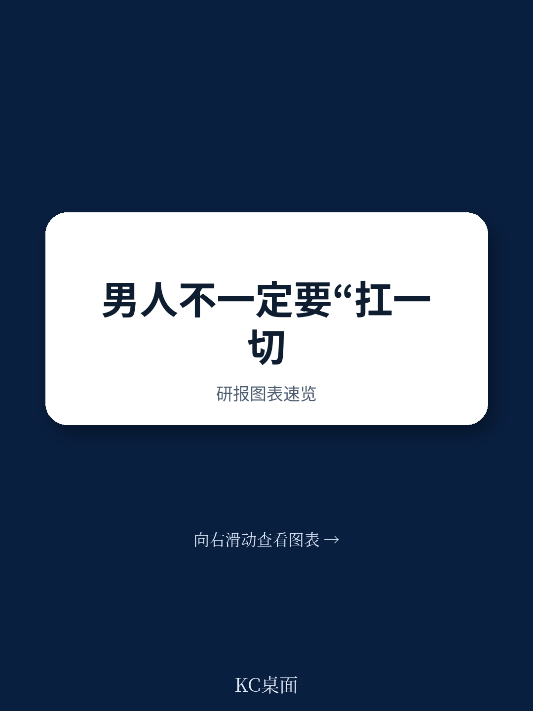
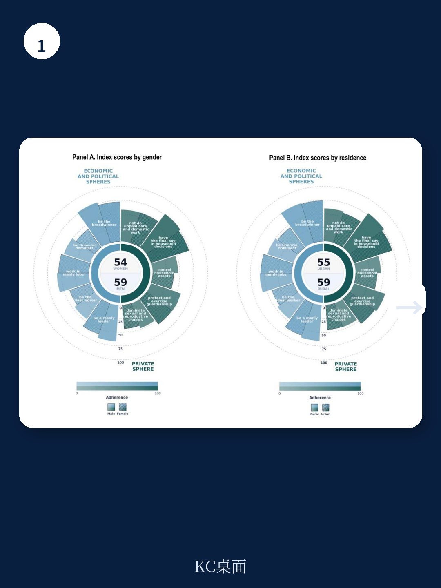
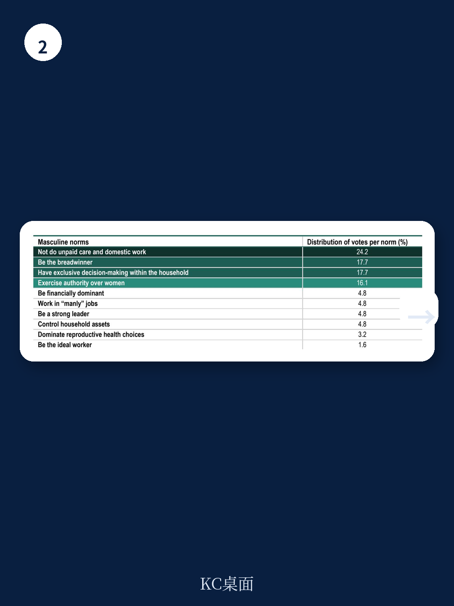

# 经合组织：科特迪瓦数据颠覆认知，年轻男性反而更支持传统性别角色

理解性别不平等，传统上我们关注的是女性在教育、就业、健康等领域的可观测差距。但一份来自经合组织的最新深度报告，将矛头指向了一个更根本、也更隐蔽的结构性变量：**社会如何定义“做一个男人”**。

这份针对科特迪瓦和塞内加尔的实证研究揭示了一个核心判断：西非国家性别平等的真正瓶颈，不在于法律条文或资源分配，而在于一套根深蒂固的、关于男性角色的“限制性男性气质规范”。这些规范——包括“男性必须是养家糊口者”、“男性拥有最终决策权”、“男性应当控制家庭资源”——不仅直接限制了女性的经济赋权，构成了家庭暴力的深层土壤，也反过来伤害着男性自身的身心健康。

报告明确指出，这些规范并非不可改变。一个关键的发现是，在科特迪瓦，存在一个“沉默的差距”：个人的真实信念与社会感知到的“别人怎么想”之间存在巨大错位。人们普遍高估了男性对限制性规范的支持度，同时低估了女性的支持度。这意味着，推动变革的社会基础可能比我们想象的更坚实，关键在于如何打破这种“误解的囚笼”。

这份报告的价值不在于重复“性别不平等是个问题”，而在于提供了一个可量化、可追踪的“男性气质指数”，将模糊的文化概念转化为诊断工具。它让政策制定者和投资者看到，如果不触及这些底层规范，单纯增加女性信贷、培训或法律保护，其效果都将被文化惯性所侵蚀。

> **KC评论：** 这份报告的核心洞察在于，它把“男性气质”从一个社会学议题，变成了一个可测量的发展指标。对于关注非洲市场、尤其是西非消费和劳动力市场的读者来说，这提供了一个理解社会变迁的底层框架。真正的机会不在于等待规范改变，而在于识别出那些正在松动、可以被“推一把”的节点。继续看原文，真正有价值的是它构建的“十项规范框架”和“男性气质指数”的计算方法，以及每个国家的具体数据分布。

---

## 1. 限制性男性气质并非铁板一块，其强度在不同地区和年龄层存在结构性分化

报告通过对科特迪瓦全国代表性调查数据的分析，构建了“OECD男性气质指数”。结果显示，限制性男性气质在科特迪瓦并非均匀分布，而是呈现出显著的地域和代际差异。

从地域看，北部地区（如萨瓦纳区、赞赞区）的指数得分远高于南部沿海地区（如阿比让、科莫埃区）。这种“南北分化”并非简单的城乡差异，而是与经济活动模式、历史传统和社会组织方式紧密相关。在南部以种植园经济为主的地区，女性参与经济活动的程度更高，这在一定程度上挑战了“男性是唯一养家糊口者”的规范。

从代际看，一个反直觉的发现是：**年轻男性（15-24岁）对限制性男性气质的支持度，高于同年龄段的女性和年长男性**。这打破了“年轻人天然更进步”的假设。报告推测，这可能与年轻男性在经济上难以实现“养家糊口”的期望而产生的焦虑感有关。当现实经济机会不足时，他们反而更强烈地捍卫传统性别角色，以此维护自我认同。

这意味着，推动性别平等的政策不能一刀切。针对北部地区和年轻男性的干预，需要更精准地设计。例如，对于年轻男性，与其直接批判传统规范，不如从“如何帮助男性在变化的经济环境中找到新的价值感”入手，将转型与男性自身的利益（如减轻经济压力、改善心理健康）联系起来。

## 2. “养家糊口”与“决策主导”是两大支柱，它们共同锁死了女性的经济空间

在经合组织定义的十项限制性男性气质规范中，有两项在科特迪瓦和塞内加尔都处于核心地位：**“养家糊口者”规范和“决策者”规范**。

“养家糊口者”规范不仅要求男性承担家庭主要经济责任，还隐含了“女性不应或不能胜任同等经济角色”的预设。这直接导致了劳动力市场的性别隔离。在科特迪瓦和塞内加尔，女性更多地集中在非正规、低收入的行业中，而男性则主导着建筑业、运输业等被视为“更正式”的领域。报告数据显示，两国的女性劳动参与率虽然不低，但她们大量从事的是无报酬的家庭劳动或脆弱就业。

“决策者”规范则将家庭内部的权力天平完全倾向男性。这体现在女性对自身收入、家庭大额支出、子女教育等关键事务上缺乏话语权。报告指出，即便女性有收入，她们也常常被期望将收入交给丈夫或家庭男性成员管理。这种对经济资源的控制权缺失，从根本上削弱了女性通过经济赋权改变自身地位的可能性。

> **KC评论：** 这两项规范形成了一个闭环。男性因“养家”压力而痛苦，女性因“被养”而失去自主权。更关键的是，这种规范还通过“无偿照料劳动”的分配被制度化。报告中的数据显示，女性承担了绝大部分的家务和育儿工作，而社会普遍认为这是“女性的工作”。这意味着，想要真正提升女性就业质量，必须同时解决“谁来带孩子”和“谁说了算”这两个问题。完整报告中对“无偿照料劳动”与女性就业关系的量化分析，以及各国数据，是理解这一逻辑链条的关键。

## 3. 暴力不是个体失控，而是“限制性男性气质”被制度化后的必然产物

报告最尖锐的洞察在于，它将家庭暴力（IPV）的普遍性，直接与“限制性男性气质”的接受度联系起来。在科特迪瓦，报告通过回归分析发现，**对“养家糊口者”规范认同度越高的男性，其一生中实施亲密伴侣暴力的概率也显著更高**。

这并非简单的“坏男人”理论。报告指出，当男性无法满足社会期望的“养家”角色时，他们会感到羞耻和无力，而暴力则成为他们重新确立权威、宣泄挫败感的一种病态手段。同时，社会对暴力的“正常化”态度，进一步纵容了这种行为。在科特迪瓦和塞内加尔，均有相当比例的人口（包括女性）认为，在某些情况下（如妻子“烧糊了饭”、“未经允许出门”、“拒绝性生活”），丈夫对妻子施加暴力是合理的。

报告还揭示了一个令人担忧的代际传递模式：在童年时期目睹过家庭暴力的男性和女性，成年后更有可能成为施暴者或受害者。这说明暴力行为本身也是一种“习得的规范”，需要通过早期干预来打破。

> **KC评论：** 这个发现将性别暴力的治理，从“事后惩罚”推向了“事前预防”。它意味着，任何有效的反家暴策略，都必须包含对“男性气质”的重新定义。单纯的法律威慑，无法消除一个男性在内心深处认为“我打她是因为她没尽到本分”的自我合理化。完整报告中对施暴者心理动机的定性研究，以及不同暴力类型（心理、身体、经济、性）的分布数据，能帮助读者更细致地理解这一复杂现象。

## 4. 报告尚未完全回答的关键问题：经济结构转型如何与男性气质转型互动

这份报告在建立“问题-诊断”框架上非常出色，但在“解决方案”层面，它留下了一个核心的未解问题：**当经济结构本身就在强化“养家糊口”规范时，如何推动意识形态的转变？**

报告提到了“积极男性气质”的倡导，例如鼓励男性参与育儿和家务，推广反对暴力的男性榜样。但这些项目通常规模较小，难以撼动由经济压力和社会结构共同塑造的文化惯性。例如，只要劳动力市场仍然以“男性作为全职、稳定生产者”为默认模型，而女性因承担照料责任而不得不选择非正规、低薪工作，那么“男性养家”的规范就会持续获得经济基础的支持。

报告也提到了“感知与现实”的差距（人们高估了他人的保守程度），这为政策沟通提供了空间。但报告没有深入探讨的是，**这种差距在多大程度上可以被经济激励所改变**？例如，当女性获得与男性同等的工作机会和收入时，家庭内部的权力关系和男性对“养家者”身份的执着是否会自然松动？或者，是否存在一个临界点，一旦女性劳动参与率超过某个阈值，整个社会规范就会发生“相位转换”？

这些问题的答案，需要将这份报告的数据，与更宏观的劳动力市场、城市化、移民和产业结构变迁的数据结合起来分析。这正是我们社群后续讨论的方向。

## 5. 给你的观察框架：如何判断一个社会正在经历“男性气质的转型”

对于关注西非市场或发展议题的决策者，这份报告提供了一个实用的观察框架，可以用于判断你所关注的社会或群体，是否正处于性别规范转型的“窗口期”

1. **看“感知差距”的宽度：** 如果公开调查显示，人们普遍高估了他人对传统规范的坚持，那么这就意味着存在“沉默的大多数”支持变革，只是缺乏发声的勇气和平台。这是推动公共讨论和媒体宣传的最佳时机。
2. **看“照料经济”的市场化程度：** 当家庭无法再依靠女性无偿的照料劳动（如育儿、养老）时，社会就必须寻找替代方案。这可能是市场化服务（如托儿所、家政服务），也可能是男性被迫更多地参与家庭事务。这两个方向都会直接冲击“照料是女性专属”的规范。
3. **看“养家”压力的分担方式：** 当经济下行或就业不稳定导致男性无法独自“养家”时，是导致家庭矛盾激化（暴力增加），还是催生了新的家庭分工模式（夫妻共同承担经济责任）？后者的出现，是男性气质转型最直接的信号。
4. **关注“年轻男性”的焦虑指数：** 年轻男性对限制性规范的强烈支持，往往是经济机会稀缺下的防御性反应。当针对这一群体的就业、创业和技能培训政策有效时，他们的焦虑缓解，对传统规范的依赖也会随之减弱。

这份经合组织报告的价值，在于它提供了一个从“男性视角”理解性别平等的分析工具箱。它告诉我们，要解放女性，必须先解放男性——从“必须成为养家糊口者和家庭权威”的沉重枷锁中解放出来。

然而，报告中关于科特迪瓦和塞内加尔的许多具体图表、访谈摘录和回归模型细节，是理解其结论严谨性的关键。例如，指数是如何构建的？不同教育水平、宗教信仰对规范认同的具体影响如何？定性研究中，男性和女性自己是如何描述这些压力的？

这些问题的答案，以及更多关于国际主流叙事、数据和图表的一手解读，都收录在我们的每日汇编中。我们不仅提供报告摘要，更通过“KC评论”的形式，将这些结构化信息与市场动态、投资决策联系起来。我们的社群汇聚了头部券商、PE/VC、投行、并购、hedge fund、资管机构、战略咨询、智库等领域的专业人士，共同探讨这些宏观议题背后的微观信号。

如果你想获取这份报告的完整版解读，以及每天来自高盛、摩根士丹利、瑞银等顶级机构的最新研报汇编和评论，欢迎扫码加入我们的知识星球。在这里，每一份报告都不是孤立的，而是被放回当天的市场主线中，形成可追溯、可喂给AI、也可人工快速扫描的“市场情报流”。我们期待与你交流。

Personal reading notes and learning share only. Not investment advice.
