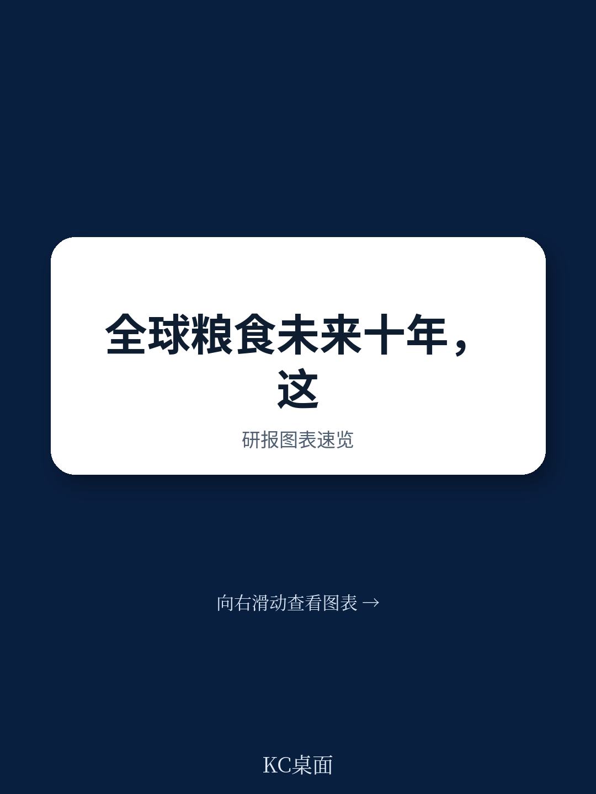
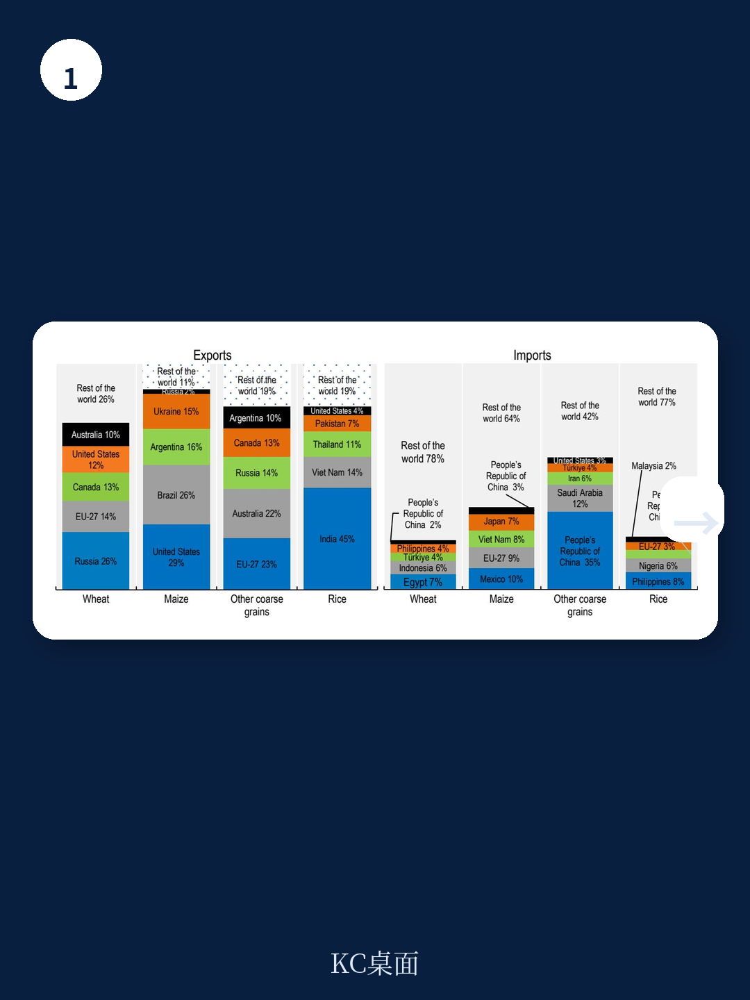
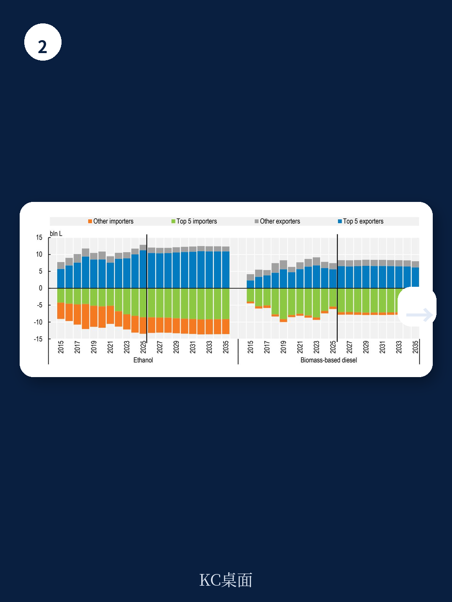

# 经合组织：未来十年全球农业增长的真正瓶颈不是土地，是劳动力

全球农业正在经历一个被低估的结构性拐点。经合组织与联合国粮农组织联合发布的《Agricultural Outlook 2026-2035》给出了一个看似温和、实则深刻的核心判断：未来十年全球农产品产量将增长13%，但这个数字背后的驱动力正在从面积扩张转向生产率提升，而生产率提升的最大制约因素并非技术或资本，而是农业劳动力的老龄化与收入波动性。这份报告第一次系统性地将“农业劳动生产率”和“农业工人收入波动”纳入十年展望的核心分析框架，其隐含的逻辑链条值得每一位关注大宗商品、全球供应链和新兴市场发展的决策者仔细拆解。

报告开篇就用数据点明了这个趋势。全球农业直接温室气体排放预计仅增长6%，远低于产量增速，说明集约化而非粗放扩张是主旋律。但真正值得关注的，是报告首次引入的农业劳动生产率指标：到2035年，全球农业工人人均毛收入预计增长9%。这个数字听起来不算差，但报告随后揭示了一个令人不安的波动性——即使在基准情景下，仍有25%的概率出现农业工人收入下降3%的情况。这意味着，全球农业增产的收益分配将比以往更加不均匀，而那些依赖小农经济的低收入国家，可能成为这一轮生产率竞赛中的输家。

> **KC评论：** 这份报告的核心价值不在于预测玉米或大豆的价格，而在于它把“人”的因素重新放回了农业分析的中心。过去十年，市场讨论农业问题时，焦点几乎都在天气、政策补贴和贸易摩擦上。但经合组织这次明确告诉你：劳动力老化、生产率差异和收入波动，正在成为比土地更稀缺的约束条件。完整报告里有一整节专门拆解不同国家农业劳动生产率的结构性差异，以及这些差异如何影响未来十年的贸易格局——这些图表和假设才是真正值得花时间细读的部分。

继续看原文，真正有价值的是图表、假设和验证路径；完整报告与KC评论在每日汇编。

## 1. 全球增产的13%将高度集中，亚洲和非洲是主战场，但驱动逻辑完全不同

报告明确指出，未来十年全球农业产量增长将主要来自亚洲、撒哈拉以南非洲和拉丁美洲。这三个区域的增长逻辑截然不同，不能用一个框架去理解。

亚洲的增产主要依靠单位面积产量的持续提升，尤其是在谷物和油籽领域。中国、印度和东南亚国家的农业研发投入、灌溉基础设施改善以及良种推广，正在形成可量化的产出效率提升。报告的数据显示，主要大宗商品的平均年单产增速虽然低于历史均值，但仍保持在正增长区间。这意味着亚洲的农业增长是“技术驱动型”的，其背后是稳定的政策环境和相对完善的农业服务体系。

撒哈拉以南非洲的情况则完全不同。这里的增产更多来自于耕地面积的扩张，而非单产提升。报告隐含的判断是，非洲的农业增长仍处于“要素投入型”阶段，土地是增长的主要来源，而非效率。这种模式天然伴随着更高的环境成本和更低的抗风险能力。一旦遭遇极端气候或地缘冲突，非洲的粮食生产波动性将远高于亚洲。

拉丁美洲则扮演了一个混合角色。巴西和阿根廷的大豆、玉米增产，既有技术驱动的成分，也有耕地扩张的因素。但报告特别提到，拉美的农业劳动生产率提升速度正在加快，这意味着该区域正在从一个“资源输出型”农业体系向“效率输出型”转型。

这三种增长模式的差异，直接决定了未来十年全球农产品贸易的流向和定价权分布。亚洲的增产更多是为了满足自身需求，非洲的增产仍不稳定，而拉美将成为全球出口增量的主要提供者。

## 2. 农业劳动生产率成为新的核心变量，但收入波动性才是真正的隐忧

报告将农业劳动生产率作为专题分析，这不是一个学术噱头，而是对过去十年全球农业政策反思后的结果。经合组织的数据显示，全球农业劳动力正在快速老龄化，55岁以上的农业从业者占比持续上升，尤其是在发达经济体和部分新兴市场。年轻劳动力向城市和非农产业转移的趋势不可逆转，这意味着农业生产的“人力资本”正在被抽空。

报告给出的劳动生产率预测是：到2035年全球农业工人人均毛收入增长9%。但更值得关注的是收入波动性。报告通过模型模拟发现，即使在不发生极端冲击的基准情景下，农业工人收入仍有25%的概率下降3%。这个波动性来自三个方面：气候条件变化、大宗商品价格波动、以及投入品成本的不确定性。

> **KC评论：** 9%的十年增长听起来像是一个可以接受的正向预期，但25%的下降概率意味着，每四个农业工人中就有一个可能在某个年份面临收入缩水。对于发达国家的规模化农场主来说，这或许只是利润率的波动；但对于发展中国家的小农，这可能是生存线以下的打击。报告里有一张关于农业收入波动性的图表，按照不同区域和作物类型做了拆解，这张图是理解未来十年全球粮食安全风险的关键入口。

报告还做了一个补充分析：2026年中东冲突对农业的溢出效应。模拟结果显示，地缘冲突将抑制化肥使用，尤其是在低收入国家，进而导致谷物产量低于基准。这个情景分析揭示了一个被市场低估的传导链条——地缘风险不仅影响能源价格，还通过化肥供应间接影响全球粮食产量，而低收入国家总是受伤最深的环节。

## 3. 贸易格局正在被重新定义，但最大的变数不是关税而是物流

报告对贸易的分析没有停留在传统的出口国与进口国分类上，而是引入了一个更精细的视角：贸易强度与市场准入。数据显示，全球农产品贸易占生产与消费总量的比例在过去十年基本持平，但区域间的差异在扩大。亚洲和非洲的进口依赖度在上升，而拉美和北美作为净出口地区的地位在巩固。

但报告真正想表达的观点是：贸易作为平衡供需的工具，其有效性正在受到制约。制约因素不是关税壁垒，而是物流成本、基础设施瓶颈和贸易便利化程度。报告特别提到了非洲大陆自由贸易区的潜在影响，但同时也指出，如果没有配套的港口、仓储和冷链物流设施，贸易自由化的红利很难兑现。

另一个值得关注的趋势是贸易集中度。报告的数据显示，谷物、油籽和肉类的出口市场正在变得更加集中，少数几个国家控制了绝大多数出口份额。这种集中度意味着，一旦这些出口国遭遇生产冲击，全球价格的反应将比过去更加剧烈。对于进口依赖度高的国家和地区，这构成了一个系统性的供应链风险。

## 4. 生物燃料的政策驱动正在减弱，但结构性需求仍在

报告对生物燃料的展望部分值得单独讨论。过去十年，生物燃料是拉动农产品需求的重要力量，尤其是美国和巴西的玉米乙醇、以及东南亚的棕榈油生物柴油。但报告预测，未来十年生物燃料需求的增长将显著放缓，主要原因是政策支持力度减弱和电动汽车的普及。

不过，报告没有把生物燃料需求完全看淡。它指出，即使政策补贴退坡，部分国家的生物燃料掺混义务（如印尼的B35/B40政策）仍将提供结构性支撑。此外，可持续航空燃料的兴起可能成为新的需求增量，但这个市场目前规模太小，不足以改变整体格局。

> **KC评论：** 生物燃料的叙事正在从“政策驱动”转向“成本驱动”。当补贴退坡后，生物燃料必须证明自己在没有政策支持下仍能保持竞争力。报告没有完全展开的是，碳定价机制的演进如何影响生物燃料的经济性——这可能是未来几年最需要跟踪的变量之一。

## 5. 报告尚未完全回答的关键问题：生产率提升的收益能否被公平分配

报告在劳动生产率部分给出了一个重要的分析框架，但它没有完全回答一个问题：生产率提升带来的收益，究竟会流向谁？是大型农业企业、土地所有者、还是真正的农业工人？

从报告的数据来看，农业收入波动性在高收入国家和低收入国家之间存在显著差异。发达国家的规模化农场可以通过期货套保、保险和多元化经营来平滑收入波动，而发展中国家的自耕农几乎没有对冲工具。这意味着，即使全球农业劳动生产率整体提升，不同群体之间的收入差距可能反而扩大。

这个问题之所以关键，是因为它直接关系到未来十年全球粮食安全的政治经济学。如果增产的收益集中在少数人手中，而农业工人的实际收入并未显著改善，那么农业领域的政策稳定性将面临挑战。报告没有给出答案，但提供了分析这个问题的数据基础——农业劳动生产率的分区域数据、收入波动性的概率分布、以及贸易集中度的变化趋势。

## 6. 给读者的观察框架：三个需要持续跟踪的信号

基于这份报告的分析框架，以下三个信号值得在未来12-18个月持续跟踪

第一个信号是化肥使用量的变化。报告的地缘冲突情景分析已经表明，化肥是连接地缘政治与粮食产量的关键变量。如果化肥价格持续高企或供应受限，低收入国家的谷物产量将首先受到冲击，进而推高全球粮食价格。这是一个可以提前预警的指标。

第二个信号是农业劳动生产率的分化趋势。报告提供了基准预测，但实际数据将取决于各国在农业研发、基础设施和劳动力培训方面的投入。如果某个区域的劳动生产率增速持续低于报告预测，那就意味着该区域的农业竞争力正在被侵蚀，其进口依赖度可能加速上升。

第三个信号是贸易集中度的变化。如果主要出口国的市场份额继续扩大，而新的出口竞争者未能出现，那么全球农产品市场的定价权将更加集中。这对于进口依赖国来说，是一个需要提前布局供应链多元化的信号。

这些信号并非来自报告的明确结论，而是从报告的分析框架中可以合理推导出的观察维度。完整报告中有大量的分品种、分区域的详细数据和图表，可以帮助读者验证这些信号是否成立。

---

这份经合组织的报告提供了未来十年全球农业最系统的全景图，但它也留下了许多需要继续追问的问题：生产率提升的收益分配问题、地缘冲突的尾部风险、以及贸易物流瓶颈的突破路径。这些问题没有标准答案，但值得在更广泛的信源和讨论中持续跟踪。

更多国际信源汇编与评论，每日更新。我们会把单篇报告放回当天的主线中，整理成中文摘要、KC评论和图表合集，便于喂给AI进行深度分析，也便于人工快速扫市场动态。目前社群里已经汇聚了头部券商、PE/VC、投行、并购、hedge fund、资管机构、战略咨询、智库等朋友，期待交流。

Personal reading notes and learning share only. Not investment advice.
