# OECD Responsible Business Outlook 2026

Making Commitments Count

## OECD Responsible Business Outlook 2026

MAKING COMMITMENTS COUNT

This work is issued under the responsibility of the Secretary-General of the OECD, and does not necessarily reflect the official views of OECD Member countries.

This document, as well as any data and map included herein, are without prejudice to the status of or sovereignty over any territory, to the delimitation of international frontiers and boundaries and to the name of any territory, city or area.

The statistical data for Israel are supplied by and under the responsibility of the relevant Israeli authorities. The use of such data by the OECD is without prejudice to the status of the Golan Heights, East Jerusalem and Israeli settlements in the West Bank under the terms of international law.

## Note by the Republic of Türkiye

The information in this document with reference to “Cyprus” relates to the southern part of the Island. There is no single authority representing both Turkish and Greek Cypriot people on the Island. Türkiye recognises the Turkish Republic of Northern Cyprus (TRNC). Until a lasting and equitable solution is found within the context of the United Nations, Türkiye shall preserve its position concerning the “Cyprus issue”.

Note by all the European Union Member States of the OECD and the European Union

The Republic of Cyprus is recognised by all members of the United Nations with the exception of Türkiye. The information in this document relates to the area under the effective control of the Government of the Republic of Cyprus.

Please cite this publication as:

OECD (2026), OECD Responsible Business Outlook 2026: Making Commitments Count, OECD Publishing, Paris, https://doi.org/10.1787/2b15370f-en.

ISBN 978-92-64-67337-3 (print)
ISBN 978-92-64-98458-5 (PDF)
ISBN 978-92-64-40142-6 (HTML)

Photo credits: Cover image by Javier Gonzalez, based on © Doug Berry/Getty Images and © Hide\_Studio/Shutterstock.com.

Corrigenda to OECD publications may be found at: https://www.oecd.org/en/publications/support/corrigenda.html.
© OECD 2026

## Attribution 4.0 International (CC BY 4.0)

This work is made available under the Creative Commons Attribution 4.0 International licence. By using this work, you accept to be bound by the terms of this licence (https://creativecommons.org/licenses/by/4.0/).

Attribution – you must cite the work.

Translations – you must cite the original work, identify changes to the original and add the following text: In the event of any discrepancy between the original work and the translation, only the text of the original work should be considered valid.

Adaptations – you must cite the original work and add the following text: This is an adaptation of an original work by the OECD. The opinions expressed and arguments employed in this adaptation should not be reported as representing the official views of the OECD or of its Member countries.

Third-party material – the licence does not apply to third-party material in the work. If using such material, you are responsible for obtaining permission from the third party and for any claims of infringement.

You must not use the OECD logo, visual identity or cover image without express permission or suggest the OECD endorses your use of the work.

Any dispute arising under this licence shall be settled by arbitration in accordance with the Permanent Court of Arbitration (PCA) Arbitration Rules 2012. The seat of arbitration shall be Paris (France). The number of arbitrators shall be one.

# Foreword

More than ever, businesses are being asked to demonstrate how they manage the social and environmental impacts of their operations, products and services. The OECD Guidelines for Multinational Enterprises on Responsible Business Conduct (MNE Guidelines) are the leading international standard for how companies and investors should address their impacts on people, the planet and society. They apply to businesses and investors of all sectors, sizes and ownership structures, and cover all key sustainability issues – from climate change to technology, from anti-corruption to human rights and labour standards. The OECD Due Diligence Guidance for Responsible Business Conduct sets out a risk-based due diligence framework for companies to identify, prevent, mitigate and remediate adverse impacts in their operations, supply chains and other business relationships, that governments have committed to actively support and monitor.

The 2026 OECD Responsible Business Outlook provides a global assessment of how companies practice responsible business conduct and how governments promote it through public policies.

This report has been developed by the OECD Centre for Responsible Business Conduct of the Directorate for Financial and Enterprise Affairs. It was prepared by Nicholas Robin, Konstantin Mann, Benjamin Michel, Lena Diesing, Monica Garay, Anita Gholami, Nicolas Hachez, Santhosh Persaud, Sophie Rickard, Daniel Torán and Sarah Reso, with contributions from Tihana Bule, Benjamin Katz, Lauren Shields, Emily Norton and Suban Biixi, under the supervision of Barbara Bijelic, Head of Regulation and Standards and Allan Jørgensen, Head of the OECD Centre for Responsible Business Conduct.

Comments and insights were gratefully received from Hannah Koep-Andrieu, Rashad Abelson, Peter Higgins, Sonja Agustsdottir, Marie Bouchard and Sophie Lavaud, from the OECD Centre for Responsible Business Conduct; Adriana De La Cruz, Caio de Oliveira, Suzannah Hewson, Chung-A Park, Sara Sultan and Francesca Zampa from the Capital Markets Division of the Directorate for Financial and Enterprise Affairs; Fares Al Hussami, Alexandre De Crombrugghe, Helene Francois Georgieff, Fernando Mistura and Martin Wermelinger from the Investment Division of the Directorate for Financial and Enterprise Affairs; Spela Berlizg and Julian Paisey from the Export Credits and Competition Division of the Trade and Agriculture Directorate. Stephanie Walker, Liv Gudmundson, and Edwina Collins also provided invaluable editorial support. The authors would also like to thank Gülgün Arikan, Serdar Çelik and Alejandra Medina for facilitating access to the OECD Capital Market Series dataset.

## Editorial

Responsible business conduct is about ensuring that business activities improve people's lives while protecting the planet. It means building workplaces where people are treated with dignity, can freely associate, and have a meaningful voice. It means developing safe and reliable products and technologies, safeguarding the environment, and contributing to the communities in which businesses operate. Above all, it reflects a commitment to continuously eliminate harmful practices – including child and forced labour – and to advance sustainable and inclusive growth.

Published on the 50th Anniversary of the OECD Guidelines for Multinational Enterprises on Responsible Business Conduct (MNE Guidelines), this inaugural edition of the OECD Responsible Business Outlook shows a growing commitment by businesses and policymakers around the globe to responsible business practices.

Today, more than two-thirds (69%) of the world's 10 000 largest listed companies have made a commitment to responsible business conduct. OECD standards for risk-based due diligence help companies turn these commitments into action. But implementation is lagging. Only a minority of companies conduct the due diligence needed to effectively implement responsible business conduct.

Governments can support businesses in bridging this gap. As our report shows, 84% of OECD Member countries have introduced regulation on environmental and social due diligence. Many more governments are taking policy action to incentivise, enable and support it.

Adherents to the MNE Guidelines have a valuable opportunity to further harness the OECD National Contact Points for Responsible Business Conduct (NCPs). This unique, non-adversarial grievance mechanism has already addressed nearly 1 000 cases across more than 100 countries and territories. By fostering dialogue, promoting learning, and strengthening accountability, NCPs play a vital role – one that could be amplified with more resources.

The MNE Guidelines, updated in 2023, remain the global reference point for responsible business conduct, supporting governments and businesses in advancing practices that strengthen resilience, foster inclusive growth, and deliver sustainable prosperity.

Mathias Cormann,
OECD Secretary-General

## Table of contents

Foreword 3
Editorial 4
Executive summary 8
1 Introduction 13
References 16
2 How are companies implementing due diligence for responsible business conduct? 17
Committing to and embedding responsible business conduct into management systems 18
Identifying and assessing risks and impacts 26
Prevention, mitigation and remediation of impacts 33
Communicating on how impacts are addressed 42
References 44
Notes 47
3 How are governments promoting responsible business conduct? 49
Legal and regulatory frameworks to enable responsible business conduct 53
Encouraging responsible business conduct across key policy areas 61
Leading by example: Governments as economic and commercial actors 70
Promoting access to remedy 77
Co-ordinating policies and activities on responsible business conduct 81
References 83
Notes 90
4 Policy considerations 95
It is important that companies are sufficiently incentivised and enabled to carry out due diligence that is outcome-oriented 96
Companies need support in carrying out due diligence in their supply chains 96
Better reporting and tracking of responsible business practices, including due diligence is needed to understand impact and effectiveness 97
More robust evidence on the implementation and the impact of responsible business conduct policies is necessary to ensure objectives are being achieved 97
Co-operation on responsible business conduct-related policies is necessary to reduce complexity and promote a level playing field across jurisdictions 98
References 98

## FIGURES

Figure 1.1. OECD six-step due diligence framework for responsible business conduct 15
Figure 1.2. Six principles of the OECD Recommendation on the Role of Government in Promoting Responsible Business Conduct 15
Figure 2.1. Public commitments on selected responsible business conduct issues 20
Figure 2.2. Commitments on environmental or social issues in the supply chain 21
Figure 2.3. References to the OECD Guidelines for Multinational Enterprises on Responsible Business Conduct or the UN Guiding Principles on Business and Human Rights 21
Figure 2.4. Materiality gap between perceived financially material sustainability risks and perceived material adverse sustainability impacts across ESRS topics 24
Figure 2.5. Board-level or senior management responsibility and performance incentives for sustainability 26
Figure 2.6. Environmental and social expectations of suppliers versus evaluation of supplier risk 27
Figure 2.7. Supplier coverage by social audit programmes, by tier, in a sub-sample of large listed companies 29
Figure 2.8. Estimated share of relevant raw materials with known origin in a sub-sample of large listed companies in industries sourcing from the mining sector 29
Figure 2.9. Number of sustainability initiatives over time, by function 30
Figure 2.10. Disclosure of stakeholder engagement 33
Figure 2.11. Health and safety impact prevention and mitigation measures in own operations 35
Figure 2.12. Specific prevention and mitigation measures in the supply chain 36
Figure 2.13. Existence of human rights grievance mechanisms and commitment to remedy 37
Figure 2.14. Willingness to disengage from a supplier if environmental or human rights criteria are not met 38
Figure 2.15. Uptake of due diligence policies and management systems versus measures to identify and address adverse environmental and social impacts 39
Figure 2.16. Uptake of responsible business conduct due diligence: SOEs and non-SOEs 40
Figure 2.17. Disclosure of salient human rights issues and supplier monitoring 43
Figure 3.1. Government action on responsible business conduct across six policy areas 51
Figure 3.2. Responsible business conduct policies across countries adhering to the OECD Guidelines for Multinational Enterprises on Responsible Business Conduct 52
Figure 3.3. Due diligence legislative measures across countries adhering to the OECD Guidelines for Multinational Enterprises on Responsible Business Conduct 57
Figure 3.4. Topical coverage of due diligence legislative measures 58
Figure 3.5. Responsible business conduct clauses in agreements signed by countries adhering to the OECD Guidelines for Multinational Enterprises on Responsible Business Conduct 63
Figure 3.6. Overview of the different aspects covered by responsible business conduct clauses in trade and investment agreements 64
Figure 3.7. Integration of responsible business conduct in development co-operation 66
Figure 3.8. Development co-operation expenditure for responsible business conduct 67
Figure 3.9. Responsible business conduct considerations in public procurement frameworks of countries adhering to the OECD Guidelines for Multinational Enterprises on Responsible Business Conduct 71
Figure 3.10. Value of public procurement spending in countries that have explicit or implicit due diligence requirements applying to public procurement 72
Figure 3.11. Means of setting responsible business conduct expectations for state-owned enterprises among countries adhering to the OECD Guidelines for Multinational Enterprises on Responsible Business Conduct 73
Figure 3.12. Share of export credit agency mandates and policy statements that include responsible business conduct topics 75
Figure 3.13. Share of export credit agencies considering climate-related risks in risk assessments 76
Figure 3.14. Direct and indirect remediation requirements in environmental and social due diligence laws 80

Figure A A.1. Summary statistics by sector 104
Figure A A.2. Summary statistics by geography 104

## INFOGRAPHICS

Infographic 1. Reported uptake of responsible business due diligence by large listed companies 11

## TABLES

Table 2.1. Perceived sector exposure to selected responsible business conduct impacts 23
Table 3.1. Responsible business conduct policies in countries adhering to the OECD Guidelines for Multinational Enterprises on Responsible Business Conduct 52
Table 3.2. Due diligence legislative measures across countries adhering to the OECD Guidelines for Multinational Enterprises on Responsible Business Conduct 56
Table 3.3. Content of expectations related to responsible business conduct in overarching state ownership policies 74
Table 3.4 Measures to improve access to remedy 78

# Executive summary

Responsible business conduct (RBC) aligns the activities of businesses and investors with the needs of society, today and in the future. RBC is especially important in this moment of profound economic, technological, geopolitical, and climate-related transitions.

The OECD Guidelines for Multinational Enterprises on Responsible Business Conduct (MNE Guidelines) are the leading international standard for RBC. They set out expectations for businesses to conduct due diligence to assess and address adverse impacts on people, the environment and society associated with their operations, their products and services, including across their supply chains. This report assesses the practices of the 10 000 largest companies listed on global stock markets against the OECD due diligence framework. It also explores how the 52 governments that adhere to the MNE Guidelines are promoting RBC through public policies.

## Key findings

Commitments to responsible business conduct are widespread but implementation lags behind.

Sixty-nine per cent of large listed companies have public commitments on at least one issue relating to RBC and over one-third (36%) have cross-cutting RBC commitments covering a range of topics. Commitments related to corruption and greenhouse gas (GHG) emissions are most common, followed by forced labour, child labour and human rights. Less than half of large listed companies disclose commitments to freedom of association and only a quarter to biodiversity.

Overall, companies tend to report more extensively on their policies and management systems (45% as a share of all practices considered in this report) than other aspects of due diligence – particularly measures to address their impacts (less than 20%).

Reported uptake of measures to identify and address impacts tends to be low particularly in relation to impacts that may arise in companies' supply chains. For example, while roughly half of companies report having social or environmental criteria for selecting their suppliers, fewer than 20% report evaluating supplier risk according to such criteria. A quarter of companies report providing training or collaborating with suppliers to improve their performance on environmental and social issues. Fewer than one in ten companies (7%) report integrating their social supply chain policy into their purchasing practices. Fewer than one in 20 companies disclose improvements for workplace health and safety in their supply chain.

Due diligence uptake is particularly limited in relation to stakeholder engagement and remediation related to human rights issues. Globally, 8% of large listed companies report engaging stakeholders on human rights issues. Just under one-fifth (17%) report having a formal grievance mechanism on human rights, while 10% commit to providing remedy to people affected by human rights impacts related to the company's activities.

Reported uptake of due diligence varies significantly across geographies. On average, reporting on due diligence is more comprehensive in Europe, Developed Asia-Pacific and Latin America, and least comprehensive in the People's Republic of China (hereafter ‘China’), the Middle East and Africa.

## The implementation gap for responsible business conduct reflects challenges to implementing and disclosing on due diligence and potentially insufficient incentives.

The share of companies reporting that they have a significant negative impact on a given issue exceeds the share of companies that identify that issue as posing a material financial risk for the company, in non-financial sector disclosures published under the EU's European Sustainability Reporting Standards (ESRS). This is the case across all but one of the ten sustainability topics covered, and the gap is particularly pronounced for workers in the value chain, water and marine resources, and the circular economy. This gap may reflect challenges related to assessment and reporting of risks and impacts but may also reflect a real or perceived lack of incentives to address certain impacts.

At the same time, companies face concrete barriers to implementation, including limited visibility and leverage over upstream suppliers. In a sub-sample of around 450 large listed companies, around 70% report that their social audit programmes cover tier-1 suppliers, while around 35% cover tier-2 or tier-3 suppliers. This can mean companies have less visibility on their most significant risks and impacts, which are often located upstream. Companies report obstacles to collecting, verifying or transferring information about suppliers, workers or operations due to capacity constraints but also restrictions related to data protection, national security, or limitations on audits and on-the-ground engagement.

Legal and practical barriers may also impact reporting on outcomes of due diligence. Only 7% of large listed companies disclose salient human rights issues and only 6% disclose the outcomes of their supplier monitoring process. This may reflect challenges associated with measuring outcomes and communicating on human rights impacts, which are often context-specific and may involve heightened reputational or liability risks, which can discourage more granular disclosure even where underlying due diligence activities exist.

## Governments are increasingly making due diligence mandatory and integrating RBC across related policy areas and their own economic activities.

Eighty-four per cent of OECD Member countries, and 67% of countries adhering to the MNE Guidelines, as well as a number of non-adhering countries, have introduced due diligence-related regulation. This includes legislation related to sustainability reporting, due diligence conduct, and product or market-based measures. While many of these measures share similar core objectives and features, businesses have reported implementation challenges due to a lack of alignment in scope, design and terminology. OECD Member countries with due diligence-related requirements in place represent approximately 55% of global GDP.

Governments are integrating RBC into trade and investment agreements. Since 2020, 67 (36%) of the 186 trade and investment agreements signed by countries adhering to the MNE Guidelines include an RBC clause. Of these 67 agreements, 73% were signed with non-adhering countries. However, knowledge about the implementation and impact of these provisions is lacking.

Governments are promoting RBC in their role as economic actors and in their commercial activities. Thirty-two countries adhering to the MNE Guidelines report that their public procurement frameworks consider RBC. In 2024, over USD 8 trillion in public procurement spending (accounting for approximately 80% of public procurement spending across adherent countries) was by countries where mandatory due diligence measures apply to public bodies either explicitly or implicitly.

Large listed state-owned enterprises (SOEs) tend to report higher uptake of due diligence practices than non-SOEs headquartered within the same region, though large listed SOEs are concentrated in regions with lower reported due diligence uptake overall (China, Middle East and Africa). Thirty-six countries adhering to the MNE Guidelines have established and disclosed expectations for their SOEs to observe RBC principles and standards.

Twenty-nine of 52 countries adhering to the MNE Guidelines note that they use incentives to promote implementation of RBC standards by businesses. Incentives can vary significantly, for example, preferential terms for grants, loans or other financial support based on RBC performance; tax credits or benefits; incentives linked to permitting, licensing, company registration, other administrative processes; trade and investment facilitation services and government-backed trademarks or labels.

Governments are taking action to facilitate access to judicial remedies for harms related to corporate misconduct. All countries adhering to the MNE Guidelines provide state-based grievance mechanisms on RBC. Thirty-six countries have taken at least one measure to address access barriers to judicial remedy. Direct or indirect expectations to provide remedy or to establish a grievance mechanism are present in about half of the due diligence legislation introduced across adherent countries. This is particularly relevant considering the limited reported due diligence uptake related to remediation mentioned above.

## Key policy considerations

1. Ensure that companies are sufficiently incentivised and enabled to carry out environmental and social due diligence that is outcome oriented. This requires assessing whether regulatory, supervisory or market-based signals sufficiently encourage action on environmental and social impacts and understanding and addressing key barriers and disincentives. It is also important to ensure remediation, meaningful stakeholder engagement and progressive improvement are built into due diligence policies.

2. Provide practical and operational support to companies in carrying out risk-based due diligence in their supply chains. Many companies face challenges to extend due diligence beyond direct suppliers, both in identifying and addressing impacts. Support can include enabling collaboration through sustainability initiatives, industry associations, and government partnerships, as well as developing and scaling tools and systems that help companies identify and address impacts further upstream.

3. Promote better reporting and tracking of companies' responsible business practices, including on due diligence, to understand impact and effectiveness. Further guidance for companies on appropriate due diligence indicators including outcome-oriented indicators can help to drive more meaningful reporting. ESG rating providers could better align metrics with due diligence reporting expectations to enable relevant and comparable data.

4. Collect robust evidence related to implementation and impact of RBC policies. While there is existing data on integration of RBC into law or policy measures, there is less evidence of implementation and impact of such policies. As governments track uptake and compliance with these measures, they should also seek to understand to what extent the measures are achieving their objectives.

5. Co-operate on RBC-related policies to reduce complexity and promote a level playing field across jurisdictions. This includes international co-operation and domestic coordination to ensure measures are coherent, consistent with internationally agreed principles and contribute towards an enabling environment for responsible businesses.

## Infographic 1. Reported uptake of responsible business due diligence by large listed companies

Across all regions, there is a marked implementation gap between policies and management systems, and measures to identify and address impacts.

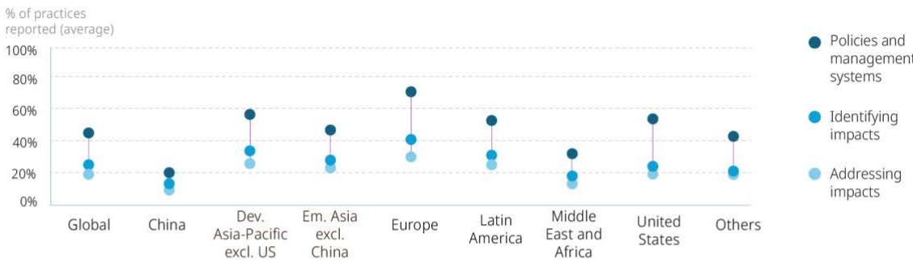

While around half of companies have expectations of suppliers on environmental or social issues, only one-fifth report evaluating supplier risk on these issues.

\- Expectations of suppliers on environmental or social issues

\- Evaluation of supplier risk on environmental or social issues

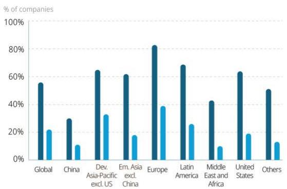

While a quarter of companies report providing training to suppliers on environmental or social issues, few integrate social commitments into purchasing practices or report health and safety progress in suppliers.

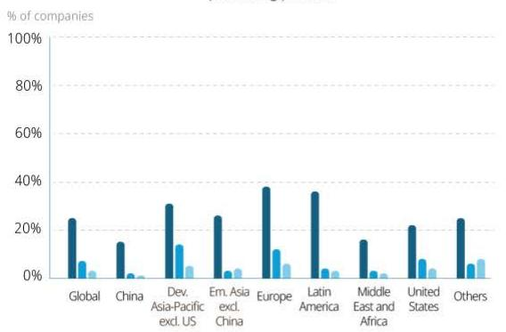

Remediation and stakeholder engagement related to human rights impacts are rare.

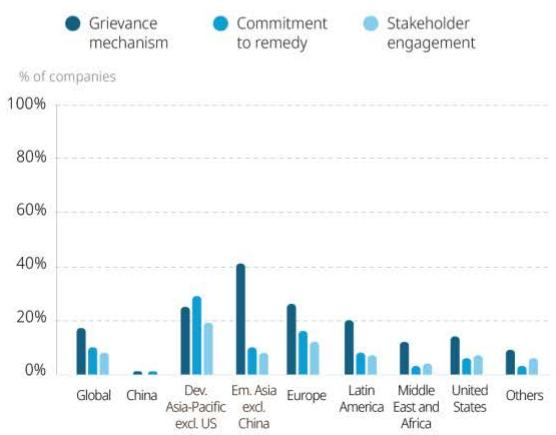

Many of the 38 OECD Member countries have laws expecting companies to report on or carry out due diligence to assess and address environmental and social impacts.

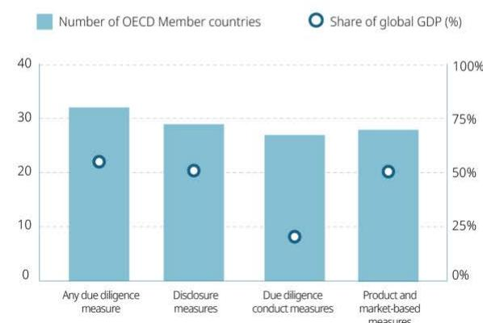  
Note: See Annex A for further details.

Source: OECD Capital Market Series dataset; LSEG; FactSet; Bloomberg; World Bank (2024), World Development Indicators

This chapter introduces the 2026 OECD Responsible Business Outlook. It situates responsible business conduct (RBC) within a global context marked by geopolitical tensions, shifting economic priorities and renewed industrial policies. It also provides an overview of the OECD Guidelines for Multinational Enterprises on Responsible Business Conduct, the OECD Due Diligence Guidance for Responsible Business Conduct and the OECD Recommendation on the Role of Government in Promoting Responsible Business Conduct, the frameworks underpinning analysis in this report.

The global economy is undergoing multiple transitions where open markets and the rules-based international system are under strain; rule of law is declining globally and geopolitical tensions are prominent; and where economic security priorities are increasingly conditioning trade and investment policies. There is a re-emergence of industrial policies – as a way to strengthen resilience, accelerate transitions, enhance competitiveness and address dependencies and overconcentration (OECD, 2026[1]).

In response to social and environmental pressures affecting societies, business, and stakeholders, there has been a global expansion of policy and market expectations for responsible business conduct (RBC). Internationally agreed principles on RBC are increasingly being used to provide a common reference point for addressing shared challenges in the global economy, while safeguarding people and the environment and providing a predictable and level playing field for companies.

The 2026 OECD Responsible Business Outlook provides the first global assessment of how RBC is being taken up in company practice and government policies. It analyses publicly disclosed information of the 10 000 largest listed companies globally – accounting for 96% of global market capitalisation – and reviews related government policies across 52 countries. As this report represents the first analysis of its kind it presents the current picture of company practices and government policy, rather than findings related to trends over time, which may be explored in future publications.

As a framework for analysis this report draws on the OECD Guidelines for Multinational Enterprises on Responsible Business Conduct (MNE Guidelines) (OECD, 2023[2]) and the OECD Recommendation on the Role of Government in Promoting Responsible Business Conduct [OECD/LEGAL/0486] (the RBC Recommendation) (see Figure 1.2).

The MNE Guidelines (OECD, 2023[2]) are the leading international standard for how companies and investors should address their impacts on people, the planet and society. They apply to businesses and investors of all sectors, sizes and ownership structures, and cover all key sustainability issues – from climate change to technology, from anti-corruption to human rights and labour standards.

The MNE Guidelines are operationalised through risk-based due diligence. They include a six-step framework for embedding RBC practices in core business operations, laid out in the OECD Due Diligence Guidance for Responsible Business Conduct (OECD Due Diligence Guidance) (OECD, 2018[3]) (see Figure 1.1). Due diligence is the process by which companies identify, prevent, mitigate and remediate adverse impacts in their operations, supply chains and other business relationships.

Figure 1.1. OECD six-step due diligence framework for responsible business conduct  
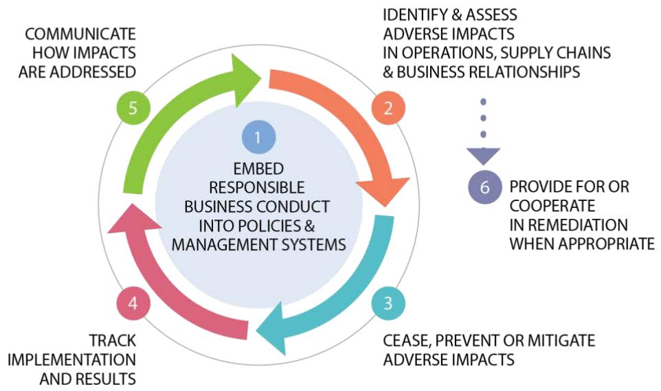  
Source: OECD (2018[3]), OECD Due Diligence Guidance for Responsible Business Conduct, https://doi.org/10.1787/15f5f4b3-en.

The RBC Recommendation lays out a single comprehensive set of principles and policy recommendations for how governments can enable and promote RBC (see Figure 1.2).

Figure 1.2. Six principles of the OECD Recommendation on the Role of Government in Promoting Responsible Business Conduct  
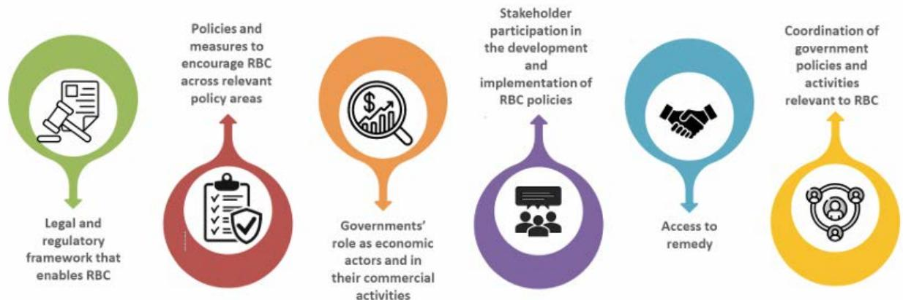

Source: OECD (2022[4]), Recommendation of the Council on the Role of Government in Promoting Responsible Business Conduct, OECD/LEGAL/0486, https://legalinstruments.oecd.org/en/instruments/OECD-LEGAL-0486.

## References

OECD (2026), Key Issues Paper 2026 Ministerial Council meeting, https://www.oecd.org/content/dam/oecd/en/events/2026/06/mcm/2026-mcm-key-issues-paper.pdf.

OECD (2023), OECD Guidelines for Multinational Enterprises on Responsible Business Conduct, OECD Publishing, Paris, https://doi.org/10.1787/81f92357-en.

OECD (2022), Recommendation of the Council on the Role of Government in Promoting Responsible Business Conduct, OECD-LEGAL-0486, https://legalinstruments.oecd.org/en/instruments/OECD-LEGAL-0486 (accessed on 4 June 2026).

OECD (2018), OECD Due Diligence Guidance for Responsible Business Conduct, OECD Publishing, Paris, https://doi.org/10.1787/15f5f4b3-en. [3]

## 2 How are companies implementing due diligence for responsible business conduct?

This chapter investigates the uptake of responsible business conduct (RBC) due diligence by the largest 10 000 globally listed companies based on public disclosures. It finds that commitments to RBC on environmental and social issues have become mainstream. But across all regions, an implementation gap exists between commitments and practices. While reported uptake of RBC in company commitments and management systems is high, a minority of companies report measures to meaningfully identify and address adverse impacts, especially concerning impacts on human rights and in the supply chain. Additional evidence shows that the share of companies reporting that they have a significant negative impact on a given sustainability issue often exceeds the share of companies that identify that issue as posing a material financial risk for the company, particularly for impacts related to workers in own operations and the value chain and environmental topics such as biodiversity, water and circularity.

This chapter provides an overview of the global uptake of environmental and social due diligence by large, listed companies. It draws on publicly disclosed information and covers the largest 10 000 listed companies globally with a total market capitalisation of USD 145 trillion, accounting for 96% of global market capitalisation. These companies are headquartered across 107 countries, spanning a range of sectors and sizes, including small-caps (35% of the sample for this study), mid-caps (44%) and large-caps (20%). $^{1}$ State-owned enterprises (SOEs) make up 14% of the sample for this report. $^{2}$ Half (51%) of the companies in the sample are headquartered in countries that adhere to the MNE Guidelines – mostly in OECD Member countries (49%). Summary statistics and size breakdowns per sector and geography are available in Annex A. For conciseness, this chapter will refer to the sample as “large listed companies”, or simply “companies”.

The OECD Global Corporate Sustainability Report finds that large companies are more likely to report uptake of due diligence practices compared to smaller ones (OECD, 2025[1]). This may reflect lower disclosures – including SME exemptions from reporting obligations – or less developed due diligence practices among smaller firms compared with larger firms. By focussing on data from the largest 10 000 listed companies globally, this report has an inherent size bias and it can reasonably be assumed that rates of reported uptake will be lower among smaller companies not included in the data set. The focus on large companies enables a clearer focus on a group of systemically important companies that can be assumed to have an outsized impact on due diligence uptake in their supply chains and other business relationships. Regional comparisons in this report should be interpreted with attention to regional differences in firm size, including market capitalisation, particularly where size may be associated with due-diligence uptake and disclosure.

The chapter includes available data on a set of indicators that assess the degree of uptake of the due diligence steps outlined in the OECD Due Diligence Guidance for Responsible Business Conduct (OECD Due Diligence Guidance) (OECD, 2018[2]). However, due to limitations in company disclosures and the types of metrics tracked by environmental, social, and governance (ESG) data providers, the available indicators and corresponding data are not fully representative of these due diligence steps and the extent of their uptake by companies. Rather, the indicators and data used for this report provide a partial measure of the uptake of these due diligence practices. This chapter also considers other sources and draws on OECD work on due diligence across key sectors to better contextualise the limited available data and understand current due diligence practices.

## Committing to and embedding responsible business conduct into management systems

Policies and management systems enable companies to identify and address actual and potential adverse impacts in their operations and supply chains. Commitments to RBC can help to set the tone from the top. The OECD Due Diligence Guidance recommends that an enterprise adopt and publish an RBC due diligence policy that articulates its due diligence commitments in relation to its operations, products and services, including in its supply chain and other business relationships. This includes establishing appropriate oversight, decision making processes and functional alignment within the company.

## Committing to responsible business conduct is common, with variation across topics and regions

To better understand how companies commit to RBC, this section relies on indicators for whether companies disclose a public commitment on selected issues covered by the MNE Guidelines (Figure 2.1). It also uses indicators to determine whether these commitments extend to their supply chains or if companies disclose a dedicated supplier or sourcing policy or commitment statement addressing social and environmental issues (Figure 2.2). This section also measures the prevalence of company commitments to international RBC standards (Figure 2.3).

More than two-thirds (69%) of the largest listed companies globally disclose a commitment that covers at least one of the following issues covered by the MNE Guidelines: human rights, child labour, forced labour, freedom of association, GHG emissions, biodiversity or corruption (Figure 2.1). For companies headquartered in Europe and the United States, approximately nine out of ten companies have a public commitment on at least one of the topics. The prevalence of such commitments is lowest among companies in the People's Republic of China (hereafter China) and the Middle East and Africa. For all regions, the adoption of public commitments to RBC issues is higher when measured as a share of market capitalisation. This suggests that companies that disclose commitments to these issues tend to be larger than those that do not. This is particularly the case among companies headquartered in China, where there is an almost twofold difference (37 percentage points [p.p.]) between the share of companies disclosing a commitment on at least one of the issues in Figure 2.1 and their share of market capitalisation.

More than one-third (36%) of companies disclose cross-cutting RBC commitments defined as commitments that include all social topics as well as GHG emissions and corruption. $^{3}$ Cross-cutting RBC commitments are most common in Europe. The prevalence of cross-cutting commitments is lowest in China, driven by the low disclosure rate of commitments that cover human rights and freedom of association. When measured as a share of market capitalisation, the coverage of cross-cutting commitments among companies headquartered in China is almost three times higher, but still the lowest across regions. Coverage of cross-cutting commitments rises by almost 30 p.p. in the United States and Developed Asia-Pacific (excluding the United States) when measured as a share of market capitalisation.

The disclosure of commitments varies substantially across issues. Commitments related to labour rights tend to predominantly focus on forced labour and child labour (58% of companies for both), while policies on freedom of association are less common (40%). Commitments on each of these three topics are most prevalent in Europe by a clear margin, followed by Latin America and, in the case of forced and child labour, the United States, Developed Asia-Pacific and Emerging Asia (excluding China). Public commitments covering these labour rights issues are least prevalent among companies headquartered in China, Middle East and Africa. Biodiversity commitments are the least common among the topics in Figure 2.1 (25%). Their prevalence is highest in Developed Asia-Pacific (excluding the United States), Latin America and Europe, and lowest in the United States and China.

In contrast, there is much lower variation in the disclosure of commitments across sectors. Corruption is the topic that displays the least sectoral variation in the disclosure of commitments, with a 17 p.p. range between the sectors with the lowest adoption (industrials and technology) and highest adoption (financials and energy). In contrast, biodiversity is the topic for which the disclosure of commitments displays the largest sectoral variation, ranging from 12% in financials to 53% in utilities, resulting in a difference of 41 p.p.

Figure 2.1. Public commitments on selected responsible business conduct issues
Over two-thirds of large listed companies have made commitments covering at least one of the below RBC issues.

<table><tr><td rowspan="2"></td><td colspan="5">% of companies</td><td colspan="4">% of market capitalisation</td></tr><tr><td>Human rights</td><td>Child labour</td><td>Forced labour</td><td>Freedom of association</td><td>GHG emissions</td><td>Biodiversity</td><td>Corruption</td><td>At least one issue</td><td>Cross-cutting</td></tr><tr><td>Global</td><td>53%</td><td>58%</td><td>58%</td><td>40%</td><td>62%</td><td>25%</td><td>64%</td><td>69%</td><td>36%</td></tr><tr><td>China</td><td>16%</td><td>33%</td><td>32%</td><td>10%</td><td>41%</td><td>12%</td><td>31%</td><td>42%</td><td>8%</td></tr><tr><td>Dev. AP excl. US</td><td>68%</td><td>67%</td><td>68%</td><td>54%</td><td>72%</td><td>39%</td><td>69%</td><td>76%</td><td>48%</td></tr><tr><td>Em. Asia excl. China</td><td>70%</td><td>68%</td><td>67%</td><td>52%</td><td>72%</td><td>32%</td><td>72%</td><td>74%</td><td>49%</td></tr><tr><td>Europe</td><td>84%</td><td>82%</td><td>83%</td><td>72%</td><td>84%</td><td>37%</td><td>86%</td><td>87%</td><td>68%</td></tr><tr><td>Latin America</td><td>71%</td><td>69%</td><td>68%</td><td>63%</td><td>70%</td><td>38%</td><td>74%</td><td>77%</td><td>56%</td></tr><tr><td>Middle East and Africa</td><td>42%</td><td>40%</td><td>40%</td><td>23%</td><td>52%</td><td>19%</td><td>51%</td><td>58%</td><td>21%</td></tr><tr><td>United States</td><td>63%</td><td>67%</td><td>68%</td><td>44%</td><td>68%</td><td>16%</td><td>91%</td><td>93%</td><td>38%</td></tr><tr><td>Others</td><td>55%</td><td>54%</td><td>53%</td><td>45%</td><td>55%</td><td>21%</td><td>59%</td><td>59%</td><td>43%</td></tr><tr><td>Global</td><td>84%</td><td>89%</td><td>90%</td><td>67%</td><td>91%</td><td>48%</td><td>92%</td><td>94%</td><td>65%</td></tr><tr><td>China</td><td>41%</td><td>72%</td><td>72%</td><td>26%</td><td>78%</td><td>36%</td><td>70%</td><td>79%</td><td>23%</td></tr><tr><td>Dev. AP excl. US</td><td>89%</td><td>90%</td><td>90%</td><td>80%</td><td>93%</td><td>63%</td><td>92%</td><td>94%</td><td>78%</td></tr><tr><td>Em. Asia excl. China</td><td>85%</td><td>83%</td><td>83%</td><td>69%</td><td>86%</td><td>46%</td><td>86%</td><td>88%</td><td>66%</td></tr><tr><td>Europe</td><td>96%</td><td>96%</td><td>97%</td><td>90%</td><td>94%</td><td>57%</td><td>97%</td><td>98%</td><td>88%</td></tr><tr><td>Latin America</td><td>89%</td><td>89%</td><td>87%</td><td>81%</td><td>88%</td><td>51%</td><td>91%</td><td>92%</td><td>76%</td></tr><tr><td>Middle East and Africa</td><td>79%</td><td>77%</td><td>77%</td><td>27%</td><td>86%</td><td>58%</td><td>85%</td><td>89%</td><td>25%</td></tr><tr><td>United States</td><td>90%</td><td>92%</td><td>94%</td><td>69%</td><td>95%</td><td>43%</td><td>98%</td><td>99%</td><td>67%</td></tr><tr><td>Others</td><td>66%</td><td>65%</td><td>64%</td><td>60%</td><td>70%</td><td>25%</td><td>71%</td><td>72%</td><td>56%</td></tr><tr><td colspan="10">B. By sector</td></tr><tr><td></td><td>Human rights</td><td>Child labour</td><td>Forced labour</td><td>Freedom of association</td><td>GHG emissions</td><td>Biodiversity</td><td>Corruption</td><td>At least one issue</td><td>Cross-cutting</td></tr><tr><td>All sectors</td><td>53%</td><td>58%</td><td>58%</td><td>40%</td><td>62%</td><td>25%</td><td>64%</td><td>69%</td><td>36%</td></tr><tr><td>Energy</td><td>66%</td><td>69%</td><td>70%</td><td>50%</td><td>73%</td><td>47%</td><td>74%</td><td>78%</td><td>45%</td></tr><tr><td>Basic materials</td><td>56%</td><td>61%</td><td>61%</td><td>47%</td><td>65%</td><td>40%</td><td>61%</td><td>68%</td><td>43%</td></tr><tr><td>Industrials</td><td>52%</td><td>57%</td><td>57%</td><td>41%</td><td>60%</td><td>22%</td><td>58%</td><td>64%</td><td>37%</td></tr><tr><td>Consumer cyclicals</td><td>53%</td><td>59%</td><td>59%</td><td>41%</td><td>63%</td><td>22%</td><td>62%</td><td>68%</td><td>37%</td></tr><tr><td>Consumer non-cyclicals</td><td>62%</td><td>67%</td><td>67%</td><td>51%</td><td>72%</td><td>38%</td><td>68%</td><td>75%</td><td>47%</td></tr><tr><td>Financials</td><td>56%</td><td>57%</td><td>57%</td><td>35%</td><td>67%</td><td>12%</td><td>74%</td><td>79%</td><td>30%</td></tr><tr><td>Healthcare</td><td>44%</td><td>50%</td><td>50%</td><td>34%</td><td>52%</td><td>15%</td><td>67%</td><td>70%</td><td>29%</td></tr><tr><td>Technology</td><td>47%</td><td>52%</td><td>52%</td><td>35%</td><td>53%</td><td>15%</td><td>58%</td><td>62%</td><td>31%</td></tr><tr><td>Utilities</td><td>61%</td><td>70%</td><td>69%</td><td>53%</td><td>76%</td><td>53%</td><td>68%</td><td>77%</td><td>50%</td></tr><tr><td>Real estate</td><td>49%</td><td>55%</td><td>54%</td><td>34%</td><td>67%</td><td>32%</td><td>61%</td><td>69%</td><td>31%</td></tr><tr><td>All sectors</td><td>84%</td><td>89%</td><td>90%</td><td>67%</td><td>91%</td><td>48%</td><td>92%</td><td>94%</td><td>65%</td></tr><tr><td>Energy</td><td>89%</td><td>90%</td><td>92%</td><td>61%</td><td>94%</td><td>85%</td><td>94%</td><td>95%</td><td>58%</td></tr><tr><td>Basic materials</td><td>81%</td><td>85%</td><td>86%</td><td>74%</td><td>89%</td><td>69%</td><td>85%</td><td>90%</td><td>72%</td></tr><tr><td>Industrials</td><td>82%</td><td>86%</td><td>86%</td><td>72%</td><td>89%</td><td>38%</td><td>87%</td><td>91%</td><td>69%</td></tr><tr><td>Consumer cyclicals</td><td>84%</td><td>89%</td><td>90%</td><td>72%</td><td>91%</td><td>52%</td><td>92%</td><td>94%</td><td>70%</td></tr><tr><td>Consumer non-cyclicals</td><td>78%</td><td>94%</td><td>94%</td><td>71%</td><td>95%</td><td>58%</td><td>94%</td><td>96%</td><td>69%</td></tr><tr><td>Financials</td><td>77%</td><td>85%</td><td>87%</td><td>55%</td><td>93%</td><td>22%</td><td>95%</td><td>96%</td><td>52%</td></tr><tr><td>Healthcare</td><td>85%</td><td>88%</td><td>88%</td><td>74%</td><td>87%</td><td>40%</td><td>93%</td><td>94%</td><td>69%</td></tr><tr><td>Technology</td><td>88%</td><td>91%</td><td>92%</td><td>67%</td><td>92%</td><td>49%</td><td>94%</td><td>95%</td><td>65%</td></tr><tr><td>Utilities</td><td>85%</td><td>86%</td><td>89%</td><td>76%</td><td>93%</td><td>78%</td><td>90%</td><td>94%</td><td>70%</td></tr><tr><td>Real estate</td><td>66%</td><td>74%</td><td>73%</td><td>52%</td><td>82%</td><td>52%</td><td>75%</td><td>84%</td><td>46%</td></tr></table>

Note: Cross-cutting RBC commitments are defined as commitments that include all social topics as well as GHG emissions and corruption. Source: OECD Capital Market Series dataset; LSEG; FactSet; Bloomberg. See Annex A. for further details.

Around 40% of large listed companies have disclosed commitments on RBC in their supply chains (Figure 2.2). Respectively, 39% of companies commit to environmental standards and 43% to social standards in their supply chain. Adoption of these commitments is highest among companies headquartered in Europe and lowest among companies in China. Companies that have a commitment on social issues in the supply chain are likely to have a commitment on environmental issues in the supply chain (82%) and vice versa (90%).

Figure 2.2. Commitments on environmental or social issues in the supply chain
Approximately 40% of large listed companies have disclosed commitments on RBC in their supply chains.  
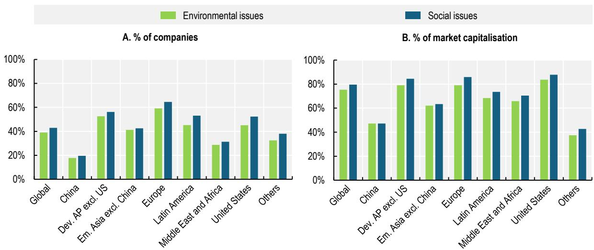  
Source: OECD Capital Market Series dataset; LSEG; FactSet; Bloomberg. See Annex A. for further details.

One way to measure a company's commitment to RBC is whether it commits explicitly to the MNE Guidelines or the UN Guiding Principles on Business and Human Rights – two of the main international instruments on RBC. Only one in three (32%) of large listed companies have an explicit public commitment to either of these two international standards (Figure 2.3), with substantial regional variation. For instance, while commitments to international instruments on RBC are common in Europe (66%) and Developed Asia-Pacific excluding the United States (51%), they are rare in China (4%).

Figure 2.3. References to the OECD Guidelines for Multinational Enterprises on Responsible Business Conduct or the UN Guiding Principles on Business and Human Rights

One in three large listed companies have publicly committed to upholding international RBC standards.

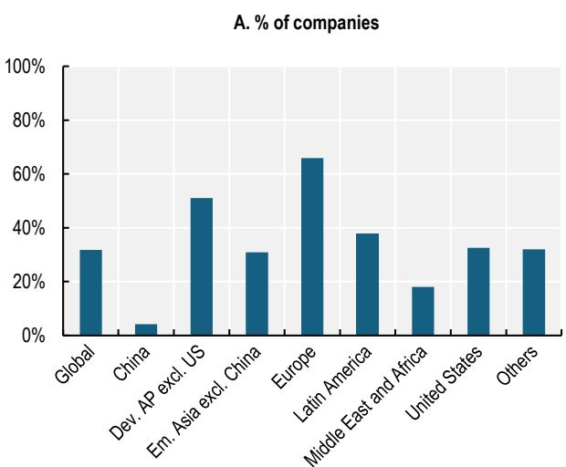

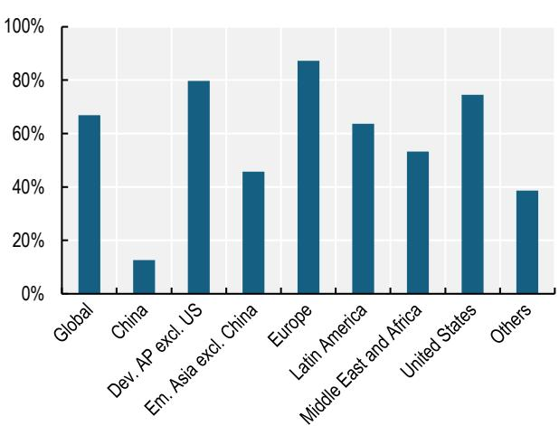  
Source: OECD Capital Market Series dataset; LSEG; FactSet; Bloomberg. See Annex A. for further details.

## Financial risk, the significance of impact, and regulation may be driving the prevalence of commitments related to responsible business conduct

OECD RBC standards recommend that companies focus their due diligence efforts on the areas where the risks of adverse impacts are most significant. Therefore, it could be expected that companies do not have identical RBC policies or other due diligence measures across all possible issues, but that these are adapted to each company's risk profile (see Box 2.1 and OECD (2025[3])).

Public commitments can be driven by existing policies and legislation. For example, uptake of commitments on anti-corruption and bribery is high in the United States (91%) – which may be linked to longstanding anti-corruption legislation (the U.S. Foreign Corrupt Practices Act (1977)) and enforcement. Likewise in recent years, many governments have introduced regulations that cover human rights due diligence as well as regulations related to forced labour and child labour.

Company adoption of commitments on RBC issues could also be driven by a mix of considerations related to their exposure to RBC-related financial risk on the one hand and adverse RBC impacts on the other hand. For example, previous OECD research found that climate change is considered a financially material risk for listed companies accounting for 65% of market capitalisation (OECD, 2025[1]). $^{4}$ In contrast, ecological impacts were considered as financially material risk for companies accounting for only 10% of market capitalisation. These findings broadly align with the prevalence of commitments on related topics, where 62% of companies have a commitment to address GHG emissions – the most prevalent topic after corruption – while commitments to biodiversity are much less prevalent (25%) (Figure 2.1). $^{5}$

While commitments to reduce or avoid impacts on biodiversity are not very common overall, there is marked sectoral variation and three out of the four sectors with the highest prevalence of biodiversity commitments – energy, basic materials (e.g. mining), and consumer non-cyclicals (e.g. food and tobacco) – have been linked to biodiversity impacts (OECD, 2025[3]; 2025[1]; FfB Foundation, 2023[4])(Figure 2.1). In other words, the prevalence of biodiversity commitments seems to bear some association with sectoral risk profiles.

In contrast, there appears to be relatively lower sectoral variation in the adoption of commitments related to topics other than biodiversity, despite different sectors having different risk profiles. Previous research by the OECD found that, compared with other sectors, agriculture, extractives and manufacturing sectors are associated with higher levels of impact, across a wider range of issues, whereas other sectors tend to be associated with a more concentrated set of risks (OECD, 2025[3])(see Box 2.1). Viewed through the lens of sector risk profiles, the prevalence of commitments is indeed generally higher in the consumer non-cyclicals (e.g. food and tobacco) and energy sectors (e.g. oil and gas), but it is not as high as might be expected in basic materials (e.g. mining), consumer cyclicals (e.g. apparel) and technology (e.g. consumer electronics) sectors.

## Box 2.1. Association of industry sectors with environmental and social impacts

Companies in different sectors will be associated with different risks and impacts and may therefore need to prioritise different sets of responsible business conduct (RBC) issues when conducting due diligence. Some sectors may also be associated with more significant levels of impact relative to other sectors.

In 2024, the OECD surveyed 133 experts from over 100 organisations across government, international organisations, the private sector, civil society and academia, asking respondents to identify sectors they associate with significant environmental and social impacts covered by the OECD Guidelines for Multinational Enterprises on Responsible Business Conduct (MNE Guidelines) (OECD, 2023[5]).

☐ Bottom 50% (less frequently selected sectors)

The survey found that, compared with other sectors, agriculture, extractives and manufacturing sectors are associated with higher levels of impact, across a wider range of issues, including human rights risks, labour issues such as occupational health and safety or forced labour, and environmental impacts such as pollution or biodiversity loss. By contrast, other sectors tend to be associated with a more concentrated set of risks.

## Table 2.1. Perceived sector exposure to selected responsible business conduct impacts

Human rights, employment and environmental impacts are perceived to be most widely associated with the agriculture, extractive and manufacturing sectors.  
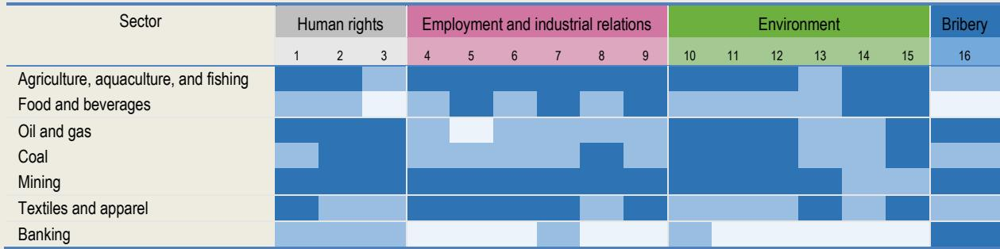  
Top 10% (most frequently selected sectors)

Note: This table presents the results of the survey in a heat map indicating how frequently a set of illustrative sectors are associated with specific types of impacts. Sectors most frequently associated with an RBC issue are shaded in dark blue, those occasionally associated with an RBC issue in medium blue and those rarely or not at all associated with an RBC issue in white. Columns numbered 1 to 16 represent: 1. Human rights impacts, 2. Impacts on communities and local participation issues, 3. Just transition, 4. Freedom of association and collective bargaining, 5. Child labour, 6. Forced labour, 7. Discrimination in employment, 8. Occupational health and safety issues, 9. Poor employment conditions including wages, 10. Climate change, 11. Degradation of ecosystems and biodiversity loss, 12. Air, water and soil pollution, 13. Mismanagement of waste, including hazardous substances, 14. Animal mistreatment, 15. Overuse and wasting of resources, including plastics, 16. Corruption, bribery and extortion. The table presents selected sectors and impact categories for illustrative purposes. Source: OECD (2025[3]), Environmental and social impacts across industry sectors, https://doi.org/10.1787/dd39761c-en.

To understand the relative significance of company exposure to RBC-related financial risks and adverse RBC impacts, the OECD has analysed a sample of double materiality assessments under the EU's Corporate Sustainability Reporting Directive (CSRD). The share of companies reporting that they have a significant negative impact on a given issue often exceeds the share of companies that identify that issue as posing a material financial risk for the company (see Box 2.2).

## Box 2.2. Gaps in materiality assessment of financial risk and adverse environmental and social impacts

The OECD has reviewed a sample of approximately 140 double materiality assessments disclosed in 2025 as part of the first wave of corporate disclosures aligned with the EU's Corporate Sustainability Reporting Directive (CSRD) and the European Sustainability Reporting Standards (ESRS). In these double materiality assessments, companies must disclose positive and negative material impacts, and material financial risks and opportunities associated with their operations and value chains. These reports suggest a materiality gap across key sustainability topics, as well as marked differences in the perceived materiality of topics across the financial and non-financial sectors.

Figure 2.4. Materiality gap between perceived financially material sustainability risks and perceived material adverse sustainability impacts across ESRS topics

Reported negative impacts exceed reported financial risks for all but one of the ten sustainability topics in the non-financial sectors. Companies in the financial sector identify substantially fewer topics as material.

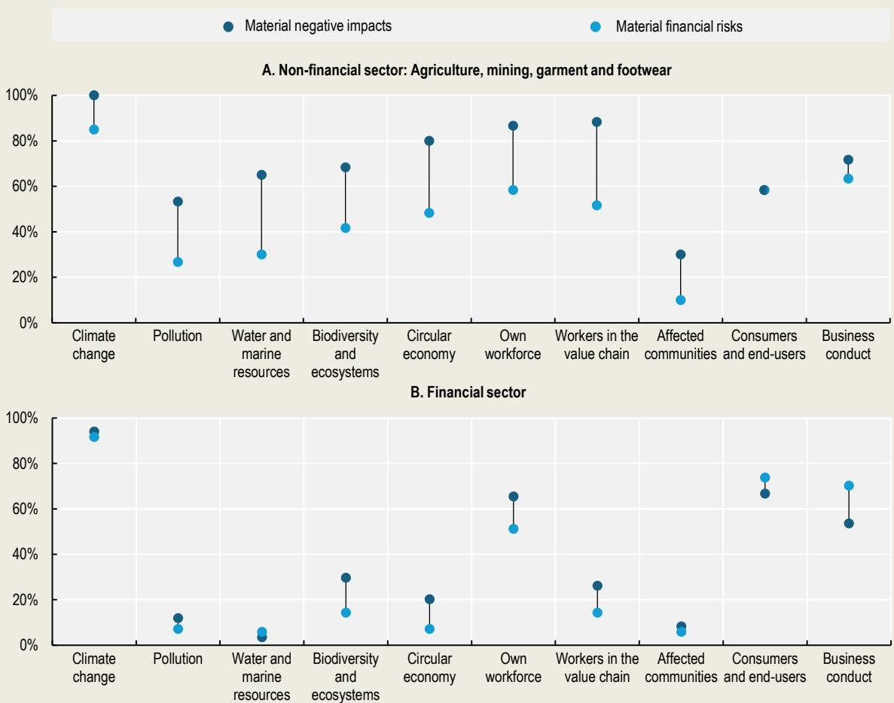  
Note: This figure displays the share of companies that report having a significant negative impact on a given issue, as well as the share of companies identifying that issue as posing a material financial risk. Based on a sample of 144 double materiality assessments by companies reporting under the CSRD. Panel A refers to 60 companies across non-financial sectors: agriculture, mining, garment and footwear value chains, Panel B refers to 84 companies from the financial sector  
Source: OECD compilation based on companies' public disclosures, as listed by TRR 266 Accounting for Transparency (2025) Sustainability Reporting Navigator (dataset), https://www.srnav.com/, selected based on the Reference data Business Classification (TRBC) industry groups and industries from LSEG.

Across all but one of the ten sustainability topics, the share of companies in the non-financial sector reporting that they have a significant negative impact on a given issue exceeds the share of companies identifying that issue as posing a material financial risk (see Figure 2.4, Panel A). This materiality gap is largest for workers in the value chain (37 p.p.), water and marine resources (35 p.p.), circular economy (32 p.p.), and own workforce (28 p.p.). The gap appears smaller for climate change (15 p.p.), and business conduct which includes bribery and corruption (8 p.p.), while no such gap appears to exist for sustainability risks and impacts related to consumers and end-users. The reasons behind the gaps in materiality across topics require further exploration. For example, whether the gap reflects challenges related to correct assessment and disclosure of risks and impacts, and to what extent the differences reflect a real or perceived lack of financial and business incentives to address certain impacts.

Companies in the financial sector identify substantially fewer topics as material than in the non-financial sectors, both in terms of negative impacts and financial risks (see Figure 2.4, Panel B). Key material topics in the financial sector include climate change, own workforce, consumers and end-users and business conduct. Overall, the share of companies identifying negative impacts is lower than that of non-financial companies for nine out of ten sustainability topics (and for seven topics in the case of material financial risks). Notably, for topics such as pollution, water and marine resources, circular economy and affected communities, the share of financial sector companies identifying material negative impacts or financial risks does not exceed 20%. Given their business relationship with companies in the real economy – through the provision of financial services – the difference between the perceived materiality of many topics across the financial and non-financial sectors also requires further analysis.

## Senior sustainability functions are increasingly common while sustainability-linked remuneration is less so

Two indicators are used to assess the degree to which companies have embedded RBC into their management systems: 1) whether they have a dedicated Corporate Social Responsibility (CSR) committee or team at board or senior management level with decision making authority over CSR strategy; and 2) whether the companies have a policy linking executive compensation to ESG or sustainability performance. Several studies have identified that board and committee oversight of sustainability-related issues improves overall risk management efficiency, helps to align company initiatives on sustainability with the overall strategy, and strengthens the boards' own ability to identify and monitor risks and impacts (Amiraslani et al., 2025[6]; KPMG, 2023[7]).

Most large listed companies report having a board-level or senior management sustainability committee in place (60%) but fewer disclose remuneration incentives tied to sustainability performance (35%) (Figure 2.5). Europe represents a notable exception, with disclosure rates broadly similar across both practices and the highest across all regions. Uptake of both practices is lowest in China, where around 33% of companies have a sustainability committee and 14% note senior management remuneration policies. The contrast between the uptake of both practices is most striking in Emerging Asia excluding China, where over four times as many companies have sustainability committees in place compared to senior management remuneration policies. Previous OECD research also suggests that the prevalence of board committees overseeing sustainability risks has increased since 2022 (OECD, 2024[8]; 2025[1]).

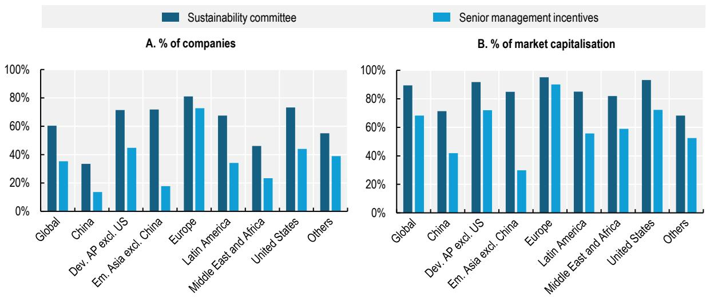  
Source: OECD Capital Market Series dataset; LSEG; FactSet; Bloomberg. See Annex A. for further details.

## Figure 2.5. Board-level or senior management responsibility and performance incentives for sustainability

While 60% of large listed companies have a sustainability committee, just over one-third have a compensation policy where senior manager remuneration is based partly on sustainability performance.

## Identifying and assessing risks and impacts

Risk identification and assessment helps companies to target and prioritise actions to address real and potential impacts in their operations and supply chains. Under OECD RBC standards, companies are expected to conduct a high-level risk scoping exercise to identify general areas where impacts may be most likely and severe. Based on findings, they are expected to prioritise specific operations, business relationships or areas of activity for in-depth risk assessments. Such assessments should be proportionate and appropriate to the company's circumstances (e.g. size, complexity of supply chains) and the severity and type of risks identified.

Due diligence expectations cover company operations, supply chains and other business relationships. This section focuses predominantly on company efforts to identify and assess risks in their supply chains, which is often where the most significant impacts occur.

## Few companies are assessing environmental and social risks in their supply chain

This section examines how companies identify and assess risks and impacts in their supply chains, drawing on two sets of indicators: 1) whether companies disclose that they use human rights or environmental criteria for selecting suppliers, $^{6}$ which might imply the existence of supplier policies or codes of conduct and, more generally, that they have RBC expectations of their suppliers on environmental or social issues; and 2) whether companies report evaluating supplier risk on these issues. Taken together, these indicators serve as partial proxies for the uptake of due diligence practices in this area, even if they do not capture every dimension of supply chain risk identification and assessment.

Nearly half of large listed companies report using environmental (47%) or human rights (48%) criteria to select their suppliers (Figure 2.6). These supplier expectations are most prevalent among companies headquartered in Europe, followed by Latin America, for environmental criteria, and the United States, Latin America and Developed Asia-Pacific for human rights criteria. The share of companies using such criteria for selecting suppliers is lowest in China. In most regions, expectations of suppliers with respect to human rights criteria are either as prevalent or somewhat more widespread than with respect to environmental criteria; China is a notable exception, where companies are more than twice as likely to disclose the use of environmental criteria as human rights criteria to select suppliers.

## Figure 2.6. Environmental and social expectations of suppliers versus evaluation of supplier risk

While nearly half of large listed companies report using environmental or human rights criteria to select their suppliers, fewer than 20% report that they evaluate supplier risk according to such criteria.

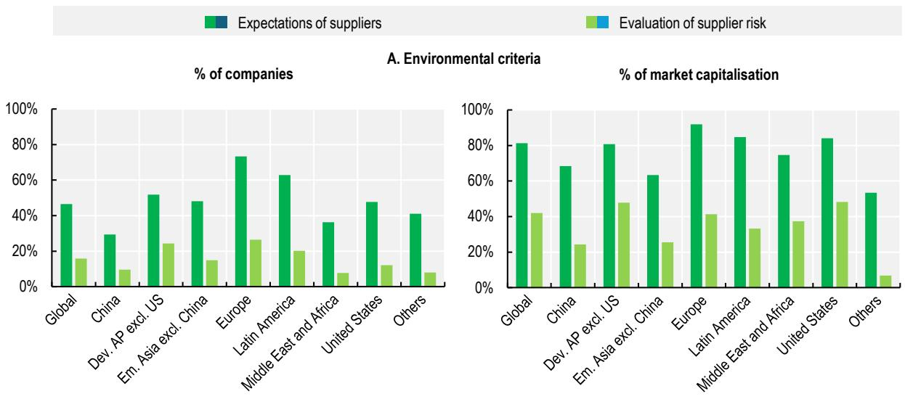

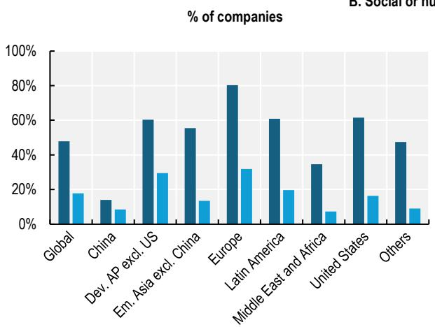

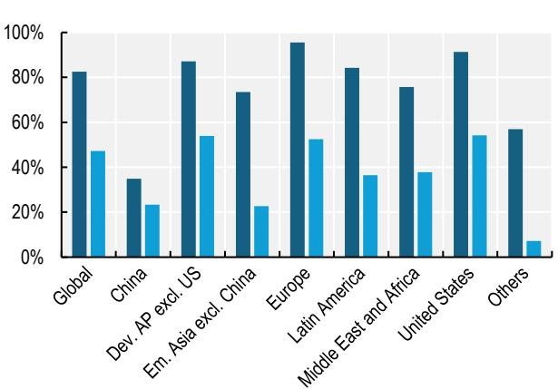  
Note: For each region, the first bar refers to Expectations of suppliers, and the second bar refers to Evaluation of supplier risk. Source: OECD Capital Market Series dataset; LSEG; FactSet; Bloomberg. See Annex A. for further details.

The share of large listed companies that report evaluating supplier risk according to environmental and social criteria is far lower at 16% and 18% respectively (Figure 2.6). Evaluation of supplier risk is most common among companies headquartered in Europe and Developed Asia-Pacific excluding the United States, and lowest in the Middle East and Africa and China. Companies that report evaluating supplier risk with respect to environmental and social issues cover 42% and 47% of market capitalisation respectively, indicating that this practice is concentrated among larger companies. This is particularly pronounced in the United States, where coverage by market capitalisation is approximately three to four times higher than as a share of companies, making the United States the region with the highest uptake according to market capitalisation, alongside Developed Asia-Pacific.

Overall, these figures may be interpreted as suggesting that many companies expect their supplier to live up to social and environmental criteria, but few companies have systems in place to evaluate whether these criteria are being met in practice. This finding is consistent with those from the World Benchmarking Alliance, which reports that while almost half of the 2 000 most influential companies have a supplier code of conduct, only approximately 10% identify and assess human rights risks in their supply chains (WBA, 2026[9]).

## Supplier assessments are taking place without a clear prioritisation process

Where supplier assessments are taking place, there is evidence that companies evaluate all suppliers equally, regardless of their actual risk profile. A recent study found that 63% of companies that carry out supplier sustainability assessments do it without any prior screening process, meaning that they assess all their suppliers irrespective of their risk profile (S&P Global, 2025[10]).

Two surveys conducted following the introduction of due diligence legislation in France and Germany suggest that regulated companies tend to use supplier questionnaires broadly. For example, in France, 78% of suppliers reported being regularly asked for sustainability information, and 77% were asked to provide similar data on their own tier-1 suppliers; and in the context of the German Supply Chain Act, 41% of surveyed SMEs reported being contacted about their human rights or environmental risks (Bpifrance, Orse and PwC, 2022[11]) (German International Chamber of Commerce, 2023[12]). These practices have led some regulators to introduce clearer guidance about application of the risk-based approach when assessing suppliers (see section on Due diligence policy).

## Many companies face challenges in extending due diligence beyond tier-1 suppliers

To understand the extent to which companies have visibility and extend their due diligence beyond tier-1, this section uses indicators on the coverage of different supply chain tiers by companies' social audit programmes for a sample of approximately 450 large listed companies (Figure 2.7). $^{7}$ It should be noted that this data is based on a different sample compared to Figure 2.6, so figures are not directly comparable. In addition, Figure 2.8 uses an indicator measuring the estimated share of a company's relevant products for which raw materials have a known origin, available for a different sample of around 500 large listed companies. $^{8}$

Of these 450 large listed companies, almost 70% report that their social audit programmes cover at least some of their tier-1 suppliers, while around 30% cover their tier-2 and 20% their tier-3 suppliers (Figure 2.7). $^{9}$ Based on a different sample of around 500 large listed companies in industries sourcing from the mining sector, around 30% of companies reported knowing the country where the ore was mined for at least some of their relevant raw materials, and only 3% knew where all relevant raw materials came from (Figure 2.8).

Figure 2.7. Supplier coverage by social audit programmes, by tier, in a sub-sample of large listed companies  
Social audit programmes are concentrated at the first tier, with more limited coverage further upstream.  
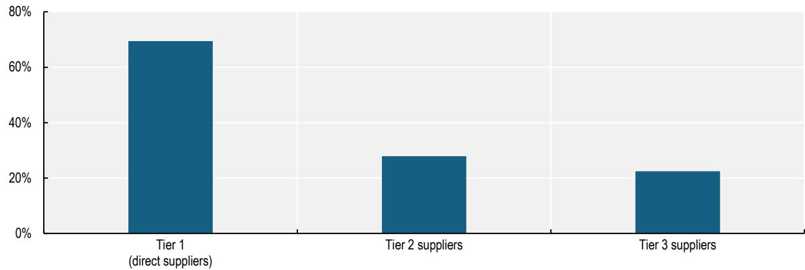  
Note: This figure is based on three indicators with different coverage (up to \~450 large listed companies). Given the lower coverage of this data, for each indicator, the rate of uptake was expressed as a percentage of companies in the sub-sample for which data was available, and is based on the latest available data between 2021 and early 2026. Of the companies for which data on tier-1 coverage of audits is available, around 35% cover at least some tier-2 or tier-3 suppliers (or both). For the purpose of this figure, a company's audit programme is counted as covering a given tier if it covers at least some suppliers in that tier.  
Source: OECD Capital Market Series dataset; LSEG; FactSet; Bloomberg; MSCI. See Annex A. for further details.

Figure 2.8. Estimated share of relevant raw materials with known origin in a sub-sample of large listed companies in industries sourcing from the mining sector

Most companies do not report knowing the origin of any relevant raw materials.

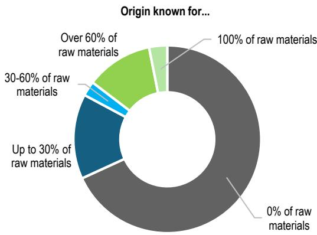  
Note: This chart provides the distribution of companies, by share of relevant raw materials for which the origin is known (at least at the country-level). Given the lower coverage of this data, the distribution is expressed as a percentage of companies in a sub-sample of around 500 large companies for which data was available, and is based on latest available data between 2021 and early 2026.  
Source: OECD Capital Market Series dataset; LSEG; FactSet; Bloomberg; MSCI. See Annex A. for further details.

Constraints arising from recent due diligence regulation and privacy protection law may also restrict companies from requesting information from business partners classified as SMEs or from suppliers operating in certain jurisdictions, which can also complicate the efforts of companies to undertake due diligence upstream (OECD/IEA, 2025[13]).

## Extending due diligence beyond tier-1 is important to effectively mitigate risks and avoid supply-chain disruptions

Supply chain disruption risk tends to increase beyond direct business partners. A recent survey found that the risk of disruption grows at each tier of the supply chain, i.e. is 21% higher at tier 2 than tier 1 and up to 38% higher by tier 3 (BCG, 2023[14]). Similarly, during the COVID-19 pandemic, a business survey identified that 40% of supply chain disruptions were occurring in tier 2 and beyond (BCI, 2021[15]). Therefore, limiting due diligence to tier-1 business partners can lead companies to overlook significant risks and impacts, which are often accentuated further upstream. For example, a network analysis of 900 million supply chain links estimated that exposure to child or forced labour rises from 8.5% of EU companies at tier 1 to 82% at tier 2 and 99% at tier 3 (Hurt et al., 2023[16]), with a separate study estimating that 78% of forced labour cases occur at tier 2 and beyond (EcoVadis, 2025[17]).

Many companies are looking to supply chain transparency and, where relevant, material tracing, as well as sustainability initiatives to support them in extending due diligence further upstream (see Box 2.3 and the following section).

## Box 2.3. Sustainability initiatives as multipliers of supply chain due diligence

This box presents preliminary findings from an OECD pilot study to map sustainability initiatives using an AI-assisted methodology. Drawing on sustainability disclosures by the 500 largest listed companies (2020-2025) this exercise identified nearly 1 100 unique sustainability initiatives. These initiatives can be multistakeholder, industry, or government-run and can fulfil a wide range of due diligence functions across different supply chain segments, geographies and issues. Initiatives may carry out facilitation activities (such as risk monitoring, capacity building, co-ordinating grievance mechanisms, or supporting collective remediation) or verification activities (such as auditing, certifying, or benchmarking companies, sites, or products against defined requirements); many carry out both, including in upstream segments of supply chains.

## Figure 2.9. Number of sustainability initiatives over time, by function

The landscape has broadened and diversified since the early 2000s, with many initiatives undertaking both facilitation and verification roles.

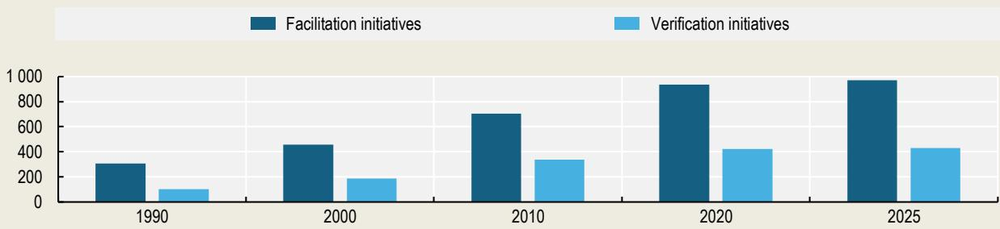  
Note: This figure shows the cumulative number of sustainability initiatives by function, based on the year in which each initiative was founded. Facilitation includes functions such as guidance, training, sector dialogues, risk monitoring, complaints handling and reporting frameworks; verification includes assessments, audits, certification, or benchmarking. Many initiatives perform multiple functions, so totals by function exceed the number of unique initiatives in each year. See OECD/ITC (2024[18]) for more details on the terms facilitation and verification. Figures are based on preliminary results from OECD research piloting an AI-assisted methodology for mapping sustainability initiatives in corporate disclosures and may be refined as the methodology and dataset are further developed. The dataset is derived from initiatives referenced in company disclosures between 2020 and 2025 and may therefore underrepresent initiatives that ceased operations or lost prominence before 2020. As a result, part of the observed upward trend may reflect survivorship and visibility effects, rather than only an increase in the absolute number of initiatives over time.

Source: OECD Sustainability Initiative Dataset.

Around 970 (89%) of the identified initiatives include facilitation components, while approximately 430 (39%) conduct assessments and/or certification. As such, many initiatives conduct a mix of verification and facilitation activities. The number of identified initiatives has grown steadily over the past two decades, increasing from around 500 in 2000 to approximately 1 050 in 2020 (Figure 2.9). This expansion reflects the diverse and dynamic nature of the landscape, with initiatives frequently updating their activities, standards, and governance structures (OECD/ITC, 2024[18]; OECD, 2022[19]).

Large listed companies draw on a wide range of sustainability initiatives, highlighting both the density and influence of the initiatives ecosystem. On average, companies reference 24 different initiatives in their disclosures, with some citing nearly 100. At the same time, some individual initiatives command substantial market coverage: the Carbon Disclosure Project is referenced by firms representing 71% of the market capitalisation of the top 500 companies, while cross-sectoral initiatives such as the Forest Stewardship Council are cited by 50% of the market capitalisation. Sector-specific initiatives, such as the Responsible Business Alliance show similarly high uptake, being referenced by up to 80% of market capitalisation in select sectors such as mining. These patterns suggest that companies rely on numerous initiatives and that a small sub-set of them may exert significant influence across global markets.

For more information on the OECD's work on sustainability initiatives, visit https://www.oecd.org/en/topics/sub-issues/due-diligence-guidance-for-responsible-business-conduct/sustainability-initiatives-for-responsible-business-conduct.html.

## Traceability systems can enhance visibility across supply chains but come with limitations

Traceability systems – long used in the food industry for safety and rapid recall capabilities – are increasingly being adopted and invested in by a wide range of other industries to support their supply chain due diligence and respond to regulatory requirements.

Traceability refers to the capacity to track and verify the following core data elements along the supply chain: origin, geographical path, chain of custody, and physical evolution (OECD/IEA, 2025[13]). Some traceability mechanisms can also be used to transmit information on risks in a product's supply chain and to what extent suppliers may have addressed them (e.g. water consumption or greenhouse gas emissions) or on product quality (e.g. engineering specifications or purification levels).

“Traceability” as a term is often used as shorthand for a range of supply chain transparency measures including supply chain mapping and auditing. However, importantly, traceability does not usually provide information on the circumstances under which products are produced, traded or sold. Thus, while tracing materials can be a tool for enhancing visibility into supply chains, it is not enough to identify or address risks and impacts.

Full tracing of materials in supply chains is also unlikely to be possible nor financially viable in most cases due to various challenges. Implementation costs can be high. A variety of data collection models prevail, resulting in a lack of interoperability along the supply chain and impeding the seamless flow of data between companies. Supply chain actors may also have limited incentives to share information, including due to commercial confidentiality concerns and to legislation preventing information-sharing. Data quality and accuracy remain a challenge for the overall reliability of traceability systems, especially in jurisdictions with weak governance. Additionally, traceability is not always practically feasible, for example where materials are mixed e.g. at the processing phase of minerals and ores or in some agricultural commodities, such as cotton.

Risk-based approaches to traceability, when warranted (e.g. because of higher risks in supply chains, regulatory compliance or strategic access considerations), paired with robust supply chain transparency systems (e.g. traditional chain of custody documentation), can play a role in helping companies identify and respond to adverse impacts in segments beyond tier 1 of their supply chain. However, any policy approach to traceability should balance its advantages with ensuring expectations are reasonable and proportionate for business.

## Companies commonly report that they engage with stakeholders, few do so on issues related to human rights impacts

Stakeholder engagement, a due diligence measure in itself, is important for identifying and assessing adverse impacts and risks. Stakeholder engagement enables businesses to obtain information on actual or potential adverse impacts directly from relevant stakeholders, particularly on human rights issues that may not be readily observable through desk-based research or through publicly available sources. Meaningful engagement with workers, trade unions, affected communities, civil society organisations or experts can help companies understand how risks manifest in practice, validate risk assessments, triangulate information and identify impacts in higher-risk operations and supply-chain tiers.

This report uses two metrics to measure stakeholder engagement. The first indicates whether companies disclose how they engage with stakeholders, considering how they involve stakeholders in their decision-making process and the procedures in place for engagement, with a focus on having established two-way communication between the company and its various stakeholders; it is not specific to RBC issues or specific types of stakeholders. The second indicator measures whether the company has undertaken stakeholder engagement specifically on human rights issues, and refers to ongoing engagement with affected stakeholders or their representatives to address human rights concerns. While these two indicators can provide insights into a company's propensity to engage with stakeholders, they do not fully measure whether engagement is meaningful.

Over half of large listed companies (52%) report conducting some form of stakeholder engagement, however, only very few (8%) state that they engage stakeholders on human rights issues specifically (Figure 2.10). Reported evidence of stakeholder engagement is most prevalent in Europe and Emerging Asia excluding China and least prevalent in the United States and China. Stakeholder engagement on human rights issues appears to be most prevalent in Developed Asia-Pacific, excluding the United States, and least prevalent in China.

The gap between the prevalence of broad stakeholder engagement and stakeholder engagement focussed on human rights issues could suggest that mainstream stakeholder engagement is often linked to broader communication and external affairs processes and may not be connected to a due diligence process aimed at seeking stakeholder input to identify and respond to impacts. This is consistent with findings from the World Benchmarking Alliance, which finds that only 13% of the 2 000 companies assessed as part of its social benchmark involve affected stakeholders in their human rights risk identification and assessment process, and only 4% involve stakeholders when deciding on responses to these risks (World Benchmarking Alliance, 2026[20]).

Figure 2.10. Disclosure of stakeholder engagement

Over half of large listed companies report conducting stakeholder engagement but few state doing so on human rights issues.

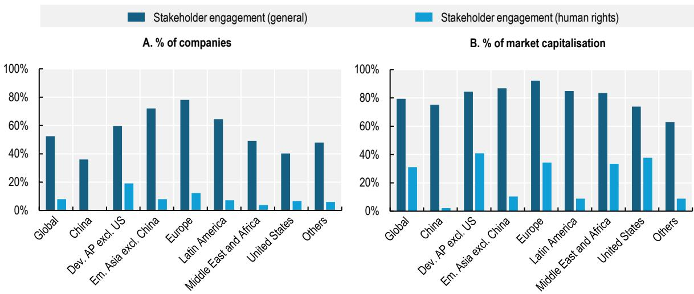  
Source: OECD Capital Market Series dataset; LSEG; FactSet; Bloomberg. See Annex A. for further details.

## Prevention, mitigation and remediation of impacts

Prevention, mitigation and remediation of impacts are key to ensuring that RBC due diligence delivers real outcomes.

Under OECD RBC standards, companies are expected to address their adverse impacts through the adoption and implementation of prevention and mitigation measures. Furthermore, where a company has caused or contributed to an adverse impact, the company is expected to provide or co-operate in remediation. Providing or co-operating in effective grievance mechanisms for stakeholders to raise grievances is the other key component of remediation.

Prevention, mitigation, and remediation measures are the outcome of earlier steps in the due diligence process, notably the proper identification and assessment of risks and impacts. They depend on what the impact is and how a company is connected to it. This diversity makes it difficult to comprehensively or comparably measure uptake and implementation of prevention and mitigation actions across companies.

Notwithstanding, to better understand the uptake of prevention, mitigation and remediation measures of the largest global listed companies, the section draws on a selection of relevant indicators.

First, it considers two indicators available in the context of health and safety in own operations, namely 1) the adoption of health and safety management systems; and 2) whether a company has involved staff in safety improvement initiatives – for example through employee health and safety committees. The latter serves as a proxy for stakeholder engagement specifically as part of impact prevention and mitigation (Figure 2.11).

Second, three specific indicators related to prevention and mitigation in the supply chain are analysed, namely: 3) supplier training on sustainability topics; 4) the integration of social supply chain policies into companies' purchasing policies, daily activities (e.g. contract management) and training of purchasing teams – arguably a proxy for whether companies integrate RBC into their purchasing practices – and 5) whether companies disclose improvements in health and safety in the supply chain (Figure 2.12).

Third, to assess company remediation practices the section looks at indicators related to 6) having formal grievance mechanisms that cover human rights explicitly, guarantee confidentiality or anonymity and are available to both internal and external stakeholders; and 7) whether a company commits to provide remediation to affected stakeholders where it has been identified that it has caused or contributed to human rights impacts (Figure 2.13).

Fourth, this section looks at indicators measuring whether companies disclose that they are willing to end a business relationship with a sourcing partner if 8) environmental or 9) human rights criteria are not met (Figure 2.14).

## While almost half of companies have established health and safety management systems, far fewer involve employees in safety improvement initiatives

In the context of health and safety, there seems to be a substantial gap between companies reporting on their adoption of management systems (46%), and on the participation of staff in safety improvement initiatives (18%) (Figure 2.11).

Disclosure of health and safety management systems is most prevalent in Emerging Asia excluding China, followed by Europe and Latin America, and lowest in China. The share of companies reporting on staff participation in health and safety improvement initiatives is highest in Latin America, followed by Developed Asia-Pacific excluding the United States, and lowest in China. Disclosure rates for both health and safety practices are highest in the energy, utilities and basic materials sectors, and lowest in the financial sectors, which may partially reflect differences in sector risk profiles.

While these indicators are specific to the topic of health and safety, they signal a potential under-use of stakeholder engagement as part of prevention and mitigation activities.

Figure 2.11. Health and safety impact prevention and mitigation measures in own operations  
While more than 45% of companies have established health and safety management systems, fewer than 20% involve employees in safety improvement initiatives.  
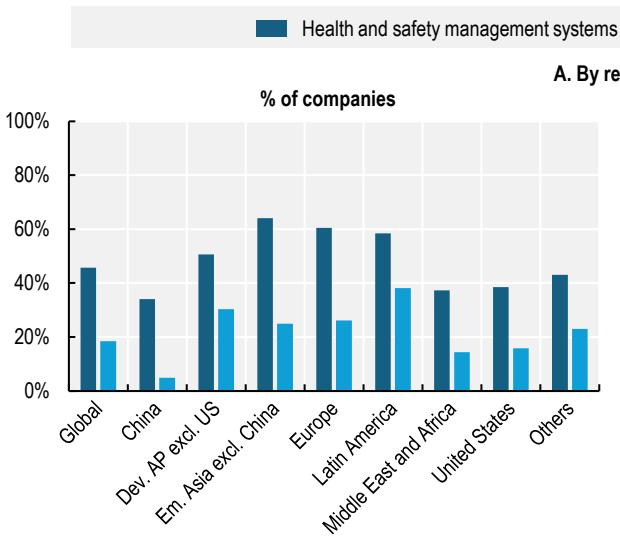

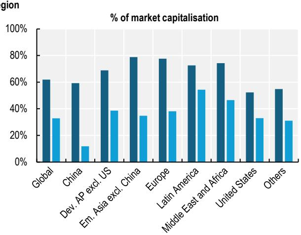

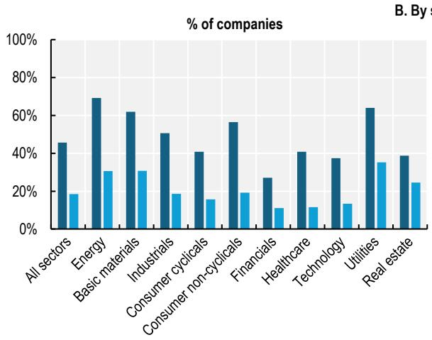

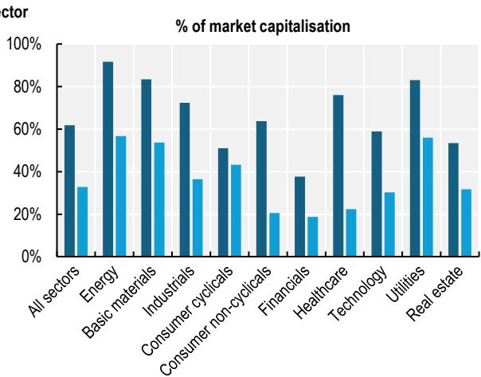  
Source: OECD Capital Market Series dataset; LSEG; FactSet; Bloomberg. See Annex A. for further details.

## Uptake of prevention and mitigation measures in the supply chain is low across the board

Disclosure of prevention and mitigation measures in the supply chain is generally low. One-quarter of companies report providing training or collaborating with suppliers to improve their performance on environmental and social issues (Figure 2.12). Fewer than one in ten companies (7%) integrate their social supply chain policy into their purchasing practices. Strikingly, only 3% of companies appear to have disclosed health and safety improvements in their supply chains. This low observed disclosure rate may be partly explained by the fact that outcome metrics are generally less reported on and measured than input-based metrics, even though outcome metrics are key to tracking the effectiveness of company due diligence (see also section on Communicating on how impacts are addressed).

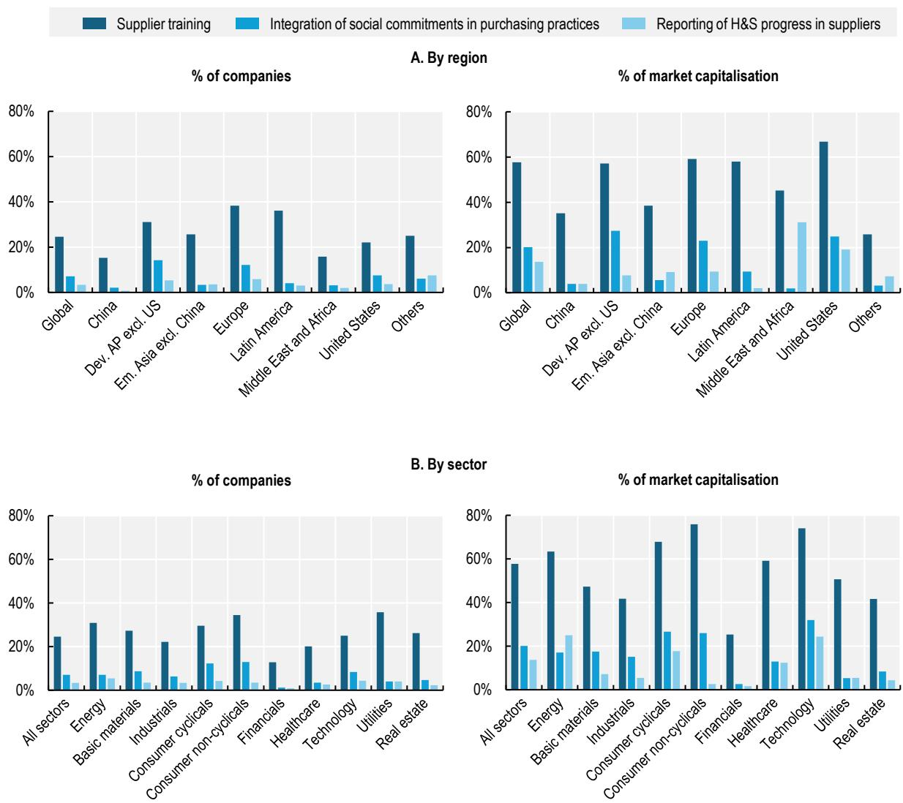  
Figure 2.12. Specific prevention and mitigation measures in the supply chain  
Note: H&S = health and safety.  
Source: OECD Capital Market Series dataset; LSEG; FactSet; Bloomberg. See Annex A. for further details.

Of the three specific prevention and mitigation measures considered, supplier training is the most widely reported on (25%). Disclosures of social supply chain policy integration into purchasing practices (7%) and health and safety improvements in the supply chain (3%) are far less prevalent.

Reported uptake of supplier training is highest in utilities (36%) and consumer non-cyclicals (34%) and lowest in the financial sector (13%). Disclosure of social supply chain policy integration into purchasing practices ranges from 1% of companies in the financial sector – where many risks lie downstream (e.g. in association with investee companies) – to 12-13% in consumer non-cyclicals and consumer cyclicals; the latter includes the garment sector, where responsible purchasing practices are an important measure to prevent contribution to adverse impacts (OECD, 2018[21]). $^{10}$ Disclosure of supply chain improvements in health and safety is most prevalent in the energy and technology sectors (4-5%) and, as with other supply chain measures, least prevalent in the financial sector (1%).

Disclosure of prevention and mitigation measures in the supply chain is uneven across regions, with the prevalence of supplier training highest in Europe (38%), followed by Latin America (36%) and lowest in China and the Middle East and Africa (15-16%). Reporting on social supply chain policy integration into purchasing practices is most common in Developed Asia-Pacific excluding the United States (14%) and Europe (12%), and lowest in Emerging Asia excluding China (3%), the Middle East and Africa (3%) and China (2%). Disclosure of health and safety improvements in the supply chain is most widespread in Europe (6%) and Developed Asia-Pacific excluding the United States (5%), and least common in China (1%), the Middle East and Africa (2%) and Latin America (3%).

## Uptake of remediation measures is limited, with higher rates of implementation amongst larger companies

The reported prevalence of remediation practices is limited. Globally, 17% of companies report having a formal grievance mechanism on human rights, while 10% commit to provide remediation to affected stakeholders for human rights impacts (Figure 2.13). The prevalence of grievance mechanisms is highest in Emerging Asia excluding China and is lowest in China. Commitments to remedy are most common in Developed Asia-Pacific excluding the United States and least prevalent in China. However, uptake is substantially higher when measured by market capitalisation: reported grievance mechanism adoption rises from 17% of companies to 41% by market capitalisation globally and from 10% to 32% for commitments to remedy, suggesting that the largest companies are driving reported uptake of these practices. This divergence is especially pronounced in the United States with regards to commitments to remedy: while 6% of companies report having such commitments, their coverage by market capitalisation is six times higher (37%).

Figure 2.13. Existence of human rights grievance mechanisms and commitment to remedy

Public commitments to remedy are less prevalent than the existence of grievance mechanisms.

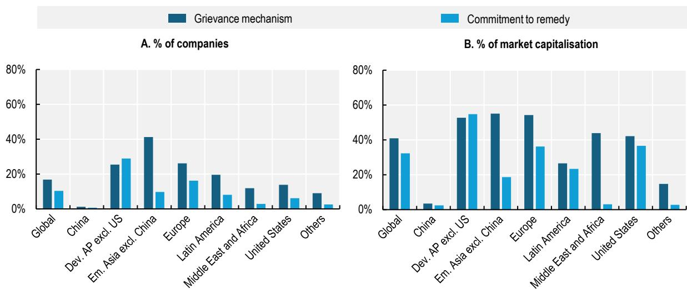  
Source: OECD Capital Market Series dataset; LSEG; FactSet; Bloomberg. See Annex A. for further details.

About a quarter of companies report that they are willing to disengage from a supplier if environmental or human rights criteria are not met

According to OECD standards on RBC, disengagement from a business relationship may be appropriate either after failed attempts at mitigation, or where the enterprise deems mitigation not feasible, or because of the severity of the adverse impact. However, where it is possible for enterprises to continue the relationship and demonstrate a realistic prospect of, or actual improvement over time, such an approach will often be preferable to disengagement.

Respectively, 24% and 22% of enterprises report they are willing to disengage from a sourcing partner if environmental or human rights criteria are not met (Figure 2.14). Disclosure of willingness to disengage is highest in Europe and the United States, and lowest in China and the Middle East and Africa.

Figure 2.14. Willingness to disengage from a supplier if environmental or human rights criteria are not met

Between one-fifth and one-quarter of companies are willing to end a supplier relationship if environmental or human rights criteria are not met.

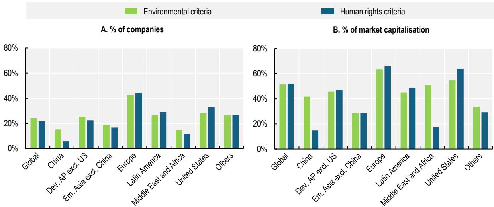  
Source: OECD Capital Market Series dataset; LSEG; FactSet; Bloomberg. See Annex A. for further details.

These findings may indicate that many companies can be sensitive to reputational and other risks that may arise from engaging in higher risk environments.

Disengagement in the context of due diligence remains a complex and challenging area for businesses, as it is highly context dependent. Companies are often unsure whether to disengage from a business relationship and how to disengage without causing unintended adverse impacts. This is further complicated by divergent approaches on the topic in recent due diligence legislation, which can result in companies facing inherently conflicting obligations for the same issue (OECD, 2026[22]).

## There is a marked discrepancy between the uptake of policies and actions to address impacts

Figure 2.15 summarises the average company's disclosure on due diligence, measured as the percentage of practices disclosed by each company for different areas of due diligence – including policies and management systems, risk identification, tracking and reporting (“identifying impacts”), and prevention, mitigation and remediation (“addressing impacts”) and illustrates associated sectoral and regional variation. $^{11}$

## Figure 2.15. Uptake of due diligence policies and management systems versus measures to identify and address adverse environmental and social impacts

Disclosure of due diligence uptake displays stronger regional than sectoral variation. However, regions with high overall due diligence uptake also show substantial implementation gaps, suggesting that due diligence uptake is focussed on policies and management systems.

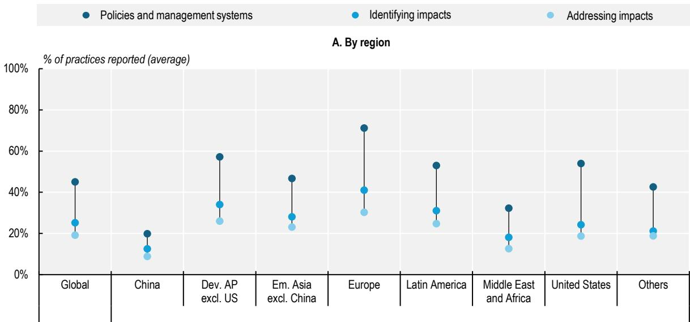

B. By sector  
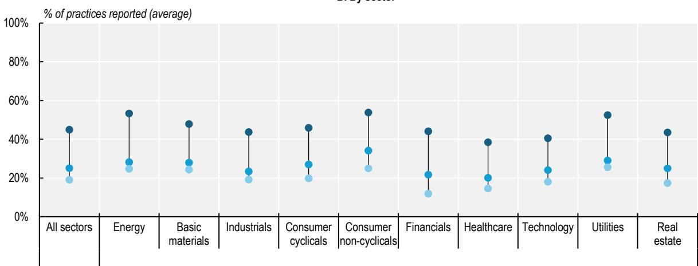

Note: This figure shows the average coverage of companies' due diligence practices, relative to the set of practices measured in this report. For example, globally on average, companies report around two of nine practices related to addressing impacts, so the light blue circle represents a value of around 20%. The category "Identifying impacts" also includes measures to track and report on implementation and results, and the category "Addressing impacts" includes prevention, mitigation and remediation measures. See Annex A. for methodology.
Source: OECD Capital Market Series dataset; LSEG; FactSet; Bloomberg. See Annex A. for further details.

The uptake of due diligence practices associated with policies and management systems (45% as a share of all practices considered in this report) is much higher compared to measures related to impact identification, tracking and reporting (25%), and prevention, mitigation and remediation of impacts (around 20%) as illustrated by the distance between the light blue and dark blue circles (Figure 2.15). This suggests a substantial gap between the uptake of policies related to RBC and measures to identify and address real and potential impacts. These findings are consistent across regions and sectors. This pattern is visible both amongst large listed SOEs and non-SOEs (Box 2.4).

Non-SOEs

Regional SOE distribution (bar)

These findings align with previous OECD research on mineral supply chain due diligence, which found that while 50% of companies disclosed on (RBC) management systems, fewer than 20% disclosed on prevention and mitigation measures (OECD, 2022[23]).

## Box 2.4. Due diligence uptake by large listed state-owned enterprises (SOEs)

In most regions, SOEs report higher uptake of due diligence than non-SOEs including with respect to prevention, mitigation and remediation measures.

In most regions, reported uptake of prevention, mitigation and remediation measures is higher among SOEs $^{1}$ than non-SOEs (Figure 2.16). In Europe, the difference in reported uptake of prevention, mitigation and remediation practices between SOEs and non-SOEs is significantly larger than in the case of policies and management systems. Globally, the due diligence of large listed SOEs is less extensive than that of non-SOEs (Figure 2.16) because SOEs are disproportionately headquartered in China where reported uptake is markedly lower than the global average.

## Figure 2.16. Uptake of responsible business conduct due diligence: SOEs and non-SOEs

In most regions, due diligence uptake by large listed SOEs is similar to or higher than that of non-SOEs. However, SOEs are concentrated in China, where uptake is generally lower than in other regions, regardless of ownership.

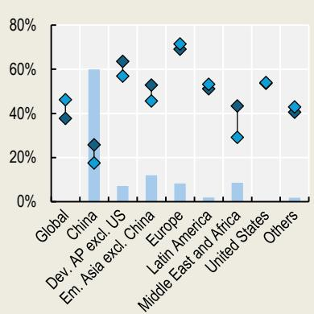

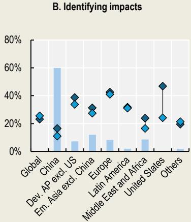

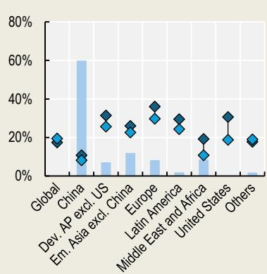  
Note: This figure shows the average coverage of companies' due diligence, relative to the set of practices measured in this report. For example, globally on average, non-SOEs report around two of nine practices related to addressing impacts, so the first turquoise diamond in Panel C represents a value of around 20%. The category "Identifying impacts" also includes measures to track and report on due diligence implementation and results, and the category "Addressing impacts" includes prevention, mitigation and remediation measures. See Annex A. for methodology. Reported uptake by SOEs in Latin America, the United States, and the "Other" region is based on a very small number of companies, so these results should be treated with caution.

Source: OECD Capital Market Series dataset; LSEG; FactSet; Bloomberg. See Annex A. for further details.

1. State-owned enterprises (SOEs) are defined as companies with at least 25% public-sector ownership.

This gap may reflect the journey companies go through when embedding due diligence in their operations, in that it is natural to begin with policies before moving to implementation. In this case the gap should close over time. It may also reflect the fact that introduction of policies is comparatively easier than implementation of those policies – which is markedly more complex and resource intensive, particularly in the context of supply chains. It may also reflect corporate reporting practices. Corporate sustainability reporting typically favours input-based disclosures over evidence of implementation. A review of 1 000 EU-based sustainability reports found that while 57% reported on human rights risks, fewer than 4% reported specific actions taken to manage them (ACT, 2020[24]). This may in part be driven by market expectations in which companies operate in. A recent OECD study of the metrics used by ESG rating providers found that $68\%$ of ESG metrics used by those providers rely on input-based datapoints, with only one-third capturing outcomes – a structure that risks incentivising box-ticking over substantive prevention and mitigation (OECD, 2025[25]).

## The gap between uptake of commitments and actions is well documented and may have implications for due diligence effectiveness

The gap between commitments and implementation is also found in other studies. For example, the 2023 Corporate Human Rights Benchmark, covering 110 of the largest apparel and extractive companies, found that while 77% committed to respecting human rights only 34% allocated clear responsibilities for day-to-day implementation and provided human rights training. $^{12}$ In apparel, 93% of companies placed contractual expectations on suppliers related to human rights or gender equality, yet only 27% disclosed evidence of enabling suppliers to meet those expectations through responsible purchasing practices (World Benchmarking Alliance, 2023 $^{[26]}$ ; 2023 $^{[27]}$ ). In a similar vein, KnowTheChain benchmarks across ICT, apparel and footwear, and food and beverage sectors consistently find that companies score highest on commitment and governance, and lowest on steps that translate commitments into outcomes such as purchasing practices, freedom of association, grievance mechanisms, and remedy (KnowTheChain (2025 $^{[28]}$ ; 2023 $^{[29]}$ ; 2023 $^{[30]}$ )). $^{13}$

The implementation gap between commitments and actions to implement them may have implications for the effectiveness of RBC due diligence (see Box 2.5).

## Box 2.5. Evidence on the effectiveness of supply chain due diligence practices

The OECD is launching a database compiling studies assessing the impacts of due diligence practices and related government policies. The database contains studies from academia, international organisations and governments, including studies examining the effectiveness of various measures related to due diligence, such as supplier codes of conduct, social auditing, supplier engagement and capacity building, and participation in sustainability initiatives.

An analysis of these studies suggests that collaborative approaches – such as support to and investment in suppliers – may be more consistently associated with improvements in working conditions and environmental performance than top-down, compliance-oriented tools such as codes of conduct, social auditing and certification. For instance, Locke, Amengual and Mangla (2009[31]) find that commitment-oriented approaches that invest in supplier capabilities and foster collaborative relationships with factory management are more likely to result in sustained improvements in working conditions, while more recent research links supplier engagement with positive impacts on suppliers' environmental performance (Song et al., 2024[32]).

Other evidence suggests that certain tools commonly used to support due diligence may be less effective or even associated with unintended consequences in some cases. For example, supplier codes of conduct have been shown in several studies to have limited effects on empowering workers or upholding fundamental rights such as freedom of association (Barrientos and Smith, 2007[33]; Bartley and Egels-Zandén, 2015[34]). Some studies associate certifications with unintended negative consequences such as decreased agricultural yields and net-negative effects on farmer livelihoods (LeBaron and Lister, 2021[35]; Beuchelt and Zeller, 2011[36]).

Overall, the literature suggests that the design and implementation of due diligence practices play an important role in determining their effectiveness. Approaches that emphasise collaboration, capacity building and alignment of commercial practices may be more likely to support meaningful improvements than those relying primarily on compliance-based policies and monitoring mechanisms (Locke and Romis, 2007[37]; Vaughan-Whitehead and Caro, 2017[38]). While the overall evidence base remains limited and fragmented (McCorquodale and Nolan, 2021[39]), these findings underline that companies need to carefully consider which prevention and mitigation approaches are most appropriate for the risks they face. Further research will be important to strengthen the evidence base on the effectiveness of different due diligence practices.

Note: The selection of supply chain practices is illustrative only and shaped by the available evidence. It does not cover the full breadth of due diligence as defined by OECD standards, nor is it intended to comment on the quality or effectiveness of individual practices as tools for due diligence. However, findings from individual supply chain practices may nonetheless offer valuable insights as well as methodological avenues for future research.

Source: OECD (2026[40]), OECD research hub on uptake and impact of environmental and social due diligence, https://www.oecd.org/en/data/tools/research-hub-on-the-uptake-and-impact-of-environmental-and-social-due-diligence

## Communicating on how impacts are addressed

Under OECD RBC standards, companies are expected to publicly communicate relevant information about their due diligence processes and outcomes and, where relevant, communicate directly with impacted or potentially impacted stakeholders. This also helps stakeholders to track the enterprise's progress and engage with it in cases of concern.

To better understand practices related to communicating on due diligence and its outcomes, this section relies on the following indicators: 1) whether companies disclose the outcomes of supplier monitoring on social issues and 2) whether companies disclose their salient human rights issues.

Reporting on certain aspects of due diligence is increasingly common but reporting on actual impacts and outcomes remains rare

Only 7% of large listed companies disclose salient human rights issues (which can be either at sector or business-level) and only 6% disclose the outcomes of their supplier monitoring process (Figure 2.17). Such disclosures are most prevalent in developed Asia-Pacific (excluding the United States) and Europe, and lowest in China, the Middle East and Africa, and the United States. This may reflect challenges associated with communicating on human rights impacts, which are often context-specific and may involve heightened reputational or liability risks, which can vary across jurisdictions.

Companies disclosing salient human rights issues and the outcomes of their supplier monitoring tend to be much larger than those not making such disclosures. There is a five-fold difference between the share of companies disclosing their salient human rights risks and their share of market capitalisation, and a four-fold difference in the case of findings from supplier monitoring. This pattern is particularly striking in the case of the United States, where companies disclosing their salient human rights risks account for 5% of companies but almost half of market capitalisation (a nearly ten-fold difference).

Figure 2.17. Disclosure of salient human rights issues and supplier monitoring  
Fewer than 10% of large listed companies identify and disclose salient industry or business-specific human rights issues.  
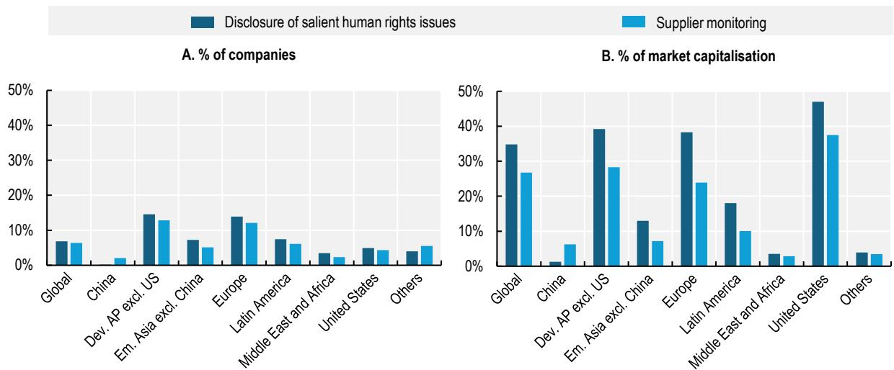  
Source: OECD Capital Market Series dataset; LSEG; FactSet; Bloomberg. See Annex A. for further details.

More generally, communicating on certain aspects of due diligence has become standard practice among most large, listed companies globally. The uptake of international sustainability reporting frameworks – requiring companies to disclose information on their due diligence processes – illustrates this trend clearly. Over 60% of companies by global market capitalisation report in line with the GRI (more than 6 500 entities) and around 10% were subject to the ESRS (at least 1 800 entities), therefore disclosing information related to due diligence processes $^{14}$ aligned with international standards on RBC (OECD, 2025[1]) (see Box 3.2).

## Various challenges to sustainability reporting have been documented

Various implementation challenges have been documented in relation to sustainability reporting. For example, a recent review of the first reports filed in response to the EU Corporate Sustainability Reporting Directive (CSRD) by the French Financial Markets Authority highlights issues with coherence and readability across large volumes of datapoints, suggesting many companies are still struggling to “join the dots” across narrative and metrics. While most companies define the scope of their policies, only a small minority explain how their effectiveness is monitored over time, with limited disclosure on internal controls, corrective actions, or year-on-year progress, preventing stakeholders from assessing whether actions taken are effective (AMF, 2025[41]).

Practitioners have also underscored challenges in responding to multiple disclosure or reporting expectations. Most companies disclosing sustainability information (87%) report using multiple standards and frameworks at the same time – often with overlapping or even conflicting expectations (IFAC, 2024[42]). Leading reporting frameworks and regulatory expectations differ in how materiality and/or saliency is defined and assessed, including whether it should be based on financial materiality, material impacts on people and the environment, or a combination of both. This can introduce challenges as many sustainability topics are associated with materiality gaps by reporting companies, as discussed above (see Box 2.2). Similarly, laws and frameworks also apply different prioritisation criteria and scopes. These divergences mean that risks prioritised under one regime may be out of scope under another, leading companies to report on different risks and impacts depending on the context, thereby complicating efforts to demonstrate consistent, credible and risk-based prioritisation in public disclosures.

Challenges related to assurance, which is increasingly required of sustainability disclosure, have also been raised by companies. Recent OECD research noted that in 2024, 42% of companies disclosing sustainability-related information obtained assurance of this information by an external service provider. Most companies rely on limited assurance (56%), with fewer relying on reasonable assurance (17%). Provision of assurance is high even in jurisdictions where it is neither required nor recommended (OECD, 2025[1]). Globally, more than half of the sustainability-related assurances are performed by an auditor (OECD, 2025[1]). Assurance can have important resource implications for companies. For example, EFRAG estimates that for listed companies that started reporting under the CSRD in 2025, the first-year limited assurance costs will range between EUR 108 000 and EUR 900 000 (EFRAG, 2025[43]). It can also impact how companies report – some companies have noted that assurance requirements, intended to strengthen the credibility of sustainability information, may in practice reinforce a compliance-oriented approach that prioritises coverage over substance.

## References

ACT (2020), The Alliance for Corporate Transparency Research Report 2019: An analysis of the sustainability reports of 1000 companies pursuant to the EU Non-Financial Reporting Directive, https://www.sustentia.com/wp-content/uploads/2020/07/2019-Research-Report-Alliance-for-Corporate-Transparency\_compressed.pdf.

AMF (2025), Corporate Sustainability Reporting: The way forward, https://www.amf-france.org/sites/institutionnel/files/private/2025-10/amf\_study\_csrd\_reporting\_the\_way\_forward\_2025.pdf.

Amiraslani, H. et al. (2025), “Board Risk Oversight and Environmental and Social Performance”, Journal of Accounting and Economics, Vol. 79/2-3, https://doi.org/10.1016/j.jacceco.2024.101754.

Barrientos, S. and S. Smith (2007), “Do workers benefit from ethical trade? Assessing codes of labour practice in global production systems”, Third World Quarterly, Vol. 28/4, pp. 713-729, https://doi.org/10.1080/01436590701336580.

Bartley, T. and N. Egels-Zandén (2015), “Responsibility and neglect in global production networks: The uneven significance of codes of conduct in Indonesian factories”, Global Networks, Vol. 15/s1, pp. S21-S44, https://doi.org/10.1111/glob.12086. [34]

BCG (2023), Two Keys to Success in supplier risk management, https://web-assets.bcg.com/pdf-src/prod-live/how-to-mitigate-supply-chain-risk.pdf (accessed on 4 June 2026).

BCI (2021), Supply Chain Resilience Report 2021, https://www.thebci.org/static/e02a3e5f-82e5-4ff1-b8bc61de9657e9c8/BCI-0007h-Supply-Chain-Resilience-ReportLow-Singles.pdf. [15]

Beuchelt, T. and M. Zeller (2011), “Profits and poverty: Certification’s troubled link for Nicaragua’s organic and fairtrade coffee producers”, Ecological Economics, Vol. 70/7, pp. 1316-1324, https://doi.org/10.1016/j.ecolecon.2011.01.005.

Bpifrance, Orse and PwC (2022), RSE : la parole aux fournisseurs !,
https://www.bpifrance.fr/sites/default/files/2023-
01/Orse%20x%20Bpifrance%20x%20PwC\_RSE%20La%20parole%20aux%20fournisseurs
2%C3%A8me%20%C3%A9dition\_septembre%202022.pdf.

EcoVadis (2025), Forced Labor in Global Supply Chains: A Call to Action, https://ecovadis.com/glossary/forced-labor/ (accessed on 4 June 2026).

EFRAG (2025), Cost Benefit Analysis on the Draft Amended European Sustainability Reporting Standards, https://www.efraq.org/sites/default/files/media/document/2025-12/Cost-benefit%20Analysis%20on%20Draft%20Amended%20ESRS.pdf. [43]

FfB Foundation (2023), Top 10 biodiversity-impact ranking of company industries, https://www.financeforbiodiversity.org/wp-content/uploads/Top10\_biodiversity-impact\_ranking.pdf.

German International Chamber of Commerce (2023), Das Lieferkettensorgfaltspflichtengesetz wirkt - aber vielfach nicht, wie gewünscht. [The Supply Chain Due Diligence Act is effective - but often not as desired.], https://www.dihk.de/resource/blob/97882/906311b0bf7fb8db5b1f564aed4c8d1e/sonderauswertung-lieferketten-going-international-2023-data.pdf.

Hurt, J. et al. (2023), Supply Chain Due Diligence Risk Assessment for the EU: A Network Approach to estimate expected effectiveness of the planned EU directive, https://doi.org/10.48550/arXiv.2311.15971.

IFAC (2024), The State of Play: Sustainability Disclosure and Assurance, [42] https://ifacweb.blob.core.windows.net/publicfiles/2024-02/IFAC-State-Play-Sustainability-Disclosure-Assurance-2019-2022\_0.pdf.

KnowTheChain (2025), 2025 Information and Communications Technology: Benchmark key findings report, https://media.business-humanrights.org/media/documents/KTC\_2025\_ICT\_Key\_findings\_report.pdf. [28]

KnowTheChain (2023), 2023 Apparel & Footwear: Benchmark Findings and Report, [30] https://media.business-humanrights.org/media/documents/KTC\_2023\_AF\_Benchmark\_Report.pdf.

KnowTheChain (2023), 2023 Food & Beverage: Benchmark Findings Report, https://media.business-humanrights.org/media/documents/KTC\_2023\_FB\_Benchmark\_Report\_Oct\_23.pdf.

KPMG (2023), ERM's role in ESG: How Enterprise Risk Management can help companies craft and execute ESG strategies, https://kpmg.com/kpmg-us/content/dam/kpmg/pdf/2023/erms-role-in-esg-pov-whitepaper-v3.pdf. [7]

LeBaron, G. and J. Lister (2021), “The hidden costs of global supply chain solutions”, Review of International Political Economy, Vol. 29/3, pp. 669-695, https://doi.org/10.1080/09692290.2021.1956993.

Locke, R., M. Amengual and A. Mangla (2009), “Virtue out of Necessity? Compliance, Commitment, and the Improvement of Labor Conditions in Global Supply Chains”, Politics & Society, Vol. 37/3, pp. 319-351, https://doi.org/10.1177/0032329209338922.

Locke, R. and M. Romis (2007), “Improving Work Conditions in a Global Supply Chain”, MIT Sloan Management Review, https://sloanreview.mit.edu/article/improving-work-conditions-in-a-global-supply-chain/.

McCorquodale, R. and J. Nolan (2021), “The Effectiveness of Human Rights Due Diligence for Preventing Business Human Rights Abuses”, Netherlands International Law Review, Vol. 68/3, pp. 455-478, https://doi.org/10.1007/s40802-021-00201-x.

OECD (2026), Mapping social and environmental due diligence legislation, OECD Publishing, Paris, https://doi.org/10.1787/bac11241-en.

OECD (2026), OECD research hub on uptake and impact of environmental and social due diligence, https://www.oecd.org/en/data/tools/research-hub-on-the-uptake-and-impact-of-environmental-and-social-due-diligence.

OECD (2025), Behind ESG ratings: Unpacking sustainability metrics, OECD Publishing, Paris, [25] https://doi.org/10.1787/3f055f0c-en.

OECD (2025), Environmental and social impacts across industry sectors, OECD Publishing, Paris, https://doi.org/10.1787/dd39761c-en.

OECD (2025), Global Corporate Sustainability Report 2025, OECD Publishing, Paris, https://doi.org/10.1787/bc25ce1e-en.

OECD (2024), Global Corporate Sustainability Report 2024, OECD Publishing, Paris, https://doi.org/10.1787/8416b635-en.

OECD (2023), OECD Guidelines for Multinational Enterprises on Responsible Business Conduct, OECD Publishing, Paris, https://doi.org/10.1787/81f92357-en.

OECD (2022), Monitoring corporate disclosure: Assessing company reporting on mineral supply chain due diligence, OECD Publishing, Paris, https://doi.org/10.1787/246e3535-en. [23]

OECD (2022), The role of sustainability initiatives in mandatory due diligence: Background note on Regulatory Developments concerning Due Diligence for Responsible Business Conduct, https://www.oecd.org/content/dam/oecd/en/topics/policy-sub-issues/due-diligence-guidance-for-responsible-business-conduct/the-role-of-sustainability-initiatives-in-mandatory-due-diligence-note-for-policy-makers.pdf.

OECD (2018), OECD Due Diligence Guidance for Responsible Business Conduct, OECD Publishing, Paris, https://doi.org/10.1787/15f5f4b3-en.

OECD (2018), OECD Due Diligence Guidance for Responsible Supply Chains in the Garment and Footwear Sector, OECD Publishing, Paris, https://doi.org/10.1787/9789264290587-en. [21]

OECD/IEA (2025), The role of traceability in critical mineral supply chains, OECD Publishing, Paris, https://doi.org/10.1787/edb0a451-en. [13]

OECD/ITC (2024), Understanding Sustainability Initiatives: A Typology Framework, OECD Publishing, Paris, https://doi.org/10.1787/8f8a3d7f-en.

S&P Global (2025), Addressing inefficiencies in sustainable supply chain management, https://www.spglobal.com/sustainable1/en/insights/special-editorial/addressing-inefficiencies-in-sustainable-supply-chain-management (accessed on 4 June 2026).

Song, F. et al. (2024), “Improving suppliers’ environmental performance: The role of environmental engagement and relationship asymmetries”, International Journal of Integrated Supply Management, Vol. 17/3/4, pp. 239-276, https://doi.org/10.1504/ijism.2024.142780.

Vaughan-Whitehead, D. and L. Caro (2017), Purchasing practices and working conditions in global supply chains: Global Survey results, https://www.ilo.org/publications/purchasing-practices-and-working-conditions-global-supply-chains-global.

WBA (2026), Supply chain resilience at risk as human rights, climate and nature impacts go unmanaged, https://www.worldbenchmarkingalliance.org/supply-chain-resilience-risk-human-rights-climate-and-nature-impacts-go-unmanaged (accessed on 4 June 2026).

World Benchmarking Alliance (2026), Social Benchmark, https://www.worldbenchmarkingalliance.org/benchmark/social-benchmark (accessed on 4 June 2026).

World Benchmarking Alliance (2023), Corporate Human Rights Benchmark 2023: Insights Report, https://assets.worldbenchmarkingalliance.org/app/uploads/2024/03/2023\_Corporate\_Human\_Rights\_Benchmark\_Insights\_Report\_13Mar2024.pdf (accessed on 4 February 2026).

World Benchmarking Alliance (2023), Gender Insights Report 2023, https://assets.worldbenchmarkingalliance.org/app/uploads/2024/05/2023-Gender-Insights-Report-3-May-2024.pdf (accessed on 4 February 2026).

## Notes

$^{1}$ Small-cap companies are defined as having a market capitalisation below USD 2 billion at end-2025; mid-caps as between USD 2 billion and USD 10 billion; and large-caps as above USD 10 billion.

$^{2}$ State-owned enterprises (SOEs) are defined as companies with at least 25% public-sector ownership.

$^{3}$ The purpose of the cross-cutting policy indicator is to identify companies that have policies covering a wide range of topics. Biodiversity commitments are not considered as they have very low reported uptake. Therefore, including them in the scope of the cross-cutting policy indicator would significantly limit its prevalence and result in uptake roughly equivalent to the share of companies with public biodiversity commitments. As such, to measure uptake by companies of an otherwise wide range of issues in their policies, biodiversity commitments have been excluded.

$^{4}$ Human capital accounted for the largest share, but this has no clear mapping to any of the topics in Figure 2.1.

$^{5}$ The observed difference in disclosure rates between both topics might also be related to measurement. For instance, public reporting related to climate change is more established than on biodiversity (e.g. recommendations from the Taskforce on Nature-related Financial Disclosures (TNFD) were published in 2023, six years after those of the Task Force on Climate-related Financial Disclosures (TCFD)). As a result, company disclosures related to climate change may be more comparable across companies and it may therefore be more feasible to reliably identify them at scale than those disclosures related to biodiversity.

$^{6}$ In the case of human rights, the indicator measures whether the company uses human rights criteria in the selection or monitoring process of its suppliers, but in the case of environmental criteria, the indicator only considers the selection process.

$^{7}$ This data was available for a small sub-sample of the largest 10 000 companies. Coverage of this data varies depending on the supply chain tier and represents up to around 450 companies. Given the lower coverage of this data, rates of uptake were expressed as a percentage of companies for which data is available, and are based on latest available data between 2021 and early 2026.

$^{8}$ Data on this indicator was available for a small sub-sample of the largest 10 000 companies (around 500 companies), in industries which source from the mining sector. Given the lower coverage of this data, rates of uptake were expressed as a percentage of companies in this sub-sample, and are based on latest available data between 2021 and early 2026.

$^{9}$ Some companies' social audit programmes cover more than one tier. Overall, around 35% of companies cover tier-2 or tier-3 suppliers (or both) in their social audit programmes.

$^{10}$ While the indicator used here is the closest available indicator to purchasing practices, it is important to note that it does not fully capture the essence of responsible purchasing practices. Rather, it may provide a partial indication of whether companies integrate purchasing practices in their due diligence.

$^{11}$ See Annex A for more details on the methodology.

$^{12}$ All top ten companies allocated clear responsibilities and training on human rights, and only 27% of the other 100 did (World Benchmarking Alliance, 2023 $^{[26]}$ ). In other words, 34% (37 out of 110) of the companies assessed in the benchmark.

$^{13}$ These benchmarks include 45 companies in the ICT sector, 65 companies in the apparel and footwear sector, and 60 companies in the food and beverage sector.

$^{14}$ Further, 4 857 companies and 3 497 companies are reporting against the TCFD and SASB standards respectively, i.e. providing general information about financially material risks including climate-related risks (OECD, 2025 $^{[1]}$ ).

# How are governments promoting responsible business conduct?

This chapter analyses measures taken by governments to promote responsible business conduct (RBC), focussing on the 52 countries adhering to the MNE Guidelines. It considers how governments mainstream RBC in their activities: in policies and practices, in their role as market actors, and their duties with respect to access to remedy. Analysis finds that many countries set binding due diligence expectations in legislation. All countries adhering to the MNE Guidelines have taken measures to promote RBC through trade and investment agreements. Governments are increasingly embedding RBC through development co-operation, public procurement and SOE policy as well as seeking to improve access to remedy for harms related to corporate misconduct abroad. Overall, a growth in RBC-related policies has enhanced the need for coherence and co-operation and a better understanding of the effectiveness of various approaches.

Governments have a key role in promoting the uptake of RBC through a smart policy mix across various disciplines. The OECD Recommendation on the Role of Government in Promoting RBC sets out actions governments can take to develop an enabling environment for RBC (see Box 3.1).

## Box 3.1. The Recommendation on the Role of Government in Promoting Responsible Business Conduct

The Recommendation on the Role of Government in Promoting Responsible Business Conduct sets out guiding principles for how governments can enable and incentivise responsible business conduct through action in six areas (see Figure 3.1):

\- Legal and regulatory frameworks to enable RBC: ensure new and existing laws and rules align with OECD standards on RBC, remove obstacles that make it hard for businesses to follow RBC and clearly communicate RBC expectations including through guidance.

\- Encouraging RBC across relevant policy areas: align economic benefits with RBC (e.g. provide information, tools and incentives on RBC), and promote RBC in trade and investment policies, in international agreements, and development co-operation.

\- Leading by example – governments as economic and commercial actors: use public procurement as a strategic tool for RBC, set clear expectations for state-owned enterprises to follow RBC standards, and integrate RBC considerations in government financial instruments (e.g. export credits, equity, debt, grants, loans, guarantees, insurance).

\- Ensuring stakeholder participation in RBC policies: engage with stakeholders on RBC and create the conditions for meaningful dialogues; encourage transparency and convene stakeholders.

\- Promoting access to remedy: guarantee that those affected by companies allegedly violating RBC standards have access to effective judicial or non-judicial remedy and ensure that NCPs gain the trust of social partners and other stakeholders, enabling them to effectively provide access to remedy.

\- Co-ordinating policies and activities on RBC: promote RBC coherence across government agencies (e.g. co-ordinate internally, identify and address barriers, monitor RBC dimensions of policies, and ensure government entities on RBC, such as the NCP, have sufficient budget, staff, and authority to conduct its activities).

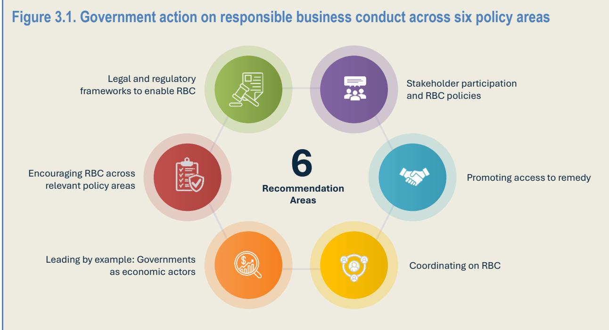

The following sections take stock of how governments are promoting RBC, using available data and examples from government practice. While they follow the areas and principles highlighted in the RBC Recommendation, they do not cover all areas but instead focus on key insights. Findings have been informed by research and a survey among the 52 countries and the European Union that adhere to the RBC Recommendation $^{1}$ about policy developments in 2025 (hereafter, 2025 survey). Forty-five responses were received.

Table 3.1 and Figure 3.2 present an overview of the responses to the survey about policy developments aggregated to the main areas explored in this report. Measures in the different areas include the following examples:

\- legal and regulatory frameworks to enable RBC: due diligence legislative measures, other non-binding policies

\- encouraging RBC across key policy areas: measures related to RBC and trade and investment policy, incentives and development co-operation

\- governments as economic and commercial actors: integration of RBC into policies related to SOEs, public procurement or export credits

\- promoting access to remedy: measures to enhance the access to remedy for affected persons

\- co-ordinating on RBC: efforts to co-ordinate RBC through government bodies, reviews or other approaches.

As illustrated in Figure 3.2 and Table 3.1, countries reported using a variety of measures to promote RBC across policy areas in the survey, and reported multiple measures for most areas. Countries reported most measures in the areas Encouraging RBC across key policy areas, Legal and regulatory frameworks to enable RBC and Leading by example: Governments as economic and commercial actors. Forty-three countries (81% of countries adhering to the MNE Guidelines as well as the European Union) reported measures to encourage RBC across policy areas; 41 countries (77%) reported having adopted at least one measure relating to legal and regulatory frameworks and to lead by example. Fewer countries reported measures to promote access to remedy: 37 countries (70%) reported at least one measure – and most reported multiple measures in place (33 countries, 62%). There is also variance in practice across countries adhering to the MNE Guidelines, with some having introduced multiple measures across categories and others reporting limited or no practices across categories (see Table 3.1).

Figure 3.2. Responsible business conduct policies across countries adhering to the OECD Guidelines for Multinational Enterprises on Responsible Business Conduct  
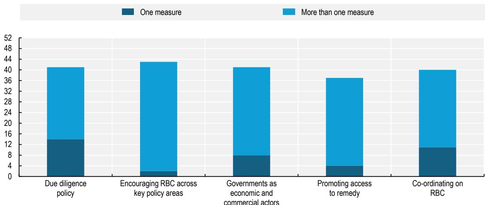  
Note: This figure shows the number of policy measures reported by countries adhering to the MNE Guidelines as well as the European Union across five areas of the Recommendation on the Role of Government in Promoting Responsible Business Conduct. Measures are counted on a presence/absence basis and reflect policy coverage rather than implementation, effectiveness, enforcement, or scope of individual measures. For further details on the underlying measures and aggregation approach, see Annex A and the relevant sections below.
Source: Compilation by the OECD based on a 2025 survey of 52 countries adhering to the MNE Guidelines and the European Union.

Table 3.1. Responsible business conduct policies in countries adhering to the OECD Guidelines for Multinational Enterprises on Responsible Business Conduct

<table><tr><td>Country</td><td>Due diligence policy</td><td>Encouraging RBC across key policy areas</td><td>Governments as economic and commercial actors</td><td>Promoting access to remedy</td><td>Co-ordinating on RBC</td></tr><tr><td>Argentina</td><td></td><td></td><td></td><td></td><td></td></tr><tr><td>Australia</td><td></td><td></td><td></td><td></td><td></td></tr><tr><td>Austria</td><td></td><td></td><td></td><td></td><td></td></tr><tr><td>Belgium</td><td></td><td></td><td></td><td></td><td></td></tr><tr><td>Brazil</td><td></td><td></td><td></td><td></td><td></td></tr><tr><td>Bulgaria</td><td></td><td></td><td></td><td></td><td></td></tr><tr><td>Canada</td><td></td><td></td><td></td><td></td><td></td></tr><tr><td>Chile</td><td></td><td></td><td></td><td></td><td></td></tr><tr><td>Colombia</td><td></td><td></td><td></td><td></td><td></td></tr><tr><td>Costa Rica</td><td></td><td></td><td></td><td></td><td></td></tr><tr><td>Croatia</td><td></td><td></td><td></td><td></td><td></td></tr><tr><td>Czechia</td><td></td><td></td><td></td><td></td><td></td></tr><tr><td>Denmark</td><td></td><td></td><td></td><td></td><td></td></tr><tr><td>Egypt</td><td></td><td></td><td></td><td></td><td></td></tr><tr><td>Estonia</td><td></td><td></td><td></td><td></td><td></td></tr><tr><td>Finland</td><td></td><td></td><td></td><td></td><td></td></tr><tr><td>France</td><td></td><td></td><td></td><td></td><td></td></tr><tr><td>Germany</td><td></td><td></td><td></td><td></td><td></td></tr><tr><td>Greece</td><td></td><td></td><td></td><td></td><td></td></tr><tr><td>Hungary</td><td></td><td></td><td></td><td></td><td></td></tr><tr><td>Iceland</td><td></td><td></td><td></td><td></td><td></td></tr><tr><td>Ireland</td><td></td><td></td><td></td><td></td><td></td></tr><tr><td>Israel</td><td></td><td></td><td></td><td></td><td></td></tr></table>

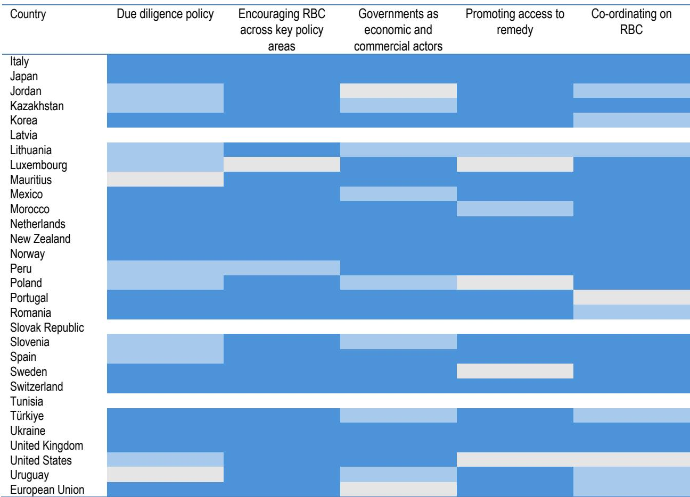

Note: This table shows the number of policy measures reported by countries adhering to the MNE Guidelines, as well as the European Union, across five areas of the Recommendation on the Role of Government in Promoting Responsible Business Conduct. Measures are counted on a presence/absence basis and reflect policy coverage rather than implementation, effectiveness, enforcement, or scope of individual measures. For further details on the underlying measures and aggregation approach, see Annex A.

No response

No measure reported

One measure reported

More than one measure reported

Source: Compilation by the OECD based on a 2025 survey of 52 countries adhering to the MNE Guidelines and the European Union.

## Legal and regulatory frameworks to enable responsible business conduct

Responsible business conduct (RBC) covers a range of topics, where governments may put in place specific policy or regulation related to business practice. This can include environmental protection, anti-corruption, labour standards, product regulation, permitting and licensing, corporate governance, disclosure, and other areas covered by the MNE Guidelines. Appropriate legal and regulatory frameworks across these topic areas are fundamental to promoting RBC.

The following analysis focuses specifically on a subset of such policies, namely, policies or laws that set direct or indirect expectations for companies to conduct and/or report on social and environmental due diligence.

## Due diligence policy

## Governments are increasingly introducing due diligence legislation

In 2025, 84% of the 38 OECD Members and 67% of the 52 countries adhering to the MNE Guidelines had some form of due diligence legislation in place (Table 3.2). Many of these measures reference, directly or indirectly, OECD RBC standards, including the MNE Guidelines and Due Diligence Guidance as well as sector-specific guidance. Due diligence legislation has emerged in three areas: disclosures, due diligence conduct, and product and market-based measures.

Disclosure measures require regulated entities to publicly disclose information on their due diligence processes and outcomes. Such disclosure may be in relation to a specific risk area – such as forced labour (for example, Canadian Fighting Against Forced Labour and Child Labour in Supply Chains Act) or a range of areas (for example, the EU Corporate Sustainability Reporting Directive (CSRD), which covers a range of human rights, labour rights and environmental impacts).

Twenty-six legislative measures requiring disclosure on due diligence processes and outcomes have been introduced across nine countries adhering to the MNE Guidelines and the European Union. There are also developments beyond countries adhering to the MNE Guidelines – in China, for example, the three main stock exchanges have adopted mandatory reporting requirements, including disclosure of measures for identifying and mitigating adverse sustainability impacts. Governments also increasingly require companies to make broader sustainability disclosures, beyond their due diligence process and outcomes (see Box 3.2).

## Box 3.2. Relationship between sustainability disclosure and due diligence reporting

Communicating about due diligence, including its outcomes, is a central expectation in the Disclosure chapter of the OECD Guidelines for Multinational Enterprises on Responsible Business Conduct (MNE guidelines) (OECD, 2023[1]). The MNE Guidelines expect enterprises to publicly communicate relevant information on aspects such as a company's due diligence policies and processes; the areas of significant risks and adverse impacts identified; prioritisation criteria; prevention, mitigation and remediation actions and outcomes; measures to track implementation and results, and provision of or co-operation in any remediation.

Sustainability disclosure expectations are being introduced across jurisdictions and can include reporting expectations on a range of sustainability impacts (positive and negative), financial risks and/or opportunities, and how these are managed. Such expectations also commonly call for reporting entities to disclose information on governance, strategy, risk management processes, and key metrics and targets related to the risks and impacts in scope, in line with OECD due diligence reporting expectations.

The European Sustainability Reporting Standards (ESRS) for example, used under the EU Corporate Sustainability Reporting Directive (CSRD) require companies to disclose of information on their due diligence processes (GOV-3) and to conduct impact materiality assessments in line with the risk-based approach set out in the OECD MNE Guidelines. Similarly, companies can disclose steps taken in relation to the due diligence process (e.g. engagement with stakeholders or training on material impacts).

Recent research from the OECD (2025[2]) found that sustainability-related disclosures are widely required, with $79\%$ of the 52 analysed jurisdictions requiring sustainability-related disclosure in law or regulations, $11\%$ through listing rules, and $8\%$ through disclosure in codes or principles.

Governments are also frequently leveraging existing sustainability standards as baselines for policies and legislation to promote coherent and comparable reporting, including the International Sustainability Standards Board (ISSB) and Global Reporting Initiative (GRI). Standards such as these often integrate due diligence disclosure obligations as a smaller subset of disclosure expectations. The GRI, for example, has explicitly integrated due diligence reporting into the modular structure of the Universal Standards. GRI 2: General Disclosures, sets out disclosures on activities, governance, and policies related to due diligence and GRI 3: Material Topics, recommends that companies report identified material topics and impacts on people and planet (OECD, 2026[3]). ISSB standards focus on reporting of sustainability related material risks to the business rather than its material sustainability related impacts. While ISSB standards do not explicitly expect disclosure on due diligence measures and steps, they do expect disclosure on how reporting entities go about identifying, assessing, prioritising and ultimately managing those risks, including associated governance processes and related metrics and targets to demonstrate progress and performance. In June 2025, 36 jurisdictions had adopted or were in the process of adopting the ISSB standards in their policy or regulatory frameworks (IFRS, 2025[4]).

Note: OECD (2025[2]) research on sustainability disclosure covers the 52 jurisdictions that participate in the OECD Corporate Governance Committee, which is distinct from, but overlaps with the 52 adherent countries to the MNE Guidelines.
Source: OECD (2023[5]), OECD Guidelines for Multinational Enterprises on Responsible Business Conduct, https://doi.org/10.1787/81f92357-en; OECD (2018[6]), OECD Due Diligence Guidance for Responsible Business Conduct, https://doi.org/10.1787/15f5f4b3-en

Due diligence conduct measures require regulated entities to undertake due diligence on human rights, labour and/or environmental impacts in their operations, supply chains and business relationships, although scopes differ. Such measures include for example; the EU Corporate Sustainability Due Diligence Directive, the Norwegian Transparency Act, the French Duty of Vigilance Law, and Germany's Act on Corporate Due Diligence Obligations in Supply Chains (Supply Chain Act).

Eleven due diligence conduct measures have been introduced across six countries adhering to the MNE Guidelines as well as the European Union. Furthermore, several countries including Chile, Indonesia, Thailand and Uzbekistan are also considering introducing due diligence legislation. These measures typically apply to businesses above a certain size threshold and reflect elements of the six-step framework for due diligence set out in the OECD Due Diligence Guidance. They generally converge around requirements to put in place a due diligence policy, identify and assess significant labour, human rights and/or environmental risks and impacts, use adequate and/or proportionate prevention and mitigation measures and to carry out stakeholder engagement (OECD, 2026[7]). However, they differ in some key areas, such as supply chain coverage, approaches to prioritisation, disengagement and remediation.

Product and market-based measures prohibit the import, placing on the market, export and/or use of products or commodities associated with certain risks or impacts, such as forced labour or deforestation. Some of these measures directly require business entities to carry out a narrower set of due diligence actions to comply with the measure (e.g. the UK Environment Act and EU Deforestation Regulation) whilst others indirectly encourage due diligence as a means through which companies can identify and respond to the stated risk (e.g. forced labour – US Tariff Act, US Uyghur Forced Labour Prevention Act, EU Forced Labour Regulation) (OECD, 2026[7]). As these measures focus on ensuring covered goods or commodities are free from stated risks or impacts, or meet specific risk thresholds, they do not introduce conduct requirements and do not explicitly address issues such as disengagement or remediation in detail. Instead, due diligence is used as a tool for compliance.

Table 3.2. Due diligence legislative measures across countries adhering to the OECD Guidelines for Multinational Enterprises on Responsible Business Conduct

<table><tr><td>Country</td><td>Disclosure measures</td><td>Due diligence conduct measures</td><td>Product and market-based measures</td></tr><tr><td>Argentina</td><td></td><td></td><td></td></tr><tr><td>Australia</td><td>Modern Slavery Act (2018)</td><td></td><td></td></tr><tr><td>Austria</td><td colspan="3">EU measures</td></tr><tr><td>Belgium</td><td colspan="3">EU measures</td></tr><tr><td>Brazil</td><td></td><td></td><td></td></tr><tr><td>Bulgaria</td><td colspan="3">EU measures</td></tr><tr><td>Canada</td><td>Fighting Against Forced Labour and Child Labour in Supply Chains (2023)</td><td></td><td>Import prohibition on goods produced with forced labour, Customs Tariff (2020)</td></tr><tr><td>Chile</td><td></td><td></td><td></td></tr><tr><td>Colombia</td><td></td><td>Law 2 250 on legislation and formalisation of the mining sector, including due diligence requirements (2022)</td><td></td></tr><tr><td>Costa Rica</td><td></td><td></td><td></td></tr><tr><td>Croatia</td><td colspan="3">EU measures</td></tr><tr><td>Czechia</td><td colspan="3">EU measures</td></tr><tr><td>Denmark</td><td colspan="3">EU measures</td></tr><tr><td>Egypt</td><td></td><td></td><td></td></tr><tr><td>Estonia</td><td colspan="3">EU measures</td></tr><tr><td>Finland</td><td colspan="3">EU measures</td></tr><tr><td>France</td><td colspan="3">EU measures</td></tr><tr><td></td><td colspan="3">Duty of Vigilance Law (2017)</td></tr><tr><td>Germany</td><td colspan="3">EU measures</td></tr><tr><td></td><td colspan="3">Supply Chain Act (2023)</td></tr><tr><td>Greece</td><td colspan="3">EU measures</td></tr><tr><td>Hungary</td><td colspan="3">EU measures</td></tr><tr><td>Iceland</td><td colspan="3">EU measures</td></tr><tr><td>Ireland</td><td colspan="3">EU measures</td></tr><tr><td>Israel</td><td></td><td></td><td></td></tr><tr><td>Italy</td><td colspan="3">EU measures</td></tr><tr><td>Japan</td><td></td><td></td><td></td></tr><tr><td>Jordan</td><td></td><td></td><td></td></tr><tr><td>Kazakhstan</td><td></td><td></td><td></td></tr><tr><td>Korea</td><td colspan="3">AI Basic Act (2025)</td></tr><tr><td>Latvia</td><td colspan="3">EU measures</td></tr><tr><td>Lithuania</td><td colspan="3">EU measures</td></tr><tr><td>Luxembourg</td><td colspan="3">EU measures</td></tr><tr><td>Mauritius</td><td></td><td></td><td></td></tr><tr><td>Mexico</td><td></td><td></td><td>Forced Labour Regulation (2023)</td></tr><tr><td>Morocco</td><td></td><td></td><td></td></tr><tr><td>Netherlands</td><td colspan="3">EU measures</td></tr><tr><td>New Zealand</td><td></td><td></td><td></td></tr><tr><td>Norway</td><td colspan="3">Norwegian Transparency Act (2021)</td></tr><tr><td></td><td colspan="3">EU measures</td></tr><tr><td>Peru</td><td></td><td></td><td></td></tr><tr><td>Poland</td><td colspan="3">EU measures</td></tr><tr><td>Portugal</td><td colspan="3">EU measures</td></tr><tr><td>Romania</td><td colspan="3">EU measures</td></tr><tr><td>Slovak Republic</td><td colspan="3">EU measures</td></tr><tr><td>Slovenia</td><td colspan="3">EU measures</td></tr><tr><td>Spain</td><td colspan="3">EU measures</td></tr><tr><td>Sweden</td><td colspan="3">EU measures</td></tr><tr><td>Switzerland</td><td>Code of Obligations, Obligation to report on non-financial matters (Art. 964a-c) (2022)</td><td>Ordinance on Due Diligence and Transparency in relation to Minerals and Metals from Conflict-Affected Areas and Child Labour (2023)</td><td></td></tr><tr><td>Tunisia</td><td colspan="3"></td></tr><tr><td>Türkiye</td><td colspan="3"></td></tr><tr><td>Ukraine</td><td colspan="3"></td></tr><tr><td>United Kingdom</td><td>Modern Slavery Act (2015)</td><td></td><td>Environment Act 2021 (Sch.17)</td></tr><tr><td rowspan="2">United States</td><td>Dodd-Frank Sec. 1 502 (2010)</td><td></td><td>Tariff Act 1930 (Sec.307)</td></tr><tr><td>California Transparency in Supply Chains Act (2010)</td><td></td><td>Uyghur Forced Labour Prevention Act (2021)</td></tr><tr><td>Uruguay</td><td colspan="3"></td></tr></table>

Note: This table sets out due diligence legislation as currently adopted by countries adhering to the MNE Guidelines. It includes measures that require the conduct or disclosure of social and environmental due diligence, or measures that set indirect expectations for due diligence. It does not include broader sustainability disclosure frameworks or due diligence requirements in relation to other topics such as anti-money laundering. Certain measures may be in a phasing-in period or in the process of transposition. To avoid double-counting, legislative measures are listed once under the most relevant column; however, certain conduct or product and market-based legislation include disclosure requirements. EU measures include the Corporate Sustainability Due Diligence Directive, Corporate Sustainability Reporting Directive, Sustainable Finance Disclosure Regulation, Conflict Minerals Regulation, Batteries Regulation, Deforestation Regulation, Forced Labour Regulation, Digital Services Act, and AI Act. These measures have EEA relevance and therefore are also included for Iceland and Norway.

No measures

EU measures

National measures

Figure 3.3. Due diligence legislative measures across countries adhering to the OECD Guidelines for Multinational Enterprises on Responsible Business Conduct  
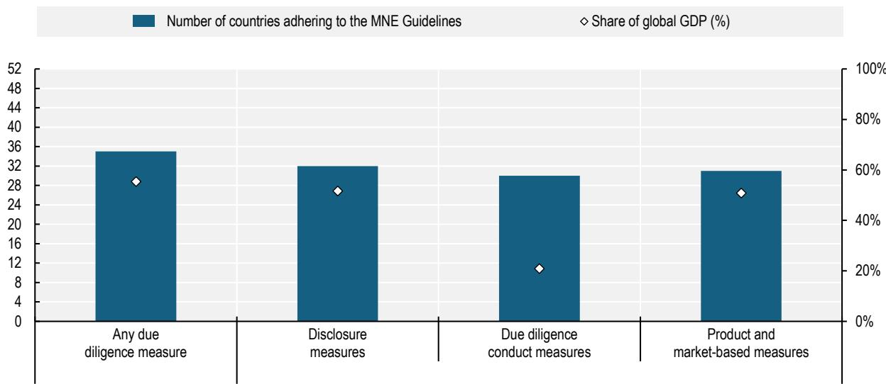  
Note: This figure shows the number of countries adhering to the MNE Guidelines with at least one due diligence measure in each category, and the share of GDP of these countries. “Any due diligence measure” refers to the presence of at least one measure across the three categories shown.  
Source: OECD research; GDP data based on World Bank (2024), World Development Indicators, https://databank.worldbank.org/source/world-development-indicators.

Existing due diligence legislation varies in the issues it seeks to address, coverage of the supply chain, and which business entities are within scope of the measures. Across all categories of measures, most due diligence measures consider human rights – looking both broadly and focussed on a specific right (see

Figure 3.4). Environmental issues are increasingly covered as well – nine due diligence measures address one or more environmental impacts.

Figure 3.4. Topical coverage of due diligence legislative measures  
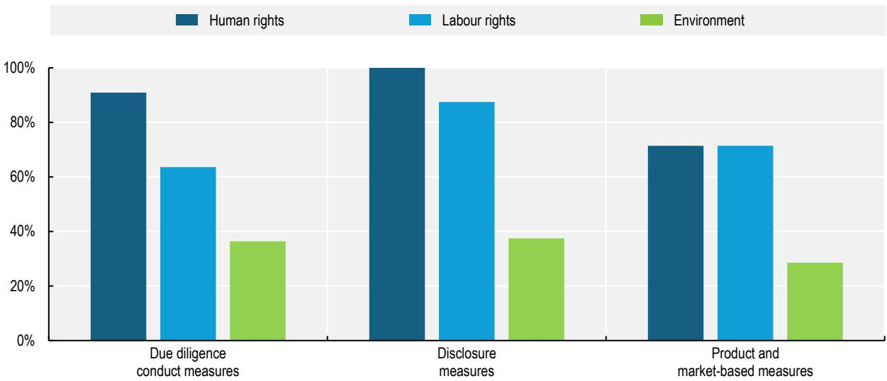  
Note: This figure shows the share of due diligence measures listed in Table 3.2 (with the exception of Colombia Law 2 250 where the topical coverage is not yet defined) covering human rights, labour rights, and environmental issues, disaggregated by due diligence conduct measures (n = 11), disclosure measures (n = 8), and product and market-based measures (n = 7). Bars represent the percentage of measures within each category that address a given topic.

Whilst legislative measures have expanded, some countries are using authoritative but non-binding policy instruments to set expectations for companies. Twenty-six countries adhering to the MNE Guidelines (58% of respondents) report having introduced voluntary measures and/or guidelines related to due diligence, drawing on OECD standards. In Japan, for example, the Guidelines on Respecting Human Rights in Responsible Supply Chains, set out Japan's expectations for companies in relation to human rights and reflect the OECD six-step due diligence framework (METI, 2022[8]).

## Box 3.3. Due diligence measures for responsible mineral supply chains

In the minerals sector, a mix of policy measures and market requirements oblige supply chain actors to conduct due diligence in accordance with OECD RBC standards. Laws on due diligence for mineral supply chains now exist in Colombia, the Democratic Republic of the Congo (DRC), the European Union, Rwanda, Tanzania, the United Arab Emirates (UAE) and the United States. $^{1}$

Binding domestic regulations began with the aim to address conflict finance and human rights abuses $^{2}$ and have since evolved to fight financial crime $^{3}$ and promote a resilient supply of critical raw materials. $^{4}$ Minerals due diligence regulations have used different models spanning disclosure (the United States), recognition of audit programmes (the European Union) and oversight of supply chain traceability (the Democratic Republic of the Congo) to foster implementation. Whilst the existence of regulation does not automatically equate to effective implementation, it signals shared policy objectives across multiple jurisdictions.

The aim to combat conflict finance in due diligence regulations has been closely connected with peace and security objectives. For example, OECD RBC standards are embedded in multilateral agreements like the Lusaka Declaration whereby 12 Member states of the International Conference of the Great Lakes Region endorsed the OECD Due Diligence Guidance for Responsible Supply Chains of Minerals from Conflict-Affected and High-Risk Areas (OECD Minerals Guidance) and committed to a regional certification mechanism for its implementation (ICGLR, 2010[9]). More recently, the OECD Minerals Guidance was embedded in the US-negotiated Regional Economic Integration Framework between the DRC and Rwanda, setting out commitments on harmonised approaches to governance of due diligence audit programmes and disclosure of mineral export data (U.S. Department of State, 2025[10]).

The OECD Minerals Guidance is also used as a benchmark standard in the London Metal Exchange (LME, 2019[11]), London Bullion Market Association (LBMA, 2025[12]) and London Platinum and Palladium Market trading requirements (LPPM, 2022[13]), in addition to the Chinese Due Diligence Guidelines for Responsible Mineral Supply Chains which, while voluntary, help Chinese smelters comply with LME requirements. This has led to a mutually supportive set of regulatory and market measures in mineral supply chains. Emerging efforts by governments to enhance the resilience of critical mineral supply chains through the G7 Roadmap for Standards-based Markets (Government of Canada, 2025[14]) recognises the crucial link between the responsible sourcing and security of supply, with the management of RBC risks going hand in hand with attracting investment to the sometimes volatile extractives sector and heading off disruptions that such risks give rise to if not appropriately mitigated (OECD, 2023[15]).

Other resilience initiatives like the US Forum for Resource Geostrategic Engagement (FORGE), ReSourceEU and the Japan Organization for Metals and Energy Security (JOGMEC) aim to increase trade with trusted partners, channel blended finance to new projects, stockpile critical minerals and spur exploration of new resources. The range of existing measures for minerals due diligence provides a good basis for co-operation with trade and investment partners to strengthen a level playing field for RBC in the sector, source responsibly and enhance security of supply in the process.

## Notes:

1. DRC Circular Note No. 2 of 2011 on OECD Due Diligence Obligations; EU Batteries Regulation (2023) and EU Critical Raw Materials Act (2024); EU Conflict Minerals Regulation (2017); Rwanda Ministerial Regulation No. 1 of 2011 on Fighting Smuggling in Mineral Trading; Swiss Final Ordinance on Conflict Minerals and Child Labour (2021); UAE Due Diligence Regulations for Responsible Sourcing of Gold (2021); US SEC Final Rule on Section 1 502 of the Dodd-Frank Act (2012).

2. Rwanda Ministerial Regulation No. 1 of 2011 on Fighting Smuggling in Mineral Trading; DRC Circular Note No. 2 of 2011 on OECD Due Diligence Obligations; US SEC Final Rule on Section 1 502 of the Dodd-Frank Act (2012); EU Conflict Minerals Regulation (2017); Swiss Final Ordinance on Conflict Minerals and Child Labour (2021).

3. UAE Due Diligence Regulations for Responsible Sourcing of Gold (2021).

4. EU Batteries Regulation (2023) and EU Critical Raw Materials Act (2024).

## Governments are moving to support businesses in complying with new due diligence legislation

Twenty-one countries adhering to the MNE Guidelines (47% of respondents) report having developed guidance to support companies in implementing RBC regulatory expectations. Such guidance can help businesses understand how to comply with expectations based on their own operating context. Most legislative measures mapped by the OECD are supplemented by official guidance, further clarifying expectations. Under the German Supply Chain Act, the enforcement authority, BAFA (Federal Office for Economic Affairs and Export Control), has used guidance to clarify key concepts and misconceptions as the Act went into implementation. Their 2025 guidance on the risk-based approach aimed to move companies away from indiscriminate information requests to suppliers, toward a process of risk-based due diligence. More guidance on due diligence requirements are envisaged under recently adopted EU legislation. $^{2}$ In addition to guidance documents, many measures provide for helpdesks, information databases and risk indicators. Certain legislative measures also foresee a role for support to third countries potentially impacted by the laws.

Governments are exploring opportunities to promote co-operation and coherence between different legislative measures. Many due diligence measures share similar policy objectives but differ in design, scope and terminology. Co-operation between jurisdictions can underscore shared objectives, and provide opportunities to develop joint support and streamline compliance processes. For example, the United Kingdom, Australia, and Canada each have disclosure legislation in place addressing forced labour and modern slavery. In July 2025, the three countries launched a consolidated reporting template to help companies comply across the three measures (Government of the United Kingdom, 2025[16]). Several legislative measures encourage co-operation and exchange of information between different supervisory authorities or agencies at the domestic level. For example, the Forced Labour Enforcement Task Force in relation to the US Uyghur Forced Labour Prevention Act, and, for EU legislative measures between national competent authorities and the European Commission – e.g. the networks of representatives of competent authorities across the Member States under the EU Forced Labour Regulation.

Governments are seeking to reduce implementation burdens for business and enforcement agencies in the evolving landscape of due diligence policy. For example, the United Kingdom is reviewing its approach to responsible business conduct as part of its trade strategy. This includes consideration for regulatory burden on business, including how international regulatory co-operation can help foster a predictable regulatory environment (Government of the United Kingdom, 2025[17]). Within the European Union, the Commission has launched its Competitiveness Compass, citing regulatory simplification as one of the enablers to competitiveness (European Commission, 2025[18]). In pursuit of this, the Commission has published several simplification initiatives, known as Omnibus packages. Revisions to the Corporate Sustainability Due Diligence Directive (CSDDD) and the Corporate Sustainability Reporting Directive (CSRD) through the first Omnibus package, were finalised in February 2026. $^{3}$ Both measures reduced entity scope, limited supply chain data requests (the so-called “value chain cap”), and removed the requirement to publish and put in to effect a climate transition plan and the harmonised EU-wide civil liability regime from the CSDDD. The risk-based approach to identifying and responding to risk has been strengthened in line with international standards (see Box 3.4). Revisions to the ESRS are also ongoing, with a draft indicating a 61% reduction in reporting datapoints. $^{4}$

## Box 3.4. Simplification sustainability expectations through coherence

Recent trends toward regulatory simplification in relation to due diligence and sustainability measures have sought to reduce cost and administrative burdens on companies. Simplification can be valuable in achieving efficiencies – particularly for SMEs, however it is important that simplification initiatives preserve and do not undermine the core goals and substantive requirements of the legislation.

In several cases, policymakers have drawn on OECD RBC standards as a tool for simplification. For example, in Germany, the Federal Office for Economic Affairs and Export Control (BAFA) released supplementary guidance to the German Supply Chain Act, clarifying that the Act requires companies to take a risk-based approach to due diligence in line with the OECD RBC standards and the United Nations Guiding Principles on Business and Human Rights (UNGPs); and emphasising the flexibility that companies have in prioritising risks for attention. In parallel, whilst the EU’s Omnibus simplification process narrowed the scope of the legislation in important respects, it preserved the core risk-based approach to identifying and responding to risk and strengthened alignment with OECD RBC standards by clarifying the requirement to first carry out a scoping to identify general areas of risk before moving to in-depth assessment. Other legislative measures, whilst not requiring risk-based due diligence, have indirectly integrated expectations around due diligence, in line with OECD standards. The EU Forced

Labour Regulation, for example, recognises that due diligence can help regulated entities identify, mitigate, prevent and bring to an end the risk of forced labour in supply chains and sets out requirements for enforcement authorities to consider due diligence efforts in their preliminary stages of investigations. OECD RBC standards can serve as a benchmark for governments to avoid diverging and burdensome requirements for companies complying across laws and jurisdictions.

In this dynamic regulatory environment, the OECD has convened the Inclusive Platform on Due Diligence Policy Co-operation (2026[19]). This platform serves as a space for countries from around the world to exchange information and experiences on the design, implementation, and monitoring of due diligence policies, laws, and regulations.

## Encouraging responsible business conduct across key policy areas

Trends in recent years highlight greater integration of RBC across various policy areas including in trade, investment, development co-operation, and through financial and non-financial incentives.

## Trade and investment

All countries adhering to the MNE Guidelines have taken steps to promote RBC through trade and investment policies and agreements, using a variety of approaches. $^{5}$ Nearly all have incorporated provisions related to areas covered by the MNE Guidelines as well as clauses encouraging companies to adopt responsible practices (RBC clauses) in trade and investment agreements signed since 2020. The integration of RBC considerations in trade and investment promotion and facilitation is also becoming increasingly common. However, stronger evidence on the implementation and actual impact of these measures remains needed.

## Trade and investment agreements are being used to promote RBC

Since the inclusion of the first provisions on environmental issues in trade agreements in the mid-1990s, the number of provisions reflecting the signatories' commitments in key policy areas for RBC (human rights, labour rights, anti-corruption, etc.) has steadily grown. For instance, the average number of environmental provisions in trade agreements grew from eight per year in the 1990s to nearly 19 in the 2000s and reached around 50 by 2020 (OECD, 2023[20]).

The shift towards systematically integrating RBC considerations in trade and investment agreements has been accompanied by the gradual development of mechanisms to support their implementation. For example, allowing for public submissions on the implementation of RBC-related provisions and establishing committees to monitor compliance or consultations between the parties at various governmental levels, including ministerial consultations. $^{6}$ An example is the United States-Mexico-Canada Agreement (USMCA), which prohibits the importation of goods produced using forced or compulsory labour. In the context of the USMCA, Mexico granted authority to its Ministry of Labour and Social Welfare to investigate such practices and ban goods resulting from them. The USMCA also introduced the Facility-Specific Rapid Response Labour Mechanism, allowing public submissions concerning violations of freedom of association and collective bargaining rights. Trade sanctions may be imposed on goods and services from non-compliant facilities and lifted only after remediation. Since its implementation in 2021, the mechanism has been activated over 40 times in relation to facilities located in Mexico (Office of the United States Trade Representative, 2020 $^{[21]}$ ; Government of Mexico, 2023 $^{[22]}$ ; U.S. DOL, 2026 $^{[23]}$ ).

The inclusion of RBC clauses has also increased since their first appearance in the early 2000s. Since 2020, almost all countries adhering to the MNE Guidelines have signed trade or investment agreements that include an RBC clause (see Figure 3.5). Of the 186 trade and investments agreements signed by countries adhering to the MNE Guidelines since 2020, 67 include an RBC clause. $^{7}$ A recent example is the RBC clause in the Trade and Sustainable Development chapter of the Chile-EU Interim Trade Agreement, which entered into force in February 2025. $^{8}$ The signatories recognise the importance of responsible management of supply chains through RBC or CSR practices and the role of trade in this regard and commit to encourage responsible business practices and support the dissemination of RBC instruments, including the MNE Guidelines, the ILO MNE Declaration and the UNGPs, as well as the uptake of the OECD Due Diligence Guidance.

The inclusion of RBC clauses in trade and investment agreements follows a broader global trend. Of the 67 agreements signed by countries adhering to the MNE Guidelines that include an RBC clause, 73% were signed with non-adhering countries (see Figure 3.5). A notable example of a detailed RBC clause in an agreement signed between countries adhering to the MNE Guidelines and non-adhering countries is found in the Investment Protocol to the African Continental Free Trade Area (AfCFTA), signed in 2023 but not yet in force (African Union, 2023 $^{[24]}$ ). The Protocol sets out investor obligations to contribute to sustainable development, notably by striving to comply with CSR principles and standards. It also requires investors to respect human and labour rights, protect the environment and Indigenous peoples' rights, and refrain from corruption. Breaches of investors' obligations constitute grounds for the host state to withdraw investment protection. $^{9}$ RBC clauses are also increasingly present in trade and investment agreements involving only non-adhering countries, particularly in Latin America, $^{10}$ Asia $^{11}$ and Africa. $^{12}$

Figure 3.5. Responsible business conduct clauses in agreements signed by countries adhering to the OECD Guidelines for Multinational Enterprises on Responsible Business Conduct  
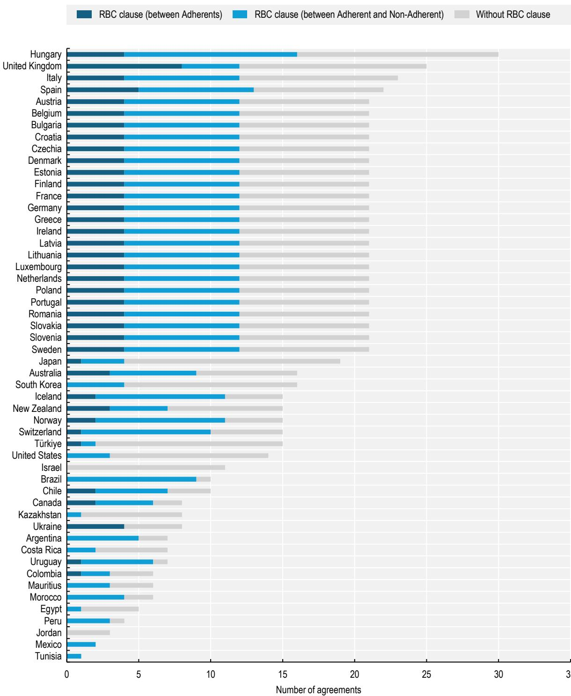  
Note: This figure shows the number of international trade and investment agreements by country, with bars stacked to distinguish between agreements that include RBC clauses between countries adhering to the MNE Guidelines, agreements that include RBC clauses between countries adhering to the MNE Guidelines and non-adhering countries, and agreements without any RBC clause. Based on 186 trade and investment agreements concluded by countries adhering to the MNE Guidelines between January 2020 and March 2026, of which 67 include RBC clauses.

RBC clauses vary in scope, from general commitments to more detailed provisions with explicit references to specific RBC principles and standards that companies are expected to observe. Almost 50% of the RBC clauses included in trade and investment agreements signed by countries adhering to the MNE Guidelines since 2020 expressly refer to the OECD RBC instruments and 14 of these agreements include references to due diligence. Most of these clauses also refer to one or more areas of the MNE Guidelines, mostly environment, human and labour rights (see Figure 3.6).

Figure 3.6. Overview of the different aspects covered by responsible business conduct clauses in trade and investment agreements  
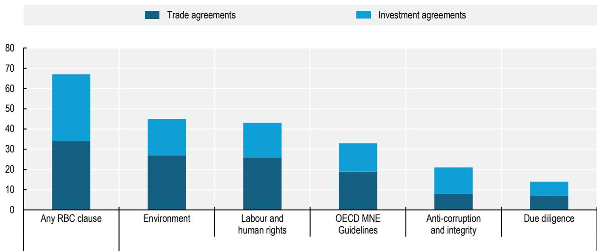  
Note: This figure shows the number of trade and investment agreements that include specific RBC clauses. Bars are stacked to distinguish between clauses found in trade agreements and those in investment agreements. Based on 186 trade and investment agreements concluded by countries adhering to the MNE Guidelines between January 2020 and March 2026, of which 67 include RBC clauses.

The growing inclusion of RBC clauses has contributed towards initiatives and exchanges of good practices among signatories to trade and investment agreements. For example, building on the RBC clause in Mercosur's Co-operation and Facilitation Investment Protocol, the signatories adopted a recommendation mandating co-operation in areas covered by the MNE Guidelines (MERCOSUR, 2025[25]). One of the co-operation activities involves developing guidelines on RBC based on international standards, which are currently in progress. Likewise, in the context of the Pacific Alliance, a Subgroup on Responsible Business Conduct (SGCER) was created to share experiences and promote best practices on RBC (Government of Chile, 2024[26]; 2025[27]).

## Trade and investment promotion policies increasingly integrate sustainability and responsible business conduct considerations

Over 70% of countries adhering to the MNE Guidelines have mandated their trade promotion agencies (TPAs) to encourage sustainable business practices through their export promotion services and to support sustainable exports. $^{13}$ For example, Chile’s TPA, ProChile, is tasked with making sustainable exports a strategic priority (Government of Chile, n.d. $^{[28]}$ ). In 2025, ProChile adopted a general Sustainability Policy to 2030, structured around five strategic pillars: 1) responsible conduct, 2) conscious businesses, 3) sustainable trade, 4) sustainable governance, and 5) training and awareness (Government of Chile, 2025 $^{[29]}$ ). Other governments are linking the access to trade support services to the observance of RBC principles and standards by their exporters. For instance, in some countries, exporting companies seeking to participate in trade missions or access trade promotion services are required to demonstrate their commitment to the MNE Guidelines (see section on Incentives).

Governments are also embedding RBC considerations into their investment promotion policies. An increasing number of investment promotion agencies (IPAs) are mandated to attract, facilitate and retain sustainable investments and, more specifically, to promote RBC. Between 2017 and 2025, the share of OECD IPAs with an explicit mandate to promote RBC rose from 9% to 14% (OECD, 2025[30]). Over the same period, RBC advanced from the 23rd to the 12th place in the ranking of success factors identified by IPAs for attracting foreign direct investment. Some agencies require companies using their services to comply with internationally recognised RBC principles and standards, including the MNE Guidelines, as is the case of Business Sweden, the Swedish trade and investment promotion agency (Business Sweden, n.d.[31]). Sustainability is also becoming more firmly embedded in IPA strategies, reinforcing the role of investment promotion as a lever for advancing responsible and sustainable investment (see Box 3.5).

## Box 3.5. The OECD Foreign Direct Investment Qualities Initiative

Governments are increasingly prioritising the quality rather than the quantity of foreign direct investment (FDI). The OECD FDI Qualities Initiative supports this transition by providing indicators, comparative benchmarking, and a policy toolkit to help governments promote sustainable investment and maximise FDI's contribution to sustainable development.

FDI is a key driver of economic, social, and environmental outcomes, but its evolving composition is reshaping its labour market and development impacts. The growing orientation of FDI towards green and technology intensive activities has produced mixed results: digital and renewable energy industries accounted for about half of global greenfield FDI between 2019 and 2024. Renewable energy rose from 1% of global greenfield FDI in 2003 to 22% in 2024, and digital goods and services from 12% to 30%. Greenfield FDI created 2.4 million jobs worldwide in 2024, down from 2.8 million in 2023. At the firm level, foreign companies are 70% more productive than domestic firms on average and pay 34% higher wages. They also employ a 9% higher share of women, yet female employment remains largely concentrated in low skilled positions, highlighting the need for policies that better align the green and digital transitions with skills development, inclusion, and quality job creation.

The OECD FDI Qualities Council Recommendation and the 2022 FDI Qualities Policy Toolkit emphasise the importance of integrating development objectives into investment policy, notably through coherent and predictable policies. Investment promotion is one area where policy coherence with national development goals can support the positive contribution of FDI. Many investment promotion agencies (IPAs) are aligning their strategies with sustainable investment and development goals: 83% of OECD IPAs report contributing to economic growth and employment, while 40% report contributing to responsible consumption and production, and 35% to climate action. Around 70% of OECD IPAs also report having at least one KPI related to sustainability. Moreover, the share of firms classified as sustainable tripled between 2020 and 2022, while the share of projects doubled. $^{1}$ Despite this increase, sustainable firms and projects still represent a modest 7% of all supported activities.

1. This trend should be interpreted with caution, as the classification relies on IPA self-reporting and may not be fully comparable across agencies.

## Development co-operation

Development co-operation in support of RBC helps to maximise the private sector's contribution to sustainable development and enables companies in developing countries to meet the expectations of their international business partners. Development co-operation can help developing economies and their businesses meet RBC expectations in global supply chains and mitigate their cost implications. Support can take multiple forms: technical assistance programmes and helpdesks, direct financial assistance, including easier access to finance through sustainable supply chain finance programmes, loans and risk premiums, as well as enhanced evidence and dialogue between trade partners to ensure RBC standards have the intended outcomes (OECD, 2025[35]). In 2023, the OECD Development Assistance Committee (DAC) agreed to “strengthen promotion and application of OECD standards on Responsible Business Conduct in development co-operation”, and development of guidance is ongoing (OECD-DAC, 2023[36]).

Many countries integrate responsible business conduct in their development co-operation but this is not keeping pace with the policy dynamic for responsible business conduct

Twenty-three countries adhering to the MNE Guidelines (51% of respondents) indicate that they have integrated RBC in development co-operation strategies or policy dialogue with partner countries and 16 (36% of respondents) have financed development co-operation programmes in support of RBC (see Figure 3.7). $^{14}$

Figure 3.7. Integration of responsible business conduct in development co-operation  
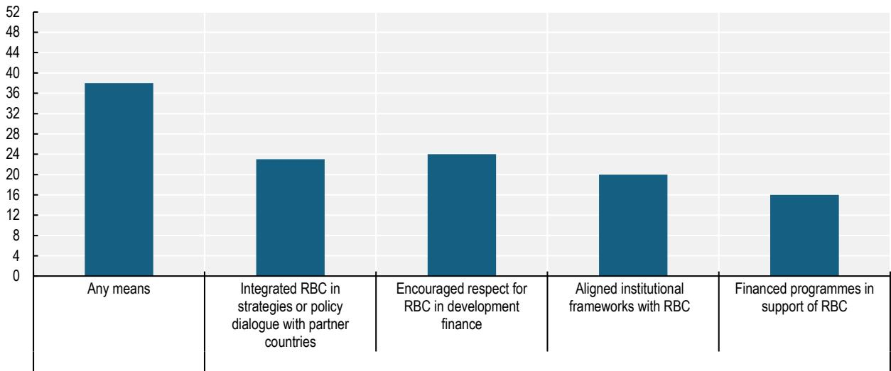  
Note: This figure shows the number of countries adhering to the MNE Guidelines as well as the European Union that reported integrating RBC in development co-operation across different channels. Based on 45 responses to the survey question: "Has your government's development co-operation integrated RBC in any of the following ways?" Bars represent the percentage of respondents answering "yes" for each category, while the denominator is the number of countries adhering to the MNE Guidelines.  
Source: Compilation by the OECD based on a 2025 survey of 52 countries adhering to the MNE Guidelines and the European Union on RBC policy developments.

Some countries have set up programmes to support partner countries in meeting growing expectations for RBC in global value chains (OECD, 2025[35]). For example, RBC is a priority in development co-operation policies of Germany, the Netherlands, Sweden, Switzerland, and the European Union. Development co-operation can support businesses in developing countries to improve practice and invest in sustainability solutions, and can also involve working with governments and stakeholders to promote policies that enable RBC (OECD, 2025[35]; 2025[37]). At the 2025 Fourth Financing for Development Conference, international leaders committed to promoting technical and financial assistance so that least developed countries can meet sustainability standards in trade (United Nations, 2025[38]).

OECD statistics on official development assistance (ODA) show that reported RBC-focussed ODA remains relatively limited. Countries adhering to the MNE Guidelines reported USD 121 million of ODA focussed on RBC in 2024. $^{15}$ Additionally, USD 150 million were disbursed in projects with activities related to RBC. $^{16}$ However, these amounts represent only 0.8% (USD 35 billion) of their ODA for economic infrastructure and services and productive sectors. Furthermore, spending is concentrated among few donors, with Germany, Sweden and the European Union providing 59% of the total (see Figure 3.8).

Figure 3.8. Development co-operation expenditure for responsible business conduct  
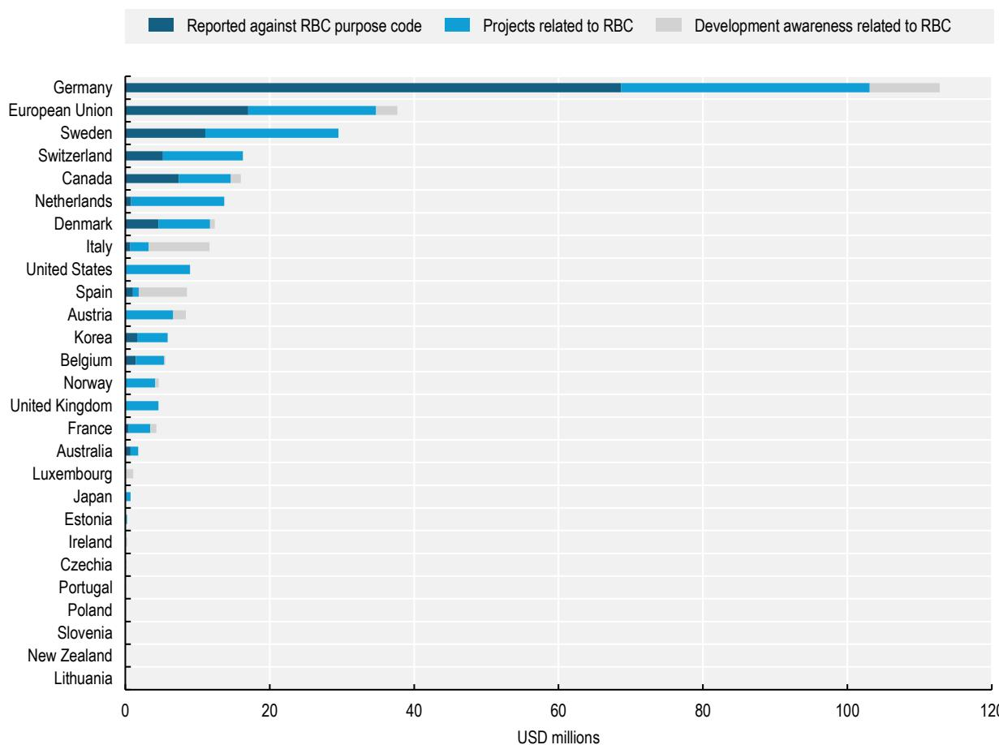  
Note: This figure shows development co-operation expenditure related to responsible business conduct (RBC) in 2024 by provider in current USD million. Values are disaggregated into three components: spending reported against an RBC-specific purpose code and reported project descriptions, projects related to RBC in other thematic areas, and development awareness activities related to RBC. Bars are stacked to reflect the total volume of RBC-related expenditure per country. No spending has been reported by: Bulgaria, Croatia, Greece, Kazakhstan, Romania and Türkiye. Among the countries adhering to the MNE Guidelines, the following countries do not report ODA data to the OECD: Argentina, Brazil, Chile, Colombia, Costa Rica, Egypt, Jordan, Morocco, Mauritius, Peru, Tunisia, Ukraine and Uruguay.
Source: Calculations based on OECD Data Explorer (2026[39]), Creditor Reporting System (flows), http://data-explorer.oecd.org/s/52.

## Development institutions are integrating responsible business conduct into risk management policies or processes

A growing number of development institutions adopt overarching strategies and frameworks to address adverse impacts of their operations. Twenty countries adhering to the MNE Guidelines (44% of respondents) indicated that their governments have aligned development institutional frameworks with RBC expectations. $^{17}$ For example, the Korea International Co-operation Agency (KOICA) has an ESG strategy and issues reports in alignment with the Global Reporting Initiative and France's AFD focuses on the management of impacts on the sustainable development goals in its SDGs bond framework (OECD, 2024 $[40]$ ; 2025 $[37]$ ).

Twenty-four countries adhering to the MNE Guidelines (53% of respondents) indicate that they encourage adherence to RBC principles and standards in safeguards and contractual obligations in development finance (see Figure 3.7). $^{18}$ Many reference the International Finance Corporation's (IFC) Performance Standards. The ongoing update of IFC's Sustainability Framework provides an opportunity for countries adhering to the MNE Guidelines to explore how IFC standards can best enable RBC (IFC, n.d. $^{[41]}$ ).

Preliminary findings from the monitoring by the Global Partnership for Effective Development Co-operation (GPEDC) show that numerous development co-operation institutions conduct risk assessments in their private sector engagement and have put in place grievance mechanisms (GPEDC, 2025[42]). To strengthen the engagement on RBC with local private sector actors, updated guidance on the DAC Blended Finance Principles underlines the importance of a risk-based approach to managing adverse impacts and continuous improvement (OECD, 2025[43]).

## Strong examples for domestic engagement on responsible business conduct exist but remain the exception

In few countries, development co-operation engages with domestic efforts on RBC. At a policy level, some countries make RBC a priority for policy coherence for sustainable development (OECD, 2024[44]). Countries such as Australia, Germany, Japan, the Netherlands and Sweden promote linkages between development co-operation and RBC policymaking in due diligence legislation, multilateral and national trade policies, procurement policies and National Action Plans on Business and Human Rights (OECD, 2026[45]; 2024[44]; 2025[37]). Development co-operation engages with domestic stakeholders to promote the uptake of RBC in global value chains, for example, supporting multi-stakeholder platforms to enhance RBC in specific sectors or tackling issues such as child labour (OECD, 2024[44]; 2025[37]).

Development co-operation can help to raise awareness of the relevance of RBC domestically, but is not a focus of current government spending. In 2024, countries adhering to the MNE Guidelines mobilised EUR 28 million to inform the public about the opportunities and challenges that the integration of RBC into global value chains could present for developing countries, and to raise awareness of avenues for change, such as through sustainable consumption and fair trade (OECD, 2026[45]). However, based on statistical reporting, DAC member financing for such activities constitutes only $7\%$ of their spending for development awareness.[19]

## Incentives

Incentives are an important tool for governments to encourage companies to adopt RBC. Advantages can take different forms and are often financial in nature. In a context where governments are increasingly focussing on industrial policies, there is an opportunity to consider what role RBC should play in enhancing the positive impact of such policies. Beyond targeted incentives designed to encourage and reward RBC uptake, related policy areas can also function as incentives in practice. For example, see sections on Public procurement and Responsible business conduct in the provision of export credits.

Incentives are emerging as a complementary measure by governments seeking to promote and reward responsible business conduct

Governments use a wide variety of incentives to encourage and reward uptake and implementation of RBC. Twenty-nine countries adhering to the MNE Guidelines (66% of respondents) $^{20}$ incentivise the implementation of RBC standards by businesses through specific measures. Examples can include providing access to financial support for RBC-related activities; preferential terms for grants, loans or other financial support based on RBC-related performance; tax credits or benefits; incentives linked to permitting, licensing, company registration or other administrative processes; trade and investment facilitation services.

Grants and funds targeted at green and social transitions often serve as entry points for RBC-aligned practices, particularly in areas such as decarbonisation, circular economy and sustainable supply chains. For instance, Enterprise Ireland's Green Transition Fund provides grants to Irish companies for sustainability strategies and decarbonisation initiatives, including a targeted grant to support small businesses in purchasing energy-efficient technology and equipment (Citizens Information Board Ireland, 2023[46]).

Some governments and public financial institutions are rewarding RBC performance through trade and investment facilitation services. Canada has several measures to incentivise business uptake and compliance with RBC. To access services from the Canadian Trade Commissioner (TCS), companies are required to complete a “Digital RBC Attestation” acknowledging the importance of RBC, including adherence to Canadian laws and international instruments on human rights, labour rights and the environment, and where applicable, good faith participation in dispute resolution mechanisms (Government of Canada, 2021[47]; OECD, 2026[45]).

Some countries adhering to the MNE Guidelines report using tax credits and similar fiscal incentives to create rewards for RBC, in particular environmental and social goals. Canada offers investment tax credits for industrial decarbonisation, reducing the cost of deploying technologies such as renewable energy, energy efficiency or low-emissions hydrogen production (Canada, 2023[48]). Similarly, the United Kingdom's First-Year Allowances let businesses deduct up to $100\%$ of the cost of certain low-emission assets such as zero-emission vehicles and charging infrastructure for electric vehicles from taxable profits in the year of purchase (Government of the United Kingdom, 2021[49]).

Government incentives can also take the form of expedited permitting and licensing. Many municipalities offer fast-track permitting for projects that meet social or environmental goals, such as affordable housing or green building standards. In the United States, the city of San Diego, California, promises faster processing timelines for affordable/infill housing and sustainable development projects. This is made possible through priority reviews of qualified applications, where project developers get early feedback from dedicated staff, and guaranteed timelines for permit decisions. These measures reduce costs and delays, and incentivise developers to integrate social and sustainable considerations into projects (City of San Diego, 2023[50]).

Access to publicly backed trademarks or labels are another way for governments to incentivise businesses and reward them for meeting defined RBC criteria. In France, the Plateforme RSE is entrusted with recognising fair trade guarantee systems and labels (Government of France, 2021[51]). Another example is the German Government-run Green Button (Grüner Knopf) certification label for sustainable textiles, which requires companies to demonstrate that they take responsibility for their supply chains and conduct due diligence. In addition, companies must demonstrate that their products are produced sustainably by using certification labels recognised by Green Button (Green Button, n.d.[52]; OECD, 2025[53]).

## Leading by example: Governments as economic and commercial actors

Governments integrate RBC when interacting with the market, for example, as buyers, state enterprises or when providing financing. When governments interact with the market, their decisions can create implicit or explicit incentives for RBC – for example, through public procurement contracts or requirements for export credits. Recent trends indicate public procurement being used more often as a strategic tool to support more responsible business and to increase expectations for state-owned enterprises to lead by example on RBC. In addition, governments have been integrating RBC considerations in their financial instruments, notably in the provision of export credits.

## Public procurement

In 2024, countries adhering to the MNE Guidelines spent over USD 10 trillion on public procurement, of which over 80% was spent by countries that have RBC due diligence regulation in place, including requirements for public procurement. Many countries also integrate aspects of RBC (human rights, environment, due diligence or similar) in legal frameworks specific to public procurement. Public procurement is a prominent area of economic activity where governments interact with supply chains as an economic actor and may be exposed to similar adverse risks and impacts as businesses.

## Responsible business conduct considerations are commonly integrated into public procurement frameworks and processes

RBC considerations commonly feature in public procurement frameworks, with 32 countries adhering to the MNE Guidelines (73% of respondents) $^{21}$ reporting that their frameworks consider RBC. These countries report that environmental protection, labour rights, and human rights are the topics most often covered in legal and regulatory frameworks related to procurement (see Figure 3.9). In Slovenia, for example, the Public Procurement Act requires subcontractors to respect environmental standards, human and labour rights, and anti-corruption criteria (OECD, 2020 $^{[54]}$ ). However, comprehensive frameworks addressing all substantive areas covered by the MNE Guidelines as well as RBC due diligence are less common (OECD, 2024 $^{[55]}$ ). See Figure 3.9 for an overview of which substantive areas of the MNE Guidelines countries are covering in their legal and policy frameworks on public procurement, and the share of procurement spending that is implicated.

Explicit integration of due diligence into public procurement is less common than integration of substantive objectives related to the chapters of the MNE Guidelines. In practice, due diligence (as a process to enhance RBC generally) happens by asking suppliers to carry out due diligence or as governments adopt due diligence practices themselves. One example is the Swedish regions' initiatives around due diligence and public procurement. In 2024, the Swedish regions incorporated due diligence approaches through a special contract clause, their Supplier Code of Conduct, and in guidance for public buyers and suppliers (Swedish Regions, 2024[56]). The approach is based on the MNE Guidelines and OECD Due Diligence Guidance. The contract clause expects suppliers to have due diligence policies and processes in place, and public buyers are expected to map supply chains and assess adverse impacts of purchases (Swedish Regions, 2024[56]).

Figure 3.9. Responsible business conduct considerations in public procurement frameworks of countries adhering to the OECD Guidelines for Multinational Enterprises on Responsible Business Conduct  
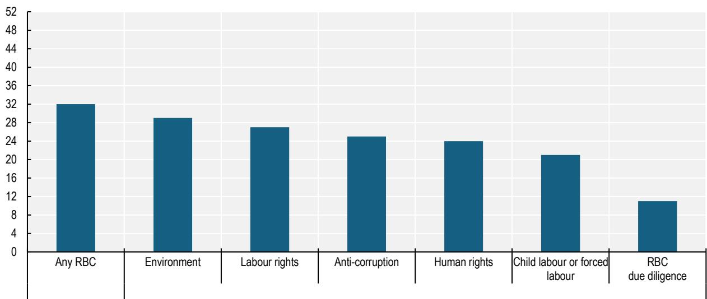  
Note: This figure shows the number of countries adhering to the MNE Guidelines that incorporate specific RBC considerations into public procurement frameworks. Based on 44 responses to the survey question: "Do legal and policy frameworks on public procurement in your country consider RBC?". If yes, countries adhering to the MNE Guidelines were asked to indicate which aspects of RBC are covered by any of the legal and policy frameworks. Respondents were able to select more than one option.  
Source: Compilation by the OECD based on a 2025 survey of 52 countries adhering to the MNE Guidelines and the European Union on RBC policy developments.

In practice, governments often consider RBC topics across the whole public procurement cycle in line with OECD RBC standards. In the pre-tender phase, governments consider RBC prior to the award of contracts. The city of Copenhagen, Denmark, for example, conducts mappings related to mobility needs for the city's procured services to find ways to reduce $CO_{2}$ emissions (Pagel Fray and Marott, 2018 $^{[57]}$ ). During the tender phase, governments set RBC qualification, award, or evaluation criteria. In Ireland, the government supports public buyers through a Green Public Procurement Strategy (2024-2027), which includes guidance on criteria for public buyers to use in the tender process that support environmental goals (Department of Climate, Energy and the Environment, 2024 $^{[58]}$ ). In the Netherlands, suppliers that have a $CO_{2}$ management system and measure and reduce their $CO_{2}$ emissions in their operations can receive a discount on their tender price, which presents a concrete advantage in the tendering process (OECD, 2024 $^{[59]}$ ). As part of contract management and monitoring, governments are using different methods to verify and assess whether suppliers are meeting RBC-related expectations in the implementation of contracts. France's central purchasing body, UGAP, has been using an audit and control plan since 2020 to verify that procurements comply with integrity expectations during contract performance (Bozzay et al., 2025 $^{[60]}$ ). The system also monitors compliance with ethical, social, and environmental commitments for suppliers and subcontractors.

## Public procurement has been included in some environmental and social due diligence regulation

Requirements for public institutions, and more specifically on public procurement have been included in some recent regulation on due diligence. (See Due diligence policy). Due diligence laws with explicit requirements for public institutions state that public institutions fall under their scope and create specific requirements for them. Laws with implicit requirements do not specifically mention public institutions, but the general requirements and conditions defined in the law (such as turnover or threshold requirements) can also apply to public institutions. (OECD, 2024[55]). Therefore, public institutions may still be expected to comply with the legislation if they are within scope of these general conditions. Across countries adhering to the MNE Guidelines, there are six examples of due diligence regulation with explicit requirements for public institutions: Australia Modern Slavery Act, Canada Supply Chains Act, Germany Supply Chains Act, EU CSDDD, EU Deforestation Regulation, and the EU Batteries Regulation (OECD, 2024[55]). Three additional regulations present implicit requirements for public institutions: UK Modern Slavery Act, Norway Transparency Act, and US Uyghur Forced Labour Prevention Act (OECD, 2024[55]).

Some of these laws are supported by additional policies specific to public institutions and buyers. The Australian Government published a toolkit for procurement officers to ensure they are identifying, assessing, and managing modern slavery risks in operations and supply chains (OECD, 2024[55]). In the United Kingdom, the amended public procurement regulation makes certain modern slavery offences under the Modern Slavery Act grounds for mandatory exclusion of bidders from public procurements (OECD, 2024[55]). The UK Government also published a tool and guide to support public bodies in assessing risks and improving modern slavery identification processes.

The value of public procurement spending in countries with RBC due diligence regulation that applies to public procurement is significant. USD 8.2 trillion (more than 80%) of the roughly USD 10.2 trillion spent on public procurement by countries adhering to the MNE Guidelines in 2024 had due diligence regulations with some form of requirements for public institutions. While the requirements set by due diligence legislation do not necessarily apply to all public procurement spending in these jurisdictions, they may nevertheless reflect considerable influence on markets (see Figure 3.10).

Figure 3.10. Value of public procurement spending in countries that have explicit or implicit due diligence requirements applying to public procurement  
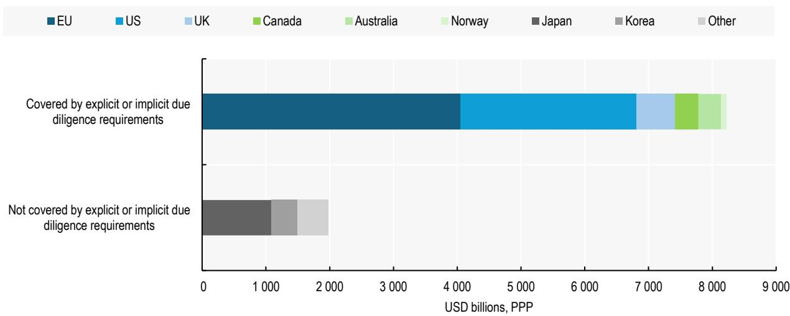  
Note: This figure shows the value of public procurement spending in countries where due diligence requirements either directly mandate or indirectly imply action on RBC by public institutions. Values are reported in billions of USD, adjusted for Purchasing Power Parity (PPP), current prices. Data correspond to the latest available year (2024 or 2023). Data were unavailable for Argentina, Brazil, Chile, Egypt, Jordan, Kazakhstan, Mauritius, Morocco, Peru, Tunisia, Türkiye, Ukraine, and Uruguay. For Australia, Costa Rica, Israel, Japan, Korea, Mexico, New Zealand, Switzerland, and the United States, 2024 data were unavailable and 2023 values were used instead. EU compilation of public procurement spending is missing data from Cyprus and Malta. Although EU due diligence requirements applying to public procurement have EEA relevance, Iceland is not included in the EU aggregate for the purpose of this figure.  
Source: OECD (2025[61]), Government at a Glance Indicators 2025, https://www.oecd.org/en/data/dashboards/government-at-glance-2025.html.

## State-owned enterprises

SOEs are an important feature in the global economy with critical importance for the promotion of RBC. Of the 500 biggest companies worldwide, 126 were SOEs in 2024 – up from 34 at the turn of the century and 102 in 2017 (OECD, 2024, p. 12 $^{[62]}$ ). Given their concentration in sectors with large environmental and social footprints, such as extractives or infrastructure development, they can be associated with significant social and environmental impacts. As described in the previous chapter, in most regions, SOEs report higher uptake of due diligence than non-SOEs (see Box 2.4).

Countries adhering to the MNE Guidelines have begun to establish responsible business conduct expectations for SOEs through a range of different approaches

Most countries adhering to the MNE Guidelines have established and disclosed expectations for SOEs to observe RBC principles and standards. Thirty-six countries adhering to the MNE Guidelines (81% of respondents) declared that they establish RBC expectations for SOEs (see Figure 3.11). $^{22}$

Eleven countries adhering to the MNE Guidelines (25% of respondents) reported establishing RBC expectations for their SOEs through more than one means. $^{23}$ While countries use a range of different instruments, there is some convergence on the most used tools. The most popular means to establish expectations are policies and regulations applicable to SOEs (20 countries adhering to the MNE Guidelines, 45% of respondents), followed by state ownership policies (14 countries adhering to the MNE Guidelines, 32% of respondents, see Figure 3.11). The integration of RBC expectations in individual SOE mandates, on the other hand, remains an emerging practice, applied by only three countries adhering to the MNE Guidelines (7% of respondents). In some cases, governments use several methods to set expectations.

Figure 3.11. Means of setting responsible business conduct expectations for state-owned enterprises among countries adhering to the OECD Guidelines for Multinational Enterprises on Responsible Business Conduct  
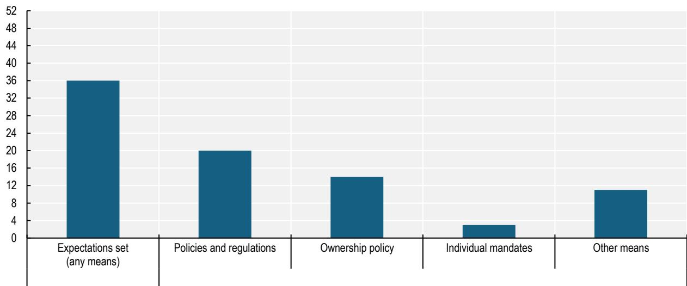  
Note: This figure displays the number of countries adhering to the MNE Guidelines using different mechanisms to set RBC expectations for state-owned enterprises (SOEs). Based on 44 responses to the survey question: "Has your government, in its role as owner, established and disclosed expectations for [SOEs] to observe RBC principles and standards (including disclosure of RBC information and/or the conduct of risk-based due diligence)?". Respondents were able to select more than one means.  
Source: Based on a 2025 survey of 52 countries adhering to the MNE Guidelines and the European Union on RBC policy developments.

Fourteen countries adhering to the MNE Guidelines (32% of respondents) establish RBC-related expectations or references to business responsibilities in their overarching state ownership policies. $^{24}$ Ownership policies are high-level policy documents or legal instruments that outline, among other elements, the rationales and goals for state ownership of companies. $^{25}$ Expectations were most frequently set in relation to the environment and climate and anti-corruption and integrity (11 out of 14 in both cases), followed by labour rights (10 out of 14). Human rights were the least-frequently mentioned area (7 out of 14, see Table 3.3).

In six cases, the state ownership policies referred to OECD RBC instruments. Four of these establish expectations that SOEs implement the recommendations contained in OECD RBC instruments, either through general references to the MNE Guidelines or to due diligence processes (Government of the Netherlands, 2022[63]; Government of Norway, 2022[64]; Government Offices of Sweden, 2025[65]; Government of Romania, 2025[66]). The remaining two policies refer to the role of OECD RBC instruments in informing company strategy on social responsibility issues, without explicitly requiring their incorporation, and as one of the objectives pursued by the state-ownership policy (Government of Ukraine, 2024[67]; Government of Finland, 2024[68]).

Table 3.3. Content of expectations related to responsible business conduct in overarching state ownership policies

<table><tr><td>Adherent</td><td>Human rights</td><td>Labour rights</td><td>Environment</td><td>Anti-corruption and integrity</td><td>Reference to OECD RBC instruments</td></tr><tr><td>Netherlands</td><td></td><td></td><td></td><td></td><td></td></tr><tr><td>Norway</td><td></td><td></td><td></td><td></td><td></td></tr><tr><td>Sweden</td><td></td><td></td><td></td><td></td><td></td></tr><tr><td>Colombia</td><td></td><td></td><td></td><td></td><td></td></tr><tr><td>Romania</td><td></td><td></td><td></td><td></td><td></td></tr><tr><td>Spain</td><td></td><td></td><td></td><td></td><td></td></tr><tr><td>Ukraine</td><td></td><td></td><td></td><td></td><td></td></tr><tr><td>France</td><td></td><td></td><td></td><td></td><td></td></tr><tr><td>Germany</td><td></td><td></td><td></td><td></td><td></td></tr><tr><td>Peru</td><td></td><td></td><td></td><td></td><td></td></tr><tr><td>Portugal</td><td></td><td></td><td></td><td></td><td></td></tr><tr><td>Costa Rica</td><td></td><td></td><td></td><td></td><td></td></tr><tr><td>Denmark</td><td></td><td></td><td></td><td></td><td></td></tr></table>

Note: The table considers publicly available overarching state ownership policies of countries adhering to the MNE Guidelines that reported establishing expectations on RBC for their state-owned enterprises (SOEs) through state ownership policies. Some of the countries included may establish additional expectations in areas not included in the table through additional means, such as individual mandates. For example, Costa Rica establishes expectations for individual SOEs through annual “notes of expectations”, which are designed and implemented in a transversal manner and contain expectations across a broader range of issues than the country’s overarching state ownership policy.  
☐ No explicit expectations  
Explicit expectations

Source: Compilation by the OECD based on a 2025 survey of 52 countries adhering to the MNE Guidelines and the European Union on RBC policy developments.

Disclosure has been an important mechanism for countries adhering to the MNE Guidelines to advance implementation of responsible business conduct expectations in SOEs

Government reporting on SOE portfolio performance has emerged as a mechanism for accountability on non-financial aspects of SOE performance. Thirty-one countries adhering to the MNE Guidelines have an annual report covering all or some SOEs in their portfolio, and a further ten have mechanisms such as ad hoc reporting, reporting to national parliaments, or online inventories. $^{26}$ In 29 countries adhering to the MNE Guidelines (56% of all countries adhering to the MNE Guidelines and 71% of those with a reporting mechanism), these reporting channels include information on the non-financial performance of the portfolio SOEs. $^{27}$

State expectations and market dynamics are also driving SOEs to disclose sustainability information themselves. Out of 2 216 listed SOEs globally in 2024, 1 395 (representing 63% of listed SOEs and 95% of SOE market capitalisation) disclosed sustainability-related information (OECD, 2025, p. 22 $^{[69]}$ ). $^{28}$

## Responsible business conduct in the provision of export credits

State-based export credit agencies (ECAs) can play an important role in promoting RBC as ECAs represent the largest public source of financing for foreign companies pursuing industrial projects in developing countries (Global NAPs, n/a[70]).

Most countries integrate responsible business conduct into the provision of officially supported export credits

The 38 OECD Members (78% of countries adhering to the MNE Guidelines) all adhere to the OECD Recommendation on Common Approaches for Officially Supported Export Credits and Environmental and Social Due Diligence (The Common Approaches). $^{29}$ ECAs in other countries also follow the OECD Common Approaches, even where their country does not formally adhere to the Common Approaches, such as BNDES in Brazil (OECD, 2022 $^{[71]}$ ). The Common Approaches recommend that adhering countries consider the potential environmental and social risks relating to applications for officially supported export credits. They reference the MNE Guidelines and contain provisions for due diligence to be carried out for high-risk projects. The Common Approaches also recommend that countries promote the MNE Guidelines through their ECAs and consider the outcomes of NCP cases when undertaking project reviews.

Figure 3.12. Share of export credit agency mandates and policy statements that include responsible business conduct topics  
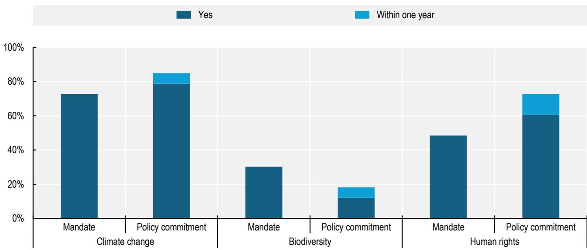  
Note: The figure shows the share and number of export credit agencies (ECAs) reporting existing mandates or policy commitments, as well as those expected to be introduced within one year. Results are based on 33 ECAs covered in the 2024 Survey of Climate-related and Sustainability-related Policies and Practices. The countries represented by the survey cover most countries adhering to the MNE Guidelines with existing ECAs.  
Source: OECD (2025[72]), Responses to the 2024 Survey of Climate-related and Sustainability-related Policies and Practices, https://one.oecd.org/document/TAD/ECG(2025)1/FINAL/en/pdf.

In 2024, over $70\%$ of ECAs of countries adhering to the Common Approaches reported having formal mandates or policy statements related to climate change and related issues. Human rights is less reflected as a focus in mandates and policy statements (just over half of ECAs have adopted such a policy or mandate). Biodiversity is less common; fewer than one-third of ECAs have adopted a policy statement or mandate with this focus (OECD, 2025[72]) (see Figure 3.12).

Under the Common Approaches, all ECAs in OECD countries carry out due diligence to address potential environmental and social impacts of projects and to ensure compliance with relevant host country regulations and international standards. For example, Eksfin, Norway's export credit agency, applies a risk-based due diligence approach to systematically identify and evaluate sustainability-related risks in their activities and value chains. Applicants to Eksfin are encouraged to implement the MNE Guidelines, the UNGPs, and the Common Approaches (Eksfin, n.d.[73]). Canada's EDC uses a risk-based approach that assigns a level of due diligence depending on specific risk factors.

Climate-related measures are particularly prominent in ECA risk assessments. In 2024, almost 60% of ECAs of countries adhering to the Common Approaches reported incorporating climate risk into their risk assessment processes or plans to do so within the next year (OECD, 2025[72]) (see Figure 3.13).

Figure 3.13. Share of export credit agencies considering climate-related risks in risk assessments  
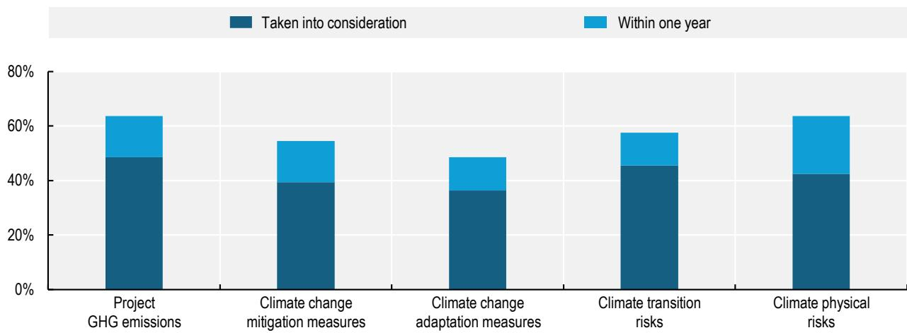  
Note: The figure shows the share and number of export credit agencies (ECAs) that consider specific climate-related risk factors in their risk assessment processes, as well as those planning to do so within one year. Results are based on 33 ECAs covered in the 2024 Survey of Climate-related and Sustainability-related Policies and Practices. The countries represented by the survey cover most countries adhering to the MNE Guidelines with existing ECAs.  
Source: OECD (2025[72]), Responses to the 2024 Survey of Climate-related and Sustainability-related Policies and Practices, https://one.oecd.org/document/TAD/ECG(2025)1/FINAL/en/pdf/

Export credit agencies incentivise responsible business conduct through additional services

An increasing number of ECAs are incentivising higher performance on aspects of RBC. Incentives are mostly focussed on climate-related performance or linked to the Sustainable Development Goals (SDGs). The latter has seen a particular growth. In 2024, around one-third of the 33 countries that responded to the 2024 survey of climate-related and sustainability-related policies and practices for countries adhering to the Common Approaches had introduced additional financing or guaranteed cover for projects that show higher climate- or sustainability-related standards. This was up from about one-fifth of countries in 2022. As part of the incentives, ECAs may increase the maximum amount of support, reduce national content requirements or allow more flexible financing terms and conditions. (OECD, 2025[72]).

## Promoting access to remedy

Remedy is a core aspect of RBC, whereby affected persons or groups can seek reparation for negative impacts they may have suffered. Remedies can take several forms, such as apologies, restitution, rehabilitation, compensation (financial or non-financial), sanctions or guarantees of non-repetition. Governments have a key role in making access to remedy effective.

Analysis shows that governments have been promoting access to remedy mainly through three main types of measures: 1) establishing state-based grievance mechanisms with low barriers to access; 2) requiring companies to remediate their negative impacts; 3) supporting affected persons in getting access to remediation.

## Governments provide a variety of state-based grievance mechanisms and work to remove barriers to access

Governments can provide access to remedy through a combination of judicial grievance mechanisms, as well as through a wide array of non-judicial grievance mechanisms, including National Contact Points for Responsible Business Conduct (NCPs) (see Box 3.6).

## Box 3.6. National Contact Points for Responsible Business Conduct

All 52 countries adhering to the OECD Guidelines for Multinational Enterprises on Responsible Business Conduct (MNE Guidelines) (OECD, 2023[1]) are required to establish a National Contact Point (NCP) for Responsible Business Conduct. NCPs are the MNE Guidelines' implementation mechanisms and have three key functions:

• they raise awareness and promote the uptake of the MNE Guidelines

• they act as a non-judicial grievance mechanism

they may support their government's policy efforts to promote RBC.

In their role as a non-judicial grievance mechanism, NCPs may review reports of alleged non-observance of the MNE Guidelines by companies operating in or from their territory. NCP cases are called “specific instances”. If the NCP decides that the issues raised in a case warrant further examination, it will offer mediation to the parties to facilitate agreement. In all cases received, NCPs will issue a public statement, which can contain recommendations to the company. Where relevant, NCPs can also set out their views as to whether the company has acted in accordance with the MNE Guidelines. NCPs generally follow up on agreements and recommendations.

More information on how NCPs handle cases in practice is available online (OECD, 2026[74]). The OECD maintains a database of cases handled by NCPs (OECD, n.d.[75]).

Every year, the OECD issues an Annual Report on NCP activity, notably including analysis of data related to cases handled by NCPs (OECD, 2026[76]).

Source: OECD (2026[77]), National Contact Points for Responsible Business Conduct, https://www.oecd.org/en/networks/national-contact-points-for-responsible-business-conduct.html.

Governments are also working to reduce barriers to access to grievance mechanisms by persons harmed by corporate conduct, such as cost, length, or legal requirements (standing and/or jurisdiction) (European Union Fundamental Rights Agency, 2017[78]). In this regard, 37 countries adhering to the MNE Guidelines (82% of respondents) $^{30}$ indicated having taken at least one measure to address barriers to state-based grievance mechanisms, though only 16 countries (36% of respondents) $^{31}$ had been developing a coherent policy strategy to enable access to remedy and remove barriers (see Table 3.4). As one example, as part of its 2024-2027 National Action Plan on Business and Human Rights, Switzerland developed a three-pronged strategy for the effective provision of access to remedy (Pillar III). These measures include: to map and analyse obstacles preventing access to grievance mechanisms, encourage the private sector to set up grievance mechanisms; and the handling of complaints from human rights defenders. Each measure is accompanied by a performance indicator, and assigned a government department that is responsible for overseeing its implementation. (Government of Switzerland, 2024 $^{[79]}$ ).

To improve access to remedy, governments are creating specialised mechanisms to receive RBC complaints. Some due diligence regulations also create supervisory authorities, which can receive complaints related to harm suffered because of non-compliance with due diligence requirements. Twenty-five countries adhering to the MNE Guidelines (56% of respondents) indicated creating special avenues to lodge complaints, such as specialised court chambers, while 20 countries adhering to the MNE Guidelines (44% of respondents) are mandating authorities such as ombudspeople to receive grievances related to RBC. $^{32}$ For example, in 2024, the Paris Judicial Tribunal and Court of Appeal created chambers for handling cases related to the law on the corporate duty of vigilance and environmental responsibility. The chambers allow enforcement of the civil liability rules under the Duty of Vigilance Law. They provide access to courts in cases of non-compliance, allow claims for compensation, and can also handle disputes about corporate sustainability disclosure (Government of France, 2024 $^{[80]}$ ).

Judicial grievance mechanisms are commonly used as a state-based remedy mechanism but come with important barriers that governments may not yet be fully addressing. Current evidence shows that litigation related to RBC issues is rising steadily (Business and Human Rights Resource Centre, 2025[81]). A 2025 survey of over 400 corporate counsels mainly from the United States and Canada shows that $27\%$ of respondents expect their exposure to RBC-related claims to increase in 2026, particularly social $(79\%)$ and environmental $(75\%)$ issues (Norton Rose Fulbright, 2025[82]). However, there are specific barriers to judicial litigation of RBC issues, ranging from jurisdiction to procedure (European Law Institute, 2022[83]; Kilimcioğlu, 2024[84]). In cases with an extraterritorial element, barriers such cost and jurisdiction are particularly high. Only a handful of governments (five countries adhering to the MNE Guidelines, $11\%$ of respondents) $^{33}$ indicated having measures to address such barriers.

Table 3.4 Measures to improve access to remedy  
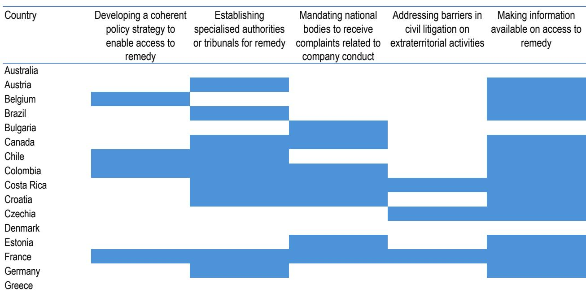  
OECD RESPONSIBLE BUSINESS OUTLOOK 2026 © OECD 2026

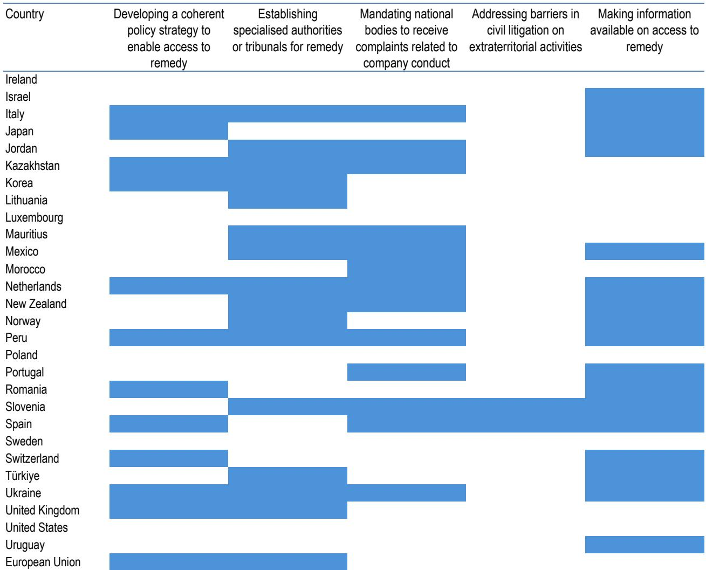  
Note: The table shows the existence of measures of related to access to remedy across countries adhering to the MNE Guidelines as well as the European Union. It excludes countries that did not respond to this question (Argentina, Finland, Egypt, Hungary, Iceland, Latvia, the Slovak Republic and Tunisia).  
No  
Yes  
Source: Compilation by the OECD based on a 2025 survey of 52 countries adhering to the MNE Guidelines and the European Union on RBC policy developments.

## Governments place requirements on companies regarding access to remedy

Remedy is a key element of the OECD due diligence framework. However, as indicated in the previous chapter, global uptake is much weaker than for other due diligence steps, with only 17% of companies reporting having a formal grievance mechanism on human rights, and only 10% committing to provide remediation to affected persons for human rights impacts. To address this gap, some government regulations on due diligence place remediation requirements on companies. Such requirements can be of two types, which are not mutually exclusive: 1) providing remedy to persons or groups affected by the company conduct; and 2) setting up a grievance mechanism to provide access to remedy for affected persons or groups.

OECD analysis of measures on RBC due diligence (see Table 3.2) finds that the first type of requirement above is contained explicitly in 7 out of the 26 measures analysed, with various levels of detail. However, other types of measures can indirectly lead companies to provide remediation. For example, evidence of remediation may be taken into account in enforcement proceedings of product and market-based measures such as forced labour bans. When taking both the direct and indirect measures above into account, requirements on companies to remediate were present in around half of due diligence measures in the sample (see Figure 3.14).

The second requirement, setting up grievance systems, is contained explicitly in 7 out of the 26 measures analysed, again with uneven level of detail. When considering accompanying guidance, 10 measures can be considered as having a legal requirement for company grievance mechanisms (see Figure 3.14). Therefore, while most RBC due diligence legislative measures analysed include remediation requirements directly or indirectly, explicit provisions on remedy are less common than provisions related to other due diligence steps (see also (OECD, 2026[7]).

Figure 3.14. Direct and indirect remediation requirements in environmental and social due diligence laws  
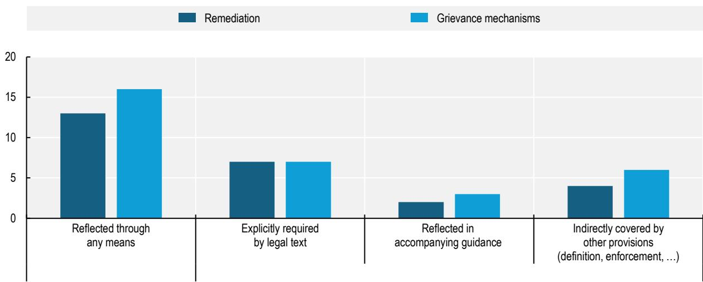  
Note: Analysis of 26 RBC due diligence laws from countries adhering to the MNE Guidelines and one non-adherent, including disclosure measures, due diligence conduct measures, as well as product and market-based measures. The category “Reflected through any means” is derived from the aggregation of the other categories and is not a separate classification.  
Source: OECD (2026[7]), Mapping social and environmental due diligence legislation, https://doi.org/10.1787/bac11241-en.

Some governments are signalling their expectation that companies engage with non-judicial grievance mechanisms, and may implement consequences in case of failure to do so. For example, the Canadian NCP may recommend to the Canadian Trade Commissioner, Export Development Canada and the Canadian Commercial Corporation that they withdraw or withhold support to a company that did not engage in good faith with the NCP (Government of Canada, 2022[85]). The Dutch Ministry of Foreign Affairs requires that any enterprise wishing to apply for government support from the ministry, such as subsidies or participation in a trade mission, needs to report and collaborate with the NCP when involved in a specific instance (NCP case) (Rijksdienst voor Ondernemend Nederland, 2025[86]).

## Governments can facilitate access to effective remedy

Governments have been providing information to the public on how to overcome barriers to access to remedy, and to help affected persons navigate the often-confusing constellation of grievance mechanisms (OHCHR, 2024[87]). Twenty-nine countries adhering to the MNE Guidelines (64% of respondents) had taken measures to provide such information. $^{34}$ For example, under Belgium's National Action Plan on

Business and Human Rights, the Belgian Federal Institute for Sustainable Development, a government agency supporting the federal government on sustainable development policy, developed a brochure on the available state-based judicial and non-judicial mechanisms that provide access to remedy. The brochure provides information on the remedy landscape and the rights and duties of all relevant persons and entities in seeking and providing access to remedy (Belgian Federal Institute for Sustainable Development, 2018[88]).

Civil society and other organisations are also playing a significant role in promoting access to remedy, which governments can support. For example, 37% of all cases received by NCPs (specific instances, see Box 3.6) have been filed by NGOs, often on behalf or to the benefit of directly affected persons or communities (OECD, n.d.[75]). Many business and human rights lawsuits have also been filed by NGOs (Business and Human Rights Resource Centre, n.d.[89]). Government support of these organisations, through funding or otherwise, is thus an important means of improving access to remedy.

Governments may also provide direct support to individual users of grievance mechanisms. Such support can be of a financial or non-financial nature. In terms of financial support, many countries have a system of legal aid through which claimants who meet certain conditions may receive free or discounted legal assistance from a lawyer, or reduced court fees. This applies mostly to judicial mechanisms in certain countries, but due to stringent conditions and complex application procedures, may not always effectively offset barriers to accessing judicial grievance mechanisms (European Union Fundamental Rights Agency, 2017[78]). In several countries, state-based non-judicial grievance mechanisms also provide non-financial support to potential claimants, e.g. through help in filing admissible claims. This is particularly the case of consumer authorities, but also of NCPs. OECD procedures, for example, encourage NCPs to consider the situation of all parties involved in a specific instance, and to provide equitable support to less well-resourced parties so that they can most effectively use the NCP grievance mechanism.

## Co-ordinating policies and activities on responsible business conduct

Governments are strengthening co-ordination to ensure coherence across RBC policies. As RBC touches a broad range of policy issues, and mandatory and voluntary measures to promote RBC are increasing, co-ordination within and between governments is gaining importance. Many governments are adopting whole-of-government approaches, supported by dedicated co-ordination structures, with NCPs playing an important role in fostering policy coherence. At regional and international levels, governments are convening and working together to advance RBC, strengthen implementation, align standards and address emerging challenges that require global and co-ordinated solutions.

## Governments are strengthening domestic co-ordination to promote coherence across responsible business conduct policies and practices

Twenty-eight countries adhering to the MNE Guidelines (64% of respondents) $^{35}$ have strategies or structures to promote coherence across domestic government to align RBC actions. Among these, 22 countries (50% of respondents) $^{36}$ report having national or sub-national RBC strategies or policies, such as Japan's Inter-Ministerial Committee for the Action Plan on Business and Human Rights (Cabinet Secretariat Japan, 2025 $[90]$ ) and Germany's subnational Joint Action for Sustainable Development (Government of Germany, 2022 $[91]$ ).

Nineteen countries adhering to the MNE Guidelines (43% of respondents) report having specific co-ordination mechanisms for RBC. In recent years, some governments created centralised units or inter-ministerial secretariats, reflecting an effort to institutionalise coherence across the policy cycle. Ensuring an adequate budget, composition and mandates are essential to embed RBC consistently across government policies and practices. In Croatia, the inter-ministerial Working Group for the Promotion of

RBC brings together government representatives with competencies in areas covered by the MNE Guidelines and is tasked with encouraging and co-ordinating the integration of initiatives and measures which promote RBC in national policies, draft normative acts and other documents. $^{37}$ NCPs are also increasingly stepping in to play a role in supporting the development, implementation and coherence of government policy to promote RBC. In 2025, 75% of NCPs reported following, providing input, and/or being consulted on policy or regulatory developments to promote RBC. Similarly, 58% were involved in cross-government co-ordination mechanisms regarding policy areas relevant for RBC. $^{38}$

Governments are expanding efforts to identify and address barriers to policy coherence on RBC. Twenty-two countries adhering to the MNE Guidelines (49% of respondents) $^{39}$ have conducted assessments or reviews to promote domestic policy coherence and facilitate alignment between policies and practices relevant to RBC. Such reviews are often done when developing a new action plan, strategy, law, or when evaluating and updating existing policies and their impact. Recently, an evaluation of Switzerland's second NAP on business-related human rights (BHR) identified co-ordination challenges between different federal offices and low awareness of business and human rights efforts across government as factors hindering policy coherence. This resulted in several recommendations to inform the country's subsequent NAP which identifies policy coherence as a priority area and includes measures to strengthen co-ordination across government (Engageability, 2023 $^{[92]}$ ). Several governments also publish national reports on RBC implementation, providing transparency on progress across ministries and policy areas, such as the Norwegian NCP's annual reports (NCP of Norway, n.d. $^{[93]}$ ).

Governments are engaging with non-government stakeholders including with business, civil society and trade unions to shape responsible business conduct policy

Thirty countries adhering to the MNE Guidelines (67% of respondents) have processes for consultation on RBC policy development. Efforts include engagement as part of the creation, monitoring and enforcement of RBC laws and policies, and strengthening the enabling environment for inclusive and meaningful stakeholder participation. Some countries have consulted stakeholders on NAPs, with some recent examples including Chile, the Netherlands and the United States (U.S. Department of State, n.d.[94]).

Eighteen countries adhering to the MNE Guidelines (40% of respondents) report engaging with stakeholders on monitoring the implementation of RBC policies. For example, government engagement with stakeholders has been a critical part of the monitoring of due diligence laws. In 2025, the Norwegian Government published an evaluation report of the 2022 Transparency Act. As part of the process, the government sought inputs from businesses, trade unions, civil society organisations and the general public on how they perceived the law. This included their experience with conducting due diligence following its adoption and as part of the broader regulatory landscape. The evaluation also sought inputs on areas for improvement. (The Royal Norwegian Ministry of Children and Families, 2025[95]). Another example is Australia's statutory review of the 2018 Modern Slavery Act, three years after its introduction. The government sought public input on whether additional measures were necessary to improve the Act's operation and compliance through five consultation avenues: written submissions, online survey and questionnaire, targeted consultations and meetings with selected individuals and committees (Government of Australia, 2024[96]).

Increased efforts are being made at the international level to support coherence in policymaking and the implementation of responsible business conduct

With business activities more globalised and spanning multiple jurisdictions, governments are strengthening international co-operation to align policy approaches, reduce fragmentation and support consistent expectations for businesses. This includes the integration of RBC in statements and declarations, such as the 2023 G7 Leaders Communique (G7, 2023[97]) and the 2025 G7 Critical Minerals Action Plan to build sustainable and secure critical mineral supply chains, under Canada's G7 presidency (G7, 2025[98]). International co-operation is further evidenced by APEC's references to OECD standards in the MNE Guidelines on Inclusive and Responsible Business and Investment (APEC, 2024[99]), and its Investment Facilitation Action Plan (APEC, 2025[100]), as well as ASEAN's Sustainable Investment Guidelines (ASEAN, 2026[101]). In 2025, the OECD launched the Inclusive Platform for Due Diligence Policy Co-Operation, which has gathered policymakers from nearly 70 countries to support evidence-based, coherent and inclusive approaches to due diligence policy.

Governments also engage in a range of multilateral and regional fora, such as the OECD regional programmes on RBC, $^{40}$ where they exchange on policy development and work together to advance RBC, strengthen implementation, align standards and address emerging challenges that require global and co-ordinated solutions.

## References

African Union (2023), Protocol to the Agreement Establishing the African Continental Free Trade Area on Investment, https://au-afcfta.org/wp-content/uploads/2024/11/EN-AfCFTA-Protocol-on-Investment-clean-1.pdf. [24]

APEC (2025), Investment Facilitation Action Plan: Principles and Strategies (Endorsed), https://www.apec.org/docs/default-source/groups/ieg/2025/25\_cti2\_027.pdf?sfvrsn=30da62f8\_1.

APEC (2024), Guidelines on Inclusive and Responsible Business and Investment (IRBI), https://www.apec.org/publications/2024/10/apec-guidelines-on-inclusive-and-responsible-business-and-investment-(irbi). [99]

ASEAN (2026), ASEAN Sustainable Investment Guidelines, https://asean.org/wp-content/uploads/2026/04/ASEAN-Sustainable-Investment-Guidelines-ASIG.pdf. [101]

Belgian Federal Institute for Sustainable Development (2018), Access to Remedy in Belgium, [88] https://sustainabledevelopment.be/sites/default/files/2025-07/EN\_brochure-Access-remedy-Belgium\_2018-06.pdf (accessed on 4 June 2026).

Bozzay, E. et al. (2025), “Linking integrity, business conduct and public procurement: New approaches for sustainable supply chains”, OECD Working Papers on International Investment, No. 2025/01, OECD Publishing, Paris, https://doi.org/10.1787/cfb65ff8-en.

Business and Human Rights Resource Centre (2025), Progress and Pushback: Corporate legal accountability in 2025 and what to expect in 2026, https://www.business-humanrights.org/en/blog/progress-and-pushback-corporate-legal-accountability-in-2025-and-what-to-expect-in-2026/ (accessed on 4 June 2026).

Business and Human Rights Resource Centre (n.d.), Lawsuit Profiles Database, https://www.business-humanrights.org/en/from-us/lawsuits-database/ (accessed on 4 June 2026).

Business Sweden (n.d.), General Conditions for Participation in Trade and Invest Activities, [31] https://www.business-sweden.com/general-conditions-activities/ (accessed on 3 June 2026).

Cabinet Secretariat Japan (2025), Promotion and Liaison Meeting on Measures by Related Ministries and Agencies for the Implementation of Action Plans on Business and Human Rights, https://www.cas.go.jp/jp/seisaku/business\_jinken/index.html (accessed on 24 April 2026).

Canada (2023), Clean Technology Investment Tax Credit (ITC), https://www.canada.ca/en/revenue-agency/services/tax/businesses/topics/corporations/business-tax-credits/clean-economy-itc/clean-technology-itc.html (accessed on 3 June 2026).

Citizens Information Board Ireland (2023), Supports for businesses going green, https://www.citizensinformation.ie/en/employment/types-of-employment/self-employment/supports-for-businesses-going-green/ (accessed on 24 April 2026).

City of San Diego (2023), Affordable, In-Fill Housing and Sustainable Buildings Expedite Program, https://www.sandiego.gov/development-services/forms-publications/information-bulletins/538 (accessed on 24 April 2026).

Department of Climate, Energy and the Environment (2024), Green Public Procurement (GPP), Government of Ireland, https://assets.gov.ie/static/documents/buying-greener-green-public-procurement-strategy-and-action-plan-2024-2027.pdf. [58]

Eksfin (n.d.), Environmental and Social Due Diligence, Export Finance Norway, [73] https://www.eksfin.no/en/about/sustainability/environment-and-social-risks/ (accessed on 27 August 2025).

Engageability (2023), Evaluation of the National Action Plan on Business & Human Rights 2020–2023, https://engageability.ch/evaluation-of-the-national-action-plan-on-business-human-rights-2020-2023/ (accessed on 21 July 2025).

European Commission (2025), Competitiveness compass, https://commission.europa.eu/topics/competitiveness/competitiveness-compass\_en (accessed on 4 June 2026).

European Law Institute (2022), Business and Human Rights: Access to Justice and Effective Remedies, https://www.europeanlawinstitute.eu/fileadmin/user\_upload/p\_eli/Publications/ELI\_Report\_on\_Business\_and\_Human\_Rights.pdf. [83]

European Union Fundamental Rights Agency (2017), Improving access to remedy in the area of business and human rights at EU level, [78] https://fra.europa.eu/sites/default/files/fra\_uploads/fra-2017-opinion-01-2017-business-human-rights\_en.pdf.

G7 (2025), Critical Minerals Action Plan, [98] https://www.pm.gc.ca/en/news/statements/2025/06/17/g7-critical-minerals-action-plan.

G7 (2023), G7 Hiroshima Leaders' Communiqué, https://www.mofa.go.jp/files/100506878.pdf. [97]

Global NAPs (n/a), Export Credit, https://globalnaps.org/issue/export-credit/ (accessed on 3 June 2026). [70]

Government of Australia (2024), Review of Australia's Modern Slavery Act 2018, Attorney-General's Department, https://consultations.ag.gov.au/crime/modern-slavery-act-review/#:\~:text=The%20Australian%20Government%20is%20undertaking,to%20be%20table d%20in%20Parliament.

Government of Canada (2025), Roadmap to Promote Standards-based Markets for Critical Minerals, https://www.canada.ca/en/natural-resources-canada/news/2025/10/roadmap-to-promote-standards-based-markets-for-critical-minerals.html.

Government of Canada (2022), Canada's National Contact Point - Specific Instance Procedures - 2022, https://www.international.gc.ca/transparency-transparence/national-contact-point-contact-national/procedures.aspx?lang=eng#a9 (accessed on 4 June 2026).

Government of Canada (2021), Responsible Business Conduct Abroad: Canada's Strategy for the Future, https://www.international.gc.ca/trade-commerce/assets/pdfs/rbc-cre/strategy-2021-strategie-1-eng.pdf.

Government of Chile (2025), Política de Sostenibilidad 2030, https://www.prochile.gob.cl/docs/default-source/politica-sostenibilidad/politica-sotenibilidad-2025.pdf?sfvrsn=5e3ca353\_1.

Government of Chile (2025), SUBREI lidera encuentro internacional sobre fortalecimiento de Puntos Nacional de Contacto (PNC) de la Alianza del Pacífico, press release, https://www.subrei.gob.cl/sala-de-prensa/noticias/detalle-noticias/2025/02/28/subrei-lidera-encuentro-internacional-sobre-fortalecimiento-de-puntos-nacional-de-contacto-(pnc)-de-la-alianza-del-pac%C3%ADfico (accessed on 3 June 2026).

Government of Chile (2024), Subgrupo de Conducta Empresarial Responsable inicia ciclo de conversaciones para difundir su trabajo con las otras instancias de la Alianza del Pacífico, press release, https://www.subrei.gob.cl/sala-de-prensa/noticias/detalle-noticias/2024/08/20/subgrupo-de-conducta-empresarial-responsable-inicia-ciclo-de-conversaciones-para-difundir-su-trabajo-con-las-otras-instancias-de-la-alianza-del-pac%C3%ADfico (accessed on 3 June 2026).

Government of Chile (n.d.), Sostenibilidad, https://www.prochile.gob.cl/innovacion-y-competitividad/sostenibilidad/prochile-y-sostenibilidad (accessed on 3 June 2026).

Government of Finland (2024), Sustainable growth through State Ownership - Government resolution on the State Ownership Policy 2024, https://julkaisut.valtioneuvosto.fi/bitstream/handle/10024/165680/VN\_2024\_30.pdf?sequence=1&isAllowed=y.

Government of France (2024), Création d'une chambre des contentieux émergents – devoir de vigilance et responsabilité écologique à la CA de Paris, https://www.cours-appel.justice.fr/paris/creation-dune-chambre-des-contentieux-emergents-devoir-de-vigilance-et-responsabilite.

Government of France (2021), Labels RSE : accompagner les entreprises et donner confiance à leurs parties prenantes, https://www.tresor.economie.gouv.fr/Articles/2021/02/18/rapport-sur-les-labels-rse-accompagner-les-entreprises-et-donner-confiance-a-leurs-parties-prenantes.

Government of Germany (2022), Joint Action for Sustainable Development, https://www.nachhaltigkeitsrat.de/wp-content/uploads/2022/11/Joint-Action-for-Sustainable-Development\_2-Pager.pdf (accessed on 3 June 2026).

Government of Mexico (2023), Entra en vigor el Acuerdo para prohibir la importación de mercancías producidas con trabajo forzoso, press release, https://www.gob.mx/stps/prensa/entra-en-vigor-el-acuerdo-para-prohibir-la-importacion-de-mercancias-producidas-con-trabajo-forzoso?idiom=es.

Government of Norway (2022), Greener and more active state ownership: The State's direct ownership of companies, https://kudos.dfo.no/documents/32214/files/28645.pdf.

Government of Romania (2025), Politica publică de proprietate privată a statului, https://amepip.gov.ro/en/politica-de-proprietate-a-statului/.

Government of Switzerland (2024), Pillar III: Access to remedy, https://www.nap-bhr.admin.ch/napbhr/en/home/nap/wiedergutmachung.html (accessed on 9 September 2025).

Government of the Netherlands (2022), Nota Deelnemingenbeleid Rijksoverheid 2022, https://open.overheid.nl/documenten/ronl-3b431afa41e0773c014a016ef77b2b51bea67bf0/file.

Government of the United Kingdom (2025), International reporting template on modern slavery, forced labour and child labour (accessible), https://www.gov.uk/government/publications/transparency-in-supply-chains-a-practical-guide/international-reporting-template-on-modern-slavery-forced-labour-and-child-labour-accessible.

Government of the United Kingdom (2025), The UK's Trade Strategy, https://www.gov.uk/government/publications/uk-trade-strategy/the-ucks-trade-strategy.

Government of the United Kingdom (2021), 100% first-year allowances, https://www.gov.uk/capital-allowances/first-year-allowances (accessed on 3 June 2026).

Government of Ukraine (2024), Деякі питання Політики державної власности [Some issues of state property policy], https://zakon.rada.gov.ua/laws/show/1369-2024-%D0%BF?lang=en#Text.

Government Offices of Sweden (2025), State Ownership Policy 2025, [65] https://www.government.se/contentassets/9c0ce65139ce4255b3a8f8bcd720113d/state-ownership\_policy\_2025\_webb.pdf.

GPEDC (2025), Global Partnership Monitoring 2023-2026: Insights from the First 11 Countries, [42] https://www.effectivecooperation.org/sites/default/files/documents/GPEDC%20monitor-insights%20from%2011%20countries\_.pdf.

Green Button (n.d.), What does the Green Button evaluate?, https://gruener-knopf.de/en/overview-criteria.

ICGLR (2010), Lusaka declaration of the ICGLR Special Summit to Fight Illegal Exploitation of Natural Resources in the Great Lakes Region, https://ungreatlakes.unmissions.org/sites/default/files/icqlr\_lusaka\_declaration\_of\_the\_icqlr\_special\_summit\_to\_fight\_illegal\_exploitation\_of\_natural\_resources\_in\_the\_glr.pdf (accessed on 4 June 2026).

IFC (n.d.), Update of IFC's Sustainability Framework, https://www.ifc.org/en/what-we-do/sector-expertise/sustainability/policies-and-standards/update-of-ifc-s-sustainability-framework#tabs-a1648b5292-item-13757db463-tab (accessed on 20 April 2026).

IFRS (2025), IFRS Foundation publishes jurisdictional profiles providing transparency and evidencing progress towards adoption of ISSB Standards, https://www.ifrs.org/news-and-events/news/2025/06/ifrs-foundation-publishes-jurisdictional-profiles-issb-standards/ (accessed on 4 June 2026).

Kilimcioğlu, B. (2024), The French Loi sur le devoir de Vigilance: The Main Procedural Issues Faced by Plaintiffs so far, Business and Human Rights Journal, https://bhrj.blog/2024/12/12/the-french-loi-sur-le-devoir-de-vigilance-the-main-procedural-issues-faced-by-plaintiffs-so-far/ (accessed on 4 June 2026).

LBMA (2025), Responsible Sourcing, https://www.lbma.org.uk/responsible-sourcing.

LME (2019), Responsible sourcing, https://www.lme.com/sustainability-and-physical-markets/sustainability/responsible-sourcing (accessed on 4 June 2026).

LPPM (2022), LPPM responsible sourcing programme: Guidance version 5, https://www.lppm.com/files/lppm-responsible-sourcing-guidance-version-251006.pdf.

MERCOSUR (2025), MERCOSUR/SGT N° 12/ACTA N° 01/25, https://www.google.com/url?sa=t&rct=j&q=&esrc=s&source=web&cd=&ved=2ahUKEwif1NrijkaaPAxVPRqQEHaFPIAAQFnoECBcQAQ&url=https%3A%2F%2Fcalendario.mercosur.int%2Fsimfiles%2Fdocreuniones%2F106734\_SGT12\_2025\_ACTA01\_ES.docx&usg=AOvVaw0pP8G4hzdy-R1U8Qh1i1Fz&opi=8997.

METI (2022), Guidelines on Respecting Human Rights in Responsible Supply Chains, https://www.meti.go.jp/policy/economy/business-jinken/guidelines/provisionalenglishtranslation.pdf.

NCP of Norway (n.d.), Reports and plans, https://responsiblebusiness.no/en/about-us/reporting-and-plans/#ncp-norway-annual-reports (accessed on 3 June 2026). [93]

Norton Rose Fulbright (2025), Annual Litigation Trends Survey: Perspectives from Corporate Council, https://www.nortonrosefulbright.com/-/media/files/nrf/nrfweb/knowledge-pdfs/norton-rose-fulbright---2025-annual-litigation-trends-survey.pdf?revision=3de2d1a0-0f41-4c78-bbb5-fa0c5a12dc3c&revision=5250410752617387904.

OECD (2026), FAQ on the NCP grievance mechanism, https://www.oecd.org/content/dam/oecd/en/networks/national-contact-points/FAQ-NCP-grievance-mechanism.pdf.

OECD (2026), Foreign Direct Investment Qualities Indicators | FDIQI, https://oecd-main.shinyapps.io/FDIqualities/ (accessed on 3 June 2026).

OECD (2026), Inclusive Platform on Due Diligence Policy Co-operation, https://www.oecd.org/en/topics/sub-issues/due-diligence-guidance-for-responsible-business-conduct/inclusive-platform-on-due-diligence-policy-co-operation.html.

OECD (2026), Mapping social and environmental due diligence legislation, OECD Publishing, Paris, https://doi.org/10.1787/bac11241-en.

OECD (2026), National Contact Points for Responsible Business Conduct: Growing Impact, Rising Expectations - Annual Report on NCP Activity 2025.

OECD (2026), National Contact Points for Responsible Business Conduct, https://www.oecd.org/en/networks/national-contact-points-for-responsible-business-conduct.html.

OECD (2026), Reporting requirements in social and environmental due diligence legislation, OECD Publishing, Paris, https://doi.org/10.1787/52f15766-en.

OECD (2026), The OECD Responsible Business Policy Navigator: Explore how governments promote responsible business conduct, https://www.oecd.org/en/data/dashboards/oecd-responsible-business-policy-navigator.html.

OECD (2025), Alignment assessment of the Green Button with OECD due diligence standards, OECD Publishing, Paris, https://doi.org/10.1787/3eba9485-en.

OECD (2025), Global Corporate Sustainability Report 2025, OECD Publishing, Paris, https://doi.org/10.1787/bc25ce1e-en.

OECD (2025), OECD Corporate Governance Factbook 2025, OECD Publishing, Paris, https://doi.org/10.1787/f4f43735-en.

OECD (2025), OECD DAC Blended Finance Guidance 2025, Best Practices in Development Co-operation, OECD Publishing, Paris, https://doi.org/10.1787/e4a13d2c-en. [43]

OECD (2025), OECD Government at a Glance Indicators 2025, [61] https://www.oecd.org/en/data/dashboards/government-at-glance-2025.html.

OECD (2025), “Promoting responsible business conduct in the development co-operation of Australia, Japan, Korea and New Zealand”, OECD Business and Finance Policy Papers, No. 95, OECD Publishing, Paris, https://doi.org/10.1787/7b7de4bc-en.

OECD (2025), Responses to the 2024 Survey of climate-related and sustainability-related policies and practices, https://one.oecd.org/document/TAD/ECG(2025)1/FINAL/en/pdf. [72]

OECD (2025), Shifting gears in uncertain times: How Investment Promotion Agencies balance evolving mandates and limited resources, https://www.oecd.org/en/blogs/2025/10/shifting-gears-in-uncertain-times-investment-promotion-agencies.html. [30]

OECD (2025), “Supporting businesses in trade partner countries to meet social and environmental due diligence standards”, OECD Business and Finance Policy Papers, No. 88, OECD Publishing, Paris, https://doi.org/10.1787/63c6be24-en.

OECD (2024), Harnessing Public Procurement for the Green Transition: Good Practices in OECD Countries, OECD Public Governance Reviews, OECD Publishing, Paris, https://doi.org/10.1787/e551f448-en.

OECD (2024), “Monitoring and evaluating sustainability in investment promotion: Evolving practices in OECD member countries”, OECD Business and Finance Policy Papers, No. 74, OECD Publishing, Paris, https://doi.org/10.1787/da22c153-en.

OECD (2024), OECD Development Co-operation Peer Reviews: France 2024, OECD Development Co-operation Peer Reviews, OECD Publishing, Paris, https://doi.org/10.1787/102d5469-en.

OECD (2024), Ownership and Governance of State-Owned Enterprises 2024, OECD Publishing, [62] Paris, https://doi.org/10.1787/395c9956-en.

OECD (2024), Report On The Implementation of the OECD Recommendation on Policy Coherence for Sustainable Development, https://one.oecd.org/official-document/C(2024)92/en.

OECD (2024), “Responsible business due diligence and government procurement: Implications of new regulation”, OECD Business and Finance Policy Papers, No. 71, OECD Publishing, Paris, https://doi.org/10.1787/e30b4f38-en.

OECD (2023), OECD Briefing Note: Responsible is Reliable, https://www.oecd.org/content/dam/oecd/en/topics/policy-sub-issues/due-diligence-guidance-for-responsible-business-conduct/Responsible\_is\_Reliable.pdf.

OECD (2023), OECD Guidelines for Multinational Enterprises on Responsible Business Conduct, OECD Publishing, Paris, https://doi.org/10.1787/81f92357-en.

OECD (2023), OECD work on Regional Trade Agreements and the environment: Policy Perspectives, https://www.oecd.org/content/dam/oecd/en/topics/policy-sub-issues/trade-and-environmental-sustainability/Policy-Perspectives-OECD-work-on-regional-trade-agreements-and-the-environment.pdf. [20]

OECD (2022), FDI Qualities Policy Toolkit, OECD Publishing, Paris, https://doi.org/10.1787/7ba74100-en.

OECD (2022), OECD Responsible Business Conduct Policy Reviews: Brazil, OECD Publishing, [71] Paris, https://doi.org/10.1787/19232c6a-en.

OECD (2022), Recommendation of the Council on the Role of Government in Promoting Responsible Business Conduct, OECD-LEGAL-0486, https://legalinstruments.oecd.org/en/instruments/OECD-LEGAL-0486 (accessed on 4 June 2026).

OECD (2020), Integrating Responsible Business Conduct in Public Procurement, OECD Publishing, Paris, https://doi.org/10.1787/02682b01-en. [54]

OECD (2018), OECD Due Diligence Guidance for Responsible Business Conduct, OECD Publishing, Paris, https://doi.org/10.1787/15f5f4b3-en. [6]

OECD (n.d.), National Contact Points for Responsible Business Conduct Database, https://www.oecd.org/en/networks/national-contact-points-for-responsible-business-conduct/database.html?orderBy=mostRelevant&page=0.

OECD Data Explorer (2026), Creditor Reporting System (flows), https://data-explorer.oecd.org/s/465.

OECD-DAC (2023), DAC High Level Meeting Communiqué 2023, https://www.oecd.org/en/events/2023/11/dac-high-level-meeting-2023.html.

Office of the United States Trade Representative (2020), United States–Mexico–Canada Agreement, https://ustr.gov/trade-agreements/free-trade-agreements/united-states-mexico-canada-agreement (accessed on 3 June 2026).

OHCHR (2024), Access to remedy in cases of business-related human rights abuse: An interpretive guide, https://www.ohchr.org/sites/default/files/2024-11/access-to-remedy-bhr-interpretive-guide-en.pdf. [87]

Pagel Fray, M. and C. Marott (2018), Market engagement: Zero Mission Transport - Craft and Facility Management Services, http://www.buyzet.eu/wp-content/uploads/2017/11/Copenhagen-BuyZET-Transportation-Mapping-. [57]

Rijksdienst voor Ondernemend Nederland (2025), Voorwaarden deelname handelsmissie met en zonder bewindspersoon, https://www.rvo.nl/onderwerpen/handelsmissie/uitgaande-handelsmissies/voorwaarden-deelname-met-en-zonder. [86]

Swedish Regions (2024), Guidance, https://husr.se/en/procurement-requirements/code-of-conduct/. [56]

The Royal Norwegian Ministry of Children and Families (2025), Review of the effects of the Norwegian Transparency Act, https://www.regjeringen.no/en/documents/review-of-the-norwegian-transparency-act/id3091232/.

U.S. Department of State (2025), The Regional Economic Integration Framework Between the Democratic Republic of the Congo and the Republic of Rwanda, https://www.state.gov/releases/office-of-the-spokesperson/2025/12/the-regional-economic-integration-framework-between-the-democratic-republic-of-the-congo-and-the-republic-of-rwanda (accessed on 4 June 2026).

U.S. Department of State (n.d.), Overview of the National Action Plan Process; Stakeholder Engagement During the NAP Process, https://www.state.gov/bureau-of-democracy-human-rights-and-labor/overview-of-the-national-action-plan-process (accessed on 24 April 2026). [94]

U.S. DOL (2026), USMCA Cases, Bureau of International Labor Affairs, https://www.dol.gov/agencies/ilab/our-work/trade/labor-rights-usmca-cases.

United Nations (2025), Outcome document of the Fourth International Conference on Financing for Development, https://docs.un.org/A/RES/79/323. [38]

## Notes

$^{1}$ Fifty-two countries plus the European Union adhere to the Recommendation on the Role of Government in Promoting RBC. Adherents are same as those adhering to the MNE Guidelines, including the OECD Members Australia, Austria, Belgium, Canada, Chile, Colombia, Costa Rica, Czechia, Denmark, Estonia, Finland, France, Germany, Greece, Hungary, Iceland, Ireland, Israel, Italy, Japan, Korea, Latvia, Lithuania,

Luxembourg, Mexico, the Netherlands, New Zealand, Norway, Poland, Portugal, the Slovak Republic, Slovenia, Spain, Sweden, Switzerland, Türkiye, the United Kingdom, the United States, non-Members Argentina, Brazil, Bulgaria, Croatia, Egypt, Jordan, Kazakhstan, Mauritius, Morocco, Peru, Romania, Tunisia, Ukraine, Uruguay; and the European Union (EU). The European Union submitted a partial response to questions applicable to its status as a supranational regulator.

$^{2}$ Under the EU CSDDD, guidance and best practice on how to conduct due diligence and guidance on the assessment of company-level, business operations, geographic and contextual, product and service, and sectoral risk factors are foreseen; under the EU Batteries Regulation, guidelines covering the application of the due diligence requirements are planned; and under the EU Forced Labour Regulation, guidance for economic operators on due diligence in relation to forced labour; and separate guidance on due diligence in relation to forced labour imposed by state authorities, as well as guidance for economic operators on best practices for bringing to an end and remediating different types of forced labour.

$^{3}$ EU Directive 2026/470 amending Directives 2006/43/EC, 2013/34/EU, (EU) 2022/2 464 and (EU) 2024/1 760, https://eur-lex.europa.eu/eli/dir/2026/470/oj/eng.

$^{4}$ See revised draft: https://www.efrag.org/en/draft-simplified-esrs.

$^{5}$ Based on desk-based research by the OECD Secretariat on Adherents’ trade and investment policies and agreements, as well as responses to the survey question: “Do any trade and investment policies and agreements concluded by your government over the last five years set out expectations for responsible business practices (e.g. related to due diligence, human rights, labour rights, environmental protection, and/or anti-corruption, or expectations related to observing OECD RBC standards)?”.

$^{6}$ See, for instance, CPTTP (2018), Chapters 19 (Labour) and 20 (Environment), https://www.international.gc.ca/trade-commerce/trade-agreements-accords-commerciaux/agr-acc/tpp-ptp/text-texte/toc-tdm.aspx?lang=eng.

$^{7}$ Compiled by the OECD Secretariat based on an analysis of the content of the trade and investment agreements concluded by Adherents between 2020 and 2025.

$^{8}$ Chile-EU Interim Trade Agreement, Chapter 26 (Trade and Sustainable Development), Article 26.3, https://circabc.europa.eu/rest/download/0ce300c3-3791-4ef8-87f7-50b8e4243745.

9 2023 AfCFTA Investment Protocol, Article 5, https://au-afcfta.org/wp-content/uploads/2024/11/EN-AfCFTA-Protocol-on-Investment-clean-1.pdf.

$^{10}$ See, for instance, Ecuador-China FTA (2024), Article 9.4, https://www.produccion.gob.ec/wp-content/uploads/2024/07/FTA-EC-English.pdf.

$^{11}$ See, for instance, India-UAE BIT (2024), Article 13, https://investmentpolicy.unctad.org/international-investment-agreements/treaty-files/8492/download.

$^{12}$ See, for instance, Democratic Republic of Congo-Rwanda BIT (2021), Article 16, https://investmentpolicy.unctad.org/international-investment-agreements/treaty-files/7704/download.

$^{13}$ Compiled by the OECD Secretariat based on an analysis of the mandate of trade promotion agencies in countries adhering to the MNE Guidelines.

$^{14}$ 2025 survey of 52 countries adhering to the MNE Guidelines and the EU on RBC policy developments. Question asked: “Has your government’s development co-operation integrated RBC in any of the following ways?” Twenty-nine respondent countries are part of the 34 members and associates of the OECD Development Assistance Committee.

$^{15}$ Reporting against the purpose code on RBC in the OECD Creditor Reporting System (CRS) is in USD current. The following countries do not report ODA data to the OECD: Argentina, Brazil, Chile, Colombia, Costa Rica, Egypt, Jordan, Morocco, Mauritius, Peru, Tunisia, Ukraine, Uruguay.

$^{16}$ With project descriptions including one or multiple keywords directly related to responsible business conduct.

$^{17}$ 2025 survey of 52 countries adhering to the MNE Guidelines and the EU on RBC policy developments. Question asked: “Has your government’s development co-operation integrated RBC in any of the following ways?”

$^{18}$ 2025 survey of 52 countries adhering to the MNE Guidelines and the EU on RBC policy developments. Question asked: “Has your government’s development co-operation integrated RBC in any of the following ways?”

$^{19}$ USD 28 million of USD 382 million in 2024, based on project long descriptions containing keywords relating to the private sector, trade, consumption and RBC.

$^{20}$ 2025 survey of 52 countries adhering to the MNE Guidelines and the EU on RBC policy developments. Question asked: “Does your government incentivise the implementation of OECD RBC standards by businesses through any specific measures?”

$^{21}$ 2025 survey of 52 countries adhering to the MNE Guidelines and the EU on RBC policy developments. Question asked: “Do legal and policy frameworks on public procurement in your country consider RBC?”

$^{22}$ 2025 survey of 52 countries adhering to the MNE Guidelines and the EU on RBC policy developments. Question asked: “Has your government, in its role as owner, established and disclosed expectations for State-Owned Enterprises (SOEs) to observe RBC principles and standards (including disclosure of RBC information and/or the conduct of risk-based due diligence)?”

$^{23}$ Ibid.

$^{24}$ Ibid.

$^{25}$ OECD (2024 $^{[62]}$ ), pp. 25-28, notes that state goals can relate to aspects such as the creation of shared value or environmental and social performance, and that states should encourage and promote sustainable and responsible business practices of SOEs, including in their own ownership policies and practices.

$^{26}$ Desk-based research complementing information from OECD (2024 $^{[62]}$ ), which focusses on a sample of jurisdictions partially overlapping with countries adhering to the MNE Guidelines.

$^{27}$ Ibid.

$^{28}$ A company is considered as disclosing sustainability-related information when it discloses a sustainability report, an integrated annual report with sustainability data, a corporate social responsibility report with substantial data or a full or partial report of GHG emissions scope 1 and 2 or scope 3.

$^{29}$ However, not all of the 38 countries committing to the Common Approaches have an official ECA. The list of official export credit agencies is available at https://www.oecd.org/content/dam/oecd/en/topics/policy-issues/export-credits/official-ecas.pdf.

$^{30}$ 2025 survey of 52 countries adhering to the MNE Guidelines and the EU on RBC policy developments. Question asked: “Beyond maintaining a fully functioning and adequately resourced NCP, which measures does your government take to enable access to remedy for those impacted by non-observance of RBC standards, including those impacted in third countries?”

$^{31}$ Ibid. $^{32}$ Ibid. $^{33}$ Ibid.

$^{34}$ 2025 survey of 52 countries adhering to the MNE Guidelines and the EU on RBC policy developments 2025. Question asked: “Beyond maintaining a fully functioning and adequately resourced NCP, which measures does your government take to enable access to remedy for those impacted by non-observance of RBC standards, including those impacted in third countries?”

$^{35}$ 2025 survey of 52 countries adhering to the MNE Guidelines and the EU on RBC policy developments 2025. What structures and strategies does your government have in place to promote coherence across domestic government agencies and bodies to facilitate alignment and synergies between policies and practices relevant to RBC?

$^{36}$ Ibid.

$^{37}$ Ibid.

$^{38}$ According to data reported as part of NCPs annual reporting to the OECD (2026 $^{[76]}$ ).

$^{39}$ 2025 survey of 52 countries adhering to the MNE Guidelines and the EU on RBC policy developments 2025. Has your government conducted assessments or reviews to promote domestic policy coherence and facilitate alignment between policies and practices relevant to RBC as part of policymaking (e.g. when developing a new action plan, strategy, law, or when evaluating and updating existing policies and their impact)?

$^{40}$ The OECD regional programmes on RBC in Latin America and the Caribbean, Middle East and Türkiye, and Asia aim to promote coherence on RBC and foster engagement with non-adherent countries by leveraging good practices on RBC and thus promoting a global level playing field.

This chapter outlines how governments can strengthen the uptake and effectiveness of responsible business conduct by addressing implementation gaps, aligning incentives, improving reporting and data and promoting policy coherence. It draws on the data and insights presented in this report.

## It is important that companies are sufficiently incentivised and enabled to carry out due diligence that is outcome-oriented

Many large listed companies are aware of and already implementing commitments to RBC. However, reported uptake of due diligence actions for addressing impacts, especially in the supply chain, remain limited. At a time when policies and regulations to encourage and enable responsible business conduct are emerging, it will be important to further understand how implementation can best be supported and incentivised.

This includes assessing whether regulatory, supervisory or market-based signals sufficiently encourage companies to move from commitments towards action. In this context it could be important to further investigate the relationship between companies' material impacts and material risks to understand how this relationship affects due diligence uptake, in particular for issues where a significant materiality gap may exist.

Potential barriers and disincentives to RBC may also need to be better understood, including; lack of awareness and capacity; real or perceived risks of liability associated with risk assessment and reporting; barriers to engaging in high-risk contexts; as well technical and operational barriers and legal barriers that may hinder or directly conflict with the ability of companies or their suppliers to carry out due diligence or otherwise comply with requirements.

It is also important to ensure that remediation and meaningful stakeholder engagement are built into due diligence policies and that such policies promote engagement with suppliers to drive progressive improvement on the ground and allow for nuanced and context-specific approaches to disengagement.

Additionally, policy and market expectations should be designed to be appropriate and proportionate to the associated risks and realities of operating environments. There is scope for governments to support companies in focussing their due diligence efforts. This can include ensuring that guidance, supervisory practice and policy design enable companies to follow this risk-based approach, based on credible prioritisation processes.

## Companies need support in carrying out due diligence in their supply chains

Companies need support to identify and address impacts of their supply chains upstream. The deeper segments of a company's supply chain are often associated with more significant impacts and risks of disruption. However, businesses may struggle to carry out due diligence beyond their tier-1 business relationships for many reasons, including lack of visibility and leverage, leading to threats to supply chain resilience overall.

Collaborative or collective action such as sustainability initiatives, industry associations, and partnerships with governments can help to address supply chain cost, visibility, access and leverage issues. As the landscape of sustainability initiatives is rapidly evolving to meet varying needs of companies, more transparency about the scope, activities, objectives and governance of initiatives can help companies and policymakers to better understand the extent to which such initiatives are fit for purpose to enable supply chain due diligence. The OECD is developing a fitness framework to support policymakers, companies and sustainability initiatives to scale their collaborative action in line with OECD RBC standards and emerging policy and regulatory requirements.

Furthermore, governments can support the development of tools for deeper visibility and access into supply chains. Traceability systems can, when used as part of a wider risk-based due diligence process, help integrate data on origin, evolution, and ownership of products and inputs. Policymakers can support the scaling of supply chain transparency and, where warranted, traceability tools through stronger political commitment and investment in technological capabilities backed by cost-sharing, reliable verification and secure data-sharing protocols whilst also recognising that end-to-end traceability is neither feasible nor affordable in many circumstances and less intensive forms of supply chain transparency may be sufficient or more implementable (OECD/IEA, 2025[1]).

## Better reporting and tracking of responsible business practices, including due diligence is needed to understand impact and effectiveness

More relevant, and more comparable data is needed to assess uptake and outcomes of due diligence. Metrics available through ESG data related to due diligence uptake provide an indicative, but only partial and approximate picture of due diligence practice by companies.

Despite a growing number of companies reporting in line with the GRI and/or the ESRS, which integrate reporting expectations related to due diligence processes aligned with international standards on RBC, few companies report on their identified salient impacts or actions taken to address them (OECD, 2025[2]). Previous work by the OECD has found that ESG rating products rely primarily on input-based metrics, which capture self-reported policies and activities put in place to address potential and actual ESG issues, but with far fewer metrics measuring the outcomes of these policies and activities (OECD, 2025[3]).

Therefore, further guidance for companies on appropriate outcome-oriented indicators (e.g. reduced incident rates over time, improved supplier performance on key sustainability metrics, stakeholder feedback demonstrating improved practices and outcomes) can help to drive more meaningful reporting. Furthermore, the collection of data by ESG rating providers across metrics more closely aligned to due diligence expectations and more focussed on outcomes would facilitate better and more comparable measurement of uptake of due diligence across global companies, and correspondingly better measurement of their impacts.

## More robust evidence on the implementation and the impact of responsible business conduct policies is necessary to ensure objectives are being achieved

While there is existing data on the integration of RBC into law or key policy measures, there is less evidence of implementation of such policies and to what extent they are achieving their objectives.

Many governments are considering how to design monitoring and evaluation frameworks to better understand the impact of their due diligence measures. These frameworks should not just consider the uptake or compliance rates by businesses, but also seek to understand to what extent the measures are contributing towards effectively preventing or remedying adverse impacts linked to company conduct, as well as the costs and benefits to businesses, including impacted SMEs and suppliers, arising from these measures.

More work is needed to understand the implementation and effectiveness of financial and non-financial incentives on RBC, including opportunities to align industrial policies with responsible business conduct objectives. Similarly, with growing integration of RBC into trade and investment policies and agreements, stronger evidence is needed on their implementation and ultimate impact on domestic policies and ultimately business conduct.

## Co-operation on responsible business conduct-related policies is necessary to reduce complexity and promote a level playing field across jurisdictions

Eighty-four per cent of OECD Member countries and 67% of countries adhering to the MNE Guidelines, as well as several non-adhering countries have introduced due diligence related regulation. While many of these measures share similar core objectives, requirements and basis in international standards, they sometimes diverge in scope, design and terminology, raising implementation challenges for business.

Stronger co-operation between governments is needed to promote coherence, avoid unnecessary divergence or duplication and reduce compliance or implementation burdens on businesses as well as their suppliers and other business relationships – in particular SMEs. The OECD Inclusive Platform for Due Diligence Policy Co-operation (2026[4]) provides a space for countries to exchange information and experiences on the design, implementation, and impact of responsible business conduct due diligence policies, laws, and regulations.

Governments can also take steps to ensure coherence across domestic policies and measures on RBC. The findings of this report indicate that policy decisions are often taken with limited visibility of related measures or complementary policy tools. This can increase the risk of misalignment and weaken the overall effectiveness of government action. Better understanding and actively managing how policies interact can support an enabling environment for RBC and ease compliance as well as implementation burdens, for both governments and businesses.

Regulating business conduct alone is not sufficient to avoid adverse impacts linked to corporate activities. Governments have a key role in providing an enabling environment, for example through implementation of already existing international standards and commitments related to labour, human rights, the environment, anti-corruption, and the rule of law.

## References

OECD (2026), Inclusive Platform on Due Diligence Policy Co-operation, https://www.oecd.org/en/topics/sub-issues/due-diligence-guidance-for-responsible-business-conduct/inclusive-platform-on-due-diligence-policy-co-operation.html.

OECD (2025), Behind ESG ratings: Unpacking sustainability metrics, OECD Publishing, Paris, [3] https://doi.org/10.1787/3f055f0c-en.

OECD (2025), Global Corporate Sustainability Report 2025, OECD Publishing, Paris, [2] https://doi.org/10.1787/bc25ce1e-en.

OECD/IEA (2025), The role of traceability in critical mineral supply chains, OECD Publishing, [1] Paris, https://doi.org/10.1787/edb0a451-en.

# Annex A. Data

## Sample of listed companies

The sample used in this report consists of the largest 10 000 listed companies worldwide as of year-end 2025, with a total market capitalisation of approximately USD 145 trillion. The sample is derived from the OECD Capital Market Series dataset, which was also used in the OECD Global Corporate Sustainability Report (OECD, 2025[1]). The OECD Capital Market Series dataset covers approximately 44 000 listed companies with a total market capitalisation of USD 151 trillion as of year-end 2025, of which the sample used in this chapter accounts for $96\%$ . The information on the number of listed companies and their market capitalisation is based on LSEG Screener. The following criteria were used to clean the data:

• Security type classified as “units” and “trust” are excluded.

\- For firms with multiple listings, only primary listings are kept.

\- For firms with multiple observations but different countries of domicile, their true country of domicile is manually checked to remove the duplicates.

\- Firms trading on over-the-counter (OTC) markets and those listed on multilateral trading facilities (MTFs) or SME/growth markets are excluded. SME/growth markets included in the analysis are Korea Exchange (KOSDAQ), New York Stock Exchange (NYSE) and Nasdaq Capital Market (NASDAQ).

• special purpose acquisition companies (SPACs) are excluded.

• investment funds are excluded.

• real estate investment trusts (REITs) are excluded.

As shown in the OECD Global Corporate Sustainability Report and confirmed in this report, publicly available information on sustainability practices tends to be more extensive for larger firms. Differences in disclosure rates may therefore partly reflect differences in sample composition, particularly the inclusion of smaller listed companies in broader datasets.

## Sustainability data

Sustainability indicators are sourced via third-party ESG data providers, primarily London Stock Exchange Group (LSEG) and MSCI. Data sources used are indicated below each figure. Data is based on publicly available disclosures by companies, including sustainability reports, annual reports and other corporate communications. As such, the data reflect publicly disclosed practices and policies, which may not fully capture internal sustainability processes or practices that are not publicly reported. Sustainability indicators from LSEG reflect the latest available information reported for fiscal years 2023, 2024 and 2025. Analysis of MSCI indicators is based on the latest available data between 2021 and early 2026.

Coverage varies by indicator and data provider. For example, most indicators in the LSEG database cover approximately 7 100 of the 10 000 largest listed companies (71%) and account for USD 137 trillion market capitalisation (95% of the sample's total market capitalisation), whereas coverage by MSCI data differs across indicators but tends to be lower for the indicators and sample used in this report. For companies covered by these providers, each indicator is coded as True or False, based on the best available publicly disclosed evidence. In the case of LSEG data, summary statistics presented in this report use the full sample of 10 000 companies as the denominator. Companies for which no information is available for a given indicator are therefore treated as False, reflecting the absence of available evidence rather than confirmed non-existence of the practice. It should be noted that the availability of information varies across different dimensions, notably size and geography. For example, among the sample of large listed companies, almost all of those headquartered in the United States have information available for most indicators used in this report, compared to less than half of the companies headquartered in China. Therefore, geographical comparisons in due diligence uptake should be interpreted with attention to differences in data coverage.

Indicators used in this report are proxies of due diligence practices, measured by ESG data providers based on publicly available documents. The chosen indicators to measure various due diligence practices are based on the indicators' descriptions in available metadata, rather than on the underlying type of document that was used to measure each data point (which may vary across companies). For example, it is possible that in some cases, indicators used as proxies for due diligence implementation were measured using company policy documents.

## Detailed indicator descriptions

The following paragraphs provide more detailed descriptions of the figures in the Executive summary and Chapter 2. These descriptions are primarily based on indicator documentation provided by LSEG and MSCI. Unless otherwise specified, reported uptake is expressed as a share of companies and of market capitalisation.

Infographic 1 draws on data used for Figure 2.6, Figure 2.9, Figure 2.11, Figure 2.12, Figure 2.14 and Figure 3.3. While Figure 2.6 disaggregates data for social and human rights as well as environmental criteria, Infographic 1 provides a summary measure capturing the share of companies that have RBC expectations (or evaluate supplier risk) related to either human rights or environmental criteria (or both). Furthermore, while Figure 3.3 covers countries adhering to the OECD Guidelines for Multinational Enterprises on Responsible Business Conduct, Infographic 1 covers OECD Member countries.

Figure 2.1 measures the reported uptake of commitments on selected RBC issues using seven indicators, as well as two derived indicators. The issue-specific indicators measure whether a company has: 1) a policy to ensure the respect of human rights; 2) a policy to avoid the use of child labour; 3) a policy to avoid the use of forced labour; 4) a process in place to ensure freedom of association among its employees or the right to collectively bargain; 5) a policy to reduce its GHG emission to land, air or water from the company's core activities (including processes, mechanisms or programmes to reduce emissions in its operations); 6) a commitment to prevent or mitigate impacts on biodiversity; and 7) a policy to avoid bribery and corruption in all its operations (e.g. inappropriate or improper payment, special favours, extortion or kickback).

The two derived indicators respectively capture whether a company's commitment to RBC issues cover at least one of the above topics, and whether their commitments are crosscutting in the sense that they include all social topics (human rights, child labour, forced labour, freedom of association) as well as GHG emissions and corruption.

Figure 2.2 measures the reported uptake of environmental and social commitments covering the supply chain, drawing on two indicators. The first measures whether a company has a supplier, or sourcing policy, or commitment to addressing its supply chain environmental impacts – for example, by requiring suppliers to address their environmental impacts. The second indicator measures whether the company has a supplier, or sourcing commitment addressing social issues to uphold ethical labour practices in its supply chain.

Figure 2.3 measures the reported uptake of commitments to apply either the MNE Guidelines or UNGPs, two of the leading international standards on responsible business conduct. The ILO Tripartite Declaration of Principles concerning Multinational Enterprises and Social Policy (MNE Declaration) – is not covered in available data.

Figure 2.4 is based on a review of approximately 140 double materiality assessments disclosed in 2025 as part of the first wave of corporate disclosures aligned with the EU's Corporate Sustainability Reporting Directive (CSRD) and the European Sustainability Reporting Standards (ESRS). It measures the share of companies within the sample that consider they have at least one material negative impact on a given ESRS topic, as well as the share of companies that identify at least one material financial risk related to that topic. For the purposes of this report, the difference between the two shares is referred to as the “materiality gap”.

Figure 2.5 measures the reported uptake of board-level or senior management responsibility and performance incentives related to sustainability, drawing on two indicators, 1) whether a company has a CSR committee or team at the board or senior management level, responsible for deciding on the company's CSR strategy; 2) whether the company has a policy linking executive compensation to ESG or sustainability performance (e.g. CEO, executive directors, other management bodies).

Figure 2.6 measures the disclosure of RBC expectations of suppliers and evaluation of supplier risk on environmental or social issues, drawing on four indicators. Panel A. measures whether a company's process for selecting suppliers or sourcing partners incorporates the use of environmental criteria such as energy consumption or environmental management systems, and whether a company carries out a systematic evaluation process to detect environmental risks in its supply chain. Panel B. measures whether a company's process for selecting or monitoring its suppliers or sourcing partners includes the use of human rights criteria. It also measures whether a company conducts a systematic evaluation process to detect social risks in its supply chain.

Figure 2.7 measures the coverage of social audit programmes as disclosed by companies, drawing on three indicators measuring whether a company's social audit programme covers some or all of its tier 1 (direct) suppliers, tier-2 suppliers, and tier-3 suppliers. Coverage of this data varies depending on the indicator, and overall includes around 450 large listed companies among the largest 10 000. Each indicator is analysed independently: for example, the second bar represents the share of companies that audit at least some of their tier-2 suppliers, as a percentage of companies for which data is available for that indicator, and irrespective of whether these companies also audit their tier-1 or tier-3 suppliers. Among companies for which data on tier-1 supplier audit coverage is available, around 70% audit at least some tier-1 suppliers, while around 35% audit at least some tier-2 or tier-3 suppliers (or both). Given the lower coverage of this data, rates of uptake were expressed as a percentage of companies with data available, and are based on latest available data between 2021 and early 2026. This data is based on a different sample compared to Figure 2.6, so figures are not directly comparable. Reported uptake is expressed as a share of companies.

Figure 2.8 measures the distribution of companies, by estimated share of relevant products for which raw materials have a known origin (at least at the country-level), based on company disclosure. In the context of this indicator, raw materials refer to ores. This analysis is based on a sub-sample of around 500 large listed companies in industries sourcing from the mining sector. Reported uptake is expressed as a share of companies.

Figure 2.9 shows the number of facilitation and verification sustainability initiatives over time. Facilitation includes functions such as guidance, training, sector dialogues, risk monitoring, complaints handling and reporting frameworks. Verification includes assessments, audits, certification, or benchmarking. Many initiatives perform multiple functions, so totals by function exceed the number of unique initiatives in each year. See OECD/ITC (2024[2]) for more details on the terms facilitation and verification. Figures are based on preliminary results from OECD research piloting an AI-assisted methodology for mapping sustainability initiatives in corporate disclosures and may be refined as the methodology and dataset are further developed. The dataset is derived from initiatives referenced in company disclosures between 2020 and 2025 and may therefore underrepresent initiatives that ceased operations or lost prominence before 2020. Therefore, part of the observed upward trend may reflect survivorship and visibility effects, rather than only an increase in the absolute number of initiatives over time.

Figure 2.10 measures reported uptake of stakeholder engagement based on two indicators. The first measures whether a company explains how it engages with stakeholders, e.g. considering how they involve stakeholders in their decision making process and the procedures in place for engagement, with a focus on having established two-way communication between the company and its various stakeholders. It is not specific to RBC issues or specific types of stakeholders. The second indicator measures whether the company has undertaken stakeholder engagement specifically on human rights issues, and refers to ongoing engagement with affected stakeholders or their representatives to address human rights concerns.

Figure 2.11 measures reported uptake of prevention and mitigation measures related to health and safety in a company's own operations, drawing on two indicators. These respectively capture the existence of health and safety management systems, and the involvement of staff in safety improvement initiatives. The latter indicator measures whether the company has any initiative in place through which staff can engage in safety-related matters – for example through employee health and safety committees.

Figure 2.12 measures reported uptake of three specific impact prevention and mitigation measures in the supply chain. First, whether a company provides training to its suppliers on environmental, social and governance issues. This can include training, programmes or any other collaboration with suppliers with the aim of improving their performance on these issues (e.g. audits leading to collaboration). The second indicator is a proxy for the integration of a company's social supply chain policy (or policies) into its purchasing practices. It measures whether this social supply chain policy is integrated into purchasing policies, daily activities (e.g. contract management) and training (e.g. training of staff in its purchasing department). The third indicator measures whether a company provides evidence that it is improving the health and safety of employees in its supply chain. This indicator considers evidence of improvements based on both current and historical data to determine whether there has been progress. Underlying evidence could include surveys, audits or questionnaires. Data on supply chain health and safety improvements is available for a slightly lower share of companies than the other metrics (approximately one percentage point lower).

Figure 2.13 measures reported uptake of practices related to remediation, drawing on two indicators. The first measures whether companies have formal grievance mechanisms that explicitly cover human rights issues, guarantee confidentiality or anonymity, and are available to internal and external stakeholders. The second indicator measures whether the company commits to remedy affected stakeholders where it has been determined that it caused or contributed to human rights impacts.

Figure 2.14 measures companies' reported willingness to disengage from suppliers based on environmental and human rights considerations. It is based on two indicators measuring whether a company reports that it is willing to terminate a partnership with a sourcing partner if environmental or human rights criteria are not met.

Figure 2.15 measures the reported uptake of due diligence practices within three categories, namely 1) policies and management systems, 2) risk identification, tracking and reporting (“identifying impacts”), and 3) prevention, mitigation and remediation (“addressing impacts”). For each category, uptake is calculated as the share of individual practices within that category which a company reports implementing. Individual practices are those measured in other parts of Chapter 2 (e.g. supplier training on environmental or social issues). Additional information is provided further below in this Annex. Reported uptake is therefore a proxy for the extensiveness of a company’s due diligence in a given category (e.g. prevention, mitigation and remediation). Reported uptake is then averaged across companies.

Figure 2.16 measures the reported uptake in the three categories of due diligence practices (as in the case of Figure 2.15) for both SOEs and non-SOEs. As in the case of Figure 2.15, reported uptake is calculated as an average across companies. In addition, for context, it presents the regional distribution of SOEs.

Figure 2.17 measures whether the company has identified and disclosed which specific human rights could be impacted by its business activities, and whether it discloses the results of supplier monitoring or auditing related to social issues, and specific actions taken to address non-compliance.

## Regional classification

Companies are allocated to regions based on their country of headquarters. For comparability purposes, this study adopts the regional classification framework from the 2025 Global Corporate Sustainability Report (OECD, 2025[1]). As such, the category “Developed Asia-Pacific, excluding the United States” (“Dev. AP excl. US”) includes Australia, Canada, Hong Kong (China), Japan, Macau, New Zealand, Singapore, South Korea and Chinese Taipei. “Latin America” includes jurisdictions both in Latin America and in the Caribbean. “Europe” includes all jurisdictions that are fully located in the region, including the United Kingdom and Switzerland but excluding Russia and Türkiye. “Middle East and Africa” includes jurisdictions classified as “Middle East and Central Asia” in IMF’s World Economic Outlook Database. “Emerging and Developing Asia, excluding China” (“Em. Asia excl. China”) includes all jurisdictions in Asia that are classified as emerging market and developing economies in IMF’s World Economic Outlook Database excluding China. “Others” includes jurisdictions that are not represented in the other categories in the figure (e.g. Türkiye).

## Summary statistics

The sample includes small-caps (35%), mid-caps (44%) and large-caps (20%) as well as 14% of state-owned enterprises (SOEs). $^{1}$ Across sectors, the sample of 10 000 companies is concentrated in Technology (17% of companies in the sample), Industrials (18%) and Financials (14%), which together account for almost half of the observations. The average market capitalisation is USD 14 billion. The three sectors with the largest average market capitalisation are Technology (USD 27 billion), Financials and Energy (USD 17 billion for both). Median market capitalisation is considerably lower across most sectors, typically around USD 2-4 billion. Differences between average and median values indicate that firm sizes are not normally distributed. Higher uptake in some sectors may partly reflect structural differences in firm size rather than sector-specific behaviour alone.

Half (51%) of the companies in the sample are headquartered in countries adhering to the MNE Guidelines – mostly in OECD Member countries (49%). From a regional perspective, the sample includes many companies headquartered in China (29% of the sample), followed by Developed Asia-Pacific excluding the United States (19%), the United States (18%) and Europe (14%). Firms based in the United States display, by far, the highest average (USD 37 billion) and median (USD 5 billion) market capitalisation, while companies headquartered in China have the lowest average and median market capitalisation. Regional comparisons and global averages in this report should therefore be interpreted with attention to differences in firm size, particularly where size may be associated with due-diligence uptake and disclosure.

Figure A A.1. Summary statistics by sector

<table><tr><td></td><td>Number of companies, distribution</td><td>Average market capitalisation (USD bn)</td><td>Median market capitalisation (USD bn)</td></tr><tr><td>All sectors</td><td>10 000</td><td>14</td><td>3</td></tr><tr><td>Energy</td><td>5%</td><td>17</td><td>3</td></tr><tr><td>Basic materials</td><td>11%</td><td>7</td><td>3</td></tr><tr><td>Industrials</td><td>18%</td><td>9</td><td>3</td></tr><tr><td>Consumer cyclicals</td><td>12%</td><td>13</td><td>3</td></tr><tr><td>Consumer non-cyclicals</td><td>7%</td><td>14</td><td>3</td></tr><tr><td>Financials</td><td>14%</td><td>17</td><td>4</td></tr><tr><td>Healthcare</td><td>9%</td><td>13</td><td>3</td></tr><tr><td>Technology</td><td>17%</td><td>27</td><td>3</td></tr><tr><td>Utilities</td><td>4%</td><td>12</td><td>4</td></tr><tr><td>Real estate</td><td>3%</td><td>5</td><td>2</td></tr></table>

Note: Other sectors (institutions, associations and organisations, government activity, academic and educational services) are not shown in this analysis due to low sample sizes.  
Source: OECD Capital Market Series dataset; LSEG; FactSet; Bloomberg.

Figure A A.2. Summary statistics by geography

<table><tr><td></td><td>Number of companies, distribution</td><td>Average market capitalisation (USD bn)</td><td>Median market capitalisation (USD bn)</td></tr><tr><td>Global</td><td>10 000</td><td>14</td><td>3</td></tr><tr><td>China</td><td>29%</td><td>6</td><td>2</td></tr><tr><td>Dev. AP excl. US</td><td>19%</td><td>11</td><td>3</td></tr><tr><td>Em. Asia excl. China</td><td>10%</td><td>7</td><td>3</td></tr><tr><td>Europe</td><td>14%</td><td>16</td><td>4</td></tr><tr><td>Latin America</td><td>3%</td><td>7</td><td>3</td></tr><tr><td>Middle East and Africa</td><td>5%</td><td>10</td><td>2</td></tr><tr><td>United States</td><td>18%</td><td>37</td><td>5</td></tr><tr><td>Others</td><td>2%</td><td>7</td><td>3</td></tr></table>

Source: OECD Capital Market Series dataset; LSEG; FactSet; Bloomberg.

## Measuring the reported uptake of due diligence

Reported due diligence uptake is measured in two steps. First, indicators are grouped into three categories based on their descriptions:

• Category 1: Policies and management systems

Category 2: Risk identification, tracking and reporting (“identifying impacts”)

Category 3: Prevention, mitigation and remediation (“addressing impacts”).

Second, within each category, uptake of due diligence reporting is measured as the percentage of practices that a company discloses. In most cases, a practice is measured through a single ESG indicator (e.g. whether a company has a human rights grievance mechanism). The only exception was in the case of public commitments to RBC issues: instead of having one indicator for each topic (e.g. human rights, child labour, forced labour etc.), two overarching policy indicators were used to denote whether a company has a commitment covering at least one of the seven topics considered in Figure 2.1, and whether it has a cross-cutting RBC commitment, defined as a commitment that includes all social topics as well as GHG emissions and corruption.

Reported due diligence uptake is calculated based on indicators from LSEG, as the coverage of these indicators is more comparable across companies within the 10 000 largest listed companies.

## MSCI data

Certain information contained herein (the “Information”) is sourced from/copyright of MSCI Inc., MSCI Solutions LLC, or their affiliates (“MSCI”), or information providers (together the “MSCI Parties”) and may have been used to calculate scores, signals, or other indicators. The Information is for internal use only and may not be reproduced or disseminated in whole or part without prior written permission. The Information may not be used for, nor does it constitute, an offer to buy or sell, or a promotion or recommendation of, any security, financial instrument or product, trading strategy, or index, nor should it be taken as an indication or guarantee of any future performance. Some funds may be based on or linked to MSCI indexes, and MSCI may be compensated based on the fund’s assets under management or other measures. MSCI has established an information barrier between index research and certain Information. None of the Information in and of itself can be used to determine which securities to buy or sell or when to buy or sell them. The Information is provided “as is” and the user assumes the entire risk of any use it may make or permit to be made of the Information. No MSCI Party warrants or guarantees the originality, accuracy and/or completeness of the Information and each expressly disclaims all express or implied warranties. No MSCI Party shall have any liability for any errors or omissions in connection with any Information herein, or any liability for any direct, indirect, special, punitive, consequential or any other damages (including lost profits) even if notified of the possibility of such damages.

## Survey on RBC policy developments

This report draws on a combination of desk-based research and a survey of policy developments conducted in 2025 among the 52 countries adhering to the MNE Guidelines and the OECD Recommendation on the Role of Government in Promoting Responsible Business Conduct [OECD-LEGAL-0486], as well as the European Union. The survey was addressed to government authorities responsible for RBC-related policies, including NCPs and relevant ministries.

A total of 45 responses were received. No response was received from Argentina, Egypt, Finland, Hungary, Iceland, Latvia, the Slovak Republic and Tunisia. Survey responses were complemented by OECD desktop research, particularly with respect to legislative and regulatory measures, and policies relating to trade and investment as well as SOEs, to ensure consistency and comparability of information across countries. Unless otherwise specified, measures reported are based on self-reported information provided by respondents.

Table 3.1 provides an overview of the extent to which countries adhering to the MNE Guidelines have adopted policy measures aligned with the OECD Recommendation on the Role of Government in Promoting Responsible Business Conduct. The table reports the number of measures identified per country across five policy areas. It does not assess the implementation, effectiveness, enforcement, or scope of individual measures, nor does it imply comparability of ambition or maturity across countries. Measures are counted on a presence/absence basis and should be interpreted as indicative of policy coverage rather than policy performance. Categories and their measures are not directly comparable, as categories differ in scope and number of underlying measures.

The measures are grouped to match the analysis in this report in line with the areas of the OECD Recommendation on the Role of Government in Promoting Responsible Business Conduct, as follows:

1. Due diligence policy. This category captures the existence of due diligence policy measures, including: 1) at least one legislative due diligence measure (desktop review); 2) guidance for entities to comply with regulations (self-reported); and 3) voluntary measures, such as government-issued standards or guidance on due diligence for RBC (self-reported).

2. Encouraging RBC across key policy areas. This category reflects measures to support the implementation of RBC standards by aligning policy areas across government, including: 1) the integration of responsible business practices into trade and investment policies and agreements through at least one measure (self-reported and desktop review); 2) the integration of RBC into development co-operation through at least one measure (self-reported); and 3) the existence of financial or non-financial incentives supporting the implementation of RBC standards (self-reported).

3. Leading by example: Governments as economic and commercial actors. This category includes measures to promote and exemplify RBC in their role as economic actors and in their commercial activities, including: 1) the integration of at least one RBC aspect (e.g. human rights, the environment, etc.) into public procurement frameworks (self-reported); 2) at least one measure setting RBC expectations for SOEs (self-reported and desktop-review); and 3) consideration of RBC in officially supported export credits through at least one measure (self-reported).

4. Access to remedy. This category captures up to seven measures to improve the access to remedy landscape, including 1) the existence of a strategy on access to remedy, 2) specialised authorities or tribunals, 3) mandates for NHRIs or ombudspeople to receive complaints on business activity, 4) measures addressing barriers in civil litigation, 5) requirements for business, 6) support for industry and/or multi-stakeholder grievance mechanisms, and 7) information provision on access to remedy (all self-reported).

5. Policy coherence and co-ordination. This category reflects government efforts to promote coherent approaches to RBC and includes up to four measures, including 1) national or sub-national RBC strategies or policies, 2) specific RBC co-ordination mechanisms, 3) assessments or reviews, and 4) other policy-coherence and co-ordination measures (all self-reported).

Given the limited available research and evidence on practices of governments to date, policy measures related to stakeholder participation in the development and implementation of RBC policies have not been covered in this iteration of the Responsible Business Outlook. Consequently, the initially collected survey responses on this topic have not been reported as part of this overview.

## References

OECD (2025), Global Corporate Sustainability Report 2025, OECD Publishing, Paris, https://doi.org/10.1787/bc25ce1e-en.

OECD/ITC (2024), Understanding Sustainability Initiatives: A Typology Framework, OECD Publishing, Paris, https://doi.org/10.1787/8f8a3d7f-en.

## Notes

## OECD Responsible Business Outlook 2026

## Making Commitments Count

The inaugural edition of the OECD Responsible Business Outlook provides the first global assessment of how responsible business conduct is reflected in company practice and promoted through public policies. It examines companies' uptake of environmental and social due diligence practices – meaning the processes by which companies identify, prevent, mitigate and remediate adverse impacts in their operations, supply chains and other business relationships. The report analyses publicly disclosed information of the 10 000 largest listed firms globally, covering different regions, sectors and firm sizes. It also reviews how governments are promoting responsible business conduct across the 52 countries adhering to the OECD Guidelines for Multinational Enterprises for Responsible Business Conduct, drawing on desk research and a survey of governments.