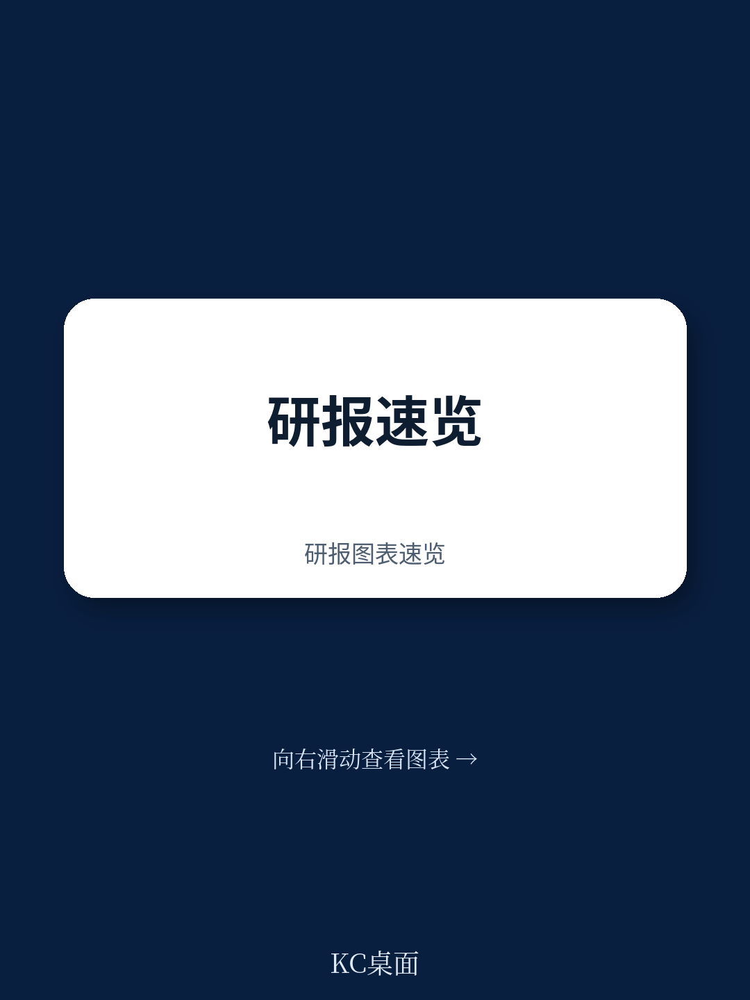
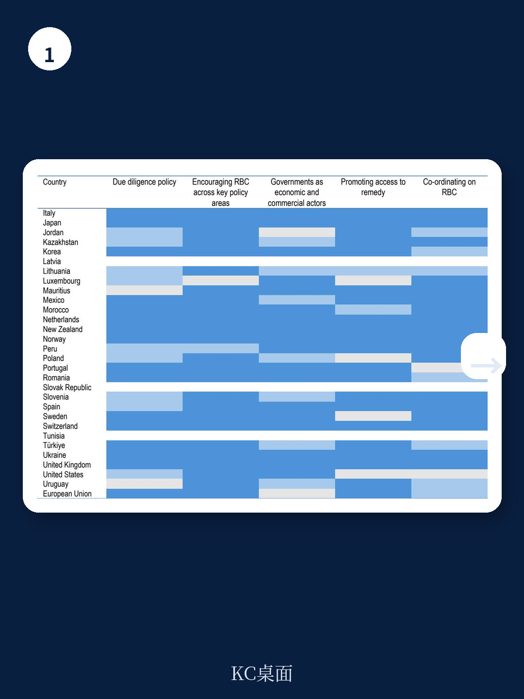
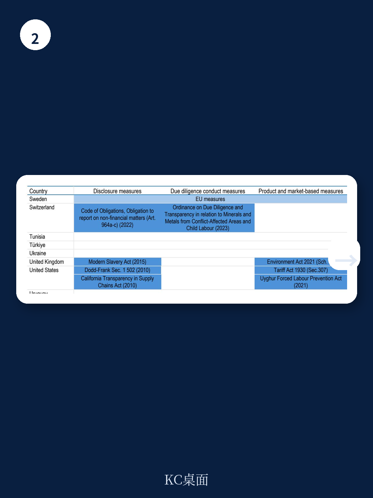

# 经合组织：不是口号而是规则，经合组织指出84%成员国已立法推动企业尽责管理

全球最大的一万家上市公司中，超过三分之二已经公开做出了负责任商业行为的承诺。但这份由经合组织在2026年发布的《负责任商业展望》揭示了一个比承诺本身更值得关注的信号：承诺与执行之间的差距，不是简单的“说得多做得少”，而是正在重塑全球供应链的竞争规则。那些能够将承诺转化为可验证执行力的企业，正在获得政策红利和资本信任；而那些停留在口号层面的公司，将面临越来越高的合规成本与声誉风险。

这份报告首次系统评估了全球大型上市公司的环境与社会尽责管理实践，并同步审视了52个经合组织成员国政府如何通过公共政策推动这一进程。它给出的核心判断是：负责任商业行为已经从“自愿倡议”阶段，进入“政策驱动+市场筛选”的新周期。对于中国出海企业、跨国供应链管理者以及关注ESG投资的机构而言，理解这一转变的底层逻辑，比追踪任何单一政策条款都更重要。

## 1. 承诺覆盖率高，但尽责管理深度不足——这才是真正的结构性风险

报告数据显示，69%的全球大型上市公司在至少一个议题上做出了负责任商业行为的公开承诺。其中，反腐败和温室气体排放是最常见的承诺领域，其次是强迫劳动、童工和人权。然而，当报告将这些承诺与实际的尽责管理流程进行对比时，差距立刻显现。

企业平均在“政策和管理系统”维度的披露率达到45%，但在“识别和评估影响”维度骤降至不足20%，在“预防、减缓与补救”维度更是低于20%。这意味着，大量企业建立了制度框架，却没有真正运行风险识别和问题解决的闭环。

> **KC评论：** 对投资者而言，承诺率高不等于风险低。真正需要关注的不是企业说了什么，而是它有没有建立“识别-评估-应对-补救”的完整链条。报告中的图表提供了分行业、分地区的尽责管理深度对比，这些数据比单纯的承诺统计更能揭示企业的真实风险暴露。

继续看原文，真正有价值的是那些按供应链层级拆解的图表，以及不同地区企业在“供应商风险评估”和“利益相关方参与”上的巨大差异。完整报告与KC评论在每日汇编中持续更新。

## 2. 供应链透明度是最大的盲区——大多数企业不知道原料从哪里来

报告对大型上市公司供应链管理的分析揭示了令人警惕的现实：尽管约一半的企业报告了选择供应商的社会或环境标准，但只有不到20%的企业根据这些标准对供应商风险进行了评估。更关键的是，在需要从采矿业采购原材料的行业中，只有极少数企业能够追溯其关键原材料的来源。

在供应链健康与安全领域，报告发现只有不到5%的企业披露了其在供应链中改善工作场所健康与安全的具体措施。这意味着，大多数企业的供应链风险管理停留在“合同条款要求”层面，而非“实地验证与持续改进”层面。

> **KC评论：** 供应链透明度不是道德要求，而是风险管理工具。当欧盟、美国等主要市场陆续出台强制性尽责管理法规时，那些无法追溯原料来源的企业将面临市场准入障碍。报告中关于“供应商审计计划覆盖层级”的图表，清晰地展示了大多数企业的审计只覆盖一级供应商，而风险往往隐藏在二三级。

## 3. 政府政策正在从“鼓励”转向“要求”——84%的经合组织成员国已引入立法

报告对52个经合组织成员国的政策扫描显示，政府推动负责任商业行为的力度正在显著加强。其中，84%的经合组织成员国已经出台了环境与社会尽责管理的立法措施。这些法规的覆盖范围从反贿赂、环境影响到人权、劳工标准，正在变得越来越全面。

报告特别指出，政府在多个政策领域同步发力：贸易与投资协定中越来越多地纳入负责任商业行为条款；发展合作资金开始专项支持尽责管理能力建设；公共采购框架中明确或隐含地要求供应商进行环境与社会尽责管理。对于跨国公司而言，这意味着合规要求不再是单一维度的，而是嵌入到市场准入、融资条件和政府采购等各个环节。

报告尚未完全回答的一个关键问题是：不同国家的立法标准差异将如何影响全球供应链的竞争格局。那些同时面临欧盟、美国和亚太多套标准的企业，是否会因为合规成本上升而丧失价格竞争力？这是所有跨国企业都需要持续追踪的议题。

## 4. 国有企业与上市公司之间存在显著的尽责管理落差

报告对比了国有企业和非国有企业在尽责管理实践上的差异。数据显示，国有企业在政策和管理系统层面的披露率与非国有企业相当，但在“识别和评估影响”以及“预防和补救”等实质性执行环节，国有企业的表现明显落后。这一发现值得关注，因为国有企业往往在基础设施、能源和资源型行业中占据主导地位，其供应链影响范围更广。

报告同时指出，只有少数经合组织成员国在国有企业的所有权政策中明确纳入了完整的负责任商业行为期望。这意味着，作为政府可以最直接影响的商业实体，国有企业尚未充分发挥政策示范作用。

> **KC评论：** 对于关注中国国企改革和“一带一路”项目的读者而言，这一发现具有直接关联。如果国有企业能够在供应链尽责管理上率先突破，不仅能够降低项目风险，也能为国际合规谈判提供更多主动权。报告中对各国国有企业政策框架的梳理，提供了可供参考的政策设计路径。

## 5. 利益相关方参与和补救机制是执行链条中最薄弱的一环

报告在全球大型上市公司中识别出两个执行短板：利益相关方参与和补救机制。全球只有8%的大型上市公司报告了在人权议题上开展利益相关方参与活动。不到五分之一的企业建立了正式的人权申诉机制，而承诺为受其活动影响的人提供补救的企业仅占10%。

这一数据揭示了一个深层次问题：尽责管理不能只是企业内部的流程优化，它必须包含与外部受影响群体的对话和问题解决机制。没有申诉机制和补救承诺的尽责管理，本质上是一种“自我评估”，缺乏外部验证和纠错能力。

报告在政策建议部分明确提出，经合组织国家联络点作为独特的非对抗性申诉机制，已经处理了近1000个案例，覆盖100多个国家和地区。但这一机制需要更多资源才能发挥更大作用。对于企业而言，主动建立有效的利益相关方参与和申诉机制，不仅是合规要求，也是降低声誉风险、获取社会运营许可的务实选择。

## 6. 读者观察框架：如何从“承诺”穿透到“执行”

基于报告的发现，读者在评估一家企业的负责任商业行为质量时，可以建立一个三层观察框架

第一层：检查承诺的覆盖面和系统性。企业是否在多个议题上做出承诺？这些承诺是否参照了经合组织跨国企业准则或联合国工商业与人权指导原则？承诺是否覆盖了供应链？

第二层：验证执行流程的完整性。企业是否建立了供应商风险评估机制？是否披露了关键原材料的来源？是否开展了利益相关方参与？是否有正式的申诉和补救机制？

第三层：评估外部验证与改进信号。企业是否接受过经合组织国家联络点的调解？是否因供应链问题被提起诉讼或监管调查？企业在可持续发展报告中的承诺与后续披露的执行数据之间是否存在一致性？

报告提供了大量按行业、地区和规模拆分的基准数据，读者可以将目标企业与这些基准进行对比，从而识别出真正的领先者与落后者。

---

这份经合组织报告的核心价值，不在于它告诉读者“企业应该做正确的事”，而在于它用全球最大规模上市公司的数据证明：承诺与执行之间的鸿沟，正在成为新的竞争分水岭。那些能够跨越这一鸿沟的企业，将在政策收紧和资本筛选的双重压力下获得结构性优势。

但报告也有未完全展开的问题：不同司法管辖区的法规如何协调？中小企业如何在不增加过度负担的前提下完成尽责管理？量化评估尽责管理对财务表现的影响还需要更多数据支撑。这些未解问题，恰恰是未来政策博弈和投资研究的前沿。

更多国际信源汇编与评论，欢迎扫码交流。每日更新，汇总全球主流叙事、数据与图表，帮助读者观测边际变化。每日汇编将单篇报告放回当天的主线脉络，整理成中文摘要、KC评论和图表合集，既便于喂给AI进行深度分析，也便于人工快速扫描市场动态。这里汇聚了头部券商、PE/VC、投行、并购、对冲基金、资管机构、战略咨询和智库的朋友，期待与你交流。

Personal reading notes and learning share only. Not investment advice.
