# OECD Survey on Drivers of Trust in Public Institutions 2026 Results

Navigating Rising Expectations and New Horizons

# OECD Survey on Drivers of Trust in Public Institutions 2026 Results

NAVIGATING RISING EXPECTATIONS AND NEW
HORIZONS

This work was approved and declassified by the Public Governance Committee on 9 June 2026.

This document, as well as any data and map included herein, are without prejudice to the status of or sovereignty over any territory, to the delimitation of international frontiers and boundaries and to the name of any territory, city or area.

Please cite this publication as:
OECD (2026), OECD Survey on Drivers of Trust in Public Institutions 2026 Results: Navigating Rising Expectations and New Horizons, OECD Publishing, Paris, https://doi.org/10.1787/9eb63fec-en.

ISBN 978-92-64-34027-5 (print)

ISBN 978-92-64-57808-1 (PDF)

ISBN 978-92-64-71949-1 (HTML)

Photo credits: Cover © Makhh/Shutterstock.com.

Corrigenda to OECD publications may be found at: https://www.oecd.org/en/publications/support/corrigenda.html.
© OECD 2026

## Attribution 4.0 International (CC BY 4.0)

This work is made available under the Creative Commons Attribution 4.0 International licence. By using this work, you accept to be bound by the terms of this licence (https://creativecommons.org/licenses/by/4.0/).

Attribution – you must cite the work.

Translations – you must cite the original work, identify changes to the original and add the following text: In the event of any discrepancy between the original work and the translation, only the text of the original work should be considered valid.

Adaptations – you must cite the original work and add the following text: This is an adaptation of an original work by the OECD. The opinions expressed and arguments employed in this adaptation should not be reported as representing the official views of the OECD or of its Member countries.

Third-party material – the licence does not apply to third-party material in the work. If using such material, you are responsible for obtaining permission from the third party and for any claims of infringement.

You must not use the OECD logo, visual identity or cover image without express permission or suggest the OECD endorses your use of the work.

Any dispute arising under this licence shall be settled by arbitration in accordance with the Permanent Court of Arbitration (PCA) Arbitration Rules 2012. The seat of arbitration shall be Paris (France). The number of arbitrators shall be one.

The OECD Survey on Drivers of Trust in Public Institutions (“Trust Survey”) has become the preeminent measurement tool for understanding the factors driving trust in government and the factors diminishing it. This understanding remains as critical for governments today as it was in 2021, when the Trust Survey first launched, as governments continue to face the challenges of new crises, ageing populations, technological change, limited fiscal space, and high public expectations. The OECD Trust Survey is an important component of the OECD Public Governance Committee’s Reinforcing Democracy and Government Unstuck initiatives and relies on the OECD’s longstanding Framework on Drivers of Trust in Public Institutions.

Building on the 2021 and 2023 Trust Surveys, the 2025 Trust Survey continues to offer robust, internationally comparable evidence on people's perceptions of public institutions across countries. These perceptions, based on different levels of knowledge, shape people's lived experiences of public governance and ultimately influence their trust in public institutions. This is the value of a perception survey: it captures how government action is received and interpreted by the people as compared to their expectations, complementing performance indicators that help governments measure how systems do in practice.

The results presented in this report cover a representative sample of the populations of 33 OECD Member countries and five OECD accession candidate countries (three from Europe and two from Latin America and the Caribbean). The survey is part of an expanding global effort. Since its launch with 22 countries in 2021, the Trust Survey has grown into the Global Trust Survey Project covering 42 countries, including a regional edition in Latin America and the Caribbean which was launched in 2025. This expansion demonstrates both the relevance of the OECD Framework and the strong demand for comparable, actionable data on trust worldwide.

The 2025 Trust Survey maintains the same core methodology and questionnaire as in previous waves, ensuring continuity and enabling the analysis of trends over time. At the same time, it introduces new questions that deepen our understanding of emerging governance challenges, including perceptions of the role of artificial intelligence in the public sector, barriers to and impacts of political participation, and drivers of trust in legislatures as key institutions of representative democracy. These additions reflect evolving policy priorities while preserving the survey's comparability and analytical strength. Most participating countries were surveyed in September to November 2025, with data collection in Brazil and Peru taking place in May and June 2025.

The OECD Secretariat acknowledges the strong engagement and contributions of delegates from the Public Governance Committee and the Global Trust Survey Project, at both senior and technical levels. Their collaboration has been instrumental in ensuring the quality, relevance, and timely delivery of this work. The continued commitment of participating countries underscores the shared recognition that measuring and understanding trust and its drivers is essential to supporting reform efforts in the increasingly complex policy environment faced by democracies.

## Acknowledgements

This report is the work of the OECD Directorate for Public Governance (GOV) under the leadership of Elsa Pilichowski, Director. The report was co-ordinated by Sarah Kups, under the direction of Valerie Frey, Acting Head of GOV's Governance Indicators and Performance (GIP) Division. Monica Brezzi, then Head of GIP, oversaw survey questionnaire development. The report was drafted by Sarah Kups (Chapters 1, 3, 4 and 6), Simeon Lauterbach (Chapter 2), Emma Phillips (Chapter 5), Valerie Frey (Chapter 6) and Mariana Prats (Chapter 7). Simeon Lauterbach carried out the statistical analysis and prepared the data visualisation jointly with Alexis Kyander and Delia Dinca. Alexis Kyander and Emma Phillips led the technical and content creation of the country notes, respectively. Andreas Kapounek, of the University of Cambridge, carried out analysis presented in Box 1.3 of Chapter 1.

Meral Gedik prepared the report for publication. Jocelene Bonneau and Sarah Babay provided administrative support, and Andrea Urhammer guidance and support throughout the publication process. Thibaut Gigou and Justin Kavanagh prepared communication materials. The French translation was thoroughly reviewed and edited by Emma Phillips and Thibaut Gigou.

Valuable input and feedback were provided by colleagues in the Public Governance Directorate, including Jamie Berryhill, Marco Daglio, Gillian Dorner and David Goessman. Conor Das-Doyle and Alessandro Lupi supported the team in the review of the country notes, and Cameron Knott in the creation of figures.

The report greatly benefited from inputs provided by the senior- and technical-level country delegates to the Public Governance Committee Global Trust Survey Project. These delegates, comprised of public officials and representatives from national statistical offices, also provided guidance and constructive feedback on questionnaire content, design and translation in local languages. Pre-testing of new survey questions by the Ministry of Finance of Chile and the German Federal Statistical Office is gratefully acknowledged.

This work was made possible through voluntary contributions of the participating countries as well as generous financial support by the EEA and Norway Grants, the Inter-American Development Bank and the Development Bank of Latin America and the Caribbean (CAF).

## Table of contents

Foreword 3
Acknowledgements 4
Executive summary 10
1 Drivers of trust over time: Lessons from the third wave of the OECD Trust Survey 12
1.1. Introduction 14
1.2. The context of the 2025 Trust Survey data collection 16
1.3. Levels and changes in trust in the national government 19
1.4. Drivers of trust in the national government 25
1.5. Levels and drivers of trust in local government and other public institutions 32
1.6. Areas for policy action to enhance trust 39
1.7. Outlook for the remainder of the report 39
References 43
Notes 44
2 Socioeconomic conditions, political agency and trust 45
2.1. Introduction 47
2.2. Differences in trust levels between population groups 47
2.3. Areas for policy action to enhance trust 62
References 65
Notes 66
3 Day-to-day interactions with public institutions and their implications for trust 67
3.1. Satisfaction with essential public services 69
3.2. Views on day-to-day interactions with public institutions 77
3.3. Perceptions of the responsiveness of public services 84
3.4. Areas for policy actions to increase trust 86
References 88
Notes 88
4 Views of government decision making on complex policy issues and trust 89
4.1. Introduction 91
4.2. Perceptions of the outcomes of government decision making on complex policy issues 91
4.3. Perceptions of the processes of government decision making on complex policy issues 96
4.4. Areas for policy actions to increase trust 102
References 103
Notes 103

5 Trustworthy artificial intelligence in the public sector 104
5.1. Most people remain sceptical of AI deployed in the public sector 106
5.2. AI has the potential to become a trust-enhancing force depending on public governance choices 111
5.3. Attitudes towards AI use in the public sector are uneven across population groups 115
5.4. Public governance levers for more trustworthy AI 119
5.5. Areas for policy action to increase trust 125
References 126
Notes 127

6 Political voice, barriers to participation and implications for trust in government 128
6.1. Introduction 129
6.2. Voting remains at the core of political voice in representative democracies 130
6.3. Barriers to influence and participation 133
6.4. Areas for policy action to increase trust 141
References 142
Notes 142

7 The evolution of trust in the national legislature and its drivers 143
7.1. The importance of trust in the legislature 145
7.2. Levels of and trends in trust in national legislatures 145
7.3. Public governance drivers of trust in legislatures 154
7.4. Areas for policy action to enhance trust 160
References 161
Notes 161

Annex A. Technical details about the data collection and regression analysis 162

## FIGURES

Figure 1.1. A majority across the OECD view the cost of living as among the three most important issues facing their country, while more than a quarter are concerned about crime or poverty 17
Figure 1.2. About four in ten people across the OECD have high or moderately high trust in the national government 20
Figure 1.3. On average across the OECD, the share that place high or moderately high trust in the national government has remained stable between 2023 and 2025 21
Figure 1.4. Increases and declines in trust levels in Greece have become more pronounced since the early 2010s 23
Figure 1.5. The share with high or moderately high trust among individuals that identify corruption as a main concern is substantially lower than in the population overall 25
Figure 1.6. A slight majority is confident that government institutions are prepared to protect people's lives in a major emergency, while fewer expect to be protected during an economic crisis 26
Figure 1.7. Only around one third of people feel people like them have a say in what government does and that the national government puts the public over special interests 27
Figure 1.8. In many OECD countries a majority is satisfied with administrative services and the protection of personal data by government agencies 28
Figure 1.9. The drivers of trust in national government in 2025 29
Figure 1.10. Changes in perceptions of public governance drivers related to complex decision making account for the largest share of changes in trust levels in the national government 31
Figure 1.11. A majority across the OECD have high or moderately high trust in security and judicial institutions 33
Figure 1.12. Police, courts and the armed forces are the most trusted public institutions in many countries 34

Figure 1.13. Local governments and the national civil service are usually trusted more than national governments 35
Figure 1.14. Trust in local government and the civil service has been stable 36
Figure 1.15. The drivers of trust in local government in 2025 37
Figure 1.16. The drivers of trust in the civil service in 2025 38
Figure 2.1. Trust in the national government varies more strongly along perceived political agency and partisan lines than across socio-economic or demographic groups 48
Figure 2.2. People who feel they have political agency express higher trust in the national government 49
Figure 2.3. Trust in the national government tends to be higher among voters for a current governing party 50
Figure 2.4. Institutional trust differs systematically by partisanship 51
Figure 2.5. Trust gaps in the civil service by partisanship have increased over time 52
Figure 2.6. Across all countries, fewer people with financial concerns trust the national government 54
Figure 2.7. People with lower educational attainment almost universally have lower trust in government 55
Figure 2.8. Trust in national government of those self-identifying as belonging to a discriminated group varies consistently across countries 56
Figure 2.9. Trust gaps by interpersonal trust are comparatively larger for political institutions, 2025 57
Figure 2.10. Men tend to trust the national government more than women do 58
Figure 2.11. Trust in the national government is usually higher among older people 59
Figure 2.12. Trust gaps remain broadly stable over time, with narrowing age differences and widening education divides 60
Figure 2.13. Education-related trust gaps are widening over time, but with substantial variation across countries 62
Figure 3.1. A majority of recent service users across the OECD are satisfied with the education and healthcare systems 70
Figure 3.2. Satisfaction with the education and healthcare system rose modestly over the past two years 71
Figure 3.3. In each OECD country, a majority of recent administrative services users are satisfied with these services 72
Figure 3.4. Satisfaction with administrative services has improved slightly over recent years 73
Figure 3.5. Across the OECD countries a majority have positive views of different administrative service quality aspects 75
Figure 3.6. People who are satisfied with the speed and ease of accessing the administrative service remain particularly likely to be satisfied with administrative services overall 76
Figure 3.7. An important majority see information on administrative services as easily available 78
Figure 3.8. Around half of the population in OECD countries expect fair treatment when applying for government benefits or services 79
Figure 3.9. In OECD and OECD accession countries, more people find it unlikely than find it likely that a government employee would turn down an offer of money to speed up access to a service 80
Figure 3.10. Recent contact with administrative services appears to boost perceptions of day-to-day interactions and even trust in the civil service and government 81
Figure 3.11. At the country level, the share who find it likely that a public employee would help individuals fix mistakes in applications is far more correlated with trust in the national civil service than trust in the national government 83
Figure 3.12. The share of people who view public services as responsive to complaints and to innovative ideas are similar in most countries 84
Figure 3.13. The share who view public services as responsive across OECD countries has slightly risen since 2021 85
Figure 4.1. A majority is confident in the ability of government to protect lives in emergencies, larger than the share who believe government balances intergenerational interests 92
Figure 4.2. Across countries, more people think government institutions can protect lives in an emergency than support individuals affected by economic crisis 93
Figure 4.3. Nearly four in ten are confident in their government reducing GhG emissions, slightly higher than the share confident that their government will balance intergenerational interests 95
Figure 4.4. People's opinions about government being evidence-informed and planning ahead to changing societal needs are related 97
Figure 4.5. Only around four in ten people find it likely that an unpopular policy would be changed, but this share is increasing over time 98
Figure 4.6. There are few countries where a majority is confident that government co-operates well with other stakeholders to tackle long-term challenges 99
Figure 4.7. There are more people who find it unlikely than people who find it likely that a politician would refuse a well-paid private sector job in exchange for a political favour 100
Figure 4.8. Only around one third think government withstands undue influence – a small increase from 2023 101
Figure 5.1. Around four in ten people have moderately or very positive views about the potential of AI use by government institutions 108

Figure 5.2. People are more likely to believe that AI in the public sector can improve service quality and efficiency than to believe it will be fair, transparent, and protective of personal information
Figure 5.3. Use cases appear most present in public service design and delivery, civic participation, and justice administration
Figure 5.4. Socio-economic and demographic characteristics are associated with varying levels of optimism/pessimism towards AI use in the public sector
Figure 5.5. Four in ten people across the OECD assess their knowledge of artificial intelligence as sufficiently strong to explain it to others
Figure 5.6. Familiarity with AI is associated with more positive expectations towards AI use in the public sector
Figure 5.7. People who find it likely that government appropriately regulates new technologies to help businesses and citizens use them responsibly are more likely to view AI in the public sector positively
Figure 5.8. Around four in ten find it likely that government adequately regulates new technologies
Figure 5.9. Just over half across the OECD find it likely that government agencies use personal data for legitimate purposes
Figure 6.1. Voting is the most common form of political activity across countries, followed by signing petitions and boycotting products
Figure 6.2. A vast majority believe voting in elections and referendums can influence government
Figure 6.3. In almost all OECD and OECD accession countries, only a minority feel confident in their own ability to participate in politics and that people like them have a say
Figure 6.4. Government is perceived as unlikely to adopt public opinions expressed in consultations
Figure 6.5. Around three in ten of people who did not vote in any election or participate in public consultations or townhall meetings chose not to do so
Figure 6.6. The perception that political officials are out of touch is seen as a top barrier to having an effective say in policymaking
Figure 6.7. Broadcast journalism and social media are the most frequent sources of information about politics and current affairs
Figure 6.8. Perceptions of engagement opportunities with officials are only slightly related to trust in the national government, while officials' concern for people matters much more
Figure 7.1. Almost half of the population across OECD and accession countries, on average, report low or no trust in national legislatures
Figure 7.2. On average and in many individual countries, fewer people have high or moderately high trust in the national legislature than in national government
Figure 7.3. Trust in the national legislature has been relatively stable across the OECD since 2021
Figure 7.4. The share with high or moderately high trust in the national legislature is particularly low among individuals who do not believe people like them have a say in what government does
Figure 7.5. The gap in trust in the national legislature associated with perceptions on whether people have a say in what government does is substantial in all participating countries
Figure 7.6. The partisan gap for trust in the legislature is pronounced in many countries
Figure 7.7. Feeling economically insecure is generally associated with lower trust in national legislatures
Figure 7.8. Men and older cohorts show higher levels of trust in national legislatures than women and younger people
Figure 7.9. The trust gap in the national legislature associated with differences in educational attainment has increased over time
Figure 7.10. Drivers of trust in national legislatures in 2025
Figure 7.11. Slightly more than one in three people across the OECD find it likely that the national legislature appropriately balances between the needs of different groups or regions
Figure 7.12. On average, only about one-third believe that if they contacted elected representatives, they would receive a meaningful response
Figure 7.13. Close to 40% believe that the legislature can hold governments accountable

## TABLES

Table 1.1. Participation of OECD countries in the different Trust Survey waves 16  
Table 1.2. A majority across the OECD is concerned about the cost of living 19  
Table 1.3. Share of population with high or moderately high trust in different public institutions and the media, 2023 and 2025 41  
Table 2.1. Evolution of trust gaps across different population groups over time 63

Table A.1. The measurement of drivers of trust in the 2025 OECD Trust Survey 162  
Table A.2. Overview of hard and soft sampling quotas 164  
Table A.3. Data collection overview 164  
Table A.4. Overview of regression results for trust in the national government 168  
Table A.5. Overview of regression results for trust in the national civil service and legislature and local government 170

## BOXES

Box 1.1. The 2025 OECD Survey on the Drivers of Trust in Public Institutions (Trust Survey) 15  
Box 1.2. Recovering trust in public institutions in Greece 22  
Box 1.3. The relationship between popular concerns and trust in the national government 24  
Box 2.1. Do partisan differences in trust extend beyond political institutions? 52  
Box 2.2. Institutional trust varies substantially by levels of interpersonal trust 57  
Box 3.1. Fostering human-centred public services through government innovation 86  
Box 5.1. National efforts to gather evidence on public attitudes towards AI use in the public sector in Australia, the UK and Belgium 109  
Box 5.2. Balancing efficiency and integrity concerns in the use of AI in the UK and Spain's Judicial Systems 113  
Box 5.3. Risks around AI use in government 114  
Box 5.4. Bolstering confidence in data privacy 124  
Box 6.1. Why not participate? Insights on abstention from political activities 135  
Box 6.2. Barriers to participation vary across groups 138  
Box 7.1. Trends and changes in legislative trust gaps, 2021–2025 153

# Executive summary

Amidst economic, sociodemographic and technological transformations – and limited fiscal space – democratic governments face challenges in meeting people's rising expectations and needs. A healthy amount of trust in public institutions is critical to implement reforms to meet those expectations and needs, making trust a policy objective in itself.

This report presents the results of the third wave of the OECD Survey on Drivers of Trust in Public Institutions (OECD Trust Survey), a cross-national survey assessing people's trust in government and the factors that drive trust: namely, perceptions of the reliability, responsiveness, integrity, openness and fairness of public institutions. It covers 33 OECD and five OECD accession candidate countries.

## Key findings

Across the OECD, fewer people report high or moderately high trust in the national government (40%) than low or no trust (43%). After a slight decline between 2021 and 2023, trust has stabilised on average, and slightly improved in about half of the countries where it previously declined. The civil service, local government, police and courts continue to elicit higher trust levels than the national government.

Trust in national government continues to vary significantly between those who feel the political system gives people like them a voice and those who do not – a stable gap of 47 percentage points. Other trust gaps across demographic and socioeconomic groups are smaller. Trust continues to decline among people with the lowest levels of formal education, while the trust gap between younger and older adults has decreased significantly and that between women and men has remained broadly stable.

People's perceptions of their day-to-day interactions with public institutions, including public services such as health, education and administrative services, remain positive on average, showing even a slightly upward trend. These positive perceptions, which help maintain trust levels, remain higher than those of government decision making on complex and long-term issues which remain low and contribute to low average trust levels.

Across the OECD, positive assessments of complex decision making – such as finding it likely that decisions are based on the best available evidence, open to people's and stakeholders' inputs, and balance the interests of current and future generations – are strongly associated with trust in the national government. They also influence trust in the national legislature, along with views on how legislatures fulfil their core functions (such as oversight of the national government and balancing regional and groups interests).

Encouragingly, perceptions of the responsiveness of policymakers to the public's views, and of the integrity of individual politicians and the government, have slightly improved compared to 2023. Yet survey results underline the continued need for renewed democratic governance: while two-thirds (68%) of respondents say voting influences government's actions, a reassuring result for democracies, fewer than one-third (31%) find it likely that the political system lets people like them have a say. Given this is a key driver of trust, it shows growing and unmet citizens' expectations about having a say in decision making beyond elections. Only 39% of people report that participating in a public consultation influences what government does.

Positive perceptions of day-to-day interactions are mainly associated with higher trust in local government and the national civil service. Satisfaction with administrative services is high, with 68% of people who engaged with such services in the past year satisfied with them – a share that has risen over time. Improved satisfaction rates may be related to a modestly increasing share of people who view services as responsive to complaints and innovative ideas.

Measuring expectations and perceptions of Governments' use of artificial intelligence (AI) is critical for the future of trust and the capacity of government to modernise. Just over four in ten people believe their government's AI use could lead to tailored services or reduced costs. People have less confidence about the use of AI and the upholding of important public sector principles such as fairness, privacy and transparency, or about maintaining human oversight.

## Areas for policy action to strengthen trust

Cultural, economic, institutional and political factors influence differences in trust across countries and over time. Fluctuating trust is an indication of evolving expectations compared to institutional performance and, in democracies, allows the system to continuously improve. While country-specific results point to additional priorities, findings from the 2025 Trust Survey suggest common areas where governments across and beyond the OECD could strengthen trust through policy measures:

\- Focus on high-impact drivers with the greatest room to improve trust in specific institutions. Improving day-to-day service delivery will have more impact on trust in the civil service and local government) while improving perceptions about long-term policymaking will have more impact on trust in the national government and the legislatures.

\- Recognise that some perceptions of the capacity of governments to make the right decisions on long term and complex policy challenges can shift quickly. In countries with sizeable changes in trust in the national government in the past two years, citizens' perceptions of the competence and fairness of decision making on complex matters have been the key variable. Continuing to invest in public services will help maintain trust levels but investments in both the how (engagement of people and stakeholders, transparency, evidence based, communication) and the what (fairness) of decisions on complex policy areas will be help increase trust levels in national government and the legislature.

\- Embrace the use of new technologies in government with care to ensure public sector principles and attention to communication. While the level of confidence of government use of personal data is relatively high, with 52% finding it likely that their personal data will be used only for legitimate purposes, investments in communicating on the value added of the use of AI in government and addressing concerns about the risks will have to be made.

\- Invest in renewed democratic governance. The drivers of trust for national governments and legislatures show growing public expectations for transparency, accountability, and fairness in policy making. Most importantly, there is a sizeable and persistently large group of people who do not feel they are being heard. The institutionalisation of engagement mechanisms beyond traditional representative processes in many countries should help in this regard, but investments are necessary to ensure these mechanisms are efficient and effective in driving meaningful results on policy decisions.

## 1 Drivers of trust over time: Lessons from the third wave of the OECD Trust Survey

This chapter sets out the context and core evidence on trust in public institutions across OECD Member and accession candidate countries, drawing on the third wave of the OECD Survey on Drivers of Trust in Public Institutions conducted in 2025. It situates trust as a critical resource for governments operating in an increasingly complex environment characterised by demographic, economic, technological and geopolitical pressures, alongside constrained fiscal space and rising public expectations. It outlines how trust is related to people's assessments of day-to-day interactions with public institutions and of government decision making on complex policy issues.

## Key findings

\- Across the OECD and OECD accession candidate countries that participated in the 2025 OECD Survey on Drivers of Trust in Public Institutions – hereafter the OECD Trust Survey – a higher share of people have low or no trust in their national government (43% across the OECD) than have high or moderately high trust (a 40% OECD average).

\- Following a decline in trust between 2021 and 2023, trust levels have on average been robust between 2023 and 2025. Many individual countries have either seen a stabilisation in trust levels in the last two years, or saw a reversal in the direction of 2021 trust levels.

\- Many people view their government's handling of day-to-day interactions with the public more positively than they view their government's decisions on complex and long-term policy issues.

\- While positive views on daily governance are slightly (positively) associated with trust in the national government, the relationship of people's assessment of complex decision making with trust in the national government is much more pronounced. Across the OECD, trust in government is positively associated with perceptions that government decisions are based on the best available evidence, taken in cooperation with important stakeholders, responsive to the preferences of the public, and balance the interests of current and future generations, among others. These drivers of trust in the national government are similar across OECD member and accession candidate countries.

\- In OECD countries with moderate to large changes in trust in the national government between 2023 and 2025, these changes in the share with high or moderately high trust are more strongly associated with changes in perceptions of decision making on complex policy issues than of day-to-day interactions. Changes in perceptions of the responsiveness and reliability of government institutions related to complex decision making explain, on average, higher proportions of changes in trust than changes in the perceptions of the fairness, integrity and openness of institutions around complex decision.

\- The police, courts and armed forces are the institutions with the highest levels of trust in the OECD Trust Survey. Local government and the civil service likewise elicit higher trust than the national government, with limited changes over time.

\- Expectations and perceptions of essential public services and other indicators of daily interactions play a much more pronounced role for shaping trust in the civil service and local government than in the national government. Among recent service users, 65% across the OECD and 46% across the participating OECD accession countries are satisfied with administrative services, an important driver of trust in public institutions at all levels. The share who are satisfied even within the general population has risen modestly but constantly since the inaugural trust wave, from 64% in 2021 to 65% in 2023 and 67% in 2025 among the group of countries with available data for all survey years.

## 1.1. INTRODUCTION

Governments and public administrations across OECD countries face high demands to deliver better policies for better lives in a complex environment. On the one hand, governments are confronting a long list of challenges related to demographic, economic, geopolitical and technological changes. At the same time, governments' potential actions are limited due to narrowing fiscal space, slow-moving internal processes and considerable difficulties in reaching public and political consensus.

Yet this moment also offers governments important new opportunities to deliver better for people. Governments increasingly realise that 'business as usual' is no longer sufficient to meet rising expectations, complexity and resource constraints. The ongoing digital transformation of government, including through the cautious use of emerging technologies like generative artificial intelligence, offers unique opportunities to support transformational reforms in how policies are designed, delivered and implemented (OECD, 2025[1]). High numbers of retiring civil servants, with little budget to replace them, make this transformation even more imperative.

Navigating this moment successfully, and with minimal uncertainty, requires a healthy amount of trust in public institutions. Governments and institutions that are trusted can find it easier to enact reforms and to foster buy-in to policies without having to rely on excessive enforcement efforts.

Trust in institutions is therefore an increasingly important policy concern across the OECD (OECD, 2025[2]), even as some drivers of trust are beyond governments' direct control: individuals' early experiences, their personal circumstances and their trust in others can pre-dispose them to lower or higher trust in institutions. Economic and political trends, coupled with individuals' political leanings, can also colour the way in which people view not only government but also other public institutions.

Yet trust also reflects the extent to which people believe public institutions are reliable, responsive and driven by values like integrity, openness, and fairness (Brezzi et al., 2021 $^{[3]}$ ). In democracies, trust in institutions fluctuates with time and is, among other factors, an indication of evolving expectations in view of the performance of institutions. This fluctuation incentivizes institutions to constantly improve and adapt, and is a bedrock of open, well-functioning democratic systems.

The OECD Survey on Drivers of Trust in Public Institutions (OECD Trust Survey) forms part of member countries' extensive efforts to understand how public trust is formed and can be sustained. This report presents the findings from the third wave of the Trust Survey. It showcases evidence on people's experiences with and expectations of public institutions in 33 OECD and 5 OECD accession candidate countries, and explores how these perceptions have evolved since 2021 (see Box 1.1). The survey covers a representative sample of the adult population of each participating country and was carried out in September to November 2025 in most countries.

Recognising that democratic countries all over the world face similar challenges and can benefit from learning from each other, the OECD Public Governance Committee, with approval from the OECD Council, established in 2024 the Global Trust Survey Project. This enabled selected non-OECD member countries to participate in the survey for the first time on an equal footing with OECD countries.

This introductory chapter sets the scene, providing context on the environment that shapes the relationship between people and the state. The chapter then presents current levels of trust in national government and other public institutions, as well as trends over time. Five years post-pandemic, some countries have been able to stabilise or even increase institutional trust, while others have further to go or have seen trust decrease. The chapter also explores the relationship between trust and public perceptions of government competence and values, particularly for national government, local government, and the civil service. By identifying the main drivers of trust, the chapter highlights areas where policy action may help strengthen it.

Building on the background of this chapter, Chapter 2, in turn, illustrates how personal background characteristics such as demographic and socio-economic characteristics affect the likelihood of having high or moderately high trust in the national government. Chapter 3 provides an in-depth view of people's perceptions of day-to-day interactions with public institutions, and Chapter 4 focuses on assessments of government decision making on complex policy issues. Chapter 5 discusses people's views on government use of artificial intelligence, and

Chapter 6 the potential impacts of and barriers to their political and civic participation. Chapter 7 covers the evolution and the drivers of trust in national legislatures.

## Box 1.1. The 2025 OECD Survey on the Drivers of Trust in Public Institutions (Trust Survey)

The OECD Trust Survey is built on an analytical framework (Brezzi et al., 2021[3]; OECD, 2017[4]) following a decade of work by the OECD Public Governance Committee. The framework defines trust as “a person’s belief that another person or institution will act consistently with their expectation of positive behaviour”. It is also informed by guidelines for measuring trust (OECD, 2017[5]) and early country studies in Korea (OECD/KDI, 2018[6]) and Finland (OECD, 2021[7]).

The questionnaire includes questions regarding trust levels in different public institutions and the media, situational questions about public governance drivers of trust, and modules on satisfaction with public services, political participation, global and intergenerational challenges and the respondent's background. The questions related to trust levels and drivers use a 0-10 response scale and an option to answer 'don't know'. An overview of the question topics is provided in Table A.1 in Annex A of the report.

The bulk of the questionnaire has remained stable from one wave to another to allow tracking indicators over time, but some new questions have been introduced in each survey wave to allow deeper insights into selected topics and to adjust to new information needs. Technical- and senior-level delegates from OECD and Global Trust Survey Project Associate country ministries and national statistical offices contribute to the continuous development of the survey: for example, they provide inputs on potential changes to the questionnaire, carry out pre-testing of new questions, and suggest improvements in the manner in which results are discussed and presented. The survey has also benefitted from the insights of leading academics on institutional trust, previously through their participation in the Trust Survey Advisory Group and since then through informal interactions as well as a joint workshop with the El-Erian Institute and the Political Psychology Lab at Cambridge University in March 2025.

The OECD Trust Survey was first implemented in 22 OECD countries in 2021, followed by 30 OECD countries in 2023 and 33 OECD countries in 2025. Table 1.1 has the overview of the participating countries in each wave. 20 countries participated in all three waves, and 29 countries participated in both 2023 and 2025. In addition, in 2025, six Latin American non-OECD countries (Brazil, Dominican Republic, Ecuador, Guatemala, Paraguay, Peru) participated in the inaugural OECD Trust Survey in Latin America and the Caribbean, and Bulgaria, Croatia and Romania participated in the OECD Trust Survey. Results for the participating OECD accession candidate countries (Brazil, Bulgaria, Croatia, Peru and Romania) are included in this report.

Data collection for the 2025 OECD Trust Survey took place in September to November 2025 in most countries. In Brazil and Peru, it took place in May and June 2025. The national surveys were carried out online for most countries by the private survey provider Ipsos; by national statistical offices in Finland (Statistics Finland), Ireland (Central Statistics Office) and Mexico (National Institute of Statistics and Geography (INEGI); by the Social Science Research Institute within the University of Iceland in Iceland; and by a survey research firm in Norway. Apart from Norway, where some respondents filled out paper surveys, and Mexico, where respondents were interviewed in person, the data collection occurred through online surveys. Data are generally representative of the adult population at the national level through non-probability quota sampling. In Mexico, the survey is representative of the urban adult population.

## Table 1.1. Participation of OECD countries in the different Trust Survey waves

<table><tr><td></td><td>2021</td><td>2023</td><td>2025</td></tr><tr><td>Australia, Belgium, Canada, Colombia, Denmark, Estonia, Finland, France, Iceland, Ireland, Korea, Latvia, Luxembourg, Mexico, Netherlands, New Zealand, Norway, Portugal, Sweden, United Kingdom</td><td>X</td><td>X</td><td>X</td></tr><tr><td>Chile, Costa Rica, Germany, Greece, Italy, Slovak Republic, Slovenia, Spain, Switzerland</td><td></td><td>X</td><td>X</td></tr><tr><td>Czechia</td><td></td><td>X</td><td></td></tr><tr><td>Austria, Japan</td><td>X</td><td></td><td>X</td></tr><tr><td>Lithuania, Poland</td><td></td><td></td><td>X</td></tr></table>

## 1.2. THE CONTEXT OF THE 2025 TRUST SURVEY DATA COLLECTION

Understanding people's concerns can help governments understand people's expectations of public institutions. Across the OECD and the participating OECD accession candidate countries, most people in 2025 are worried about economic issues. But in certain countries, internal and national security, essential services, housing, immigration and corruption – which can in themselves be intertwined with economic concerns - are also top of mind.

People across the OECD remain most preoccupied by economic concerns, above all inflation. When asked about the top three issues facing their country, inflation was cited by a majority (52%) of respondents across the participating 33 OECD countries (Figure 1.1). This share is far and above the largest for any of the included questions, and is likewise important in most OECD accession countries which participated in the 2025 survey (Table 1.2). Inflation is the most frequently cited concern in 23 OECD countries as well as in Croatia. In a few countries, namely Chile, Colombia, Costa Rica, Denmark and Peru, one third of the population or less cites inflation, while more than two thirds do in Australia, Croatia, Estonia, Japan and New Zealand.

Other economic concerns are also front of mind for many people. On average across the OECD, 27% cite poverty and social inequality and 23% unemployment and jobs as top-three concerns in their country (Figure 1.1). About four in ten people in Estonia, Greece, Bulgaria and Romania are particularly concerned about inequality, while more than two in three in Finland are concerned about unemployment and jobs, the most frequently mentioned topic in the country (Table 1.2). As expected, a higher share of individuals living in a household affected by job loss in the past year are likely to cite unemployment as a major concern (33%), compared to 20% in non-affected households.

Figure 1.1. A majority across the OECD view the cost of living as among the three most important issues facing their country, while more than a quarter are concerned about crime or poverty

Share of population who view policy issue as among the three most important ones facing their country, OECD, 2025

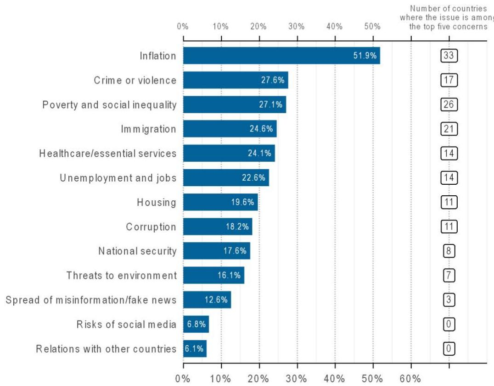

Note: The figure presents the unweighted OECD average of the weighted OECD country averages of responses to the question "What do you think are the three most important issues facing [COUNTRY]?" The listed number of countries where the issue is among the top five concerns relates to the number of countries where the issue has among the five highest proportions of mentions among the respondents. Source: OECD Survey on Drivers of Trust in Public Institutions 2025.

StatLink https://stat.link/ilkv6g

While people continue to worry about economic concerns, security is increasingly salient in many OECD countries. An average of 28% across the OECD name crime and violence as a top-three issue in their country (Figure 1.1). This share is notably high in the Latin American and Caribbean countries covered in the survey, where the share that cite crime and violence exceeds 50% and where it is the most frequently cited topic, with the exception of Colombia. The same is true in Sweden, where it is likewise the most frequently cited topic by 51% (Table 1.2). National security is mentioned by a lower share -- 18%. However, in particular in countries in the eastern part of Europe, such as Estonia, Latvia, Lithuania and Poland, national security is much more frequently mentioned. And in Denmark, a higher share mentions national security than any other issue.

Another issue of high salience in some countries is immigration. On average across the OECD, one in four (25%) name this topic, but again with a broad range. In Germany, the Netherlands and the United Kingdom, four to five in ten people name immigration, and it is the second-most-frequently named topic in Austria, Belgium, Chile and Switzerland (Table 1.2).

Touching on other issues, 24% on average across the OECD mention healthcare and essential services as an important concern, with slightly lower shares in the participating OECD accession countries. It is the most frequently named topic in Iceland, but also is on the mind of many people in Finland. Housing is mentioned by 20% across the OECD. In Ireland and Luxembourg housing is the most frequently named topic.

Finally, 18% cite corruption among the top three issues facing their country. Shares concerned about corruption are particularly high in Bulgaria, Colombia and Romania, where it is the most frequently cited issue (Table 1.2). Likewise, a majority in the other participating OECD accession countries express concerns. Feeling compelled to pay a bribe in the past year – something that very few survey participants indicate happened to them - is associated with a higher likelihood that someone names corruption as a top-three concern. The share in this group who cite it is 30%. $^{1}$

The timing of surveys can affect the governance issues that people pay attention to, which can influence trust (see Box 1.3). Nevertheless, as will be seen later in the chapter, a considerable share of people's trust in public institutions is shaped by their expectations and perceptions of public governance alongside their personal background.

Governments participate in the OECD Trust Survey to understand better the evolution of the public governance drivers of trust and their impact on trust in different public institutions. The remainder of the chapter illustrates current trust levels in different public institutions as well as their evolution since 2021. The chapter also provides econometric evidence on how trust levels and changes relate to key public governance drivers of trust.

## Table 1.2. A majority across the OECD is concerned about the cost of living

Share of population who view policy issue as among the three most important ones facing their country, 2025

<table><tr><td></td><td>Inflation</td><td>Inequality</td><td>Immigration</td><td>Crime</td><td>Essential services</td><td>Jobs</td><td>Housing</td><td>National security</td><td>Corruption</td><td>Climate change</td></tr><tr><td>OECD</td><td>52%</td><td>27%</td><td>25%</td><td>28%</td><td>24%</td><td>23%</td><td>20%</td><td>17%</td><td>18%</td><td>16%</td></tr><tr><td>Australia</td><td>68%</td><td>15%</td><td>27%</td><td>34%</td><td>23%</td><td>14%</td><td>34%</td><td>9%</td><td>7%</td><td>21%</td></tr><tr><td>Austria</td><td>57%</td><td>26%</td><td>37%</td><td>17%</td><td>27%</td><td>21%</td><td>20%</td><td>17%</td><td>10%</td><td>19%</td></tr><tr><td>Belgium</td><td>55%</td><td>31%</td><td>34%</td><td>32%</td><td>15%</td><td>27%</td><td>19%</td><td>14%</td><td>11%</td><td>16%</td></tr><tr><td>Canada</td><td>63%</td><td>19%</td><td>28%</td><td>22%</td><td>29%</td><td>24%</td><td>31%</td><td>5%</td><td>9%</td><td>20%</td></tr><tr><td>Switzerland</td><td>46%</td><td>27%</td><td>32%</td><td>17%</td><td>19%</td><td>20%</td><td>28%</td><td>12%</td><td>7%</td><td>23%</td></tr><tr><td>Chile</td><td>31%</td><td>22%</td><td>38%</td><td>59%</td><td>11%</td><td>33%</td><td>10%</td><td>7%</td><td>32%</td><td>5%</td></tr><tr><td>Colombia</td><td>24%</td><td>31%</td><td>8%</td><td>49%</td><td>15%</td><td>32%</td><td>6%</td><td>22%</td><td>52%</td><td>6%</td></tr><tr><td>Costa Rica</td><td>33%</td><td>34%</td><td>9%</td><td>63%</td><td>6%</td><td>41%</td><td>4%</td><td>13%</td><td>47%</td><td>5%</td></tr><tr><td>Germany</td><td>47%</td><td>30%</td><td>41%</td><td>23%</td><td>18%</td><td>16%</td><td>25%</td><td>23%</td><td>6%</td><td>24%</td></tr><tr><td>Denmark</td><td>27%</td><td>27%</td><td>30%</td><td>21%</td><td>24%</td><td>10%</td><td>15%</td><td>45%</td><td>6%</td><td>34%</td></tr><tr><td>Estonia</td><td>74%</td><td>39%</td><td>16%</td><td>4%</td><td>30%</td><td>24%</td><td>14%</td><td>46%</td><td>14%</td><td>5%</td></tr><tr><td>Spain</td><td>40%</td><td>25%</td><td>29%</td><td>22%</td><td>17%</td><td>28%</td><td>29%</td><td>6%</td><td>38%</td><td>16%</td></tr><tr><td>Finland</td><td>52%</td><td>29%</td><td>16%</td><td>18%</td><td>49%</td><td>70%</td><td>3%</td><td>24%</td><td>2%</td><td>12%</td></tr><tr><td>France</td><td>51%</td><td>28%</td><td>34%</td><td>40%</td><td>17%</td><td>19%</td><td>12%</td><td>20%</td><td>10%</td><td>23%</td></tr><tr><td>United Kingdom</td><td>61%</td><td>19%</td><td>50%</td><td>25%</td><td>25%</td><td>16%</td><td>18%</td><td>15%</td><td>9%</td><td>15%</td></tr><tr><td>Greece</td><td>58%</td><td>40%</td><td>25%</td><td>24%</td><td>22%</td><td>24%</td><td>11%</td><td>9%</td><td>38%</td><td>11%</td></tr><tr><td>Italy</td><td>50%</td><td>27%</td><td>28%</td><td>34%</td><td>23%</td><td>33%</td><td>5%</td><td>15%</td><td>17%</td><td>20%</td></tr><tr><td>Japan</td><td>70%</td><td>25%</td><td>18%</td><td>18%</td><td>14%</td><td>10%</td><td>5%</td><td>16%</td><td>9%</td><td>38%</td></tr><tr><td>Iceland</td><td>50%</td><td>28%</td><td>31%</td><td>15%</td><td>52%</td><td>6%</td><td>36%</td><td>8%</td><td>20%</td><td>14%</td></tr><tr><td>Ireland</td><td>64%</td><td>17%</td><td>24%</td><td>24%</td><td>45%</td><td>4%</td><td>64%</td><td>9%</td><td>5%</td><td>25%</td></tr><tr><td>Korea</td><td>56%</td><td>21%</td><td>2%</td><td>17%</td><td>6%</td><td>38%</td><td>17%</td><td>20%</td><td>16%</td><td>20%</td></tr><tr><td>Lithuania</td><td>53%</td><td>31%</td><td>16%</td><td>6%</td><td>31%</td><td>13%</td><td>14%</td><td>30%</td><td>27%</td><td>5%</td></tr><tr><td>Luxembourg</td><td>49%</td><td>34%</td><td>21%</td><td>33%</td><td>12%</td><td>17%</td><td>50%</td><td>17%</td><td>5%</td><td>22%</td></tr><tr><td>Latvia</td><td>62%</td><td>36%</td><td>16%</td><td>5%</td><td>45%</td><td>18%</td><td>10%</td><td>30%</td><td>26%</td><td>3%</td></tr><tr><td>Mexico</td><td>65%</td><td>16%</td><td>2%</td><td>75%</td><td>16%</td><td>36%</td><td>9%</td><td>3%</td><td>47%</td><td>9%</td></tr><tr><td>Netherlands</td><td>53%</td><td>24%</td><td>46%</td><td>25%</td><td>20%</td><td>7%</td><td>33%</td><td>18%</td><td>5%</td><td>18%</td></tr><tr><td>Norway</td><td>42%</td><td>24%</td><td>17%</td><td>30%</td><td>31%</td><td>8%</td><td>7%</td><td>34%</td><td>4%</td><td>23%</td></tr><tr><td>New Zealand</td><td>69%</td><td>22%</td><td>10%</td><td>26%</td><td>41%</td><td>34%</td><td>27%</td><td>4%</td><td>7%</td><td>15%</td></tr><tr><td>Poland</td><td>50%</td><td>18%</td><td>29%</td><td>12%</td><td>22%</td><td>19%</td><td>15%</td><td>39%</td><td>14%</td><td>16%</td></tr><tr><td>Portugal</td><td>48%</td><td>34%</td><td>30%</td><td>24%</td><td>25%</td><td>21%</td><td>25%</td><td>6%</td><td>28%</td><td>11%</td></tr><tr><td>Slovak Republic</td><td>56%</td><td>39%</td><td>12%</td><td>17%</td><td>25%</td><td>18%</td><td>19%</td><td>8%</td><td>32%</td><td>5%</td></tr><tr><td>Slovenia</td><td>51%</td><td>29%</td><td>27%</td><td>29%</td><td>25%</td><td>12%</td><td>23%</td><td>9%</td><td>34%</td><td>11%</td></tr><tr><td>Sweden</td><td>37%</td><td>26%</td><td>27%</td><td>51%</td><td>15%</td><td>32%</td><td>11%</td><td>23%</td><td>8%</td><td>21%</td></tr><tr><td>Brasil</td><td>48%</td><td>37%</td><td>1%</td><td>58%</td><td>20%</td><td>26%</td><td>5%</td><td>3%</td><td>53%</td><td>14%</td></tr><tr><td>Bulgaria</td><td>58%</td><td>43%</td><td>7%</td><td>19%</td><td>20%</td><td>18%</td><td>4%</td><td>14%</td><td>58%</td><td>8%</td></tr><tr><td>Croatia</td><td>76%</td><td>38%</td><td>17%</td><td>10%</td><td>20%</td><td>17%</td><td>15%</td><td>6%</td><td>56%</td><td>9%</td></tr><tr><td>Romania</td><td>54%</td><td>39%</td><td>5%</td><td>14%</td><td>17%</td><td>20%</td><td>3%</td><td>15%</td><td>54%</td><td>8%</td></tr><tr><td>Peru</td><td>20%</td><td>29%</td><td>16%</td><td>75%</td><td>18%</td><td>27%</td><td>4%</td><td>3%</td><td>64%</td><td>8%</td></tr></table>

Note: The table presents the weighted country averages of responses to the question "What do you think are the three most important issues facing [COUNTRY]?" . The darker the green shade, more commonly the topic is cited in the country. "OECD" presents the unweighted average of the weighted OECD country averages.  
Source: OECD Survey on Drivers of Trust in Public Institutions 2025.

## 1.3. LEVELS AND CHANGES IN TRUST IN THE NATIONAL GOVERNMENT

## 1.3.1. On average, 40% of the population across the OECD and $\frac{1}{4}$ across the participating OECD accession countries express high or moderately high trust in their government

Across the OECD, the number of people who have low or no trust exceeds the number who have high or moderately high trust in the national government. $^{2}$ An

StatLink https://stat.link/yjtaps

average of 40% have high or moderately high trust in the national government, providing a response from 6 to 10 on a 0-10 scale ranging from "not at all" to "completely" (Figure 1.2). This is smaller than the share of 43% who have low or no trust (0 to 4 on the response scale). Finally, 15% provide a neutral answer (5 on the response scale), and 1% indicate that they do not know.

With the exception of Brazil, the share with high or moderately high trust in the national government in the OECD accession countries is substantially lower than the OECD average.

The distribution of trust levels varies across countries, owing to a mixture of different experiences with and expectations and perceptions of public institutions, socio-economic characteristics and cultural factors (Brezzi et al., 2021[3]). A majority express moderate or high trust their national government in only eight countries – Australia, Canada, Iceland, Korea, Luxembourg, Mexico, Norway and Switzerland.

Figure 1.2. About four in ten people across the OECD have high or moderately high trust in the national government

Share of population who indicate different levels of trust in their national government, 2025

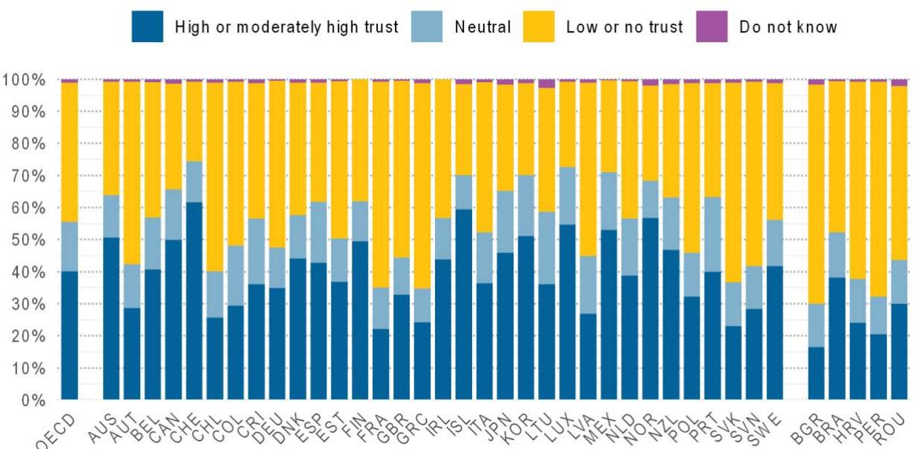  
Note: The figure presents the within-country distributions of responses to the question "On a scale of 0 to 10, where 0 is not at all and 10 is completely, how much do you trust the national government?". A 0-4 response corresponds to "low or no trust", a 5 to "neutral" and a 6-10 to "high or moderately high trust". "OECD" presents the unweighted average of the weighted OECD country averages. Source: OECD Survey on Drivers of Trust in Public Institutions 2025.

StatLink https://stat.link/o6f0r3

## 1.3.2. Trust in the national government is stabilising on average across the OECD

After a modest decline in trust between 2021 and 2023, the OECD-wide decrease in trust in the national government seems to have leveled off. $^{4}$

Across 18 $^{4}$ countries with available data, the share of people reporting high or moderately high trust fell by an average of 2 percentage points between 2021 and 2023 (OECD, 2024 $^{[8]}$ ). Trust levels in many countries appeared buoyed by the COVID crisis, possibly leading to rising trust levels in the 2020-21 period that were often followed by a decline in trust by 2023. Several factors may have shaped this 2021–23 trend, including unusual disruptions post-COVID like spikes in inflation.

In contrast, between 2023 and 2025, no such drop in trust was observed. When considering the countries for which data for all three waves are available, the share with high or moderately high trust almost returned to 2021 values (from 43.2% in 2021 to 40.8% in 2023 and 42.7% in 2025). And for the larger sample of 29 OECD countries that participated in the Trust Survey in both 2023 and 2025, the share with high or moderately high trust (40.0% in 2023 and 40.7% in 2025) and low or no trust (43.3% in 2023 and 43.2% in 2025) remained constant (Figure 1.3).

Figure 1.3. On average across the OECD, the share that place high or moderately high trust in the national government has remained stable between 2023 and 2025

Share of population with high or moderately high trust in the national government, 2021, 2023 and 2025

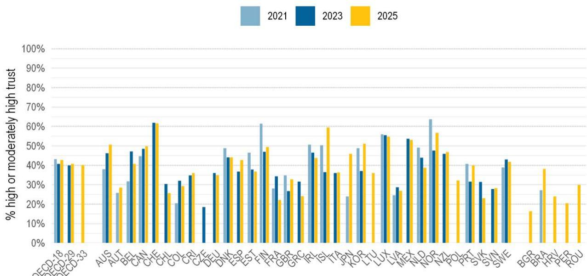

Note: The figure presents the share who provided a response of 6 to 10 to the question "On a scale of 0 to 10, where 0 is not at all and 10 is completely, how much do you trust the national government?". OECD-18 refers to the countries for which the data point is available in all survey years; and OECD-29 to the countries for which the data points are available in 2023 and 2025. The first data collection for Brazil was carried out in April 2022 using an adjusted version of the 2021 OECD Trust Survey questionnaire, and is therefore grouped under the 2021 responses.

Source: OECD Survey on Drivers of Trust in Public Institutions 2021, 2023 and 2025.

StatLink https://stat.link/xrt0hw

## 1.3.3. Yet some countries still show substantial changes in trust compared to 2023

Among countries for which data are available in all three years of the survey, three main patterns are visible.

A first group of countries experienced moderate to large changes between 2021 and 2023 followed by a stabilisation close to the 2023 values. Canada, Denmark, Ireland, Latvia and Sweden are the countries with moderate changes from 2021 to 2023, and Finland in the large category. For these countries, 2021 may have been an outlier, or the 2023-2025 period led to a consolidation from a prior development.

A second group of countries with important changes between 2023 and 2025 had already seen large swings over the prior two-year period.

\- Iceland, Norway, Korea, Portugal and the United Kingdom followed up large drops in trust by large increases. In the case of Iceland and Korea, the increase was so large that the 2025 trust level is larger than the 2021 level. And in Portugal and the United Kingdom, the difference in the share with high or moderately high trust was less than two percentage points in 2025 compared to 2021.

\- In contrast, in Belgium, an important increase in trust between 2021 and 2023 was partially offset by a decline between 2023 and 2025.

\- In France, a more modest increase in trust in the immediate post-Covid period was outweighed by a larger decline in trust between the 2023 and 2025 waves.

Finally, a few countries are outliers in terms of having very stable, consistently improving or consistently declining trust levels over the two periods. In

Luxembourg, the share of the population with high or moderately high trust changed by less than one percentage points from 2021 to 2023 and again from 2023 to 2025. In the Netherlands, the share dropped over the two subsequent periods by an equal number of percentage points; and in Australia, a larger increase from 2021 to 2023 was followed by a modest but nonetheless meaningful further increase in 2025.

Among countries for which the data point is available for 2023 and 2025 only, many are showing relatively stable trust levels.

\- In Costa Rica, Germany, Italy, Mexico, New Zealand, Slovenia and Switzerland, the share of the adult population with high or moderately high trust in the national government changed by less than two percentage points between 2023 and 2025.

\- In contrast, the share with high or moderately high trust in the national government dropped by a larger margin in Chile, Greece, and the Slovak Republic.

\- In Spain, the share of the population with high or moderately high trust increased by a larger margin.

The limited number of countries that participated in the 2021 and 2025 Trust Survey waves only saw increases in the share of their populations with high or moderately high trust in the national government. These increases were modest in Austria (3 percentages points (p.p.)) and larger in Japan (22 p.p.). $^{5}$ Brazil, saw trust levels increase by a substantial 12 p.p. since early 2022. $^{6}$

The role that (changes in) perceptions of public governance play in (changes in) trust in government are discussed in Sections 1.5.1 and 1.5.2. But on top of these changes, it also needs to be acknowledged that historical and structural factors can have long-term effects on trust, above and beyond short-term changes linked for example to the political cycle. There is mixed evidence on the relationship between having undergone a transition to democracy a few decades prior and trust in institutions today, with the preponderance leaning towards perceptions of institutional performance today mattering more than historical legacies. By contrast, deep structural crises may trigger declines in trust that take considerable time to reverse (see Box 1.2).

## Box 1.2. Recovering trust in public institutions in Greece

Long before the severe economic depression which began in 2009-10 and lasted during most of the 2010s, during which Greece lost a quarter of its 2008 GDP and saw unemployment peak at 27%, trust in government and in public institutions was not particularly high. In the aftermath of the economic crisis, trust levels appear to have moved to a lower baseline with higher volatility.

Eurobarometer data show two longer-term trends (see Figure 1.4). Following a peak in 2004 (the year Greece hosted the Olympic Games, with trust levels exceeding 50%) a steep downward trend is visible. This downward trend lasted until 2012, the deepest point in the economic crisis, when the share of the population that tended to trust the national government collapsed to a historical low of 7%. Subsequently, a more gradual upward trend can be noticed, reflecting the slow but unstable improvement of macroeconomic conditions. During this period, trust peaked in 2015, representing the promise of a new government to end austerity but instead adopting the third bailout austerity program, and in 2020, when – as in many other countries – possibly positive perceptions of pandemic management contributed to rising trust. Still, even at the relative peaks of 2015 and 2020, trust never exceeded 37%, well below the pre-2008 average trust level of 44% across the available years.

The Covid-19 pandemic in 2020 interrupted the slow economic recovery that had followed Greece's post-2009 Great Depression. In contrast to the slow recovery in the 2010s, per capita GDP returned to the pre-2020 level much more quickly – by the third quarter of 2021 (OECD, 2024[9]) – and growth levels have consistently exceeded the Euro area average since. Unemployment declined from $16\%$ in 2020 to $8.5\%$ in 2025, and disposable income increased for all, especially the lowest deciles of the income distribution.

## Figure 1.4. Increases and declines in trust levels in Greece have become more pronounced since the early 2010s

Share of population that tend to trust the national government, Greece, 1995-2023

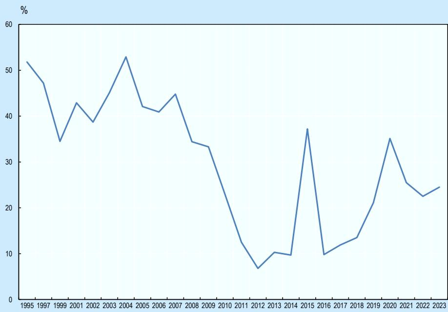  
Note: The figure shows the share who answer ‘tend to trust’ in response to the question “I would like to ask you a question about how much trust you have in certain institutions. For each of the following institutions, please tell me if you tend to trust it or tend not to trust it. Government” in the Eurobarometer survey.  
Source: Tufis, C., L. Ghica and B. Radu (2024[10]), Long-Term trends of Political Trust Dynamics (1980-2023),  
https://doi.org/10.7910/DVN/7ETG2Q, Harvard Dataverse, V1.

Recent years have been marked by substantial public investment in prudent economic management and the modernisation of public administration, laying important foundations for strengthening institutional effectiveness and public trust over the longer term. The achievement of a fiscal surplus in 2024 and 2025 (and sustainable primary budget surpluses in many years since 2013) followed a decade of modernisation of the country's public financial management system (OECD, 2026[11]). In the area of essential public services, the country is systematically evaluating user experiences and investing in the provision of digitalised public services, contributing to drastically reduced processing times in different areas including the issuing of new pensions.

This has been accompanied by efforts to reinforce public integrity. One of the objectives of Greece's 2022-2025 National Anti-Corruption Action Plan was to strengthen people's trust in public institutions, along with improving the investment climate. The OECD Anti-Corruption and Integrity Outlook 2026 reports on the progress made by Greece in strengthening the strategic framework for public integrity and anti-corruption policies and ranks Greece amongst countries with the strongest strategies and implementation in place (OECD, 2026[12]).

Given Greece's substantial progress in governance and economic outcomes, what might explain such variable levels of trust? It may be that public perceptions, and trust, operate at a lag and do not fully reflect the improved economic outcomes and investments in public services. Nevertheless, data from the Trust Survey show first signs that certain perceptions may indeed be improving at pace in Greece. For example, while overall satisfaction with administrative services among the general population have stood largely stable at $50 - 51\%$ between 2023 and 2025, the share of recent users who are satisfied with certain individual service aspects such as the speed of obtaining the service and the competence of the public employees they interacted with have improved by four percentage points. Similarly, while other measures of public integrity stayed stable or slightly declined, the share of the population who find it likely that government would refuse the request of a corporation that would be in its but potentially against the public interest has increased substantially by five percentage points from 2023 to 2025. Other indicators, however, still reveal room for improvement.

Greece stands out as an example of an asynchronous evolution of trust levels compared to improvements on the ground. It testifies to the general observation that, where trust levels are chronically low – be it in a country as a whole, or for particular population groups - the recovery of trust in government takes time. Addressing this trend, Greece over the recent years has been focusing on policies improving public satisfaction, including through systematically evaluating and incorporating user feedback on the performance of specific public services. Specifically, it relies on digital tools designed to capture user experience with public services, including healthcare and hospital care, alongside a performance monitoring hub for local government that is accessible to all citizens. For example, on public health satisfaction, the average satisfaction among 65 000 users reached 4.1 out of 5. The findings particularly highlight the dedication of the medical and nursing staff, while satisfaction with hospital catering is much lower.

While improvements in governance and outcomes rarely lead to quick boosts to trust levels – in particular in a context where deep and recurrent crises may have durably undermined public trust – these efforts by the government are likely to support a longer-term recovery in trust in public institutions.

## Box 1.3. The relationship between popular concerns and trust in the national government

People in OECD countries evaluate their national governments in terms of public governance performance and the complex policy environment or challenges facing their country – both of which are influenced by topical issues and worries at a given point in time. How, then, do current worries influence trust survey results?

Findings from the 2025 OECD Trust Survey indicate that there is an association between the issues respondents indicate are important for their country and their reported trust in their national government. These differences remain after accounting for country differences and respondents' socio-demographic characteristics, financial situation, interpersonal trust, whether they voted for a party in government, and satisfaction with selected public services.

On average across the thirty-three participating OECD countries in the 2025 Trust Survey, only 28% of respondents naming corruption among the most important issues have high or moderately high trust in their national government, while 56% indicate low or no trust. In contrast, 54% of those naming environmental topics among the most important issues facing the country indicate high or moderately high trust in their national government, while about 31% report low or no trust in their national government.

## Figure 1.5. The share with high or moderately high trust among individuals that identify corruption as a main concern is substantially lower than in the population overall

Distribution of levels of trust by whether respondents named the issue as a top concern for their country, OECD average (%), 2025

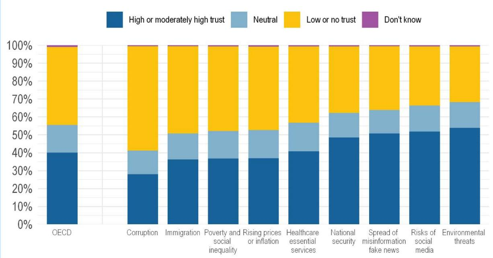  
Note: This figure shows trust in national government by the issues respondents selected as most important. The values represent the unweighted OECD average of weighted OECD country averages. Issues are ordered by the average share reporting low or no trust. Shares within countries are weighted using survey weights. The figure shows only issues with statistically significant coefficients at the 1% level in a pooled logistic regression of high versus low trust in national government, excluding neutral and “don’t know” responses, with country fixed effects and survey weights, and controlling for socio-demographic characteristics, financial situation, interpersonal trust, voting for a party in government, and satisfaction with selected public services.
Source: OECD Survey on Drivers of Trust in Public Institutions 2025.

StatLink https://stat.link/0uafdj

## 1.4. DRIVERS OF TRUST IN THE NATIONAL GOVERNMENT

## 1.4.1. People's perceptions of complex decision making are most strongly associated with trust in the national government

Trust in the national government is influenced by a variety of factors. But how people assess government competencies and values in decision making on complex policy issues is a leading factor shaping trust. Empirically, this remains as true in 2025 as it did in 2023. But even theoretically, it stands to reason that how people perceive the processes and outcomes of policy making on issues of national importance will have a strong influence in whether they deem governments trustworthy or not. At the same time, perceptions of day-to-day interactions – above all providing public services in a manner that meets people's expectations – also plays a role (previewed below and discussed in-depth in Chapter 3).

While one in two (51%) across the OECD finds it likely that institutions would be ready to protect people's lives in case of a large-scale emergency, other measures of government reliability in complex decisions are seen less positively. In general, about four in ten people find it likely that government would regulate new technologies in a manner that allows businesses and individuals to use them appropriately (42%), would support affected people during an

Neutral

economic crisis (41%), and are confident that their country will reduce GhG emissions in the coming decade (38%) (Figure 1.6). While views of emergency preparedness and technology regulation have remained largely constant relative to 2023, with shifts below two percentage points, the proportion of the population that is optimistic with regards to emissions has decreased by three to four percentage points, depending on the country sample. On average across the participating OECD accession candidate countries, confidence is higher that the country can reduce GhG emissions (35%) and regulate new technologies (34%), while emergency preparation (32%) and support during economic crises (29%) are seen less positively.

Figure 1.6. A slight majority is confident that government institutions are prepared to protect people's lives in a major emergency, while fewer expect to be protected during an economic crisis

Share of population reporting different levels of confidence in the capabilities of government institutions to achieve policy objective, OECD average (%), 2025

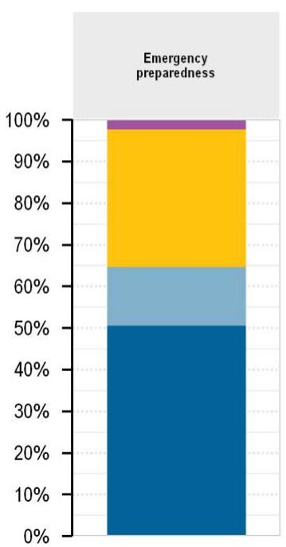  
Likely/Confident

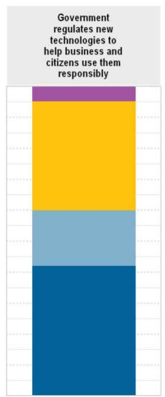  
Unlikely/Not confident

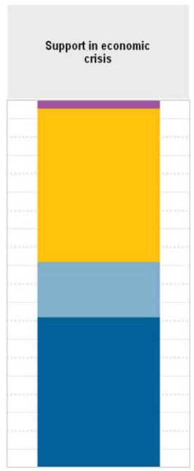  
Do not know

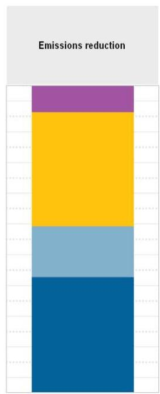  
Note: The figure presents the unweighted OECD averages for responses to the following questions: (1) "If there was a large-scale emergency, how likely do you think it is that government institutions would be ready to protect people's lives?", (2) "If new technologies (for example artificial intelligence) became available, how likely do you think it is that the national government will regulate them appropriately to help businesses and citizens use them responsibly?", (3) "In the event of an economic crisis, how likely do you think it is that the national government would provide appropriate support to affected people?", and (4) "On a scale of 0 to 10, how confident are you that [COUNTRY] will succeed in reducing greenhouse gas emissions in the next ten years?". The "likely/confident" proportion is the aggregation of responses from 6-10 on the scale; "neutral" is equal to a response of 5; "unlikely/not confident" is the aggregation of responses from 1-4; and "don't know" was a separate answer choice. The OECD average is the unweighted average of the weighted individual OECD country averages. Source: OECD Survey on Drivers of Trust in Public Institutions 2025.

StatLink https://stat.link/0bsmxt

Beyond the outcomes of policy actions, people also care about how governments arrive at their decisions. They expect policymakers to be open and responsive to feedback from the public and different stakeholders, and yet to withstand pressure from special interests for policies that may run counter to the public interest. On these measures, many OECD countries still have substantial room for improvement: 42% of people find it likely that government takes into account the best available evidence when taking decisions, a share that has remained constant since 2023, and 37% are confident that it cooperates with other stakeholders to solve large-scale policy challenges (Figure 1.7). In comparison, fewer than one third find it likely that government would refuse lobbying from a corporation for a policy that could be detrimental to society as a whole (32%) or believe that people like them have a say in what government does (31%). It should however be noted that compared to 2023, slightly more people have a positive view of the ability of government to withstand this policy capture (see Figure 4.8 in Chapter 4).

Figure 1.7. Only around one third of people feel people like them have a say in what government does and that the national government puts the public over special interests Share of population reporting different levels of confidence in how government arrives at policy decisions, OECD average (%), 2025

Likely/Confident

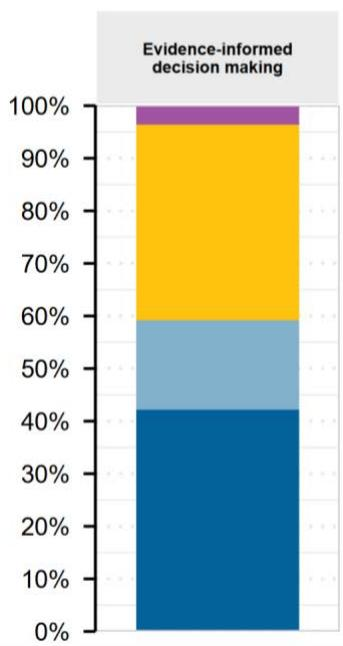

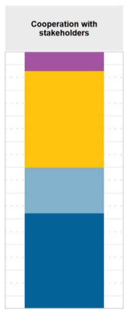  
Unlikely/Not confident

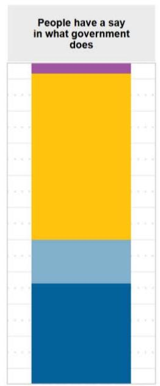  
Do not know

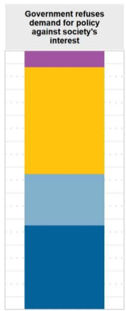  
Note: The figure presents the unweighted OECD averages for responses to the following questions: (1) "If the federal/central/national government takes a decision, how likely do you think it is that it will draw on the best available evidence, research, and statistical data?", (2) "On a scale of 0 to 10, how confident are you in the national government's ability to cooperate with other national stakeholders, such as private sector organisations and trade unions to better tackle long-term challenges?", (3) "How much would you say the political system in [COUNTRY] allows people like you to have a say in what the government does?", and (4) "If a corporation promoted a policy that benefited its industry but could be harmful to society as a whole, how likely do you think it is that the federal/central/national government would agree to the corporation's demand?". The "likely/confident" proportion is the aggregation of responses from 6-10 on the scale; "neutral" is equal to a response of 5; "unlikely/not confident" is the aggregation of responses from 1-4; and "don't know" was a separate answer choice. The OECD average is the unweighted average of the weighted individual OECD country averages.
Source: OECD Survey on Drivers of Trust in Public Institutions 2025.

StatLink https://stat.link/6wtnrd

A majority of people across the OECD are satisfied with administrative services and with the data protection provided by government institutions. Among recent service users, 68% across the OECD and 48% across the participating OECD accession countries are satisfied with these services (Figure 1.8). The share satisfied among the overall population has also risen, from 64% in 2021 to 65% in 2023 and 67% in 2025 in the countries where the information is available for all three years. Satisfaction with other essential services is somewhat lower but continues to be on average above 50% across the OECD. Moreover, 52% of people across the OECD and 38% across the participating OECD accession countries find it likely that government institutions would use their data for legitimate purposes only.

## Figure 1.8. In many OECD countries a majority is satisfied with administrative services and the protection of personal data by government agencies

Share of recent service users who are satisfied with administrative services and share of the population who find it likely that public agencies use personal data only for legitimate purposes, 2025

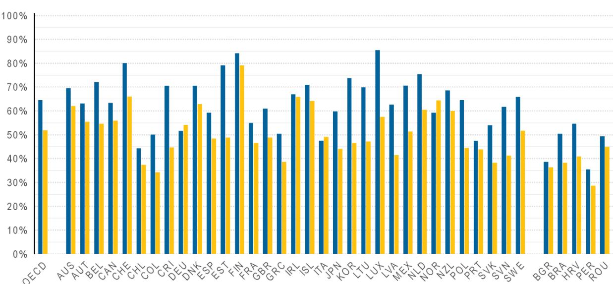  
Note: The figure presents the share who are satisfied/find it likely in response to the questions "On a scale of 0 to 10, how satisfied are you with the quality of administrative services in [COUNTRY] (for example applying for an ID, registering a birth or applying for benefits)?" and "If you shared your personal data with a public agency/office/department, how likely do you think it is that it would be used for legitimate purposes only?". Recent users replied in the affirmative to the question "In the last 12 months, have you personally made use of an administrative in [COUNTRY] (for example, applying for a passport, registering a birth, or applying for benefits etc.)?". The "satisfied"/"likely" proportion is the aggregation of responses from 6-10 on the scale; "neutral" is equal to a response of 5; "dissatisfied" is the aggregation of responses 0 to 4. The OECD average is the unweighted average of the weighted individual OECD country averages.
Source: OECD Survey on Drivers of Trust in Public Institutions 2025.

Overall, the drivers of trust for national government have remained stable relative to 2023. Across the OECD, people's perceptions of government decision making on complex policy issues have a strong association with their trust in government, while perceptions of day-to-day interactions play a much smaller role (Figure 1.9):

## StatLink https://stat.link/acfh09

\- People who feel their government makes decisions based on the best available evidence, and balances needs of current and future generations, are particularly more likely to have high or moderately high trust in the government. Improvements in the perceptions of having a say in what government does, in government cooperating with other

stakeholders to solve problems and in providing support to affected individuals during economic crises are likewise associated with substantially higher trust levels. The newly introduced variables on government's cooperation with other stakeholders and support during an economic crisis are among the most important drivers identified. These aspects of government reliability and openness on complex decision making are strongly associated with trust in national government. Other governance factors associated with a higher probability of placing trust in the national government are having positive views of government resisting lobbying by companies that could be detrimental to public interest, clearly communicating about the impacts of a major reform, adjusting policies in response to public consultations and majority preferences, and being prepared to protect people's lives in an emergency. The perceptions of legislatures balancing the needs of different groups and hold government accountable also play a role.

\- People whose satisfaction with administrative services is above average, those who find it likely that government agencies use personal data for legitimate purposes, and those who believe their application for government benefits and services would be treated fairly are also slightly more likely to place high or moderately high trust in the national government.

Figure 1.9. The drivers of trust in national government in 2025 Public governance drivers that have a statistically significant relationship with trust in the national government, OECD, 2025  
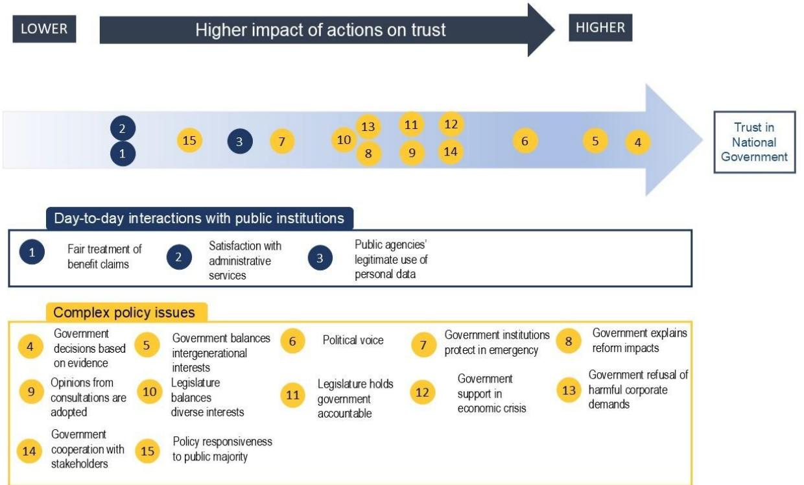  
How to read: The figure shows the combined information from the regression analysis of trust in the national government on the public governance drivers and control variables and the distance of the average perception of the respective driver to an 80% threshold. Drivers that are more positively associated with trust and for which only a low average share across the OECD have a positive perception can potentially have a higher impact on trust, as there is important scope for improvement and the improvement would likely be associated with increased levels of trust. On the other hand, drivers with a low positive association with trust and for which perceptions are already quite positive across OECD countries have a lower potential for contributing to positive improvements on trust. Nevertheless, all drivers listed in this figure are statistically significant and improvements in the respective areas can therefore all contribute to improving trust.
Note: The figure shows the statistically significant determinants of trust in the national government, obtained through logistic regressions of trust on the public governance drivers. The analyses control for individual characteristics, including whether they voted or would have voted for one of the current parties in power, self-reported levels of interpersonal trust, and country fixed effects. All variables depicted are statistically significant at the 1% significance level. The estimated average marginal effects underlying this figure can be found in Table A.4, column (1), Annex A.
Source: Survey on Drivers of Trust in Public Institutions 2025.

In the participating OECD accession candidate countries, the observed relationships are similar (see Table A.4, column (4), Annex A). People's perceptions about whether decisions are informed by the best available evidence is the driver by far most strongly associated with trust in the national government, followed – at a distance – by people's perceptions of whether government is able to balance well between the interests of current and future generations. People's perceptions in other areas of decision making on complex policy issues, such as political voice, the legislature's role in holding government accountable and tending to the needs of different groups, the preparation for large-scale emergencies, the appropriate regulation of new technologies, and the clear explanation of major reforms likewise play a role. As is true in OECD countries, perceptions on daily interactions have a less pronounced influence, with satisfaction with administrative services and the availability of information about these services being the only two drivers with a statistically significant relationship with trust in the national government.

The respective findings for OECD and OECD accession candidate countries thus reaffirm a result from the first OECD Trust Survey in Latin America and the Caribbean (OECD, 2025[13]): while there are differences in how people across the OECD and in non-OECD countries perceive different public governance drivers, on average, the relationship between these perceptions and trust in public institutions is relatively similar. This implies that lessons on potential policy actions to enhance trust may apply across different democratic countries. However, at the country level, results of course vary.

## 1.4.2. Consequently, important changes in levels of trust in the national government are found to be related to changes in perceptions of decision making on complex policy issues

A decomposition analysis of the survey data – carried out within each country – helps explain how changes in trust levels relate to shifts in perceptions of public governance.

This analysis (Figure 1.10), which was run separately for each country, is illustrated for countries where trust levels changed by at least four percentage points between 2023 and 2025. The findings show that in all concerned countries except Norway and Spain (not shown in Figure 1.10 $^{7}$ ), changes in public governance perceptions account for at least forty percent of the observed change in the share of people with high or moderately high trust in the national government. Accordingly, other factors that are not measured and included in this model account for the remainder of the trust level changes. Interestingly, in the United Kingdom, the change in the share with high or moderately high trust is smaller than the changes in the underlying trust drivers would predict $^{8}$ – in other words, based on changes in perceptions of public governance, trust may have been expected to be higher.

Figure 1.10. Changes in perceptions of public governance drivers related to complex decision making account for the largest share of changes in trust levels in the national government

Share of changes in level of people with high or moderately high trust that can be accounted for by changes in the perceptions of public governance, 2023 and 2025

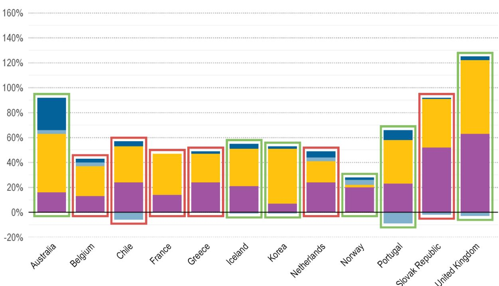

How to read: The figure indicates how much of the change in the average share of high or moderately high trust in the country between the 2023 and 2025 wave can be accounted for through changes in perceptions of the public governance drivers. A 50 for example indicates that changes in these variables account for half of the change in the share that trusts that is actually observed. A value above a 100 indicates that the change that is observed is smaller than the shifts in the perceptions of the public governance drivers would indicate. A negative value – as seen for example with regards to perceptions of values in day-to-day interactions in Chile, Portugal, the Slovak Republic and the United Kingdom - indicates that the trend in the perception of the associated drivers is of the opposite direction than the change in trust in government.

Note: Estimation of a two-fold Blinder-Oaxaca decomposition. The employed model is a logistic regression of trust in the national government (defined as 0 for the 0-4 responses and 1 for the 6-10 responses) on the standardised public governance driver variables, demographic and socio-economic variables (age, age squared, educational attainment, man/woman) and whether or not the individual (would have) voted for the national government in the last election. The decompositions are carried out separately for each listed country. The attribution of public governance drivers to day-to-day competencies and values and to competencies and values related to decision making on complex policy issues is listed in Table A.1 in Annex A.

Source: OECD Survey on Drivers of Trust in Public Institutions 2023 and 2025.

While the changes in public governance perceptions that contribute the most to the change in trust naturally differs from country to country, $^{9}$ there are a few patterns that stand out:

\- First, changes in the levels of trust are far more strongly associated with changes in average perceptions of decision making on complex policy issues than day-to-day interactions.

\- Second, on average across countries, changes in the perceptions of the responsiveness and reliability of government institutions related to complex decisions on average account for slightly higher shares of changes in trust than do changes in the perceptions of the fairness, integrity and openness of institutions around complex decisions.

\- Third, among the different perceptions of how well governmental institutions act with integrity, openness and fairness when taking complex decisions, it is mostly changes in perceptions of fairness that contribute to changes in overall trust levels.

Together, these findings suggest that there are certain public governance perceptions – in particular related to how reliable and responsive, but also how fair, institutions are seen to be in addressing complex and long-term policy issues – that can 'move the needle' of trust in the national government relatively rapidly. This confirms the analysis of the drivers of trust carried out over the years. Improving trust takes time, but investing in these areas might enable faster improvements for the national government. For local government and other institutions, it is likely that changes are determined by other factors as developed in the next sections.

## 1.5. LEVELS AND DRIVERS OF TRUST IN LOCAL GOVERNMENT AND OTHER PUBLIC INSTITUTIONS

Evidence from the OECD Trust Survey over time suggests that across democratic countries, people tend to trust institutions responsible for upholding security and the law the most. Conversely, they trust political institutions the least, especially political parties. The institutions with which individuals are more prone to interact with on a day-to-day basis, including the local government and the civil service, fall in the middle (Figure 1.11). Far from a failure of democratic governance, this pattern is expected and can be a sign of ‘skeptical trust’ whereby citizens of democratic countries critically assess whether public institutions meet their expectations and where institutions tasked with maintaining essential services, as well as law and order, are seen to meet these expectations more consistently than institutions in which political debates occur.

Trust in different public institutions within the same country tends to move in tandem, but often with stronger movements for trust in the national government than in other institutions.

Figure 1.11. A majority across the OECD have high or moderately high trust in security and judicial institutions

Share of population with high or moderately high trust in the public institution and media, OECD, 2025

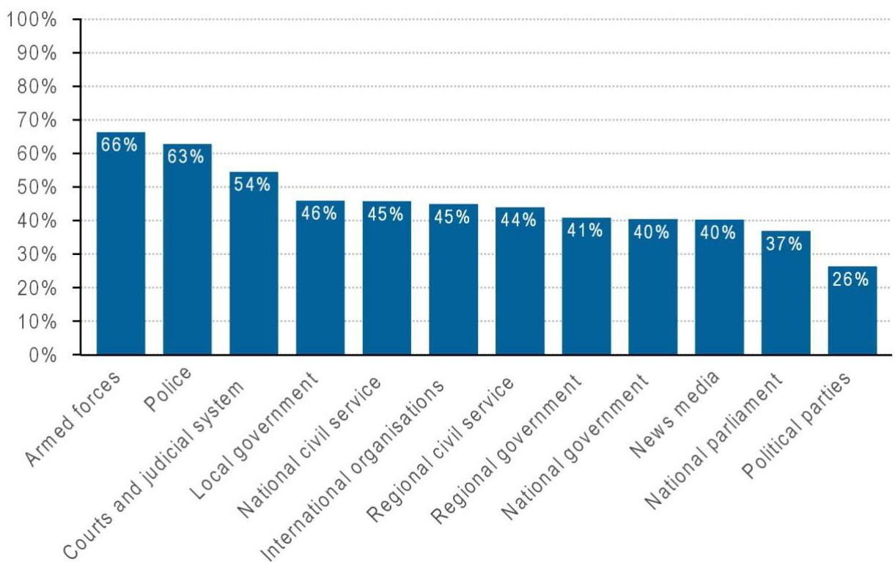  
Note: The figure presents the unweighted OECD average of responses to the question "On a scale of 0 to 10, where 0 is not at all and 10 is completely, how much do you trust [insert name of institution]?" Shown here is the share with high or moderately high trust corresponding to those who select an answer from 6 to 10 on the 0-10 response scale. For some institutions, the OECD average does not include all countries as the institution itself does not exist everywhere. The OECD average is the unweighted average of the weighted individual OECD country averages.  
Source: OECD Survey on Drivers of Trust in Public Institutions 2025.

The following section will show the current trust levels in law-and-order institutions on the one hand and the civil service and local government on the other hand. It will also discuss the drivers of trust in the national civil service and local government. The levels and drivers of trust in national legislatures – parliaments and congresses – will be analysed in more detail in Chapter 7. Table 1.3 provides an overview of the population share with high or moderately high trust in the different public institutions by country.

## 1.5.1. The police, judicial system and armed forces generally elicit the highest levels of trust

People across the OECD have consistently shown substantial trust in the police. The share with high and moderately high trust is equal to 63% across the OECD

StatLink https://stat.link/qo4kd1

(Figure 1.12). This share has remained relatively constant since 2021 and 2023. This is true whether the analysis over time applies to the sample of 20 countries included in both waves, or the 29 included in the 2023 and 2025 waves. In the participating OECD accession countries, an average of 42% trust the police, which remains substantially above the share who trust national government.

On average, two thirds (66%) of people across the OECD have high or moderately high trust in the armed forces (Figure 1.12), an institution for which trust levels are measured for the first time in the current Trust Survey wave. The lowest population shares that trust the armed forces in the OECD and among accession countries are in the Slovak Republic (47%) and Bulgaria (36%). Elsewhere, at least one in two adults place trust in the armed forces. And in Finland, their share even reaches nine out of ten (91%).

Trust in the courts and judicial system is substantially lower, albeit higher than other public institutions, and displays a higher variability across countries. On average, 54% across the OECD have high or moderately high trust in the courts (Figure 1.12). In

Denmark (77%) and Norway (76%), more than three in four individuals trust the courts, while in Chile, fewer than one in four (24%) do. Trust in the judicial system is relatively constant over time, rising by one percentage point between each survey wave for stable groups of countries. Across the participating OECD accession countries, 31% have high or moderately high trust in the courts.

Figure 1.12. Police, courts and the armed forces are the most trusted public institutions in many countries

Share of population with high or moderately high trust in the respective institution, 2025

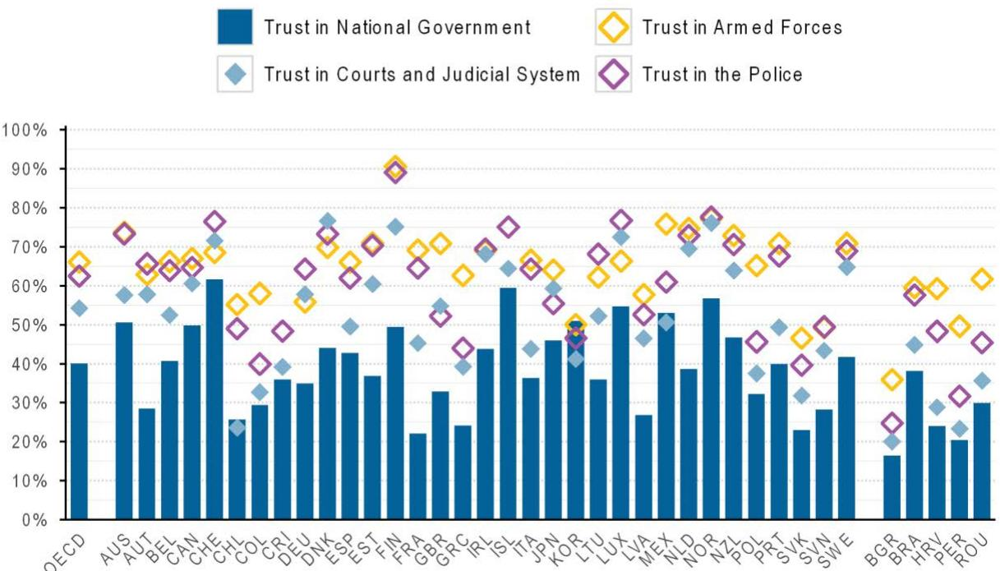  
Note: The figure presents the share of responses who indicate that they have high or moderately high trust in the respective institution in response to the question "On a scale of 0 to 10, where 0 is not at all and 10 is completely, how much do you trust [insert name of institution]?" The share with high or moderately high trust correspond to those who select an answer from 6 to 10 on the 0-10 response scale. The OECD average is the unweighted average of the weighted individual OECD country averages.
Source: OECD Survey on Drivers of Trust in Public Institutions 2025.

## 1.5.2. Local government remains substantially more trusted than the national government

On average across the OECD, 46% of people have high or moderately high trust in their local government, a share that is six percentage points above the trust in the national government (Figure 1.13). In a few countries, trust in the two institutions is almost equal, namely in Canada, Costa Rica, Ireland and Slovenia. In

StatLink https://stat.link/7tcjw5

Iceland, Mexico, Korea, and Norway more people have high or moderately high trust in the national government than in local government. But in all other countries, including the surveyed OECD accession candidate countries, local government is more trusted than the national government. This gap can be substantial -- in France, for example, trust in local government is thirty percentage points higher than trust in the national government.

## Figure 1.13. Local governments and the national civil service are usually trusted more than national governments

Share of population with high or moderately high trust in the respective institution, 2025

Trust in National Government
Trust in Local Government
Trust in National Civil Service

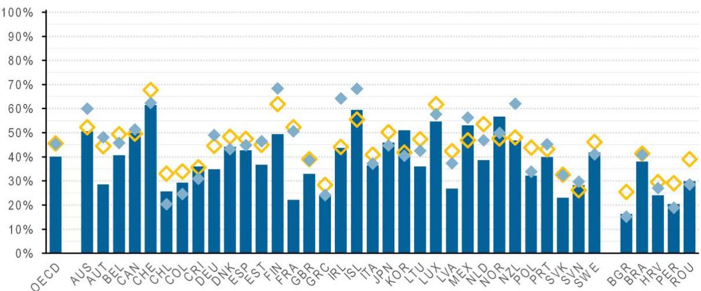  
Note: The figure presents the share of responses who indicate that they have high or moderately high trust in the respective institution in response to the question "On a scale of 0 to 10, where 0 is not at all and 10 is completely, how much do you trust [insert name of institution]?" The share with high or moderately high trust correspond to those who select an answer from 6 to 10 on the 0-10 response scale. The OECD average is the unweighted average of the weighted individual OECD country averages.
Source: OECD Survey on Drivers of Trust in Public Institutions 2025.

Average trust in local government has remained stable for the 29 countries that participated in the 2023 and 2025 surveys (Figure 1.14), but increased slightly for the 20 countries that participated in the Trust Survey since 2021. Increases that exceed two percentage points were observed in Finland, Germany, Iceland, Ireland, Korea, New Zealand, Portugal, Spain, Sweden, Switzerland and the United Kingdom as well as Brazil (in 2022). In Japan, relative to 2021, trust in local government increased by twelve percentage points. Decreases of more than two percentage points are observed in Belgium, Canada, Chile, France, Greece, Norway, the Slovak Republic and Slovenia.

StatLink https://stat.link/eqvwcn

In two thirds of the countries that were part of the survey in both 2023 and 2025, the change in trust levels in local government was very similar or smaller than the change in trust in national government. In Denmark, Finland, Germany, Ireland and Switzerland, the share of the population with high or moderately high trust in the local government increased while the share that trusts the national government was relatively stable or declined slightly. In Canada, Greece, and Slovenia, declines in trust in the local government stood in opposition to stable or less strongly declining trust in the national government. And in Norway, trust in the national government increased substantially while trust in local government declined slightly.

## Figure 1.14. Trust in local government and the civil service has been stable

Distribution of levels of trust in local government and the national civil service, OECD-20

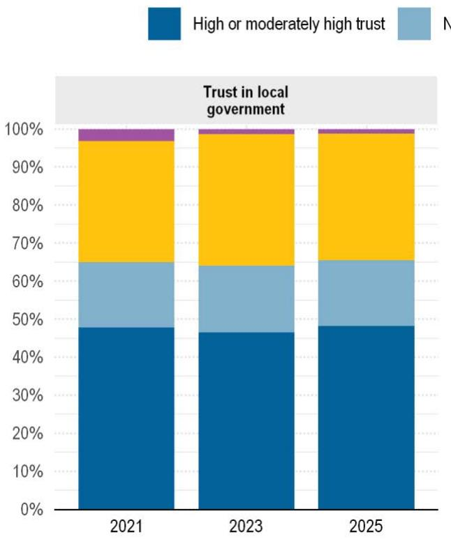

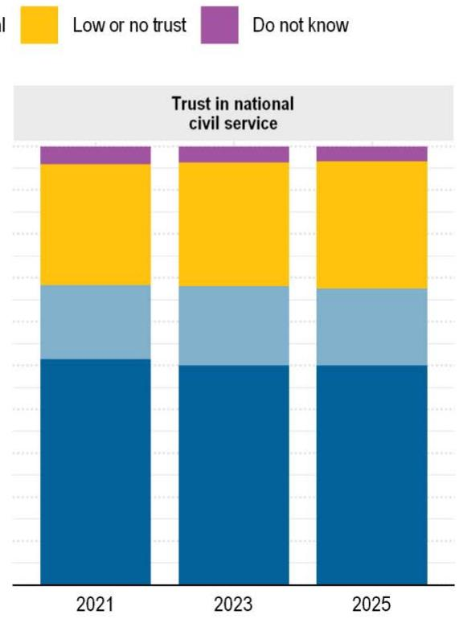  
Note: The figure presents the share who provided a response of 6 to 10 to the question "On a scale of 0 to 10, where 0 is not at all and 10 is completely, how much do you trust [INSTITUTION]?" OECD-20 refers to the unweighted average of the weighted country averages across the twenty countries that participated in all three survey waves. In 2021, the questionnaire did not distinguish between national-level and regional- or local-level civil service.  
Source: OECD Survey on Drivers of Trust in Public Institutions 2021, 2023 and 2025.

The public governance drivers associated with a higher probability of trusting the local government are a mix of perceptions associated with day-to-day interactions and decision making on complex policy issues, but with openness to people's inputs on day-to-day interactions being far and above the most important driver (Figure 1.15):

\- People who find it more likely that they are able to voice their opinion on policy decisions affecting their own community are six percentage points more likely to trust local government.

StatLink https://stat.link/8ybqfj

\- Positive perceptions of fair treatment when applying for public benefits or services and of legitimate use of personal data, as well as satisfaction with administrative services and with the ability to access information about them, are likewise highly correlated with trust in local government.

\- People who find it more likely that government decisions are informed by evidence and cooperations with other stakeholders, that people like them have a political voice, and that institutions are ready to protect people's lives in case of a large-scale emergency are also more prone to place high or moderately high trust in local government.

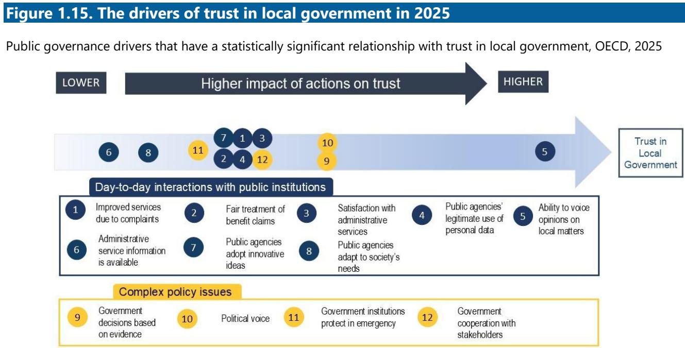  
How to read: The figure shows the combined information from the regression analysis of trust in the local government on the public governance drivers and control variables and the distance of the average perception of the respective driver to an 80% threshold. Drivers that are more positively associated with trust in the respective institution and for which only a low average share across the OECD have a positive perception can potentially have a higher impact on trust, as there is important scope for improvement and the improvement would likely be associated with increased levels of trust. On the other hand, drivers with a low positive association with trust and for which perceptions are already quite positive across OECD countries have a lower potential for contributing to positive improvements on trust. Nevertheless, all drivers listed in this figure are statistically significant and improvements in the respective areas can therefore all contribute to improving trust.  
Note: The figure shows the statistically significant determinants of trust in the local government, obtained through logistic regressions that of trust in on the public governance drivers. The analyses control for individual characteristics, including whether they voted or would have voted for one of the current parties in power, self-reported levels of interpersonal trust, and country fixed effects. All variables depicted are statistically significant at the 1% significance level. The estimated average marginal effects underlying this figure can be found in Table A.5, column (9), Annex A.
Source: Survey on Drivers of Trust in Public Institutions 2025.

Broadly, the same relationships can be found when analysing the drivers of trust in local government across the participating OECD accession countries. However, availability of information on administrative services is more strongly related to high or moderately high trust; while perceptions of the responsiveness of public services are not significantly related to trust in local government in these countries (see Table A.5, column (10), Annex A).

## 1.5.3. A higher share trust the national civil service than the national government

The share of the OECD population that trust the national civil service is comparable to the share that trust local government (Figure 1.13): 45% have high or moderately high trust in this institution, 18% provide a neutral reply, and 34% have no or low trust. The share that trusts is substantially lower in the OECD accession countries. People are most likely to trust the civil service in Finland and Iceland, where 68% of the adult population does, and trust in the national civil service also is equal to or above 60% in Australia, Ireland, New Zealand and Switzerland.

In the countries where respondents were surveyed about the regional or local civil service, the share that trust the regional or local civil service is usually within one or two percentage points of the share that trust the national civil service. Exceptions are Canada, where more people trust the national civil service; and Costa Rica, the Slovak Republic and Switzerland, where more people trust the regional civil service. But even in these cases, the differences are usually in the order of 3-4 percentage points. Only in Finland and New Zealand there are 16 and 12 percentage point gaps favouring the national civil service.

Countries' trends in trust in the national civil service between 2023 and 2025 usually mirror those for trends in trust in the national government, though the changes in trust in the civil service are usually smaller. However, in France, this difference is very pronounced.

Regardless of whether the sample refers to the 20 countries that participated continuously from 2021 through 2025 or the 29 countries that participated in 2023 and 2025, the shares with high or moderately high trust or with low or no trust in the national civil service have remained fairly constant.

As is true for trust in local government, trust in the civil service is equally affected by people's perceptions of their day-to-day interactions with public institutions as it is by government decision making on complex policy issues (Figure 1.16):

\- People who have a particularly positive view of the quality of administrative services, and who find it more likely than average that data are used for legitimate purposes only, that applications for government benefits or services are treated fairly, that innovative ideas that could improve public services are adopted, and that information about administrative services are easily available are more likely to place high or moderately high trust in the national civil service.

\- People who find it more likely that a civil servant grants people a 'right to error' is only very marginally positively related to trust in the civil service. A person who finds this outcome particularly likely is only 1.0 percentage points more likely to have high or moderately high trust in the national civil service.

\- As was the case in 2023, people who find it likely that government decisions are informed by the best available evidence, that institutions are prepared to protect people's lives in large-scale emergencies, and that they hold each other accountable are also more likely to place trust in the national civil service. Positive perceptions of government cooperating with other stakeholders to solve problems and of services adapting to changing societal needs are likewise associated with placing trust in the civil service.

Figure 1.16. The drivers of trust in the civil service in 2025  
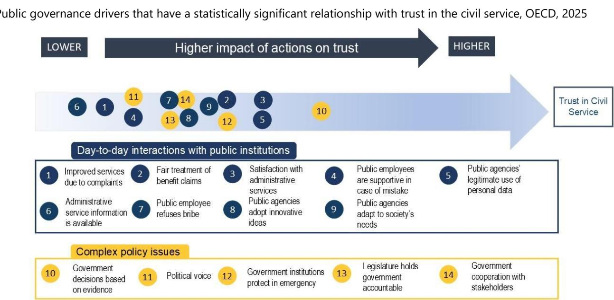

How to read: The figure shows the combined information from the regression analysis of trust in the national civil service on the public governance drivers and control variables and the distance of the average perception of the respective driver to an 80% threshold. Drivers that are more positively associated with trust in the respective institution and for which only a low average share across the OECD have a positive perception can potentially have a higher impact on trust, as there is important scope for improvement and the improvement would likely be associated with increased levels of trust. On the other hand, drivers with a low positive association with trust and for which perceptions are already quite positive across OECD countries have a lower potential for contributing to positive improvements on trust. Nevertheless, all drivers listed in this figure are statistically significant and improvements in the respective areas can therefore all contribute to improving trust.

Note: The figure shows the statistically significant determinants of trust in civil service, obtained through logistic regressions that of trust in the respective institutions on the public governance drivers. The analyses control for individual characteristics, including whether they voted or would have voted for one of the current parties in power, self-reported levels of interpersonal trust, and country fixed effects. All variables depicted are statistically significant at the 1% significance level. The estimated average marginal effects underlying this figure can be found in Table A.5, column (5), Annex A.
Source: Survey on Drivers of Trust in Public Institutions 2025.

In comparison to the drivers of trust in other institutions, there are more distinct findings on drivers of trust in the civil service in the surveyed OECD accession countries compared to the OECD (see Table A.5, column (6), Annex A). The increase in the likelihood of having high or moderately high trust in the civil service is more pronounced with positive perceptions of innovation potential in public services, with emergency preparation, with information on administrative services being available, and with having a say in what government does in OECD accession than in OECD countries. In contrast, satisfaction with administrative services and with data being used for legitimate purposes are less predictive of high or moderately high trust in these countries.

## 1.6. AREAS FOR POLICY ACTION TO ENHANCE TRUST

Depending on the country and its constellation of public governance perceptions, different policy actions are going to offer the biggest potential for enhancing trust in public institutions. The subsequent chapters provide more detailed policy recommendations that could contribute to improving perceptions of the day-to-day interactions with public institutions and of government decision making on complex policy issues. The following general lessons can apply regardless of country and institutional specificities:

\- Focus on high-impact drivers with the greatest room to improve trust in specific institutions. Improving day-to-day service delivery will have more impact on trust in the civil service and local government) while improving perceptions about long-term policymaking will have more impact on trust in the national government and the legislatures.

\- Recognise that some perceptions of the capacity of governments to make the right decisions on long term and complex policy challenges can shift quickly. In countries with sizeable changes in trust in the national government in the past two years, citizens' perceptions of the competence and fairness of decision making on complex matters have been the key variable. Continuing to invest in public services will help maintain trust levels but investments in both the how (engagement of people and stakeholders, transparency, evidence based, communication) and the what (fairness) of decisions on complex policy areas will be help increase trust levels in national government and the legislature.

\- Embrace the use of new technologies in government with care to ensure public sector principles and attention to communication. While the level of confidence of government use of personal data is relatively high, with 52% finding it likely that their personal data will be used only for legitimate purposes, investments in communicating on the value added of the use of AI in government and addressing concerns about the risks will have to be made.

\- Invest in renewed democratic governance. The drivers of trust for national governments and legislatures show growing public expectations for transparency, accountability, and fairness in policy making. Most importantly, there is a sizeable and persistently large group of people who do not feel they are being heard. The institutionalisation of engagement mechanisms beyond traditional representative processes in many countries should help in this regard, but investments are necessary to ensure these mechanisms are efficient and effective in driving meaningful results on policy decisions.

## 1.7. OUTLOOK FOR THE REMAINDER OF THE REPORT

This introductory chapter provided an overview of the current levels of trust in the national government and other public institutions and their evolution over time. Moreover, it presented the identified drivers of trust in the national government, civil service and local government.

To learn more about variations in trust in individual countries and the underlying perceptions of the public governance drivers of trust, the rest of the report is structured as follows:

\- Chapter 2 covers differences in trust in the national government across different population groups;

\- Chapter 3 analyses perceptions in the participating OECD and OECD accession candidate countries regarding day-to-day interactions with public institutions, including an in-depth view on how the assessment of different quality factors relate to overall satisfaction with administrative services;

\- Chapter 4 focuses on the perceptions of government decision making on complex policy issues, assessing how people view the likelihood of institutions achieving certain long-term and difficult policy objectives in a manner that is receptive to public preferences and interests;

Chapter 5 explores people's assessment of the potential implications of the use of artificial intelligence by government institutions;

\- Chapter 6 discusses findings related to the perceived impacts of and barriers to political and civic participation, in order to provide insights into potential mechanisms for altering the widespread scepticism that the political system allows people to have a say in what government does;

\- Chapter 7 – for the first time since the inaugural wave of the Trust Survey – explores in depth how trust in the national legislature is evolving over time and across population groups, and which public governance perceptions are most associated with trust levels in parliaments and congresses.

Table 1.3. Share of population with high or moderately high trust in different public institutions and the media, 2023 and 2025

<table><tr><td rowspan="2">Country</td><td colspan="2">National Government</td><td colspan="2">Regional Government</td><td colspan="2">Local Government</td><td colspan="2">National Parliament</td><td colspan="2">Political Parties</td><td colspan="2">Police</td><td colspan="2">National Civil Service</td><td colspan="2">Regional Civil Service</td><td colspan="2">Courts and Judicial System</td><td colspan="2">News Media</td><td colspan="2">International Organisations</td><td colspan="2">Armed Forces</td></tr><tr><td>2023</td><td>2025</td><td>2023</td><td>2025</td><td>2023</td><td>2025</td><td>2023</td><td>2025</td><td>2023</td><td>2025</td><td>2023</td><td>2025</td><td>2023</td><td>2025</td><td>2023</td><td>2025</td><td>2023</td><td>2025</td><td>2023</td><td>2025</td><td>2023</td><td>2024</td><td>2023</td><td>2025</td></tr><tr><td>OECD average</td><td>39%</td><td>40%</td><td>40%</td><td>41%</td><td>45%</td><td>46%</td><td>37%</td><td>37%</td><td>24%</td><td>26%</td><td>63%</td><td>63%</td><td>45%</td><td>46%</td><td>43%</td><td>44%</td><td>54%</td><td>54%</td><td>39%</td><td>40%</td><td>44%</td><td>45%</td><td></td><td>66%</td></tr><tr><td>OECD average (2023 &amp; 2025)</td><td>40%</td><td>41%</td><td>40%</td><td>41%</td><td>45%</td><td>46%</td><td>37%</td><td>37%</td><td>25%</td><td>27%</td><td>63%</td><td>63%</td><td>46%</td><td>46%</td><td>43%</td><td>44%</td><td>54%</td><td>55%</td><td>39%</td><td>41%</td><td>44%</td><td>44%</td><td></td><td></td></tr><tr><td>Australia</td><td>46%</td><td>51%</td><td>46%</td><td>51%</td><td>51%</td><td>52%</td><td>43%</td><td>49%</td><td>34%</td><td>40%</td><td>68%</td><td>73%</td><td>50%</td><td>60%</td><td>50%</td><td>58%</td><td>59%</td><td>58%</td><td>41%</td><td>45%</td><td>41%</td><td>44%</td><td></td><td>74%</td></tr><tr><td>Austria</td><td></td><td>29%</td><td></td><td>36%</td><td></td><td>45%</td><td></td><td>33%</td><td></td><td>21%</td><td></td><td>66%</td><td></td><td>48%</td><td></td><td>49%</td><td></td><td>58%</td><td></td><td>30%</td><td></td><td>37%</td><td></td><td>63%</td></tr><tr><td>Belgium</td><td>47%</td><td>41%</td><td>46%</td><td>42%</td><td>52%</td><td>49%</td><td>42%</td><td>37%</td><td>29%</td><td>27%</td><td>67%</td><td>64%</td><td>49%</td><td>46%</td><td>49%</td><td>46%</td><td>53%</td><td>53%</td><td>52%</td><td>50%</td><td>50%</td><td>46%</td><td></td><td>66%</td></tr><tr><td>Canada</td><td>49%</td><td>50%</td><td>47%</td><td>48%</td><td>54%</td><td>50%</td><td>47%</td><td>50%</td><td>34%</td><td>37%</td><td>67%</td><td>65%</td><td>54%</td><td>51%</td><td>51%</td><td>47%</td><td>63%</td><td>61%</td><td>50%</td><td>52%</td><td>46%</td><td>47%</td><td></td><td>67%</td></tr><tr><td>Chile</td><td>30%</td><td>26%</td><td>29%</td><td>24%</td><td>36%</td><td>33%</td><td>19%</td><td>16%</td><td>14%</td><td>11%</td><td>52%</td><td>49%</td><td>24%</td><td>20%</td><td>23%</td><td>21%</td><td>25%</td><td>24%</td><td>28%</td><td>27%</td><td>31%</td><td>28%</td><td></td><td>55%</td></tr><tr><td>Colombia</td><td></td><td>29%</td><td>33%</td><td>30%</td><td>34%</td><td>34%</td><td>23%</td><td>22%</td><td>19%</td><td>15%</td><td>39%</td><td>40%</td><td>27%</td><td>25%</td><td>27%</td><td>26%</td><td>33%</td><td>33%</td><td>39%</td><td>34%</td><td>51%</td><td>43%</td><td></td><td>58%</td></tr><tr><td>Costa Rica</td><td>35%</td><td>36%</td><td></td><td></td><td>34%</td><td>36%</td><td>26%</td><td>22%</td><td>13%</td><td>17%</td><td>48%</td><td>49%</td><td>28%</td><td>31%</td><td>26%</td><td>35%</td><td>44%</td><td>39%</td><td>35%</td><td>37%</td><td>44%</td><td>43%</td><td></td><td></td></tr><tr><td>Czech Republic</td><td>19%</td><td></td><td>30%</td><td></td><td>44%</td><td></td><td>20%</td><td></td><td>14%</td><td></td><td>60%</td><td></td><td>34%</td><td></td><td>38%</td><td></td><td>50%</td><td></td><td>27%</td><td></td><td>31%</td><td></td><td></td><td></td></tr><tr><td>Denmark</td><td>44%</td><td>44%</td><td>44%</td><td>44%</td><td>47%</td><td>48%</td><td>47%</td><td>45%</td><td>37%</td><td>35%</td><td>69%</td><td>73%</td><td>44%</td><td>43%</td><td>44%</td><td>44%</td><td>75%</td><td>77%</td><td>36%</td><td>37%</td><td>57%</td><td>60%</td><td></td><td>70%</td></tr><tr><td>Estonia</td><td>38%</td><td>37%</td><td></td><td></td><td>46%</td><td>45%</td><td>27%</td><td>31%</td><td>17%</td><td>18%</td><td>74%</td><td>70%</td><td>49%</td><td>47%</td><td></td><td></td><td>62%</td><td>61%</td><td>38%</td><td>38%</td><td>44%</td><td>42%</td><td></td><td>71%</td></tr><tr><td>Finland</td><td>47%</td><td>50%</td><td>44%</td><td></td><td>56%</td><td>62%</td><td>54%</td><td>54%</td><td>37%</td><td>42%</td><td>87%</td><td>89%</td><td>62%</td><td>69%</td><td></td><td>52%</td><td>74%</td><td>75%</td><td>61%</td><td>64%</td><td></td><td>59%</td><td></td><td>91%</td></tr><tr><td>France</td><td>34%</td><td>22%</td><td>44%</td><td>35%</td><td>56%</td><td>52%</td><td>33%</td><td>24%</td><td>18%</td><td>15%</td><td>67%</td><td>65%</td><td>54%</td><td>51%</td><td>55%</td><td>50%</td><td>50%</td><td>45%</td><td>33%</td><td>33%</td><td>39%</td><td>36%</td><td></td><td>69%</td></tr><tr><td>Germany</td><td>36%</td><td>35%</td><td>41%</td><td>38%</td><td>42%</td><td>45%</td><td>35%</td><td>35%</td><td>26%</td><td>25%</td><td>64%</td><td>64%</td><td>50%</td><td>49%</td><td>50%</td><td>49%</td><td>58%</td><td>58%</td><td>34%</td><td>34%</td><td>37%</td><td>38%</td><td></td><td>56%</td></tr><tr><td>Greece</td><td>32%</td><td>24%</td><td>34%</td><td>25%</td><td>39%</td><td>28%</td><td>32%</td><td>25%</td><td>17%</td><td>15%</td><td>51%</td><td>44%</td><td>31%</td><td>24%</td><td>32%</td><td>25%</td><td>47%</td><td>39%</td><td>22%</td><td>19%</td><td>37%</td><td>34%</td><td></td><td>63%</td></tr><tr><td>Iceland</td><td>36%</td><td>59%</td><td></td><td></td><td>42%</td><td>56%</td><td>36%</td><td>52%</td><td>20%</td><td>29%</td><td>73%</td><td>75%</td><td>64%</td><td>68%</td><td>63%</td><td>69%</td><td>48%</td><td>65%</td><td>62%</td><td>51%</td><td>55%</td><td>56%</td><td></td><td></td></tr><tr><td>Ireland</td><td>47%</td><td>44%</td><td></td><td></td><td>42%</td><td>44%</td><td>49%</td><td>46%</td><td>26%</td><td>27%</td><td>70%</td><td>70%</td><td>67%</td><td>64%</td><td></td><td></td><td>69%</td><td>68%</td><td>47%</td><td>46%</td><td>64%</td><td>57%</td><td></td><td>69%</td></tr><tr><td>Italy</td><td>36%</td><td>36%</td><td>38%</td><td>37%</td><td>41%</td><td>41%</td><td>31%</td><td>32%</td><td>19%</td><td>22%</td><td>64%</td><td>64%</td><td>35%</td><td>37%</td><td>34%</td><td>37%</td><td>43%</td><td>44%</td><td>39%</td><td>41%</td><td>42%</td><td>41%</td><td></td><td>67%</td></tr><tr><td>Japan</td><td></td><td>46%</td><td></td><td></td><td></td><td>50%</td><td></td><td>35%</td><td></td><td>29%</td><td></td><td>56%</td><td></td><td>45%</td><td></td><td>46%</td><td></td><td>59%</td><td></td><td>38%</td><td></td><td>43%</td><td></td><td>64%</td></tr><tr><td>Korea</td><td>37%</td><td>51%</td><td>37%</td><td>46%</td><td>35%</td><td>42%</td><td>21%</td><td>34%</td><td>20%</td><td>29%</td><td>42%</td><td>47%</td><td>36%</td><td>41%</td><td>37%</td><td>40%</td><td>34%</td><td>41%</td><td>30%</td><td>34%</td><td>52%</td><td>52%</td><td></td><td>50%</td></tr><tr><td>Latvia</td><td>29%</td><td>27%</td><td></td><td></td><td>41%</td><td>42%</td><td>25%</td><td>23%</td><td>13%</td><td>12%</td><td>52%</td><td>53%</td><td>39%</td><td>37%</td><td></td><td></td><td>48%</td><td>47%</td><td>37%</td><td>37%</td><td>41%</td><td>41%</td><td></td><td>58%</td></tr><tr><td>Lithuania</td><td></td><td>36%</td><td></td><td></td><td></td><td>47%</td><td></td><td>27%</td><td></td><td>19%</td><td></td><td>68%</td><td></td><td>43%</td><td></td><td>40%</td><td></td><td>52%</td><td></td><td>39%</td><td></td><td>50%</td><td></td><td>62%</td></tr><tr><td>Luxembourg</td><td>56%</td><td>55%</td><td></td><td></td><td>62%</td><td>62%</td><td>57%</td><td>55%</td><td>32%</td><td>35%</td><td>73%</td><td>77%</td><td>57%</td><td>58%</td><td></td><td></td><td>70%</td><td>73%</td><td>35%</td><td>37%</td><td>43%</td><td>41%</td><td></td><td>66%</td></tr><tr><td>Mexico</td><td>54%</td><td>53%</td><td>49%</td><td>48%</td><td>48%</td><td>47%</td><td>43%</td><td>41%</td><td>33%</td><td>34%</td><td>58%</td><td>61%</td><td>55%</td><td>56%</td><td>54%</td><td>54%</td><td>53%</td><td>51%</td><td>50%</td><td>52%</td><td>60%</td><td>64%</td><td></td><td>76%</td></tr><tr><td>Netherlands</td><td>44%</td><td>39%</td><td>49%</td><td>46%</td><td>54%</td><td>54%</td><td>43%</td><td>38%</td><td>37%</td><td>33%</td><td>76%</td><td>73%</td><td>52%</td><td>47%</td><td>52%</td><td>49%</td><td>72%</td><td>70%</td><td>54%</td><td>53%</td><td>52%</td><td>50%</td><td></td><td>75%</td></tr><tr><td>New Zealand</td><td>46%</td><td>47%</td><td>43%</td><td>46%</td><td>45%</td><td>48%</td><td>42%</td><td>43%</td><td>32%</td><td>36%</td><td>71%</td><td>71%</td><td>59%</td><td>62%</td><td>46%</td><td>51%</td><td>60%</td><td>64%</td><td>37%</td><td>45%</td><td>38%</td><td>44%</td><td></td><td>73%</td></tr><tr><td>Norway</td><td>48%</td><td>57%</td><td></td><td></td><td>51%</td><td>48%</td><td>54%</td><td>58%</td><td>36%</td><td>38%</td><td>77%</td><td>78%</td><td>54%</td><td>50%</td><td></td><td></td><td>77%</td><td>76%</td><td>49%</td><td>47%</td><td></td><td></td><td></td><td>77%</td></tr><tr><td>Poland</td><td></td><td>32%</td><td></td><td>38%</td><td></td><td>44%</td><td></td><td>28%</td><td></td><td>20%</td><td></td><td>46%</td><td></td><td>34%</td><td></td><td>35%</td><td></td><td>38%</td><td></td><td>37%</td><td></td><td>42%</td><td></td><td>65%</td></tr><tr><td>Portugal</td><td>32%</td><td>40%</td><td>32%</td><td>40%</td><td>38%</td><td>43%</td><td>31%</td><td>37%</td><td>18%</td><td>26%</td><td>65%</td><td>68%</td><td>43%</td><td>45%</td><td>41%</td><td>43%</td><td>45%</td><td>49%</td><td>39%</td><td>44%</td><td>48%</td><td>48%</td><td></td><td>71%</td></tr><tr><td>Slovak Republic</td><td>32%</td><td>23%</td><td>40%</td><td>32%</td><td>40%</td><td>33%</td><td>30%</td><td>21%</td><td>19%</td><td>14%</td><td>40%</td><td>40%</td><td>33%</td><td>33%</td><td>36%</td><td>37%</td><td>31%</td><td>32%</td><td>28%</td><td>24%</td><td>34%</td><td>35%</td><td></td><td>47%</td></tr><tr><td>Slovenia</td><td>28%</td><td>28%</td><td></td><td></td><td>38%</td><td>26%</td><td>27%</td><td>25%</td><td>14%</td><td>14%</td><td>52%</td><td>50%</td><td>30%</td><td>30%</td><td>36%</td><td>33%</td><td>41%</td><td>43%</td><td>26%</td><td>25%</td><td>35%</td><td>33%</td><td></td><td>49%</td></tr><tr><td>Spain</td><td>37%</td><td>43%</td><td>41%</td><td>43%</td><td>44%</td><td>48%</td><td>34%</td><td>37%</td><td>18%</td><td>21%</td><td>61%</td><td>62%</td><td>38%</td><td>45%</td><td>38%</td><td>44%</td><td>45%</td><td>50%</td><td>34%</td><td>37%</td><td>38%</td><td>41%</td><td></td><td>66%</td></tr><tr><td>Sweden</td><td>43%</td><td>42%</td><td>44%</td><td>45%</td><td>42%</td><td>46%</td><td>46%</td><td>44%</td><td>31%</td><td>31%</td><td>70%</td><td>69%</td><td>42%</td><td>41%</td><td>41%</td><td>39%</td><td>64%</td><td>65%</td><td>45%</td><td>46%</td><td>44%</td><td>43%</td><td></td><td>71%</td></tr><tr><td>Switzerland</td><td>62%</td><td>62%</td><td>60%</td><td>64%</td><td>63%</td><td>68%</td><td>56%</td><td>61%</td><td>38%</td><td>49%</td><td>75%</td><td>77%</td><td>56%</td><td>62%</td><td>58%</td><td>65%</td><td>69%</td><td>72%</td><td>40%</td><td>52%</td><td>44%</td><td>55%</td><td></td><td>69%</td></tr><tr><td>United Kingdom</td><td>29%</td><td>33%</td><td>12%</td><td>36%</td><td>35%</td><td>39%</td><td>24%</td><td>30%</td><td>12%</td><td>24%</td><td>56%</td><td>52%</td><td>45%</td><td>39%</td><td>42%</td><td>39%</td><td>62%</td><td>55%</td><td>19%</td><td>37%</td><td>25%</td><td>38%</td><td></td><td>71%</td></tr><tr><td>Brazil</td><td></td><td>38%</td><td></td><td>40%</td><td></td><td>41%</td><td></td><td>32%</td><td></td><td>20%</td><td></td><td>58%</td><td></td><td>41%</td><td></td><td>41%</td><td></td><td>45%</td><td></td><td>43%</td><td></td><td>49%</td><td></td><td>60%</td></tr><tr><td>Bulgaria</td><td></td><td>16%</td><td></td><td>20%</td><td></td><td>26%</td><td></td><td>13%</td><td></td><td>10%</td><td></td><td>25%</td><td></td><td>15%</td><td></td><td>18%</td><td></td><td>20%</td><td></td><td>21%</td><td></td><td>29%</td><td></td><td>36%</td></tr><tr><td>Croatia</td><td></td><td>24%</td><td></td><td>25%</td><td></td><td>30%</td><td></td><td>22%</td><td></td><td>12%</td><td></td><td>48%</td><td></td><td>27%</td><td></td><td>29%</td><td></td><td>29%</td><td></td><td>22%</td><td></td><td>37%</td><td></td><td>59%</td></tr><tr><td>Peru</td><td></td><td>20%</td><td></td><td>23%</td><td></td><td>29%</td><td></td><td>15%</td><td></td><td>17%</td><td></td><td>32%</td><td></td><td>19%</td><td></td><td>26%</td><td></td><td>23%</td><td></td><td>37%</td><td></td><td>43%</td><td></td><td>50%</td></tr><tr><td>Romania</td><td></td><td>30%</td><td></td><td>34%</td><td></td><td>39%</td><td></td><td>25%</td><td></td><td>18%</td><td></td><td>46%</td><td></td><td>29%</td><td></td><td>33%</td><td></td><td>36%</td><td></td><td>35%</td><td></td><td>42%</td><td></td><td>62%</td></tr></table>

Note: This table shows the share of the population with high or moderately high trust in different public institutions and the media in 2023 and 2025. The OECD average refers to all OECD countries surveyed in that year, while OECD average (2023, 2025) refers to OECD countries for which data is available in 2023 and 2025.

## REFERENCES

Brezzi, M. et al. (2021), "An updated OECD framework on drivers of trust in public institutions to meet current and future challenges", OECD Working Papers on Public Governance, No. 48, OECD Publishing, Paris, https://doi.org/10.1787/b6c5478c-en.

OECD (2026), Anti-Corruption and Integrity Outlook 2026: Harnessing the Integrity Advantage, OECD Publishing, Paris, https://doi.org/10.1787/16708b78-en.

OECD (2026), "Implementing budgetary reforms in Greece: Performance budgeting, spending reviews and green budgeting", OECD Papers on Budgeting, No. 2026/04, OECD Publishing, Paris, https://doi.org/10.1787/75348f67-en.

OECD (2025), Governing with Artificial Intelligence: The State of Play and Way Forward in Core Government Functions, OECD Publishing, Paris, https://doi.org/10.1787/795de142-en. [1]

OECD (2025), Government at a Glance 2025, OECD Publishing, Paris, https://doi.org/10.1787/0efd0bcd-en. [2]

OECD (2025), OECD Survey on Drivers of Trust in Public Institutions in Latin America and the Caribbean [13] 2025 Results, OECD Publishing, Paris, https://doi.org/10.1787/ea3385cf-en.

OECD (2024), OECD Economic Surveys: Greece 2024, OECD Publishing, Paris, https://doi.org/10.1787/a35a56b6-en. [9]

OECD (2024), OECD Survey on Drivers of Trust in Public Institutions – 2024 Results: Building Trust in a Complex Policy Environment, OECD Publishing, Paris, https://doi.org/10.1787/9a20554b-en. [8]

OECD (2021), Drivers of Trust in Public Institutions in Finland, Building Trust in Public Institutions, OECD Publishing, Paris, https://doi.org/10.1787/52600c9e-en.

OECD (2017), OECD Guidelines on Measuring Trust, OECD Publishing, Paris, https://doi.org/10.1787/9789264278219-en.

OECD (2017), Trust and Public Policy: How Better Governance Can Help Rebuild Public Trust, OECD Public Governance Reviews, OECD Publishing, Paris, https://doi.org/10.1787/9789264268920-en. [4]

OECD/KDI (2018), Understanding the Drivers of Trust in Government Institutions in Korea, Building Trust in Public Institutions, OECD Publishing, Paris, https://doi.org/10.1787/9789264308992-en. [6]

Tufis, C., L. Ghica and B. Radu (2024), Long-Term trends of Political Trust Dynamics (1980-2023), Harvard [10] Dataverse, V1, https://doi.org/10.7910/DVN/7ETG2Q.

$^{1}$ Unlike most averages presented in the report, this average does not correspond to the unweighted country average of weighted country average (i.e. the average of the share of the population in each country), but rather the simple weighted average across the entire sample. The reason is that fewer than 2% of the respondents indicated that this event happened to them in the past year. In some countries, the share is well below 1%. The statistical accuracy is therefore insufficient to calculate an unweighted country average.

$^{2}$ In the survey, the name of institutions is adapted to the national context. For example, instead of asking about trust in the ‘national government’, the question refers to the ‘federal government’ in federal systems, the ‘central government’ in Bulgaria, Croatia, Costa Rica, Lithuania, Greece and New Zealand, or simply ‘government’ or ‘government of COUNTRY’ in countries where this expression is more readily understood by respondents. Similar adaptations are made for other institutions. For example, local government is variously referred to as local council, local municipality, self-administration, municipal administration and municipal government.

$^{3}$ As most of the participating accession candidate countries joined for the 2025 survey wave, they are excluded from this discussion of time trends.

$^{4}$ There are 20 countries that participated in 2021 and 2023, but for two (Mexico and New Zealand), the ‘trust in national government’ variable was not included in the 2021 wave.

$^{5}$ In the 2021 Trust Survey, the question on trust in the national government elicited an important share of neutral and missing responses in Japan. The wording was therefore changed from 中央政府 in 2021 to 国の行政機関 in 2025.

$^{6}$ Data were collected in Brazil in April 2022 using an adjusted 2021 Trust Survey questionnaire.

$^{7}$ The decomposition in Spain only explains 23% of the observed change in the share with high or moderately high trust. Perceptions of values in day-to-day interactions and competencies in complex decision making would moreover suggest that the trust levels changed in the opposite direction to the observed change.

$^{8}$ The same is true for Australia when the changes in background characteristics including whether or not people (would have) voted for a current governing party are taken into account. Changes in perceptions of day-to-day values and complex competencies moreover go in the opposite direction of the observed trust change.

## 2 Socioeconomic conditions, political agency and trust

Trust in government varies systematically across population groups defined by demographic background, socio-economic status, and political attitudes. Perceived political agency and partisanship most strongly correspond with levels of trust. In this chapter, 'trust gaps' are defined as the difference in the proportion of respondents reporting high or moderately high trust in different public institutions across distinct population groups. In addition to documenting variation in trust between different population groups, the chapter analyses how these trust gaps have evolved over time, paying particular attention to recent developments in partisan and education-related trust gaps.

## Key findings

\- Perceived political agency is closely associated with trust in the government. People who feel that the political system allows people like them to have a say in what government does or who are confident in their ability to participate in politics are much more likely to report high or moderately high trust in the national government in OECD countries. However, only around one in three people (31%) believe that people like them have a say in what the government does.

\- Partisanship influences trust. Across the OECD, trust in the national government is 26 percentage points higher among the self-reported supporters of governing parties. Partisan differences also extend to administrative institutions such as the civil service, and they have increased over time.

\- Socio-economic characteristics correspond with trust gaps, although to a somewhat smaller extent. Individuals reporting financial concerns are 18 percentage points less likely to trust the national government. A 14-percentage point gap is visible among individuals with different education levels, and for those who identify as part of a discriminated-against group.

\- Demographic characteristics show relatively smaller trust gaps. Across OECD countries, women are seven percentage points less likely to trust the national government than men. Similarly, young people (18–29) are five percentage points less trusting than older adults (50+).

\- Patterns in trust gaps are broadly similar across surveyed OECD and OECD accession candidate countries. In both country groups, people's sense of political voice and partisanship are more strongly associated with trust than socio-economic characteristics or demographic factors.

\- Trust gaps have remained broadly stable over time. On average across OECD countries, most gaps have changed little across survey waves, although trends vary by country. The most notable changes are observed for age, where the gap between young people (18-29) and older individuals (50+) has narrowed considerably, and for political agency and education, where gaps have widened among countries surveyed in all three waves.

## 2.1. INTRODUCTION

Governments face a dual challenge. They need to continuously improve public governance processes and outcomes to match people's expectations, which can improve trust in public institutions. But governments must also recognise that such improvements will not necessarily build trust at the same rate across groups. For example, groups from lower socio-economic backgrounds often report lower levels of trust in public institutions and participate less in political processes, making it more difficult to design and implement policies that effectively reach them. In this context, it is critical to understand how trust differs across population groups to design effective policies.

Trust gaps, which are defined as differences in the share with high or moderately high trust in a given institution between different population groups, provide important insight into where disparities in confidence in public institutions are most pronounced. Systematically assessing these gaps help governments identify which groups feel less represented or supported by public institutions and indicates where targeted action could most effectively strengthen trust. Large gaps can indicate problematic trust deficits that could benefit from targeted policy interventions. But even in situations where group-specific interventions are not called for, examining trust gaps can help policy makers better understand whether overall trust levels are shared broadly across society or concentrated among particular groups.

This chapter analyses differences in the share of individuals in the 2025 OECD Trust Survey reporting high or moderately high trust across population groups defined by demographic characteristics (such as age), socio-economic characteristics (including perceived discrimination, educational attainment and financial concerns), and political dimensions. The latter comprise political agency – capturing perceptions of having a political voice and confidence in one's ability to participate in politics – as well as partisanship.

## 2.2. DIFFERENCES IN TRUST LEVELS BETWEEN POPULATION GROUPS

Findings from the OECD Trust Survey 2025 indicate that the largest trust gaps are found along political dimensions, namely partisanship and political agency (Figure 2.1). Gaps across socio-economic characteristics, including perceived discrimination, educational attainment and financial hardship, are narrower. Finally, the smallest differences in trust are observed with regard to demographic characteristics. While Figure 2.1 shows this pattern for OECD countries, the same is true for the five participating OECD accession candidate countries.

Figure 2.1. Trust in the national government varies more strongly along perceived political agency and partisan lines than across socio-economic or demographic groups

Share of population with high or moderately high trust in the national government by level of respondents' socioeconomic and demographic characteristics, partisanship and political agency, OECD, 2025

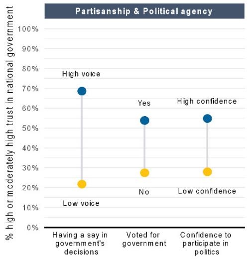

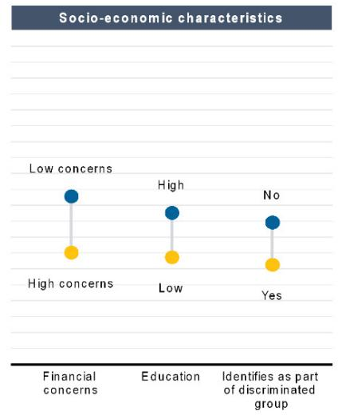

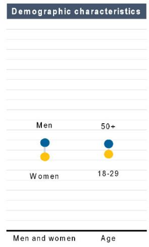  
Note: The figure presents the unweighted OECD averages of weighted OECD country averages of responses to the question "On a scale of 0 to 10, where 0 is not at all and 10 is completely, how much do you trust the national government?" by respondents' feelings of political agency, partisanship, socio-economic background and demographic characteristics. Shown here is the proportion that have "high or moderately high trust" based on the aggregation of responses from 6-10, grouped by respondents' feeling of political agency (feeling confident to have a say in what the government does, feeling confident to participate in politics) and partisanship (voted for government during last national elections), socio-economic background (financial concerns, education, identification as part of a discriminated group) and demographic characteristics (men and women, age groups). Financial concerns are measured by asking "In general, thinking about the next year or two, how concerned are you about your household's finances and overall social and economic well-being? and aggregating responses 3 (somewhat concerned) and 4 (very concerned)". Low education is defined as below upper secondary educational attainment and high education as tertiary education (ISCED 2011 classification). People's identification as part of a discriminated group is measured by responses "Yes" to the question "Would you describe yourself as being a member of a group that is discriminated against in [Country]?" New Zealand is excluded from the OECD average for partisanship as the survey question on voting for the current government was not included there due to political neutrality requirements.

Source: OECD Survey on Drivers of Trust in Public Institutions 2025.

## 2.2.1. Perceived political agency and partisanship most strongly correspond with levels of trust

The most pronounced trust gaps across OECD countries are observed along dimensions of perceived political agency and partisanship. This points to the importance of people's perceptions of political voice and their alignment with governing authorities in shaping trust in national government. The size of the trust gaps related to political agency and partisanship is broadly consistent with existing evidence showing that lower levels of perceived political empowerment are also associated with significantly lower confidence in institutions of a political nature (OECD, 2024[1]; OECD, 2022[2]).

StatLink https://stat.link/dtowha

More than two thirds of respondents (69%) across the OECD trust the national government when they believe people like them have a say in government decision-making, compared with only one fifth (22%) among those who feel they do not have a say - corresponding to a trust gap of 47 percentage points. The largest gaps are observed in Australia (60 percentage points), followed by Denmark and New Zealand (57 and 58, respectively), whereas the smallest gaps are recorded in Austria and Costa Rica (38 percentage points) and Chile (36 percentage points). In the five participating OECD accession candidate countries, the gap is largest in Brazil (53 percentage points) and smallest in Bulgaria (38 percentage points).

A similar pattern emerges when considering respondents who feel confident about participating in politics, however the gap is somewhat smaller. Around 55% of OECD respondents who feel confident about participating in politics report trusting the national government, compared with 28% of those who do not (Figure 2.2). This corresponds to a trust gap of 27 percentage points. The largest trust gap in the OECD is observed in Poland (44 percentage points), and the smallest is observed in Slovenia (13 percentage points). The gap is also comparatively small in Croatia and Peru (15 percentage points).

These trust gaps related to political agency—namely, the perceived ability to have a say in government decision-making and confidence in participating in politics—are substantial. Of particular concern is that a large share of people across OECD countries report low levels of political agency, and that this has shown little change over time.

Across the 19 countries surveyed in 2021, 2023 and 2025 for which the data point is available, only 31% (2021 and 2023) and 32% (2025) report that the political system allows them to have a say in government decision-making. Likewise, just 42% of respondents in 2021 and 40% in both 2023 and 2025 report feeling confident in their ability to participate in politics. These findings suggest that enhancing citizens' sense of political agency is an ongoing and challenging task for governments.

## Figure 2.2. People who feel they have political agency express higher trust in the national government

Share of population with high or moderately high trust in the national government by feeling they have a say in what the government does (blue) and confidence to participate in politics (yellow), 2025

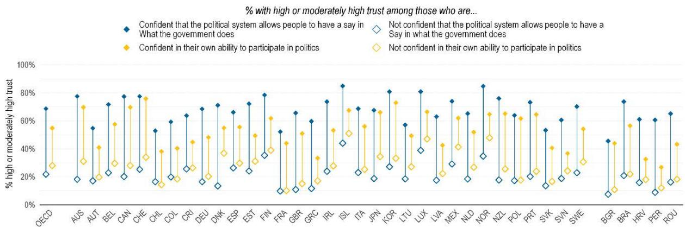  
Note: The figure presents the weighted country averages of responses to the question "On a scale of 0 to 10, where 0 is not at all and 10 is completely, how much do you trust the national government?" by respondents' feeling of having a say (blue) and confidence to participate in politics (yellow). Shown here is the proportion of respondents that have "high or moderately high trust" based on the aggregation of responses from 6-10 on the 0-10 response scale, grouped by whether respondents feel that people like them have a say (blue): "How much would you say the political system in [COUNTRY] allows people like you to have a say in what the government does?" and feel confident to be able to participate in politics (yellow): "How confident are you in your own ability to participate in politics?" "OECD" presents the unweighted average of weighted OECD country averages.  
Source: OECD Survey on Drivers of Trust in Public Institutions 2025.

Consistent with previous OECD survey waves in 2021 and 2023, perceptions of political agency are higher among people who voted or would have voted for a governing party than among those who did not, suggesting that political agency is associated with partisan alignment (OECD, 2022[2]; OECD, 2024[1]). But notably, and even more among those who have or would have voted for a governing party, only a

StatLink https://stat.link/tnev2f

minority feel they have a say or are confident to participate in politics. Among government supporters, 38% report believing that people like them have a say in government decision-making, compared to 25% of non-supporters. Similarly, 45% of supporters report feeling able to participate in politics, compared with 38% of non-supporters.

## Figure 2.3. Trust in the national government tends to be higher among voters for a current governing party

Share of population with high or moderately high trust in the national government by whether they voted for a party in power or not, 2025

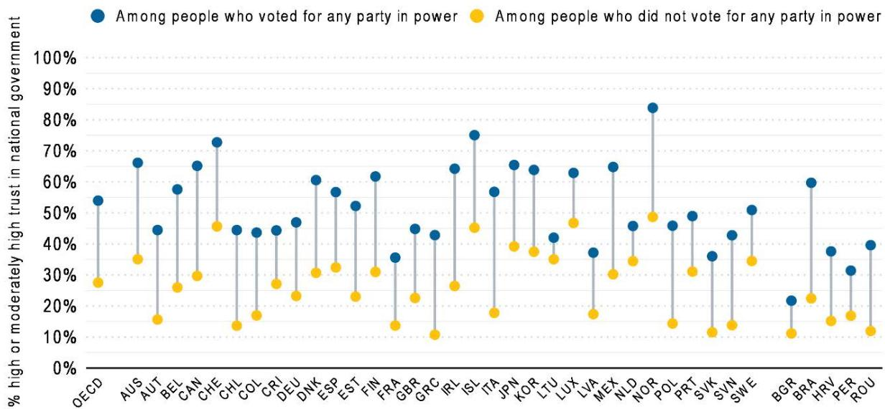  
Note: The figure presents the weighted country averages of responses to the question "On a scale of 0 to 10, where 0 is not at all and 10 is completely, how much do you trust the national government" by respondents' political alignment. Shown here is the proportion of respondents that have "high or moderately high trust" based on the aggregation of responses from 6-10 on the 0-10 response scale, grouped by whether people voted (or would have) voted for the government in power: "Is the party you voted for in the last national election on [DATE] currently part of the government?" or 'Is the party you would have most likely voted for in the last national election on [DATE] currently part of the government?' (depending on whether the respondent voted in the last national election). New Zealand is excluded from the figure as the survey question on voting for the current government was not included there due to political neutrality requirements. "OECD" presents the unweighted average of weighted OECD country averages.

Source: OECD Survey on Drivers of Trust in Public Institutions 2025.

These partisan differences in political agency are also mirrored in trust outcomes. As shown in Figure 2.3, on average 54% of respondents who voted for the governing party report trusting the national government, compared with only 28% among those who did not, implying a partisan trust gap of 26 percentage points. This gap is particularly large in Italy (39 percentage points) and Ireland (38 percentage points), while it is considerably smaller in Lithuania (7 percentage points) and the Netherlands (12 percentage points). In the participating OECD accession candidate countries, the gap is large in Brazil (38 percentage points) and substantially smaller in Bulgaria (11 percentage points).

Trust gaps associated with partisanship are perhaps unsurprising for political institutions, such as the national government or legislature. However, such

## StatLink https://stat.link/zcp9m0

gaps are less anticipated for administrative institutions such as the police or civil service, which are designed to operate on a non-partisan basis. Figure 2.4 shows that partisan trust gaps are present across all public institutions, although their magnitude varies substantially. For political institutions, partisan trust gaps are substantial. The gap amounts to 26 percentage points for the national government and 19 percentage points for the national legislature, and 18 percentage points for the regional government. It is somewhat smaller for political parties (15 percentage points) and local or municipal government (14 percentage points). Partisan trust gaps, however, also exist for institutions that are perceived as operating on a more neutral or administrative basis. These include the national civil service (a difference of 15 percentage points), the police (12 percentage points), and the regional civil service (12 percentage points).

## Figure 2.4. Institutional trust differs systematically by partisanship

Share of population with high or moderately high trust into different institutions by whether they voted or would have voted for a party in power or not, 2025

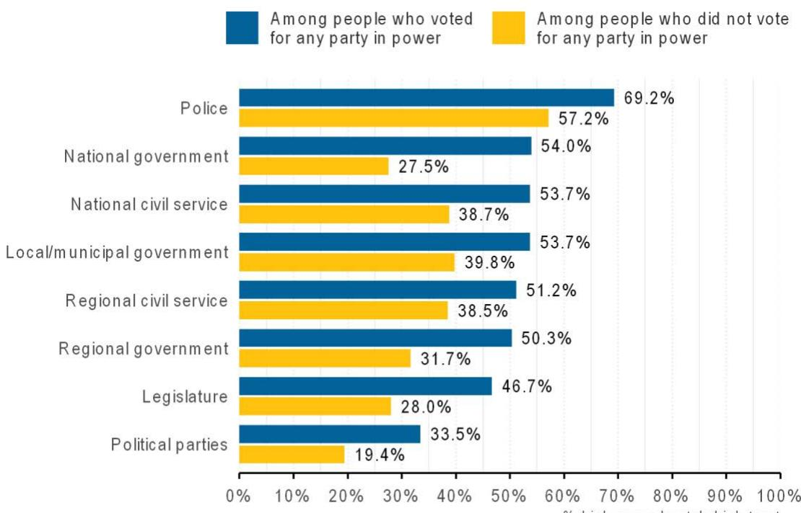

Note: The figure presents the unweighted OECD average of the weighted OECD country averages of responses to the question "On a scale of 0 to 10, where 0 is not at all and 10 is completely, how much do you trust [institution] by respondents' political alignment. Shown here is the proportion of respondents that have "high or moderately high trust" based on the aggregation of responses from 6-10 on the 0-10 response scale, grouped by whether people voted (or would have) voted for the government in power: "Is the party you voted for in the last national election on [DATE] currently part of the government?" or 'Is the party you would have most likely voted for in the last national election on [DATE] currently part of the government?' (depending on whether the respondent voted in the last national election). New Zealand is excluded from the OECD average as the survey question on voting for the current government was not included there due to political neutrality requirements.

Source: OECD Survey on Drivers of Trust in Public Institutions 2025.

StatLink https://stat.link/m6e25i

## Box 2.1. Do partisan differences in trust extend beyond political institutions?

Beyond identifying support for the current government in the most recent election, the OECD Trust Survey does not include measures of broader political preferences, such as respondents' ideological orientation (presented for example in (Esteban and Ray, 2011[3])). Differences in trust between supporters and non-supporters of a governing party therefore offer a proxy for examining how trust varies across political groups. While such differences are commonly observed with respect to political institutions, for example the national government, they are particularly relevant when observed for administrative institutions, such as the civil service. Trust in the national civil service is generally expected to reflect perceptions of professionalism, impartiality and performance rather than partisan alignment (OECD, 2025[4]). Large differences in trust between supporters and non-supporters of a governing party may suggest that political attitudes extend beyond political to administrative institutions that are expected to operate in a politically neutral manner (OECD, 2024[1]).

## Figure 2.5. Trust gaps in the civil service by partisanship have increased over time

Share of population with high or moderately high trust into the national civil service by whether they voted for a party in power or not, 2021, 2023 and 2025

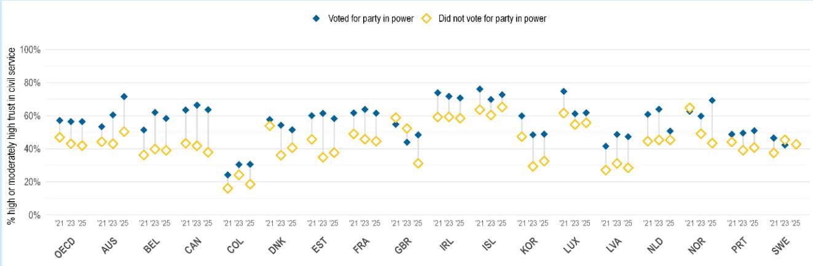

Note: The figure presents the weighted country averages of responses to the question "On a scale of 0 to 10, where 0 is not at all and 10 is completely, how much do you trust the national civil service" by respondents' political alignment. Shown here is the proportion of respondents that have "high or moderately high trust" based on the aggregation of responses from 6-10, grouped by whether people voted (or would have voted) for the government in power: Shown are 17 OECD countries that participated in all three survey waves and where information on partisan alignment is available for all three years. "OECD" presents the unweighted average of weighted OECD country averages.

Source: OECD Survey on Drivers of Trust in Public Institutions 2021, 2023 and 2025.

StatLink https://stat.link/idb45v

Partisan trust gaps with respect to the national civil service exist in nearly all OECD countries covered by the survey (Figure 2.5). On average, these gaps have also widened, from 10 percentage points in 2021, to 13 percentage points in 2023 and further to 15 percentage points in 2025. This widening is not driven by rising trust among government supporters, among whom trust levels remained broadly stable. Rather, it reflects declining trust among respondents who did not vote for the government, with trust levels falling from 47% in 2021 to 43% in 2023 and 42% in 2025. Such differences in trust across political groups may have broader implications for democratic governance, including most importantly for policy making and implementation.

As discussed in Box 2.1, partisan differences in trust in the national civil service warrant particular attention, as they may signal broader divergence in trust across political groups, meaning that supporters of different political parties express systematically different levels of trust in public institutions and not only into the national government or national legislature.

## 2.2.2. Lower socio-economic status is associated with lower trust in public institutions

Socio-economic characteristics are associated with smaller trust gaps in national government than those linked to political agency and partisanship. The most pronounced disparities refer to financial concerns, while differences related to self-identified membership of a discriminated-against group and educational attainment are evident but comparatively smaller. At the same time, socio-economic characteristics are often closely interrelated. For instance, individuals who identify as belonging to a group that experiences discrimination are also more likely to report financial concerns; the share reporting financial concerns is 13 percentage points higher compared to those who do not identify this way. Despite these overlaps, examining trust gaps separately across each dimension remains informative, as it helps identify which socio-economics factors are most strongly associated with differences in trust in the national government.

Figure 2.6 shows that perceived financial insecurity is one factor that significantly affects trust in the national government. Of the socio-economic characteristics examined, financial concerns are associated with the largest trust gaps in national government. One half of respondents (53%) without financial concerns trust the national government, but only one third (35%) of those experiencing financial concerns trust the national government, yielding a substantial trust gap of 18 percentage points (Figure 2.6). Respondents with financial concerns are also more likely to identify economic pressures as a major issue. For example, 57% of people cite inflation as a major concern, compared to 44% of those without financial concerns. Those with financial concerns are also less optimistic about receiving financial support in the event of an economic crisis (36% find this likely, compared to 53% of those without concerns) (see Chapter 4).

There is, however, substantial cross-country variation in the trust gap associated with financial concerns. The largest gaps are observed in Ireland (33 percentage points), Portugal (28 percentage points) and Greece (27 percentage points). By contrast, the smallest gaps are found in France (eight percentage points), the United Kingdom (eight percentage points) as well as Croatia (10 percentage points).

## Figure 2.6. Across all countries, fewer people with financial concerns trust the national government

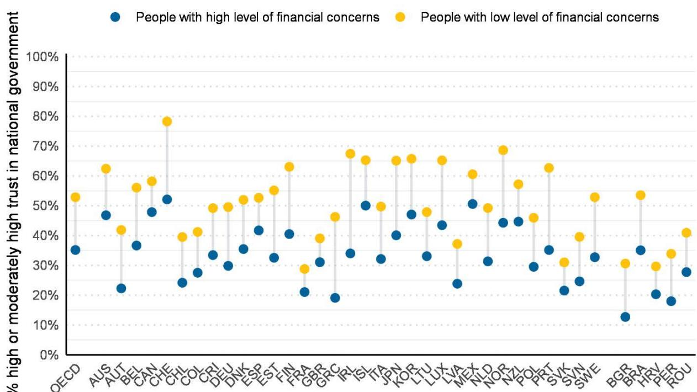  
Note: The figure presents the weighted country averages of responses to the question "On a scale of 0 to 10, where 0 is not at all and 10 is completely, how much do you trust the national government?". Shown here is the proportion of respondents that have "high or moderately high trust" based on the aggregation of responses from 6-10 on the 0-10 response scale, grouped by whether individuals responded 3 or 4 (somewhat or very concerned concerned) or 1 and 2 (not at all or little concerned) to the question "In general, thinking about the next year or two, how concerned are you about your household's finances and overall social and economic well-being?". "OECD" presents the unweighted average of weighted OECD country averages.  
Source: OECD Survey on Drivers of Trust in Public Institutions 2025.

Educational attainment also corresponds with trust. $^{1}$ For the purpose of this analysis, the comparison focuses on respondents with low levels of education (no upper secondary degree) and those with high levels of education (post-secondary degree). Respondents with upper secondary / high school education (medium level of education) are excluded for this comparison, as they fall between the other two levels and trust disparities are most pronounced between the lowest and highest education group. The full set of results, including the middle education group, is reported in Table 2.1 at the end of the chapter.

Figure 2.7 shows that 48% of respondents across the OECD who completed a post-secondary degree (i.e. a further degree after upper secondary/high school) trust the national government compared to 34% of respondents who did not graduate from upper secondary school. This amounts to an education trust

StatLink https://stat.link/nh9x2p

gap of 14 percentage points. The education trust gap varies substantially across countries and is particularly large in Switzerland (35 percentage points), Portugal and the United Kingdom (both 31 percentage points). By contrast, trust in the national government is higher among respondents with lower levels of education for example in Mexico (eighteen percentage points) and Bulgaria (seven percentage points).

These cross-sectional differences occur against a backdrop of consistently increasing educational attainment. By 2024, nearly half (48%) of young adults had completed tertiary education – up from 27% in 2000 – and this figure is expected to rise further on average across the OECD (OECD, 2025[5]). Given the positive correlation between education and trust, the ongoing increase in educational attainment could lead to higher overall levels of trust over time. However, this does not necessarily imply a reduction in trust disparities between educational groups in the long run.

## Figure 2.7. People with lower educational attainment almost universally have lower trust in government

Share of population with high or moderately high trust in the national government by education group, 2025  
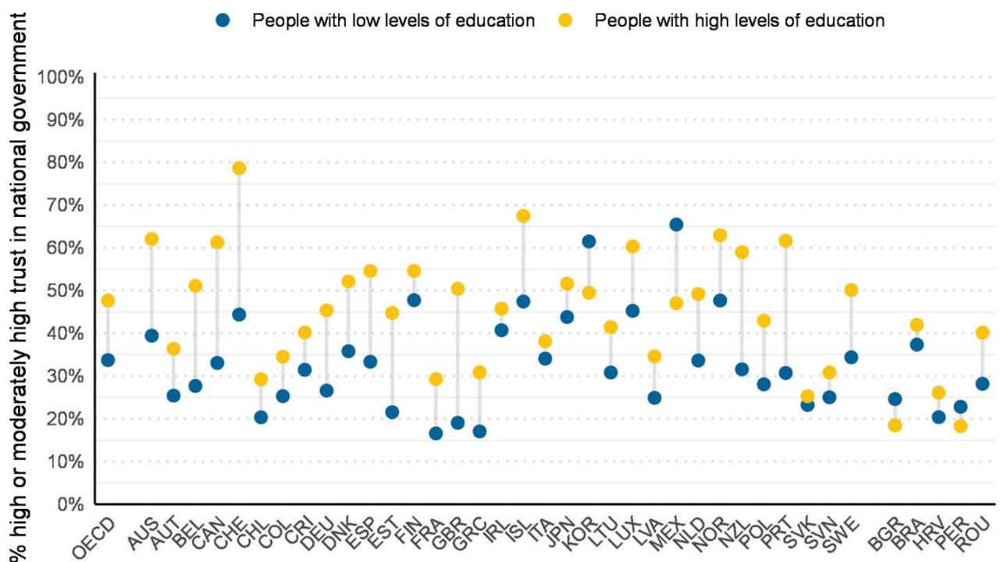  
Note: The figure presents the weighted country averages of responses to the question 'On a scale of 0 to 10, where 0 is not at all and 10 is completely, how much do you trust the national government?'. Shown here is the proportion of respondents that have 'high or moderately high trust' based on the aggregation of responses from 6-10 on the 0-10 response scale, grouped by respondents' highest education level attained: higher education (post-secondary degree) or lower education (no upper-secondary degree). "OECD" presents the unweighted average of weighted OECD country averages.  
Source: OECD Survey on Drivers of Trust in Public Institutions 2025.

The trust gap associated with perceived discrimination is similar to the education trust gap. In the OECD, only 31% of people who identify as a member of a discriminated-against group trust the national government, compared to 45% of people who do not identify this way (Figure 2.8). $^{2}$ This corresponds to a gap of 14 percentage points. These results are consistent with previous findings that suggest people self-identifying as belonging to a marginalised group may feel excluded from political processes and perceive public institutions as less responsive or accessible (OECD, 2025 $^{[4]}$ ; Tyrberg, 2024 $^{[6]}$ ).

StatLink https://stat.link/7dts5h

However, there is considerable cross-country variation in the magnitude of this gap. The gap is particularly large in Estonia (24 percentage points) and Luxembourg (26 percentage points), while it is negligible in Brazil (two percentage points) and Colombia (one percentage point). Japan is the only participating country where the share with high or moderately high trust in the national government is higher among respondents who identify as part of a discriminated-against group, with a trust gap of seven percentage points.

Figure 2.8. Trust in national government of those self-identifying as belonging to a discriminated group varies consistently across countries

Share of respondents with high or moderately high trust in the national government by those self-identifying as belonging to a discriminated group, 2025

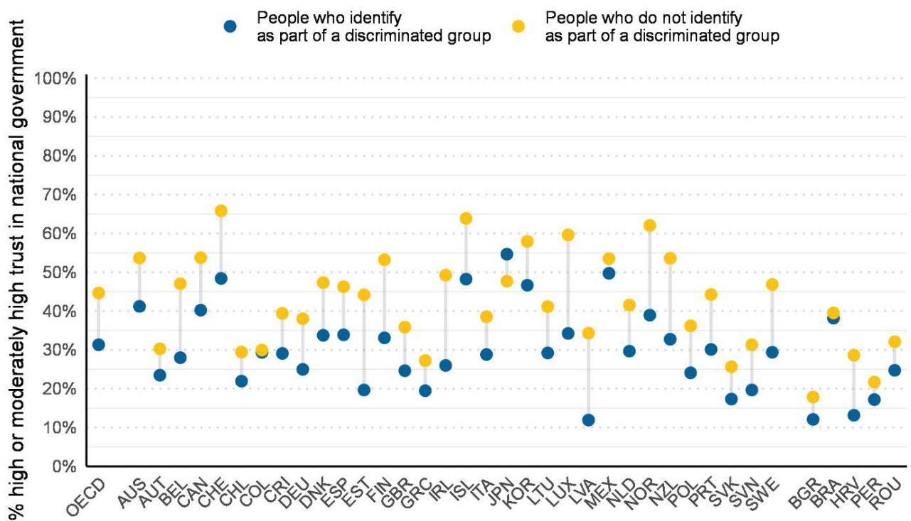  
Note: The figure presents the weighted country averages of responses to the question "On a scale from 0 to 10, where 0 is not at all and 10 is completely, in general how much do you trust the government?" by respondents' perceptions of belonging to a discriminated group. Shown here is the proportion of respondents that have "high or moderately high trust" based on the aggregation of responses from 6-10 on the 0-10 response scale, grouped by whether respondents stated whether they feel they belong to a discriminated group: "Would you describe yourself as being a member of a group that is discriminated against in [COUNTRY]?" "OECD" presents the unweighted average of weighted OECD country averages.

Source: OECD Survey on Drivers of Trust in Public Institutions 2025.

Taken together, these findings emphasise the significance of socio-economic factors in shaping trust in government. Although these characteristics are correlated, regression analysis shows that each factor remains statistically significant when demographic,

StatLink https://stat.link/hxepka

socioeconomic and political variables are controlled for simultaneously. $^{3}$ In other words, perceived financial concerns, perceived discrimination and education levels each contribute to variation in trust.

## Box 2.2. Institutional trust varies substantially by levels of interpersonal trust

Across the OECD, respondents with low levels of interpersonal trust – i.e., trust in other people – report substantially lower confidence in all public institutions. However, the size of the gap differs markedly between institutions perceived as neutral and implementation-oriented and those that are explicitly political and representational. For example, among respondents with high interpersonal trust, 75% report trusting the police compared with 38% among those with low interpersonal trust. Trust in the national government shows an even larger gap, falling from 54% to 14% between these two groups (Figure 2.9). In relative terms, individuals with high interpersonal trust are roughly twice as likely as those with low interpersonal trust to trust the police and four times as likely to trust the national government. This gradient suggests that interpersonal trust serves as a baseline through which institutions are evaluated. Institutions perceived as impartial rule enforcers tend to sustain comparatively higher confidence, even among more sceptical individuals (Rothstein and Teorell, 2008[7]). Political institutions, by contrast, are more closely associated with contestation and discretionary authority, so confidence in them depends more strongly on prior beliefs about the trustworthiness of others and the fairness of the system, amplifying interpersonal trust divides (Hwang, 2017[8]).

Figure 2.9. Trust gaps by interpersonal trust are comparatively larger for political institutions, 2025

Share of population with high or moderately high trust into different institutions dependent on respondents' interpersonal trust levels, OECD 2025

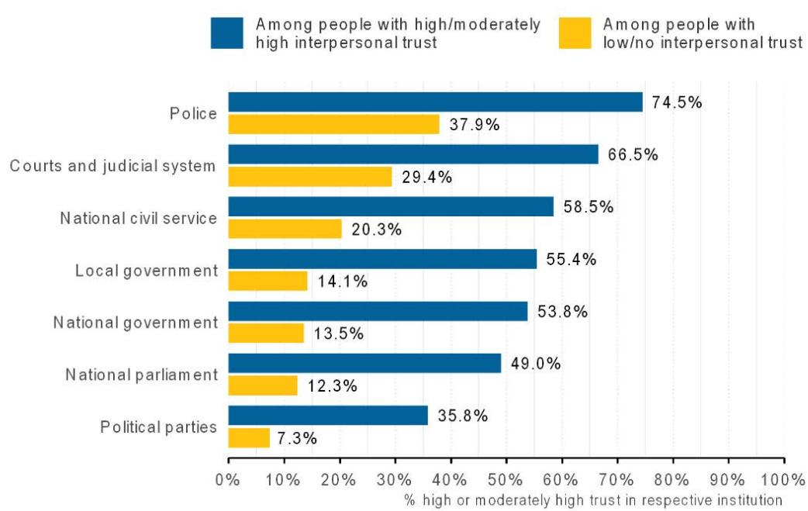

Note: The figure presents the unweighted OECD average of the weighted OECD country averages of responses to the question 'On a scale of 0 to 10, where 0 is not at all and 10 is completely, how much do you trust the following [Institution]?'. Shown here is the proportion of respondents that have 'high or moderately high interpersonal trust' based on the aggregation of responses from 6-10 on the 0-10 response scale or 'low or no interpersonal trust' based on the aggregation of responses from 0-4 on the 0-10 scale to the question 'On a scale from 0 to 10, where 0 is not at all and 10 is completely, in general how much do you trust most people?'. Source: OECD Survey on Drivers of Trust in Public Institutions 2025.

StatLink https://stat.link/qynzgp

## 2.2.3. The smallest trust gaps are associated with demographic characteristics

Looking more closely at demographic differences, trust in national government varies to a comparatively small extent between men and women. 44% of men in OECD countries place high or moderately high trust the national government, compared to 37% of women – resulting in a trust gap of seven percentage points (Figure 2.10). The largest of these trust gaps is found in New Zealand with 24 percentage points, while there is no trust gap in Estonia and Latvia. In three countries, the pattern is reversed, with women reporting higher levels of trust than men. This applies to Norway (six percentage points), Iceland (five percentage points) as well as Brazil (four percentage points).

A closer examination shows that the trust gap between men and women is more pronounced among younger and middle-aged respondents. $^{4}$ Trust levels among men in the OECD are relatively stable across age groups, ranging from 44% among younger respondents (aged 18-29) to 42% among those aged 30-49 and 45% among older respondents (50 and above). For women in the OECD, by contrast, trust is highest among those aged 50 and above (41%), compared with 32% among middle-aged women (30-49) and 34% among younger women (18-29). As a result, the difference in trust in the national government between men and women is wider among younger respondents (ten percentage points) and middle-aged respondents (ten percentage points) than among older ones (four percentage points).

Figure 2.10. Men tend to trust the national government more than women do  
Share of men and of women with high or moderately high trust in the national government, 2025  
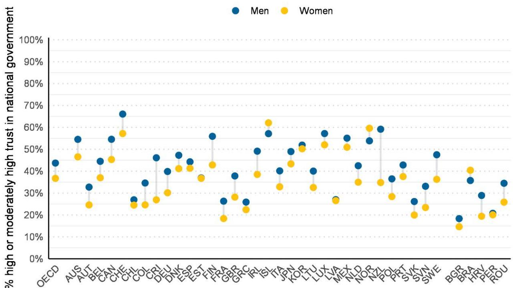

Note: The figure presents the weighted country averages of responses to the "On a scale of 0 to 10, where 0 is not at all and 10 is completely, how much do you trust the national government?" for people of different age groups. Shown here is the proportion of respondents that have "high or moderately high trust" based on the aggregation of responses from 6-10 on the 0-10 response scale, grouped by their age. "OECD" presents the unweighted average of weighted OECD country averages.
Source: OECD Survey on Drivers of Trust in Public Institutions 2025.

StatLink https://stat.link/a06lyr

Age likewise is associated with a modest trust gap. Across OECD countries, 43% of respondents aged 50 and above report trusting the national government, compared with 37% among those aged 30–49 and 38% among those aged 18–29 (Figure 2.11). This corresponds to a five-percentage-point difference between the oldest and youngest generation. The pattern of lower trust in the national government among younger respondents compared with older ones holds in 23 OECD countries. However, several countries display the opposite pattern, with higher trust among younger people: In the OECD, these are Australia, Chile, France, Japan, the Netherlands and the United Kingdom. In Australia, for example, 60% of those aged 18-29 and 45% among those aged 50 and above have high or moderately high trust in the national government. In the five participating OECD accession candidate countries, the level of trust among younger people is also higher than among older people in Bulgaria and Peru.

## Figure 2.11. Trust in the national government is usually higher among older people

Share of respondents with high or moderately high trust in the national government by respondent's age group, 2025

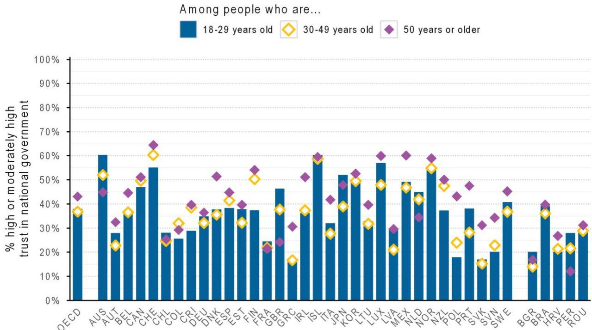

Note: The figure presents weighted country averages of responses to the "On a scale of 0 to 10, how confident are you that the national government adequately balances the interests of current and future generations?" by respondents' age. Shown here is the proportion of respondents that are "confident" based on the aggregation of responses from 6-10 on the 0-10 response scale, grouped by three age groups: 1) 18-29; 2) 30-49; 3) 50 and above. "OECD" presents the unweighted average of weighted OECD country averages.
Source: OECD Survey on Drivers of Trust in Public Institutions 2025.

StatLink https://stat.link/7gz6c9

2.2.4. Many trust gaps have remained broadly stable since 2021, but the educational trust gap is widening and the age-related trust gap is narrowing

Differences between population groups often reflect enduring predispositions shaped through early socialization processes (van der Meer, la Roi and van Alebeek, 2025[9]). While individuals' trust may increase or decrease later in life in response to political or institutional developments, these shifts often leave relative differences between groups intact. Consequently, trust gaps may be resistant to short-term change, even when aggregate trust fluctuates.

Figure 2.12. Trust gaps remain broadly stable over time, with narrowing age differences and widening education divides

Share of population with high or moderately high trust in the national government by level of respondents' socioeconomic and demographic characteristics, partisanship and political agency, 2021, 2023 and 2025

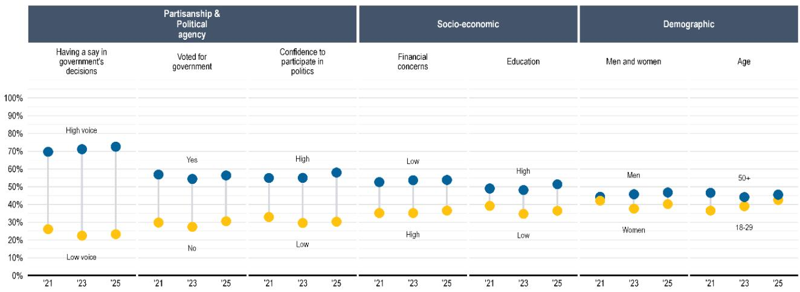

Note: The figure presents the unweighted average of weighted OECD country averages of responses to the question "On a scale of 0 to 10, where 0 is not at all and 10 is completely, how much do you trust the national government?" by respondents' feelings of political agency, partisanship, socio-economic background and demographic characteristics. Shown here is the proportion that have "high or moderately high trust" based on the aggregation of responses from 6-10 on the 0-10 response scale, grouped by respondents' feeling of political agency (feeling confident to have a say in what the government does, feeling confident to participate in politics) and partisanship (voted for government during last national elections), socio-economic background (financial concerns, education, identification as part of a discriminated group) and demographic characteristics (men and women, age group). Financial concerns are measured by asking "In general, thinking about the next year or two, how concerned are you about your household's finances and overall social and economic well-being?" and aggregating responses 3 (somewhat concerned) and 4 (very concerned). Low education is defined as below upper secondary educational attainment and high education as tertiary education, following the ISCED 2011 classification. People's identification of a discriminated group is measured by responses "Yes" to the question "Would you describe yourself as being a member of a group that is discriminated against in [Country]?" The figure shows changes over time for all countries where relevant information is available in 2021, 2023 and 2025. Source: OECD Survey on Drivers of Trust in Public Institutions 2021, 2023 and 2025.

StatLink https://stat.link/1x57tz

Consistent with this expectation, trust gaps across population groups tend to persist. To ensure comparability over time, the longitudinal analysis presented in this section includes only those 18 OECD countries for which consistent data on trust and population group characteristics are available across survey waves. For completeness, Table 2.1 reports trust gaps not only for these 18 countries but also for the 29 countries that participated in both the 2023 and 2025 survey waves.

Figure 2.12 shows that most trust gaps have remained broadly stable between 2021 and 2025. The relative ranking of gaps has also remained largely unchanged, with the largest differences consistently observed for political agency and partisanship. At the same time, the magnitude of specific gaps within these categories has evolved to a limited extent for some population groups, in particular with regard to age, education, and political agency.

The only trust gap that has constantly decreased over time is defined by age. The age-related trust gap, which reflects higher levels of trust among respondents aged 50 and over compared to those aged 18–29, has declined markedly, falling from ten percentage points in 2021 to four in 2023 and then to just two in 2025. This is driven by rising trust among younger respondents coupled with a slight decrease among older people. In 2021, 37% of 18–29-year-old respondents reported trusting the national government. This figure increased to 39% in 2023 and 42% in 2025. Trust among older respondents decreased slightly, falling from 47% in 2021 to 43% in 2023 and then to 44% in 2025.

Unlike the convergence observed in the age-related trust gap, trust gaps with regard to political agency have widened over time. These trends point to a gradual widening of the trust divide between individuals who perceive themselves as politically empowered and those who do not. The trust gap relating to confidence in participating in politics has steadily widened over time, growing from 22 percentage points in 2021 to 25 in 2023 and 27 in 2025. By contrast, the trust gap relating to having a say in government decision-making primarily increased between 2021 (44%) and 2023 (48%), remaining stable since then at 48% in 2025.

An even more pronounced increase in trust gaps is observed with regard to educational attainment. The trust gap between respondents with high and low levels of education increased from 10 percentage points in 2021 to 13 percentage points in 2023 and 16 percentage points in 2025. With regard to the national government, this represents the largest widening of trust disparities observed across all population groups analysed in this chapter. Importantly, this trend is not limited to trust in the national government. A similar pattern is evident for trust in the national parliament, where the education-related gap grew from ten percentage points in 2021 to 14 in 2023 and 17 in 2025 (see Chapter 7).

The widening gap in trust in the national government is in parts driven by declining trust among respondents with lower levels of education. While trust among highly educated respondents remained relatively stable (49% in 2021, 47% in 2023 and 51% in 2025), the share of lower-educated respondents expressing trust fell from 39% in 2021 to 34% in 2023, with only a modest recovery to 35% in 2025. These differences may reflect variations in how individuals' access and interpret information (OECD, 2024[10]). Differences in literacy and critical thinking, related to education, may influence how people engage with digital and social media environments. In return, this could have implications for trust, in particular among those with lower levels of education.

There is, nonetheless, considerable cross-country variation in this gap (Figure 2.13). In Portugal, for example, the education-related trust gap increased steadily, from 11% in 2021 to 14% in 2023 and 31% in 2025. By contrast, the gap decreased in Norway, falling from 21% in 2021 to 20% in 2023 and 15% in 2025. In the United Kingdom, the relationship between education and trust has shifted over time: In 2021 and 2023, respondents with lower levels of education reported higher levels of trust in the national government, with an eight percentage point gap in 2021 and a seven-percentage-point gap in 2023. By 2025, the situation had reversed, with those with higher levels of education reporting higher trust, resulting in a 31-percentage-point gap.

Figure 2.13. Education-related trust gaps are widening over time, but with substantial variation across countries

Share of population with high or moderately high trust in the national government by level of respondents' education, 2021, 2023 and 2025

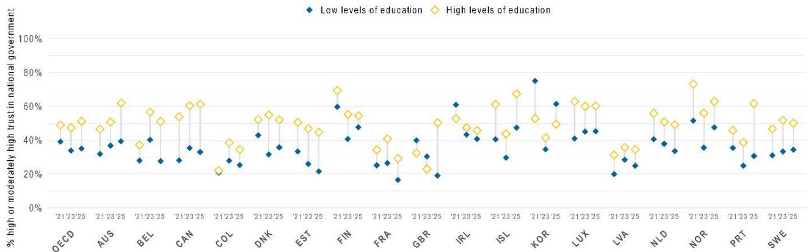  
Note: The figure presents the weighted country averages of responses to the question "On a scale of 0 to 10, where 0 is not at all and 10 is completely, how much do you trust the national government?" by respondents' level of education, grouped by respondents' highest education level attained: higher education (post-secondary education degree) or lower education (no upper-secondary education degree). The figure shows changes over time for all countries where relevant information is available in 2021, 2023 and 2025. "OECD" presents the unweighted average of weighted OECD country averages.  
Source: OECD Survey on Drivers of Trust in Public Institutions 2021, 2023 and 2025.

## 2.3. AREAS FOR POLICY ACTION TO ENHANCE TRUST

The following measures could serve to improve trust in public institutions across different population groups:

\- Reinforce perceptions of political agency and responsiveness, while expanding opportunities for participation. The share among individuals who feel that people like them have a say in government decisions who trust the national government is more than three times as high as among those who feel they lack voice. As is also demonstrated by regression results (see Chapter 1), strengthening the perceptions of political agency could be a powerful lever to improve institutional trust. At the same time, these perceptions are shaped by the extent to which individuals have real opportunities to participate in decision making and feel heard by decisionmakers. Expanding accessible channels for public participation – and meaningful responses from policymakers – can therefore help strengthen both perceived and actual political agency. Chapter 6 provides more detailed insights into the perceived

StatLink https://stat.link/7jwdpt

barriers to political participation and impact and the potential policy actions that can be taken to address them.

\- Strengthen the perception of neutrality of administrative institutions. In order to prevent partisan divides from eroding broader institutional confidence, governments could consider ways to reinforce perceptions of the neutrality, transparency and accountability of public institutions. This may include safeguarding the independence of oversight bodies, strengthening integrity frameworks, and promoting structured cross-partisan dialogue.

\- Strengthen the involvement of socio-economically disadvantaged groups in policymaking processes. Trust levels are lower among individuals with financial concerns, those who identify as belonging to a discriminated-against group, and those with lower levels of education. To improve public trust among these population groups, policies aimed at better reaching them, enhancing their participation in the political process and making them “feel heard” may help to narrow trust disparities.

## Table 2.1. Evolution of trust gaps across different population groups over time

Share of respondents that trust the national government by subgroup in 2021, 2023 and 2025

<table><tr><td>Country group</td><td>2021</td><td>2023</td><td>2025</td><td>2021</td><td>2023</td><td>2025</td><td>2021</td><td>2023</td><td>2025</td></tr><tr><td></td><td colspan="3">Feeling to have say in government decision</td><td colspan="3">Feeling to not have say in government</td><td colspan="3">Trust Gaps</td></tr><tr><td>OECD (all countries)</td><td>68%</td><td>70%</td><td>69%</td><td>25%</td><td>22%</td><td>22%</td><td>43 p.p.</td><td>48 p.p.</td><td>47 p.p.</td></tr><tr><td>OECD (29 countries)</td><td>-</td><td>70%</td><td>70%</td><td>-</td><td>22%</td><td>22%</td><td></td><td>48 p.p.</td><td>48 p.p.</td></tr><tr><td>OECD (18 countries)</td><td>70%</td><td>71%</td><td>72%</td><td>26%</td><td>23%</td><td>24%</td><td>44 p.p.</td><td>48 p.p.</td><td>48 p.p.</td></tr><tr><td></td><td colspan="3">Feeling confident to participate in politics</td><td colspan="3">Not feeling confident about participating</td><td colspan="3">Trust Gaps</td></tr><tr><td>OECD (all countries)</td><td>53%</td><td>54%</td><td>55%</td><td>32%</td><td>28%</td><td>28%</td><td>21 p.p.</td><td>26 p.p.</td><td>27 p.p.</td></tr><tr><td>OECD (29 countries)</td><td>-</td><td>54%</td><td>55%</td><td>-</td><td>28%</td><td>29%</td><td>-</td><td>26 p.p.</td><td>26 p.p.</td></tr><tr><td>OECD (18 countries)</td><td>55%</td><td>55%</td><td>58%</td><td>33%</td><td>30%</td><td>31%</td><td>22 p.p.</td><td>25 p.p.</td><td>27 p.p.</td></tr><tr><td></td><td colspan="3">(Would have) voted for the current</td><td colspan="3">(Would) not (have) voted for the current</td><td colspan="3">Trust gaps</td></tr><tr><td>OECD (all countries)</td><td>55%</td><td>54%</td><td>54%</td><td>28%</td><td>27%</td><td>28%</td><td>27 p.p.</td><td>27 p.p.</td><td>26 p.p.</td></tr><tr><td>OECD (28 countries)</td><td>-</td><td>54%</td><td>55%</td><td>-</td><td>27%</td><td>28%</td><td>-</td><td>27 p.p.</td><td>27 p.p.</td></tr><tr><td>OECD (17 countries)</td><td>57%</td><td>54%</td><td>56%</td><td>30%</td><td>27%</td><td>31%</td><td>27 p.p.</td><td>27 p.p.</td><td>25 p.p.</td></tr><tr><td></td><td colspan="3">Less financial concerns</td><td colspan="3">More financial concerns</td><td colspan="3">Trust gaps</td></tr><tr><td>OECD (all countries)</td><td>50%</td><td>52%</td><td>53%</td><td>34%</td><td>36%</td><td>35%</td><td>16 p.p.</td><td>16 p.p.</td><td>18 p.p.</td></tr><tr><td>OECD (29 countries)</td><td>-</td><td>52%</td><td>53%</td><td>-</td><td>36%</td><td>36%</td><td>-</td><td>16 p.p.</td><td>17 p.p.</td></tr><tr><td>OECD (18 countries)</td><td>53%</td><td>53%</td><td>54%</td><td>35%</td><td>35%</td><td>36%</td><td>18 p.p.</td><td>18 p.p.</td><td>18 p.p.</td></tr><tr><td></td><td colspan="3">High education</td><td colspan="3">Low education</td><td colspan="3">Trust gaps</td></tr><tr><td>OECD (all countries)</td><td>47%</td><td>47%</td><td>48%</td><td>38%</td><td>34%</td><td>34%</td><td>9 p.p.</td><td>13 p.p.</td><td>14 p.p.</td></tr><tr><td>OECD (29 countries)</td><td>-</td><td>47%</td><td>48%</td><td>-</td><td>34%</td><td>34%</td><td>-</td><td>13 p.p.</td><td>14 p.p.</td></tr><tr><td>OECD (18 countries)</td><td>49%</td><td>47%</td><td>51%</td><td>39%</td><td>34%</td><td>35%</td><td>10 p.p.</td><td>13 p.p.</td><td>16 p.p.</td></tr><tr><td></td><td colspan="3">High education</td><td colspan="3">Medium education</td><td colspan="3">Trust Gaps</td></tr><tr><td>OECD (all countries)</td><td>47%</td><td>47%</td><td>48%</td><td>39%</td><td>38%</td><td>38%</td><td>8 p.p.</td><td>9 p.p.</td><td>10 p.p.</td></tr><tr><td>OECD (29 countries)</td><td>-</td><td>47%</td><td>48%</td><td>-</td><td>38%</td><td>38%</td><td>-</td><td>9 p.p.</td><td>10 p.p.</td></tr><tr><td>OECD (18 countries)</td><td>49%</td><td>47%</td><td>51%</td><td>40%</td><td>38%</td><td>39%</td><td>9 p.p.</td><td>9 p.p.</td><td>12 p.p.</td></tr><tr><td></td><td colspan="3">Feeling discriminated</td><td colspan="3">Not feeling discriminated</td><td colspan="3">Trust gaps</td></tr><tr><td>OECD (all countries)</td><td>-</td><td>30%</td><td>31%</td><td>-</td><td>44%</td><td>45%</td><td>-</td><td>-14 p.p.</td><td>-14 p.p.</td></tr><tr><td>OECD (28 countries)</td><td>-</td><td>30%</td><td>31%</td><td>-</td><td>44%</td><td>46%</td><td>-</td><td>-14 p.p.</td><td>-15 p.p.</td></tr><tr><td>OECD (18 countries)</td><td>-</td><td>-</td><td>-</td><td>-</td><td>-</td><td>-</td><td>-</td><td>-</td><td>-</td></tr><tr><td></td><td colspan="3">Women</td><td colspan="3">Men</td><td colspan="3">Trust gaps</td></tr><tr><td>OECD (all countries)</td><td>40%</td><td>36%</td><td>37%</td><td>43%</td><td>44%</td><td>44%</td><td>-3 p.p.</td><td>-8 p.p.</td><td>-7 p.p.</td></tr><tr><td>OECD (29 countries)</td><td>-</td><td>36%</td><td>37%</td><td>-</td><td>44%</td><td>44%</td><td>-</td><td>-8 p.p.</td><td>-7 p.p.</td></tr><tr><td>OECD (18 countries)</td><td>42%</td><td>37%</td><td>40%</td><td>44%</td><td>45%</td><td>46%</td><td>-2 p.p.</td><td>-7 p.p.</td><td>-6 p.p.</td></tr><tr><td></td><td colspan="3">Age 18-29</td><td colspan="3">Age 50+</td><td colspan="3">Trust gaps</td></tr><tr><td>OECD (all countries)</td><td>35%</td><td>36%</td><td>38%</td><td>45%</td><td>43%</td><td>43%</td><td>-10 p.p.</td><td>-7 p.p.</td><td>-5 p.p.</td></tr><tr><td>OECD (29 countries)</td><td>-</td><td>36%</td><td>39%</td><td>-</td><td>43%</td><td>44%</td><td>-</td><td>-7 p.p.</td><td>-5 p.p.</td></tr><tr><td>OECD (18 countries)</td><td>37%</td><td>39%</td><td>42%</td><td>47%</td><td>43%</td><td>44%</td><td>-10 p.p.</td><td>-4 p.p.</td><td>-2 p.p.</td></tr></table>

Note: The table presents how trust in the national government varies across different population sub-groups. It highlights differences between individuals who believe they have a say in what the government does compared to those who do not, between those who feel confident to participate in politics and those who do not (both defined as political agency gap); between those who voted for a party in power and those who did not (partisan gap); and between individuals who are not concerned about their financial well-being and those who are (financial concern gap). It also compares trust levels between individuals with tertiary education and those without (education gap), between men and women, and between older respondents (50 years and above) and younger respondents (18–29 years old) (age gap). Trust in the government is measured on a 0 to 10 scale, where 6 to 10 correspond to expressing moderately high to high trust in the government. Voted for a party in power is measured as people that have voted for the party currently in power or would vote for the party currently in power. Being concerned about financial well-being is measured on a 0 to 4 scale, where 3 to 4 correspond to people that are concerned about their financial wellbeing. "OECD (all countries)" refers to all countries participating in the OECD Trust Survey in a given wave; "OECD (29 countries)" refers to the countries participating in both 2023 and 2025; and "OECD (18 countries)" refers to those participating in 2021, 2023 and 2025. Please note that 20 countries participated in 2021, 2023 and 2025, but for Finland and Mexico, "Trust in national government" was not asked in 2021 implying that trust gaps are only available for 18 OECD countries. All reported averages are unweighted means across the respective country groups.
Source: OECD Survey on Drivers of Trust in Public Institutions 2021, 2023 and 2025.

## REFERENCES

Esteban, J. and D. Ray (2011), "Linking Conflict to Inequality and Polarization", American Economic Review, Vol. 101/4, pp. 1345-1374, https://doi.org/10.1257/aer.101.4.1345.

Hwang, I. (2017), "Which Type of Trust Matters?: Interpersonal vs. Institutional vs. Political Trust", Economic Research Institute, Working Papers 2017-15.

OECD (2025), Education at a Glance 2025: OECD Indicators, OECD Publishing, Paris, https://doi.org/10.1787/1c0d9c79-en.

OECD (2025), OECD Survey on Drivers of Trust in Public Institutions in Latin America and the Caribbean [4] 2025 Results, OECD Publishing, Paris, https://doi.org/10.1787/ea3385cf-en.

OECD (2024), OECD Survey on Drivers of Trust in Public Institutions – 2024 Results: Building Trust in a Complex Policy Environment, OECD Publishing, Paris, https://doi.org/10.1787/9a20554b-en. [1]

OECD (2024), What Does Child Empowerment Mean Today?: Implications for Education and Well-being, Educational Research and Innovation, OECD Publishing, Paris, https://doi.org/10.1787/8f80ce38-en. [10]

OECD (2022), Building Trust to Reinforce Democracy: Main Findings from the 2021 OECD Survey on Drivers of Trust in Public Institutions, Building Trust in Public Institutions, OECD Publishing, Paris, https://doi.org/10.1787/b407f99c-en.

Rothstein, B. and J. Teorell (2008), "What is quality of government? A theory of impartial government institutions", Governance, Vol. 21/2, pp. 165-190, https://doi.org/10.1111/j.1468-0491.2008.00391.x. [7]

Tyrberg, M. (2024), "The impact of discrimination and support on immigrant trust and belonging", [6] European Political Science Review, Vol. 16/1, pp. 18-34, https://doi.org/10.1017/S1755773923000139.

van der Meer, T., C. la Roi and C. van Alebeek (2025), "Socialized to (Dis)trust? A Panel Study into the Origins of Dispositional Institutional Trust", Social Indicators Research, Vol. 178, pp. 371-391, https://doi.org/10.1007/s11205-025-03564-3.

$^{1}$ It should be noted that, for Bulgaria, Costa Rica and Croatia, the quota for respondents with lower levels of education (i.e. those without an upper secondary education) was not met in 2025, even after applying post-stratification weights. Similar, the education quotas for lower education were not met in Chile, Costa Rica, Colombia, Denmark, Greece, Estonia, Portugal, and South Korea in 2023. Also, the education quotas in Estonia, Finland, Ireland, Latvia, Luxembourg, New Zealand and Norway were not met in 2021. Therefore, for these countries and years, the results presented need to be taken with caution.

$^{2}$ The question about self-identified belonging to a discriminated-against group was based on a question in the European Social Survey (ESS). In the ESS, it is followed-up by a question of on what the group is discriminated against, with answer options including colour or race, nationality, religion, language etc. The composition of the group of respondents who identify as part of a discriminated-against group is likely to vary from country to country. Due to space constraints and the difficulty of achieving consistent estimates for small population groups given the 2 000 respondents sample size, such a follow-up question was omitted in the OECD Trust Survey.

$^{3}$ More specifically, results from a logit model estimating the probability of trusting the national government show that all explanatory variables are statistically significant at the 5% level or better. The model includes standardised measures of perceived political voice (feeling to have a say in the political system), perceived ability to participate in politics and interpersonal trust, as well as controls for age, age squared, educational attainment, financial concerns and support for the governing party.

$^{4}$ The OECD Trust Survey applies representative quotas to ensure that key population groups are adequately reflected in each participating country. However, while quotas are met at the aggregate level for characteristics such as sex and age, the survey design does not guarantee full representativeness for combinations of characteristics (e.g. that the share of women within each age group among respondents corresponds to their share in the adult population). An examination of the weighted data suggests that quotas for men and women are broadly respected across age categories. Overall, the sample comprises approximately 49% men and 51% women. Within age groups, women account for 48% of respondents aged 18–29, 51% of those aged 30–49 and 53% of those aged 50 and above. Nevertheless, as with any survey-based analysis, results for subgroups, particularly when combining multiple characteristics, should be interpreted with appropriate caution.

# 3 Day-to-day interactions with public institutions and their implications for trust

This chapter examines how day-to-day interactions between people and public institutions shape trust, drawing on evidence from the 2025 OECD Survey on Drivers of Trust in Public Institutions. It focuses on people's experiences with essential public services and administrative procedures, recognising that trust is built not only through major policy decisions but also through the experience and views of public services. This chapter sheds light on how competencies and values such as efficiency, fairness, responsiveness and integrity are experienced and viewed in these everyday encounters and how they relate to trust today.

## Key findings

\- Satisfaction with essential public services is relatively high in OECD countries. Among individuals who have come into contact with the respective services in the past two years, an average of 54% are satisfied with the healthcare system, 60% with the education system and 68% with public administrative services. Satisfaction rates are lower among the participating OECD accession candidate countries, though in several of them, 50% or more of respondents are satisfied with recent experience of administrative services.

\- Satisfaction with administrative services among the overall population across the OECD has increased modestly but steadily over time, rising by three percentage points relative to 2021 in countries with available data. Satisfaction with healthcare and education are likewise higher in 2025 than in 2023, though the share who are satisfied with healthcare remains below 2021 levels.

\- When looking at different aspects of service access and delivery, the two most important drivers of overall satisfaction are the perceived speed and ease of accessing a service.

\- A majority of people across the OECD find it likely that information on administrative services would be easily available (68%) and that their applications for government benefits and services would be treated fairly (53%). Confidence in the integrity of government employees is lower (37%). People who indicate that they accessed an administrative service in the past year on average hold more positive views of day-to-day interactions, and more frequently indicate that they place high or moderately high trust in the national government and civil service.

\- About four in ten people across the OECD find it likely that public services are responsive to innovative ideas and complaints. These positive views have become very slightly more prevalent since 2023.

\- Improved satisfaction with administrative services is associated with increased trust in all public institutions, while improved perceptions of many of the other day-to-day interactions described in this chapter are most strongly associated with higher trust in local government and the civil service.

Trust in public institutions is built and earned in ways big and small. The relationship between people and administrations is shaped both by day-to-day interactions (for example when people access public services, comply with administrative requirements, or engage with local government) and by how governments make decisions and deliver outcomes on complex, long-term policy issues.

Nevertheless, as seen in Chapter 1, trust in national government is more strongly associated with how governments handle long term policy issues than in their day-to-day interactions with citizens: people who have confidence that policymakers take decisions that are well informed by evidence and public preferences, that private interests do not outweigh the public good, and that decisions are fair and transparent are more likely to trust the national government and other public institutions.

Nevertheless, day-to-day interactions remain very important, notably for trust in the civil service and local government (see Chapter 1). It is also likely that the relatively high degree of satisfaction is hiding the importance of day-to-day interactions in case of decrease of quality or failures in day-to-day interactions.

Evidence from the 2025 OECD Trust Survey shows that, on average across OECD countries and to a lesser extent in the participating OECD accession candidate countries, perceptions of these day-to-day interactions tend to be more positive than perceptions of government decision-making processes and outcomes on complex issues. Chapter 1 also highlights that perceptions of day-to-day interactions are particularly important drivers of trust in local government and in the civil service.

OECD governments have recognised the potential that modernising public administration could yield in terms of creating institutions that are more responsive and agile. Such shifts could contribute to further improvements in the perceptions of day-to-day interactions and contribute to strengthening trust, at least in some institutions.

This chapter provides evidence on how individuals across the OECD and OECD accession countries view the competencies and values that public institutions exhibit in their daily interactions, such as when they need to comply with administrative requirements or request benefits or services. Well-managed digitalisation and the adoption of artificial intelligence tools can also contribute to greater efficiency and human-centredness. They are treated in detail in Chapter 5.

## 3.1. SATISFACTION WITH ESSENTIAL PUBLIC SERVICES

The most common way in which the vast majority of people come into contact with public institutions is when they make use of public services or undertake administrative tasks, such as filing taxes or applying for a marriage license or a passport. Through fulfilling people's expectations in these areas and creating positive experiences, individual civil servants and the public administration at large can play a decisive role in shaping people's assessment of the competencies and values of public institutions. And in this regard, evidence from the OECD Trust Survey shows that on average, a stable majority across OECD is satisfied with essential public services. This is true for satisfaction with the health and education systems, and even more so for satisfaction with administrative services. Nevertheless, about one quarter of people across the OECD still identify healthcare and other essential services as a top-three issue facing their country (see Chapter 1). And an important though varying share of the population remains unsatisfied, showing that there remains scope for improvements.

## 3.1.1. People with immediate experience of education and health services are more likely to be satisfied with these systems

Across the OECD, six in ten (60%) people who had recent contact with the education system, either because they were enrolled themselves in the past two years or someone in their household was, are satisfied with it (Figure 3.1, Panel A). This is nine percentage points higher than among those without recent personal contact with the education system. In 26 out of the 33 participating OECD countries, a majority of users are satisfied, and in two among them – Finland and Switzerland – satisfaction reaches at least 85%. Across the participating OECD accession candidate countries, satisfaction is lower overall and remains below the 50% threshold, although it exceeds 40% in

Brazil, Croatia, and Romania. The satisfaction gap between those with and without recent experience with the system is smaller on average in the participating OECD accession countries than in the OECD, amounting to seven percentage points.

Satisfaction with the healthcare system is lower than with education, but the gap between recent users (within the last year) and others is also smaller. On average across the OECD, 54% of people who used healthcare services in the past year are satisfied (Figure 3.1, Panel B), compared with 48% of those without recent contact. Across the five participating OECD accession candidate countries, rates of satisfaction stand at 33% among recent service users and 29% among non-recent users. Luxembourg has the highest satisfaction with healthcare among recent users in OECD countries (80%), while Brazil has the highest share among the surveyed OECD accession countries at 44%.

Figure 3.1. A majority of recent service users across the OECD are satisfied with the education and healthcare systems  
A: Distribution of satisfaction with the education system among individuals who were enrolled or who had a family member who was enrolled in an educational institution in the past 24 months, 2024  
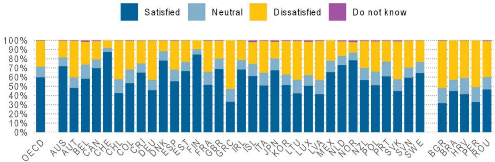  
B: Distribution of satisfaction with the healthcare system among individuals who and whose family members used a health service in the past 12 months, 2025

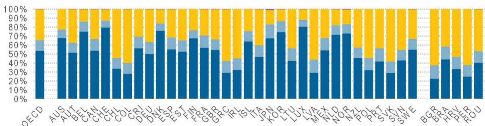

Note: The figure presents the within-country distributions of responses to the questions "On a scale of 0 to 10, how satisfied are you with the education system in [COUNTRY]?" (Panel A) and "On a scale of 0 to 10, how satisfied are you with the healthcare system in [COUNTRY]?" (Panel B). Respondents with recent contact are defined as those who reply in the affirmative to the question "In the last 2 years, have you or somebody in your household been enrolled in an educational institution in [COUNTRY]?" (Panel A)/" In the last 12 months, have you or somebody in your household personally made use of the healthcare system in [COUNTRY]?" (Panel B). The "satisfaction" proportion is the aggregation of responses from 6-10 on the scale; "neutral" is equal to a response of 5; "dissatisfaction" is the aggregation of responses from 0-4; and "do not know" was a separate answer choice. "OECD" presents the unweighted average of the weighted OECD country averages. Source: OECD Survey on Drivers of Trust in Public Institutions 2025.

StatLink https://stat.link/cpeo1x

Following a drop in satisfaction with education and health systems across OECD countries between 2021 and 2023, satisfaction with both systems has risen again between 2023 and 2025. In the 19 $^{1}$ OECD countries with available data on this indicator for all three waves of the OECD Trust Survey (2021, 2023, 2025), satisfaction with the education system declined from 63% to 60% between 2021 and 2023, before rising to 64% in 2025 (Figure 3.2). The increase in satisfaction is even stronger among the 29 OECD countries that participated in both 2023 and 2025, where satisfaction increased from an average of 57% to 61% in that time span. Satisfaction has been consistently rising in Australia, Canada, New Zealand and Sweden over the 2021 to 2025 period.

Trust in the healthcare system has likewise increased between 2023 and 2025, although it remains below 2021 levels. In the 19 countries with data for all three years, satisfaction among recent users fell from 63% to 55% and then returned to 58% in 2025 (Figure 3.2). For the 29 countries, the average rose by two percentage points, from 52% to 54%. Australia, Denmark, Iceland, Luxembourg and the Netherlands are the only countries which satisfaction has increased relative to 2021. For Australia, the share was already higher in 2023 than in 2021.

Figure 3.2. Satisfaction with the education and healthcare system rose modestly over the past two years

Share of recent users reporting different levels of satisfaction with the education and healthcare system, OECD-19 average

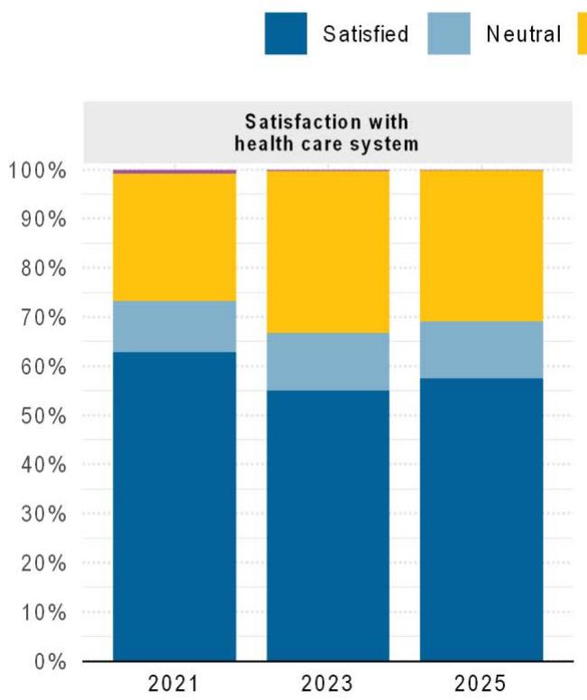

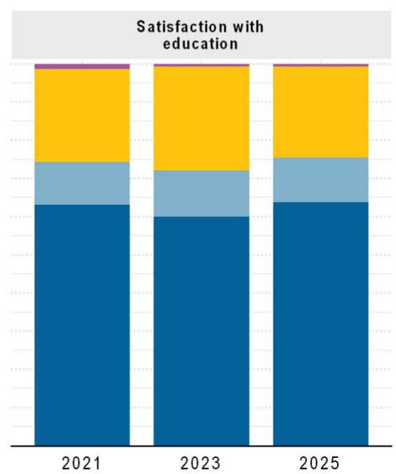  
Note: The OECD-19 average is the unweighted average of the responses across the 19 countries with available data for all three survey waves. The figure presents the average distributions of responses to the questions "On a scale of 0 to 10, how satisfied are you with the education system in [COUNTRY]?" (Panel A) and "On a scale of 0 to 10, how satisfied are you with the healthcare system in [COUNTRY]?" (Panel B). Respondents with recent contact are defined as those who reply in the affirmative to the question "In the last 2 years, have you or somebody in your household been enrolled in an educational institution in [COUNTRY]?" (Panel A)/" In the last 12 months, have you or somebody in your household personally made use of the healthcare system in [COUNTRY]?" (Panel B). The "satisfaction" proportion is the aggregation of responses from 6-10 on the scale; "neutral" is equal to a response of 5; "dissatisfaction" is the aggregation of responses from 0-4; and "do not know" was a separate answer choice.

Source: OECD Survey on Drivers of Trust in Public Institutions 2021, 2023, and 2025.

StatLink https://stat.link/26xnau

## 3.1.2. Satisfaction with administrative services is generally high and rising

Public administrative services – which include for example the processing of applications for passports, birth certificates and government benefits – are seen positively by a comfortable majority of people. Across the OECD, more than two thirds (68%) of people who have had recent contact with public administrative services report being satisfied with them overall (Figure 3.3). Among those without recent contact, the share is 61%. Satisfaction exceeds 50% in all OECD countries except Chile, and in all participating accession countries with the exceptions of Bulgaria and Peru. It is particularly high – above 80% - in Estonia, Finland, Luxembourg and Switzerland. Satisfaction with administrative services is a particularly important driver of trust in the civil service and local government but also affects, though less strongly, the probability of people placing high or moderately high trust in the national government and legislature (see Chapters 1 and 7).

Figure 3.3. In each OECD country, a majority of recent administrative services users are satisfied with these services

Share of recent users reporting different levels of satisfaction with administrative services in their country, 2025

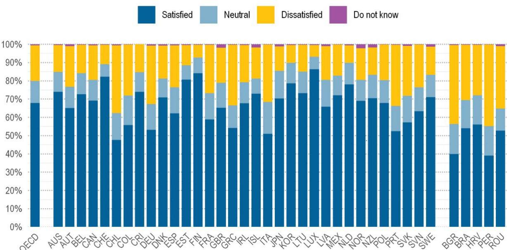  
Note: The figure presents the within-country distributions of responses among recent users to the question "On a scale of 0 to 10, how satisfied are you with the quality of administrative services in [COUNTRY] (for example applying for an ID, registering a birth or applying for benefits)?" Recent users replied in the affirmative to the question "In the last 12 months, have you personally made use of an administrative in [COUNTRY] (for example, applying for a passport, registering a birth, or applying for benefits etc.)?". The "satisfied" proportion is the aggregation of responses from 6-10 on the scale; "neutral" is equal to a response of 5; "dissatisfied" is the aggregation of responses 0 to 4. OECD is the unweighted average of the weighted OECD country averages.
Source: OECD Survey on Drivers of Trust in Public Institutions 2025.

It is important to note that while the OECD Trust Survey, with its focus on understanding how satisfaction with administrative services is related to trust in different public institutions, takes a bird-eye view of satisfaction with administrative services, people's views may vary considerably across different administrative services.

StatLink https://stat.link/o8l09x

To further understand what drives satisfaction with public administrative services, the OECD deployed in 2024 a population survey carried out in the context of an EU Technical Support Instrument project on 'Measuring Citizen's Satisfaction with key Government Services for Better Performance and Enhanced Trust'. The population survey, deployed in 10 EU Member States (Austria, Croatia, Estonia, Finland, Greece,

Ireland, Latvia, Lithuania, Slovenia, Spain) measures user satisfaction with public services delivered through Life Events experienced over a 12 month period. The survey finds that, overall, 72% of users across the EU-10 are satisfied with public services when experiencing a Life Event. In addition, 82% of users got what they wanted from the services they accessed, demonstrating that key drivers of satisfaction rest within the user journey, when users access and navigate services.

The data gathered through the Survey shows that while users are, overall, satisfied with public services they used in the last 12 months, the overall level of satisfaction varies depending on the Life Event experienced. For instance, in one participating country, an overall satisfaction level of 80% is recorded. However, this satisfaction level varies from 56% (for the Life Event 'I lost a loved one') to 90% (for the Life Event 'I retired'. Variations can also be observed in satisfaction levels across countries. For example, for the Life Event 'I had a baby/adopted a child', the satisfaction level varies from 57% to 93% depending on the country.

Satisfaction with administrative services among the overall population $^{2}$ across the OECD has increased modestly but steadily over time. For the 17 countries with available information for all three years, the share who are satisfied rose from 64% in 2021 to 65% in 2023 and 67% in 2025 (Figure 3.4). This upward trend is confirmed across the 29 countries with available data in both 2023 and 2025. In some countries such as Australia, Denmark and Luxembourg, improvements have been continuous over the 2021-2025 period. In others, such as Ireland, Korea and Portugal, important declines between 2021 and 2023 were followed by substantial increases between 2023 and 2025.

Figure 3.4. Satisfaction with administrative services has improved slightly over recent years

Share of population who are satisfied with administrative services, 2021, 2023 and 2025

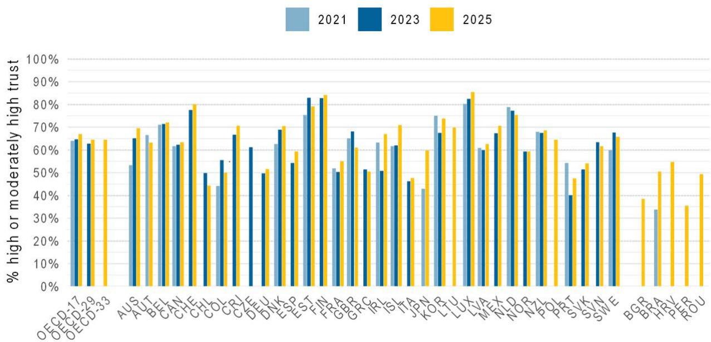

Note: The figure presents share who provided a 'satisfied' response to the question "On a scale of 0 to 10, how satisfied are you with the quality of administrative services in [COUNTRY] (for example applying for an ID, registering a birth or applying for benefits)?". The "satisfied" proportion is the aggregation of responses from 6-10 on the scale; "neutral" is equal to a response of 5; "dissatisfied" is the aggregation of responses 0 to 4. The OECD averages are the unweighted averages of the weighted country averages for the countries with available data for 2021, 2023 and 2025 (OECD-17 countries) and with available data for 2023 and 2025 (OECD-29 countries). Source: OECD Survey on Drivers of Trust in Public Institutions 2021, 2023 and 2025.

StatLink https://stat.link/4vkzd8

## 3.1.3. Positive experiences with individual quality aspects underpin the high level of satisfaction with administrative services

When asked about their satisfaction with individual aspects of the most recent administrative service that they used, the levels of satisfaction with these aspects generally exceeds the share that are satisfied overall among recent users. One reason for the discrepancy may be that a single bad experience with administrative services can colour views negatively, but that if people were asked about their satisfaction with the most recent administrative service they used specifically, satisfaction levels would be even higher still.

The share who are satisfied with several important quality aspects exceeds 70% in OECD and 50% in OECD accession candidate countries. 74% are satisfied with the courtesy of public employees during their most recent interaction with an administrative public service. 72% are satisfied with the competence of public employees on average across the OECD, and with the share not being lower than 50% across any OECD or OECD accession country. 74% find the language and information they were provided clear; and this share exceeds 50% in all OECD and OECD accession countries. Across the OECD, 71% are satisfied with the ease of obtaining the service.

Areas in which satisfaction is somewhat lower include the speed at which services can be accessed, the ability to access the service in the preferred manner, the ease of using digital services and the amount of fees (if applicable). An average of 69% across the OECD are satisfied with the ability to access the service in the manner that they prefer and with the amount of information they had to provide. In the OECD accession candidate countries with available data on these indicators, the satisfaction rates with accessing the service in the preferred manner and the information that needs to be provided reaches 55% and 50%, respectively. Moreover, 67% across the OECD and 50% across the five OECD accession countries are satisfied with how quickly they could access the service (Figure 3.5). 68% of recent users for whom this was applicable across the OECD and 54% across the OECD accession countries think that digital services were easy to use. Among concerned users, only 56% across the OECD and 46% in the European OECD accession countries were satisfied with the amount of the service fee they had to pay, making this the least positively viewed service aspect.

Figure 3.5. Across the OECD countries a majority have positive views of different administrative service quality aspects

Share of users of administrative services during the past year who were satisfied with the respective service aspect, OECD average, OECD minimum and OECD maximum, 2023 and 2025

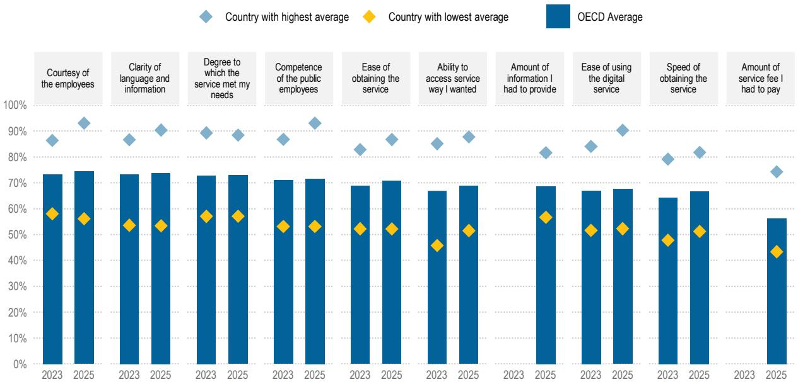  
Note: The figure shows the share of recent users who were satisfied with the respective aspect during the last time they accessed an administrative service over the past year. The OECD average is the unweighted average of weighted country averages for the 29 OECD countries that participated in both survey waves.  
Source: OECD Survey on Drivers of Trust in Public Institutions 2023 and 2025.

Compared to 2023, recent administrative service users across the OECD view the speed and ease of accessing a service slightly more positively. Among the 29 countries with available data for both years, the share who are satisfied with the ease and with the ability to access the service in the preferred way rose by two percentage points and who are satisfied with the speed of service access by three percentage points (Figure 3.5). The other perceptions have remained stable over time.

Some countries perform exceptionally well across many service aspects; while for others, some stand out. $^{3}$ In Estonia, Finland and Switzerland, more than four out of five recent users are satisfied with many service aspects; and in Brazil, more than three out of five are. In addition to the already named countries, the share who are satisfied also is equal to or exceeds 80% in:

\- Korea when it comes to the ease and speed of accessing the service;

StatLink https://stat.link/mog2ed

\- Luxembourg, Latvia and the Netherlands when it comes to the courtesy of public employees;

\- the Netherlands with regards to the competence of public employees;

\- Lithuania, Luxembourg and Mexico with regards to the clarity of information;

\- Luxembourg and Mexico with regards to how the service met the needs;

\- and Mexico in terms of accessing the service in the preferred manner.

In a similar vein, at least six out of ten people are satisfied with selected aspects in Romania (ease of using digital services and courtesy of public employees) and Croatia (clarity of information).

Other than in Finland and Switzerland, there is no country in which more than 80% are satisfied with the amount of information they had to provide, showing a potential area for improvement. Among users where this question was applicable, the share who were satisfied with the fee they had to pay is below 50% in several OECD countries and only exceeds 70% in Korea and Luxembourg.

The relative stability in the evaluation of individual quality aspects between 2023 and 2025 is mirrored in a large stability in the relationship of these evaluations and overall satisfaction with administrative services. The differences in the point estimates of the average marginal effects between 2023 and 2025 are not statistically significant, meaning that there is no change in the pattern of how evaluations of the individual quality features relate to overall satisfaction.

As in 2023, across the OECD, the most important drivers of overall satisfaction among recent service users are that people are satisfied with the speed at which they can access the service – associated with an eleven percentage point increase in the likelihood of being satisfied with administrative services – and with the ease of accessing the service – a ten percentage point increase (Figure 3.6). The ease of using the digital service, where applicable, has the third highest association with overall satisfaction, with an average marginal effect of eight percentage points. The remaining quality aspects are all associated with a six to seven percentage point boost in the probability of being satisfied.

Figure 3.6. People who are satisfied with the speed and ease of accessing the administrative service remain particularly likely to be satisfied with administrative services overall

Percentage point change in likelihood of being satisfied with administrative services if an individual is satisfied with the respective service aspect compared to not being satisfied, OECD, 2023 and 2025

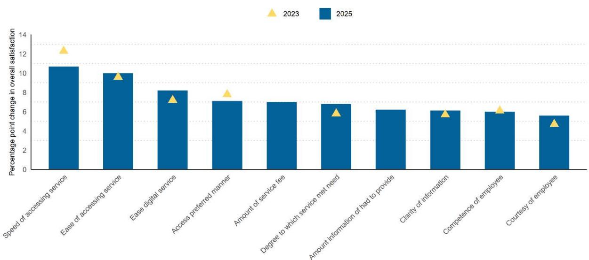

Source: Estimation based on the OECD Survey on Drivers of Trust in Public Institutions 2023 and 2025.

While the presented results of the regression analysis provide interesting pointers towards service aspects whose improvement could contribute to a rising overall satisfaction with administrative services, it is important to recognize the limits of this analysis. The adjusted R-squared of the regression analysis is only equal to 0.25. This means that only about a quarter of the variation in whether someone indicates that they are satisfied with administrative services (as opposed to not being satisfied, providing a neutral reply or saying that one does not know) is explained by the included variables. Other factors that are not included but which may affect overall satisfaction are experiences with other administrative services aside from the most recent one. Moreover, it is unclear whether improvements, for example in the speed at which individuals can access service, would be associated with increased satisfaction with this quality aspect. Instead, such improvements might lead to further increased expectations, while the share who are satisfied with the speed remains constant. Because of this and other reasons, the results of the analysis should not be interpreted as service improvements necessarily causing overall satisfaction to increase.

## 3.2. VIEWS ON DAY-TO-DAY INTERACTIONS WITH PUBLIC INSTITUTIONS

People with positive views on the ease of accessing information about administrative services and the fairness with which government employees treat applications for benefits and services tend to place more trust in the civil service and local government. People who come into contact with administrative services display improved perceptions of these public governance drivers and higher institutional trust.

## 3.2.1. A majority of the OECD population find it likely that administrative information are easily available and that they would be treated fairly in service applications

Across the OECD, people tend to have more positive expectations about how easy it is to access information about administrative services than about the fairness of their treatment or the integrity of government employees.

Before seeking a public service or benefit, or completing a required administrative task, people typically look for information on the steps they need to take. Clear, accessible information about administrative services is thus an important prerequisite for a positive interaction.

Perceptions of how easy it is to find information on administrative procedures are broadly in line with satisfaction with administrative services, and they appear to be improving over time. Across the OECD, 68% find it likely that information on administrative procedures are easily available (Figure 3.7). This share has moved in a slight positive direction, rising by one percentage point relative to 2023 (for both the group of OECD-20 or OECD-29 countries) and five percentage points relative to 2021. In Ireland and in Romania, which have the most positive perceptions across the participating OECD and OECD accession candidate countries, 84% and 57% of the population respectively find it likely that such information is easily available. In almost every OECD and some of the OECD accession countries, more than half of the population shares this view. More positive perceptions of information availability are associated with a 2.0 and 1.3 percentage points higher likelihood of placing trust in the national civil service and local government.

## Figure 3.7. An important majority see information on administrative services as easily available

Share of population who find it likely or unlikely that information on an administrative service would be easily available if needed, 2025

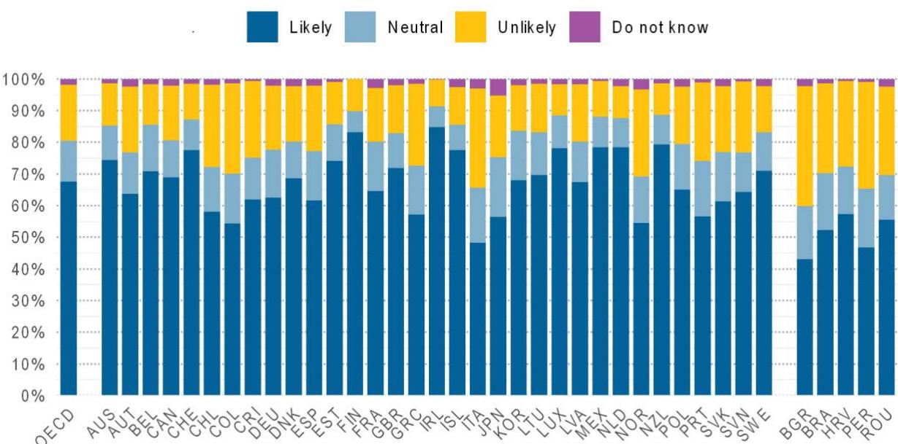  
Note: The figure presents the within-country distributions of responses to the question "If you needed information about an administrative service (for example obtaining a passport, registering a birth, applying for benefits, etc.), how likely do you think it is that clear information would be easily available?" The "likely" proportion is the aggregation of responses from 6-10 on the scale; "neutral" is equal to a response of 5; "unlikely" is the aggregation of responses from 1-4; and "do not know" was a separate answer choice. "OECD" presents the unweighted average of the weighted OECD country averages.  
Source: OECD Survey on Drivers of Trust in Public Institutions 2025.

In contrast, a smaller share of the population finds it likely that their application for government benefits or services would be handled fairly. In 2025, 53% across the OECD find it likely that this would be the case; rising to 75% in Finland (Figure 3.8). This share has remained stable since 2023. In participating OECD accession candidate countries, views are substantially less positive, with an average of 35% finding positive treatment likely. More positive perceptions of fair treatment in these type of interactions with public bodies are correlated with 2.4 percentage point higher likelihood of trust in the national civil service and 1.8 percentage points higher likelihood of trust in local government.

## StatLink https://stat.link/09o4vz

These results correspond well with the findings of the OECD's cross-national Risks that Matter (RTM) Survey on perceptions of social services and benefits (OECD, 2025[1]). RTM respondents are most confident in their knowledge of how to apply for social programmes, with $46\%$ – on average across 27 countries – saying they would know how to apply for services or benefits. People are more skeptical that they would be treated fairly by the public office processing their claim (39% believe this, on average) and that the application process would be simple and quick (28%).

## Figure 3.8. Around half of the population in OECD countries expect fair treatment when applying for government benefits or services

Share of population who find it likely or unlikely that their application for a government benefit or service would be treated fairly, 2025  
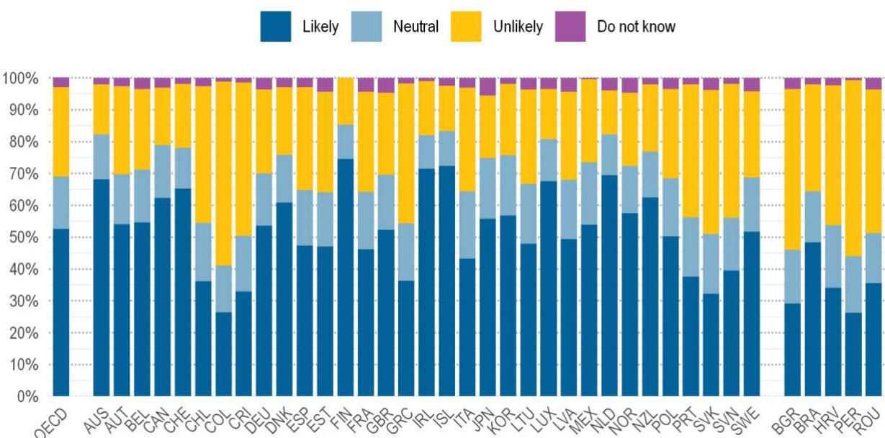  
Note: The figure shows the within-country distributions of replies to the question "If you or a member of your household applied for a government benefit or service, how likely do you think it is that your application would be treated fairly?". The "likely" proportion is the aggregation of responses from 6-10 on the scale; "neutral" is equal to a response of 5; "unlikely" is the aggregation of responses from 1-4; and "do not know" was a separate answer choice. "OECD" presents the unweighted average of the weighted OECD country averages. Source: OECD Survey on Drivers of Trust in Public Institutions 2025.

While a majority across the OECD still expects to be treated fairly in interactions with civil servants, expectations about civil servants' integrity are markedly lower. Across the OECD, 37% of people find it likely that a government employee would refuse money offered by an individual or business to speed up access to a public service; and 43% find it unlikely (Figure 3.9). Positive perceptions of this indicator have dropped from 41 in 2021 to 39% in 2023, but have

StatLink https://stat.link/9vf0tu

remained stable since then. In some OECD and non-OECD countries, fewer than one in five find such refusal likely; and there are only a handful of countries – primarily the Nordic countries and Switzerland – where a majority do. Among the participating OECD accession countries, views are most positive in Brazil, where more than a third of people find it likely that public employees would refuse attempts at petty corruption.

Figure 3.9. In OECD and OECD accession countries, more people find it unlikely than find it likely that a government employee would turn down an offer of money to speed up access to a service

Share of population who find it likely or unlikely that a government employee would refuse to accept money to speed up access to a service, 2025

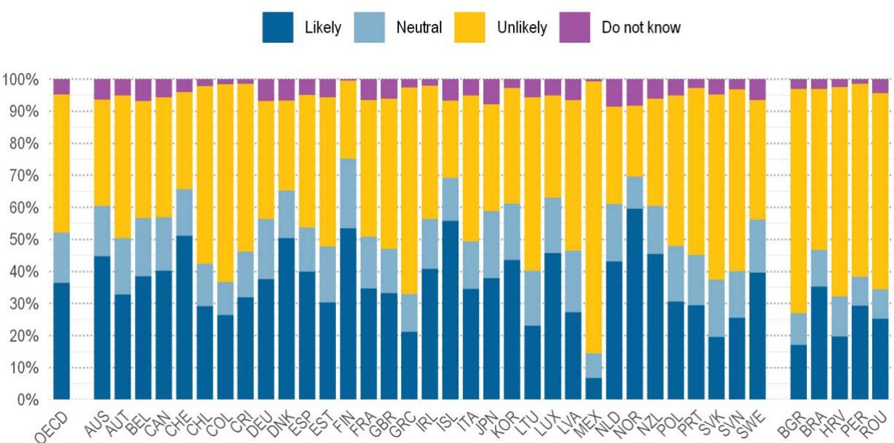  
Note: The figure presents the within-country distributions of responses to the question "If a government employee was offered money by a citizen or a firm for speeding up access to a public service, how likely do you think it is that they would refuse it?". The "likely" proportion is the aggregation of responses from 6-10 on the scale; "neutral" is equal to a response of 5; "unlikely" is the aggregation of responses from 1-4; and "do not know" was a separate answer choice. "OECD" presents the unweighted average of the weighted OECD country averages. Source: OECD Survey on Drivers of Trust in Public Institutions 2025.

StatLink https://stat.link/4fuais

Despite the rather pessimistic views that many people hold about the integrity of government employees, recent direct experiences with petty corruption remain rarely reported (noting, of course, that this is an issue prone to underreporting). On average across the OECD, fewer than 2% (1.6%, to be exact) indicate that during the past year, they or another member of their household were asked or felt compelled to pay a bribe to a government employee; and the share rarely exceeds 3%.

## 3.2.2. Even simple interactions with government institutions can contribute to improving perceptions

Those with recent experience using administrative services report more positive views across three different dimensions related to day-day-day interactions (see Figure 3.10), with especially large gains in a few countries.

Direct experience with civil servants can improve how people perceive the openness, fairness and integrity of public institutions. In 2025, among people in OECD countries who had recently used an administrative service, the share who thought that government employees were likely to turn down a bribe and treat them fairly when they applied for benefits was on average six and five percentage points higher, respectively, than among those without a recent interaction (Figure 3.10). Recent service users were also six percentage points more likely to say that information on administrative services would be easy to find. Unsurprisingly, people who rate the competence and courtesy of public employees highly during recent interactions (Figure 3.5) hold even more favourable views. In the participating OECD accession candidate countries, similar patterns hold.

These more positive assessments borne out of recent interactions can translate into higher levels of trust: the share with high or moderately high trust in the national government and in the national civil service is three and four percentage points higher, respectively, among recent service users (Figure 3.10). With the exception of Croatia, this finding also holds in the participating OECD accession countries.

Figure 3.10. Recent contact with administrative services appears to boost perceptions of day-to-day interactions and even trust in the civil service and government

Share of individuals who find a positive outcome likely or who have high or moderately high trust in the respective institution depending on whether the individual used an administrative service in the past year or not, OECD average, 2025

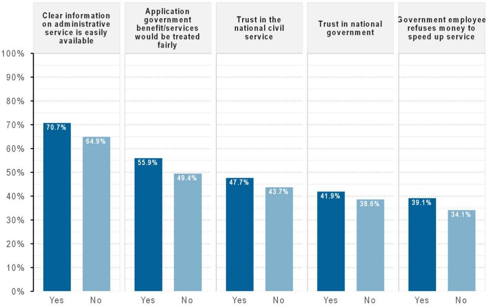  
Note: Recent administrative service users are those who respond 'yes' to the question "In the last 12 months, have you personally made use of an administrative service in [COUNTRY] (for example, applying for a passport, registering a birth, or applying for benefits etc.)?". The figure shows the share of individuals who find an indicated outcome likely/who have high or moderately high trust in the national civil service or in the national government (as indicated by a response of 6-10 on the 0-10 scale), depending on whether they were recent users or not. Source: OECD Survey on Drivers of Trust in Public Institutions 2025.

These findings suggest that public employees may act as ‘ambassadors’ of public institutions, and that dealing with them directly can improve perceptions of day-to-day public governance, and in turn trust. While some individuals with exceptionally low levels of trust in public institutions may deliberately avoid using administrative services, in many cases, people do not have a choice whether they do or not. This means that the findings can be cautiously interpreted as the use of administrative services causing some individuals to

StatLink https://stat.link/0zqw9s

view day-to-day interactions more positively and to have higher trust in institutions than they would have had otherwise. Outward communication around the share of satisfied service users could help improve perceptions even among people who are not in immediate contact with administrative or other essential services, though whether this can translate into improved perceptions and trust would have to be carefully studied.

However, in several countries - Belgium, Denmark, Finland, Germany and Norway, as well as Croatia – there are no substantial differences (defined as a difference in the positive perception of five percentage points or more) between any of the perceptions of the three public governance drivers and trust in the national government and civil service between those who have and who have not used an administrative service in the past year. In these countries, the general population's experience with the public service seems to coincide with their expectations, meaning that direct interactions do not lead to a boost in positive perceptions or in trust.

In contrast, Japan and Korea stand out as countries where interactions with administrative services is associated with exceptionally large increases in the share with positive perceptions of the day-to-day public governance drivers shown in Figure 3.10 and trust in the national government and national civil service. The increased share among recent service users who trust or who find it likely that there would be a positive outcome exceeds ten percentage points for all of the five measures shown in Figure 3.10, and can even be boosted by twenty percentage points. This finding is suggestive of a systematic 'image problem' of public services and civil servants in these countries: actual interactions appear to be more positive than initially anticipated by the general population, and this can contribute to improved trust levels.

## 3.2.3. A perceived 'right to error' in administrative interactions has ambiguous relationship with institutional trust

While many interactions with public institutions are straightforward, others need to take into account a variety of factors and can therefore lead to error. A classic example are tax declarations: when declaring their incomes, individuals may benefit from relevant exemptions, inadvertently commit errors, or deliberately mis-declare their income. Similarly, when people apply for a public benefit or service, they may accidentally forget to indicate a relevant income stream or circumstance that could affect their eligibility.

Depending on the legal statutes on the book in the respective country, public employees who uncover mistakes for example in tax declarations or benefit applications may have different latitude in how they react. In some cases, they may not have a choice but to impose a sanction, even if they have reason to believe that the individual or business in question was acting in good faith. In other cases, they may have some discretion in how they handle these cases. Finally, in France, the 'right to error' is enshrined in the code of relations between the public and the administration, and goes so far as demanding that public agencies would have to prove that an individual was acting deliberately. It is applicable to all interactions with public institutions where an individual cannot be held liable if they do not know a rule that applies to them or if they mis-state their personal situation. This right applies as long as the error was not committed deliberately or with fraudulent intentions, the individual contacts the relevant administration him- or herself or immediately reacts when contacted, and as long as the error can be regularised (Service Public, 2025[2]).

The extent to which individuals perceive public employees as being willing to grant them a 'right to error' might be interpreted as a measure of 'reciprocal trust', meaning the trust that people feel individual civil servants or the public administration overall place in them in terms of believing that errors are due to mistakes rather than deliberate. However, some people may also perceive the non-application of certain statutory foreseen sanctions as arbitrary or as benefitting some people unduly. If so, this could even undermine how trustworthy they perceive institutions to be. It is also possible that these perceptions may evolve with time, as society understands and reaches a level of comfort with the 'right to error'. A priori, therefore, it is unclear how the presence of a perceived 'right to error' relates to trust.

On average across the OECD, four in ten (39%) find it likely that if they committed an error, a public employee would help them correct it rather than sanction them (Figure 3.11). In contrast, 42% find it unlikely. The share who find it likely can be as low as around 20%, and does not rise much above 50% in any OECD country. Notably, perceptions of the 'right to error' do not need to correspond to legal rights or practices: In France with its strongly codified right, the share who find it likely is no different from the perception in other European countries such as Ireland or Iceland, although this may be attributed to the fact that the right to error was enacted only in 2018 in

France and the experience of individuals yet relatively limited.

As expected, the relationship between the perception of the prevalence of ‘right to make an error’ and trust in public institutions is somewhat ambiguous. At the country level, there is a positive correlation between the share who finds it likely that public employees act this way and trust in the national government and national civil service. This relationship is however stronger when it comes to trust in the national civil service (Figure 3.11, Panel B) than in the national government (Figure 3.11, Panel A). At the individual level, once controlling for the perceptions of other public governance drivers and the personal background characteristics as well as country fixed effects, people who find it likely that public employees grant a 'right to error' are however only marginally more likely to place trust in the national civil service. They are also marginally less likely to trust the national government than respondents with otherwise similar backgrounds and views are.

Figure 3.11. At the country level, the share who find it likely that a public employee would help individuals fix mistakes in applications is far more correlated with trust in the national civil service than trust in the national government  
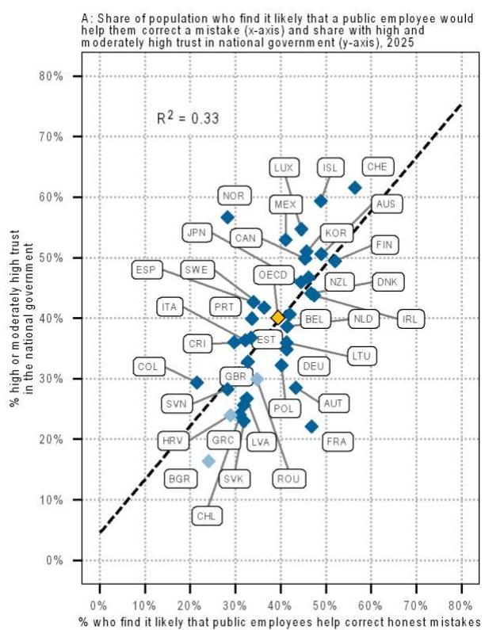

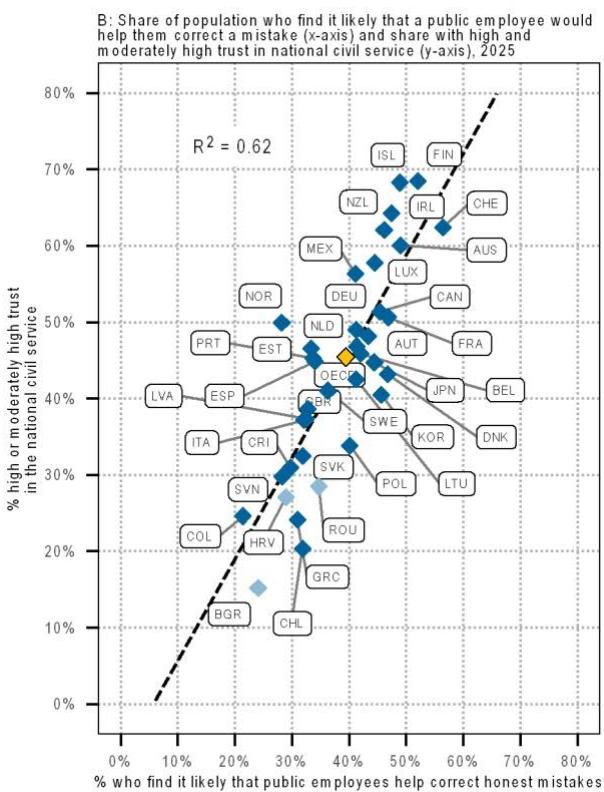  
Note: The scatterplots present the share of "high to moderately high trust" responses to the question "On a scale of 0 to 10, where 0 is not at all and 10 is completely, how much do you trust the national government/national civil service?" on y-axis of chart A/B. The x-axis presents the share of "likely" responses (6-10 on the 0-10 scale) to the question "If you made an honest mistake when applying for public benefits or declaring your taxes, how likely do you think it is that public employees would help you correct the error, rather than penalise you?". Source: OECD Survey on Drivers of Trust in Public Institutions 2025.

## 3.3. PERCEPTIONS OF THE RESPONSIVENESS OF PUBLIC SERVICES

The way in which people perceive public institutions' competence in day-to-day interactions depends in large part on how responsive institutions are to complaints or innovative ideas. Perspectives on these and other dimensions of responsiveness are considerably less positive than views on the quality of essential services and the openness and fairness with which these can be accessed, and are only more positive than views on the integrity of government employees. However, they are on a slight upward trend.

Across the OECD, 42% find it likely that public services would improve if they complained (Figure 3.12). A similar share (41%) find it likely that innovative ideas which could improve services would be adopted. In Australia, Mexico and Switzerland, both shares exceed

50%; and in Brazil, both are above the OECD averages. More positive perceptions of responsiveness in day-to-day interactions are associated with modest increases, around 1–1.5 percentage points, in the likelihood of reporting high or moderately high trust in local government and the national civil service.

Adapting public services to changing societal needs is another key dimension of responsiveness that has day-to-day consequences, even if it requires quite long-term thinking. As will be seen in Chapter 4, four in ten people (40%) across OECD countries find it likely that public services would be adapted to changing needs of society (Figure 4.5 in Chapter 4). This share is similar in Romania. Use cases from across and beyond the OECD show that efforts to anticipate future needs through working with users and stakeholders is one of the main areas of innovations in public services (see Box 3.1).

Figure 3.12. The share of people who view public services as responsive to complaints and to innovative ideas are similar in most countries

Share of population who find it likely that public services improve in response to many complaints or that innovative ideas that could improve them are adopted, 2025

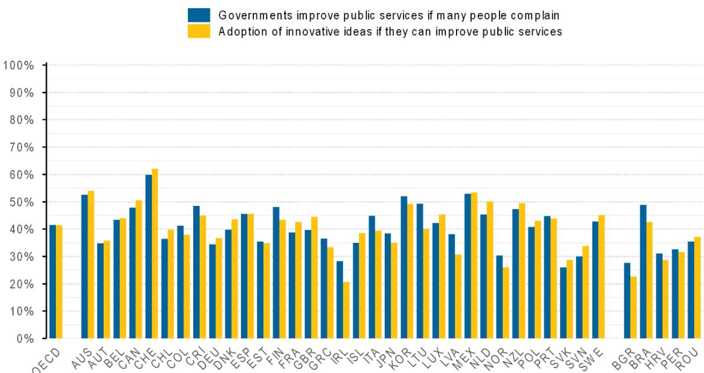  
Note: The figure shows the average share of the population who respond that it is 'likely' (responses 6-10 on a 0-10 scale) to the questions "If many people complained about a public service that is working badly, how likely do you think it is that it would be improved?" and "If there was an innovative idea that could improve a public service, how likely do you think it is that it would be adopted by the responsible public institution?". "OECD" presents the unweighted averages of the weighted OECD country averages. Source: OECD Survey on Drivers of Trust in Public Institutions 2025.

StatLink https://stat.link/hfy4g9

Across the OECD, perceptions of public service responsiveness have modestly improved over time. Among countries that participated in all three waves of the OECD Trust Survey, the share who found it likely that institutions would be responsive to complaints or innovative ideas stayed relatively stable or slightly declined between 2021 and 2023. It has since increased by 2.8 percentage points with regards to listening to complaints; and 3.2 percentage points with regards to adopting innovative ideas. Improvements in the perceptions for both variables have been consistent in Australia, Finland and Mexico. $^{5}$

Figure 3.13. The share who view public services as responsive across OECD countries has slightly risen since 2021

Share of population who find it likely that innovative ideas that could improve them are adopted or that that public services improve in response to many complaints, OECD-19

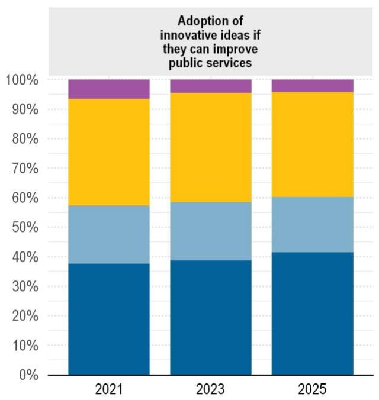

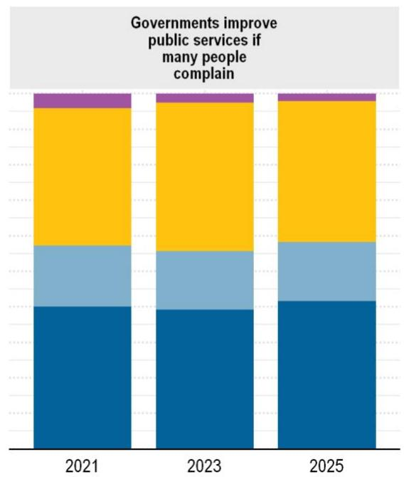

Note: OECD-19 is the unweighted average of the weighted averages from the 19 countries with available data for all three survey waves. The figure shows the average distribution of responses to the questions "If many people complained about a public service that is working badly, how likely do you think it is that it would be improved?" and "If there was an innovative idea that could improve a public service, how likely do you think it is that it would be adopted by the responsible public institution?". The "likely" proportion is the aggregation of responses from 6-10 on the scale; "neutral" is equal to a response of 5; "unlikely" is the aggregation of responses from 0-4; and "do not know" was a separate answer choice.

Source: OECD Survey on Drivers of Trust in Public Institutions 2021, 2023 and 2025.

StatLink https://stat.link/a2wbzx

The OECD Observatory of Public Sector Innovation, founded in 2011, works with governments, the private and non-profit sectors and academia to provide support and guidance on public sector innovation. Through its annual Calls for Government Innovation, it collects case studies on government innovation with a changing focus from year to year. In 2024, the Annual Call was dedicated to the topic of public services innovations. As such, it was the first step to create an evidence base on good practices related to the OECD Recommendation on Human-Centred Public Administrative Services (OECD, 2024[3]). Based on the analysis of the nearly 800 use cases from 83 countries, the report identified five trends in public services innovation:
- "Future-oriented and co-created public services: Governments are working with users and stakeholders to co-design solutions and anticipate future needs, creating public services that are flexible and responsive to change, and are therefore more resilient in the long term. (...)
- Digital and innovative foundations for efficient public services: Governments are investing in scalable digital infrastructure, experimenting with emergent technologies (such as automation, AI and modular code), and expanding innovative and digital skills to make public services more efficient. (...)
- Personalised and proactive public services for accessibility and inclusion: Governments are making public services more personalised and proactive to better meet people's needs and expectations, reduce psychological costs and administrative frictions, ensuring they are more accessible and empowering, especially for persons and groups in disadvantaged circumstances. (...)
- Data-powered public services for better decision-making: Governments are drawing on traditional and non-traditional data sources to guide public service design and execution. They are increasingly using experimentation to navigate highly complex and unpredictable environments. (...)
- Public services as opportunities for public participation: Governments are seeing public services as an opportunity to engage citizens in exercising their rights, building trust, and holding governments accountable for upholding democratic values including involving all groups of citizens. (...)." Source: Based on OECD (2024[4]), Global Trends in Government Innovation 2024: Fostering Human-Centred Public Services, OECD Public Governance Reviews, OECD Publishing, Paris, https://doi.org/10.1787/c1bc19c3-en.

## Box 3.1. Fostering human-centred public services through government innovation

## 3.4. AREAS FOR POLICY ACTIONS TO INCREASE TRUST

\- Continue to invest in the quality and coverage of essential public services. A majority of recent service users across the OECD are satisfied with the health and education systems; and the share who are satisfied with administrative services exceeds two thirds. In OECD accession candidate countries, satisfaction rates are somewhat lower, but they still exceed 50% for satisfaction with administrative services among recent users in almost all countries. Satisfaction with administrative services is an important driver of trust in all public institutions for which the link was investigated, but especially in the national civil service and local government. For a sub-set of OECD countries with available data from 2021 to 2025, satisfaction with these essential services has slightly improved relative to 2023. Continuing to adjust public services in a manner that centers users' needs can help support this positive trend, especially as further technological changes will continue to increase expectations over time.

\- Focus on service access ease and speed across multiple access channels. The high satisfaction with administrative services is built on even higher satisfaction levels with individual service quality aspects. The pattern of which quality aspects is seen most positively differs from country to country. But overall, people tend to be more satisfied with the competence and courtesy of public employees they encounter, the clarity of information and the degree to which the service met their needs than they are with how quickly they could access the service, the ability to access the service in the preferred manner and, where applicable, the ease of using a digital service and the service fee they had to pay. An analysis linking overall satisfaction with satisfaction with individual service aspects suggests that focus efforts to increase the speed and ease of which the service can be accessed can be the most impactful levers for supporting service satisfaction. While digital services, whether or not they are supported by artificial intelligence, can be one instrument to improve perceptions of these quality aspects, it is also important to acknowledge that for many people it remains important to be able to access services through their preferred channel. People who feel able to do so are likewise more likely to be satisfied with administrative services.

\- Strengthen the role of government employees as public sector ambassadors. People across the OECD and OECD accession candidate countries have a positive perspective on the availability of information on administrative services, with the share who find it likely that they would be easily able to find it exceeding two thirds across the OECD and one half in several of the five participating OECD accession countries. A lower but still majority share in the case of the OECD find it likely that they would be treated fairly if they applied for government benefits or services. Positive perceptions on the accessibility of information and the fairness of treatment are moderately related to higher trust in the civil service and local government. Knowing that individuals who had a recent interaction with administrative services hold more positive views of all of these dimensions suggests that direct experiences with the public administration often exceed people's expectations. Making public employees even more aware of their role as public sector ambassadors might support their perception as key actors in the efforts to build and maintain institutional trust. This is true both of public employees who enter into direct contact with the general public, as well as those who build the digital tools for the public service that individuals interact with.

\- Aim to improve perceptions of civil service integrity. The share of the population that finds it likely that a government employee would refuse money to speed up service access is equal to around one third in OECD and one quarter in the five participating OECD accession candidate countries. While these perceptions improve among individuals with recent contact with administrative services, through taking actions such as ensuring that public integrity frameworks are fully implemented (OECD, 2024[5]), countries can aim to improve not just the reality but also perceptions of public service integrity.

\- Build on improvements in perceived public services responsiveness. About four in ten people across the OECD and one third across the participating five OECD accession candidate countries find it likely that innovative ideas and complaints will be reflected in adjustments in public service delivery. These perceptions have slightly improved in a sub-set of the OECD countries with available data since 2021. An increasing share of people who are confident in these aspects may be reflective of government efforts to create more human-centred public services, suggesting that further investments in these areas can translate to further boost perceptions and contribute to strengthening trust in local government and the civil service.

## REFERENCES

OECD (2025), More Effective Social Protection for Stronger Economic Growth: Main Findings from the 2024 OECD Risks that Matter Survey, OECD Publishing, Paris, https://doi.org/10.1787/3947946a-en. [1]

OECD (2024), Anti-Corruption and Integrity Outlook 2024, OECD Publishing, Paris, https://doi.org/10.1787/968587cd-en. [5]

OECD (2024), Global Trends in Government Innovation 2024: Fostering Human-Centred Public Services, OECD Public Governance Reviews, OECD Publishing, Paris, https://doi.org/10.1787/c1bc19c3-en. [4]

OECD (2024), "Recommendation of the Council on Human-Centred Public Administrative Services", OECD Legal Instruments, OECD/LEGAL/0503, OECD, Paris, https://legalinstruments.oecd.org/en/instruments/OECD-LEGAL-0503.

Service Public (2025), Qu'est-ce que le droit à l'erreur face à l'administration ?, https://www.service-public.gouv.fr/particuliers/vosdroits/F34677 (accessed on 21 February 2026).

## NOTES

$^{1}$ The questions on satisfaction with the healthcare and education system and with administrative services were not asked in Mexico in 2021. Moreover, the question on satisfaction with administrative services was also not asked in Finland in 2021.

$^{2}$ The question on whether someone has used an administrative service in the past year was not asked in 2021. For the comparisons in satisfaction rates across time, the sample is therefore not restricted to individuals who used a service in the past year.

$^{3}$ Detailed information on the respective satisfaction levels by country can be found in the Stat.Link of Figure 3.5.

$^{4}$ These statistics can be accessed at https://stat.link/81ervd.

$^{5}$ The question on adopting innovative ideas was not asked in Mexico in 2021.

## 4 Views of government decision making on complex policy issues and trust

This chapter analyses public perceptions of government decision making on complex, uncertain and long-term policy challenges, drawing on evidence from the 2025 OECD Survey on Drivers of Trust in Public Institutions. It focuses on how people assess governments' capacity to manage trade-offs, use evidence, act with integrity, and respond to public and stakeholder input in contexts where outcomes are uncertain and benefits may only materialise over time. Overall, the chapter illustrates how uncertainty, long-time horizons and contested interests make complex policy making particularly vulnerable to scepticism, while underscoring that improvements in evidence use, responsiveness, integrity and collaboration can meaningfully contribute to strengthening trust in public institutions.

## Key findings

\- People's confidence in their government's ability to protect them during large-scale emergencies is generally larger than their confidence that their government can tackle long-term or highly complex issues. While $51\%$ across the OECD find it likely that government institutions are ready to protect lives in large-scale emergencies, only $34\%$ are confident that government adequately balances between the interests of current and future generations – a challenging issue with long-term trade-offs.

\- Across the OECD, 42% find it likely that government decisions are evidence-informed, and 40% feel that public services adapt to changing societal needs. The two perceptions are strongly correlated at the country and individual level, but their relationship with trust varies according to different institutions: While positive assessments of evidence-informed decision making are strongly associated with trust in the national government and moderately associated with trust in other institutions, greater confidence that public services adapt to changing long-term needs is only associated with greater trust in the national civil service.

\- Close to one in four people (39%) across the OECD, and more than one third across the participating OECD accession countries, find it likely that a policy would be changed if a majority of people are against it, while a similar share (41%) find it unlikely a policy would be changed. However, assessments of responsiveness are on the rise across the countries that participated in the OECD Trust Survey previously.

\- Only 37% across the OECD find it likely that their government is able to co-operate with key stakeholders, such as private sector organisations and trade unions, to better tackle long-term challenges. This is an important driver of trust in the national government.

\- A modest share believe in the integrity of individual politicians and of government. Nevertheless, the small decline from 2021 to 2023 in the share who say it is not likely a politician would provide a political favour in return for a lucrative private-sector job has been reversed between 2023 and 2025. The share who find it likely that government withstands lobbying on a policy that could be against the public interest has likewise slightly increased since 2023.

## 4.1. INTRODUCTION

Providing high-quality essential services that meet people's needs, and ensuring that people perceive day-to-day interactions with public institutions positively, presents multiple challenges for public institutions, as illustrated in Chapter 3. Yet policy design and implementation in these areas largely address challenges that have been ongoing for years and are relatively well-understood.

The same cannot be said for many other thorny, complex and future-facing policy issues, including those which require sacrifices today for what may be diffuse, long-term outcomes. In many policy areas, it is difficult to even project how decisions and transitions will play out and what future needs will be. In these situations, policymakers make decisions with incomplete information and future uncertainties. At the same time, the faster changing technological and socio-economic environment as well as the growing complexity of policy issues, including cross border dimensions, are making policymaking more complex.

Yet it is precisely perceptions of the outcomes and processes of government decision making on complex policy issues that have the greatest association with trust in national government (see Chapter 1) and legislature (see Chapter 7). Even trust in local government and the national civil service are significantly associated with many perception indicators on complex decision making in a manner that is roughly on par with the importance of perceptions of day-to-day interactions with public institutions (see Chapter 1).

As can be seen in this chapter, when there is greater uncertainty between different objectives and interests, people are less confident that long-term and complex policy goals can be achieved. At least part of this lower optimism is related to limited faith that decisions are informed by evidence, responsive to inputs from the general population and concerned stakeholders, and taken with the public rather than private interests in mind. Nevertheless, compared to 2023, there has been a small rise in the proportion of people who hold positive views of the integrity and responsiveness of governmental decision making.

## 4.2. PERCEPTIONS OF THE OUTCOMES OF GOVERNMENT DECISION MAKING ON COMPLEX POLICY ISSUES

People's confidence in their government's ability to plan for and address policy challenges varies with their associated complexity and time horizon. People's confidence in the ability of institutions to protect them during large scale emergencies is generally larger than their confidence in government regulating new technologies, supporting affected people during economic crises, reducing greenhouse gas (GhG) emissions and ensure that the interests of current and future generations are adequately taken into account (Figure 4.1). Regression results show that positive views on intergenerational equity are more strongly related to trust in the national government and legislature than perceptions of achieving other policy objectives are (Chapter 1).

Figure 4.1. A majority is confident in the ability of government to protect lives in emergencies, larger than the share who believe government balances intergenerational interests

Share of population reporting different levels of confidence in achieving stated policy objective, OECD

Likely/High or moderately high confidence

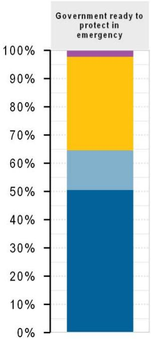

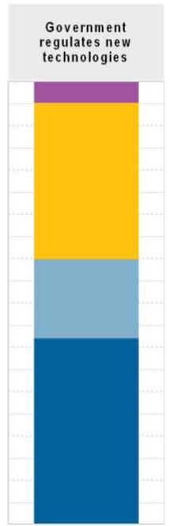

Neutral

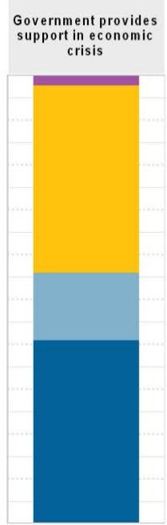  
Unlikely/Low or no confidence

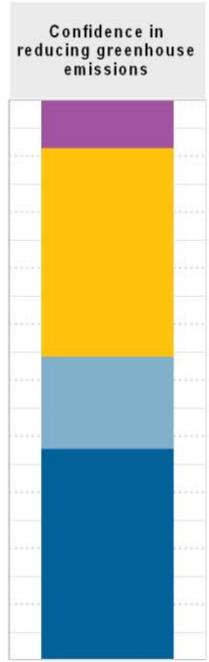  
Do not know

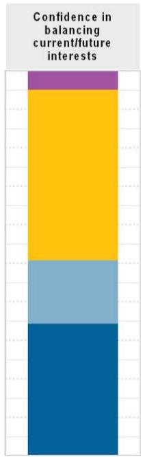  
Note: The figure presents the unweighted OECD averages of the weighted OECD country averages for responses to the following questions: (1) "If there was a large scale emergency, how likely do you think it is that government institutions would be ready to protect people's lives?", (2) "If new technologies (for example artificial intelligence) became available, how likely do you think it is that the national government will regulate them appropriately to help businesses and citizens use them responsibly?", (3) "In the event of an economic crisis, how likely do you think it is that the federal/central/national government would provide appropriate support to affected people?", (4) "On a scale of 0 to 10, how confident are you that [COUNTRY] will succeed in reducing GhG emissions in the next ten years?" and (5) "On a scale of 0 to 10, how confident are you that the national government adequately balances the interests of current and future generations?". The "likely/confident" proportion is the aggregation of responses from 6-10 on the scale; "neutral" is equal to a response of 5; "unlikely/not confident" is the aggregation of responses from 1-4; and "don't know" was a separate answer choice. Source: OECD Survey on Drivers of Trust in Public Institutions 2025.

StatLink https://stat.link/ru96d5

## 4.2.1. People generally feel government will better protect them from large-scale emergencies than economic crises

Ensuring that people feel secure and stable is generally considered among the core functions of modern states. Individuals in OECD countries generally feel more at ease about the question of physical security, at least within the context of large-scale emergencies that have the potential to take people's lives, than they are about the ability of government to maintain their economic stability.

In 2025, a majority (51%) across the OECD find it likely that government institutions are ready to protect people's lives in a large-scale emergency (Figure 4.2). The proportion exceeds $50\%$ in 18 of the 33 participating OECD countries, and rises above $75\%$ in Finland. In contrast, in Croatia – the participating OECD accession candidate country where emergency preparedness is seen most positively – $42\%$ find it likely that government institutions are prepared in this way. The average share across a selected sample of OECD countries has remained stable, changing by less than 1 percentage point, between 2023 and 2025.

At 41%, the proportion of the OECD population that believe government will provide appropriate support to affected people during an economic crisis is 10 percentage points lower than the proportion who believe in the emergency preparedness of institutions. In the European OECD accession candidate countries, $^{1}$ the average share is equal to 29%. The pattern of higher confidence in disaster preparedness than in adequate support during economic crises applies in every single one of the surveyed OECD and OECD Accession countries with available data.

This finding is reinforced by evidence from the 2024 OECD Risks that Matter Survey (RTM), a population survey of 27 countries covering perceptions of economic risks and social protection. RTM finds that only slightly more than one third of the population believe they can count on government to get them through financial trouble (OECD, 2025[1]). The survey also reveals solid support for government intervention on economic security, finding consistently across survey waves since 2018 that around $70\%$ of people want their government to do more to ensure economic security.

Share of population who finds it likely that government institutions can protect people's lives in a large-scale emergency and that it provides appropriate support to affected people during an economic crisis, 2025

Government institutions ready to protect lives in an emergency
Government provides adequate support during an economic crisis

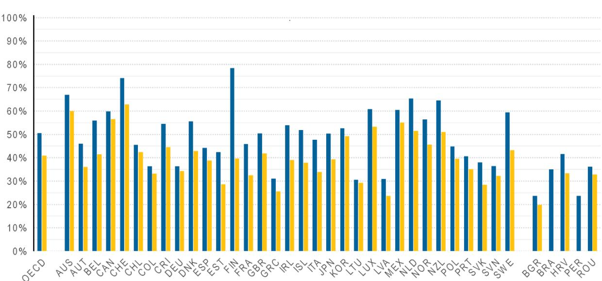

Note: The figure presents the weighted share of 'likely' responses to the questions: "If there was a large scale emergency, how likely do you think it is that government institutions would be ready to protect people's lives?" and "In the event of an economic crisis, how likely do you think it is that the federal/central/national government would provide appropriate support to affected people?". The "likely" proportion is the aggregation of responses from 6-10 on the 0-10 scale. "OECD" presents the unweighted average of weighted OECD country averages. Source: OECD Survey on Drivers of Trust in Public Institutions 2025.

StatLink https://stat.link/j5h82l

People with above-average confidence in receiving adequate government support during an economic crisis are 3.1 percentage points more likely to place high or moderately high trust in the national government, and 1.3 percentage points more likely to trust the national legislature. There is no relationship between perceptions of this indicator and trust in local government or the civil service. In contrast, positive perceptions of emergency preparedness have a smaller but more uniform association with trust in public institutions: Individuals who find it particularly likely that government institutions are able to protect people's lives are 1.6-2.3 percentage points more likely to trust the studied institutions spanning the national civil service, government and legislature as well as local government (see Chapters 1 and 7).

## 4.2.2. Fewer people are confident in policymaking on emerging and long-term issues

Ensuring disaster prevention and protection, as well as income support during economic crises, is by no means easy and is usually expensive. Yet other issues involve high degrees of uncertainty, as well as important trade-offs between different policy objectives. When considering these issues, only a minority has confidence in government.

Fewer than four in ten people across the OECD are confident that their country can reduce GhG emissions and that their government adequately balances the interests of current and future generations. The share who find it likely that government appropriately regulates new technologies to help people and businesses use them responsibly is slightly higher, at 42% (Figure 4.1).

On average across the OECD, the share who are confident that their country will succeed in reducing GhG emissions over the coming decade (38%) is nearly identical to the share who are not confident (37%) (Figure 4.1). In Finland and Switzerland, as well as in Brazil, a majority are confident (Figure 4.3). In most countries there are slightly more people who find it likely that the country will reduce GhG emissions than adequately balance between intergenerational interests. Australia, Estonia and Mexico are exceptions to this pattern, with more people having confidence that government can balance intergenerational interests. People's perspectives on GhG emission reductions have been variable over time: In 2021, across the 18 OECD countries with available information for all three survey waves, 36% were confident, rising to 40% in 2023 and 37% in 2025. This variation is larger than observed for most public governance perceptions measured through the OECD Trust Survey.

## Figure 4.3. Nearly four in ten are confident in their government reducing GhG emissions, slightly higher than the share confident that their government will balance intergenerational interests

Share of population confident that the country will reduce GhG emissions in the coming decade and that government manages to adequately balance the interests of current and future generations, 2025

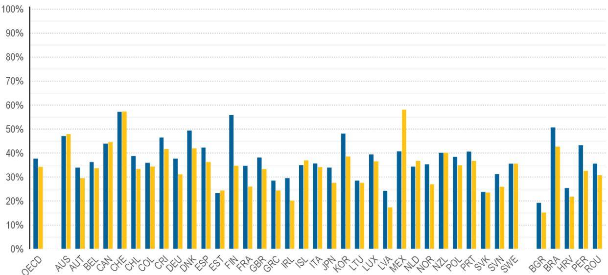  
Note: The figure presents the weighted share of 'likely' responses to the questions: "On a scale of 0 to 10, how confident are you that [COUNTRY] will succeed in reducing GhG emissions in the next ten years?" and "On a scale of 0 to 10, how confident are you that the national government adequately balances the interests of current and future generations?". The "confident" proportion is the aggregation of responses from 6-10 on the 0-10 scale. "OECD" presents the unweighted average of weighted OECD country averages.
Source: OECD Survey on Drivers of Trust in Public Institutions 2025.

Few people are confident that their government balances well the interests of current and future generations in decision making: Only about one third of people across the OECD (34%) are confident (Figure 4.3), compared to 44% who are not confident (Figure 4.1). In the participating OECD accession countries, the same pattern occurs, with a larger gap among the European accession countries than in the Latin American ones. Across the 29 OECD countries that participated in the 2023 and 2025 Trust Survey, the share who are confident has declined from 38% to 35%. $^{2}$

There is no straightforward answer to how the interests of current young and older people (and generations that are not yet born) should be weighed against each other in situations where interests may be in conflict, and how a given policy or programme is likely to affect

StatLink https://stat.link/qdturp

different generations. As a first step, it is useful for policymakers to have the simple awareness that this is a relevant factor for trust in public institutions: individuals who are especially confident that policies balance intergenerational interests well are 4.2 percentage points more likely to place high or moderately high trust in the national government, making this the second most important driver of trust. They are also 2.6 percentage points more likely to trust the legislature than otherwise similar individuals. Going a step further than mere awareness of this relationship, analysing a prospective policy using a tool like the Intergenerational Fairness Policy Assessment can support decision makers in thinking about effects on different generations (OECD, 2021[2]).

## 4.3. PERCEPTIONS OF THE PROCESSES OF GOVERNMENT DECISION MAKING ON COMPLEX POLICY ISSUES

Individuals evaluate policies and adjust their views on whether public institutions are trustworthy not only on the outcomes of these policies, but also on the process by which outcomes are reached. Do people believe that policymakers take into account the preferences of the population and that they are they guided by the public good, or do they instead view decisions to be overly influenced by special – or even policymakers' own – interests? Do they think it is likely or unlikely that government decisions are guided by the best available evidence, and that draw on the expertise of stakeholders?

A look at the relevant indicators in the OECD Trust Survey shows that the share of people across the OECD who have a positive view of these aspects of decision making on complex policy issues is around four in ten people or below. Yet several of these perceptions, chief among them people's assessment of whether government decisions are evidence-informed, are strongly related to trust. The combination of relatively negative current views on these process-oriented perception indicators and relatively high association with trust in particular in the national government make these prone for policy actions to increase trust.

## 4.3.1. Policymaking is not always perceived as responsive to the best available evidence nor as adaptive to changes in society's needs

Results from the 2025 OECD Trust Survey suggest that more than a third of people across the OECD have doubts that policy decisions are evidence-informed and anticipate changing needs.

Across the OECD, 42% find it likely that decisions are evidence-informed (Figure 4.4), compared to 37% who find it unlikely. Among the participating OECD accession countries, Brazil is the only country where equal shares find it likely or unlikely. In the remaining four accession countries, the share who find it unlikely is substantially larger.

The share who feel governments make evidence-informed decisions has remained constant across the 29 OECD countries part of the 2023 and 2025 OECD Trust Survey. $^{3}$ Nevertheless, the perception in some individual countries underwent important changes. For example, in Korea, the share who find it likely that decisions are evidence-informed increased by eleven percentage points from 2023 to 2025.

At the country level, the proportion of the population who believe governments make use of relevant evidence and who find it likely that public services adapt to changing societal needs – 40% on average across the OECD - are highly correlated (with an $R^{2}$ of 0.6 and a correlation coefficient of 0.77) (Figure 4.4). This strong correlation even exists at the individual level, even though it is smaller.

These two perceptions interact differently with trust in public institutions: Positive perceptions of evidence-informed decision making are associated with a 6.0 percentage point increased likelihood of having high or moderately high trust in national government, but also with a 2.2-3.5 increased likelihood of trusting legislatures, the civil service and local government. In contrast, believing more confidently that public services adapt to changing long-term needs is only associated with placing increased trust in the national civil service, $^{4}$ and the average marginal effect is only equal to 1.6 percentage points.

## Figure 4.4. People's opinions about government being evidence-informed and planning ahead to changing societal needs are related

Share of population who find it likely that government makes decisions based on the best available evidence (x-axis) and that government adapts public services to changing societal needs (y-axis), 2025

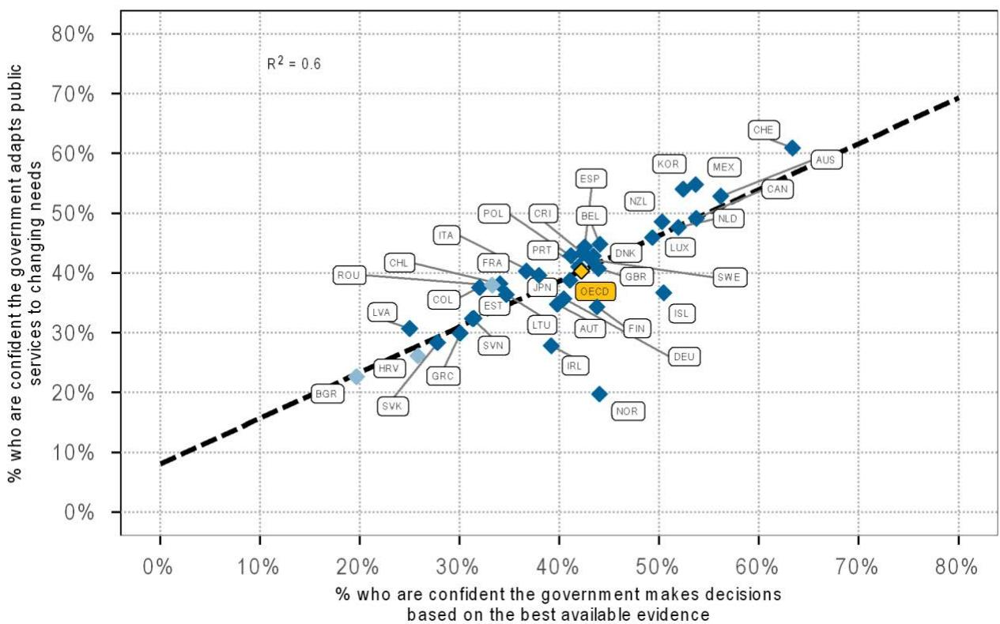  
Note: The figure shows the weighted shares of "likely" responses to the questions "If the national government takes a decision, how likely do you think it is that it will draw on the best available evidence, research, and statistical data?" and "If society's needs change, how likely do you think it is that public services would adapt adequately to meet these needs?". The "likely" proportion is the aggregation of responses from 6-10 on the 0-10 scale. "OECD" presents the unweighted average of weighted OECD country averages. Points shown in light blue depict accession candidate countries, which are not included in the OECD average nor affect the regression line.
Source: OECD Survey on Drivers of Trust in Public Institutions 2025.

Many governments are strengthening their capacity for incorporating varied sources of evidence in decision making and ensure that public services keep adapting to changing needs. To effectively increase the use of evidence in policymaking, a systematic approach has to ensure that the right evidence is available at the right time – the supply side – and that decision makers are incentivised to access and use this evidence – the demand side (OECD/European Commission, 2025[3]). This is not always the case. For instance, the OECD's 2024 Serving Citizens' survey finds that while 23 of 31 (74%) reporting countries collect data related to performance targets, only 16 of 31 (51%) actually incorporate these data into their decision-making processes (OECD, forthcoming[4]).

StatLink https://stat.link/c5oux4

## 4.3.2. Few view policymakers as receptive to criticism of a policy or capable of cooperating with key stakeholders in solving important policy challenges

Opinions regarding whether policies are likely to be informed by co-operations with other major stakeholders and responsive to majority preferences are also evenly split.

Close to four in ten people (39%) across the OECD and more than one third across the participating OECD accession countries find it likely that a policy would be changed if a majority of people are against it, while a similar share (41%) find it unlikely (Figure 4.5). The proportion who find it likely that policy would be

adapted to reflect public feedback is close to or above 50% in Australia, Canada, Finland, Korea, Mexico and Switzerland, as well as in Brazil. Among the sub-set of 17 countries with available information for all three years, in 2025, the share of people who do has increased by 2 percentage points relative to 2021 and 3 percentage points relative to 2023. In comparison to 2023, the share of the population who find it likely has risen by more than 10 percentage points in Iceland, Korea and the United Kingdom.

Figure 4.5. Only around four in ten people find it likely that an unpopular policy would be changed, but this share is increasing over time

Share of population who find it likely or unlikely that government would change a national policy if over half of the people expressed a view against it, 2025, and evolution of the responses 2021-2025, OECD-17

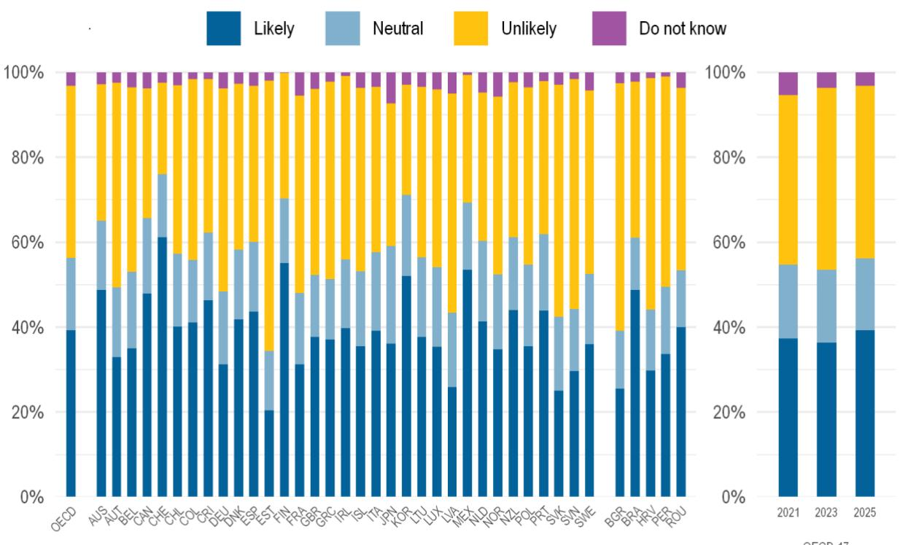  
Note: The figure presents the within-country distributions of responses to the question "If over half of the people in [COUNTRY] clearly expressed a view against a national policy, how likely do you think it is that it would be changed?". The "likely" proportion is the aggregation of responses from 6-10 on the scale; "neutral" is equal to a response of 5; "unlikely" is the aggregation of responses from 0-4; and "Don't know" was a separate answer choice. "OECD" presents the unweighted average of the weighted OECD country averages. "OECD-17" presents the unweighted average of the weighted county averages for the 17 countries for which this data point is available for all three years. Source: OECD Survey on Drivers of Trust in Public Institutions 2021, 2023, and 2025.

While only a minority in most OECD and participating OECD accession countries find it likely that governments would adjust policies based on majority opposition to them, the share who believe that government co-operates with other stakeholders is even slightly lower. On average across the OECD, 37% find it likely that government can co-operate with other national stakeholders, such as private sector

StatLink https://stat.link/3waqjs

organisations and trade unions, to better tackle long-term challenges (Figure 4.6). $18\%$ provide a neutral response and $38\%$ find it unlikely. Switzerland and Brazil are the only countries where a majority believes in government's ability in this area. Perceptions of this public governance aspect is an important driver of trust in the national government.

Figure 4.6. There are few countries where a majority is confident that government co-operates well with other stakeholders to tackle long-term challenges

Share of the population who are confident or not confident that the national government co-operates with stakeholders to better tackle long-term challenges, 2025  
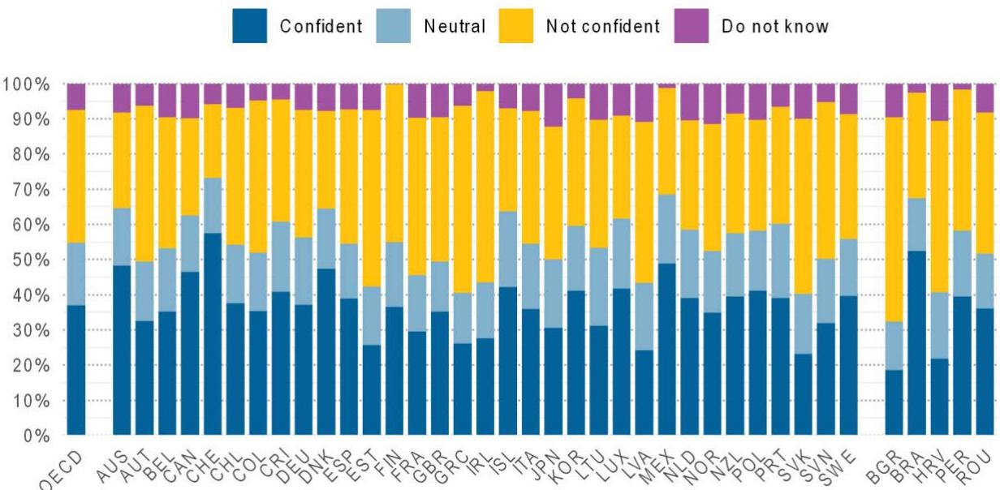  
Note: The figure presents the within-country distribution of weighted response to the question "On a scale of 0 to 10, how confident are you in the national/federal/central government's ability to co-operate with other national stakeholders, such as private sector organisations and trade unions to better tackle long-term challenges?". The "confident" proportion is the aggregation of responses from 6-10 on the scale; "neutral" is equal to a response of 5; "not confident" is the aggregation of responses from 1-4; and "do not know" was a separate answer choice. "OECD" presents the unweighted average of weighted OECD country averages.
Source: OECD Survey on Drivers of Trust in Public Institutions 2025.

There is no one-size-fits-all solution to the appropriate degree and nature of consultation with stakeholders, and practices vary widely across countries and policy areas. Overall, most of OECD Governments have a wide array of consultation mechanisms of stakeholders, but this remains a complex endeavor: how to make these consultations meaningful and effective, how to differentiate consultations of citizens from consultation of stakeholders and the representativity of these stakeholders are all questions that are today at the core of the governance policy agenda (OECD, 2025[5]). Many view politicians and governments as vulnerable to undue influence, but views have slightly improved since 2023.

Public skepticism that policies are responsive to majority views and well-consulted across different stakeholders may be related to doubts about politicians' integrity and the hidden influence of private interests.

StatLink https://stat.link/2kujba

Only around one third of people across the OECD and the participating OECD accession candidate countries find it likely that a politician would refuse to grant a political favour in return for a lucrative private-sector job. Specifically, an average of 32% in the OECD and 34% in participating OECD accession countries find it likely that they would refuse to grant a favour (Figure 4.7). The share who find politicians unlikely to refuse to grant a favour is far larger at 48% across the OECD and 52% across the accession countries. In view of the high skepticism regarding the integrity of politicians, it is particularly noteworthy that there may be some small improvements in these perceptions: Across the sub-sample of OECD countries with relevant information available for all three years, the share saying politicians are unlikely to grant a favour rose by 2 percentage points relative to 2023, returning to 2021 values.

Figure 4.7. There are more people who find it unlikely than people who find it likely that a politician would refuse a well-paid private sector job in exchange for a political favour

Share of the population that finds it likely a politician would refuse a well-paid private sector job, 2025

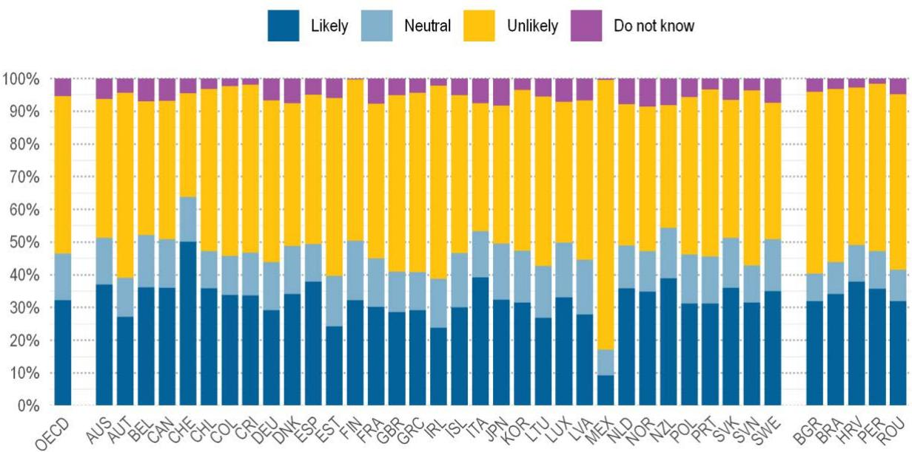  
Note: The figure presents the within-country distribution of weighted response to the question "If a politician was offered a well-paid job in the private sector in exchange for a political favour, how likely do you think it is that they would refuse it?". The "likely" proportion is the aggregation of responses from 6-10 on the scale; "neutral" is equal to a response of 5; "unlikely" is the aggregation of responses from 1-4; and "do not know" was a separate answer choice. "OECD" presents the unweighted average of weighted OECD country averages. Source: OECD Survey on Drivers of Trust in Public Institutions 2025.

People are also skeptical that government withstands efforts at undue influence. 32% across the OECD find it likely that government would refuse a corporation's demand for a policy that could be harmful to society as a whole, while 41% find it unlikely their government would refuse (Figure 4.8). In the five participating OECD accession countries, 33% say their government

StatLink https://stat.link/d7vtac

is likely to refuse, and in Peru, 39% do. Positively, in the 29 OECD countries with available data for 2023 and 2025, the share who find it likely has increased by 3 percentage points. In fact, the share with an optimistic assessment went up more than two percentage points in two thirds of the countries, and only declined by more than 2 percentage points in four countries.

Figure 4.8. Only around one third think government withstands undue influence – a small increase from 2023

Share of population who find it likely that government would refuse a corporation's demand for a policy that could be harmful to society as a whole, 2023 and 2025

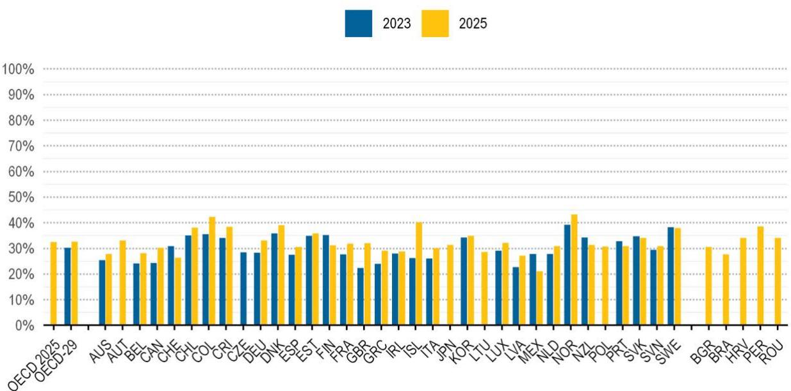

Note: The figure shows the weighted shares of "likely" responses to the questions "If a corporation promoted a policy that benefited its industry but could be harmful to society as a whole, how likely do you think it is that the federal/central/national government would agree to the corporation's demand?". For ease of analysis, the direction of the answers were turned around, to match a share of likely with a positive meaning. In detail, the share of 'likely the government agree to' of the original question corresponds to 'unlikely government refuses' above. The "likely" proportion is therefore the aggregation of responses from 0-4 on the scale of the original question on the 0-10 scale. "OECD 2025" presents the unweighted average of weighted country averages of all OECD countries participating in the 2025 survey wave. "OECD-29" presents the unweighted average of weighted country averages of the 29 OECD countries that participated in both the 2023 and 2025 survey waves.

Source: OECD Survey on Drivers of Trust in Public Institutions 2023 and 2025.

StatLink https://stat.link/9vg27l

Strengthened integrity systems regarding conflict of interest and lobbying may be a potential avenue to support improved perceptions of integrity. Evidence from the OECD Public Integrity Indicators (OECD, 2026[6]) suggest that while among OECD countries $80\%$ of the criteria for the regulation of conflict of interest are fulfilled, when it comes to their implementation, this only applies to $45\%$ of the criteria. Even more notably, OECD countries fulfil $43\%$ and $38\%$ of the criteria on the regulation of lobbying and its implementation, respectively. Depending on the rules already in place, countries could focus on closing the implementation and information gaps and update integrity systems to face emerging corruption risks.

## 4.4. AREAS FOR POLICY ACTIONS TO INCREASE TRUST

Perceptions of government decision making on complex policy issues are highly associated with trust in national governments and legislatures, but are also drivers of trust in local government and the national civil service. Actions that can enhance these views can therefore contribute to strengthening trust in public institutions:

\- Continuing to pay attention to emergency preparedness, which a slight majority across the OECD see positively, can have positive repercussions for trust in government and governmental institutions at all levels. In contrast, acknowledging that fewer than one third believe that government provides appropriate support to people affected by economic crises, and taking steps to help people in precarious financial situations, might yield larger increases in trust in the national government. While fiscal pressures mean that there is a need for efficiency in social programmes, supporting people in accessing benefits for which they are eligible could be one step in this direction (OECD, 2025[1]).

• Enhancing two-way communication on policies that require trade-offs between different policy objectives and the interests of different groups could benefit trust in the national government and legislature. For example, 34% find it likely that government adequately balances between the interests of current and future generations. Since there is no one ‘right’ answer for such trade-offs, enhancing opportunities for different population groups to voice their opinions on different policy initiatives and being transparent when communicating about policy decisions about how different aims or interests were weighted against each other could help improve perceptions of these key public governance drivers.

\- Strengthening the use of evidence and forward planning in policymaking and public service provision can be crucial for enhancing trust. About four in ten people across the OECD find it likely that government draws on the best available evidence when taking decisions and that public services adapt to changing societal needs. Increasing the smart use of evidence by policymakers on the one hand, and the combination of traditional planning tools with anticipatory approaches on the other hand, could help enhance the practices of evidence-informed decision making and dynamic adjustments of essential public services to changing needs. Additionally, the communication on the data being used and the types of data that matter to people could also help improve trust. Over time, such improvements can be reflected in enhanced perceptions. This can contribute to increasing trust in all public institutions, above all the national government, when it comes to evidence-informed decision making, and in the civil service when it comes to adjusting services to changing societal needs.

\- Addressing perceived barriers to 'having a say' in what government does (see Chapter 6) successfully could likewise help increase trust as well as improving people's assessment that they have political voice.

\- Acknowledging that scepticism on the integrity of public representatives and government can remain pronounced even when government takes actions to protect public integrity, governments across the OECD should nonetheless continue to pursue comprehensive integrity frameworks that do not only fulfil good practices regarding regulatory design, but also effective implementation and transparency.

## REFERENCES

OECD (2026), Anti-Corruption and Integrity Outlook 2026: Harnessing the Integrity Advantage, OECD Publishing, Paris, https://doi.org/10.1787/16708b78-en.

OECD (2025), Exploring New Frontiers in Citizen Participation in the Policy Cycle, OECD Public Governance Reviews, OECD Publishing, Paris, https://doi.org/10.1787/77f5098c-en.

OECD (2025), More Effective Social Protection for Stronger Economic Growth: Main Findings from the 2024 OECD Risks that Matter Survey, OECD Publishing, Paris, https://doi.org/10.1787/3947946a-en.

OECD (2025), OECD Survey on Drivers of Trust in Public Institutions in Latin America and the Caribbean 2025 Results, OECD Publishing, Paris, https://doi.org/10.1787/ea3385cf-en.

OECD (2021), Observatory of Public Service Innovation - Intergenerational Fairness Policy Assessment Toolkit, https://oecd-opsi.org/innovations/intergenerational-fairness-policy-assessment-toolkit/(accessed on 30 March 2026).

OECD (forthcoming), Serving Citizens, OECD Publishing, Paris.

OECD/European Commission (2025), Strengthening National Evidence-Informed Policymaking Ecosystems: Lessons from Seven European Countries, OECD Publishing, Paris, https://doi.org/10.1787/855c5286-en.

## NOTES

$^{1}$ The question was not asked in Brazil and Peru, where data collection took place earlier in the context of the OECD Trust Survey in Latin America and the Caribbean (OECD, 2025 $^{[7]}$ ).

$^{2}$ The question was not yet asked in the 2021 Trust Survey wave.

$^{3}$ The question was not yet asked in the 2021 Trust Survey wave.

$^{4}$ The variable also has a marginally positive effect of 1 percentage point on trust in local government. However, this average marginal effect is only statistically significant at the 5% level, compared to 1% for other average marginal effects discussed in the report.

## 5 Trustworthy artificial intelligence in the public sector

Artificial intelligence (AI) is increasingly embedded in how governments design policies, deliver services and manage public administration. As public institutions move to actively procuring, developing and using AI public perceptions of these technologies become a critical factor shaping their legitimacy and effectiveness. This chapter examines how people across OECD member countries view government use of AI and what this means for trust in public institutions, drawing on evidence from the 2025 OECD Survey on Drivers of Trust in Public Institutions.

## Key findings

\- Most people remain sceptical of AI deployment in the public sector, although the high rate of neutral or 'do not know responses suggest lack of information or experience preventing the ability to form a judgement.

\- People are more likely to believe that AI in the public sector can improve service quality and efficiency than to believe it will be fair, transparent, and protective of personal information. Optimism about government use of AI aligns more closely with trust in public institutions at the individual level than at the country level. This means that people in high trust countries (i.e. countries in which a comparatively elevated share of people have high or moderately high trust in public institutions) are not necessarily more positive about AI, whereas high trust individuals (i.e. people who report high to moderately high trust in the government) tend to be.

\- Greater knowledge of AI is associated with higher optimism about government's use of it.

\- The OECD Trust Survey results support the public governance levers set out in the OECD Framework for Trustworthy AI in Government, which helps governments align their use and governance of AI with the OECD AI Principles. Confidence in data handling by public bodies, stewardship of long-term issues, and appropriate regulation of new technologies are associated with a more optimistic view of government use of AI.

Artificial intelligence (AI) is increasingly transforming public sector activity, reshaping processes and outcomes across a wide range of government functions. In this chapter, AI refers to computer systems that can carry out tasks typically associated with human intelligence, including understanding language, learning from data, and supporting decision making. More formally, the OECD defines an AI system as a

"a machine-based system that, for explicit or implicit objectives, infers, from the input it receives, how to generate outputs such as predictions, content, recommendations, or decisions that can influence physical or virtual environments. Different AI systems vary in their levels of autonomy and adaptiveness after deployment." [OECD/LEGAL/0449].

In OECD Member countries, thousands of AI-related projects are now underway, intensifying both public and political attention (OECD, 2025[1]). In addition to their traditional role as regulators in AI, public administrations are now procurers, operational users, and developers of AI systems. They are integrating AI into policy design, public service delivery, regulatory oversight, and back-office processes as part of efficiency-enhancing government modernisations.

As governments deploy AI, the relationship between the state and the public may shift. AI systems increasingly mediate day-to-day interactions with individuals and shape how governments respond to complex policy challenges. Used well, these technologies offer real opportunities to improve productivity, responsiveness and accountability. However, if not developed and used in a trustworthy manner, public institutions face risks that could result in serious harms for individuals and society, potentially undermining the legitimacy of government institution's use of AI and public trust. The costs of inaction are also growing. Failing to engage with AI may limit democratic governments' capacity to deliver public value in a rapidly evolving technological landscape, widening the gap between public and private sector capabilities (OECD, 2025[1]).

The recent OECD report Governing with Artificial Intelligence, and the OECD AI principles which underpin it, underscores that “trustworthiness” is a precondition for the effective and responsible use of AI in the public sector. It identifies public resistance as a potential challenge in almost half of use cases reviewed, reflecting concerns sometimes shaped in part by previous high-profile failures in algorithmic decision making. Addressing this challenge, and the underlying concerns it signals, requires robust governance frameworks that provide clear accountability and avenues for redress, as well as continuous monitoring, oversight, and strong risk-management processes (OECD, 2025[1]). The report sets out three complementary pillars - enablers, guardrails, and engagement - which together form the OECD Framework for Trustworthy AI in Government. This framework seeks to align public-sector AI development and deployment with OECD AI Principles/Recommendation of the Council on Artificial intelligence [OECD/LEGAL/0449] (adopted in 2019, updated in 2024).

Insights from the OECD Trust Survey provide an empirical basis for understanding how public expectations align – or diverge – from current practices. By grounding AI strategies and related activities in evidence about how they are perceived by the public, administrations can better anticipate and mitigate risks and challenges related to public resistance, or inaction. Doing so helps safeguard the potential benefits of AI adoption and supports more trusted, human-centred implementation.

This chapter examines public perceptions of government use of AI and its implications for public trust in public institutions. It begins by presenting overall attitudes towards the use of AI in the public sector, and highlighting cross-country patterns of optimism, scepticism, and uncertainty. The chapter then compares these public expectations with the current landscape of government AI deployment, drawing on findings from Governing with Artificial Intelligence. It next explores how socio-economic characteristics, lived experience, and familiarity with AI shape attitudes toward its adoption in public services. Building on these insights, the chapter assesses key public governance levers that are associated with more positive expectations of government AI use. Together, these sections show that while AI has the potential to enhance trust in public institutions, this outcome depends critically on how governments deploy, regulate, and communicate about AI systems.

## 5.1. MOST PEOPLE REMAIN SCEPTICAL OF AI DEPLOYED IN THE PUBLIC SECTOR

To assess public trust in governments' use of AI, public administrations can track public attitudes toward AI over time to identify where government practice and public expectations may diverge. To this end, the 2025 OECD Trust Survey introduced a new survey question designed to measure public attitudes towards government agencies' use of artificial intelligence. Respondents were asked to assess the likelihood that government agencies will fulfill six different expectations when using AI:

• provide services better tailored to individual needs,

\- reduce costs,

\- protect individuals' personal information from unauthorised access or misuse,

\- maintain human oversight and final decision-making authority in critical areas,

\- be transparent about how and where AI is used in government operations,

\- and ensure fair and unbiased treatment of the population.

For ease of presentation, responses are grouped into four respondent profiles based on how many expectations respondents consider likely to be met when government agencies use AI. A very positive assessment refers to respondents who believe five or six of the above expectations will be met. A moderately positive assessment refers to those who believe three or four expectations will be met. A moderately skeptical assessment refers to those who believe only one or two expectations will be met. A very skeptical assessment refers to respondents who believe none of the expectations will be met. These labels are used throughout the chapter as a shorthand to describe patterns in attitudes towards government use of AI.

OECD Trust Survey results reveal scepticism across the OECD and the European OECD accession candidate countries regarding the potential benefits of AI deployment in government. Selecting zero expected positive expectations of AI use by government, the response for 35% of respondents, is by far the most common result, on average, across OECD countries (Figure 5.1). In contrast, 22% of people have a very positive assessment, 19% a moderately positive assessment, and 25% a moderately skeptical assessment. The shares in the different groups are very similar across the European OECD accession countries $^{1}$ , with 22% having a very positive, 19% a moderately positive, 23% a moderately skeptical and 37% having a very skeptical assessment.

The survey also reveals significant variation by country. Over 40% of people in Estonia, Iceland, Ireland, Latvia,

Norway, the Slovak Republic and the United Kingdom, as well as in Bulgaria, express low confidence in their governments' (potential) use of AI. By contrast, Korea and Switzerland have notably higher shares of respondents expressing positive expectations. These geographic differences suggest that a variety of different factors may shape public confidence in government use of AI, including different experiences with digital government services and distinct cultural attitudes towards technological innovation in the public sector. At the country level (in contrast to the individual level), more prevalent scepticism towards government AI use is not necessarily related to low levels of trust in different public institutions. In other words, high-trust countries do not always have higher rates of optimism towards government use of AI, and lower-trust countries do not always express a more skeptical outlook.

Figure 5.1. Around four in ten people have moderately or very positive views about the potential of AI use by government institutions

Panel A. OECD average distribution
OECD average share of respondents by number of expectations they feel confident in

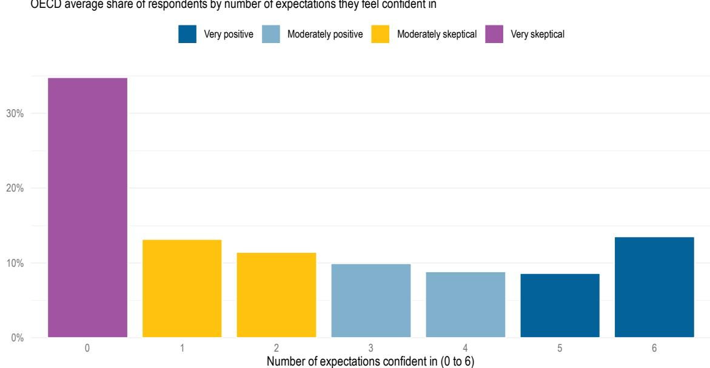

Panel B. Distribution of positive expectations for AI use  
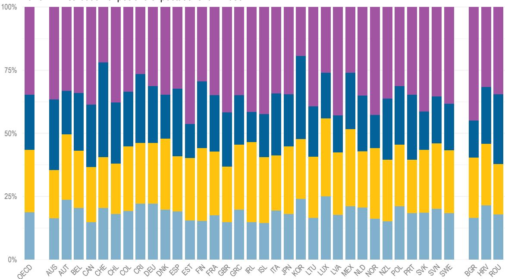

Note: This figure presents confidence in how government agencies will implement and use artificial intelligence. It shows the share of respondents who are confident (responses 6-10 on a 0-10 scale) that government use of AI will fulfil a different number of positive expectations, in response to the question: "Thinking about how government agencies could use AI in the future, how confident are you that they will achieve the following outcomes?". Panel A presents the OECD average distribution of respondents across scores from 0 to 6, where each score reflects the number of expectations in which respondents are confident. Panel B shows country-level shares grouped into four categories: 5-6 expectations (very positive), 3-4 (moderately positive), 1-2 (moderately skeptical), and 0 expectations (very skeptical); the OECD value represents the average of these country shares. The six expectations are: providing services better tailored to individual needs, reducing costs, protecting personal information from unauthorised access or misuse, maintaining human oversight and final decision-making authority in critical areas, ensuring transparency in AI use, and guaranteeing fair and unbiased treatment of the population.
Source: OECD Survey on Drivers of Trust in Public Institutions 2025.

StatLink https://stat.link/gkc8mu

Efforts to gather evidence on public perceptions of government use of AI at the national level are still in their infancy, but some countries have begun to collect such data (see Box 5.1). This type of evidence supports the engagement pillar of the OECD framework for trustworthy AI in government by helping public administrations understand public expectations and tailor participation and communication on how AI is used in government.

## Australia's long-term insights briefing "How might artificial intelligence affect the trustworthiness of public service delivery"

Source: adapted from (OECD, 2025[1]; Government of Australia, 2023[2]).

Beyond this general snapshot of the population's attitudes towards AI in the public sector, a distinct pattern emerges: people express more confidence that government use of AI will improve responsiveness and efficiency (more tailored services, lower costs) than in its ability to uphold procedural values such as transparency, privacy or fairness (Figure 5.2).

\- Overall confidence levels are highest for service improvement (43%) and cost reduction (42%), suggesting that a substantial part of the public broadly recognises AI's potential efficiency and service improvement benefits.

\- Confidence drops when it comes to value-based concerns over processes such as protecting personal information (32%), ensuring transparency (34%) and guaranteeing fair treatment (35%). People's views on whether they believe that humans would maintain oversight of critical decisions are slightly more balanced, with 37% finding it likely and 36% unlikely that they would.

These patterns are broadly consistent across the different OECD and European OECD accession candidate countries.

This aligns closely with findings from the 2024 Risks That Matter Survey (OECD, 2025[3]). For example, $40\%$ consider the use of AI to help process and approve social programme applications to be good for users, while $30\%$ report uncertainty and $25\%$ believe it is not good for users. Attitudes toward data governance are similarly mixed: $37\%$ disagree or strongly disagree that they trust the government with data collected about them through digital tools and AI, compared with $32\%$ who indicate that they do. Finally, fewer than half of respondents $(44\%)$ were confident that AI would be used to assess public benefits applications only when it is safe and trustworthy to do so.

In the OECD Trust Survey, equally notable is the high proportion of neutral and “do not know” responses across all dimensions. On average across the OECD, but with very similar findings for the European OECD accession candidate countries, these range from 9 to 11% for “do not know” alone and reach 25% when combined with neutral responses. This uncertainty suggests a significant portion of the public remains either uninformed about how governments are or might be deploying AI systems, or unable to form confident judgements about these current and potential future applications.

Figure 5.2. People are more likely to believe that AI in the public sector can improve service quality and efficiency than to believe it will be fair, transparent, and protective of personal information

Share who are or are not confident in the potential of government AI use fulfil the respective expectation, OECD, 2025

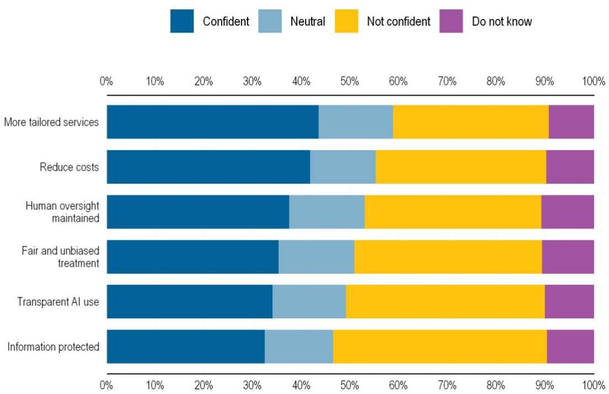

Note: The figure shows the unweighted OECD averages of weighted OECD country averages of responses to the question "Thinking about how government agencies could use AI in the future, how confident are you that government agencies will achieve the following outcomes. "Confident" corresponds to a response of 6-10 on the 0-10 scale, "neutral" to 5 and "not confident" to 0-4 on the 0-10 scale. The OECD average is calculated as the unweighted average of weighted country averages. The sub-questions are: providing services better tailored to individual needs, reducing costs, protecting personal information from unauthorised access or misuse, maintaining human oversight and final decision-making authority in critical areas, ensuring transparency in AI use, and guaranteeing fair and unbiased treatment of the population. Source: OECD Survey on Drivers of Trust in Public Institutions 2025.

StatLink https://stat.link/jhqopk

Taken together, the evidence points to a multiplicity of expectations and comfort levels around AI-enabled services and policies. A sizeable share of people feel unsure about AI and have reservations about the outcomes of its deployment by their government. This underlines the importance of a measured, human-centered approach: offering clear explanations, building confidence over time, and maintaining a multi-channel approach to ensure no one is left out.

## 5.2. AI HAS THE POTENTIAL TO BECOME A TRUST-ENHANCING FORCE DEPENDING ON PUBLIC GOVERNANCE CHOICES

To better understand how AI might affect public trust, it is helpful to compare what the public expects with the way in which government agencies use AI in practice. To do so, this section draws on use cases described in the Governing with Artificial Intelligence report. This approach enables us to assess the extent to which public attitudes and expectations seem to align with current patterns of government AI use. The Governing with AI report uses case studies from countries that participated in the OECD Trust Survey and from some that did not. $^{2}$

Out of 200 AI use cases, the Governing with Artificial Intelligence report found that the four primary domains where governments have concentrated their AI efforts were public service design and delivery, civic participation, justice administration, and law enforcement and disaster risk management (see Figure 5.3). Governments also typically apply AI across four distinct types of activities: public-facing service delivery, internal operations, oversight (both internal and external), and policymaking support. Public-facing service delivery emerged as the dominant use case, followed closely by internal operations (OECD, 2025[1]).

Figure 5.3. Use cases appear most present in public service design and delivery, civic participation, and justice administration

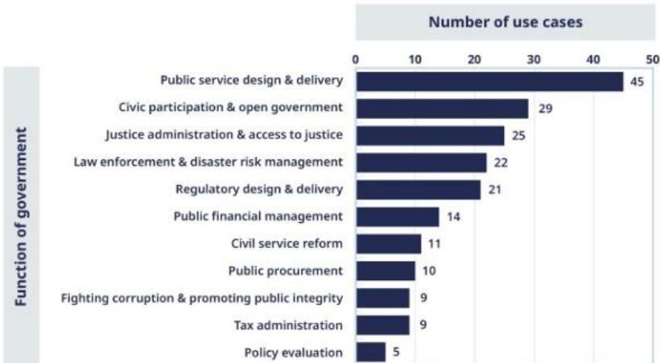  
Source: OECD (2025[1]), Governing with Artificial Intelligence: The State of Play and Way Forward in Core Government Functions, OECD Publishing, Paris, https://doi.org/10.1787/795de142-en; and OECD analysis of identified use cases.

As described in the previous section of this chapter, people express greater confidence in AI's ability to lead to better tailored services at a lesser cost; 43% expect service improvement and 42% expect cost reductions for government. The larger share of use cases deployed in public service design and delivery, and in civic participation suggest governments have in part concentrated their efforts in areas of relatively strong public acceptance. These functions of government create a lower-risk entry point for administrations: by demonstrating clear, tangible value in domains that the public already supports, governments can build credibility, strengthen trust, and lay the groundwork for expanding AI use into more sensitive or complex areas over time.

Taken together, this evidence points to clear pathways through which AI use in government could positively affect trust in public institutions. Performance improvements in public services are one of the most direct channels: public-facing service delivery is the predominant application area, and 45 of 200 documented use cases focus on public service design and delivery. This matters as satisfaction with administrative services is linked to higher trust in all four institutions, with the largest associations for trust in the civil service (5.4 percentage points) and local government (4.1 percentage points).

Emerging use cases help illustrate what these improvements can look like in practice (OECD, 2025[1]). For example, France's Services Publics+ platform points to a complementary pathway, using AI (e.g., speech-to-text, drafting support, and feedback analysis) to improve accessibility and responsiveness while keeping public servants in control of final decisions (Government of France, 2026[4]).

AI-facilitated civic participation, the second most common type of government AI use case observed (see Figure 5.3), could lead to more effective participatory processes, which in turn could raise levels of public trust. In OECD countries, only 31% of respondents feel that the political system lets people like them have a say in what government does, and 32% feel governments are likely to adopt the proposals emanating from public consultations (see Chapter 6). AI deployed for civic participation could help address this by synthesising insights from large volumes of public consultation input, generating responses and updates to participants, enabling faster fact-checking, detecting misinformation, and making complex information more accessible to the public (OECD, 2025[1]; Adam, 2023[5]). All of these processes can help governments respond more quickly and accurately to public preferences and demands.

Regression analysis of OECD Trust Survey results suggest that these innovations could increase trust in public institutions (see Chapter 1). Government adoption of public opinion in consultations is associated with higher trust in national government (2.0 percentage points), while broader perceptions of political efficacy show strong associations with trust in the national government and legislature (3.2-3.4 percentage points), and weaker ones with trust in local government (1.7 percentage points). If AI tools can make participation feel more influential, this could translate into wider gains in institutional trust.

AI deployment in justice administration and law enforcement are the third and fourth most common government functions for AI applications (Figure 5.3). AI can notably help justice systems by streamlining administration, providing data-driven insights, supporting legal inquiry, easing backlogs and complex procedures while improving public access which represent a high value added sector for the wider use of AI. However, these government functions are sensitive and typically subject to more public resistance.

Nevertheless, to achieve these positive outcomes, the Governing with AI report names a number of preconditions to mitigate the risks associated with the use of AI (Box 5.3). Among them are ensuring that the data on which AI models are built are sufficiently complete, that the algorithms used are transparent and that decisions remain explainable and contestable (OECD, 2025[1]). Spain and the United Kingdom have developed tailored approaches to address these issues (see Box 5.2).

## Box 5.2. Balancing efficiency and integrity concerns in the use of AI in the UK and Spain's Judicial Systems

Two countries have taken distinct approaches to governing AI use in their judicial systems. The United Kingdom has issued guidance for judicial office holders, while Spain has established a comprehensive and binding national policy. Both frameworks aim to balance innovation with judicial integrity while addressing risks such as bias, confidentiality, and accountability.

## United Kingdom

The UK AI Judicial Guidance provides direction for judicial office holders on appropriate AI use in courts and tribunals. It applies to all judicial personnel under the Lady Chief Justice and Senior President of Tribunals. The guidance provides principles, identifies acceptable uses like text summarization and administrative tasks, while cautioning against reliance on AI for legal research. It emphasises confidentiality, accountability, bias mitigation, and security, and warns against AI-generated misinformation in proceedings.

## Spain

In June 2024, Spain approved its National Policy on the Use of Artificial Intelligence in the Administration of Justice. Grounded in the Justice Digital Efficiency Act, the policy establishes a framework for responsible AI use across the entire judicial process. It draws a clear line between systems that could affect judicial independence and those intended purely for administrative purposes. It permits AI for document summarisation and administrative automation but prohibits automated decision-making without human oversight and the generation of binding legal content from protected data. Oversight is divided between the General Council of the Judiciary (CGPJ) for judicial functions and CTEAJE for administrative contexts, with mandatory algorithmic audits and FAT (Fairness, Accuracy, and Transparency) registers.

Source: adapted from OECD (2025[1]), Governing with Artificial Intelligence: The State of Play and Way Forward in Core Government Functions, OECD Publishing, Paris, https://doi.org/10.1787/795de142-en.

As seen in this section, the current distribution of AI use in the public sector aligns closely with areas where citizens express the greatest optimism about AI's potential benefits, such as more tailored services and greater efficiency. This suggests that governments' AI efforts may contribute to greater public acceptance. Moreover, mapping deployment patterns against Trust Survey results indicates that public sector use of AI has the potential to improve governance performance and public perception of key drivers of trust in public institutions.

At the same time, this alignment is neither automatic nor guaranteed. The OECD report Governing with AI underscores that if public authorities manage AI risks poorly, the potential for error and backlash is significant and could undermine trust (OECD, 2025[1]). The box below summarises the main risks associated with AI, and the specific ways these risks can be heightened in government use cases.

## Box 5.3. Risks around AI use in government

The global adoption of AI across sectors raises questions about trust, fairness, privacy, safety, and accountability, among others, which may necessitate specific governance processes or mitigation measures. It is therefore important for governments to identify and manage these risks, consider how AI systems may impact people, help ensure the delivery of AI benefits and mitigate potential harm. The Governing with AI OECD report identifies five general types of risks for the use of AI in government, distinct from any implementation challenges:

- Ethical risks: These include AI uses that undermine the free exercise of human rights and freedoms, including privacy, potentially infringing on human-centred values either deliberately or inadvertently. AI algorithms can introduce ethical risks from the digital realm to the physical world through biased algorithms and unethical behaviours like invasive surveillance. Key concerns include threats to trust, fairness, freedom, dignity, individual autonomy and labour rights.

- Operational risks: These include technical and operational failures that might affect data privacy, the quality of AI outcomes and internal government operations due to cybers threats, unintended consequences, hallucinations, systematic errors and overreliance on AI systems.

- Exclusion risks: These risks relate to gaps that arise when citizens without access to technology or digital literacy can be left behind and unable to benefit from AI advancements in public services.

- Public resistance risks: These include public resistance to government use of AI. This can be driven by distrust in government AI systems or processes, or by the spread of false or misleading information about how AI is implemented in public administrations and its potential impacts.

- Risks of inaction: Although often overlooked, this risk includes government delays in using AI to yield positive benefits. This can result in significant financial and non-financial costs — which could have otherwise been avoided with AI’s successful adoption — and a widening gap between public sector and private sector capabilities.

Source: adapted from OECD (2025, pp. 32-35 $^{[1]}$ ), Governing with Artificial Intelligence: The State of Play and Way Forward in Core Government Functions, OECD Publishing, Paris, https://doi.org/10.1787/795de142-en.

These concerns are not merely hypothetical. The OECD AI Incidents Monitor data shows a steady increase in incidents and hazards covered by media outlets, and in January 2026, one in five recorded incidents (115 out of 599 incidents) relates to “government, security and defence” underscoring the very real risks associated with public sector deployment of AI (OECD, 2026[6]). One example of real-world harm is the Netherlands’ Toeslagenaffaire in which an AI system used by the government led to 26 000 families being wrongfully accused of fraud due to an algorithm that disproportionately targeted families with dual nationalities or migrant backgrounds (OECD, 2025[1]).

Of course, many of the risks associated with AI are not entirely new. In practice, AI systems often amplify familiar governance failures, such as over-reliance on technical tools, weak accountability, and the uncritical acceptance of outputs as authoritative. The British Post Office scandal, in which hundreds of sub-postmasters being wrongly prosecuted after faults in an accounting system generated incorrect shortfall data for example, was not AI-related, but shows how serious harm can result from unchecked software-generated information (Growns et al., 2024[7]).

Nevertheless, it is also noteworthy that the government functions in which AI use cases are the most common (service design and delivery) are also the areas in which people see the highest potential. As AI applications by government institutions become more common, the share of the population with positive assessments may rise. It may also not, as greater awareness of AI use could heighten perceptions of risk, potentially unevenly across the population.

## 5.3. ATTITUDES TOWARDS AI USE IN THE PUBLIC SECTOR ARE UNEVEN ACROSS POPULATION GROUPS

## 5.3.1. Patterns of optimism towards government use of AI mirror several of the socio-economic and demographic gaps observed in trust in the national government

In the context of AI-enabled reforms or services, uneven confidence in the public sector's use of AI could trigger resistance among those with the most sceptical views or widen perceptions of government competence and values across a country's population, with implications for trust.

OECD Trust Survey data show consistent demographic and socio-economic patterns in attitudes toward public sector use of AI across OECD countries (see Figure 5.4). Scepticism increases with age, rising from 24% among 18–29-year-olds to 41% among those 50 and older. Positive attitudes on the other hand remain relatively flat across age groups. Scepticism drops from 42% among those with lower levels of formal education to 28% among the highly educated, while positive attitudes rise from 18% to 27%. Women express higher scepticism (38% vs. 31% for men) and lower positive sentiment (18% vs. 25% for men). Lastly, individuals who feel they may face discrimination or feel financially insecure show higher rates of scepticism (40% and 37% respectively) and lower positive attitudes (20 and 19%).

When comparing the magnitude of these gaps, education emerges as the strongest differentiator, with a 14 percentage point spread in scepticism and 9 percentage points in positive attitudes. Financial concerns produce the same size gap as education with regards to positive attitudes (9 percentage point gap), while age generates the widest scepticism divide at 17 points, despite minimal difference in positive sentiment. This pattern suggests structural factors such as education and economic security shape attitudes towards AI more strongly than demographic characteristics do alone.

These observed patterns of optimism towards government use of AI mirrors several of the socio-economic and demographic gaps observed in trust in the national government. In particular, the same groups that report lower trust, those experiencing financial insecurity and those who feel they may face discrimination, also tend to be more sceptical and less positive about government use of AI. Education shows a similarly consistent pattern: higher educational attainment is associated with both higher trust in national government and more favourable expectations about AI in government (lower scepticism and higher positive attitudes). Taken together, these overlaps suggest that attitudes towards government AI are not only about the technology itself but also reflect broader lived experiences with institutions.

At the same time, the comparison also points to important differences, notably by age and (to some extent) between men and women. Trust in national government varies only modestly by age, and is slightly higher among older respondents, whereas scepticism about AI rises sharply with age. This divergence implies that age-based gaps in AI attitudes may be driven less by general institutional trust and more by AI-specific concerns such as unfamiliarity, perceived loss of human oversight over decision making, or heightened sensitivity to potential harms. Women also appear more sceptical and less positive about government AI than men, and this gap may be larger than the corresponding trust gap, suggesting that AI may amplify concerns that are not fully captured by general trust measures.

Finally, it is worth noting that the previously explained finding that people are more optimistic about AI's potential responsiveness and efficiency benefits in government (more tailored services and lower costs) than about value-based aspects (privacy, transparency, and fairness) holds true across different demographic groups.

Panel B. Pessimism Index (Confident in 0 outcomes)

Panel A. Optimism Index (Confident in 5 to 6 outcomes)

Figure 5.4. Socio-economic and demographic characteristics are associated with varying levels of optimism/pessimism towards AI use in the public sector

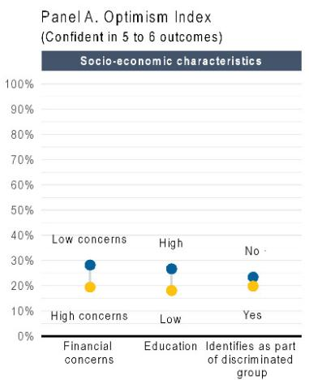

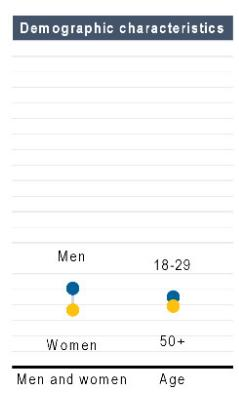

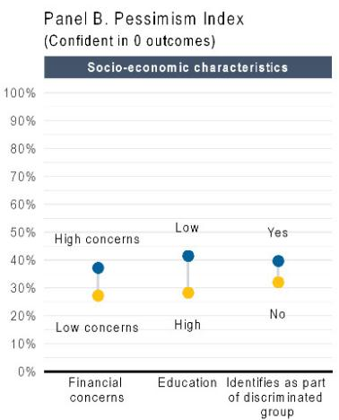

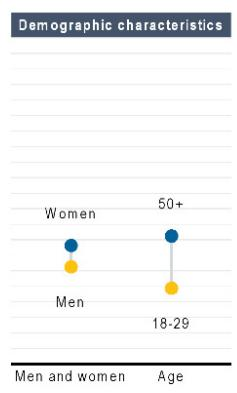  
Note: The figure shows the OECD average for the share who have a very positive (panel A) or very skeptical (panel B) perspective on the potential for government agencies' use of artificial intelligence to fulfil positive expectations among the respective population group. The OECD average is calculated as the unweighted average of weighted country averages. A very positive assessment is defined as being confident in five to six items, with confidence corresponding to a 6-10 response on the 0-10 scale. A very skeptical assessment is defined as being confident with regards to zero items. The underlying question is "Thinking about how government agencies could use AI in the future, how confident are you that government agencies will achieve the following outcomes?". The items are providing services better tailored to individual needs, reducing costs, protecting individuals' personal information from unauthorised access or misuse, maintaining human oversight and final decision-making authority in critical areas, being transparent about when and how AI is used, and ensuring fair and unbiased treatment of the population.

Source: OECD Survey on Drivers of Trust in Public Institutions 2025.

## 5.3.2. Greater familiarity with AI is associated with higher expectations of its benefits

Despite its apparent pervasiveness in every facet of our lives, most people have only a general or no understanding of what AI is, which poses a significant challenge for public bodies deploying AI technologies. Even with comprehensive frameworks for trustworthy AI in place, low familiarity with AI risks increasing perceptions of opacity in government affairs, highlighting the tension between the rapid pace of AI implementation and the slower pace of public understanding and democratic processes. Moreover, these findings underscore the importance of the "engagement" pillar of the OECD Framework for Trustworthy AI in Government, which emphasises user-centred and responsive approaches. By actively engaging stakeholders, including the public, civil society, and businesses, governments can enhance

StatLink https://stat.link/b2a6l1

public understanding of AI and its implications for governance (OECD, 2025[1]).

Individual interests and experiences with AI are increasingly seen as potential predictors of AI attitudes (Kanzola, Papaioannou and Petrakis, 2024[8]). On average across the OECD, fewer than one in ten $(8\%)$ report not being familiar with AI, while four in ten $(40\%)$ report understanding it well enough to explain it to others and half $(50\%)$ say they have a general idea of what it means (see Figure 5.5). These patterns are very similar in the European OECD accession candidate countries. Familiarity tends to be higher among younger people and those with higher levels of education, while older and less-educated groups more commonly report limited understanding or no familiarity. In contrast, differences in awareness or understanding between men and women or people with and without financial concerns are present but more modest.

Figure 5.5. Four in ten people across the OECD assess their knowledge of artificial intelligence as sufficiently strong to explain it to others

Share of the population by self-reported knowledge of artificial intelligence, OECD, 2025

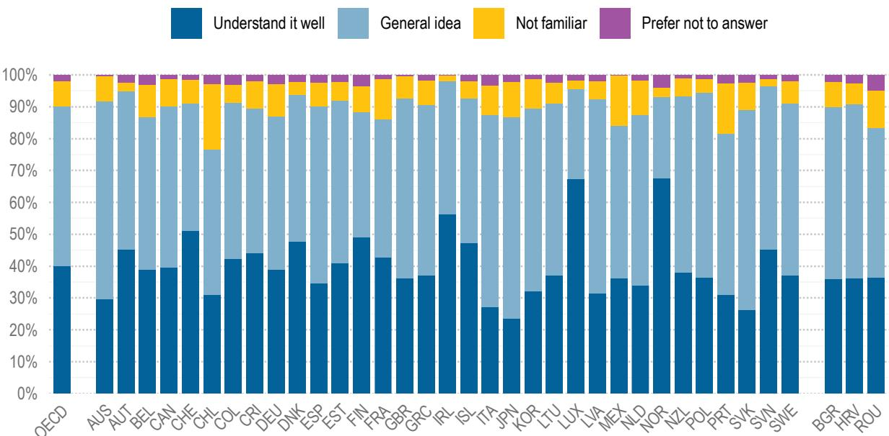  
Note: The figure shows the within-country distribution of answers to the question "How familiar are you with the term "artificial intelligence (AI)". "OECD" is the unweighted average of the weighted OECD country averages.  
Source: OECD Survey on Drivers of Trust in Public Institutions 2025.

Familiarity with artificial intelligence is associated with higher expectations about the potential benefits of AI in government, although even well-informed users have positive expectations of government use of AI in only two areas (see Figure 5.6). Among people who feel they understand AI well enough to explain it to others, three in ten are very optimistic (having positive expectations in five to six areas), compared with around two in ten among those who only have a general idea of what the term means. By contrast, people who are least familiar with AI - and whose only knowledge may stem from the explanation $^{3}$ provided in the survey following the question on how well they know AI - tend to express much lower confidence, with

StatLink https://stat.link/si28p3

only around one in ten holding such views. This pattern aligns with the existing literature, which finds that people with stronger AI-related interests or experience often evaluate AI more positively (Kim and Lee, 2023[9]; Kovačević and Demić, 2023[10]).

Regardless of whether respondents report being somewhat or very familiar with the term ‘artificial intelligence’, they are more likely to expect AI to improve services and reduce costs than to expect it to be fair and transparent, protect personal information, and remain subject to human oversight. Among people who are unfamiliar with the term, the assessments are much more uniformly negative (see Figure 5.6).

Figure 5.6. Familiarity with AI is associated with more positive expectations towards AI use in the public sector

Share of respondents who are confident that AI use by government agencies can fulfil positive expectations for the respective item, by their self-assessed knowledge of AI, OECD average, 2025

Among people who understand AI well
Among people who know about AI in general terms
Among people not familiar with AI

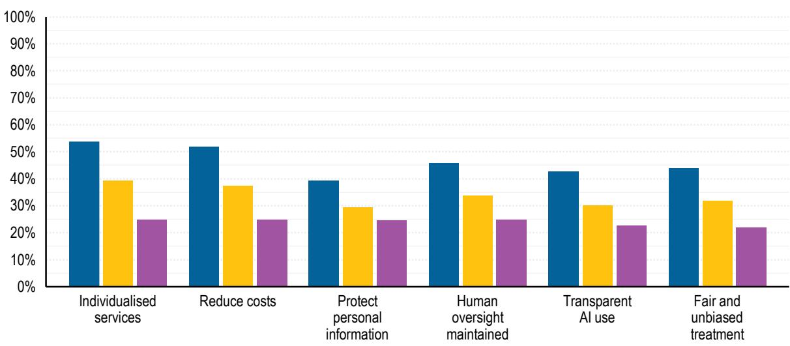  
Note: The figure shows the share of "confident" responses to the question "Thinking about how government agencies could use AI in the future, how confident are you that government agencies will achieve the following outcomes. "Confident" corresponds to a response of 6-10 on the 0-10 scale. The OECD average is calculated as the unweighted average of weighted country averages.
Source: OECD Survey on Drivers of Trust in Public Institutions 2025.

StatLink https://stat.link/afmisd

Taken together, these findings suggest caution when interpreting results on “optimism” or “scepticism” toward government use of AI as fully informed, stable attitudes: for many respondents, “AI” may function as a broad shorthand shaped by partial information, media narratives, or general trust in government and technology. Low familiarity can also amplify perceptions of opacity in government decision-making, meaning that expressed scepticism may reflect concerns about transparency, control, and accountability as much as views on any specific AI application. At the same time, these perceptions, even when imperfect or based on limited understanding, still shape people’s lived experiences of public services and, ultimately, their trust in public institutions. This is precisely the value of a perception survey: it captures how government action is received and interpreted by people, complementing objective performance indicators that measure what systems do in practice.

Overall, these findings highlight that public attitudes toward AI in government are shaped by structural factors such as education, economic security, and familiarity with digital technologies. Uneven understanding and experiences with AI risk reinforcing existing divides if governments do not proactively address concerns around fairness, transparency, and accountability. Building acceptance therefore requires not only trustworthy systems, but also meaningful engagement with the groups most likely to feel skeptical.

## 5.4. PUBLIC GOVERNANCE LEVERS FOR MORE TRUSTWORTHY AI

Socioeconomic factors play a role in perceptions of government use of AI, yet government actions can strongly influence public acceptability. The OECD Framework for Trustworthy AI highlights concrete public governance levers that aim to align government practice with OECD AI principles [OECD/LEGAL/0449] and ultimately increase confidence in how public institutions use AI (OECD, 2025[1]) These levers fall into three groups:

\- Enablers make responsible adoption possible and includes governance capacity, data and digital infrastructure, skills, financing, procurement, and partnerships.

\- Guardrails set expectations for transparency and accountability through rules, guidance, oversight, and evaluation mechanisms.

\- Engagement with stakeholders, civil society and the public ensure deployment of AI remains human-centered and responsive.

Evidence from the OECD Trust Survey enables us to assess an underlying proposition of this framework: stronger public governance, and positive perceptions of it, are associated with trustworthiness and more optimistic views of government use of AI. If this relationship holds, it suggests the existence of a virtuous cycle by which better governance supports more trustworthy AI deployment, which can in turn improve outcomes for people and strengthen their broader perceptions of government competence and trust.

Regression analysis of the 2025 Trust Survey results points to several consistent governance drivers of optimism about AI in the public sector (Figure 5.7). $^{4}$ Importantly, the model includes all public governance dimensions measured in the survey, allowing the analysis to identify which dimensions are most strongly associated with higher optimism in AI public sector use across the full set of governance variables, not a pre-selected subset.

The most important variable by far is confidence that government will regulate emerging technologies appropriately to help businesses and citizens use them responsibly. Other aspects of public governance tied to stewardship around long term issues, such as balancing the interests of different generations, reducing greenhouse gas (GhG) emissions, and cooperating with a wide range of stakeholders are also strongly associated with more positive perceptions of AI. Confidence in the government's use of personal data, trust in the national civil service and especially in the national government likewise seem to lead to more optimistic views of AI use in the public sector, however to a lesser degree. This nevertheless confirms the potential for a virtuous cycle.

Figure 5.7. People who find it likely that government appropriately regulates new technologies to help businesses and citizens use them responsibly are more likely to view AI in the public sector positively

Coefficients from a regression of the number of government AI items seen with confidence on perceptions of public governance and individual characteristics

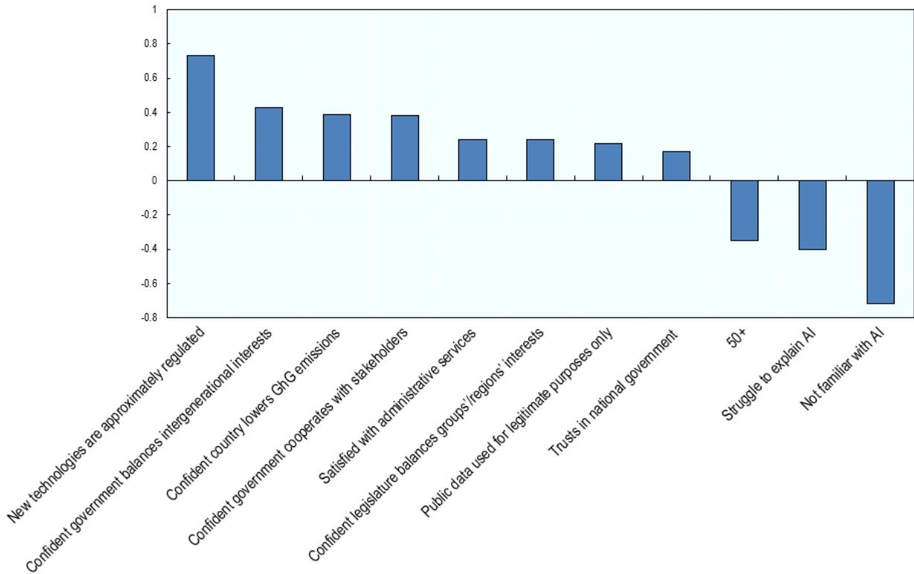  
Note: The figure shows selected results of an ordinary least squares regression of the number of items that individuals view with confidence in response to the question "Thinking about how government agencies could use AI in the future, how confident are you that government agencies will achieve the following outcomes.". A confident assessment is an answer of 6-10 on the 0-10 scale. The maximum number of items is six. The regression includes perceptions of all public governance dimensions covered in the survey and trust in the national government and civil service, all coded into the categories 'Likely/Satisfied/Confident/High or moderately high trust' (responses 6-10 on the 0-10 scale), 'neutral' (response 5), 'Unlikely/unsatisfied/not confident/Low or no trust' (responses 0-4) and do not know. The regression coefficients of all public governance drivers where the coefficient was equal to or above 0.2 are shown. The regressions control for individual demographic characteristics, educational attainment, AI knowledge and country and is based on data for the participating OECD countries. Source: Estimates based on the OECD Survey on Drivers of Trust in Public Institutions 2025.

## 5.4.1. Confidence in the government's regulatory approach for emerging technologies is associated with positive perceptions of AI use in the public sector

There is a significant relationship between confidence in the government's regulatory approach for emerging technologies and positive perceptions of AI use. Individuals who believe it is likely that the government will regulate new technologies appropriately to help individuals and businesses use them responsibly $^{5}$ are confident in 0.75 more items out of six than otherwise similar individuals do (Figure 5.7). Survey participants could interpret effective regulations to be ones that are risk-based, proportionate, and designed to maximise benefits and promote innovation while mitigating potential harms. This relationship demonstrates a larger effect than socio-economic or demographic characteristics, and of any other public governance variable, making perception of regulatory activity the variable with the greatest effect on attitudes towards AI adoption.

In the face of this developing architecture, across the OECD, 42% of people believe it is likely that

governments will appropriately regulate new technologies to help businesses and individuals use them responsibly (see Figure 5.8). In most of the participating OECD accession candidate countries with the exception of Brazil, the share is lower. This figure has on average remained stable since 2023, even though the question wording has very slightly changed. $^{6}$ However, confidence levels vary significantly across countries. More than half of respondents express optimism in Australia and Korea (54%), Finland (56%), Mexico (55%) and Switzerland (60%), while confidence is considerably lower in Estonia and Slovenia (33%), Ireland (30%), Latvia (26%), and the Slovak Republic (28%). Between 2023 and 2025, several countries saw notable improvements of 5 percentage points or more, including Australia, Luxembourg, Portugal, Switzerland and the United Kingdom, with Korea showing the largest increase at 12 percentage points.

## Figure 5.8. Around four in ten find it likely that government adequately regulates new technologies

Share of the population who find it likely that their government will appropriately regulate new technologies to help businesses and citizens use them responsibly, OECD, 2025

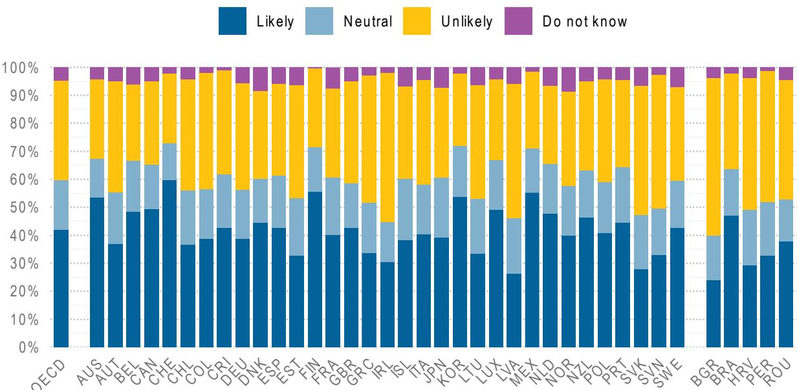  
Note: The figure presents the within-country distributions of responses to the question "If new technologies (for example artificial intelligence) became available, how likely do you think it is that the federal/central/national government would regulate them appropriately to help business and citizens use them responsibly?". The "likely" proportion is the aggregation of responses from 6-10 on the scale; "neutral" is equal to a response of 5; "unlikely" is the aggregation of responses from 0-4; and "Don't know" was a separate answer choice. "OECD" presents the unweighted average of the weighted OECD country averages.

## 5.4.2. Confidence in government stewardship on long term issues is associated with positive perceptions of AI use in government

Confidence in the ability and willingness of public administrations to steward their country on long term issues is also associated with optimism towards AI use (Figure 5.7). Individuals who feel their country will reduce GhG emissions over the next ten years, select

## StatLink https://stat.link/7a29li

0.39 more positive AI expectations out of six; those who are confident in the government's ability to cooperate with stakeholders on long term issues, such as private sector organisations and trade unions, and to balance the interests of current and future generations, select 0.38 and 0.4 more items, respectively. At present, the share of the population confident in these aspects of public governance stands at 38%, 37% and 34% respectively.

A plausible reading of these results is that governance of long-term issues such as balancing the needs of current and future generations and reduction of GhG emissions and AI governance are policy issues that share structural features, such that confidence in the public administration's capacity to manage one is logically aligned with confidence in its capacity to manage the other. In this sense, perceptions may be driven less by issue-specific performance and more by a general assessment of whether government can credibly coordinate across borders and stakeholders while acting on problems that are either long-term (as in mitigation of GhG emissions and other issues with potentially long-ranging consequences) or fast-moving (as in AI).

## 5.4.3. Confidence in the government's use of personal information is associated with positive perceptions of AI use in the public sector

Trust in government data handling is also associated with higher confidence in AI deployment within the public sector. 2025 Trust Survey findings indicate that individuals who find it likely that government institutions use personal data only for legitimate purposes are more optimistic about AI implementation, selecting 0.25 more positive items when asked about potential benefits of government AI use than people who find it unlikely (see Figure 5.7). This gap exceeds demographic divides, such as 0.21 more items selected by men than by women and 0.12 more items selected by those with a post-secondary degree compared to those who did not graduate from upper secondary education. It is however smaller than the difference in items selected by age (0.35 more items selected by 18–29-year-olds than by 50+), and AI familiarity (0.74 more items selected by those who feel they could explain AI to others compared to those who do not know what it is). These findings suggest that building public trust in how governments manage personal data could be a small but effective lever for improving attitudes toward AI adoption in public services.

Data serves as a critical input for AI systems, with performance directly tied to the quality and quantity of training data. This implies that AI's growth in government is inseparable from an increased need for safe data sharing and solid data gathering. However, this expansion introduces significant tensions: data may be incomplete, poorly structured, or inconsistently digitised, reflecting broader quality challenges. In addition to quality concerns, governance frameworks for data sharing and management are often outdated or fragmented, leading to non-strategic and siloed approaches (OECD, 2025[1]). Lastly, governments face complex challenges in safeguarding privacy, preventing skewed data that can lead to adverse outcomes for some individuals or groups, and ensuring data security while overcoming operational hurdles (OECD, 2024[11]).

Public perception of government use of personal data remains moderately positive across OECD member countries. In 2025, 52% of people found it likely that government agencies use personal data only for legitimate purposes (see Figure 5.9). This share is 20 percentage points higher than the proportion who believe governments will protect personal information from unauthorised access or misuse when using AI specifically. (see Figure 5.2).

Confidence in this aspect of public governance varies widely by country, with particularly positive perceptions in Finland (79%) and much lower levels of confidence in several countries, notably Colombia (34%), Chile (37%), the Slovak Republic (38%), and Greece (39%). In the participating OECD accession candidate countries, the share who are confident range from 29% in Peru to 45% in Romania. For the 18 OECD countries for which this indicator is available for all three survey waves, the share has essentially remained stable. Despite overall stability, a few countries recorded notable gains since 2023. These include Australia, Canada, Costa Rica, Mexico and Switzerland, where the share of people confident in their government's use of personal data increased by 5 percentage points or more. Japan saw the largest improvement (compared to 2021), rising from 30% to 44%. Colombia, Estonia, and Greece on the other hand witnessed a decline of 5 percentage points or more.

Figure 5.9. Just over half across the OECD find it likely that government agencies use personal data for legitimate purposes

Share of population who find it likely or unlikely that a public agency would use their personal data for legitimate purposes only, 2025  
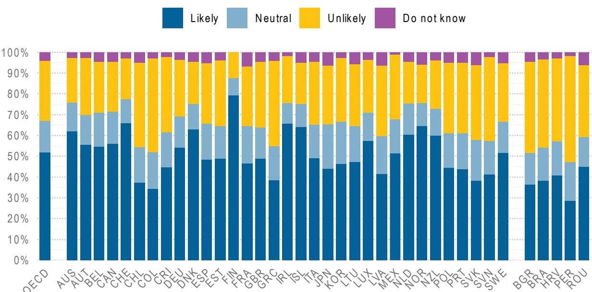  
Note: The figure presents the within-country distributions of responses to the question "If you shared your personal data with a public agency/office/department, how likely do you think it is that it would be used for legitimate purposes only?". The "likely" proportion is the aggregation of responses from 6-10 on the scale; "neutral" is equal to a response of 5; "unlikely" is the aggregation of responses from 0-4; and "Don't know" was a separate answer choice. "OECD" presents the unweighted average of the weighted OECD country average responses. Source: OECD Survey on Drivers of Trust in Public Institutions 2025.

StatLink https://stat.link/qghx3w

Evidence from the OECD Trust Survey therefore suggests that data governance is essential not only for deploying AI systems effectively, but also for building public trust in their use. The OECD's Governing with AI report outlines a range of tools to support this, drawing on the OECD Framework for Data Governance in the Public Sector, which can be adapted for data used in AI systems (OECD, 2025[1]).

To ensure that governments use AI systems built on high-quality data which can be scaled beyond pilots and small experiments, a clear strategic vision and associated implementation and monitoring activities are essential. Yet the 2023 OECD Digital Government Index finds that only 59% of OECD countries have a public-sector data strategy, and even fewer provide actionable implementation guidance or have the capacity to implement their vision (OECD, 2024[12]; OECD, 2026[13]). In addition to a robust strategic framework, binding instruments are essential to orchestrate and accelerate data collection and exchange between public institutions, while safeguarding individual rights and privacy. Clear, up-to-date, and enforceable legislation on data governance and personal data protection is therefore vital to deploying trustworthy AI systems at scale. Beyond legal frameworks, governments can also use non-binding policy instruments to strengthen data governance and protection (see Box 5.4).

## Box 5.4. Bolstering confidence in data privacy

## Norway regulatory sandbox for AI and data protection

Norway has set up a regulatory sandbox on AI and data protection. It embeds “Data Protection by Default and Design” in AI innovation that uses personal data, encouraging PETs. Lessons from sandbox projects feed into practical guidance and capability-building at Datatilsynet.

## France Privacy Award

Since 2016, France's CNIL and Inria have run the CNIL–Inria Privacy Award to encourage research in data protection and privacy. Papers are selected for scientific excellence and societal impact. Recent editions have highlighted AI-relevant topics such as algorithmic transparency, PETs, and anonymisation risks.

## Estonia Ministry of Economic Affairs and Communications "Bürokratt" procurement process

Estonia shows how procurement can steer privacy-preserving AI. In 2022, the Ministry of Economic Affairs and Communications launched “Bürokratt,” an AI-based virtual assistant for public services. Its procurement has prioritised PETs such as federated learning and synthetic data to reduce privacy risks.

## Korea's Personal Information Protection Commission guide for personal information processing and AI development

Korea's Personal Information Protection Commission has issued a guide on personal information processing and AI development (2023). It clarifies legal bases for processing, sets safety expectations, and outlines measures to protect individuals' rights in AI systems.

Source: (OECD, 2025[14]; OECD, 2025[1])

## 5.5. AREAS FOR POLICY ACTION TO INCREASE TRUST

Overall, the 2025 OECD Trust Survey shows that public attitudes toward government use of artificial intelligence are marked by both cautious optimism and some reservations. While many people recognise AI's potential to improve the efficiency and responsiveness of public services, confidence remains significantly lower when it comes to safeguarding public sector values such as oversight transparency, fairness, and data protection. These concerns are not evenly distributed: scepticism is highest among groups that already face structural vulnerabilities or have lower levels of familiarity with AI, underscoring the need for human-centred approaches to AI governance.

The evidence also highlights a clear link between broader perceptions of public governance and optimism toward public-sector AI adoption. Strengthening these governance foundations can therefore serve as a double dividend: improving the trustworthiness of AI systems while reinforcing overall confidence in public institutions.

While government institutions in different countries are proceeding at varying paces in leveraging AI, results from the OECD Trust Survey suggest that regardless of the level adoption, a few guiding principles could support people's perception of trustworthiness of government uses of AI:

\- Embedding and investing in core public sector values and safeguards throughout the AI lifecycle could help support people's confidence that the government's use of AI is transparent and fair.

\- Investments in transparency, better public communication and the recognition of different attitudes toward (and levels of knowledge of) AI could help reduce scepticism towards the government's use of it.

\- Focus on practical, user-centred applications while maintaining accessible alternatives:

Prioritise AI uses that improve service quality and responsiveness in ways that are visible to users, while maintaining non-digital and human-supported channels for those who prefer these modes of access.

\- Evaluate and communicate impacts on service outcomes, equity and user experience.

\- Maintain an adaptive governance approach for emerging technologies, grounded in public interest objectives and long-term stewardship, so that AI use can improve public governance while also remaining consistent with evolving risks, societal expectations, and regulatory practice.

\- Given that personal data protection is an important a driver of trust in public institutions, data governance must continue to be a foundation for the trustworthy use of AI by the public sector, and safeguards well communicated to the public.

## REFERENCES

Adam, M. (2023), Artificial intelligence, democracy and elections, https://www.europarl.europa.eu/thinktank/en/document/EPRS\_BRI(2023)751478.

Government of Australia (2023), Long-Term Insights Briefing, https://www.pmc.gov.au/sites/default/files/resource/download/ltib-report-how-might-ai-affect-trust-ps-delivery.pdf.

Government of France (2026), Découvrez les nouveaux engagements du service public | Services Publics+, https://www.plus.transformation.gouv.fr/ (accessed on 27 February 2026).

Growns, B. et al. (2024), "The Post Office Scandal in the United Kingdom: Mental health and social experiences of wrongly convicted and wrongly accused individuals", Legal and Criminological Psychology, Vol. 29/1, pp. 17-31, https://doi.org/10.1111/lcrp.12247.

Kanzola, A., K. Papaioannou and P. Petrakis (2024), "Unlocking society's standings in artificial intelligence", Technological Forecasting and Social Change, Vol. 200, p. 123106, https://doi.org/10.1016/j.techfore.2023.123106.

Kim, S. and Y. Lee (2023), "Investigation into the Influence of Socio-Cultural Factors on Attitudes toward Artificial Intelligence", Education and Information Technologies, Vol. 29, https://link.springer.com/article/10.1007/s10639-023-12172-y.

Kovačević, A. and E. Demić (2023), "The Impact of Gender, Seniority, Knowledge, and Interest on Attitudes to Artificial Intelligence", IEEE Access, Vol. 12, https://doi.org/10.1109/access.2024.3454801. [10]

OECD (2026), AIM: AI Incidents and Hazards Monitor, https://oecd.ai/en/incidents?search\_terms=%5B%5D&and\_condition=false&from\_date=2020-02-16&to\_date=2026-02-16&properties\_config=%7B%22principles%22:%5B%5D,%22industries%22:%5B%22Government,%20security,%20and%20defence%22%5D,%22harm\_types%22:%5B%5D,%22harm.

OECD (2026), OECD Going Digital Toolkit, https://goingdigital.oecd.org/indicators (accessed on 27 February 2026). [13]

OECD (2025), Governing with Artificial Intelligence: The State of Play and Way Forward in Core Government Functions, OECD Publishing, Paris, https://doi.org/10.1787/795de142-en. [1]

OECD (2025), More Effective Social Protection for Stronger Economic Growth: Main Findings from the 2024 OECD Risks that Matter Survey, OECD Publishing, Paris, https://doi.org/10.1787/3947946a-en. [3]

OECD (2025), OECD Regulatory Policy Outlook 2025, OECD Publishing, Paris, [15] https://doi.org/10.1787/56b60e39-en.

OECD (2025), "Sharing trustworthy AI models with privacy-enhancing technologies", OECD Artificial Intelligence Papers, No. 38, OECD Publishing, Paris, https://doi.org/10.1787/a266160b-en. [14]

OECD (2024), "2023 OECD Digital Government Index: Results and key findings", OECD Public Governance Policy Papers, No. 44, OECD Publishing, Paris, https://doi.org/10.1787/1a89ed5e-en. [12]

OECD (2024), "AI, data governance and privacy: Synergies and areas of international co-operation", [11] OECD Artificial Intelligence Papers, No. 22, OECD Publishing, Paris, https://doi.org/10.1787/2476b1a4-en.

## NOTES

$^{1}$ The questions on AI knowledge and AI use by governments were not asked in Brazil and Peru due to the earlier implementation of the survey in these countries.

$^{2}$ Use cases of AI are evolving rapidly. Findings from a Global Call for Governing with AI (https://oecd.ai/call-ai-in-gov), launched by the OECD in early 2026, may show that the volume and distribution of use cases has already changed since the publication of the Governing with AI report. These cases will be published on the OECD.AI Policy Observatory.

$^{3}$ The wording of the explanation is as follows: “Artificial Intelligence (AI) refers to computer systems that can perform tasks typically requiring human intelligence, such as understanding language, learning from data, or making decisions. You may be familiar with AI in everyday tools like smart assistants (e.g., Alexa, Siri) or personalized online recommendations. Governments also increasingly use AI for various purposes. The following question will ask about your opinions on government use of AI. Please consider both potential benefits and risks in your responses.”

$^{4}$ The analysis is an ordinary least squares regression. The dependent variable is the count of the number of items of the potential AI outcomes variable that individuals see positively, ranging from 0 to 6. The explanatory variables are trust in the national government and national civil service, the perceptions of the different public governance dimensions and satisfaction with administrative services. Control variables are knowledge of AI, demographic characteristics, education and country fixed effects.

$^{5}$ To learn more about the OECD's work on regulation, see, for example, the latest Regulatory Policy Outlook (OECD, 2025 $^{[15]}$ ).

$^{6}$ The question wording changed from “If new technologies (for example artificial intelligence or digital applications) became available, how likely do you think it is that the federal/central/national government will regulate them appropriately and help businesses and citizens use them responsibly?” in 2023 to “If new technologies (for example artificial intelligence) became available, how likely do you think it is that the federal/central/national government would regulate them appropriately to help business and citizens use them responsibly?”

## 6 Political voice, barriers to participation and implications for trust in government

Political voice is a central pillar of democratic governance and a key driver of trust in public institutions. Drawing on findings from the 2025 OECD Survey on Drivers of Trust in Public institutions, this chapter examines how people across OECD and OECD accession candidate countries perceive their ability to influence government decisions, the forms of political participation they consider effective, and the barriers that limit meaningful engagement. Overall, the chapter underscores the need for policy efforts that go beyond electoral participation to rebuild responsiveness and expand meaningful civic space.

## Key findings

\- As can be expected in democracies, voting remains by far the most common political activity among participants in the 2025 OECD Trust Survey. Moreover, more than two thirds (68%) of people view voting as moderately or significantly influential on what government does.

\- At the same time, perceived political voice remains low across OECD countries, with most people feeling they lack influence over what government does — a persistent and central driver of low trust in public institutions. Three in ten people are confident that the political system in their country allows people like them to have a say in what government does, and four in ten are confident in their own ability to participate in politics, on average across OECD countries, with relative stability since 2021.

\- This contradiction between voting being seen as influential in policy decisions and people feeling they lack influence over what the government reflects that voting is not sufficient anymore for citizens to feel heard, and that, today, complementary forms of citizens' participation in decision making are necessary for trust. However, survey data show that other forms of political participation are not sufficiently seen as effective for having a voice: For example, only 39% and 35% across the OECD think that participating in a public consultation and in a townhall, respectively, have moderate or significant influence on what government does.

\- In addition, the 2025 wave of the OECD Trust Survey explored, for the first time, barriers to political influence and participation. Barriers to influence are more frequently driven by perceptions of unresponsive political officials than by practical constraints. 40% of people, across OECD countries, believe elected officials “do not care about people like me,” while lack of time, resources, networks, or information are secondary (albeit not insignificant) factors.

\- To strengthen trust, priorities should aim at rebuilding responsiveness and strengthening civic space, creating meaningful opportunities for citizens engagement, as well as improving communication from government and reducing barriers to engagement.

## 6.1. INTRODUCTION

Results from multiple waves of the OECD Trust Survey have found that people's trust in government institutions is significantly associated with their sense of having an effective say in what government does (OECD, 2024[1]; OECD, 2022[2]). Indeed, the concept of political voice has been one of the strongest correlates of trust in government institutions in OECD countries (see Chapter 2), even when controlling for other perceptions of public governance and background characteristics like education (see Chapter 1).

Relatively low perceptions of political voice and efficacy – which are found in many OECD countries – are therefore troublesome for anyone interested in building or reinforcing trust in democratic public institutions. Without meaningful political voice and a sense of efficacy, democracies risk diminished participation, unequal representation, and weakened legitimacy (Dahl, 1972[3]; Verba, Schlozman and Brady, 1995[4]; Norris, 1999[5]). Structural reasons that explain this perceived lack of political voice may lie in the evolution of expectations driven by higher levels of education and the means of expression that digitalisation has brought to societies. In response, many countries have established a wide array of consultation and participation mechanisms that have multiplied over the years, but have not been taken to their full potential, lacking appropriate methodology, prioritisation, responsiveness, clarification of intent and more broadly institutionalisation as part of representative democracies (OECD, 2025[6]).

Looking across the 33 OECD and 5 OECD $^{1}$ accession candidate countries in the Trust Survey, this chapter takes stock of perceptions of political voice, self-reported incidences of political participation, and people's socioeconomic, informational and political barriers to greater engagement with government.

While most individuals are skeptical about political agency, voting continues to be seen as the most impactful way to influence public policy.

## 6.2. VOTING REMAINS AT THE CORE OF POLITICAL VOICE IN REPRESENTATIVE DEMOCRACIES

## 6.2.1. Voting is by far the most common way by which people engage in political and civic life

As can be expected in representative democracy, voting in elections remains the most common form of political participation across OECD countries. Nearly eight in ten respondents (79%), on average across the participating OECD countries, report $^{2}$ having voted in the last national election in their country. 44%, on average, report having voted in any (municipal, regional or national) election in the past twelve months (Figure 6.1). $^{3}$ Participation rates in the five OECD accession countries that were part of the 2025 Trust Survey data collection are similar to those in the OECD: the share who voted in the last national election ranged from 68-88%.

For other forms of political participation, those with relatively low barriers to entry, such as signing a petition (23%), posting political content on social media (15%), and boycotting products for political reasons (14%) are, on average across OECD countries, more commonly reported than more time-intensive activities. These include attending contacting a politician or government official (10% on average cross-nationally); attending a townhall (7%) or meeting of a trade union or political party (6%); participating in a public consultation (8%); demonstrating (9%) or participating in a strike (5%); and running for or holding an elected office (2%). These more explicitly “political” activities are notably less common than volunteering for a social or environmental cause, which 13% of respondents report doing, on average across countries.

These reported behaviours are very similar across the five participating OECD accession countries. The only exception is a substantially higher prevalence of participating in strikes (12%), which is driven by a higher prevalence in Brazil and especially in Peru.

Patterns of engagement with politics and civics vary from country to county. Putting aside voting in an election or a referendum in the past year, in some countries a relatively high share of people report participating across multiple activities. In other countries, a few items stand out:

\- In Ireland (53%), Iceland (49%), and – to a lesser extent -- Luxembourg (39%), a relatively higher share of the population signed a petition in the past year. Irish and Icelandic people also more frequently posted political content on social media or boycotted products for political reasons.

\- A higher share of people in Ireland (49%) and Slovenia (31%), as well as Brazil (20%) in comparison to other participating OECD Accession countries, contacted a politician.

\- Over one in five people in Ireland (23%) and Mexico (20%) participated in a public consultation.

Figure 6.1. Voting is the most common form of political activity across countries, followed by signing petitions and boycotting products  
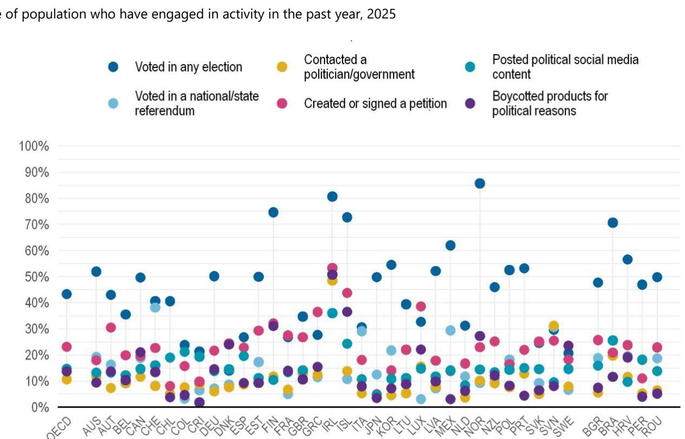  
Note: The figure shows the respective share of population who answered "yes" to one of the given activities in the question "Over the last 12 months, have you done any of the following activities?". "OECD" refers to the unweighted average of weighted OECD country averages. Source: OECD Survey on Drivers of Trust in Public Institutions 2025.

StatLink https://stat.link/uk06vz

## 6.2.2. Most say voting has an impact on government actions

Voting is seen as the key tool to influence policy (Chapter 7). A majority across the OECD believe that when people like them vote in elections or in a referendum, this can influence the policy decisions government takes. The share across the OECD who believe that voting in an election has a significant or moderate influence on what government does are 40% and 28%, respectively – in total, a solid majority at 68% (Figure 6.2). A slightly smaller share of 60% believe that voting in a regional or national referendum has a moderate or significant influence. In the European accession countries, the assessments are slightly less positive, but those who believe that voting in elections (56%) or referendums (50%) carries moderate or significant weight still make up a majority. Running or holding office is only seen as moderately or significantly influential by 45% across the OECD and 37% across the European OECD accession candidate countries. Since the question did not specify whether the office in question was at local, regional or national level, it is possible that respondents would have provided a different reply if the question had focused on national-level office specifically.

Figure 6.2. A vast majority believe voting in elections and referendums can influence government

Share of population who indicate different levels of influence of indicated form of civic participation on what government does, OECD, 2025

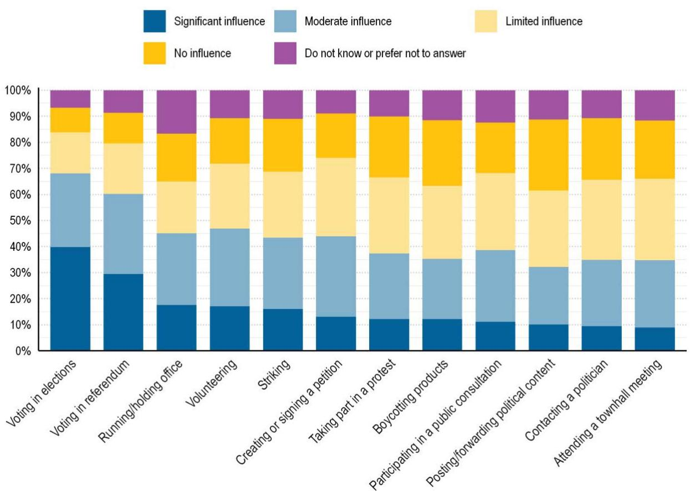  
Note: The figure shows the unweighted OECD averages of responses to the question "In your opinion, how much influence can each of the following actions, when taken by people like you, have on what government does? By 'significant influence', we mean an action that is likely to lead to direct policy changes or serious consideration by decision makers." Source: OECD Survey on Drivers of Trust in Public Institutions 2025.

StatLink https://stat.link/w4bi93

## 6.2.3. Despite people's views that they can influence what government does through voting, there is widespread scepticism that political systems let people have a say

The positive view that people have about their influence through voting in elections or referenda, which is what would be expected in democracies, does not translate into a broader perception that they are heard by government. Only 31% of people across the OECD are confident that the political system in their country allows people like them to have a say in what government does (Figure 6.3), on average, and 52% are not confident. In only one country – Switzerland (65%) – do greater than 50% of people say the system allows people like them to have a say. Cross-nationally, this rate of 31% confident is a very small increase of around 1 percentage point compared to results in 2023, regardless of whether the sample of OECD countries is restricted to those with available data for all 2021-2025 survey waves or only the 2023 and 2025 waves. In the OECD accession countries participating in the 2025 Trust Survey, even fewer individuals believe that they have a say: proportions range from 14 to 28%.

Confidence in one's own ability to participate in politics is also relatively low. Four in ten individuals are confident in their own ability to participate in politics, on average across OECD countries, with rates exceeding 50% in only Ireland, Mexico and Switzerland (Figure 6.3). The cross-national average shows very little movement since 2023. Contrary to the results on perceived political voice, people in participating OECD accession countries do not necessarily feel less confident in their ability to participate in politics.

## Figure 6.3. In almost all OECD and OECD accession countries, only a minority feel confident in their own ability to participate in politics and that people like them have a say

Share of population who find it likely that the political system allows them to have a say in what government does and in their own ability to participate in politics, 2025

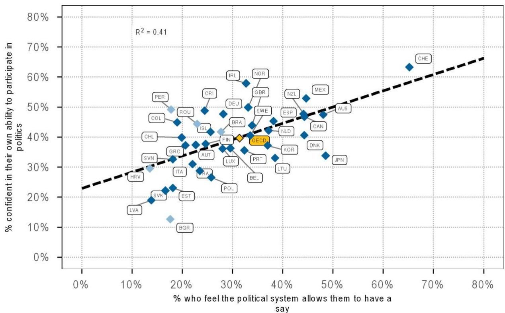  
Note: The chart illustrates the percentage of respondents reporting "likely/confident" to the question: "How much would you say the political system in your country allows people like you to have a say in what the government does?" and "How confident are you in your own ability to participate in politics?". The "likely/confident" proportion is the aggregation of responses from 6-10 on the 0-10 scale. "OECD" presents the unweighted average of the weighted OECD country averages. Shares for OECD countries are shown in dark and for OECD accession candidate countries in light blue.  
Source: OECD Survey on Drivers of Trust in Public Institutions 2025.

## 6.3. BARRIERS TO INFLUENCE AND PARTICIPATION

Given the consistent finding that people are not confident that the political system lets people like them have a say in what government does, the 2025 Trust Survey included new questions on the impacts of different activities, the perceived barriers to influence, participation and reasons for non-participation.

StatLink https://stat.link/6308tk

## 6.3.1. Public consultations or self organised political participation are not filling the gap

There is a disconnect between the 68% who assign moderate or significant influence on the process of voting, and the 31% who are confident that people like them have a say in what government does. Yet other types of political and civic participation, self-organised, organised by civil society, or organised proactively by government do not appear to be adequately filling the gap in the extent of influence on government affairs that people feel they should have versus what they perceive having.

Different types of in-person participation are perceived as less impactful than voting but still noteworthy. Volunteering (47% across the OECD and 45% across the European OECD accession candidate countries), striking (43% and 42%) and taking part in a protest (37% and 40%) are assessed as significantly or moderately influential by a relatively large minority, while a similar share have a positive view of the effect of creating or signing petitions (43% and 42%). Other types of participation such as contacting a politician (35% in OECD and 27% in European accession countries), boycotting products for political reasons (35% and 34%) or posting or forwarding political content online (32% and 33%) are only seen as moderately or significantly impactful around a third of people.

Directly engaging with officials or in participatory democratic activities such as public consultation is seen as only slightly more impactful. Across the OECD and OECD accession candidate countries, 39% and 32%, respectively, expect that participating in a public consultation can have significant or moderate influence on what government does. 35% across the OECD and 27% across the European OECD accession candidate countries view attending townhall meetings as potentially impactful.

The relatively muted optimism towards the impact of public consultation tracks with widespread scepticism that government would adopt opinions that are expressed in a public consultation (Figure 6.4). Across the OECD, 32% find it likely that government would adopt opinions expressed in a public consultation. In the participating OECD accession countries, the share is higher in Brazil (39%).

Figure 6.4. Government is perceived as unlikely to adopt public opinions expressed in consultations  
Share of population who find it likely or unlikely that government would adopt opinions gathered in public consultation, 2025  
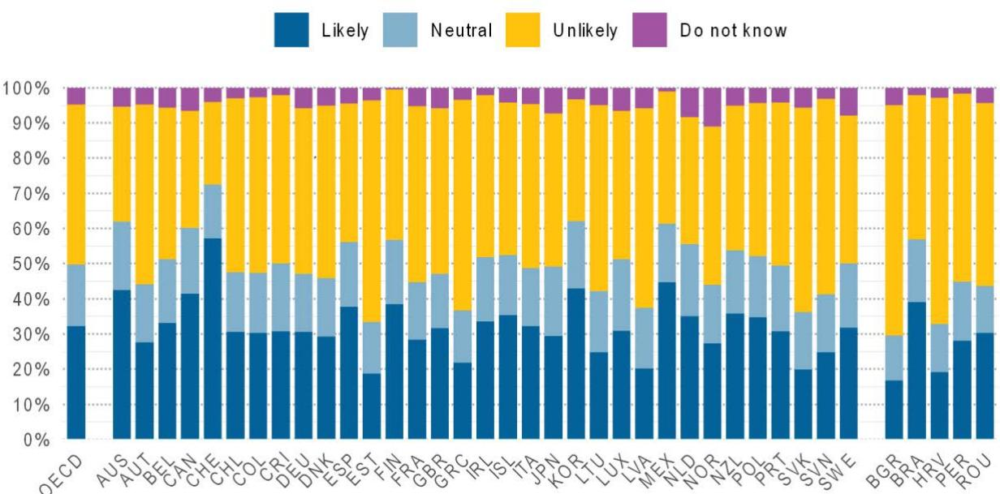  
Note: The figure presents the within-country distributions of responses to the question "If you participated in a public consultation on reforming a policy area, how likely do you think it is that the government would adopt the opinions expressed in the consultation?". The "likely" proportion is the aggregation of responses from 6-10 on the scale; "neutral" is equal to a response of 5; "unlikely" is the aggregation of responses from 0-4; and "Don't know" was a separate answer choice. "OECD" presents the unweighted average of weighted OECD country averages.

Source: OECD Survey on Drivers of Trust in Public Institutions 2025.

## 6.3.2. Political officials are viewed as out of reach

Looking at self-reported barriers to having a say in what government does reveals three noteworthy groupings. One sizeable group of barriers is characterised by the view that political officials are out of reach. A remarkable 40% of all respondents, cross-nationally for the OECD, say elected officials “do not care about what people like me want,” on average across countries, with slight majorities in Estonia, Ireland, Latvia and Mexico reporting feeling like elected officials do not care about people like them. Iceland and Japan are in fact the only two countries where “elected officials do not care about people like me” is not the most commonly cited answer (Figure 6.6). The common identification of this perceived barrier can be related to the relatively low confidence in the responsiveness of public consultation mechanisms (Section 6.3.1), along with limited confidence in elected representatives responding meaningfully to people's contacts (see Chapter 7).

Cross-nationally, 28% report that a reason for people like them to not have a say is a lack of opportunities to talk with elected officials or government representatives, and around 15% (figure not shown) say it is a lack of networks or organisations they could use to engage in politics – potentially reinforcing this sense of distance with public officials. In the European OECD accession countries, all three sentiments are more common: 49% state that elected officials do not care about people's opinions, 30% that there are no opportunities to talk with elected officials, and 18% that there are no organisations they could use to engage in politics. (Respondents could select more than one barrier).

## Box 6.1. Why not participate? Insights on abstention from political activities

The 2025 wave of the OECD Trust Survey also explored the reasons people report for not engaging in various activities with democratic institutions and public officials.

## Around one-third choose to abstain from political activities

Putting aside the sizeable shares who had no possibility to participate because of the absence of activities, the most common explanation for non-participation is “I chose not to participate”, selected by around 30% of people who did not participate in the activity in question (Figure 6.5, yellow bar). Another 6% to 11% of all respondents say they were not eligible, and 7% to 12% select “other” as their reason for not participating in different activities. Yet it is difficult to assess who chose not to participate versus who was constrained from participating from the survey responses offered (Figure 6.3). Both groups present challenges for representative democracy fulfilling its potential, but people who chose not to participate and those who were constrained from participating would benefit from different policy responses to engage them in policymaking.

Figure 6.5. Around three in ten of people who did not vote in any election or participate in public consultations or townhall meetings chose not to do so

Indicated reason for non-participation in respective activity, OECD average, 2025

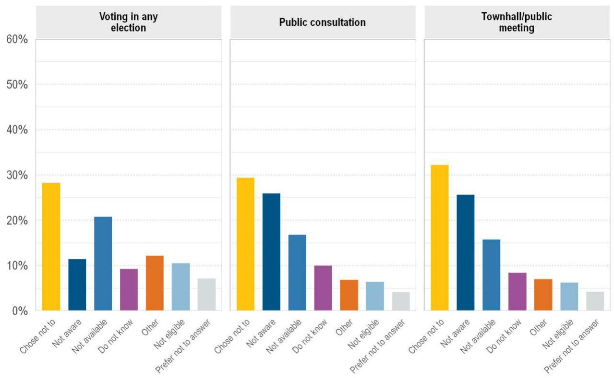  
Note: The stacked bars present reported reasons for not participating in each of the four activities in response to the question "For each of the following activities you did not participate in during the past 12 months, what was the main reason you did not participate?". The OECD average is equal to the unweighted average of the weighted OECD country shares among respondents who had not participated in the activity who selected the respective reason.  
Source: OECD Survey on Drivers of Trust in Public Institutions 2025.

StatLink https://stat.link/rix93y

## Many feel politicians do not care about people like them, while those abstaining are more likely to report disinterest

When asked about barriers for “people like [them] to have a say in what government does”, the “chose not to participate” group shows a similar overall pattern of responses as the full population, but with subtle differences. In both groups, an assumed lack of care by public officials towards people was by far the most commonly cited reason. Explanations such as a lack of time, money or networks were mentioned slightly less frequently among those who abstained from participating. Those who abstained were more likely to report a lack of interest – suggesting that, for many, non-participation may reflect an active choice, rather than financial or time constraints. This result merits following over time, as political apathy presents risks for democracy – it can erode accountability and the representativeness of democratic decision making.

## 6.3.3. Socioeconomic factors, like financial insecurity, influence ability to participate

A second set of barriers is socioeconomic. Around 21% of people, on average across OECD countries, say that a barrier to political voice is having no time to engage in politics; around 19% mention insufficient money to engage in politics; and 18% geographical distance from sites of decision making (Figure 6.6). These reasons are slightly more frequently mentioned in the full population than in the groups who chose not to participate. Reported barriers vary across socioeconomic groups (Box 6.2).

Countries in which socioeconomic barriers are relatively infrequently mentioned are Spain (11%) with regards to time constraints; Portugal and the Netherlands (12%) with regards to financial constraints; and – perhaps unsurprisingly – Luxembourg (8%) with regards to distance from decision-making centres. In the European OECD Accession countries, slightly more people identify financial barriers (23%) and slightly fewer time barriers (19%), while geographic distance is selected with similar frequency as in OECD countries.

Figure 6.6. The perception that political officials are out of touch is seen as a top barrier to having an effective say in policymaking  
Share of people who identify the statement as a potential barrier for people like them to have a say in what government does, 2025  
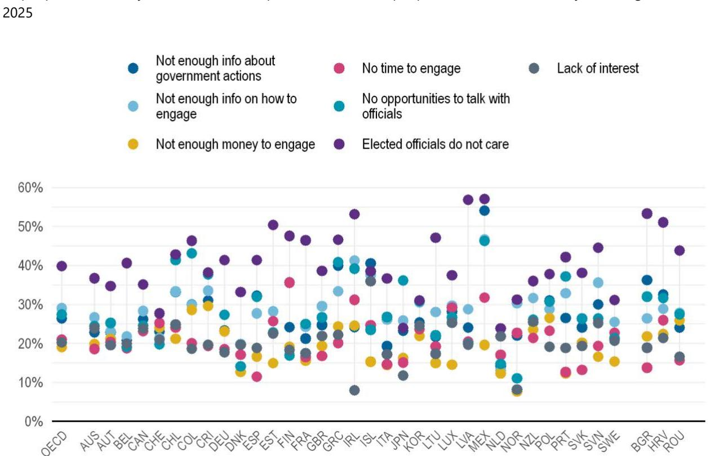

Note: The figure shows the selected responses to the question "Which of the following are barriers for people like you to have a say in what government does?". Respondents could select multiple options from ten possible explanations, and "I do not think there are barriers for people like me to have a say" was an answer option as well. Across the OECD, 13.1% of respondents selected this option. "OECD" corresponds to the unweighted averages of the weighted OECD country averages.
Source: OECD Survey on Drivers of Trust in Public Institutions 2025.

StatLink https://stat.link/7lemsn

## Box 6.2. Barriers to participation vary across groups

Different groups of people may face conditions that differentially affect their ability to participate in political and civic spaces. The 2025 Trust Survey results show that reported financial stress is associated with consistently higher levels of reported barriers to political participation across several dimensions. Respondents with financial concerns are more likely to report both a lack of information about government action and difficulties in understanding how to engage, with differences of around 6 percentage points compared to those without financial concerns. Financial cost also emerges as a particularly salient barrier for this group, with around one in five indicating that lack of money limits their ability to have a say, compared to around one in ten among people without financial concerns.

Differences across income groups point to additional constraints related to time and perceived responsiveness. Low-income individuals are more likely to report lack of time as a barrier (22% compared to 16%) and are also more likely to feel that elected officials do not care about people like them (43% compared to 35%). A similar gap in perceived responsiveness is observed between men and women, with 44% of women reporting that officials do not take their needs into account compared to 36% of men. Differences in reported access to information are narrow across both income and gender groups.

By contrast, differences by education are smaller and less consistent. While access to information about government action is broadly similar across education levels, higher shares of more highly educated respondents report not having enough information about how to engage with policymaking (30.6% compared to 25.4%).

Source: OECD Survey on Drivers of Trust in Public Institutions 2025.

## 6.3.4. Information can be perceived as a barrier to having a say even among those relying on news media for information about politics and current affairs

A final set of barriers to participation is characterised by low information. 29% of individuals, on average across countries, say they do not have enough information about how to engage with government, and 27% say they do not have enough information about what government does, with rates ranging from 13-14% in the Netherlands to 47 to 54% in Mexico. Interestingly, people who chose not to participate in politics (Box 6.1) report higher knowledge of governments' actions and how to engage with government than the rest of the population.

The shares in the European OECD accession countries are similar, though with a tendency towards more people feeling that they do not have information about what government does (31%) versus about how to engage with government (28%). Low information is once again less frequently mentioned by people who chose not to participate or did not participate for another reason.

Across the OECD, the most common source of information about politics and current affairs is broadcast journalism, with 68% of respondents using it (Figure 6.7 Figure 6.5). This is followed by social media consumption (47%) and reading print journalism, be it online or on paper (45%). Conversations with other people are another important source of information about current affairs (36%), while 12% listen to podcasts and 6% use generative artificial intelligence as a source of this type of information.

Interestingly, media consumption is actually higher among those who report a lack of information about government than among the population overall. Among people who identify information gaps as a reason why people like them do not have a say in what government does, consumption of these different information sources is 2 to 8 percentage points higher than among the general population (Figure 6.7). The

gaps are particularly large for consuming social media in a typical week and for conversations with other people. Perhaps some individuals in this group may simply have higher requirements for considering themselves well-informed than is true in the general population – in other words, they know what they do not know – or they may feel others do not have adequate information.

Figure 6.7. Broadcast journalism and social media are the most frequent sources of information about politics and current affairs

Share that uses the respective media as a source of information about politics and current affairs in a typical week, OECD, 2025

Total (all respondents)

Among people who: lack of info on government action

Among people who: lack of info about how to engage with government

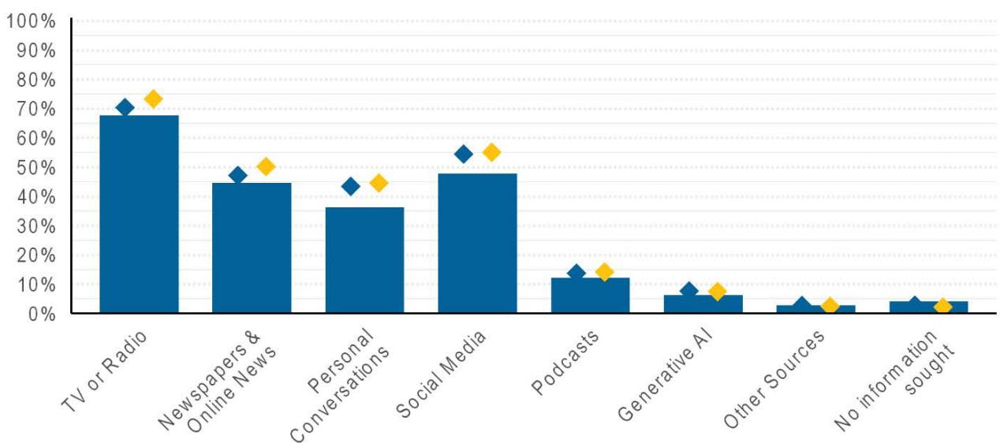  
Note: The figure shows the unweighted OECD average of the weighted OECD country average shares of different forms of media use among 1) the overall population (blue bars); 2) individuals who say a lack of information on government action is a barrier to people like them having a say (blue diamonds); and 3) individuals who say not enough information on how to engage with government is a barrier to people like them having a say (yellow diamond). The shares are derived from the response to the question "On a typical day, from which of the following sources, if any, do you get information about politics and current affairs?". Respondents were able to select all responses that applied. The respondents who view a lack of information as a barrier were identified through their answers to the question "Which of the following are barriers for people like you to have a say in what government does?"
Source: OECD Survey on Drivers of Trust in Public Institutions 2025.

Individuals who say public officials do not care about people like them are, perhaps unsurprisingly, less likely to trust government than other respondents (Figure 6.8). The same cannot generally be said for people who see a lack of engagement options as a barrier to having a say. The gap in trust in the national government between those who perceive officials as insensitive to people's preferences and those who do not amounts to 16 percentage points. This is a substantial trust gap that is nonetheless much smaller

StatLink https://stat.link/d05hqz

than the gap identified between people who feel like the political system lets people like them have a say and those who do not (see Chapter 2). In contrast, the gap in trust between individuals who identify a lack of engagement opportunities with officials as a barrier and those who do not only amounts to 3 percentage points. In other words, opportunities to engage seem to matter less than the perception that policymakers care.

Figure 6.8. Perceptions of engagement opportunities with officials are only slightly related to trust in the national government, while officials' concern for people matters much more

Share of respondents reporting high or moderately high trust in the government among individuals who do and do not identify limited opportunities to engage with officials and officials not caring what people like them want as barriers to having a say, OECD, 2025

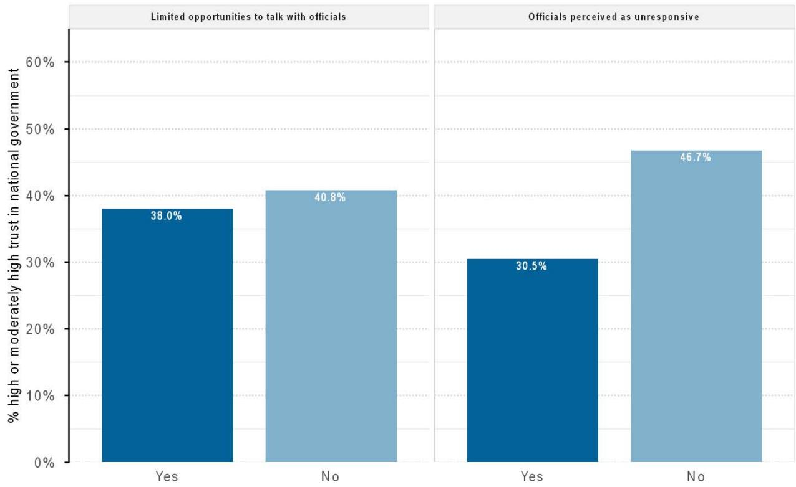  
Note: The figure shows the share with high or moderately high trust in the national government, depending on whether they identified limited opportunities to talk to officials or officials not caring about what people want as a barrier to having a say in what government does. The share with high or moderately high trust corresponds to respondents who select an answer from 6 to 10 to the question "On a scale of 0 to 10, where 0 is not at all and 10 is completely, how much do you trust the national government?". Whether or not the respondent identifies these barriers to having a say is derived from their answer(s) to the question "Which of the following are barriers for people like you to have a say in what government does?", for which they can select all options that apply. The figure shows the unweighted OECD average of weighted OECD country averages.

Source: OECD Survey on Drivers of Trust in Public Institutions 2025.

StatLink https://stat.link/joh7py

## 6.4. AREAS FOR POLICY ACTION TO INCREASE TRUST

\- Focus on helping more people feel like they have a say in what government does. Results from the OECD Trust Survey show that while a majority of $68\%$ see voting in elections as moderately or significantly influential on what government does, only $31\%$ are confident that the political process allows people like them to have a say in what government does. The biggest barriers that people identify to having an influence are beliefs that government is not adequately responsive and that public officials do not care about the people they serve. Governments have to strive to address the perception that political officials are unresponsive to the public's concerns as one of the root causes for the perceived lack of political voice. Ensuring meaningful participatory or consultation mechanisms that complement representative democracy mechanisms with appropriate methodology, prioritisation, responsiveness, clarification of intent and result and more broadly institutionalisation will be at least part of the response (OECD, 2025[6]).

\- Ensure that there is feedback on government actions. Participation is not inherently beneficial in itself. Its impact depends on how it is designed and implemented. Poorly designed or tokenistic processes can risk undermining trust, whereas high-quality, inclusive, and well-structured participation is essential to ensure that participation effectively strengthens trust in government (OECD, 2024[1]; OECD, 2025[6]). To this end, the OECD has developed a set of guidelines to support countries to strengthen the planning, implementation and evaluation of participation (OECD, 2022[7]) and deliberation (OECD, 2021[8]) processes to ensure they lead to stronger trust and better policy outcomes. When considering a participation process, governments should clearly identify the problem they aim to solve and the moment for participation, define the expected results, identify the relevant group of people to involve, choose the adequate participation method, and engage in outreach. Giving careful and respectful consideration to inputs received as part of participatory processes and reporting back to people by 'closing the loop', describing how feedback was used and providing explanations for when certain results are not used or implemented, can be helpful. Moreover, governments should approach people's participation not as a default activity or a technical add-on, but as a strategic, democratic choice. They should embed participation as one of their core functions, ensuring they make strategic upstream choices about whether, when, why, and how to engage people in the policy cycle, identifying the population groups to be most impacted by the decision and whose perspective may need to be represented.

\- Improve the availability and quality of information on what government does. First, it is important to foster an information ecosystem that promotes access to information and protects independent media. Second, government communication needs to evolve to meet the challenges of a complex ecosystem (OECD, 2021[9]).

\- Lower barriers to political engagement and feeling heard. To improve public participation in political processes, it remains important to lower barriers to engagement – identifying and removing obstacles like time, distance and cost so that any interested person can participate in processes affecting governance. This means offering digital and non-digital options, using clear and accessible information, and adapting engagement methods to better meet the needs of different publics.

\- A protected and promoted civic space can help ensure the effective participation of the public and stakeholders in decision making and public life more broadly. Protecting civic freedoms, promoting an enabling environment for civil society organisations, and nurturing a plural information ecosystem that supports the engagement of all in public life is key.

## REFERENCES

Belli, R. et al. (1999), “Reducing Vote Overreporting in Surveys: Social Desirability, Memory Failure, and Source Monitoring”, Public Opinion Quarterly, Vol. 63/1, p. 90, https://doi.org/10.1086/297704.

Dahl, R. (1972), Polyarchy, Yale University Press. [3]

McAllister, I. and S. Quinlan (2021), "Vote overreporting in national election surveys: a 55-nation exploratory study", Acta Politica, Vol. 57/3, pp. 529-547, https://doi.org/10.1057/s41269-021-00207-6.

Norris, P. (ed.) (1999), Introduction: The growth of critical citizens?, Oxford University Press. [5]

OECD (2025), Exploring New Frontiers in Citizen Participation in the Policy Cycle, OECD Public Governance Reviews, OECD Publishing, Paris, https://doi.org/10.1787/77f5098c-en. [6]

OECD (2024), OECD Survey on Drivers of Trust in Public Institutions – 2024 Results: Building Trust in a Complex Policy Environment, OECD Publishing, Paris, https://doi.org/10.1787/9a20554b-en. [1]

OECD (2022), Building Trust to Reinforce Democracy: Main Findings from the 2021 OECD Survey on Drivers of Trust in Public Institutions, Building Trust in Public Institutions, OECD Publishing, Paris, https://doi.org/10.1787/b407f99c-en.

OECD (2022), OECD Guidelines for Citizen Participation Processes, OECD Public Governance Reviews, OECD Publishing, Paris, https://doi.org/10.1787/f765caf6-en.

OECD (2021), Evaluation Guidelines for Representative Deliberative Processes, OECD Publishing, Paris, [8] https://doi.org/10.1787/10ccbfcb-en.

OECD (2021), OECD Report on Public Communication: The Global Context and the Way Forward, OECD Publishing, Paris, https://doi.org/10.1787/22f8031c-en. [9]

Verba, S., K. Schlozman and H. Brady (1995), Voice and Equality, Harvard University Press, [4] https://doi.org/10.2307/j.ctv1pnc1k7.

## NOTES

$^{1}$ Data on perceived political voice and political participation were collected in all five participating OECD accession countries. However, the questions on perceived barriers to and impacts of political and civic participation and on the reasons for non-participation were only included in the countries in which data collection took place in the third and fourth quarter of 2025. Information on these variables is therefore not available for Brazil and Peru, where data collection took place earlier in the context of the OECD Trust Survey in Latin America and the Caribbean.

$^{2}$ To note, voting behaviour is often overreported by respondents to surveys. This phenomenon is often explained by memory failure or social desirability – i.e., a respondent recalls that they did not vote, but claims to have voted to align with some perceived social good (Belli et al., 1999 $^{[10]}$ ; McAllister and Quinlan, 2021 $^{[11]}$ ). Moreover, participation forms that respondents may be unfamiliar with, such as voting in a referendum, may be overreported due to misunderstandings or other response biases.

$^{3}$ This rate includes all respondents, even those who may not have had an opportunity to vote because there was no election in their area or because they are ineligible to vote (for example due to lack of citizenship).

## 7 The evolution of trust in the national legislature and its drivers

Legislatures are a cornerstone of democratic governance. They shape public policy by enacting laws, serve as deliberative and representative bodies, and play a central role in checks and balances by overseeing and holding the executive branch to account. This chapter presents levels of trust in national legislatures across OECD countries and five accession countries. It highlights differences in trust among population groups and tracks changes since 2021. The chapter also provides an overview of people's perceptions of their day to day interactions with public institutions and decision-making processes – such as those concerning how elected representatives respond to people's contacts or how effectively legislatures balance diverse regional and group and regional interests – identifying the main drivers of trust in legislatures.

## Key findings

\- Trust in national legislatures is low but stable. Across OECD countries, 37% of respondents report high or moderately high trust in their parliament or congress, with significant cross-country variation. On average, trust levels remained relatively stable between 2021 and 2025, and the direction of changes in trust in the legislatures have broadly mirrored shifts in trust in national governments. Trust in legislatures in the participating OECD accession candidate countries remains below the OECD average.

\- The main correlates of trust in legislatures closely reflect expectations of legislatures' roles in healthy, well-functioning democratic systems. Trust in legislature is highly correlated across countries with how well legislatures are seen to balance the interests of different groups and regions, as well as their success in holding governments accountable:

\- Perceptions of fairness in legislatures balancing different regional and group interests show the strongest association with trust in national legislatures. Yet only 36% of respondents believe legislatures perform well on this dimension.

People's sense that elected representatives are responsive to people and that legislatures hold governments accountable are also key drivers of trust.

Key drivers of trust in the national government also play an important role for trust in legislatures. This includes people's views on having a say in what government does, evidence-informed decision making and balancing of intergenerational interests.

Understandably, day-to-day interactions with public institutions also matter, though less strongly. Satisfaction with administrative services and confidence in legitimate data use are positively associated with trust in legislatures, but with relatively small marginal effects.

\- People who believe they can influence what government does, those who feel able to participate in politics, and those who voted for the government in power report substantially higher trust in legislatures.

\- Socio-economic and demographic factors are still significant but play a smaller role. Among the 19 countries with comparable data since 2021, and like for national government, the trust gap associated with respondents' levels of education has widened considerably (increasing by 7 percentage points) and represents the largest rise among all individual-level trust gaps.

## 7.1. THE IMPORTANCE OF TRUST IN THE LEGISLATURE

Legislatures are a cornerstone of democratic governance. First, as legislative bodies, they shape public policy: representing the views of the people, they enact laws and act as deliberative and representative assemblies. Second, as a key piece of checks and balances, they oversee and control the actions of the executive government, ensuring public examination of governmental activities and seeking to prevent abuses of power. Third, the work of legislatures may also foster a clearer engagement of people and better understanding of politics and decision-making processes, for example by providing the public with channels for communicating with representatives. $^{1}$

According to OECD Trust Survey data, trust in national legislatures has remained stable but relatively low over the past six years. Yet research on factors driving trust in legislatures remains limited. While some studies emphasise cultural or sociodemographic factors, analysis based on OECD Trust Survey data shows that these characteristics play a relatively minor role compared to individuals' sense of political voice and their partisanship. Although the gap in trust between those with higher and lower educational attainment has widened more for legislatures than national governments over the past six years, education and other socio-economic trust gaps remain smaller for legislatures than national governments.

This chapter identifies clear and actionable public governance factors influencing trust in parliaments and congresses. As with trust in national government, the main drivers of trust in national legislatures relate to how people perceive institutions' handling of long-term, complex policy challenges, and, though to a lesser extent, how legislative actions affect their everyday lives. Today, the most important drivers of trust in the legislature are closely tied to perceptions of its core functions. These include how well legislatures are seen to balance the interests of different groups and regions, legislatures' effectiveness in holding governments accountable for their policies and behaviour, and the perceived responsiveness of elected representatives to public contacts or concerns. Perceptions of responsiveness of the system – i.e., the sense of whether people like them can influence what government does – are equally important for trust in national legislatures and national governments.

## 7.2. LEVELS OF AND TRENDS IN TRUST IN NATIONAL LEGISLATURES

## 7.2.1. Trust in the national legislature is relatively low in OECD and participating OECD accession candidate countries

Fewer than four in ten people (37%) across OECD countries report high or moderately high trust in the national legislature. A larger share of 47% reports low or no trust, while 16% express a neutral level of trust (Figure 7.1). Variations across countries are considerable, and even larger than those observed for trust in the national government: while the gap between the highest and lowest population shares with high or moderately high trust in the national legislature reaches 45 percentage points, the equivalent gap for trust in government is 40 percentage points. The share of people with high or moderately high trust exceeds 50% in only five countries: Iceland, Finland, Luxembourg, Norway, and Switzerland. In a few other countries - Chile, Colombia, Costa Rica, France, Latvia, and the Slovak Republic - trust falls below 25%. Levels of trust in national legislatures in accession countries remain below the OECD average, with Brazil recording the highest level of high or moderately high trust in the legislature at 32%.

Figure 7.1. Almost half of the population across OECD and accession countries, on average, report low or no trust in national legislatures

Share of population who indicate different levels of trust in their national legislature, 2025

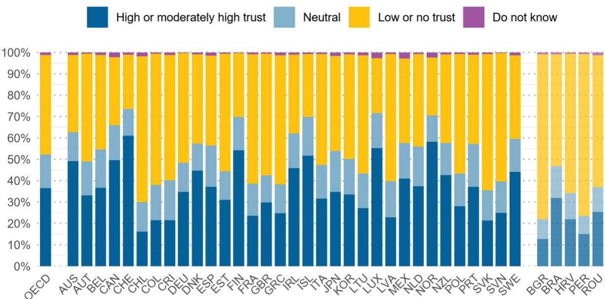  
Note: The figure presents the within-country distributions of responses to the question "On a scale of 0 to 10, where 0 is not at all and 10 is completely, how much do you trust the national parliament/congress?". A 0-4 response corresponds to "low or no trust", a 5 to "neutral" and a 6-10 to "high or moderately high trust". "OECD" presents the unweighted average of the weighted individual OECD country averages. Source: OECD Survey on Drivers of Trust in Public Institutions 2025.

StatLink https://stat.link/e1v60k

On average across the OECD, national legislatures (37%) elicit slightly lower levels of trust than national governments (40%), but higher levels than political parties (26%) (Figure 7.2).

The pattern of slightly higher trust in the national government holds not only on average across the OECD, but also in many OECD countries as well as all five of the OECD accession candidate countries that participated in the 2025 Trust Survey data collection. In a few countries, however, trust in the national government exceeds trust in the legislature by 10 percentage points or more: Chile, Costa Rica, Japan, Korea and Mexico. Conversely, in another small group of countries — Austria, Denmark, Finland, France,

Greece, Ireland, Norway and Sweden—national legislatures are more trusted than national governments. Among accession candidate countries, the largest gap between the share of people reporting high trust in the national government and those reporting high trust in the legislature is observed in Brazil (a 6-percentage-point difference), while the smallest is found in Croatia (2 percentage points).

In turn, across all surveyed countries, political parties consistently emerge as the least trusted political institution. The Netherlands is the only country where the difference between trust in the legislature and trust in political parties is fewer than 5 percentage points.

Figure 7.2. On average and in many individual countries, fewer people have high or moderately high trust in the national legislature than in national government

Share of population with high or moderately high trust in the national legislature, government and political parties, 2025

Trust in National Government

Trust in Political Parties

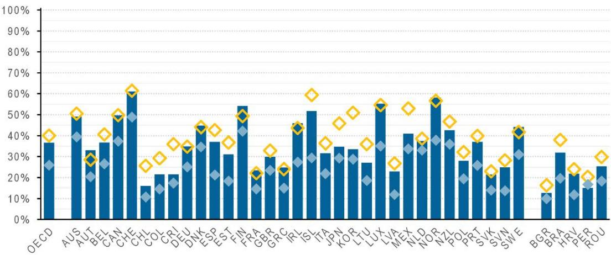  
Note: The figure presents the within-country distributions of responses to the question "On a scale of 0 to 10, where 0 is not at all and 10 is completely, how much do you trust [institution]?". A 6-10 on the 0-10 scale corresponds to "high or moderately high trust". "OECD" presents the unweighted average of the weighted OECD country averages.
Source: OECD Survey on Drivers of Trust in Public Institutions 2025.

StatLink https://stat.link/nmskjr

## 7.2.2. Following a minor decline between 2021 and 2023, average trust levels across 19 OECD countries have stabilised in 2025

Compared to the results of previous waves of the OECD Trust Survey, average levels of trust in the national legislature have remained relatively stable. Among the 19 OECD countries for which data are available across the 2021, 2023, and 2025 waves, the share reporting high or moderately high trust fell by 2 percentage points between 2021 and 2023, from 41% to 39%, and then rose very marginally to 40% in 2025 (Figure 7.3). For the 29-OECD countries included in both the 2023 and 2025 waves, this share remained steady at 37%. These small shifts in average trust levels over the past six years are broadly in line with the limited variation observed in trust in national governments (see Chapter 1).

There is considerably more variation in levels of trust within individual countries. The sharpest changes between 2021 and 2025 occurred in Australia, Colombia, and Japan, where levels of trust in the legislature increased by 12, 11 and 16 percentage points, respectively, over this period. A significant change was also observed for the only accession candidate country with data available for multiple years, Brazil: levels of trust in the legislature doubled between 2022 and 2025, rising from 16% to 32%. In Estonia, Iceland, Korea, and Norway, trust levels fell in between 2021 and 2023 but rose again in 2025. Overall, the direction of changes in trust in the legislature tends to mirror shifts in trust in national governments. Nonetheless, some exceptions stand out: in Denmark, trust in the government remained stable between 2023 and 2025, while trust in the legislature declined slightly; and in Costa Rica, Finland and Slovenia, trust in government increased modestly while trust in the legislature fell. Conversely, in Estonia, trust in government declined steadily from 2021 to 2025, while trust in the legislature dropped in 2023 and then rose modestly in 2025.

Figure 7.3. Trust in the national legislature has been relatively stable across the OECD since 2021

Share of population with high or moderately high trust in the national legislature, 2021, 2023 and 2025

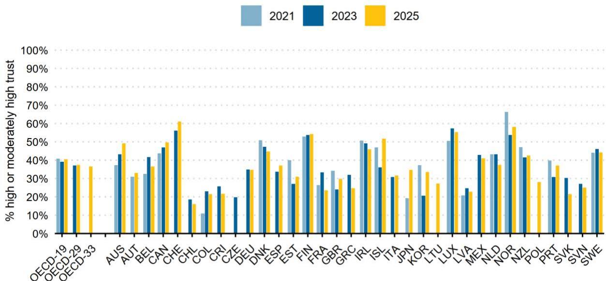

Note: The figure presents the share who provided a response of 6 to 10 to the question "On a scale of 0 to 10, where 0 is not at all and 10 is completely, how much do you trust the national parliament/congress?". OECD-19 refers to unweighted average of weighted OECD country averages for the countries for which the data point is available in all survey years; OECD-29 to the same for the countries for which the data points are available in 2023 and 2025; and OECD-33 to the unweighted average of weighted country averages for the OECD countries that participated in the 2025 survey. The first data collection for Brazil was carried out in April 2022 using an adjusted version of the 2021 OECD Trust Survey questionnaire, and is therefore grouped under the 2021 responses.
Source: OECD Survey on Drivers of Trust in Public Institutions 2021, 2023 and 2025

## 7.2.3. Levels of trust in the legislature vary more with individuals' perception of having a say in what government does and partisanship than socioeconomic or demographic factors

Legislatures are the foundational representative institutions in democracies. They provide a forum where a wide range of public interests can be expressed, debated and incorporated into decisions affecting everyone, and attempt to incorporate the perspectives of different groups effectively into legislative processes. As such, analysing different population groups' trust in the legislature provides valuable indications of how effectively they are seen to incorporate and consider varied interests and demands in the policymaking process.

StatLink https://stat.link/8l9rdy

Among individual characteristics, people's sense of political agency and their partisanship are the most relevant factors explaining variations in trust in national legislatures across OECD and accession candidate countries. By contrast, socioeconomic and demographic characteristics tend to have a more limited influence (Figure 7.4). This pattern also holds for trust in government (see Chapter 2) and over time (Box 7.1). However, the differences in the shares of people with high or moderately high trust across population groups, defined here as the “trust gaps”, are slightly smaller for trust in the legislature than for trust in government. The only exception is the gap associated with people's confidence in their ability to participate in politics, which is similar for trust in the legislature and trust in government.

## Figure 7.4. The share with high or moderately high trust in the national legislature is particularly low among individuals who do not believe people like them have a say in what government does

Share of population with high or moderately high trust in the national legislature by level of respondents' socioeconomic and demographic characteristics, partisanship and political agency, OECD, 2025

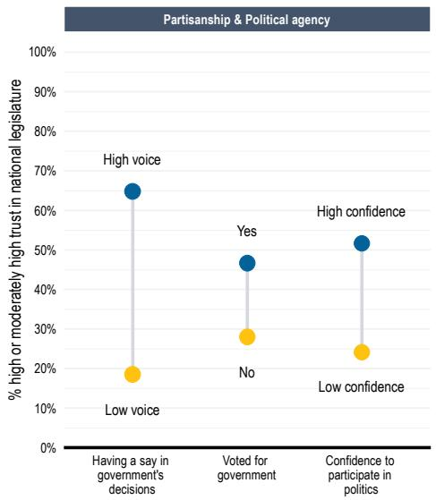

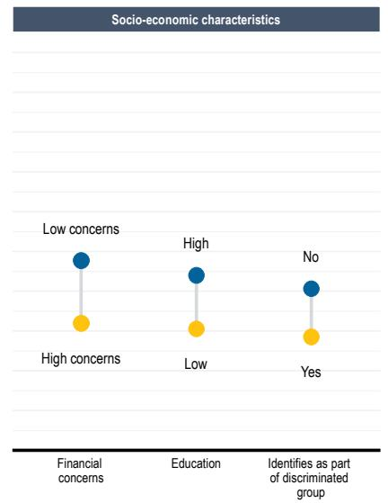

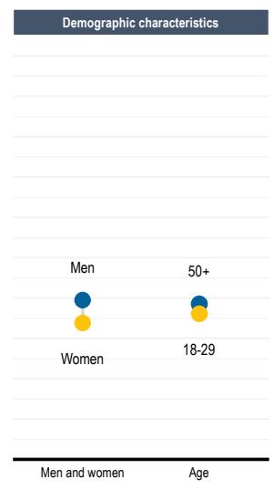  
Note: The figure presents the unweighted OECD averages of weighted OECD country averages of responses to the question "On a scale of 0 to 10, where 0 is not at all and 10 is completely, how much do you trust the national parliament/congress?" by respondents' feelings of political agency, partisanship, socio-economic background and demographic characteristics. Shown here is the proportion that have "high or moderately high trust" based on the aggregation of responses from 6-10, grouped by respondents' feeling of political agency (feeling confident to have a say in what the government does, feeling confident to participate in politics) and partisanship (voted for government during last national elections), socio-economic background (financial concerns, education, identification as part of a discriminated group) and demographic characteristics (men and women, age groups). Financial concerns are measured by asking "In general, thinking about the next two years, how concerned are you about your household's finances and overall social and economic well-being?", and aggregating responses 3 (somewhat concerned) and 4 (very concerned). Low education is defined as below upper secondary educational attainment and high education as tertiary education (ISCED 2011 classification). People's identification of a discriminated group is measured by responses "Yes" to the question "Would you describe yourself as being a member of a group that is discriminated against in [Country]?"
Source: OECD Survey on Drivers of Trust in Public Institutions 2025.

People who feel they have a say in what the government does and who feel able to participate in politics report significantly higher levels of trust than those who feel they lack political voice. Among individuals who believe they can influence what governments do, 65% reported high or moderately high trust in the national legislature, compared to only 19% among those who feel they have no influence (Figure 7.5). These figures are similar, on average, across accession candidate countries (53% and 11%). While the gap is substantially larger in Australia, Canada, and New Zealand (60, 58, and 56 p.p., respectively), it is nearly half as large in Colombia and

## StatLink https://stat.link/gt4ev0

Costa Rica as well as Bulgaria, where the share of people reporting high trust is lower overall, regardless of respondents' sense of political voice.

Likewise, trust in the legislature is also associated with people's confidence in their ability to participate in politics. On average for the OECD, there is a 28-percentage-point trust gap between those who feel able to participate and those who do not (Figure 7.5). Country differences range from relatively small gaps of around 10 p.p. in Greece and Slovenia (as well as in Croatia and Peru) to more than 40 p.p. in Canada, Korea, Poland, and Switzerland.

Figure 7.5. The gap in trust in the national legislature associated with perceptions on whether people have a say in what government does is substantial in all participating countries

Share of population with high or moderately high trust in the national legislature by feeling they have a say in what the government does (blue) and confident to participate in politics (yellow), 2025

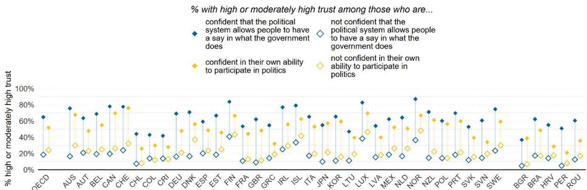  
Note: The figure presents the weighted country averages of responses to the question "On a scale of 0 to 10, where 0 is not at all and 10 is completely, how much do you trust the national parliament/congress?" by respondents' feeling of having a say (blue) and confidence to participate in politics (yellow). Shown here is the proportion of respondents that have "high or moderately high trust" based on the aggregation of responses from 6-10 on the 0-10 response scale, grouped by whether respondents feel that people like them have a say (blue): "How much would you say the political system in [COUNTRY] allows people like you to have a say in what the government does?" and feel confident to be able to participate in politics (yellow): "How confident are you in your own ability to participate in politics?". "OECD" presents the unweighted average of weighted OECD country averages.  
Source: OECD Survey on Drivers of Trust in Public Institutions 2025.

Partisanship also plays a key role in shaping trust in national legislatures. Less than half (47%) of those who reported voting for the governing party express high or moderately high trust in the legislature, which however compares favourably to the 28% among those who did not vote for the government (Figure 7.6). This partisanship gap (19 p.p.) exceeds 30 p.p. in only two countries: Australia and Canada. These results are consistent with academic research showing

## StatLink https://stat.link/lg7543

that individuals tend to report higher levels of trust when the party they voted for is in government or holds a larger share of seats in the legislature. $^{2}$ On average, the partisanship gap is substantially smaller for trust in legislatures than for trust in government. This is to be expected given most parties are represented in legislatures, whereas this is not the usual case in national governments.

## Figure 7.6. The partisan gap for trust in the legislature is pronounced in many countries

Share of population with high or moderately high trust into the national legislature by whether they voted for a party in power or not, 2025  
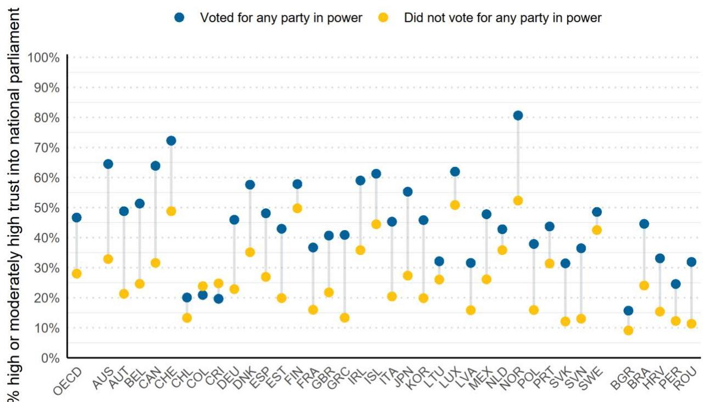  
Note: The figure presents the weighted country averages of responses to the question "On a scale of 0 to 10, where 0 is not at all and 10 is completely, how much do you trust the national parliament/congress" by respondents' political alignment. Shown here is the proportion of respondents that have "high or moderately high trust" based on the aggregation of responses from 6-10 on the 0-10 response scale, grouped by whether people voted (or would have) voted for the government in power: "Is the party you voted for in the last national election on [DATE] currently part of the government?". New Zealand is excluded from the figure as the survey question on voting for the current government was not included there. "OECD" presents the unweighted average of weighted OECD country averages.
Source: OECD Survey on Drivers of Trust in Public Institutions 2025.

Beyond people's political attitudes and preferences, other personal characteristics—including their socioeconomic background and demographic traits—are also associated with their levels of trust. In particular, perceived economic insecurity is linked to lower levels of public trust (see Chapter 2).

OECD Trust Survey data confirms that people's evaluation of their financial well-being matters for trust in the legislature. Among respondents who report financial concerns, on average, $32\%$ express high or

StatLink https://stat.link/lo94jt

moderately high trust in the legislature, compared with 48% among people who feel more financially stable (a 16 percentage-point-gap) (Figure 7.7). The largest differences are in Ireland and Japan, where gaps stand at 28 and 27 percentage points, respectively, followed by gaps of 25 p.p in Chile, Norway, and Portugal. The smallest gaps appear in Spain and France, where they only amount to 6 and 5 percentage-points. Colombia is the only country in which those who express financial concerns report very marginally higher levels of trust (22%) than those who do not feel concerned (21%).

## Figure 7.7. Feeling economically insecure is generally associated with lower trust in national legislatures

Share of population with high or moderately high trust in the national legislature by financial concerns, 2025

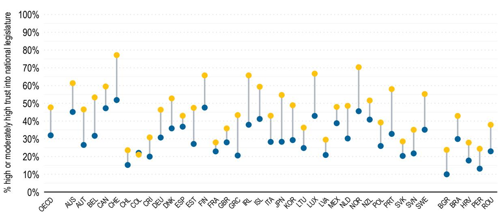  
Note: The figure presents the weighted country averages of responses to the question "On a scale of 0 to 10, where 0 is not at all and 10 is completely, how much do you trust the national parliament/congress?". Shown here is the proportion of respondents that have "high or moderately high trust" based on the aggregation of responses from 6-10 on the 0-10 response scale, grouped by whether individuals responded 3 or 4 (somewhat or very concerned concerned) or 1 and 2 (not at all or little concerned) to the question "In general, thinking about the next year or two, how concerned are you about your household's finances and overall social and economic well-being?". "OECD" presents the unweighted average of weighted OECD country averages.
Source: OECD Survey on Drivers of Trust in Public Institutions 2025.

Another key indicator is levels of education. On average across OECD countries, people with a post-secondary degree are 13 percentage points more likely to trust the legislature than people without upper secondary education. This difference varies widely across countries, ranging from 30 to 1 percentage point. Exceptions are Japan, Korea, Mexico and the Slovak Republic, where people with lower levels of educational attainment report higher trust in the legislature than people with higher levels of education do. Box 7.1 presents over-time variation since 2021 (for countries participating in all three waves) which suggests that education-related gaps in trust in the legislature are slowly widening.

As with trust in government, women and younger respondents tend to trust legislatures less than men and the eldest cohort do. However, these gaps remain relatively small. In 2025, on average across OECD countries, 34% of women report high or moderately high trust in legislatures, compared with 39% of men.

StatLink https://stat.link/zpvje7

This gap is substantially larger in New Zealand, as well as in Ireland and Sweden. By contrast, in Iceland, Korea, and Norway (and Brazil among accession candidate countries), women report higher levels of trust in legislatures than men do (Figure 7.8).

Finally, in 2025, 36% of the youngest respondents to the OECD Trust Survey report high or moderately high trust in the national legislature, a share close to the 39% observed among the oldest cohort. However, differences across countries are significant. In Denmark, Finland, and Poland, the gap in how much trust of older people in the legislature outpaces trust of younger people in the institution is substantially larger than the 3-percentage point OECD average. In many other countries — including Australia, Chile, France, Japan, Iceland, and the United Kingdom — young people in contrast report higher levels of trust in legislatures than their older counterparts (Figure 7.8).

Figure 7.8. Men and older cohorts show higher levels of trust in national legislatures than women and younger people

Share of respondents with high or moderately high trust in the national legislature by respondent's age group and whether they are men or women, 2025

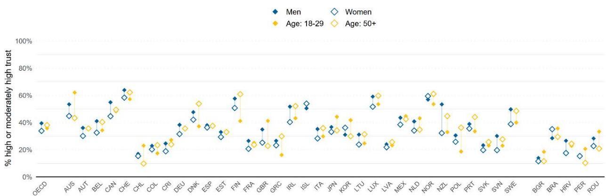  
Note: The figure presents the weighted country averages of responses to the "On a scale of 0 to 10, where 0 is not at all and 10 is completely, how much do you trust the national parliament/congress?". Shown here is the proportion of respondents that have "high or moderately high trust" based on the aggregation of responses from 6-10 on the 0-10 response scale, grouped by whether the respondents are women or men, and grouped by three age groups: 1) 18-29; 2) 30-49; 3) 50 and above. "OECD" presents the unweighted average of weighted OECD country averages.

Source: OECD Survey on Drivers of Trust in Public Institutions 2025.

StatLink https://stat.link/95hkau

## Box 7.1. Trends and changes in legislative trust gaps, 2021–2025

Across the 19 countries with comparable data since 2021, several trust gaps have evolved unevenly over time, revealing shifting patterns in how different groups perceive national legislatures. While trust gaps related to having a say, feeling able to participate in politics, and education have widened, gaps related to partisanship and people's financial concerns remained stable, and trust divides by age have narrowed. Similar trends and changes appear in gaps in trust in the national government across different population groups. The only exception concerns the trust gap related to perceptions of "having a say," which increased for trust in legislatures but remained stable for trust in government. This divergence has been driven by higher levels of trust in national legislatures over time among people who feel they have a say. Aside from this, the data show consistent patterns in people's political attitudes toward national representative institutions (see Chapter 2). The political voice ("having a say") gap has widened, rising by 5 percentage points between 2021 and 2025 (from 44 to 49 p.p.). The largest increases occurred in Ireland (+25 p.p.) and Australia (+17 p.p.). A similar trend is observed for the political agency gap, which also grew by 5 percentage points, on average, over the same period. The United Kingdom and Australia recorded particularly large increases (+21 p.p. and +17 p.p., respectively), while Luxembourg stands out with a substantial 20-percentage-point decrease. Taken together, these longitudinal patterns point to a growing challenge: widening disparities in people's sense of political influence and voice, and their implications for trust in legislatures and other public institutions (see Chapter 6).

The education trust gap widened considerably, increasing by 7 percentage points, and representing the largest rise among all individual-level trust gaps (Figure 7.9). This increase is basically on part with the rise in the education trust gap with respect to the national government. In contrast, the average trust gap associated with feelings of discrimination increased only marginally (by 1 p.p.) between 2021 and 2025.

## Figure 7.9. The trust gap in the national legislature associated with differences in educational attainment has increased over time

Share of population with high or moderately high trust in the national legislature by level of respondents' education, 2021, 2023, and 2025

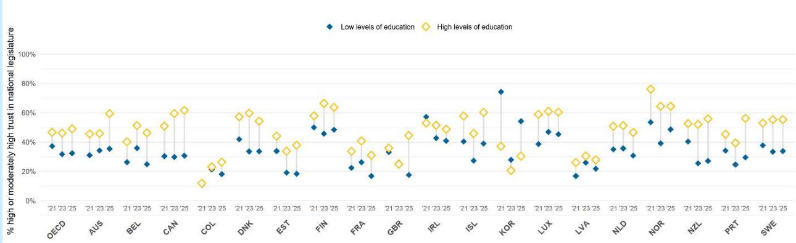  
Note: The figure presents the weighted country averages of responses to the question "On a scale of 0 to 10, where 0 is not at all and 10 is completely, how much do you trust the national parliament/congress?" by respondents' level of education, grouped by respondents' highest education level attained: higher education (post-secondary education degree) or lower education (no upper-secondary education degree). The figure shows changes over time for all countries where relevant information is available in 2021, 2023 and 2025; not all 2025 participant countries participated in all three waves. "OECD" presents the unweighted average of the weighted country averages for countries included in the figure.

Source: OECD Survey on Drivers of Trust in Public Institutions 2021, 2023, and 2025.

StatLink https://stat.link/cnob0j

Differences in trust across women and men have also fluctuated over time, with men more likely to trust the legislature. Among countries with continuous data since 2021, this trust gap widened by 4 percentage points in 2023 before narrowing again in 2025, mirroring broader trends in gaps between women and men in trust in national government. New Zealand stands out for its continuous widening of the gap between women and men, from 7 p.p. in 2021 to 21 p.p. in 2025.

Finally, age-related disparities in trust have generally narrowed across the 19 countries with available data since 2021. The most striking example is the United Kingdom, where the gap shifted dramatically: in 2021, the youngest respondents reported trust levels 15 percentage points lower than the oldest, but by 2025 they reported trust levels 18 percentage points higher, a swing of 33 percentage points. However, this broader pattern does not hold everywhere. In Colombia, Denmark, Finland, New Zealand, and Sweden, the age gap has instead widened over the same period.

## 7.3. PUBLIC GOVERNANCE DRIVERS OF TRUST IN LEGISLATURES

People's trust in national legislatures stems from a complex set of mutually reinforcing factors, many of which overlap with those that shape trust in national government, in particular, as well as in other public institutions. According to the 2025 OECD Trust Survey, the most significant drivers of trust in legislatures today relate to how complex governance challenges are addressed. While certain aspects linked to people's day-to-day interactions with public institutions also matter, they are far less strongly associated with trust in legislatures.

These results are valuable in themselves, but they are also highly relevant from a comparative perspective. They provide insights into how countries' efforts may influence trust across different public institutions simultaneously, and where more targeted actions are needed. When comparing the main drivers of trust in the legislature with those of trust in national government, several important commonalities and distinct patterns emerge:

\- Important correlates of trust in the legislature relate directly to people's perceptions of its core functions. These include how well legislatures are seen to balance the interests of different groups and regions, their success in holding governments accountable, and perceptions of elected representatives providing meaningful responses to public contacts.

\- People's perceptions of the responsiveness of the system, that is, their sense of whether they can influence what government does, are equally important for trust in the national legislature and the national government

\- At the same time, several other factors, including perceptions of evidence-informed decision making, intergenerational fairness, co-operation with stakeholders, or support during economic crises, are important for trust in both institutions, but their marginal effects tend to be lower for legislatures than for the national government.

Figure 7.10. Drivers of trust in national legislatures in 2025  
Public governance drivers that have a statistically significant relationship with trust in the national legislature, OECD, 2025  
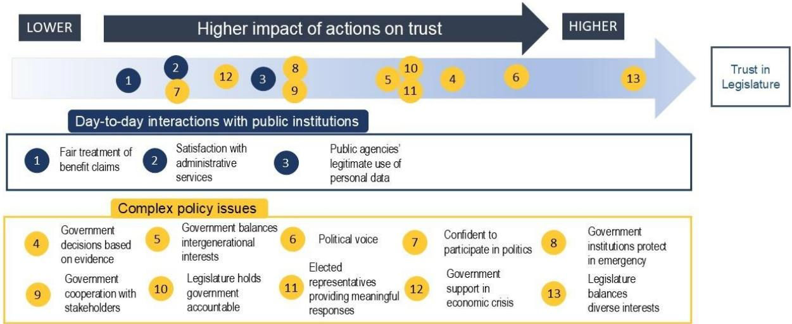

How to read: The figure shows the combined information from the regression analysis of trust in the national legislature on the public governance drivers and control variables and the distance of the average perception of the respective driver to an 80% threshold. Drivers that are more positively associated with trust and for which only a low average share across the OECD have a positive perception can potentially have a higher impact on trust, as there is important scope for improvement and the improvement would likely be associated with increased levels of trust. On the other hand, drivers with a low positive association with trust and for which perceptions are already quite positive across OECD countries have a lower potential for contributing to positive improvements on trust. Nevertheless, all drivers listed in this figure are statistically significant and improvements in the respective areas can therefore all contribute to improving trust.

Note: The figure shows the statistically significant determinants of trust in the national legislature, obtained through logistic regressions that of trust on the public governance drivers. The analyses control for individual characteristics, including whether they voted or would have voted for one of the current parties in power, self-reported levels of interpersonal trust, and country fixed effects. All variables depicted are statistically significant at the 1% significance level. The estimated average marginal effects underlying this figure can be found in Table A.5, column (7), Annex A.

Source: Survey on Drivers of Trust in Public Institutions 2025.

## 7.3.1. Ensuring that different interests and needs are taken into account is the most critical driver of trust in legislatures

Across OECD countries, the public governance variable most strongly associated with trust in national legislatures today is, by far, the perception that they adequately balance the needs of different regions and groups in society when discussing new policies. Positive perceptions on this dimension are associated with a 4.9 percentage point increase in the probability of reporting high or moderately high trust in the national legislature, holding other variables constant. Positive perceptions of political voice are also linked to trust in the legislature, increasing the likelihood of expressing high trust by 3.4 percentage points.

However, people remain quite sceptical about both the fairness of legislatures and the extent to which they consider different interests and needs, as well as about their own political voice (see Chapter 6). On average, only 36% of respondents across OECD countries consider it likely that the national legislature would appropriately balance the needs of different groups and regions when debating a new policy (Figure 7.11). This share varies widely: Switzerland is the only country where more than half of the population holds this positive perception, followed by Australia, Canada, and Mexico. At the lower end, Estonia, Latvia, the Slovak Republic, and three accession candidate countries—Bulgaria, Croatia and Peru—record fewer than one in four respondents with this view. For the 29 OECD countries with available data, $^{3}$ the average share remained stable between 2023 and 2025, decreasing by only 1 percentage point. However, some countries experienced notable changes: perceptions increased by 15 percentage points in the United Kingdom, while they declined by 9 percentage points in Colombia.

Figure 7.11. Slightly more than one in three people across the OECD find it likely that the national legislature appropriately balances between the needs of different groups or regions

Share of population who find it likely or unlikely that the national legislature fairly balances interests of different groups, 2025

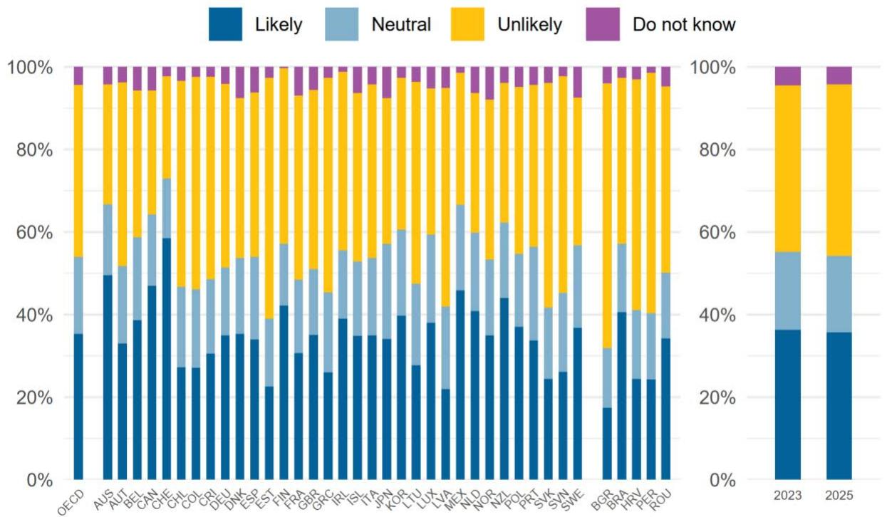

Note: The figure presents the within-country distributions of responses to the question "If the national parliament/congress debated a new policy, how likely do you think it is that it would adequately balance the needs of different regions and groups in society?". The "likely" proportion is the aggregation of responses from 6-10 on the scale; "neutral" is equal to a response of 5; "unlikely" is the aggregation of responses from 0-4; and "Don't know" was a separate answer choice. "OECD" presents the unweighted average of weighted OECD country averages.
Source: OECD Survey on Drivers of Trust in Public Institutions 2023 and 2025.

StatLink https://stat.link/4pm8ik

## 7.3.2. Perception of being listened to is positively associated with trust in legislatures

Results from the OECD Trust Survey illustrate that a sense of political voice – i.e., people's perception that they have a say in what government does – is one of the strongest drivers of trust in national legislatures (indicated by marker 6 in Figure 7.10). People who find it likely that the political system allows people like them to have a say in what government does are 3.4 percentages points more likely to trust the legislature, holding all else constant. Among individuals who believe they have a say in what governments do, 65% reported high or moderately high trust in the national legislature (Figure 7.5), on average across the OECD.

Trust in the legislature is also influenced, albeit to a lesser degree, by perceptions of how well elected representatives respond to individuals who contact them. These findings come from a new survey question added to the OECD Trust Survey in 2025. Positive perceptions that elected representatives respond meaningfully to people's demands and feedback are associated with a 2.4-percentage-point increase in the probability of expressing high or moderately high trust in the legislature, holding other variables constant.

Although not the primary means of communicating with government, more than one in ten respondents (11%) report having contacted a politician or government official during the past year (see Chapter 6), on average across OECD countries. Yet across OECD countries, fewer than one-third of respondents consider it likely that if they were to contact a member of the national parliament or congress, the representative would reply in a meaningful way (Figure 7.12).

While receiving a meaningful reply from elected representatives is only one of many elements that can contribute to shaping people's perceptions of their representatives and legislatures, it is nonetheless important. In representative democracies, the very idea that representatives 'make people present where they are absent' is foundational. A meaningful response — even something as simple as directing someone to relevant information— is therefore likely a necessary, although not sufficient, condition for people to feel heard.

A closer look at both perceptions and how these may be influenced by political behaviour reveals several noteworthy country-specific results (Figure 7.12). In Switzerland, for example, the share of people who report having contacted a politician (8%) is below the OECD average, yet the country displays the most positive expectations of representatives providing meaningful responses to contacts from the public, and is the only OECD country where this share exceeds 50% (54%). A similar pattern is observed in New Zealand. By contrast, in Ireland and Slovenia, a much larger share of respondents report contacting politicians (49% and 31%, respectively), well above the cross-national average. However, perceptions that representatives would respond in a meaningful way are below the OECD average (30% in Ireland and 25% in Slovenia).

Figure 7.12. On average, only about one-third believe that if they contacted elected representatives, they would receive a meaningful response

Share of population who find it likely or unlikely that elected representatives would respond in a meaningful way to their contacts, 2025  
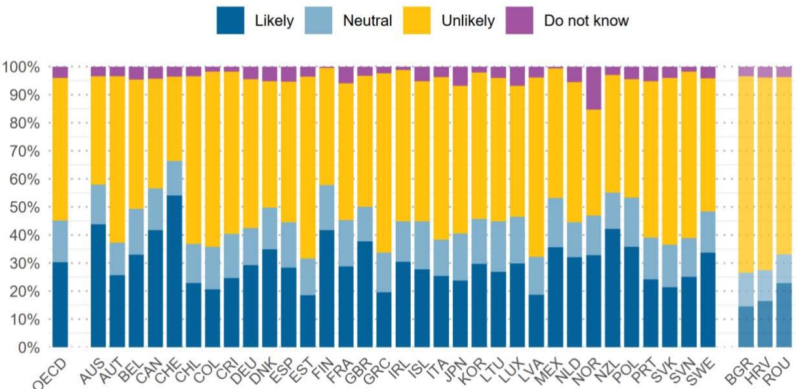  
Note: The figure presents the within-country distributions of responses to the question "If you contacted a member of the national parliament or congress, how likely do you think it is that they would reply in a meaningful way?". The "likely" proportion is the aggregation of responses from 6-10 on the scale; "neutral" is equal to a response of 5; "unlikely" is the aggregation of responses from 0-4; and "Don't know" was a separate answer choice. "OECD" presents the unweighted average of weighted OECD country averages.
Source: OECD Survey on Drivers of Trust in Public Institutions 2025.

StatLink https://stat.link/hi9t67

Going beyond the simple act of elected representatives responding to individual contacts, legislatures around the world have increasingly implemented reforms aimed at strengthening public engagement and promoting openness and transparency (Leston-Bandeira, 2012[1]), contributing to (arguably) greater access to information on legislative issues and activities (Scheidig and Obergassel, 2024[2]).

## 7.3.3. Effectively fulfilling their function as an institutional check and balance strengthens public trust in legislatures

Legislatures not only represent people and produce legislation. They also perform a fundamental democratic function by overseeing other public institutions and safeguarding the integrity of their actions. Positive perceptions that the legislature holds governments accountable are associated with a 3.0-percentage-point increase in the probability of reporting high or moderately high trust in the national legislature, holding other variables constant. This underscores both the importance of the multiple roles played by legislatures in democratic systems and how these roles have evolved over time.

On average, 39% of respondents across OECD countries find it likely that legislatures hold governments accountable for their policies and behaviour, for instance, by questioning ministers or reviewing the budget. This share has remained stable between 2023 and 2025 among the 29 OECD countries with available data (Figure 7.13). $^{4}$ The highest levels of positive perceptions of accountability between branches of governments are found in Switzerland, Denmark, and Mexico. Overall, people tend to have more confidence in institutional checks and balances than in elected representatives providing meaningful responses to their contacts (Figure 7.12). This pattern holds in most countries. The only exceptions are Finland and Lithuania, where the share who find either outcome likely are basically identical.

Source: OECD Survey on Drivers of Trust in Public Institutions 2023 and 2025.

Figure 7.13. Close to 40% believe that the legislature can hold governments accountable

Share of population who find it likely or unlikely that legislatures hold governments accountable, 2023 and 2025

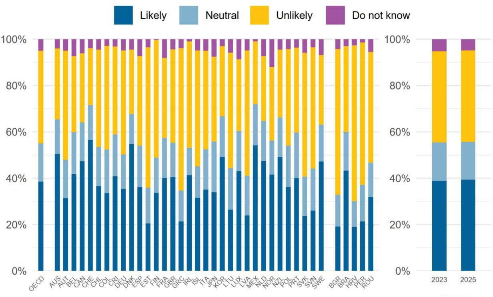  
Note: The figure presents the within-country distributions of responses to the question "How likely do you think it is that the federal/national parliament would effectively hold the federal/central/national government accountable for their policies and behaviour, for instance by questioning a minister or reviewing the budget?". The "likely" proportion is the aggregation of responses from 6-10 on the scale; "neutral" is equal to a response of 5; "unlikely" is the aggregation of responses from 0-4; and "Don't know" was a separate answer choice. "OECD" presents the unweighted average of weighted OECD country averages.

StatLink https://stat.link/v3iwmj

## 7.3.4. The relationship

## between most perceptions of day-to-day interactions and trust in legislature is relatively limited

Beyond investing in broader processes related to how decisions are made, and how these processes inform policies that anticipate societal needs, public institutions must also continuously improve their day-to-day interactions with people by delivering high-quality public services.

Consequently, people's positive experiences with public services, as well as their confidence that institutions use personal data only for legitimate purposes, are significant not only for explaining trust in the civil service or governments, but also for trust in legislatures, albeit at a much lower level. Both satisfaction with administrative services and perceptions that government bodies will use personal data for legitimate purposes only are associated with higher levels of trust in legislatures, increasing the likelihood of reporting high or moderately high trust by 2.1 and 1.9 percentage points, respectively.

## 7.4. AREAS FOR POLICY ACTION TO ENHANCE TRUST

• Enhancing the capacity of the legislature to reach policy decisions while representing a wide set of interests and listening to citizens is the key factor that will enhance trust in the long term.

\- Enhancing people's ability to participate in politics and their belief that they can influence policymaking is critical (see Chapter 6). Political efficacy, including that fostered early through civic education (as is the case in Norway) plays an important role, and is increasingly relevant in the context of age gaps for trust in the legislature. Overall, providing the legislature with meaningful and institutionalised ways of engaging meaningfully with citizens will be very important for trust. As part of this, improving the ability of representatives to provide meaningful responses to public contacts will also be important.

\- Ensuring people's perception of fairness and the legislature's ability to balancing different interests in decision making, including regional interests, will also be key. Legislatures can find ways to better connect with all groups of society and parts of the national territory through mechanisms that engage people, address their concerns, integrate different regional perspectives, and communicate on the results in decision making.

\- Strengthening the capacity of the legislature to enhance the checks and balances in the overall national decision-making system remains a cornerstone of democratic governance and a key factor supporting trust in representative institutions.

Anderson, C. and C. Guillory (1997), "Political Institutions and Satisfaction with Democracy: A Cross-National Analysis of Consensus and Majoritarian Systems", American Political Science Review, Vol. 91/1, pp. 66-81, https://doi.org/10.2307/2952259.

Holmberg, S., S. Lindberg and R. Svensson (2017), "Trust in parliament", Journal of Public Affairs, Vol. 17/1-2, https://doi.org/10.1002/pa.1647.

Leston-Bandeira, C. (2012), "Studying the Relationship between Parliament and Citizens", The Journal of Legislative Studies, Vol. 18/3-4, pp. 265-274, https://doi.org/10.1080/13572334.2012.706044.

Pasquino, G. and R. Pelizo (2006), Parlamenti Democratici, Il Mulino, Bologna.

Saiegh, S. (2005), The Role of Legislatures in the Policymaking Process.

Scheidig, F. and N. Obergassel (2024), "Does a visit to parliament change the political trust of adults?", The Journal of Legislative Studies, Vol. 31/4, pp. 1144-1160, https://doi.org/10.1080/13572334.2024.2398940.

Teixeira, C. and A. Freire (2010), "Decline, Transformation and Trust in Parliaments: the Portuguese Case in a Longitudinal and Comparative Perspective", RIEL- Revista Iberoamericana de Estudos Legislativos Belo Horizonte, n.1, 2010, Vol. 1/1.

## NOTES

$^{1}$ For more details, see (Pasquino and Pelizo, 2006 $^{[5]}$ ; Teixeira and Freire, 2010 $^{[6]}$ ; Saiegh, 2005 $^{[7]}$ )

$^{2}$ See, for example, (Anderson and Guillory, 1997 $^{[3]}$ ; Holmberg, Lindberg and Svensson, 2017 $^{[4]}$ ).

$^{3}$ Data for this variable are available only for 2023 and 2025.

$^{4}$ Data for this variable are available only for 2023 and 2025.

# Annex A. Technical details about the data collection and regression analysis

## THEORETICAL FRAMEWORK

The Updated Framework on Drivers of Trust (Brezzi et al., 2021[1]) synthesised that trust in public institutions is driven by the extent to which institutions reliably and responsively meet people's expectations and uphold the values of fairness, integrity and openness.

The 2023 Trust Survey findings (OECD, 2024[2]) further refined this approach: it showed that the perceptions of day-to-day interactions with public institutions had a larger role in affecting trust in the institutions closest to people, namely the civil service and local government, while perceptions of government decision making on complex policy issues are most decisively associated with trust in the national government. Table A.1 maps the questions included in the OECD Trust Survey to the different dimensions and scope of the framework.

Table A.1. The measurement of drivers of trust in the 2025 OECD Trust Survey

<table><tr><td colspan="2">Updated OECD Framework on Drivers of Trust</td><td>Scope</td><td>Covered by survey questions on perceptions/evaluations of...</td></tr><tr><td colspan="4">Public governance drivers of trust</td></tr><tr><td rowspan="5">Competencies</td><td rowspan="2">Reliability</td><td>Day-to-day interactions</td><td>Personal data shared with public offices used for legitimate purposes onlyGeneral satisfaction with administrative services and with service aspectsGeneral satisfaction with other essential services (healthcare, education)</td></tr><tr><td>Complex decision making</td><td>Government ready to protect people's lives in an emergencyGovernment supports affected people in an economic crisisGovernment regulates AI appropriately to help businesses and citizens use it responsiblyCountry reduces greenhouse gas emissions in next ten years</td></tr><tr><td rowspan="3">Responsiveness</td><td>Day-to-day interactions</td><td>Public services are improved following complaintsPublic institutions adopt innovative ideas to improve public services</td></tr><tr><td rowspan="2">Complex decision making Varied</td><td>National policy is modified following public feedbackGovernment draws on the best available evidence for decision-making</td></tr><tr><td>Public services adapt to changing needs of society</td></tr><tr><td rowspan="2">Values</td><td rowspan="2">Openness</td><td>Day-to-day interactions</td><td>Ease and availability of information about administrative servicesOpportunity to voice opinions with local governmentMember of Legislature provides meaningful response when contacted</td></tr><tr><td>Complex decision making</td><td>Citizen participation and engagement opportunitiesGovernment clearly explains impact of reformGovernment cooperates with stakeholders to tackle long-term challenges</td></tr><tr><td rowspan="4"></td><td rowspan="2">Fairness</td><td>Day-to-day interactions</td><td>·Fair treatment in government services and benefits·Public employees allow individuals to correct errors</td></tr><tr><td>Complex decision making</td><td>·Legislature balances needs of different regions or groups·Legislature adequately balances interests of current and future generations</td></tr><tr><td rowspan="2">Integrity</td><td>Day-to-day interactions</td><td>·Public employee refuses bribe to speed up service aspect</td></tr><tr><td>Complex decision making</td><td>·Politicians refuse political favour in return for well-paid private sector job·Parliament holds government accountable·Government resists lobbying from companies for policies that could harm public interest</td></tr><tr><td colspan="4">Cultural, Economic and Political Drivers of Trust in Public Institutions</td></tr><tr><td colspan="3">Political voice and partisanship</td><td>·(Would have) voted for government currently in power·Political system allows people to have a say in what government does·Own ability to participate in politics</td></tr><tr><td colspan="3">Socio-economic and demographic background</td><td>·Demographic characteristics·Educational attainment·Financial concerns for household and income·Identifies as belonging to group discriminated in country·Native/foreign-born</td></tr><tr><td colspan="3">Adverse recent events</td><td>·Household experienced adverse events such as job loss or illness in past year</td></tr></table>

Note: The Updated OECD Framework on Drivers of Trust in Public Institutions distinguishes between perceptions of the five areas of public governance drivers of trust (responsiveness, reliability, fairness, integrity and openness) and of government action on intergenerational and global challenges; and in the survey questionnaire, related questions are part of different modules. Analytically in this report, they are however grouped with measures of public governance fairness, reliability and openness.  
Source: Based on the questionnaire of the 2025 Survey on Drivers of Trust in Public Institutions and the Updated Framework on Drivers of Trust in Public Institutions (Brezzi et al., 2021[1]).

## DATA COLLECTION

The 2025 OECD Survey on Drivers of Trust in Public Institutions is the third survey wave after the first and second waves in 2021 and 2023.

Countries could choose between participating in a centralised data collection coordinated by the OECD Secretariat or managing their own data collection through the National Statistical Office or another survey provider. Most countries, except of five, opted for the first option.

Following the methodology from the 2021 and 2023 survey wave, in most countries, the 2025 survey relied on a non-probability sampling approach. It consisted of ex ante country-level quotas on the distribution of demographic characteristics (age groups, men and women), education and regions (hard quotas) and income (soft quota). $^{1}$ The country-specific quotas on the distribution of demographic characteristics, education and region, together with the ex-post weighting, ensure national representativeness of the survey data for these characteristics. The quotas were derived from different national and OECD sources (Table A.2).

In 33 countries, the online surveys were conducted by survey providers TGM and Ipsos and the samples was based on their proprietary and partners' online panels, comprised of individuals in each country who willingly signed up to be engaged in market research surveys. In some of the countries where data collection was managed by National Statistical Offices or by other survey providers, the sampling deviated from non-probability sampling. For example, in Finland, the sampling frame was the census database; in Ireland, the sample frame was drawn from the Central Statistics Office's census and matched to a non-probability-based sample based on gender, age group, education level, household size, principal economic status, and housing status; and in Mexico, urban households were selected for face-to-face survey interviews based on a three-stage sampling procedure.

Table A.2. Overview of hard and soft sampling quotas

<table><tr><td></td><td>Categories</td><td>Source</td></tr><tr><td>Age</td><td>Six groups: 18-24, 25-34, 35-44, 45-54, 55-64, 65+</td><td>Latest population census</td></tr><tr><td>Men and women</td><td>Two groups: Men and women</td><td>Latest population census</td></tr><tr><td>Education</td><td>Three groups: low (Latest population census: Group classification based on ISCED-2011 definition</td><td>Latest population census: Group classification based on ISCED-2011 definition</td></tr><tr><td>Large Region</td><td>Varying by country: 3-21 regions</td><td>OECD.Stat: Regional Demography – Population, Large regions</td></tr><tr><td>Income</td><td>Three groups: bottom 20%, middle 60%, top 20%.</td><td>OECD Income Distribution Database/ ESS/Household Income Surveys</td></tr></table>

Note: The table shows the groups used in the four hard quotas and the soft quota (income) to ensure national representative survey data based on these characteristics.

The survey was fielded between September 10 and the December 11 2025 among the adult population (18+) across 33 OECD member countries and 5 OECD accession countries (Table A.3). Fieldwork in Brazil and Peru was conducted earlier, between May 21 and the June 24 2025, as part of the OECD Survey on Drivers of Trust in Public Institutions in Latin America and the Caribbean. The total number of valid responses was 76 927.

Table A.3. Data collection overview

<table><tr><td>Country</td><td>Achieved Sample Size</td><td>Languages</td><td>Fieldwork dates (2025)</td><td>Survey Provider</td><td>Survey mode</td></tr><tr><td>Australia</td><td>2 027</td><td>English</td><td>10 Sep – 5 Nov</td><td>Ipsos</td><td>Online</td></tr><tr><td>Austria</td><td>2 004</td><td>German</td><td>10 Sep – 6 Nov</td><td>Ipsos</td><td>Online</td></tr><tr><td>Belgium</td><td>2 007</td><td>French, Flemish</td><td>10 Sep – 29 Oct</td><td>Ipsos</td><td>Online</td></tr><tr><td>Canada</td><td>2 027</td><td>English, French</td><td>10 Sep – 27 Oct</td><td>Ipsos</td><td>Online</td></tr><tr><td>Chile</td><td>1 994</td><td>Spanish</td><td>10 Sep – 3 Nov</td><td>Ipsos</td><td>Online</td></tr><tr><td>Colombia</td><td>2 004</td><td>Spanish</td><td>10 Sep – 5 Nov</td><td>Ipsos</td><td>Online</td></tr><tr><td>Costa Rica</td><td>2 004</td><td>Spanish</td><td>11 Sep – 18 Nov</td><td>Ipsos</td><td>Online</td></tr><tr><td>Denmark</td><td>2 009</td><td>Danish</td><td>10 Sep – 6 Nov</td><td>Ipsos</td><td>Online</td></tr><tr><td>Estonia</td><td>2 008</td><td>Estonian, Russian</td><td>11 Sep – 6 Nov</td><td>Ipsos</td><td>Online</td></tr><tr><td>Finland</td><td>986</td><td>Finnish, Swedish, English</td><td>1 Oct – 19 Oct</td><td>Statistics Finland</td><td>Online, telephone</td></tr><tr><td>France</td><td>2 072</td><td>French</td><td>10 Sep – 21 Oct</td><td>Ipsos</td><td>Online</td></tr><tr><td>Germany</td><td>2 049</td><td>German</td><td>10 Sep – 11 Nov</td><td>Ipsos</td><td>Online</td></tr><tr><td>Greece</td><td>2 011</td><td>Greek</td><td>10 Sep – 17 Nov</td><td>Ipsos</td><td>Online</td></tr><tr><td>Iceland</td><td>1 299</td><td>Icelandic</td><td>3 Nov – 11 Dec</td><td>Social Science Research Institute</td><td>Online</td></tr><tr><td>Ireland</td><td>2 194</td><td>English</td><td>29 Sep – 15 Nov</td><td>Central Statistics Office</td><td>Online</td></tr><tr><td>Italy</td><td>2 145</td><td>Italian</td><td>10 Sep – 21 Oct</td><td>Ipsos</td><td>Online</td></tr><tr><td>Japan</td><td>2 100</td><td>Japanese</td><td>10 Sep – 20 Oct</td><td>Ipsos</td><td>Online</td></tr><tr><td>Latvia</td><td>2 019</td><td>Latvian, Russian</td><td>11 Sep – 14 Nov</td><td>Ipsos</td><td>Online</td></tr><tr><td>Lithuania</td><td>2 004</td><td>Lithuanian</td><td>11 Sep – 6 Nov</td><td>Ipsos</td><td>Online</td></tr><tr><td>Luxembourg</td><td>1 017</td><td>German, French, English, Luxembourgish</td><td>12 Sep – 24 Oct</td><td>Ipsos</td><td>Online</td></tr><tr><td>Mexico</td><td>2 011</td><td>Spanish</td><td>26 Sep – 3 Oct</td><td>National Institute of Statistics and Geography (INEGI)</td><td>Face-to-face</td></tr><tr><td>Netherlands</td><td>2 041</td><td>Dutch</td><td>10 Sep – 17 Nov</td><td>Ipsos</td><td>Online</td></tr><tr><td>New Zealand</td><td>2 004</td><td>English</td><td>10 Sep – 5 Nov</td><td>Ipsos</td><td>Online</td></tr><tr><td>Norway</td><td>4 703</td><td>English, Nynorsk, Bokmål, Polish, Ukrainian</td><td>15 Oct - 27 Oct</td><td>Verian/Kantar</td><td>Online, paper-based</td></tr><tr><td>Poland</td><td>2 074</td><td>Polish</td><td>10 Sep – 23 Oct</td><td>Ipsos</td><td>Online</td></tr><tr><td>Portugal</td><td>2 041</td><td>Portuguese</td><td>10 Sep – 5 Nov</td><td>Ipsos</td><td>Online</td></tr><tr><td>Slovak Republic</td><td>2 024</td><td>Slovak</td><td>10 Sep – 23 Oct</td><td>Ipsos</td><td>Online</td></tr><tr><td>Slovenia</td><td>2 021</td><td>Slovenian</td><td>11 Sep – 17 Nov</td><td>Ipsos</td><td>Online</td></tr><tr><td>South Korea</td><td>2 005</td><td>Korean</td><td>10 Sep – 5 Nov</td><td>Ipsos</td><td>Online</td></tr><tr><td>Spain</td><td>2 019</td><td>Spanish</td><td>10 Sep – 6 Nov</td><td>Ipsos</td><td>Online</td></tr><tr><td>Sweden</td><td>2 015</td><td>Swedish</td><td>10 Sep – 28 Oct</td><td>Ipsos</td><td>Online</td></tr><tr><td>Switzerland</td><td>2 021</td><td>German, French, Italian</td><td>10 Sep – 14 Nov</td><td>Ipsos</td><td>Online</td></tr><tr><td>United Kingdom</td><td>2 073</td><td>English</td><td>10 Sep – 21 Oct</td><td>Ipsos</td><td>Online</td></tr><tr><td></td><td></td><td></td><td></td><td></td><td></td></tr><tr><td>Brazil</td><td>2 049</td><td>Portuguese</td><td>21 May – 10 Jun</td><td>TGM</td><td>Online</td></tr><tr><td>Bulgaria</td><td>2 024</td><td>Bulgarian</td><td>10 Sep – 18 Nov</td><td>Ipsos</td><td>Online</td></tr><tr><td>Croatia</td><td>2 015</td><td>Croatian</td><td>11 Sep – 14 Nov</td><td>Ipsos</td><td>Online</td></tr><tr><td>Romania</td><td>2 031</td><td>Romanian</td><td>10 Sep – 17 Nov</td><td>Ipsos</td><td>Online</td></tr><tr><td>Peru</td><td>2 295</td><td>Spanish</td><td>22 May – 24 Jun</td><td>TGM</td><td>Online</td></tr></table>

## REGRESSION ANALYSIS

This section describes the data and the empirical strategy used to analyze the association between citizens' perceptions of governance performance and trust in public institutions.

## Data and sample

The analysis draws on individual-level survey data collected in 2025 across OECD member and accession countries. Survey probability weights are applied to ensure national representativeness.

## Model specification

The report applies a logistic regression model estimating the probability that an individual i surveyed in country c expresses trust in the national government, local government, the national legislature, or the civil service. Specifically, the following model is applied:

$$
\log \left(\frac {\operatorname * {P r} (T r u s t _ {i c} = 1)}{1 - \operatorname * {P r} (T r u s t _ {i c} = 1)}\right) = \beta_ {0} + \beta_ {1} D r i v e r s _ {i c} + \beta_ {2} X _ {i c} + \omega_ {c}\tag{1}
$$

where $\Pr(Trust_{ic}=1)$ is the probability that individual i trusts the institution.

Trust is treated as a binary variable equal to 1 if the respondent scored 6 or above on a 0–10 scale (where 0 indicates no trust and 10 indicates full trust), and 0 if the respondent scored between 0 and 4. Therefore, trust is modelled as a binary indicator distinguishing low from high trust. The binary coding simplifies interpretation and increases statistical power compared to using an ordinal scale. The midpoint category (5) is excluded from the baseline specification, as it might ambivalence rather than a clear trust position.

The main explanatory variables $Drivers_{ic}$ capture citizens' perceptions of government performance across the core dimensions of the OECD Framework on Drivers of Trust in Public Institutions. These reflect respondents' perceptions of governments' responsiveness, reliability, openness, integrity, and fairness, and also encompass perceptions of government action on intergenerational and global challenges. Overall, 27 perception variables are included in the model for OECD countries, all of which are listed in the results table below. For the OECD accession countries, 22 variables are included because questions about 5 were not part of the OECD Trust Survey in Latin America and the Caribbean and were thus not collected for Brazil and Peru. To facilitate interpretation, these drivers are measured on a 0–10 scale and standardised to have a mean of zero and a standard deviation of one at the country level.

The vector $X_{ic}$ captures demographic, socio-economic, and political characteristics of each respondent that may also influence institutional trust. These controls include interpersonal trust (standardised with mean zero and standard deviation one), demographic characteristics (age and age squared; men and women); educational attainment (low, medium, and high), financial concerns at the household level, a sense of belonging to a discriminated-against group, and support for the governing party

Country fixed effects $\omega_{c}$ control for time-invariant country characteristics. Probability weights are used to ensure national representativeness, and heteroskedasticity-robust standard errors are applied throughout.

Because the estimated coefficients $\beta$ from a logistic regression describe effects on the log-odds of trust, they cannot be directly interpreted as changes in probabilities. To facilitate interpretation, results are reported as average marginal effects (AMEs). Equation 2 computes the AME of driver x by averaging, across all N respondents, the product of each individual's predicted probability of trust, one minus that probability, and the estimated coefficient $\theta_{x}$ . For example, the AME for the perception that the government makes evidence-based decisions (Table A.4, column (1)) can be interpreted as follows: a one standard-deviation increase in this perception is associated with a six-percentage point increase in the probability of trust ( $0.0601 \times 100 = 6.0$ ), significant at the one per cent level.

$$
A M E _ {x} = \frac {1}{N} \sum_ {i = 1} ^ {N} \frac {\partial \operatorname * {P r} (T r u s t _ {i c} = 1)}{\partial x _ {i c}} = \frac {1}{N} \sum_ {i = 1} ^ {N} \operatorname * {P r} (T r u s t _ {i c} = 1) [ 1 - \operatorname * {P r} (T r u s t _ {i c} = 1) ] \theta_ {x}\tag{2}
$$

Robustness is assessed through several alternative specifications. First, additional control variables are included, namely satisfaction with the health and education systems. Second, responses of 5 on the 0–10 trust scale are recoded as indicating low trust. Third, missing values in the driver variables are replaced with the weighted country-level mean for the respective driver, and a corresponding missingness indicator is included for each imputed variable. Robustness is also assessed using an OLS specification, although these results are not reported.

Overall, the results remain largely consistent across specifications. Similar patterns are also found in pooled regressions (not reported) using data from the 2023 and 2025 Trust Survey waves, although some differences emerge due to the more limited set of regressors available for the pooled analysis.

There are several caveats to this model that are worth noting. First, the inclusion of a large number of drivers and control variables leads to a substantial reduction in the sample size in the baseline regression, as individuals with at least one missing value on any of these variables are excluded from the regression. This issue is further compounded by the exclusion of individuals reporting neutral trust. As a result, the share of missing observations is high with 20 to 40% of observations. This concern is addressed by imputing missing values and by conducting a robustness check in which respondents in category 5 of the trust variable are reclassified as low-trusting individuals.

Second, the estimated coefficient signs should be interpreted conditionally on the full set of control variables included in the model. Some regressors exhibit negative coefficients, but these effects are generally small in magnitude and typically not significant at the 0.05 level, with confidence intervals that often include zero. As a result, there is insufficient evidence to determine whether the true effects are positive or negative. Moreover, these coefficients likely reflect partial correlations, capturing the effect of a given variable while holding many related factors constant rather than indicating a genuinely negative relationship in isolation.

Third, the regression results require careful interpretation. Statistical significance does not imply that the associated variables causally increase trust. All explanatory variables are correlated, and the relationship between trust and perceptions of public governance is likely to be reciprocal.

## Results

The tables below present the correlations between public governance drivers and trust in national government (Table A.4), as well as trust in the national civil service, legislature, and local government (Table A.5), for both OECD and OECD accession countries. The coefficients for background variables are not reported in the tables. They are, however, discussed below with regard to trust in national government.

For trust in the national government, the results indicate that several individual characteristics are significantly associated with higher levels of trust; but that the average marginal effects associated with these characteristics are substantially smaller than the unadjusted trust gaps reported in Chapter 2. This suggests that part of the observed trust gaps are due to compositional effects in terms of other background characteristics that influence trust, but in particular that an important part is accounted for by differences in perceptions of the public governance drivers of trust. For example:

\- Men are around two percentage points more likely to trust the national government than women are when holding other characteristics and the public governance perceptions constant; below the unadjusted gap in trust between men and women of seven percentage points. The average marginal effects of not having concerns about the financial health of one's household and of not identifying as part of a discriminated-against group are also equal to two percentage points; again substantially smaller than the 18 and 13 percentage point unadjusted trust gaps.

\- Respondents with a post-secondary degree are about four percentage points more likely to trust the national government than those with less than upper-secondary education; a difference that is considerably smaller than the 14-percentage-point difference observed in the descriptive analysis.

With respect to age, the model includes both age and age squared to account for a non-linear relationship. The average marginal effect of age is negative (approximately -0.17 percentage points per additional year), implying that trust initially declines with age. However, the positive and statistically significant average marginal effect on age squared (about 0.003 at the one percent level) indicates a U-shaped relationship. Taken together, the estimates suggest that trust in the national government reaches a minimum at 28 years of age and increases thereafter.

Political alignment with the current governing party is one of the strongest predictors of trust in the national government. Respondents aligned with the governing party are around ten percentage points more likely to trust the national government than non-aligned respondents. Although this effect is sizeable, it is still considerably smaller than the raw descriptive trust gap of 26 percentage points.

Overall, the regression results confirm the patterns observed in the more descriptive analysis throughout the report. They show that raw trust gaps tend to overstate the independent effects of individual characteristics. Nevertheless, the effects of socio-economic characteristics remain statistically significant even after accounting for multiple factors simultaneously.

## Table A.4. Overview of regression results for trust in the national government

Average marginal effects of trust in national government on perceptions of public governance drivers, 2025

<table><tr><td></td><td colspan="4">National Government</td></tr><tr><td></td><td colspan="3">OECD</td><td>OECD Accession</td></tr><tr><td></td><td>(1)</td><td>(2)</td><td>(3)</td><td>(4)</td></tr><tr><td>Politician refuses private sector job for political favour (q4)</td><td>-0.0039</td><td>-0.0037</td><td>-0.0056**</td><td>-0.0031</td></tr><tr><td></td><td>(0.0025)</td><td>(0.0021)</td><td>(0.0024)</td><td>(0.0056)</td></tr><tr><td></td><td></td><td></td><td></td><td></td></tr><tr><td>Public employee refuses money to speed up service access (q5)</td><td>-0.0008</td><td>-0.0022</td><td>0.0012</td><td>-0.0140**</td></tr><tr><td></td><td>(0.0025)</td><td>(0.0022)</td><td>(0.0025)</td><td>(0.0060)</td></tr><tr><td></td><td></td><td></td><td></td><td></td></tr><tr><td>Legislature holds government accountable (q6)</td><td>0.0229***</td><td>0.0023***</td><td>0.0229***</td><td>0.0216***</td></tr><tr><td></td><td>(0.0028)</td><td>(0.0023)</td><td>(0.0028)</td><td>(0.0062)</td></tr><tr><td></td><td></td><td></td><td></td><td></td></tr><tr><td>Gof refusal of harmful corporate demand (q7)</td><td>0.0151***</td><td>0.0165***</td><td>0.0128***</td><td>0.0075</td></tr><tr><td></td><td>(0.0024)</td><td>(0.0021)</td><td>(0.0023)</td><td>(0.0060)</td></tr><tr><td></td><td></td><td></td><td></td><td></td></tr><tr><td>Improved services due to complaints (q8)</td><td>-0.0009</td><td>-0.0005</td><td>-0.007</td><td>-0.0009</td></tr><tr><td></td><td>(0.0030)</td><td>(0.0025)</td><td>(0.0031)</td><td>(0.0073)</td></tr><tr><td></td><td></td><td></td><td></td><td></td></tr><tr><td>Public agencies adopt innovative ideas (q9)</td><td>-0.0072**</td><td>-0.0084***</td><td>-0.0045</td><td>-0.0000</td></tr><tr><td></td><td>(0.0032)</td><td>(0.0026)</td><td>(0.0032)</td><td>(0.0083)</td></tr><tr><td></td><td></td><td></td><td></td><td></td></tr><tr><td>Policy responsiveness to public majority (q10)</td><td>0.0093***</td><td>0.0067***</td><td>0.0099***</td><td>0.0065</td></tr><tr><td></td><td>(0.0029)</td><td>(0.0023)</td><td>(0.0029)</td><td>(0.0066)</td></tr><tr><td></td><td></td><td></td><td></td><td></td></tr><tr><td>Government decisions based on evidence (q11)</td><td>0.0601***</td><td>0.0592***</td><td>0.0591***</td><td>0.0671***</td></tr><tr><td></td><td>(0.0032)</td><td>(0.0268)</td><td>(0.0034)</td><td>(0.0079)</td></tr><tr><td></td><td></td><td></td><td></td><td></td></tr><tr><td>Public agencies adapt to society's needs (q11b)</td><td>-0.0052</td><td>-0.0035</td><td>-0.0077**</td><td></td></tr><tr><td></td><td>(0.0032)</td><td>(0.0027)</td><td>(0.0033)</td><td></td></tr><tr><td></td><td></td><td></td><td></td><td></td></tr><tr><td>Government institutions protect in emergency (q12)</td><td>0.0175***</td><td>0.0196***</td><td>0.0166***</td><td>0.0164**</td></tr><tr><td></td><td>(0.0029)</td><td>(0.0025)</td><td>(0.0030)</td><td>(0.0070)</td></tr><tr><td></td><td></td><td></td><td></td><td></td></tr><tr><td>Public agencies' legitimate use of personal data (q13)</td><td>0.0145***</td><td>0.0134***</td><td>0.0103***</td><td>0.0054</td></tr><tr><td></td><td>(0.0027)</td><td>(0.0226)</td><td>(0.0027)</td><td>(0.0060)</td></tr><tr><td></td><td></td><td></td><td></td><td></td></tr><tr><td>Gov regulates new technology to help people use them appropriately (q15)</td><td>-0.0008</td><td>-0.0015</td><td>0.0002</td><td>0.0174**</td></tr><tr><td></td><td>(0.0029)</td><td>(0.0025)</td><td>(0.0030)</td><td>(0.0072)</td></tr><tr><td></td><td></td><td></td><td></td><td></td></tr><tr><td>Government support in economic crisis (q15b)</td><td>0.0313***</td><td>0.0327***</td><td>0.0310***</td><td></td></tr><tr><td></td><td>(0.0031)</td><td>(0.0026)</td><td>(0.0033)</td><td></td></tr><tr><td></td><td></td><td></td><td></td><td></td></tr><tr><td>Ability to voice opinions on local matters (q16)</td><td>-0.0189***</td><td>-0.0173***</td><td>-0.0190***</td><td>-0.0123</td></tr><tr><td></td><td>(0.0027)</td><td>(0.0023)</td><td>(0.0028)</td><td>(0.0066)</td></tr><tr><td></td><td></td><td></td><td></td><td></td></tr><tr><td>Administrative service information is available (q17)</td><td>-0.0001</td><td>0.0000</td><td>-0.0014</td><td>0.0154**</td></tr><tr><td></td><td>(0.0027)</td><td>(0.0025)</td><td>(0.0027)</td><td>(0.0063)</td></tr><tr><td></td><td></td><td></td><td></td><td></td></tr><tr><td>Government explains reform impacts (q18)</td><td>0.0181***</td><td>0.1300***</td><td>0.0173***</td><td>0.0187**</td></tr><tr><td></td><td>(0.0031)</td><td>(0.0256)</td><td>(0.0031)</td><td>(0.0077)</td></tr><tr><td></td><td></td><td></td><td></td><td></td></tr><tr><td>Opinions from consultations are adopted (q19)</td><td>0.0201***</td><td>0.0154***</td><td>0.0225***</td><td>0.0073</td></tr><tr><td></td><td>(0.0032)</td><td>(0.0025)</td><td>(0.0033)</td><td>(0.0077)</td></tr><tr><td></td><td></td><td></td><td></td><td></td></tr><tr><td>Elected representative provides meaningful response (q19b)</td><td>-0.0093***</td><td>-0.0047**</td><td>-0.0051</td><td></td></tr><tr><td></td><td>(0.0029)</td><td>(0.0023)</td><td>(0.0029)</td><td></td></tr><tr><td></td><td></td><td></td><td></td><td></td></tr><tr><td>Fair treatment of benefit claims (q21)</td><td>0.0099***</td><td>0.0104***</td><td>0.0082***</td><td>0.0037</td></tr><tr><td></td><td>(0.0029)</td><td>(0.0025)</td><td>(0.0030)</td><td>(0.0065)</td></tr><tr><td></td><td></td><td></td><td></td><td></td></tr><tr><td>Legislature balances diverse interests (q22)</td><td>0.0148***</td><td>0.0148***</td><td>0.0163***</td><td>0.0201***</td></tr><tr><td></td><td>(0.0032)</td><td>(0.0027)</td><td>(0.0033)</td><td>(0.0077)</td></tr><tr><td></td><td></td><td></td><td></td><td></td></tr><tr><td>Public employees are supportive in case of mistake (q22b)</td><td>-0.0126***</td><td>-0.0114</td><td>-0.0110***</td><td></td></tr><tr><td></td><td>(0.0026)</td><td>(0.0022)</td><td>(0.0027)</td><td></td></tr><tr><td></td><td></td><td></td><td></td><td></td></tr><tr><td>Satisfaction with administrative services (q26)</td><td>0.0191***</td><td>0.0168***</td><td>0.0119***</td><td>0.0273***</td></tr><tr><td></td><td>(0.0027)</td><td>(0.0022)</td><td>(0.0026)</td><td>(0.0061)</td></tr><tr><td></td><td></td><td></td><td></td><td></td></tr><tr><td>Political voice (q31)</td><td>0.0314***</td><td>0.0299***</td><td>0.0316***</td><td>0.0183***</td></tr><tr><td></td><td>(0.0029)</td><td>(0.0024)</td><td>(0.0024)</td><td>(0.0067)</td></tr><tr><td></td><td></td><td></td><td></td><td></td></tr><tr><td>Own ability participate in politics (q32)</td><td>-0.0008</td><td>-0.0012</td><td>-0.0036</td><td>-0.0044</td></tr><tr><td></td><td>(0.0024)</td><td>(0.0020)</td><td>(0.0024)</td><td>(0.0056)</td></tr><tr><td></td><td></td><td></td><td></td><td></td></tr><tr><td>Country will succeed in reducing GhG emissions (q38)</td><td>-0.0042</td><td>-0.0027</td><td>-0.0061**</td><td>0.0105</td></tr><tr><td></td><td>(0.0029)</td><td>(0.0244)</td><td>(0.0029)</td><td>(0.0065)</td></tr><tr><td></td><td></td><td></td><td></td><td></td></tr><tr><td>Government cooperation with stakeholders (q38b)</td><td>0.0272***</td><td>0.0256***</td><td>0.0292***</td><td></td></tr><tr><td></td><td>(0.0036)</td><td>(0.0030)</td><td>(0.0037)</td><td></td></tr><tr><td></td><td></td><td></td><td></td><td></td></tr><tr><td>Government balances intergenerational interests (q40)</td><td>0.0421***</td><td>0.0449***</td><td>0.0476***</td><td>0.0425***</td></tr><tr><td></td><td>(0.0035)</td><td>(0.0283)</td><td>(0.0036)</td><td>(0.0079)</td></tr><tr><td></td><td></td><td></td><td></td><td></td></tr><tr><td>Neutral responses included</td><td>No</td><td>No</td><td>Yes</td><td>No</td></tr><tr><td>Missing item responses imputed</td><td>No</td><td>Yes</td><td>No</td><td>No</td></tr><tr><td>Pseudo R2</td><td>0.4930</td><td>0.4942</td><td>0.3861</td><td>0.4912</td></tr><tr><td>Observations</td><td>39154</td><td>53402</td><td>46192</td><td>7093</td></tr></table>

Note: The table presents average marginal effects from logistic regressions of trust in the national government on the public governance drivers, which are standardised at the country level to have a mean of zero and a standard deviation of one. All models control for individual characteristics, including demographic characteristics, a sense of belonging to a discriminated-against group, financial concerns at the household level, support for the governing party, and self-reported interpersonal trust. France did not ask the question if someone feels belonging to a group that is discriminated against. In order to not loose respondents from France this question is coded as 97 "Prefer not to answer" for all respondents. Country fixed effects are included and heteroskedasticity-robust standard errors are applied throughout. \*\*\* indicates statistical significance at the 0.01 level and \*\* at the 0.05 level. (1) and (4) show the baseline regression discussed throughout the report for OECD and OECD accession candidate countries, in which the dependent variable is equal to 0 if an individual has low or no trust in the national government (0-4 on the response scale) and 1 for high or moderately high trust (6-10 on the response scale). Model (2) shows the regression results when missing values for the public governance drivers are imputed and Model (3) when 'neutral' responses (5 on the response scale) are pooled with the low or no trust group.
Source: OECD Survey on Drivers of Trust in Public Institutions 2025.

## Table A.5. Overview of regression results for trust in the national civil service and legislature and local government

Average marginal effects of trust in different public institutions on perceptions of public governance drivers, 2025

<table><tr><td></td><td colspan="2">National civil service</td><td colspan="2">National Legislature</td><td colspan="2">Local government</td></tr><tr><td></td><td>OECD</td><td>OECD Accession</td><td>OECD</td><td>OECD Accession</td><td>OECD</td><td>OECD Accession</td></tr><tr><td></td><td>(5)</td><td>(6)</td><td>(7)</td><td>(8)</td><td>(9)</td><td>(10)</td></tr><tr><td>Politician refuses private sector job for political favour (q4)</td><td>-0.0124***</td><td>-0.0056</td><td>0.0001</td><td>0.0056</td><td>0.0044</td><td>-0.0074</td></tr><tr><td></td><td>(0.0027)</td><td>(0.0057)</td><td>(0.0026)</td><td>(0.0054)</td><td>(0.0027)</td><td>(0.0064)</td></tr><tr><td></td><td></td><td></td><td></td><td></td><td></td><td></td></tr><tr><td>Public employee refuses money to speed up service access (q5)</td><td>0.0118***</td><td>0.0044</td><td>-0.0014</td><td>-0.0055</td><td>0.0038</td><td>-0.0046</td></tr><tr><td></td><td>(0.0028)</td><td>(0.0061)</td><td>(0.0026)</td><td>(0.0055)</td><td>(0.0029)</td><td>(0.0067)</td></tr><tr><td></td><td></td><td></td><td></td><td></td><td></td><td></td></tr><tr><td>Legislature holds government accountable (q6)</td><td>0.0123***</td><td>0.0120</td><td>0.0303***</td><td>0.0224***</td><td>0.0072**</td><td>0.0053</td></tr><tr><td></td><td>(0.0031)</td><td>(0.0068)</td><td>(0.0028)</td><td>(0.0060)</td><td>(0.0031)</td><td>(0.0072)</td></tr><tr><td></td><td></td><td></td><td></td><td></td><td></td><td></td></tr><tr><td>Gof refusal of harmful corporate demand (q7)</td><td>0.0025</td><td>0.0074</td><td>0.0059**</td><td>0.0029</td><td>0.0021</td><td>-0.0062</td></tr><tr><td></td><td>(0.0025)</td><td>(0.0062)</td><td>(0.0024)</td><td>(0.0061)</td><td>(0.0025)</td><td>(0.0063)</td></tr><tr><td></td><td></td><td></td><td></td><td></td><td></td><td></td></tr><tr><td>Improved services due to complaints (q8)</td><td>0.0093***</td><td>0.0093</td><td>0.0065**</td><td>0.0008</td><td>0.0144***</td><td>0.0050</td></tr><tr><td></td><td>(0.0033)</td><td>(0.0078)</td><td>(0.0031)</td><td>(0.0075)</td><td>(0.0034)</td><td>(0.0083)</td></tr><tr><td></td><td></td><td></td><td></td><td></td><td></td><td></td></tr><tr><td>Public agencies adopt innovative ideas (q9)</td><td>0.0144***</td><td>0.0264***</td><td>0.0007</td><td>0.0013</td><td>0.0134***</td><td>0.0135</td></tr><tr><td></td><td>(0.0035)</td><td>(0.0082)</td><td>(0.0032)</td><td>(0.0077)</td><td>(0.0035)</td><td>(0.0088)</td></tr><tr><td></td><td></td><td></td><td></td><td></td><td></td><td></td></tr><tr><td>Policy responsiveness to public majority (q10)</td><td>-0.0034</td><td>0.0042</td><td>0.0053</td><td>0.0109</td><td>-0.0028</td><td>-0.0000</td></tr><tr><td></td><td>(0.0033)</td><td>(0.0068)</td><td>(0.0030)</td><td>(0.0060)</td><td>(0.0033)</td><td>(0.0074)</td></tr><tr><td></td><td></td><td></td><td></td><td></td><td></td><td></td></tr><tr><td>Government decisions based on evidence (q11)</td><td>0.0292***</td><td>0.0305***</td><td>0.0348***</td><td>0.0356***</td><td>0.0224***</td><td>0.0330***</td></tr><tr><td></td><td>(0.0037)</td><td>(0.0085)</td><td>(0.0036)</td><td>(0.0080)</td><td>(0.0037)</td><td>(0.0094)</td></tr><tr><td></td><td></td><td></td><td></td><td></td><td></td><td></td></tr><tr><td>Public agencies adapt to society's needs (q11b)</td><td>0.0163***</td><td></td><td>-0.0035</td><td></td><td>0.0092**</td><td></td></tr><tr><td></td><td>(0.0035)</td><td></td><td>(0.0033)</td><td></td><td>(0.0036)</td><td></td></tr><tr><td></td><td></td><td></td><td></td><td></td><td></td><td></td></tr><tr><td>Government institutions protect in emergency (q12)</td><td>0.0215***</td><td>0.0316***</td><td>0.0228***</td><td>0.0247***</td><td>0.0166***</td><td>0.0226***</td></tr><tr><td></td><td>(0.0032)</td><td>(0.0074)</td><td>(0.0030)</td><td>(0.0070)</td><td>(0.0032)</td><td>(0.0081)</td></tr><tr><td></td><td></td><td></td><td></td><td></td><td></td><td></td></tr><tr><td>Public agencies' legitimate use of personal data (q13)</td><td>0.0307***</td><td>0.0163**</td><td>0.0194***</td><td>0.0072</td><td>0.0187***</td><td>0.0213***</td></tr><tr><td></td><td>(0.0029)</td><td>(0.0067)</td><td>(0.0028)</td><td>(0.0061)</td><td>(0.0029)</td><td>(0.0071)</td></tr><tr><td></td><td></td><td></td><td></td><td></td><td></td><td></td></tr><tr><td>Gov regulates new technology to help people use them appropriately (q15)</td><td>0.0002</td><td>0.0097</td><td>-0.0056</td><td>0.0086</td><td>0.0037</td><td>0.0093</td></tr><tr><td></td><td>(0.0032)</td><td>(0.0075)</td><td>(0.0031)</td><td>(0.0070)</td><td>(0.0033)</td><td>(0.0085)</td></tr><tr><td></td><td></td><td></td><td></td><td></td><td></td><td></td></tr><tr><td>Government support in economic crisis (q15b)</td><td>0.0015</td><td></td><td>0.0130***</td><td></td><td>0.0064</td><td></td></tr><tr><td></td><td>(0.0036)</td><td></td><td>(0.0033)</td><td></td><td>(0.0036)</td><td></td></tr><tr><td></td><td></td><td></td><td></td><td></td><td></td><td></td></tr><tr><td>Ability to voice opinions on local matters (q16)</td><td>0.0065**</td><td>-0.0047</td><td>-0.0006</td><td>0.0050</td><td>0.0564***</td><td>0.0586***</td></tr><tr><td></td><td>(0.0029)</td><td>(0.0069)</td><td>(0.0029)</td><td>(0.0064)</td><td>(0.0029)</td><td>(0.0072)</td></tr><tr><td>Administrative service information is available (q17)</td><td>0.0208***</td><td>0.0279***</td><td>-0.0006</td><td>0.0143**</td><td>0.0145***</td><td>0.0249***</td></tr><tr><td></td><td>(0.0028)</td><td>(0.0068)</td><td>(0.0028)</td><td>(0.0062)</td><td>(0.0029)</td><td>(0.0073)</td></tr><tr><td></td><td></td><td></td><td></td><td></td><td></td><td></td></tr><tr><td>Government explains reform impacts (q18)</td><td>-0.0021</td><td>0.0054</td><td>0.0039</td><td>-0.0029</td><td>-0.0114***</td><td>-0.0015</td></tr><tr><td></td><td>(0.0035)</td><td>(0.0077)</td><td>(0.0033)</td><td>(0.0073)</td><td>(0.0035)</td><td>(0.0092)</td></tr><tr><td></td><td></td><td></td><td></td><td></td><td></td><td></td></tr><tr><td>Opinions from consultations are adopted (q19)</td><td>0.0015</td><td>-0.0012</td><td>0.0008</td><td>0.0082</td><td>0.0025</td><td>-0.0068</td></tr><tr><td></td><td>(0.0037)</td><td>(0.0078)</td><td>(0.0034)</td><td>(0.0072)</td><td>(0.0037)</td><td>(0.0092)</td></tr><tr><td></td><td></td><td></td><td></td><td></td><td></td><td></td></tr><tr><td>Elected representative provides meaningful response (q19b)</td><td>-0.0002</td><td></td><td>0.0242***</td><td></td><td>0.0031</td><td></td></tr><tr><td></td><td>(0.0032)</td><td></td><td>(0.0029)</td><td></td><td>(0.0032)</td><td></td></tr><tr><td></td><td></td><td></td><td></td><td></td><td></td><td></td></tr><tr><td>Fair treatment of benefit claims (q21)</td><td>0.0243***</td><td>0.0231***</td><td>0.0081***</td><td>0.0061</td><td>0.0182***</td><td>0.0165**</td></tr><tr><td></td><td>(0.0031)</td><td>(0.0068)</td><td>(0.0031)</td><td>(0.0064)</td><td>(0.0031)</td><td>(0.0073)</td></tr><tr><td></td><td></td><td></td><td></td><td></td><td></td><td></td></tr><tr><td>Legislature balances diverse interests (q22)</td><td>0.0071**</td><td>0.0139</td><td>0.0494***</td><td>0.0464***</td><td>0.0079**</td><td>0.0275***</td></tr><tr><td></td><td>(0.0036)</td><td>(0.0075)</td><td>(0.0033)</td><td>(0.0068)</td><td>(0.0037)</td><td>(0.0081)</td></tr><tr><td></td><td></td><td></td><td></td><td></td><td></td><td></td></tr><tr><td>Public employees are supportive in case of mistake (q22b)</td><td>0.0096***</td><td></td><td>-0.0104***</td><td></td><td>-0.0003</td><td></td></tr><tr><td></td><td>(0.0029)</td><td></td><td>(0.0027)</td><td></td><td>(0.0029)</td><td></td></tr><tr><td></td><td></td><td></td><td></td><td></td><td></td><td></td></tr><tr><td>Satisfaction with administrative services (q26)</td><td>0.0557***</td><td>0.0386***</td><td>0.0206***</td><td>0.0188***</td><td>0.0402***</td><td>0.0421***</td></tr><tr><td></td><td>(0.0027)</td><td>(0.0065)</td><td>(0.0028)</td><td>(0.0059)</td><td>(0.0029)</td><td>(0.0069)</td></tr><tr><td></td><td></td><td></td><td></td><td></td><td></td><td></td></tr><tr><td>Political voice (q31)</td><td>0.0088***</td><td>0.0224***</td><td>0.0336***</td><td>0.0216***</td><td>0.0171***</td><td>0.0040</td></tr><tr><td></td><td>(0.0032)</td><td>(0.0070)</td><td>(0.0029)</td><td>(0.0060)</td><td>(0.0033)</td><td>(0.0076)</td></tr><tr><td></td><td></td><td></td><td></td><td></td><td></td><td></td></tr><tr><td>Own ability participate in politics (q32)</td><td>-0.0004</td><td>-0.0043</td><td>0.0068***</td><td>-0.0091</td><td>0.0006</td><td>0.0109*</td></tr><tr><td></td><td>(0.0026)</td><td>(0.0061)</td><td>(0.0029)</td><td>(0.0055)</td><td>(0.0026)</td><td>(0.0060)</td></tr><tr><td></td><td></td><td></td><td></td><td></td><td></td><td></td></tr><tr><td>Country will succeed in reducing GhG emissions (q38)</td><td>0.0012</td><td>0.0052</td><td>0.0009</td><td>0.0052</td><td>0.0056</td><td>0.0075</td></tr><tr><td></td><td>(0.0031)</td><td>(0.0070)</td><td>(0.0030)</td><td>(0.0062)</td><td>(0.0031)</td><td>(0.0072)</td></tr><tr><td></td><td></td><td></td><td></td><td></td><td></td><td></td></tr><tr><td>Government cooperation with stakeholders (q38b)</td><td>0.0126***</td><td></td><td>0.0148***</td><td></td><td>0.0135***</td><td></td></tr><tr><td></td><td>(0.0039)</td><td></td><td>(0.0038)</td><td></td><td>(0.0040)</td><td></td></tr><tr><td></td><td></td><td></td><td></td><td></td><td></td><td></td></tr><tr><td>Government balances intergenerational interests (q40)</td><td>0.0070</td><td>0.0131</td><td>0.0264***</td><td>0.0131</td><td>0.0045</td><td>0.0203**</td></tr><tr><td></td><td>(0.0039)</td><td>(0.0081)</td><td>(0.0036)</td><td>(0.0081)</td><td>(0.0040)</td><td>(0.0086)</td></tr><tr><td></td><td></td><td></td><td></td><td></td><td></td><td></td></tr><tr><td>Pseudo R2</td><td>0.4052</td><td>0.4267</td><td>0.4639</td><td>0.4472</td><td>0.3706</td><td>0.3694</td></tr><tr><td>Observations</td><td>37619</td><td>6883</td><td>38991</td><td>7309</td><td>38180</td><td>6914</td></tr></table>

Note: The table presents average marginal effects from logistic regressions of trust in each institution on the public governance drivers, which are standardised at the country level to have a mean of zero and a standard deviation of one. All models control for individual characteristics, including demographic characteristics, a sense of belonging to a discriminated-against group, financial concerns at the household level, support for the governing party, and self-reported interpersonal trust. France did not ask the question if someone feels belonging to a group that is discriminated against. In order to not loose respondents from France this question is coded as 97 "Prefer not to answer" for all respondents. Country fixed effects are included and heteroskedasticity-robust standard errors are applied throughout. \*\*\* indicates statistical significance at the 0.01 level and \*\* at the 0.05 level.
Source: OECD Survey on Drivers of Trust in Public Institutions 2025.

Brezzi, M. et al. (2021), "An updated OECD framework on drivers of trust in public institutions to meet current and future challenges", OECD Working Papers on Public Governance, No. 48, OECD Publishing, Paris, https://doi.org/10.1787/b6c5478c-en.

OECD (2024), OECD Survey on Drivers of Trust in Public Institutions – 2024 Results: Building Trust in a Complex Policy Environment, OECD Publishing, Paris, https://doi.org/10.1787/9a20554b-en. [2]

## NOTE

$^{1}$ Despite the application of post-stratification weights, national representativeness for all quota variables could not be fully achieved in three countries. In Costa Rica, the weighted sample remains under-representative for respondents aged 65 and over and for lower-educated respondents. In Bulgaria and Croatia, the weighted sample remains under-representative for lower-educated respondents. In Croatia, the regional distribution also does not perfectly match the target distribution. These deviations are primarily attributable to the underrepresentation of older and lower-educated individuals among online panel members and their higher survey break-off rates.

# OECD Survey on Drivers of Trust in Public Institutions 2026 Results

Navigating Rising Expectations and New Horizons

This report presents the main findings of the third cross-national OECD Survey on Drivers of Trust in Public Institutions, carried out in 2025. The survey, based on a representative sample of the adult population in 33 OECD and 5 OECD accession candidate countries, assesses people's trust in government and the factors that drive trust: namely, perceptions of the reliability, responsiveness, integrity, openness and fairness of public institutions. The report highlights notable changes over time in trust levels and trust drivers. Special focus chapters on trust in legislatures, people's views on the potential effects of government use of artificial intelligence, and the perceived barriers to and impacts of political participation provide novel insights based on newly introduced questions.