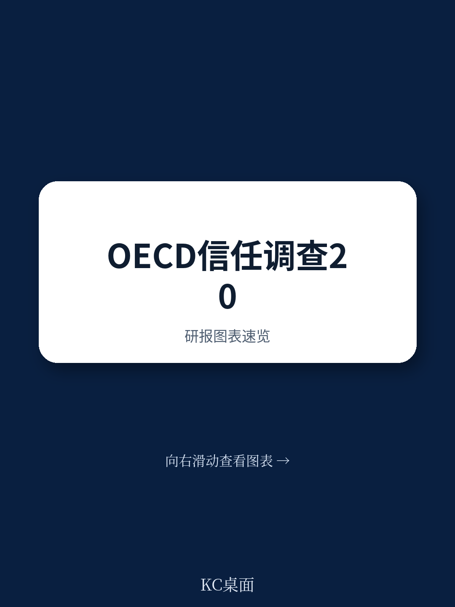
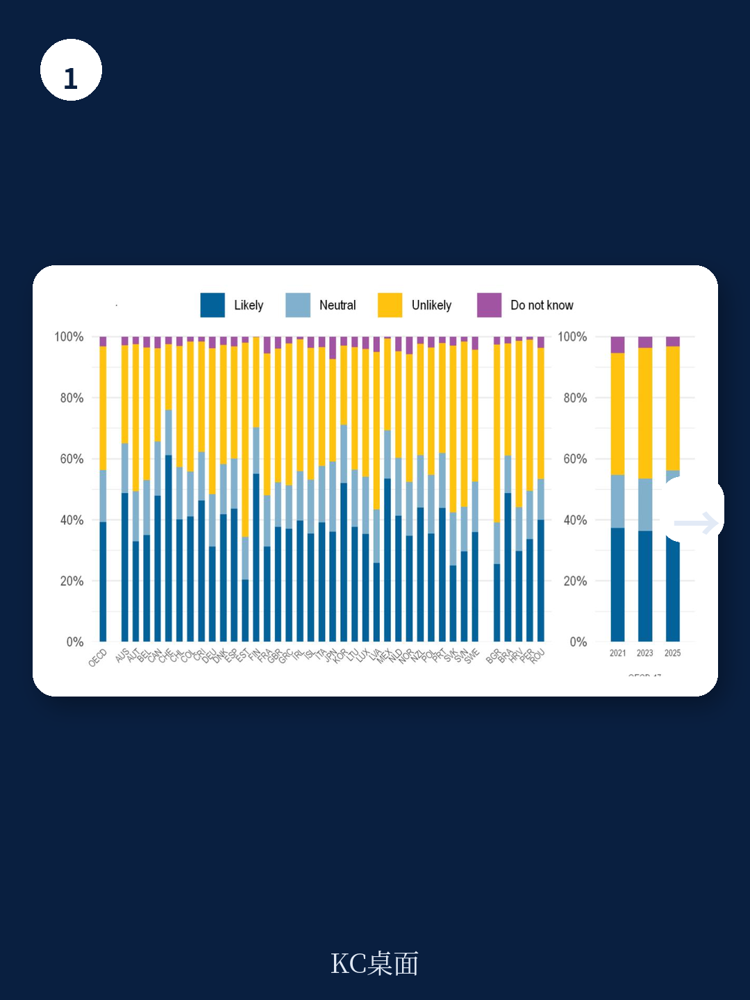
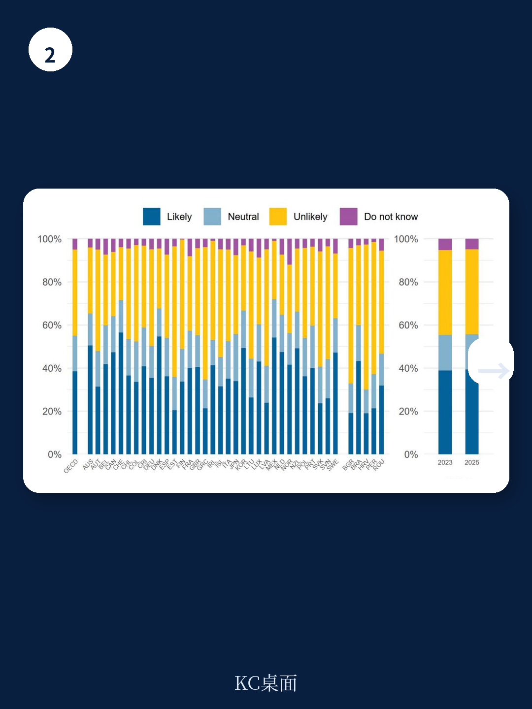

# 经合组织：不是意识形态而是治理能力，经合组织揭示政府信任的真正驱动力

过去三年，从新冠疫情到通胀冲击，从地缘冲突到AI治理，全球公众对政府的信任似乎经历了前所未有的压力测试。市场普遍担忧“信任崩溃”正在侵蚀民主制度的合法性，甚至成为长期经济增长的隐形税负。

但经合组织（OECD）刚刚发布的第三轮《公共机构信任驱动因素调查》（2025年结果）给出了一个更微妙的判断：**全球平均信任水平并未出现断崖式下跌，但信任的结构正在发生根本性转移**。那些决定“谁信任政府、为何信任政府”的底层因素，正在被新的力量重塑——日常服务体验、复杂决策能力、以及AI治理的透明度，正在取代传统的政治意识形态，成为信任的新锚点。

这份覆盖33个OECD成员国和5个候选国的调查，不仅是全球最系统的政府信任度测量，更是一个关于“现代治理能力如何被公众定价”的晴雨表。对于关注长期政策环境、跨境投资和公共治理质量的读者来说，这组数据比任何宏观经济指标都更接近“制度溢价”的真实刻度。

> **KC评论：** 这份报告最值得关注的不是“信任率上升还是下降”这个总量问题，而是“信任的驱动力正在从意识形态转向治理能力”这个结构变化。如果过去信任取决于“你支持哪个政党”，未来信任将取决于“政府能不能让AI审批不出错、能不能让社保申请三天内办完”。这对企业意味着：政策环境的可预测性，正在被具体行政能力重新定义。

继续看原文，真正有价值的是图表的分解逻辑、不同机构信任驱动因素的对比，以及AI治理这个全新维度如何嵌入传统信任框架。完整报告与KC评论在每日汇编。

## 1. 信任水平没有崩溃，但“信任的分布”正在剧烈分化

调查显示，OECD国家中约40%的受访者对本国政府持有“高”或“中高”信任度。这一比例与2023年调查结果相比基本持平。从表面看，这似乎意味着过去两年并未发生大规模的信任流失。

但数据背后的结构变化远比表面数字重要。

首先，信任的波动幅度在增大。以希腊为例，其信任水平自2010年代初以来呈现出越来越大的波动幅度——从债务危机期间的极低点，到疫情应对后的反弹，再到近年再次回落。这种“高波动”本身就是一个信号：公众对政府的评价越来越取决于短期事件应对能力，而非长期制度认同。

其次，不同机构的信任水平差异在拉大。安全与司法机构（警察、法院、军队）普遍享有最高信任度，多数国家超过50%。地方政府和公务员系统的信任度通常高于中央政府。而立法机构（议会）的信任度最低，且与中央政府的信任度之间存在显著差距。

这意味着：**公众并没有“不相信制度”，而是越来越“不相信特定层级的决策者”**。信任正在从政治机构向行政机构、从中央向地方、从选举产生的官员向专业公务员系统转移。

> **KC评论：** 这种信任的“机构间分化”对投资者和政策制定者都很重要。如果你在做跨境基础设施或长期项目投资，地方政府的信任度比中央政府更关键；如果你关注政策稳定性，公务员系统的信任度比执政党支持率更有参考价值。完整报告里有每个国家的机构信任排名，值得细看。

## 2. 日常服务体验正在成为信任的“新锚点”

什么最能驱动信任？报告给出了一个清晰的答案：**不是宏观叙事，而是微观体验**。

在2025年的回归分析中，对行政服务的满意度、对公共服务公平性的感知、以及对公务员帮助处理申请失误的预期，成为预测信任水平的最强变量之一。相比之下，传统的政治意识形态变量（如是否投票支持执政党）的影响力正在相对下降。

具体数据支撑这一判断

- 大多数OECD国家中，近期使用过行政服务的受访者中，超过60%对服务表示满意。这一比例自2021年以来持续小幅上升。
- 对“信息可获取性”的满意度与整体服务满意度高度相关。那些认为行政服务信息“容易获取”的人，对政府的整体信任度显著更高。
- 一个反直觉的发现是：**近期与行政服务有过接触的人，反而比没有接触的人更信任政府**。这与“接触政府越多越失望”的直觉相悖，说明只要服务体验合格，接触本身就能产生信任增益。

这意味着：**信任不再是抽象的政治态度，而是一种基于使用体验的“服务质量评价”**。政府能否在社保申请、税务申报、护照办理等日常事务中提供高效、公平、透明的服务，正在成为信任的核心驱动力。

> **KC评论：** 这对中国的启示也很直接。如果“放管服”改革和数字政务能持续提升服务体验，它们对制度信任的贡献可能远超任何意识形态宣传。完整报告中有每个国家行政服务满意度的具体数字和年度变化趋势，可以用来做国际对标。

## 3. 复杂决策能力：信任的“新门槛”

如果说日常服务体验是信任的“基础分”，那么政府在复杂政策问题上的决策能力，就是信任的“加分项”——但同时也是“扣分项”。

调查显示，公众对政府应对紧急情况（如自然灾害、公共卫生危机）的能力相对有信心，约50%的受访者认为政府机构能够保护其生命安全。但当问题转向“经济危机中的个人保护”时，这一比例下降到不到40%。更值得关注的是，对“政府能否平衡代际利益”（如养老金、气候政策）的信心，只有约30%。

报告特别分析了“复杂决策”维度的信任驱动因素，包括

- 政府决策是否基于证据（evidence-informed）
- 政府是否具备前瞻规划能力
- 政府能否与利益相关方有效合作
- 政府能否抵制不当影响

这些变量在解释“信任变化”时，比传统变量（如腐败感知、经济满意度）解释力更强。换句话说，**公众正在用“治理能力”而非“政治立场”来评价政府**。

这一发现与AI治理章节的数据呼应：约40%的受访者对政府使用AI持积极态度，但前提是AI必须公平、透明、保护个人数据。公众对AI的接受度，本质上取决于对政府“能否管好新技术”的信任。

## 4. 信任的“人口断层”正在加深，但方向与直觉不同

报告揭示了一个值得警惕的趋势：**信任的群体分化正在加剧，但分化的轴线正在从“收入”转向“教育”和“政治效能感”**。

具体而言

- 教育差距在扩大。低学历群体对政府的信任度持续低于高学历群体，且这一差距在多个国家随时间扩大。
- 政治效能感（认为“像我这样的人对政府决策有发言权”）是比收入、年龄、性别更强的信任预测变量。那些感觉“没有发言权”的人，信任度显著更低。
- 党派分化持续存在。支持执政党的人信任度更高，但这一差距在公务员系统信任度上也在扩大——意味着“党派滤镜”正在从政治机构蔓延到行政机构。

> **KC评论：** 教育差距扩大是一个长期风险信号。如果低学历群体越来越不信任政府，政策沟通和公共服务设计必须为此做出调整。完整报告中有每个国家按教育水平、年龄、性别拆分的信任数据，可以用于判断特定市场的社会稳定性。

## 5. 报告尚未完全回答的关键问题：信任的“阈值效应”何时触发？

尽管这份报告提供了迄今为止最系统的信任驱动因素分析，但仍有几个关键问题没有得到充分回答

第一，**信任的“阈值效应”**。报告显示信任水平在均值附近波动，但并没有回答：当信任低于某个阈值时，会触发什么样的行为变化？是“用脚投票”（移民、资本外流），还是“用票投票”（选举更激进的政党），或是“用暴力投票”（社会动荡）？不同国家的阈值是否不同？

第二，**AI治理的信任悖论**。报告发现，熟悉AI的人对政府使用AI更乐观，但熟悉AI的人群本身就是高学历、高收入群体。如果AI治理的信任主要来自“已经信任政府的人”，那么它可能反而扩大而不是缩小信任差距。

第三，**信任与经济增长的因果链**。报告确认了信任与治理质量的相关性，但没有建立信任变化对GDP增长、投资率、公共债务成本等经济指标的因果影响。这是下一阶段研究需要填补的空白。

这些未解问题，恰恰是完整报告中最值得深入的部分——每张图表背后的数据假设、回归模型的选择、以及不同国家间的异质性，都隐藏着更丰富的判断线索。

更多国际信源汇编与评论，扫码交流，每日更新。我们汇总国际主流叙事、数据和图表，观测边际变化。每日汇编会把单篇报告放回当天主线，整理成中文摘要、KC评论和图表合集，便于喂给AI，也便于人工快速扫描市场dynamics。社群汇聚了头部券商、PE/VC、投行、并购、hedge fund、资管机构、战略咨询、智库等朋友，期待交流。

Personal reading notes and learning share only. Not investment advice.
