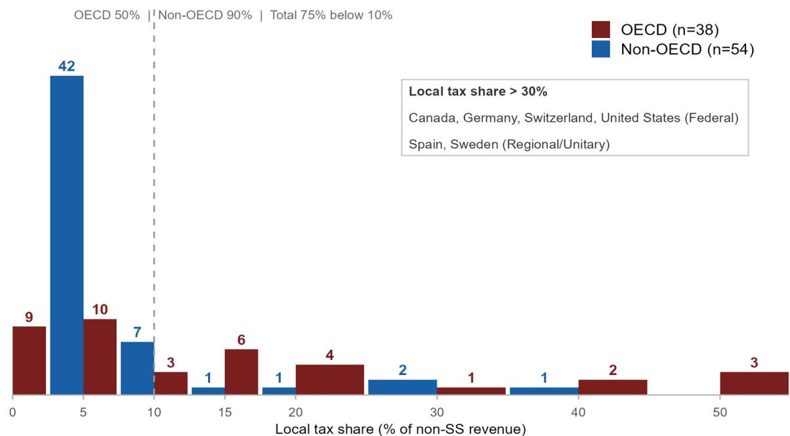
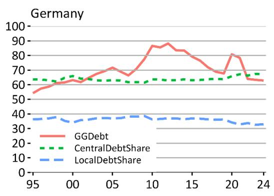
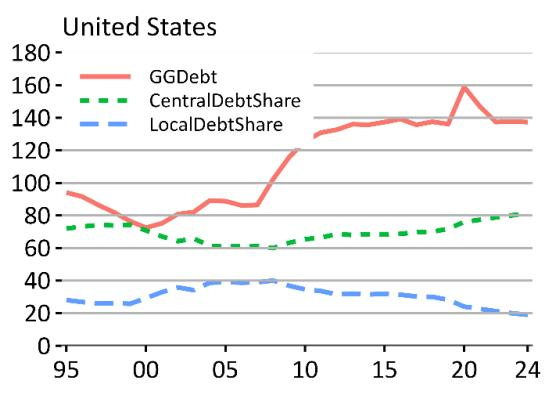
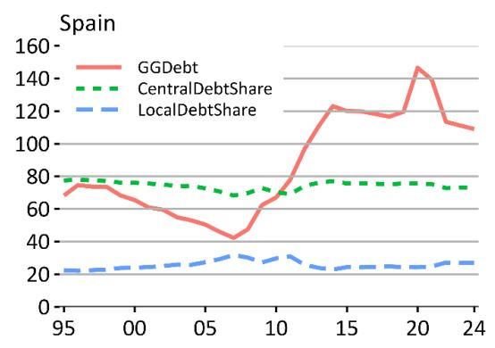
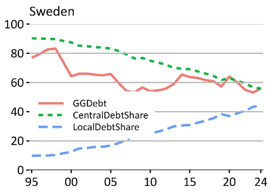
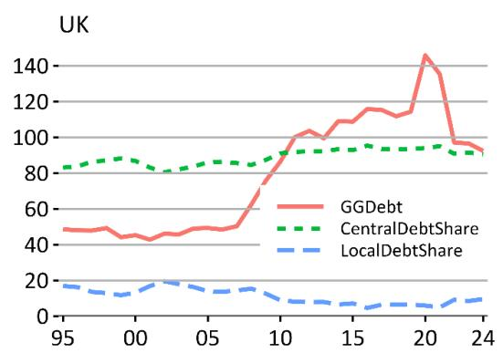
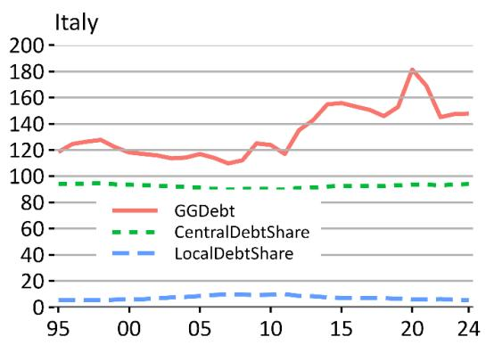
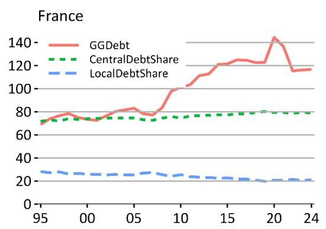
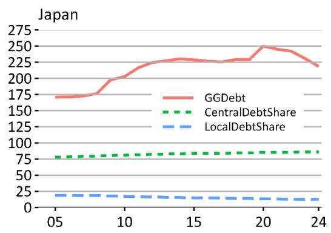
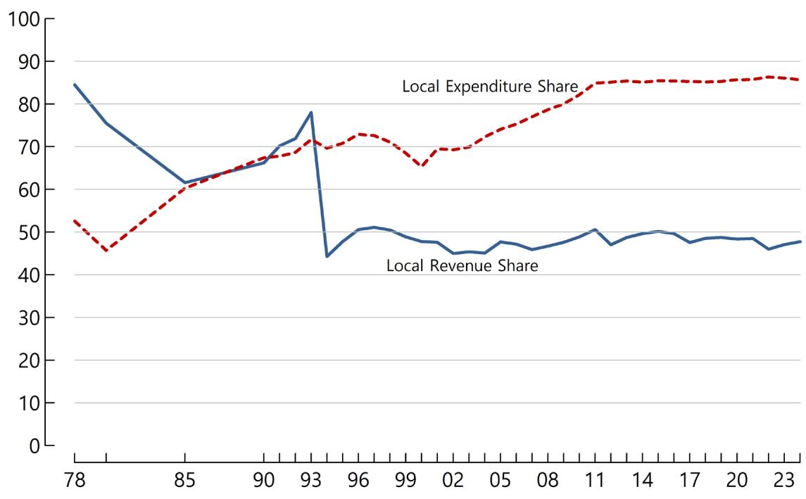

# Revisiting local tax attribution under central control: A synthesis

Junghun Kim

OECD WORKING
PAPERS ON FISCAL
FEDERALISM

June 2026 No. 55

# OECD NETWORK ON FISCAL RELATIONS ACROSS LEVELS OF GOVERNMENT (THE "FISCAL NETWORK")

## OECD Working Papers on Fiscal Federalism

This series is designed to make available to a wider readership selected studies drawing on the work of the OECD's Network on Fiscal Relations across Levels of Government.

This work is published under the responsibility of the Secretary-General of the OECD. The opinions expressed and arguments employed herein do not necessarily reflect the official views of the Member countries of the OECD. Working Papers describe preliminary results or research in progress by the author(s) and are published to stimulate discussion on a broad range of issues on which the OECD works. Comments on this Working Paper are welcome and may be sent to the FiscalNetwork@oecd.org.

This document and any map included herein are without prejudice to the status of or sovereignty over any territory, to the delimitation of international frontiers and boundaries and to the name of any territory, city or area.

## Attribution 4.0 International (CC BY 4.0)

This work is made available under the Creative Commons Attribution 4.0 International licence. By using this work, you accept to be bound by the terms of this licence (https://creativecommons.org/licenses/by/4.0/).

Attribution – you must cite the work.

Translations – you must cite the original work, identify changes to the original and add the following text: In the event of any discrepancy between the original work and the translation, only the text of original work should be considered valid.

Adaptations – you must cite the original work and add the following text: This is an adaptation of an original work by the OECD. The opinions expressed and arguments employed in this adaptation should not be reported as representing the official views of the OECD or of its Member countries.

Third-party material – the licence does not apply to third-party material in the work. If using such material, you are responsible for obtaining permission from the third party and for any claims of infringement.

You must not use the OECD logo, visual identity or cover image without express permission or suggest the OECD endorses your use of the work.

Any dispute arising under this licence shall be settled by arbitration in accordance with the Permanent Court of Arbitration (PCA) Arbitration Rules 2012. The seat of arbitration shall be Paris (France). The number of arbitrators shall be one.

## Abstract

# Revisiting local tax attribution under central control: A synthesis

This paper asks how local tax revenues should be attributed when tax rates, tax bases or tax-sharing arrangements are shaped by higher-level governments. To address this question, it combines tax attribution criteria from the System of National Accounts (SNA) with a historical and institutional analysis of key country cases that exemplify tax sharing and centrally determined local taxation, notably Germany and Japan. This framework contrasts with approaches that apply standard fiscal federalism models without fully accounting for country-specific legal and institutional arrangements. Applying it suggests that, in some countries, revenues reported as local taxes may instead reflect centrally determined tax-sharing arrangements or centrally determined local taxes as defined under SNA 2008 criteria. Where such revenues are reported as local taxes, reported figures may diverge from international attribution criteria, including in national accounts and submissions to international organisations. These findings suggest that local tax shares should be interpreted in light of institutional context, including the degree of central-local integration of public finance in unitary countries and cooperative federal systems, rather than as a simple measure of local fiscal autonomy in empirical studies of fiscal decentralisation and economic growth. They also indicate that, in many countries, local tax shares are relatively small, reinforcing the need to distinguish between revenue attribution and effective local taxing power.

Keywords: tax attribution; local tax autonomy; fiscal decentralisation; tax-sharing arrangements; centrally determined local taxes.

JEL classification: H71, H77, H20.

# Revisiting local tax attribution under central control: A synthesis

By Junghun Kim $^{1}$

1. Background and Motivation for the Study on Local Tax Legal Frameworks

Fiscal relations across levels of government present complex challenges for both statistical measurement and policy design. At the core of these challenges lies a fundamental question: what are "local taxes"? This question, while seemingly straightforward, carries significant implications for how we understand and measure fiscal decentralisation across countries. From this perspective, the key questions addressed in this study on local tax legal frameworks are as follows: Which taxes should be classified as 'local taxes', and by what criteria, when countries report tax statistics to international organisations?

Regarding this question, the international standards for classifying tax revenues are defined in three primary sources, which have been harmonised since 2008: $^{2}$ the UN System of National Accounts (SNA), OECD Interpretative Guide $^{3}$ , and the IMF Government Finance Statistics Manual. These standards provide official guidelines that member countries are expected to follow when reporting tax statistics. Of particular relevance are paragraphs 104–107 of the OECD Interpretative Guide, paragraphs 3.70-3.73 of the UN SNA, and paragraphs 5.25-5.28 of the IMF GFSM 2001, which stipulate the criteria for attributing tax revenues to different levels of government – criteria that are identical across all three sources. Therefore, an important follow-up question arises: Do the local tax statistics currently reported by countries to international organisations, including OECD Revenue Statistics, fully comply with the standards set out in SNA 2008?

Despite the existence of clearly established guidelines, there remains a mismatch between the official standards and the local tax statistics actually reported by many countries to international organisations. This discrepancy is particularly evident in several OECD countries – notably some in East Asia and Southern Europe – as well as many non-OECD countries. Yet, this issue has received surprisingly limited attention in academic literature. Meanwhile, most policy discussions on intergovernmental fiscal relations are predominantly shaped by Western fiscal federalism theory, which tends to presuppose the universality of a core characteristic of local taxes. These frameworks assume that the defining feature of local taxes – namely, that subnational governments exercise the power to set local tax rates, thereby satisfying the foundational assumptions of Tiebout (1956) and Oates (1972) – holds across intergovernmental fiscal systems worldwide, despite substantial institutional and legal variation across countries.

The purpose of this study is to thoroughly assess how local taxes are classified within domestic legal frameworks and how these classifications may diverge from international statistical standards. To understand this gap, the paper investigates the century-long evolution of local tax systems in two polar case countries – Germany for understanding the nature of jointly determined tax sharing and Japan for understanding centrally determined local taxes. The central argument is that the historical and institutional realities of Germany and Japan not only predate the theoretical development of fiscal federalism – Tiebout (1956) and Oates (1972) – but fundamentally resist explanation through it. Yet scholars today, even in Germany and Japan, often evaluate their own local tax systems against this framework – conflating a normative aspiration for greater local autonomy with an analytical understanding of centrally determined local taxes or tax sharing.

Building on this historical and institutional analysis, the paper then investigates possible misclassification across OECD member countries and selected non-OECD countries, and recommends reclassification to ensure that, once a tax is identified as a local tax by international organisations such as the OECD and the IMF, its nature can be analysed without mismeasurement or misinterpretation. In many countries – especially where local tax laws and rates are centrally legislated – what are reported as local tax revenues may in fact be centrally determined intergovernmental transfers, either as centrally determined local taxes or centrally determined tax sharing. This potential misclassification, notably in Japan, Korea, China, and France, is examined in detail in Sections 4 and 5 using the SNA 2008 framework.

The consequences of misclassifying local tax revenues and intergovernmental grants extend far beyond issues of statistical accuracy. First, such misclassification introduces fundamental inconsistencies into the fiscal statistics compiled by international organisations such as the OECD and the IMF, undermining the reliability of reported local tax data and the cross-country analyses built upon it. Second, it leads to misguided policy recommendations, as theories of fiscal federalism are inappropriately applied to fiscal systems where the underlying assumptions about local taxing power and corresponding fiscal responsibility – the foundational features of Tiebout (1956) and Oates (1972) – do not hold. Third, it produces theoretical disconnects in academic research: empirical studies on fiscal decentralisation yield biased or unreliable results when built on local tax statistics that misclassify central taxation as local.

To bridge this gap between institutional reality and theoretical framework, this study provides in-depth historical and institutional analysis of two polar cases of non-Tiebout taxes (Germany and Japan), and then investigates their variants – centrally determined tax sharing and the evolution of centrally determined local taxes into Tiebout local taxes. $^{4}$ France and China belong to the first type and Spain provides an important case of the second type. Along with these typologies, the study also investigates the distribution of local tax share in 92 OECD and non-OECD countries. The result is striking: in 68 of the 92 countries (75 per cent), the local tax share is below 10 per cent, and after the reclassifications proposed in this study, only six countries — Canada, Germany, Switzerland, and the United States (all federal), plus Spain (regional) and Sweden — have a local tax share greater than 30 per cent. The detailed distribution is presented in Section 6.2.

In most countries, taxation and expenditure are inextricably integrated across levels of government rather than clearly separated, except in countries where Tiebout local taxes are in operation.

Consequently, analyses focused exclusively on either central or subnational government finances risk systematic bias – either from misclassified local tax statistics or from undue influence of a small number of high-leverage observations with genuinely autonomous local taxation. By the same logic, empirical studies on the effects of fiscal decentralisation are likely to yield unreliable results unless local tax statistics are first corrected in accordance with SNA 2008 criteria.

Accurate statistics on the distribution of taxing power and fiscal responsibilities across levels of government are therefore a prerequisite for informed fiscal reform. Currently, institutional opacity can obscure where taxing power and fiscal responsibility genuinely lie in many OECD and non-OECD countries. To address this, the paper makes three recommendations: (i) revision of the paragraph 107 of the Interpretative Guide to clarify the meaning of taxing power when multiple levels of government are involved in rate-setting; (ii) transition from standard tax rate systems to tax rate range systems (ceiling and floor) to eliminate obfuscation of taxing power; and (iii) institutionalisation of the balance between fiscal resources and responsibilities across levels of government, to prevent fiscal irresponsibility at one level from spilling over to another.

## 2. The SNA 2008 Paradigm Change in Local Tax Criteria

## 2.1. Pre-2008 criteria: automatic and unconditional receipt of tax revenue

## UN's System of National Accounts 1993

Before the System of National Accounts (SNA) was updated in 2008, the definition of local tax was not standardised and varied across different international organisations (The United Nations, the OECD, and the IMF). For example, paragraph 3.33 of the UN's SNA 1993 addressed the situation where taxes are collected by one government unit on behalf of another in the section "Recognising the Principal Party to a Transaction". It defines a local tax as follows:

[1]f the central government lacks discretion about the amount of collection or distribution of the relevant monies, the transactions are recorded directly in the accounts of the local government. In general, tax revenues will be allocated directly to the non-collecting government when (a) it has full or partial authority over the setting of the tax, or (b) it receives automatically under the provisions of tax law a given percentage of the tax collected or arising in its territory.

It is evident from the above paragraph that the concept of local tax was broadly defined in the UN's SNA 1993: If the revenue from a tax is received (a) under the local governments' authority to set the tax or (b) through automatic transfers from the central government on source-based criteria, it is regarded as a local tax. According to UN's SNA 1993, whether local governments exercised taxing power or not was not a necessary condition for identifying the characteristics of a local tax. Apart from paragraph 3.33, no other section in the UN's SNA 1993 addresses the definition of a local tax.

## OECD's Revenue Statistics

In the Interpretative Guide as it appeared in editions up to 2008, paragraph 99, under the heading Attribution of Tax Revenues, also discussed cases where taxes are collected by one government unit on behalf of another: $^{5}$

99. As a general guide tax revenues are attributed to non-collecting beneficiary governments:

a) when they have exercised some influence or discretion over the setting of the tax or distribution of its proceeds; or

b) when under provisions of the legislation they automatically and unconditionally receive a given percentage of the tax collected or arising in their territory; or

c) when they receive tax revenue under legislation leaving no discretion to the collecting government.

Thus, the rules for attributing tax revenue to the local level in OECD Revenue Statistics 2000 was similar to that in UN SNA 1993 except that the OECD rules extended the scope of a local tax to cases where revenue is not strictly received on an origin basis (specifically in paragraph 99(c)). Importantly, the Interpretative Guide in OECD Revenue Statistics 2000 also provided a more detailed framework for attributing tax revenue to the local level, incorporating various specific situations, including tax sharing (paragraph 100):

100. A number of more specific rules may be set down as guidelines for the attribution of tax collection among collecting and beneficiary governments:

i) The revenue of taxes not distributed to any government other than that collecting it should be shown as tax revenue of the collecting government.

ii) The revenue of taxes which a government collects and unilaterally earmarks at its discretion for distribution to another government should be shown as tax revenue of the collecting government.

iii) The revenue of taxes which a government collects on behalf of another government with the beneficiary government unilaterally determining the amount of the tax or distribution of its proceeds, should be shown as tax revenue of the beneficiary government.

iv) The revenue of taxes collected by one government and transferred to another with the amount of the tax or distribution of its proceeds decided upon jointly by both governments, or on the basis of the tax collected or arising in the territory of the beneficiary government is to be shown as tax revenue of the ultimate beneficiary government.

v) If a central or regional government authorises or requires local collection of a particular tax, a part or all of which is automatically retained by the collecting government, the local share is shown as tax revenue of the collecting government.

In the specific cases above, (i) applied to purely central or local taxes, while (ii) applied to taxes earmarked for intergovernmental grants. Case (iii) covered situations where tax collection is delegated to another level of government. Case (iv) described tax revenue sharing, which could occur either with redistribution or on an origin basis. Case (v) defined retained tax revenue from delegated tax collection as a tax rather than non-tax revenue.

IMF's Government Finance Statistics Manual – 1986 edition and 2001 edition

The cases in which a government collects taxes and transfers them, in whole or in part, to other governments were also addressed in IMF's Government Finance Statistics Manual (GFSM) 1986. The criteria for handling these situations, discussed under the section titled Attribution of Tax Revenues to Collecting or Beneficiary Governments (II.G), were essentially the same as those outlined in paragraphs 99 and 100 of OECD Revenue Statistics 2000. However, with the publication of the IMF's GFSM 2001, the criteria for attributing tax revenues changed significantly. In IMF GFSM 2001, the criteria for identifying a local tax were presented sequentially, beginning with the definition of a local tax and then addressing the cases where taxing power is jointly or concurrently exercised by different levels of government. The presentation began with two general paragraphs (5.25 and 5.26), followed by two paragraphs (5.27 and 5.28) addressing jointly and concurrently exercised taxing power:

5.25 In general, a tax is attributed to the government unit that (a) exercises the authority to impose the tax (either as a principal or through the delegated authority of the principal), (b) has final discretion to set and vary the rate of the tax, and (c) has final discretion over the use of the funds.

5.26 Where an amount is collected by one government for and on behalf of another government, and the latter government has the authority to impose the tax, set and vary its rate, and determine the use of the proceeds, then the former is acting as an agent for the latter and the tax is reassigned. Any amount retained by the collecting government as a collection charge should be treated as a payment for a service. Any other amount retained by the collecting government, such as under a tax-sharing arrangement, should be treated as a current grant. If the collecting government was delegated the authority to set and vary the rate as well as decide on the ultimate use of the proceeds, then the amount collected should be treated as tax revenue of this government.

From these paragraphs, three key changes in the IMF GFSM 2001 can be discerned. First, the definition of a local tax became stricter. In GFSM 1986, a tax could be a local tax if any of the following three conditions were met: (a) exercise of taxing power, or (b) automatic receipt of tax revenue by the law on the origin base; or (c) receipt of tax revenue by the tax law without the discretion of the central government. However, under the GFSM 2001 definition, a tax was classified as a local tax only if all three of the following conditions were met: (a) exercise of taxing power; (b) final discretion to set and vary the rate of the tax; and (c) final discretion over the use of the funds. Paragraph 5.26 addressed the case where part of the tax revenue from the delegated tax collection is retained under the arrangement of tax-sharing. Unless the authority to set and vary the rate is also delegated, the retained tax revenue is classified as an intergovernmental grant under paragraph 5.26.

The second major change concerned shared taxes: in paragraph 5.27, the case was addressed where revenue from a shared tax is classified as subnational tax revenue rather than an intergovernmental grant. As with an independent local tax, the crucial condition for a shared tax to be considered subnational was whether subnational governments exercise taxing power. Paragraph 5.27 stated that:

Where different governments jointly and equally set the rate of a tax and jointly and equally decide on the distribution of the proceeds, with no individual government having ultimate overriding authority, then the tax revenues are attributed to each government according to its respective share of the proceeds. If an arrangement allows one government unit to exercise ultimate overriding authority, then all of the tax revenue is attributed to that unit.

The third major change introduced in GFSM 2001 was the recognition of cases where the central government first set the standard tax rate, say 10%, and subnational governments apply their own additional (marginal) tax rates either in the positive or negative direction, say ±α per cent. In this case, according to paragraph 5.28, the tax revenue collected at 10% belonged to the central government, and the tax revenue collected at ±α% belonged to subnational governments. The exact phrase of paragraph 5.28 was as follows:

There may also be the circumstance where a tax is imposed under the constitutional or other authority of one government, but other governments individually set the tax rate in their jurisdictions and individually decide on the use of the proceeds of the tax generated in their jurisdictions. The proceeds of the tax generated in each respective government's jurisdiction are attributed as tax revenues of that government.

Paragraph 5.28 can be regarded as simply addressing the case of surtaxes imposed by subnational governments, as in the case of the state governments' income tax in the USA. However, paragraph 5.28 has much more important implications on the case where the tax revenue collected by the central government which applies the standard tax rate is transferred to subnational governments on source-based criteria. This is a widely practiced legal system where the central government (the Parliament) enacts Local Tax Law in which the names of local taxes, their rates (typically called standard rate or basic rate) and bases are specified. Such centrally controlled local tax frameworks exist in Korea, Japan, and many countries in Eastern Europe, Asia, and South America. Under this arrangement, as the standard (basic) rates are already determined by the Parliament, local governments typically exercise little or no taxing power, leading to minimal or no changes in marginal tax rates. In this case, according to paragraph 5.28 of GFSM 2001, the tax revenues collected at the standard tax rates should be categorised as that of the central government. Reclassifying revenues from taxes listed in the Local Tax Law as intergovernmental grants would run counter to these countries' established legal treatment of such taxes. As a result, these countries report such revenues as local tax revenue, at variance with the attribution criterion in paragraph 5.28 of GFSM 2001.

## 2.2. SNA 2008 criteria: exercise of taxing power

The exact determination of revenues from taxes listed in Local Tax Law was ambiguous as of 2008 because the definition of local taxes varied depending on which criteria were applied from those found in the UN's SNA 1993, OECD Revenue Statistics 2008, and the GFSM 2001. For example, consider a case where revenue from a tax listed in Local Tax Law was collected at a 10% standard tax rate by the central government (the Parliament), while local governments applied a 0% marginal tax rate. According to the UN SNA 1993, this tax revenue is classified as local tax revenue ("automatic receipt of tax revenue under the provisions of tax law", paragraph 3.33 of SNA 1993). Similarly, under OECD Revenue Statistics 2008, paragraph 95(c) attributes the revenue to local tax revenue based on the criterion that "such tax revenue is received under legislation leaving no discretion to the collecting government". However, under the IMF GFSM 2001, the classification of the tax depends on the interpretation of different paragraphs. If paragraph 5.25(c) ("has final discretion over the use of the funds") is applied, the tax is considered local. Conversely, if paragraph 5.28 ("The proceeds of the tax generated in each respective government's jurisdiction are attributed as tax revenues of that government") is applied, it is classified as central government revenue, since local governments collect no additional revenue due to their application of a 0% marginal tax rate.

While multiple and sometimes conflicting interpretations of tax revenue attribution existed until 2008, the situation changed fundamentally once the 2008 revision of the SNA took effect in 2009. The significance of SNA 2008 with respect to tax revenue attribution is clearly articulated in OECD Revenue Statistics 2009:

There are obvious advantages in establishing and maintaining consistency between the guidelines for presenting information in different statistical sources simply to avoid the confusion that often arises when different approaches are adopted. In practice, one of the main motives for revising the SNA guidelines in this respect was to establish a greater degree of consistency with the IMF's Government Finance Statistics (GFS). The consistency issue was in turn a major factor in deciding that the Revenue Statistics should also adopt the revised approach and continue to follow the SNA. An added advantage is that it will make the data submission more straightforward for those member countries that base their figures on the country's National Accounts.

The Special Feature of OECD Revenue Statistics 2009 explains the changes introduced in SNA 2008 as follows:

Paragraph 3.70 of SNA 2008 replaces these conditions by establishing the principles that in general revenues are allocated to the level of government that: a) exercises the authority to impose the tax (either as principal or through delegated authority of the principal); b) has final discretion to set and vary the rate of the tax; and c) has final discretion over the use of the tax proceeds. At the same time, paragraphs 3.71-3.73 set out guidelines that should be adopted when a tax is imposed under the constitutional or other authority of one government, but other governments individually exercise either some or overall power in setting the tax rates and/or deciding on the use of the proceeds of the tax generated in their jurisdictions. In particular paragraph 3.73 refers to the situation where a tax is imposed under the authority of one government but other governments individually both set the tax rate and decide on the use of the proceeds in their jurisdictions. In such situations the proceeds of the tax generated in each respective government's jurisdiction are attributed as tax revenues of that government.

It is noteworthy that the changes made in SNA 2008 and in OECD Revenue Statistics 2009 are derived from the criteria stipulated in the GFSM 2001. As a result, an internationally unified definition of tax revenues attribution became possible through the agreement of the UN and the OECD to adopt the IMF's classification framework. The key implications of the changes described in OECD Revenue Statistics 2009 are as follows: (1) It is less likely that tax revenues will be attributed to a recipient rather than a collecting government than in previous editions of Revenue Statistics, because the former would now have to have "final discretion over the tax rates" instead of simply "exercising some influence or discretion" or receiving a fixed share of the revenue arising on their territory; and (2) It is more likely that tax revenues will be attributed to a higher level of government because the new rules apply more stringent conditions of authority when making the allocations. The Special Feature of OECD Revenue Statistics 2009 further elaborates on the implications of the newly introduced paragraph 3.73 of SNA 2008 (which corresponds to paragraph 5.28 of GFSM 2001) as follows: "This could produce a change in the attribution of revenues from the recipient governments to the collecting government if the recipient governments did not set the tax rates and have final discretion on the use of the proceeds." $^{6}$

## 3. Reclassification of Local Tax in 2009 and 2011 OECD Revenue Statistics

## 3.1. The 2009 Reclassification: Australia, Belgium, Spain

As the implications of the changes in SNA 2008 on tax revenue attribution were significant for several OECD member countries, OECD Revenue Statistics 2009 included a special feature section examining the cases of Australia, Belgium, and Spain.

## Australia

For Australia, the Goods and Services Tax (GST), a value-added tax, had previously been attributed as a state tax. However, this tax was established under central government legislation, and the central government retained final discretion over the tax rate despite a political commitment to reach agreement with the states before making any change. The central government also collected the GST tax revenues.

As a result, under the revised SNA 2008 rules, GST tax revenues were reclassified as central government revenues. Since VAT is a major revenue source, this reclassification had a substantial impact on the distribution of tax revenue: in OECD Revenue Statistics 2008, the federal government's share of total tax revenue in 2007 was reported as 69%, whereas in OECD Revenue Statistics 2009, this figure increased to 81.9%.

## Belgium

For Belgium, the impact was even more significant. In Belgium, the federal level shares a substantial part of its receipts from VAT and personal income tax with the states. To some extent, this tax sharing arrangement also benefits local governments and social security funds. In particular, the "alternative financing" by allocating part of the receipts of VAT, excise duties and direct taxes to the social security funds was a major source of resources of the social security sector. However, according to the revised guidelines, the revenues from these taxes that were collected by the federal level needed to be attributed to the federal level as opposed to being allocated to the ultimate receivers. The tax revenues reclassified as federal government revenue due to the updated criteria amounted to 7.1% of GDP for 2007, thereby reducing the tax revenues of regional governments, local governments, and social security funds by 3.7%, 0.04%, and 3.4%, respectively.

## Spain

In Spain, the revenues from VAT and excise duties were shared between the central and regional governments. However, as of 2009, only the central government exercised the authority to impose the tax and had final discretion to set and vary the tax rates. Thus, if only conditions a) and b) of paragraph 3.70 of the new SNA 2008 were considered, such revenues needed to be re-classified as entirely central government revenues. However, condition (c) implied that VAT and excise taxes were shared taxes, meaning that part of their revenues had to be attributed to regional (state) government revenue for two reasons: Firstly, both the central and the regional governments agreed, under the financing arrangement, on the allocation of revenues on an equal footing, with no prevalence of the former over the latter. Secondly, regional governments had full discretion over the use of their revenues, a principle that is enshrined in the Constitution. On the grounds that all three conditions of paragraph 3.70 of SNA 2008 were not simultaneously met, Spain argued in OECD Revenue Statistics 2009 that the new 2008 SNA guidelines did not necessitate any changes in Spanish tax revenue statistics, either in the attribution of tax revenues or in their treatment within the National Accounts.

## 3.2. The 2011 Reclassification: Austria, Belgium, Czech Republic, Slovak Republic, Germany

It is noteworthy that the local tax statistics and country cases reported in OECD Revenue Statistics 2009 were based on the pre-edit white-cover version of SNA 2008 (SNA 2008 pre-edit), which was published in August 2008. $^{7}$ As previously discussed in the cases where Local Tax Law is adopted with standard tax rates determined by Parliament, as well as in the Spanish case above, internal inconsistencies remained within GFSM 2001 and SNA 2008 pre-edit. In particular, condition (c) of paragraph 3.70 and paragraph 3.73 of SNA 2008 pre-edit created ambiguity, as they could classify a tax either as a local tax or as a central government tax. After extensive deliberations by international organisations, it was ultimately decided in the final version of SNA 2008, released in December 2009, that (c) of paragraph 3.70 ("discretion on the usage of tax revenue") would be removed from the definition of a local tax.

Since the changes to SNA 2008 were finalised in late 2009, OECD Revenue Statistics incorporated these changes in OECD Revenue Statistics 2011. Regarding the removal of condition 3.70(c) and the related modifications to paragraphs 3.71-3.73, the special feature section of OECD Revenue Statistics 2011 states:

"A similar change was made to paragraphs 3.71-3.73. These previously set out guidelines that should be adopted when a tax is imposed under the constitutional or other authority of one government, but other governments individually exercise either some or overall power in setting the tax rates and/or deciding on the use of the proceeds of the tax generated in their jurisdictions. The new versions now make no mention of the final discretion on the use of the proceeds in the criteria for deciding on the allocation. In particular paragraph 3.73 now refers to the situation where a tax is imposed under the authority of one government but other governments individually set the tax rate. In such situations the proceeds of the tax generated in each respective government's jurisdiction are attributed as tax revenues of that government."

With the removal of condition 3.70(c) and the omission of final discretion over the use of proceeds in paragraphs 3.71–3.73 in the final version of SNA 2008, a unified and consistent framework for tax revenue attribution was at last established by international organisations in 2011. Since then, all clauses regarding tax revenue attribution have been expressed identically in UN SNA 2008, OECD Revenue Statistics (from 2011 onward), and IMF GFSM 2014.

OECD Revenue Statistics 2011 also included a special feature section to further assess the impact of the finalised local tax criteria on tax revenue statistics among OECD member countries. This time, more country cases were examined compared to OECD Revenue Statistics 2009, and significant changes in the size of local tax revenues were reported by Austria, Belgium, the Czech Republic, and the Slovak Republic. Additionally, Germany provided an important interpretation of its system of shared taxes in relation to the newly established local tax criteria.

## Australia

Regarding the changes to Australia's local tax statistics, OECD (2011, p. 35) explains:

One example of the impact of this change is in the case of Australia, where the GST (a value added tax) has been reported as being received at the “State” level. However, in practice, this tax is established under central government legislation and the central government has the final discretion over the rate of tax even though there is a political commitment to reach agreement with the states before making any change. The central government also collects the GST tax revenues. As a result, the switch to the 2008 SNA rules means that the attribution of GST tax revenues moves to the central government. This makes the classification consistent with the current treatment in the Australian national accounts which has used the GFS rules for several years.

The implications of this change for Australia's subnational tax share were substantial. In 2006, as reported in OECD (2008), subnational taxes accounted for 40 per cent of total tax revenue. After the revision in line with SNA 2008, the reported share fell to 19.1 per cent.

## Austria

In Austria, the revenues from taxes on personal and corporate income, taxes on financial and capital transactions, VAT, excise taxes and some other taxes on goods and services were reclassified as central government revenue following the adoption of SNA 2008. As a result, the federal government tax-to-GDP ratio increased by 7.1 percentage points.

## Belgium

In Belgium, the personal income tax revenues that were attributed to the state level before SNA 2008 moved to the federal level of government. In addition, the local surtax on the federal contribution to electricity and natural gas was reclassified as federal revenue. Furthermore, local surtaxes on the traffic-related taxes were removed from local government revenue and transferred to the state level. As a result, the final 2008 SNA guidelines led to an increase of 4.8 percentage points in the federal government tax-to-GDP ratio. Belgium reported in OECD Revenue Statistics 2009 that, by moving the revenues from VAT and excise duties to the federal level, the federal tax revenue increased by 7.1% of GDP. Consequently, the total increase in federal government revenue from the SNA 2008 revision reached 11.9 percentage points by 2011.

## The Czech Republic and the Slovak Republic

The changes introduced by SNA 2008 also had a significant impact on tax revenue statistics in Eastern European countries, such as Czechia and the Slovak Republic. In Czechia, revenues from personal and corporate income taxes and VAT were reallocated to the central government. As a result, central government tax to GDP ratio increased by 4.7 percentage points. In the Slovak Republic, revenues from personal income tax, along with relatively minor revenues from taxes on goods and services, were also reclassified as central government revenue. As a result, the central government tax to GDP ratio became higher by 2.4 percentage points.

## Germany

Among OECD countries, Germany is distinctive due to its constitutional framework, which mandates tax sharing of major taxes – including individual income tax, corporate tax, and VAT (turnover tax) – between the federal government and the Länder (states). As discussed in detail in Kim (forthcoming-a), the constitutional characteristics of tax sharing in Germany fit well with the definition of 3.72 of the 2008 SNA (paragraph 99 of OECD Revenue Statistics 2011). In the special feature section of OECD Revenue Statistics 2011, Germany's position on the interpretation of its tax sharing in relation to SNA 2008 is stated as follows:

Germany plans to continue previous practice of attributing the revenue from these taxes to central and local government by taking recourse to paragraph 3.72 of the 2008 SNA. $^{8}$ Under German law relating to the organisation of the state, the local authorities are part of the Länder (states). The Länder, in turn, have concurrent power with the Federation to legislate on income tax and turnover tax. These laws require the consent of the Bundesrat, the constitutional representation of the Länder (Article 105, para. 3 of the Basic Law). Accordingly, in application of paragraph 3.72 of the SNA, the tax receipts are attributed to each level (Federation, Länder and local authorities).

## Other countries

Aside from the countries discussed above, OECD Revenue Statistics 2011 reported that the following countries indicated that the changes introduced by SNA 2008 would have no impact on their tax revenue figures: Australia, $^{9}$ Canada, Chile, Finland, Japan, Mexico, the Netherlands, Norway (provisionally),

Israel, Italy, Slovenia, Switzerland and Turkey. However, it is not evident from the available documentation whether countries that have adopted a centrally legislated Local Tax Law – notably Japan, which appears in this list – assessed the implications of paragraph 3.73 of SNA 2008 (corresponding to §100 of OECD Revenue Statistics 2011) before reaching this conclusion. On the importance of paragraph 3.73, OECD Revenue Statistics 2011 (p. 38) observed as follows:

"The new versions now make no mention of the final discretion on the use of the proceeds in the criteria for deciding on the allocation. In particular paragraph 3.73 now refers to the situation where a tax is imposed under the authority of one government but other governments individually set the tax rate. In such situations the proceeds of the tax generated in each respective government's jurisdiction are attributed as tax revenues of that government."

More recently, some countries have revised the attribution of certain subnational tax revenues to improve consistency with SNA 2008. This includes Slovenia, which had earlier reported no change in the 2011 OECD Revenue Statistics round but subsequently introduced a reclassification explicitly linked to paragraph 3.70 of SNA 2008. Portugal also reported a reattribution of some local government revenues to the central government level. These recent revisions suggest that the application of the attribution criteria continues to evolve in practice and that further clarification and implementation may still be warranted.

## 4. Four Typologies of Local Tax Attributions Under SNA 2008

## 4.1. Tiebout local taxes and centrally determined local taxes

Based on the SNA 2008 tax revenue attribution criteria, and the revisions to local tax statistics reported in the 2009 and 2011 editions of OECD Revenue Statistics, systems of tax attribution across countries can be broadly classified as follows. The first category consists of Type LDLT (Locally Determined Local Tax) countries, in which local governments exercise independent taxing powers and determine their own tax rates in conjunction with expenditure needs and budgetary balances. This category includes North American countries such as the United States and Canada, as well as many Western European countries, including the United Kingdom, the Nordic countries (Sweden, Denmark, Finland, Norway), Switzerland, and the Netherlands. Since LDLT is the type of the local tax analysed by Tiebout (1956), which creates the mechanism of "voting with one's feet", the taxes that belong to LDLT can also be called "Tiebout Local Taxes".

In the LDLT countries, the responsibility to maintain a fair fiscal balance and to avoid excessive burdens on taxpayers falls, in principle, independently and separately on the central and subnational governments. However, even when intergovernmental tax and expenditure assignments are optimally aligned at a given point in time, maintaining such optimal vertical assignments over time is difficult. For example, long-term trends in general government debt reveal unbalanced growth patterns between central and subnational governments in most countries – with Germany being a notable exception. $^{10}$ This demonstrates that, even in Type LDLT systems, while the efficiency of local public goods provision can be achieved by the Tiebout mechanism of independent local taxation, the task of reassigning fiscal burdens – particularly in relation to large-scale social expenditures such as health care, education, and ageing-related costs – remains a challenging issue. Addressing this challenge requires a multidimensional approach to intergovernmental fiscal frameworks, one that goes beyond the traditional Tiebout–Musgrave–Oates paradigm, as forcefully argued by Broadway and Tremblay (2012). $^{11}$

The second category comprises Type CDLT (Centrally Determined Local Tax) countries, where the legal foundation and taxing power of local taxes are established by the central government (typically the national parliament) and codified in a statute often titled the Local Tax Law. This law lists the types of local taxes, specifies taxable persons and taxable objects as well as their tax bases, and stipulates standard (or basic) tax rates. $^{12}$

Taxes that belong to CDLT consist of two types: (i) taxes whose rates are fixed by the Local Tax Law and cannot be changed by the local government; (ii) taxes whose standard tax rates are determined in the Local Tax Law but where the local government may be able to apply a higher rate up to a cap. $^{13}$ The distinction matters for what follows: type (i) leaves no local discretion, whereas type (ii) preserves a capped margin of local rate-setting. In general, taxes susceptible to tax competition – such as value-added, tobacco, and gasoline taxes – are excluded from local rate-setting discretion, whereas taxes with lower base mobility, such as individual income taxes, are often included in this standard-marginal rates system.

The taxes that are named as "local tax" but whose rates are fixed by the central government (e.g., Local Consumption Tax in Japan and Korea) should be attributed to central government on the criteria in paragraph 104 of the Interpretative Guide. The local taxes whose standard rates are codified in the Local Tax Law, with the caveat that local governments can apply higher rates within limits, involve two taxing jurisdictions under §107 of the Interpretative Guide. Therefore, tax revenue coming from the standard tax rates should be attributed to central government and the tax revenue coming from the marginally higher rates are attributable to local governments. In practice, implementing this attribution may require supplementary information or estimation where available revenue data are aggregated and do not distinguish between standard-rate revenue and locally determined deviations.

In countries such as Korea and Japan, the central government's role in defining the legal base of local taxation is so well established that the Local Tax Law is seldom questioned; as a result, the implications of that role for tax attribution have received little attention. Such a role is, by contrast, absent in the United States, as is clear from how local taxes there are portrayed in foundational fiscal federalism literature, including Tiebout (1956) and Oates (1972). $^{14}$ In contrast, scholars and practitioners of fiscal federalism in Western countries – accustomed to their own mature systems of local autonomy – often overlook the fact that what are labelled "local taxes" in many newly decentralised countries in Asia, South America, and Eastern Europe are, in substance, intergovernmental grants decided and distributed by central government.

What makes understanding the nature of centrally determined local taxes even more difficult is that many in CDLT countries argue that, since the Local Tax Law permits local governments to voluntarily apply their own tax rates in addition to the standard rates, local tax revenues that accrue to local governments are the result of local taxing power. This argument, however, rests on a legally incorrect interpretation of the meaning of "standard rates". According to this view, because the application of standard tax rates is ultimately confirmed by local governments when they levy local taxes, the resulting tax revenues are considered a reflection of local governments' taxing power. However, this is not a correct interpretation: once the standard tax rates are enacted by the national parliament, they become effective regardless of whether local governments take an action. In other words, tax revenues resulting from the application of standard rates accrue to the local government treasury whether or not voluntary rates are imposed. Therefore, in accordance with paragraph 3.73 of SNA 2008, such revenues are classified as intergovernmental grants. $^{15}$

In particular, this provision (paragraph 3.73) implies that only the portion of tax revenue arising from rates independently set by local governments should be attributed to them. In systems like Japan's – where the central government establishes a uniform standard rate that local governments must apply – the taxing power, and thus the revenue attribution, clearly resides with the central government. In this regard, the evolution of how taxing power over the ceded individual income tax has been exercised in Spain offers an illustrative example. According to Ruiz Almendral (2013, pp. 22-23), the ceded individual income tax had exactly the character of centrally determined local taxes prior to 2010:

Until 2009, Autonomous Communities (ACs) were given the option to choose whether they wanted to exercise their regulatory powers. If an AC failed to choose or decided not to exercise such powers, there would be no consequences; the central government would continue to regulate every aspect of these taxes in that AC, so it would not lose any revenue by failing to legislate. If an AC were to choose to exercise its regulatory power, it could do so by enacting legislation which would then substitute for central government law in those areas where the AC has the authority to legislate.

However, starting in 2011, local governments (Autonomous Communities) no longer received any tax revenue unless they actively legislated the tax rates, as the central government ceased to regulate the ceded individual income tax. On this, Ruiz Almendral observes as follows:

Starting in 2011, the central government will no longer regulate the ceded part of the tax. Thus, “lazy” $^{16}$ ACs might lose their revenue if they fail to legislate. This was a central government initiative; no AC asked for this change. It is intended to reinforce fiscal responsibility, if only by forcing ACs to exercise their powers.

## 4.2. Jointly determined tax sharing and centrally determined tax sharing

The third category of tax revenue attribution is that of Type JDTS (Jointly Determined Tax Sharing) countries, where revenues from shared taxes are split between central and subnational governments under a procedure in which co-determination of tax rates and tax revenue sharing is enshrined in the constitution and/or fiscal laws. Regarding the condition for a tax to be classified as a shared tax, paragraph 3.72 (footnote 8) of SNA 2008 (paragraph 106 of the Interpretative Guide) states that central and subnational governments should "jointly and equally" determine the rate of a tax. Among OECD countries, Germany is a representative example of this system. As documented in detail in Section 5.1, Germany introduced the system of shared taxes in the early 1920s, though not in the strict sense envisioned by paragraph 3.72 of SNA 2008 – particularly in terms of joint and equal representation of subnational governments in the decision-making on joint taxes. After World War II, Germany adopted a new constitution (the Basic Law) in 1949 and formally introduced shared taxes that meet the criteria of paragraph 3.72. The process of implementing shared taxes co-determined by the Federation and the Länder was not an easy one. Although the Basic Law was enacted in 1949, the finalisation of articles related to shared taxes was delayed until 1955. The nature of co-determination of shared taxes is stipulated in Article 106(3), which identifies the taxes to be shared and specifies how revenue is to be divided between the Federation and the Länder: "Revenue from income taxes, corporation taxes and turnover taxes shall accrue jointly to the Federation and the Länder (joint taxes). ... The Federation and the Länder shall share equally the revenues from income taxes and corporation taxes."

An important aspect of Germany's shared taxes is that the mechanism for balancing the fiscal burden – or sharing the taxpayers' burden – between the central and subnational governments is integrated into the tax-sharing system. This mechanism is designed to adapt to changing economic and fiscal conditions. In this regard, Article 106(3) stipulates: "The respective shares of the Federation and the Länder in the revenue from the turnover tax shall be determined by a federal law requiring the consent of the Bundesrat." The following sentence provides a key principle guiding such consent: "The financial requirements of the Federation and of the Länder shall be coordinated in such a way as to establish a fair balance, avoid excessive burdens on taxpayers and ensure uniformity of living standards throughout the federal territory." (Article 106(3), second sentence). This clause demonstrates that the German shared tax system is grounded in the constitutional value of uniform living standards across subnational governments and reflects the unique nature of decentralised yet integrated intergovernmental fiscal relations.

The fact that Article 106(3) embeds the principle of joint fiscal accountability as well as shared claims to tax revenues is a critically important feature of Germany's tax-sharing system – one that is not easily found in either Type LDLT or Type CDLT countries. In CDLT countries, while the political burden of raising local tax revenues falls on the central government (the national parliament), local governments often consider such revenues entitlements under the principle of local autonomy. As a result, even when the central government faces severe fiscal strain or mounting debt – as has been the case in Japan over the past 30 years – there is typically no constitutional or legal framework to promote a fair fiscal balance between central and local budgets or to prevent excessive tax burdens. In contrast, in Germany, the VAT revenue share between the Federation and the Länder is adjusted almost annually to comply with Article 106(3) of the Basic Law.

Based on the discussions above, the various types of tax revenue attribution and their representative countries can be summarised in Table 1, by aligning country characteristics with §104–§107 of the OECD Interpretative Guide. According to §104 – which addresses the case in which local governments exercise exclusive taxing power over certain taxes such as property tax – most Western countries, including the US, the UK, and the Nordic countries, fall under the "exclusive/concurrent Type LDLT" category. The US federal–state individual income tax system exemplifies this model and can be classified as "concurrent Type LDLT." Meanwhile, §107 describes a scenario where a tax is imposed by one level of government, but other levels individually set the tax rate within their jurisdictions.

As discussed above, some countries establish the legal basis of local taxation through central legislation – often titled the Local Tax Law – which specifies the types of local taxes, tax bases, and tax rates. These countries generally fall into the Type CDLT category, in which local taxes are further divided into: (i) those with fixed rates determined by the central government (e.g., Japan's Local Consumption Tax), and (ii) those where the Local Tax Law permits local governments to apply additional marginal ( $\pm\alpha$ ) rates. However, in practice, local revenues in CDLT countries are mostly derived from centrally set "standard rates," with local discretion over tax rates being either unused (Korea) or negligible (Japan and Italy).

For Type JDTS countries, shared taxes have the following characteristics: (i) the names of the taxes to be shared between the central and subnational governments are specified in the constitution or fiscal laws; (ii) both levels of government jointly and equally decide on the distribution of revenue; and (iii) the guiding principles for determining shared taxes are stipulated in constitutional or legal provisions. Among the countries examined here, Germany is the clearest case that meets all these conditions and fully satisfies the criteria outlined in paragraph 3.72 of the SNA 2008.

Table 1. Four typologies of local tax attributions under SNA 2008 and OECD Interpretative Guide

<table><tr><td>Characteristics</td><td>Exclusive/ Concurrent (LDLT)</td><td>Standard Rate and marginal rates not differentiated in OECD RS reporting (CDLT)</td><td>Standard Rate and marginal rates differentiated in OECD RS reporting (CDLT + LDLT)</td><td>Tax sharing (JDTS)</td><td>Tax sharing (CDTS)</td></tr><tr><td>Tax revenue attribution (OECD Revenue Statistics)</td><td>§104</td><td colspan="2">§107</td><td colspan="2">§106</td></tr><tr><td>Representative Countries</td><td>US, UK, Sweden</td><td>Korea</td><td>Japan, Italy</td><td>Germany</td><td>France, Poland, China</td></tr><tr><td>• Tax Act/Legislation enacted at CG</td><td>No (framework law, not on rates)</td><td>Yes</td><td>Yes</td><td>Constitution</td><td>Yes</td></tr><tr><td>- Independent exercise of central taxing power (tax rates determined by the Parliament)</td><td rowspan="3">No</td><td>Yes</td><td>Yes</td><td rowspan="2">Not applicable</td><td>Yes</td></tr><tr><td>- Independentexerciseof subnational taxing power (tax rates additionally imposed by LGs)</td><td>Even in case of differentiated reporting, no LDLT</td><td>In case of differentiated reporting, small LDLT</td><td>No</td></tr><tr><td>- Joint exercise of taxing power (CG and LGs)</td><td>No</td><td>No</td><td>Yes</td><td>No</td></tr><tr><td>• Tax Act/Legislation enacted at LGs - with or without upper/lower limits</td><td>Yes</td><td>Yes, but Local Tax Law dictates Ordinance to follow the law</td><td>Yes, but Local Tax Law dictates Ordinance to follow the law</td><td>Not applicable</td><td>No</td></tr></table>

Note: Classification based on OECD tax attribution principles ( $§104–§107$ ).  
LDLT: Locally Determined (Tiebout-type) Local Taxes; CDLT: Centrally Determined Local Taxes.  
JDTS: Jointly Determined Tax Sharing; CDTS: Centrally Determined Tax Sharing.

After the revision of the SNA in 2008, several countries – including Australia, Austria, Belgium, Czechia and the Slovak Republic – reported that certain taxes previously classified as local taxes needed to be reclassified as central government taxes. Many of these taxes resemble CDTS (centrally determined shared taxes) in that all or part of the revenue is allocated to subnational governments, yet they do not meet the criteria set out in paragraph 3.72 of the SNA 2008. For example, in Australia, 100 per cent of General Sales Tax (GST) revenue is distributed to state and territory governments, and after SNA 2008, GST is now classified as general-purpose grants rather than local tax. Similarly, the revenues of subnational governments and the social security sector in Belgium were reduced by the reclassification, effectively rendering those revenues as CDTS or general grants.

## 5. Two Polar Cases of Tax Sharing and Centrally Determined Local Taxes

## 5.1. Germany: jointly and equally determined tax sharing

According to Bach (2019), the foundations for the modern German tax system were laid by the fiscal reform that took place after World War I, which was driven in an unprecedented effort by then Finance Minister Matthias Erzberger during 1919 and 1920. While Germany's fiscal history in the first half of the 20th century included significant challenges and disruptions, the post-war reforms established the institutional foundation for the current system. $^{17}$ Bach (2019, p. 408) describes the significance of the Erzberger fiscal reform as follows:

"The Federal Government was able to almost fully reorganize, modernize, and centralize taxes and public finances. ... Significant elements of the reform remain to date, such as the basic structures of the tax system and financial administration, the German General Fiscal Code, and centralized cooperative financial federalism."

As discussed in Broadway and Shah (2009), federal countries broadly conform to one of two models: dual federalism or cooperative federalism, and Germany is categorised as a unitary country with federal features practising cooperative federalism. A key feature of this system is that the federal government determines policy, and the state and local governments act as implementation agents for federally determined policies (Broadway and Shah, 2009, p. 7). Therefore, to understand Germany's cooperative federalism, it is necessary to examine the political and economic conditions that shaped the Erzberger fiscal reform in the early 20th century.

In this regard, Merkl (1957, p. 327) argues that "German federalism under the Basic Law of 1949 is indeed a puzzling phenomenon. In Western Germany size and communications were not obstacles to unitarism" and offers the following reasons why West Germany did not need federalism: Firstly, West Germany was geographically compact with good communications. Secondly, society, which had been thoroughly destabilised by the war, seemingly would have favoured a unitary government structure. Thirdly, Germany had already been moving toward centralisation during the Weimar period, and had maintained a unitary system since 1934 under the Nazi regime. According to Merkl, the driving force of the Basic Law of 1949 was that the framers of the constitution intended to establish a federal system more decentralised than that of the Weimar Republic and also the occupying powers wanted a decentralised political system in Germany.

The Basic Law of 1949 emerged from two opposing views (a unitary country versus a federal country). Additionally, the tax-sharing system established by the Erzberger fiscal reform in 1920 had long been embedded in Germany's intergovernmental fiscal relations. As a result, the finance chapter of the Basic Law of 1949 shows unique characteristics of decentralised yet integrated intergovernmental fiscal relations, unlike other OECD countries such as the US or Western European countries. It was also written under the assumption that the Basic Law of 1949 was not in a complete form and would need to be revised with changing political environments, and further dialogues and negotiations between federal and Länder governments. According to Merkl, the framers envisioned that the Basic Law would need future changes and preferred to call it a 'Basic Law' to convey its provisional nature.

The provisional nature of the Basic Law of 1949 with regard to tax assignments is stipulated in Article 106(2), Article 106(3) and Article 107. Firstly, Article 106(2) assigns income and corporation taxes to the Länder: "The beer tax, the taxes on transactions with the exception of the transportation tax and turnover tax, the income and corporation taxes, the property tax, the inheritance tax, the Realsteuern (taxes on real estate and on businesses) and the taxes with localised application shall accrue to the Länder and, in accordance with Länder legislation, to the Gemeinden." Article 106(3) then states that: "The Federation may, by means of a federal law which shall require the approval of the Bundesrat, make a claim to a part of the income and corporation taxes to cover its expenditures not covered by other revenues, in particular to cover grants which are to be made to Länder to meet expenditures in the fields of education, public health and welfare." Article 107 further stipulates that "the final distribution of the taxes subject to concurrent legislation between the Federation and the Laender shall be effected not later than 31 December 1952 and by means of a federal law which shall require the approval of the Bundesrat."

Thus Article 106(3) and Article 107 of the Basic Law of 1949 represent the key principles of the tax-sharing system of Germany, which still prevails: Firstly, the revenues from major taxes (the income and corporation taxes and later on VAT) are to be shared between federal and state governments. $^{18}$ Secondly, horizontal fiscal equalisation is embedded with vertical tax sharing. Thirdly, major government expenditures such as education, public health, and welfare are covered by the principle of integrated public finance (vertical tax sharing and horizontal equalisation). This unique and important characteristic of Germany's federal-state fiscal relations is discussed by, e.g., Hepp and von Hagen (2010) and Renzsch (1989). According to Hepp and von Hagen (2010, p. 5), "Germany's fiscal system is an attempt to reconcile two conflicting principles which are present in the German constitution. On the one hand, the state governments are autonomous and independent of each other and of the federal government in their budgetary policies. On the other hand, the German constitution requires the states to assure 'uniform living standards throughout the territory of the federation'. Accordingly, the constitution mandates the federation to assure that all state governments have the financial means to supply their citizens with public goods and services of similar quantity and quality."

That German people are assured of uniform living standards across the Länder is stipulated in Article 72(2)3: "The Federation shall have legislative right in this field insofar as a necessity for regulation by federal law exists because ... the preservation of legal or economic unity demands it, in particular the preservation of uniformity of living conditions extending beyond the territory of an individual Land." $^{19}$ The fact that the German central-local fiscal relations is based upon uniformity of living conditions is in stark contrast with the US fiscal federalism which is based on the heterogeneity of the preferences for local public goods. $^{20}$

As described by Merkl (1957), the deadline of the legislation required by Article 107 was subsequently extended to 1954 and finally to 1955 due to controversial issues involved in vertical tax sharing and horizontal equalisation. The key issues were: (1) how to divide revenues of income tax and corporation tax between federal and Länder governments; (2) how to balance source-based tax sharing with fiscal equalisation across the Länder; (3) how to execute fiscal equalisation – whether to adopt vertical (federal-Länder) fiscal transfers or horizontal transfers (from richer to poorer Länder); and (4) how to align tax assignment with the assignment of functions and expenditures between federal and Länder governments.

As these issues are the cornerstones of the current tax sharing system and intergovernmental fiscal relations of Germany, it is important to know how these issues were resolved over time. According to Merkl, it was decided that the Länder take the share of 10-25 per cent of the expenditures for the effects of the war and social welfare for the fiscal year 1950; rather than for the federal government to claim a share of their income and corporation taxes. For the federal budget of 1951, however, the federal government had to use article 106(3) and claim 27 per cent of the two Länder taxes. The rising needs of the federal treasury increased this percentage to 37 per cent for the next two years, and 38 per cent for 1953-54 and 1954-55, which annually led to bitter struggles between the Cabinet and the Bundestag, and the Bundesrat and the Länder cabinets. The question whether individual and corporation taxes were to be called "common" or Länder taxes was decided by avoiding any label. As fiscal equalisation was not yet embedded in the tax sharing system during this period, the equalisation of financial burdens among the Länder was regulated on a year-to-year basis (1950, 1951-52 and 1953-54). Thus, the controversy over fiscal equalisation became the inevitable companion of every new settlement of the federal share of the tax on individual and corporate income.

These annual struggles subjected intergovernmental relations to a severe strain and created more federalist sentiment. One proposal negotiated during this period was that the Federation would levy an additional tax on individual and corporate incomes for which the consent of the Bundesrat would not be required and the Federation would receive a share of 40 per cent which could be revised whenever the budgets of the Länder, or the Federation should require it. This proposal was rejected outright by the Bundesrat. During 1953 and 1954, the Finanzverfassung (financial constitution) went through eight different versions in the struggle between Cabinet and Bundestag, and the Bundesrat and the Länder. In its final form, the Fiscal Constitutional Act (Finanzverfassungsgesetz) that went into effect on 23 December 1955, provided for the following division of revenue: $^{21}$

(1) Subject only to the suspensive veto of the Bundesrat and under the administrative jurisdiction of the Federation, all revenue from the federal monopolies, customs, excise (excepting the beer tax), turnover and transportation taxes, nonrecurrent property levies, Lastenausgleich levies $^{22}$ , the Berlin aid tax, and the additional levy on individual and corporate incomes accrues to the Federation;

(2) Subject to the absolute veto of the Bundesrat and to be collected by Länder authorities, the proceeds from property, inheritance, automotive, transactions (with the exception of turnover and transportation taxes), beer, gambling, realty, and locally limited taxes accrue to the Länder;

(3) Of the revenue from income and corporation taxes, one third is to be the federal share until April 1, 1958, when it will become 35 percent and be open to revision every two years if the federal or the Länder budgets have become grossly unbalanced. If federally imposed burdens produce such unbalance in the Länder budgets, a revision can be requested at any time. The budgets of governmental units below the Länder are included in the provisions for the Länder. All such revisions are to be carried out in a way that achieves a fair balance between the financial needs of federal and state governments, avoids overburdening taxpayers, and ensures uniform living conditions across the federal territory.

From this text of the 1955 Finanzverfassungsgesetz, it can be seen that the current structure of tax sharing in the Article 106 of the Basic Law was essentially established in 1955. Additionally, horizontal equalisation among the Länder (Länderfinanzausgleich), which makes fiscal transfers from rich to poor Länder, was introduced in this Act (Hepp and von Hagen, 2010; Stegarescu, 2005). In evaluating the significance of the Finanzverfassungsgesetz of 1955, Merkl (1957, p. 335) notes as follows:

With the exception of the West German Basic Law, no federal constitution ever contained such detailed provisions with respect to the division of revenues between the two levels of government and periodic adjustments of this division. The reason for this peculiarity of the Basic Law lies partly in its fundamental differences from our and most other federal system: West German federalism is of the Federal Council (Bundesrat) type. .... Their participation in the administrative functions of the Federation exceeds by far the executive functions of the American Senate. The federal arrangement, furthermore, is based on a division of governmental powers which gives almost all legislative authority to the Federation and leaves the bulk of the administrative powers in the hands of the Länder, which administer the federal laws in addition to their own.

Merkl further notes that "To cope with the implications of this cataclysmic history for federalism, German financial experts developed the procedure of the "financial adjustment" (Finanzausgleich) between the two levels of government." Thus it is worth noting that the framers of the Basic Law regarded fiscal equalisation embedded in the tax sharing system – called "financial adjustment" (Finanzausgleich) – as completely different from the US fiscal federalism concept of intergovernmental grants. According to Merkl, the Allies sought in vain to impose the grants-in-aid system upon the framers of the Basic Law who preferred the tried method of the "financial adjustment". This was because the framers regarded the grants as federal gifts implying the financial dependence of the Länder. $^{23}$

The fact that the framers regarded the grants-in-aid system the Allies wanted to impose as "federal gifts", and regarded the Finanzausgleich (financial adjustment) as a completely different system should be given an extra attention. This is because, in the US fiscal federalism literature, German tax sharing is simply regarded as intergovernmental grants. $^{24}$ Historically, the concept and terminology of "Finanzausgleich" was introduced in 1920 with the Erzberger fiscal reform, following several legislative changes. The Law on Reich Financial Administration (Reichsfinanzverwaltung) was introduced in September 1919, establishing federal tax authorities that had previously been in the hands of the Länder. This was followed by the Reich Tax Code (Reichsabgabenordnung) in December 1919, which established the substantive tax and fiscal code. Subsequently, the Fiscal Adjustment Act (Finanzausgleichsgesetz) was introduced in March 1920. $^{25}$ The current form of German Finanzausgleich (integration of vertical tax sharing with horizontal equalisation) was then derived from the Prussian fiscal reform of 1938 directed by then Prussian Finance Minister Johannes Popitz. Musgrave (1951) explains the development of Germany's Finanzausgleich from 1920 to 1938 as follows: $^{26}$

Erzberger reforms transferred the major direct taxes to Reich use. $^{27}$ During the Weimar Republic, Länder finances were dependent upon transfers from the central government, such transfers being determined largely, though not entirely, according to contributions to central tax revenues. After 1933 the trend towards strengthening of the central government was accentuated, leading to complete centralisation of taxing powers by 1944.28 ... Of major interest in this development is the Prussian fiscal reform of 1938, when, under the direction of Popitz, the old system of transfers according to origin (essentially the principle of shared taxes) was replaced by a system of equalisation in which considerable allowance was made for differentials in fiscal capacity.

Stegarescu (2005) explains that the characteristic of Germany's fiscal system became even more interconnected both vertically and horizontally after World War II as follows: "whereas the Kaiserreich and the Weimar Republic were characterised by the predominance of the state and, alternately, the central level, the Federal Republic of Germany is characterised by complex connections between governments at all levels, which is frequently referred to as Politikverflechtung." $^{29}$

From this historical perspective, although Musgrave (1951) translated "Finanzausgleich" as equalisation, and it is still the case in most of the current US fiscal federalism literature, there are clear reasons for the difference between the concept of Finanzausgleich in Germany and the concept of grants-in-aid in the US fiscal federalism literature. The first key difference is that the local tax revenues in the US are collected by local governments, which determine local tax rates with independent and exclusive taxing power. Grants-in-aid then come from the higher level of government, which decides on how much and how to distribute them on its own. On the other hand, in Germany, the inseparability of vertical tax assignments and horizontal fiscal equalisation makes it difficult to isolate intergovernmental grants from the Länder's (subnational) revenue.

In addition, the fact that vertical tax sharing and horizontal equalisation in Germany are determined by legislation of Bundestag (the Parliament) and Bundesrat (representation of the Länder governments) makes it difficult to compare the multidimensional German Finanzausgleich with the single-dimensional intergovernmental fiscal relations of the US. In comparing the two systems, Larsen (1999, p. 438) explains the German Finanzausgleich in detail as consisting of five major steps:

(1) vertical tax revenue distribution between the Federation and the states (income and corporation taxes and VAT);

(2) horizontal tax sourcing (source based or per capita basis (VAT));

(3) the secondary division of the turnover tax (horizontal equalisation of VAT);

(4) tax revenue equalisation among the states (total revenue equalisation);

(5) federal supplemental grants (targeted grants).

He then states that: "The usage of the term Finanzausgleich in German constitutional commentary is not completely consistent. Some use the term to refer to all five "levels" of the distribution of the three main taxes. Others use the term to refer to only the last 3 levels. This article employs the former approach because it better conveys the substance of German financial federalism." (Larsen, 1999, footnote 45).

Although the Basic Law of 1949 and the Fiscal Constitutional Act of 1955 successfully established the core structure of fiscal system (Finanzausgleich) of Germany, controversies over the design of vertical tax sharing and horizontal equalisation continued. According to Gunlicks (2003), "the Finance Reform of 1955 did not bring about the stability that everyone had hoped to achieve." He further notes that "The federation became more intrusive in its dealings with the Länder, gaining ever more authority via federal grants to the Länder. At the same time the Länder were required to administer – and to finance – more and more federal legislation. ... Criticism grew that Länder tasks were being financed by the federation and federal policies by the Länder, that federal grants were undermining Länder autonomy, and that there was too much imbalance in the development of federal and Land budgets." $^{30}$

So in 1964, a commission for comprehensive finance reform (the Troeger Commission) was formed and a final report was issued in 1966. At this time, the concept of "cooperative federalism" was a theme that ran throughout the comprehensive recommendations of the report, which implied a reduction of Länder autonomy in favour of joint tasks. The emphasis on cooperative federalism led to the particular expression in Article 104a, para. 4, which authorises federal grants in very broad language, $^{31}$ and in the "joint tasks" of Article 91a and 91b in the Basic Law of 1969. These clauses called for the federation to participate in the financing and planning of three areas $^{32}$ that had been Länder responsibilities. Gunlicks (2003, p. 171) also notes that, in the 1969 finance reform, "there was agreement that the uncontrolled growth of commonly financed programmes should be straightened out by placing them into separate areas. For example, the federation should restrict itself to programmes, including joint tasks, that involved responsibilities that crossed Land borders and were expensive. In such programmes there should be joint financing and planning. ... It was agreed that as a rule the federation would provide 50 per cent of the funding." Another important change in the Basic Law of 1969 was the introduction of vertical sharing of VAT. $^{33}$ Article 106(3) of the Basic Law states that:

(1) The Federation and Länder have equal claim to cover their necessary expenditures;

(2) The coverage requirements of both levels must be coordinated to achieve fair balance;

(3) Avoid overburdening taxpayers;

(4) Ensure uniformity of living conditions.

Unlike income tax and corporation tax for which fixed shares are stipulated in the Basic Law, VAT share is determined by a federal law (Finanzausgleichsgesetz (Financial Equalisation Act)). $^{34}$ As reported by Hepp and von Hagen (2010), 70 per cent of the revenue from VAT was assigned to the federal government in 1970 and 65 per cent in 1990. After German unification in 1990, it further fell to 63 per cent in 1994. The annual changes of VAT share continue until now as reported in Federal Ministry of Finance (2018, 2023). The federation's share of VAT evolved as follows: 56% (1995), 52% (2000), 53.1% (2005), 53.2% (2010), 52.3% (2015), 49.6% (2018), 43.0% (2020), and 46.6% (2022), showing a notable decline in the federation's share particularly after 2015.

After the major fiscal reform of 1969, the fundamental characteristics of the federal–Länder tax framework and vertical tax sharing in Germany have remained largely unchanged. However, government debt control mechanisms have changed significantly since 1969. In Article 115(1) of the Basic Law of 1969, the principle of government debt issuance was stipulated as follows: "Revenue from borrowing may not exceed the total investment expenditures provided for in the budget plan." $^{35}$ Rules governing borrowing by the Federation were set out in the Basic Law while rules on borrowing by the Länder were contained in their respective constitutions. Exceptions were permissible only to avert a "disturbance of the overall economic equilibrium". $^{36}$

With the establishment of the Economic and Monetary Union and adoption of the Maastricht Treaty in 1992, Europe-wide fiscal rules on government debt and budget deficits were introduced: EMU member countries were required to keep public debt below 60 per cent of GDP and public deficits below 3 per cent of GDP. The Stability and Growth Pact (SGP) enacted in 1997 further elaborated these rules and their enforcement mechanisms. Germany's government debt level remained under approximately 60 per cent during the 1990s (reaching 62.68 per cent in 2000), but rose to 68.86 per cent in 2004 and further increased to 70.32 and 76.83 per cent during the 2008-2009 financial crisis. $^{37}$

As a result, a comprehensive reform of the constitutional debt rules applying to both the Federation and Länder was adopted in early summer 2009 based on a proposal by the Federalism Commission II. The reform was applied for the first time to the 2011 federal budget. Since then, the principle of balanced budgets at both the federal and Länder level has been anchored in Article 109 paragraph (3) of the Basic Law: "The budgets of the Federation and the Länder shall in principle be balanced without revenues from borrowing." This limited the Federation's structural net borrowing to 0.35% of GDP. As for the Länder, the requirement of structurally balanced budgets has applied since 2020. $^{38}$ Thus, the German fiscal rule stipulated in the current Basic Law has become much stricter than that of 1969. It is also worth noting that the debt brake rule in Germany is codified in the Basic Law and applied to both the Federation and the Länder. This again reflects the nature of integrated intergovernmental fiscal relations of Germany.

In addition to the 2009 constitutional reform on government debt management, there has been a significant constitutional change in the area of fiscal equalisation in 2020. Bury and Feld (2023, p. 201) express this change as follows:

"As of 2020, this system, which has shaped fiscal relations among the German Laender for more than 50 years, has been changed fundamentally. The new system breaks the principle of horizontality in fiscal relations among the Laender, as all financial relations are verticalized. Since 2020, the two steps of horizontal redistribution have been eliminated completely, reducing fiscal equalisation to a three-step system. After the first step of allocating tax revenues of income, corporate, and state taxes to the federal and the Länder levels and among the Länder according to the same principles as in the old system, the entire redistribution, which took place horizontally, is converted into the vertical VAT distribution to the Länder by means of surcharges and deductions. The newly designed vertical VAT redistribution forms the new second step of equalization."

As Bury and Feld (2023, p. 208) further discuss, they are critical of the constitutional change in 2020 because "Instead of unravelling the revenue side and ascribing revenue-raising and tax-setting autonomy to the Länder, the revenue side has become even more verticalised and thus rigid for the Länder." They further argue that "most of the reform steps that took effect in 2020 accelerate unitarianism and a predominant role of the executives in the German federal system. ... the Laender degrade themselves and become more and more administrative provinces instead of real federal states. It is noteworthy that it was the Länder that pushed for this design of the latest reform, and not the federal level, although the power of the latter will increase as a result of the reform."

So the German system of intergovernmental fiscal relations is not without criticism, and these criticisms certainly have merit as a normative benchmark, particularly from the perspective of the fiscal federalism literature that values subnational tax autonomy. However, the German intergovernmental fiscal system has a long historical and institutional root of tax sharing and co-responsibilities for expenditures and government debt, whose core principle is unlikely to change. In this regard, Spahn (2020) observes as follows: "Although the German equalisation system is under continuous political stress and is criticised as being overly generous, with negative incentive effects, it is unlikely to change significantly given the institutional setup where the majority of states are at the receiving end of the scheme. The pending reform of 2020 has brought about only marginal changes." $^{39}$

## 5.2. Japan: centrally determined local taxes

## 5.2.1. 1868–1927: Early local tax structure

When the Meiji era began in 1868, Japan did not yet possess a national public finance system. The greater part of governmental revenue at that time came from land taxation inherited from the pre-Meiji regime. In 1871 (Meiji 4), the old political and territorial order was fundamentally transformed by the Abolition of Fiefs and Establishment of Prefectures (廃藩置県). This reform replaced the fiefs governed by feudal warlords with prefectures administered by centrally appointed bureaucrats. Once centralised rule was secured through the 1871 廃藩置県 reforms, it became possible to establish a unified, modern land tax system. $^{40}$

A landmark reform followed in 1873: the Meiji Land Tax Reform, which for the first time recognised private land ownership by farmers. The central government imposed a tax rate of 3 per cent, and local governments were permitted to levy a surtax of up to 1 per cent (equivalent to one-third of the central government's rate). $^{41}$ In 1878, the Three New Laws (三新法) established Japan's first local government system, including the Local Tax Regulation (地方税規則), the first comprehensive law concerning the taxes and finances of prefectures. According to Chen (2014, p. 4), the local systems created in this period were modelled on Bismarck's German style of strong central control: these laws were not intended to promote local autonomy, but rather to establish an organised structure of local governance. Four taxes were assigned to prefectures: a land-tax surcharge (地租割), a household tax (戶数割), a business tax (營業税), and a miscellaneous occupations tax (雜種税). $^{42}$ In 1888, the City and

Town/Village System (市制町村制) was enacted, granting municipalities their first clear taxation authority along with an independent legal status as public bodies. From 1888 onward, cities, towns, and villages could impose surcharges on national taxes and prefectural taxes – such as the land tax, business tax, and income tax – within statutory limits.

In the early Meiji period, the land tax was the single most important source of revenue, accounting for more than 80 per cent of total central government revenue in 1877. As discussed in Yamaguchi (2012), the significance of the land tax to the central government declined rapidly as Japan industrialised and the revenue structure diversified. Although the land tax gradually became less important for the central government, it became increasingly important for local governments, which levied surtaxes on the national land tax. According to Ikawa (2010, p. 23), the rise in local land tax revenue reflected the rapidly growing expenditures of local governments in the early twentieth century. Local expenditures grew 6.4-fold between 1909 and 1929, while national expenditures rose only about threefold during the same period. By the late 1920s, revenue from local governments' surtaxes on the national land tax exceeded the national land tax revenue itself, and the idea of transferring the land tax entirely to local governments was actively discussed in the 1920s.

In March 1926, the Law concerning Local Taxes (地方税=関スル法律) was promulgated; however, the question of transfer of land tax and business tax from national to prefectural level, which had previously been discussed, was not included. Regarding the devolution of the two taxes (両税委譲), this proposal ultimately failed due to concerns that the transfer would exacerbate regional fiscal disparities. Critics argued that the tax transfer would primarily benefit wealthier regions, while the central government's revenue loss would likely be offset by reducing national subsidies to poorer areas (山口隆太郎, 2019; 矢切努, 2013). Although the draft bill for the transfer of the two taxes passed the House of Representatives, it was eventually abandoned during deliberations in the House of Peers.

## 5.2.2. 1927–1940: Centralisation of tax authority and fiscal resources

矢切努 (2013) discusses in detail how the debate on tax transfer led to extensive discussions throughout the 1930s, led by officials of the Ministry of Home Affairs, on a fiscal equalisation system. In particular, 永安百治, one of the Ministry of Home Affairs officials deeply involved in drafting the 1930s fiscal equalisation system, argued that simply transferring tax revenues would aggravate regional fiscal disparities rather than resolve them. He therefore maintained – based on the ideas of social solidarity (社会連帯) and shared fiscal responsibility (共通主義) – that systematic equalisation through national coordination was necessary (矢切努, 2013, pp. 62–63). The debates on tax transfer in the 1920s and the debates on fiscal equalisation in the 1930s ultimately led to the formal introduction of tax sharing in Japan by the major tax reform of 1940.

The fiscal and political conditions leading to the 1940 reform unfolded in three distinct stages. First, fiscal policy through the mid-1930s was characterised by low taxes and deficit spending financed through borrowing – a deliberate counter-deflationary stance that left the tax system structurally unprepared for the revenue demands that followed.

Second, the onset of the Shōwa Depression placed unprecedented strain on local public finance. While local tax revenues stagnated or even declined during the early 1930s, local expenditures increased sharply, particularly due to emergency public works programmes (時局匡救事業) implemented to counter rural economic distress. Local bonds also expanded rapidly, with local bond revenue exceeding tax revenues in 1932–34 and accounting for more than 40 per cent of total local revenues in 1933. The national government supported local public finance by providing subsidies and by permitting local governments to issue bonds, with low-interest financing supplied through the Deposits Department. By the late 1930s, the growing dependence on subsidies and on borrowing guaranteed by the central government had brought local finances firmly under central administrative supervision and control.

Third, the outbreak of war in China in July 1937 sharply increased the need for government revenue. North China War Emergency Taxes were put into effect in August 1937, and again in April 1938 and April 1939 additional tax measures were promulgated. As Shavell (1948) observes, these successive measures created considerable administrative difficulty, and in the end failed to bring a level of revenue adequate to that called for by the rate of expenditure – making a fundamental reform of the tax system in 1940 unavoidable.

This consolidation of centralised fiscal management formed the institutional backdrop to the 1940 reform. The historical trajectory toward the comprehensive centralisation of local government finance is further explained by 北山俊哉 (2020, p. 52) as follows (author's translation):

As Japan entered the total-war regime (総力戦), administrative tasks increased, and the duties delegated to local governments expanded accordingly. Under strong demands from the National Association of Town and Village Mayors, the principle that “the central government bears the financial burden for administrative tasks delegated to local governments” came to be officially recognised, leading to the introduction of the 1940 local distribution tax (地方配付税). After Japan’s defeat, this distribution tax was transformed into the local allocation tax (地方交付税), which continued in the postwar period. Countries that experienced such a total-war regime differ markedly from those that did not. The institutional changes of this period – across business, finance, industry associations, and other sectors – left lasting effects after the war, giving rise to the term "the 1940 system." $^{43}$

As Shavell (1948, p. 125) notes, "the most notable contribution of the 1940 reform was in the field of national- and local-government tax integration." The 1926 Local Tax Law was repealed and replaced by the Local Tax Law (地方税法) and the Local Apportionment Tax Law (地方分与税法). This change in the legal framework of local taxation marked a decisive shift toward what Mochida (1996) characterises as a "shared tax system," embodied in the local apportionment tax (地方分与税), which consisted of two components: the local refund tax (地方還付税) and the local distribution tax (地方配付税). $^{44}$ As discussed by Shiomi (1957), the local refund tax, whose revenue was returned to prefectures on an origin basis, consisted of the land tax and business tax (both national taxes), as well as the house tax, which had been a prefectural tax but was converted into a national tax under the 1940 reform. In contrast, the local distribution tax was funded from portions of the national income tax, corporation tax, amusement tax, and admission tax, and performed an explicitly redistributive function: allocations were made inversely to fiscal capacity and directly to population. Based on detailed calculations in 中村稔彦 (2025), shared taxes accounted for roughly 45 per cent of the ordinary-year local tax revenue in 1941.

In understanding the centrally determined local taxes $^{45}$ that exist today in Japan, it is crucial to recognise that tax sharing between the central and local governments – in the sense that taxing authority is exercised by the central government while tax revenue is allocated to local governments – was first introduced, more than 80 years ago, by the 1940 tax reform. Apart from the introduction of tax sharing, another key centralisation characteristic of the 1940 Local Tax Law is the introduction of the concept of the "standard rate (標準率)" prescribed for the local surtaxes levied on the land tax, house tax, and business tax. $^{46}$ The standard surtax rates on the three taxes were 100 per cent for prefectures and 200 per cent for municipalities. $^{47}$ According to 根岸睦人 (2009, p. 292), standard rates were set at the level of guaranteeing sufficient financial resources to operate ordinary public facilities, and, although "excess rates" were possible for the case of extra fiscal needs, "standard rates" were encouraged by central government for the equal local tax burden across local governments. $^{48}$

The term "standard rate" (標準率) does not appear explicitly in the 1940 Local Tax Law, but it is accepted as a matter of fact in the Japanese literature on local tax and local public finance that the concept was introduced in 1940. This is because the term can be inferred from the context of Article 45, which stipulates that "the assessment rates for the land surtax, house surtax, and business surtax shall be uniform within the same Prefecture."⁴⁹ The introduction of the "standard rate" in the 1940 Local Tax Law thus marks a historically significant step toward the centralised tax system in Japan. As 根岸睦人 (2009, p. 292) explains, the central government instructed local entities to levy taxes at the standard rate as much as possible and directed them not to engage in active infrastructure development that would lead to tax rates exceeding the standard rate. The principle of "balance of tax burden across different regions (地域間で負担の均衡)" embedded in the standard rate system stands in direct opposition to the Tiebout model of heterogeneous local preferences revealed through competitive rate-setting, and constitutes the historical origin of Japan's centrally determined local tax system as defined by SNA 2008.

## 5.2.3. 1941–1954: WWII, the Shoup Mission, and reversion to the 1940 framework

After the major tax reform in 1940, Japan underwent significant institutional and legal changes in the immediate postwar years. As described by 松藤保孝 (2010), the new Constitution and the Local Autonomy Law were enacted in May 1947. In July 1948, the Local Finance Law was introduced, which restricted local borrowing by linking bond-issuance approval to the level of local tax effort. $^{50}$ At the same time, as noted by 汐見三郎 (1957) and 神野直彦 (2019b), the democratisation reforms under the new Constitution prompted a fundamental re-examination of the local governmental system. In 1947, the Local Tax Law was amended to make the three refund-tax components – land tax, house tax, and business tax – into prefectural independent taxes; correspondingly, the Local Apportionment Tax Law became unnecessary and was repealed, and the Local Distribution Tax Law was enacted in July 1948.

In 1948, efforts to strengthen local tax bases continued. According to 汐見三郎 (Shiomi, 1957), the revised Local Tax Law transferred the admissions tax and hunting license tax to local governments, while also adding several new taxes to the list of independent local taxes – such as the special income tax, the mine product tax, the electricity and gas tax, and the liquor consumption tax. Although these reforms between 1945 and 1948 expanded local tax revenues in support of local autonomy, they unfolded in the context of severe fiscal strain: expenditure pressures were rising sharply at both the central and local levels, while price inflation was also accelerating.

While the terminology of a "standard rate" (標準率) did not exist in the 1940 Local Tax Law and operated only as an implicit concept, the terminology of a "standard levy rate" (標準賦課率) appears in Article 11 of the 1948 Local Tax Law, which required local governments to adopt local tax rates not higher than the standard levy rate unless special circumstances were recognised. $^{51}$ It should be noted that the 1948 Local Tax Law actually relaxed the uniform rate constraint of the 1940 Local Tax Law. As discussed in Shiomi (1957), 岩元浩一 (2000, p. 66) and 松藤保孝 (2010, p. 23), the 1948 Local Tax Law reflected the postwar reforms for decentralisation promoted by the Allied Powers. In particular, Shiomi (1957, p. 76) notes that the 1948 Local Tax Law reflected the General Headquarters (GHQ) of the Allied occupation's postwar emphasis on local autonomy, particularly through the removal of the 1940 provision that had made local taxation legally dependent on the central statute. Yet, as 深澤映司 (2012) points out, the introduction of the formally defined standard levy rate (標準賦課率) in the 1948 law simultaneously operated as a mechanism through which the central government continued to influence local tax-rate determination. Taken together, these observations suggest that GHQ's influence should not be overstated: although the legal form shifted toward autonomy, the substantive features of the centrally determined local tax system established under the 1940 Local Tax Law largely remained in place.

As described in detail by Sundelson (1950), Japan experienced severe inflation immediately after World War II. Government expenditures surged due to employment measures, rehabilitation projects, and war-related indemnifications and insurance payments. As a result, the Bank of Japan's consumer price index rose from around 500 in 1945 to over 16,000 by early 1948, and to nearly 25,000 by the end of 1949. In February 1949, the Occupation authorities brought in Joseph Dodge, an American banker, to formulate a stabilisation programme to suppress inflation. The key features of the Dodge Line included stabilising the value of the yen through a balanced national budget and abolishing a wide range of subsidies. Central to this effort was the need to secure substantially more tax revenue for the Japanese fisc. For this purpose, the Occupation invited the Shoup Mission $^{52}$ in April 1949 to recommend the necessary reforms to Japan’s tax system (Sundelson, 1950, p. 106).

As explained by Shoup (1987), the Shoup Commission Report contained, in addition to tax-by-tax chapters, three opening chapters on the tax system as a whole, intergovernmental fiscal relations, and prospects for government expenditures with the corresponding changes in tax revenue. Thus the treatment of the local tax system and fiscal equalisation (intergovernmental fiscal relations) was an important subject for the Shoup Mission. The key recommendations of the local tax system are as follows. $^{53}$ First, for clear separation of tax bases between levels of government, the surtaxes on land tax, house tax, and business tax were abolished. Second, for establishing the statutory taxation principle and simplification of local taxes, non-statutory local taxes were abolished, reducing prefectural taxes from twenty-one to nine, and municipal taxes from thirty-one to eleven. Third, the municipal Inhabitant Tax (住民税), which replaced the municipal household tax (戶数割) in the 1940 local tax reform, was positioned as the core tax of municipalities.

A particularly important recommendation the Shoup Commission offered concerned the independent exercise of taxing power by local governments. In this regard, the Shoup Commission explicitly emphasised that local governments should exercise taxing power over local taxes – a normative argument about local autonomy that, in substance, anticipates the concern later reflected in the attribution criteria of SNA 2008 and the Interpretative Guide. $^{54}$ In that part of the report, the Shoup Commission also discussed that, from the standpoint of current fiscal federalism theory, the tax competition effect would put pressure on local tax rates from above, while a general grants formula based on the average (representative) tax rate would create pressure against lowering local tax rates:

The precise rates of particular local taxes should not be prescribed by the National Government. ... Each locality would be prevented from raising its taxes far out of line with those of other localities because of the pressure of its citizens and because of a desire to avoid driving enterprise and wealth away from the locality. Each locality would be deterred from shirking its financial responsibilities by the requirement that it must raise a reasonable minimum of total revenue, in relation to its tax base, in order to qualify for the basic equalisation grant from the National Government.

Along with local taxing power, what the Shoup Commission importantly recommended was the introduction of a system of equalisation grants, as opposed to Local Distribution Tax (地方配付税). However, this recommendation was also not adopted; the system of redistributing tax revenues to local governments introduced in 1940, Local Apportionment Tax (地方分与税), basically continued, as in the case of the 1940 Local Tax Law. In other words, after World War II, only the surface of the Local Apportionment Tax was changed: taxes (the land tax; the house tax; and the business tax) that belonged to the Local Refund Tax (地方還付税) were transformed into prefectural taxes. Correspondingly, the Local Apportionment Tax Law became unnecessary and was repealed, and the Local Distribution Tax Law was enacted in July 1948 in its place, which in turn was renamed the Local Allocation Tax in 1954. Regarding the failure of adopting the equalisation grants, DeWit (1995) makes the following observation:

One of the most salient shifts back to the wartime system was seen in the area of redistribution. Shoup's system of equalisation grants supervised by an autonomous Commission was not realized; indeed, it was not seriously considered, as the Local Autonomy Agency was reorganized in 1952, being renamed the Autonomy Agency and absorbing the Local Finance Commission. The Distribution Tax system became the Allocation Tax system in 1954, and was the focus of much friction between MOF and the Local Autonomy Agency until the two compromised on including fixed percentages of the national income taxes and the liquor tax in the Allocation Tax. The latter tax was then effectively transferred to the Autonomy Agency and distributed to the local authorities according to a complex formula. This arrangement continues, with the current Ministry of Home Affairs having been set up in 1960 to replace the Autonomy Agency.

It is noteworthy that, even after the Shoup Commission's intensive consultation over the Japanese tax system and its report to GHQ during 1949 and 1950, a substantively stronger version of the clause for centrally determined local taxes emerged in the 1950 Local Tax Law. Article 2 of the 1950 Local Tax Law, under the explicit heading "Taxing Power of Local Governments," stated that "local governments may levy and collect local taxes in accordance with the provisions of this law." $^{55}$ As a result of the reinforced and more formalised establishment of the centrally determined local tax system in the 1950 Local Tax Law, the term "standard levy rate" (標準賦課率) introduced in the 1948 Local Tax Law was replaced by "standard tax rate" (標準稅率). In Article 1, key terms are defined, and "standard tax rate" (標準稅率) is defined in 5th item as follows:

5. (Standard Tax Rate) The term "Standard Tax Rate" refers to the tax rate that a local public entity should normally apply when levying taxes; however, it is a rate that the entity is not required to follow in cases where special financial necessity is recognised. It is the tax rate used by the Local Finance Commission as the basis for calculating the "Standard Financial Revenue" when determining the amount of the Local Allocation Tax. (五 標準税率 地方団体が課税する場合に通常よるべき税率でその財政上の特別の必要があると認める場合においては,これによることを要しない税率をいい,地方財政委員会か地方財政平衡交付金の額を定める際に基準財政収入額の算定の基礎として用いる税率とする.)

It is notable that the definition of "standard tax rate" is not only used for local tax collection, but also used in the calculation of the standard fiscal capacity of local governments in the distribution of the Local Equalisation Grant (地方財政平衡交付金). So part of the reason why the local tax system of "Standard Tax Rate" was able to become firmly established in 1950, amid the strong influence of the Shoup Commission, was that it played a key role in the system of Equalisation Grant the Shoup Commission strongly recommended. The concept of local fiscal capacity for distributing tax revenues to local governments already existed in 1940, when the Local Distribution Tax (地方配付税) was introduced. At that time, however, the method of calculating local fiscal capacities was not incentive-neutral as it was based on the actual rather than potential tax revenue of a municipality. $^{56}$

As in the case of the 1948 Local Tax Law, the system of Equalisation Grant was short-lived during 1950–1953. After that, the old system of allocating a portion of national tax revenue back to local governments (Local Distribution Tax), which is a kind of centrally determined tax sharing – in the sense that national tax revenues are shared between central and local governments – was revived in 1954 with two major changes: the method of calculating local fiscal capacities was changed from actual tax revenue to that based on "standard tax rate"; the distribution of tax revenues took into account basic fiscal needs (標準財政需要額), which was absent in the Local Distribution Tax. To reflect these major changes, the Local Distribution Tax changed its name to Local Allocation Tax. In this sense, Local Allocation Tax can be considered a hybrid system of Local Distribution Tax introduced in 1940 and the system of Equalisation Grants introduced in 1950. Regarding the hybrid nature of the Local Allocation Tax introduced in 1954, 神野直彥 (2020) makes the following observation:

Although the Local Finance Equalisation Grant system lasted for four years starting from the 1950 fiscal year, it eventually reverted to the Local Allocation Tax system, which – similar to the former Local Distribution Tax – linked the determination of the total amount to national tax revenue. However, regarding the distribution method, the Local Allocation Tax inherited the approach of the Local Finance Equalisation Grant. Therefore, it can be said that the system adopted a form that fused the merits of both: inheriting the Local Distribution Tax method of linking the total amount to national tax revenue, while inheriting the distribution method of the Equalisation Grant.

## 5.2.4. 1954–Present: Centrally Determined Local Taxes

After the 1950 Local Tax Law, the stipulation on "Standard Tax Rate" in Article 1 has remained almost the same until now, except that "Local Finance Commission" has been replaced by "Minister for Internal Affairs and Communications" because the governance over the Local Allocation Tax has changed since then: $^{57}$

5. (Standard Tax Rate) The term "Standard Tax Rate" refers to the tax rate that a local public entity should normally apply when levying taxes; however, it is a rate that the entity is not required to follow in cases where financial or other necessity is recognised. It is the tax rate used by the Minister for Internal Affairs and Communications as the basis for calculating the "Standard Financial Revenue" when determining the amount of the Local Allocation Tax. (五 標準税率 地方団体が課税する場合に通常よるべき税率でその財政上その他の必要があると認める場合においては、これによることを要しない税率をいい、総務大臣が地方交付税の額を定める際に基準財政収入額の算定の基礎として用いる税率とする.)

Aside from the local taxes whose rates are set by the "standard tax rate," there are three other types of local tax rate settings as stipulated in the Local Tax Law. The Ministry of Internal Affairs and Communications (総務省, 2012) explains the four different types of local tax rate settings as shown in Table 2. The detailed description of local tax rate settings is also in 深澤映司 (2012). The first type is "fixed tax rate", for which the taxing power exclusively rests with the central government. Local Consumption Tax (2.2% VAT), $^{58}$ local income taxes (on interest income, dividends, and capital gains), Tobacco Tax, Automobile Acquisition Tax, Light Oil Tax, Mine-lot Tax, and Hunting Tax belong to the "fixed tax rate" category. The second type is "standard tax rate", for which the standard rates are stipulated in the Local Tax Law: local governments can apply higher rates within limits or adopt reduced rates. $^{59}$ Inhabitant Tax (prefectural and municipal income tax) on individuals and corporations, Enterprise Tax (on individuals and corporations), Real Estate Acquisition Tax, Golf Course Utilisation Tax, Automobile Tax, Fixed Asset Tax (prefectural and municipal) belong to the "standard tax rate" category. The third category is "discretionary tax rate", for which local governments have taxing power with or without limits. Water Benefit Tax (prefectural and municipal), Common Facilities Tax, and Residential Land Development Tax belong to the "discretionary tax rate" category. The fourth type covers miscellaneous taxes with nationally fixed amounts, such as the bathing tax, set at 150 yen per person per day as of 2012.

With regard to the local governments' independent deviations from the standard tax rates, the Ministry of Internal Affairs and Communications (2012) discusses the frequency of such decision-making. As of 2010, 46 prefectural governments and 1,003 municipal governments applied tax rates on local corporate income tax higher than the standard rate. For per capita levy on corporations, 404 municipalities applied "excess tax rates". For other types of local taxes, the frequency of "excess tax rates" was not that high. Altogether, it can be said that, in terms of frequency, the number of cases of excess tax rates is relatively high. However, in terms of magnitude, the amount of "excess taxation" is negligible. In 2010, the amount of revenue from the "excess taxation" was 1.36 per cent of total local tax revenue, and the share of excess taxation of local corporate tax occupied 87.2 per cent of the total excess tax revenue $^{60}$ – certainly not consistent with the Tiebout (1956) model, in which residents sort across jurisdictions that set their own tax-service bundles – a margin absent where rates are centrally fixed. There are cases of "reduced rates", which are discussed by 深澤映司 (2012) in detail. But the number of cases of "reduced taxation" is negligible: only 1 or 2 cases were found during 2010–2012. $^{61}$

Table 2. Types of local tax rate settings (Japan)

<table><tr><td colspan="2">Types</td><td>Description</td><td>Taxes</td></tr><tr><td colspan="2">Fixed Tax Rate</td><td>LGs can’t change rates</td><td>- Local Income Tax (interest income, dividends, capital gains)- Local Consumption Tax (2.2% VAT) $^{62}$ - Tobacco Tax</td></tr><tr><td rowspan="2">Standard Tax Rate</td><td>Higher rate allowed</td><td>LGs can apply a higher rate up to a cap</td><td>- Local Income Tax (corporate income)- Enterprise Tax (corporate)- Automobile Tax</td></tr><tr><td>No higher rates allowed</td><td>LGs need to stick to the standard rate</td><td>- Local Income Tax (individual income, per capita levy)- Enterprise Tax (individual, per capita levy)- Real Estate Acquisition Tax- Fixed Asset Tax</td></tr><tr><td rowspan="2">Discretionary Tax Rate</td><td>Capped rate specified</td><td>LGs are free to set rates up to a cap</td><td>- City Planning Tax</td></tr><tr><td>No lower/upper bounds</td><td>LGs are free to set rates without limits</td><td>- Water Benefit Tax- Common Facilities Tax- Residential Land Development Tax</td></tr><tr><td>Other</td><td></td><td>Fixed Tax Rate, but refer to Table 3</td><td>- Bathing Tax</td></tr></table>

Source: 総務省. 2012. 資料 1-1 税率についての課税自主権の拡大について. 地方行財政検討会.

Table 3. Examples of clauses of different types of local tax rate settings

<table><tr><td colspan="2">Types</td><td>Description</td></tr><tr><td colspan="2">Fixed Tax Rate</td><td>(Tax Rate for Local Consumption Tax)Article 72-83 of Local Tax Law: The tax rate for the Local Consumption Tax shall be twenty-two seventy-eighths (22/78).</td></tr><tr><td rowspan="2">Standard Tax Rate</td><td>Higher rate allowed</td><td>(Tax Rate for Corporate Inhabitant Tax)Article 314-4: The standard tax rate for the corporate inhabitant tax shall be 12.3%. However, even when imposing a tax exceeding the standard rate, it cannot exceed 14.7%.</td></tr><tr><td>No higher rates allowed</td><td>(Tax Rate for Real Estate Acquisition Tax)Article 73-15: The standard tax rate for the real estate acquisition tax shall be 4 per cent.</td></tr><tr><td rowspan="2">Discretionary Tax Rate</td><td>Capped rate specified</td><td>(Tax Rate for City Planning Tax)Article 702-4: The tax rate for the city planning tax cannot exceed 0.3%.</td></tr><tr><td>No lower/upper bounds</td><td>(Land Development Tax)Article 703-3: The tax rate for the land development tax shall be determined by the ordinance of the relevant municipality</td></tr><tr><td>Other</td><td></td><td>(Tax Rate for Bathing Tax)Article 701-2: The tax rate for the bathing tax shall be standardised at 150 yen per person per day.</td></tr></table>

Source: 総務省. 2012. 資料 1-1 税率についての課税自主権の拡大について. 地方行財政検討会.

In conclusion, almost all local taxes in Japan are either levied with "fixed tax rates", which are clearly central taxes according to paragraph 104 of the Interpretative Guide, or with "standard tax rates", with negligible deviation (marginal changes by local governments) in terms of their magnitude. Since Local Allocation Tax is a form of "centrally determined shared taxes", in the sense that the total amount is a fixed share of national tax revenue dictated by a national law (Local Allocation Tax Law), Japan's intergovernmental fiscal relations are heavily integrated. This is almost a polar opposite case of the US local tax system and intergovernmental fiscal relations, which are based on the concept of a clear separation of taxing power and expenditure responsibilities between levels of government.

## 5.2.5. Constitutional and legal interpretation of standard tax rate

Although it has been argued throughout this study that the application of the "standard tax rate" in the Local Tax Law represents an exercise of taxing power by the central government over local taxes – thereby creating "centrally determined local taxes (CDLT)", the legal validity of this claim must be tested against a meticulous examination of the constitutional and legal frameworks governing both the Local Tax Law and local government ordinances.

The key constitutional and legal clauses that provide the legal grounds for the claim of CDLT are as follows. Firstly, Article 94 of the Constitution stipulates that: "Local public entities shall have the right to manage their property, affairs and administration and to enact their own regulations within law." Therefore, when local governments levy local taxes, they need to follow what is stipulated in the law that governs local taxes. The Local Tax Law then provides the following three critical clauses that make it possible for local governments to levy and collect local taxes:

Article 1(5) (standard tax rate): the term "standard tax rate" refers to the tax rate that a local public entity should normally apply when levying taxes; however, it is a rate that the entity is not required to follow in cases where financial or other necessity is recognised.

Article 2 (Taxing Power of Local Authorities): local governments may levy and collect local taxes in accordance with the provisions of this law.

Article 3 (Provisions Concerning the Levying and Collection of Local Taxes) When a local authority determines the items of local tax, the object of taxation, the tax base, the tax rate, and other matters concerning the levying and collection of taxes, it must do so by the bylaws (ordinances) of said local authority.

In establishing the argument of CDLT, the most important clause in the Local Tax Law is Article 2: it declares that the taxing power of local governments comes from the Local Tax Law. This suggests that, for the standard-rate portion of these taxes, the effective taxing power lies with the central government (specifically the Diet, the national legislature); where local governments may apply a higher rate within limits, a measure of local discretion remains. In Article 3, the legal ground for local governments to levy and collect local taxes, as stipulated in the Article 94 of the constitution, is provided. Article 3 obligates local governments to adopt an ordinance that describes the various elements that are required for the levying and collection of local taxes.

At this stage, a formalistic claim of "locally determined local taxes (LDLT)" can be made: since local taxes are collected by local ordinances, which are passed by local governments, the revenues from local taxes are the result of local governments' exercising taxing power. However, exercising taxing power – that is, independently imposing a tax burden on residents – and following the law, which incidentally results in local tax revenue collection, are legally and substantively different concepts.

Therefore, in deciding whether local taxes with standard tax rates in Japan belong to CDLT or LDLT, examining the specifics of how "standard tax rate" plays a role in the imposition of local tax burden and collection of local tax revenue is necessary. The role of standard tax rate in this context can be verified from the two clauses on the determination of local tax rates of local individual income tax and local corporate income tax, the most important local tax revenue sources in Japan:

Article 35 (The Rate of Prefectural Individual Income Tax): The amount of the income levy shall be the amount obtained by multiplying the sum of the taxable gross income, taxable retirement income, and taxable timber income by the rate determined based on the standard tax rate of 4%.

Article 51 (The Rate of Prefectural Corporate Income Tax): The standard tax rate of the corporate income tax shall be 1.0%. However, even in cases where the tax is imposed at a rate exceeding the standard tax rate, it shall not exceed 2.0%.

In the above two clauses, one can verify that all four legal requirements of taxation $^{63}$ are fully specified within the Local Tax Law itself: (i) taxable person – residents residing in a prefecture, as defined in Article 24; (ii) taxable object – income and corporate earnings; (iii) tax base – taxable gross income, retirement income, and timber income as specified in Article 35, and corporation tax in Article 51; and (iv) tax rate – expressed explicitly in terms of the standard tax rate in both articles. What is particularly noteworthy is that the Tatbestand is therefore complete within the Local Tax Law, without any contribution from the local ordinance. In particular, the tax amounts liable to be paid are expressed directly in terms of the standard tax rate in Articles 35 and 51 – meaning the tax obligation arises by operation of the Local Tax Law alone, before any ordinance is enacted.

The implication is that, given the overarching legal framework of Article 94 of the constitution and Article 2 and Article 3 of Local Tax Law, and given the specificities of Article 1(5) and individual clauses that define the Tatbestand such as Article 35 or Article 51, a local government obliged to adopt an ordinance for the levying and collection of local taxes under this legal framework has two choices: (1) follow the constitution and Local Tax Law exactly as written – that is, transcribe into the ordinance precisely what the Local Tax Law stipulates – or (2) invoke the 'financial or other necessity' provision of Article 1(5) to add or subtract a rate from the standard tax rate. In case (1), the ordinance is a delegated ordinance – one that executes what the Local Tax Law stipulates without any independent determination by the local government. In case (2), the ordinance contains two elements: a delegated component executing the Local Tax Law, and an autonomous component reflecting the local government's independent fiscal judgment on the deviation from the standard rate.

Under these circumstances, it becomes clear that no local taxing power is exercised through the delegated ordinance, and the tax revenue collected is the result of the taxing power vested in the Local Tax Law – that is, the taxing power of the central government (the Diet). Therefore, the standard-rate portion of these local taxes should be attributed to central government on the criteria in paragraph 107 of the Interpretative Guide. When the ordinance is the combination of delegated action and autonomous action, the tax revenues raised by standard tax rates are generated under the jurisdiction of Local Tax Law (national tax revenue), and that by added or reduced tax rates is generated under the jurisdiction of local governments. Therefore, by paragraph 107 of the Interpretative Guide, "the proceeds of the tax generated in each respective government's jurisdiction are attributed as tax revenues of that government."

On the attribution criteria of the Interpretative Guide (paragraphs 104–107) and SNA 2008, the standard-rate portion of these revenues would be attributed to central rather than local government. This differs from current reporting practice in Korea and Japan, and to a lesser extent Italy and Ireland. $^{64}$ However, the very fact that, to establish the legal argument for CDLT, a lengthy explanation, as offered in this section, is required implies that transparent attribution will remain difficult to achieve unless (i) paragraph 107 of the Interpretative Guide is made more explicit about the case of standard tax rates and (ii) the system of standard tax rates practised in some countries is reformed. As discussed in the sections below, the obfuscation of who takes responsibility of imposing local tax burden on residents seriously undermines the fiscal responsibility of a nation as a whole. Therefore, recognising CDLT is not merely a matter of making local tax statistics in OECD Revenue Statistics correct and comparable; it is an important prerequisite for securing fiscal responsibility – a responsibility whose true nature is systematically obscured by current local tax statistics.

In the case of paragraph 107 of the Interpretative Guide, it could be revised to add the following specifications, which would eliminate any indeterministic or ambiguous cases of standard tax rates.

Revenue from a pre-specified standard or default rate is attributed to the higher-level government; revenue from any deviation individually determined by the subnational government is attributed to that government.

In the case of revising the Local Tax Law, the concept is simple and the method is straightforward: if the central government specifies only a rate range – a floor and a ceiling – rather than an exact standard rate, local governments must take genuine responsibility for determining the applicable rate within that range in their jurisdictions. This process could encourage closer attention by local councils to local tax matters and dialogue with residents on local tax burden. The 2011 Spanish reform of the Autonomous Communities' powers over ceded personal income tax reflects a comparable logic, at the regional level. Starting in 2011, local governments (Autonomous Communities) in Spain no longer received any tax revenue unless they actively legislated the tax rates, as the central government ceased to regulate the ceded individual income tax. On this, Ruiz Almendral (2013), describing the 2011 reform, observes as follows:

Starting in 2011, the central government will no longer regulate the ceded part of the tax. Thus, “lazy” ACs might lose their revenue if they fail to legislate. This was a central government initiative; no AC asked for this change. It is intended to reinforce fiscal responsibility, if only by forcing ACs to exercise their powers.

## 5.2.6. Did the Shoup Commission alter the 1940 centrally determined local tax system?

A significant portion of the Shoup Commission Recommendations is devoted to intergovernmental fiscal relations and local taxes: In volume I, Section C of Chapter 1 dealt with National, Prefectural and Municipal Financial Relations, and Chapter 2 was devoted to the issues of intergovernmental fiscal relations. In Volume II, which deals with individual tax items, Chapter 11, 12 and 13 deal with the inhabitant's tax (local income tax), the real estate tax (local property tax), and other local taxes. In Volume III, Appendix A was devoted to the issues of financing local governments. Regarding the reestablishment of the local tax system in Japan, the Shoup Commission discusses the importance of independent local taxes as a means of promoting local autonomy as follows: $^{65}$

Under the recommendations listed is this chapter, the proportion of total local government outlay that is obtained from independent local taxes is not substantially different from that which is found under the existing system. ... It might therefore seem that the proposed programme did little to strengthen local autonomy. But this conclusion would be based on a misconception of what local autonomy means, in financial terms. We conceive that it means: 1. The possession by the localities, of taxes that are potentially strong enough to support additional demands, if those demands reflect a genuine desire by the local inhabitants for more government services, for which they are willing and able to pay.

It is noteworthy that the Shoup Commission's recommendations on Japan's local tax system in 1949 are remarkably close to Tiebout (1956)'s characterisation of local expenditures and local tax:

If all consumer-voters could somehow be forced to reveal their true preferences for public goods, then the amount of such goods to be produced and the appropriate benefits tax could be determined. (Tiebout, 1956, p. 417).

Theoretically, there is an important difference between the two propositions. Tiebout (1956)'s key contribution is the argument that the mobility of consumer-voters among communities transforms local tax burden into "tax price" for local expenditures. Thus Tiebout (1956)'s contribution was to show that the mobility of households creates the market mechanism for an efficient provision of local public goods. While Shoup did not explicitly theorise the mechanism of "voting with one's feet", the Shoup Commission and Tiebout both emphasise that local inhabitants' willingness to pay local taxes in exchange for local public goods is the defining characteristic of local autonomy (fiscal decentralisation), which resonates with the attribution criterion later set out in SNA 2008 (paragraph 3.70) and the Interpretative Guide (paragraph 104), though the Shoup Report advanced a normative argument rather than a statistical rule. In other words, what Shoup called "genuine desire by local inhabitants for more government services, for which they are willing and able to pay" is precisely what §107 defines as autonomous taxing power – the independent determination of a tax rate by a subnational government in its own jurisdiction.

Given that the Local Tax Law of 1950 established a centrally determined local tax system – despite the Shoup Commission's recommendations for a US-style autonomous local tax system – the outcome was precisely the opposite of what Shoup intended. Reflecting the contrast between Shoup Recommendations and the centralisation of local taxes in Japan, DeWit (1995) makes the following observation:

Shoup (1949-50) emphasized the need for local fiscal autonomy and a clear separation of tax bases and programmatic responsibilities between the various levels of government. The philosophical core of this approach was the very American conviction that democratic behaviour was fostered by strong local governments and the ability of electors to perceive which level of government held administrative responsibility for specific taxes and programmes. .... The essential point here is that the central fiscal control of the wartime system has in large measure been reintroduced. Shoup was not revised willy-nilly, but rather with a fairly clear aim of returning to what had been in place prior to the Occupation. Controlled local tax rates and direct management of local debt have been reestablished.

Given the prestige and praise associated with the Shoup Commission given by Japanese bureaucrats and scholars, the fact that its influence was in fact nominal rather than real is surprising. On this point, Elliot Brownlee made the following observation in DeWit and Brownlee (2010). $^{66}$

The Shoup reforms were among the most ambitious efforts ever to redraw a fiscal system. Indeed, their clarity and balanced approach to securing equity and growth has seen them continue, throughout the postwar years, to serve as a point of departure for Japanese debates on tax reforms. This continued relevance of the Shoup Report is despite the fact that the Shoup reforms, per se, were largely gutted in practice. $^{67}$

The answer to this section's title question is therefore unambiguous: the Shoup Commission did not alter Japan's centrally determined local tax system. What Shoup recommended – autonomous local taxes reflecting residents' genuine willingness to pay – was politically dismantled within years of its introduction, and the pre-Occupation system of centrally controlled local tax rates was methodically reestablished. The prestige accorded to the Shoup Commission in Japanese fiscal discourse has served to obscure this reversal rather than illuminate it.

## 6. Discussion

## 6.1. Tiebout local taxes: the United States, the United Kingdom and Sweden

The historic development of the Japanese taxation and its legal framework during the period of 1868-1950 provides an important implication on why the current legal framework of tax revenue attribution across levels of government – how to classify local tax revenue -- in Japan is markedly different from the United States and the Western European countries. In the case of the US, the federal government's taxing power is explicitly stipulated in the Constitution of 1789, but the taxing power of the states is not explicitly stipulated in the Constitution – it is their inherent prerogative, retained under the Tenth Amendment. $^{68}$

In the case of the United Kingdom, the Local Government Act was introduced in 1889, and revised in 1894 for streamlining the organisations of local governments. And then the Local Government Act of 1929 was introduced, which, according to Newcomer (1936), has brought fundamental changes in the fiscal relations of central and local governments. $^{69}$ In evaluating the impact of Local Government Act of 1929 on the distribution of property tax burden (rates) in the UK, Newcomer calculates the average and standard deviation of property taxes (called "rates") of local governments. $^{70}$ This study demonstrates that, while the Local Government Act of 1929 fundamentally changed central-local fiscal relations in the UK – one of its objectives being to reduce the variance of property tax burden – it did not impose a unified rate structure on local governments. The equalisation objective was achieved through block grants, leaving the independent taxing power of local governments intact.

In the case of Sweden, the study by Hinnerich and Pettersson-Lidbom (2014), which uses the data set of Swedish local governments during 1919-1938 to investigate the effect of democratisation (universal suffrage) on redistribution policy, discusses independent income taxation rights of local governments and the variance of local income tax rates. With regard to independent taxing power of local governments in Sweden – which has a historical deep root – it is noteworthy that Hinnerich and Pettersson-Lidbom (2014) explain the characteristics of local income tax in Sweden that began from 1863 as follows:

The first Local Government Act of 1863 granted local governments independent income taxation rights. As a result, the bulk of local government revenues was raised through a local proportional income tax, with intergovernmental transfers making up a small part (typically less than 20 percent) of local revenues. Moreover, the average local income tax rate was about 10 percent during the period of investigation.

In each of these three cases, local governments possess what paragraphs 104 and 107 of the Interpretative Guide stipulate: the genuine autonomous authority to set and vary tax rates in their jurisdictions, unconstrained by centrally pre-specified standard rates. Compared to these "maturely decentralised countries", borrowing the description of Wildasin (2004), the central-local fiscal relations in Japan in the beginning era of modern state was, as discussed in this study, centred on the "transfer of national tax revenues to local governments." In particular, property tax in Japan was, unlike many western countries, a national tax when the Meiji government was established in 1868. It was the most important tax revenue source for the central government until the early 1900s. When it became necessary to strengthen local government finance or, in the modern terminology, when tax decentralisation was pursued by the central government, a likely option for the central government was to transfer part of its own tax revenues to local governments, rather than devolve genuine taxing power.

The great debates on "the transfer of two taxes (両税委譲)" in the 1920s, as discussed in the previous section, demonstrate how "fiscal decentralisation" was perceived in the "newly decentralising countries", again borrowing the terminology of Wildasin (2008). In particular, as discussed in greater detail in Kim (forthcoming-b), the long fiscal decentralisation process in Japan spanning almost 100 years (1868-1954), significantly influenced by German constitutional law and – at the same time – the theoretical framework introduced by US scholars, finally yielded its own unique and hybrid fiscal system: "centrally determined local taxes" and "centrally determined tax sharing".

In this context, Wildasin (2008) provides an important insight that the intergovernmental fiscal relations of maturely decentralised countries and newly decentralising countries should be differently treated, which in turn demands a fundamentally different, if necessarily provocative, framework for assessing the challenges faced by the latter countries:

In many of these countries, constitutional, economic, and political reforms have led to significant decentralisation of tax, expenditure, and borrowing responsibilities, often accompanied by the development of new systems of intergovernmental fiscal transfers. In contrast to the mature North American federations, the newly (or increasingly) decentralized and liberalized economic and fiscal systems of many developing and transition economies are being implemented in the absence of the background political, legal, and market institutions found in more developed nations. The development and restructuring of federations around the world has presented many practical challenges and, for scholars, important questions regarding the design of federal systems, the implementation of fiscal reforms in such systems, and the interactions between basic social institutions and the public sector in federations.

Japan exemplifies this dynamic precisely. Its century-long fiscal decentralisation process represents such a case – one where the absence of mature legal and institutional foundations of genuine local autonomy produced a centrally determined local tax system that are not recognised as such under paragraph 107 of the Interpretative Guide, a criterion designed with maturely decentralised countries in mind.

## 6.2. Is local tax share the index of local autonomy or vertical tax integration?

Reflecting on his recommendations for Japan's local tax system, Shoup (1987) includes a section titled "National versus Local Tax Totals" and evaluates it in the following way: "The share of local tax revenue in total tax revenue has doubled. It was 19 per cent in 1949, and is now (in 1986) 37 per cent. In general, this accords with the recommendation of the Report (p. 35)" In the Shoup Report to which he refers, the rationale for recommending a higher local tax share can be found in several places. In Chapter 2 of Volume I, the Shoup Report explains the reason as follows:

The first fact is that local autonomy is one of the announced goals of the Occupation and of the Japanese government. The second fact is that local autonomy is far from being fully achieved at the present moment, and has little chance of being achieved unless the fiscal powers of the local governments are strengthened, including a more equal division of power among the richer and poorer areas. Realistic recommendations cannot be given without some estimate of the amount of additional resources that the local authorities need, if local autonomy is to be developed.

The Shoup Report suggests several ways to increase local tax revenue, including a major boosting of the three major local taxes: the house tax, the inhabitant tax, and the enterprise tax. However, in the end, the amount of local tax revenue envisaged by Shoup Report was not significantly increased. This is understandable given the fact that an abrupt and significant increase in the tax burden was not politically feasible considering the taxpayers' resistance. Despite this fact, Shoup Report emphasised, as discussed in Section 5.2.6 and Section 4.3 in Kim (forthcoming-b), the significance of local tax system reform in the following way: Although the tax revenue from independent local taxes after reform is not substantially larger, "what local autonomy means" is the possession by the localities of taxes that can support additional demands they are willing and able to pay. $^{71}$ What the Shoup Report actually emphasised was not the size of local tax share per se, but the role of local taxes – specifically, whether they reflect residents' genuine willingness to pay for local public goods. A higher local tax share means stronger local autonomy only if those taxes are genuinely autonomous. Under a CDLT system, a rising local tax share merely reflects expanded central determination, not enhanced local autonomy.

The assumed nexus between local tax share and local autonomy – implicit in the Shoup Report – reflects the US fiscal federalism tradition familiar to the American economists on the Commission, who naturally drew on their own institutional experience as a reference point. The theoretical foundations of US federalism in the area of public finance – referred to as “fiscal federalism” – were formalised in works such as Tiebout (1956), Musgrave (1959), and Oates (1972). By contrast, the concept of a centrally determined local tax system in Japan was introduced by the 1940 Local Tax Law, which enforced uniform local tax rates across local governments. This stands in clear opposition to theories of local taxation based on local preferences ('voting with one's feet') and the subsidiarity principle emphasised in the US fiscal federalism literature that has come to serve as a benchmark in public finance textbooks and the academic literature worldwide. In fact, the conceptual framework of the 1940 Local Tax Law in Japan is clearer and simpler: while the US framework is based on heterogeneity in local residents' preferences for public goods and services, the Japanese system is based on the principle of a “balance of tax burden across regions (地域間で負担の均衡),” as explained by, e.g., 根岸睦人 (2009, p. 292).

The principle of solidarity across regions – and, accordingly, the notion of a “balance of tax burden across regions” – is a surprisingly common feature across many countries, and in many cases such principles are explicitly embedded in national constitutions. In particular, in the constitutions of countries such as Germany, Italy, Japan, Korea, India, China, Brazil and Argentina, clauses enshrining solidarity across regions – and hence the principle of balanced tax burden – can be found (Table 4). $^{72}$ These constitutional provisions indicate that interregional balance is a widely embedded constitutional objective; they are associated with centralised tax arrangements.

Table 4. Constitutional principles of regional solidarity and balanced development

<table><tr><td>Country</td><td>Constitution</td><td>Principles of Regional Solidarity and Balanced Development</td></tr><tr><td>Germany</td><td>Article 106(3)2</td><td>The financial requirements of the Federation and of the Länder shall be coordinated in such a way as to establish a fair balance, avoid excessive burdens on taxpayers and ensure uniformity of living standards throughout the federal territory.</td></tr><tr><td rowspan="2">Italy</td><td>Article 117(2(m))</td><td rowspan="2">[The State has exclusive legislative power in] the determination of the basic standards of welfare relating to civil and social rights that must be guaranteed in the entire national territory.The State shall allocate supplementary resources and adopt special measures in favour of specific Municipalities, Provinces, Metropolitan Cities and Regions to promote economic development along with social cohesion and solidarity, to reduce economic and social imbalances.</td></tr><tr><td>Article 119(5)</td></tr><tr><td rowspan="2">China</td><td>Article 3</td><td rowspan="2">The State organs of the People&#x27;s Republic of China apply the principle of democratic centralism.The state shall, in light of the characteristics and needs of all ethnic minority areas, assist all ethnic minority areas in accelerating their economic and cultural development.</td></tr><tr><td>Article 122</td></tr><tr><td>India</td><td>Article 38(2)</td><td>The State shall, in particular, strive to minimise the inequalities in income, and endeavour to eliminate inequalities in status, facilities and opportunities, not only amongst individuals but also amongst groups of people residing in different areas or engaged in different vocations.</td></tr><tr><td>Japan</td><td>Article 25</td><td>All people shall have the right to maintain the minimum standards of wholesome and cultured living. In all spheres of life, the State shall use its endeavours for the promotion and extension of social welfare and security, and of public health.</td></tr><tr><td>South Korea</td><td>Article 123(2)</td><td>The State shall have the duty to foster regional economies for the purpose of ensuring the balanced development of all regions.</td></tr><tr><td>Brazil</td><td>Article 3</td><td>The fundamental objectives of the Federative Republic of Brazil are: (i) to build a free, just and solidary society; (ii) to guarantee national development; (iii) to eradicate poverty and substandard living conditions and to reduce social and regional inequalities; and (iv) to promote the well-being of all, without prejudice as to origin, race, sex, colour, age and any other forms of discrimination.</td></tr><tr><td>Argentina</td><td>Article 75(2)</td><td>...The distribution between the Nation, the provinces and the City of Buenos Aires and among themselves, shall be carried out in direct relation to the jurisdictions, services and functions of each one of them observing objective criteria of distribution; it shall be based on principles of equity and solidarity giving priority to the achievement of a similar degree of development, living standards and equal opportunities throughout the national territory.</td></tr></table>

Source: Constitutions of individual countries.

In Figure 1, the distribution of local tax shares of 92 countries in the OECD Global Revenue Statistics Database is shown. Out of 92 countries, the local tax share of 51 countries (56%) is less than 5 per cent, and in 68 countries (75%) the share is less than 10 per cent. Confining to 54 non-OECD countries, 49 countries (90 per cent) have local tax share less than 10 per cent. For OECD countries, the figure is relatively higher: 19 countries (50 per cent) have local tax share less than 10 per cent. But countries where local tax share exceeds 30 per cent number only six: Canada, Germany, Switzerland and the United States – all federal – plus Spain (regional) and Sweden, the sole unitary state in this group. $^{73}$ This distribution strongly suggests that high local tax share is associated with genuine constitutional devolution of taxing power – federal or regional structures – rather than with unitary states operating standard rate systems. Sweden's position as the sole unitary outlier is explained by its historically deep-rooted autonomous local income taxation, as documented in Section 6.1.

Figure 1. The frequency distribution of local tax shares for OECD and non-OECD countries: evidence of the rarity of genuine fiscal decentralisation  
  
Note 1: Bins 0–5 and 5–10 are half the width of the remaining bins.  
Note 2: Local tax share = (state/regional + local tax revenue) / (total tax revenue - social security contributions). Japan, Korea and China are included in the first range (0\~10), and France in the second range (10\~20) by the author, consistent with SNA 2008 tax attribution criteria.

Source: OECD Revenue Statistics 2025; OECD Revenue Statistics in Asia and the Pacific 2025; OECD Revenue Statistics in Latin America and the Caribbean 2025.

The answer to this section's title question is therefore twofold. For maturely decentralised countries with genuine autonomous taxing power – the federal states and Sweden – local tax share is a meaningful index of local autonomy, broadly consistent with the Shoup-Tiebout-Oates tradition. For countries operating CDLT systems – Japan, Korea, Italy, and others where standard rates pre-specify the tax burden – local tax share measures vertical fiscal integration reported as decentralisation. Shoup's satisfaction with Japan's rising local tax share from 19% to 37% between 1949 and 1986 was therefore based on a statistical illusion: the numerator grew, but the taxing power behind it remained centrally determined.

The histogram, however, reveals a deeper problem. For the 75% of countries where local tax share is below 10% – and 90% of non-OECD countries – the question of whether local tax share implies local autonomy or CDLT is largely moot: there is simply no meaningful local taxation of any kind. For these countries, the standard policy prescription of "increasing local tax share" – frequently recommended by international organisations – carries a serious risk of repeating Shoup's recommendation on Japan and ignoring the observations of Wildasin (2004, 2008). If the institutional and legal preconditions for genuine autonomous local taxation are absent, increasing local tax share will not produce Tiebout-style fiscal decentralisation; it will produce more CDLT – centrally determined local taxes that create the statistical appearance of decentralisation while leaving taxing power firmly with the centre.

Japan's century-long experience demonstrates that this outcome is not a theoretical possibility but a historical reality. The policy implication is therefore twofold: (1) First, the CDLT classification in countries such as Japan and Korea would need to be corrected; (2) we need to also recognise that local tax share, as currently measured and reported, carries meaningful information only where autonomous taxing power has been independently verified – a condition that the revised paragraph 107 of the Interpretative Guide proposed in Section 5.2.5 is designed to ensure.

## 6.3. What is at stake: fiscal decentralisation or fiscal responsibility?

The analytical premise of US fiscal federalism – often framed as fiscal decentralisation – is to accommodate heterogeneous preferences across subnational governments. However, in most countries in Asia, Latin America, and Europe, greater emphasis is placed on national integration, solidarity, and central coordination through constitutional provisions, legal frameworks, and political consensus. In such contexts, it follows that tax systems are structured in a centrally coordinated manner – producing CDLT systems – rather than along the lines of the Tiebout–Shoup hypothesis of autonomous local rate determination.

As indicated by Figure 1, in approximately 90 per cent of the non-OECD countries in the sample, fiscal decentralisation is not an appropriate concept for depicting or analysing the distribution of tax revenues across levels of government. What is at stake in these countries is a proper understanding of the nature of local revenues, which consist largely of intergovernmental transfers rather than autonomous local taxation. In such settings, because local governments set neither the rate nor the base, they bear little of the political cost of the taxes they spend; relying primarily on centrally raised revenues, they have weak incentives for fiscal discipline. Accordingly, the design of intergovernmental transfer systems and the strengthening of subnational fiscal responsibility – rather than the expansion of local taxing power per se – become the central policy challenges in many countries across Asia, Latin America, and parts of Europe.

In response to this challenge, the most popular recommendation for countries where the local tax share is low is to “increase the local tax share,” as the Shoup Commission did in Japan in 1949. As this study has shown, however, such advice did not work. What happened in Japan after the Shoup Commission’s recommendation was an increase in the local tax share in disguise. When Shoup (1987) reflects on the Commission’s activity in 1949, he seems to believe that Japan took his advice that “the precise rates of particular local taxes should not be prescribed by the National Government,” and then increased the local tax share from 19 per cent to 37 per cent. What actually happened is that the local tax share continuously increased under the centrally determined local tax system established by the 1940 Local Tax Law. In this way, local politicians were relieved of the political burden of levying taxes on residents – enjoying the revenue without bearing the democratic accountability that genuine local taxation requires, a situation structurally identical to that of countries with low local tax shares relying on intergovernmental transfers.

The two types of countries discussed above – countries with low local tax shares and those with centrally determined local tax systems – face a similar problem of weak subnational fiscal responsibility; however, the distinction between them is important. For countries where the local tax share is low, it is generally recognised that the large volume of intergovernmental transfers raises concerns about weak fiscal accountability and soft budget constraints at the subnational level. However, in the case of a centrally determined local tax system, because the local tax share is apparently high and, consequently, the size of intergovernmental transfers small, the warning against soft budget constraints is not raised. On the contrary, because there is a large literature on the positive relationship between local tax share and economic growth, $^{74}$ it can be, incorrectly, argued that the high economic growth rate Japan enjoyed after World War II for several decades is partly attributable to its high local tax share. The same argument can be, again incorrectly, applied to Korea and China, which operate CDLT systems and have enjoyed high growth rates – but the causal attribution is spurious if the local tax share misclassifies central taxation as local, as this study has demonstrated.

Therefore, any growth effects attributed to fiscal decentralisation in these countries require re-examination once the CDLT misclassification is corrected. What is apparent instead is a structural deficiency of fiscal accountability at the subnational level: local tax rates are neither deliberated nor determined by local councils, yet local governments receive and spend the revenue as though it were the product of their own taxing decisions.

At the same time, there are well-known problems of weak fiscal sustainability at the general government level in both Japan and China. In Japan, the central government is solely responsible for raising tax revenue, and government debt is around 250 per cent of GDP. This is not coincidental: under a CDLT system, the central government bears the full political cost of taxation while local governments enjoy expenditure autonomy without revenue responsibility – a structural asymmetry that systematically weakens the central government's tax effort and fiscal discipline over time.

This structural asymmetry is illustrated by Japan's VAT history: In 1995, the central government debt was around 63 per cent of GDP. As Japan entered a phase of low economic growth and rapidly increasing social expenditures due to population ageing, central government debt rose by almost 140 percentage points over the past 30 years, $^{75}$ despite a series of VAT rate hikes: $^{76}$ From 1997, VAT revenue began to be shared between the central and local governments, with the local share set at 20% in 1997, 21.25% in 2014, and 22% in 2019. $^{77}$ In addition to VAT sharing, a fixed percentage of central government revenues from five national taxes is allocated to local governments in the form of general-purpose grants. $^{78}$ As a result, as noted in an IMF report (Keen et al. 2011, p. 17), a total of 43.6 per cent of VAT revenue was allocated to local governments as of 2011. Since the VAT rate has since doubled from 5 per cent to 10 per cent, the current local share of VAT is now 45 per cent. Regarding the plan to increase the VAT rate from 5 per cent to 10 per cent in response to Japan's mounting central government debt, the IMF report (2011) made the following cautionary remark – which, in hindsight, appears to have been reflected in precisely the opposite direction:

Above all, what matters in Japan is that the fiscal gap of the central government is much larger than that of local governments, reflecting in part various transfers from the central government to local governments. The additional revenue raised from any VAT hike should benefit more the central government budget, and not be allocated automatically to local governments.

This IMF warning went unheeded – a typical problem in CDLT countries is that local governments tend to consider local tax revenues as an entitlement or "right," guaranteed by the principle of local autonomy. What is often lacking in such system is the concept of shared fiscal responsibility – particularly the notion of maintaining a fair balance of fiscal burdens between central and local governments, while avoiding excessive burdens on taxpayers. Moreover, this sense of entitlement or right to the fiscal burden of taxpayers fosters intergovernmental fiscal rigidity and fragmentation, which in turn hinders the necessary adjustment in intergovernmental fiscal relations. By contrast, in Germany, such cooperative fiscal responsibilities among levels of government for a fair fiscal balance are explicitly stipulated in the Constitution.

In the case of CDTS countries such as China, the imbalance of fiscal responsibility works the other way around. Subnational governments in China are responsible for meeting growing expenditure – especially in the area of age-related welfare expenditures – without the power to raise taxes. In contrast to Japan, China’s subnational governments, not central government, are known to have accumulated sizable debt (IMF, 2024). In Korea, the government debt problem is not serious yet compared to Japan or China. However, while recent trends show a clear increase, concerns over rising public debt are not shared by local governments, which continue to demand a "higher local tax share" under the banner of fiscal decentralisation – unaware, or unwilling to acknowledge, that what such proposals would in effect expand is CDLT rather than genuine local taxing power.

Given that Shoup (1987) praised a “higher local tax share” in Japan, and also considering that local taxes were classified under the criterion of “automatic and unconditional receipt of tax revenue” prior to SNA 2008, it is not surprising that the view that a higher local tax share reflects greater fiscal decentralisation is shared by many in Korea. However, this view is no longer statistically defensible: since SNA 2008, and for OECD member countries since the clarification introduced in the 2011 edition of the Interpretative Guide, the new attribution criteria based on autonomous taxing power – not revenue receipt – must be applied to local tax statistics. Countries that continue to report CDLT revenue as local tax revenue depart from the attribution criteria they have formally adopted, as members of the OECD and the UN, in the Interpretative Guide and SNA 2008 — a divergence rooted in long-standing national reporting practice, in contrast to countries such as Australia, Belgium, Czechia, and the Slovak Republic, which made the required adjustments following the 2009 and 2011 revisions. $^{79}$

As the experiences of Japan, Korea, and China show, transforming centrally determined local taxes into independent local taxes – under which local governments determine tax rates – is difficult in practice. What is required instead in countries with centrally determined local taxes is that, since tax revenues are shared and spent in an integrated manner by both central and subnational governments, the responsibility for maintaining fiscal balance must also be shared across levels of government. Germany provides a particularly clear example of how such alignment can be institutionally secured. As discussed in detail in Kim (forthcoming-a), the combination of tax sharing and fiscal responsibility sharing is explicitly defined and codified in the Basic Law: $^{80}$

The financial requirements of the Federation and of the Länder shall be coordinated in such a way as to establish a fair balance, avoid excessive burdens on taxpayers and ensure uniformity of living standards throughout the federal territory. (Article 106(3)2)

The joint sharing of tax revenue and fiscal responsibility between central and subnational governments in Germany is particularly remarkable, as few countries with centrally coordinated tax systems have codified clear rules for cooperative intergovernmental fiscal relations. The government debt challenges recently experienced by France provide an instructive case in point – not because VAT sharing caused the fiscal crisis, but because the crisis revealed the absence of a rule-based framework for intergovernmental fiscal coordination when adjustment became necessary. Since the introduction of VAT sharing in 2011 – now accounting for roughly 29 per cent of reported local tax revenue in OECD Revenue Statistics – local governments have received growing revenues under arrangements that did not codify corresponding fiscal responsibility. When the French government experienced a sharp rise in its budget deficit in 2025 and was required, as IMF (2025) notes, to pursue concerted action across all levels of government, $^{81}$ the response was necessarily ad hoc: redirecting part of the growth in local VAT revenues back to the central budget and increasing local governments' social security contributions. $^{82}$ These measures, while understandable as emergency responses, are inherently vulnerable to political contestation and legal challenge precisely because they lack the constitutional or statutory grounding that Germany's Article 106(3)2 provides – a rule establishing fair balance across levels of government as a standing norm rather than crisis-driven initiative.

Germany's model suggests that the binary choice between fiscal decentralisation and fiscal centralisation is a false one. What matters is not whether tax revenue is formally classified as local or central, but whether the institutional framework assigns revenue-raising responsibility and expenditure accountability to the same level of government. For countries operating CDLT systems, this alignment requires not statistical reclassification under §107 alone – though that is an important first step – but the deeper institutional reform of replacing standard rate systems with genuine autonomous taxing power. Until that reform is achieved, measured fiscal decentralisation may overstate the degree of genuine local fiscal responsibility in these countries – and fiscal sustainability will be structurally questioned by the market for a cause that remains undiagnosed.

This challenge, however, is not confined to CDLT countries. Even in the LDLT (Tiebout Local Tax) countries, ensuring fiscal balance between central and subnational government is challenging. In LDLT countries, the responsibility to maintain a fair fiscal balance and to avoid excessive burdens on taxpayers falls, in principle, independently and separately on the central and subnational governments. However, even when intergovernmental tax and expenditure assignments are optimally aligned at a given point in time, maintaining such optimal vertical assignments and constraining the rising trend of government debt over time can be challenging.

In Figure 2, where the trends of government debt of the eight selected OECD countries are shown, only Germany and Sweden show a stabilised government debt trend – the rising trajectory eventually curved – over the period 1995 to 2024 while the other six countries – both LDLT countries and CDLT countries – all show high and growing levels of government debt except a limited stabilisation pattern after COVID-19. It should be noted that the subnational debt share of Germany and Sweden – two countries with a stabilised government debt trend – is significantly higher than in the other six countries, at around 40 per cent. In addition, the institutional mechanisms through which they achieve fiscal stabilisation are diametrically opposed between these two countries – Germany by fiscal institutions, Sweden by clear separation of taxing and expenditure responsibilities between central and local governments.

Figure 2. Trend of government debt across levels of government (% of GDP)  

  
Note 1: GGdebt = General government debt as a percentage of GDP; CentralDebtShare and LocalDebtShare represent the respective shares of central and local government debt within the total general government debt.
Note 2: Local government debt includes both state (regional) and local government debt.
Source: OECD, Financial indicators dashboard: Government.

On the other hand, in Italy, France, and Japan – CDLT countries – the burden of fiscal consolidation falls almost entirely on the central government and central debt shares within general government debt were approximately 94, 90, and 86 per cent respectively in 2024. Yet local government in these countries – to which a high share of tax revenue is attributed by CDLT system – assume little corresponding responsibility for fiscal consolidation. Under these circumstances, it is doubtful whether sustainable fiscal consolidation is achievable. Without fundamental reform of intergovernmental fiscal arrangements, few politically straightforward alternatives may remain to inflating away part of the real debt burden.

While the central government's burden of controlling government debt is less for the UK, the US, and Spain in terms of its government debt share, it is still significantly high. However, the case of UK – LDLT country where local tax share is less than 10 per cent – is interesting in that it has demonstrated stronger adaptability to fiscal consolidation pressures: general government debt peaked at around 146 per cent of GDP in 2020 and has since declined to 93 per cent by 2024 – a reduction of more than 50 percentage points within four years. In the case of the United States and Spain, where local tax shares are much higher than local debt shares at around 45.7% and 36.3% in 2023, $^{83}$ respectively, the fiscal leverage of central government to control high government debt is limited and the drastic reduction of the government debt demonstrated by the United Kingdom is less likely for these countries.

Overall, even in countries which adopt LDLT systems, the task of controlling rising government debt is a challenging issue. As has been argued in this study, addressing this challenge requires institutional measures – that go beyond the traditional Tiebout–Musgrave–Oates paradigm of clear separation of taxation and expenditures across levels of government. On this challenge, Broadway and Tremblay (2012) observe as follows on the need for investigating intergovernmental fiscal relations in a broader perspective than Tiebout-Musgrave-Oates framework:

Government decision-making is inherently complex, involving political, historical and institutional factors. The way in which governments interact in a federation is more complex than simple Nash or sequential theories would suggest. This means that the field of fiscal federalism remains rich in research potential. (Broadway and Tremblay, 2012, p. 1077)

## 7. Recommendations for OECD guidelines, tax sharing arrangements and CDLT

In many countries, local tax systems fall into one of two categories: those with very low local tax shares – where intergovernmental transfers dominate – and those with centrally determined local taxes (CDLT), where the statistical appearance of fiscal decentralisation conceals the reality of central taxing power. In both contexts, the conventional framework of fiscal decentralisation is, on its own, insufficient for understanding the distribution of fiscal authority across levels of government. In particular, fiscal responsibility is predominantly borne by the central government, even where subnational governments play a significant role in expenditure implementation, thereby weakening the alignment between expenditure authority and fiscal responsibility. What is at stake is not the degree of fiscal decentralisation per se but whether fiscal responsibility is appropriately aligned with the use of tax revenues across levels of government.

The analytical lens must therefore shift from fiscal decentralisation to the alignment between taxing power, expenditure authority, and fiscal responsibility across levels of government. As the experience of countries with centrally determined local tax systems shows – most clearly in the case of Japan, where such a system has persisted since the 1940 Local Tax Law – increases in the local tax share do not necessarily lead to stronger fiscal accountability. What matters is whether institutional arrangements ensure that fiscal responsibility is shared consistently with the allocation of expenditure authority – not whether the local tax share, correctly or incorrectly measured, is large or small.

From this perspective, Germany provides the clearest available model of how intergovernmental fiscal coordination can be secured through constitutional or statutory provisions. Article 106(3)2 of the Basic Law requires that fiscal relations between levels of government ensure both equity and fiscal balance – embedding not only interregional solidarity but shared responsibility for fiscal outcomes as a standing constitutional norm rather than an ad hoc arrangement.

France's recent fiscal crisis illustrates the challenges that arise in the absence of such institutionalisation: without a constitutional or statutory coordination framework, the central government's attempts to redirect local VAT revenues were necessarily ad hoc, politically contested, and legally vulnerable – precisely the outcome Germany's Basic Law is designed to prevent. This problem is particularly serious in countries where the size of local public expenditure is significant. In many such countries, including Japan, China, and France, concerns over rising government debt and fiscal sustainability have become more pronounced.

A useful first step in addressing these challenges is to measure local tax statistics correctly under SNA 2008 and the OECD Interpretative Guide – specifically, by applying the revised §107 proposed in this study, $^{84}$ which distinguishes delegated ordinances executing centrally pre-specified rates from autonomous ordinances reflecting genuine local tax rate determination. Countries that continue to report CDLT revenue as local tax revenue depart from the attribution criteria they have formally adopted. This divergence is bound up with national statistical and legal practice rather than a simple failure to apply the standard, and it systematically inflates measured fiscal decentralisation in Japan, Korea, Italy, and France. $^{85}$ Once local tax statistics are properly measured, the core issue becomes clearer: what is at stake is not the size of the local tax share, but how fiscal responsibilities are allocated and coordinated across levels of government, rather than disproportionately borne by either the central or subnational level.

In this regard, as in the case of fiscal rules governing the overall balance of general government, there is a need to institutionalise, through constitutional or statutory provisions, the balance between fiscal resources and responsibilities across levels of government. The German Basic Law, particularly Article 106(3)2, provides a clear example of such an institutional framework. But for countries operating CDLT systems – arguably the majority of countries worldwide – the more fundamental reform is to replace standard rate systems with tax rate range (ceiling and floor) systems, forcing local governments to exercise genuine autonomous taxing power. Spain's 2011 reform demonstrates that this transition is institutionally achievable, if politically demanding – a political resistance that explicit OECD guidelines preventing such obfuscation would substantially weaken. Until this reform is achieved – both internationally through revised OECD guidelines and domestically through replacement of standard rate systems – local tax statistics will continue to misrepresent fiscal reality, fiscal responsibility will remain structurally misaligned, and the market will continue to question fiscal sustainability for a cause that remains, to most policymakers, undiagnosed.

## References

Agrawal, David, Jan Brueckner, and Marius Brülhart, 2024. Fiscal Federalism in the Twenty-First Century. Annual Review of Economics, 16, 429-54.

Albert, Richard, 2013. The Expressive Function of Constitutional Amendment Rules. McGill Law Journal, 59:2, 225-281.

Bach, Stefan, 2019. 100 Years of the Modern German Tax System: Foundation, Reforms, and Challenges. DIW Weekly Report. DIW Berlin.

Baskaran, Thushyanthan, 2012. Tax Decentralization and Public Deficits in OECD Countries. Publius 42(4) 688–707.

Beurey, Thomas. 2018. CVAE : pourquoi le premier impôt économique local est si instable. Banque des Territoires, January 22.

Bird, Richard M., 1999. Rethinking Subnational Taxes: A New Look at Tax Assignment. IMF Working Paper No. 99/165, IMF, Washington, D.C.

Blanchard, Olivier, Álvaro Leandro, and Jeromin Zettelmeyer, 2021. Redesigning EU Fiscal Rules: From Rules to Standards. Economic Policy, 36(106), 195–236.

Blöchliger, Hansjörg and Oliver Petzold, 2009. Finding the Dividing Line Between Tax Sharing and Grants: A Statistical Investigation. OECD Working Papers on Fiscal Federalism, No. 10, OECD Publishing, Paris. https://doi.org/10.1787/5k97b10vvbnw-en

Broadway, Robin and Anwar Shah, 2009. Fiscal Federalism: Principles and Practice of Multiorder Governance, New York: Cambridge University Press.

Boadway, Robin and Jean-Francois Tremblay, 2012. Reassessment of the Tiebout model. Journal of Public Economics 96(11), 1063-1078.

Breton, Albert, 1965. A Theory of Government Grants. Canadian Journal of Economics and Political Science 31: 175–187.

Bundesgesetzblatt, 1955. Gesetz zur Änderung und Ergänzung der Finanzverfassung (Finanzverfassungsgesetz). Bundesgesetzblatt Teil I, Nr. 47, 28. Dezember 1955, 817.

Bury, Yannick and Feld, Lars, 2023. Fiscal Federalism in Germany, in: Tremblay, Jean-Francois (ed.), The Forum of Federations Handbook of Fiscal Federalism, Palgrave Macmillan, Cham.

Chen, Boyi, 2014. Japan's Local Finance and Local Authority since 1868. Journal of Asian Politics and History, 1-10.

Constitution of Germany, 1968. Amendments as of November 15, 1968.

CVCE. The Basic Law of the FRG (23 May 1949), 1949.

Danforth, Evelyn, 2021. Proposition 13, Revisited. Stanford Law Review 73. 511-553.

Deutscher Bundestag, 2024. Basic Law for the Federal Republic of Germany, last amended on 19 December 2022.

DeWit, Andrew and Elliot Brownlee, 2010. Revisiting Postwar Taxation in Japan and its Contemporary Implications. The Asia-Pacific Journal, 8, 1-8.

DeWit, Andrew, 1995. The 1940 System. SSJ Forum, no. 227, Institute of Social Science, University of Tokyo.

Die Verfassung des Deutschen Reiches ("Weimarer Reichsverfassung") 11. August 1919. https://www.verfassungen.de/de19-33/verf19-i.htm

Droppers, Garrett, 1892. Taxation in Japan. The Quarterly Journal of Economics, 6(4), 492-503.

Einundzwanzigstes Gesetz zur Änderung des Grundgesetzes (Finanzreformgesetz) vom 12. Mai 1969, Bundesgesetzblatt Teil I 1969 Nummer 37 vom 14. Mai 1969 Seite 357-364.

Federal Ministry of Finance, 2018. Financial relations between the Federation and Länder on the basis of constitutional financial provisions.

Federal Ministry of Finance, 2022. Germany's Federal Debt Rule (Debt Brake).

Federal Ministry of Finance, 2023. Financial relations between the Federation and Länder.

Feld, Lars, 2008. Fiscal Federalism and Economic Growth in OECD Countries, in: A. Bergh and R. Höijer (eds.), Institutional Competition, Edward Elgar, Cheltenham, 202 – 229.

Feld, Lars, Gebhard Kirchgässner, and Christoph Schaltegger, 2003. Federalism and The Size of Government Revisited: The Role of the Tax Power. Proceedings. Annual Conference on Taxation and Minutes of the Annual Meeting of the National Tax Association 96, 144–51.

Filippetti, Andrea and Sacchi, Agnese, 2016. Decentralization and economic growth reconsidered: The role of regional authority. Environment and Planning C: Politics and Space, 34(8), 1793-1824.

Fitch Ratings, February 5, 2026. French 2026 budget adds moderate near-term pressure to LRG finances.

German Council of Economic Experts, 2020. The Debt Brake: Sustainable, Stabilising, Flexible, Chapter 5.

Gunlicks, Arthur, 2003. The Länder and German federalism. Manchester University Press.

Hamilton, Alexander, 1788. The Federalist No. 32.

Hanai, Kiyohito, 2000. Local Tax Reforms in Early Postwar Japan. Seijo University Economic Papers, 148, 139-169.

Hayashi, Masayoshi, 2006. Fiscal decentralisation in Japan: Does it harden the budget of local governments? In: Tackling Japan's Fiscal Challenges: Strategies to Cope with High Public Debt and Population Aging, Palgrave MacMillan, pp. 144-152.

Hefeker, Carsten, 2001. The agony of central power: Fiscal federalism in the German Reich. European Review of Economic History, 5(1), 119-142.

Heise, Arne, 2024. Austerity and the political economy of the German debt brake, ZÖSS Discussion Paper, No. 106, Universität Hamburg, Zentrum für Ökonomische und Soziologische Studien (ZÖSS), Hamburg.

Hepp, Ralf and Jürgen von Hagen, 2010. Fiscal Federalism in Germany: Stabilization and Redistribution Before and After Unification. ZEI Working Paper, Center for European Studies, University of Bonn.

Hinnerich, Björn Tyrefors and Per Pettersson-Lidbom. 2014. Democracy, Redistribution, And Political Participation: Evidence from Sweden 1919-1938. Econometrica, 82(3), 961–93.

Ikawa, Hiroshi, 2010. Volume 3 The Development of the Prewar Local Autonomy System (1909 – 1929). Council of Local Authorities for International Relations (CLAIR).

IMF, 1986. Government Finance Statistics Manual 1986.

IMF, 2001. Government Finance Statistics Manual 2001.

IMF, 2024. People's Republic of China: 2024 Article IV Consultation-Press Release.

IMF, 2025. France: 2025 Article IV Consultation-Press Release.

Ivor, David, 1950. [Review of British Block Grants and Central-Local Finance, by R. E. Carlson]. The Canadian Journal of Economics and Political Science, 16(3), 438–440.

Jinno, Naohiko, 1999. 'The ‘Japanese-Model’ Fiscal System', in Tetsuji Okazaki, Masahiro Okuno-Fujiwara, and Susan Herbert (eds), The Japanese Economic System and Its Historical Origins, Oxford University Press, pp. 208-238.

Kamiko, Akio. 2010. Volume 1 The Start of Modern Local Government (1868 – 1880). Council of Local Authorities for International Relations (CLAIR).

Karpen, Ulrich, 2007. Competition versus cooperation: German federalism in need of constitutional amendments, Amicus Curiae, 70, 13-16.

Keen, Michael, Mahmood Pradhan, Kenneth Kang, and Ruud de Mooij, 2011. Raising the Consumption Tax in Japan: Why, When, How? IMF, Washington, DC.

Kim, Junghun, forthcoming-a. The Legal Framework for Local Taxation: Germany. OECD Network on Fiscal Relations Across Levels of Government, OECD Publishing, Paris.

Kim, Junghun, forthcoming-b. The Legal Framework for Local Taxation: Japan. OECD Network on Fiscal Relations Across Levels of Government, OECD Publishing, Paris.

Kropp, Sabine and Nathalie Behnke, 2016. Marble cake dreaming of layer cake: the merits and pitfalls of disentanglement in German federalism reform. Regional & Federal Studies, 26:5, 667-686.

Lang, Diane, 1991. Dillon's Rule and the Birth of Home Rule. The Municipal Reporter.

Larsen, Clifford, 1999. States Federal, Financial, Sovereign and Social. A Critical Inquiry into an Alternative to American Financial Federalism. The American Journal of Comparative Law, 47(3), 429-488.

Lemarc, Franc, January 31, 2025. CNRACL: The government imposes a 12-point increase in contributions, disregarding all consultation. Maire Info.

Ly, Tidiane and Sonia Paty, 2020. Local taxation and tax base mobility: Evidence from France. Regional Science and Urban Economics, Elsevier, vol. 82(c).

Ludmer, Henry, 1946. Japan's Tax Structure. The Bulletin of the National Tax Asso, 31(8), 240-250.

McLure, C., 2001. The Tax assignment problem: ruminations on how theory and practice depend on history. National Tax Journal 52, 339-364.

Merkl, Peter, 1957. The Financial Constitution (Finanzverfassung) of Western Germany. The American Journal of Comparative Law, 6(2/3), pp. 327-340.

Mochida, Nobuki, 1996. Japan's Local Allocation Tax. presentation at the World Bank's EDJ workshop on International Experience on Intergovernmental Fiscal Transfer, Hanoi, Vietnam, March 27-29.

Mochida, Nobuki, 1998. An Equalization Transfer System in Japan. In: Shibata, H., Ihori, T. (eds) The Welfare State, Public Investment, and Growth. Springer, pp. 269-293.

Musgrave, Richard, 1951. Review of the book Die Entwicklung des Finanzausgleichs im Deutschen Reich und in Preussen von 1919 bis 1944, by Hans-Erich Hornschu. Journal of Political Economy, 59(6), 548–549.

Musgrave, Richard, 1959. The Theory of Public Finance New York: McGraw-Hill.

Nakamura, James, 1966. Meiji Land Reform, Redistribution of Income, and Saving from Agriculture. Economic Development and Cultural Change, 14(4), 428–439.

Nanto, Dick and Shinji Takagi, 1985. Korekiyo Takahashi and Japan's Recovery from the Great Depression. The American Economic Review, 75(2), 369–74.

National Tax Agency of Japan. (n.d.). Establishment of the national business tax. Tax History Materials.

Newcomer, Mabel, 1936. Fiscal Relations of Central and Local Governments in Germany Under the Weimar Constitution. Political Science Quarterly 51(2), 185–214.

Noguchi, Yukio, 1998. The 1940 System: Japan under the Wartime Economy. The American Economic Review, 88(2), 404–07.

Oates, Wallace, 1972. Fiscal Federalism. New York: Harcourt Brace Jovanovich.

Oates, William, 1999. An Essay on Fiscal Federalism. Journal of Economic Literature, 37, 1120-1149.

OECD, 1999. Taxing power of state and local government. OECD Tax Policy Studies No. 1. OECD Publishing, Paris. https://doi.org/10.1787/9789264174030-en

OECD, 2000. Revenue Statistics. OECD Publishing. https://doi.org/10.1787/rev\_stats-2000-en-fr

OECD, 2008. Revenue Statistics. OECD Publishing. https://doi.org/10.1787/rev\_stats-2008-en-fr

OECD, 2009. Revenue Statistics. OECD Publishing. https://doi.org/10.1787/rev\_stats-2009-en-fr

OECD, 2011. Revenue Statistics. OECD Publishing. https://doi.org/10.1787/rev\_stats-2011-en-fr

OECD, 2023. Revenue Statistics. OECD Publishing. https://doi.org/10.1787/9d0453d5-en

OECD, 2024. Tax Autonomy Survey: Methodological Guide.

OECD, 2025. Revenue Statistics. OECD Publishing. https://doi.org/10.1787/3a264267-en

OECD/UCLG, 2022. World Observatory on Subnational Government Finance and Investment: 2022 Synthesis Report. https://doi.org/10.1787/b80a8cdb-en

OECD/UCLG, 2022. France – Country Profiles of the World Observatory on Subnational Government Finance and Investment. https://www.sng-wofi.org/country\_profiles/france.html

Okuno-Fujiwara, Masahiro and Okazaki, Tetsuji (ed.), 1999. The Japanese Economic System and its Historical Origins," OUP Catalogue, Oxford University Press.

Olson, Mancur, 1969. The Principle of Fiscal Equivalence: The Division of Responsibilities among Different Levels of Government. American Economic Review 59(2), 479–487.

Piperno, Stefano, 2012. Implementing fiscal decentralisation in Italy between crisis and austerity: Challenges ahead. Perspectives on Federalism, 4(3), 99-124.

Renzsch, Wolfgang, 1989. German Federalism in Historical Perspective: Federalism as a Substitute for a National State. Publius: The Journal of Federalism, 19(4), 17–33.

Ritschl, Albrecht, 1996. Sustainability of High Public Debt: at the Historical Record Shows. Swedish Economic Policy Review 3, 175-198.

Rodden, Jonathan, 2003. Soft Budget Constraints and German Federalism, in: Rodden, Gunnar Eskeland and Jennie Litvack (eds.), Fiscal Decentralization and the Challenge of Hard Budget Constraints. MIT Press, Cambridge, pp. 161-186.

Ruiz Almendral, Violeta, 2013. Asymmetrical Federalism in Spain: The Challenges of Financing the Autonomous Communities, in: Ruiz Almendral, Violeta and Vaillancourt, François (eds), Autonomy in Subnational Income Taxes. McGill-Queen's Press, pp. 13-43.

Scharpf, Fritz, 2007. German Federalism: A reform that misses its mark. MaxPlanckResearch 2/2007, Max Planck Society.

Schmidt, Christoph, 2020. The German Debt Brake on Trial: Not Guilty. CESifo Forum, vol. 21. 35-40.

Semmerling, Anna, Andrzej Paczoski, and Giuseppe Cirella, 2022. Decentralization and tax independence in OECD countries: GDP per capita analysis from 1995–2018. Journal of Banking and Financial Economics, 1(17), 42-59.

Shavell, Henry, 1948. Postwar Taxation in Japan. Journal of Political Economy, 56(2), 124-137.

Shiomi, Saburo, 1929. On the Revision of The Land Tax. Kyoto University Econ Rev, 4(2), 76–93.

Shiomi, Saburo, 1941. The Reform of the Local Tax System. Kyoto University Econ Rev, 16(3), 51–67.

Shiomi, Saburo, 1957. Japan's Finance and Taxation 1940-1956. Columbia University Press.

Shoup Mission Report on Japanese Taxation, General Headquarters, Supreme Commander for the Allied Powers, Tokyo, Japan (September, 1949). Four volumes, I-IV, pp. 1-227 with Appendix.

Shoup, Carl, 1987. The Tax Mission to Japan, 1949-1950, in Lorraine Eden (Ed.), Retrospectives on Public Finance, Duke University, pp. 177–232.

Spahn, Paul, 2020. The German model of addressing vertical and horizontal fiscal imbalances. In: Serdar Yilmaz & Farah Zahir (ed.), Intergovernmental Transfers in Federations, pp. 64-85, Edward Elgar Publishing.

Stegarescu, Dan, 2005. Centralizing Tendencies in the Public Sector in Germany. ZEW Discussion Papers 05-46, ZEW - Leibniz Centre for European Economic Research.

Stigler, George, 1957. The Tenable Range of Functions of Local Government. In Federal Expenditure Policy for Economic Growth and Stability, ed. Joint Economic Committee, Subcommittee on Fiscal Policy, U. S. Congress, 213–219. Washing-ton, DC: US Government Printing Office.

Sundelson, Wilner, 1950. Report on Japanese Taxation by the Shoup Mission. National Tax Journal, 3(2), 104–20.

The United Nations, 1994. System of National Accounts 1993.

The United Nations, 2009. System of National Accounts 2008.

The United Nations, 2008. System of National Accounts 2008, Pre-edited version of Volume 1.

Thießen, Ulrich, 2003. Fiscal Decentralisation and Economic Growth in High Income OECD Countries, Fiscal Studies 24, 237–274.

Thornton, John, 2007. Fiscal Decentralisation and Economic Growth Reconsidered, Journal of Urban Economics 61, 64–70.

Tiebout, Charles, 1956. A Pure Theory of Local Expenditures, Journal of Political Econ. 64, 416–424.

Weimar Constitution of 1919. https://www.verfassungen.de/de19-33/verf19-i.htm

Wildasin, David, 2004. The Institutions of Federalism: Toward an Analytical Framework. National Tax Journal, 57(2), 247-272.

Wildasin, David, 2008. Fiscal Federalism, In: S.N. Durlauf and L.E. Blume (eds), The New Palgrave Dictionary of Economics, 2nd edition. Palgrave Macmillan.

Wingender, Philippe, 2018. Intergovernmental Fiscal Reform in China. IMF Working Papers, WP/18/88.

Yamaguchi, Tadao, 2012. The Fiscal Policy in Relation to Economic and Social Development After 1945 in Japan. The Conference Journal of Financial Studies Center, 16.

岩元浩一, 2000. 地方税源の拡充と法定外普通税. 国士舘大学政経論叢, 114, 65–88.

北沢康男, 1957. 府県税・戸数割について. 経済論叢, 79(4), 312-330.

北山俊哉, 2020. Two Twists of Fate: 大蔵省・日銀王朝と地方政府. 法と政治, 71(1), 33-61.

小西砂千夫, 2024. 地方分與税の 10 年と地方交付税 (The decade of The Local Apportionment Tax, and The Local Allocation Tax). 関西学院大学出版会.

汐見三郎, 1940. 地方税制の改革を論ず. 経済論叢, 50(3), 310-327.

神野直彦, 2018. 所得課税としての住民税. 国際文化研修, vol. 101.

神野直彦, 2019a. 市町村独立税としての固定資産税. 国際文化研修, vol. 103, 46-47.

神野直彦, 2019b. 道府県独立税としての事業税. 国際文化研修, vol. 102.

神野直彦, 2020. 地方交付税制度の形成過程. 国際文化研修, vol. 106.

神野直彦, 2021. 現代日本の地方財政の形成過程. 国際文化研修, vol. 111.

総務省. 2012. 資料 1-1 税率についての課税自主権の拡大について. 地方行財政検討会.

知原信良, 2002. 地方団体における法定外目的税について. PRI Discussion Paper Series, No. 02A-08, 財務省財務総合政策研究所研究部.

中村郁三, 1971. 明治維新における地租改正について, 徳山大学論争, 1(1), 49-68.

中村稔彦, 2025. 配付税の配分方法の実態とその効果について. 自治総研通巻, 557 号, 1-31.

根岸睦人, 2005. 日露戦後から第一次大戦後にかけての都市税制改革 -家屋税を中心として-. 立教経済学研究, 58(4), 249-277.

根岸睦人, 2009. 戦前期の日本における地方不動産課税. 財政研究, 5, 276-295.

深澤映司, 2012. 地方税の標準税率と地方自治体の課税自主権. レファレンス 4 月号, 39-53.

藤岡明房, 2011. 財政赤字と上からの地方分権. 地域学研究 41(4), 837-851.

藤田安一，1998. 現代 日本地方財政成立の歴史的起点に関する一考察，鳥取大学教育学部研究報告49(2). 261-281.

松谷朗, 2023. 三新法制定に関する政治学的観点からの考察. 年報政治学 2023-1 号, 344-366.

松藤保孝, 2010. 第 5 期 戦後地方自治制度の創設期 (1946-1951 年). 自治体国際化協会.

矢切努, 2013. 日本地方財政調整制度成立史. 博士学位論文. 大阪大学.

山口隆太郎, 2019. 1920 年代における地方財政問題の再検討. 横浜国際社会科学研究, 23(3), 79-96.

横山純一, 2018. J. ポーピッツの地方財政調整論とワイマール期, ナチス期のプロイセン州における地方財政調整の展開プロイセン財政調整法と地方財政調整の制度的完成, 北海学園大学学園論集, 177, 21-37.

김태호·양성만, 2012. 이동성 있는 과세대상의 지방세 탄력세율제도 개선방안. 한국지방세연구원.

# Annex A. Centrally determined tax sharing in China

The constitutional principle of democratic centralism (Article 3) provides the foundation of CDTS; the tax-sharing arrangement itself is set by the central government through State Council Document No. 85 [1993]. Article 3 of the Constitution stipulates the principle of centralism as follows. Its first sentence states that "The State organs of the People's Republic of China apply the principle of democratic centralism." $^{86}$ The last sentence articulates it more clearly: "The division of functions and powers between the central and local State organs is guided by the principle of giving full scope to the initiative and enthusiasm of the local authorities under the unified leadership of the central authorities." $^{87}$

China underwent a major intergovernmental fiscal reform in 1994. The government introduced a value-added tax (VAT) to replace a number of indirect taxes and a large share of revenues was centralised. The previous regime consisting of ad hoc and negotiated transfers was replaced with centrally determined tax sharing. $^{88}$ As shown in Figure A1, the local share of tax revenue fell by almost 35 percentage points (from roughly 78 per cent in 1993 to 44 per cent in 1994) after the 1994 CDTS reform. This is in contrast to other countries such as Japan, Korea, and France which introduced VAT sharing for increasing local revenue.

The legal framework of China's centrally determined tax sharing is as follows. State Council Document No. 85 [1993], $^{89}$ Sec. 1 stipulates as follows: Based on the principle of aligning administrative responsibilities and fiscal authority, tax categories are uniformly classified into central taxes, local taxes, and central–local shared taxes, with separate central and local tax collection systems established accordingly. $^{90}$

The nature of centrally determined tax sharing in China is more clearly expressed in State Council Document No. 85 [1993], Sec. 2(3), which stipulates that: "The legislative authority (立法权) over central taxes, shared taxes, and local taxes shall all be centralised in the central government, so as to ensure unified central government directives and maintain a unified national market and fair competition among enterprises." $^{91}$

State Council Document No. 85 [1993], Sec. 3(2) specifically stipulates the shares of central and local VAT revenue: "Central–local shared revenues include: VAT, resource tax, and securities transaction tax. VAT is shared 75% central and 25% local." $^{92}$

Figure A1. Trend of local shares of revenue and expenditure in China, 1978–2023 (per cent)  
  
Source: National Bureau of Statistics (国家统计局) (https://www.stats.gov.cn/sj/ndsj/2013/indexeh.htm).

## Annex B. Centrally determined tax sharing in France

France began reforming its local tax system in 2010, abolishing the local business property tax (TP) and introducing two centrally determined local taxes (CDLT) in 2011. The first, the corporate value-added tax (CVAE), was levied at a nationally fixed rate of 1.5 per cent on the value added created by local firms with sales revenue exceeding €500,000. Municipalities could not alter this rate but received the revenue generated within their territory. The second, the flat-rate tax on network businesses (IFER), was imposed on firms in transport, energy, and telecommunications at a rate set by the central government; local governments similarly had no discretionary power over its level but retained the territorial revenue. $^{93}$

From 2017, the CVAE revenue was distributed across all three tiers of subnational government: 26.5% to municipalities and EPCI, 23.5% to departments, and 50% to regions. $^{94}$ The 2010 reform also initiated a process of tax "specialisation" between subnational government tiers. The departmental share of the property tax on buildings (taxe foncière sur les propriétés bâties, TFPB) was transferred to municipalities, and departments were compensated by a share of the national VAT. Among the other shared taxes introduced were the internal consumption tax on energy products (TICPE, shared with regions and departments) and a share of the special tax on insurance contracts (TSCA). $^{95}$

The transition from CDLT to centrally determined tax sharing (CDTS) — in which local governments receive a legislatively fixed fraction of a nationally collected tax over whose rate and base they have no control — accelerated substantially from 2018 onward. From January 2018, regions no longer received the general state grant (DGF); instead, they were allocated a fraction of national VAT equivalent to their former DGF. This reform was explicitly justified by the "dynamic" character of VAT revenue, which is expected to grow with the economy, in contrast to a fixed grant. A more sweeping transformation occurred in 2021. The regional share of CVAE (50% of total receipts) was abolished and replaced by an additional VAT fraction for regions. Subsequently, the residence tax (taxe d'habitation) on primary residences was abolished, and departments, EPCI, and the City of Paris were similarly compensated by VAT fractions.

As seen in Table B1, local governments in aggregate received approximately €52.1 billion in VAT fractions by 2023, roughly 20 per cent of total national VAT receipts. Local VAT has thus become the dominant revenue source for French subnational governments — even though, as a nationally collected tax over which they have no control, it should be classified as central tax revenue under paragraph 106 of the Interpretative Guide.

Table B1. Local tax revenue in France by category (€ million)

<table><tr><td></td><td>1995</td><td>2005</td><td>2015</td><td>2015 %</td><td>2023</td><td>2023 %</td></tr><tr><td>3000 Taxes on payroll and workforce</td><td>2 529</td><td>5 437</td><td>9 278</td><td>7.1</td><td>11 391</td><td>6.4</td></tr><tr><td>4000 Taxes on property</td><td>27 132</td><td>44 633</td><td>69 361</td><td>52.8</td><td>70 426</td><td>39.7</td></tr><tr><td>4100 Recurrent taxes on immovable property</td><td>23 144</td><td>36 034</td><td>57 427</td><td>43.7</td><td>53 547</td><td>30.2</td></tr><tr><td>4400 Taxes on financial transactions</td><td>3 988</td><td>8 599</td><td>11 934</td><td>9.1</td><td>16 879</td><td>9.5</td></tr><tr><td>5000 Taxes on goods and services</td><td>7 936</td><td>14 452</td><td>43 282</td><td>32.9</td><td>83 977</td><td>47.3</td></tr><tr><td>5100 Taxes on production, sale, transfer, etc</td><td>4 168</td><td>12 178</td><td>39 533</td><td>30.1</td><td>79 800</td><td>45.0</td></tr><tr><td>5110 General taxes</td><td>0</td><td>0</td><td>12 973</td><td>9.9</td><td>52 106</td><td>29.4</td></tr><tr><td>5120 Taxes on specific goods and services</td><td>4 168</td><td>12 178</td><td>26 560</td><td>20.2</td><td>27 694</td><td>15.6</td></tr><tr><td>5200 Taxes on use of goods and activities</td><td>3 768</td><td>2 274</td><td>3 749</td><td>2.9</td><td>4 177</td><td>2.4</td></tr><tr><td>6000 Other taxes</td><td>19 065</td><td>22 490</td><td>9 520</td><td>7.2</td><td>11 538</td><td>6.5</td></tr><tr><td>6100 Paid solely by business</td><td>19 064</td><td>22 490</td><td>9 520</td><td>7.2</td><td>11 538</td><td>6.5</td></tr><tr><td>Total tax revenue</td><td>56 662</td><td>87 011</td><td>131 461</td><td>100</td><td>177 380</td><td>100</td></tr></table>

Source: OECD Revenue Statistics 2025.

## Annex C. Countries included in Figure 1 sample

OECD (38): Australia, Austria, Belgium, Canada, Chile, Colombia, Costa Rica, Czechia, Denmark, Estonia, Finland, France, Germany, Greece, Hungary, Iceland, Ireland, Israel, Italy, Japan, Korea, Latvia, Lithuania, Luxembourg, Mexico, the Netherlands, New Zealand, Norway, Poland, Portugal, Slovak Republic, Slovenia, Spain, Sweden, Switzerland, Türkiye, the United Kingdom, and the United States.

Non-OECD Asia-Pacific (33): Armenia, Azerbaijan, Bangladesh, Bhutan, Cambodia, China, Cook Islands, Fiji, Georgia, Hong Kong (China), Indonesia, Kazakhstan, Kiribati, Kyrgyzstan, Lao PDR, Malaysia, Maldives, Marshall Islands, Mongolia, Nauru, Niue, Pakistan, Papua New Guinea, Samoa, Singapore, Solomon Islands, Sri Lanka, Thailand, the Philippines, Timor-Leste, Tokelau, Vanuatu, and Viet Nam.

Non-OECD Latin America and the Caribbean (21): Antigua and Barbuda, Argentina, the Bahamas, Barbados, Belize, Bolivia, Brazil, the Dominican Republic, Ecuador, El Salvador, Guatemala, Guyana, Honduras, Jamaica, Nicaragua, Panama, Paraguay, Peru, Saint Lucia, Trinidad and Tobago, and Uruguay.