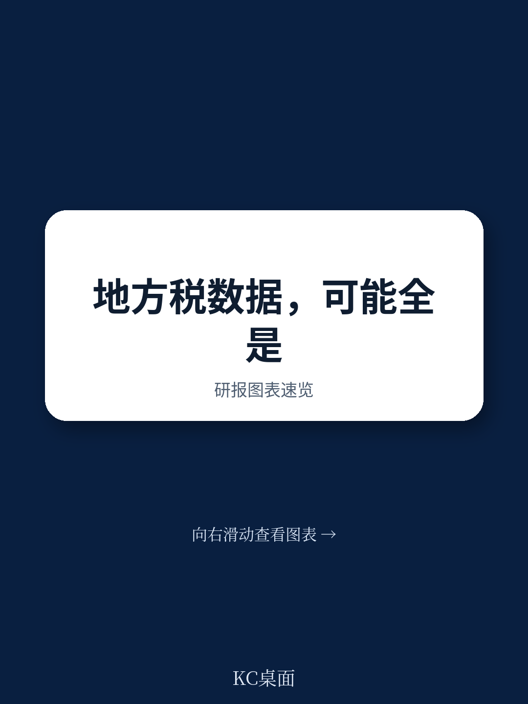
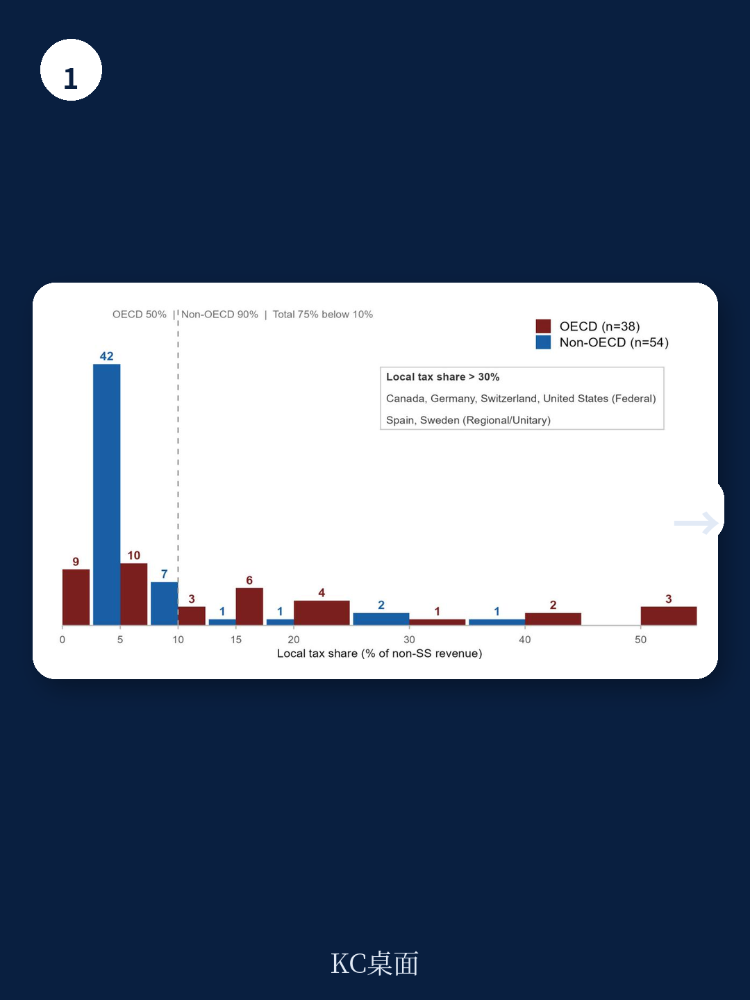
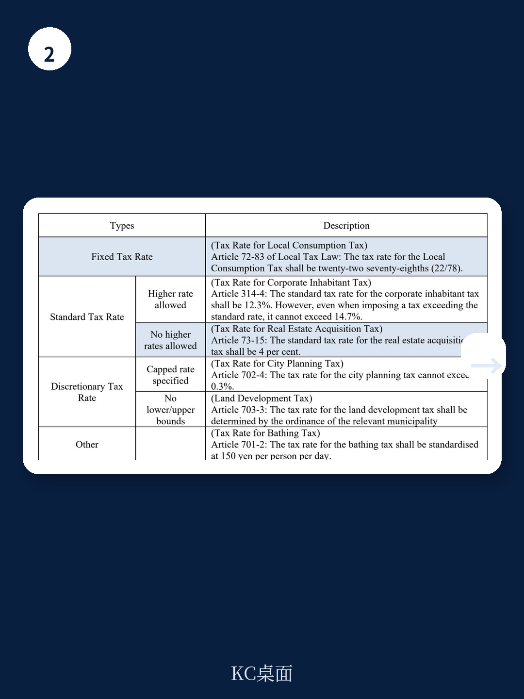

# 经合组织：不是地方税而是转移支付，经合组织重审92国财政分权数据

地方税占财政收入的比例，长期以来被视为衡量一国财政分权程度的核心指标。学术界用它来检验分权与经济增长的关系，政策制定者用它来评估地方政府的财政自主权。但一份来自经合组织（OECD）的最新工作论文，对这些数据的底层逻辑提出了根本性质疑。

这份由Junghun Kim撰写的报告，系统性地梳理了全球92个国家的数据，并得出一个令人不安的结论：按照国际通行的国民账户体系（SNA 2008）标准，许多国家上报的“地方税”收入，实际上更接近中央政府的转移支付。在75%的样本国家中，真实的地方税占比低于10%。真正拥有实质性地方税收自主权的国家，可能只有加拿大、德国、瑞士、美国、西班牙和瑞典六个。

这不是一个关于统计口径的学术争论。它直接关系到我们如何理解中央与地方的财政关系，如何评估分权改革的成效，以及如何解读以此为基础的学术研究。如果底层数据就存在系统性偏差，那么建立在这一基础之上的政策讨论，很可能是空中楼阁。

> **KC评论：** 这不是一个冷门的会计问题。它意味着，我们平时看到的“中国地方税占比”“日本地方税占比”等数据，可能严重高估了地方政府的实际征税权力。报告的核心贡献在于，它提供了一个重新审视这些数据的框架。继续看原文，真正有价值的是对德国和日本两个典型案例长达百年的制度演变分析，以及据此提出的再分类标准。

## 1. 地方税的定义，在2008年经历了一次“范式转换”

要理解当前数据的问题，必须先回到国际统计标准的演变。在2008年之前，联合国、OECD和IMF对“地方税”的定义相对宽泛。根据1993年的国民账户体系（SNA 1993），只要一个税种的收入是“自动且无条件地”基于来源地原则划归地方政府，就可以被归类为地方税。这意味着，即便地方政府完全没有税率或税基的决定权，只要中央政府在法律上规定了某个税种的收入归地方，这笔钱在统计上就会被记为“地方税”。

这种宽泛定义的逻辑基础，是当时国际统计体系更关注“谁最终获得了这笔钱”，而非“谁有权力决定这笔钱该收多少”。它默认中央与地方之间的税收划分是一种清晰的、可追溯的财务安排。

2008年的国民账户体系（SNA 2008）改变了这一逻辑。新标准的核心在于：一个税种应当被归属于那个“行使征税权力”的政府层级。具体而言，拥有征税权力的政府必须满足三个条件：第一，拥有征收该税种的权力；第二，拥有最终决定和调整税率的自由裁量权；第三，拥有最终决定如何使用该笔收入的权力。

这一变化意味着，判断一项收入是否为“地方税”，不再取决于收入最终流向了哪里，而是取决于地方政府在“征多少”和“怎么用”这两个核心环节上是否有真正的发言权。如果税率由中央统一规定，地方只是被动接受收入，那么按照SNA 2008的标准，这笔钱在本质上更接近中央对地方的转移支付，而不是地方自有税收。

> **KC评论：** 这个“范式转换”是整个报告的基石。它区分了“谁收钱”和“谁决定收多少”。对于研究中国财政体制的读者来说，这个区分尤其关键。报告对法国、日本、韩国的具体案例分析，展示了如何在实践中应用这一新标准。每日汇编里的图表和假设推演，会帮助你更直观地理解这一套判断逻辑。

## 2. 德国和日本：两种“非蒂伯特税”的百年演化

报告的核心分析，建立在对两个典型国家的历史制度考察之上：德国和日本。它们是理解两种非自主性地方税的关键案例。

德国的“共同税”（Gemeinschaftsteuern）体系，是理解“税收分享”本质的经典案例。德国的个人所得税、公司税和增值税，并非联邦、州和地方的独立税种，而是由联邦立法、由各州共同征收，然后按照一套复杂的公式在三级政府之间进行分配。地方政府的税率调整空间极小，且受到联邦法律的严格约束。这种安排的历史可以追溯到19世纪末德意志帝国的财政改革，其核心目标是维持联邦制下的财政均衡，而非赋予地方税收自主权。

日本的“法定地方税”体系，则是理解“中央决定的地方税”的另一种模式。日本的地方政府（都道府县和市町村）拥有几十种法定的地方税种，但几乎所有税种的税率都被中央法律设定在一个狭窄的范围内（通常是一个标准税率和一个上限税率）。地方政府只能在中央设定的框架内做微调。这种高度集权的税收体制，源于二战后的财政治理思想，旨在确保全国范围内的公共服务均等化，避免地方之间的恶性税收竞争。

报告指出，这两个国家的地方税体系，其历史形成时间远早于蒂伯特（Tiebout,1956）和奥茨（Oates,1972）提出的财政联邦主义理论。然而，当代许多学者，甚至包括德国和日本本土的研究者，却往往用这套理论框架来评价本国的财政体制，将“地方拥有税率决定权”这一理论假设，误读为对本国制度现状的描述。这种“理论错位”，正是导致数据误读和学术研究偏差的根源。

## 3. 法国：从中央决定的地方税到中央决定的税收分享

法国的情况，则展示了地方税体制向中央决定税收分享（CDTS）演化的一个鲜活案例。2010年，法国进行了重大的地方税改革，废除了地方营业税，代之以两种中央决定的地方税（CDLT）：企业增加值税（CVAE）和企业网络税（IFER）。这两种税的税率均由中央政府统一设定，地方政府无权调整，但可以保留在其辖区内产生的收入。

然而，改革并未止步于此。从2018年开始，法国加速了从“中央决定的地方税”向“中央决定的税收分享”的转变。地方政府获得的中央增值税（VAT）分成比例迅速扩大。到2023年，法国地方政府收到的增值税分成总额高达521亿欧元，约占全国增值税总收入的20%。这笔收入，在地方财政中已经超过了传统的财产税，成为最大的收入来源。

问题在于，这521亿欧元的增值税分成，在OECD的统计中，仍然被记作“地方税”。但按照SNA 2008的标准，地方政府对增值税的税率、税基和征收过程完全没有控制权，这笔钱本质上就是一笔由中央决定的、基于公式的转移支付。报告明确指出，这种统计口径的错位，严重高估了法国地方政府的财政自主权。

## 4. 75%的国家：地方税占比低于10%，数据失真并非个案

报告基于SNA 2008的标准，对92个OECD和非OECD国家的数据进行了重新审视和分类。结果触目惊心：在92个国家中，有68个（占比75%）的地方税占比低于10%。即便按照目前各国上报的、可能存在高估的数据，这一比例也仅为10%。

在报告提出的再分类框架下，真正拥有实质性地方税收自主权、地方税占比超过30%的国家，只有六个：加拿大、德国、瑞士、美国（均为联邦制国家）、西班牙（地区制）和瑞典。这六个国家，恰好是财政联邦主义理论中“蒂伯特地方税”运作最成熟的案例。

这意味着，绝大多数国家的地方政府，其财政自主权远比统计数据所显示的要小。它们的主要收入来源，要么是中央决定的税收分享，要么是中央决定的地方税，要么是直接的转移支付。用“地方税占比”来作为衡量财政分权的核心指标，在绝大多数国家都会产生严重误导。

## 5. 报告尚未完全回答的关键问题：中国的数据，到底该算哪一类？

报告在分析非OECD国家时，将中国列为需要重点关注的案例。报告中提到，中国的地方税法律和税率均由中央立法决定，地方政府的实际征税权力非常有限。按照SNA 2008的标准，中国上报的地方税收入中，很大一部分可能应该被重新归类为“中央决定的地方税”或“中央决定的税收分享”。

然而，报告并未对中国的情况进行深入拆解。中国的财政体制远比德国和日本复杂。比如，营改增之后，增值税作为中央与地方五五分成的主体税种，其分成比例和征收方式，在多大程度上赋予了地方政府“征税权力”？地方政府的土地出让金收入，虽然不被统计为“税”，但在实际操作中扮演了类似地方税的角色，这种非税收入又该如何纳入分析框架？

这些问题的答案，直接关系到如何评估中国过去二十年的财政分权改革，以及如何理解地方政府行为模式（如土地财政、债务扩张）的制度根源。报告提供了一个极具价值的分析起点，但针对中国的具体应用，仍然需要更细致的、结合中国法律和制度现实的独立研究。

## 6. 对读者的观察框架：别再只看“地方税占比”一个数字

这份报告对产业决策者和投资者的核心启示，是提供了一个更严谨的分析框架。在评估一个国家或地区的财政健康状况、地方政府投资能力或政策稳定性时，不应再仅仅依赖“地方税占比”这一个数字。

一个更有效的观察框架，应该包含三个维度：第一，地方政府的“税率自主权”——它能否独立决定本地主要税种的税率？第二，地方政府的“收入稳定性”——它的收入来源多大程度上依赖于中央决定的分享或转移支付，这种分享机制是否稳定、可预期？第三，地方政府的“支出责任与收入权力的匹配度”——它承担了多少公共服务支出，而这些支出中有多大比例可以由其自主决策的收入来覆盖？

只有将这三个维度结合起来，才能对一个地方的财政自主权和风险状况形成一个相对完整的判断。报告也提出了三项具体的政策建议：修订OECD解释指南中关于“征税权力”的模糊定义；推动税率体系从“固定税率”向“税率区间”转型；以及制度化地平衡各级政府的财政资源与支出责任。这些建议若能落地，将从根本上改变我们讨论财政分权的方式。

---

这篇报告揭示了一个全球性的统计盲区。它没有给出简单的答案，但它提供了一个比现有数据更接近事实的分析起点。对于那些真正关心财政体制、地方政府行为以及宏观经济结构的人来说，这份报告的价值不在于结论，而在于它提出的问题和方法。

更多国际信源汇编与评论，每日更新。我们会把这份完整报告放回当天的全球财政主题主线中，整理成中文摘要、KC评论和图表合集。这些内容便于喂给AI进行深度分析，也便于人工快速扫描全球市场dynamics。目前社群汇聚了头部券商、PE/VC、投行、并购、hedge fund、资管机构、战略咨询、智库等朋友，期待与你交流。

Personal reading notes and learning share only. Not investment advice.
