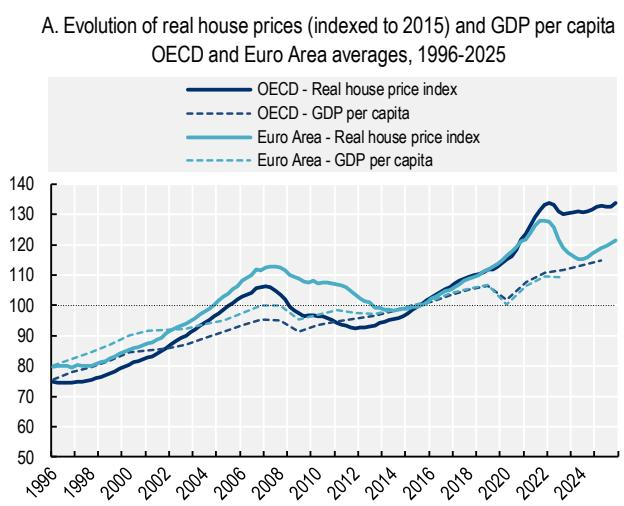
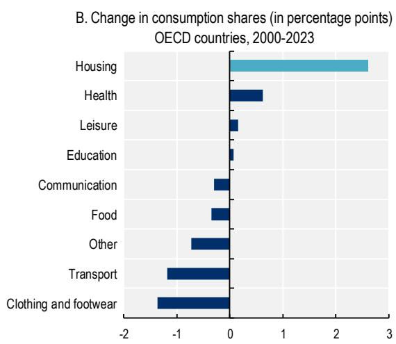
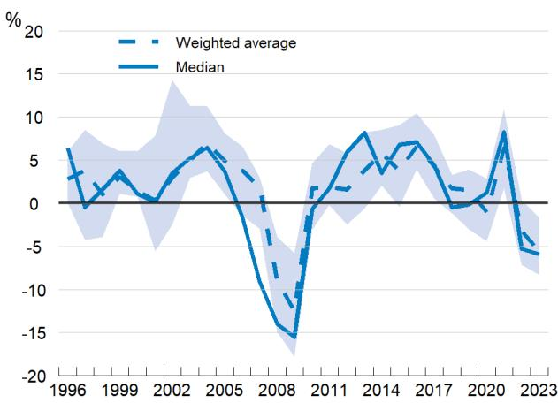

# Tackling the affordability gap through increased supply of affordable and social housing

July 2026

## Key messages

\- The housing affordability crisis in OECD/EU countries reflects, in part, an imbalance between housing supply and demand. Driven by multiple factors, such as rising construction costs, labour shortages in the construction sector, higher borrowing costs to finance construction, restrictive land-use policies and low public investment, the consequences are clear: rising housing costs, a growing housing cost burden for many households, and a shrinking social rental sector that is insufficient to meet demand.

\- Expanding the supply of affordable and social rental housing is a key part of the policy solution. This has the dual benefit of protecting low-income and vulnerable households, while also easing upward pressure on house prices. In a context of increasing pressures on public finances, two broad policy avenues can be pursued in parallel: i) Mobilising the existing stock as a source of affordable and social rental housing; and ii) Leveraging public and private funding to develop new affordable and social rental housing.

\- Activating the existing building stock – namely vacant and/or underutilised properties – for affordable and social rental housing can ease short-term pressure in tight markets, with the potential to improve building quality and energy efficiency. How much vacant housing can be mobilised for affordable and social housing depends on the scale, location and quality of vacant properties, as well as the reasons for vacancy. Potential instruments include:

○ Rental intermediation schemes offer diverse incentives and/or guarantees to property owners to lease available units at below-market rates; their design can be tailored to different policy challenges and country contexts.

\- Fiscal tools – such as reduced tax rates on rental income from leasing at affordable rates, or levies on vacant properties – can complement rental intermediation schemes, but may be more effective at improving housing availability than affordability.

\- Leveraging public and private funding can support sustainable investment in affordable and social rental housing while ensuring that funding is effectively used. Options include:

Source: Panel A: OECD (2025), OECD Affordable Housing Database – indicator HM1.2. Housing prices, ○ Establishing sustainable funding mechanisms for new affordable and social housing through special-purpose instruments, using public support to mobilise private funding. To be successful, funding volumes should be based on regular assessments of housing needs; rent-setting should ideally cover development costs while remaining affordable; and changes to borrowing and construction costs should be systematically monitored to inform both rent-setting and subsidy decisions.

\- Supporting the role and emergence of specialised providers of affordable and social housing – whether public, semi-public, or private non- or limited-profit actors – to ensure the take up of funding and the effective delivery and management of affordable and social rental dwellings. Ensuring viable business models, e.g. by indexing rent levels to inflation and updating rent levels in line with increases in tenants’ income, is key.

## What's the issue?

Over the past three decades, real house prices have increased in nearly all OECD countries (Figure 1, Panel A), and the share of housing-related spending in total consumption spending has been on the rise, raising concerns about housing affordability (OECD, 2025[1]). With earnings not keeping up with this increase, high housing prices mean that many households must allocate a larger share of their budget to cover mortgage or rent, and less on other key consumption items (Figure 1, Panel B).

Figure 1. A 30-year surge in housing prices, with housing costs rising faster than any other household expense  

  
https://www.oecd.org/content/oecd/en/data/datasets/oecd-affordable-housing-database.html, drawing on OECD Analytical House Price Database. Panel B: (OECD, 2025[2]); OECD Economic Outlook 117 database; OECD National Accounts database; and OECD calculations.

Home ownership rates have been declining in a number of OECD countries, especially among young people. For instance, between the 1980s and mid-2010s, home ownership rates dropped among people aged 25-34 in Australia, Denmark, Germany, the Netherlands, the United Kingdom and the United States (Smith et al., 2022[3]; Flynn, 2019[4]; Lennartz, Arundel and Ronald, 2015[5]; Hochstenbach and Arundel,

2021[6]; Wood et al., 2015[7]; Clark, 2018[8]; Arundel and Ronald, 2020[9]). By contrast, in Italy and Norway, home ownership rates among young people increased over this period by 5 and 8 percentage points (p.p.), respectively (Flynn, 2019[4]). As a consequence, more people have turned to the rental market, resulting in rising rents. Over the past decade, the share of tenants in the private rental market who spent more than $40\%$ of their disposable income on rent increased from $12.8\%$ of tenants in 2012 to $17.9\%$ in 2023, on average in the OECD (OECD, 2025[1]). Housing affordability is a particular challenge for low-income households and young people: around two in five low-income tenants spend over $40\%$ of their disposable income on rent, and the majority of young people aged 20-29 live with their parents in more than half of OECD countries (OECD, 2025[1]).

With house prices and private rents rising faster than incomes, and rental overburden increasingly widespread, expanding affordable and social rental housing $^{1}$ can help address affordability pressures that the market alone has proven unable to resolve. However, in around two-thirds of OECD countries, social rental housing makes up less than 5% of the total housing stock; only in the Netherlands, Austria and Denmark does it account for more than 20% of the total stock (OECD, 2025 $^{[1]}$ ). In fact, the share of social rental housing as a percentage of the total housing stock has declined since 2010 in all but three OECD countries with available data (OECD, 2026, forthcoming $^{[10]}$ ).

## Why is this important?

Housing has implications for macroeconomic development, financial stability and environmental performance. It is often households' largest asset as well as their largest financial liability. It impacts resource allocation and productivity and accounts for an important share of $\mathrm{CO}_{2}$ emissions (OECD, 2024[11]). Deterioration in housing affordability has far-reaching impacts on the economy, as well as implications for households' pocketbooks and prospects:

\- Access to affordable housing and a well-functioning housing market can inform the efficient reallocation of resources and affect productivity growth, resilience to economic shocks as well as environmental outcomes (OECD, 2021[12]).

\- Difficulties in accessing affordable housing options reduce residential mobility, which in turn can exacerbate skill mismatches and contribute to skill shortages, making labour markets less resilient (OECD, 2021[12]).

\- Increases in household spending on housing can have a negative effect on total fertility rates (Fluchtmann, van Veen and Adema, 2023[13]; OECD, 2024[14]) – a key concern for policymakers in a context of declining fertility, ageing-related fiscal pressures and major demographic transformations.

\- For most households, housing represents the largest asset, and is thus a fundamental driver of the accumulation and distribution of wealth (Causa, Woloszko and Leite, 2019[15]; OECD, 2021[12]).

\- In some OECD countries, there is evidence that the shortage of affordable housing has contributed to increases in homelessness and housing insecurity (OECD, 2026, forthcoming[16]).

## What's driving the affordability crisis, and what can policymakers do about it?

The drivers of the housing affordability crisis in OECD countries are multiple and context specific. On the supply side, rising construction costs, labour shortages in the construction sector, higher interest rates that increase the cost of financing construction, restrictive land use policies, limited availability of land for development in high-demand areas, the effects of short-term rentals in some areas, and declining public investment in housing constrain the production of new housing (OECD, 2021[12]). At the same time, demand pressures, including demographic changes – such as population ageing and migration flows – and shifts toward smaller and more numerous households, put further pressure on an already strained housing supply. The intensity of affordability pressures, as well as the relative importance of different contributing factors, varies across and within countries.

As part of a range of reforms to address the housing affordability crisis (OECD, 2021[12]; OECD, 2023[17]), many OECD countries are exploring ways to increase the supply of affordable and social rental housing. Expanding access to affordable and social rental housing can help cushion some of the effects of the housing crisis in the short term, while also supporting housing affordability objectives over the longer term. The increased focus on the rental market represents a shift in the housing policy approach in some OECD countries, which has traditionally emphasised access to home ownership. There is growing recognition that support for home ownership can yield benefits, yet also comes with important costs (Box 1). The shift towards the development of the rental market (subsidised and private) diversifies and balances available housing options, helping to meet the needs of a broader range of households.

This brief focusses on two approaches to increase the supply of affordable and social rental housing that could help make the best use of constrained fiscal and environmental resources:

\- Identifying opportunities to mobilise the existing building stock as a source of affordable and social rental housing; and

\- Supporting the development and funding of new affordable and social housing by leveraging public and private resources.

## Box 1. The costs and benefits of home ownership support

In many OECD countries, support for home ownership has traditionally formed the backbone of housing policy. Public support takes various forms, such as the provision of direct subsidies, subsidised mortgages or mortgage guarantees to first-time homebuyers; favourable tax treatment of home ownership; and funding (or other support) to build new housing. $^{1}$

Home ownership can bring important benefits, including as a vehicle for asset and wealth accumulation; for its role in generating positive outcomes for children; and, according to some research, for its link to higher levels of civic engagement.

Nevertheless, home ownership – along with the public policies designed to facilitate its expansion – also generates costs that can extend beyond its budgetary cost. Most importantly, in the context of constrained supply, demand-side housing support (including financial and fiscal incentives that aim to support first-time home buyers or existing homeowners) can increase demand for housing and push up house prices, thereby reducing housing affordability overall and redistributing income from (younger) first-time buyers towards (older) existing homeowners.

Further, countries with higher home-ownership rates tend to have lower residential mobility, which can make more difficult to meet labour demands, and tax advantages that favour home ownership tend to be regressive, primarily benefitting higher-income households.

1. Refer to the OECD Affordable Housing Database for an overview of national-level policies in place to support affordable housing (indicator PH1.1. Policy instruments and level of government); for more details on specific measures to facilitate access to home ownership (indicators PH2.1. Support for homebuyers and PH5.1. Measures to support affordable housing development) (OECD, 2025[1]).
Source: (Andrews and Caldera Sánchez, 2011[18]; Salvi del Pero et al., 2016[19]; OECD, 2021[12]; Causa, Woloszko and Leite, 2019[15]; Andrews, Caldera Sánchez and Johansson, 2011[20]; OECD, 2022[21]; André, 2010[22]; Causa and Pichelmann, 2020[23]).

## Mobilise the existing stock as a source of affordable and social rental housing

Many governments are exploring how to mobilise the existing housing stock as a source of affordable and social rental housing. Activating the existing stock can help relieve some short-term pressures in tight housing markets, while also making more efficient use of vacant or underutilised buildings. It can also be an avenue to upgrade the building stock, including in terms of quality and energy efficiency, representing a more environmentally sustainable alternative to new construction.

Different types of stock can be considered, including vacant or underutilised dwellings and/or properties owned by public or institutional actors (e.g. hospitals, military barracks, etc.) that are no longer in use and can be adapted for new purposes, including affordable and social housing. Additionally, public authorities can also consider acquiring existing dwellings as an additional source of affordable and social rental housing.

Vacant dwellings make up at least 7% of the total housing stock in 21 countries with available data, on average (and at least 10% in those countries that also include seasonal/holiday homes $^{2}$ ) (OECD, 2026, forthcoming $^{[10]}$ ). Despite growing interest in the potential for adaptive reuse of ageing and underutilised properties owned by public or institutional actors, there are no cross-national data on the size of the stock.

Not all vacant dwellings are worth activating or acquiring, and their potential as a source of affordable housing use should not be overestimated, as the dwellings may be in poor condition or in areas where there is little demand for housing. Accordingly, it is important to undertake a detailed assessment of the scale, location, ownership status and quality of vacant or underutilised properties, as well as the main reasons for vacancy, to determine the viability of bringing such properties back into the market. In addition to census and survey data, administrative data as well as data from public utilities can inform this assessment (OECD, 2025[24]). Policymakers can then consider different approaches to activate vacant or idle properties for affordable rent, including by introducing incentive schemes and mediating actors (such as social rental agencies) to encourage owners to lease properties at below-market rates, and/or other instruments, including fiscal tools (OECD, 2025[24]).

Rental intermediation schemes to encourage property owners to lease dwellings at affordable rates

Rental intermediation schemes function by offering incentives to property owners to lease dwellings at below-market rates. Such schemes may be operated by a formal intermediary between property owners and tenants – such as a social rental agency (SRA) – which assumes some of the risks and day-to-day responsibilities associated with leasing a dwelling and can also provide additional support to tenants.

There are considerable differences in the design and implementation of rental intermediation schemes, reflecting that such schemes can be adapted to address specific challenges and contexts:

\- Type of eligible properties: Schemes may apply to any rental dwelling, provided that it meets minimum quality standards, or focus only on certain dwellings, such as privately- or publicly-owned flats, long-term vacant dwellings, and/or vacant dwellings in need of renovation.

\- Tenant eligibility: Schemes may aim to support the most vulnerable tenants (people at risk of, or experiencing, homelessness) or have broader eligibility criteria.

\- Contractual arrangements: In some schemes, tenants sign a rental contract directly with the owner; in others, an intermediary body (e.g. SRA) signs the lease on behalf of the tenant, who then subleases the unit from the SRA.

\- Benefits/guarantees to tenants: While rent level calculations vary, all schemes provide tenants with below-market rents and guaranteed tenancy for a specified period; in some cases, additional social support may be made available to tenants as relevant.

\- Incentives/guarantees to participating property owners: Incentive structures vary considerably. Most include regular rental payments; they may also include the management of the administrative aspects of tenancy agreements; payment and/or management of all/part of maintenance/repairs; fiscal incentives (e.g. tax relief on rental income); and/or financial support, including to undertake renovations.

At least 10 OECD/EU countries report some form of rental intermediation scheme, according to the 2025 OECD Questionnaire on Affordable and Social Housing (QuASH). The approach is relatively well developed in Belgium, Chile, France, Ireland and the United States, and in a pilot phase in Greece, Poland and Spain. In France, 93 000 units have been mobilised through rental intermediation, largely accommodating people experiencing or at risk of homelessness (Délégation interministérielle à l'hébergement et à l'accès au logement (DIHAL), France, 2023[25]). In Belgium, around 30 000 dwellings have been mobilised through rental intermediation, through 96 SRAs. In Ireland, the Rental Accommodation Scheme – managed by local authorities – contracts directly with private landlords to house individuals with a long-term housing need. Common challenges include the identification of potential properties and/or property owners, as well as the design of the appropriate incentives to encourage property owners to participate.

While SRAs can help increase access to below-market rate housing, they do not represent a structural market fix. Challenges to scale up rental intermediation include competition from the private rental sector and the need to maintain sufficiently attractive incentives to encourage sustained participation from property owners – especially in tight rental markets where market rent levels are high. The cost effectiveness of sustained public support for rental intermediation (e.g. guarantees, fiscal incentives and/or renovation subsidies, along with any public support for the operation of SRAs), as well as the efficiency and affordability levels achieved through rental intermediation vis a vis the development of new affordable and social housing, requires careful consideration and assessment.

## Other instruments to activate vacant or idle properties for lease at affordable rates

Tax incentives, along with broader tax reforms, can be another avenue to activate the vacant or underutilised stock for affordable rental housing. The tax regime in most OECD countries makes it generally more fiscally advantageous for homeowners to occupy their home rather than rent it to others; this is because rental income is generally taxable, whereas imputed rents (the rental value of living in an owned unit) is often tax-free (OECD, 2022[21]). Nevertheless, some OECD countries offer fiscal incentives, such as lower tax rates on rental income, to property owners who lease their properties at below-market rent, including Australia, France and Italy (OECD, 2022[21]; OECD, 2023[26]).

One alternative is to levy a tax (or higher tax rate) on vacant or idle properties or land to encourage more efficient use of the housing stock. However, taxes on vacant properties require close monitoring and enforcement and have not been consistently effective in increasing both housing availability and affordability, with experiences in Australia, Canada, France, Portugal and the United Kingdom (Segú, 2020[27]; OECD, 2022[21]; Caracciolo and Miglino, 2024[28]; OECD, 2026[29]). For instance, an empty-homes tax introduced in Vancouver, Canada, in 2017 was shown to help address housing availability by reducing the overall vacancy rate, but did not affect housing affordability, with no change observed to average rent levels – suggesting that additional measures might be needed to improve housing affordability (Caracciolo and Miglino, 2024[28]). Effective implementation of vacancy taxes also requires extensive monitoring and enforcing mechanisms, the costs of which should be carefully assessed against the benefits of these taxes (OECD, 2025[24]; OECD, 2022[21]).

Ultimately, the introduction of specific tax incentives or levies may be a next-best option, following broader tax reforms, including, inter alia, improving the design and functioning of property taxes, evaluating fiscal support for home ownership, and considering a mix of tax and non-tax policies to increase the supply of affordable housing (see OECD (2022[21]; 2024[11])).

Note: Real gross fixed capital in residential housing, weighted average of 17 OECD countries. The shaded area shows the interquartile range. Source: (OECD, 2025[2]); OECD Economic Outlook 117 database; OECD National Accounts database; and OECD calculations.

## Enable the development and funding of affordable and social housing

One key driver of the housing affordability crisis is that housing investment has been uneven, with several shocks, including the Global Financial Crisis, the COVID-19 pandemic and the rise in energy costs in its aftermath further contributing to a slowdown in construction activity (Figure 2). While most constraints concern private investment in housing, low rates of public investment have also contributed to the lack of affordable housing (OECD, 2023[17]).

## Figure 2. Housing investment has experienced several negative shocks

Annual growth in real housing investment, OECD

Greater public investment in affordable and social housing has the dual benefit of protecting low-income or vulnerable households, while expanding the housing supply and easing upward pressure on house prices. Governments can enable the development of new affordable and social housing by: i) helping to establish sustainable funding mechanisms, and ii) facilitating the emergence of specialised providers of affordable and social housing.

## Sustainable funding mechanisms for new affordable and social housing

Special-purpose funding instruments can facilitate investment in affordable and social housing over the medium- to long-term, using public support to leverage private funding. These instruments can include a “revolving” element, using a share of the rents to finance new development of affordable and social rental housing over time. Funding mechanisms can be grouped into four broad categories:

\- Dedicated affordable housing funds with a revolving element, using a mix of public and private loans, as well as public and, in some cases, EU funding, with a share of rents or loan repayments paid into the fund to finance new development of affordable and social housing (Canada, Denmark, Iceland and Latvia) (OECD, 2023[30]; OECD, 2023[31]; OECD, 2025[32]; OECD, 2026[33]).

\- Systems of loan guarantees, public loans and equity contributions from specialised affordable and social housing providers, with a share of tenant contributions used to finance new affordable housing development (Austria, the Netherlands) (OECD, 2023[30]; OECD, 2025[34]; OECD, 2026[35]).

\- Specialised investment funds and dedicated credit lines, with an initial equity provided by the government to generate stable, long-term returns to finance affordable and social housing and match funding from private capital (Australia) or special savings accounts to fund concessional special-purpose loans for affordable and social housing development (France) (OECD, 2025[24]; OECD, 2026[36]).

\- Housing funds with a broad remit, which, in addition to funding new affordable and social rental housing, may also include funding for affordable home ownership, renovation and construction of social rental housing through low-interest loans, with loan repayments as the main source of re-financing (Norway, the Slovak Republic, Slovenia) (OECD, 2023[30]; OECD, 2024[37]; OECD, 2024[38]).

While the set-up and financing mechanisms vary significantly, country experiences point to several enabling factors that can facilitate both the instruments' effectiveness and financial sustainability:

\- Assessment of housing and financing needs: Resources and lending/financing volumes are usually grounded in an assessment of housing needs, even for those mechanisms that are independent from state financing (for example, Denmark) and in some cases based on a bottom-up exercise conducted with municipalities (for example, Slovenia). Such assessments help maintain the adequacy of the funding instruments, including on the maintenance of the housing stock (OECD, 2023[30]).

\- Cost recovery and rent setting: When financing is directed toward the development of affordable and social rental housing, rent levels are ideally set at a level that covers construction costs and remain affordable over time (for example, Austria). Borrowing costs can also be adapted to specific target groups, by funding housing developments with more expensive loans to finance housing for moderate-income households and cheaper loans to support housing for very low and low-income households (for example, France). This can help reduce the overall cost of housing development, while facilitating social mixing (OECD, 2023[30]; OECD, 2025[24]).

\- Monitoring and data collection: Funding systems can also be set up to facilitate monitoring of the financial sustainability of the investment. This generally includes careful monitoring of changes to borrowing and construction costs, which can help inform rent-setting mechanisms, or the need to provide subsidies to close the rent gap for more vulnerable tenants. Over time, these data can be enriched with social and economic data (for example, Denmark), which can in turn help inform housing policy design and implementation (OECD, 2023[30]).

## Specialised providers of affordable and social housing

The impact of the financing instruments also depends on the capacity of institutions responsible for managing affordable and social housing – in many cases, subnational entities – to effectively use the funds. While public authorities have responsibilities for the policies for affordable and social housing – including, for instance, setting eligibility criteria and allocating affordable and social housing – in several countries, specialised actors provide and manage affordable and social rental housing.

These providers may be companies owned by regional or municipal authorities for the provision of a public service (Ireland, Poland and some providers in Belgium and France) or private firms, co-operatives or associations operating under the strict obligation of building and managing affordable dwellings (Austria, Australia, Denmark and the Netherlands, and some providers in Belgium and France) (OECD, 2023[30]; OECD, 2025[24]; OECD, 2025[39]). In general, they operate on a limited- or not-for-profit business model to ensure financial sustainability and constant reinvestment into the affordable and social dwelling stock. These providers can generally receive financial support for the sole purpose of developing affordable and social rental dwellings, which are made available to eligible households (OECD, 2025[24]). Auditing and control mechanisms help ensure that these providers meet their obligations (OECD, 2023[30]).

The primary role of specialised providers is to ensure that affordable and social rental housing is delivered, maintained and serviced over time. They are also the interface for tenants on matters related to maintenance and management of the dwellings and, in some cases, they support the development of communal spaces and forms of active participation in the life of the building. They can collaborate with other relevant organisations to facilitate housing for households with special needs and facilitate social inclusion (OECD, 2025[24]).

However, their business model, which is based on the recovery of the costs of building and maintaining quality affordable and social rental housing, needs to remain viable. Even in countries with a well-developed network of specialised housing providers like the Limited-Profit Housing Associations in Austria and the Housing Associations in the Netherlands, these bodies are under considerable stress due to rising construction and energy costs and the need to respond to increasing demand for affordable and social housing. Indexation of rents to inflation, as well as updating rent levels in line with increases in household income, can provide additional resources to these bodies and help maintain the viability of the model (OECD, 2025[34]; OECD, 2020[40]; OECD, 2026[35]).

## Reorienting housing policies to tackle the housing affordability gap

Tacking the affordability gap requires well-targeted actions and sustained investment. By coupling short-term measures to mobilise existing dwellings with medium- to long-term strategies that leverage public and private funding to expand affordable and social rental housing, governments can ease housing affordability pressures today and lay the foundation for a more inclusive housing market tomorrow, without undermining the path towards fiscal consolidation. They should be part of strategies and policies that aim to support a balanced housing market over the long-term, including through updated regulation that ensure the provision of affordable rental housing. Together, these two approaches – mobilising the existing building stock as a source of affordable and social rental housing and leveraging public and private resources to develop and manage new affordable and social housing – reflect a broader reorientation in housing policy in some OECD countries, away from an exclusive focus on facilitating home ownership, toward a more balanced and diversified housing sector capable of meeting the needs of households who are increasingly priced out of the market.

## References

André, C. (2010), “A Bird’s Eye View of OECD Housing Markets”, OECD Economics Department Working Papers, No. 746, OECD Publishing, Paris, https://doi.org/10.1787/5kmlh5qvz1s4-en. [22]

Andrews, D. and A. Caldera Sánchez (2011), “Drivers of Homeownership Rates in Selected OECD Countries”, OECD Economics Department Working Papers, No. 849, OECD Publishing, Paris, https://doi.org/10.1787/5kgg9mcwc7jf-en.

Andrews, D., A. Caldera Sánchez and Á. Johansson (2011), “Housing Markets and Structural Policies in OECD Countries”, OECD Economics Department Working Papers, No. 836, OECD Publishing, Paris, https://doi.org/10.1787/5kgk8t2k9vf3-en.

Arundel, R. and R. Ronald (2020), “The false promise of homeownership: Homeowner societies in an era of declining access and rising inequality”, Urban Studies, Vol. 58/6, pp. 1120-1140, https://doi.org/10.1177/0042098019895227.

Caracciolo, G. and E. Miglino (2024), “Ripple Effects: The Impact of an Empty-Homes Tax on the Housing Market”, Ripple Effects: The Impact of an Empty-Homes Tax on the Housing Market – C.D. Howe Institute, https://cdhowe.org/publication/ripple-effects-impact-empty-homes-tax-housing-market/.

Causa, O. and J. Pichelmann (2020), “Should I stay or should I go? Housing and residential mobility across OECD countries”, OECD Economics Department Working Papers, No. 1626, OECD Publishing, Paris, https://doi.org/10.1787/d91329c2-en.

Causa, O., N. Woloszko and D. Leite (2019), “Housing, wealth accumulation and wealth distribution: Evidence and stylized facts”, OECD Economics Department Working Papers, No. 1588, OECD Publishing, Paris, https://doi.org/10.1787/86954c10-en.

Clark, W. (2018), “Millennials in the Housing Market: The Transition to Ownership in Challenging Contexts”, Housing, Theory and Society, Vol. 36/2, pp. 206-227, https://doi.org/10.1080/14036096.2018.1510852.

Délégation interministérielle à l'hébergement et à l'accès au logement (DIHAL), France (2023), Deuxième plan quinquennal pour le Logement d'abord (2023-2027), https://www.ecologie.gouv.fr/sites/default/files/documents/20.06.2023\_DP\_Logement\_dabord2.pdf.

Fluchtmann, J., V. van Veen and W. Adema (2023), “Fertility, employment and family policy: A cross-country panel analysis”, OECD Social, Employment and Migration Working Papers, No. 299, OECD Publishing, Paris, https://doi.org/10.1787/326844f0-en.

Flynn, L. (2019), “The young and the restless: housing access in the critical years”, West European Politics, Vol. 43/2, pp. 321-343, https://doi.org/10.1080/01402382.2019.1603679.

Hochstenbach, C. and R. Arundel (2021), “The unequal geography of declining young adult homeownership: Divides across age, class, and space”, Transactions of the Institute of British Geographers, Vol. 46/4, pp. 973-994, https://doi.org/10.1111/tran.12466.

Lennartz, C., R. Arundel and R. Ronald (2015), “Younger Adults and Homeownership in Europe Through the Global Financial Crisis”, Population, Space and Place, Vol. 22/8, pp. 823-835, https://doi.org/10.1002/psp.1961.

OECD (2026), OECD Economic Surveys: Australia 2026, OECD Publishing, Paris, https://doi.org/10.1787/d22a1efd-en.

OECD (2026), OECD Economic Surveys: Austria 2026, OECD Publishing, Paris, [35] https://doi.org/10.1787/7cea027b-en.

OECD (2026), OECD Economic Surveys: Denmark 2026, OECD Publishing, Paris, https://doi.org/10.1787/3d6cb4b8-en. [33]

OECD (2026), OECD Economic Surveys: Portugal 2026, OECD Publishing, Paris, [29] https://doi.org/10.1787/025b3445-en.

OECD (2025), Affordable Housing Database, http://www.oecd.org/social/affordable-housing-database.htm. [1]

OECD (2025), Housing Reforms in Czechia and Poland, OECD Publishing, Paris, [24] https://doi.org/10.1787/4988c473-en.

OECD (2025), OECD Economic Outlook, Volume 2025 Issue 1: Tackling Uncertainty, Reviving Growth, OECD Publishing, Paris, https://doi.org/10.1787/83363382-en. [2]

OECD (2025), OECD Economic Surveys: Canada 2025, OECD Publishing, Paris, [32]

https://doi.org/10.1787/28f9e02c-en.

OECD (2025), OECD Economic Surveys: Ireland 2025, OECD Publishing, Paris, https://doi.org/10.1787/9a368560-en.

OECD (2025), OECD Economic Surveys: Netherlands 2025, OECD Publishing, Paris, https://doi.org/10.1787/2dd1f4aa-en.

OECD (2024), An Agenda for Housing Policy Reform, OECD Publishing, Paris, https://doi.org/10.1787/ddb57031-en.

OECD (2024), OECD Economic Surveys: Slovak Republic 2024, OECD Publishing, Paris, https://doi.org/10.1787/397ca086-en.

OECD (2024), OECD Economic Surveys: Slovenia 2024, OECD Publishing, Paris, https://doi.org/10.1787/bc4a107b-en.

OECD (2024), Society at a Glance 2024: OECD Social Indicators, OECD Publishing, Paris, https://doi.org/10.1787/918d8db3-en.

OECD (2023), Brick by Brick (Volume 2): Better Housing Policies in the Post-COVID-19 Era, OECD Publishing, Paris, https://doi.org/10.1787/e91cb19d-en.

OECD (2023), OECD Economic Surveys: Iceland 2023, OECD Publishing, Paris, https://doi.org/10.1787/b3880f1a-en.

OECD (2023), Policy Actions for Affordable Housing in Lithuania, OECD Publishing, Paris, https://doi.org/10.1787/ca16ff6d-en.

OECD (2023), Strengthening Latvia's Housing Affordability Fund, OECD Publishing, Paris, https://doi.org/10.1787/84736a67-en.

OECD (2022), Housing Taxation in OECD Countries, OECD Tax Policy Studies, No. 29, OECD Publishing, Paris, https://doi.org/10.1787/03dfe007-en.

OECD (2021), Brick by Brick: Building Better Housing Policies, OECD Publishing, Paris, https://doi.org/10.1787/b453b043-en.

OECD (2020), "Social housing: A key part of past and future housing policy", Employment, Labour and Social Affairs Policy Briefs, https://www.oecd.org/en/publications/2020/10/social-housing-a-key-part-of-past-and-future-housing-policy\_ef96d6d9.html.

OECD (2026, forthcoming), OECD Affordable Housing Database, https://www.oecd.org/content/oecd/en/data/datasets/oecd-affordable-housing-database.html.

OECD (2026, forthcoming), Understanding the main drivers of homelessness in OECD and EU countries, OECD Publishing, Paris.

Salvi del Pero, A. et al. (2016), "Policies to promote access to good-quality affordable housing in OECD countries", OECD Social, Employment and Migration Working Papers, No. 176, OECD Publishing, Paris, https://doi.org/10.1787/5jm3p5gl4djd-en.

Segú, M. (2020), "The impact of taxing vacancy on housing markets: Evidence from France", Journal of Public Economics, Vol. 185, p. 104079, https://doi.org/10.1016/j.jpubeco.2019.104079.

Smith, S. et al. (2022), “Housing and economic inequality in the long run: The retreat of owner occupation”, Economy and Society, Vol. 51/2, pp. 161-186, https://doi.org/10.1080/03085147.2021.2003086.

Wood, G. et al. (2015), “Life on the edge: a perspective on precarious home ownership in Australia and the UK”, International Journal of Housing Policy, Vol. 17/2, pp. 201-226, https://doi.org/10.1080/14616718.2015.1115225.

## Contact

Marissa Plouin, OECD Employment, Labour and Social Affairs Directorate, (✉ Marissa.Plouin@oecd.org).
Filippo Cavassini, OECD Economics Department, (✉ Filippo.Cavassini@oecd.org).
The contributions of Ali Bargu, Mary Berman, Fátima Talidi and Esther Raineau-Rispal are gratefully acknowledged.

## Notes

$^{1}$ The OECD (2020 $^{[40]}$ ) defines:

\- Social housing as “residential rental accommodation provided at sub-market prices that is targeted and allocated according to specific rules, such as identified need or waiting lists.”

\- Affordable housing as “rental and owner-occupied dwellings that are made more affordable to households through a broad range of supply- and demand-side support”.

In practice, in some OECD countries, there is no distinction between affordable and social housing; in others, social housing is targeted to very low-income and vulnerable households, and affordable housing is made more broadly available to moderate- and low-income households.

$^{2}$ Data reported by governments in the 2025 OECD Questionnaire on Affordable and Social Housing (QuASH). Information on the number of vacant dwellings is only available for some countries. Where data on vacancy rates are available, some countries consider seasonal and holidays homes as part of the vacant dwelling stock, while other countries exclude them, making cross-country comparison difficult (see indicator HM1.1 in (OECD, 2025 $^{[1]}$ )). Further, these data reflect the privately-owned residential stock, and do not take into account, for example, inactive properties owned by public or institutional actors.

This work is issued under the responsibility of the Secretary-General of the OECD, and does not necessarily reflect the official views of OECD Member countries.

This document, as well as any data and map included herein, are without prejudice to the status of or sovereignty over any territory, to the delimitation of international frontiers and boundaries and to the name of any territory, city or area.

## Attribution 4.0 International (CC BY 4.0)

This work is made available under the Creative Commons Attribution 4.0 International licence. By using this work, you accept to be bound by the terms of this licence (https://creativecommons.org/licenses/by/4.0/).

## Attribution – you must cite the work.

Translations – you must cite the original work, identify changes to the original and add the following text: In the event of any discrepancy between the original work and the translation, only the text of original work should be considered valid.

Adaptations – you must cite the original work and add the following text: This is an adaptation of an original work by the OECD. The opinions expressed and arguments employed in this adaptation should not be reported as representing the official views of the OECD or of its Member countries.

Third-party material – the licence does not apply to third-party material in the work. If using such material, you are responsible for obtaining permission from the third party and for any claims of infringement.

You must not use the OECD logo, visual identity or cover image without express permission or suggest the OECD endorses your use of the work.

Any dispute arising under this licence shall be settled by arbitration in accordance with the Permanent Court of Arbitration (PCA) Arbitration Rules 2012. The seat of arbitration shall be Paris (France). The number of arbitrators shall be one.