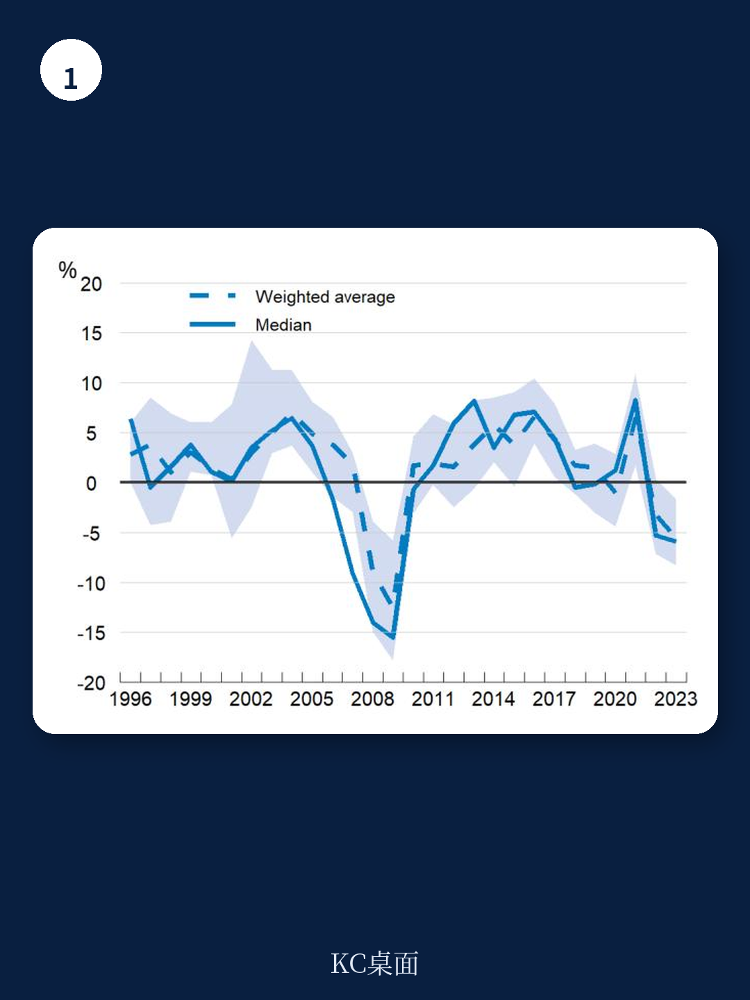

# 经合组织：住房支出挤压消费，经合组织给出一个被低估的政策工具

过去三十年，经合组织国家的实际房价几乎无一例外地上涨。与此同时，住房支出在家庭总消费中的占比持续攀升，挤压了其他消费空间。这场危机最直接的受害者是低收入家庭和年轻人——在经合组织国家中，约五分之二的低收入租户将其可支配收入的40%以上用于支付房租，而在超过一半的成员国中，多数20至29岁的年轻人仍与父母同住。市场自身已无法解决这一困境。

但经合组织最新发布的这份报告，提出了一个与多数政策讨论方向不同的核心判断：缓解住房可负担性危机的关键，并非大规模新建住房，而在于更聪明地激活存量住房，并设计可持续的融资机制。这个判断背后，是对过去三十年住房政策逻辑的深刻反思——长期依赖支持自有住房的政策，可能恰恰加剧了当前的困境。

报告指出，在约三分之二的经合组织国家中，社会保障性租赁住房仅占住房总量的不到5%。自2010年以来，几乎所有有数据可查的国家中，这一比例都在下降。供给不足的同时，需求侧的压力却在持续累积——人口老龄化、移民流动、家庭规模缩小等结构性因素，使得住房需求的结构发生了根本性变化。

> **KC评论：** 这份报告最有价值的地方，在于它没有简单地把问题归咎于“盖得不够多”，而是系统性地拆解了供给端和需求端的多重错配。对于关注房地产市场的读者来说，报告中的图表数据——尤其是各国空置率与社保住房占比的对比——才是真正值得细读的资产。继续看原文，真正有价值的是这些跨国数据背后的政策实验和效果验证路径；完整报告与KC评论在每日汇编。

## 1. 激活存量住房，比新建更紧迫、也更现实

报告明确给出了一个优先级判断：在财政和环境资源都受限的背景下，首先应该考虑的是激活现有存量住房，而非大规模新建。这不仅是短期缓解市场压力的手段，更是一种更环保、更经济的策略。

数据显示，在有数据可查的21个国家中，空置住房平均至少占住房总量的7%。如果将季节性住房和度假住房计算在内，这一比例在部分国家甚至超过10%。此外，还有大量由公共机构或机构投资者持有但已不再使用的物业——例如废弃的医院、军营等——可以通过适应性改造重新进入市场。

但这并不意味着所有空置房都值得被激活。报告特别强调，必须对空置物业的规模、位置、权属状况、质量以及空置原因进行详细评估。那些位于低需求区域或质量过差的物业，即使被激活，也无法有效缓解房价压力。这要求政策制定者掌握更精细的数据——包括人口普查数据、行政数据，甚至公共事业公司的用水用电数据。

> **KC评论：** 这里有一个容易被忽视的洞察：空置率数据本身并不足以指导政策。关键在于区分“结构性空置”（例如人口流出地区的废弃房产）和“摩擦性空置”（例如房东因租金管制或税收原因主动空置）。报告没有完全展开的是，不同国家如何通过数据交叉验证来识别这两类空置，而这恰恰是政策设计的前提。

## 2. 租赁中介计划：一个被低估的政策工具

报告重点介绍了一种在多个国家已取得成效的政策工具——租赁中介计划。这类计划的核心逻辑是：通过正式的中介机构（如社会租赁机构），向房东提供激励和担保，鼓励其以低于市场价的租金出租房屋。

报告分析了至少10个经合组织/欧盟国家已实施此类计划，其中法国通过租赁中介计划动员了9.3万套住房，主要安置了无家可归者或面临无家可归风险的人群。比利时的96家社会租赁机构则动员了约3万套住房。

但报告也坦诚指出了这类工具的局限性。租赁中介计划面临的核心挑战是：如何在紧张的租赁市场中设计足够有吸引力的激励措施，以维持房东的持续参与。当市场租金高企时，政府需要提供的补贴和担保成本也会随之上升。这引出了一个尚未被充分回答的问题：租赁中介计划的成本效益，与新建社保住房相比，究竟孰优孰劣？

## 3. 财政工具：空置税可能更有效于“释放”，而非“降价”

报告对财政工具的应用给出了一个审慎的判断。一方面，对以可负担价格出租的房屋的租金收入给予税收减免，可以直接激励房东参与租赁中介计划。另一方面，对空置物业征税，则可能更有效地增加市场供给，而非直接降低租金。

报告引用了一项对法国空置税的研究，该研究发现，对空置物业征税确实能减少空置，但并未显著降低租金水平。这意味着，空置税的主要作用是“释放供给”，而非“压低价格”。对于政策制定者而言，这意味着需要将空置税与其他工具组合使用，才能同时实现增加供给和改善可负担性的双重目标。

> **KC评论：** 这是报告中最具操作指导价值的部分之一。它提醒政策制定者，不要对单一工具抱有过高期望。空置税能解决“房东为什么不出租”的问题，但无法解决“租户为什么租不起”的问题。后者需要与收入补贴、租金管制等需求侧政策配合。报告中的图表——特别是各国空置率与租金负担率的对比——为这些政策组合的效果提供了重要的参照系。

## 4. 可持续融资机制：社保住房的真正瓶颈

报告指出，建立可持续的融资机制是扩大社保住房供给的核心挑战。在公共财政压力日益增大的背景下，仅靠政府预算拨款已不可行。报告建议通过专项工具，利用公共资金撬动私人资本。

成功的融资机制需要满足三个条件：第一，融资规模应基于定期的住房需求评估，而非政治周期；第二，租金设定应覆盖开发成本，同时保持可负担性；第三，必须系统性地监测借贷成本和建设成本的变化，以便及时调整租金设定和补贴决策。

报告特别强调了专业化供给机构的作用。无论是公共、半公共，还是私营的非营利或有限利润机构，都需要有可行的商业模式。其中，将租金水平与通胀挂钩，并根据租户收入增长定期调整租金，被报告视为关键机制。

## 5. 支持自有住房的政策，可能是问题的根源之一

报告在Box 1中系统性地回顾了支持自有住房政策的成本和收益，这是整份报告最具颠覆性的部分。报告指出，尽管自有住房能带来资产积累、儿童发展等益处，但在供给受限的背景下，需求侧的住房支持政策（包括对首次购房者的补贴、税收优惠等）会推高房价，从而恶化整体住房可负担性，并实现收入从年轻人向年长房主的再分配。

此外，自有住房率较高的国家通常居民流动性较低，这会加剧劳动力市场的技能错配。而支持自有住房的税收优惠往往是累退性的，主要惠及高收入家庭。

> **KC评论：** 这一判断对中国的住房政策讨论具有极强的参照价值。过去二十年，中国住房政策的核心逻辑也是支持自有住房。如果经合组织的分析框架成立，那么中国当前面临的房价高企、年轻人购房难、租赁市场不发达等问题，其根源可能并非简单的“供给不足”，而是政策长期向自有住房倾斜所导致的系统性扭曲。报告没有直接讨论中国，但其分析框架完全可以被用于审视中国问题。

## 报告尚未完全回答的关键问题

尽管这份报告提供了极具价值的分析框架和政策工具箱，但它也留下了几个关键问题有待进一步探讨。

第一，租赁中介计划的成本效益究竟如何？报告承认，在紧张的市场中维持房东参与需要持续的高额激励，但并未提供系统的成本效益分析。在财政紧缩的背景下，这类计划的可持续性仍是一个问号。

第二，如何平衡租金指数化与可负担性？报告建议将租金与通胀挂钩并根据租户收入增长调整，但在实际执行中，这两者可能相互矛盾——当通胀高于收入增长时，按通胀调整租金会加重租户负担。

第三，激活存量住房的规模上限在哪里？报告指出，空置住房中相当一部分位于低需求区域，质量也参差不齐。这意味着，真正可被激活的存量可能远低于空置率数据所暗示的规模。目前，缺乏跨国数据来量化这一上限。

第四，也是最重要的一点：这些政策工具在不同政治经济环境下的可行性如何？报告主要讨论的是“应该做什么”，而非“为什么有些国家做得到，有些国家做不到”。土地政策改革、税收调整、公共支出优先级的重新排序，都涉及复杂的政治博弈和既得利益格局。这是任何一份国际组织报告都难以完全回答的问题。

---

住房可负担性危机是一个全球性的结构性难题，没有一招制胜的解决方案。经合组织这份报告的贡献在于，它提供了一个系统性的分析框架，并给出了一个清晰的优先级判断：与其继续争论“该不该盖新房”，不如先问一问“现有的房子为什么没有被充分利用”。

报告中的图表、数据以及各国政策实验的详细分析，远比这篇导读所能呈现的内容丰富。真正有价值的，是那些跨国比较背后的政策逻辑、假设条件以及验证路径。如果您希望获取完整报告、每日更新的国际信源汇编与KC评论，以及汇集了头部券商、PE/VC、投行、并购、hedge fund、资管机构、战略咨询、智库等从业者的交流社区，欢迎扫码加入。每日汇编会将单篇报告放回当天的全球市场主线中，整理成中文摘要、KC评论和图表合集，便于您快速扫描市场动态，也便于喂给AI进行后续分析。

Personal reading notes and learning share only. Not investment advice.
