# Tax Inspectors Without Borders

Annual Report

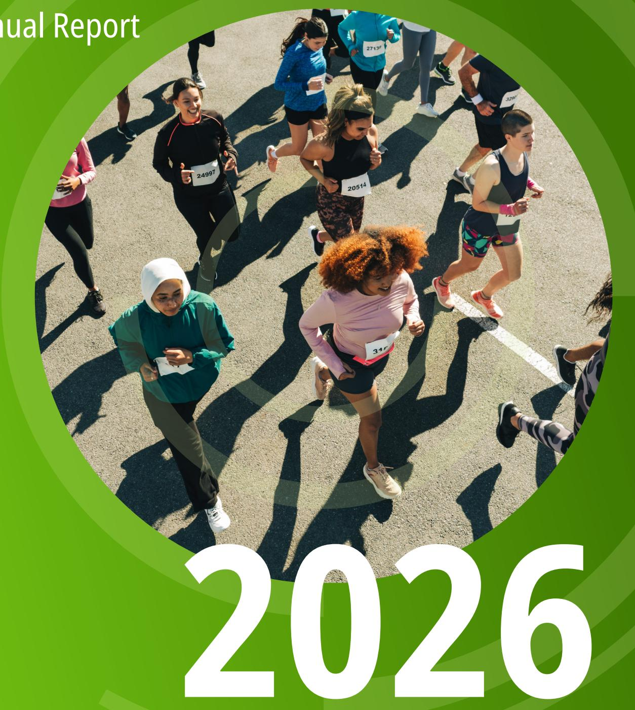

## Tax Inspectors Without Borders

Annual Report

2026

## Disclaimers

This work is jointly published under the responsibility of the Secretary-General of the OECD and the Administrator of UNDP. The opinions expressed and arguments employed herein do not necessarily reflect the official views of the Member countries of the OECD nor those of the Member States of the United Nations.

The names and representation of countries and territories used in this joint publication follow the practice of OECD.

This document, as well as any data and map included herein, are without prejudice to the status of or sovereignty over any territory, to the delimitation of international frontiers and boundaries and to the name of any territory, city or area.

Kosovo\*: This designation is without prejudice to positions on status, and is in line with United Nations Security Council Resolution 1244/99 and the Advisory Opinion of the International Court of Justice on Kosovo's declaration of independence.

Please cite this publication as:

OECD/UNDP (2026), Tax Inspectors Without Borders - Annual Report 2026, OECD Publishing, Paris, (https://doi.org/10.1787/22fc5338-en).

Photo credits: Cover by Lushomo. Images courtesy of Shutterstock.com and OECD.
© OECD/UNDP 2026

The use of this work, whether digital or print, is governed by the Terms and Conditions to be found at https://www.oecd.org/en/about/terms-conditions.html.

## Preface

Mobilising domestic resources is key to financing development and growth. It enables jurisdictions to reduce poverty, deliver essential public services, and build the infrastructure needed for sustainable development.

As Tax Inspectors Without Borders (TIWB) enters its second decade, following its launch in 2015, we reaffirm our commitment to support developing countries in strengthening their capacity to mobilise the domestic revenues essential for growth. A joint initiative of the Organisation for Economic Co-operation and Development (OECD) and the United Nations Development Programme (UNDP), TIWB continues to demonstrate the value of practical, hands-on co-operation. That includes the deployment of experienced tax experts who work directly with local officials on real audit and tax crime cases, in a fast moving global tax environment.

The results presented in this year's report underscore the continued strength and relevance of TIWB's collaborative model. Over the past decade, the initiative has achieved remarkable outcomes with 165 programmes implemented across 71 jurisdictions, raising an additional USD 2.72 billion in tax revenue and assessing a further USD 7.67 billion. These achievements were made possible through the expertise provided by 32 partner administrations, the support of our donors, and an expanding network of regional and international partners. For instance, in Africa, TIWB's strategic partnership with the African Tax Administration Forum (ATAF) has been key to strengthening tax audit and investigation capacity on the continent.

The launch of TIWB 2.0 at the 2025 Fourth International Conference on Financing for Development (FFD4) in Sevilla, Spain, and its recognition as part of the Sevilla Platform for Action, reflect the international community's renewed commitment to TIWB's unique approach to delivering high-quality and tailor-made tax capacity building. This next phase of the initiative will strengthen support to developing countries in navigating emerging challenges, from the digitalisation of economies to increasingly complex cross-border arrangements and evolving forms of illicit financial flows. This will ensure that our assistance remains responsive to the shifting demands of modern tax administrations.

Looking ahead, TIWB will continue to evolve with global changes, deepen its partnerships, and expand its support to jurisdictions seeking to build effective and transparent tax systems. These systems are key to advancing inclusive growth, public trust, and the achievement of the Sustainable Development Goals (SDGs). They also help to foster the conditions for private sector investment, thus driving jobs, innovation and long-term resilience. Through our strong co-operation, the OECD and UNDP will remain trusted partners to developing countries as they confront new tax risks and take advantage of new opportunities in the decade to come.

Finally, we wish to acknowledge the leadership and commitment of Mr Achim Steiner, who concluded his tenure as UNDP Administrator in June 2025. Mr Steiner served as UNDP Co-Chair of TIWB for eight years and played a central role in guiding the initiative's growth and consolidation during that period.

  
Mathias Cormann
Secretary-General, OECD

Alexander De Croo
Administrator, UNDP

## Contents

Preface .iii
Abbreviations and acronyms .vii
Executive summary .1
1. TIWB 2.0: A vision for a new era of international development co-operation .3
Domestic resource mobilisation at the centre of sustainable development finance .4
Tailoring support to country needs: The evolution to TIWB 2.0 .5
TIWB 2.0: A more adaptive model for growing demand .5
Initial steps to implementing the TIWB 2.0 vision .8
2. Delivering impact: Building capacity in host administrations .9
Areas of technical assistance .9
3. Measuring impact: Revenue gains, capacity building and global reach .19
Revenue impact .19
Regional impact of TIWB .23
Impact beyond revenue .30
4. Partnerships: Collaboration under TIWB 2.0 .37
Donors .37
Partner administrations .39
TIWB experts .42
Regional and international organisations .43
5. Raising visibility and engagement: Communications and global outreach .45
6. Strengthening delivery: Governance, operations and capacity building approaches in TIWB 2.0 .49
Establishment of a renewed Governing Board .49
Expanding participation through adaptive partnership approaches .51
Peer-to-peer pilot programmes .52
7. Looking ahead: Strategic priorities for TIWB 2.0 .55
Stocktake of 2025 objectives .55
2026 objectives .57
References .59
Annex A. TIWB programmes .61
Glossary .69

## Tables

Table 2.1. TIWB-CI programme update as of December 2025 .... 12
Table 3.1. Summary of TIWB regional results for 2025 .... 29
Table 7.1. TIWB progress against 2025 objectives .... 56

Figures
Figure 3.1. Cumulative regionally reported revenue increases from TIWB assistance .... 20
Figure 3.2. Geographical distribution of TIWB programmes .... 21
Figure 4.1. Countries and organisations supporting the TIWB initiative .... 38
Figure 4.2. TIWB partner administrations .... 40

Boxes
Box 2.1. Building transfer pricing audit capacity in Lesotho .... 11
Box 2.2. Significant enforcement advances in Kingdom of Eswatini .... 12
Box 2.3. Strengthening Saint Lucia's use of CRS data to tackle tax evasion .... 13
Box 2.4. Peru's TIWB-CbCR programme update .... 14
Box 2.5. Guide and workshops on digitalisation and digital transformation strategy .... 15
Box 2.6. Laying the groundwork for effective implementation of the GMT in North Macedonia .... 17
Box 3.1. Success stories from Africa in 2025 .... 24
Box 3.2. Key TIWB programmes in Asia and the Pacific .... 25
Box 3.3. Spotlight on Eastern Europe .... 27
Box 3.4. Ecuador's TIWB journey .... 28
Box 3.5. Impact of TIWB-audit programmes completed in 2025 .... 31
Box 3.6. TIWB-CI: Building capacity beyond revenue .... 34
Box 6.1. Members of the TIWB Governing Board at the end of 2025 .... 50
Box 6.2. Multi-partner TIWB programmes .... 52
Box 7.1. Key objectives for 2026 .... 57

Annex Tables
Table A A.1. Current TIWB international tax audit programmes .... 61
Table A A.2. Current TIWB advance pricing arrangement and mutual agreement procedure programmes .... 62
Table A A.3. Current TIWB criminal tax investigation programmes .... 62
Table A A.4. Current TIWB pilot programmes .... 63
Table A A.5. Completed TIWB programmes .... 64
Table A A.6. Upcoming TIWB programmes .... 68

## Abbreviations and acronyms

AEOI Automatic exchange of financial account information  
APA Advance pricing arrangement  
ATAF African Tax Administration Forum  
BEPS Base erosion and profit shifting  
CATA Commonwealth Association of Tax Administrations  
CbC Country-by-country  
CbCR Country-by-country reporting  
CIAT Inter-American Centre of Tax Administrations  
CRS Common Reporting Standard  
DFL Digital forensic laboratory  
DRM Domestic resource mobilisation  
DTA Digitalisation of tax administration  
DTMM Digital Transformation Maturity Model  
EITI Extractive Industries Transparency Initiative  
FFD4 Fourth International Conference on Financing for Development  
FTA Forum on Tax Administration  
G20 Group of Twenty (major economies)  
GloBE Global Anti-Base Erosion  
GMT Global minimum tax  
GST Goods and services tax  
ICTD International Centre for Tax and Development  
IGF Intergovernmental Forum on Mining, Minerals, Metals and Sustainable Development  
MAP Mutual agreement procedure  
MNE Multinational enterprise  
MoU Memorandum of Understanding  
OECD Organisation for Economic Co-operation and Development  
PITAA Pacific Islands Tax Administrators Association  
P2P Peer-to-peer  
SDGs Sustainable Development Goals  
TIWB Tax Inspectors Without Borders  
TIWB-AEOI TIWB effective use of automatic exchange of financial account information programme  
TIWB-audit TIWB international tax audit programme  
TIWB-CbCR TIWB implementation and effective use of country-by-country reporting programme  
TIWB-CI TIWB criminal tax investigations programme  
TIWB-DTA TIWB digitalisation of tax administration programme  
TIWB-GMT TIWB implementation of the global minimum tax programme  
TIWB-VAT TIWB auditing value added tax on digital trade programme  
UN United Nations  
UNDP United Nations Development Programme  
VAT Value added tax  
WBG World Bank Group

# Executive summary

At the FFD4, the OECD and the UNDP celebrated ten successful years of TIWB in supporting international tax co-operation and capacity building. At a side-event in the margins of FFD4, TIWB marked the occasion by launching its new vision, TIWB 2.0, which will guide the initiative in the years ahead.

TIWB 2.0 builds on TIWB's proven record of delivering hands-on support to developing country tax administrations. It expands the modalities by which capacity building can be delivered and puts partnerships – through stronger South–South and triangular co-operation, as well as with international and regional organisations – at the heart of the initiative, to ensure peer-to-peer (P2P) support and the flow of expertise from, to, and across the Global South.

The next phase of this joint OECD-UNDP initiative demonstrates the continued evolution of TIWB to the changing international tax environment. Initially focused on transfer pricing and international tax audits, TIWB later broadened its scope in response to demand from developing countries. By 2025, TIWB programmes covered criminal tax investigations, the effective use of automatic exchange of financial account information (AEOI) data, the implementation and use of country-by-country reporting (CbCR) data, and digitalisation of tax administrations. In 2025, TIWB launched its first programme supporting the implementation of global minimum tax (GMT) rules and will shortly expand to support audits on value added tax (VAT) on digital trade.

To date, the initiative has supported 71 developing countries through 165 programmes, with 2025 marking a peak in ongoing TIWB programmes. These programmes have helped developing countries raise USD 2.72 billion in additional revenues, secure USD 7.67 billion in tax assessments, and disallow

Through 165 programmes in 71 countries, TIWB has helped raise USD 2.72 billion in revenue, secure USD 7.67 billion in tax assessments, and disallow USD 2.53 billion in losses.

USD 2.53 billion in carry-forward losses. Beyond the revenue impact, TIWB programmes have contributed to tax administrations' organisational reforms, strengthened their technical skills and fostered greater voluntary compliance, with notable examples from Honduras, Egypt and Peru. Its programmes have also deepened regional and international co-operation. In recognition of TIWB's impact, its inclusion in the Sevilla Platform for Action underscores its role as a practical mechanism to strengthen tax capacity in developing countries.

Looking to the future, 2026 will be an important year to build on the progress of the last decade and move forward to implement the vision of TIWB 2.0. A new TIWB Governing Board, meeting for the first time in 2026, will reinforce governance and strategic oversight. Collaboration with donors, partner administrations, and regional and international organisations will remain essential, as does the strategic partnership with the African Tax Administration Forum (ATAF), which has already supported 96 programmes across Africa and mobilised more than USD 2.20 billion in additional revenues. In an era of declining official development assistance, sustained partner support will be required to meet increasing demand for support, scale up programmes and extend assistance to more jurisdictions. This support pays visible dividends – with USD 125 raised for every dollar invested in TIWB.

This report reflects TIWB's activities from January to December 2025. Chapter 1 sets out the TIWB 2.0 vision. Chapter 2 reviews programme areas and their impact, while Chapter 3 highlights revenue and capacity-building results. Chapter 4 outlines TIWB's network of partners, before Chapter 5 describes communication and outreach efforts. Chapter 6 details measures introduced in 2025, and Chapter 7 reviews the objectives for 2025 and presents revised objectives for 2026.

TIWB 2.0: A vision for a new era of international development co-operation

The joint OECD-UNDP TIWB initiative deploys experienced tax auditors and investigators to provide hands-on support to developing countries on real audit and investigation cases. Over the last decade, it has been strongly successful in mobilising additional revenues and strengthening the integrity and effectiveness of their tax systems, as described later in this report. It has also adapted to evolving international tax challenges, shifting development priorities and increasingly sophisticated country demand.

As TIWB enters its next decade, it will continue to adapt to address changes in the international context, including a greater emphasis on domestic resource mobilisation (DRM) to fund sustainable development. TIWB 2.0, launched at the FFD4, sets out

Launched at FFD4, TIWB 2.0 sets a renewed vision to help developing countries navigate a more complex fiscal landscape and strengthen domestic resource mobilisation.

a new vision for how the initiative will adapt to strengthen support for developing countries in an increasingly complex fiscal environment, as well as evolving to meet increasing and complex demands for support.

# Domestic resource mobilisation at the centre of sustainable development finance

In recent years, the international development landscape has undergone a decisive shift. Mounting fiscal pressures and evolving global tax norms have pushed DRM to the forefront of sustainable development finance. Reflecting this shift, the Sevilla Commitment adopted at the FFD4 underscores the central role of effective tax systems in securing stable public revenues and reducing reliance on external assistance over time.

TIWB was recognised in the Sevilla Platform for Action as a proven instrument for strengthening tax capacity. Its practical, country-led approach, firmly grounded in real cases, has consistently delivered stronger audit and investigation practices and more effective application of international tax standards. In doing so, it has helped developing countries generate additional domestic resources that directly support their development priorities.

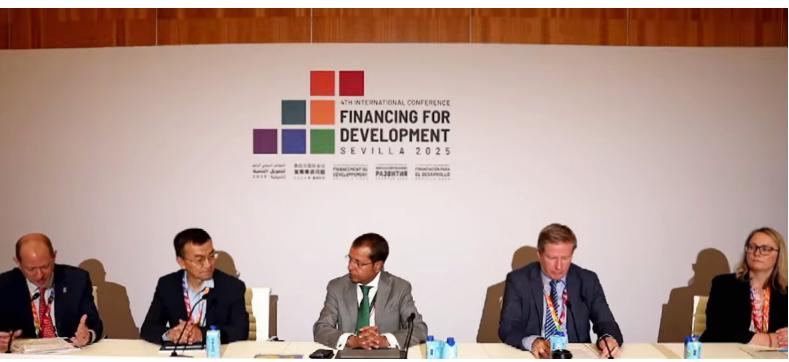

Thomas Beloe, Director, UNDP Sustainable Finance Hub; Lekey Dorji, Minister of Finance, Bhutan; Ali Naseer Mohamed, Permanent Representative of Maldives to the United Nations; Pasi Hellman, Under-Secretary of State in International Development, Ministry of Foreign Affairs, Finland; and Katie Fisher, Deputy Director International Finance and Development, HM Treasury, United Kingdom.

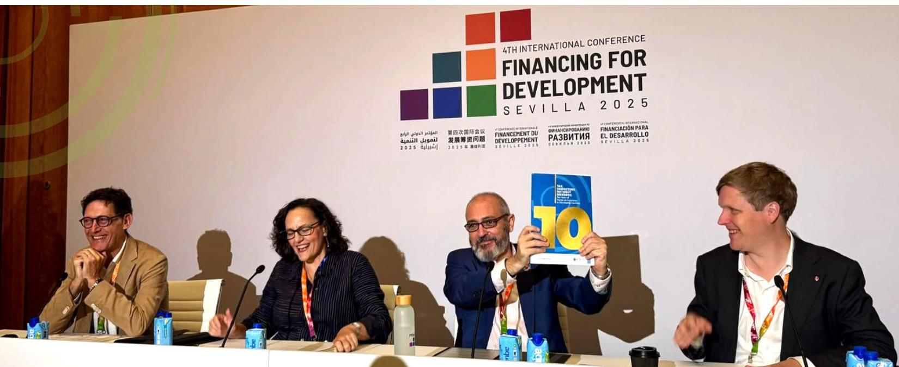

Ben Dickinson, Deputy Director, OECD Centre for Tax Policy and Administration; Mary Beth Goodman, OECD Deputy Secretary-General; Marcos Neto, UN Assistant Secretary-General, UNDP Assistant Administrator & Director of Bureau for Policy and Programme Support; and Åsmund Aukrust, Minister of International Development, Norway.

# Tailoring support to country needs: The evolution to TIWB 2.0

Over time, TIWB engagements have expanded as developing countries have faced increasingly complex tax administration challenges. While the initiative initially focused on transfer pricing and international tax audits, its portfolio has significantly broadened and now also spans:

• criminal tax investigations (TIWB-CI),

• effective use of automatic exchange of financial account information (TIWB-AEOI),

\- implementation and effective use of country-by-country reporting (TIWB-CbCR),

• digitalisation of tax administration (TIWB-DTA),

\- implementation of the global minimum tax (TIWB-GMT), and

• auditing value added tax on digital trade (TIWB-VAT).

TIWB's expansion reflects growing demand for hands-on support as jurisdictions navigate increasingly complex cross-border tax issues in a challenging macroeconomic environment. At the same time, stronger public expectations around transparency and taxpayer compliance have reinforced the need for effective tax administrations. In this setting, TIWB's practical delivery model is well placed to help host administrations achieve more robust audit and investigation outcomes, leading to tangible gains in revenue.

## TIWB 2.0: A more adaptive model for growing demand

In an environment of rising demand for specialised tax support and increasing pressures on development finance, TIWB 2.0 builds on the initiative's strengths to deliver more effective, sustainable, and regionally-anchored assistance.

TIWB 2.0 builds on its decade of experience and refines its support by introducing several core enhancements:

## 1. From pilot initiatives to standard programme delivery in emerging and specialised areas

Building on a decade of experience, TIWB has developed specialised areas of support in fields such as industry-specific audits, criminal tax investigations and the effective use of AEOI and CbCR data. Some of these, particularly TIWB-CI programmes, are already well established within TIWB's core delivery. At the same time, new areas of support, focused on the implementation of emerging international tax rules, are being scaled up.

This transition is already underway. For instance, the first TIWB-GMT pilot programme was launched in 2025 in the Republic of North Macedonia (North Macedonia), with a second programme planned for Benin in 2026.

TIWB 2.0 will build on an expanding network of global and regional partners to strengthen programme delivery.

The strategic partnership with ATAF will remain central to the delivery of TIWB programmes across Africa, supported by strengthened institutional arrangements with both the OECD and UNDP. Engagement with other

ATAF will remain a central partner to TIWB, with strengthened collaboration with CATA, CIAT and PITAA to deliver joint programmes.

regional organisations, including ongoing engagement with the Commonwealth Association of Tax Administrations (CATA), Inter-American Centre of Tax Administrations (CIAT), and the Pacific Islands Tax Administrators Association (PITAA), will be further deepened to support more co-ordinated and jointly delivered programmes.

Collaboration will also continue to expand with key international partners. Work with the Intergovernmental Forum on Mining, Minerals, Metals and Sustainable Development (IGF) will be advanced, while partnerships with the Extractive Industries Transparency Initiative (EITI) and the International Centre for Tax and Development (ICTD) are expected to strengthen coherence across tax and development actors.

Co-operation with the World Bank Group (WBG) will support closer alignment between TIWB-CI programmes with the WBG's tax crime risk assessment tool, supporting jurisdictions in their work towards a more coherent whole-of-government approach to tackling illicit financial flows.

At the same time, the OECD Forum on Tax Administration (FTA) is expected to remain a key platform for partner engagement. With a growing share of FTA members participating as TIWB partner administrations, collaboration through the FTA's Capacity Building Network will continue to underpin the expansion of bilateral capacity building support.

## 3. The TIWB Graduates Platform

A cornerstone of TIWB 2.0 will be the creation of the TIWB Graduates Platform, to be launched in 2026. This platform will enable jurisdictions that have built strong capacity through TIWB to become providers of expertise to peers facing similar tax challenges, representing a structural shift in how tax capacity is developed and shared. The Platform will reflect a transition:

• from reliance on external expertise to greater regional self-sufficiency,

\- from predominantly North–South technical assistance to increased South–South and triangular co-operation, and

• from ad hoc support to sustained, locally driven capability.

The tax administrations of Colombia, Egypt, and Zambia are among the first Graduates expected to provide regional support from 2026. The Platform is expected to become one of TIWB's most defining contributions to long-term DRM and sustainable capacity development.

## 4. More flexible delivery and closer alignment with national development strategies

While TIWB programmes have traditionally been delivered over 12 to 24 months, TIWB 2.0 will introduce greater flexibility, enabling both short, targeted engagements and longer-term, multi-year support aligned with jurisdictions' financing and broader reform priorities. This flexibility will enable TIWB 2.0 to respond more effectively to changing national development strategies, including through adaptive partnership approaches and phased programme delivery. To further extend its reach and impact, TIWB 2.0 will also promote innovative collaboration models, including triangular engagements and new P2P pilots commencing in 2026. Examples of this approach are already emerging, such as the joint support provided by ATAF, India, the Republic of Türkiye (Türkiye) and the United Kingdom to Nigeria's TIWB-AEOI and TIWB-CbCR programmes, illustrating how multi-partner approaches can strengthen technical capacity while advancing South-South co-operation.

## 5. A renewed OECD-UNDP partnership as the backbone of TIWB

TIWB's effectiveness is rooted in the complementary strengths of its two partner organisations. In support of TIWB 2.0, the OECD and UNDP have built on a decade of collaboration and, through a renewed Memorandum of Understanding (MoU) signed in 2025, are reinforcing their joint commitment to the initiative's next phase.

Under the TIWB 2.0 vision, the OECD will contribute deep technical expertise in taxation, extensive knowledge of international tax norms and practices, and access to a global network of tax administrations, including through the FTA. TIWB engagements are aligned with, and reinforced by, the OECD's broader work on Base Erosion and Profit Shifting (BEPS), tax treaties, and standards on exchange of information and tax crime investigation.

The UNDP, through its global presence and expertise in national development and public finance frameworks, will ensure that TIWB programmes are aligned with domestic reform priorities and embedded in stronger public finance ecosystems. Initiatives such as Public Finance for the Sustainable Development Goals (SDGs) and Integrated National Financing Frameworks will enable TIWB work to extend beyond individual cases toward longer-term institutional strengthening.

Building on existing collaboration, the partnership will continue to expand into integrated areas of support. This includes joint work on tax expenditures, combining policy analysis with audit-focused assistance to strengthen the design and oversight of tax incentive regimes, as well as co-ordinated efforts to enhance investigative capacity through tools such as digital forensic laboratories (DFLs). These approaches provide a foundation for scaling more comprehensive and joined-up support under TIWB 2.0.

Together, these elements position TIWB to remain responsive, integrated and strategically aligned with the changing international tax landscape, while strengthening accountability to its multiple stakeholders.

## Initial steps to implementing the TIWB 2.0 vision

From 2026 onwards, the implementation of TIWB 2.0 will focus on expanding programme delivery and strengthening measurable impact. Building on a decade of experience, TIWB will expand programme offerings across both emerging and specialised areas. This will be

From 2026, TIWB 2.0 will expand programme delivery, deploy expertise more flexibly, and launch the Graduates Platform to strengthen regional tax capacity and DRM impact.

complemented by more targeted and flexible deployment of experts, as well as the introduction of the TIWB Graduates Platform to facilitate the exchange of regional expertise.

Supported by a strengthened partnership between the OECD and the UNDP, sustained backing from donors, and continued collaboration with regional and global partners, TIWB is well positioned to translate the ambitions of TIWB 2.0 into practical, high-impact support that directly advances DRM.

# Delivering impact: Building capacity in host administrations

TIWB has supported 71 host administrations through a total of 165 programmes, of which 51 were ongoing and 114 had been completed at the end of 2025, marking a record high number of ongoing programmes (see Annex A). This chapter examines how TIWB delivers tailored, hands-on support to developing countries to strengthen tax audit and investigation capacity across its programmes.

## Areas of technical assistance

## 1. International tax audit and industry expertise

TIWB-audit programmes embed TIWB experts within host administrations to provide practical, hands-on support on live transfer pricing audit cases and audit-related issues. Using a “learning by doing” approach, these programmes cover issues such as risk-based audit case selection, audit processes, transfer pricing audits, resolution of mutual agreement procedure (MAP) cases and negotiation of advance pricing agreements (APAs).

Host administrations are increasingly requesting specialised non-audit experts to effectively audit multinational enterprises (MNEs) operating in growing sectors such as financial services, telecommunications and extractives, and help auditors better understand business models and value chains while working on real cases.

TIWB-audit programmes support host administrations in increasing tax revenues and strengthening their tax system and administration. Host administrations report enhanced auditor skills and the adoption of new tools and procedures following participation in TIWB programmes.

Further, there is growing anecdotal evidence that TIWB programmes have led to improved relationships with MNEs, including a positive change in compliance and greater taxpayer compliance (OECD, 2022 $^{[1]}$ ). Several host administrations have also enacted legislative reforms based on TIWB expert recommendations, improving tax certainty and reducing the likelihood of disputes.

At the end of 2025, 30 TIWB-audit programmes were underway.

For the past seven years, I have had the opportunity to work with the TIWB initiative supporting tax authorities on transfer pricing issues in the extractive industries, banking and insurance sectors. The learning-by-doing approach applied in TIWB assistance to tax authorities is ideal for, on the one hand, creating local expertise and, on the other hand, helping host administrations to explore new areas of taxation that are often very promising for mobilising new resources.

For example, the banking and insurance sectors,

  
André Nsabimana, TIWB Roster expert

due to their highly technical nature, are often subject to little tax scrutiny, even though companies in these sectors are subsidiaries of large multinational groups and therefore involved in significant intra-group transactions. Thanks to the TIWB initiative, specialised experts can be mobilised to support tax auditors in host administrations in risk analysis, the implementation of specific audit approaches, and the strengthening of expertise in auditing complex financial mechanisms that are sometimes overlooked in tax audit plans.

Undeniably, the TIWB initiative helps to mobilise revenue, strengthen local expertise, increase taxpayer compliance and support tax justice by extending the scope of tax audits to companies that are sometimes accused of not paying their fair share of taxes."

## Box 2.1. Building transfer pricing audit capacity in Lesotho

Lesotho's second TIWB programme commenced in November 2024 with support from a TIWB Roster expert. The goal of the programme is to strengthen the Lesotho Revenue Service's capacity in transfer pricing audits across key sectors such as mining and retail.

In 2025, one onsite mission and continuous virtual engagements provided local auditors with hands-on assistance that has improved risk assessment, transfer pricing documentation review, and the application of international best practices. The expert has supported Lesotho on six audit cases, some of which have reached the assessment stage.

Beyond audit support, the TIWB expert has recommended legal and administrative reforms, including drafting dedicated transfer pricing regulations and amending information submission rules to strengthen transfer pricing enforcement in Lesotho. The Lesotho Revenue Service has also initiated discussions on APAs as a tool to reduce disputes and improve predictability.

The programme will continue in 2026 with a mix of onsite and virtual support, focusing on finalising the ongoing audit cases and implementing reforms to strengthen the enforcement of transfer pricing and international taxation rules, reduce revenue leakage, and build tax auditors' skills.

## 2. Criminal tax investigation

Tax and other financial crimes, such as money laundering and corruption, pose an ever-increasing threat to the strategic, political and economic interests of jurisdictions. If not tackled effectively, these crimes can have profound and long-lasting impacts, particularly on developing countries that rely on DRM for sustainable development. Tackling these crimes requires technical experts and strong domestic and international co-operation among tax and other financial crime authorities.

TIWB-CI programmes support global efforts to counter illicit financial flows by partnering international experts with developing countries to both strengthen their tax crime enforcement frameworks and enhance the resolution of tax crime cases, including through real-time support on complex investigations.

## Box 2.2. Significant enforcement advances in Kingdom of Eswatini

Major breakthroughs were achieved in the Kingdom of Eswatini (Eswatini) through its TIWB-CI programme in 2025, with five criminal tax investigations formally referred for prosecution. Through a combination of onsite and remote support, experts from the South African Revenue Service assisted the Eswatini Revenue Authority and the Royal Eswatini Police Service with a range of operational matters, including preparing requests for assistance from Interpol and conducting joint analysis of bank statements. Other cases also required extensive cross-border collaboration with the South African Revenue Service to confirm the authenticity of supplier invoices in South Africa, demonstrating the mutual benefits that TIWB-CI programmes generate for both host and partner administrations.

The cases cover a broad set of serious offences, including abuse of rebate provisions for charitable imports diverted for resale, false invoicing for imports, sophisticated VAT refund fraud schemes and the smuggling of motor vehicles into Eswatini without payment of customs duties or VAT. One investigation involving suspected tax evasion and money laundering by four companies under a single director has already led to the arrest and joint charging of the director and four companies.

While proceedings are still largely ongoing, these cases have a combined estimated tax liability of USD 6.14 million and anticipated penalties of USD 687 160. To date, the cases have led to the freezing and/or seizure of assets amounting to USD 108 477.

Each TIWB-CI programme follows three phases: (i) self-assessment, (ii) real-time assistance on criminal tax investigations and related capacity building, and (iii) evaluation and impact assessment. Table 2.1 presents the phase of each programme as of the end of 2025.

To date, 20 jurisdictions have participated in TIWB-CI programmes, with 2025 marking the busiest year yet, with the launch of new programmes in Albania, Lesotho, Papua New Guinea and Uganda, and a record 9 jurisdictions received support on active tax crime investigations.

Table 2.1. TIWB-CI programme update as of December 2025

<table><tr><td>Phase I</td><td>Phase II</td><td>Phase III</td></tr><tr><td>Albania, Lesotho</td><td>El Salvador, Eswatini, Liberia, Nigeria, Papua New Guinea, Seychelles, Sri Lanka, Uganda, Ukraine</td><td>Armenia, Colombia, Costa Rica, Honduras, Maldives, Pakistan, Tunisia</td></tr><tr><td></td><td>Phase II launch pending: Zimbabwe</td><td></td></tr></table>

Source: TIWB Secretariat

## 3. Effective use of automatic exchange of financial account information

As more jurisdictions adopt the Common Reporting Standard (CRS) (OECD, 2025 $_{[2]}$ ), many face challenges in making effective use of the data. To help address this, pilot TIWB-AEOI programmes were introduced in 2021, complementing the work of the Global Forum on Transparency and Exchange of Information for Tax Purposes.

TIWB-AEOI programmes are designed to be flexible and tailored to the specific needs of each host administration. Support may include guidance on processing and analysing CRS data, including searching and filtering information received, integrating it with

TIWB-AEOI programmes

TIWB-AEOI programmes provide tailored support to help administrations analyse and use CRS data for risk assessment, compliance, audits and tax enforcement.

other third-party data sources, and conducting automated crosschecks. Host administrations can also receive assistance in applying CRS data for data analytics, risk assessments, compliance interventions, taxpayer notifications, audit practices, and tax assessments.

In 2025, Saint Lucia's TIWB-AEOI programme continued, and a new programme was launched in Nigeria (see Box 6.2). Reciprocal data exchange remains a prerequisite for TIWB-AEOI programmes, which currently limits the number of eligible jurisdictions; however, as more jurisdictions begin receiving CRS data, demand for TIWB-AEOI support is expected to increase.

## Box 2.3. Strengthening Saint Lucia's use of CRS data to tackle tax evasion

The second pilot TIWB-AEOI programme was launched in Saint Lucia in December 2023, supported by two experts from India's Central Board of Direct Taxes. Throughout 2025, the experts continued to assist the Inland Revenue Department to strengthen its capacity to use CRS data effectively in audits. Their work has included reviewing existing policies and legislation and providing recommendations to improve audit processes, such as supporting the drafting of standard operating procedures for CRS-related audits and refining information disclosure rules. These recommendations are currently under consideration by the Inland Revenue Department. The experts have also shared best practices on data cleansing, sorting, and matching.

In terms of integrating CRS data into the audit process, several CRS-related cases have been visually matched to ongoing audits, and the audit questionnaire is being revised.

## 4. Implementation and effective use of country-by-country reporting

BEPS, including abusive transfer pricing, poses significant risks to the tax base, especially for developing countries that often have limited access to information on MNEs' cross-border operations and limited audit capacity. Country-by-country (CbC) reports, one of the four minimum standards of the OECD/G20 Inclusive Framework on BEPS, help address these challenges by providing tax administrations with high-level information on the global activities of large MNEs operating within their jurisdictions.

While some developing countries have made progress in implementing CbCR, many still lack the systems and processes required to receive, analyse, and effectively use CbC reports. To help close this gap, pilot TIWB-CbCR programmes were introduced in 2023. These programmes support host administrations with the practical implementation and effective use of CbCR data, including collecting and handling CbC reports, integrating them into risk assessment frameworks, and using the data to strengthen audit outcomes and improve MNE compliance.

Although TIWB-CbCR programmes are currently limited to Nigeria and Peru, the number of developing countries receiving CbC reports is increasing, and demand for TIWB-CbCR support is expected to grow in the coming years.

## Box 2.4. Peru's TIWB-CbCR programme update

Peru's TIWB-CbCR programme, launched in December 2023 with support from Mexico and the United Kingdom, made significant progress in 2025 in strengthening Peru's capacity to use CbCR data for risk assessment and compliance. The programme focuses on four key areas:

\- using CbCR data alongside other tax data to identify BEPS-related risks and select audit cases effectively,

\- reviewing and improving Peru's tools and methods for CbCR data analysis,

• training auditors on risk assessment methodologies and tools, and

\- promoting knowledge-sharing among the three tax administrations.

During 2025, Peruvian tax officials began applying the technical skills developed through the programme to real audit cases, strengthening their ability to assess the impact of enhanced CbCR data use on tax compliance outcomes. In 2026, Peru is expected to further institutionalise the use of CbCR data to identify high-level risks and support in-depth transfer pricing audits.

## 5. Digitalisation of tax administration

Since 2023, TIWB-DTA programmes have provided confidential, high-level strategic advice to support host administrations in their digitalisation efforts and have been piloted under the TIWB initiative through programmes organised jointly by the TIWB and FTA Secretariats. To date, six TIWB-DTA programmes have been delivered with support from partner administrations in Belgium, Chile, the Netherlands, Norway, Sweden and the United Kingdom.

A TIWB-DTA programme may be structured in one of three ways:

\- Self-assessment support: Helping a host administration conduct a Digital Transformation Maturity Model (DTMM) assessment (OECD, 2022[3]), as a foundation for future work.

\- Strategy development: Assisting in creating or updating the host administration's digitalisation strategy, informed by DTMM findings or similar tools.

\- Targeted strategic advice: Providing flexible, high-level guidance on any digitalisation or transformation issue identified by the host administration.

These programmes have been highly successful, and in some cases, have proceeded to a second phase involving the development of a digital transformation roadmap to address identified gaps. The need for such structured roadmaps has prompted the FTA to develop a step-by-step guide to support tax administrations in designing forward-looking strategies. Box 2.5 provides more information.

Host and partner administrations have reported that the programmes have strengthened international co-operation and deepened understanding of each other's digital transformation journeys.

In 2025, two virtual workshops were held between Georgia and the Netherlands, involving more than 40 tax officials and focusing on taxpayer touchpoints and human resource management. A DTMM assessment for the Liberia Revenue Authority was also completed with support from Sweden.

## Box 2.5. Guide and workshops on digitalisation and digital transformation strategy

The FTA is developing a guide to support developing countries' tax administrations in designing and implementing digitalisation or digital transformation strategies. It translates the Tax Administration 3.0 (OECD, 2020[4]) vision into a practical, adaptable framework aligned with tax administrations' priorities and institutional contexts.

Structured around the core building blocks of a digitalisation strategy, the guide draws on international experience, including pilot TIWB-DTA programmes, relevant tools and best practices. Each chapter addresses a key stage of the transformation journey, from strategic vision and compliance challenges to digital readiness and reform sequencing. By strengthening the institutional and digital foundations of tax administrations, the guide directly supports effective engagement with, and the sustainability of, TIWB assistance.

In parallel, the OECD is hosting a seven-part workshop series (October 2025–2026) to support the development and application of the guide. While delivered separately from the TIWB initiative, the workshops contribute to TIWB programme delivery by building the digital and analytical capacities that underpin effective TIWB engagements. Each workshop focuses on a thematic component of the guide and is highly practical, combining presentations, jurisdictional case studies and participant discussions.

Related digitalisation initiatives, including the establishment of a DFL informed by recommendations arising under TIWB-CI programmes, further support TIWB delivery by enhancing administrations' capacity to analyse electronic data and conduct complex investigations.

## 6. Implementation of the global minimum tax

The GMT, introduced by the Global Anti-Base Erosion (GloBE) Model Rules, is an essential component of the Two-Pillar Solution (OECD, 2021 $^{[5]}$ ). It ensures that MNEs with revenues exceeding EUR 750 million are subject to a 15% effective minimum tax rate in each jurisdiction where they operate. This measure reduces the incentive for profit shifting and places a floor under tax competition.

It is estimated that the GMT will raise additional corporate income tax revenues of USD 155-192 billion globally per year (OECD, 2024 $^{[6]}$ ). While many jurisdictions have enacted GMT rules, some developing countries face technical and administrative challenges in implementing the rules. To address this, pilot

The GMT could raise USD 155-192 billion annually. TIWB-GMT pilots help developing countries overcome challenges by providing expert support on audits, policy, and implementation of the rules.

TIWB-GMT programmes have been introduced whereby experts work alongside host administration officials to support the audit and application of the rules, and advise on policy matters such as tax incentives, effective tax rate calculations, and the drafting of related legislation, guidance, and domestic top-up tax provisions.

In 2025, the first pilot TIWB-GMT programme took place in North Macedonia, marking a significant step forward in supporting developing countries to implement this global standard. The second pilot TIWB-GMT programme will be launched in Benin in early 2026.

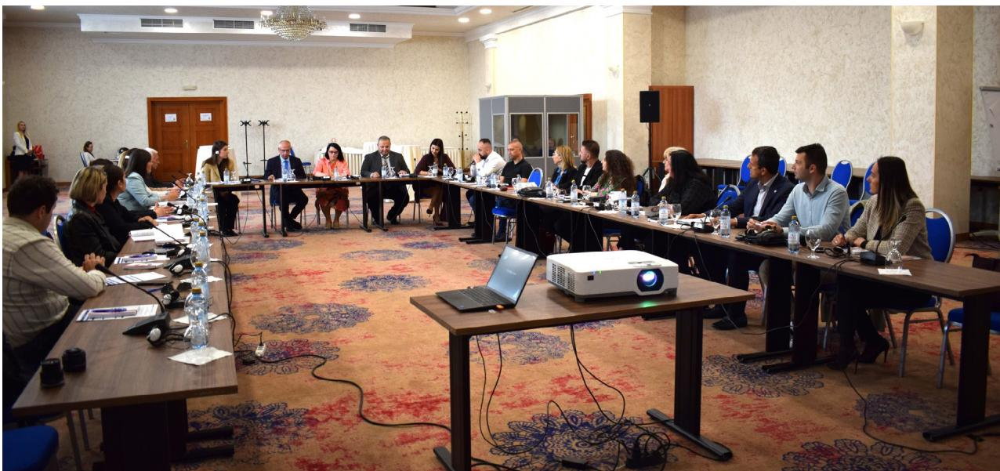  
North Macedonia Public Revenue Office officials participating in a GMT training session in Skopje, North Macedonia, in May 2025.

## Box 2.6. Laying the groundwork for effective implementation of the GMT in North Macedonia

In 2024, North Macedonia enacted legislation to implement the GMT, which will take effect in 2026. Building on its strong co-operation with the UNDP Country Office and a successful TIWB-audit programme, the Public Revenue Office submitted a two-part request in 2025 for TIWB assistance to support the effective implementation of the GMT.

The first component focused on building foundational knowledge of the GMT rules. With strategic co-ordination and logistical support from the UNDP North Macedonia country office, an OECD expert delivered a four-day training session for 19 tax officials in Skopje. The country office played a key role in facilitating local engagement and ensuring the training was tailored to national needs. This training equipped participants with the skills necessary to respond to taxpayer inquiries and carry out audits under the new GMT framework.

The second component aimed to strengthen institutional capacity. A TIWB Roster expert was then deployed to support the Ministry of Finance in drafting key materials, including bylaws and tax return templates, that needed to be published before the end of 2025. The expert also assisted Ministry officials with developing the manner of computation and collection of the qualified domestic top-up tax. Throughout this phase, the UNDP Country Office provided continuous in-country support, helping to align TIWB's technical expertise with broader institutional reform efforts and ensuring sustained momentum.

Together, these efforts have laid a strong foundation for North Macedonia's effective implementation of the GMT and alignment with international tax standards. The country office's ongoing presence has been instrumental in bridging global expertise with local priorities, reinforcing the long-term impact of the TIWB engagement.

The expert delivered the assistance throughout the final months of the year, bringing the programme to completion in December 2025.

## 7. Auditing value added tax on digital trade

Over the past two decades, VAT $^{1}$ has become a key revenue source for developing countries. As digitalisation and globalisation reshape economies, safeguarding VAT revenues has become a priority for many developing countries. To do so effectively, jurisdictions must implement strong legal frameworks and build adaptive technical capacity.

In response to this need, the OECD developed internationally agreed VAT standards. $^{2}$ To support developing countries' practical implementation of these standards, pilot TIWB-VAT programmes were introduced in 2023. Through hands-on, tailored support,

TIWB-VAT pilots, introduced in 2023, support developing countries in implementing OECD VAT standards through expert assistance on audits, strategies, and capacity building.

TIWB experts can be deployed to assist host administrations in conducting VAT audits and developing audit strategies, including risk assessment, case selection, and planning.

These programmes are co-ordinated with the OECD's work on VAT policy and administration. While no TIWB-VAT programmes have commenced to date, TIWB experts are available to begin supporting host administrations in 2026.

# Measuring impact: Revenue gains, capacity building and global reach

TIWB contributes not only to strengthening tax systems and institutional capacity in host administrations, but also to broader DRM and international co-operation goals. This chapter examines both the revenue and non-revenue impact of the initiative.

## Revenue impact

Since its inception, TIWB has supported 71 developing country tax administrations in raising an additional USD 2.72 billion in tax revenue collected, an additional USD 7.67 billion in tax assessed and disallowed USD 2.53 billion in carry forward losses. Figure 3.1. shows the cumulative reported revenue impact from TIWB assistance by region.

TIWB's impact expands beyond revenue collection, contributing to more resilient institutions and stronger domestic resource mobilisation over the long term.

Figure 3.1. Cumulative regionally reported revenue increases from TIWB assistance  
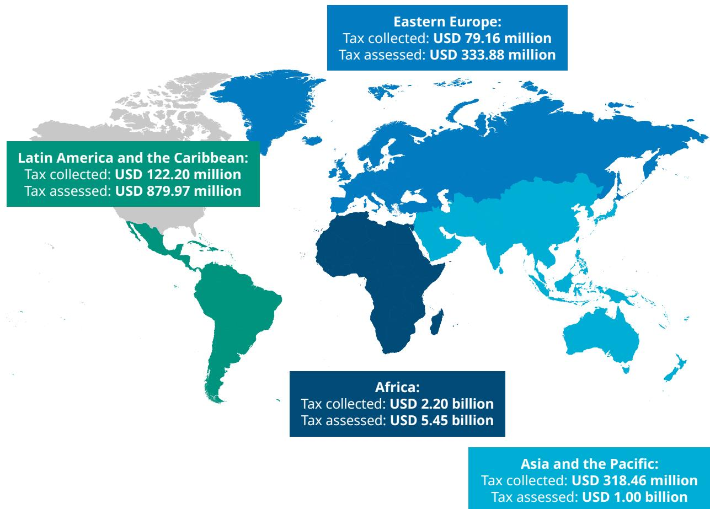

Asia and the Pacific: Tax collected: USD 318.46 million Tax assessed: USD 1.00 billion

Total tax collected: USD 2.72 billion  
Total tax assessed: USD 7.67 billion  
Carry forward losses offset: USD 2.53 billion

Note: The figures reflect results (in USD) of TIWB programmes from 2012 to 31 December 2025. All reported figures are generated through the collective work of TIWB and its partners, including ATAF.
Source: TIWB Secretariat

Figure 3.2. Geographical distribution of TIWB programmes  
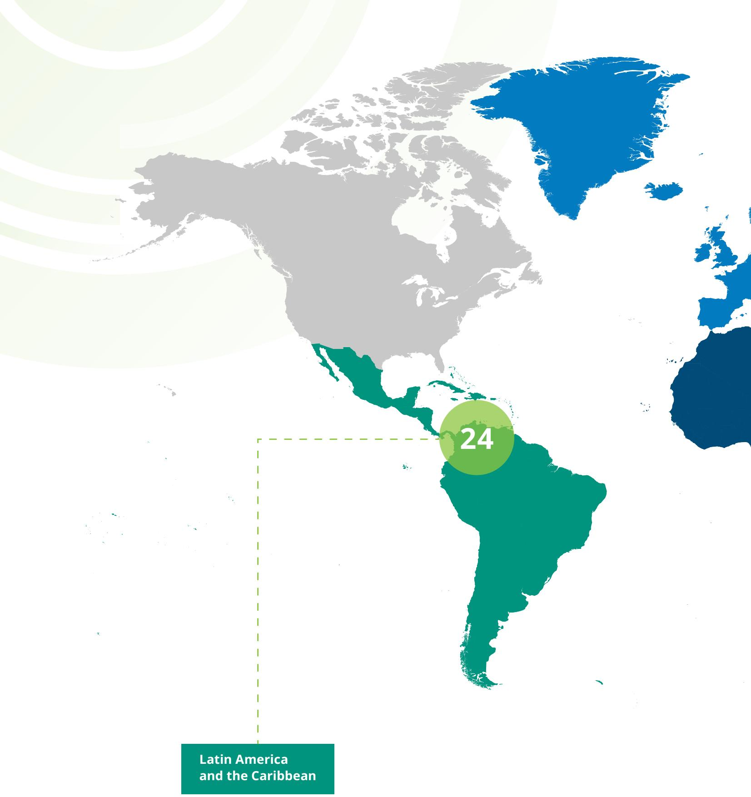  
Note: As of 31 December 2025
Source: TIWB Secretariat

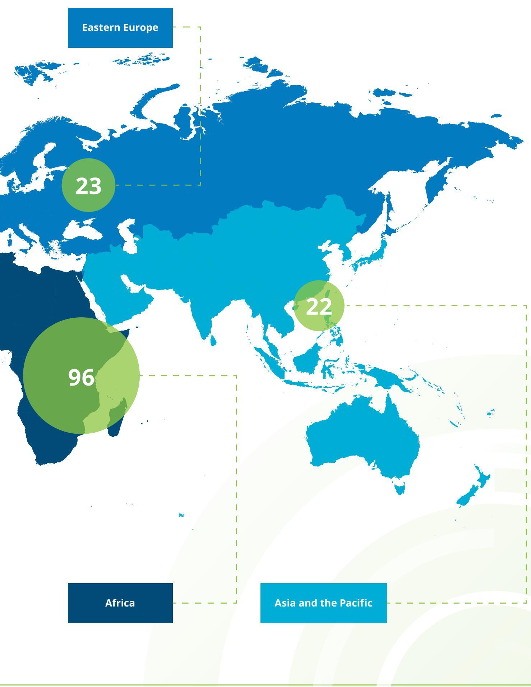

## Regional impact of TIWB

While the majority of TIWB programmes have been implemented in Africa to date, the initiative has steadily expanded its global footprint, as shown in Figure 3.2.

## 1. Africa

To date, 37 African host administrations have participated in TIWB programmes, resulting in USD 2.20 billion in additional tax revenues and USD 5.45 billion in tax assessments. A key driver of this success has been TIWB's strategic

Together, TIWB and ATAF have implemented 96 programmes across the region, the majority focusing on international tax audits.

partnership with ATAF. This collaboration has enabled the delivery of tailored capacity building that reflects the unique needs and priorities of African host administrations.

“ ATAF exists to serve African tax administrations, and every partnership we enter is evaluated through that lens. Our collaboration with TIWB continues to grow, contributing to over USD 2.20 billion in recovered revenues and, more importantly, to the growing confidence of African tax officials in tackling complex compliance challenges. We look forward to continue building on this foundation.”

  
Mary Baine, Executive Secretary, ATAF

In 2025, TIWB-audit programmes in Mauritius, Seychelles and Tunisia were completed (see Box 3.5). At the same time, new programmes were launched in several jurisdictions, including TIWB-AEOI and TIWB-CbCR programmes in Nigeria (see Box 6.2); TIWB-audit programmes in Angola and Botswana; and TIWB-CI programmes in Lesotho and Uganda (see Box 3.6).

Upcoming programmes scheduled to commence in 2026 include a pilot TIWB-GMT programme in Benin, TIWB-audit programmes in Djibouti, the Republic of the Congo (Congo), Seychelles and South Africa, and TIWB-CI programmes in Mauritius and Zambia.

## Box 3.1. Success stories from Africa in 2025

## Egypt

Since the launch of the first TIWB-audit programme in Egypt in 2017, successive TIWB-audit programmes, supported by the United Kingdom and

a TIWB Roster expert and co-sponsored by the European Union, have made strong progress in strengthening the Egyptian Tax Authority's transfer pricing capability and international tax audit practice. During the 2025 missions, experts delivered targeted training on transfer pricing concepts, functional analysis, valuation techniques, profit split application, banking sector issues, and APA and MAP processes. Egyptian auditors have demonstrated significant improvements in both technical knowledge and practical audit skills, as evidenced by tangible tax revenue and increased voluntary taxpayer compliance. Case discussions reflect a clear uplift in audit quality in line with international tax standards. Building on this success, the team has developed the confidence and capability to deliver international transfer pricing assistance to peers. In June 2025, Egypt became a TIWB partner administration, an important milestone that recognises its growing expertise.

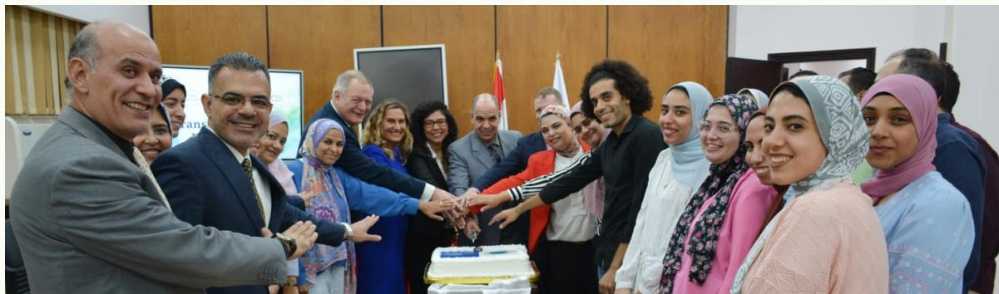  
Egyptian, OECD and United Kingdom officials in an onsite mission in Cairo, Egypt, in August 2025.

## Namibia

An expert from Germany and a TIWB Roster expert are collaborating under a joint ATAF-TIWB programme to assist the Namibia Revenue Agency in

strengthening its capacity to conduct effective transfer pricing and international tax audits. Through a combination of onsite and virtual missions in 2025, the experts work alongside more than 20 local auditors to progress high-risk cases in sectors such as fisheries, mining, finance and insurance, while providing practical training, developing customised audit templates, and improving risk-assessment and audit processes. The programme is helping Namibian auditors build technical skills, enhance audit quality and efficiency, and improve compliance outcomes.

## Box 3.1. Success stories from Africa in 2025 (cont.)

## Togo

Launched in December 2024 with support from ATAF and experts from Morocco, this TIWB-audit programme aims to strengthen Togo's capacity

to conduct effective tax audits of MNEs. Through a combination of expert-led training, joint casework, and technical guidance, the programme supports local auditors in improving risk assessment, audit execution and the application of international tax rules. The programme also promotes better internal co-ordination, reinforces audit methodologies, and builds sustainable expertise that will contribute to stronger DRM in Togo.

## 2. Asia and the Pacific

Since 2016, TIWB has supported 13 host administrations in Asia and the Pacific through 22 programmes, helping them collect USD 318.46 million in additional tax revenue and assess USD 1 billion.

The TIWB-audit programmes in Cambodia, Mongolia, Sri Lanka and Thailand were completed in 2025 (see Box 3.5). New TIWB-audit and TIWB-CI programmes commenced in Papua New Guinea, and a TIWB-CI programme in Sri Lanka (see Box 3.6) was also launched.

A TIWB-audit programme for the Solomon Islands is expected to commence in 2026.

## Box 3.2. Key TIWB programmes in Asia and the Pacific

## Bhutan

Poland and Bhutan have been co-operating under a TIWB programme since 2023. As of the end of 2025, two onsite and three virtual missions had

taken place, during which Polish experts delivered training on transfer pricing, supported the development of transfer pricing regulations, and advised on several income tax and transfer pricing audits. In December 2025, an additional virtual mission was delivered, consisting of a series of training sessions for newly appointed Department of Revenue and Customs staff, complementing the ongoing remote support provided on active audits. The partnership remains on track to conclude the programme in 2026, with final activities focused on consolidating capacity building efforts and ensuring sustainable implementation of the tools and practices developed throughout the engagement.

# Box 3.2. Key TIWB programmes in Asia and the Pacific (cont.)

## Papua New Guinea

In 2025, a new TIWB-audit programme commenced in Papua New Guinea, focusing on strengthening local auditors' transfer pricing audit capacity in the extractives sector. This programme operates alongside an existing

TIWB-audit programme that supports the Internal Revenue Commission in addressing BEPS risks in the timber sector. Across these programmes, more than 40 tax officials have received targeted training in transfer pricing, complemented by hands-on support from TIWB Roster experts on live audit cases. TIWB experts assist with analysing active cases and documentation, identifying key information gaps and recommending strategies to address them. TIWB experts also share international best practices and technical insights, including the practical application of the OECD Transfer Pricing Guidelines (OECD, 2022 $^{[7]}$ ), while mentoring local auditors throughout the audit process.

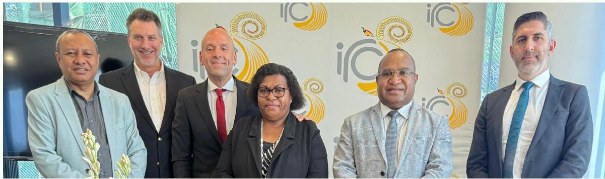  
Former Commissioner General Sam Koim (first from left to right), Acting Commissioner General Sam Loi (second from right to left) and other Papua New Guinea Internal Revenue Commission officials with OECD and TIWB experts at an onsite mission in Port Moresby, Papua New Guinea, in July 2025.

## 3. Eastern Europe

Ten host administrations in Eastern Europe have participated in 23 TIWB programmes to date, generating more than USD 79.16 million in additional tax revenues and USD 333.88 million in tax assessments.

In 2025, TIWB-audit programmes in Georgia and Kazakhstan were completed (see Box 3.5), and a TIWB-CI programme was launched in Albania. TIWB-audit programmes began in Georgia and the Republic of Moldova (Moldova), and the first pilot TIWB-GMT programme took place in North Macedonia.

TIWB will commence an audit programme in Montenegro and a TIWB-CI programme in Azerbaijan in 2026.

## Box 3.3. Spotlight on Eastern Europe

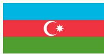

## Azerbaijan

The TIWB-audit programme continues to make steady progress, with the State Tax Service team advancing in both composition and technical capacity. Azerbaijan's growing ambitions in transfer pricing and alignment with OECD-led developments are driving these changes. During two onsite visits in 2025, experts from the United Kingdom worked with a team of 12 local auditors, combining experienced transfer pricing staff and newer staff who are beginning to assume transfer pricing responsibilities. Training for the new staff is being delivered by experienced Azerbaijan auditors, in collaboration with support from the TIWB experts. In addition to capacity building, TIWB experts provide technical advice on ongoing audit cases and broader compliance strategies.

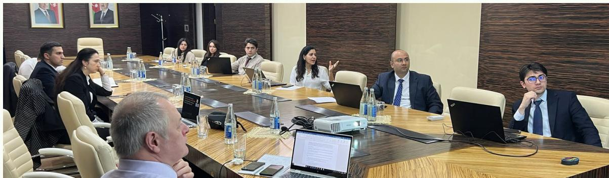  
Azerbaijan and United Kingdom officials participating in an onsite mission in Baku, Azerbaijan, in October 2025.

## Moldova

In September 2025, a TIWB Roster expert began implementing a programme to strengthen Moldova's capacity in conducting transfer pricing audits and APA processes. The first onsite mission focused on assessing Moldova's State Tax Service's current needs, providing feedback on APA documentation, discussing risk assessment factors, and reviewing transfer pricing studies submitted by taxpayers. The expert will also continue working with local auditors to finalise key documents, such as the audit manual and APA materials.

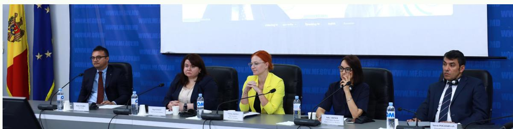  
The launch ceremony of the Moldova TIWB-audit programme in Chişinău, Moldova, in September 2025.

## Box 3.3. Spotlight on Eastern Europe (cont.)

## Ukraine

The TIWB-audit programme in Ukraine continues to deliver tangible benefits by supporting transfer pricing auditors at the State Tax Service.

In 2025, Ukraine created a taxpayer survey as part of its information-gathering process for audit. TIWB experts offered feedback on the survey design, suggested additional lines of inquiry, and highlighted important issues to consider for effective information collection. Additionally, TIWB experts and Ukrainian auditors exchanged best practices regarding transfer pricing approaches and discussed real audit case studies to illustrate progress and practical application of the concepts learned.

## 4. Latin America and the Caribbean

Since 2012, 11 host administrations in Latin America and the Caribbean have benefited from 24 TIWB programmes. By the end of 2025, these efforts contributed to USD 122.20 million in additional tax revenue and USD 879.97 million in tax assessed by tax administrations in the region.

In 2025, the TIWB-audit programmes in El Salvador and Paraguay were completed (see Box 3.5). While no new programmes were launched that year, TIWB-audit programmes are set to commence in Guatemala, Honduras and Paraguay in 2026.

## Box 3.4. Ecuador's TIWB journey

In 2025, Ecuador continued its engagement with the TIWB initiative through a programme targeting transfer pricing audits in the extractive sector. Implemented by a TIWB Roster expert, the programme supports local auditors across the full audit cycle, including risk assessment, case selection,

analysis of taxpayer records and transfer pricing documentation, and audit completion across the mining value chain.

During the year, the expert assisted with risk assessment and audit work on approximately nine cases, including both ongoing audits and newly selected cases. In parallel, 25 tax auditors received training on transfer pricing risks in the mining sector, strengthening institutional capacity in this specialised area.

The programme also benefited from TIWB's partnership with the IGF, which provided industry-specific expertise to enhance audit quality and deepen sector knowledge. The combination of transfer pricing and mining expertise delivered targeted support to ongoing cases and strengthened Ecuador's ability to address complex risks in the extractive sector.

Table 3.1. Summary of TIWB regional results for 2025

<table><tr><td rowspan="2" colspan="2"></td><td colspan="5">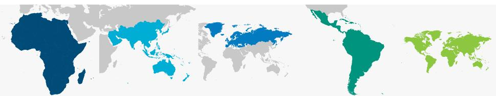</td></tr><tr><td>Africa</td><td>Asia and the Pacific</td><td>Eastern Europe</td><td>Latin America and the Caribbean</td><td>Global</td></tr><tr><td colspan="2">Current programmes</td><td>30</td><td>6</td><td>9</td><td>6</td><td>51</td></tr><tr><td colspan="2">TIWB-audit</td><td>19</td><td>4</td><td>6</td><td>1</td><td>30</td></tr><tr><td colspan="2">TIWB-CI</td><td>8</td><td>2</td><td>2</td><td>3</td><td>15</td></tr><tr><td colspan="2">TIWB-AEOI</td><td>1</td><td>0</td><td>0</td><td>1</td><td>2</td></tr><tr><td colspan="2">TIWB-CbCR</td><td>1</td><td>0</td><td>0</td><td>1</td><td>2</td></tr><tr><td colspan="2">TIWB-digitalisation</td><td>1</td><td>0</td><td>1</td><td>0</td><td>2</td></tr><tr><td colspan="2">TIWB-GMT</td><td>0</td><td>0</td><td>0</td><td>0</td><td>0</td></tr><tr><td colspan="2">Completed programmes</td><td>66</td><td>16</td><td>14</td><td>18</td><td>114</td></tr><tr><td colspan="2">TIWB-audit</td><td>61</td><td>12</td><td>12</td><td>17</td><td>102</td></tr><tr><td colspan="2">TIWB-CI</td><td>2</td><td>2</td><td>1</td><td>1</td><td>6</td></tr><tr><td colspan="2">TIWB-AEOI</td><td>0</td><td>1</td><td>0</td><td>0</td><td>1</td></tr><tr><td colspan="2">TIWB-CbCR</td><td>0</td><td>0</td><td>0</td><td>0</td><td>0</td></tr><tr><td colspan="2">TIWB-digitalisation</td><td>3</td><td>1</td><td>0</td><td>0</td><td>4</td></tr><tr><td colspan="2">TIWB-GMT</td><td>0</td><td>0</td><td>1</td><td>0</td><td>1</td></tr><tr><td colspan="2">Total number of programmes</td><td>96</td><td>22</td><td>23</td><td>24</td><td>165</td></tr></table>

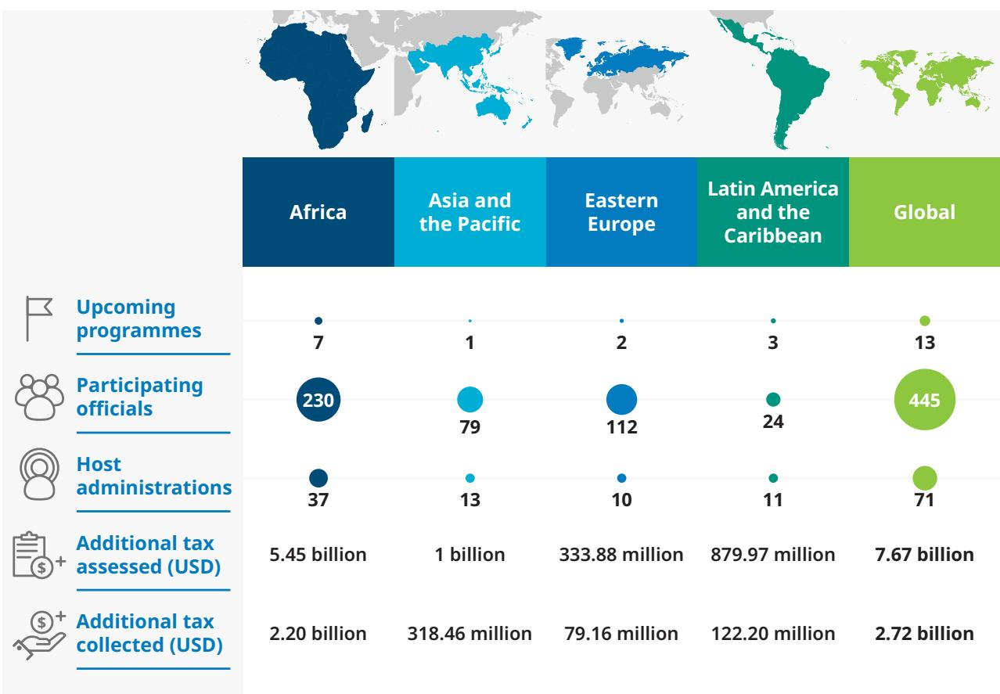  
Note: TIWB programmes in Africa are delivered jointly with ATAF. Source: TIWB Secretariat

## Impact beyond revenue

## 1. TIWB-audit and related programmes

In 2025, TIWB programmes continued to generate non-revenue impacts across host administrations. Beyond strengthening domestic audit capacity, TIWB programmes contributed to broader institutional development by fostering a culture of learning, collaboration, and strategic thinking within tax administrations. TIWB experts worked side-by-side with local officials to improve audit planning, case selection, and interdepartmental co-ordination. These efforts helped host administrations refine internal processes and build more resilient structures for long-term capacity.

TIWB also supported the operationalisation of key international standards. Through targeted technical assistance and peer learning, host administrations enhanced their ability to interpret and use CbC and CRS data effectively in risk assessment and audit selection. These non-revenue outcomes are essential to building trust in tax systems, improving voluntary compliance, and ensuring that reforms are sustainable beyond the duration of individual TIWB programmes.

## Box 3.5. Impact of TIWB-audit programmes completed in 2025

## El Salvador

Launched in 2024 with support from a TIWB Roster expert, the TIWB-audit programme strengthened the audit capacity of El Salvador's General Directorate

of Internal Taxes in key areas, including case selection, risk identification, audit planning, information requests, and analysis of taxpayer documentation. Nearly 100 tax officials received training on topics such as tax risks related to expenses, interest, and royalties, as well as compliance risk management. The expert also helped local auditors address challenges in resolving ongoing audits, suggested tools to address these issues, and proposed enhancements to the overall audit approach. As a result, three audit cases were finalised.

## Georgia

Georgia's TIWB-audit programme, supported by two TIWB Roster experts, resulted in 25 completed audit cases and significantly strengthened both human

and institutional capacity. The programme has led to more effective audits and the development of two in-house educational programmes on transfer pricing, along with an internal guidance manual. Georgia also introduced a new transfer pricing reporting requirement: companies with controlled transactions exceeding GEL 500,000 (Georgian Lari) in the previous financial year must submit detailed transfer pricing information as an annex to their corporate income tax return. The first filing, covering the 2025 financial year, is due at the end of March 2026.

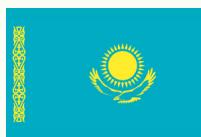

## Kazakhstan

The TIWB-audit programme in Kazakhstan strengthened local auditors' capacity to conduct transfer pricing audits in the extractives sector, resulting

in nine completed cases. The TIWB Roster expert also provided recommendations for legislative reforms and supported the creation or improvement of 20 internal training resources and guidance materials.

## Box 3.5. Impact of TIWB-audit programmes completed in 2025 (cont.)

## Mauritius

The TIWB-audit programme, launched in 2022 in partnership with ATAF, aimed to enhance the transfer pricing audit capacity of the Mauritius Revenue Authority. The programme closed in 2025, following the conclusion of a major transfer pricing audit involving an MNE operating in Mauritius, with the Mauritius Revenue Authority successfully defending its transfer pricing position. In addition to supporting ongoing casework, the expert worked with Mauritius to develop draft transfer pricing regulations and a proposal to introduce an interest rate safe harbour for intra-group financing.

## Mongolia

Two TIWB-audit programmes, one of which was launched alongside the OECD-IGF's BEPS in Mining Programme in 2019, were completed in September 2025. Together, these programmes strengthened Mongolia's tax capacity and mining governance. They also enabled major transfer pricing reforms and institutional development, including the creation of a dedicated Transfer Pricing Division and the issuance of Mongolia's first transfer pricing assessments. Over 50 auditors participated in these programmes.

## Seychelles

From October 2023 to July 2025, the TIWB-audit programme in Seychelles, conducted in partnership with ATAF and India, led to the issuance of Seychelles' first transfer pricing assessment. Twelve local auditors participated in this programme and completed 20 audit cases. The programme improved staff confidence in conducting transfer pricing audits, increased revenue collection from audit adjustments and led to a noticeable increase in taxpayer compliance. Further, legislative reforms related to upfront debt recovery and administrative penalties were introduced based on recommendations made by the experts. The programme also enhanced institutional co-ordination and the practical application of transfer pricing principles in complex audit cases.

## Sri Lanka

Sri Lanka's TIWB-audit programme ran from August 2023 to July 2025, with an expert from Morocco providing technical assistance. Under this programme, the expert assisted Sri Lanka in finalising nine audit cases, developing procedural guidelines and tools, and building the skills and knowledge of more than 60 tax officials in transfer pricing. These efforts have laid a strong foundation for conducting structured and well-documented transfer pricing audits by Sri Lankan auditors.

## 2. TIWB-CI programmes

Across all 20 host administrations, TIWB-CI programmes have delivered substantial benefits that extend far beyond casework and revenue collection. Under Phase I of the programmes, jurisdictions conduct a self-assessment exercise against the OECD Recommendation on the Ten Global Principles for Fighting Tax Crime (OECD, 2021 $^{[8]}$ ). The entirety of TIWB-CI host

Beyond casework and revenue collection, jurisdictions under Phase I TIWB-CI programmes conduct self-assessments generating nearly 300 recommendations to strengthen legal, operational, and institutional frameworks.

administrations have carried out this self-assessment exercise, with a total of 395 financial crime officers from 110 agencies participating to date. Nearly 300 recommendations for improvements to jurisdictions' legal, operational, and institutional frameworks have been issued under this phase. Many of these recommendations have been prioritised for implementation under Phase II of the programmes and beyond.

The first phase of the TIWB-CI programme was an excellent experience for Albania, where we had the opportunity to discuss our challenges, lay the foundations for sustainable interagency co-operation in financial investigations, and benefit from the expertise of the Financial Police of Italy, which will continue to support us in the coming years."

  
Anton Martini, Head of Tax Investigation, Albania's General Directorate of Taxes

Phase II and III activities further deepen these gains. Alongside real-time investigative support, TIWB experts help host administrations build durable capabilities through tailored assistance such as developing national risk-based tax crime strategies, enhancing intelligence frameworks, improving digital and physical evidence handling, supporting the establishment of digital forensic laboratories and strengthening inter-agency information-sharing tools and MoUs. Programme evaluations conducted in Costa Rica, Maldives, Pakistan and Tunisia in 2025 show that these reforms have improved cross-agency co-operation, increased mutual assistance and joint operations and supported the creation of sustained operational relationships and taskforces. Together, these non-revenue impacts demonstrate how TIWB-CI helps jurisdictions not only resolve individual cases, but also transform their long-term capacity to detect, disrupt and deter tax and related financial crimes.

# Box 3.6. TIWB-CI: Building capacity beyond revenue

## Honduras

The establishment of the DFL within the Tax Administration of Honduras was carried out through close collaboration between the UNDP Country Office and TIWB experts. The UNDP Country Office in Honduras led the contracting, procurement and operational set-up of the laboratory, while TIWB experts provided specialised technical guidance throughout the process. Following the recruitment of laboratory staff in 2025, the laboratory was prepared for operational use, including through five days of onsite training delivered in November 2025 by a TIWB expert and the development and delivery of standard operating manuals. New and existing staff are being equipped with the technical skills and institutional procedures required to operate the laboratory effectively and strengthen Honduras' long-term capacity to investigate complex tax and financial crimes.

## Nigeria

To enhance Nigeria's investigative capabilities, a TIWB expert undertook a scoping mission in November 2025 focused on creating a DFL for the Nigeria Revenue Service, with operationalisation targeted for end-2026. Once in place, the DFL will strengthen revenue collection by enabling investigators to generate high-quality electronic evidence that uncovers concealed income, bolsters successful prosecutions and deters future non-compliance.

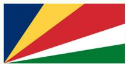

## Seychelles

Phase II of Seychelles' TIWB-CI programme began in November 2025 with an eight-day onsite mission. The TIWB expert worked with the Seychelles Revenue Commission's newly established Investigation, Risk and Intelligence Section, as well as Customs officers, audit officers, and senior executives on five active cases. Alongside case work, the expert worked with the host administration on a range of related areas to support effective investigations, including the preparation of a draft MoU between the Revenue Commission and the Police, identification of elements of criminal offences, development of an evidence matrix for criminal investigations, delivery of training on the progression of civil tax matters to criminal tax matters, as well as the professional and ethical standards of conduct for Revenue Commission officers.

## Sri Lanka

The United Kingdom is supporting the newly established criminal investigation team within Sri Lanka's Inland Revenue Department by providing foundational training in investigative skills, practical support, and enhanced forensic capacity, while helping to address legislative gaps to enable Sri Lanka's first tax crime case to progress to criminal prosecution.

## Box 3.6. TIWB-CI: Building capacity beyond revenue (cont.)

## Ukraine

Phase II of Ukraine's TIWB-CI programme began in 2025. Twenty-two investigators from the Economic and Security Bureau of Ukraine and two prosecutors from the Office of the Prosecutor General received capacity building from experts of the Netherlands' Fiscal Intelligence and Investigation Service (FIOD) during two onsite missions and ongoing remote engagement. Assistance covered ten complex investigations involving smuggling, money laundering, cybercrime and corporate tax evasion, while broader operational training was provided on evidential requirements for tax offences, asset recovery, digital forensics and crypto-asset tracing. The programme has also included study visits to Rotterdam Customs and the Hit-and-Run-Container-Team, enabling Ukrainian officials to exchange practical experience and strengthen their ability to combat cross-border financial crime.

## Uganda

In 2025, the Uganda Revenue Authority's Criminal Investigation Unit received support for 14 ongoing criminal tax investigations. The assistance

covers all aspects of the criminal case lifecycle, including intelligence gathering, evidence collection, analysis of large quantities of digital and physical evidence and identification of the ‘controlling minds’ behind Ugandan entities implicated in suspected tax crimes. Work will continue in 2026 to progress these cases.

# Partnerships: Collaboration under TIWB 2.0

TIWB delivers its programmes through a diverse network of partners, which are central to its success. With the launch of TIWB 2.0, partnerships have become even more critical for expanding reach, mobilising expertise, and strengthening capacity building in host administrations. This chapter highlights collaboration across four areas: donors, whose contributions sustain programme delivery; partner administrations, which provide the majority of TIWB experts; TIWB experts; and regional and international organisations. It also outlines how the initiative plans to further expand collaboration to enhance impact and support the needs of host administrations.

## Donors

Donor contributions play a pivotal role in ensuring the success, sustainability, and growth of the initiative. These generous financial and in-kind commitments empower TIWB to deliver specialised, hands-on assistance without any costs to tax administrations in developing countries. By supporting TIWB, donors are directly contributing to global efforts to enhance tax compliance, improve revenue collection, promote transparency and fairness in tax systems, and mobilise domestic resources.

A comprehensive list of donors to the TIWB initiative is provided below, acknowledging their vital role in making this work possible.

Figure 4.1. Countries and organisations supporting the TIWB initiative

Canada

  
Co-funded by the European Union

  
SUOMI
FINLAND

  
Federal Ministry for Economic Cooperation and Development

Irish Aid

Rialtas na hÉireann
Government of Ireland

Ministry of Finance, JAPAN

  
THE GOVERNMENT OF THE GRAND-DUCHY OF LUXEMBOURG Ministry of Finance

Ministry of Foreign Affairs

  
MINISTERIO
DE ASUNTOS EXTERIORES, UNIÓN EUROPEA
Y COOPERACIÓN

Schweizerische Eidgenossenschaft
Confédération suisse
Confederazione Svizzera
Confederaziun svizra

Swiss Confederation

Federal Department of Economic Affairs, Education and Research EAER
State Secretariat for Economic Affairs SECO

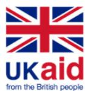

Over the past decade, TIWB has played an invaluable role in strengthening DRM in developing countries. The initiative has demonstrated the power of co-operation and capacity building in boosting domestic revenue collection, with remarkable USD 2.72 billion in additional tax revenues.

Globally, Finland remains committed to advancing more efficient and accountable tax systems. Digitalisation of tax systems is one of the core tools in bridging the gap, where Finland has expertise to offer. We continue to collaborate in this and other fields towards achieving the SDGs.

Juha Savolainen, Director General, Ministry of Foreign Affairs, Finland

TIWB benefits from the combined strengths of the OECD's tax expertise and the UNDP's deep-rooted presence and competence at the country-level. This partnership exemplifies how leveraging complementary strengths can drive reform and strive towards well-functioning domestic public finance systems. Finland continues to be a dedicated partner in the TIWB initiative – as part of the work towards stronger institutions, better transparency and greater accountability."

## Partner administrations

Partner administrations are the primary source of TIWB experts, supporting nearly 60% of all TIWB programmes. In 2025, the network continued to grow with the addition of the National Tax and Customs Directorate of Colombia, the Danish Tax Agency, the Egyptian Tax Authority, the Uruguayan General Tax Directorate and the Zambia Revenue Authority, bringing the total number of dedicated partner administrations to 32. Building on this momentum, TIWB will continue to expand its network of partner administrations, including by supporting jurisdictions to graduate from host to partner roles and contribute their expertise more widely.

## The Tax Inspection Board of the Republic of Türkiye is proud to contribute to the TIWB initiative,

which provides valuable opportunities for co-operation and knowledge sharing in the field of taxation. We consider this programme an important means to strengthen tax administration capacity and to develop more effective approaches to addressing common challenges.

A distinctive strength of TIWB is its focus on peer learning. Working alongside colleagues from other administrations allows our experts to exchange

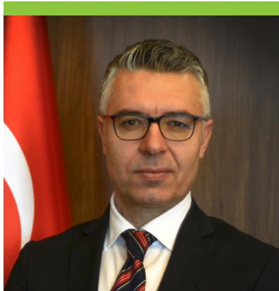  
Muhsin Atcı, Chairman, Tax Inspection Board of Türkiye

experiences, share practical insights, and benefit from diverse perspectives. This process enriches both sides, creating a spirit of mutual trust and co-operation that extends beyond individual missions.

Equally important is the programme's emphasis on sustainability. By supporting skills development and embedding good practices, TIWB helps ensure that host administrations can build on their progress over the long term. At the same time, our own experts also benefit by broadening their understanding of different compliance environments and strengthening their professional expertise.

Türkiye remains committed to supporting TIWB and its objectives. As this is our first participation in the TIWB programme, we are particularly excited and eager to contribute actively, and we look forward to engaging in future missions as well. We are confident that the initiative will continue to promote transparency, enhance tax administration capacity, and foster lasting international co-operation."

Additionally, TIWB welcomes the FTA's commitment to scale up its collective efforts in tax capacity building, including through strengthened support for the TIWB initiative (OECD Forum on Tax Administration, 2025 $^{[9]}$ ).

  
France:

Figure 4.2. TIWB partner administrations  

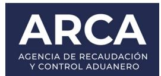  
Australia:

  
Belgium:

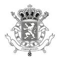  
Federal Public Service FINANCE  
Canada:  
Chile:

  
Receita Federal

  
Canada Revenue Agency  
Agence du revenu du Canada

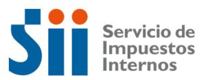  
Denmark:  
Egypt:

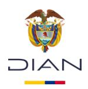

  
Germany:  
India:

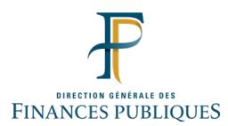

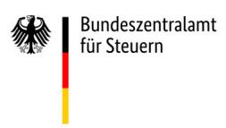

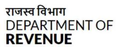

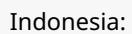  
Italy (Italian Revenue Agency and Financial Police):  
Kenya:

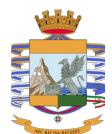

  
KENYA REVENUE
AUTHORITY

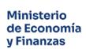  
Norway:  
South Africa:  
Spain:  
Uruguay:  
Zambia:

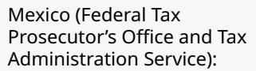

  
Morocco:

PFF

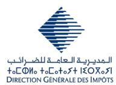

PROCURADURÍA FISCAL DE LA FEDERACIÓN

المديرية العامة للضرائب
+oCΦИо +oCoto+oS+ IΣOXɔsI
DIRECTION GÉNÉRALE DES IMPÔTS

  
Belastingdienst  
Poland:

Netherlands (Fiscal Information and Investigation Service and Tax Administration):

Nigeria:

  
The Norwegian Tax Administration

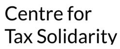

Slovak Republic:

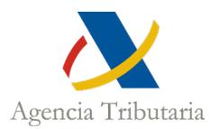  
Agencia Tributaria

Sweden:

  
Türkiye:

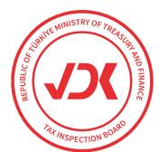  
United Kingdom:

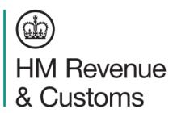

United States:

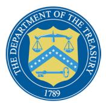

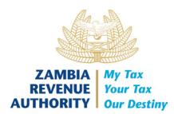

## TIWB experts

TIWB experts are vital to the delivery of effective and sustainable capacity building. Drawn from partner administrations or the UNDP-managed TIWB Roster of Experts, they provide specialised, hands-on support to host administrations. Since 2012, nearly 200 experts from partner administrations have participated in TIWB programmes, 23% of whom are female, and 38% of whom are from the Global South. The Roster currently includes 189 experts from over 50 jurisdictions, with 24% female participation and 51% of experts hailing from the Global South.

## My experience with the TIWB initiative has been extremely enriching and has unfolded in two clearly distinct stages.

The first was as part of the Peruvian tax administration team that received assistance in the first years of the initiative; the second began in 2024, when I started collaborating as an expert supporting other tax administrations.

Through this dual experience, I have become fully convinced that the “learning by doing” approach is the most effective way to strengthen capacities. Unlike traditional training, as experts, we are not just facilitators; we are partners. We work side by side with local officials

  
Richard Llaque, TIWB Roster expert

on their most complex audit cases, in real time. This practical collaboration is where the initiative's greatest impact is seen. We help close the critical gap between theory and practice; we are not external advisors; we join as another team member to contribute our experience and channel the collective knowledge of TIWB experts. It is incredibly rewarding to work across the entire audit cycle: from risk assessment and the development of detailed plans, to assisting in resolving practical implementation issues, formulating the audit position and supporting the response to taxpayer appeals.

TIWB's impact goes far beyond increasing revenue. Its greatest achievement is to significantly reduce the time needed to consolidate the practices of host administration and to develop sustainable technical capacity that expands within the organisation. This support is what strengthens our colleagues' confidence in their own abilities and decisions.

Personally, I believe one of the most valuable aspects of the initiative is its reciprocity. Not only do host administration auditors strengthen their skills, but we as experts also develop new skills and learn from the cases. Although cases may be similar, they are never the same, and they always motivate us to improve. I consider the TIWB initiative to be a strong, effective and people-centred model. A successful example of what global tax co-operation should look like."

In 2026, targeted efforts will focus on increasing the participation of female experts through mentoring initiatives, and in parallel, the Roster of Experts will be proactively diversified through targeted outreach to increase the representation of female tax experts, reflecting UNDP's broader commitment to advancing gender equality across all areas of its work.

## Regional and international organisations

TIWB provides a strong framework for fostering international tax co-operation by working closely with regional and international organisations and promoting South-South and triangular partnerships. By facilitating the deployment of experienced tax experts

TIWB fosters international tax co-operation by deploying experts, promoting partnerships, and enabling the exchange of knowledge and best practices across jurisdictions.

to work directly with host administrations, TIWB supports the exchange of knowledge, skills, and good practices across jurisdictions, while maximising impact and avoiding duplication in tax and development programmes.

Its strategic partnership with ATAF remains central in delivering TIWB programmes across Africa. In 2025, this partnership was further reinforced through joint efforts to expand programme coverage, enhance regional co-ordination, and promote South-South co-operation. ATAF's deep regional expertise and network of member countries have been instrumental in facilitating expert deployments and amplifying TIWB's impact across the region. The partnership also supports the implementation of the Public Finance for SDGs, reflecting a shared commitment to sustainable development through improved DRM.

In 2025, TIWB and IGF advanced efforts to formalise their partnership, which would strengthen the initiative's ability to integrate tax and mining expertise and provide better support to host administrations. The collaboration will equip host administrations with the knowledge, skills and tools required to conduct more effective tax audits, enhance revenue collection, and address BEPS risks in the extractive sector.

More broadly, triangular co-operation continues to support long-term capacity development and align with jurisdictions' DRM priorities. Examples include:

\- Joint programme delivery in Africa through the strategic partnership with ATAF and 16 partner administrations.

\- Collaboration with the OECD and the IGF's BEPS in Mining Programme, whereby IGF experts contribute to TIWB-audit programmes in Colombia, Ecuador, Jamaica, Mongolia, Papua New Guinea and Zambia.

\- Co-ordination of the OECD's bilateral assistance on BEPS and transfer pricing in Ecuador, Mongolia, North Macedonia, Peru and Ukraine.

Since its inception in 2016, TIWB has increasingly promoted South-South co-operation. Between 2016 and the end of 2025, 38 South-South programmes were launched, involving 12 Global South partner administrations supporting 28 host jurisdictions. India and South Africa have played a particularly important role, deploying experts across 13 programmes to date. These collaborations reflect the growing capacity within the Global South to contribute actively to international tax co-operation and P2P learning.

TIWB is also exploring partnerships with other initiatives, such as the EITI and the ICTD, to foster greater transparency and coherence in international tax co-operation, as well as ongoing engagement with CATA, CIAT and PITAA to identify opportunities for joint delivery. Similarly, TIWB is piloting collaboration with the WBG to jointly conduct tax crime

TIWB builds partnerships with global and regional bodies to strengthen tax co-operation, piloting joint assessments to identify gaps and improve legal, operational, and institutional frameworks.

assessments during Phase I of TIWB-CI programmes. Under this approach, the WBG guides an in-country risk assessment using its Tax Crime Risk Assessment Tool (World Bank, 2015 $^{[10]}$ ), while the host administration completes a self-assessment, using the OECD's Tax Crime Investigation Maturity Model (OECD, 2020 $^{[11]}$ ). This combined assessment aims to identify gaps in the jurisdiction's legal, operational and institutional frameworks for combating tax crime and inform the development of recommendations that could be addressed throughout Phase II of the programme. In 2025, this approach was successfully piloted in South America, and TIWB plans to continue this collaboration as part of upcoming TIWB-CI programmes.

Together, these partnership approaches reinforce TIWB's role in advancing effective international tax co-operation and delivering sustainable capacity development outcomes.

# Raising visibility and engagement: Communications and global outreach

Effective communication and strategic engagement were central to TIWB's efforts in 2025 to raise awareness, foster collaboration, and expand its impact. With the introduction of TIWB 2.0, these efforts will be essential to supporting the initiative's expanded vision. This chapter outlines how TIWB is strengthening its communications and outreach across three main areas. First, through the development of a communications strategy and the revamp of digital platforms, including the TIWB website and social media channels. Second, through targeted engagement with stakeholders, including donors, host and partner administrations, and regional and international organisations, to showcase results and reinforce collaboration. Third, by participating in and organising key events throughout the year, demonstrating how these forums are leveraged to promote international co-operation, share best practices, and increase TIWB's global profile.

## 1. Communications

The TIWB Secretariat remains fully committed to effectively disseminating information about its activities to key stakeholders and the public. Regular updates highlight major achievements, lessons learned, and programme outcomes, reflecting the quality of joint work and the strong support received from donors, experts and host and partner administrations. These efforts have reinforced TIWB's strong reputation among jurisdictions, international organisations and global media.

In June 2025, the TIWB website was revamped in alignment with the upgrade to the OECD's corporate website. The redesign takes advantage of system enhancements to deliver a seamless and consistent digital experience across platforms, offering streamlined access to resources and information. The new website offers a more intuitive and engaging user experience, serving as the central hub for news, updates, events and engagement with the TIWB Secretariat. It outlines the roles of all stakeholders, the range of assistance available and introduces the Secretariat and Governing Board members. All content is available in English, French and Spanish, and is regularly updated by the Secretariat's communications team.

The website enables current and prospective partner administrations to explore the benefits of supporting other tax administrations, while donors can assess the impact of their contributions. Host administrations are directed to the TIWB Portal, where they can officially request TIWB technical assistance. The website now also features interactive tables powered by real-time data from the TIWB programme management solution (TIWB Data Flow), enhancing transparency and accessibility for stakeholders on the status and deployment of TIWB programmes.

The Secretariat continues to share programme activities, launches, closing ceremonies, events and media mentions through the website and social media channels. Educational content, such as blogs, news articles, videos and case studies, provides insight into TIWB's work, showcases testimonials and best practices, and highlights the contributions of diverse stakeholders.

In 2025, the Secretariat strengthened its communications strategy to expand outreach and increase the visibility of the initiative's work. Efforts focused on LinkedIn, X (formerly Twitter) and Facebook.

Looking ahead to 2026, TIWB aims to further expand its social media presence, particularly on LinkedIn. More frequent production of content, including mission updates and testimonials, will help maintain a consistent record of the initiative's achievements and reinforce accountability. This will also enable greater recognition of stakeholders for their continued support and collaboration.

TIWB had strong visibility in the media in 2025. Coverage highlighted TIWB's presence at FFD4, the launch of the Tax Inspectors Without Borders: Ten Years of Hands-on Assistance in Developing Countries (OECD, 2025 $^{[12]}$ ), updates on ongoing and new programmes, and key achievements from the past decade.

Beyond the website and social media, two TIWB newsletters were published in 2025: a Special Edition in June and Volume 18 in November. Available in English, French, and Spanish, the newsletter reached more than 1 800 subscribers and showcased TIWB's major achievements throughout the year.

## 2. Events organised by the Secretariat in 2025

On 12 February, TIWB co-organised a high-level side event during the Third Preparatory Committee Session for the FFD4, held at the United Nations Headquarters in New York, United States. The session, "From AAAA to FFD4 – Strengthening Tax Co-operation for the 2030 Agenda", was held in partnership with the Government of Finland and the Norwegian Agency for Development Co-operation (Norad). Participants explored how TIWB could respond to emerging challenges by reinforcing its institutional framework, expanding expert deployment and creating sustainable mechanisms to meet FFD4 and 2030 Agenda commitments.

A few months later, on 2 July, TIWB co-hosted a side event at the FFD4 conference in Seville, Spain. The session, “A Decade of Impact and the Road Ahead”, reflected on ten years of OECD-UNDP collaboration through TIWB. It showcased tangible results from hands-on assistance in TIWB-audit and CI programmes, introduced TIWB 2.0 and explored future roles in areas such as digitalisation of the economy, complex cross-border transactions and new drivers of illicit financial flows.

On 16 and 17 October, the 2025 TIWB Stakeholders Workshop was held virtually under the theme "Tax Inspectors Without Borders 2.0: Shaping the Next Chapter." In celebration of TIWB's $10^{\text{th}}$ anniversary, the event reflected on a decade of impact and discussions centred around future priorities. Opening remarks were delivered by OECD Secretary-General Mathias Cormann and UNDP Acting Administrator Haoliang Xu. The workshop brought together over 250 participants from host and partner administrations, experts, regional and international partners and donor agencies. Key sessions focused on audit strategies, sector-specific challenges in mining, timber, and telecommunications and approaches to tackling tax crime. The event concluded with a forward-looking dialogue about TIWB's changing role in international tax co-operation (OECD/UNDP Tax Inspectors Without Borders, 2025[13]).

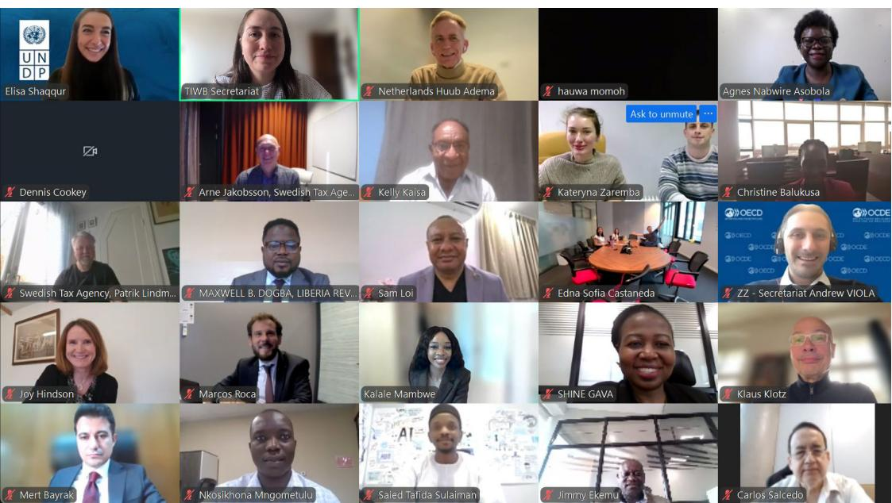  
Attendees at the virtual TIWB Stakeholders Workshop 2025.

2025 concluded with a joint OECD-UNDP strategic gathering held from 3-5 December at the OECD headquarters in Paris, France. The gathering brought together staff from both organisations who form the TIWB Secretariat to discuss strengthened collaboration, enhance engagement with UNDP country offices and shape the next phase of the initiative.

OECD and UNDP colleagues of the TIWB Secretariat at a strategic gathering in Paris, France.

## 3. TIWB participation in other events

In addition to the above, the TIWB initiative was showcased at the following 2025 events:

<table><tr><td>29-31 January</td><td>Dialogue on Public Finance and SDGs (New York, United States)</td></tr><tr><td>12-13 March</td><td>OECD Tax and Development Days, $^{3}$  included a session dedicated to TIWB, titled “Tax Inspectors Without Borders: A decade of niche assistance to developing countries” and a session highlighting TIWB-CbCR programmes, titled “The benefits of Country-by-Country reporting for developing countries” (virtual)</td></tr><tr><td>19-20 March</td><td>High-Level Seminar on International Tax Developments in the Caribbean (virtual)</td></tr><tr><td>27-28 May</td><td> $29^{th}$  Meeting of the OECD Task Force on Tax Crimes and Other Financial Crimes (virtual)</td></tr><tr><td>9-10 July</td><td>Steering Group of the Inclusive Framework on BEPS (Paris, France)</td></tr><tr><td>19 September</td><td>FTA Capacity Building Network Meeting (Paris, France)</td></tr><tr><td>1 October</td><td> $2^{nd}$  Global Tax Crime Enforcement Network Meeting (Paris, France)</td></tr><tr><td>2-3 October</td><td> $30^{th}$  Meeting of the OECD Task Force on Tax Crimes and Other Financial Crimes (Paris, France)</td></tr><tr><td>3-5 November</td><td>IGF  $21^{st}$  Annual General Meeting (Geneva, Switzerland)</td></tr><tr><td>9 December</td><td>WBG Anti-Corruption Day Event on Corruption and IFFs (virtual)</td></tr></table>

# Strengthening delivery: Governance, operations and capacity building approaches in TIWB 2.0

TIWB's operations have been strengthened to support the initiative's expanded vision under TIWB 2.0. This chapter outlines key operational enhancements, including the renewal of the Governing Board, more flexible partnership models, P2P pilot programmes fostering regional collaboration, and the continued development of TIWB Data Flow. Together, these improvements enhance the initiative's ability to respond to evolving host administration needs and deliver practical, high-impact support that contributes directly to stronger revenue mobilisation.

## Establishment of a renewed Governing Board

The TIWB Governing Board did not convene in 2025 due to preparations for the FFD4 side event and the ongoing transition in UNDP leadership, with a new Administrator assuming his role in December 2025.

A renewed TIWB Governing Board will be established in 2026, co-chaired by the OECD Secretary-General and the new UNDP Administrator.

A renewed Governing Board, co-chaired by the OECD Secretary-General, Mathias Cormann, and UNDP Administrator, Alexander De Croo, will be established in 2026. Comprising ten members drawn from government, civil society, and academia, the Governing Board will reflect a commitment to gender and regional balance. Members will serve in a personal capacity for a five-year term, with the possibility of renewal.

The Governing Board will play a central role in guiding the strategic direction of the initiative. Its responsibilities will include:

• Providing oversight and endorsing the TIWB annual report;

\- Advising on the annual work plan, including consultation with relevant stakeholders and sectors;

\- Building political support for TIWB among jurisdictions, donors, academic institutions, civil society, and international and regional organisations;

\- Identifying opportunities for expansion and enhancement, particularly through South–South collaboration; and

• Supporting the TIWB Secretariat in fundraising and promotional efforts.

The Governing Board will convene at least once annually, with additional meetings held as needed. All decisions will be made by consensus.

## Box 6.1. Members of the TIWB Governing Board at the end of 2025

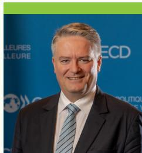  
Mathias Cormann
(Secretary-General of the OECD, Co-Chair) Mathias Cormann (Secretary-General of the OECD, Co-Chair)

  
Alexander De Croo
(Administrator of the UNDP,
Co-Chair)

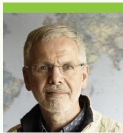  
John Christensen
(Acting Chair of the Board of Stamp Out Poverty and Director of the Balanced Economy Project; co-founder of the Tax Justice Network)

  
Sir Paul Collier
(Professor of Economics and Public Policy at the Blavatnik School of Government and a Professorial Fellow of St Antony's College, Oxford)

  
Bob Hamilton
(Commissioner of the
Canada Revenue Agency and
former Chair of the FTA)

  
Nora Lustig
(Professor of Latin American Economics and Director of the Commitment to Equity Institute at Tulane University)

  
Ekniti Nitithanprapas
(Deputy Prime Minister and Minister of Finance of Thailand)  
Source: TIWB Secretariat

# Expanding participation through adaptive partnership approaches

Recognising that not all current or prospective partner administrations have the resources or specialised expertise to support a full TIWB programme, the initiative is adopting more flexible approaches to broaden participation and enhance impact. Examples include:

Ad hoc virtual support: Some potential partner administrations are unable to commit to full programme delivery but can provide targeted remote assistance. This flexible support benefits host administrations and introduces new partner administrations to the initiative, potentially leading to full programme engagement in the future.

Bridging support between TIWB-CI programme phases: Interim virtual assistance can be particularly valuable when there is a gap between Phases I and II of the TIWB-CI programmes due to the absence of a confirmed partner administration. Providing targeted support on specific issues identified during Phase I, especially those linked to case resolution, helps maintain momentum, strengthens audit capacity, and contributes to measurable outputs in Phase II.

Joint expertise and collaborative programme support: Partner administrations are increasingly working together to enhance programme effectiveness. When one partner lacks specialised expertise needed for a particular engagement, another may deploy experts to fill that gap. This collaborative model supplements technical capabilities, reinforces shared responsibility and deepens mutual support. Examples include: the United Kingdom working alongside partner administrations, France and Sweden, on an international tax audit programme in Ukraine; ATAF, India, Türkiye and the United Kingdom collaborating on TIWB-AEOI and TIWB-CbCR programmes in Nigeria; Australia providing ad hoc support with the United Kingdom in the Sri Lankan TIWB-CI programme; and Sweden and Kenya assisting Liberia in a TIWB-CI programme (see Box 6.2).

Shortened programme duration: While TIWB programmes typically run 18–24 months, some partner administrations may not be able to commit to a full-length engagement. In such cases, a shorter programme duration can be agreed with the host administration, allowing for participation within a more manageable timeframe.

These flexible partnership approaches will be further reinforced by the upcoming TIWB Graduates Platform (see Chapter 1), which will enable jurisdictions that have built strong capacity through TIWB to become providers of expertise to peers facing similar tax challenges.

## Box 6.2. Multi-partner TIWB programmes

## Liberia

In late 2024, Liberia established a triangular TIWB-CI partnership with Kenya and Sweden, through which experts have provided onsite and remote support to develop a package of legislative amendments now tabled before the legislature. In parallel, the experts have supported the Liberia Revenue Authority in strengthening operational co-operation by reviewing MoUs with the Anti-Corruption Commission and Financial Intelligence Authority and developing a new MoU with the Liberian National Police. This support is aimed at strengthening Liberia's long-term tax crime investigation capacity ahead of the planned expansion of its criminal investigation unit in 2026.

## Nigeria

In 2025, two new TIWB programmes, implemented in partnership with ATAF, were launched in Nigeria to strengthen the effective use of CRS and CbCR data. These programmes aim to strengthen Nigeria's efforts to combat tax evasion and enhance DRM, marking the country's sixth and seventh TIWB engagements. These programmes stand out for their multi-partner collaboration, drawing on expertise from India, Türkiye and the United Kingdom. Through this joint effort, Nigeria's tax administration will gain the tools and skills needed to analyse offshore financial data and MNE operations across different jurisdictions, enabling more targeted audits and improved compliance. This collaboration also highlights the critical role of international co-operation in building sustainable tax capacity and advancing Nigeria's broader development goals.

## Peer-to-peer pilot programmes

In 2025, TIWB designed P2P pilot programmes, to be launched in 2026, to strengthen regional capacity and foster sustainable collaboration among host administrations. Building on TIWB's hands-on model, these P2P programmes will facilitate bilateral and triangular exchanges between tax administrations in the Global South.

TIWB's P2P pilots, launching in 2026, will foster regional capacity by enabling tailored knowledge exchange and collaboration between Global South tax administrations at different maturity levels.

The P2P programmes match jurisdictions at different stages of transfer pricing maturity, enabling tailored support and mutual learning. Two programme types have been developed:

\- Tiered support programmes pair tax administrations with advanced or intermediary-level maturity with peers at emerging stages of development. These partnerships focus on targeted technical assistance and capacity building.

\- Reciprocal programmes match tax administrations with similar maturity levels to exchange sector-specific audit expertise, such as in mining, telecommunications, and banking. This model fosters mutual learning and institutional development through shared experience.

Once jurisdictions are matched, each pairing conducts two virtual missions, shadowed by a TIWB expert to ensure quality assurance and technical rigour, followed by one in-person mission to each peer jurisdiction. Upon completion, the programmes will be evaluated to assess outcomes and inform the expansion of the pilot programme to additional pairings.

By leveraging expertise built through TIWB over the past decade, the P2P programmes will strengthen regional technical capacity, supports staff retention through professional development, and reduces costs associated with travel and expert deployment. It also addresses gaps in industry-specific expertise and reinforces the value of South–South co-operation through structured platforms for technical exchange.

## TIWB Data Flow

TIWB Data Flow is an integrated digital platform designed to automate programme processes, centralise data, and facilitate collaboration between the OECD, UNDP and its stakeholders. In 2025, the TIWB Secretariat continued advancing the platform's planned development phases, establishing it as the central database for programme management

As TIWB advances towards TIWB 2.0, the achievements of 2025 lay the foundation for expanded reach and stronger capacity building in 2026, aligned with evolving needs and priorities.

and reporting. Ongoing data migration and integration efforts between the OECD and UNDP have further streamlined collaboration and enhanced transparency across the initiative.

The platform supports host administrations, experts, UNDP regional tax specialists and the Secretariat in managing programmes, submitting reports, and accessing resources in English, French and Spanish through the TIWB Portal. Automated data visualisation and reporting tools continue to strengthen monitoring, evaluation and knowledge sharing.

Throughout 2025, the Secretariat focused on refining the platform to enhance user experience and expand analytical functionalities, ensuring TIWB Data Flow remains a dynamic and reliable tool that supports the initiative's ongoing growth and effectiveness.

Further enhancements are planned for 2026, including strengthened monitoring and evaluation features, expanded automation capabilities and continued adaptation to the changing needs of TIWB stakeholders. Expanded partner support would enable these improvements to be implemented at a greater scale and further strengthen the effectiveness of TIWB programmes.

# Looking ahead: Strategic priorities for TIWB 2.0

As TIWB enters its next phase under TIWB 2.0, the achievements of 2025 lay the groundwork for expanding its reach and strengthening long-term capacity development in 2026. This chapter reviews TIWB's 2025 achievements and sets priorities for 2026, ensuring alignment with its mandate, host administrations' needs, and available resources.

## Stocktake of 2025 objectives

TIWB's key objectives for 2025 were outlined in Tax Inspectors Without Borders: Ten Years of Hands-on Assistance in Developing Countries (OECD, 2025[12]).

Overall, progress against the 2025 objectives highlights a shift in focus from launching new programmes to supporting ongoing programmes. While fewer new programmes were launched than planned in 2025, a record number of ongoing programmes reflects

In 2025, TIWB shifted focus to supporting ongoing programmes, with strong demand driving record activity and expanded partnerships enhancing delivery.

strong demand for TIWB support. At the same time, the expansion of partner administrations exceeded expectations, strengthening the initiative's delivery capacity. Some objectives were partially achieved or deferred due to demand and resource availability, underscoring the importance of flexibility in programme implementation.

Table 7.1. TIWB progress against 2025 objectives

<table><tr><td>Objective</td><td>Status</td></tr><tr><td>Envisage commencing 30 new programmes in 2025, including 15 TIWB-audit and 6 TIWB-CI programmes.</td><td>Thirteen new programmes commenced in 2025, including eight TIWB-audit and five TIWB-CI programmes.</td></tr><tr><td>Assess the two TIWB-AEOI programmes and start two new programmes in 2025.</td><td>One new TIWB-AEOI programme was launched in 2025.</td></tr><tr><td>Take stock of the five TIWB-DTA programmes and launch four new programmes over the 2025–2026 period.</td><td>Stocktake completed, programmes will be launched subject to demand from host administrations.</td></tr><tr><td>Review the current TIWB-CbCR programme and start one new programme in 2025.</td><td>One TIWB-CbCR programme was launched in 2025.</td></tr><tr><td>Initiate one TIWB-GMT and one TIWB-VAT programme in 2025.</td><td>One TIWB-GMT programme was launched in 2025. Regarding TIWB-VAT, TIWB programmes are demand-driven, and the initiative is ready to support jurisdictions&#x27; efforts in these areas.</td></tr><tr><td>Expand the offering of South-South partners and programmes in response to demand from developing countries.</td><td>In 2025, two new South-South programmes commenced.</td></tr><tr><td>Develop relationships with at least two new partner administrations willing to deploy tax experts for TIWB programmes.</td><td>In 2025, Colombia, Denmark, Egypt, Uruguay and Zambia joined as partner administrations.</td></tr><tr><td>Launch new mentoring programmes, to expand the participation of female experts from developing countries.</td><td>Due to resource limitations, this objective will be developed in 2026.</td></tr></table>

## 2026 objectives

Building on the 2025 stocktake, TIWB remains committed to building on the achievements of the past year and advancing its mission to strengthen tax audit and investigation capacity in developing countries. The 2026 workplan emphasises a strategic focus on deepening existing partnerships and leveraging innovative approaches to capacity building. Successful programme delivery will depend on the availability of adequate resources to sustain ongoing programmes, support new programmes and enhance collaboration with partners. By aligning these objectives with available resources and host administration priorities, TIWB is positioned to extend its global footprint, respond to emerging demand and strengthen DRM in developing countries.

At the same time, opportunities remain to broaden engagement in regions where TIWB presence is more limited, notably in the Caribbean and Pacific. Targeted outreach and additional support in these regions could further extend the initiative's reach and impact. While demand for international transfer pricing audit support appears to be stabilising, interest is growing for specialised industry expertise and in AEOI, CbCR, CI and GMT programmes.

## Box 7.1. Key objectives for 2026

## TIWB programmes

\- Continue supporting 51 ongoing programmes.

• Commence 12 new TIWB-audit and 4 TIWB-CI programmes.

• Assess the TIWB-AEOI programmes and start one new programme.

• Take stock of the TIWB-DTA programmes and start one new programme.

\- Review the TIWB-CbCR programmes and start one new programme.

\- Launch one new TIWB-GMT programme.

• Commence one TIWB-VAT programme.

\- Expand the offering of South-South programmes by launching at least three new programmes.

\- Launch new mentoring programmes with a focus on female experts.

• Further develop and pilot P2P support programmes.

## Partnerships

\- Develop relationships with at least two new partner administrations willing to deploy tax experts for TIWB programmes.

\- Enhance triangular co-operation and expand engagement with international and regional organisations.

## References

OECD (2025), Consolidated text of the Common Reporting Standard (2025): Standard for [2] Automatic Exchange of Financial Account Information in Tax Matters, OECD Publishing, Paris, https://doi.org/10.1787/055664b1-en.

OECD (2025), Tax Inspectors Without Borders present plans to expand international tax co-operation for sustainable development over the coming decade, https://www.oecd.org/en/about/news/press-releases/2025/07/tax-inspectors-without-borders-present-plans-to-expand-international-tax-co-operation-for-sustainable-development-over-the-coming-decade.html (accessed on 1 September 2025).

OECD (2024), Economic Impact Assessment of the Global Minimum Tax: Summary, [6] OECD Publishing, https://www.oecd.org/content/dam/oecd/en/topics/policy-issues/cross-border-and-international-tax/summary-economic-impact-assessment-global-minimum-tax-january-2024.pdf.

OECD (2022), Digital Transformation Maturity Model, OECD Publishing, http://www.oecd.org/tax/forum-on-tax-administration/publications-and-products/digital-transformation-maturity-model.htm.

OECD (2022), OECD Transfer Pricing Guidelines for Multinational Enterprises and Tax [7] Administrations 2022, OECD Publishing, Paris, https://doi.org/10.1787/0e655865-en.

OECD (2022), Tax Morale II: Building Trust between Tax Administrations and Large Businesses, [1] OECD Publishing, Paris, https://doi.org/10.1787/7587f25c-en.

OECD (2021), Global Anti-Base Erosion Model Rules (Pillar Two), https://www.oecd.org/en/topics/sub-issues/global-minimum-tax/global-anti-base-erosion-model-rules-pillar-two.html (accessed on 3 April 2025).

OECD (2021), Recommendation of the Council on the Ten Global Principles for Fighting Tax [8] Crime, https://doi.org/OECD/LEGAL/0469 (accessed on 12 September 2025).

OECD (2020), Tax Administration 3.0: The Digital Transformation of Tax Administration, OECD Publishing, Paris, https://doi.org/10.1787/ca274cc5-en.

OECD (2020), Tax Crime Investigation Maturity Model, OECD Publishing, http://www.oecd. [11] org/tax/crime/tax-crime-investigation-maturity-model.htm.

OECD Forum on Tax Administration (2025), Forum on Tax Administration Plenary Statement of Outcomes, https://www.oecd.org/content/dam/oecd/en/events/2025/11/forum-on-tax-administration-2025-event/statement-of-outcomes-fta-plenary-meeting-2025.pdf (accessed on 21 November 2025).

OECD/UNDP Tax Inspectors Without Borders (2025), Statement of Outcomes TIWB Stakeholders Workshop, https://www.tiwb.org/content/dam/tiwb/en/pdfs/statement-of-outcomes/TIWBStakeholdersWorkshop\_StatementofOutcomes2025.pdf (accessed on 20 November 2025).

World Bank (2015), Introduction to the National Risk Assessment Tool (English), World Bank [10] Group, http://documents.worldbank.org/curated/en/099539106292288480.

# Annex A. TIWB programmes

This Annex highlights the status of TIWB programmes as of 31 December 2025, including current, completed and upcoming programmes.

Table A A.1. Current TIWB international tax audit programmes

<table><tr><td></td><td>Jurisdiction</td><td>Host administration</td><td>Programme number</td><td>Expert</td><td>Commenced in</td></tr><tr><td>1</td><td>Angola</td><td>Angolan General Tax Administration</td><td>F2025-0008</td><td>Roster expert</td><td>2025</td></tr><tr><td>2</td><td>Azerbaijan</td><td>State Tax Service</td><td>F2022-0019</td><td>Serving tax official</td><td>2023</td></tr><tr><td>3</td><td>Bhutan</td><td>Department of Revenue and Customs</td><td>F2023-0011</td><td>Serving tax official</td><td>2023</td></tr><tr><td>4</td><td>Botswana</td><td>Botswana Unified Revenue Service</td><td>F2025-0006</td><td>Roster expert</td><td>2025</td></tr><tr><td>5</td><td>Cameroon</td><td>General Directorate of Taxes</td><td>F2020-0011</td><td>Serving tax official</td><td>2024</td></tr><tr><td>6</td><td>Cameroon</td><td>General Directorate of Taxes</td><td>F2024-0009</td><td>Serving tax official</td><td>2024</td></tr><tr><td>7</td><td>Comoros</td><td>General Directorate of Taxes</td><td>F2023-0025</td><td>Serving tax official</td><td>2024</td></tr><tr><td>8</td><td>Democratic Republic of the Congo</td><td>General Directorate of Taxes</td><td>F2024-0011</td><td>Serving tax official</td><td>2024</td></tr><tr><td>9</td><td>Ecuador</td><td>Internal Revenue Service</td><td>F2024-0005</td><td>Roster expert</td><td>2024</td></tr><tr><td>10</td><td>Egypt</td><td>Egyptian Tax Authority</td><td>F2023-0002</td><td>Serving tax official</td><td>2023</td></tr><tr><td>11</td><td>Ghana</td><td>Ghana Revenue Authority</td><td>F2024-0010</td><td>Serving tax official</td><td>2024</td></tr><tr><td>12</td><td>Lesotho</td><td>Revenue Services Lesotho</td><td>F2024-0001</td><td>Roster expert</td><td>2024</td></tr><tr><td>13</td><td>Liberia</td><td>Liberia Revenue Authority</td><td>F2022-0020</td><td>Former tax official</td><td>2023</td></tr><tr><td>14</td><td>Mauritania</td><td>General Directorate of Taxes</td><td>F2023-0023</td><td>Former tax official</td><td>2023</td></tr><tr><td>15</td><td>Moldova</td><td>State Tax Service</td><td>F2024-0014</td><td>Roster expert</td><td>2025</td></tr><tr><td>16</td><td>Namibia</td><td>Inland Revenue Department</td><td>F2023-0026</td><td>Serving tax officials &amp; Roster expert</td><td>2024</td></tr><tr><td>17</td><td>Niger</td><td>General Directorate of Taxes</td><td>F2023-0004</td><td>International partner expert</td><td>2024</td></tr><tr><td>18</td><td>Nigeria</td><td>Nigeria Revenue Service</td><td>F2023-0021</td><td>International partner expert</td><td>2024</td></tr><tr><td>19</td><td>North Macedonia</td><td>Public Revenue Office</td><td>F2023-0017</td><td>Roster expert</td><td>2023</td></tr><tr><td>20</td><td>Papua New Guinea</td><td>Internal Revenue Commission</td><td>F2018-0014</td><td>Serving tax official</td><td>2019</td></tr><tr><td>21</td><td>Papua New Guinea</td><td>Internal Revenue Commission</td><td>F2023-0019</td><td>Roster expert</td><td>2025</td></tr><tr><td>22</td><td>Papua New Guinea</td><td>Internal Revenue Commission</td><td>IE2018-02</td><td>Roster expert</td><td>2019</td></tr><tr><td>23</td><td>Togo</td><td>Togo Revenue Office</td><td>F2024-0004</td><td>Serving tax official</td><td>2024</td></tr><tr><td>24</td><td>Uganda</td><td>Uganda Revenue Authority</td><td>F2019-0025</td><td>Former tax official</td><td>2019</td></tr><tr><td>25</td><td>Ukraine</td><td>State Tax Committee</td><td>F2023-0012</td><td>Serving tax official</td><td>2024</td></tr><tr><td>26</td><td>Zambia</td><td>Zambia Revenue Authority</td><td>F2019-0008</td><td>Former tax official</td><td>2019</td></tr><tr><td>27</td><td>Zambia</td><td>Zambia Revenue Authority</td><td>F2023-0008</td><td>Former tax official</td><td>2023</td></tr><tr><td>28</td><td>Zimbabwe</td><td>Zimbabwe Revenue Authority</td><td>F2021-0008</td><td>Former tax official</td><td>2021</td></tr></table>

Note: As of 31 December 2025  
Source: TIWB Secretariat

Table A A.2. Current TIWB advance pricing arrangement and mutual agreement procedure programmes

<table><tr><td></td><td>Jurisdiction</td><td>Host administration</td><td>Programme number</td><td>Expert</td><td>Commenced in</td></tr><tr><td>1</td><td>Armenia</td><td>State Revenue Committee</td><td>F2024-0002</td><td>Serving tax official</td><td>2024</td></tr><tr><td>2</td><td>Georgia</td><td>Georgia Revenue Service</td><td>F2024-0012</td><td>Serving tax official</td><td>2025</td></tr><tr><td>3</td><td>Tanzania</td><td>Tanzania Revenue Authority</td><td>F2022-0016</td><td>Former tax official</td><td>2023</td></tr></table>

Note: As of 31 December 2025  
Source: TIWB Secretariat

Table A A.3. Current TIWB criminal tax investigation programmes

<table><tr><td></td><td>Jurisdiction</td><td>Host administration</td><td>Programme number</td><td>Expert</td><td>Commenced in</td></tr><tr><td>1</td><td>Albania</td><td>General Directorate of Taxation</td><td>TC2025-0001</td><td>Former tax official</td><td>2025</td></tr><tr><td>2</td><td>Colombia</td><td>National Tax and Customs Authority</td><td>TC2019-0001</td><td>Roster expert</td><td>2019</td></tr><tr><td>3</td><td>El Salvador</td><td>General Directorate of Internal Taxes</td><td>TC2023-0007</td><td>Serving tax official &amp; Roster expert</td><td>2024</td></tr><tr><td>4</td><td>Eswatini</td><td>Eswatini Revenue Authority</td><td>TC2020-0002</td><td>Serving tax official</td><td>2023</td></tr><tr><td>5</td><td>Kenya</td><td>Kenya Revenue Authority</td><td>TC2019-0004</td><td>Serving tax official</td><td>2019</td></tr><tr><td>6</td><td>Lesotho</td><td>Lesotho Revenue Authority</td><td>TC2024-0002</td><td>Roster expert</td><td>2025</td></tr><tr><td>7</td><td>Liberia</td><td>Liberia Revenue Authority</td><td>TC2023-0004</td><td>Serving tax official &amp; Roster expert</td><td>2024</td></tr><tr><td>8</td><td>Nigeria</td><td>Nigeria Revenue Service</td><td>TC2023-0003</td><td>Roster expert</td><td>2024</td></tr><tr><td>9</td><td>Papua New Guinea</td><td>Internal Revenue Commission</td><td>TC2024-0009</td><td>Serving tax official</td><td>2025</td></tr><tr><td>10</td><td>Seychelles</td><td>Seychelles Revenue Commission</td><td>TC2024-0004</td><td>Former tax official</td><td>2024</td></tr><tr><td>11</td><td>Sri Lanka</td><td>Inland Revenue Department</td><td>TC2024-0008</td><td>Serving tax official</td><td>2025</td></tr><tr><td>12</td><td>Uganda</td><td>Uganda Revenue Authority</td><td>TC2023-0001</td><td>Roster expert</td><td>2025</td></tr><tr><td>13</td><td>Ukraine</td><td>Economic Security Bureau of Ukraine</td><td>TC2023-0008</td><td>Serving tax official &amp; Roster expert</td><td>2024</td></tr><tr><td>14</td><td>Zimbabwe</td><td>Zimbabwe Revenue Authority</td><td>TC2023-0006</td><td>Serving tax official</td><td>2023</td></tr></table>

Note: As of 31 December 2025  
Source: TIWB Secretariat

Table A A.4. Current TIWB pilot programmes

<table><tr><td></td><td>Jurisdiction</td><td>Host administration</td><td>Programme number</td><td>Expert</td><td>Commenced in</td></tr><tr><td colspan="6">TIWB-AEOI programmes</td></tr><tr><td>1</td><td>Nigeria</td><td>Nigeria Revenue Service</td><td>AE2023-0004</td><td>Serving tax official</td><td>2025</td></tr><tr><td>2</td><td>Saint Lucia</td><td>Inland Revenue Department</td><td>AE2023-0001</td><td>Serving tax official</td><td>2023</td></tr><tr><td colspan="6">TIWB-CbCR programmes</td></tr><tr><td>1</td><td>Nigeria</td><td>Nigeria Revenue Service</td><td>CB2025-0001</td><td>Serving tax official</td><td>2025</td></tr><tr><td>2</td><td>Peru</td><td>National Superintendency of Customs and Tax Administration</td><td>CB2023-0001</td><td>Serving tax official</td><td>2023</td></tr><tr><td colspan="6">TIWB-DTA programmes</td></tr><tr><td>1</td><td>Georgia</td><td>Georgia Revenue Service</td><td>DG2023-0002</td><td>Serving tax official</td><td>2023</td></tr><tr><td>2</td><td>Liberia</td><td>Liberia Revenue Authority</td><td>DG2024-0004</td><td>Serving tax official</td><td>2024</td></tr></table>

Note: As of 31 December 2025  
Source: TIWB Secretariat

Table A A.5. Completed TIWB programmes

<table><tr><td></td><td>Jurisdiction</td><td>Host administration</td><td>Programme number</td><td>Expert</td><td>Term</td></tr><tr><td>1</td><td>Albania</td><td>Albanian Tax Directorate</td><td>F2015-0001</td><td>Serving tax official</td><td>2015</td></tr><tr><td>2</td><td>Angola</td><td>Angolan General Tax Administration</td><td>F2021-0007</td><td>Serving tax official</td><td>2022-2024</td></tr><tr><td>3</td><td>Armenia</td><td>State Revenue Committee</td><td>F2018-0020</td><td>Serving tax official</td><td>2020-2021</td></tr><tr><td>4</td><td>Armenia</td><td>State Revenue Committee</td><td>TC2019-0002</td><td>Serving tax official</td><td>2019-2021</td></tr><tr><td>5</td><td>Armenia</td><td>State Revenue Committee</td><td>F2023-0010</td><td>Serving tax official</td><td>2023-2024</td></tr><tr><td>6</td><td>Benin</td><td>General Directorate of Taxes</td><td>F2017-0010</td><td>Serving tax official</td><td>2019-2021</td></tr><tr><td>7</td><td>Benin</td><td>General Directorate of Taxes</td><td>F2022-0007</td><td>Serving tax official</td><td>2023-2024</td></tr><tr><td>8</td><td>Bhutan</td><td>Department of Revenue and Customs</td><td>F2019-0022</td><td>Serving tax official</td><td>2021-2023</td></tr><tr><td>9</td><td>Botswana</td><td>Botswana Unified Revenue Service</td><td>L2015-0003</td><td>Former tax official</td><td>2015-2017</td></tr><tr><td>10</td><td>Botswana</td><td>Botswana Unified Revenue Service</td><td>F2016-0006</td><td>Serving tax official &amp; former tax official</td><td>2016-2018</td></tr><tr><td>11</td><td>Botswana</td><td>Botswana Unified Revenue Service</td><td>IE2017-01</td><td>Industry expert</td><td>2017</td></tr><tr><td>12</td><td>Botswana</td><td>Botswana Unified Revenue Service</td><td>F2017-0014</td><td>Former tax official</td><td>2017-2023</td></tr><tr><td>13</td><td>Cambodia</td><td>General Department of Taxation</td><td>L2016-0003</td><td>Former tax official</td><td>2016</td></tr><tr><td>14</td><td>Cambodia</td><td>General Department of Taxation</td><td>F2019-0024</td><td>Serving tax official</td><td>2020-2025</td></tr><tr><td>15</td><td>Cameroon</td><td>General Directorate of Taxes</td><td>F2017-0002</td><td>Serving tax official</td><td>2017-2019</td></tr><tr><td>16</td><td>Cameroon</td><td>General Directorate of Taxes</td><td>F2018-0012</td><td>Serving tax official</td><td>2019-2020</td></tr><tr><td>17</td><td>Central African Republic</td><td>Directorate General for Taxes and Domains</td><td>F2019-0009</td><td>Serving tax official</td><td>2020</td></tr><tr><td>18</td><td>Chad</td><td>General Directorate of Taxes</td><td>F2018-0010</td><td>Serving tax official</td><td>2019-2020</td></tr><tr><td>19</td><td>Colombia</td><td>National Tax and Customs Directorate</td><td>L2012-0001</td><td>Former tax official</td><td>2012-2014</td></tr><tr><td>20</td><td>Colombia</td><td>National Tax and Customs Directorate</td><td>F2018-0001</td><td>Serving tax official</td><td>2018-2021</td></tr><tr><td>21</td><td>Colombia</td><td>National Tax and Customs Directorate</td><td>F2018-0002</td><td>Serving tax official</td><td>2018-2023</td></tr><tr><td>22</td><td>Colombia</td><td>National Tax and Customs Directorate</td><td>F2020-0008</td><td>Serving tax official</td><td>2023-2024</td></tr><tr><td>23</td><td>Congo</td><td>Director General of Taxes and Domains</td><td>F2016-0012</td><td>Serving tax official</td><td>2017-2019</td></tr><tr><td>24</td><td>Costa Rica</td><td>General Directorate of Taxation</td><td>F2016-0005</td><td>Serving tax official</td><td>2016-2017</td></tr><tr><td>25</td><td>Costa Rica</td><td>General Directorate of Taxation</td><td>F2018-0011</td><td>Serving tax official</td><td>2018-2019</td></tr><tr><td>26</td><td>Costa Rica</td><td>General Directorate of Taxation</td><td>TC2020-0001</td><td>Serving tax official</td><td>2022-2024</td></tr><tr><td>27</td><td>Côte d'Ivoire</td><td>General Directorate of Taxes</td><td>F2017-0005</td><td>Serving tax official</td><td>2018-2019</td></tr><tr><td>28</td><td>Dominican Republic</td><td>General Directorate of Internal Taxes</td><td>F2018-0017</td><td>Serving tax official</td><td>2020-2023</td></tr><tr><td>29</td><td>Ecuador</td><td>Internal Revenue Service</td><td>F2021-0005</td><td>Serving tax official</td><td>2022-2023</td></tr><tr><td>30</td><td>Ecuador</td><td>Internal Revenue Service</td><td>F2021-0002</td><td>Serving tax official</td><td>2023-2024</td></tr><tr><td>31</td><td>Egypt</td><td>Egyptian Tax Authority</td><td>F2016-0011</td><td>Roster expert</td><td>2017-2019</td></tr><tr><td>32</td><td>Egypt</td><td>Egyptian Tax Authority</td><td>F2019-0003</td><td>Roster expert</td><td>2019-2023</td></tr><tr><td>33</td><td>Egypt</td><td>Egyptian Tax Authority</td><td>F2019-0004</td><td>Serving tax official</td><td>2020-2022</td></tr><tr><td>34</td><td>El Salvador</td><td>General Directorate of Internal Taxes</td><td>F2020-0015</td><td>Serving tax official</td><td>2021-2023</td></tr><tr><td>35</td><td>El Salvador</td><td>General Directorate of Internal Taxes</td><td>F2023-0014</td><td>Roster expert</td><td>2024-2025</td></tr><tr><td>36</td><td>Eswatini</td><td>Eswatini Revenue Authority</td><td>F2017-0004</td><td>Serving tax official</td><td>2018-2021</td></tr><tr><td>37</td><td>Eswatini</td><td>Eswatini Revenue Authority</td><td>F2018-0027</td><td>Former tax official</td><td>2020</td></tr><tr><td>38</td><td>Ethiopia</td><td>Ethiopian Revenues and Customs Authority</td><td>F2016-0016</td><td>Serving tax official</td><td>2015-2018</td></tr><tr><td>39</td><td>Ethiopia</td><td>Ethiopian Revenues and Customs Authority</td><td>IE2018-01</td><td>Industry expert</td><td>2018-2019</td></tr><tr><td>40</td><td>Gabon</td><td>General Directorate of Taxes</td><td>F2018-0013</td><td>Roster expert</td><td>2019-2021</td></tr><tr><td>41</td><td>Georgia</td><td>Georgia Revenue Service</td><td>F2016-0008</td><td>Roster expert</td><td>2016-2017</td></tr><tr><td>42</td><td>Georgia</td><td>Georgia Revenue Service</td><td>F2017-0013</td><td>Roster expert</td><td>2018-2019</td></tr><tr><td>43</td><td>Georgia</td><td>Georgia Revenue Service</td><td>F2020-0005</td><td>Roster expert</td><td>2021-2025</td></tr><tr><td>44</td><td>Georgia</td><td>Georgia Revenue Service</td><td>F2021-0004</td><td>Serving tax official</td><td>2022-2024</td></tr><tr><td>45</td><td>Ghana</td><td>Ghana Revenue Authority</td><td>F2014-0001</td><td>Serving tax official</td><td>2013-2018</td></tr><tr><td>46</td><td>Ghana</td><td>Ghana Revenue Authority</td><td>F2019-0005</td><td>Serving tax official</td><td>2019-2021</td></tr><tr><td>47</td><td>Ghana</td><td>Ghana Revenue Authority</td><td>F2019-0006</td><td>Serving tax official</td><td>2019-2023</td></tr><tr><td>48</td><td>Ghana</td><td>Ghana Revenue Authority</td><td>F2020-0013</td><td>Serving tax official</td><td>2020-2024</td></tr><tr><td>49</td><td>Guinea</td><td>General Directorate of Taxes</td><td>F2019-0018</td><td>Serving tax official</td><td>2020-2024</td></tr><tr><td>50</td><td>Honduras</td><td>Income Administration Service</td><td>F2019-0007</td><td>Roster expert</td><td>2020-2021</td></tr><tr><td>51</td><td>Honduras</td><td>Income Administration Service</td><td>TC2019-0005</td><td>Roster expert</td><td>2021-2025</td></tr><tr><td>52</td><td>Jamaica</td><td>Tax Administration Jamaica</td><td>F2016-0004</td><td>Roster expert</td><td>2016-2018</td></tr><tr><td>53</td><td>Jamaica</td><td>Tax Administration Jamaica</td><td>F2016-0013</td><td>Serving tax official</td><td>2017-2019</td></tr><tr><td>54</td><td>Jamaica</td><td>Tax Administration Jamaica</td><td>IE2019-02</td><td>Industry expert</td><td>2019</td></tr><tr><td>55</td><td>Kazakhstan</td><td>State Revenue Committee</td><td>F2020-0009</td><td>Roster expert</td><td>2020-2025</td></tr><tr><td>56</td><td>Kenya</td><td>Kenya Revenue Authority</td><td>L2012-0002</td><td>Former tax official</td><td>2012-2020</td></tr><tr><td>57</td><td>Kenya</td><td>Kenya Revenue Authority</td><td>IE2019-01</td><td>Industry expert</td><td>2019</td></tr><tr><td>58</td><td>Kenya</td><td>Kenya Revenue Authority</td><td>DG2023-0001</td><td>Serving tax official</td><td>2022-2023</td></tr><tr><td>59</td><td>Kenya</td><td>Kenya Revenue Authority</td><td>F2021-0009</td><td>Serving tax official</td><td>2021-2024</td></tr><tr><td>60</td><td>Kosovo*</td><td>Tax Administration of Kosovo</td><td>F2017-0008</td><td>Roster expert</td><td>2018-2020</td></tr><tr><td>61</td><td>Kosovo*</td><td>Tax Administration of Kosovo</td><td>F2020-0010</td><td>Serving tax official</td><td>2022-2024</td></tr><tr><td>62</td><td>Lebanon</td><td>Directorate General of Finance</td><td>DG2023-0004</td><td>Serving tax official</td><td>2023</td></tr><tr><td>63</td><td>Lesotho</td><td>Lesotho Revenue Authority</td><td>F2015-0003</td><td>Serving tax official</td><td>2015-2019</td></tr><tr><td>64</td><td>Liberia</td><td>Liberia Revenue Authority</td><td>F2016-0002</td><td>Former tax official</td><td>2016-2018</td></tr><tr><td>65</td><td>Liberia</td><td>Liberia Revenue Authority</td><td>IE2016-01</td><td>Former tax official</td><td>2016-2018</td></tr><tr><td>66</td><td>Liberia</td><td>Liberia Revenue Authority</td><td>F2017-0009</td><td>Serving tax official</td><td>2017</td></tr><tr><td>67</td><td>Madagascar</td><td>Ministry of Economy and Finance</td><td>F2019-0016</td><td>Serving tax official</td><td>2019-2020</td></tr><tr><td>68</td><td>Malawi</td><td>Malawi Revenue Authority</td><td>L2016-0002</td><td>Former tax official</td><td>2016-2017</td></tr><tr><td>69</td><td>Malaysia</td><td>Inland Revenue Board</td><td>DG2022-0001</td><td>Serving tax official</td><td>2022-2023</td></tr><tr><td>70</td><td>Malaysia</td><td>Inland Revenue Board</td><td>AE2021-0001</td><td>Serving tax official</td><td>2021-2024</td></tr><tr><td>71</td><td>Maldives</td><td>Maldives Inland Revenue Authority</td><td>F2018-0004</td><td>Serving tax official</td><td>2018-2020</td></tr><tr><td>72</td><td>Maldives</td><td>Maldives Inland Revenue Authority</td><td>F2020-0002</td><td>Serving tax official</td><td>2021-2024</td></tr><tr><td>73</td><td>Maldives</td><td>Maldives Inland Revenue Authority</td><td>TC2021-0001</td><td>Serving tax official</td><td>2023-2024</td></tr><tr><td>74</td><td>Mali</td><td>General Directorate of Taxes</td><td>F2019-0011</td><td>Serving tax official</td><td>2020</td></tr><tr><td>75</td><td>Mauritius</td><td>Mauritius Revenue Authority</td><td>F2019-0023</td><td>Former tax official</td><td>2022-2025</td></tr><tr><td>76</td><td>Mongolia</td><td>General Department of Taxation</td><td>F2019-0001</td><td>Roster expert</td><td>2019-2025</td></tr><tr><td>77</td><td>Mongolia</td><td>General Department of Taxation</td><td>F2021-0003</td><td>Roster expert</td><td>2021-2025</td></tr><tr><td>78</td><td>Nigeria</td><td>Nigeria Revenue Service</td><td>F2016-0003</td><td>Roster expert</td><td>2016-2018</td></tr><tr><td>79</td><td>Nigeria</td><td>Nigeria Revenue Service</td><td>L2018-0001</td><td>Former tax official</td><td>2018</td></tr><tr><td>80</td><td>Nigeria</td><td>Nigeria Revenue Service</td><td>F2017-0011</td><td>Roster expert</td><td>2018-2024</td></tr><tr><td>81</td><td>Nigeria</td><td>Nigeria Revenue Service</td><td>F2020-0012</td><td>Former tax official</td><td>2019-2024</td></tr><tr><td>82</td><td>North Macedonia</td><td>Public Revenue Office</td><td>GMT2025-0001</td><td>Former tax official &amp; Roster expert</td><td>2025</td></tr><tr><td>83</td><td>Pakistan</td><td>Federal Board of Revenue</td><td>F2018-0016</td><td>Serving tax official</td><td>2018-2019</td></tr><tr><td>84</td><td>Pakistan</td><td>Federal Board of Revenue</td><td>TC2018-0002</td><td>Serving tax official</td><td>2019-2024</td></tr><tr><td>85</td><td>Paraguay</td><td>Undersecretary of State for Taxation</td><td>F2022-0014</td><td>Serving tax official</td><td>2024-2025</td></tr><tr><td>86</td><td>Peru</td><td>National Superintendency of Tax Administration</td><td>L2017-0001</td><td>Former tax official</td><td>2016-2017</td></tr><tr><td>87</td><td>Rwanda</td><td>Rwanda Revenue Authority</td><td>F2016-0014</td><td>Serving tax official</td><td>2017-2019</td></tr><tr><td>88</td><td>Senegal</td><td>General Directorate of Taxes and Domains</td><td>F2015-0002</td><td>Serving tax official</td><td>2014-2015</td></tr><tr><td>89</td><td>Senegal</td><td>General Directorate of Taxes and Domains</td><td>F2016-0007</td><td>Serving tax official</td><td>2017-2018</td></tr><tr><td>90</td><td>Senegal</td><td>General Directorate of Taxes and Domains</td><td>F2019-0010</td><td>Serving tax official</td><td>2022-2024</td></tr><tr><td>91</td><td>Seychelles</td><td>Seychelles Revenue Commission</td><td>F2019-0020</td><td>Serving tax official</td><td>2021-2025</td></tr><tr><td>92</td><td>Sierra Leone</td><td>National Revenue Authority</td><td>DG2023-0003</td><td>Serving tax official</td><td>2022-2024</td></tr><tr><td>93</td><td>South Africa</td><td>South African Revenue Service</td><td>F2020-0007</td><td>Roster expert</td><td>2023-2024</td></tr><tr><td>94</td><td>Sri Lanka</td><td>Inland Revenue Department</td><td>L2016-0005</td><td>Former tax official</td><td>2016-2023</td></tr><tr><td>95</td><td>Sri Lanka</td><td>Inland Revenue Department</td><td>F2023-0013</td><td>Serving tax official</td><td>2023-2025</td></tr><tr><td>96</td><td>Thailand</td><td>Revenue Department of Thailand</td><td>F2019-0012</td><td>Serving tax official</td><td>2021-2025</td></tr><tr><td>97</td><td>Togo</td><td>Togo Revenue Office</td><td>F2019-0014</td><td>Serving tax official</td><td>2022-2024</td></tr><tr><td>98</td><td>Tunisia</td><td>General Directorate of Taxes</td><td>TC2019-0006</td><td>Serving tax officials &amp; Roster expert</td><td>2020-2024</td></tr><tr><td>99</td><td>Tunisia</td><td>General Directorate of Taxes</td><td>F2022-0006</td><td>Former tax official</td><td>2022-2025</td></tr><tr><td>100</td><td>Uganda</td><td>Uganda Revenue Authority</td><td>L2016-0001</td><td>Former tax official</td><td>2016-2018</td></tr><tr><td>101</td><td>Uganda</td><td>Uganda Revenue Authority</td><td>F2016-0010</td><td>Serving tax official &amp; Roster expert</td><td>2017-2019</td></tr><tr><td>102</td><td>Uganda</td><td>Uganda Revenue Authority</td><td>TC2019-0003</td><td>Serving tax official</td><td>2019-2022</td></tr><tr><td>103</td><td>Uganda</td><td>Uganda Revenue Authority</td><td>F2021-0010</td><td>Former tax official</td><td>2022-2025</td></tr><tr><td>104</td><td>Ukraine</td><td>State Fiscal Service</td><td>F2017-0012</td><td>Roster expert</td><td>2019-2020</td></tr><tr><td>105</td><td>Uzbekistan</td><td>State Tax Committee</td><td>F2023-0009</td><td>Serving tax official</td><td>2023-2024</td></tr><tr><td>106</td><td>Viet Nam</td><td>General Department of Taxation, Ministry of Finance</td><td>L2016-0006</td><td>Former tax official</td><td>2015-2017</td></tr><tr><td>107</td><td>Yemen</td><td>Tax Authority of Yemen</td><td>F2022-0007</td><td>Roster expert</td><td>2022-2024</td></tr><tr><td>108</td><td>Zambia</td><td>Zambia Revenue Authority</td><td>L2015-0001</td><td>Former tax official</td><td>2016-2018</td></tr><tr><td>109</td><td>Zambia</td><td>Zambia Revenue Authority</td><td>IE2018-04</td><td>Industry expert</td><td>2018-2024</td></tr><tr><td>110</td><td>Zambia</td><td>Zambia Revenue Authority</td><td>F2018-0009</td><td>Serving tax official</td><td>2018-2019</td></tr><tr><td>111</td><td>Zambia</td><td>Zambia Revenue Authority</td><td>F2020-0003</td><td>Serving tax official</td><td>2021-2022</td></tr><tr><td>112</td><td>Zambia</td><td>Zambia Revenue Authority</td><td>F2023-0006</td><td>Roster expert</td><td>2023-2025</td></tr><tr><td>113</td><td>Zimbabwe</td><td>Zimbabwe Revenue Authority</td><td>L2015-0002</td><td>Former tax official</td><td>2016-2018</td></tr><tr><td>114</td><td>Zimbabwe</td><td>Zimbabwe Revenue Authority</td><td>F2017-0001</td><td>Serving tax official</td><td>2019-2020</td></tr></table>

Note: As of 31 December 2025  
Source: TIWB Secretariat

Table A A.6. Upcoming TIWB programmes

<table><tr><td></td><td>Jurisdiction</td><td>Host administration</td><td>Programme number</td></tr><tr><td>1</td><td>Azerbaijan</td><td>State Tax Service</td><td>TC2023-0010</td></tr><tr><td>2</td><td>Benin</td><td>General Directorate of Taxes</td><td>GMT2025-0002</td></tr><tr><td>3</td><td>Congo</td><td>Director General of Taxes and Domains</td><td>F2025-0005</td></tr><tr><td>4</td><td>Djibouti</td><td>General Directorate of Taxes</td><td>F2025-0015</td></tr><tr><td>5</td><td>Guatemala</td><td>Tax Administration Superintendency</td><td>F2025-0012</td></tr><tr><td>6</td><td>Honduras</td><td>Income Administration Service</td><td>F2025-0013</td></tr><tr><td>7</td><td>Mauritius</td><td>Mauritius Revenue Authority</td><td>TC2025-0004</td></tr><tr><td>8</td><td>Montenegro</td><td>Montenegro Tax Administration</td><td>F2025-0004</td></tr><tr><td>9</td><td>Paraguay</td><td>Undersecretary of State for Taxation</td><td>F2025-0014</td></tr><tr><td>10</td><td>Seychelles</td><td>Seychelles Revenue Commission</td><td>F2025-0009</td></tr><tr><td>11</td><td>Solomon Islands</td><td>Inland Revenue Division</td><td>F2024-0012</td></tr><tr><td>12</td><td>South Africa</td><td>South African Revenue Service</td><td>F2024-0015</td></tr><tr><td>13</td><td>Zambia</td><td>Zambia Revenue Authority</td><td>TC2025-0003</td></tr></table>

Note: As of 31 December 2025
Source: TIWB Secretariat

## Glossary

Base erosion and profit shifting (BEPS) – refers to tax planning strategies that shift profits from higher to lower tax jurisdictions (including through preferential regimes), exploiting loopholes and mismatches in tax rules. The OECD/G20 BEPS Project equips governments with rules and instruments to address tax avoidance, ensuring that profits are taxed where economic activities generating them take place and where value is created.

Carry forward losses – operational losses incurred by a taxpayer that, under a jurisdiction's tax laws, may be offset against future taxable profits. These losses are retained on the taxpayer's records and may be applied to reduce taxable income in future years.

Host administration – any department of government tasked with the collection of tax revenues, undertaking tax crime investigations to resolve complex cases of tax evasion, exchanging information on financial accounts of non-residents on an automatic basis under the CRS, and/or drafting commercial contracts, settlements or arbitration.

Organisation for Economic Co-operation and Development (OECD) – an international organisation comprised of 38 member countries, that works to build better policies for better lives. Its mission is to promote policies that will improve the economic and social well-being of people around the world. Together with governments, policy makers and citizens, the OECD works on establishing evidence-based international standards, and finding solutions to a range of social, economic and environmental challenges. From improving economic performance and creating jobs to fostering strong education and fighting international tax evasion, the OECD provides a unique forum and knowledge hub for data and analysis, exchange of experiences, best-practice sharing, and advice on public policies and international standard-setting.

Partner administration – any tax administration, finance ministry, and/or financial crime investigation authority with the expertise and means to transfer skills to developing countries.

Sevilla Commitment – a political declaration adopted in 2024 under the FFD4 framework, focusing on strengthening DRM for sustainable development. It reaffirms global commitments to equitable, efficient, and transparent tax and fiscal systems as critical foundations for achieving the 2030 Agenda for Sustainable Development.

Sevilla Platform for Action – 130 high-impact initiatives put forward by jurisdictions and jurisdictions to begin implementation of the Sevilla Commitment. These initiatives complement the renewed global financing frameworks adopted by world leaders at the FFD4.

South-South co-operation – the technical co-operation among developing countries in the Global South.

TIWB Data Flow – technical programme management solution used by the TIWB Secretariat to monitor programme implementation.

TIWB expert – an expert deployed to provide capacity building technical assistance to a host administration under a TIWB programme.

TIWB Roster expert – an expert who has been accredited and listed by the UNDP as available to participate in a TIWB programme in a host administration.

Triangular co-operation – the technical co-operation between a developing country, supported by two or more countries from either the Global South, the Global North and/or regional or international organisation(s).

United Nations Development Programme (UNDP) – an international organisation working to eradicate poverty and reduce inequalities through the sustainable development of nations, in more than 170 countries and territories.

# Tax Inspectors Without Borders

2026 ANNUAL REPORT

This report reflects upon the accomplishments and activities of the Tax Inspectors Without Borders (TIWB) initiative during 2025. TIWB, a joint initiative of the Organisation for Economic Co-operation and Development (OECD) and United Nations Development Programme (UNDP), is a unique approach to capacity building that deploys experts to developing countries to provide practical, hands-on assistance on current international tax audit cases and related international tax issues.

As of the end of 2025, TIWB has supported 71 developing countries, helping them mobilise over USD 2.72 billion in additional revenues. The most significant revenue mobilisation has occurred in Africa, where TIWB, in strategic partnership with the African Tax Administration Forum (ATAF), has helped raise USD 2.20 billion in additional tax revenues. While revenue gains remain a key metric, TIWB's impact extends further: host administrations have reported improvements in organisational capacity, legislative frameworks, taxpayer compliance and auditor confidence. TIWB programmes also foster peer-to-peer learning, regional co-operation and global engagement. In 2025, the initiative entered a new phase with the unveiling of TIWB 2.0, which builds on the initiative's core strengths while introducing new modalities to meet the diverse needs of TIWB stakeholders.

Chapter 1 sets out the context for TIWB 2.0 and its strategic direction. Chapter 2 explores the various areas of TIWB programmes and their impact on host administrations. Chapter 3 highlights the results achieved, including revenue mobilisation and capacity building outcomes. Chapter 4 outlines TIWB's expanding network of partners. Chapter 5 outlines TIWB's communication and outreach efforts. Chapter 6 describes the measures introduced in 2025 to refresh and strengthen the initiative. Chapter 7 reviews the objectives established for 2025 and presents the objectives for 2026, aligned with strategic targets and resource availability.

For more information: