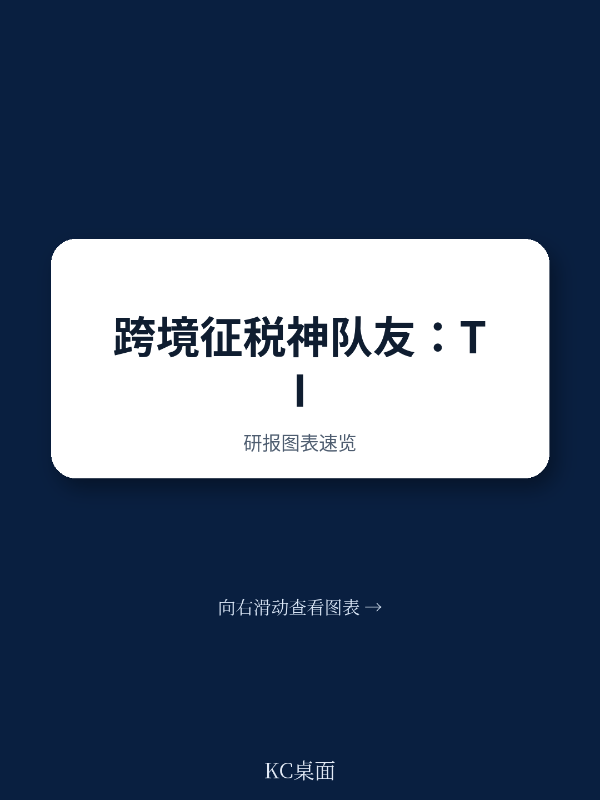
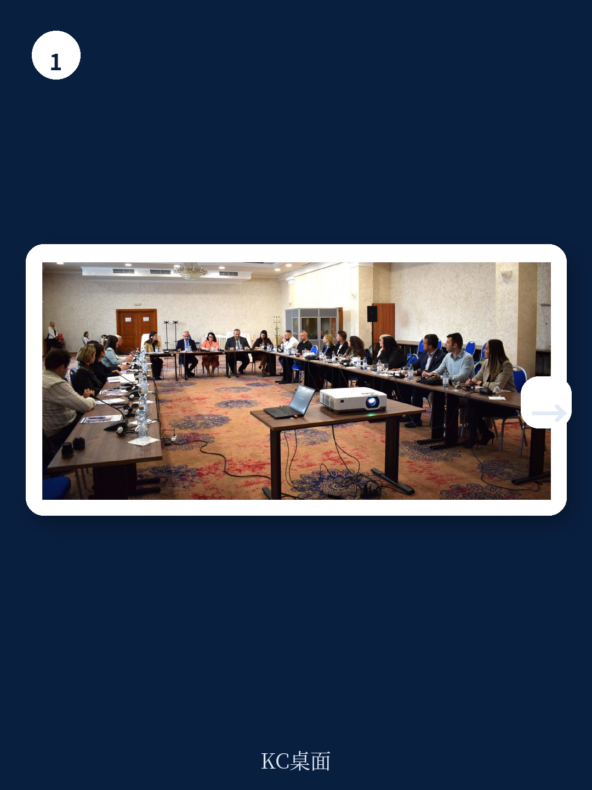
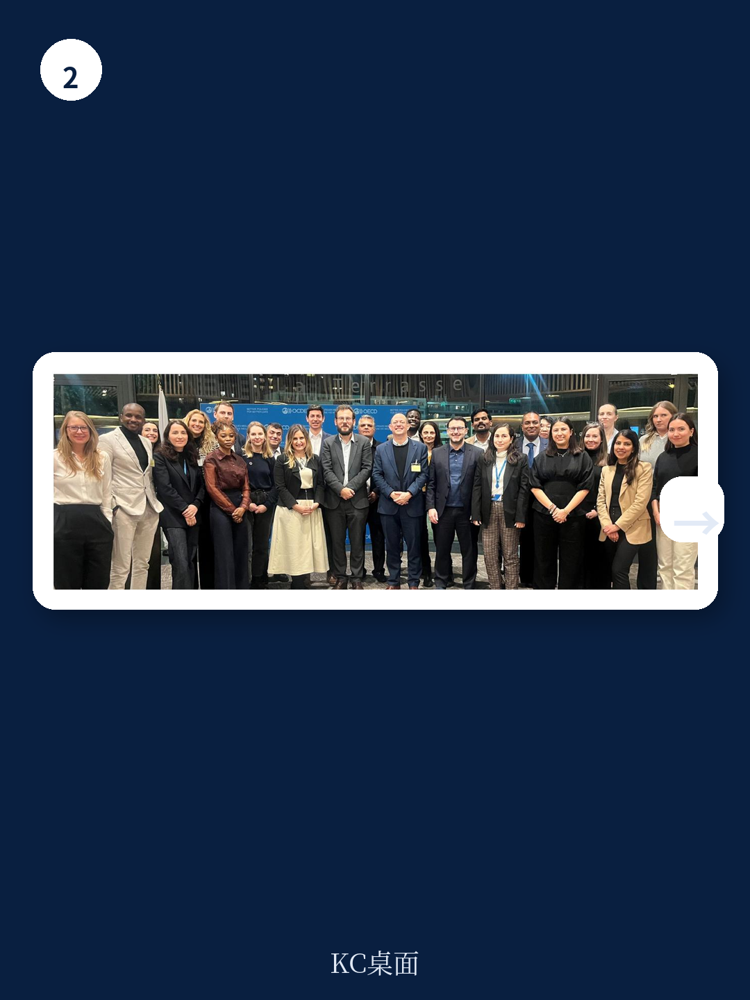

# 经合组织：不是援助故事，经合组织十年帮发展中国家增收27亿美元

全球发展融资正经历一场静默的转向。当官方发展援助（ODA）面临越来越大的预算约束，发展中国家如何在不依赖外部赠款的前提下，为基础设施、教育和公共卫生筹集可持续的财政收入？一份由经合组织（OECD）与联合国开发计划署（UNDP）联合发布的年度报告，提供了一个被长期低估的答案：税务稽查能力建设。

这份名为《无国界税务稽查员（TIWB）2026年度报告》的文件，系统回顾了该倡议自2015年启动以来十年的成果。截至2025年底，TIWB已在71个发展中国家实施了165个援助项目，帮助这些国家额外征收了27.2亿美元的税收，并确认了76.7亿美元的税务评估，同时拒绝了25.3亿美元的亏损结转。更引人注目的是其投入产出比——每投入1美元，就能带来125美元的额外税收。

这不是一个关于“援助”的故事，而是一个关于“能力转移”的叙事。在主权债务压力上升、全球最低税规则落地、数字经济征税需求激增的背景下，TIWB 2.0版本在2025年第四次发展筹资国际会议（FFD4）上正式发布。其核心逻辑正在改变：从发达国家单向“教”发展中国家如何查税，转向构建一个南南合作与三角合作的可持续技术转移网络。

## 1. 这轮变化真正考验的是企业能否把规模转化为议价权

TIWB的起点并不宏大。2015年，OECD和UNDP联合发起这一倡议时，核心想法很简单：把有经验的税务稽查员派到发展中国家，让他们和当地官员一起处理真实的审计案件。不是讲课，不是写报告，而是手把手地查案子。

十年后，这一模式被证明有效。报告显示，TIWB的援助范围已经从最初的转让定价和国际税务审计，扩展到刑事税务调查、金融账户信息自动交换（AEOI）的有效利用、国别报告（CbCR）的实施、税务管理数字化（DTA）、全球最低税（GMT）实施，以及即将启动的数字贸易增值税审计（TIWB-VAT）。

这背后是发展中国家面临的真实困境：跨国企业利用税收规则漏洞转移利润，数字经济的跨境特征让传统税基难以捕捉，而本国的稽查队伍往往缺乏处理复杂国际税务案件的经验和工具。TIWB提供的不是资金，而是“怎么查、查什么、如何追”的方法论。

> **KC评论：** 对于关注新兴市场的投资者和企业来说，这不仅仅是国际组织的内部报告。TIWB项目的扩张意味着一个明确的趋势：发展中国家的税务稽查能力正在加速提升。过去可以依赖的“稽查能力差”这一套利空间，正在系统性缩小。继续阅读完整报告，你会发现不同地区、不同税种的稽查重点差异，以及这些差异对企业合规成本的真实影响。

继续看原文，真正有价值的是报告中的区域分布数据、各项目类型的投入产出对比，以及不同国家在稽查能力建设上的具体案例。完整报告与KC评论在每日汇编中。

## 2. 非洲是最大受益者，但这不是简单的“援助故事”

报告中最突出的地理分布是非洲。截至2025年底，TIWB与非洲税务管理论坛（ATAF）的战略合作已经支持了96个项目，覆盖整个非洲大陆，帮助筹集了超过22亿美元的额外税收。这一数字占TIWB全球总增收金额的80%以上。

但更值得关注的是增收结构。在非洲，TIWB项目的重点领域是转让定价审计和税务犯罪调查。这意味着，这些增收并非来自提高税率或扩大税基，而是来自更有效地识别和追缴跨国企业在本应缴税但未缴的税款。换句话说，这是对现有税收规则的执行效率提升，而非规则本身的改变。

报告特别提到了莱索托、斯威士兰等国家在转让定价和税务犯罪调查能力上的显著提升。这些国家的税务官员在TIWB专家的协助下，不仅完成了具体的审计案件，更重要的是学会了如何建立可持续的内部培训机制和案件管理流程。

> **KC评论：** 对于在非洲运营的跨国企业，这传递了一个清晰信号：税务合规的“灰色地带”正在变窄。过去一些被认为“查不出来”的利润转移安排，现在面临更高的被追缴风险。完整报告中的案例细节——包括具体国家、行业、审计方法和追缴金额——值得CFO和税务总监仔细研究。这些案例揭示了稽查方法论的变化方向，也暗示了未来几年可能面临更大压力的领域。

## 3. 拉美与亚洲：差异化路径与尚未打开的增量空间

非洲之外，TIWB在拉美和亚洲也取得了实质性进展。报告提到秘鲁的国别报告（CbCR）项目、厄瓜多尔的税务稽查能力建设，以及洪都拉斯、埃及和秘鲁在组织改革和自愿合规方面的典型案例。

但这些地区的增收规模远小于非洲。这背后有结构性原因：拉美国家的税收制度相对完善，稽查能力起点较高，TIWB的边际贡献更多体现在技术升级和特定领域（如数字经济征税）的突破；而亚洲地区，尤其是太平洋岛国，受限于经济体量和税务人才储备，TIWB项目的规模效应尚未充分释放。

值得注意的是，TIWB 2.0版本特别强调了“南南合作”和“三角合作”模式。这意味着，未来的专家来源将不再局限于OECD发达成员国，而是越来越多地来自发展中国家内部的“最佳实践者”。这种模式不仅降低了运营成本，更重要的是增强了知识转移的文化适应性和可持续性。

## 4. 全球最低税（GMT）落地：TIWB尚未完全回答的关键问题

2025年，TIWB启动了首个支持全球最低税（GMT）规则实施的项目，北马其顿成为首批受益国。这标志着TIWB从传统的“查逃税”向“管合规”的转型。

但报告在这一领域的论述相对克制。GMT的复杂性在于，它涉及全球范围内跨国企业有效税率的计算、申报和调整，对发展中国家税务部门的技术能力提出了远超传统转让定价的要求。TIWB目前在这一领域的项目数量有限，经验积累尚在初期。

这引出了一个关键问题：当全球最低税规则全面落地后，发展中国家是否具备足够的稽查能力来执行这一规则？如果执行能力不足，GMT可能反而成为发达国家税收收入向发展中国家转移的障碍，而非促进工具。TIWB 2.0能否在GMT领域复制其在转让定价领域的成功，仍有待验证。

## 5. 衡量影响力的新框架：超越增收数字

报告在衡量影响力方面做出了值得关注的尝试。除了传统的增收数字，TIWB还系统性地记录了“超越收入的影响”：组织能力提升、立法框架完善、纳税人自愿合规度提高、审计员信心增强。

报告引用了洪都拉斯、埃及和秘鲁的案例，说明TIWB项目如何推动了税务管理部门的内部改革。例如，在洪都拉斯，TIWB的参与不仅帮助完成了具体的审计案件，还促进了跨部门信息共享机制的建立；在埃及，项目推动了税务审计流程的标准化和数字化。

这一衡量框架的升级，对于评估国际发展项目的长期价值具有重要意义。单纯看增收数字，可能会低估能力建设项目的真实回报，因为能力的提升会在项目结束后持续产生效益。TIWB报告中的这一转向，值得其他发展融资项目借鉴。

> **KC评论：** 对于关注国际发展和政策评估的读者，TIWB报告中的“超越收入的影响力”章节提供了有价值的分析框架。它展示了如何量化组织能力、制度变革和合规文化这类“软性”成果。但这些案例的细节——具体改革措施、实施路径、遇到的阻力——在公开报告中只是点到为止。完整报告中的案例说明和评估方法论，对于从事国际发展、政策研究和企业政府事务的读者，有直接的参考价值。

## 6. 面对ODA收缩，TIWB的可持续性考验

报告坦诚地承认了TIWB面临的现实挑战：在官方发展援助（ODA）持续承压的背景下，如何维持并扩大项目规模？TIWB的运营资金依赖于合作伙伴和捐赠国的自愿捐款，而当前主要发达经济体的财政紧缩趋势，对这类“非核心”援助项目构成了直接威胁。

TIWB 2.0的应对策略是多元化和本地化：扩大南南合作，减少对北方捐赠国的依赖；建立区域专家网络，降低专家部署成本；推动项目管理的数字化，提高运营效率。报告提到，TIWB已经建立了自己的数据流管理系统（TIWB Data Flow），用于监控项目执行情况。

但这些措施能否在ODA收缩的大趋势下维持项目的增长，仍是未知数。报告给出的数据——每投入1美元带来125美元税收——是其最有力的论证，但这一数字能否说服预算紧张的财政部继续拨款，取决于决策者是否将税务能力建设视为“投资”而非“支出”。

## 7. 2026年目标：治理改革与规模化的平衡

报告设立了2026年的关键目标：新成立的TIWB理事会将首次召开会议，强化治理和战略监督；扩大伙伴关系，尤其是在亚洲和拉美地区；推进GMT和数字贸易增值税审计的新项目。

这些目标的设定反映了TIWB 2.0的核心矛盾：一方面，需求的增长要求项目规模化；另一方面，资源的约束要求项目更精准、更高效。治理改革的目的是确保在规模化的过程中不牺牲质量，而伙伴关系的多元化是为了降低对单一资金来源的依赖。

对于读者来说，2026年值得关注的关键指标包括：TIWB在GMT领域的项目数量增长、南南合作专家在总专家中的占比变化、以及非洲以外地区的增收增速。这些指标将揭示TIWB 2.0是否真的实现了从“北向南”到“全球合作”的转型。

---

这份报告的完整版本包含了大量未在本文中展开的内容：各地区的具体项目清单、案例研究的详细细节、税务稽查的方法论框架、以及不同税种项目的投入产出对比。这些信息对于理解全球税务治理的微观机制、评估跨国企业的合规风险、以及判断发展融资的未来方向，都有直接的参考价值。

更多国际信源汇编与评论，扫码交流，每日更新。每日汇编会将单篇报告放回当天的主线叙事中，整理成中文摘要、KC评论和图表合集，便于喂给AI，也便于人工快速扫描市场dynamics。汇集的读者来自头部券商、PE/VC、投行、并购、hedge fund、资管机构、战略咨询、智库等机构，期待与你的交流。

Personal reading notes and learning share only. Not investment advice.
