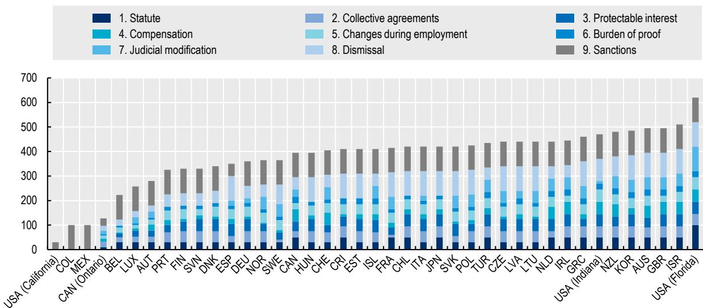
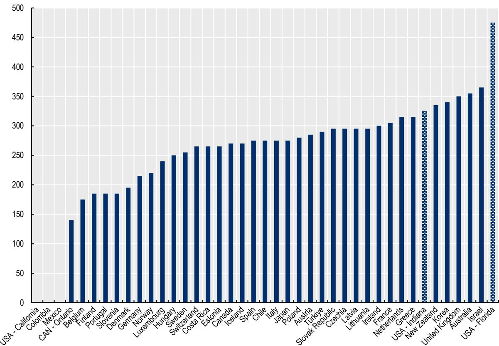
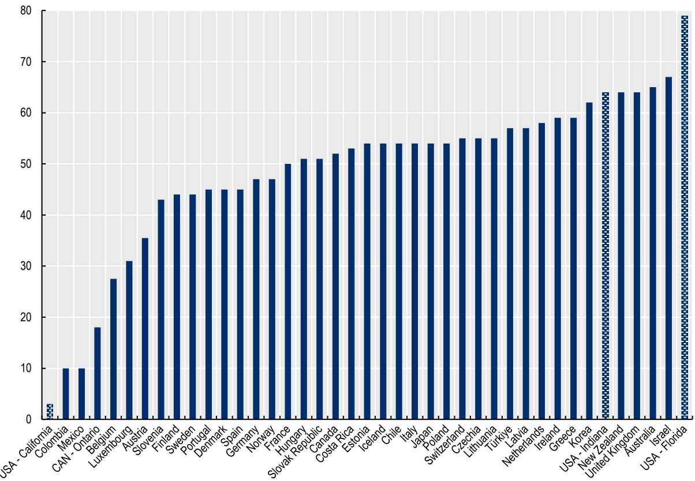

OECD Social, Employment and Migration Working Papers
No. 332

The regulation of non-
compete clauses across
OECD countries

Dan Andrews,

Tito Boeri,

Andrea Garnero,

Sindri Engilbertsson,

Sara Holttinen,

Lorenzo G. Luisetto

https://dx.doi.org/10.1787/88e3eb6e-en

# The regulation of non-compete clauses across OECD countries

JEL classification codes: J41, J62, K31

Dan Andrews (Dan.ANDREWS@oecd.org)

Tito Boeri

Andrea Garnero (Andrea.GARNERO@oecd.org)

Sindri Engilbertsson

Sara Holttinen (Sara.HOLTTINEN@oecd.org)

Lorenzo G. Luisetto

## Disclaimers

This work is issued under the responsibility of the Secretary-General of the OECD and does not necessarily reflect the official views of OECD Member countries.

This document, as well as any data and map included herein, are without prejudice to the status of or sovereignty over any territory, to the delimitation of international frontiers and boundaries and to the name of any territory, city or area.

The statistical data for Israel are supplied by and under the responsibility of the relevant Israeli authorities. The use of such data by the OECD is without prejudice to the status of the Golan Heights, East Jerusalem and Israeli settlements in the West Bank under the terms of international law.

Cover image: © Kjpargeter/Shutterstock.com

© OECD 2026

## Attribution 4.0 International (CC BY 4.0)

This work is made available under the Creative Commons Attribution 4.0 International licence. By using this work, you accept to be bound by the terms of this licence (https://creativecommons.org/licenses/by/4.0).

Attribution – you must cite the work.

Translations – you must cite the original work, identify changes to the original and add the following text: In the event of any discrepancy between the original work and the translation, only the text of original work should be considered valid.

Adaptations – you must cite the original work and add the following text: This is an adaptation of an original work by the OECD. The opinions expressed and arguments employed in this adaptation should not be reported as representing the official views of the OECD or of its Member countries.

Third-party material – the licence does not apply to third-party material in the work. If using such material, you are responsible for obtaining permission from the third party and for any claims of infringement.

You must not use the OECD logo, visual identity or cover image without express permission or suggest the OECD endorses your use of the work.

Any dispute arising under this licence shall be settled by arbitration in accordance with the Permanent Court of Arbitration (PCA) Arbitration Rules 2012. The seat of arbitration shall be Paris (France). The number of arbitrators shall be one.

## Abstract

Non-compete clauses can protect firms' legitimate interests such as trade secrets or training investments, but they can also hinder worker mobility, wage growth, and innovation. Therefore, the way these clauses are regulated is central to balancing business needs with labour market dynamism. This paper provides the first cross-country analysis of non-compete regulatory regimes in OECD countries. It documents the main legal dimensions that govern their enforceability, and it develops a new index that captures regulatory strictness and structure. This extends earlier work on the United States. By systematically mapping these frameworks, the paper helps to fill a significant knowledge gap and supports policymakers in evaluating the effectiveness of current regulations in balancing the protection of firms with the fostering of competitive and innovative labour markets.

# Acknowledgements

This paper has been prepared by Dan Andrews (OECD Economics Department), Tito Boeri (Bocconi University), Sindri Engilbertsson (University of Amsterdam), Andrea Garnero (Employment and Social Affairs Directorate of the OECD), Sara Holttinen (OECD Economics Department), and Lorenzo G. Luisetto (Cleveland State University).

The paper is part of a project on “Non-compete and related clauses in OECD countries” which was made possible thanks to financial support from Coefficient Giving (formerly Open Philanthropy), Canada, New Zealand, Switzerland, and the United Kingdom. Funding from Bocconi University, through the European Research Council (ERC–MARKINDOWN, Grant Agreement No. 101097687) and the MUR PRIN 2022 programme (Project No. 2022JYY7SA), covered the costs for Belgium, Italy, Poland, Portugal, and Sweden.

The authors are grateful to Andrea Bassanini, Stéphane Carcillo, Åsa Johansson, Mark Pearson, Ori Schwartz, Stefano Scarpetta, Ania Thiemann, and Filiz Ünsal for their valuable comments and suggestions. Norman Bishara kindly reviewed an earlier version of this work. They also wish to acknowledge Alice Norga for her invaluable research assistance.

## Table of contents

Disclaimers 2   
Abstract 3   
Acknowledgements 4   
Annex A. Country scoring 36   
Australia 36   
Austria 36   
Belgium 37   
Canada (excluding Ontario) 37   
Canada - Ontario 38   
Chile 38   
Colombia 39   
Costa Rica 39   
Czechia 39   
Denmark 40   
Estonia 40   
Finland 40   
France 41   
Germany 41   
Greece 42   
Hungary 42   
Iceland 42   
Ireland 43   
Israel 43   
Italy 44   
Japan 44   
Korea 44   
Latvia 45   
Lithuania 45   
Luxembourg 45   
Mexico 46   
Netherlands 46   
New Zealand 47   
Norway 47   
Poland 47   
Portugal 48   
Slovak Republic 48

Slovenia 49 Spain 49 Sweden 50 Switzerland 50 Türkiye 51 United Kingdom 51 United States – California 51 United States – Florida 52 United States – Indiana 52
Annex B. Additional figures 54

## Tables

Table 1. The structure of the OECD non-compete index 13  
Table 2. Scoring criteria and weights 16  
Table 3. Heatmap showing breakdown of OECD index scores 20  
Table 4. The regulation of other post-employment restrictive covenants in OECD countries 29

## Figures

Figure 1. Two perspectives on non-compete clauses 9
Figure 2. OECD index scores (0-700) 18

Figure B.1. Scoring using the dimensions and weights of the original Bishara index 54  
Figure B.2. OECD index unweighted 55

## 1. Introduction

Job mobility is essential for fostering dynamic economies. In a competitive labour market, successful firms expand and hire new workers, obsolete ones shrink, while workers change jobs in search of higher wages, better working conditions and benefits, and opportunities. This promotes productivity and economic growth and better matching of workers with suitable jobs. However, job mobility has stalled or declined in most OECD countries (OECD, 2025[1]), and research over the last decade has raised concerns about the role of restrictive covenants in employment contracts, such as non-compete clauses, as one of the factors that, by introducing friction, limit workers' mobility.

Post-employment restrictive covenants, such as non-compete clauses (also known as covenants not to compete), can serve two very different purposes. On the one hand, they can protect legitimate employer interests, such as trade secrets, client lists or investments in training, by addressing “hold-up” problems and encouraging firms to invest in their employees. From this perspective, restraints should be focused on employees with access to sensitive information and be accompanied by compensation or higher wages. Conversely, they can be used to reduce competition in labour and product markets by limiting workers' options, lowering wages, and discouraging job mobility, business start-ups, and the diffusion of knowledge. In practice, this objective can result in the widespread use of non-compete clauses, even among low-skilled workers who have limited access to proprietary information, often without compensation.

The available empirical evidence suggests that non-compete clauses have spread well beyond the set of occupations and sectors where they can be justified as a means of protecting legitimate business interests, such as trade secrets or client relationships (Andrews and Garnero, 2025[2]). The widespread use of non-compete clauses among workers with limited access to proprietary information raises concerns that they may, in some cases, be primarily used to restrict mobility rather than protect investment. In response, regulatory efforts to limit the use of, and enforceability of, non-compete clauses are gaining traction in several countries. While a large body of research has examined non-compete clauses in the United States, supported by detailed regulatory indices and rich datasets, the evidence across OECD countries remains fragmented and incomplete (Andrews and Garnero, 2025[2]). This limits our understanding of how legal frameworks influence the prevalence and impact of non-compete clauses in diverse institutional settings.

This paper addresses this gap by providing the first cross-country analysis of non-compete regimes within the OECD. Building on Bishara's (2011[3]) seminal work, which documented the main legal dimensions governing the use and enforceability of non-compete clauses across US states, this paper develops the first cross-country indicator of the strictness and structure of national regulatory frameworks with respect to non-compete clauses. This also responds to a growing policy interest, as evidenced by recent initiatives in the United States, Australia, Canada, Finland and the Netherlands, which underlines the need for systematic and comparable evidence to inform policy debates.

The regulation of non-compete clauses is central to balancing legitimate business needs with labour market dynamism. Legal frameworks determine the extent to which employers can rely on these clauses and the conditions under which they are enforceable. Well-designed regulation should ensure that non-compete clauses are used only if justified by legitimate business interests, such as the protection of trade secrets or client relationships. It should also ensure that workers are adequately informed of and compensated for the restrictions imposed on their future employment opportunities. In contrast, weak or unclear regulation risks encouraging excessive or inappropriate use, with potentially adverse consequences for job mobility, wage growth, and innovation.

The analysis reveals significant differences in the regulation and enforcement of non-compete clauses across OECD countries. While some countries impose strict limits through bans, wage thresholds, compensation requirements or maximum duration rules, others rely more heavily on judicial discretion or general contract law principles. Most frameworks impose only procedural restrictions, leaving the definition of the actual scope and content of non-compete clauses to negotiations between employers and employees. Surprisingly, enforcement mechanisms remain weak or unclear in many cases. Much of the variation between countries can be explained by the requirements regarding compensation for including a non-compete agreement in an employee's contract, the ability of courts to modify agreements, and the enforceability of a non-compete clause in the event of dismissal.

This paper provides the background to the discussion on the regulation of non-compete clauses in Chapter 5 of the OECD Employment Outlook 2026. It also lays the groundwork for future empirical research into the economic impact of non-compete clauses. It further aims to support policymakers in evaluating whether current regulations strike the right balance between protecting firms' legitimate interests and fostering competitive, innovative and dynamic labour markets.

The remainder of the paper is organised as follows. Section 2 sets out the analytical framework used for assessing non-compete regulation. Section 3 introduces the new OECD index, details the methodology and presents cross-country evidence on the design of non-compete regimes. Section 4 looks into the regulation of other post-employment restrictive covenants. Section 5 concludes by discussing the policy implications and outlining a range of options available to policymakers.

# 2. Design and measurement of non-compete regulatory regimes

Non-compete clauses are contractual provisions, sometimes stand-alone agreements, that restrict an employee's ability to take up certain jobs or entrepreneurial activities after leaving their current employer. These clauses typically specify a time and geographic scope, and they can be introduced either at the point of hiring or at a later stage in the employment relationship. In most countries, such post-employment restraints are recognised by law or case law as a way to serve legitimate business purposes (Figure 1). Indeed, by protecting trade secrets, client information or firm-specific investments in training, non-compete clauses can mitigate so-called “hold-up problems”, whereby firms might otherwise underinvest in costly, irreversible knowledge or training for fear that employees could exploit these investments by leaving to join a competitor or set up a competing business.

However, non-compete clauses can also restrict competition in labour and product markets (Figure 1). By limiting workers' outside options, they reduce bargaining power and hinder wage growth, affecting not only those who change jobs, but also those who remain, as employers face less competitive pressure to raise pay. This also affects productivity growth by discouraging business entry, job mobility and knowledge diffusion. In this context, a key concern is that the widespread use of non-compete clauses may weaken the forces of economic dynamism. It should be noted that the continuous reallocation of jobs and resources is essential for the emergence of innovative firms and efficient worker–firm matches.

Figure 1. Two perspectives on non-compete clauses

## Original intent

\- Protect trade secrets & client relationships

\- Solve hold-up problem when firms make irreversible investments

## Purpose

## Alternative perspective

\- Restrain competitors from hiring workers or employees from creating competing firms

\- Reduce workers' outside options and wage bargaining power

Source: Authors' elaboration

\- Protect trade secrets and client relationship

• Support training investment

## Expected patterns

• High-skilled workers

• Higher training/investment

• Only when enforceable

## Impact

• Private: Efficient contracting

• Public: Supports investment

## Purpose

\- Restrict competition

• Lower hiring and retention costs

## Expected patterns

• Widespread across skills

• Little/no compensation

• Even when unenforceable

## Impact

\- Private: Lower outside options, lower wages, higher profits

• Public: Even when may appear efficient, reduces dynamism

## 2.1 Design of non-compete regulatory regimes

In most countries, non-compete clauses have traditionally been regulated by statute, i.e. legislation, or developed through case law. In both cases, except where they are entirely prohibited, regulators weigh the interests of employers against the right of employees to pursue their chosen occupation. In addition to legitimate employer interests, any restrictions implied by the clauses should be reasonable and should not cause the employee undue hardship or harm the public. $^{1}$ To balance these trade-offs, countries have adopted a variety of regulatory approaches. As discussed by Hyde and Menegatti (2015 $^{[4]}$ ), the regulatory spectrum ranges from “non-enforcers” (e.g. California and some other US states, as well as Chile, Mexico and Argentina, India and Malaysia outside the OECD), to “low enforcers” (e.g. most European Union member states, most common law jurisdictions and Japan, as well as China outside the OECD), to “high enforcers” (e.g. Israel and some US states, such as Florida, as well as Thailand outside the OECD).

The regulatory framework governing non-compete clauses across OECD countries is far more nuanced than the simple distinction between enforceability and unenforceability suggests. In the United States, for instance, states have adopted various policies, such as prohibiting non-compete clauses for certain professions (e.g. healthcare workers) or low-wage employees, capping their duration, penalising overly broad clauses, shifting legal costs to losing employers, requiring advance disclosure of terms and, in some instances, banning them entirely (Bishara and Luisetto, 2025[5]). Such measures are often motivated by concerns such as protecting public access to essential services and preventing non-compete clauses from being misused against workers with limited bargaining power or access to confidential information. Beyond the United States, OECD countries have introduced diverse regulatory approaches. Some require employers to compensate employees for restrictions imposed by non-compete clauses, sometimes tied to income-based thresholds, while others delegate aspects of enforceability to collective bargaining agreements. More broadly, while certain jurisdictions emphasise clear statutory rules that provide legal certainty, others rely on judicial discretion to interpret and enforce non-compete clauses in light of the specific circumstances of each case.

Although the general objectives of safeguarding employer investments and legitimate business interests, as well as workers' freedom to pursue their chosen occupation, are well established, there is little consensus on the most effective regulation of non-compete clauses. Furthermore, non-compete regulatory regimes interact with other institutional settings, such as the enforcement of intellectual property rights (Van Caenegem, 2013[6]; Kolasa, 2018[7]), and other labour market institutions, including the regulation of dismissals (e.g. employment at will versus strict employment protection legislation). In practice, even in highly regulated and rigid labour markets, non-compete regimes may fail to incentivise employers to comply with existing regulations, potentially leading to abuses and the proliferation of ultimately unenforceable non-compete clauses (Starr, Prescott and Bishara, 2020[8]; Boeri, Garnero and Luisetto, 2025[9]).

## 2.2 Previous work

The legal literature documenting differences in the regulation of non-compete clauses across countries is limited (Hyde and Menegatti, 2015[4]). In 2021, the Comparative Labor Law Journal published a special edition (Vol. 42, Issue 3) examining the regulation of non-compete clauses in various countries, including Spain and Portugal (Sousa and Méndez, 2021[10]), the United Kingdom (Cabrelli, 2021[11]), the United States (Dau-Schmidt, Sun and Jones, 2021[12]), Belgium (Hendrickx, 2021[13]), Italy (Menegatti, 2021[14]), and Lithuania (Petrylaitė and Petrylahš, 2021[15]). For practitioners, the Association of Corporate Counsel (ACC, 2018[16]) provides a summary of the law governing non-compete clauses in 14 countries, and law and consulting firms often provide overviews of applicable legislation to inform employers operating globally – see, for example, EY (2015[17]). While these sources are helpful, there is a lack of systematic, cross-country evidence, particularly in the form of quantitative indicators that can effectively summarise differences in the policy mix.

Bishara (2011[3]) first attempted to summarise regulatory regimes in a single index, a concept that was subsequently refined and expanded upon in later papers. By identifying a set of seven recurring key questions and analysing their importance in practice, Bishara created a comparative index (hereafter referred to as the 'Bishara index'), which aimed to rank the strictness of non-compete clause regulation across US jurisdictions. The seven quantifiable dimensions include questions on the types of employer interests that can be protected with a non-compete clause, the extent to which courts can reduce the scope of overly broad non-compete clauses, and the enforceability of non-compete clauses when the employer terminates the employment relationship. See section 3.1 for a detailed discussion. Each dimension is scored between zero and ten (with a higher score indicating laxer requirements for the enforceability of non-compete clauses) and weighted by a factor of either five or ten, according to its importance in practice as determined by Bishara's legal analysis.

All the scoring and summary data have been made publicly available, and subsequent work has extended the index and demonstrated its empirical value and relevance. For instance, Johnson, Lavetti and Lipsitz (2025[18]) expanded the Bishara index to include a dynamic panel of enforceability scores from 1991 to 2014 and showed observable effects on wages, mobility and firm behaviour. See also Hausman and Lavetti (2021[19]) and Lipsitz and Tremblay (2024[20]). Bishara's index and its application in economic research show that translating doctrinal variation into quantifiable measures can provide a robust basis for economic analysis.

The main limitation of the Bishara index is that it only covers the United States, making it country-specific. As discussed above, other OECD countries have legal and institutional features that are not present in the United States, such as minimum compensation thresholds or collective bargaining agreements regulating non-compete clauses.

## 3. The OECD non-compete index

This paper builds on and extends the Bishara index to characterise the diversity of regulation across OECD countries. The extended index considers variation in non-compete regulatory regimes within the OECD. Retaining the original Bishara framework, the new OECD index adds two dimensions: collective agreements and sanctions. It also adjusts the scoring criteria to reflect the wider variety of options across OECD countries. Adjacent areas of law, such as trade secret and patent law, which may influence the use and regulation of restrictive covenants, are excluded unless they are directly tied to the enforceability of such covenants – see, for example, Greenwood, Kobayashi and Starr (forthcoming $^{[21]}$ ).

Data collection followed a three-step process. First, national statutes (where applicable), leading case law, regulatory guidance, academic literature and practitioners' guides were reviewed. Second, this information was distilled into a policy questionnaire addressed to experts in national labour ministries, who validated and supplemented the information necessary for legal coding. Finally, the validated information for the nine key legal dimensions identified above was coded and weighted to produce an index of the stringency of non-compete regulation.

## 3.1 The index structure and the key dimensions

To assess the stringency of non-compete regulation across OECD countries, this paper considers three pillars:

\- First, the regulatory level which refers to the institution responsible for regulating non-compete clauses. Non-compete clauses have traditionally been either regulated by statute or left to judicial development. In some countries, collective bargaining agreements play a role in limiting or expanding the scope of non-compete enforceability.

\- Second, the object of bargaining: what the employer and employee exchange when stipulating a covenant not to compete. The primary justification for the legal enforcement of an employee's promise not to compete is the employer's protectable interests. In contrast, two additional dimensions focus on the employee's perspective, examining what constitutes sufficient justification for restricting their post-employment opportunities. In some countries, the mere initiation or continuation of employment is deemed sufficient consideration for an employee to sign a non-compete agreement. In other countries, however, additional forms of consideration (e.g. financial compensation) are required.

\- Third, the issue of enforcement, which relates to a set of rules that determine the circumstances under which courts are willing to uphold non-compete clauses. If an employer is the plaintiff, they may be required to prove that the non-compete agreement and the procedures surrounding its signing fulfilled certain requirements. In some jurisdictions, courts have the authority to modify overly broad non-compete clauses to make them enforceable. The circumstances surrounding the employee's departure can influence a court's willingness to uphold the agreement. Finally, employers who attempt to enforce unreasonably broad non-compete clauses may face sanctions such as fines or being required to cover the other party's legal fees.

For each pillar, we consider the key dimensions that encapsulate the legal framework and its practical implications. At the regulatory level, we consider the general statutory basis for enforceability and the role of collective agreements. In terms of bargaining, we examine the interests that can be protected by the employer, the compensation requirements and the conditions for introducing a non-compete clause after the employment relationship has begun. Finally, with regard to enforcement, we consider the burden of proof in the event of a dispute, whether a judge can modify overly broad clauses, whether a non-compete clause can be enforced in the event of dismissal and whether sanctions can be imposed for overly broad clauses – see Table 1 for a summary. As mentioned above, seven of these dimensions are from the Bishara Index, updated using a new scoring rubric. The dimensions on collective agreements and sanctions are novel. Together, these dimensions provide a comprehensive overview of how different OECD jurisdictions regulate the enforceability of non-compete clauses.

Table 1. The structure of the OECD non-compete index

<table><tr><td>A. Regulatory level</td><td>B. Object of bargaining</td><td>C. Enforcement</td></tr><tr><td>1. Statute of general applicability</td><td>3. Employer&#x27;s protectable interest</td><td>6. Burden of proof</td></tr><tr><td>2. Role of collective agreements</td><td>4. Compensation</td><td>7. Modifications by courts (so called “blue pencilling”</td></tr><tr><td></td><td>5. Changes during the employment relationship</td><td>8. Enforceability in case of dismissal</td></tr><tr><td></td><td></td><td>9. Sanctions</td></tr></table>

Below is a more detailed description of each of the nine key dimensions:

## 1. Statute of general applicability

The first dimension considers which regulatory body is primarily responsible for overseeing non-compete clauses. Countries generally fall into two main categories: those that leave the enforcement of non-compete clauses entirely to the courts, and those that have specific legislation concerning them (although the courts still have some discretion). Courts typically employ a “reasonableness test” or “proportionality test”, whereby non-compete clauses are deemed reasonable only if the restriction is no greater than is necessary to safeguard the employer’s legitimate business interests and does not excessively limit the employee's freedom to work. Courts consider the geographical scope and nature of the restricted activities (taking into account the employee’s role and the employer’s business activities) as well as the duration of the limitation, taking into account the circumstances of each agreement/employment relationship. In countries where non-compete clauses are regulated by statute, the legislation typically specifies a maximum duration (ranging from six months to five years), whereas the geographical and sectoral scope usually remains subject to a reasonableness test.

## 2. Role of collective agreements

This is the first of two novel index dimensions that are not covered by the Bishara (2011[3]) index. In some OECD countries, collective bargaining agreements influence the enforceability of non-compete clauses. In some cases, collective agreements provide guidance but do not impose any requirements beyond those established at the national level. In other cases, they introduce additional requirements, such as a minimum compensation threshold, that go beyond the scope of case law.

The introduction of this dimension aligns with the practical focus of the index. It accurately reflects the ease of use and enforceability of non-compete clauses across jurisdictions. While collective bargaining agreements play no such role in the United States, they are highly relevant in other countries, such as France and Sweden.

## 3. Employer's protectable interest

In most countries, non-compete clauses are enforceable if the restrictions are considered reasonable, i.e. if they are used to protect legitimate business interests. However, the way in which these interests are defined and interpreted varies from jurisdiction to jurisdiction, resulting in varying degrees of judicial scrutiny regarding the motivations behind employers' use of non-compete clauses. Most OECD countries leave the definition and evaluation of legitimate business interests to the courts on a case-by-case basis, while Belgium, France, Greece, Norway, Poland, Portugal, Sweden and Switzerland require employers to demonstrate that they would suffer financial loss as a result of the former employee's new activities in order to enforce a non-compete agreement.

## 4. Compensation

When it comes to requiring compensation for including a non-compete agreement in an employee's contract, countries can be divided into three main categories:

\- Those that do not require separate economic compensation for non-compete clauses. These countries operate under the assumption that the restriction may be supported by other forms of consideration. In extreme cases, simply being offered the job may be enough to justify the inclusion of a non-compete clause. Examples of these countries include Australia, Austria, Canada, Iceland, Ireland, Israel, the Netherlands, New Zealand, Switzerland, Türkiye and the United Kingdom.

\- Those that require separate financial compensation for non-compete clauses. However, the adequacy of this economic consideration is evaluated alongside the other elements of reasonableness (Chile, Estonia, France, Greece, Italy, Latvia, Luxembourg, Portugal and Spain).

\- Those that require non-compete clauses to be supported by separate financial compensation, establishing a minimum threshold for such consideration, typically calculated as a percentage of the employee's salary (Belgium, Costa Rica, Czechia, Denmark, Finland, Germany, Hungary, Lithuania, Norway, Poland, Slovak Republic, Slovenia and Sweden).

## 5. Changes during employment relationship

In most countries, if a non-compete agreement is not part of the initial employment contract, employees must explicitly consent to signing the agreement at a later stage. In some US states, case law holds that continued employment constitutes sufficient consideration for the validity of a non-compete agreement signed during the employment relationship. In most other countries, non-compete clauses signed later in the employment relationship are generally subject to the same rules and requirements as those signed at the beginning. For example, some countries require fresh mutual consideration (Canada, Ireland, Slovenia and the United Kingdom) or procedural requirements (Luxembourg) to modify the terms of an employment contract, including non-compete clauses.

## 6. Plaintiff burden of proof

Although a written agreement is not always formally required for non-compete clauses to be valid, it is common practice and is often necessary to enforce such restrictions. Furthermore, the burden of proof that employers must satisfy to enforce a non-compete clause is tied to the specific requirements set out in the relevant legislation. For example, if economic compensation is a prerequisite, employers must demonstrate that the compensation provided is adequate given the scope and nature of the restriction. OECD countries can be classified into two groups based on how the burden of proof is structured. In some jurisdictions, the burden of proof is principally limited to satisfying a general reasonableness test (Australia, Canada, Costa Rica, Estonia, Greece, Iceland, Ireland, Israel, Korea, Latvia, the Netherlands, New Zealand, Türkiye and the United Kingdom). In others, it extends beyond reasonableness to encompass additional requirements specified by their regulatory frameworks, such as the specification of sectoral and geographical limits and reasonable compensation (Austria, Belgium, Chile, Czechia, Denmark, Finland, France, Germany, Hungary, Italy, Japan, Lithuania, Luxembourg, Norway, Poland, Portugal, Slovak Republic, Slovenia, Spain, Sweden, and Switzerland).

## 7. Modifications by court (so-called blue pencilling)

This dimension addresses whether courts have the power to modify overly broad non-compete clauses in order to make them enforceable by amending their terms. Allowing courts to modify non-compete agreements that would otherwise be deemed unenforceable increases the risk of overly broad agreements being included in employment contracts, since if challenged, the agreement will be amended instead of being declared void. It is notable that while some countries permit the judicial modification and enforcement of such agreements (Australia, Austria, Czechia, France, Greece, Iceland, Ireland, Israel, Korea, Lithuania, Luxembourg, the Netherlands, New Zealand, Norway, Poland, Slovak Republic, Sweden, Switzerland, Türkiye and the United Kingdom), others do not. Some countries take an intermediate approach, authorising courts to reduce the duration of a non-compete agreement if it exceeds the statutory maximum (Germany, Italy and Spain), or for severance reasons (Canada and Latvia). Australia is an interesting example, as employment contracts there may include “cascading restraints”, whereby various durations or geographic scopes for restrictive covenants are predefined in anticipation that a court might deem the maximum limits to be unenforceable. For instance, an alternative period could be specified, such that if a three-month period were deemed unenforceable, a six-week period would apply instead, ensuring that the entire clause remains valid.

## 8. Enforceability in case of dismissal

The circumstances that lead to the termination of an employment relationship may affect the enforceability of non-compete clauses. The rationale is that if the employer initiates the termination, it can be argued that they either no longer have a legitimate interest to protect, or they have forfeited their investment in the employee's human capital. In practice, countries adopt three distinct approaches:

\- Some jurisdictions do not make the enforceability of non-compete clauses contingent on the reasons for termination of employment (e.g. Australia, Chile, Costa Rica, Czechia, Estonia, France, Greece, Hungary, Israel, Italy, Japan, Korea, Latvia, Lithuania, Poland, Slovak Republic, Spain and the United Kingdom). Employers in these countries may dismiss employees and subsequently enforce non-compete clauses regardless of the circumstances surrounding the separation.

\- Some countries have enacted statutes (or established case law) that explicitly link the enforceability of non-compete clauses to the reasons for termination of employment. Typically, this prevents employers from enforcing non-compete clauses if the employment relationship ends due to termination without good cause, wrongful dismissal or resignation for good cause (Austria, Belgium, Canada, Denmark, Finland, Germany, Iceland, Ireland, the Netherlands, Norway, Portugal, Slovenia, Switzerland and Türkiye).

\- Other countries adopt an intermediate approach whereby courts may consider the reasons for termination when evaluating the reasonableness of a non-compete restriction, even if this is not explicitly required by statute or policy (e.g. New Zealand and Sweden).

## 9. Sanctions

The final dimension, the second of the two novel dimensions, concerns the legal consequences that employers may face if they violate a non-compete clause or attempt to enforce an overly broad provision. In most countries, employers can usually claim damages from employees who breach non-compete clauses, often through predetermined penalty or buyout clauses. They can also seek injunctive relief to prevent employees from joining competing firms or setting up competing businesses. However, employers generally do not face penalties or sanctions for using overly broad, and thus unenforceable, non-compete clauses, even in countries such as Colombia and Mexico, where such clauses are unenforceable. Spain is an exception, as employers may face a fine ranging from EUR751 to EUR7,500 if they attempt to enforce an overly broad non-compete clause that is later deemed unenforceable. Notably, some US states have recently introduced policies requiring employers to pay a penalty, typically ranging from USD 5,000 to USD

10,000, for each attempt to enforce an unenforceable or void non-compete provision (Bishara and Luisetto, 2025[5]).

## 3.2 Scoring and weighting

The scoring and weighting system expands the Bishara index rubric, enabling it to account for variations in each dimension more effectively. For example, if there is a wage threshold that restricts the use of non-compete clauses to higher-paid workers, dimensions 2, 3, 4, 5, 6, 7 and 8 are halved to reflect the fact that they apply only to a subset of workers. Regarding dimension 4 “Compensation” the rubric has been expanded to reflect the variety of minimum compensation requirements that can range from 25% to 100% of the previous wage. Concerning dimension 7, “Modification or blue pencilling”: Some OECD countries only permit blue pencilling for severance or economic considerations, while others only permit it for the duration of the restriction. To capture this, the rubric assigns a 10-point score for judicial modifications to maximum enforceable levels, a 5-point score for broad modifications, a 3-point score for modifications based solely on economic considerations and a 2-point score for modifications limited to duration. The greater the ability of courts to modify the scope of non-compete clauses, the weaker the deterrent for employers drafting excessively broad covenants and the higher the index score. While some discretion will always be involved in assigning scores, a more detailed rubric increases transparency and facilitates replicating the index to other countries.

Table 2 provides each dimension in the form of a question, alongside the criteria and weights used for scoring. The italicised elements reflect the differences with respect to the Bishara index. By adding two new dimensions (collective agreements and sanctions) and updating the scoring rubric, the new OECD index provides a more comprehensive assessment of non-compete regulation, while maintaining continuity with earlier approaches — an important consideration in light of recent and forthcoming policy reforms.

Table 2. Scoring criteria and weights

<table><tr><td>Dimension/Question</td><td>Criteria</td><td>Weight</td></tr><tr><td colspan="3">Regulatory level</td></tr><tr><td>1. Statute of general applicability:Is there a state statute that governs the enforceability of covenants not to compete?</td><td>10 = Yes, favours strong enforcement5 = Yes or no, in either case neutral on enforcement (reasonableness test)3 = Yes, strict reasonableness test or reasonableness test within boundaries set by law [default rule if no evidence]0 = Yes, statute that disfavours enforcementNote: If there is a wage threshold that restricts the use of non-compete clauses to higher-paid workers, dimensions 2, 3, 4, 5, 6, 7 and 8 are halved. In the event of a ban, these dimensions are set to zero.</td><td>10</td></tr><tr><td>2. Role of collective agreements:Do collective agreements play a role in regulating (i.e., restricting or allowing) the use of non-compete clauses?</td><td>10 = Collective agreements allow for a wider use of non-compete clauses than what is foreseen in the law/case law9 = Collective agreements play no role [default rule if no evidence]8 = Collective agreements mention non-compete clauses but simply refer to the law, or the law refers to collective agreements5 = Collective agreements restrict the use of non-compete clauses by setting limits beyond the law/case law, only in some sectors/industries or at the company level2 = Collective agreements restrict the use of non-compete clauses by setting limits beyond the law/case law, in several sectors/widespread0 = Non-compete clauses are unenforceable</td><td>5</td></tr><tr><td colspan="3">Consideration</td></tr><tr><td>3. Employer's protectable interest:What is an employer's protectable interest and how is it defined?</td><td>10 = Broadly defined protectable interest5 = Balanced approach to protectable interest (legitimate business interests) [default rule if no evidence]4 = Proprietary interest (e.g., trade secrets, confidential info, customer lists)3 = Legitimate/proprietary interest, and employer likely to suffer actual harm if employee engages in competitive activities0 = Strictly defined, limiting the protectable interest of the employer</td><td>10</td></tr><tr><td>4. Compensation:Does the signing of a covenant not to compete at the inception of the employment relationship provide sufficient consideration to support the covenant?</td><td>10 = Yes, start of employment always sufficient to support any non-compete (compensation is not formally required, so start of employment sufficient)5 = Start of employment is sometimes sufficient (specific compensation is not required, but other forms of consideration are necessary) [default rule if no evidence]4 = Specific compensation is required3 = Specific compensation is required, and a minimum threshold for such economic consideration is established (lower than 40% of the previous wage)2 = Specific compensation is required, and a minimum threshold for such economic consideration is established (between 40% and 60% of the previous wage)1 = Specific compensation is required, and a minimum threshold for such economic consideration is established (above 60% of the previous wage)0 = Nothing supports the application of a non-compete</td><td>5</td></tr><tr><td>5. Changes during employment relationship:Will a change in the terms and conditions of employment provide sufficient consideration to support a covenant not to compete entered into after the employment relationship has begun? Will continued employment provide sufficient consideration to support a covenant not to compete entered into after the employment relationship has begun?</td><td>10 = Continued employment always sufficient to support any non-compete (employers can change working conditions unilaterally)8 = No specified circumstances, but employees need to agree to sign the agreement [default rule if no evidence]5 = Only change in terms sufficient to support any non-compete (e.g., fresh mutual considerations)0 = Neither continued employment nor change in terms sufficient to support any non-compete (i.e., nothing supports a non-compete entered after the employment relationship has begun)</td><td>5</td></tr><tr><td colspan="3">Enforcement</td></tr><tr><td>6. Burden of proof:What must the plaintiff be able to show to prove the existence of an enforceable covenant not to compete?</td><td>10 = Weak burden of proof on plaintiff (employer)5 = Balanced burden of proof on plaintiff (Non-compete must be reasonable) [default rule if no evidence]3 = Non-compete must be reasonable, within certain boundaries set by the regulatory framework (including wage thresholds)1 = Non-compete must be reasonable, and employers must have complied with procedural requirements (such as duties to provide adequate information or timing requirements prior to signature)0 = Strong burden of proof on plaintiff (i.e., non-compete clauses are not enforceable)</td><td>5</td></tr><tr><td>7. Judicial modification:If the restrictions in the covenant not to compete are unenforceable because they are overbroad, are the courts permitted to modify the covenant to make the restrictions narrower and to make the covenant enforceable (so called “blue pencilling”)? If so, under what circumstances will the courts allow reduction and what form of reduction will the courts permit?</td><td>10 = Judicial modification allowed, broad circumstances and restrictions to maximum enforcement allowed5 = Blue pencil allowed, balanced circumstances and restrictions to middle ground of allowed enforcement3 = Blue pencil allowed for severance/economic consideration2 = Blue pencil allowed only for duration of the restriction0 = Blue pencil or modification not allowed [default rule if no evidence]</td><td>10</td></tr><tr><td>8. Dismissal:If the employer terminates the employment relationship, is the covenant enforceable?</td><td>10 = Enforceable if employer terminates [default rule if no evidence]8 = Enforceable if employer terminates but courts consider the circumstances of dismissals to evaluate the reasonableness5 = Enforceable in some circumstances (wrongful dismissals or if employer terminates without good cause or if employee quits with good cause)0 = Not enforceable if employer terminates</td><td>10</td></tr><tr><td>9. Sanctions:If the restrictions in the covenant not to compete are unenforceable because they</td><td>10 = Employers are not subject to sanctions if they use unenforceable non-compete clauses [default rule if no evidence]5 = Employers are subject to mild sanctions if they use unenforceable non-compete clauses</td><td>10</td></tr></table>

<table><tr><td>are overbroad, are employers subject to sanctions?</td><td>0 = Employers are subject to severe sanctions if they use unenforceable non-compete clauses</td></tr></table>

Note: The italicised elements reflect the differences with respect to the Bishara index (Bishara, 2011[3]).

## 3.3 Overview of country scores

Figure 2 shows the country scores for all OECD countries in 2025 – the rationale behind the scoring for each country is available in Annex A. The United States is represented by three states $^{2}$ : Florida (the least regulated), California (the most regulated) and Indiana (the median). Out of a maximum score of 700, which indicates the full enforceability of non-compete clauses for firms, the scores range from 100 in Colombia and Mexico, where non-compete clauses are prohibited and violators face no sanctions, to 510 in Israel, which adopts a relatively permissive stance towards enforceability.

While the exact scores change, the ranking of most countries using the new OECD index is fully consistent with that obtained using the components and weights of the original Bishara index (rank correlation between the two indices is 0.93 – see Annex B). Austria, France, Luxembourg and Spain are the main exceptions (i.e. their rank goes down by more than five positions), due to the relevance of the new dimensions incorporated into the OECD index and the new scoring rubric. Specifically, in Austria and Luxembourg, given the presence of a wage threshold that restricts the use of non-compete clauses to higher-paid workers, dimensions 3, 4, 5, 6, 7 and 8 are halved. In France, collective agreements play a major role in the regulation of non-compete clauses. In Spain, employers are subject to an obligation to pay damages if a non-compete clause fails to meet minimum requirements. Annex B also provides the unweighted results which have a rank correlation of 0.97 with the weighted results.

Figure 2. OECD index scores (0-700)  
Higher values indicate stronger legal enforceability of non-compete clauses, i.e. more favourable to companies.  

Note: The index measures the restrictiveness of non-compete agreement regulations on a 0-700 scale, where higher scores indicate more employer-friendly (restrictive) environments. Scores are calculated from nine regulatory dimensions: The OECD index scores nine legal dimensions: (1) Statutory regulation (whether legislation governs non-competes and, if so, the maximum duration, and geographic and sectoral scope) with weight 10; (2) Collective agreements (whether sectoral or firm-level CBAs add limits or conditions beyond law) with weight 5; (3) Employer's protectable interest (how broadly “legitimate interests” are defined) with weight 10; (4) Compensation (if monetary compensation is required and any minimum threshold) with weight 5; (5) Changes during employment (whether a new clause after hiring needs fresh consideration) with weight 5; (6) Burden of proof (the elements that an employers needs to bring an employee to court) with weight 5; (7) Judicial modification, also called “blue pencilling” (courts’ power to narrow overbroad clauses) with weight 10; (8) Dismissal (if the clause can be used even in the case of dismissal) with weight 10; (9) Sanctions (whether employers face penalties for using unenforceable clauses) with weight 10. Where there is a wage threshold that restricts the use of non-compete clauses to higher-paid workers, dimensions 2, 3, 4, 5, 6, 7 and 8 are halved. In the event of a ban, these dimensions are set to zero. The score for Canada excludes the province of Ontario which is evaluated separately.

Figure 2 shows that most OECD countries have more stringent regulations on non-compete clauses than the median US state, Indiana. Only Israel, the United Kingdom, Australia, Korea and New Zealand have a more lenient regulation than the median US state. In addition, it is to be noted that the Australian government has announced that from 2027 it will ban non-compete clauses for low- and middle-income employees earning less than the high-income threshold in the Fair Work Act 2009 (currently \$183,100 and adjusted annually on 1 July). This reform would make Australia one of the OECD countries with the strictest regulations. Similarly, in the spring 2026, Canada proposed a bill restricting the use of non-compete clauses to executive positions with some exceptions. This restriction would apply to workers in federally regulated sectors (e.g. banking, telecommunications and transports).

Beyond the aggregate scores, Table 3 provides a heatmap showing how countries compare across individual dimensions – more details are available in Annex A. The results demonstrate a general alignment in the definition of the legal framework, whether through statutory provisions or reasonableness tests based on case law, in specifying legitimate employer interests and in allocating the burden of proof to plaintiffs. Notably, only Spain imposes sanctions when companies use overly broad clauses. By contrast, larger cross-country differences emerge in relation to compensation requirements, the role of collective agreements, and enforceability in the event of dismissal

Table 3. Heatmap showing breakdown of OECD index scores

<table><tr><td>Country</td><td>Statutory regulation(0 = low enforcement to 10 = strong enforcement)</td><td>Collective agreements(0 = ban the use of non-compete clauses to 10 = wider than law)</td><td>Employer's interest(0 = strictly defined to 10 = broadly defined)</td><td>Compensation(0 = always to 10 = never)</td><td>Changes during employment(0 = never possible to 10 = always possible)</td><td>Burden of proof0 = strong to 10 = weakf</td><td>Judicial modification(0 = not allowed and 10 = allowed and wide margins)</td><td>Enforce. on dismissal(0 = never to 10 = always)</td><td>Sanctions(0 = severe to 10 = none)</td></tr><tr><td>United States - California</td><td>0</td><td>0</td><td>0</td><td>0</td><td>0</td><td>0</td><td>0</td><td>0</td><td>3</td></tr><tr><td>Colombia</td><td>0</td><td>0</td><td>0</td><td>0</td><td>0</td><td>0</td><td>0</td><td>0</td><td>10</td></tr><tr><td>Mexico</td><td>0</td><td>0</td><td>0</td><td>0</td><td>0</td><td>0</td><td>0</td><td>0</td><td>10</td></tr><tr><td>CAN - Ontario</td><td>1</td><td>4.5</td><td>0</td><td>2.5</td><td>2.5</td><td>1</td><td>1.5</td><td>2</td><td>3</td></tr><tr><td>Belgium</td><td>3</td><td>4</td><td>1.5</td><td>1</td><td>4</td><td>1.5</td><td>0</td><td>2.5</td><td>10</td></tr><tr><td>Luxembourg</td><td>3</td><td>4.5</td><td>2.5</td><td>2</td><td>2.5</td><td>1.5</td><td>2.5</td><td>2.5</td><td>10</td></tr><tr><td>Austria</td><td>3</td><td>4.5</td><td>2.5</td><td>5</td><td>4</td><td>1.5</td><td>2.5</td><td>2.5</td><td>10</td></tr><tr><td>Finland</td><td>3</td><td>9</td><td>4</td><td>2</td><td>8</td><td>3</td><td>0</td><td>5</td><td>10</td></tr><tr><td>Portugal</td><td>3</td><td>8</td><td>3</td><td>4</td><td>8</td><td>3</td><td>0</td><td>5</td><td>10</td></tr><tr><td>Slovenia</td><td>3</td><td>9</td><td>5</td><td>3</td><td>5</td><td>3</td><td>0</td><td>5</td><td>10</td></tr><tr><td>Denmark</td><td>3</td><td>9</td><td>5</td><td>2</td><td>8</td><td>3</td><td>0</td><td>5</td><td>10</td></tr><tr><td>Spain</td><td>3</td><td>5</td><td>5</td><td>4</td><td>8</td><td>3</td><td>2</td><td>10</td><td>5</td></tr><tr><td>Germany</td><td>3</td><td>9</td><td>5</td><td>2</td><td>8</td><td>3</td><td>2</td><td>5</td><td>10</td></tr><tr><td>Norway</td><td>3</td><td>9</td><td>3</td><td>1</td><td>8</td><td>3</td><td>5</td><td>5</td><td>10</td></tr><tr><td>Sweden</td><td>3</td><td>2</td><td>3</td><td>2</td><td>8</td><td>3</td><td>5</td><td>8</td><td>10</td></tr><tr><td>Canada</td><td>5</td><td>5</td><td>4</td><td>10</td><td>5</td><td>5</td><td>3</td><td>5</td><td>10</td></tr><tr><td>Hungary</td><td>3</td><td>9</td><td>5</td><td>3</td><td>8</td><td>3</td><td>0</td><td>10</td><td>10</td></tr><tr><td>Switzerland</td><td>3</td><td>8</td><td>3</td><td>10</td><td>8</td><td>3</td><td>5</td><td>5</td><td>10</td></tr><tr><td>Costa Rica</td><td>5</td><td>9</td><td>4</td><td>2</td><td>8</td><td>5</td><td>0</td><td>10</td><td>10</td></tr><tr><td>Estonia</td><td>3</td><td>9</td><td>5</td><td>4</td><td>8</td><td>5</td><td>0</td><td>10</td><td>10</td></tr><tr><td>Iceland</td><td>3</td><td>8</td><td>5</td><td>5</td><td>8</td><td>5</td><td>5</td><td>5</td><td>10</td></tr><tr><td>France</td><td>5</td><td>2</td><td>3</td><td>4</td><td>8</td><td>3</td><td>5</td><td>10</td><td>10</td></tr><tr><td>Chile</td><td>5</td><td>9</td><td>5</td><td>4</td><td>8</td><td>3</td><td>0</td><td>10</td><td>10</td></tr><tr><td>Italy</td><td>3</td><td>9</td><td>5</td><td>4</td><td>8</td><td>3</td><td>2</td><td>10</td><td>10</td></tr><tr><td>Japan</td><td>5</td><td>9</td><td>5</td><td>4</td><td>8</td><td>3</td><td>0</td><td>10</td><td>10</td></tr><tr><td>Slovak Republic</td><td>3</td><td>5</td><td>5</td><td>2</td><td>8</td><td>3</td><td>5</td><td>10</td><td>10</td></tr><tr><td>Poland</td><td>3</td><td>9</td><td>3</td><td>3</td><td>8</td><td>3</td><td>5</td><td>10</td><td>10</td></tr><tr><td>Türkiye</td><td>5</td><td>9</td><td>5</td><td>5</td><td>8</td><td>5</td><td>5</td><td>5</td><td>10</td></tr><tr><td>Czechia</td><td>3</td><td>9</td><td>5</td><td>2</td><td>8</td><td>3</td><td>5</td><td>10</td><td>10</td></tr><tr><td>Latvia</td><td>3</td><td>9</td><td>5</td><td>4</td><td>8</td><td>5</td><td>3</td><td>10</td><td>10</td></tr><tr><td>Lithuania</td><td>3</td><td>9</td><td>5</td><td>2</td><td>8</td><td>3</td><td>5</td><td>10</td><td>10</td></tr><tr><td>Netherlands</td><td>5</td><td>5</td><td>5</td><td>10</td><td>8</td><td>5</td><td>5</td><td>5</td><td>10</td></tr><tr><td>Ireland</td><td>5</td><td>9</td><td>5</td><td>10</td><td>5</td><td>5</td><td>5</td><td>5</td><td>10</td></tr><tr><td>Greece</td><td>5</td><td>9</td><td>3</td><td>4</td><td>8</td><td>5</td><td>5</td><td>10</td><td>10</td></tr><tr><td>United States - Indiana</td><td>5</td><td>9</td><td>5</td><td>10</td><td>10</td><td>5</td><td>1</td><td>9</td><td>10</td></tr><tr><td>New Zealand</td><td>5</td><td>9</td><td>4</td><td>10</td><td>8</td><td>5</td><td>5</td><td>8</td><td>10</td></tr><tr><td>Korea</td><td>5</td><td>9</td><td>5</td><td>5</td><td>8</td><td>5</td><td>5</td><td>10</td><td>10</td></tr><tr><td>Australia</td><td>5</td><td>8</td><td>4</td><td>10</td><td>8</td><td>5</td><td>5</td><td>10</td><td>10</td></tr><tr><td>United Kingdom</td><td>5</td><td>9</td><td>5</td><td>10</td><td>5</td><td>5</td><td>5</td><td>10</td><td>10</td></tr><tr><td>Israel</td><td>5</td><td>9</td><td>5</td><td>10</td><td>8</td><td>5</td><td>5</td><td>10</td><td>10</td></tr><tr><td>United States - Florida</td><td>10</td><td>9</td><td>5</td><td>10</td><td>10</td><td>5</td><td>10</td><td>10</td><td>10</td></tr></table>

Note: The OECD index scores nine legal dimensions on a 0-10 scale where higher scores indicate more employer-friendly (restrictive) environments: (1) Statutory regulation (whether legislation governs non-competes and, if so, the maximum duration, and geographic and sectoral scope); (2) Collective agreements (whether sectoral or firm-level CBAs add limits or conditions beyond law); (3) Employer's protectable interest (how broadly "legitimate interests" are defined); (4) Compensation (if monetary compensation is required and any minimum threshold); (5) Changes during employment (whether a new clause after hiring needs fresh consideration); (6) Burden of proof (the elements that an employers needs to bring an employee to court); (7) Judicial modification, also called "blue pencilling" (courts' power to narrow overbroad clauses); (8) Dismissal (if the clause can be used even in the case of dismissal); (9) Sanctions (whether employers face penalties for using unenforceable clauses). Where there is a wage threshold that restricts the use of non-compete clauses to higher-paid workers, dimensions 2, 3, 4, 5, 6, 7 and 8 are halved. In the event of a ban, these dimensions are set to zero. See Annex A for more details on the scoring of each dimension in each country.

Looking more closely at how countries compare in each dimension: $^{3}$

\- Statute of general applicability: On a scale from 0 (disfavours enforcement) to 10 (favours strong enforcement), Australia, Chile, Costa Rica, France, Greece, Ireland, Israel, Japan, Korea, Netherlands, $^{4}$ New Zealand, Türkiye, and the United Kingdom – countries without statutory regulation or with loose statutes – adopt a neutral approach to enforcement based on a reasonableness test and are therefore assigned a score of 5. Countries that either apply a strict reasonableness test without a statutory framework (Canada) or enforce a reasonableness test within statutory boundaries (such as Austria, Belgium, Czechia, Denmark, Estonia, Finland, Germany, Hungary, Iceland, Italy, Latvia, Lithuania, Luxembourg, Norway, Poland, Portugal, Slovak Republic, Slovenia, Spain, Sweden, Switzerland) are assigned a score of 3. Overall, as a general pattern, countries with statutory regulation tend to adopt a stricter approach to enforcement, at least in principle.

\- Role of collective agreements: On a scale from 0 (collective agreements ban the use of non-compete clauses) to 10 (collective agreements allow the use of non-compete clauses when the law or case law are more restrictive), most countries are assigned a score of 9 because there is no evidence of collective bargaining agreements playing a role in shaping the enforceability of non-compete clauses. Australia, Iceland and Switzerland slightly differ (hence a score of 8) because some collective agreements are found to provide guidance but do not impose any requirements beyond those established at the national level. Belgium is also assigned a score of 8 because the law allows collective agreements to regulate non-compete clauses for employees earning between EUR 43,106 and EUR 86,212 (it is unclear in practice whether these agreements are more restrictive than national legislation). Canada, Netherlands, Slovak Republic, and Spain are assigned a score of 5 because collective agreements in these countries impose additional limitations on the use of non-compete clauses beyond those established by statutory law or case law, though typically only in certain sectors, industries, or at the company level. By contrast, France and Sweden are assigned a score of 2 due to the widespread and sector-wide role of collective agreements in further restricting the use of non-compete clauses by setting limitations that go beyond existing legal or case law frameworks.

\- Employer's protectable interest: There is little heterogeneity in how employer's legitimate protectable interests are defined. Thus, on a scale from 0 (strictly defined protectable interest) to 10 (broadly defined protectable interest), Australia, Austria, Chile, Czechia, Denmark, Estonia, Germany, Hungary, Iceland, Ireland, Israel, Italy, Japan, Korea, Latvia, Lithuania, Luxembourg, Netherlands, Slovak Republic, Slovenia, Spain, Türkiye, and the United Kingdom adopt a balanced approach and are assigned a score of 5. A score of 4 is assigned to Canada, Costa Rica, Finland (only real proprietary interests qualify for protection) and New Zealand (the employer must demonstrate that the legitimate business interest cannot be safeguarded through less restrictive means). Belgium, France, Greece, Norway, Poland, Portugal, Sweden and Switzerland explicitly mandate that the employer must suffer actual damages from competition, hence an assigned score of 3.

\- Compensation: On a scale from 0 (the start of employment is never sufficient to support any non-compete agreement) to 10 (the start of employment is always sufficient to support any non-compete agreement), the following countries are assigned a score of 10: Australia, Austria,

Canada, Iceland, Ireland, Israel, the Netherlands, New Zealand, Switzerland, Türkiye and the United Kingdom. This is because compensation is not formally required and the start of employment is sufficient consideration. Korea is assigned a score of 5 because compensation is not mandatory, but it is a key factor considered by courts in assessing enforceability. Meanwhile, Chile, Estonia, France, Greece, Italy, Japan, Latvia, Luxembourg, Portugal and Spain were assigned a score of 3, as a minimum level of compensation is required (the adequacy of this economic consideration is evaluated alongside the other elements of the reasonableness test). Belgium, Costa Rica, Czechia, Denmark, Finland, Germany, Hungary, Lithuania, Norway, Poland, Slovak Republic, Slovenia and Sweden are assigned a score of 2, as a minimum threshold for such economic consideration has been established.

\- Change in terms/continued employment sufficient consideration: The vast majority of countries are assigned a score of 8 because introducing the agreement at a later stage necessitates the employee's signature. By contrast, Canada, Ireland, Luxembourg, Slovenia and the United Kingdom are assigned a score of 5, as a fresh mutual consideration or procedural requirements to change contractual terms are needed to include a non-compete clause.

\- Plaintiff burden of proof: On a scale from 0 (strong burden of proof on the plaintiff) to 10 (weak burden of proof on the plaintiff), Austria, Belgium, Chile, Czechia, Denmark, Finland, France, Germany, Hungary, Italy, Japan, Lithuania, Luxembourg, Norway, Poland, Portugal, Slovak Republic, Slovenia, Spain, Sweden and Switzerland are assigned a score of 3. The burden of proof extends beyond reasonableness to encompass additional requirements specified by their regulatory frameworks, such as the specification of sectoral and geographical limits, and the provision of reasonable compensation. Australia, Canada, Costa Rica, Estonia, Greece, Iceland, Ireland, Israel, Korea, Latvia, the Netherlands, New Zealand, Türkiye and the United Kingdom are assigned a score of 5, as the burden of proof is principally limited to satisfying a general reasonableness test.

\- Judicial modification: Belgium, Chile, Costa Rica, Denmark, Estonia, Finland, Hungary, Japan, Slovenia and Portugal are assigned a score of 0 on a scale from 0 to 10 (where 0 means judicial modification is not allowed and 10 means judicial modification is allowed with broad circumstances and restrictions to maximum enforcement). This is because courts are not permitted to modify or enforce overbroad non-compete clauses. Australia, Austria, Czechia, France, Greece, Iceland, Ireland, Israel, Korea, Lithuania, Luxembourg, the Netherlands, New Zealand, Norway, Poland, Slovak Republic, Sweden, Switzerland, Türkiye and the United Kingdom are assigned a score of 5 because courts can enforce overbroad non-compete clauses, balancing the circumstances of each case. Canada and Latvia were assigned a score of 3, as courts can modify economic aspects of non-compete clauses. Meanwhile, Germany, Italy and Spain were assigned a score of 2, as judicial intervention is confined to reducing the duration of a non-compete agreement if it exceeds the statutory maximum. Overall, the judicial approach varies significantly across countries.

\- Enforceability in case of dismissal: Australia, Chile, Costa Rica, Czechia, Estonia, France, Greece, Hungary, Israel, Italy, Japan, Korea, Latvia, Lithuania, Poland, Slovak Republic, Spain and the United Kingdom are assigned a score of 10 on a scale from 0 (unenforceable if the employer terminates) to 10 (enforceable if the employer terminates). This is because the enforceability of non-compete clauses is not contingent upon the reasons for the termination of employment. Austria, Belgium, Canada, Denmark, Finland, Germany, Iceland, Ireland, the Netherlands, Norway, Portugal, Slovenia, Switzerland and Türkiye were assigned a score of 5, as the enforceability of non-compete clauses is linked to the reason for termination of the employment relationship. $^{5}$ This typically prevents employers from enforcing non-compete clauses if the employment relationship ends due to termination without good cause, wrongful dismissal or resignation for good cause. Sweden and New Zealand were assigned a score of 8, as courts may consider the reason for termination when evaluating the reasonableness of a non-compete restriction, even if this is not explicitly required by statute or policy. Overall, countries differ in their approach to the connection between the enforceability of non-compete clauses and the reasons for the end of the employment relationship.

\- Sanctions: On a scale from 0 to 10, where 0 means that employers are subject to severe sanctions if they use unenforceable non-compete clauses and 10 means that employers are not subject to sanctions, Spain is the only country that requires employers to pay a fine if a non-compete agreement fails to meet minimum legal requirements. This earns Spain a score of 5. The other countries in this sample, including Mexico and Colombia, are assigned a score of 10, as the use of overly broad non-compete clauses is not sanctioned.

## 3.4 Main takeaways and limitations

The index has a number of limitations. Despite the cross-country analysis drawing on a wide range of legal sources, such as national statutes (where applicable), leading case law, regulatory guidance, academic literature and practitioners' guides, as well as a validation process via national experts, it is unavoidable that certain institutional factors, such as judicial attitudes (particularly in lower courts), are difficult to capture. This means that regulatory frameworks which appear to take a more permissive approach towards the enforceability of non-compete clauses may, in practice, prove relatively more restrictive. Furthermore, as previously discussed, non-compete regulatory regimes may interact with adjacent institutional and legal settings, such as the enforcement of intellectual property rights, as well as broader structural features of labour markets. Finally, this index is designed to capture the legal enforceability of non-compete clauses, but it does not provide evidence about the practical use or prevalence of such clauses in the labour market. Nor does it provide information about the actual capacity of courts (or the broader legal framework) to encourage compliance among employers and employees. In the United States, for example, Starr et al. (2021[22]) found little difference in the use of non-compete clauses between states that do and do not enforce these provisions.

Despite these limitations, the OECD index builds on Bishara's (2011[3]) pioneering work to identify the main causes of regulatory divergence that affect the enforceability of non-compete clauses in practice. In addition to clarifying and generalising the scoring rubric, the new index introduces novel elements, thereby broadening its scope and applicability beyond the US. This enables the index to capture both established and emerging factors that shape the regulation of non-compete clauses. Bishara and Luisetto (2025[5]) demonstrate that a new wave of non-compete reforms began in the United States in 2015, coinciding with a surge in interest from academic researchers and policymakers. Within the US, states have implemented various policies, including prohibiting the enforcement of non-compete clauses against certain workers (e.g. healthcare professionals or low-wage employees), restricting the maximum duration of such clauses, imposing penalties for overly broad clauses, shifting legal costs to employers who lose related lawsuits and requiring employers to disclose non-compete terms at the time of hiring. Some states have even banned non-compete clauses altogether.

In other OECD countries, the most prevalent policy observed is the imposition of maximum duration limits, particularly in civil law countries. Additionally, several countries have introduced policies to ensure workers receive economic compensation, often subject to a minimum threshold based on salary, in exchange for accepting non-compete clauses. These compensation-based approaches can be seen as an alternative to, or a complement to, policies that prohibit the enforcement of non-compete clauses against low-wage workers. Overall, the limited overlap among existing regulatory interventions highlights opportunities to further nuance the discussion on the optimal degree and type of regulation of non-compete clauses.

# 4. The regulation of other post-employment restrictive covenants

In addition to non-compete clauses, employers use various contractual measures to restrict their employees' conduct after the end of the employment relationship. One such tool is the 'garden leave' arrangement, whereby employees remain on the employer's payroll (usually at full salary) while being excused from active duties and prohibited from working for competitors. While this practice is permitted in most countries, certain jurisdictions (including Belgium, Costa Rica, Italy, Mexico, Portugal and Spain) prohibit employers from requiring employees to abstain from work during the notice period, even if they continue to receive pay – see Table 4. This is because such arrangements would infringe upon the individual's right to work.

More generally, employers also rely on a variety of post-employment restrictive covenants designed to protect confidential information and other investments in the employment relationship. These include:

\- Non-disclosure agreements (NDAs), which establish that sensitive information obtained by an employee during their employment will not be made available to any other employer;

\- Non-solicitation agreements, which prevent employees from recruiting their former colleagues in their new business.

\- Non-solicitation of clients, which prevent employees from soliciting or otherwise attempting to establish any business relationship with the company's clients or customers after leaving the company.

\- Repayment of training costs agreements, whereby employees agree to repay the costs of training courses paid for by the employer if they leave their employment within a certain period of time.

\- Forfeiture of benefits/bonuses, whereby employees lose eligibility for benefits or bonuses if they leave employment within a specified timeframe.

Countries typically apply reasonableness standards to these post-employment restrictive covenants that are similar to those used for non-compete clauses – see Table 4. In some cases, these standards may be relaxed if the covenant imposes fewer restrictions on the employee. For example, non-disclosure agreements and non-solicitation clauses restrict certain post-employment activities, but do not limit an individual's ability to seek new employment or business opportunities overall. For instance, French courts have clarified that, unlike non-compete clauses, non-disclosure agreements do not require economic consideration. Regarding non-solicitation, Swiss courts tend to distinguish between company-specific business relationships and those tied to an employee's personal skills or knowledge.

With regard to the forfeiture of benefits or bonuses, it is generally accepted that, across countries, agreements may make the receipt of bonuses conditional upon the employee's continued service. While countries rarely impose additional requirements beyond those already established for non-compete clauses, the repayment of training costs is specifically regulated in some jurisdictions. In Belgium, for instance, training repayment clauses are only permitted in open-ended employment contracts and are subject to the same wage thresholds as non-compete clauses (i.e. a clause is not valid if an employee's salary is below EUR 43,106 in 2025). In Germany, repayment of training costs is only permitted if certain conditions are met, such as the employee having a reasonable expectation of career advancement and the repayment period being limited to situations within the employee's control, such as culpable discontinuation of training or employer-initiated termination for conduct-related reasons. Similar requirements are imposed in Czechia, Denmark, Latvia, Lithuania, the Netherlands, Poland, Portugal, Slovak Republic and Spain.

Table 4. The regulation of other post-employment restrictive covenants in OECD countries

<table><tr><td></td><td>Garden leave</td><td>Non-disclosure</td><td>Non-solicitation of co-workers/colleagues/clients</td><td>Repayment of training</td><td>Repayment of bonuses</td></tr><tr><td>Australia</td><td>Permissible (express clause or implied)</td><td>Enforceable if not overly broad</td><td>Enforceable if reasonable in scope/duration</td><td>Enforceable if written, employee-benefiting, reasonable amount</td><td>Not expressly regulated</td></tr><tr><td>Austria</td><td>Enforceable</td><td>Enforceable if clearly defined and reasonable</td><td>Enforceable under general contract law</td><td>Enforceable only under strict statutory conditions (written, specific costs)</td><td>Not expressly regulated</td></tr><tr><td>Belgium</td><td>Generally prohibited (constitutional freedom to work)</td><td>Enforceable for reasonable period</td><td>Reasonableness test like non-compete clauses</td><td>Enforceable with strict conditions (open-ended contract, =80hrs, not statutorily required)</td><td>Agreements may require continued service</td></tr><tr><td>Canada (excl. Ontario)</td><td>Enforceable if clearly drafted and reasonable</td><td>Enforceable; less restrictive covenant</td><td>Enforceable if reasonable</td><td>Enforceable in some circumstances</td><td>Subject to inquiry; cannot constitute a penalty</td></tr><tr><td>Canada Ontario</td><td>Legal but must be precisely drafted and reasonable</td><td>Same as in the rest of Canada</td><td>Same as in the rest of Canada</td><td>Same as in the rest of Canada</td><td>Same as in the rest of Canada</td></tr><tr><td>Chile</td><td>Not expressly regulated</td><td>Enforceable per general contract law</td><td>Assessed like non-competes (reasonableness/proportionality)</td><td>Not expressly regulated</td><td>Not expressly regulated</td></tr><tr><td>Colombia</td><td>Permissible</td><td>Enforceable; potentially indefinite period</td><td>Not enforceable post-employment (constitutional right)</td><td>Not expressly regulated</td><td>Not expressly regulated</td></tr><tr><td>Costa Rica</td><td>Not admissible</td><td>Enforceable for reasonable period</td><td>Enforceable if reasonable</td><td>Compensation possible if minimum service breached</td><td>Not enforceable if detrimental to employee</td></tr><tr><td>Czechia</td><td>Not explicitly regulated but permissible</td><td>Enforceable during and after employment</td><td>Enforceable if reasonable, proportionate, written</td><td>Enforceable under Section 234/235 Labour Code</td><td>Enforceable under general contract principles</td></tr><tr><td>Denmark</td><td>Not expressly regulated</td><td>Enforceable; must define parties and info</td><td>Enforceable under Act on Restrictive Covenants</td><td>Enforceable if proportionate to benefit</td><td>Not expressly regulated</td></tr><tr><td>Estonia</td><td>Not expressly regulated</td><td>Enforceable under general contract law</td><td>Enforceable under general contract law</td><td>Enforceable only if beyond ordinary training and primarily benefits employee</td><td>Not expressly regulated</td></tr><tr><td>Finland</td><td>Enforceable</td><td>Enforceable if not overly broad</td><td>General contract law principles</td><td>Enforceable if doesn't reduce statutory rights</td><td>Not expressly regulated</td></tr><tr><td>France</td><td>Permitted during notice with compensation</td><td>Enforceable if not limiting post-employment opportunities</td><td>Same requirements as non-compete (limited time/scope)</td><td>Permitted via dédit-formation if employer pays and agreement pre-training</td><td>Legitimate if distinct from normal pay and aimed at retention</td></tr><tr><td>Germany</td><td>No prohibition; employer interest must outweigh employee's</td><td>Unlimited NDAs invalid; must be bounded</td><td>Reasonableness test like non-competes</td><td>Generally permitted with numerous requirements</td><td>Future-loyalty benefits can be conditioned on continued employment</td></tr><tr><td>Greece</td><td>Enforceable (Art. 65 Law 4808/2021)</td><td>Enforceable</td><td>Enforceable; assessed like non-competes</td><td>Enforceable with strict proportionality/fairness</td><td>Enforceable with strict proportionality/fairness</td></tr><tr><td>Hungary</td><td>Enforceable (70(1) Labour Code)</td><td>Enforceable under general contract law</td><td>Enforceable but case-by-case</td><td>Enforceable if proportional to elapsed contract term</td><td>Not expressly regulated</td></tr><tr><td>Iceland</td><td>Not expressly regulated</td><td>Enforceable under general contract law</td><td>Enforceable under general contract law</td><td>Not expressly regulated</td><td>Not expressly regulated</td></tr><tr><td>Ireland</td><td>Enforceable if satisfies common-law reasonableness test</td><td>Enforceable if protects legitimate business interest</td><td>Enforceable if reasonable</td><td>Enforceable under contractual principles</td><td>Not expressly regulated</td></tr><tr><td>Israel</td><td>Enforceable if employee remains formally employed with full salary</td><td>Enforceable under general contract law</td><td>Enforceable if reasonable and necessary</td><td>Not expressly regulated</td><td>Not expressly regulated</td></tr><tr><td>Italy</td><td>Not enforceable</td><td>Enforceable if clearly defined and proportionate</td><td>Enforceable if clearly drafted and proportionate</td><td>Enforceable if supported by genuine employer investment</td><td>Not explicitly regulated</td></tr><tr><td>Japan</td><td>Enforceable</td><td>Enforceable if defines info and consequences</td><td>Reasonableness test like non-competes</td><td>Cannot deduct from salary; can sue for breach if minimum service agreed</td><td>Not expressly regulated</td></tr><tr><td>Korea</td><td>No prohibition</td><td>Enforceable; no time limit required</td><td>Enforceable under reasonableness test</td><td>Not expressly regulated</td><td>Not expressly regulated</td></tr><tr><td>Latvia</td><td>Permissible if doesn't worsen employee's position</td><td>Enforceable under 83 Labour Code</td><td>Enforceable if clearly drafted and proportionate</td><td>Enforceable if work-related and adds value beyond job needs</td><td>Not expressly regulated</td></tr><tr><td>Lithuania</td><td>Not regulated in Labour Code</td><td>Enforceable under Art. 39 Labour Code</td><td>Enforceable; assessed like non-competes</td><td>Enforceable under Art. 37 (only expenses beyond ordinary job needs)</td><td>Enforceable if not conflicting with Art. 142 entitlements</td></tr><tr><td>Luxembourg</td><td>Enforceable</td><td>Enforceable if clearly defined and proportionate</td><td>Enforceable if clearly drafted and proportionate</td><td>Enforceable but not unlimited</td><td>Enforceable under Art. L. 542-15 (only on resignation or serious misconduct)</td></tr><tr><td>Mexico</td><td>Same as non-compete</td><td>Enforceable</td><td>Unenforceable (same as for non-compete clauses)</td><td>Not expressly regulated</td><td>Not expressly regulated</td></tr><tr><td>Netherlands</td><td>Enforceable only within narrow limits (consent or serious justification)</td><td>Enforceable under general restrictive-covenant rules</td><td>Generally enforceable under same rules</td><td>Compulsory-training costs not recoverable (since Aug 2022); only non-compulsory</td><td>Not expressly regulated</td></tr><tr><td>New Zealand</td><td>'Leave in lieu of notice' used; not in legislation</td><td>Enforceable</td><td>Enforceable if legitimate interest, reasonable, no broader than necessary</td><td>Legitimate if reasonable and proportionate</td><td>Enforceable if pre-agreed</td></tr><tr><td>Norway</td><td>Enforceable</td><td>Enforceable</td><td>Enforceable if statutory requirements met</td><td>Enforceable if training not legally mandated</td><td>Enforceable under general contract law</td></tr><tr><td>Poland</td><td>Explicitly permitted since 2016 Labour Code amendment</td><td>Enforceable if reasonable, specific, not against public interest</td><td>Enforceable under reasonableness test</td><td>Legitimate; employee cannot be obligated to stay &gt;3 years (Art. 1035)</td><td>Not expressly regulated</td></tr><tr><td>Portugal</td><td>Cannot be imposed unilaterally</td><td>Enforceable for reasonable period</td><td>Not specifically regulated; reasonableness applies</td><td>Enforceable up to 3 years (Art. 137 Labour Code); employee canbuy out</td><td>Loss on dismissal not allowed; minimum-service condition islegitimate</td></tr><tr><td>Slovak Republic</td><td>Not explicitly regulated</td><td>Enforceable if clearly defined and proportionate</td><td>Not explicitly regulated</td><td>Enforceable if in writing (155(1) Labour Code)</td><td>Not explicitly regulated</td></tr><tr><td>Slovenia</td><td>Cannot be unilaterally imposed; 100% pay if no work (except after criminal conviction)</td><td>Enforceable under general contract law</td><td>Enforceable; case-by-case under general contract law</td><td>Case-by-case under general principles</td><td>Case-by-case under general principles</td></tr><tr><td>Spain</td><td>Not permissible</td><td>Enforceable if reasonable, specific, not against public interest</td><td>Reasonableness test like non-competes</td><td>Not regulated; retention clauses allowed</td><td>Not expressly regulated</td></tr><tr><td>Sweden</td><td>Employee retains pay during notice (Section 12, 1982 Employment Protection Act)</td><td>Enforceable by mutual agreement</td><td>Enforceable if reasonable to protect legitimate interests</td><td>Enforceable; similar conditions to non-competes</td><td>Not expressly regulated</td></tr><tr><td>Switzerland</td><td>Common in dismissals during notice period</td><td>Enforceable case-by-case</td><td>Same rules as non-compete; courts distinguish by client choice</td><td>Must meet certain requirements</td><td>Not expressly regulated</td></tr><tr><td>Türkiye</td><td>Not regulated; no statutory right but possible if agreed</td><td>Enforceable under general contract law</td><td>Not expressly regulated; assessed under general principles</td><td>Enforceable; similar conditions to non-competes</td><td>Not specifically regulated</td></tr><tr><td>United Kingdom</td><td>Limited to notice period; courts can reduce duration if unreasonable</td><td>Enforceable for protecting confidential information</td><td>Reasonableness test; more easily enforceable than non-competes</td><td>Enforceable if proportionate and within actual expenditure</td><td>Future-loyalty benefits can be conditional; discretionary bonuses legitimate if exercised rationally and in good faith</td></tr><tr><td>United States - California</td><td>Likely violates B&amp;P Code 16600</td><td>Enforceable</td><td>Co-worker non-solicit void under 16600; client only on sale of business</td><td>Enforceable if voluntary; cannot withhold wages</td><td>Permissible in voluntary plans with vesting tied to employment</td></tr><tr><td>United States - Florida</td><td>Enforceable if reasonable in scope (paid during restriction)</td><td>Enforceable</td><td>Enforceable if protects legitimate interests; distinguishes direct solicitation from client-initiated contact</td><td>Enforceable as liquidated damages, not as penalties</td><td>Enforceable if in original terms or supported by industry custom</td></tr><tr><td>United States - Indiana</td><td>Not specifically addressed; likely enforceable under general principles</td><td>Enforceable</td><td>Enforceable for client/customer goodwill</td><td>Must reasonably relate to actual costs; physicians restricted under IC 25-22.5-5.5-1.4 (from 1 July 2025)</td><td>Depends on present wages (not forfeitable) vs deferred compensation (forfeitable)</td></tr></table>

Note: The information reported in the table refers to 2025.

## 5. Concluding remarks

This paper presents a novel cross-country index of non-compete regulations in OECD countries. The analysis reveals significant differences in the legal enforceability of non-compete clauses. While some jurisdictions impose strict limits or outright bans, others adopt a more permissive approach, placing few obligations on employers beyond requiring a signed agreement.

Importantly, the index reveals that, even within broad typologies such as “low enforcers” or “high enforcers”, there is considerable variation in specific rules and safeguards. Although there is broad convergence in the definition of legal frameworks, legitimate business interests and the burden of proof, countries diverge sharply on compensation requirements, the role of collective agreements, judicial discretion, the treatment of dismissals and sanctions. Compared with US states, many of which have historically adopted more permissive regimes, OECD countries tend to regulate non-compete clauses more stringently, particularly through compensation thresholds and clear duration limits. However, the actual use of non-compete clauses and judicial practices may differ from the formal rules, and the prevalence of non-compete clauses across OECD countries may be less diverse than the regulatory index suggests.

This analysis has identified a wide range of options available to policymakers aiming to regulate non-compete clauses. These options vary in intensity and scope, ranging from complete prohibition to targeted measures that balance legitimate business interests with the need to protect worker mobility and labour market dynamism. They can be grouped into the following categories:

\- Outright bans: Full prohibition of non-compete clauses.

\- Sector-specific regulations: Targeted unenforceability in professions where non-compete clauses are deemed contrary to the public interest (e.g. healthcare).

\- Wage thresholds: Exemption of workers below certain income levels, such as the minimum wage or other defined benchmarks.

\- Minimum compensation requirements: Obligations to provide financial compensation, often with a defined threshold based on the employee's salary, in exchange for signing a non-compete.

• Maximum duration rules: Limits on enforceability beyond a specified period.

\- Procedural requirements: Duties to provide advance notice, disclose terms before signature, or restrict enforceability to contracts signed at hiring.

\- Change-of-terms requirements: Obligations that post-hiring non-compete clauses must be accompanied by material changes in employment, such as higher pay or promotion.

\- Judicial modification limits: Restrictions on courts' ability to modify and enforce overbroad clauses.

\- Termination-related restrictions: Limits on enforceability following dismissals, particularly those without just cause.

\- Sanctions and litigation cost-shifting: Penalties for employers who impose overreaching clauses and shifting of legal costs where they fail in enforcement attempts.

The prevalence of maximum duration rules, particularly in civil law jurisdictions, is notable as it is the most common safeguard currently in place. In contrast, compensation-based approaches, wage thresholds and sector-specific prohibitions are less widespread. However, they have featured prominently in recent US reforms and emerging initiatives in some European countries (Andrews and Garnero, 2025[2]).

Looking ahead, policymakers have scope to experiment with and combine these policy levers in ways that fit their institutional context. Future research should provide new evidence on the use and enforcement of non-compete clauses, with the aim of evaluating the effectiveness of different approaches in reducing undue constraints on worker mobility while ensuring that employers retain appropriate tools to protect legitimate proprietary interests. The index developed in this paper provides a basis for such evaluations by offering a comparable, cross-country framework. Ultimately, the challenge lies in designing regulatory regimes that strike a balance between fostering labour market dynamism and supporting firms' incentives to invest in knowledge, innovation and training.

## References

ACC (2018), Multi-Country Survey on Covenants Not to Compete., https://www.gtlaw.com/-/media/files/insights/alerts/2017/12/covenants-not-to-compete.pdf?rev=469ba96eb7fb47358ac9d5325242a375.

Andrews, D. and A. Garnero (2025), “Five facts on non-compete and related clauses in OECD countries”, OECD Economics Department Working Papers, No. 1833, OECD Publishing, Paris, https://doi.org/10.1787/727da13e-en.

Bishara, N. (2011), “Fifty ways to leave your employer: relative enforcement of covenants not to compete, trends, and implications for employee mobility policy.”, University of Pennsylvania Journal of Business Law, Vol. 13/3, pp. 751-795.

Bishara, N. and L. Luisetto (2025), Goodbye, Noncompetes? Why Now and Policy Convergence, Elsevier BV, https://doi.org/10.2139/ssrn.5345981.

Boeri, T., A. Garnero and L. Luisetto (2025), “Noncompete agreements in a rigid labor market: the case of Italy”, The Journal of Law, Economics, and Organization, Vol. 41/3, pp. 930-958, https://doi.org/10.1093/jleo/ewae012.

Cabrelli, D. (2021), “Regulating restrictive covenants in english employment law: Time for a rethink?”, Comp. Lab. L. & Pol'y J., Vol. 42/3.

Dau-Schmidt, K., X. Sun and P. Jones (2021), “The American Experience with Employee Non-Compete Clauses: Constraints on Employees Flourish and Do Real Damage in the Land of Economic Liberty.”, Comp. Lab. L. & Pol'y J., Vol. 42/3.

EY (2015), Labor & Employment Law Newsletter - The restrictive covenants..

Greenwood, B., B. Kobayashi and E. Starr (forthcoming), “Can You Keep a Secret? Banning Noncompetes Does Not Increase Trade Secret Litigation”, Journal of Law, Economics, and Organization.

Hausman, N. and K. Lavetti (2021), “Physician Practice Organization and Negotiated Prices: Evidence from State Law Changes”, American Economic Journal: Applied Economics, Vol. 13/2, pp. 258-296, https://doi.org/10.1257/app.20180078.

Hendrickx, F. (2021), “Non-compete obligations in employment relations from a belgian legal perspective.”, Comp. Lab. L. & Pol'y J., Vol. 42/3.

Hyde, A. and E. Menegatti (2015), “Legal protection for employee mobility”, in Comparative Labor Law, Edward Elgar Publishing, https://doi.org/10.4337/9781781000137.00014.

Johnson, M., K. Lavetti and M. Lipsitz (2025), “The Labor Market Effects of Legal Restrictions on Worker Mobility”, Journal of Political Economy, Vol. 133/9, pp. 2735-2793, https://doi.org/10.1086/736217.

Kolasa, M. (2018), Trade Secrets and Employee Mobility, Cambridge University Press, https://doi.org/10.1017/9781108545921.

Lipsitz, M. and M. Tremblay (2024), “Noncompete Agreements and the Welfare of Consumers”, American Economic Journal: Microeconomics, Vol. 16/4, pp. 112-153, https://doi.org/10.1257/mic.20210426.

Menegatti, E. (2021), “Non-Compete Covenants under Italian Law.”, Comp. Lab. L. & Pol'y J., Vol. 42/3.

OECD (2025), “Reviving growth in a time of workforce ageing: The role of job mobility”, in OECD Employment Outlook 2025: Can We Get Through the Demographic Crunch?, OECD Publishing, Paris.

Petrylaitė, D. and V. Petrylahš (2021), “Non-compete clauses in Lithuanian labor law.”, Comp. Lab. L. & Pol’y J., Vol. 42/3. [15]

Sousa, D. and L. Méndez (2021), “Employment non-compete clauses in a Portuguese and Spanish context: Contribution from the Iberian model”, Comp. Lab. L. & Pol'y J, Vol. 42/3.

Starr, E., J. Prescott and N. Bishara (2021), “Noncompete Agreements in the US Labor Force”, [22] The Journal of Law and Economics, Vol. 64/1, pp. 53-84, https://doi.org/10.1086/712206.

Starr, E., J. Prescott and N. Bishara (2020), “The Behavioral Effects of (Unenforceable) Contracts”, The Journal of Law, Economics, and Organization, Vol. 36/3, pp. 633-687, https://doi.org/10.1093/jleo/ewaa018.

Van Caenegem, W. (2013), “Employee Know-How, Non-compete Clauses and Job Mobility across Civil and Common Law Systems”, International Journal of Comparative Labour Law and Industrial Relations, Vol. 29/Issue 2, pp. 219-238, https://doi.org/10.54648/ijcl2013015.

## Annex A. Country scoring

Australia

<table><tr><td>Dimension/Question</td><td>Short answer</td><td>Score</td></tr><tr><td>1. Statute of general applicability</td><td>No statute regulates the use of non-compete agreements in Australia (except New South Wales, which regulates the use of non-competes by law). There is no federal statute regulating non-compete agreements.</td><td>5</td></tr><tr><td>2. Role of collective agreements</td><td>Preliminary evidence indicates that a minor fraction of collective agreements may play a limited role in regulating the use of non-compete agreements.</td><td>8</td></tr><tr><td>3. Employer&#x27;s protectable interest</td><td>A non-compete clause is void and unenforceable, unless the employer has a “real proprietary interest” (such as trade secrets, confidential information, and customer lists).</td><td>4</td></tr><tr><td>4. Compensation</td><td>Compensation is not formally required.</td><td>10</td></tr><tr><td>5. Change in terms/continued employment sufficient consideration</td><td>No specified circumstances, but employees need to agree to sign the agreement.</td><td>8</td></tr><tr><td>6. Plaintiff burden of proof</td><td>Non-compete must be reasonable</td><td>5</td></tr><tr><td>7. Modification or blue pencil</td><td>Courts cannot amend or modify overly broad non-competes but may sever the unreasonable parts, while enforcing the remainder (except in New South Wales, where courts may modify overbroad restraints to render them reasonable).</td><td>5</td></tr><tr><td>8. Enforceability in case of dismissal</td><td>No connection between enforceability and termination of the employment relationship</td><td>10</td></tr><tr><td>9. Sanctions</td><td>There are no explicit penalties, fines or other sanctions for employers using overly broad or unenforceable agreements.</td><td>10</td></tr></table>

## Austria

<table><tr><td>Dimension/Question</td><td>Short answer</td><td>Score</td></tr><tr><td>1. Statute of general applicability</td><td>In Austria, the use of non-compete agreements in employment relationships is expressly regulated by statute, primarily by Section 36 and 37 of the Austrian Employees Act (Angestelltengesetz). A non-compete clause is admissible only where the employee is of legal age at the time of signing the employment contract and where the employee's remuneration in the last month of employment exceeds the statutory minimum threshold (2025: EUR 4300).</td><td>3</td></tr><tr><td>2. Role of collective agreements</td><td>No indication of collective agreements playing a role</td><td>4.5</td></tr><tr><td>3. Employer's protectable interest</td><td>A non-compete clause is void and unenforceable, unless the employer has a legitimate business interest</td><td>2.5</td></tr><tr><td>4. Compensation</td><td>Compensation is not formally required.</td><td>5</td></tr><tr><td>5. Change in terms/continued employment sufficient consideration</td><td>No specified circumstances, but employees need to agree to sign the agreement.</td><td>4</td></tr><tr><td>6. Plaintiff burden of proof</td><td>Non-compete must be reasonable, within certain boundaries set by the regulatory framework.</td><td>1.5</td></tr><tr><td>7. Modification or blue pencil</td><td>Blue pencil allowed, balanced circumstances and restrictions to middle ground of allowed enforcement.</td><td>2.5</td></tr><tr><td>8. Enforceability in case of dismissal</td><td>Enforceable in some circumstances (unenforceable if the employer, through culpable conduct, has given the employee justifiable cause to resign or terminate the employment relationship).</td><td>2.5</td></tr><tr><td>9. Sanctions</td><td>There are no explicit penalties, fines or other sanctions for employers using overly broad or unenforceable agreements.</td><td>10</td></tr></table>

## Belgium

<table><tr><td>Dimension/Question</td><td>Short answer</td><td>Score</td></tr><tr><td>1. Statute of general applicability</td><td>Article 65, § 1, and Article 86, § 1, Employment Contracts Act. Maximum duration 12 months.</td><td>3</td></tr><tr><td>2. Role of collective agreements</td><td>The Belgian Employment Contracts Act expressly refers collective bargaining agreements to regulate non-compete clauses under some circumstances. However, only a few joint committees have stipulated a collective agreement regulating non-compete clauses.</td><td>4</td></tr><tr><td>3. Employer&#x27;s protectable interest</td><td>The covenant must cover similar activities (in terms of the type of business, as well as based on the employee&#x27;s occupation and tasks performed). By exploiting special knowledge, peculiar to, and acquired in that enterprise, there must be a possibility that the enterprise is harmed.</td><td>1.5</td></tr><tr><td>4. Compensation</td><td>Specific compensation is required, and a minimum threshold for such economic consideration is established (50% of gross salary).</td><td>1</td></tr><tr><td>5. Change in terms/continued employment sufficient consideration</td><td>No specified circumstances, but employees need to agree to sign the agreement.</td><td>4</td></tr><tr><td>6. Plaintiff burden of proof</td><td>Non-compete must be reasonable, within certain boundaries set by the regulatory framework (including wage thresholds).</td><td>1.5</td></tr><tr><td>7. Modification or blue pencil</td><td>Blue pencil or modification not allowed.</td><td>0</td></tr><tr><td>8. Enforceability in case of dismissal</td><td>Article 65, § 2 of the Employment Contracts Act provides that a non-compete is unenforceable if the contract is terminated either during the first six months from the commencement of the employment contract or, after such period, by the employer without urgent cause on the part of the employee, or by the employee due to urgent cause on the part of the employer.</td><td>2.5</td></tr><tr><td>9. Sanctions</td><td>Employers are not subject to sanctions if they use unenforceable non-compete clauses.</td><td>10</td></tr></table>

## Canada (excluding Ontario)

<table><tr><td>Dimension/Question</td><td>Short answer</td><td>Score excl. Ontario</td></tr><tr><td>1. Statute of general applicability</td><td>No federal statute regulates the use of non-compete clauses in Canada (two out of the ten Canadian provinces regulate the use of non-compete clauses by law, see separate score for Ontario).</td><td>5</td></tr><tr><td>2. Role of collective agreements</td><td>Preliminary evidence indicates that some collective agreements may play a role in regulating the use of non-compete clauses at the company level.</td><td>5</td></tr><tr><td>3. Employer's protectable interest</td><td>A non-compete clause is void and unenforceable, unless the employer has a “real proprietary interest” (such as trade secrets, confidential information, and customer lists).</td><td>4</td></tr><tr><td>4. Compensation</td><td>Compensation is not formally required.</td><td>10</td></tr><tr><td>5. Change in terms/continued employment sufficient consideration</td><td>There must be a new “fresh mutual consideration”.</td><td>5</td></tr><tr><td>6. Plaintiff burden of proof</td><td>Non-compete must be reasonable.</td><td>5</td></tr><tr><td>7. Modification or blue pencil</td><td>Courts generally do not amend or modify an ambiguous or overly broad non-compete; however, courts have sometimes accepted that “blue-pencil” severance may be applied in limited circumstances.</td><td>3</td></tr><tr><td>8. Enforceability in case of dismissal</td><td>Courts have ruled that when an employer commits a repudiatory breach of an employment contract (e.g. a wrongful dismissal), the employee will be released from the obligations of a non-compete clause.</td><td>5</td></tr><tr><td>9. Sanctions</td><td>(Except for Ontario), there are no explicit penalties, fines or other sanctions for employers using overly broad or unenforceable agreements.</td><td>10</td></tr></table>

## Canada – Ontario

<table><tr><td>Dimension/Question</td><td>Short answer</td><td>Ontario</td></tr><tr><td>1. Statute of general applicability</td><td>The Working for Workers Act, 2021 (Bill 27), prohibits from including non compete agreements in employment contracts for all non-C-level employees (CEOs, CFOs, COOs, or equivalent senior leaders). The only exception is in the case of sale of business.</td><td>1</td></tr><tr><td>2. Role of collective agreements</td><td>No indication of collective agreements playing a role.</td><td>4.5</td></tr><tr><td>3. Employer&#x27;s protectable interest</td><td>The protectable interests are very narrowly defined and limited to the case of C-level executives.</td><td>0</td></tr><tr><td>4. Compensation</td><td>Compensation is not formally required.</td><td>2.5</td></tr><tr><td>5. Change in terms/continued employment sufficient consideration</td><td>There must be a new “fresh mutual consideration”.</td><td>2.5</td></tr><tr><td>6. Plaintiff burden of proof</td><td>Non-compete must be reasonable.</td><td>1</td></tr><tr><td>7. Modification or blue pencil</td><td>Before the ban, courts generally did not amend or modify an ambiguous or overly broad non-compete; however, courts have sometimes accepted that “blue-pencil” severance may be applied in limited circumstances.</td><td>1.5</td></tr><tr><td>8. Enforceability in case of dismissal</td><td>If the employer dismisses the CEO without proper notice or without just cause, Ontario courts generally will not enforce a non-compete clause. If the employer properly terminates the CEO (e.g., provides full statutory and common-law notice, or has valid cause), the non-compete clause may still be enforceable but remains subject to strict scrutiny.</td><td>2</td></tr><tr><td>9. Sanctions</td><td>Violations can lead to administrative monetary penalties under the statute&#x27;s enforcement regime.</td><td>3</td></tr></table>

## Chile

<table><tr><td>Dimension/Question</td><td>Short answer</td><td>Score</td></tr><tr><td>1. Statute of general applicability</td><td>No statute regulates the enforceability of non-compete agreements in Chile. Chilean courts have established certain criteria for their enforceability.</td><td>5</td></tr><tr><td>2. Role of collective agreements</td><td>No indication of collective agreements playing a role.</td><td>9</td></tr><tr><td>3. Employer&#x27;s protectable interest</td><td>A non-compete clause is void and unenforceable, unless the employer has a “legitimate business interest” (such as trade secrets, confidential information, and customer lists).</td><td>5</td></tr><tr><td>4. Compensation</td><td>Specific compensation is required.</td><td>4</td></tr><tr><td>5. Change in terms/continued employment sufficient consideration</td><td>No specified circumstances, but employees need to agree to sign the agreement.</td><td>8</td></tr><tr><td>6. Plaintiff burden of proof</td><td>Non-compete must be reasonable, within certain boundaries set by the regulatory framework.</td><td>3</td></tr><tr><td>7. Modification or blue pencil</td><td>Blue pencil or judicial modification not allowed.</td><td>0</td></tr><tr><td>8. Enforceability in case of dismissal</td><td>Enforceable if employer terminates.</td><td>10</td></tr><tr><td>9. Sanctions</td><td>Employers are not subject to sanctions if they use unenforceable non-compete clauses.</td><td>10</td></tr></table>

## Colombia

<table><tr><td>Dimension/Question</td><td>Short answer</td><td>Score</td></tr><tr><td>1. Statute of general applicability</td><td>Non-compete clauses are unenforceable.</td><td>0</td></tr><tr><td>2. Role of collective agreements</td><td>-</td><td>0</td></tr><tr><td>3. Employer&#x27;s protectable interest</td><td>-</td><td>0</td></tr><tr><td>4. Compensation</td><td>-</td><td>0</td></tr><tr><td>5. Change in terms/continued employment sufficient consideration</td><td>-</td><td>0</td></tr><tr><td>6. Plaintiff burden of proof</td><td>-</td><td>0</td></tr><tr><td>7. Modification or blue pencil</td><td>-</td><td>0</td></tr><tr><td>8. Enforceability in case of dismissal</td><td>-</td><td>0</td></tr><tr><td>9. Sanctions</td><td>Employers are not subject to sanctions if they use unenforceable non-compete clauses.</td><td>10</td></tr></table>

## Costa Rica

<table><tr><td>Dimension/Question</td><td>Short answer</td><td>Score</td></tr><tr><td>1. Statute of general applicability</td><td>No statute regulates the use of non-compete agreements in Costa Rica. Courts have introduced a reasonableness test.</td><td>5</td></tr><tr><td>2. Role of collective agreements</td><td>No indication of collective agreements playing a role.</td><td>9</td></tr><tr><td>3. Employer&#x27;s protectable interest</td><td>A non-compete clause is void and unenforceable, unless the employer has a proprietary interest (such as trade secrets, confidential information, and customer lists).</td><td>4</td></tr><tr><td>4. Compensation</td><td>Specific compensation is required, and a minimum threshold is set by the Supreme Court.</td><td>2</td></tr><tr><td>5. Change in terms/continued employment sufficient consideration</td><td>No specified circumstances, but employees need to sign agreement.</td><td>8</td></tr><tr><td>6. Plaintiff burden of proof</td><td>Non-compete must be reasonable.</td><td>5</td></tr><tr><td>7. Modification or blue pencil</td><td>Blue pencil or modification not allowed.</td><td>0</td></tr><tr><td>8. Enforceability in case of dismissal</td><td>Enforceable if employer terminates.</td><td>10</td></tr><tr><td>9. Sanctions</td><td>Employers are not subject to sanctions if they use unenforceable non-compete clauses.</td><td>10</td></tr></table>

## Czechia

<table><tr><td>Dimension/Question</td><td>Short answer</td><td>Score</td></tr><tr><td>1. Statute of general applicability</td><td>Non-compete agreements are regulated by Section 310 and Section 311 of the Czech Labour Code (Act No. 262/2006 Coll.).</td><td>3</td></tr><tr><td>2. Role of collective agreements</td><td>No indication of collective agreements playing a role.</td><td>9</td></tr><tr><td>3. Employer&#x27;s protectable interest</td><td>Balanced approach to protectable interest (legitimate business interests).</td><td>5</td></tr><tr><td>4. Compensation</td><td>Specific compensation is required, and a minimum threshold for such economic consideration is established (50% of gross salary).</td><td>2</td></tr><tr><td>5. Change in terms/continued employment sufficient consideration</td><td>No specified circumstances, but employees need to agree to sign the agreement.</td><td>8</td></tr><tr><td>6. Plaintiff burden of proof</td><td>Non-compete must be reasonable, within certain boundaries set by the regulatory framework.</td><td>3</td></tr><tr><td>7. Modification or blue pencil</td><td>Blue pencil allowed, balanced circumstances and restrictions to middle ground of allowed enforcement.</td><td>5</td></tr><tr><td>8. Enforceability in case of dismissal</td><td>The reason for termination is irrelevant.</td><td>10</td></tr><tr><td>9. Sanctions</td><td>No specific sanctions for using overbroad/unenforceable non-competes.</td><td>10</td></tr></table>

## Denmark

<table><tr><td>Dimension/Question</td><td>Short answer</td><td>Score</td></tr><tr><td>1. Statute of general applicability</td><td>Reasonableness test within boundaries set by law. (Danish Act on Restrictive Covenants).</td><td>3</td></tr><tr><td>2. Role of collective agreements</td><td>No indication of collective agreements playing a role.</td><td>9</td></tr><tr><td>3. Employer&#x27;s protectable interest</td><td>A non-compete clause is void and unenforceable, unless the employer has a legitimate business interest.</td><td>5</td></tr><tr><td>4. Compensation</td><td>Specific compensation is required, and a minimum threshold for such economic consideration is established. (For a 6-month noncompete, the employee must receive compensation equal to 40% of their total salary at the time of termination. For a 12-month noncompete, the minimum compensation increases to 60%).</td><td>2</td></tr><tr><td>5. Change in terms/continued employment sufficient consideration</td><td>No specified circumstances, but employees need to agree to sign the agreement.</td><td>8</td></tr><tr><td>6. Plaintiff burden of proof</td><td>Non-compete must be reasonable, within certain boundaries set by the regulatory framework.</td><td>3</td></tr><tr><td>7. Modification or blue pencil</td><td>Blue pencil or modification not allowed.</td><td>0</td></tr><tr><td>8. Enforceability in case of dismissal</td><td>Enforceable in some circumstances (unenforceable if termination without reasonable cause or due to economic circumstances).</td><td>5</td></tr><tr><td>9. Sanctions</td><td>No specific sanctions for using overbroad/unenforceable non-competes.</td><td>10</td></tr></table>

## Estonia

<table><tr><td>Dimension/Question</td><td>Short answer</td><td>Score</td></tr><tr><td>1. Statute of general applicability</td><td>Yes, reasonableness test within boundaries set by law. (Estonian Employment Contract Act §23(2)</td><td>3</td></tr><tr><td>2. Role of collective agreements</td><td>No indication of collective agreements playing a role.</td><td>9</td></tr><tr><td>3. Employer&#x27;s protectable interest</td><td>A non-compete clause is void and unenforceable, unless the employer has a legitimate business interest.</td><td>5</td></tr><tr><td>4. Compensation</td><td>Specific compensation is required.</td><td>4</td></tr><tr><td>5. Change in terms/continued employment sufficient consideration</td><td>No specified circumstances, but employees need to agree to sign the agreement.</td><td>8</td></tr><tr><td>6. Plaintiff burden of proof</td><td>Balanced burden of proof on plaintiff (non-compete must be reasonable).</td><td>5</td></tr><tr><td>7. Modification or blue pencil</td><td>Blue pencil or modification not allowed.</td><td>0</td></tr><tr><td>8. Enforceability in case of dismissal</td><td>Enforceable if employer terminates.</td><td>10</td></tr><tr><td>9. Sanctions</td><td>Employers are not subject to sanctions if they use unenforceable non-competes.</td><td>10</td></tr></table>

## Finland

<table><tr><td>Dimension/Question</td><td>Short answer</td><td>Score</td></tr><tr><td>1. Statute of general applicability</td><td>Strict reasonableness test within boundaries set by law. (Finnish Employment Contracts Act).</td><td>3</td></tr><tr><td>2. Role of collective agreements</td><td>No indication of collective agreements playing a role.</td><td>9</td></tr><tr><td>3. Employer's protectable interest</td><td>A non-compete clause is void and unenforceable, unless the employer has a proprietary interest.</td><td>4</td></tr><tr><td>4. Compensation</td><td>Specific compensation is required, and a minimum threshold for such economic consideration is established. (If the non-compete period is six months or less, the employer must pay compensation equal to at least 40 percent of the employee's regular salary throughout the entire restricted period. If the restriction exceeds six months, the minimum compensation increases to at least 60 percent).</td><td>2</td></tr><tr><td>5. Change in terms/continued employment sufficient consideration</td><td>No specified circumstances, but employees need to agree to sign the agreement.</td><td>8</td></tr><tr><td>6. Plaintiff burden of proof</td><td>Non-compete must be reasonable, within certain boundaries set by the regulatory framework.</td><td>3</td></tr><tr><td>7. Modification or blue pencil</td><td>Blue pencil or modification not allowed.</td><td>0</td></tr><tr><td>8. Enforceability in case of dismissal</td><td>Unenforceable if employer terminates but courts consider the circumstances of dismissals to evaluate the reasonableness.</td><td>5</td></tr><tr><td>9. Sanctions</td><td>Employers are not subject to sanctions if they use unenforceable non-competes.</td><td>10</td></tr></table>

## France

<table><tr><td>Dimension/Question</td><td>Short answer</td><td>Score</td></tr><tr><td>1. Statute of general applicability</td><td>In the absence of a statute regulating non-compete clauses, courts have played a significant role in defining the boundaries of enforceability.</td><td>5</td></tr><tr><td>2. Role of collective agreements</td><td>Evidence suggests that collective agreements play a role in regulating non-compete clauses in France, both at the firm and sectoral level.</td><td>2</td></tr><tr><td>3. Employer&#x27;s protectable interest</td><td>A non-compete must be essential to protect the employer&#x27;s legitimate interests. Moreover, the employer must be able to demonstrate the likelihood of actual harm if the employee engages in competitive activity.</td><td>3</td></tr><tr><td>4. Compensation</td><td>Specific compensation is required.</td><td>4</td></tr><tr><td>5. Change in terms/continued employment sufficient consideration</td><td>No specified circumstances, but employees need to agree to sign the agreement.</td><td>8</td></tr><tr><td>6. Plaintiff burden of proof</td><td>Non-compete clauses must be reasonable, within certain boundaries set by the regulatory framework.</td><td>3</td></tr><tr><td>7. Modification or blue pencil</td><td>When faced with a non-compete clause included in an employment contract, the judge may limit its application by restricting its effect in terms of time, geographical scope, or other conditions when the clause prevents the employee from pursuing an activity in line with their skills and experience.</td><td>5</td></tr><tr><td>8. Enforceability in case of dismissal</td><td>The enforceability of a non-compete is not linked to the reason for the termination of the employment relationship.</td><td>10</td></tr><tr><td>9. Sanctions</td><td>The sanction for the illegality of a non-compete is its nullity.</td><td>10</td></tr></table>

## Germany

<table><tr><td>Dimension/Question</td><td>Short answer</td><td>Score</td></tr><tr><td>1. Statute of general applicability</td><td>Strict reasonableness test within boundaries set by law (German Commercial Code (HGB), §§ 74 ff. HGB).</td><td>3</td></tr><tr><td>2. Role of collective agreements</td><td>No indication of collective agreements playing a role.</td><td>9</td></tr><tr><td>3. Employer's protectable interest</td><td>The covenant must be reasonable in scope and protect legitimate business interests.</td><td>5</td></tr><tr><td>4. Compensation</td><td>Specific compensation is required, and a minimum threshold for such economic consideration is established (50% of the contractual benefits last received by the employee).</td><td>2</td></tr><tr><td>5. Change in terms/continued employment sufficient consideration</td><td>No specified circumstances, but employees need to agree to sign the agreement.</td><td>8</td></tr><tr><td>6. Plaintiff burden of proof</td><td>Non-compete must be reasonable, within certain boundaries set by the regulatory framework.</td><td>3</td></tr><tr><td>7. Modification or blue pencil</td><td>Non-compete clauses can be only partially non-binding – for example, if the permissible maximum duration is exceeded (Section 74 Paragraph 1 Sentence 3 of the German Commercial Code).</td><td>2</td></tr><tr><td>8. Enforceability in case of dismissal</td><td>According to Article 75 of the Commercial Code, in case of dismissal without prior notice, the non-compete is unenforceable if the party who terminates the contract declares within one month upon termination that they want to be released. An employee may also be released from therestriction in accordance with Section 75 Paragraph 2 of the German Commercial Code in the case of ordinary termination (observing the notice period) by the employer.</td><td>5</td></tr><tr><td>9. Sanctions</td><td>Employers are not subject to sanctions if they use unenforceable non-compete clauses.</td><td>10</td></tr></table>

## Greece

<table><tr><td>Dimension/Question</td><td>Short answer</td><td>Score</td></tr><tr><td>1. Statute of general applicability</td><td>No statute but enforceability based on reasonableness test.</td><td>5</td></tr><tr><td>2. Role of collective agreements</td><td>No indication of collective agreements playing a role.</td><td>9</td></tr><tr><td>3. Employer&#x27;s protectable interest</td><td>A non-compete clause is void and unenforceable, unless the employer has a legitimate business interest, and the competitive activity must cause financial or competitive harm to the employer.</td><td>3</td></tr><tr><td>4. Compensation</td><td>Specific compensation is required.</td><td>4</td></tr><tr><td>5. Change in terms/continued employment sufficient consideration</td><td>No specified circumstances, but employees need to agree to sign the agreement.</td><td>8</td></tr><tr><td>6. Plaintiff burden of proof</td><td>Balanced burden of proof on plaintiff (non-compete must be reasonable).</td><td>5</td></tr><tr><td>7. Modification or blue pencil</td><td>Blue pencil allowed, balanced circumstances and restrictions to middle ground for allowed enforcement.</td><td>5</td></tr><tr><td>8. Enforceability in case of dismissal</td><td>Enforceable if employer terminates.</td><td>10</td></tr><tr><td>9. Sanctions</td><td>Employers are not subject to sanctions if they use unenforceable non-competes.</td><td>10</td></tr></table>

## Hungary

<table><tr><td>Dimension/Question</td><td>Short answer</td><td>Score</td></tr><tr><td>1. Statute of general applicability</td><td>Reasonableness test within boundaries set by law. (Section 228(1) of the Labour Code).</td><td>3</td></tr><tr><td>2. Role of collective agreements</td><td>No indication of collective agreements playing a role.</td><td>9</td></tr><tr><td>3. Employer&#x27;s protectable interest</td><td>A non-compete clause is void and unenforceable, unless the employer has a legitimate business interest.</td><td>5</td></tr><tr><td>4. Compensation</td><td>Specific compensation is required, and a minimum threshold for such economic consideration is established (the compensation must amount to at least one-third of the employee&#x27;s base salary for the entire period covered by the non-compete).</td><td>3</td></tr><tr><td>5. Change in terms/continued employment sufficient consideration</td><td>No specified circumstances, but employees need to agree to sign the agreement.</td><td>8</td></tr><tr><td>6. Plaintiff burden of proof</td><td>Non-compete must be reasonable within boundaries set by the regulatory framework.</td><td>3</td></tr><tr><td>7. Modification or blue pencil</td><td>Blue pencil or modification not allowed.</td><td>0</td></tr><tr><td>8. Enforceability in case of dismissal</td><td>Enforceable if employer terminates.</td><td>10</td></tr><tr><td>9. Sanctions</td><td>Employers are not subject to sanctions if they use unenforceable non-competes.</td><td>10</td></tr></table>

## Iceland

<table><tr><td>Dimension/Question</td><td>Short answer</td><td>Score</td></tr><tr><td>1. Statute of general applicability</td><td>Reasonableness test within boundaries set by law. (Article 37 of Act No. 7/1936 on the Conclusion of Agreements (as amended by Act No. 11/1986).</td><td>3</td></tr><tr><td>2. Role of collective agreements</td><td>Preliminary evidence suggests that collective agreements between themember associations of the Icelandic Confederation of Labour (ASI) and the Confederation of Icelandic Employers (SA), in force since February 2008, contain specific provisions regulating the use of non-competition clauses.</td><td>8</td></tr><tr><td>3. Employer's protectable interest</td><td>A non-compete clause is void and unenforceable, unless the employer has a legitimate business interest.</td><td>5</td></tr><tr><td>4. Compensation</td><td>Specific compensation is not mandatory but often required.</td><td>5</td></tr><tr><td>5. Change in terms/continued employment sufficient consideration</td><td>No specified circumstances, but employees need to agree to sign the agreement.</td><td>8</td></tr><tr><td>6. Plaintiff burden of proof</td><td>Balanced burden of proof on plaintiff. Non-compete must be reasonable.</td><td>5</td></tr><tr><td>7. Modification or blue pencil</td><td>Blue pencil allowed, balanced circumstances and restrictions to middle ground of allowed enforcement.</td><td>5</td></tr><tr><td>8. Enforceability in case of dismissal</td><td>Enforceable in some circumstances (wrongful dismissals or if employer terminates without good cause or if employee quits with good cause).</td><td>5</td></tr><tr><td>9. Sanctions</td><td>Employers are not subject to sanctions if they use unenforceable non-competes.</td><td>10</td></tr></table>

## Ireland

<table><tr><td>Dimension/Question</td><td>Short answer</td><td>Score</td></tr><tr><td>1. Statute of general applicability</td><td>Enforcement based on a reasonableness test.</td><td>5</td></tr><tr><td>2. Role of collective agreements</td><td>No indication of collective agreements playing a role.</td><td>9</td></tr><tr><td>3. Employer&#x27;s protectable interest</td><td>A non-compete clause is void and unenforceable, unless the employer has a legitimate business interest</td><td>5</td></tr><tr><td>4. Compensation</td><td>Start of employment always sufficient to support any non-compete.</td><td>10</td></tr><tr><td>5. Change in terms/continued employment sufficient consideration</td><td>Only change in terms sufficient to support any non-compete (the employer must also provide valid consideration for the employee&#x27;s agreement).</td><td>5</td></tr><tr><td>6. Plaintiff burden of proof</td><td>Balanced burden of proof on plaintiff. Non-compete must be reasonable.</td><td>5</td></tr><tr><td>7. Modification or blue pencil</td><td>Blue pencil allowed (if “blue pencil provision” provided), balanced circumstances and restrictions to middle ground of allowed enforcement.</td><td>5</td></tr><tr><td>8. Enforceability in case of dismissal</td><td>Enforceable if employers terminates unless a repudiatory breach of contract is committed.</td><td>5</td></tr><tr><td>9. Sanctions</td><td>Employers are not subject to sanctions if they use unenforceable non-competes.</td><td>10</td></tr></table>

## Israel

<table><tr><td>Dimension/Question</td><td>Short answer</td><td>Score</td></tr><tr><td>1. Statute of general applicability</td><td>Neutral on enforcement. Courts apply reasonableness test.</td><td>5</td></tr><tr><td>2. Role of collective agreements</td><td>No indication of collective agreements playing a role.</td><td>9</td></tr><tr><td>3. Employer&#x27;s protectable interest</td><td>A non-compete clause is void and unenforceable, unless the employer has a legitimate business interest.</td><td>5</td></tr><tr><td>4. Compensation</td><td>Compensation is not formally required.</td><td>10</td></tr><tr><td>5. Change in terms/continued employment sufficient consideration</td><td>No specified circumstances, but employees need to agree to sign the agreement.</td><td>8</td></tr><tr><td>6. Plaintiff burden of proof</td><td>Non-compete must be reasonable.</td><td>5</td></tr><tr><td>7. Modification or blue pencil</td><td>Blue pencil allowed, balanced circumstances and restrictions to middle ground of allowed enforcement.</td><td>5</td></tr><tr><td>8. Enforceability in case of dismissal</td><td>Enforceable if employer terminates.</td><td>10</td></tr><tr><td>9. Sanctions</td><td>Employers are not subject to sanctions if they use unenforceable non-competes.</td><td>10</td></tr></table>

Italy

<table><tr><td>Dimension/Question</td><td>Short answer</td><td>Score</td></tr><tr><td>1. Statute of general applicability</td><td>Reasonableness test within boundaries set by law (Article 2125 of the Civil Code).</td><td>3</td></tr><tr><td>2. Role of collective agreements</td><td>No indication of collective agreements playing a role.</td><td>9</td></tr><tr><td>3. Employer&#x27;s protectable interest</td><td>A non-compete clause is void and unenforceable, unless the employer has a legitimate business interest.</td><td>5</td></tr><tr><td>4. Compensation</td><td>Specific compensation is required.</td><td>4</td></tr><tr><td>5. Change in terms/continued employment sufficient consideration</td><td>No specified circumstances, but employees need to agree to sign the agreement.</td><td>8</td></tr><tr><td>6. Plaintiff burden of proof</td><td>Non-compete must be reasonable within certain boundaries set by the regulatory framework.</td><td>3</td></tr><tr><td>7. Modification or blue pencil</td><td>Blue pencil allowed only for duration.</td><td>2</td></tr><tr><td>8. Enforceability in case of dismissal</td><td>Enforceable if employers terminate.</td><td>10</td></tr><tr><td>9. Sanctions</td><td>Employers are not subject to sanctions if they use unenforceable non-competes.</td><td>10</td></tr></table>

## Japan

<table><tr><td>Dimension/Question</td><td>Short answer</td><td>Score</td></tr><tr><td>1. Statute of general applicability</td><td>In the absence of a statute regulating non-compete clauses, courts have played a significant role in defining the boundaries of enforceable non-compete clauses on a case-by-case basis.</td><td>5</td></tr><tr><td>2. Role of collective agreements</td><td>No indication of collective agreements playing a role.</td><td>9</td></tr><tr><td>3. Employer&#x27;s protectable interest</td><td>Legitimate business interests.</td><td>5</td></tr><tr><td>4. Compensation</td><td>Specific compensation is required.</td><td>4</td></tr><tr><td>5. Change in terms/continued employment sufficient consideration</td><td>Employers can change unilaterally some rules of employment when reasonable, and under specific circumstances; otherwise, the general rule is that employees need to agree to sign the agreement.</td><td>8</td></tr><tr><td>6. Plaintiff burden of proof</td><td>Non-compete must be reasonable, within certain boundaries set by the regulatory framework.</td><td>3</td></tr><tr><td>7. Modification or blue pencil</td><td>Blue pencil or modification not allowed.</td><td>0</td></tr><tr><td>8. Enforceability in case of dismissal</td><td>Enforceable if employer terminates.</td><td>10</td></tr><tr><td>9. Sanctions</td><td>Employers are not subject to sanctions if they use unenforceable non-compete clauses.</td><td>10</td></tr></table>

## Korea

<table><tr><td>Dimension/Question</td><td>Short answer</td><td>Score</td></tr><tr><td>1. Statute of general applicability</td><td>In the absence of a statute regulating non-compete clauses, courts have played a significant role in defining the boundaries of enforceable non-compete clauses.</td><td>5</td></tr><tr><td>2. Role of collective agreements</td><td>No indication of collective agreements playing a role.</td><td>9</td></tr><tr><td>3. Employer's protectable interest</td><td>Employers can protect their interests in valuable information.</td><td>5</td></tr><tr><td>4. Compensation</td><td>Compensation is not mandatory, but is a key factor considered by courts in assessing enforceability.</td><td>5</td></tr><tr><td>5. Change in terms/continued employment sufficient consideration</td><td>No specified circumstances, but employees need to agree to sign the agreement.</td><td>8</td></tr><tr><td>6. Plaintiff burden of proof</td><td>Non-compete clauses must be reasonable.</td><td>5</td></tr><tr><td>7. Modification or blue pencil</td><td>Blue pencil allowed.</td><td>5</td></tr><tr><td>8. Enforceability in case of dismissal</td><td>Enforceable if employer terminates.</td><td>10</td></tr><tr><td>9. Sanctions</td><td>Employers are not subject to sanctions if they use unenforceable non-compete clauses.</td><td>10</td></tr></table>

## Latvia

<table><tr><td>Dimension/Question</td><td>Short answer</td><td>Score</td></tr><tr><td>1. Statute of general applicability</td><td>Yes, reasonableness test within boundaries set by law (Section 84 of Labour Law).</td><td>3</td></tr><tr><td>2. Role of collective agreements</td><td>No indication of collective agreements playing a role.</td><td>9</td></tr><tr><td>3. Employer&#x27;s protectable interest</td><td>A non-compete clause is void and unenforceable, unless the employer has a legitimate business interest.</td><td>5</td></tr><tr><td>4. Compensation</td><td>Specific compensation is required.</td><td>4</td></tr><tr><td>5. Change in terms/continued employment sufficient consideration</td><td>No specified circumstances, but employees need to agree to sign the agreement.</td><td>8</td></tr><tr><td>6. Plaintiff burden of proof</td><td>Balanced burden of proof on plaintiff (non-compete must be reasonable).</td><td>5</td></tr><tr><td>7. Modification or blue pencil</td><td>Blue pencil allowed for severance/economic consideration.</td><td>3</td></tr><tr><td>8. Enforceability in case of dismissal</td><td>Enforceable if employer terminates.</td><td>10</td></tr><tr><td>9. Sanctions</td><td>Employers are not subject to sanctions if they use unenforceable non-competes.</td><td>10</td></tr></table>

## Lithuania

<table><tr><td>Dimension/Question</td><td>Short answer</td><td>Score</td></tr><tr><td>1. Statute of general applicability</td><td>Yes, strict reasonableness test within boundaries set by law. (Article 38 of the Labour Code).</td><td>3</td></tr><tr><td>2. Role of collective agreements</td><td>No indication of collective agreements playing a role.</td><td>9</td></tr><tr><td>3. Employer&#x27;s protectable interest</td><td>A non-compete clause is void and unenforceable, unless the employer has a legitimate business interest.</td><td>5</td></tr><tr><td>4. Compensation</td><td>Specific compensation is required, and a minimum threshold for such economic consideration is established (the employer must pay the employee at least 40% of the employee&#x27;s average salary for the duration of the restriction).</td><td>2</td></tr><tr><td>5. Change in terms/continued employment sufficient consideration</td><td>No specified circumstances, but employees need to agree to sign the agreement.</td><td>8</td></tr><tr><td>6. Plaintiff burden of proof</td><td>Non-compete must be reasonable, within certain boundaries set by the regulatory framework.</td><td>3</td></tr><tr><td>7. Modification or blue pencil</td><td>Blue pencil allowed, balanced circumstances and restrictions to middle ground of allowed enforcement.</td><td>5</td></tr><tr><td>8. Enforceability in case of dismissal</td><td>Enforceable if employer terminates.</td><td>10</td></tr><tr><td>9. Sanctions</td><td>Employers are not subject to sanctions if they use unenforceable non-competes.</td><td>10</td></tr></table>

## Luxembourg

<table><tr><td>Dimension/Question</td><td>Short answer</td><td>Score</td></tr><tr><td>1. Statute of general applicability</td><td>The use of non-compete agreements in Luxembourg is regulated by a statute of general applicability, namely Article L. 125-8 of the Labour Code. On the date the employment contract ends, the employee must earn a gross annual remuneration of at least EUR 65,991.98 gross (as of May 2025).</td><td>3</td></tr><tr><td>2. Role of collective agreements</td><td>No indication of collective agreements playing a role.</td><td>4.5</td></tr><tr><td>3. Employer's protectable interest</td><td>A non-compete clause is void and unenforceable, unless the employer hasa legitimate business interest.</td><td>2.5</td></tr><tr><td>4. Compensation</td><td>Specific compensation is required.</td><td>2</td></tr><tr><td>5. Change in terms/continued employment sufficient consideration</td><td>Employees need to agree to sign the agreement, but the employer must follow the statutory procedure for essential changes.</td><td>2.5</td></tr><tr><td>6. Plaintiff burden of proof</td><td>Non-compete must be reasonable within certain boundaries set by the regulatory framework.</td><td>1.5</td></tr><tr><td>7. Modification or blue pencil</td><td>Blue pencil allowed, balanced circumstances and restrictions to middle ground of enforcement.</td><td>2.5</td></tr><tr><td>8. Enforceability in case of dismissal</td><td>Unenforceable in some circumstances (wrongful dismissals or if employer terminates without good cause or if employee quits with good cause).</td><td>2.5</td></tr><tr><td>9. Sanctions</td><td>Employers are not subject to sanctions if they use unenforceable non-competes.</td><td>10</td></tr></table>

## Mexico

<table><tr><td>Dimension/Question</td><td>Short answer</td><td>Score</td></tr><tr><td>1. Statute of general applicability</td><td>No statute regulates the use of non-compete clauses in Mexico but non-compete clauses are unenforceable because they limit individuals&#x27; constitutional rights to work.</td><td>0</td></tr><tr><td>2. Role of collective agreements</td><td>-</td><td>0</td></tr><tr><td>3. Employer&#x27;s protectable interest</td><td>-</td><td>0</td></tr><tr><td>4. Compensation</td><td>-</td><td>0</td></tr><tr><td>5. Change in terms/continued employment sufficient consideration</td><td>-</td><td>0</td></tr><tr><td>6. Plaintiff burden of proof</td><td>-</td><td>0</td></tr><tr><td>7. Modification or blue pencil</td><td>-</td><td>0</td></tr><tr><td>8. Enforceability in case of dismissal</td><td>-</td><td>0</td></tr><tr><td>9. Sanctions</td><td>Employers are not subject to sanctions if they use unenforceable non-compete clauses.</td><td>10</td></tr></table>

## Netherlands

<table><tr><td>Dimension/Question</td><td>Short answer</td><td>Score</td></tr><tr><td>1. Statute of general applicability</td><td>Reasonableness test set by law (Article 7:653 of the Dutch Civil Code).</td><td>5</td></tr><tr><td>2. Role of collective agreements</td><td>Preliminary evidence indicates that collective agreements regulate the use of non-competes in some sectors/industries or at the company level.</td><td>5</td></tr><tr><td>3. Employer&#x27;s protectable interest</td><td>A non-compete clause is void and unenforceable, unless the employer has a legitimate business interest.</td><td>5</td></tr><tr><td>4. Compensation</td><td>Start of employment is always sufficient to support any non-compete (compensation is not formally required).</td><td>10</td></tr><tr><td>5. Change in terms/continued employment sufficient consideration</td><td>No specified circumstances, but employees need to agree to sign the agreement.</td><td>8</td></tr><tr><td>6. Plaintiff burden of proof</td><td>Non-compete must be reasonable.</td><td>5</td></tr><tr><td>7. Modification or blue pencil</td><td>Blue pencil allowed, balanced circumstances and restrictions to middle ground of allowed enforcement.</td><td>5</td></tr><tr><td>8. Enforceability in case of dismissal</td><td>Enforceable in some circumstances (e.g., when an employee is dismissed through no fault, courts are likely to consider enforcement disproportionate).</td><td>5</td></tr><tr><td>9. Sanctions</td><td>Employers are not subject to sanctions if they use unenforceable non-compete clause.</td><td>10</td></tr></table>

New Zealand

<table><tr><td>Dimension/Question</td><td>Short answer</td><td>Score</td></tr><tr><td>1. Statute of general applicability</td><td>In the absence of a statute regulating non-compete clauses, courts have played a significant role in defining the boundaries of their enforceability.</td><td>5</td></tr><tr><td>2. Role of collective agreements</td><td>No indication of collective agreements playing a role.</td><td>9</td></tr><tr><td>3. Employer&#x27;s protectable interest</td><td>Non-compete clauses must not extend beyond what is required to protect a proprietary interest.</td><td>4</td></tr><tr><td>4. Compensation</td><td>No compensation is required.</td><td>10</td></tr><tr><td>5. Change in terms/continued employment sufficient consideration</td><td>Employers and employees may enter into a non-compete agreement or agree to a non-compete clause being included or amended in an existing employment agreement at the start of, during, or at the end of an employee&#x27;s employment.</td><td>8</td></tr><tr><td>6. Plaintiff burden of proof</td><td>Non-compete must be reasonable.</td><td>5</td></tr><tr><td>7. Modification or blue pencil</td><td>Blue pencil or modification allowed.</td><td>5</td></tr><tr><td>8. Enforceability in case of dismissal</td><td>The general approach taken by the courts is that the circumstances surrounding the termination of an employment agreement doesn&#x27;t render the non-compete unenforceable.</td><td>8</td></tr><tr><td>9. Sanctions</td><td>Employers are not subject to sanctions if they use unenforceable non-compete clauses.</td><td>10</td></tr></table>

## Norway

<table><tr><td>Dimension/Question</td><td>Short answer</td><td>Score</td></tr><tr><td>1. Statute of general applicability</td><td>Reasonableness test within boundaries set by law. (Chapter 14 A of the Working Environment Act).</td><td>3</td></tr><tr><td>2. Role of collective agreements</td><td>No indication of collective agreements playing a role.</td><td>9</td></tr><tr><td>3. Employer&#x27;s protectable interest</td><td>A non-compete clause is void and unenforceable, unless the employer has a “legitimate business interest” and has a particular need for protection against competition.</td><td>3</td></tr><tr><td>4. Compensation</td><td>Specific compensation is required, and a minimum threshold for such economic consideration is established. (The minimum compensation is 100% of the employee&#x27;s salary up to eight times the National Insurance basic amount – currently NOK 130 160, – and 70% thereafter. The compensation may be limited to twelve times the National Insurance basic amount.).</td><td>1</td></tr><tr><td>5. Change in terms/continued employment sufficient consideration</td><td>No specified circumstances, but employees need to agree to sign the agreement.</td><td>8</td></tr><tr><td>6. Plaintiff burden of proof</td><td>Non-compete must be reasonable, within certain boundaries set by the regulatory framework.</td><td>3</td></tr><tr><td>7. Modification or blue pencil</td><td>Blue pencil or modification allowed, balanced circumstances and restrictions to middle ground of allowed enforcement.</td><td>5</td></tr><tr><td>8. Enforceability in case of dismissal</td><td>Enforceable in some circumstances (a non-compete clause may not be invoked unless the dismissal is objectively justified based on circumstances relating to the employee)</td><td>5</td></tr><tr><td>9. Sanctions</td><td>Employers are not subject to sanctions if they use unenforceable non-compete clauses.</td><td>10</td></tr></table>

## Poland

<table><tr><td>Dimension/Question</td><td>Short answer</td><td>Score</td></tr><tr><td>1. Statute of general applicability</td><td>Reasonableness test within boundaries set by law. (Polish Labour Code, Article 101 and following).</td><td>3</td></tr><tr><td>2. Role of collective agreements</td><td>No indication of collective agreements playing a role.</td><td>9</td></tr><tr><td>3. Employer's protectable interest</td><td>The employee must have access to confidential information whosecirculation might cause damage to the (former) employer.</td><td>3</td></tr><tr><td>4. Compensation</td><td>Specific compensation is required, and a minimum threshold for such economic consideration is established (25% of gross salary).</td><td>3</td></tr><tr><td>5. Change in terms/continued employment sufficient consideration</td><td>No specified circumstances, but employees need to agree to sign the agreement.</td><td>8</td></tr><tr><td>6. Plaintiff burden of proof</td><td>Non-compete must be reasonable, within certain boundaries set by the regulatory framework.</td><td>3</td></tr><tr><td>7. Modification or blue pencil</td><td>While not formally recognized by the law, courts reportedly read down non-compete clauses to make them enforceable in exceptional cases.</td><td>5</td></tr><tr><td>8. Enforceability in case of dismissal</td><td>There is no connection between the enforceability of non-compete clauses and the reasons for the termination of the employment relationship.</td><td>10</td></tr><tr><td>9. Sanctions</td><td>Employers are not subject to sanctions if they use unenforceable non-compete clauses.</td><td>10</td></tr></table>

## Portugal

<table><tr><td>Dimension/Question</td><td>Short answer</td><td>Score</td></tr><tr><td>1. Statute of general applicability</td><td>Reasonableness test within boundaries set by law. (Article 136 of the Portuguese Labour Code regulates the use of non-compete clauses).</td><td>3</td></tr><tr><td>2. Role of collective agreements</td><td>Preliminary evidence indicates that a minor fraction of collective agreements may play a limited role in regulating the use of non-compete agreements.</td><td>8</td></tr><tr><td>3. Employer&#x27;s protectable interest</td><td>The employer must suffer damages caused by the new activity pursued by the former employee.</td><td>3</td></tr><tr><td>4. Compensation</td><td>Minimum compensation required.</td><td>4</td></tr><tr><td>5. Change in terms/continued employment sufficient consideration</td><td>No specified circumstances, but employees need to agree to sign the agreement.</td><td>8</td></tr><tr><td>6. Plaintiff burden of proof</td><td>Non-compete must be reasonable, within certain boundaries set by the regulatory framework.</td><td>3</td></tr><tr><td>7. Modification or blue pencil</td><td>Except from potentially reducing the amount of penalty clause, courts cannot reduce the scope to enforce non-compete clauses.</td><td>0</td></tr><tr><td>8. Enforceability in case of dismissal</td><td>In the event of dismissal declared unlawful or termination with just cause by the employee due to an unlawful act by the employer, the compensation for the non-compete shall be increased to the amount equivalent to the base salary at the date of termination of the contract, under penalty of not being able to invoke the limitation of activity provided for in the restriction.</td><td>5</td></tr><tr><td>9. Sanctions</td><td>Employers are not subject to sanctions if they use unenforceable non-compete clauses.</td><td>10</td></tr></table>

## Slovak Republic

<table><tr><td>Dimension/Question</td><td>Short answer</td><td>Score</td></tr><tr><td>1. Statute of general applicability</td><td>Yes, reasonableness test within boundaries set by law.</td><td>3</td></tr><tr><td>2. Role of collective agreements</td><td>The labour code expressly demands collective agreements to regulate the use of non-competes by setting limits beyond the law/case law</td><td>5</td></tr><tr><td>3. Employer's protectable interest</td><td>A non-compete clause cannot be invoked, unless the employer has a legitimate business interest.</td><td>5</td></tr><tr><td>4. Compensation</td><td>Specific compensation is required, and a minimum threshold for such economic consideration is established (50% of the employee's average monthly earning).</td><td>2</td></tr><tr><td>5. Change in terms/continued employment sufficient consideration</td><td>No specified circumstances, but employees need to agree to sign the agreement.</td><td>8</td></tr><tr><td>6. Plaintiff burden of proof</td><td>Non-compete must be reasonable within certain boundaries set by the regulatory framework.</td><td>3</td></tr><tr><td>7. Modification or blue pencil</td><td>Expressly allowed by the Labour code.</td><td>5</td></tr><tr><td>8. Enforceability in case of dismissal</td><td>The Labour Code does not explicitly restrict enforcement of noncompete clauses if the employer terminates the employment relationship.</td><td>10</td></tr><tr><td>9. Sanctions</td><td>Employers are not subject to sanctions if they use unenforceable non-competes.</td><td>10</td></tr></table>

## Slovenia

<table><tr><td>Dimension/Question</td><td>Short answer</td><td>Score</td></tr><tr><td>1. Statute of general applicability</td><td>Strict reasonableness test within boundaries set by law (Article 40 of the Employment Relationships Act).</td><td>3</td></tr><tr><td>2. Role of collective agreements</td><td>No indication of collective agreements playing a role.</td><td>9</td></tr><tr><td>3. Employer&#x27;s protectable interest</td><td>A non-compete clause is void and unenforceable, unless the employer has a legitimate business interest.</td><td>5</td></tr><tr><td>4. Compensation</td><td>Specific compensation is required, and a minimum threshold for such economic consideration is established. (Compensation must be at least one-third of the employee&#x27;s average monthly salary).</td><td>3</td></tr><tr><td>5. Change in terms/continued employment sufficient consideration</td><td>Non-competes can be agreed upon once the employment relationship has begun only if the employee acquires technical, production, or business knowledge or business connections whose use could significantly harm the employer.</td><td>5</td></tr><tr><td>6. Plaintiff burden of proof</td><td>Non-compete must be reasonable within certain boundaries set by the regulatory framework.</td><td>3</td></tr><tr><td>7. Modification or blue pencil</td><td>Blue pencil or modification not allowed.</td><td>0</td></tr><tr><td>8. Enforceability in case of dismissal</td><td>Enforceable in some circumstances (wrongful dismissals or if employer terminates without good cause or if employee quits with good cause).</td><td>5</td></tr><tr><td>9. Sanctions</td><td>Employers are not subject to sanctions if they use unenforceable non-competes.</td><td>10</td></tr></table>

## Spain

<table><tr><td>Dimension/Question</td><td>Short answer</td><td>Score</td></tr><tr><td>1. Statute of general applicability</td><td>Reasonableness test within boundaries set by law. (Workers&#x27; Statute Article 21, par. 2).</td><td>3</td></tr><tr><td>2. Role of collective agreements</td><td>An examination of 73 collective agreements published in 2004 found no reference to non-compete clauses. A more recent search in the REGCON database by entering the keyword &#x27;non-compete agreement&#x27; has resulted in several collective agreements containing these clauses.</td><td>5</td></tr><tr><td>3. Employer&#x27;s protectable interest</td><td>Employer must have a legitimate industrial or commercial interest.</td><td>5</td></tr><tr><td>4. Compensation</td><td>Minimum compensation is required.</td><td>4</td></tr><tr><td>5. Change in terms/continued employment sufficient consideration</td><td>No specified circumstances, but employees need to agree to sign the agreement.</td><td>8</td></tr><tr><td>6. Plaintiff burden of proof</td><td>Non-compete must be reasonable, within certain boundaries set by the regulatory framework.</td><td>3</td></tr><tr><td>7. Modification or blue pencil</td><td>If the time limit is set in violation of the law, courts can reduce the duration to comply with the 2-years or 6-months limit. It is also possible to proportionally reduce the amount of compensation to adjust it to the shorter temporal scope of the prohibition.</td><td>2</td></tr><tr><td>8. Enforceability in case of dismissal</td><td>The non-compete agreement is enforceable even when the employer terminates the employment contract, unless the dismissal is intended to break the non-compete agreement.</td><td>10</td></tr><tr><td>9. Sanctions</td><td>If an employer attempts to enforce an overly broad non-compete that is later deemed unenforceable, the conduct will fall under the infraction type outlined in Article 7.10 of the consolidated text of the Law on Infractions and Sanctions in the Social Order. This infraction is punishable by a fine ranging from EUR 751 to EUR 7,500.</td><td>5</td></tr></table>

## Sweden

<table><tr><td>Dimension/Question</td><td>Short answer</td><td>Score</td></tr><tr><td>1. Statute of general applicability</td><td>Reasonableness test within boundaries set by law. (Swedish Contracts Act, sections 36 and 38).</td><td>3</td></tr><tr><td>2. Role of collective agreements</td><td>Within the general framework defined by the Contracts Act, the 2015 collective bargaining agreements plays a pivotal role in regulating the use of non-compete clauses.</td><td>2</td></tr><tr><td>3. Employer&#x27;s protectable interest</td><td>Agreements that prevent competition (meaning either to prohibit the engagement in a type of business or to not take up employment) shall not be more extensive than may be considered reasonable.</td><td>3</td></tr><tr><td>4. Compensation</td><td>Specific compensation is required, and a minimum threshold for such economic consideration is established. (Employer must pay up to 60% of the employee&#x27;s previous salary, or a lower amount if the employee earns a salary from non-competing work).</td><td>2</td></tr><tr><td>5. Change in terms/continued employment sufficient consideration</td><td>No specified circumstances, but employees need to agree to sign the agreement.</td><td>8</td></tr><tr><td>6. Plaintiff burden of proof</td><td>Non-compete must be reasonable, within certain boundaries set by the regulatory framework.</td><td>3</td></tr><tr><td>7. Modification or blue pencil</td><td>Courts may adjust or disregard a non-compete agreement if it is not considered reasonable.</td><td>5</td></tr><tr><td>8. Enforceability in case of dismissal</td><td>Courts have held that non-competes are enforceable only when an employer wants to retain the employee in their company, thus making them unenforceable if, for example, the employee is dismissed due to redundancy.</td><td>8</td></tr><tr><td>9. Sanctions</td><td>Employers are not subject to sanctions if they use unenforceable non-compete clauses.</td><td>10</td></tr></table>

## Switzerland

<table><tr><td>Dimension/Question</td><td>Short answer</td><td>Score</td></tr><tr><td>1. Statute of general applicability</td><td>Reasonableness test within boundaries set by law. (Code of Obligations, Article 340 and following).</td><td>3</td></tr><tr><td>2. Role of collective agreements</td><td>A preliminary analysis of some collective agreements indicates that they contain rules on the prohibition of competition; however, they refer in general to the rules of the Code of Obligations.</td><td>8</td></tr><tr><td>3. Employer's protectable interest</td><td>An employee can sign a written agreement whereby they refrain from competing if the employment relationship allows the employee to gain knowledge about employer's clients, and such knowledge might cause the employer substantial harm.</td><td>3</td></tr><tr><td>4. Compensation</td><td>Compensation is not formally required (Courts apply a reasonableness test).</td><td>10</td></tr><tr><td>5. Change in terms/continued employment sufficient consideration</td><td>No specified circumstances, but employees need to agree to sign the agreement</td><td>8</td></tr><tr><td>6. Plaintiff burden of proof</td><td>Non-compete must be reasonable, within certain boundaries set by the regulatory framework.</td><td>3</td></tr><tr><td>7. Modification or blue pencil</td><td>Following Article 340a of the Code of Obligations, courts tend to limit the scope of the restriction when the agreement is overbroad.</td><td>5</td></tr><tr><td>8. Enforceability in case of dismissal</td><td>At termination, employers can unilaterally release employees; however, when obligations are bilateral (e.g., the employee is entitled to receive a compensation) the parties must agree to the release, unless the written agreement provide otherwise.</td><td>5</td></tr><tr><td>9. Sanctions</td><td>Employers are not subject to sanctions if they use unenforceable non-compete clauses.</td><td>10</td></tr><tr><td>1. Statute of general applicability</td><td>Reasonableness test within boundaries set by law. (Articles 444–447 of the Turkish Code of Obligations (TCO).</td><td>5</td></tr><tr><td>2. Role of collective agreements</td><td>No indication of collective agreements playing a role.</td><td>9</td></tr><tr><td>3. Employer's protectable interest</td><td>A non-compete clause is void and unenforceable, unless the employer has a legitimate business interest.</td><td>5</td></tr><tr><td>4. Compensation</td><td>Start of employment is sometimes sufficient.</td><td>5</td></tr><tr><td>5. Change in terms/continued employment sufficient consideration</td><td>No specified circumstances, but employees need to agree to sign the agreement.</td><td>8</td></tr><tr><td>6. Plaintiff burden of proof</td><td>Non-compete must be reasonable.</td><td>5</td></tr><tr><td>7. Modification or blue pencil</td><td>Blue pencil allowed, balanced circumstances and restrictions to middle ground of allowed enforcement.</td><td>5</td></tr><tr><td>8. Enforceability in case of dismissal</td><td>Enforceable in some circumstances (wrongful dismissals or if employer terminates without good cause or if employee quits with good cause).</td><td>5</td></tr><tr><td>9. Sanctions</td><td>Employers are not subject to sanctions if they use unenforceable non-compete clauses.</td><td>10</td></tr></table>

## United Kingdom

<table><tr><td>Dimension/Question</td><td>Short answer</td><td>Score</td></tr><tr><td>1. Statute of general applicability</td><td>Common law courts assess the reasonableness of non-compete clauses agreements.</td><td>5</td></tr><tr><td>2. Role of collective agreements</td><td>No indication of collective agreements playing a role.</td><td>9</td></tr><tr><td>3. Employer&#x27;s protectable interest</td><td>The covenant must protect legitimate employers&#x27; interests such as customer base and trade secrets.</td><td>5</td></tr><tr><td>4. Compensation</td><td>The offer of employment is deemed sufficient consideration for entering a non-compete.</td><td>10</td></tr><tr><td>5. Change in terms/continued employment sufficient consideration</td><td>For existing employees, non-compete clauses require additional consideration, such as a pay rise or new benefits, and continued employment is not sufficient.</td><td>5</td></tr><tr><td>6. Plaintiff burden of proof</td><td>Non-compete must be reasonable.</td><td>5</td></tr><tr><td>7. Modification or blue pencil</td><td>Courts render non-compete clauses void when they are unreasonable and do not rewrite the covenant to render it enforceable. However, courts apply the blue pencil test when the unenforceable provision of the covenant can be removed without the need for adding to or modifying the wording.</td><td>5</td></tr><tr><td>8. Enforceability in case of dismissal</td><td>The enforceability of a non-compete is not linked to the reason for the termination of the employment relationship.</td><td>10</td></tr><tr><td>9. Sanctions</td><td>Employers are not subject to sanctions if they use unenforceable non-compete clauses.</td><td>10</td></tr></table>

## United States – California

<table><tr><td>Dimension/Question</td><td>Short answer</td><td>Score</td></tr><tr><td>1. Statute of general applicability</td><td>California's Business and Professions Code Section 16600 prohibits the use of non-compete agreements.</td><td>0</td></tr><tr><td>2. Role of collective agreements</td><td>-</td><td>0</td></tr><tr><td>3. Employer's protectable interest</td><td>-</td><td>0</td></tr><tr><td>4. Compensation</td><td>-</td><td>0</td></tr><tr><td>5. Change in terms/continued employment sufficient consideration</td><td>-</td><td>0</td></tr><tr><td>6. Plaintiff burden of proof</td><td>-</td><td>0</td></tr><tr><td>7. Modification or blue pencil</td><td>-</td><td>0</td></tr><tr><td>8. Enforceability in case of dismissal</td><td>-</td><td>0</td></tr><tr><td>9. Sanctions</td><td>Employers must notify current employees (and former employees who were employed after January 1, 2022) who were parties to unlawful noncompete clauses or agreements that the noncompete clause or agreement is void. The notice must be provided through a written, individualized communication delivered to the last known physical address and to the email address of the current or former employee. A violation of the notification requirement constitutes an act of unfair competition under Section 17206 of the California Business and Professions Code, which may result in a penalty of USD2,500 per violation. Prosecution is vested in the California Attorney General, California district attorneys, and, in certain cases, other county and city attorneys.</td><td>3</td></tr></table>

## United States – Florida

<table><tr><td>Dimension/Question</td><td>Short answer</td><td>Score</td></tr><tr><td>1. Statute of general applicability</td><td>Florida Statute Section 542.335 serves as the comprehensive framework governing all restrictive employment agreements and favouring strong enforcement. In 2025, Florida enacted the CHOICE Act. The Act clarifies that, for employees earning more than twice the county mean wage (estimates suggest this threshold ranges from approximately USD80,000 to USD150,000), the maximum permissible duration of a noncompete is four years—although this appears more like a clarification than a substantive change.</td><td>10</td></tr><tr><td>2. Role of collective agreements</td><td>No indication of collective agreements playing a role.</td><td>9</td></tr><tr><td>3. Employer&#x27;s protectable interest</td><td>The statute defines legitimate business interests to include trade secrets, valuable confidential information, substantial customer relationships, customer goodwill, and extraordinary training.</td><td>5</td></tr><tr><td>4. Compensation</td><td>Employer&#x27;s promise of employment constitutes sufficient consideration for noncompete agreements.</td><td>10</td></tr><tr><td>5. Change in terms/continued employment sufficient consideration</td><td>Florida courts consistently hold that continued employment provides adequate consideration for restrictive covenants, even when executed after employment begins.</td><td>10</td></tr><tr><td>6. Plaintiff burden of proof</td><td>Employers must first &quot;plead and prove that the contractually specified restraint is reasonably necessary to protect the legitimate business interest&quot;. Once employers establish a prima facie case, &quot;the person opposing enforcement has the burden of establishing that the contractually specified restraint is overbroad, overlong, or otherwise not reasonably necessary&quot;. This shift applies only to workers covered by the CHOICE Act and therefore the score is halved.</td><td>5</td></tr><tr><td>7. Modification or blue pencil</td><td>Florida mandates judicial modification rather than complete invalidation of overbroad restrictions.</td><td>10</td></tr><tr><td>8. Enforceability in case of dismissal</td><td>Noncompetes generally remain enforceable regardless of termination circumstances unless the agreement specifically provides otherwise.</td><td>10</td></tr><tr><td>9. Sanctions</td><td>Employers are not subject to sanctions if they use unenforceable non-compete clauses.</td><td>10</td></tr></table>

## United States – Indiana

<table><tr><td>Dimension/Question</td><td>Short answer</td><td>Score</td></tr><tr><td>1. Statute of general applicability</td><td>Non-compete agreements are governed by common law principles developed through case law. The state has enacted only profession-specific legislation targeting physician noncompete agreements underIndiana Code Chapter 25-22.5-5.5, which applies to agreements originally entered into on or after July 1, 2020.</td><td>5</td></tr><tr><td>2. Role of collective agreements</td><td>No indication of collective agreements playing a role.</td><td>9</td></tr><tr><td>3. Employer's protectable interest</td><td>Indiana courts require employers to demonstrate legitimate protectable interests before enforcing noncompetes.</td><td>5</td></tr><tr><td>4. Compensation</td><td>Courts have held that an employer's promise of employment constitutes sufficient consideration for noncompete agreements, even when the employer reserves the right to terminate employment at any time.</td><td>10</td></tr><tr><td>5. Change in terms/continued employment sufficient consideration</td><td>Continued employment alone provides adequate consideration for noncompete agreements.</td><td>10</td></tr><tr><td>6. Plaintiff burden of proof</td><td>Employers must first demonstrate legitimate protectable interests, then establish that restrictions are reasonable in scope regarding time, activity, and geographic area.</td><td>5</td></tr><tr><td>7. Modification or blue pencil</td><td>In 2019, the Supreme Court of Indiana clarified that the blue-pencil doctrine permits courts to delete, but not to add or rewrite, contract language.</td><td>1</td></tr><tr><td>8. Enforceability in case of dismissal</td><td>An employer's material breach of the employment agreement may prevent enforcement of noncompete provisions against the employee. However, Indiana courts recognize "no-defense" provisions that make noncompete agreements independent of other contract provisions.</td><td>9</td></tr><tr><td>9. Sanctions</td><td>Employers are not subject to sanctions if they use unenforceable non-compete clauses.</td><td>10</td></tr></table>

## Annex B. Additional figures

Figure B.1. Scoring using the dimensions and weights of the original Bishara index  

Figure B.2. OECD index unweighted  
