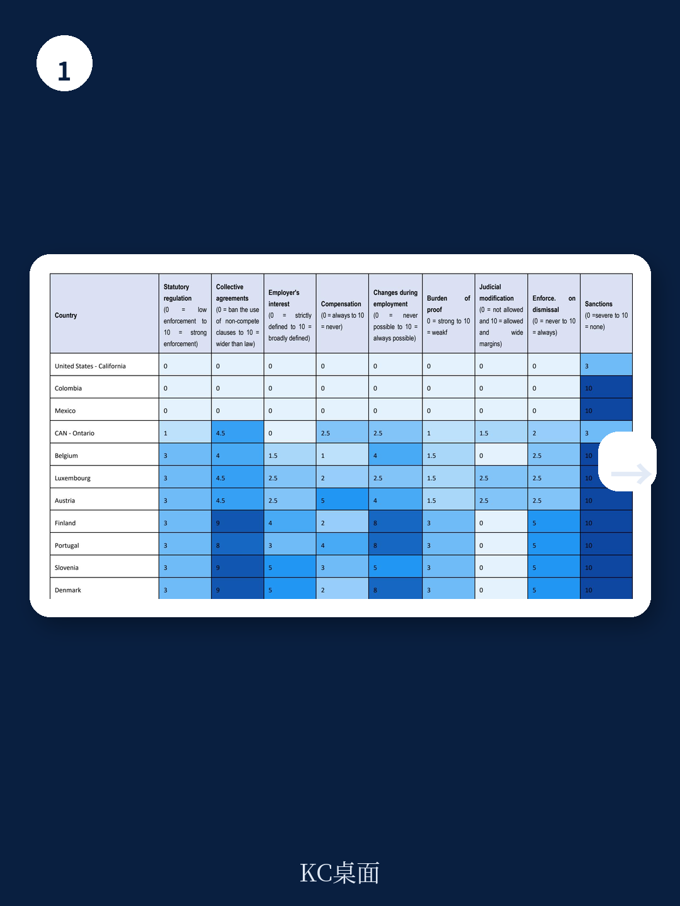

# 经合组织：全球竞业限制法规的隐性成本与政策拐点

竞业限制条款正在全球范围内经历一场前所未有的政策审视。经合组织（OECD）最新发布的工作论文，首次系统性地构建了覆盖38个成员国的竞业限制监管严格度指数，揭示了一个被长期忽视的结构性问题：多数国家的法律框架在保护企业正当利益与维护劳动力市场活力之间，存在系统性失衡。

这份报告的核心判断是：当前竞业限制条款的监管体系普遍偏弱，尤其是在执行机制和补偿要求上存在显著漏洞，导致这些条款被过度使用，甚至延伸至低技能劳动者群体，最终抑制了工资增长、劳动力流动和创新活力。这不是一个仅仅关乎法律技术细节的议题，而是直接影响经济动态效率的结构性变量。

> **KC评论：** 竞业限制条款的监管，本质上是在“企业保护商业秘密的合理诉求”与“劳动者自由择业的基本权利”之间寻找平衡点。OECD这份报告的意义在于，它用一套统一的框架，让我们第一次看清不同国家在这个天平上的位置差异，以及这些差异背后隐藏的经济代价。

继续看原文，真正有价值的是OECD构建的指数框架、各国评分背后的具体法律设计差异，以及这些差异如何与劳动力市场表现产生关联。完整报告与KC评论在每日汇编。

## 1. 竞业限制的“双面性”决定了监管必须精细化

报告开篇就点明了竞业限制条款的两个截然不同的功能面向。从正面看，它可以保护企业的商业秘密、客户关系以及针对员工的培训投资，解决所谓的“敲竹杠”问题——即企业担心员工带着投入的知识和客户关系跳槽或创业，从而不敢进行长期、不可逆的投资。从这个逻辑出发，竞业限制应当只适用于掌握敏感信息的高技能员工，并伴随相应的经济补偿。

但从反面看，竞业限制条款可以被用作限制劳动力市场竞争的工具。通过削弱员工的外部选择权，企业可以压低工资水平，不仅影响跳槽者，也影响留任者，因为雇主面临更小的薪酬竞争压力。更严重的是，这会抑制创业活动、知识扩散和劳动力流动，最终削弱经济动态效率。

报告特别指出，实证证据表明竞业限制条款的使用范围已经远远超出了可以合理证明的范畴。大量低技能、不接触商业机密的劳动者也被要求签署此类条款，这强烈暗示其真实目的并非保护投资，而是限制竞争。这种“泛化使用”是当前监管体系最需要回应的挑战。

## 2. 全球竞业限制监管地图：从“不执行”到“强力执行”的连续光谱

OECD报告基于九个核心维度构建了监管严格度指数，分值范围从0到700，分值越高代表监管越严格、越倾向于限制竞业限制条款的使用。这九个维度包括：是否存在专门法规、集体协议的角色、雇主需证明的正当利益、是否要求补偿、合同变更时的考虑是否充分、举证责任分配、法院能否修改条款、解雇后条款的可执行性、以及使用不可执行条款的惩罚措施。

从总体得分看，OECD国家呈现出巨大的差异性。得分最高的国家（如墨西哥、智利、哥斯达黎加、美国加州）几乎完全禁止或严格限制竞业限制条款；得分最低的国家（如美国佛罗里达州、以色列、英国、日本）则倾向于强力执行，对企业限制极少。

> **KC评论：** 这个指数最有价值的不是排名本身，而是它揭示了一个关键模式：监管严格度与“补偿要求”和“惩罚机制”高度相关。那些对竞业限制约束最弱的国家，往往既不要求企业提供补偿，也不惩罚滥用条款的行为。这实际上是在鼓励企业“先签了再说”。

## 3. 补偿要求与惩罚机制：监管体系中最薄弱的两个环节

报告在分析各国得分构成时，揭示了两个最核心的监管缺口。第一是补偿要求。在许多国家，雇主仅凭“提供工作机会”本身就被视为足够的对价，无需为竞业限制条款支付额外补偿。这意味着低薪劳动者在入职时被迫接受限制，却没有获得任何经济上的对价。第二是惩罚机制。即使企业使用了在法律上不可执行的竞业限制条款，大多数国家也没有设置任何惩罚措施。这造成了一个奇怪的现象：企业有很强的动机去“过度使用”这些条款，因为即使最终无法执行，它们也能在心理上威慑员工，延缓其跳槽意愿，而企业几乎不承担任何成本。

报告引用已有研究指出，即使竞业限制条款在法律上不可执行，它们的威慑效应仍然存在。员工往往不知道自己的条款是否有效，或者没有资源去挑战。这种“模糊性”本身就成了企业控制劳动力的工具。因此，强化透明度要求——比如要求企业在签署合同时明确告知条款的适用范围和可执行性——可能比单纯的法律禁令更有效。

## 4. 不同监管路径背后的制度逻辑：成文法、判例法与集体谈判

OECD报告还揭示了不同国家在监管路径上的结构性差异。一些国家倾向于通过明确的成文法来设定清晰的规则，比如规定最高期限、工资门槛或补偿比例；另一些国家则依赖法院的司法裁量权，在个案中判断条款是否“合理”。还有少数国家将部分决策权下放给集体谈判协议。

报告指出，这种路径选择并非中性。成文法路径提供了更高的法律确定性，但可能缺乏灵活性；司法裁量路径可以更精细地权衡个案情况，但增加了不确定性，对资源有限的员工不利；集体谈判路径则可能更适应特定行业的需求，但覆盖范围有限。目前，多数OECD国家的框架仅施加程序性限制，将条款的实际范围和内容留给劳资双方谈判，这在劳资力量不对等的情况下，往往导致条款向雇主倾斜。

## 5. 报告尚未完全回答的关键问题：执行差距与制度互补性

尽管OECD报告提供了开创性的跨国比较，但它也坦诚地指出了若干未解问题。最核心的一个是“执行差距”：法律条文上的严格度与现实中企业的遵守程度之间可能存在巨大鸿沟。即使某个国家在法律上要求补偿，如果缺乏有效的执法和员工维权渠道，企业可能仍然不提供补偿，而员工也无力追索。报告引用了部分研究，表明即便在高度监管的劳动力市场中，竞业限制条款的滥用现象依然存在。

另一个未充分展开的问题是制度互补性。竞业限制监管的效果如何与知识产权保护制度、解雇保护法规、反垄断执法等相互作用？例如，在知识产权保护较弱的国家，企业可能更依赖竞业限制来保护商业秘密；而在解雇保护严格的劳动力市场，企业可能将竞业限制作为额外的控制工具。这些交互效应的实证检验仍有待未来的研究。

> **KC评论：** 对于政策制定者和投资者而言，这份报告给出的观察框架是：不要只看一个国家是否“禁止”竞业限制，而要关注它的补偿要求、惩罚机制和透明度规定。这三个维度决定了条款的真实约束力。那些在“纸面上”看似严格但缺乏执行保障的体系，其实际经济后果可能与宽松体系无异。

## 6. 对产业与投资决策者的观察框架

基于OECD报告的分析，我们可以提炼出一个评估劳动力市场动态效率的实用框架。首先，关注目标市场的竞业限制监管严格度，尤其是补偿要求和惩罚机制这两个最薄弱的维度。在监管严格的国家（如加州、墨西哥），人才流动性更高，创业生态更活跃，但企业保护商业秘密的成本也更高。在监管宽松的国家（如佛罗里达、以色列），企业更容易锁定关键人才，但可能面临更低的创新扩散率和工资增长压力。

其次，关注政策变化的趋势。报告指出，美国、澳大利亚、加拿大、芬兰、荷兰等国近年来都在推进改革，方向是限制竞业限制条款的使用。这种政策拐点可能对特定行业产生深远影响——比如科技、医疗、金融等高度依赖人力资本的行业。政策收紧可能短期内增加企业的用工成本，但长期会通过促进劳动力流动和创业来提升行业整体效率。

最后，对于跨国产能布局或人才战略的决策者而言，竞业限制监管的差异是一个被低估的区位选择变量。在人才竞争日益激烈的背景下，一个国家的劳动力市场“流动性”本身就是一种制度优势。那些既能保护企业合理利益、又不滥用限制条款的监管体系，可能更有利于吸引和留住高端人才。

更多国际信源汇编与评论，扫码交流，每日更新。每日汇编将把这份OECD报告放回当天的政策主线中，整理成中文摘要、KC评论和图表合集，便于喂给AI，也便于人工快速扫描全球劳动力市场动态。每日汇编汇聚了头部券商、PE/VC、投行、并购、hedge fund、资管机构、战略咨询、智库等朋友，期待交流。

Personal reading notes and learning share only. Not investment advice.
