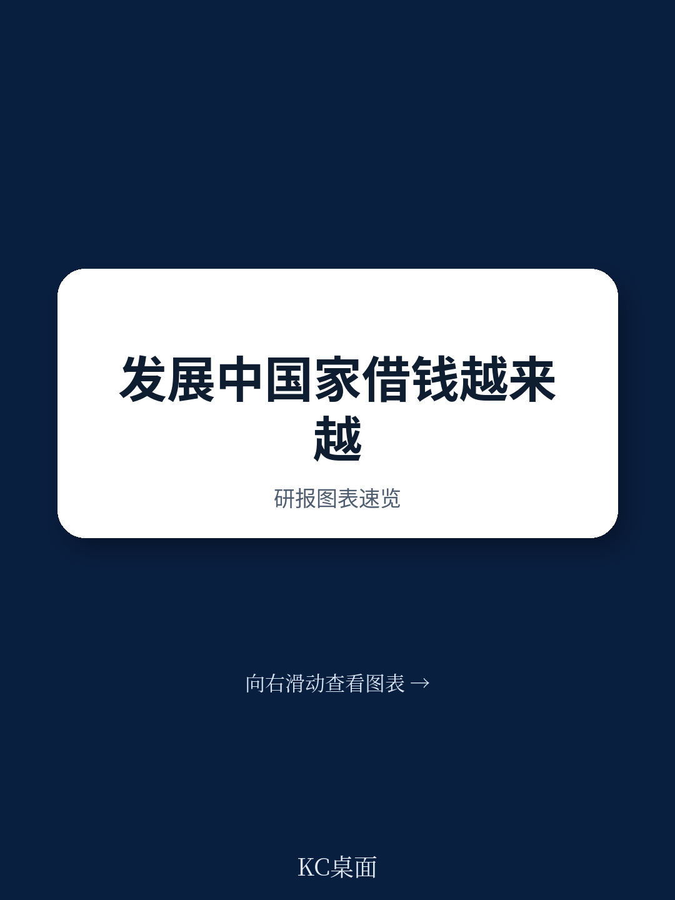

# 联合国贸发会议：联合国贸发报告，发展中国家每流入1美元，72美分流回境外

2024年，流向发展中国家的外部金融资本接近1.5万亿美元，几乎与发达国家当年获得的规模相当。但有一个数字让这个表面乐观的总量失去了光彩：同年，发展中国家为偿还这些外部负债所支付的利润、股息和利息，相当于新流入资金的72%。换句话说，每流入1美元，就有0.72美元以回报形式流回境外。

这不是一个简单的“借新还旧”故事。联合国贸发会议（UNCTAD）最新发布的《融资发展：发展中国家外部资本流动及其成本》技术报告揭示了一个更令人不安的结构性事实：发展中国家的外部融资成本不仅高于发达国家，而且其增长速度正在系统性侵蚀本就有限的财政空间。2018年至2024年间，99个发展中国家——覆盖55亿人口——因公共部门利息支出上升，导致可用于其他事项（包括可持续发展目标）的政府收入份额持续下降。

这份报告的价值不在于它发现了“发展中国家融资贵”这个常识，而在于它用长达十年的数据完整绘制了“成本如何吞噬发展空间”的传导链条。对于关注全球资本流动、主权债务风险以及新兴市场资产定价的决策者和投资者而言，这些数字背后隐藏着对未来数年全球资金配置格局的重要暗示。

> **KC评论：** 72%这个比例意味着，发展中国家从国际资本市场获得的资金，大部分并未真正转化为国内投资或消费，而是以利息和利润的形式回流。这本质上是一种“金融漏斗”。完整报告用更细致的图表拆解了这个漏斗在不同国家组别（新兴市场、前沿市场、其他发展中经济体）的差异——这些差异恰恰是理解主权信用分化趋势的关键。

继续看原文，真正有价值的是报告中的图表、假设和验证路径。完整报告与KC评论在每日汇编中持续更新。

## 1. 外部融资的波动性主要由债务流动驱动，而非股权

报告对2014-2024年间外部金融流入的波动性做了系统性分解。结论很明确：直接投资的波动性最低，而组合投资和其他投资（两者均以债务工具为主）是波动的主要来源。

这意味着什么？发展中国家通过债务渠道获取的外部资金，恰恰是最不稳定的那部分。当全球金融条件收紧时，最先撤退的往往是债券投资者和短期贷款人，而直接投资者（如跨国公司的绿地投资）相对更“粘性”。但问题在于，对于许多前沿市场和其他发展中经济体，它们能够吸引的直接投资规模有限，不得不依赖债务融资——从而陷入“越需要稳定融资，越得不到稳定融资”的困境。

报告还指出，外部和国内融资来源每年合计比发展中国家实现可持续发展目标所需的资金少约4.3万亿美元。要填补这个缺口，两类融资都需要在2024年基础上增加三分之一。在当前的利率环境和风险溢价下，这个目标的可行性值得怀疑。

## 2. 债务服务成本增速是股权的三倍，且跑赢了债务存量增速

2014至2024年间，发展中国家外部负债的服务成本中，债务部分的增速是股权部分的近三倍。更关键的是，债务服务成本的增速超过了债务存量本身的增速。这意味着利息负担在加重，而不仅仅是借了更多钱。

报告按国家组别做了对比：前沿市场经济体（FMEs）在这十年间平均面临最高的服务成本。这些国家大多是在2008年全球金融危机后才融入国际资本市场的低收入或中低收入国家，信用记录短、制度能力弱，因此面临更高的风险溢价。

在地区层面，非洲和拉丁美洲及加勒比地区的债务服务成本显著高于亚洲及太平洋地区。这种分化不仅反映了不同地区的经济基本面差异，也揭示了全球资本对区域风险的定价存在系统性偏差。

> **KC评论：** “债务服务成本增速超过债务存量增速”这个现象，在主权信用分析中是一个危险信号。它意味着即使不借新债，利息负担也会随时间自动加重。报告用一张图展示了2014-2024年间不同类型国家利息支出占政府收入比重的变化——这些图表对于主权债务投资者来说，比任何文字描述都更有说服力。完整报告中的图16和图17值得仔细研究。

## 3. 主权债券发行在2025年反弹，但成本仍被锁定在高位

报告对主权债务融资的两大工具——债券和贷款——做了详细分析。2025年，发展中国家主权债券发行出现反弹，但这并不是一个纯粹的利好消息。

原因在于：尽管发行量回升，但票面利率仍然处于高位，且期限在缩短。报告显示，许多发展中国家在2022-2024年全球加息周期中发行的债券，锁定了较高的票面利率。这些高成本债务将在未来多年内持续影响国家财政。

更值得关注的是，发展中国家与发达国家之间的借款溢价仍然显著。虽然主权利差在2025年收窄至历史低位，但这更多反映了全球流动性充裕和投资者追逐收益的行为，而非发展中国家信用质量的实质性改善。对于前沿市场和非洲国家，借款条件在2025年底仍然紧张。

报告还揭示了一个反直觉的现象：长期借款反而承担了成本溢价。在正常收益率曲线环境下，长期借款利率应该高于短期，但报告发现发展中国家在获得长期贷款时往往面临更高的利率——这反映了贷款人对主权信用可持续性的深层担忧。

## 4. 报告尚未完全回答的关键问题：国内融资能否填补外部缺口

报告明确指出，国内融资在发展中国家的资本形成中占比越来越大——2024年，发展中国家从国内来源获得的融资约为11.9万亿美元，远超外部流入的1.5万亿美元。这是一个积极的趋势，但报告也承认，国内融资的扩张面临自身约束。

关键问题在于：当外部融资成本高企且波动剧烈时，发展中国家能否通过深化国内资本市场来替代外部融资？报告对此给出了部分答案——它强调了国内融资的重要性，但并未系统分析国内资本市场的深度、效率以及与外部融资的替代关系。

例如，许多低收入国家的国内债券市场规模极小，银行体系深度不足，储蓄率低，这意味着它们实际上没有“转向国内”的选项。对于这些国家，外部融资的可获得性和成本仍然是硬约束。

另一个未充分展开的问题是：国际金融架构改革（如多边开发银行资本充足率框架调整、主权债务重组机制改进）能否在可预见的未来实质性降低发展中国家的融资成本？报告列出了一些政策选项，但对其可行性和时间表着墨不多。

> **KC评论：** 报告在结论部分提到了“借款者平台”（Borrowers’ Platform）作为一种同行学习和政策协调的机制。这个方向值得关注，但它更多是程序性的，而非结构性的。真正需要追问的是：现有的多边和双边债务治理框架，是否能够应对未来可能出现的系统性主权债务危机？报告提供的数据为这个问题提供了讨论基础，但答案需要更多维度的分析。

## 5. 对读者的观察框架：三个需要持续跟踪的指标

基于报告的发现，以下三个指标值得决策者和投资者持续关注

第一，**债务服务成本占政府收入的比例**。报告显示，大多数发展中国家因利息支出上升而丧失了财政空间。这个比率的趋势比绝对债务水平更能反映偿债压力。当这个比率持续上升时，即使债务占GDP比率看似可控，财政灵活性也在被侵蚀。

第二，**新发行债券的票面利率与期限组合**。报告指出，高票面利率和缩短期限是当前主权债券市场的两个特征。如果这两个趋势持续，意味着未来再融资风险上升。投资者应关注特定国家新发行债券的加权平均票面利率和到期期限，而非仅仅看发行总量。

第三，**股权与债务融资的相对成本变化**。报告显示，发展中国家的股权融资成本（以利润和股息形式体现）已与发达国家趋同，但债务融资成本差距仍然显著。如果这种分化持续，可能意味着更多发展中国家的企业将倾向于股权融资而非债务融资——这会影响资本结构、公司治理以及国际投资者的回报模式。

---

这份联合国贸发会议的报告提供了理解全球资本流动结构性变化的数据基础，但并非所有问题都已得到解答。例如，高利率环境下发展中国家如何管理汇率风险与债务期限错配？多边开发银行的新融资工具（如混合融资、担保机制）能否真正降低借款成本？中国作为发展中国家的主要债权人和投资者，其角色演变将如何影响外部融资格局？

这些未解问题恰恰是进一步深入讨论的起点。更多国际信源汇编与评论，欢迎扫码交流。每日更新，汇总国际主流叙事、数据与图表，观测边际变化。每日汇编将单篇报告放回当天的主线中，整理成中文摘要、KC评论和图表合集，便于喂给AI，也便于人工快速扫描市场动态。这里汇聚了头部券商、PE/VC、投行、并购、对冲基金、资管机构、战略咨询、智库等领域的专业人士，期待与你交流。

Personal reading notes and learning share only. Not investment advice.
