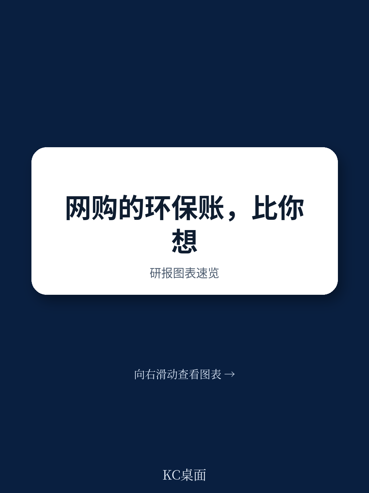
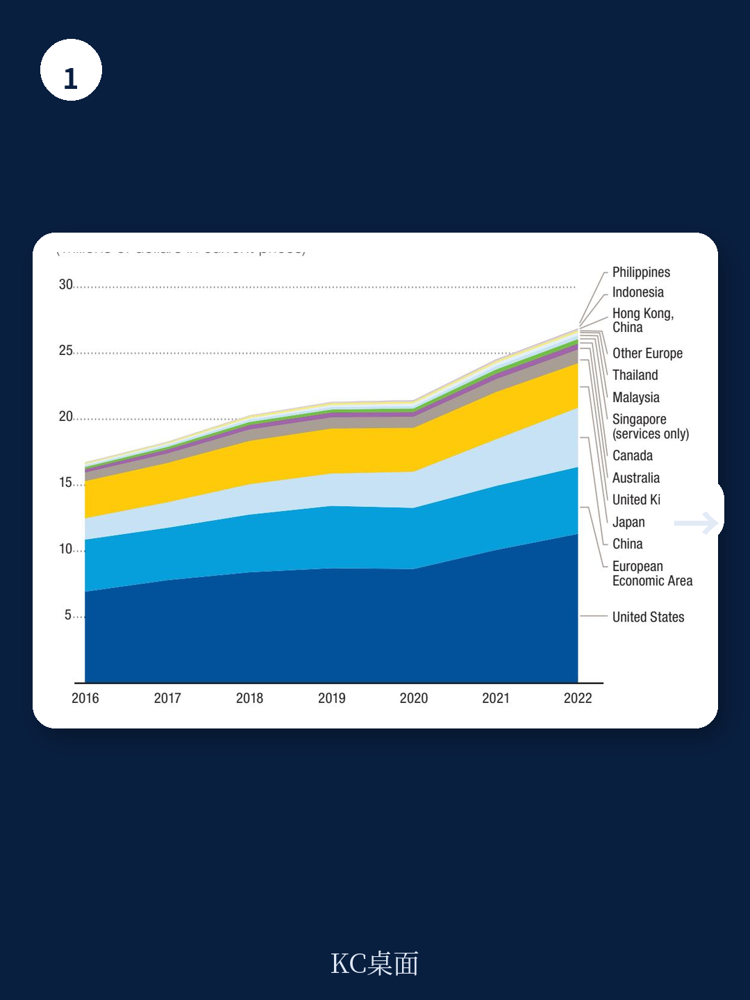
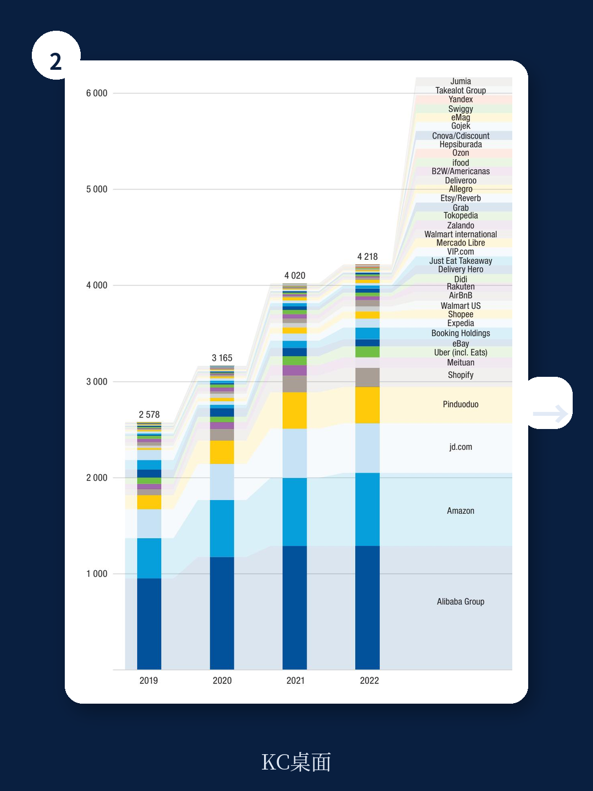

# 联合国贸发会议：从17万亿到27万亿美元，电商增长背后，环境账本敲响警钟

这份来自联合国贸发会议的最新报告，给出了一组值得所有产业决策者警惕的数字：全球43个主要经济体的电商销售额，从2016年的约17万亿美元飙升至2022年的近27万亿美元。增长背后，一个被高速增长掩盖的核心矛盾正在浮现——电商的便利性、低价和规模效应，正在以远超传统零售的速度消耗环境资源。报告的核心判断是：如果不对电商的物流、包装、退货和消费行为进行系统性干预，其环境成本将抵消甚至超过数字化带来的效率红利。

这不是一份简单的环保倡议书。它从数据出发，拆解了B2C电商从仓库、配送、包装到退货的全链条环境影响，并与传统实体零售做了定量比较。更重要的是，报告提出了一个尖锐的追问：当电商平台占据全球约80%的交易额时，它们是否承担起了相应的环境责任？

## 1. 电商的规模红利正在被物流与退货的“环境税”吞噬

电商的快速增长带来了规模效应，但这份效用在环境维度上正在递减。报告指出，B2C电商的物流模式天然具有高环境成本：与B2B的大宗、集中配送不同，B2C需要将单个包裹分送到千家万户，这意味着更频繁的车辆出行、更分散的配送路线，以及更高的单位商品碳排放。

更值得关注的是退货率。在线购物的退货率远高于实体店，部分品类甚至超过30%。每一件退货商品，不仅要经历逆向物流的运输和分拣，还常常因为包装损坏或轻微瑕疵而被直接丢弃。报告直言，高退货率意味着能源和材料的双重浪费，是当前电商环境账本中最大的“黑洞”。

> **KC评论：** 很多人只看到电商减少了开车去商场的需求，却忽略了它催生了更分散、更频繁的配送网络。真正值得追问的是：当退货被“免费”承诺所鼓励时，消费者是否承担了这笔环境成本？完整报告中的图V.2和图V.3提供了分区域的电商销售数据，能让你更直观地看到哪里的增长最快、哪里的环境压力最大。继续看原文，真正有价值的是这些图表背后的假设和验证路径。

## 2. 平台集中度越高，环境责任的杠杆效应越强

报告披露了一个关键结构：全球电商交易额中，仅六家头部平台就占据了约80%的份额。这种高度集中的市场格局，既是环境问题的放大器，也是解决方案的杠杆点。

当亚马逊、阿里巴巴、京东等平台控制着从商品上架、支付到物流的整个闭环时，它们对供应商的包装标准、配送方式和退货政策拥有近乎绝对的议价权。报告认为，这些平台必须成为环境可持续的“领导者”，而非仅仅是商业增长的“受益者”。如果头部平台能够强制要求供应商使用可降解包装、优化配送路线、限制免费退货次数，其环境效益将远超政府单方面的法规约束。

但现实是，当前大多数平台的激励机制仍以“增长优先”为核心。免费退货、次日达、过度包装，这些提升用户体验的手段，恰恰是环境成本的主要来源。

## 3. 发展中国家面临“数字红利”与“环境负债”的双重博弈

报告特别关注了最不发达国家（LDCs）的电商困境。一方面，这些国家的电商渗透率极低（仅5.8%的人有过在线购物经历），增长潜力巨大。另一方面，它们的数字基础设施、物流网络和法律框架严重不足：只有约三分之一的人口能上网，物流成本高昂，且缺乏消费者保护和电子交易相关法律。

这意味着，发展中国家在追赶电商浪潮时，极有可能跳过“可持续设计”的阶段，直接复制发达国家高消耗、高退货的早期模式。报告警告，如果不在起步阶段就嵌入环境保护的规则和基础设施，这些国家未来将面临更沉重的环境治理成本。

> **KC评论：** 对关注新兴市场的投资者和决策者来说，这里有一个关键洞察：电商在LDCs的扩张，不仅是商业机会，更是一个“环境路径选择”问题。如果政策制定者现在就要求新进入的平台承担包装回收、绿色物流等成本，可能会延缓增长，但能避免未来更大的环境负债。报告中的Box V.1详细列出了LDCs当前的政策缺口，是理解这一博弈的基础材料。

## 4. 报告尚未完全回答的关键问题：谁为退货成本买单？

报告指出了高退货率的环境危害，并建议“禁止免费退货”或“对退货收取费用”。但这里存在一个尚未完全解答的深层问题：退货成本到底应该由谁承担？

当前，多数平台将退货成本内化为运营费用，最终通过提高商品价格或压缩供应商利润来消化。如果转向“消费者付费”模式，虽然能抑制冲动消费和随意退货，但可能降低消费者对平台的信任，尤其是对服装、鞋帽等需要试穿试戴的品类。报告没有给出一个“最优定价模型”，也没有讨论不同品类、不同客单价下的差异化退货政策。

这一问题的答案，将直接影响电商平台的利润率、用户粘性，以及整个行业的可持续转型路径。对于正在制定ESG策略的企业和关注消费行业的投资者来说，这是一个值得持续追踪的变量。

## 5. 给决策者的观察框架：从“增长指标”转向“环境效率指标”

报告建议，政府和平台应该从三个维度建立新的监测体系：物流的碳排放强度、包装的循环利用率、以及退货的最终处置率。这相当于要求电商行业从“销售额”、“订单量”等传统指标，转向“每单碳排放”、“每件退货的最终去向”等环境效率指标。

报告还提出了一个较为具体的政策方向：禁止销毁退货、未售出和过量生产的产品，并强制平台披露相关数据。如果这一政策在全球范围内推广，将对快时尚、电子产品等退货率高的行业产生深远影响。企业将不得不重新设计产品包装、优化库存管理，甚至调整产品策略以减少退货。

> **KC评论：** 这些建议听起来很理想，但执行难度极大。比如，如何定义“过度包装”？如何追踪一件退货商品是被重新上架、捐赠还是直接销毁？报告没有给出技术细节，但指出了数据公开和强制披露是第一步。完整报告中对“绿色包装”和“共享经济”的讨论，提供了更多可落地的案例参考。

## 6. 顺着这些未解问题继续读完整报告

这份联合国贸发会议的报告，没有停留在“电商对环境有影响”这种泛泛之谈，而是给出了具体的数据、结构化的分析框架，以及针对政府、平台和消费者的分层次建议。但它也留下了几个值得反复推敲的开放问题：头部平台的集中度，究竟是环境治理的“加速器”还是“绊脚石”？免费退货模式是否真的不可持续？发展中国家能否在起步阶段就实现“绿色电商”？

如果你对这些问题的完整论证、图表背后的数据源、以及不同国家案例的详细拆解感兴趣，欢迎加入我们的知识星球。每日汇编会将这份报告放回当天的全球主流叙事中，整理成中文摘要、KC评论和图表合集，便于你喂给AI分析，也便于在碎片时间里快速扫市场dynamics。这里已经汇聚了头部券商、PE/VC、投行、并购、对冲基金、资管机构、战略咨询、智库等朋友，期待交流。

Personal reading notes and learning share only. Not investment advice.
