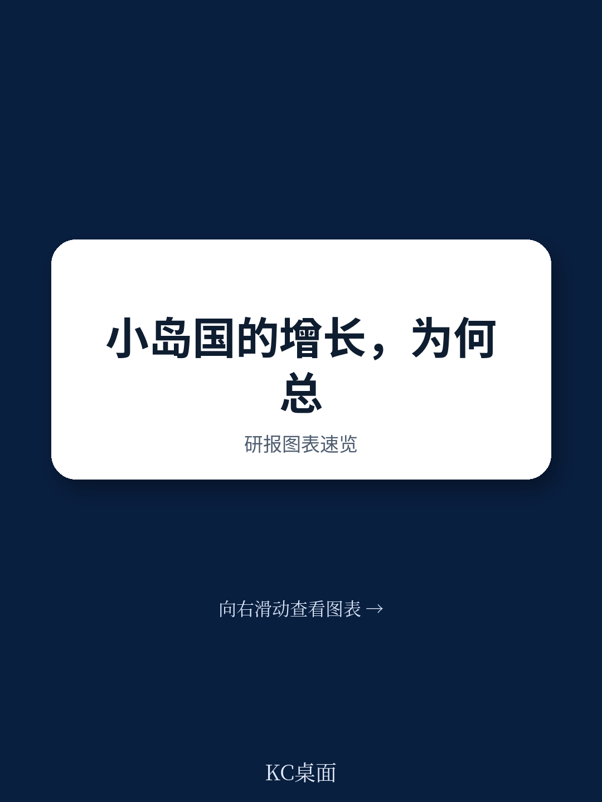
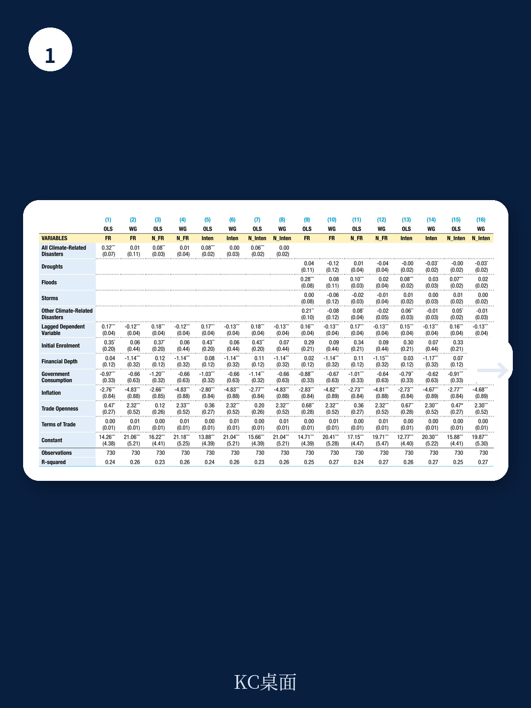
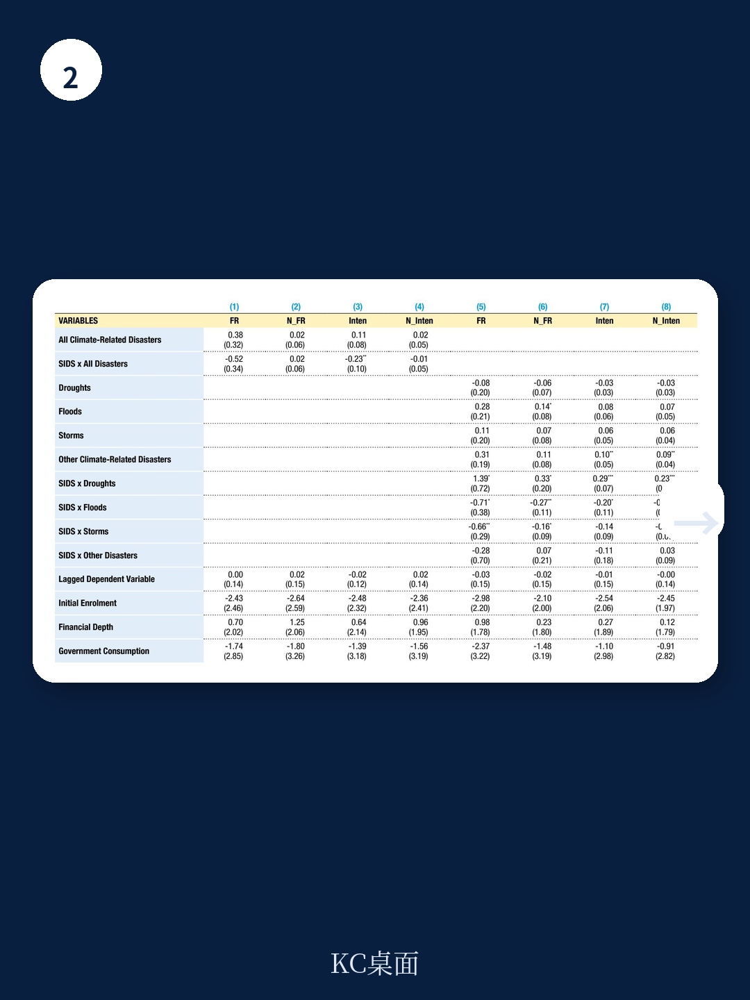

# 联合国贸发会议：小岛国灾害后增长损失被系统性低估

当全球气候谈判陷入大国博弈的泥潭，一个被长期忽视的经济学问题正在浮出水面：对于那些国土面积狭小、经济结构单一、高度依赖外部市场的小岛发展中国家（SIDS）来说，一场台风或一次洪水，究竟会如何改写它们未来三到五年的增长轨迹？

联合国贸发会议（UNCTAD）最新发布的第12号工作论文，直接回应了这个看似具体、实则关乎全球气候融资与债务可持续性核心的问题。报告的标题本身就说明了一切——“脆弱的繁荣”。这份研究并非简单地重复“气候变化对穷国打击更大”的常识，而是首次通过严格的计量方法，系统论证了一个此前被数据噪音掩盖的事实：小岛国遭受气候灾害后的中期增长损失，系统性、显著地高于其他发展中国家。这不是一个关于短期冲击的故事，而是一个关于增长路径被永久性改变的故事。

这篇研报的价值，不在于它给出了某个惊世骇俗的结论，而在于它用扎实的数据和模型，把“脆弱性”从一个抽象的政治口号，变成了一个可以被衡量、被定价、被纳入增长模型的经济变量。

> **KC评论：**
> 这份报告真正有意思的地方，不在于它证实了“灾害伤害增长”，而在于它量化了“伤害的差异”。对于关注新兴市场债务、主权信用评级、或气候债券定价的读者来说，这个“差异”可能就是关键的风险溢价因子。完整报告中的图表和回归系数，提供了可以直接用于情景分析的基准。

## 1. 为什么小岛国的“脆弱繁荣”是一个被低估的宏观风险

报告的切入点是文献综述中一个长期存在的困惑：自然灾害对经济增长的影响，在理论上和实证上都没有定论。有的研究发现灾害后投资加速、技术更新，甚至出现“创造性破坏”的正向效应；另一些研究则发现系统性负向冲击。这种结论的混乱，很大程度上源于两个问题：一是灾害的度量方式不统一，二是不同国家的结构性特征被混为一谈。

UNCTAD的这篇论文选择了一个非常聪明的策略：它不试图解决所有国家的普遍规律，而是聚焦于一个被系统性低估的样本——小岛国。这个群体具有独特的经济结构：服务业（尤其是旅游业）在GDP中占比极高，制造业基础薄弱，基础设施高度集中在沿海地带，且缺乏财政和外汇缓冲。当灾害冲击来临时，这些结构性特征决定了它们的经济恢复路径与其他发展中国家截然不同。

报告使用系统GMM估计方法，对1979-2023年间106个发展中国家的面板数据进行回归，特别引入了SIDS与其他发展中国家的交互项。核心发现是：即便控制了标准的增长决定因素（如初始教育水平、金融深度、政府消费、通胀、贸易开放度等），SIDS在遭受气候灾害后的中期增长表现，仍然显著差于其他发展中国家。

这个“显著”不是统计上的微弱信号。在多种模型设定和稳健性检验中，SIDS交互项的系数始终为负，且在强度指标上具有统计显著性。这意味着，同样的灾害强度，在小岛国造成的增长损失，比在非洲内陆国家或亚洲大陆国家要大得多。

> **KC评论：**
> 这里的“中期”很关键。报告使用的是三年平均数据，而不是年度数据——这排除了单纯的灾后重建脉冲效应。换言之，小岛国不是“恢复得慢”，而是“增长路径本身就发生了偏移”。完整报告中的表A.4和表A.5提供了分灾害类型的交互项系数，能帮你更精确地判断哪些灾害类型对哪些行业伤害最大。

## 2. 风暴冲击服务业，洪水冲击工业——灾害的结构性分化

报告最有洞察力的部分，不是证明“灾害有害”，而是拆解了“灾害如何有害”。通过将GDP增长分解为服务业增加值和工业增加值两个维度，UNCTAD发现了两条清晰的传导路径。

风暴（包括飓风、台风、热带气旋）对小岛国的冲击，主要集中在服务业。这完全符合直觉：风暴直接摧毁旅游基础设施，破坏机场、港口、酒店和通信网络，导致旅游收入在数月甚至数年内无法恢复。对于许多小岛国来说，旅游业占GDP的比重可能超过30%，占外汇收入的比重更高。风暴的破坏不仅是一次性资产损失，更是对现金流和经常账户的持续性打击。

洪水则呈现出不同的伤害模式。它对工业增加值的负面影响更为显著。小岛国的工业活动通常集中在沿海低洼地带，洪水不仅直接淹没工厂和仓库，还会破坏交通物流网络，导致供应链中断。与风暴不同，洪水的破坏往往具有滞后性——基础设施修复需要时间，而工业生产的恢复又高度依赖电力、供水和运输系统的正常运转。

这种结构性分化意味着，单一维度的灾害指标（如总受灾人数或总经济损失）会严重低估小岛国的实际风险。报告特别强调，必须同时使用频率指标和强度指标，才能完整捕捉SIDS面临的多维度脆弱性。

> **KC评论：**
> 对于做行业研究或主权信用分析的人来说，这个拆解提供了非常具体的观察框架。如果你在评估一个以旅游为支柱的小岛国的偿债能力，你应该重点关注的不是“总受灾人数”，而是“风暴频率的五年移动平均”乘以“该国旅游收入占GDP比重”。完整报告中的图3.1和图3.2提供了SIDS与其他国家的灾害指标对比，能帮助你校准这些参数的基准值。

## 3. 数据质量本身就是一个“结构性偏见”

任何关注过新兴市场研究的人都知道，数据问题是所有实证工作的阿克琉斯之踵。UNCTAD的这份报告在数据处理上的坦率，反而增加了其结论的可信度。

报告使用的EM-DAT数据库，是全球灾害数据的核心来源。但问题在于，EM-DAT的收录标准本身就带有系统性偏差：至少10人死亡，或至少100人受影响，或宣布进入紧急状态。这个门槛意味着，只有达到一定规模的灾害才会被记录。对于小岛国来说，这个门槛可能过高——一个造成9人死亡但摧毁了该国GDP 5%的台风，可能因为不够“10人门槛”而被排除在样本之外。

更严重的是，经济损害数据的缺失比例高达69%。这意味着，当我们试图用“经济损失/GDP”来衡量灾害强度时，超过三分之二的数据是缺失的。对于小岛国来说，这个缺失比例可能更高——它们往往缺乏系统和持续的灾后损失评估能力。

报告没有回避这个问题，而是通过使用多种替代指标（受灾人数占比、受灾频率、以及基于物理强度的指数）来交叉验证核心结论。这种方法论的严谨性，使得结论的稳健性大大增强。

> **KC评论：**
> 数据缺失本身就是一个重要的分析信号。如果你发现某个小岛国的EM-DAT记录几乎空白，这不意味着它没有遭受灾害，而是意味着它的灾害没有被国际数据库有效记录。这种“数据沉默”本身就是一个风险指标——它意味着该国的气候风险定价可能系统性偏低。完整报告的附录部分详细讨论了数据局限性，这些内容对于任何试图构建气候风险模型的人都是必读的。

## 4. 报告尚未完全回答的关键问题：资金从哪里来，以及谁来承担损失

UNCTAD的这份论文在实证层面做出了扎实贡献，但它也留下了几个关键的未解问题。

第一个问题是：小岛国在灾害后的增长损失，是否可以通过外部融资来弥补？报告没有直接回答这个问题，但它的发现暗示了一个令人不安的可能性——如果灾害导致增长路径下移，那么这些国家的偿债能力也会相应下降，从而陷入“灾害-债务-低增长”的恶性循环。这与近年来文献中讨论的“气候-债务陷阱”概念高度吻合。

第二个问题是：损失与损害基金（Loss and Damage Fund）的运作机制，是否能够有效覆盖这些中期增长损失？目前的国际谈判更多聚焦于“紧急人道主义援助”和“基础设施重建”，但UNCTAD的研究表明，真正的经济代价可能在于增长路径的偏移，而非单次资产损失。这意味着，援助框架可能需要从“灾后重建”转向“增长路径补偿”。

第三个问题是：对于主权债券投资者来说，如何将这种“灾害增长效应”纳入信用风险评估模型？传统的主权评级模型通常使用“自然灾害风险”作为定性调整因子，但UNCTAD的研究提供了将其量化的可能性——至少对于小岛国来说，灾害发生的频率和强度，应该被直接纳入增长预测方程。

> **KC评论：**
> 这些未解问题，恰恰是这份报告最有价值的延伸阅读方向。完整报告没有讨论资产定价，但它的实证结果可以直接用于构建主权债券的“气候压力测试”情景。如果你在关注加勒比海或太平洋岛国的美元债，不妨把UNCTAD报告的回归系数作为一个初始参数，自己跑一遍敏感性分析。

## 5. 一个观察框架：如何用这份报告理解小岛国的增长前景

基于这份报告的分析框架，我们可以提炼出一个简单的观察框架，用于评估具体小岛国的增长韧性。

第一步，看经济结构。旅游收入占GDP比重超过20%的国家，对风暴的敏感度最高；制造业集中在沿海低洼地带的国家，对洪水的敏感度最高。

第二步，看灾害历史。不是看单次重大灾害，而是看过去10年灾害频率的移动平均。高频次、低强度的灾害可能比低频次、高强度灾害更具破坏性，因为它们会持续侵蚀基础设施和人力资本。

第三步，看财政缓冲。外汇储备、国际援助承诺、以及多边开发银行的优惠融资额度，决定了该国在灾害后能否获得外部流动性支持。没有财政缓冲的国家，灾害冲击更容易转化为增长路径的永久性偏移。

第四步，看保险渗透率。加勒比地区的国家普遍建立了地区性巨灾保险基金，而太平洋岛国的保险渗透率则明显偏低。保险覆盖的深度，直接决定了灾害损失中有多少可以被转移出本地经济。

这个框架的价值在于，它把UNCTAD的宏观实证发现，转化为了一个可以具体应用的微观分析工具。对于任何需要评估小岛国主权信用、项目可行性或气候风险敞口的读者来说，这都是一个可以直接上手的起点。

---

这篇报告的核心贡献，不是告诉读者“气候变化很可怕”，而是提供了一个经过严格检验的分析框架，用于理解为什么同样一场台风，在小岛国造成的经济后果与在非洲大陆国家完全不同。对于关注新兴市场债务、气候融资、或全球治理的读者来说，这份报告提供了一个不可多得的定量基准。

但正如报告自己承认的，数据限制和方法论挑战依然存在。小岛国的灾害数据缺失、经济统计不完善、以及长期增长效应的识别问题，都意味着目前的结论仍然是一个“下限估计”——真实的增长损失，可能比报告显示的更大。

更多国际信源汇编与评论，扫码交流，每日更新。我们将这份完整报告放回了当天的国际宏观主线中，整理成了中文摘要、KC评论和核心图表合集，便于喂给AI，也便于人工快速扫描市场动态。每日汇编汇聚了头部券商、PE/VC、投行、并购、hedge fund、资管机构、战略咨询、智库等朋友，期待交流。

Personal reading notes and learning share only. Not investment advice.
