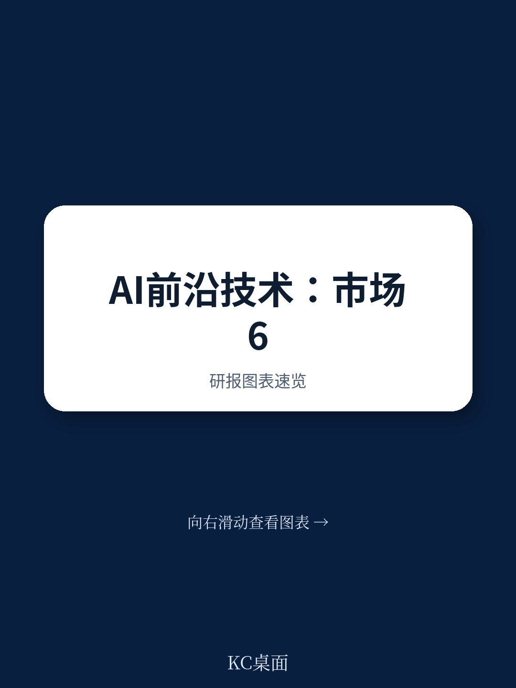
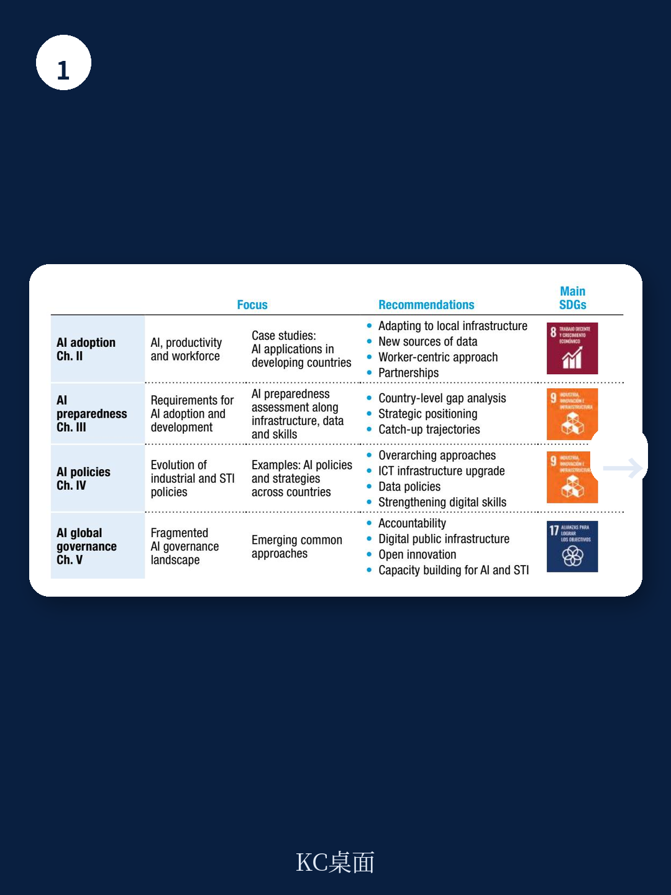
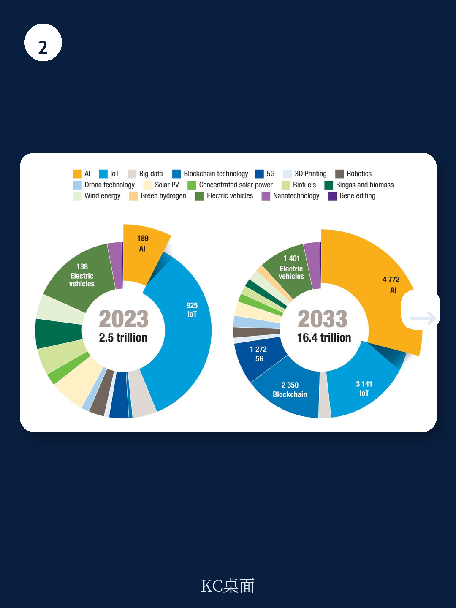

# 联合国贸发会议：联合国报告，AI或侵蚀发展中国家廉价劳动力优势

全球前沿技术市场正以惊人的速度膨胀。根据联合国贸发会议（UNCTAD）最新发布的《2025年技术与创新报告》，这一市场在2023年已达到2.5万亿美元的规模，并预计在未来十年内增长六倍，至2033年达到16.4万亿美元。其中，人工智能（AI）将成为绝对的王者，届时独占近三分之一的市场份额，达到约4.8万亿美元。

这份报告的价值不在于重复“AI很重要”这个共识，而在于它揭示了繁荣背后一个日益尖锐的结构性矛盾：技术市场的增长红利，正在被极少数头部公司和国家高度集中。这不仅仅是商业竞争的问题，更可能重塑全球发展格局，让发展中国家陷入新的追赶困境。对于产业决策者和投资者而言，理解这种“赢家通吃”的动力机制，远比预测下一个AI应用风口更为关键。

## 1. 全球AI研发投入的“金字塔尖”：100家公司掌控四成江山

报告的核心洞察之一，是研发投入的极端集中化。数据显示，全球企业研发投入中，超过80%由2500家公司贡献，而其中仅100家公司就占据了超过40%的份额。这意味着，决定AI未来走向的核心技术和算法，正被一个极其狭窄的“精英俱乐部”所掌握。

从国别看，美国是当之无愧的霸主。在全球前100大企业研发投资者中，约一半总部位于美国，包括Alphabet、Meta、微软和苹果。中国紧随其后，占比约13%，以华为和腾讯为代表，在十年间从2%跃升至13%，超越了德国、日本等传统研发强国。但除此之外，前100名中几乎看不到其他发展中国家的身影。这清晰地描绘出一幅“双头垄断”的图景，而其他国家，尤其是全球南方国家，正在被边缘化。

> **KC评论：** 这份数据揭示了一个残酷的现实：AI竞赛的本质是“资本竞赛”。对于大多数企业来说，自研大模型的门槛已经高不可攀。未来，AI能力的差异将不再是“有或无”，而是“接入哪个生态”。这迫使所有非头部企业必须做出战略选择：是深度绑定某个巨头生态，还是在垂直领域寻找被巨头忽视的缝隙市场。完整报告中对各国研发投入的详细拆解图，值得仔细研读。

继续看原文，真正有价值的是图表、假设和验证路径；完整报告与KC评论在每日汇编。

## 2. 知识创造的“双寡头”格局：中美占据三分之二专利

研发投入的集中，直接导致了知识创造的集中。报告指出，在前沿技术领域，中美两国共同贡献了全球约三分之一的同行评审文章和三分之二的专利。这种不对称性在专利领域尤为明显，显示出中国和美国不仅在“做研究”，更在将研究成果转化为独占性产权。

这种格局意味着，未来全球技术标准的制定、核心算法的迭代，以及数据流的规则，都将主要由这两个国家主导。其他国家，尤其是依赖低成本劳动力优势的发展中国家，将面临一个严峻挑战：AI是一种资本密集型和劳动节约型技术，它可能会侵蚀其传统比较优势，使其在过去数十年通过融入全球化所获得的发展成果面临风险。

> **KC评论：** 这是一个“范式转移”的信号。过去，发展中国家可以通过承接制造业转移实现增长。但AI驱动的自动化，正在让“廉价劳动力”这个优势变得不再稀缺。政策制定者需要思考的核心问题不再是“如何吸引低端制造”，而是“如何在本国经济中创造AI能增强而非替代的人类能力”。报告中对各国在AI领域“知识优势”的细分图表，是理解这场全球竞争的关键。

## 3. 技术巨头的“市场统治”：市值超越国家GDP

报告不仅关注研发和知识，更直接点出了市场权力的集中。苹果、英伟达和微软的市值均已超过3万亿美元，接近整个非洲大陆的GDP。而Alphabet和亚马逊的市值也超过2万亿美元，高于加拿大的GDP。这些公司不仅是技术的提供者，更是市场规则的制定者。

这种市场支配力在“赢家通吃”的数字市场中尤其令人担忧。头部玩家有能力通过收购消灭潜在竞争对手，甚至控制信息和收入的流向。报告引用研究指出，这些公司的商业动机往往与公共利益不一致，它们倾向于将AI发展导向“替代人类劳动”而非“增强人类能力”。这为全球劳动力市场和社会公平投下了长长的阴影。

## 4. 报告尚未回答的关键问题：AI的能源与环境成本

尽管报告全景式地描绘了AI的机遇与挑战，但它并未完全展开一个日益紧迫的问题：AI的能源消耗与环境影响。随着AI模型的规模不断膨胀，其训练和推理所需的算力呈指数级增长，这背后是巨大的电力需求和碳排放。虽然报告提到了AI可以助力绿色技术，但AI本身作为一个“能耗大户”，其可持续发展的路径并未被充分探讨。这是一个需要后续研究和政策干预的重要领域。

## 5. 发展中国家的“AI准备度”：基础设施、数据和技能的三角困境

报告提出了一个框架来评估一个国家的AI准备度，即三个关键杠杆点：基础设施、数据和技能。对于许多发展中国家而言，这三个方面都处于初级阶段。

首先，AI需要比传统互联网更强大的宽带基础设施来承载海量数据流。其次，高质量、可访问的数据是训练AI模型的基础，而许多发展中国家缺乏系统性的数据治理和开放机制。最后，从编程到机器学习，再到AI伦理，相关的技能人才严重短缺。报告认为，追赶需要将产业政策与科技创新政策对齐，但现实是，许多发展中国家甚至尚未制定专门的AI战略。这构成了一个“先有鸡还是先有蛋”的困境：没有基础设施和数据，就无法吸引投资和人才；而没有人才和投资，基础设施和数据建设也无从谈起。

对于投资者而言，这意味着在评估新兴市场的AI机会时，不能简单地套用发达市场的逻辑。真正的机会可能不在于复制一个“XX版的OpenAI”，而在于解决上述“三角困境”中的某个具体环节，例如提供低成本的边缘计算解决方案、建设特定领域的高质量数据集，或者培养本地化的应用型AI人才。

回到报告的开篇判断：前沿技术市场的万亿增长是确定的，但谁能从中获益则充满了巨大的不确定性。对于企业，这是一个关于生态位选择的问题；对于国家，这是一个关于发展路径和制度设计的问题。联合国贸发会议的这份报告，提供了一个冷静审视这一宏大叙事的框架。

报告中还包含了大量关于各国AI专利详细分类、人才流向以及具体行业应用案例的图表和数据，这些是做出独立判断的基石。更多国际信源汇编和评论，欢迎扫码交流。每日更新，汇总国际主流叙事、数据和图表，观测市场边际变化。我们的每日汇编会将单篇报告放回当天的主线中，整理成中文摘要、KC评论和图表合集，便于您喂给AI，也便于人工快速扫描市场动态。这里汇聚了头部券商、PE/VC、投行、并购、对冲基金、资管机构、战略咨询和智库的朋友，期待与您交流。

Personal reading notes and learning share only. Not investment advice.
