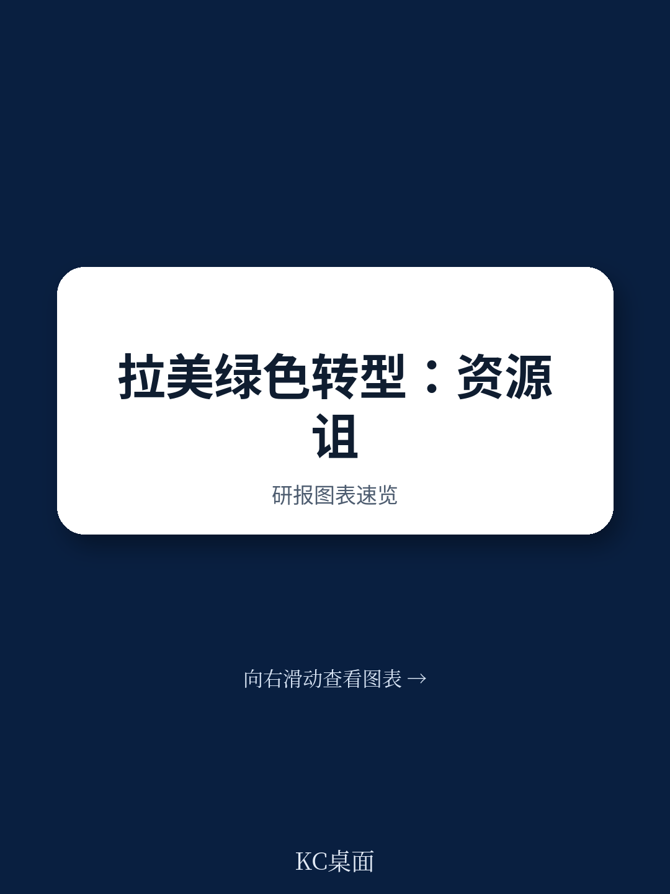
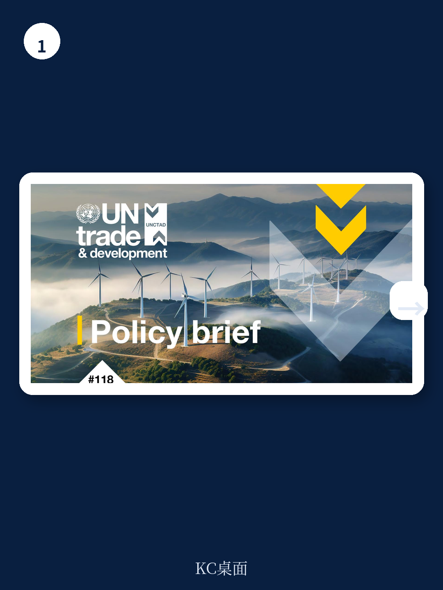
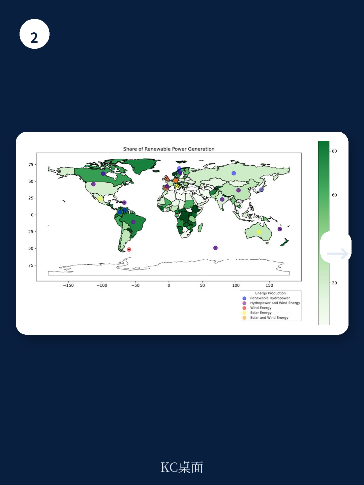

# 联合国贸发会议：绿色转型不是市场能解决的，联合国贸发会议谈拉美产业政策

这份来自联合国贸发会议的简报，没有把拉丁美洲的绿色潜力讲成一个乐观的故事。它提出了一个更尖锐的判断：如果拉美国家只是继续开采锂、铜、银，而不主动设计产业政策来推动经济多元化，那么绿色转型很可能复制过去资源依赖型经济的失败——增长昙花一现，财富分配不均，工业基础进一步萎缩。

对于关注全球供应链重构、关键矿产博弈和新兴市场产业政策的读者来说，这份报告提供了一个非常及时的观察框架。它不只是在讲拉美，而是在讲一个更普遍的问题：当全球都在谈绿色转型时，资源富集国如何避免成为新一轮“绿色殖民地”？

报告的核心主张是：拉美需要一套“主动的绿色产业政策”，而不仅仅是减排目标。这套政策的核心，不是降低营商成本，而是有意识地改变国家与企业的结构和行为。而实现这一目标，单靠任何一个国家都做不到，必须依靠区域整合和南南合作。

> **KC评论：** 这份报告最值得关注的地方，不是它罗列了拉美有多少锂矿或可再生能源，而是它明确指出“市场无法以所需规模和速度内化环境成本”。这意味着，单纯依靠碳定价或绿色补贴，无法驱动结构性转型。真正需要的是国家主导的产业规划、融资和技术转移。报告后面附有详细的政策工具清单和区域合作案例，这些图表和假设路径才是完整报告的核心价值。继续看原文，真正有价值的是图表、假设和验证路径；完整报告与 KC评论 在每日汇编。

## 1. 拉美面临的双重危机：结构性脆弱叠加气候脆弱，工业能力正在提前流失

报告开篇就点出了拉美当前最棘手的问题：经济增速放缓已经导致许多国家出现“失去的十年”，工业能力正在提前丧失。这种衰退不是周期性的，而是结构性的——经济多元化不足导致反复的繁荣-萧条循环。

与此同时，气候变化的冲击正在加剧。全球受气候变化影响最严重的50个国家中，有13个位于拉美，包括海地和委内瑞拉。降水模式改变、气温上升、极端天气事件频发，正在对农业、基础设施和民生造成越来越大的经济损失。

这两重危机叠加在一起，意味着拉美国家没有太多时间可以浪费。到2030年实现可持续发展目标的窗口正在关闭。报告给出的出路是：必须同时应对这两个挑战，通过战略性经济多元化来创造新的产业能力。

**这意味着什么？** 对于关注拉美市场的投资者和企业来说，过去那种“哪里有矿就投哪里”的策略正在失效。政策环境正在快速变化，各国政府将更倾向于通过产业政策来引导外资和技术转移，而不是简单地发放采矿许可证。

## 2. 绿色禀赋是优势，但也是陷阱：关键在于能否把资源转化为产业能力

拉美的绿色禀赋确实令人羡慕。报告引用了IRENA和USGS的数据：拉美33%的能源供应来自可再生能源，而全球平均水平只有13%；拉美拥有全球一半以上的锂储量、超过三分之一的铜储量、一半以上的银储量。这些正是电动汽车电池、太阳能板和电力基础设施的关键原材料。

但报告紧接着泼了一盆冷水。它指出了几个关键风险

第一，采矿本身的环境成本不容忽视。森林砍伐、水污染、空气污染、土壤侵蚀和海洋生态系统破坏，这些都会削弱绿色转型的正当性。

第二，技术替代的风险。全球研发正在探索替代锂离子电池的技术路线，比如磷酸盐基或氢基电池。如果这些技术取得突破，拉美的锂矿价值可能大幅缩水。

第三，也是最关键的：拉美能否复制印尼在镍矿上的成功经验？印尼通过出口禁令迫使企业在本地建厂，建立了从采矿到加工的完整产业链。但报告指出，这需要市场规模和有效的议价能力——拉美国家在这两方面都面临挑战。

> **KC评论：** 印尼的镍矿案例是这份报告的一个关键参照点。报告没有详细展开，但完整报告里有印尼政策的具体拆解和效果评估。这个案例对拉美国家意味着什么？它说明资源民族主义需要搭配产业能力建设，否则就是杀鸡取卵。如果你想了解印尼政策的具体执行细节和可复制性，完整报告里有更深入的分析。

**这意味着什么？** 对于投资拉美矿产和新能源产业链的机构来说，单纯关注资源储量已经不够。需要评估每个国家的产业政策稳定性、技术替代风险，以及政府是否有能力推动本地化加工和制造。

## 3. 绿色工业化面临的结构性挑战：不是技术问题，是分配问题

报告花了不少篇幅讨论绿色工业化的真正难点。它指出，将经济结构从化石燃料转向可再生能源，会深刻影响贸易、工业和政府财政，并产生巨大的分配效应——有赢家，也有输家。

这种分配效应会进一步加剧一个已有的问题：资产搁浅风险。报告特别提到，对于最不发达国家来说，它们本就狭窄的生产能力可能被进一步耗尽，相关就业岗位也会消失。

**这意味着什么？** 绿色转型不是简单的“用新能源替代旧能源”，而是整个经济体系的重新配置。在这个过程中，政策制定者必须同时处理技术升级、就业转型、财政平衡和区域公平等多重目标。任何单一政策工具都无法胜任。

## 4. 报告尚未完全回答的关键问题：拉美国家是否有足够的制度能力和政治意愿？

这份报告在政策建议上非常清晰：需要“主动的绿色产业政策”，需要开发性金融机构提供大规模融资，需要区域层面的产业规划。但它没有完全回答一个更根本的问题：拉美国家是否有能力执行这些政策？

拉美历史上不乏产业政策的尝试，但结果参差不齐。巴西的工业政策曾经成功培育了航空制造业，但也在许多领域陷入了保护主义和效率低下。阿根廷的进口替代工业化最终导致了债务危机和通货膨胀。委内瑞拉的资源民族主义则演变成了经济崩溃。

**这意味着什么？** 报告提出的政策框架在理论上是合理的，但在实践中面临巨大的执行风险。对于读者来说，真正需要持续观察的是：哪些拉美国家能够建立起有效的制度能力来执行这些政策？哪些国家会陷入政策摇摆或寻租陷阱？

## 5. 给读者的观察框架：从三个维度判断拉美绿色转型的真实进展

基于报告的逻辑，我们可以建立一个简单的观察框架

第一，看产业政策的“主动性”。报告强调，政策不能只是降低营商成本，而要主动改变企业和国家的行为。具体来说，可以观察：政府是否在制定明确的产业多元化路线图？是否在关键领域（如电池制造、绿色氢能）设立了具体的产能目标？是否建立了有效的技术转移机制？

第二，看融资机制的有效性。报告指出，拉美每年需要约1.7万亿美元的可再生能源投资，但2022年只吸引了5440亿美元的清洁能源FDI。这个缺口怎么补？开发性金融机构是否在发挥更大作用？公私合作模式是否在落地？多边开发银行是否在提供创新融资工具？

第三，看区域合作的深度。报告强调，单靠任何一个国家都无法完成绿色转型。区域合作可以分散风险、促进技术互补、增强议价能力。具体可以观察：拉美国家是否在签署更多的区域产业协议？是否在建立共同的绿色标准？是否在协调矿产出口政策以提升定价权？

**这意味着什么？** 这三个维度可以帮助读者快速判断一个拉美国家的绿色转型前景。如果三个维度都在改善，说明这个国家正在朝着正确的方向前进；如果只有一两个维度在改善，则需要警惕政策执行的不平衡。

## 6. 区域整合是破局的关键，但政治意愿是最大的变量

报告最后落脚在区域合作上。它列举了一些积极的信号：2018年的埃斯卡苏协议、2021年的东热带太平洋海洋走廊、2023年的贝伦协议。这些协议表明，拉美国家在环境议题上是有能力达成共识的。

但报告也坦承，通往区域气候行动计划的道路充满了挑战，尤其是在融资和政治意愿方面。拉美国家之间的政治分歧、经济竞争和外交摩擦，都可能阻碍区域合作的实际落地。

**这意味着什么？** 区域整合不是一个自动发生的过程，而是需要持续的政治投入和制度建设。对于关注拉美市场的机构来说，需要密切关注区域合作机制的实际运作情况，而不仅仅是协议签署的新闻。

---

这份报告提供了一个非常有价值的分析框架，但它留下的问题比它回答的更多。拉美绿色转型的真正前景，取决于各国能否在产业政策、融资机制和区域合作三个维度上同时取得进展。而这需要持续跟踪和深入分析。

更多国际信源汇编与评论，扫码交流，每日更新。我们会把单份报告放回当天的主线叙事中，整理成中文摘要、KC评论和图表合集，便于喂给AI，也便于人工快速扫市场dynamics。目前汇聚了头部券商、PE/VC、投行、并购、hedge fund、资管机构、战略咨询、智库等朋友，期待交流。

Personal reading notes and learning share only. Not investment advice.
