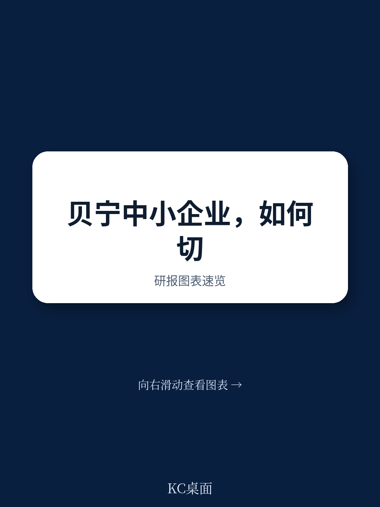
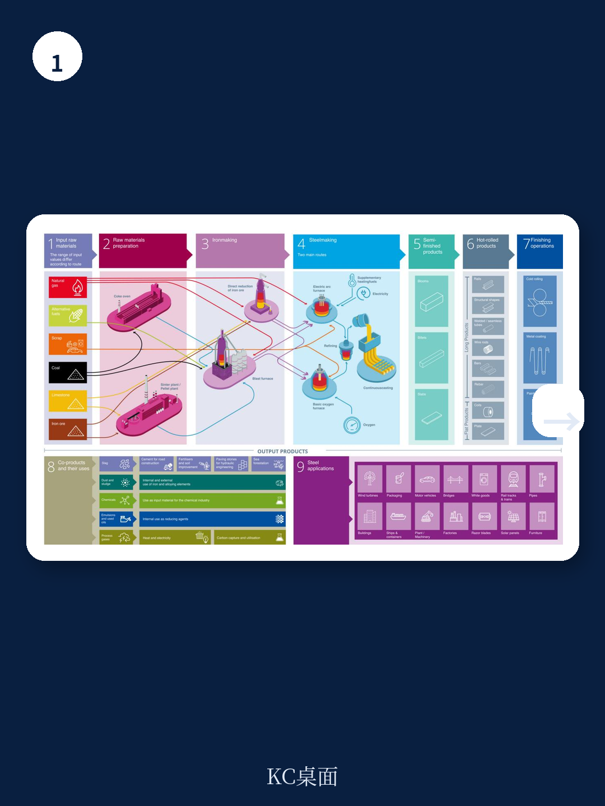
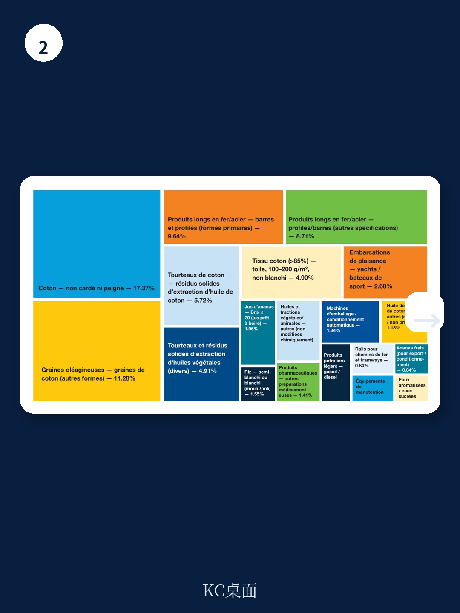

# 联合国贸发会议：贝宁经济韧性背后，中小企业出口附加值为何没跟上基础设施投资

西非国家贝宁正站在一个关键的十字路口。过去十年，凭借港口升级和基础设施投资，这个国家成功将自己定位为区域物流枢纽，经济增长稳健，韧性超出预期。然而，联合国贸易和发展会议（UNCTAD）一份最新研报揭示了一个令人警醒的现实：宏观经济的亮眼表现，尚未转化为本土中小企业（PME）的产能升级和区域价值链深度参与。数据显示，贝宁对非洲市场的出口占比已从2008年的约40%骤降至2024年的约15%。这份报告的核心判断是：贝宁中小企业的真正机会，不在于继续做“过路经济”的搬运工，而在于抓住菠萝加工和钢铁下游制造两个具体赛道，实现从“物流型整合”向“生产型整合”的跃迁。

## 1. 贝宁的区域贸易失衡揭示了一个深层问题：出口附加值没有跟上基础设施投资

报告首先勾勒了一个矛盾图景。贝宁经济在新冠疫情、地缘政治紧张和大宗商品价格波动中展现出显著韧性，2020年短暂放缓后迅速反弹，农业、农产品加工业、建筑业和服务业均表现强劲。科托努港的现代化扩建，以及连接萨赫勒内陆国家的运输走廊改善，进一步强化了贝宁作为区域中转和贸易平台的角色。

但贸易数据暴露了结构性失衡。虽然总体贸易量自2010年代中期以来恢复，贝宁对非洲市场的出口份额却大幅萎缩，从2008年的约40%降至2024年的约15%。与此同时，从非洲伙伴的进口持续增长，反映出区域内对中间品和消费品的需求在扩大。这种“进口增、出口降”的剪刀差，意味着贝宁并未充分抓住西非经济共同体（CEDEAO）内部的市场机遇。

> **KC评论：** 基础设施投资改善了“路”，但没有自动解决“货”的问题。贝宁的出口仍然高度集中在少数初级产品，尤其是棉花。2014-2016年间棉花价格暴跌和尼日利亚经济衰退导致贝宁出口急剧萎缩，正是这种结构脆弱性的集中体现。报告揭示的核心矛盾是：物流优势可以吸引货物过境，但只有制造能力才能把过境流量转化为本地就业和增加值。

## 2. 菠萝产业链是贝宁中小企业最直接的突破口，但卡在了“种苗”和“包装”两个瓶颈上

在众多潜在赛道中，UNCTAD通过显性比较优势分析，锁定菠萝产业为最紧迫的机遇。贝宁是西非重要菠萝生产国，其“Allada高原糖面包”品种已获得地理标志保护，品质得到国际认可。数据显示，贝宁在低糖菠萝汁（≤20°Brix）上拥有显著的显性比较优势，这类产品构成了对非洲出口的绝对主力。

然而，产业链的“微笑曲线”在贝宁表现得尤为残酷。上游，优质菠萝种苗（rejets）供应严重不足，限制了种植面积扩张、农场生产率和加工厂的原料稳定供应。报告明确指出，生产和销售认证种苗本身就是中小企业可以切入的战略性利基市场，不仅满足国内需求，还能出口到周边同样在发展菠萝产业的国家。

下游的问题更突出。贝宁菠萝出口结构中，低附加值产品（低糖菠萝汁）占出口收入的96%以上。包装环节成为最关键的制约——高度依赖进口包装材料推高了成本，侵蚀了中小企业的竞争力。报告建议，发展本地制罐工业，以及加强卫生和植物检疫标准的合规培训，是中小企业实现价值链升级、进入区域城市市场、并向其他农产品加工领域拓展的可行路径。

> **KC评论：** 很多人关注的是“种菠萝”和“卖果汁”，但报告想强调的是“种苗”和“包装”这两个被忽视的高附加值环节。一个本地制罐厂，不仅服务菠萝汁，还能服务整个西非的饮料和食品加工业，这是一个典型的“平台型机会”。完整报告里有详细的成本拆解和市场需求测算，这些图表是判断商业可行性的关键。

继续看原文，真正有价值的是图表、假设和验证路径；完整报告与KC评论在每日汇编。

## 3. 钢铁下游加工是另一个被低估的机会，贝宁的区位优势可以转化为制造优势

如果说菠萝产业是“农业升级”的逻辑，那么钢铁行业则是“物流优势工业化”的典型。报告指出，虽然贝宁没有初级钢铁冶炼工业，但它已经逐步成为区域钢铁产品的进口、轻加工和分销平台。这种地位反映在贝宁对某些钢铁产品的显性比较优势上，其基础正是物流位置和转口贸易活动。

中小企业的机会主要集中在价值链的中下游环节：切割、型材加工、轧制、轻型镀锌、组装以及面向区域建筑和基础设施市场的成品制造。西非地区的城市化浪潮和公共/私人投资持续拉动建材需求，为这些活动创造了有利的市场环境。

但报告也坦承，这个潜力的兑现需要更坚实的产业基础：充足的工业用地、可靠的能源供应、技术工人的培养，以及质量控制体系的强化。这不是一个“低垂的果实”，而是一个需要系统性政策配合才能收获的赛道。

## 4. 报告未完全回答的关键问题：从“做物流”到“做制造”的转换成本由谁承担？

UNCTAD的报告提供了清晰的产业机会地图和诊断，但一个根本性的问题悬而未决：贝宁目前的中小企业生态，是否具备完成这种转型的微观基础？

报告自身的数据显示，超过90%的贝宁企业是中小企业，且多数在非正规部门运营，面临融资成本高、缺乏适配金融产品、管理技术能力不足、生产率低下、质量标准和卫生标准合规有限等多重约束。更重要的是，这些企业的经营逻辑长期围绕“贸易”和“中转”展开，而非“制造”和“品控”。

从“物流型整合”转向“生产型整合”，意味着需要一批企业家愿意承担更高的固定投资、更长的回报周期，以及更复杂的运营管理。报告建议的政策工具——如设立菠萝种苗生产单元、建设制罐工业区、打造钢铁服务中心——都需要大量的前期资本和协调。这部分成本，在现有框架下，主要由政府、国际发展机构和企业自身分担。但市场化的融资机制和风险分担安排，报告着墨不多。

## 5. 对决策者和投资者的观察框架：用三个指标判断贝宁中小企业升级的真实进展

对于关注西非区域经济和中小企业发展的读者，以下三个观察维度可能比宏观GDP数字更有价值

第一，菠萝种苗的商业化程度。如果未来12-24个月内，出现由私营部门主导的、面向区域市场的认证种苗供应企业，说明上游瓶颈正在被市场力量打破。这是最早期、最敏感的先行指标。

第二，本地包装产业的落地情况。无论是制罐还是其他形式的食品包装，一旦有实质性投资落地，就意味着菠萝加工产业链的下游正在从“卖散装果汁”转向“卖品牌消费品”。这是附加值提升的标志性节点。

第三，钢铁下游加工企业的数量和质量。关注科托努港周边是否出现更多从事切割、折弯、焊接、组装的中小企业，以及这些企业是否开始向尼日尔、布基纳法索等内陆国家出口成品。这是“物流优势工业化”的直观验证。

这份UNCTAD报告的价值，不在于它给出了一个完美的蓝图，而在于它用数据和比较优势分析，把贝宁中小企业升级的路径从“泛泛而谈”变成了“可检验、可追踪、可讨论”的具体命题。菠萝种苗、果汁包装、钢铁加工——这三个看似不相关的赛道，共同指向同一个结论：贝宁的下一轮增长，取决于它能否把“过路经济”的流量，转化成“制造经济”的存量。

报告里还有大量未能在本文展开的内容：西非各国菠萝产业的竞争格局对比、钢铁价值链各环节的利润率拆解、中小企业调研中企业家对区域一体化的真实恐惧与期待。这些细节和图表，是理解机会落地难易程度的关键。

更多国际信源汇编与评论，扫码交流，每日更新。我们会把这份报告的完整图表、假设验证路径以及KC评论整理成中文摘要和合集，便于喂给AI，也便于人工快速扫描西非市场dynamics。每日汇编汇聚了头部券商、PE/VC、投行、并购、hedge fund、资管机构、战略咨询、智库等朋友，期待交流。

Personal reading notes and learning share only. Not investment advice.
