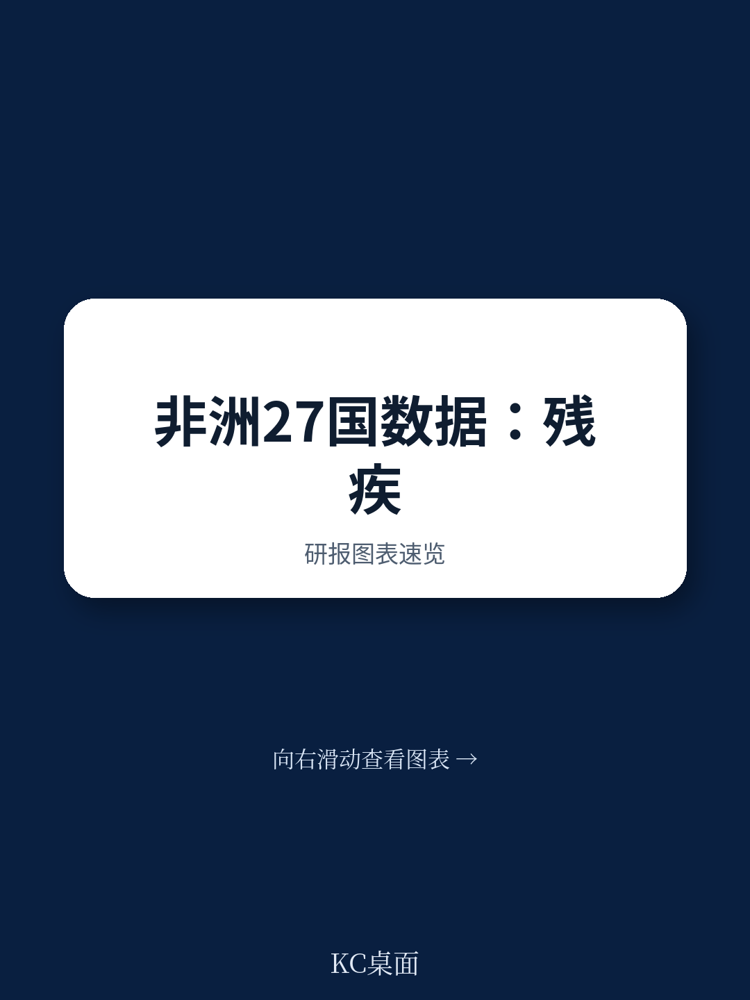
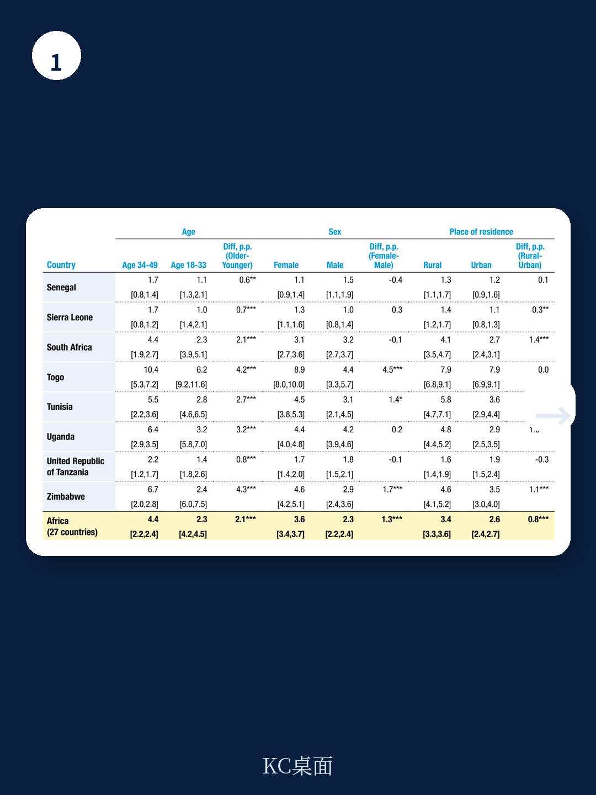
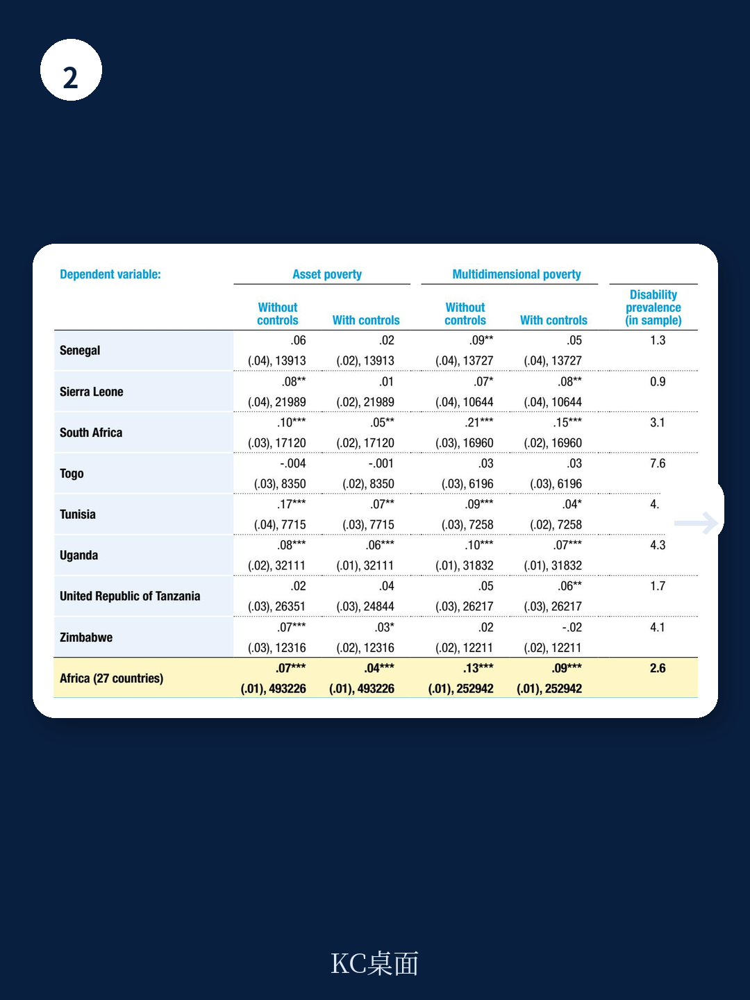

# 联合国贸发会议：非洲残疾与贫困循环，数据揭示被低估的结构性挑战

全球极端贫困的下降趋势在过去十年明显放缓。新冠疫情只是部分解释，更深层的原因在于，极端贫困正日益集中在脆弱、受冲突影响的国家，以及那些最容易被政策忽视的群体身上。联合国贸发会议（UNCTAD）最新发布的工作论文，将镜头对准了非洲大陆，聚焦于一个长期被数据盲区覆盖的交叉议题：残疾与贫困之间的双向强化关系。

这份基于27个非洲国家、覆盖该大陆57%人口的全国代表性调查数据的研究，给出了一个核心判断：残疾在非洲并非边缘现象，而是与性别、城乡、年龄结构深度绑定，并且与贫困之间存在稳健的、即使控制社会人口特征后依然显著的正相关关系。这并非一个单纯的福利议题，而是关乎非洲未来人力资本积累、劳动力市场效率以及减贫政策有效性的关键变量。

对于关注全球发展、新兴市场投资以及长期结构性风险的读者而言，这份报告的价值不在于揭示“残疾导致贫困”这一常识，而在于提供了迄今为止最全面的量化证据，揭示了这一关联在不同维度上的具体强度、分布特征，以及现有政策框架的盲区。

> **KC评论：** 许多宏观叙事关注非洲的人口红利和经济增长潜力，但这份报告提醒我们，增长的质量和包容性同样重要。如果减贫进程无法有效覆盖残疾人群体，那么非洲的“人口红利”可能部分被“残疾负担”所抵消。这份报告的价值在于，它用数据把“包容性增长”这个抽象概念，变成了可衡量、可追踪、可比较的国别指标。

## 1. 残疾在非洲并非随机分布，而是性别、地域与年龄的结构性投射

报告首先通过描述性统计，描绘了非洲残疾人口的基本画像。研究发现，残疾在女性、农村居民和年长成年人中更为普遍。具体数据如下：女性残疾患病率为3.6%，男性为2.3%；农村地区为3.4%，城市地区为2.6%；34-49岁年龄段的患病率为4.4%，而18-33岁年龄段仅为2.3%。

这些差异并非偶然。它们反映了非洲社会中性别不平等、城乡基础设施差距以及医疗资源分布不均等深层次问题。女性更高的残疾患病率，可能与孕产期健康、更少的医疗资源获取以及更高的家庭照料负担有关。农村地区更高的患病率，则直接指向了医疗可及性差、早期干预缺失以及从事高风险农业劳动的现实。

> **KC评论：** 这些数据背后是一个残酷的逻辑：残疾不仅是个人健康问题，更是社会不平等的结果。对于关注非洲消费市场和劳动力供给的投资者而言，这意味着不同细分市场的人口质量差异远比GDP数字显示的更大。农村和女性群体中更高的残疾率，将直接影响其劳动参与率和消费能力。

## 2. 残疾与贫困的关联远超“收入低”，多维贫困视角揭示更深的剥夺

报告的核心贡献之一，在于同时使用资产贫困和多维贫困指数（MPI）两个维度来衡量贫困。资产贫困关注的是家庭拥有的耐用消费品和住房条件，而多维贫困则涵盖了教育、健康和生活标准等多个维度。

回归分析结果显示，在大多数国家，残疾与更高的资产贫困风险和多维贫困风险之间存在稳健的关联。即便在控制了年龄、性别、城乡居住地等社会人口特征后，这种关联依然显著。这意味着，残疾人不仅收入更低、资产更少，他们在教育、健康等基本可行能力（capabilities）上的剥夺也更为严重。

这一点至关重要。一个残疾人家庭可能因为拥有一块耕地而没有被划为“资产贫困”，但其家庭成员可能因为残疾而无法接受教育、无法获得适当的医疗照护，从而陷入长期的多维贫困。这种贫困是隐性的，也是更具破坏性的，它会代际传递，形成“残疾-贫困-更严重的残疾”的恶性循环。

继续看原文，真正有价值的是报告中对不同国家、不同残疾类型与贫困程度之间关系的具体图表和回归系数。这些数据为理解不同非洲国家减贫政策的有效性提供了微观基础。完整报告与KC评论在每日汇编。

## 3. 报告尚未完全回答的关键问题：因果链条的识别与政策干预的优先级

尽管报告在描述关联性方面做得非常出色，但它也坦诚地承认了自身的一个核心局限：无法严格识别因果。残疾与贫困之间的双向因果关系——贫困可能导致残疾（营养不良、缺乏医疗），残疾也可能导致贫困（丧失劳动能力、增加医疗支出）——使得单纯的关联性分析难以指导精确的政策干预。

报告没有完全回答的问题是：对于不同的非洲国家，究竟是“因贫致残”还是“因残致贫”的渠道更为主要？不同的原因，意味着截然不同的政策优先级。如果是前者，重点应放在改善基础医疗、降低劳动风险和加强社会保障；如果是后者，重点则应放在无障碍设施建设、职业康复培训和反歧视立法。

此外，报告使用的数据主要来自2016至2023年的调查，且聚焦于18-49岁的劳动年龄人口。对于50岁以上人群以及儿童的数据缺失，意味着我们对非洲残疾问题的全貌认知依然存在巨大缺口。特别是儿童残疾，其对未来人力资本的长期影响可能更为深远。

## 4. 对读者的观察框架：从“包容性”指标到国别风险与机遇的再评估

这份报告为关注非洲的决策者、投资者和发展实践者提供了一个新的分析框架。它建议，在评估一个非洲国家的长期发展潜力时，不应只看GDP增速、人口结构或营商环境，还应该加入“残疾包容性”这一维度。

具体而言，可以关注以下几个指标
- **残疾数据的可得性与标准化程度**：一个连残疾人基础数据都缺乏的国家，其公共服务和治理能力大概率存在短板。
- **残疾与贫困关联的强度**：如果关联度极高，说明该国的社会流动性和基本公共服务（特别是医疗和教育）存在严重问题。
- **政策回应**：该国是否将残疾人问题系统性地纳入了国家减贫战略？是否有针对性的干预措施？

这些指标背后，反映的是一个国家社会契约的韧性和治理的精细化水平。一个无法有效照顾其最脆弱成员的社会，其长期稳定性和增长包容性都值得打上问号。

这份报告的数据和结论，只是理解非洲结构性挑战的一个切片。更多关于不同国家、不同残疾类型、不同贫困维度的详细拆解，以及我们基于这些数据对特定国家风险与机遇的延伸讨论，都在每日更新的国际信源汇编中。每日汇编会把单篇报告放回当天主线，整理成中文摘要、KC评论和图表合集，便于喂给AI，也便于人工快速扫市场dynamics。这里汇聚了头部券商、PE/VC、投行、并购、hedge fund、资管机构、战略咨询、智库等朋友，期待交流。

Personal reading notes and learning share only. Not investment advice.
