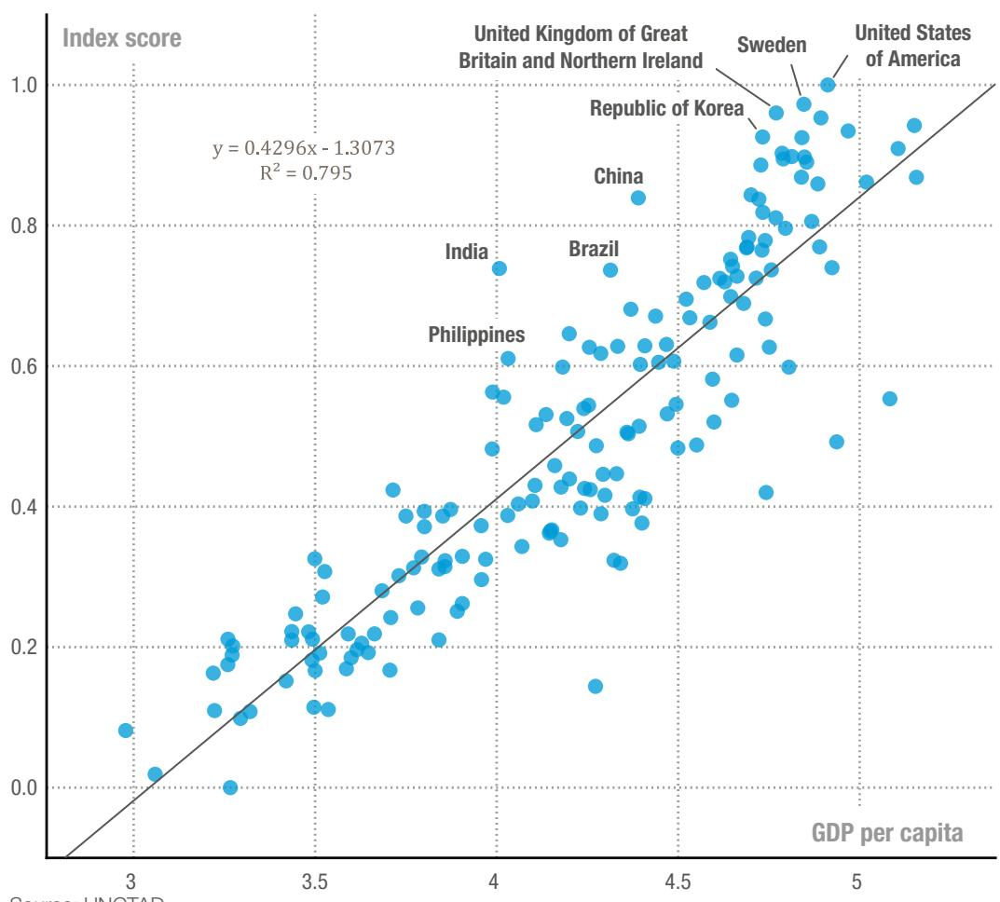
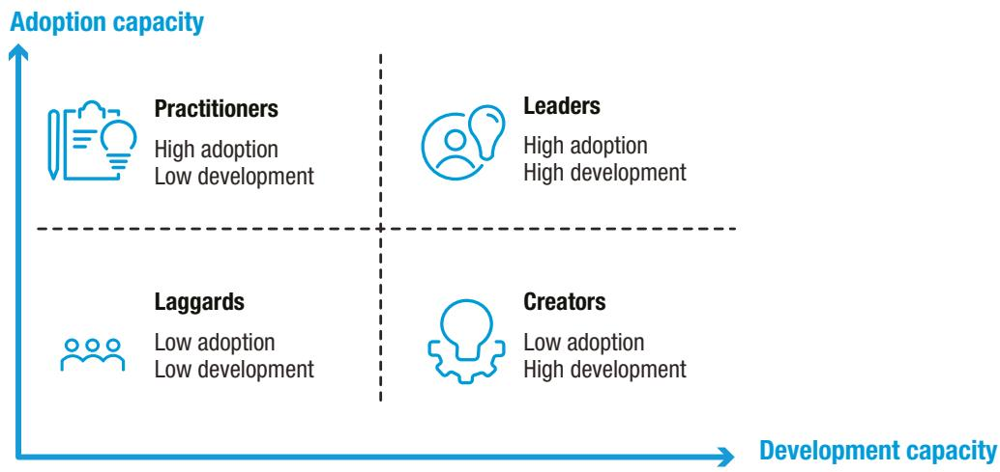
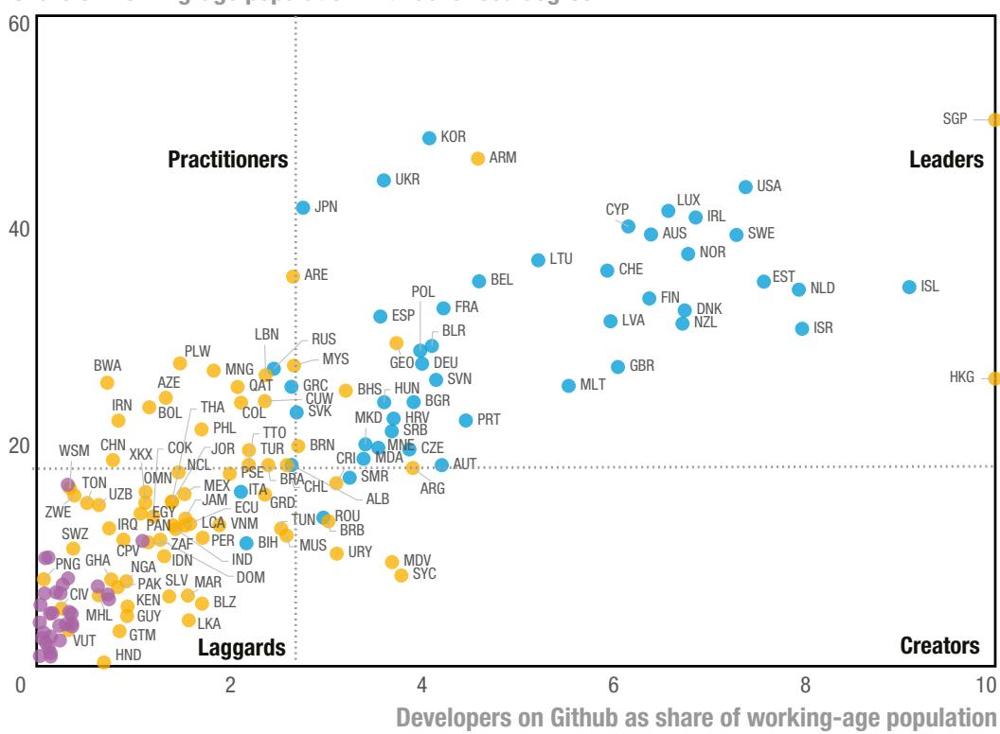
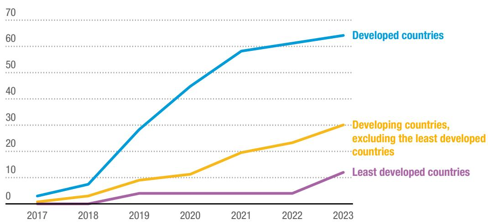

UN trade & development

Policy brief

#120

August 2025
UNCTAD/PRESS/PB/2025/3 (No. 120)

# Preparing to seize artificial intelligence opportunities with strategic national policies

## KEY POINTS

As value in the global economy shifts toward knowledge-intensive activities, decision makers need to support the adoption and development of new technologies, as well as the creation, dissemination and absorption of productive knowledge

\- Without timely and tailored strategies for integrating artificial intelligence into broader industrial and innovation policies that support inclusive and sustainable development, developing countries risk falling behind

\- Successful national artificial intelligence policies combine high-level direction with concrete actions across key sectors; drawing from global examples, countries need to align policies across research and development, data governance, workforce training and digital infrastructure

\- UNCTAD has devised the frontier technologies readiness index, to assess country preparedness for such technologies, and offers an analytical framework, to help countries evaluate strengths and weaknesses in terms of infrastructure, data and skills, according to national capacity for the adoption and development of artificial intelligence

# Preparing to seize artificial intelligence opportunities with strategic national policies

Developing countries need to strengthen national readiness and design targeted policies in order to prepare for a world rapidly being reshaped by artificial intelligence and other frontier technologies. National competitiveness increasingly depends on science, technology and innovation (STI) and knowledge-intensive services. Some developing countries show significant potential relative to income levels; most need to design industrial and innovation policies that take into account the role of knowledge-intensive services and the uncertainties concerning research and development. It is also critical to consider the diffusion and direction of frontier technologies and their impact on the economy, and to adapt catch-up strategies accordingly. Developing countries need to quickly respond to the challenges posed by artificial intelligence, implementing policies that align with national development goals and agendas. It may be more feasible to immediately support the adoption of artificial intelligence for particular sectoral needs, yet developing countries should also formulate long-term strategic plans to steer national artificial intelligence development. Otherwise, as latecomers, they may be left with few options. $^{1}$

## Preparing to seize artificial intelligence opportunities

Developing countries need to prepare for a world rapidly transformed by artificial intelligence and other frontier technologies. UNCTAD has devised the frontier technologies readiness index, to offer a comprehensive measure of a country's preparedness for such technologies. The index includes indicators on access to finance, industrial capacity, information and communications technology (ICT) deployment, research and development activity and skills. In general, countries with a greater gross domestic product (GDP) per capita tend to be better prepared for frontier technologies. However, some countries perform significantly above the ranking that their income levels might suggest (figure 1), indicating significant potential to seize the opportunities offered by frontier technologies in order to drive economic growth and development.

Figure 1 Brazil, China, India and the Philippines: Developing countries outperforming in technology readiness (Correlation between frontier technologies readiness index score and GDP per capita)  
  
Note: GDP per capita is in current international dollars, purchasing power parity (logarithm).

A common feature of better-performing countries is greater research and development activity and stronger industrial capacities, which enable them to keep pace with technological development and eventually take the lead in some frontier technologies. This highlights the importance of making efforts to improve the national innovation ecosystem. The frontier technologies readiness index may be complemented by a detailed assessment of a country's preparedness for the adoption and development of artificial intelligence, which critically depends on the three leverage points of infrastructure, data and skills (table 1). Each element contributes to technological progress, but only in combination can they fully catalyse artificial intelligence diffusion. Such interactions have driven breakthroughs such as generative artificial intelligence, which has redefined the technology landscape. By supporting development at these critical leverage points, decision makers can trigger transformational economic cascades.

Table 1
Key elements of artificial intelligence adoption and development

<table><tr><td></td><td>Infrastructure</td><td>Data</td><td>Skills</td><td>Policy and governance</td></tr><tr><td>Adoption</td><td>ElectricityICTDigital devices</td><td>Access to domain-specific dataData storage and processing power</td><td>Basic digital skills (e.g. data literacy)Awareness and understanding of artificial intelligenceTechnical knowledge</td><td rowspan="2">PrinciplesGovernancePolicies (e.g. industrial, innovation)Strategies</td></tr><tr><td>Development</td><td>International connectivityData centres and high-speed networks</td><td>Large and diverse data setsHigh quality, standardized and interoperable dataPrivacy, security, anonymization</td><td>Advanced digital skills (e.g. data science, machine-learning)Artificial intelligence-specific skills and experiencesCognitive skills (e.g. problem-solving)</td></tr></table>

Source: UNCTAD.

Countries may be considered under four categories of artificial intelligence adoption and development capacity (figure 2). This serves to identify the current position of a country according to relative strengths and weaknesses and potential catch-up trajectories (e.g. from laggards to practitioners, then to leaders). Catch-up policies and trajectories should be tailored to align with national development goals and particular challenges, rather than following a one-size-fits-all approach.

  
Figure 2
Four categories of artificial intelligence adoption and development capacity  
Source: UNCTAD.

The comparative assessment of country preparedness relies on selected proxy indicators that have wide country coverage. The assessment may be further refined through detailed reviews of a country's STI ecosystem. For example, with regard to skills, artificial intelligence adoption capacity may be proxied by the share of the working-age population with tertiary education and development capacity may be proxied by the number of developers on the platform Github (which allows for the creation, storage, management and sharing of code) as a share of the working-age population. Differences in the level of artificial intelligence skills preparedness are observable across country groupings, with the least developed countries scoring low under both indicators (figure 3). Developed economies rank higher than developing economies under both indicators, with the exceptions of Hong Kong (China) and Singapore.

## Figure 3

## Developed countries lead in artificial intelligence skills preparedness (Percentage)

\- Developed countries
- Developing countries
- Least developed countries

Share of working-age population with advanced degree  
  
Source: UNCTAD.

Notes: Names of economies are abbreviated using International Organization for Standardization alpha-3 codes. Hong Kong (China) and Singapore have high shares of developers on Github with regard to the working-age population, at 25 and 27 per cent, respectively; values have been truncated at 10 per cent for clarity of presentation.

Countries with large populations might have a small share of developers with regard to the workforce yet still possess a critical mass of developers with which to build artificial intelligence-related advantages. For example, despite small shares, India and China have the second and third largest developer communities worldwide, enabling the leveraging of significant talent pools, to advance on artificial intelligence-related innovation. The size of a country influences strategic options for the adoption and development of artificial intelligence.

## Designing national policies for artificial intelligence

Over the last few decades, the increase in ICTs has been accompanied by decreasing costs, improved reliability and advancements in information management. Automation and capital-deepening are eroding the cheap labour advantages of low-income economies. $^{2}$ In addition, value is increasingly shifting towards knowledge economies in which competitiveness is driven by intangible capital. $^{3}$ As a result, innovation is increasingly concentrated in knowledge-intensive services, and the emergence of digital platforms is transforming economies toward data-driven systems. $^{4}$

To adapt to the transformations brought by digitalization and the rise of artificial intelligence, new industrial and innovation policies should prioritize enhancing technology, fostering innovation and developing knowledge-intensive services alongside modern industries.

Most artificial intelligence policies have originated in developed countries. By end-2023, about two thirds of developed countries had adopted a national artificial intelligence policy; of 89 national policies worldwide, only six were from the least developed countries (figure 4). Policies implemented by major economies can generate significant spillover effects, influencing the policy options of other countries. Therefore, developing countries need to quickly set and implement artificial intelligence policies that align with national development goals and priorities. Following the paths set by others may not address their needs and challenges.

## Figure 4 Most national artificial intelligence policies produced by developed countries

(Share of countries with policies, by country grouping; percentage)

  
Source: UNCTAD.

Artificial intelligence policy and governance play a critical role in shaping overall direction, establishing institutional and cultural guardrails and creating a socioeconomic and structural environment conducive to the development of artificial intelligence ecosystems.

Policies targeting adoption can support the uptake and diffusion of artificial intelligence products and solutions in the economy, while providing training for upskilling and reskilling workers exposed to artificial intelligence. Policies targeting development should consider the need for more advanced infrastructure, robust data systems and the skills and capabilities needed to stay at the technological frontier. The two approaches are not mutually exclusive, and countries need to find a balance between them.

There are many examples of policy instruments implemented by economies at various stages of development (table 2). Beyond regulation, overarching approaches in major economies include substantial increases in research and development and investment across the artificial intelligence supply chain, from semiconductors to data centres, to foster the emergence of new industries. Many may struggle to match increasing research and development budgets and, as leading countries set higher benchmarks and focus on future technologies, not all countries are equally positioned to keep up. This can deepen disparities, widening the gaps between advanced economies and those working to catch up. International cooperation and knowledge-sharing can enhance national efforts, particularly if domestic resources and capacities are limited.

Table 2
Policies for artificial intelligence adoption and development: Examples

<table><tr><td></td><td>Adoption (supporting uptake and diffusion of artificial intelligence)</td><td>Development (cultivating capacity to generate new artificial intelligence)</td></tr><tr><td>Overarching approaches</td><td colspan="2">Interim Measures for the Administration of Generative Artificial Intelligence Services (China)Creating Helpful Incentives to Produce Semiconductors (CHIPS) and Science Act (United States)Artificial Intelligence Act (Regulation 2024/1689; European Union)</td></tr><tr><td>Infrastructure</td><td>Digital inclusion and connectivity (Brazil)Electronic agriculture project (Côte d’Ivoire)</td><td>High-Performance Computing Infrastructure (Japan)Act on Restriction on Special Cases Concerning Taxation (K-Chips Act; Republic of Korea)</td></tr><tr><td>Data</td><td>Data Observatory (Chile)Mobility Data Space (Germany)Ethical Guidelines for Application of Artificial Intelligence in Biomedical Research and Health Care (India)</td><td>Sandbox on privacy by design and by default in artificial intelligence projects (Colombia)Provision on computational data analysis in Copyright Act 2021 (Singapore)</td></tr><tr><td>Skills</td><td>Digital Workforce Competitiveness Act (Republic Act No. 11927; Philippines)National Plan for Digital Skills (Spain)</td><td>National junior high school computing curriculum (Ghana)Artificial Intelligence Research Scheme (Nigeria)</td></tr></table>

Source: UNCTAD.

The design and implementation of policies for the adoption and development of artificial intelligence should also account for national specificities involving the three key leverage points of infrastructure, data and skills. In this regard, infrastructure entails both digital connectivity and computing power; data are a critical production factor in the knowledge economy; and skilled workers, in both data science and the application of artificial intelligence to particular business operations, are essential for adoption and development.

Renewed interest in industrial and STI policies and the rapid growth in artificial intelligence capabilities have brought artificial intelligence policies to the forefront of current policymaking. Such policies are essential in achieving structural transformation and productivity growth, as well as in addressing social, ethical and environmental challenges arising from the diffusion of the technology.

## Policy recommendations

Position strategically. Governments should assess national artificial intelligence capacity in infrastructure, data and skills, to identify gaps and set priorities for action; targeted catch-up strategies can guide progress towards long-term development goals.

Strengthen innovation systems. Countries can assess artificial intelligence-related opportunities and challenges through technology assessment and the evaluation of innovation ecosystems; UNCTAD can support such efforts through the technology assessments and STI policy reviews.

Align national policies. Coordinated actions across government agencies and institutions, particularly those focused on industry, education and STI, are key in shaping artificial intelligence policies that align with national goals; such policies should go beyond incentives such as tax deductions and include regulations (such as on consumer protection, digital platforms and data protection), along with governance and enforcement, to guide the direction of technological change.

Prioritize the three key leverage points of artificial intelligence. Upgrading digital infrastructure, along with leveraging private investment, and ensuring interoperability across systems are essential in supporting artificial intelligence development; promoting open data and data-sharing can help improve access and collaboration, and it is important to balance innovation with rights, ensuring privacy and accountability; and population-wide artificial intelligence literacy should be built, from early schooling onwards and including lifelong learning, and academia-industry partnerships should be fostered, to help develop talents aligned with industry needs.

X
f
 YouTube
in

## Contact

Torbjörn Fredriksson
Officer-In-Charge, Division on Technology and Logistics, UNCTAD
41 22 917 2143
Torbjorn.Fredriksson@unctad.org

Angel Gonzalez Sanz
Officer-In-Charge, Division on Technology and Logistics, UNCTAD
41 22 917 5508
Angel.Gonzalez-Sanz@unctad.org

Press Office
41 22 917 5828
unctadpress@unctad.org
unctad.org

UN trade & development