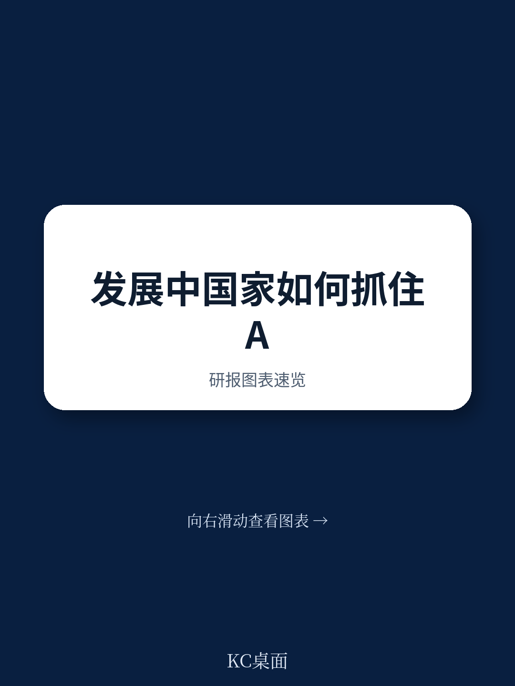
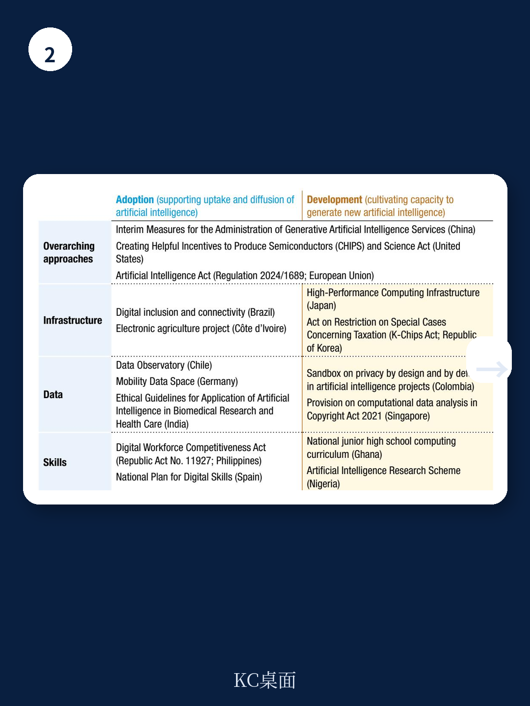

# 联合国贸发会议：AI竞赛中，中国和印度不是追赶者，而是结构性例外者

全球经济的价值重心正在从廉价劳动力和实物资产，转向知识密集型服务和无形资产。这一转变在人工智能领域表现得尤为剧烈。联合国贸发会议（UNCTAD）在最新发布的第120号政策简报中，提出了一个与市场主流叙事存在微妙差别的判断：发展中国家在AI浪潮中并非注定落后，部分国家已经展现出超越其收入水平的结构性潜力。报告明确指出，巴西、中国、印度和菲律宾是“在技术准备度上表现超出预期的国家”。

这份报告的核心主张并非简单的“发展中国家要追赶AI”，而是给出了一个更具操作性的框架：国家AI战略必须同时回答“如何采用”与“如何发展”两个问题，并且需要根据自身在基础设施、数据、技能这三个杠杆点上的具体短板，设计差异化的追赶路径。那些试图复制发达国家路径的国家，可能反而会陷入更深的被动。

## 1. 技术准备度的“超预期者”揭示了一个反常识：人口规模可以成为AI战略的独立变量

UNCTAD构建的前沿技术准备度指数，将国家表现与人均GDP进行相关性分析。绝大多数国家落在正相关趋势线附近，但少数国家的表现显著高于其收入水平所对应的预期值。报告特别点名了巴西、中国、印度和菲律宾。

这组名单背后的共同特征是更强的研发活动和工业能力。但真正值得推敲的，是人口规模在其中的作用机制。报告在分析AI技能准备度时，使用了两个代理指标：拥有高等学历的劳动年龄人口占比，以及GitHub开发者占劳动年龄人口的比例。在开发者占比这一指标上，发达国家整体领先，但报告给出了一个重要的修正性判断：中国和印度的开发者占比虽然不高，却拥有全球第二和第三大的开发者社区。

> **KC评论：** 这意味着，对于人口大国而言，“绝对人才池”可能比“人均技能密度”更具战略意义。当AI技术进入应用扩散阶段，一个拥有庞大开发者社区的国家，在应用场景、数据生成、本地化创新上的边际优势会持续放大。这份报告没有展开的是，这种“规模优势”是否足以弥补在基础算力和高端芯片上的结构性短板。完整报告中关于四类国家分类（领导者、从业者、起步者、落后者）的矩阵图，以及各国在基础设施、数据、技能三个维度上的具体得分，是理解这一问题的关键。继续看原文，真正有价值的是图表、假设和验证路径；完整报告与KC评论在每日汇编。

## 2. 这轮变化真正考验的是企业能否把规模转化为议价权

报告指出，自动化和资本深化正在侵蚀低收入经济体的廉价劳动力优势。这是一个已经被广泛讨论的趋势，但UNCTAD的独特视角在于，它将这一现象与知识密集型服务的崛起联系起来。报告认为，数字平台的兴起正在将经济体系转向数据驱动，而创新活动正日益集中在知识密集型服务业。

这意味着，传统的“先工业化、再服务业化”的产业升级路径可能不再适用。发展中国家需要在发展现代工业的同时，同步构建知识密集型服务能力。报告引用的一个关键数据是：截至2023年底，全球89项国家AI政策中，只有6项来自最不发达国家。发达国家的政策制定正在产生显著的溢出效应，实际上在压缩其他国家的政策选择空间。

> **KC评论：** 这里的隐含逻辑是，AI政策的“窗口期”正在收窄。当你还在讨论是否要制定AI战略时，领先国家已经通过CHIPS法案、AI法案等工具，锁定了半导体、算力基础设施和数据治理规则。后发国家如果只是简单模仿，可能永远处于规则接受者而非规则制定者的位置。报告表2中列举的各国政策工具案例，从中国的生成式AI管理办法到印度的生物医学AI伦理指南，展示了不同发展水平国家如何在不同杠杆点上寻找突破口。这些案例的完整细节和适用条件，在原文中有更深入的讨论。

## 3. 报告尚未完全回答的关键问题：如何量化“政策协调”的成本

UNCTAD提出了一个看似合理但执行难度极高的建议：协调政府各部门的行动，制定与产业、教育和科技政策一致的AI战略。报告强调，AI政策不应仅限于税收减免等激励措施，还应包括消费者保护、数字平台和数据保护等监管措施。

这一建议在逻辑上无懈可击，但在实践中，政策协调的成本往往被低估。不同部门之间的利益博弈、监管与创新的动态平衡、以及长期战略与短期选举周期的冲突，都是报告没有深入讨论的“黑箱”。特别是当AI技术本身仍在快速迭代时，过早的、过细的监管可能抑制创新，而过晚的、过松的监管可能导致技术滥用。

报告提出的“采用”与“发展”双轨政策框架，在理论上提供了平衡点，但缺少对“何时从偏向采用转向偏向发展”这一动态决策机制的讨论。对于资源有限的发展中国家而言，这是一个无法回避的取舍。

## 4. 给读者的观察框架：用三个杠杆点重新审视任何国家的AI叙事

UNCTAD的分析框架提供了一个简洁但有力的评估工具：基础设施、数据、技能。这三个杠杆点不仅是国家层面的政策抓手，也是理解企业竞争力和资产定价逻辑的底层坐标。

基础设施维度，需要区分“数字连接”和“计算能力”。许多国家在光纤和移动网络覆盖率上表现不错，但在数据中心、高速网络和半导体供应链上严重依赖外部。数据维度，需要区分“数据规模”和“数据质量与治理”。中国和印度拥有庞大的数据生成量，但数据标准化、互操作性和隐私保护机制仍在建设中。技能维度，需要区分“基础数字素养”和“高级AI研发能力”。报告中的图3清晰展示了发达国家、发展中国家和最不发达国家在这两个指标上的断层。

> **KC评论：** 当投资者或决策者听到“某国在AI领域取得突破”时，不妨用这三个杠杆点做一次快速压力测试：它的计算能力是否自主可控？它的数据治理是否支持跨行业、跨国的AI应用？它的教育体系能否持续输出从数据标记到算法研发的完整人才链？报告图1和图2的交叉分析，为这种评估提供了量化基准。原文中关于四类国家分类的详细定义和具体国家的案例，值得反复对照。

## 5. 对资产定价和产业竞争格局的潜在含义

虽然UNCTAD的政策简报并非投资报告，但其分析框架对理解当前全球AI产业竞争格局有直接启示。报告强调，国家AI能力正在成为新的比较优势来源。那些在技术准备度上表现超预期的国家，其本土AI企业可能享有更低的政策风险和更高的本地化适配能力。

反过来，那些在基础设施、数据、技能三个维度上存在系统性短板的国家，即使拥有低成本劳动力或自然资源，也可能在AI驱动的产业重构中逐渐失去竞争力。报告提到的“廉价劳动力优势被侵蚀”这一趋势，对于依赖劳动密集型制造业的经济体而言，是一个需要严肃对待的长期结构性挑战。

报告同时指出，国际协作和知识共享可以增强国家层面的努力，尤其是在国内资源和能力有限的情况下。这意味着，跨国技术合作、数据跨境流动协议和AI治理标准的制定，将成为未来地缘经济博弈的重要战场。

## 6. 顺着这些未解问题，继续深入

这份UNCTAD政策简报的价值，不在于它给出了多少新的数据，而在于它提供了一个能够穿透不同发展阶段国家差异的分析框架。它提醒我们，AI竞争不是一场“富国对穷国”的零和游戏，而是一场关于基础设施、数据治理和人才培养的系统性竞赛。那些能够在这三个杠杆点上同步发力的国家，无论当前收入水平如何，都有可能找到属于自己的结构性机会。

但报告也留下了几个值得继续追问的问题：政策协调的成本如何量化？在资源有限的情况下，三个杠杆点之间应该如何排序？当领先国家持续加大研发投入时，后发国家的“追赶窗口”究竟还剩多久？这些问题的答案，或许就藏在报告的具体图表、案例和假设路径之中。

更多国际信源汇编与评论，每日更新，汇总国际主流叙事、数据与图表，观测边际变化。每日汇编会将单篇报告放回当天的主线逻辑中，整理成中文摘要、KC评论和图表合集，便于喂给AI，也便于人工快速扫描市场dynamics。在这里，汇聚了头部券商、PE/VC、投行、并购、hedge fund、资管机构、战略咨询、智库等朋友，期待交流。

Personal reading notes and learning share only. Not investment advice.
