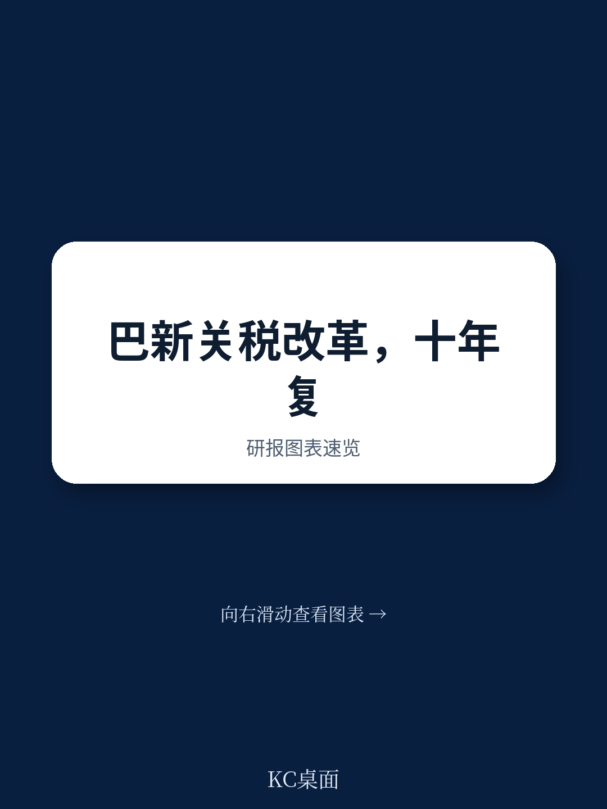
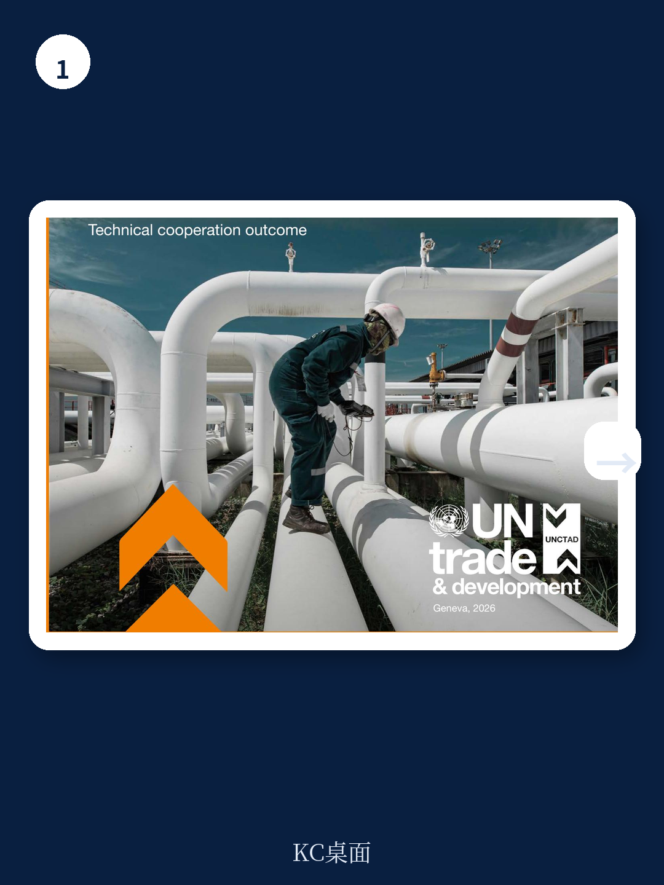
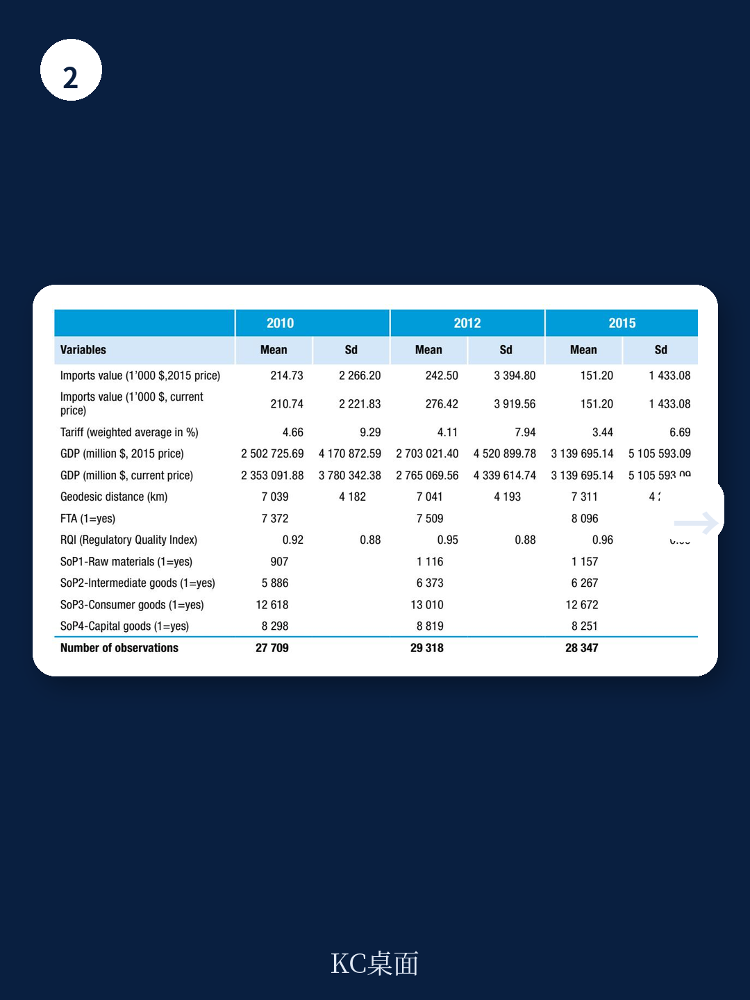

# 联合国贸发会议：不是关税，基础设施和政策不确定性才是巴新企业真正瓶颈

巴布亚新几内亚过去二十年经历了一场罕见的贸易政策实验：从主动削减关税到突然转向保护主义，再到如今站在十字路口。联合国贸发会议一份最新技术合作报告，系统评估了这一“关税削减计划”的得失。报告的结论清晰且反直觉：关税削减并未引发进口激增，也未造成财政收入塌陷；真正拖累竞争力的，是基础设施、物流成本和政策不确定性，而非进口竞争。

这份报告的价值不仅在于评估巴新的贸易政策，更在于它为所有面临“开放还是保护”抉择的发展中经济体，提供了一组基于证据的决策参考。当全球贸易体系面临碎片化压力，当产业政策重新成为主流叙事，巴新案例提醒我们：关税工具的实际效果，往往与政策制定者的直觉相去甚远。

## 1. 关税削减的十年，巴新并未经历“进口冲击”

报告将评估分为两个阶段：2012至2017年的关税削减期，以及2018至2023年的关税回调期。在削减阶段，巴新将平均最惠国关税降至约3.2%，成为区域内最开放的经济体之一。按照传统贸易理论的预期，大幅降低关税应当刺激进口增长，对国内产业形成竞争压力。

但实际数据并未支持这一假设。报告指出，关税削减期恰逢巴新进口需求整体偏弱，因此并未出现所谓的“进口激增”。当巴新在2018年后提高部分产品关税时，进口水平已经处于低位且稳定，关税上调对进口的额外抑制效应十分有限。这意味着，决定巴新进口规模的主要因素并非关税，而是国内需求基本面、大宗商品周期以及大型资源项目的开发节奏。

> **KC评论：** 这组数据打破了“降关税=进口暴增”的简单叙事。对于政策制定者而言，真正的风险不在于关税水平本身，而在于关税政策的频繁变动所制造的商业不确定性。报告调查显示，61%的受访企业认为2018至2020年的关税调整扰乱了投资决策。这一比例远高于关税水平变化对进口的直接影响。政策稳定性本身，就是一种重要的竞争力要素。

## 2. 关税收入不降反升，烟草减税才是关键变量

对于依赖关税收入的发展中经济体而言，关税削减最直接的担忧是财政收入下降。但巴新案例给出了一个令人意外的答案：关税削减期间，海关收入并未大幅缩水。

模拟分析显示，2012至2017年的关税削减每年仅减少约780万美元的关税收入，仅占当年关税收入的1%左右，几乎可以忽略。而2018年后的关税上调，本应带来收入增长，但实际征收额反而比按2018年基线税率应有的水平低了约1560万美元。原因在于：巴新大幅削减了烟草关税，而烟草正是其最重要的关税收入来源之一。这一削减叠加进口量下降和潜在的避税动机，抵消了其他产品关税上调带来的增收效果。

从更宏观的视角看，巴新的关税收入在绝对金额上从2010年的7150万美元增长至2023年的1.12亿美元，但其在总财政收入中的占比持续下降，因为全球销售税和其他税种的增长更为迅速。税收占GDP的比例从2010年左右的水平降至2023年的15.8%。

> **KC评论：** 关税改革的财政风险被严重高估。巴新的经验表明，关税收入在总税基中的占比本就呈下降趋势，且受单一产品（如烟草）的税率变动影响极大。对于多数发展中经济体而言，与其纠结于关税削减对财政的短期冲击，不如加快税制改革，扩大增值税或销售税等更稳定、更高效的税基。完整报告中对烟草关税调整的细节模拟，以及不同产品类别的税收入弹性分析，值得细读。

## 3. 企业竞争力的真正瓶颈不在关税，而在基础设施与政策不确定性

报告中最具洞察力的部分，来自于对50家巴新企业的问卷调查。这些企业的主观认知，揭示了关税政策之外更深层的竞争困境。

在关税削减期，36%的受访企业报告受益于更低的投入成本，能够降价、扩张或提升生产率；但55%的企业表示没有感受到任何影响。而在关税上调后，53%的企业报告了负面效应。这一不对称分布表明，关税政策的受益者相对集中，而受损者更为分散且感受更强烈。

更关键的是，企业将“价格”视为竞争中的首要障碍。巴新企业认为自身无法匹敌进口商品的价格，根本原因不是关税水平，而是国内高昂的运输成本、电力成本和中间投入品价格。质量感知是第二大竞争劣势。企业还明确指出，交通物流成本、投入品价格高企、政策不可预测性和监管负担，是制约经营的最严重约束。

报告因此得出结论：巴新的竞争挑战本质上是结构性的，而非关税性的。即使维持高关税保护，只要国内基础设施和营商环境没有实质改善，企业依然无法获得真正的竞争力。关税保护反而可能延缓必要的改革，并最终以更高的消费者价格为代价。

## 4. 报告尚未完全回答的关键问题：保护主义能否培育出真正的新产业？

报告的结论倾向于支持关税自由化，并建议巴新恢复渐进式关税合理化路径。但一个尚未被完全回答的问题是：2018年后的保护主义措施，是否真的帮助了目标产业？报告提到，关税上调旨在保护“婴儿产业”，但并未提供充分的证据来评估这些产业是否因此获得了成长。

例如，报告展示了2010年至2018年间“新产品诞生”的列表，包括铬矿石、镍氧化物烧结物、乙烯等产品的出口从无到有。但这些出口增长有多少归因于关税保护，多少归因于全球大宗商品价格周期和资源开发项目？报告承认，巴新的出口结构高度依赖矿业和石油天然气，制造业占比持续停滞。关税保护能否改变这一结构性特征，仍是一个开放问题。

对于政策制定者而言，这一不确定性恰恰是最需要关注的。保护主义政策的成本是即时的（更高的消费者价格、扭曲的资源配置），而收益却是未来且不确定的。如果缺乏明确的产业退出机制和竞争力提升路径，保护很容易从“临时措施”变成“永久保护”。

## 5. 给读者的观察框架：如何判断一个经济体的贸易政策是否走在正确轨道上

基于这份报告的发现，可以提炼出三个用于评估贸易政策质量的观察维度

第一，看关税政策的稳定性，而非单纯的水平高低。频繁变动的关税政策制造的不确定性，对投资的抑制作用可能远大于高关税本身。巴新61%的企业因关税调整而推迟或取消投资，这一数据本身就是对政策波动性的最有力批评。

第二，看关税收入在总税基中的趋势，而非绝对金额。如果关税收入占比持续下降，说明税制正在向更现代化的方向转型。此时关税削减的财政风险可控，政策制定者不必过度担忧。

第三，看企业竞争力瓶颈的真正来源。如果企业抱怨的主要是物流成本、电力供应和监管负担，那么关税保护就是错误的药方。真正的改革议程应该聚焦于基础设施投资、营商环境改善和贸易便利化，而非在关税水平上做文章。

这份联合国贸发会议的报告提供了丰富的数据、图表和模拟结果，包括重力模型估计、局部均衡模拟、产品层面的关税分布变化，以及企业调查的详细反馈。这些原始素材的价值远超本文的提炼。对于希望深入理解贸易政策与经济发展之间复杂关系的读者，完整报告中的技术附件、假设条件和验证路径，是值得花时间研读的内容。

更多国际信源汇编与评论，扫码交流，每日更新。我们汇总国际主流叙事、数据与图表，观测边际变化。每日汇编将单篇报告放回当天的主线，整理成中文摘要、KC评论和图表合集，便于喂给AI，也便于人工快速扫描市场动态。汇聚了头部券商、PE/VC、投行、并购、对冲基金、资管机构、战略咨询、智库等朋友，期待交流。

Personal reading notes and learning share only. Not investment advice.
