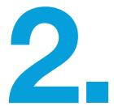
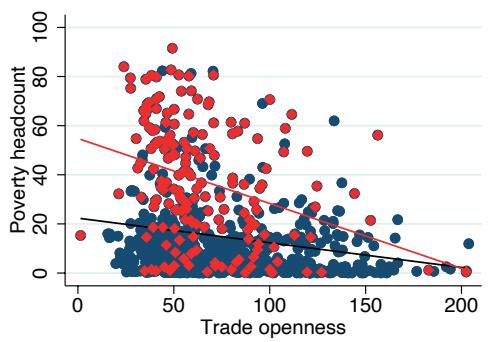
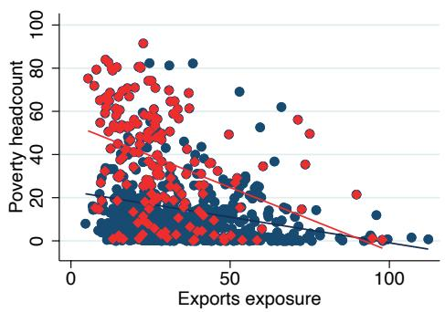
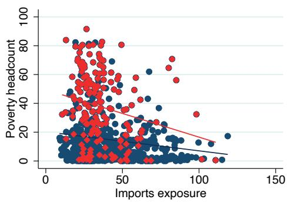
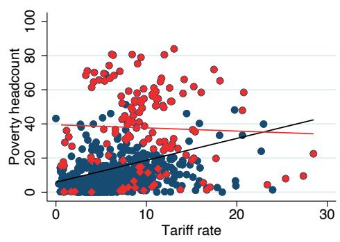
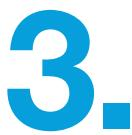
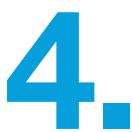
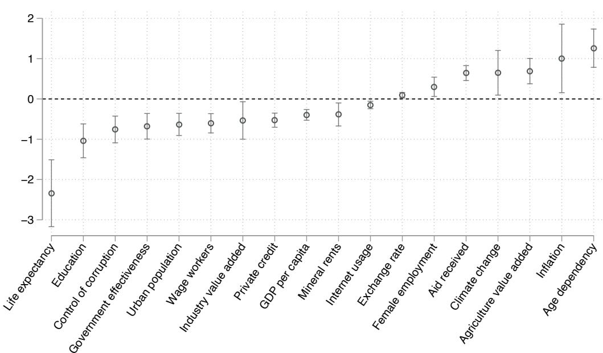
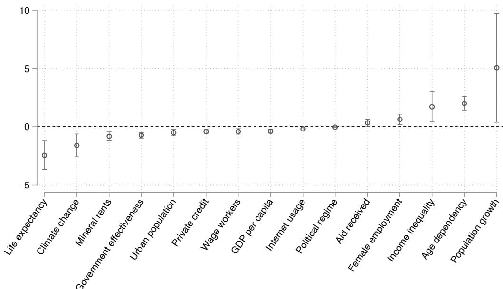

Working paper

#10

September 2025

UNCTAD/WP/2025/2

# Revisiting the Trade-Poverty Nexus in Developing Countries

Patrick N. Osakwe

Trade, Poverty and Inequalities Branch, ALDC, UNCTAD

patrick.osakwe@unctad.org

Olga Solleder

Trade, Poverty and Inequalities Branch, ALDC, UNCTAD

olga.solleder@unctad.org

## Abstract

This paper revisits the trade-poverty relationship in developing countries using panel data and recent estimation techniques that control for omitted variable bias. It finds robust evidence that more trade dependence (as measured by a higher trade-GDP ratio) reduces poverty in developing countries but has no statistically significant effect on poverty in Africa. It also finds that trade reforms (as measured by changes in tariffs) have no systematic effect on poverty in either developing countries or in Africa. When interaction effects are introduced, we find that trade is a necessary but not sufficient condition for poverty reduction and that country characteristics play an important role in determining whether potential benefits of trade will be realised in any specific context.

## Key words

Poverty, trade, developing countries, Africa, post-double-selection, PDS, lasso.

## Contents

1. Introduction......3
2. Stylised facts on trade and poverty......5
3. Empirical approach and data......8
4. Estimation results......10
5. Robustness checks......18
6. Conclusions......20
References......22
Annex......25

# 1. Introduction

International trade is considered an important mechanism through which economies could potentially foster sustained growth and eradicate poverty (Estevadeordal and Taylor 2013). By opening an economy to trade, a country can, among others, expand consumer choice, enhance access to technology, improve productivity, enlarge the market size of its products and better exploit economies of scale (UNCTAD 2004; Winters et al. 2004). For the most part, in the developed countries and in some large developing countries, this potential of trade for growth and poverty reduction has been realised. However, in many developing countries, particularly in Africa, an increase in international trade has gone hand in hand with an increase in the number of poor people, reflecting the fact that the gains from trade have not trickled down to a large section of the population (United Nations 2014). This lack of inclusion in the practice of international trade and in the sharing of its benefits has led to criticisms of globalization (World Bank and WTO 2018). Against this backdrop, a challenge facing policymakers is how to strengthen linkages between trade and poverty with a view to making trade work better for the poor in developing countries. Finding a credible answer to this question requires a careful and rigorous empirical analysis of the relationship between trade and poverty to decipher as well as get a good understanding of the linkages between the two phenomena.

In general, international trade can have a positive or negative effect on poverty depending on the transmission mechanisms considered. Winters et al. (2004) provided a very interesting review of the literature on trade and poverty. They suggest several economic channels through which trade could affect poverty: income and growth; relative prices; government revenues; and employment and wages. Studies have shown that opening an economy to trade can boost income and growth, create employment, and reduce poverty. Furthermore, changes in relative prices are also important in understanding how trade affects poverty. When trade either reduces prices of goods consumed by the poor or increases the prices of the goods they sell, it reduces poverty (World Bank and WTO 2018). But more openness to trade can also exacerbate poverty. For example, in developing countries that rely heavily on trade tax revenue, trade liberalization could lead to a decline in government revenue, which jeopardises the provision of social services and increases poverty. Furthermore, liberalization exposes domestic firms to intense competition and increases the bargaining power of capital and skilled labour, relative to unskilled labour, thereby decreasing the returns to unskilled labour and increasing poverty.

Several empirical studies have been conducted on the trade-poverty nexus with a focus on the role of trade as a driver or determinant of poverty. $^{1}$ For example, using macro-level data, Le Goff and Singh (2014) examined the relationship between trade and poverty in Africa over the period 1981-2010 and found that the impact of trade on poverty depends on country characteristics such as depth of financial sector, level of education, and quality of institutions. In a related study, Kpodar and Singh (2011) find no evidence of a robust link between trade and poverty in developing countries. Durongkaveroj (2024) conducted an empirical test of the trade-poverty nexus using macro-level data for 123 economies, from 1970 to 2017, and found that trade openness reduces poverty even after controlling for the growth effect. Using a vector error correction model, Fauzel (2022) investigated the impact of trade on poverty in a small island economy and concluded that trade reduces poverty in the long run rather than in the short run. $^{2}$

In contrast to the studies above that used macro-level data, Topalova (2010) examined the relationship between trade liberalization and poverty using micro-level data for India and found that the incidence of poverty was 2 percentage points higher in districts that experienced tariff changes compared to those that experienced no change in tariffs. The lack of factor mobility within India was identified as the principal reason for these results. In another paper, Balistreri et al. (2018) explored the effects of trade costs on poverty in Eastern and Southern Africa using a computable general equilibrium model and showed that reducing trade costs would have substantial pro-poor effects in these economies.

While the literature on the trade-poverty nexus is rich and growing, and has provided useful insights, existing studies have a major limitation in the sense that they employ an ad-hoc and subjective approach to model selection which creates substantial risks of omitted variable bias and prohibits a causal interpretation of the regression results. Our paper addresses this limitation in the literature by using a post-double-selection (PDS) method of estimation and inference which permits selection of covariates in a principled manner and mitigates the risk of omitted variable bias in model selection (Belloni et al. 2014a and 2014b; Urminsky et al. 2016). $^{3}$ The second contribution of our paper is that, in contrast to existing studies, it allows for a wide set of interaction effects between trade openness and the control variables rather than restricting these effects to a few control variables selected by the researcher. Finally, we allow for heterogeneity in the impact of trade openness by using an aggregate measure of openness (trade-GDP ratio), measures of imports and exports exposure, and a wide selection of tariff indicators.

The rest of the paper is organised as follows. Section 2 of the paper presents some stylised facts on trade and poverty in developing countries, while Section 3 presents the empirical framework adopted in the paper and the data used. Section 4 presents and discusses the regression results, and Section 5 contains robustness checks. The final section provides some concluding remarks.

# Stylised facts on trade and poverty

This section provides some stylised facts on trade and poverty in developing countries based on an examination of the unconditional correlations between these two phenomena within and across countries. We start by exploring the association between trade and poverty at the country level. Table A2 of the Annex lists all countries for which we have at least three observations of the poverty headcount ratio (at \$2.15 a day, % of population), and trade which we measure using four different indicators: trade openness (exports and imports, % of GDP), exports exposure (exports, % of GDP), imports exposure (imports, % of GDP), and tariff rate (applied bilateral tariff rate, trade-weighted average of all products, %). Very different patterns of the relations between trade and poverty are observed within countries in the sample. For example, during the studied period (1995-2019) in Burkina Faso trade openness, exports exposure and imports exposure have negative correlations with poverty, while in Togo and Madagascar, the results are inverse: the bivariate correlations are all positive. In Mali, trade openness and imports exposure have negative correlations with poverty, while exports exposure is positively associated with poverty.

To summarize, we observe a negative correlation between trade and poverty in 56 per cent of developing countries using trade openness as the measure of trade (Table 1). If we measure trade by exports exposure and imports exposure, we observe a negative correlation in 53 and 64 per cent of countries, respectively. The same trend is also present in the African sample: poverty is negatively correlated with trade openness in 58 per cent of cases, with exports exposure in 58 per cent of cases, and with imports exposure in 64 per cent of cases. Turning to the tariff rate, the results differ depending on the sample. In 15 per cent of developing countries in the sample, a tariff increase is associated with poverty reduction, while this share rises to 25 per cent in Africa.

Table 1
Number and share of countries where trade or tariff reduce poverty (Negative correlation)

<table><tr><td></td><td>Trade openness</td><td>Exports exposure</td><td>Imports exposure</td><td>Tariff rate</td></tr><tr><td colspan="5">Developing countries</td></tr><tr><td>Number (out of 86)</td><td>48</td><td>46</td><td>55</td><td>13</td></tr><tr><td>Share</td><td>56%</td><td>53%</td><td>64%</td><td>15%</td></tr><tr><td colspan="5">Africa</td></tr><tr><td>Number (out of 36)</td><td>21</td><td>21</td><td>23</td><td>9</td></tr><tr><td>Share</td><td>58%</td><td>58%</td><td>64%</td><td>25%</td></tr></table>

Note: Yearly data 1995-2019, in levels.

Regarding the association between trade and poverty across countries, pooling data enables us to estimate the strength of the bivariate correlations and determine the average slope across countries. The results are reported in Table 2. The first observation is the strength of the bivariate correlation, which is strongly statistically significant for all measures of trade in both the developing country sample and the African sample (all p-values are equal to or smaller than 0.005), with the only exception being the association computed using tariff rates in African countries. The correlation coefficients are negative when trade is measured by trade openness, exports exposure and imports exposure. Furthermore, the correlation coefficient between the tariff rate and poverty is positive and strongly statistically significant in the case of developing countries (0.304). Interestingly, the correlation coefficients of poverty with trade openness, exports exposure and imports exposure are systematically higher for African countries (-0.287, -0.35, and -0.212, respectively) in comparison with developing countries (-0.165, -0.2, and -0.12, respectively).  

## Table 2 Correlation of poverty with trade indicators, by country group

<table><tr><td></td><td>Developing countries</td><td>Africa</td></tr><tr><td>Trade openness</td><td>-0.165(0.000)</td><td>-0.287(0.000)</td></tr><tr><td>Exports exposure</td><td>-0.200(0.000)</td><td>-0.350(0.000)</td></tr><tr><td>Imports exposure</td><td>-0.120(0.001)</td><td>-0.212(0.005)</td></tr><tr><td>Tariff rate (applied, weighted mean)</td><td>0.304(0.000)</td><td>-0.040(0.646)</td></tr></table>

Note: Yearly data 1995-2019, in levels. P-value in parentheses.

Figure 1, which is a plot of the correlations between trade and poverty, by country groups, makes the difference between Africa and developing countries visually apparent. On average, poverty is more than twice as high in Africa (22.2 per cent of population) as in developing countries (10.1 per cent), while trade is just a bit lower in Africa than in developing countries. Average trade openness stands at 62.2 per cent and 66.7 per cent in Africa and developing countries, respectively, while the average tariff in Africa is 13.5 per cent in comparison to 11.1 per cent in developing countries (summary statistics for all variables are reported in Table A5 of the Annex).

## Figure 1

## Correlation of poverty with trade indicators, by country group

  
Note: African countries are denoted by diamond-shaped red markers, and developing countries are shown as round blue markers. Yearly data (1995-2019) in levels; each dot is a country-year.

# Empirical approach and data

Following the recent empirical literature on the least absolute shrinkage and selection operator (lasso) and the PDS lasso, the empirical framework adopted in this paper is based on the linear regression model below.

$$
P o v e r t y _ {i t} = T r a d e _ {i t} \alpha + X _ {i t} \beta + \varepsilon_ {i t}, i = 1, \dots , n.; t = 1, \dots , T.\tag{1}
$$

$$
T r a d e _ {i t} = X _ {i t} \delta + \mu_ {i t}, i = 1, \dots , n.; t = 1, \dots , T.\tag{2}
$$

Where $Poverty_{it}$ is a measure of poverty in country i at time t, $Trade_{it}$ is an indicator of trade openness or liberalization in country i at time t, $X_{it}$ is a vector of all control variables considered in country i at time t, while $\beta$ and $\delta$ are vectors of coefficients on the controls in equations 1 and 2, respectively. In the model specified, the coefficient on the trade variable ( $\alpha$ ) is the parameter of interest. And $\varepsilon_{it}$ and $\mu_{it}$ are error terms in equations 1 and 2 respectively.

Lasso is a popular method for regularization and is very useful for model selection when the goal is forecasting or prediction rather than drawing inference about model parameters. It is inappropriate for making valid inferences about model parameters because, among others, it tends to exclude regressors that are highly correlated with the covariate of interest but have a moderate or small impact on the outcome variable, thereby creating an omitted variable bias (Belloni et al. 2014a). To address this issue, researchers have resorted to the use of the PDS estimator, which reduces the risk of omitted variable bias and permits estimation and inference in high-dimensional linear models where the number of control variables is larger than the sample size (Belloni et al. 2014a and 2014b). Wüthrich and Zhu (2023) have shown that, in finite samples, the behaviour of the PDS estimator can be characterised by three regimes: (i) non-negligible omitted variable bias; (ii) negligible omitted variable bias; and (iii) absence of omitted variable bias. In this context, when employing this estimator, they recommend assessing its robustness by increasing the penalty parameter and if it does not lead to a significant change in the coefficient of interest, this would imply that the underlying model is in regimes where omitted variable bias is either negligible or absent. Following this literature, we adopt the PDS approach in estimating the regression model specified in equations 1 and 2. We also conduct robustness checks on the stability of the coefficient of interest by increasing the regularization parameter.

The implementation of the PDS approach to estimation of our model proceeds in three steps. In the first step, we run a linear regression of Poverty on all control variables in the vector X and identify the controls selected by lasso under this step. In the second step, we run a linear regression of Trade on all control variables in the vector X and identify the selected controls for this step. In the final step, we run a regression of Poverty on Trade and the union of the controls selected in steps 1 and 2.

Regarding the choice of control variables, unlike previous studies, we include all potential drivers of poverty, identified in the literature, for which data are available. Due to the large number of control variables and space constraints, we avoid a detailed description and discussion of each of the control variables here. Rather, a summary of these variables, their sources, and the nature of their potential links to poverty (the expected signs) are presented in Table A1 of the Annex. The total number of controls used in the analysis is 26, covering economic, demographic, social and political country-level indicators (the full list is in Table A3). The data set covers the period from 1995 to 2019 and includes 76 developing countries, 32 of which are in Africa (Table A4).

We measure poverty by the poverty headcount ratio, i.e., the share of the population living on less than \$2.15 a day (2017 PPP), corresponding to the extreme poverty level. In addition to the standard trade openness measure (share of exports and imports in GDP), we use two disaggregated measures, namely exports exposure (share of exports in GDP) and imports exposure (share of imports in GDP). We also use a trade policy proxy, namely the trade-weighted applied preferential tariff rate. $^{4}$ This approach can allow us to capture different aspects of trade and trade policy.

Regarding data sources, the poverty headcount ratio, exports exposure, imports exposure and tariff rates are sourced from the World Development Indicators, and trade openness is from the UNCTADStat database. We follow the usual approach in the poverty and growth literature by aggregating data into 5-year periods and taking logs of continuous variables (Le Goff and Singh 2014; Desai and Rudra 2019). In this setting, each period represents a 5-year timespan. This aggregation helps to smooth business cycle fluctuations and permits a focus on the medium-to-long-term effects of trade openness. Furthermore, it is necessary to better balance the data, particularly indicators derived from household surveys, which in developing countries are run every 5 years on average. $^{5}$ The exact definition of all variables and the links to respective databases are provided in Table A3 of the Annex.

# Estimation results

In this section, we present the results of estimating our model, represented in equations 1 and 2, using the PDS estimator described in Belloni et al. (2014b). We implement a linear PDS procedure developed by Ahrens, Hansen, and Schaffer (2019) with a plugin iterative formula to select the optimal penalisation parameter in each step, and account for within-country correlation. Table 3 contains the results on the effects of various trade indicators on poverty using the PDS estimator. The unions of controls retained by the PDS procedure are reported in the notes of the table, while the summary statistics on the dependent and independent variables are provided in Table A5 of the Annex.

Each column of Table 3 shows the estimation results for a different measure of trade, namely trade openness (column 1), exports exposure (column 2), imports exposure (column 3) and tariff rate (column 4) for developing countries, and then, in the same order for Africa (columns 5-8). Each regression includes 26 potential controls, out of which PDS lasso selects relevant covariates whose inclusion is supported by the data. Using the PDS lasso, we find that in developing countries, trade reduces poverty and the effect is both statistically and economically significant. More specifically, a 1 per cent increase in trade openness leads to a 0.36 per cent reduction in extreme poverty in developing countries (column 1). The results for exports exposure and imports exposure are very similar, with coefficients being -0.376 and -0.454, respectively. The effect of the tariff rate on poverty is not statistically significant (column 4).

Regarding African countries, we do not find any statistically significant effects, irrespective of how trade is measured (columns 4-8 of Table 3). This result is similar to the findings of Le Goff and Singh (2014), indicating that, on average, there is no statistically significant relationship between trade and poverty in Africa, and that country characteristics determine whether the poverty impact of trade in an economy will be positive or negative. A variety of reasons can potentially explain the absence of a statistically significant relation. First, the African sample has a very limited number of observations. Household surveys are less frequent in Africa than in other regions, and hence, the data on poverty is scarce. In this context, and because we are using data averaged over 5-years, our sample of African countries contains, on average, 2.4 observations of poverty data per country over the span of 25 years. Our preferred estimator, the PDS lasso can handle this data issue and is one of the reasons we selected it over alternative empirical approaches. Second, there may be no direct link between trade liberalization and poverty in African countries, as a number of preceding papers suggest (see, for example, Le Goff and Singh 2014). Third, country heterogeneity may mask the relations between trade and poverty at the aggregate level.

In addition to the causal effect of the inference regressor, PDS lasso allows us to identify which covariates had empirical support for inclusion among control variables. Out of the 26 potential controls, PDS lasso selected 6-10 controls, depending on the model, as variables to retain. The retained controls include economic, demographic, social and political variables, and some controls appear to be relevant only in some specifications. Income inequality, life expectancy, and wage workers were retained by PDS lasso as controls in all eight regressions, followed by GDP per capita, investment, and internet, which are retained in at least five models. Age dependency and female employment are retained in all models estimated for African countries. Urban population, government expenditure, exchange rate, agricultural value added, and control of corruption also appear among selected controls for the regressions with African countries. This difference in selected controls and the wide-ranging nature of controls underscores the importance of using estimation techniques that are able to account for model uncertainty and confounders in empirical studies on the trade-poverty nexus.

## Table 3 Impact of trade on poverty (after selection among high-dimensional controls)

<table><tr><td>Dep. var.:</td><td colspan="4">Developing countries</td><td colspan="4">Africa</td></tr><tr><td>Poverty headcount</td><td>(1)</td><td>(2)</td><td>(3)</td><td>(4)</td><td>(5)</td><td>(6)</td><td>(7)</td><td>(8)</td></tr><tr><td>Trade openness</td><td>-0.363***(-2.99)</td><td></td><td></td><td></td><td>0.111(0.75)</td><td></td><td></td><td></td></tr><tr><td>Exports exposure</td><td></td><td>-0.376***(-3.11)</td><td></td><td></td><td></td><td>0.110(0.60)</td><td></td><td></td></tr><tr><td>Imports exposure</td><td></td><td></td><td>-0.454***(-3.45)</td><td></td><td></td><td></td><td>0.023(0.11)</td><td></td></tr><tr><td>Tariff rate(applied, weighted mean)</td><td></td><td></td><td></td><td>-0.117(-1.05)</td><td></td><td></td><td></td><td>-0.078(-0.60)</td></tr><tr><td>No of controls retained by PDS lasso</td><td>6</td><td>8</td><td>7</td><td>7</td><td>7</td><td>10</td><td>8</td><td>8</td></tr><tr><td>No of observations</td><td>219</td><td>219</td><td>219</td><td>213</td><td>78</td><td>78</td><td>78</td><td>76</td></tr></table>

Notes: Estimated using PDS lasso, with a plugin iterative formula to select the optimal $\lambda$ , standard errors are clustered by country, t statistics in parentheses, \* p<0.1, \*\* p<0.05, \*\*\* p<0.01. The outcome variable and continuous regressors are in log form. Out of 26 included controls, PDS lasso retained the following controls (by model): Income inequality (all), life expectancy (all), wage workers (all), GDP per capita (1,2,3,4,5,6), investment (1,2,3,6,7), internet (1,2,3,4,8), age dependency (5,6,7,8), female employment (5,6,7,8), industry value added (1,6), urban population (5,6), education (2,4), government expenditure (7,8), remittances (3), political regime (4), exchange rate (7), agricultural value added (6), and control of corruption(8).

Import tariffs appear to be statistically insignificant in both the developing countries sample and the African sample. In our set-up, the tariff rates are aggregated from the product level to the country level. To account for multiple ways in which such aggregation can be done and for the existence of multiple tariff rates, we re-run our baseline regression using different measures of tariffs: simple average and trade-weighted average, different rates (applied rate which takes into account country's membership in trade agreements vs. most favoured nation rate), and different product groups (aggregating all products, only primary products or only manufacturing products). The results for developing countries are presented in Table 4. We find a weak statistically significant association between poverty and applied tariff rates for primary products, independently of how the aggregation is done. Column 3 corresponds to the simple mean with the coefficient equal to -0.186, while column 5 corresponds to the weighted mean with the coefficient of -0.165. The association is negative, suggesting that an increase in the applied tariff rate on agricultural goods can decrease poverty.

Table 4
Impact of trade on poverty: Alternative measures of tariffs (Developing countries)

<table><tr><td>Dep. var.: Poverty headcount</td><td>(1)</td><td>(2)</td><td>(3)</td><td>(4)</td><td>(5)</td><td>(6)</td><td>(7)</td><td>(8)</td><td>(9)</td><td>(10)</td><td>(11)</td></tr><tr><td>Tariff rate, applied, simple mean, all products (%)</td><td>-0.061(-0.55)</td><td></td><td></td><td></td><td></td><td></td><td></td><td></td><td></td><td></td><td></td></tr><tr><td>Tariff rate, applied, simple mean, manuf. products (%)</td><td></td><td>-0.021(-0.20)</td><td></td><td></td><td></td><td></td><td></td><td></td><td></td><td></td><td></td></tr><tr><td>Tariff rate, applied, simple mean, primary products (%)</td><td></td><td></td><td>-0.186*(-1.74)</td><td></td><td></td><td></td><td></td><td></td><td></td><td></td><td></td></tr><tr><td>Tariff rate, applied, weighted mean manuf. products (%)</td><td></td><td></td><td></td><td>-0.072(-0.71)</td><td></td><td></td><td></td><td></td><td></td><td></td><td></td></tr><tr><td>Tariff rate, applied, weighted mean primary products (%)</td><td></td><td></td><td></td><td></td><td>-0.165*(-1.84)</td><td></td><td></td><td></td><td></td><td></td><td></td></tr><tr><td>Tariff rate, MFN, simple mean, all products (%)</td><td></td><td></td><td></td><td></td><td></td><td>0.002(0.01)</td><td></td><td></td><td></td><td></td><td></td></tr><tr><td>Tariff rate, MFN, simple mean, manuf. products (%)</td><td></td><td></td><td></td><td></td><td></td><td></td><td>0.055(0.40)</td><td></td><td></td><td></td><td></td></tr><tr><td>Tariff rate, MFN, simple mean, primary products (%)</td><td></td><td></td><td></td><td></td><td></td><td></td><td></td><td>-0.055(-0.40)</td><td></td><td></td><td></td></tr><tr><td>Tariff rate, MFN, weighted mean, all products (%)</td><td></td><td></td><td></td><td></td><td></td><td></td><td></td><td></td><td>0.026(0.17)</td><td></td><td></td></tr><tr><td>Tariff rate, MFN, weighted mean, primary products (%)</td><td></td><td></td><td></td><td></td><td></td><td></td><td></td><td></td><td></td><td>-0.032(-0.25)</td><td></td></tr><tr><td>Tariff rate, MFN, weighted mean, manuf. products (%)</td><td></td><td></td><td></td><td></td><td></td><td></td><td></td><td></td><td></td><td></td><td>0.027(0.20)</td></tr><tr><td>No of controls retained by PDS lasso</td><td>7</td><td>7</td><td>7</td><td>7</td><td>7</td><td>7</td><td>7</td><td>6</td><td>8</td><td>7</td><td>7</td></tr><tr><td>No of observations</td><td>213</td><td>213</td><td>213</td><td>213</td><td>213</td><td>213</td><td>213</td><td>213</td><td>213</td><td>213</td><td>213</td></tr></table>

Notes: Estimated using PDS lasso, with a plugin iterative formula to select the optimal $\lambda$ , standard errors are clustered by country, t statistics in parentheses, $*p<0.1$ , $**p<0.05$ , $***p<0.01$ . The outcome variable and continuous regressors are in log form.

We undertake a similar exercise for African countries, testing whether our baseline results change when alternative measures of tariffs are used. As shown in Table 5, the effect of tariffs on poverty in the African countries remains insignificant, independently of the measure of tariffs used.

Table 5
Impact of trade on poverty: Alternative measures of tariffs (Africa)

<table><tr><td>Dep. var: Poverty headcount</td><td>(1)</td><td>(2)</td><td>(3)</td><td>(4)</td><td>(5)</td><td>(6)</td><td>(7)</td><td>(8)</td><td>(9)</td><td>(10)</td><td>(11)</td></tr><tr><td>Tariff rate, applied, simple mean, all products (%)</td><td>0.076 (0.36)</td><td></td><td></td><td></td><td></td><td></td><td></td><td></td><td></td><td></td><td></td></tr><tr><td>Tariff rate, applied, simple mean, manufactured products (%)</td><td></td><td>0.087 (0.45)</td><td></td><td></td><td></td><td></td><td></td><td></td><td></td><td></td><td></td></tr><tr><td>Tariff rate, applied, simple mean, primary products (%)</td><td></td><td></td><td>0.121 (0.62)</td><td></td><td></td><td></td><td></td><td></td><td></td><td></td><td></td></tr><tr><td>Tariff rate, applied, weighted mean manufactured products (%)</td><td></td><td></td><td></td><td>-0.044 (-0.34)</td><td></td><td></td><td></td><td></td><td></td><td></td><td></td></tr><tr><td>Tariff rate, applied, weighted mean primary products (%)</td><td></td><td></td><td></td><td></td><td>-0.088 (-0.70)</td><td></td><td></td><td></td><td></td><td></td><td></td></tr><tr><td>Tariff rate, most favoured nation, simple mean, all products (%)</td><td></td><td></td><td></td><td></td><td></td><td>0.007 (0.03)</td><td></td><td></td><td></td><td></td><td></td></tr><tr><td>Tariff rate, most favoured nation, simple mean, manufactured products (%)</td><td></td><td></td><td></td><td></td><td></td><td></td><td>0.036 (0.13)</td><td></td><td></td><td></td><td></td></tr><tr><td>Tariff rate, most favoured nation, simple mean, primary products (%)</td><td></td><td></td><td></td><td></td><td></td><td></td><td></td><td>0.082 (0.40)</td><td></td><td></td><td></td></tr><tr><td>Tariff rate, most favoured nation, weighted mean, all products (%)</td><td></td><td></td><td></td><td></td><td></td><td></td><td></td><td></td><td>0.014 (0.05)</td><td></td><td></td></tr><tr><td>Tariff rate, most favoured nation, weighted mean, primary products (%)</td><td></td><td></td><td></td><td></td><td></td><td></td><td></td><td></td><td></td><td>0.001 (0.01)</td><td></td></tr><tr><td>Tariff rate, most favoured nation, weighted mean, manufactured products (%)</td><td></td><td></td><td></td><td></td><td></td><td></td><td></td><td></td><td></td><td></td><td>0.134 (0.53)</td></tr><tr><td>No of controls retained by PDS lasso</td><td>6</td><td>6</td><td>7</td><td>5</td><td>8</td><td>5</td><td>5</td><td>7</td><td>6</td><td>5</td><td>6</td></tr><tr><td>No of observations</td><td>76</td><td>76</td><td>76</td><td>76</td><td>76</td><td>76</td><td>76</td><td>76</td><td>76</td><td>76</td><td>76</td></tr></table>

Notes: Estimated using PDS lasso, with a plugin iterative formula to select the optimal $\lambda$ , standard errors are clustered by country, t statistics in parentheses, $*p<0.1$ , $**p<0.05$ , $***p<0.01$ . The outcome variable and continuous regressors are in log form.

At this stage, it is important to address a possible concern that we included GDP per capita and income inequality as controls thereby shutting down the two main channels of transmission identified by traditional trade models as ways in which trade can affect poverty. $^{6}$ Table 6 reports the results of regressions where GDP per capita and income inequality were excluded from controls. The first four columns of the table refer to the results for developing countries, using, as before, the various measures of trade, and the columns 5 to 8 contain the results for Africa. Qualitatively, the results are very similar to those of the baseline regressions. In the developing countries sample, trade openness, exports exposure and imports exposure have strong statistically significant negative associations with poverty. However, the magnitudes of the coefficients are much higher when GDP per capita and income inequality are excluded as controls, indicating that they are important channels through which trade affects poverty. The results for Africa, and for the case where trade is measured by the applied tariff rate on all products, are not statistically significant, confirming the findings of Le Goff and Singh (2014) that on average there is no statistically significant relationship between trade and poverty in Africa and that country characteristics will determine whether the poverty impact of trade will be positive or negative.

## Table 6

## Determinants of poverty, excluding GDP per capita and inequality from controls

<table><tr><td>Dep. var.:</td><td colspan="4">Developing counties</td><td colspan="4">Africa</td></tr><tr><td>Poverty headcount</td><td>(1)</td><td>(2)</td><td>(3)</td><td>(4)</td><td>(5)</td><td>(6)</td><td>(7)</td><td>(8)</td></tr><tr><td>Trade openness</td><td>-0.499***(-3.22)</td><td></td><td></td><td></td><td>0.132(0.49)</td><td></td><td></td><td></td></tr><tr><td>Exports exposure</td><td></td><td>-0.528***(-3.48)</td><td></td><td></td><td></td><td>0.218(1.05)</td><td></td><td></td></tr><tr><td>Imports exposure</td><td></td><td></td><td>-0.603***(-4.04)</td><td></td><td></td><td></td><td>0.199(0.58)</td><td></td></tr><tr><td>Tariff rate(applied, weighted mean)</td><td></td><td></td><td></td><td>-0.031(-0.25)</td><td></td><td></td><td></td><td>0.007(0.04)</td></tr><tr><td>No of controls retained by PDS lasso</td><td>5</td><td>6</td><td>5</td><td>5</td><td>7</td><td>7</td><td>8</td><td>8</td></tr><tr><td>No of observations</td><td>228</td><td>228</td><td>228</td><td>222</td><td>81</td><td>81</td><td>81</td><td>79</td></tr></table>

Notes: Estimated using PDS lasso, with a plugin iterative formula to select the optimal $\lambda$ , standard errors are clustered by country, t statistics in parentheses, $*p<0.1$ , $**p<0.05$ , $***p<0.01$ . The outcome variable and continuous regressors are in log form.

## ......

In traditional trade models, such as the Heckscher-Ohlin model and the associated Stolper-Samuelson theorem, with full factor mobility trade liberalization can affect poverty in a labour-abundant developing country through two main channels: a redistribution channel and a growth channel (Durongkaveroj 2024; Topalova 2010). The redistribution effect arises from the idea that in a labour-abundant economy, trade liberalization will trigger an expansion of the production sectors that use labour intensively, thereby raising the real returns to labour and reducing inequality and poverty. The growth effect is based on the idea that trade liberalization can contribute to growth and that growth is a necessary condition for poverty reduction.

Theoretically, the impact of trade on poverty may depend on domestic policies and conditions (or country characteristics). To identify the role that country characteristics play in the effect of trade on poverty, we continue with our data-driven approach to selection and estimation. More specifically, we run the PDS lasso 26 times, each time including trade openness, one control variable and the interaction of this control variable with trade openness among inference variables. All other variables are included among potential controls.

The results of the estimation of the effect of trade on poverty, controlling for the interaction of trade with country characteristics are presented in Figure 2, which plots the coefficient on the interaction term for all models where it is statistically significant. In the developing world, trade openness is more poverty reducing in countries that have relatively higher life expectancy, education, control of corruption, government effectiveness, urban population, wage workers, industry value added, private credit, GDP per capita, mineral rents and internet usage. Developing countries with higher age dependency, inflation, agricultural value added, climate change, aid received, female employment and exchange rate are less likely to reduce poverty because of trade openness.

  
Figure 2
Effect on poverty of each variable interacted with trade openness (Developing countries)

  
Note: The coefficient on the interaction of each variable with trade openness is plotted with its confidence intervals (p<0.1); further details are provided in Table A6 of the Annex.

Figure 3 presents the results for the African sample, depicting the coefficients of the PDS lasso estimations of the effect of trade and the control variables interacted with trade, on poverty. As expected, considering interactions of trade with country characteristics led to statistically significant results on the impact of trade on poverty in Africa. African countries with relatively higher life expectancy, climate change, mineral rents, government effectiveness, urban population, private credit, wage workers, GDP per capita, internet usage and more democratic political regimes are more likely to experience poverty reduction because of trade openness. On the contrary, higher population growth, age dependency, income inequality, female employment and received aid hinder the poverty-reducing potential of trade. Among the country characteristics, climate change and female employment do not have the expected signs. However, the measurement of both variables is fraught with errors, with climate change being a very multifaceted phenomenon, and employment being hard to measure in Africa due to a large share of informal employment.

## Figure 3

Effect on poverty of each variable interacted with trade openness (Africa)  
  
Note: The coefficient on the interaction of each variable with trade openness is plotted with its confidence intervals (p<0.1); further details are provided in Table A7 of the Annex.

# 5. Robustness checks

We undertake two types of robustness checks. The first robustness check responds to the critique by Wüthrich and Zhu (2023) and is necessary to rule out the case where PDS lasso can fail to select all relevant controls. To rule out this possibility, they suggest testing the robustness of the estimated coefficient to increasing the theoretically recommended regularization parameter. To implement this, we tested the stability of our baseline results to doubling the regularization parameter, and the results remain practically identical to the baseline results both in terms of statistical significance and the size of the coefficients (Table 7). In the case of developing countries, the coefficients are negative and statistically significant when trade is measured by trade openness (column 1 of Table 7), exports exposure (column 2) and imports exposure (column 3), implying the poverty-reducing effect of trade. The coefficient related to the tariff rate (column 4) is not statistically significant, as in the baseline estimation. In the estimation of the African sample (columns 5-8), all coefficients are not distinguishable from zero, which corresponds to our baseline results.

<table><tr><td>Dep. var.:</td><td colspan="4">Developing countries</td><td colspan="4">Africa</td></tr><tr><td>Poverty headcount</td><td>(1)</td><td>(2)</td><td>(3)</td><td>(4)</td><td>(5)</td><td>(6)</td><td>(7)</td><td>(8)</td></tr><tr><td>Trade openness</td><td>-0.523***(-3.14)</td><td></td><td></td><td></td><td>-0.046(-0.29)</td><td></td><td></td><td></td></tr><tr><td>Exports exposure</td><td></td><td>-0.407***(-2.75)</td><td></td><td></td><td></td><td>-0.183(-1.40)</td><td></td><td></td></tr><tr><td>Imports exposure</td><td></td><td></td><td>-0.573***(-3.27)</td><td></td><td></td><td></td><td>0.103(0.54)</td><td></td></tr><tr><td>Tariff rate(applied, weighted mean)</td><td></td><td></td><td></td><td>-0.071(-0.58)</td><td></td><td></td><td></td><td>-0.131(-1.09)</td></tr><tr><td>No of controls retained by PDS lasso</td><td>4</td><td>4</td><td>4</td><td>4</td><td>4</td><td>4</td><td>4</td><td>4</td></tr><tr><td>No of observations</td><td>219</td><td>219</td><td>219</td><td>213</td><td>78</td><td>78</td><td>78</td><td>76</td></tr></table>

Notes: Estimated using PDS lasso, with a plugin iterative formula to select the optimal $\lambda$ in each lasso (which was then doubled), standard errors are clustered by country, t statistics in parentheses, $*p<0.1$ , $**p<0.05$ , $***p<0.01$ . The outcome variable and continuous regressors are in log form.

The second set of robustness checks undertaken is to ensure that our results are not driven by a few observations or sample composition. Our sample includes all countries for which the data on poverty, trade, and controls are available for at least one period. To make sure that the results are not driven by a specific composition of our sample, or some observations, we re-run each of our baseline regressions twice, first excluding the bottom 5 per cent and the top 5 per cent of observations for the trade indicators, then doing the same for poverty. The results are presented in Table 8, which contains 8 columns to account for four different measures of trade used in the regressions. The results remain very similar to those of the baseline regression (reported in Table 3 above), where higher trade openness, exports exposure and imports exposure have statistically and economically significant poverty-reducing effects in developing countries, while the effect of the tariff rate is not significant.

## Table 8

## Robustness check: Excluding top and bottom observations

<table><tr><td>Dep. var.:</td><td colspan="4">Without top 5% and bottom 5% of observations of inference variables</td><td colspan="4">Without top 5% and bottom 5% of observations of poverty</td></tr><tr><td>Poverty headcount</td><td>(1)</td><td>(2)</td><td>(3)</td><td>(4)</td><td>(5)</td><td>(6)</td><td>(7)</td><td>(8)</td></tr><tr><td>Trade openness</td><td>-0.382**(-2.36)</td><td></td><td></td><td></td><td>-0.323***(-2.67)</td><td></td><td></td><td></td></tr><tr><td>Exports exposure</td><td></td><td>-0.301**(-2.32)</td><td></td><td></td><td></td><td>-0.211*(-1.92)</td><td></td><td></td></tr><tr><td>Imports exposure</td><td></td><td></td><td>-0.452***(-2.90)</td><td></td><td></td><td></td><td>-0.383***(-2.86)</td><td></td></tr><tr><td>Tariff rate</td><td></td><td></td><td></td><td>-0.113(-0.94)</td><td></td><td></td><td></td><td>-0.138(-1.32)</td></tr><tr><td>(applied, weighted mean)</td><td></td><td></td><td></td><td></td><td></td><td></td><td></td><td></td></tr><tr><td>No of controls retained by PDS lasso</td><td>7</td><td>7</td><td>7</td><td>5</td><td>7</td><td>8</td><td>7</td><td>9</td></tr><tr><td>No of observations</td><td>206</td><td>208</td><td>207</td><td>202</td><td>199</td><td>199</td><td>199</td><td>194</td></tr></table>

Notes: Estimated using PDS lasso, with a plugin iterative formula to select the optimal $\lambda$ , standard errors are clustered by country, t statistics in parentheses, $*p<0.1$ , $**p<0.05$ , $***p<0.01$ . The outcome variable and continuous regressors are in log form.

# 6. Conclusions

This paper revisits the trade-poverty nexus in developing countries and provides a new test of the relationship using the post-double-selection (PDS) approach to estimation and inference, which addresses concerns about endogeneity arising from omitted variable bias. The analysis was conducted using panel data for developing countries spanning the period 1995-2019.

The results indicate that more trade dependence (as measured by the trade-GDP ratio) reduces poverty in developing countries and that the effect is both economically and statistically significant. The results also suggest that trade reforms (as measured by tariffs) have no systematic effects on poverty in developing countries. The finding that trade dependence reduces poverty in developing countries, even after controlling for the key mechanisms identified in traditional trade models (income and inequality), indicates that there are other possible mechanisms through which trade could affect poverty. For example, trade openness often triggers an increase in social protection programmes to cushion the effects on the poor (Desai and Rudra 2019). In addition, the functioning of domestic factor markets can play a role in determining whether the potential benefits of trade are realised at the national level. Economies where there is mobility of labour and resources are likely to realise the poverty-reducing effect of trade, while in those with factor immobility, the poor are likely to experience more hardship and hence an increase in poverty (Topalova 2010). In the African sample, we find no statistically significant relationship between trade and poverty irrespective of how trade is measured. However, in both the developing countries and the African sample, we find evidence that interaction effects are important. Trade is poverty reducing in countries with higher life expectancy, government effectiveness, share of urban population, share of wage workers, GDP per capita, domestic credit, internet usage, and mineral rents. In other words, country characteristics matter in the trade-poverty nexus.

The findings of this paper have several implications for policies geared towards reducing poverty in developing countries. One of the policy implications of the analysis is that trade is a necessary but not a sufficient condition for poverty reduction. It has potential benefits and can contribute to poverty reduction, but the realisation of the potential benefits is not automatic, and so it should not be seen as a panacea for eradicating poverty in developing countries, and Africa in particular. The realisation of the benefits of trade in any specific context will depend, among others, on the nature and pace of liberalization, the structure and functioning of domestic factor markets, and the availability of mechanisms to enable potential losers to adjust to the short-term burden associated with reforms. In this regard, there is a need for governments to adopt a more gradual approach to liberalization and to provide adequate and timely assistance to vulnerable groups to enable them to cope with the short-term burden of adjustment to trade reforms and, more generally, mitigate the impact of shocks.

A second policy implication of the analysis is that the concept and measurement of trade considered in the trade-poverty nexus matter for the impact of trade on poverty in developing countries. For example, it matters whether one is focusing on trade dependence (as measured by trade-GDP ratios) or trade policy (as captured by tariffs). While increasing trade dependence may reduce poverty, the impact of trade reforms (lowering tariffs) may suggest the converse, that trade increases poverty. And this is understandable in economies that rely heavily on trade taxes – where liberalization can result in loss of tax revenues, thereby jeopardising the provision of important social services or utilities that disproportionately benefit the poor. In this context, there is a need for governments to pay more attention to the fiscal implications of trade liberalization than in the past to ensure that it is done in a manner that does not limit their ability to finance public services.

Another policy implication emanating from the analysis is the importance of strengthening linkages between trade and poverty reduction through the adoption of complementary policies to, among others, boost education, increase life expectancy, control corruption, enhance government effectiveness, increase industry value-added, boost per capita income, and enhance domestic credit. These complementary policies are crucial for maximizing the gains from trade and minimizing the costs.

The findings of the paper also underscore the need for more inclusive trade policies to ensure that the benefits of trade reach the poor and other vulnerable groups, thereby contributing to poverty reduction. One of the policies that governments can put in place to achieve this outcome includes connecting vulnerable groups to markets through the provision of infrastructure. By providing good infrastructure, particularly in rural areas, governments can enhance the ability of vulnerable groups to participate in markets and take advantage of potential opportunities that are created by the trading system. Another measure governments can take to promote inclusive trade is to adopt a more transparent and participatory trade policymaking process, to ensure that non-state actors (such as firms and civil society) are better represented and play an active role in the process. Governments can also create more inclusive trade policies through fostering financial inclusion that enhances access of the poor to affordable credit, thereby making it possible for them to fully participate in and benefit from trade. Enhancing social protection systems will also reduce the risks faced by vulnerable groups and make them more active participants in the trading system. Reducing income and wealth inequalities through, for example, the adoption of more progressive taxes will also contribute to increasing the poverty elasticity of trade. Furthermore, adopting more gender sensitive trade policies and better integrating gender issues into national development strategies and plans will go a long way towards increasing female labour force participation rates and the benefits they derive from trade.

Finally, there is a need for governments in developing countries to adopt a more evidence-based approach to trade policymaking. Such an approach will permit policymakers to better identify the potential winners and losers from trade reforms and find optimal mechanisms and means to compensate potential losers accordingly. It will also permit policymakers to better understand the potential impact of proposed reforms before they are adopted and implemented. In this regard, it would be desirable for governments to redouble efforts to improve their data collection and statistical systems as well as invest in human capital formation to enhance their research capabilities.

## References

Ahrens, Achim, Christian B. Hansen, and Mark E. Schaffer. 2019. “PDSLASSO: Stata Module for Post-Selection and Post-Regularization OLS or IV Estimation and Inference.” Statistical Software Components, January.

Alvi, Eskander, and Aberra Senbeta. 2012. “Does Foreign Aid Reduce Poverty?” Journal of International Development 24 (8): 955–76.

Arvin, B. Mak, and Francisco Barillas. 2002. “Foreign Aid, Poverty Reduction, and Democracy.” Applied Economics 34 (17): 2151–56.

Balistreri, Edward J, Maryla Maliszewska, Israel Osorio-Rodarte, David G Tarr, and Hidemichi Yonezawa. 2018. “Poverty, Welfare and Income Distribution Implications of Reducing Trade Costs Through Deep Integration in Eastern and Southern Africa.” Journal of African Economies 27 (2): 172–200.

Barro, Robert J., and Jong Wha Lee. 2013. “A New Data Set of Educational Attainment in the World, 1950–2010.” Journal of Development Economics 104 (September): 184–98.

Belloni, Alexandre, Victor Chernozhukov, and Christian Hansen. 2014a. “High-Dimensional Methods and Inference on Structural and Treatment Effects.” Journal of Economic Perspectives, 28 (2): 29-50.

Belloni, Alexandre, Victor Chernozhukov, and Christian Hansen. 2014b. “Inference on Treatment Effects after Selection among High-Dimensional Controls.” The Review of Economic Studies 81(2): 608–50.

Bourguignon, François. 2004. “The Poverty-Growth-Inequality Triangle.” Indian Council for Research on International Economic Relations. Working Paper No. 125.

Bourguignon, François, and Jean-Philippe Platteau. 2017. “Does Aid Availability Affect Effectiveness in Reducing Poverty? A Review Article.” World Development 90 (February): 6–16.

Cardoso, Eliana. 1992. “Inflation and Poverty.” Working Paper. National Bureau of Economic Research. https://doi.org/10.3386/w4006.

Casper, Lynne M., Sara S. McLanahan, and Irwin Garfinkel. 1994. “The Gender-Poverty Gap: What We Can Learn from Other Countries.” American Sociological Review 59 (4): 594–605.

Cervantes-Godoy, Dalila, and Joe Dewbre. 2010. “Economic Importance of Agriculture for Poverty Reduction.” Paris: OECD. https://doi.org/10.1787/5kmmv9s20944-en.

Chetwynd, Eric, Frances Chetwynd, and Bertram Spector. 2003. “Corruption and Poverty: A Review of Recent Literature.” Management Systems International 600: 5–16.

Christiaensen, Luc, and Will Martin. 2018. “Agriculture, Structural Transformation and Poverty Reduction: Eight New Insights.” World Development 109 (September): 413–16.

Desai, Raj and Nita Rudra. 2019. “Trade, Poverty, and Social Protection in Developing Cuntries.” European Journal of Political Economy 60: 1-11.

Dollar, David, Tatjana Kleineberg, and Aart Kraay. 2016. “Growth Still Is Good for the Poor.” European Economic Review, Model Uncertainty in Economics, 81 (January): 68–85.

Dollar, David, and Aart Kraay. 2004. “Trade, Growth, and Poverty.” The Economic Journal 114 (493): F22–49.

Durongkaveroj, Wannaphong. 2024. “Trade Openness and the Growth-Poverty Nexus: A Reappraisal with a New Openness Indicator.” Asian Development Review 41(2): 7-29.

Estevadeordal, Antoni, and Alan Taylor. 2013. “Is the Washington Consensus Dead? Growth, Openness, and the Great Liberalization, 1970s-2000s.” The Review of Economics and Statistics 95(5): 1669-1690.

Fauzel, Sheereen. 2022. Investigating the Impact of Trade on Poverty Reduction in a Small Island Economy, Forum for Social Economics, 51:4, 433-452.

Galperin, Hernán, and M. Fernanda Viecens. 2017. “Connected for Development? Theory and Evidence about the Impact of Internet Technologies on Poverty Alleviation.” Development Policy Review 35 (3): 315–36.

Galperin, Hernán, Judith Mariscal, and Roxana Barrantes. 2014. “Internet and Poverty : Opening the Black Box,” July. https://idl-bnc-idrc.dspacedirect.org/handle/10625/53798.

Gamu, Jonathan, Philippe Le Billon, and Samuel Spiegel. 2015. “Extractive Industries and Poverty: A Review of Recent Findings and Linkage Mechanisms.” The Extractive Industries and Society 2(1): 162–76.

Gnangnon, Sèna Kimm. 2021. “Exchange Rate Pressure, Fiscal Redistribution and Poverty in Developing Countries.” Economic Change and Restructuring 54 (4): 1173–1203.

Gollin, Douglas, Remi Jedwab, and Dietrich Vollrath. 2016. “Urbanization with and without Industrialization.” Journal of Economic Growth 21 (1): 35–70.

Gunter, Bernhard G., Marc J. Cohen, and Hans Lofgren. 2005. “Analysing Macro-Poverty Linkages: An Overview.” Development Policy Review 23 (3): 243–65.

Haan, Jakob de, Regina Pleninger, and Jan-Egbert Sturm. 2022. “Does Financial Development Reduce the Poverty Gap?” Social Indicators Research 161 (1): 1–27.

Hallegatte, Stephane, Marianne Fay, and Edward B. Barbier. 2018. “Poverty and Climate Change: Introduction.” Environment and Development Economics 23 (3): 217–33.

Hallegatte, Stephane, and Julie Rozenberg. 2017. “Climate Change through a Poverty Lens.” Nature Climate Change 7 (4): 250–56.

Hallegatte, Stéphane, Adrien Vogt-Schilb, Julie Rozenberg, Mook Bangalore, and Chloé Beaudet. 2020. “From Poverty to Disaster and Back: A Review of the Literature.” Economics of Disasters and Climate Change 4 (1): 223–47.

Harrison, Ann. 2006. “Globalization and Poverty.” Working Paper. Working Paper Series. National Bureau of Economic Research. https://doi.org/10.3386/w12347.

Harrison, Ann, and Andrés Rodríguez-Clare 2010. “Industrial Policy for Developing Countries.” In Handbook of Development Economics, edited by Dani Rodrik and Mark Rosenzweig, 5, 4039-4214.

Haughton, Jonathan, and Shahidur R. Khandker. 2009. Handbook on Poverty and Inequality. Washington, D.C: World Bank.

Hidalgo-Hidalgo, Marisa, and Iñigo Iturbe-Ormaetxe. 2018. “Long-Run Effects of Public Expenditure on Poverty.” The Journal of Economic Inequality 16 (1): 1–22.

Jeanneney, Sylviane Guillaumeont, and Kangni Kpodar. 2011. “Financial Development and Poverty Reduction: Can There Be a Benefit without a Cost?” The Journal of Development Studies 47 (1): 143–63.

Jenkins, Rhys. 2004. “Globalization, Production, Employment and Poverty: Debates and Evidence.” Journal of International Development 16 (1): 1–12.

Karim, Azreen, and Ilan Noy. 2016. “Poverty and Natural Disasters: A Regression Meta-Analysis.” Review of Economics and Institutions 7 (2): 26.

Korinek, Anton, and Joseph E. Stiglitz. 2018. “Artificial Intelligence and Its Implications for Income Distribution and Unemployment.” In The Economics of Artificial Intelligence: An Agenda, 349–90. University of Chicago Press.

Kpodar, Kangni, and Raju Jan Singh. 2011. Does financial structure matter for poverty? Evidence from developing countries. World Bank Policy Research Working Paper, p. WPS5915.

Le Goff, Maëlan, and Raju Jan Singh. 2014. “Does Trade Reduce Poverty? A View from Africa.” Journal of African Trade 1 (1): 5–14.

Leichenko, Robin, and Julie A. Silva. 2014. “Climate Change and Poverty: Vulnerability, Impacts, and Alleviation Strategies.” WIREs Climate Change 5 (4): 539–56.

Liddle, Brantley. 2017. “Urbanization and Inequality/Poverty.” Urban Science 1 (4): 35.

Mahembe, Edmore, and Nicholas Mbaya Odhiambo. 2021. “Does Foreign Aid Reduce Poverty? A Dynamic Panel Data Analysis for Sub-Saharan African Countries.” The Journal of Economic Inequality 19 (4): 875–93.

Marrero, Gustavo A., and Luis Servén. 2022. “Growth, Inequality and Poverty: A Robust Relationship?” Empirical Economics 63 (2): 725–91.

Mueller, Hannes, and Chanon Techasunthornwat. 2020. “Conflict and Poverty.” In Vol. Policy Research Working Paper 9455. World Bank, Washington, DC.

Ncube, Mthuli, John C. Anyanwu, and Kjell Hausken. 2014. “Inequality, Economic Growth and Poverty in the Middle East and North Africa (MENA).” African Development Review 26 (3): 435–53.

Page, John, and Abebe Shimeles. 2015. “Aid, Employment and Poverty Reduction in Africa.” African Development Review 27 (S1): 17–30.

Paul, Mahua, and Pooja Sharma. 2019. “Inflation Rate and Poverty: Does Poor Become Poorer with Inflation?” SSRN Scholarly Paper. Rochester, NY. https://doi.org/10.2139/ssrn.3328539.

Perera, Liyanage Devangi H., and Grace H. Y. Lee. 2013. “Have Economic Growth and Institutional Quality Contributed to Poverty and Inequality Reduction in Asia?” Journal of Asian Economics 27 (August): 71–86.

Ross, Michael. 2006. “Is Democracy Good for the Poor?” American Journal of Political Science 50(4): 860–74.

Santos-Paulino, Amelia U. 2017. “Estimating the Impact of Trade Specialization and Trade Policy on Poverty in Developing Countries.” The Journal of International Trade & Economic Development 26 (6): 693–711.

Topalova, Petia. 2010. “Factor Immobility and Regional Impacts of Trade Liberalization: Evidence on Poverty from India.” American Economic Journal: Applied Economics 2 (4): 1–41.

Tebaldi, Edinaldo, and Ramesh Mohan. 2010. “Institutions and Poverty.” The Journal of Development Studies, 46:6, 1047-1066.

UNCTAD 2004. The Least Developed Countries Report 2004: Linking International Trade with Poverty Reduction. New York and Geneva: United Nations.

United Nations 2014. Trade Policies, Household Welfare and Poverty Alleviation: Case Studies from the Virtual Institute Academic Network. New York and Geneva: United Nations

Urminsky, O., Hansen, C. and V. Chernozhukov. 2016. Using Double-Lasso Regression for Principled Variable Selection. Manuscript. Booth School of Business, University of Chicago.

Vries, Gaaitzen de, and Abdul A. Erumban. 2021. “Industrialization in Developing Countries: Is It Related to Poverty Reduction?” UNU-WIDER Working Paper. WIDER Working Paper, November 2021.

Warr, Peter G. 2002. “Poverty Incidence and Sectoral Growth.” UNU-WIDER Discussion Paper No. 2002/20.

Wilkinson, Richard G. 1992. “Income Distribution and Life Expectancy.” BMJ: British Medical Journal 304 (6820): 165.

Winters, L. Alan, and Antonio Martuscelli. 2014. “Trade Liberalization and Poverty: What Have We Learned in a Decade?” Annual Review of Resource Economics 6 (1): 493–512.

Winters, L Alan, Neil McCulloch, and Andrew Mckay. 2004. “Trade Liberalization and Poverty: The Evidence So Far.” Journal of Economic Literature, (62):72-115.

World Bank and WTO, 2018. Trade and Poverty Reduction: New Evidence of Impacts in Developing Countries. World Trade Organization: Geneva

Wüthrich, Kaspar, and Ying Zhu. 2023. “Omitted Variable Bias of Lasso-Based Inference Methods: A Finite Sample Analysis.” The Review of Economics and Statistics 105 (4): 982–97.

## Annex

Table A1
Poverty correlates identified in the literature

<table><tr><td>Variable</td><td>Expected sign</td><td>Examples of papers</td></tr><tr><td>Age dependency</td><td>+</td><td>Alvi and Senbeta (2012), Haughton and Khandker (2009)</td></tr><tr><td>Agriculture value added/employment</td><td>-</td><td>Christiaensen and Martin (2018), De Vries and Erumban (2021), Dollar, Kleineberg, and Kraay (2016), Cervantes-Godoy and Dewbre (2010), Page and Shimeles (2015), Warr (2002), Winters, McCulloch, and Mckay (2004)</td></tr><tr><td>Aid received</td><td>-</td><td>Arvin and Barillas (2002), Alvi and Senbeta (2012), Bourguignon and Platteau (2017), Mahembe and Odhiambo (2021)</td></tr><tr><td>Bureaucratic quality</td><td>-</td><td>Le Goff and Singh (2014), Perera and Lee (2013),</td></tr><tr><td>Climate change</td><td>+</td><td>Hallegatte et al. (2020), Hallegatte, Fay, and Barbier (2018), Hallegatte and Rozenberg (2017), Karim and Noy (2016), Leichenko and Silva (2014)</td></tr><tr><td>Conflict</td><td>+</td><td>Dollar, Kleineberg, and Kraay (2016), Mueller and Techasunthornwat (2020)</td></tr><tr><td>Control of corruption</td><td>-</td><td>Chetwynd, Chetwynd, and Spector (2003), Dollar and Kraay (2004)</td></tr><tr><td>Education</td><td>-</td><td>Dollar, Kleineberg, and Kraay (2016), Haughton and Khandker (2009), Le Goff and Singh (2014), Santos-Paulino (2017)</td></tr><tr><td>Exchange rate</td><td>?</td><td>Gnangnon (2021), Gunter, Cohen, and Lofgren 2005), Winters, McCulloch, and Mckay (2004)</td></tr><tr><td>Female employment</td><td>-</td><td>Casper, McLanahan, and Garfinkel (1994), Winters and Martuscelli (2014)</td></tr><tr><td>Government expenditure</td><td>?</td><td>Dollar and Kraay (2004), Dollar, Kleineberg, and Kraay (2016), Hidalgo-Hidalgo and Iturbe-Ormaetxe (2018) Santos-Paulino (2017), Winters, McCulloch, and Mckay (2004)</td></tr><tr><td>Government effectiveness</td><td>-</td><td>Haughton and Khandker (2009), Le Goff and Singh (2014), Santos-Paulino (2017), Winters, McCulloch, and Mckay (2004)</td></tr><tr><td>Inequality</td><td>+</td><td>Alvi and Senbeta (2012), Bourguignon (2004), De Vries and Erumban (2021), Dollar, Kleineberg, and Kraay (2016), Marrero and Servén (2022), Page and Shimeles (2015)</td></tr><tr><td>Income per capita</td><td>-</td><td>Alvi and Senbeta (2012), Bourguignon (2004), De Vries and Erumban (2021), Dollar and Kraay (2004), Le Goff and Singh (2014), Marrero and Servén (2022) Page and Shimeles (2015), Santos-Paulino (2017), Winters and Martuscelli (2014), Winters, McCulloch, and Mckay (2004)</td></tr><tr><td>Industry value added/employment</td><td>-</td><td>De Vries and Erumban (2021), Page and Shimeles (2015), Warr (2002)</td></tr><tr><td>Inflation</td><td>+</td><td>Cardoso (1992), Dollar, Kleineberg, and Kraay (2016), Dollar and Kraay (2004), Le Goff and Singh (2014), Paul and Sharma (2019), Winters, McCulloch, and Mckay (2004)</td></tr><tr><td>Internet/technology</td><td>-</td><td>Galperin, Mariscal, and Barrantes (2014), Galperin and Fernanda Viecens (2017), Korinek and Stiglitz (2018)</td></tr><tr><td>Investment</td><td>-</td><td>Dollar, Kleineberg, and Kraay (2016), Winters, McCulloch, and Mckay (2004)</td></tr><tr><td>Life expectancy</td><td>-</td><td>Dollar, Kleineberg, and Kraay (2016), Haughton and Khandker (2009), Wilkinson (1992)</td></tr><tr><td>Mineral rents</td><td>+</td><td>Gamu, Le Billon, and Spiegel (2015), Ncube, Anyanwu, and Hausken (2014)</td></tr><tr><td>Political regime</td><td>?</td><td>Alvi and Senbeta (2012), Arvin and Barillas (2002) Dollar, Kleineberg, and Kraay (2016), Ross (2006)</td></tr><tr><td>Population growth</td><td>+</td><td>Dollar, Kleineberg, and Kraay (2016), Santos-Paulino (2017)</td></tr><tr><td>Private credit</td><td>-</td><td>Alvi and Senbeta (2012), de Haan, Pleninger, and Sturm (2022), Dollar, Kleineberg, and Kraay (2016), Jeanneney and Kpodar (2011), Le Goff and Singh (2014), Winters, McCulloch, and Mckay (2004)</td></tr><tr><td>Remittances received</td><td>-</td><td>Haughton and Khandker (2009)</td></tr><tr><td>Rule of law</td><td>-</td><td>Dollar and Kraay (2004)</td></tr><tr><td>Tariff rate</td><td>+</td><td>Harrison (2006); Santos-Paulino (2017), Winters, McCulloch, and Mckay (2004)</td></tr><tr><td>Trade openness</td><td>-</td><td>Alvi and Senbeta (2012), Dollar, Kleineberg, and Kraay (2016), Dollar and Kraay (2004), Le Goff and Singh (2014), Santos-Paulino (2017)</td></tr><tr><td>Unemployment</td><td>+</td><td>De Vries and Erumban (2021), Haughton and Khandker (2009), Winters, McCulloch, and Mckay (2004)</td></tr><tr><td>Urban population</td><td>?</td><td>Gollin, Jedwab, and Vollrath (2016), Liddle (2017), Winters, McCulloch, and Mckay (2004)</td></tr><tr><td>Wage workers</td><td>-</td><td>Jenkins (2004), Haughton and Khandker (2009)</td></tr></table>

Note: “+” means positive relation of the covariate and poverty, “-” is for negative relations, and “?” is for inconclusive cases.

Table A2
Correlation between poverty headcount and trade indicators, by country

<table><tr><td rowspan="2">Country</td><td rowspan="2">Observations</td><td colspan="4">Trade indicators:</td></tr><tr><td>Trade openness</td><td>Exports exposure</td><td>Imports exposure</td><td>Tariff rate</td></tr><tr><td>Angola</td><td>3</td><td>-0.71</td><td>-0.71</td><td>-0.70</td><td></td></tr><tr><td>Argentina</td><td>24</td><td>-0.01</td><td>0.17</td><td>-0.46</td><td>0.59</td></tr><tr><td>Armenia</td><td>20</td><td>-0.02</td><td>-0.12</td><td>0.15</td><td>-0.17</td></tr><tr><td>Azerbaijan</td><td>6</td><td>-0.71</td><td>-0.68</td><td>-0.42</td><td></td></tr><tr><td>Bangladesh</td><td>5</td><td>-0.63</td><td>-0.78</td><td>-0.44</td><td>0.68</td></tr><tr><td>Belize</td><td>4</td><td>-0.19</td><td>0.14</td><td>-0.28</td><td></td></tr><tr><td>Benin</td><td>4</td><td>-0.77</td><td>-0.80</td><td>-0.75</td><td>-0.94</td></tr><tr><td>Bhutan</td><td>4</td><td>-0.31</td><td>-0.24</td><td>-0.36</td><td></td></tr><tr><td>Bolivia (Plurinational State of)</td><td>20</td><td>-0.59</td><td>-0.52</td><td>-0.68</td><td>0.82</td></tr><tr><td>Botswana</td><td>3</td><td>-0.53</td><td>0.31</td><td>-0.98</td><td>0.88</td></tr><tr><td>Brazil</td><td>23</td><td>-0.56</td><td>-0.46</td><td>-0.63</td><td>0.74</td></tr><tr><td>Burkina Faso</td><td>5</td><td>-0.68</td><td>-0.76</td><td>-0.47</td><td>0.79</td></tr><tr><td>Burundi</td><td>3</td><td>-0.96</td><td>-0.58</td><td>-0.93</td><td></td></tr><tr><td>Cabo Verde</td><td>3</td><td>-0.97</td><td>-0.96</td><td>0.90</td><td></td></tr><tr><td>Cameroon</td><td>4</td><td>-0.87</td><td>-0.15</td><td>-0.98</td><td>-0.12</td></tr><tr><td>Chad</td><td>3</td><td>0.85</td><td>-0.93</td><td>1.00</td><td></td></tr><tr><td>Chile</td><td>10</td><td>-0.34</td><td>-0.25</td><td>-0.42</td><td>0.81</td></tr><tr><td>China</td><td>15</td><td>-0.08</td><td>-0.03</td><td>-0.14</td><td>0.88</td></tr><tr><td>Colombia</td><td>20</td><td>-0.51</td><td>-0.04</td><td>-0.63</td><td>0.85</td></tr><tr><td>Costa Rica</td><td>25</td><td>0.71</td><td>0.73</td><td>0.67</td><td>0.86</td></tr><tr><td>Côte d'lvoire</td><td>6</td><td>0.33</td><td>0.31</td><td>0.33</td><td>-0.78</td></tr><tr><td>Dominican Republic</td><td>22</td><td>0.86</td><td>0.81</td><td>0.84</td><td>0.62</td></tr><tr><td>Ecuador</td><td>19</td><td>0.09</td><td>0.26</td><td>-0.09</td><td>0.72</td></tr><tr><td>Egypt</td><td>8</td><td>0.74</td><td>0.69</td><td>0.71</td><td>0.25</td></tr><tr><td>El Salvador</td><td>24</td><td>-0.82</td><td>-0.78</td><td>-0.76</td><td>0.81</td></tr><tr><td>Eswatini</td><td>3</td><td>0.92</td><td>0.87</td><td>0.94</td><td></td></tr><tr><td>Fiji</td><td>4</td><td>-0.26</td><td>0.13</td><td>-0.53</td><td>0.66</td></tr><tr><td>Gambia</td><td>4</td><td>0.35</td><td>0.61</td><td>-0.07</td><td></td></tr><tr><td>Georgia</td><td>24</td><td>-0.71</td><td>-0.71</td><td>-0.66</td><td>0.57</td></tr><tr><td>Ghana</td><td>4</td><td>0.15</td><td>-0.18</td><td>0.26</td><td></td></tr><tr><td>Guatemala</td><td>4</td><td>-0.22</td><td>-0.30</td><td>-0.18</td><td>0.69</td></tr><tr><td>Guinea</td><td>4</td><td>-0.94</td><td>-0.95</td><td>-0.70</td><td></td></tr><tr><td>Guinea-Bissau</td><td>3</td><td>-0.59</td><td>-1.00</td><td>0.16</td><td>-0.99</td></tr><tr><td>Honduras</td><td>24</td><td>0.43</td><td>0.75</td><td>0.11</td><td>0.52</td></tr><tr><td>India</td><td>8</td><td>0.02</td><td>-0.01</td><td>0.04</td><td>0.77</td></tr><tr><td>Indonesia</td><td>23</td><td>0.87</td><td>0.88</td><td>0.84</td><td>0.85</td></tr><tr><td>Iran (Islamic Republic of)</td><td>11</td><td>-0.63</td><td>-0.64</td><td>-0.52</td><td></td></tr><tr><td>Jamaica</td><td>4</td><td>0.23</td><td>0.47</td><td>-0.23</td><td>0.81</td></tr><tr><td>Jordan</td><td>5</td><td>-0.34</td><td>-0.34</td><td>-0.33</td><td>0.71</td></tr><tr><td>Kazakhstan</td><td>19</td><td>0.56</td><td>0.27</td><td>0.75</td><td>-0.44</td></tr><tr><td>Kenya</td><td>3</td><td>0.57</td><td>0.58</td><td>0.57</td><td></td></tr><tr><td>Kyrgyzstan</td><td>20</td><td>-0.68</td><td>-0.15</td><td>-0.79</td><td>0.51</td></tr><tr><td>Lao People's Dem. Rep.</td><td>4</td><td>-0.85</td><td>-0.97</td><td>-0.72</td><td></td></tr><tr><td>Madagascar</td><td>6</td><td>0.79</td><td>0.66</td><td>0.81</td><td>0.71</td></tr><tr><td>Malaysia</td><td>8</td><td>0.74</td><td>0.56</td><td>0.83</td><td>0.10</td></tr><tr><td>Maldives</td><td>2</td><td></td><td></td><td></td><td>0.66</td></tr><tr><td>Mali</td><td>4</td><td>-0.17</td><td>0.24</td><td>-0.53</td><td>0.07</td></tr><tr><td>Mauritania</td><td>5</td><td>-0.87</td><td>-0.38</td><td>-0.83</td><td></td></tr><tr><td>Mauritius</td><td>3</td><td>0.81</td><td>0.70</td><td>0.87</td><td>0.23</td></tr><tr><td>Mexico</td><td>13</td><td>-0.63</td><td>-0.57</td><td>-0.67</td><td>0.82</td></tr><tr><td>Mongolia</td><td>10</td><td>-0.34</td><td>-0.38</td><td>-0.23</td><td>0.99</td></tr><tr><td>Morocco</td><td>4</td><td>-0.98</td><td>-0.93</td><td>-0.98</td><td></td></tr><tr><td>Mozambique</td><td>4</td><td>-0.81</td><td>-0.93</td><td>-0.68</td><td>0.94</td></tr><tr><td>Namibia</td><td>3</td><td>0.02</td><td>0.55</td><td>-0.42</td><td></td></tr><tr><td>Nepal</td><td>3</td><td>0.67</td><td>0.95</td><td>-0.43</td><td></td></tr><tr><td>Nicaragua</td><td>5</td><td>-0.87</td><td>-0.83</td><td>-0.91</td><td>0.45</td></tr><tr><td>Niger</td><td>5</td><td>-0.49</td><td>-0.03</td><td>-0.59</td><td>0.27</td></tr><tr><td>Nigeria</td><td>6</td><td>0.43</td><td>0.29</td><td>0.49</td><td>0.76</td></tr><tr><td>Pakistan</td><td>11</td><td>0.13</td><td>0.66</td><td>-0.44</td><td>0.76</td></tr><tr><td>Panama</td><td>24</td><td>0.40</td><td>0.18</td><td>0.35</td><td>0.74</td></tr><tr><td>Paraguay</td><td>22</td><td>0.67</td><td>0.80</td><td>0.46</td><td>0.59</td></tr><tr><td>Peru</td><td>23</td><td>-0.65</td><td>-0.54</td><td>-0.76</td><td>0.95</td></tr><tr><td>Philippines</td><td>7</td><td>0.52</td><td>0.74</td><td>0.19</td><td>0.58</td></tr><tr><td>Rwanda</td><td>5</td><td>-0.96</td><td>-0.96</td><td>-0.91</td><td>0.44</td></tr><tr><td>Samoa</td><td>3</td><td>0.98</td><td>1.00</td><td>0.90</td><td></td></tr><tr><td>Senegal</td><td>4</td><td>-0.91</td><td>-0.89</td><td>-0.92</td><td>-0.86</td></tr><tr><td>Sierra Leone</td><td>3</td><td>-0.45</td><td>-1.00</td><td>-0.43</td><td></td></tr><tr><td>South Africa</td><td>5</td><td>-0.69</td><td>-0.66</td><td>-0.71</td><td>0.75</td></tr><tr><td>Sri Lanka</td><td>5</td><td>0.93</td><td>0.96</td><td>0.90</td><td>0.80</td></tr><tr><td>State of Palestine</td><td>8</td><td>0.64</td><td>0.68</td><td>0.54</td><td></td></tr><tr><td>Tajikistan</td><td>5</td><td>0.43</td><td>0.80</td><td>-0.24</td><td></td></tr><tr><td>Tanzania, United Repub-lic of</td><td>4</td><td>-0.68</td><td>-0.73</td><td>-0.65</td><td>0.89</td></tr><tr><td>Thailand</td><td>20</td><td>-0.63</td><td>-0.63</td><td>-0.56</td><td>0.77</td></tr><tr><td>Timor-Leste</td><td>3</td><td>0.99</td><td>0.88</td><td>0.98</td><td></td></tr><tr><td>Togo</td><td>4</td><td>0.89</td><td>0.55</td><td>0.73</td><td>-0.81</td></tr><tr><td>Tonga</td><td>3</td><td>-1.00</td><td>-0.42</td><td>-1.00</td><td></td></tr><tr><td>Tunisia</td><td>5</td><td>0.04</td><td>0.21</td><td>-0.16</td><td>0.89</td></tr><tr><td>Turkey</td><td>18</td><td>-0.59</td><td>-0.36</td><td>-0.72</td><td>-0.71</td></tr><tr><td>Uganda</td><td>8</td><td>-0.39</td><td>-0.67</td><td>-0.04</td><td>-0.52</td></tr><tr><td>Uruguay</td><td>14</td><td>0.68</td><td>0.54</td><td>0.65</td><td>-0.71</td></tr><tr><td>Uzbekistan</td><td>4</td><td>0.49</td><td>0.62</td><td>0.32</td><td></td></tr><tr><td>Venezuela (Bolivarian Rep. of)</td><td>9</td><td>0.17</td><td>0.39</td><td>-0.83</td><td>0.24</td></tr><tr><td>Viet Nam</td><td>10</td><td>-0.50</td><td>-0.65</td><td>-0.27</td><td>0.97</td></tr><tr><td>Zambia</td><td>7</td><td>0.39</td><td>0.84</td><td>-0.17</td><td>-0.48</td></tr><tr><td>Zimbabwe</td><td>3</td><td>-0.93</td><td>-0.68</td><td>-0.99</td><td></td></tr></table>

Note: Missing numbers indicate insufficient observations (fewer than 3 per country). Observations refer to the number of observations available for both trade openness and poverty headcount.

Table A3
Variable definitions and data sources

<table><tr><td>Variable name</td><td>Variable definition and data source</td></tr><tr><td colspan="2">Dependent and explanatory variables:</td></tr><tr><td>Poverty headcount</td><td>Poverty headcount ratio at $2.15 a day (2017 PPP) (% of population), World Development Indicators (WDI), https://databank.worldbank.org/</td></tr><tr><td>Trade openness</td><td>Export and imports of goods and services (% of GDP), UNCTADSTAT, https://unctadstat.unctad.org/</td></tr><tr><td>Exports exposure</td><td>Exports of goods and services (% of GDP), WDI</td></tr><tr><td>Imports exposure</td><td>Exports of goods and services (% of GDP), WDI</td></tr><tr><td>Tariff rate (applied, trade weighted)</td><td>Applied tariff rate, trade weighted average across all partners and products (%), WDI</td></tr><tr><td colspan="2">All controls variables:</td></tr><tr><td>Age dependency</td><td>Age dependency ratio (% of working-age population), WDI</td></tr><tr><td>Agriculture value added</td><td>Agriculture value added (% of GDP), WDI</td></tr><tr><td>Aid received</td><td>Net Official Development Assistance received (% of GNI), WDI</td></tr><tr><td>Climate change</td><td>Mean surface temperature change with respect to a baseline climatology corresponding to the period 1951–1980, Food and Agriculture Organization, www.fao.org/faostat/en/#data/ET</td></tr><tr><td rowspan="2">Conflict</td><td>Number of interstate and intrastate conflicts and wars on country&#x27;s territory.</td></tr><tr><td>Armed Conflict Dataset, UCDP/PRIO https://ucdp.uu.se/downloads</td></tr><tr><td>Control of corruption</td><td>Control of corruption score, indicator ranging from -2.5 to 2.5 with higher score indicating better control of corruption, World Governance Indicators (WGI), www.govindicators.org</td></tr><tr><td>Education</td><td>Years of schooling, Barro and Lee (2013), www.barrolee.com</td></tr><tr><td>Exchange rate</td><td>Official exchange rate (local current unit per $, period average), WDI.</td></tr><tr><td>Female employment</td><td>Labour force participation rate, female (% of female population ages 15+) (modeled ILO estimates), WDI</td></tr><tr><td>GDP per capita</td><td>GDP per capita, PPP (constant 2017 international $), WDI</td></tr><tr><td>Government effectiveness</td><td>Government effectiveness score, indicator ranging from -2.5 to 2.5 with higher score indicating better effectiveness, WGI</td></tr><tr><td>Government expenditure</td><td>General government final consumption expenditure (% GDP), WDI</td></tr><tr><td>Income inequality</td><td>Gini coefficient of market (gross) income, standardized, ranging from 0 to 1 with higher coefficient indicating higher inequality, WIID, UNU-WIDER, www.wider.unu.edu/data</td></tr><tr><td>Industry value added</td><td>Industry value added (% of GDP), WDI</td></tr><tr><td>Inflation</td><td>Inflation, consumer prices (annual %), WDI</td></tr><tr><td>Internet</td><td>Individuals using the Internet (% of population), WDI</td></tr><tr><td>Investment</td><td>Foreign direct investment, net inflows (% of GDP), WDI</td></tr><tr><td>Life expectancy</td><td>Life expectancy at birth (years), WDI</td></tr><tr><td>Mineral rents</td><td>Mineral rents (% GDP), WDI</td></tr><tr><td>Political regime</td><td>Polity2 regime measure, ranging from -10 to 10 (higher values mean more democratic regime, lower values mean more autocratic regime), Polity V, Center for Systemic Peace, www.systemicpeace.org/polityproject.html</td></tr><tr><td>Population growth</td><td>Population growth (%), WDI</td></tr><tr><td>Private credit</td><td>Domestic credit to private sector (% GDP), WDI</td></tr><tr><td>Remittances received</td><td>Personal remittances received (% of GDP), WDI</td></tr><tr><td>Unemployment</td><td>Unemployment, total (% of total labor force) (modeled ILO estimate), WDI</td></tr><tr><td>Urban population</td><td>Urban population (% of total population), WDI</td></tr><tr><td>Wage workers</td><td>Wage and salaried workers, total (% of total employment) (modeled ILO estimate), WDI</td></tr></table>

Table A4
Countries and groups included in regressions

<table><tr><td>Algeria</td><td>Kyrgyzstan</td></tr><tr><td>Armenia</td><td>Lao People&#x27;s Dem. Rep.</td></tr><tr><td>Bangladesh</td><td>Lesotho</td></tr><tr><td>Benin</td><td>Malaysia</td></tr><tr><td>Bolivia (Plurinational State of)</td><td>Mali</td></tr><tr><td>Botswana</td><td>Mauritania</td></tr><tr><td>Brazil</td><td>Mauritius</td></tr><tr><td>Burundi</td><td>Mexico</td></tr><tr><td>Cameroon</td><td>Mongolia</td></tr><tr><td>Central African Republic</td><td>Morocco</td></tr><tr><td>Chile</td><td>Mozambique</td></tr><tr><td>China</td><td>Myanmar</td></tr><tr><td>Colombia</td><td>Namibia</td></tr><tr><td>Congo</td><td>Nepal</td></tr><tr><td>Congo, Dem. Rep. of the</td><td>Nicaragua</td></tr><tr><td>Costa Rica</td><td>Niger</td></tr><tr><td>Côte d&#x27;lvoire</td><td>Pakistan</td></tr><tr><td>Dominican Republic</td><td>Panama</td></tr><tr><td>Ecuador</td><td>Paraguay</td></tr><tr><td>Egypt</td><td>Peru</td></tr><tr><td>El Salvador</td><td>Philippines</td></tr><tr><td>Eswatini</td><td>Rwanda</td></tr><tr><td>Fiji</td><td>Senegal</td></tr><tr><td>Gabon</td><td>Sierra Leone</td></tr><tr><td>Gambia</td><td>South Africa</td></tr><tr><td>Ghana</td><td>Sri Lanka</td></tr><tr><td>Guatemala</td><td>Syrian Arab Republic</td></tr><tr><td>Guyana</td><td>Tajikistan</td></tr><tr><td>Haiti</td><td>Tanzania, United Republic of</td></tr><tr><td>Honduras</td><td>Thailand</td></tr><tr><td>India</td><td>Togo</td></tr><tr><td>Indonesia</td><td>Tunisia</td></tr><tr><td>Iran (Islamic Republic of)</td><td>Türkiye</td></tr><tr><td>Iraq</td><td>Uganda</td></tr><tr><td>Jamaica</td><td>Uruguay</td></tr><tr><td>Jordan</td><td>Venezuela (Bolivarian Rep. of)</td></tr><tr><td>Kazakhstan</td><td>Viet Nam</td></tr><tr><td>Kenya</td><td>Zambia</td></tr></table>

Note: African countries are market in bold. The African countries sample used in regressions excludes Mauritius as an outlier.

Table A5
Summary statistics

<table><tr><td rowspan="2"></td><td colspan="5">Developing countries</td><td colspan="5">Africa</td></tr><tr><td>N</td><td>Mean</td><td>SD</td><td>Min</td><td>Max</td><td>N</td><td>Mean</td><td>SD</td><td>Min</td><td>Max</td></tr><tr><td colspan="11">Dependent and explanatory variables:</td></tr><tr><td>Poverty headcount</td><td>219</td><td>2.28</td><td>1.27</td><td>0.00</td><td>4.44</td><td>81</td><td>3.07</td><td>1.22</td><td>0.10</td><td>4.44</td></tr><tr><td>Trade openness</td><td>219</td><td>4.19</td><td>0.45</td><td>2.90</td><td>5.34</td><td>81</td><td>4.13</td><td>0.37</td><td>3.38</td><td>5.09</td></tr><tr><td>Exports exposure</td><td>219</td><td>3.40</td><td>0.50</td><td>2.11</td><td>4.73</td><td>81</td><td>3.29</td><td>0.48</td><td>2.11</td><td>4.35</td></tr><tr><td>Imports exposure</td><td>219</td><td>3.59</td><td>0.44</td><td>2.37</td><td>4.70</td><td>81</td><td>3.56</td><td>0.34</td><td>2.75</td><td>4.54</td></tr><tr><td>Tariff rate (applied, weighted mean)</td><td>213</td><td>2.01</td><td>0.60</td><td>0.09</td><td>3.58</td><td>79</td><td>2.23</td><td>0.59</td><td>0.52</td><td>3.31</td></tr><tr><td colspan="11">Control variables:</td></tr><tr><td>Age dependency</td><td>219</td><td>3.89</td><td>0.33</td><td>3.12</td><td>4.51</td><td>81</td><td>4.11</td><td>0.32</td><td>3.23</td><td>4.51</td></tr><tr><td>Agriculture value added</td><td>219</td><td>2.56</td><td>0.67</td><td>1.09</td><td>4.09</td><td>81</td><td>2.79</td><td>0.74</td><td>1.09</td><td>4.09</td></tr><tr><td>Aid received</td><td>219</td><td>1.72</td><td>0.57</td><td>0.00</td><td>3.61</td><td>81</td><td>2.05</td><td>0.56</td><td>1.18</td><td>3.61</td></tr><tr><td>Climate change</td><td>219</td><td>0.76</td><td>0.27</td><td>0.33</td><td>1.77</td><td>81</td><td>0.79</td><td>0.21</td><td>0.36</td><td>1.29</td></tr><tr><td>Conflicts</td><td>219</td><td>0.29</td><td>0.64</td><td>0.00</td><td>4.40</td><td>81</td><td>0.21</td><td>0.41</td><td>0.00</td><td>2.00</td></tr><tr><td>Control of corruption</td><td>219</td><td>-0.45</td><td>0.55</td><td>-1.40</td><td>1.48</td><td>81</td><td>-0.50</td><td>0.49</td><td>-1.38</td><td>0.90</td></tr><tr><td>Education</td><td>219</td><td>1.89</td><td>0.41</td><td>0.27</td><td>2.47</td><td>81</td><td>1.64</td><td>0.48</td><td>0.27</td><td>2.34</td></tr><tr><td>Exchange rate</td><td>219</td><td>4.11</td><td>2.53</td><td>0.18</td><td>10.01</td><td>81</td><td>4.40</td><td>2.25</td><td>0.18</td><td>8.17</td></tr><tr><td>Female employment</td><td>219</td><td>3.67</td><td>0.52</td><td>1.87</td><td>4.40</td><td>81</td><td>3.76</td><td>0.52</td><td>1.94</td><td>4.40</td></tr><tr><td>GDP per capita</td><td>219</td><td>7.55</td><td>1.13</td><td>4.33</td><td>9.77</td><td>81</td><td>7.02</td><td>1.08</td><td>4.33</td><td>9.26</td></tr><tr><td>Government expenditure</td><td>219</td><td>2.55</td><td>0.30</td><td>1.65</td><td>3.65</td><td>81</td><td>2.60</td><td>0.32</td><td>1.99</td><td>3.65</td></tr><tr><td>Government effectiveness</td><td>219</td><td>-0.35</td><td>0.56</td><td>-1.74</td><td>1.14</td><td>81</td><td>-0.50</td><td>0.56</td><td>-1.62</td><td>1.01</td></tr><tr><td>Income inequality</td><td>219</td><td>3.52</td><td>0.26</td><td>2.84</td><td>4.06</td><td>81</td><td>3.66</td><td>0.25</td><td>2.91</td><td>4.06</td></tr><tr><td>Industry value added</td><td>219</td><td>3.21</td><td>0.36</td><td>1.12</td><td>4.12</td><td>81</td><td>3.10</td><td>0.45</td><td>1.12</td><td>4.12</td></tr><tr><td>Inflation</td><td>219</td><td>3.13</td><td>0.17</td><td>2.84</td><td>3.79</td><td>81</td><td>3.11</td><td>0.17</td><td>2.84</td><td>3.77</td></tr><tr><td>Internet usage</td><td>219</td><td>2.32</td><td>1.29</td><td>0.03</td><td>4.43</td><td>81</td><td>1.93</td><td>1.23</td><td>0.03</td><td>4.04</td></tr><tr><td>Investment inflows</td><td>219</td><td>4.13</td><td>0.05</td><td>4.01</td><td>4.40</td><td>81</td><td>4.12</td><td>0.04</td><td>4.07</td><td>4.30</td></tr><tr><td>Life expectancy</td><td>219</td><td>3.90</td><td>0.16</td><td>3.31</td><td>4.14</td><td>81</td><td>3.77</td><td>0.16</td><td>3.31</td><td>4.07</td></tr><tr><td>Mineral rents</td><td>219</td><td>0.53</td><td>0.69</td><td>0.00</td><td>2.82</td><td>81</td><td>0.53</td><td>0.71</td><td>0.00</td><td>2.80</td></tr><tr><td>Political regime</td><td>219</td><td>3.60</td><td>5.48</td><td>-9.00</td><td>10.00</td><td>81</td><td>1.90</td><td>5.38</td><td>-9.00</td><td>10.00</td></tr><tr><td>Population growth</td><td>219</td><td>2.98</td><td>0.05</td><td>2.85</td><td>3.11</td><td>81</td><td>3.01</td><td>0.04</td><td>2.89</td><td>3.09</td></tr><tr><td>Private credit</td><td>219</td><td>3.38</td><td>0.79</td><td>1.33</td><td>5.06</td><td>81</td><td>2.98</td><td>0.82</td><td>1.33</td><td>4.87</td></tr><tr><td>Remittances received</td><td>219</td><td>1.29</td><td>0.93</td><td>0.00</td><td>3.56</td><td>81</td><td>1.05</td><td>0.78</td><td>0.00</td><td>3.09</td></tr><tr><td>Unemployment</td><td>219</td><td>1.87</td><td>0.64</td><td>0.34</td><td>3.37</td><td>81</td><td>2.00</td><td>0.76</td><td>0.36</td><td>3.37</td></tr><tr><td>Urban population</td><td>219</td><td>3.68</td><td>0.58</td><td>1.29</td><td>4.49</td><td>81</td><td>3.46</td><td>0.60</td><td>1.29</td><td>4.42</td></tr><tr><td>Wage workers</td><td>219</td><td>3.67</td><td>0.63</td><td>1.51</td><td>4.45</td><td>81</td><td>3.29</td><td>0.78</td><td>1.51</td><td>4.43</td></tr></table>

Note: Continuous variables are in logs.

Table A6
Effects of trade openness on poverty, including interactions of trade openness with each control (Developing countries)  
Interacted controls:

<table><tr><td></td><td>Life expectancy</td><td>Education</td><td>Control of corruption</td><td>Gov. effectiveness</td><td>Urbanization</td><td>Wage workers</td><td>Industry value added</td><td>Private credit</td><td>GDP per capita</td></tr><tr><td>Trade openness</td><td>8.848***(4.47)</td><td>1.612***(3.14)</td><td>-0.634***(-4.86)</td><td>-0.400***(-3.32)</td><td>1.971***(3.20)</td><td>1.963***(3.52)</td><td>1.317(1.39)</td><td>1.628***(4.37)</td><td>2.833***(4.59)</td></tr><tr><td>Interacted control</td><td>9.089***(3.92)</td><td>4.335***(4.07)</td><td>2.955***(3.46)</td><td>3.134***(3.63)</td><td>2.623***(4.16)</td><td>2.420***(3.85)</td><td>2.896**(2.39)</td><td>2.136***(4.58)</td><td>0.842**(2.15)</td></tr><tr><td>Interacted control # Trade openness</td><td>-2.34***(-4.64)</td><td>-1.04***(-4.07)</td><td>-0.758***(-3.76)</td><td>-0.679***(-3.52)</td><td>-0.633***(-3.79)</td><td>-0.604***(-4.15)</td><td>-0.535*(-1.89)</td><td>-0.527***(-4.93)</td><td>-0.396**(-4.92)</td></tr><tr><td>No of controls retained by PDS lasso</td><td>9</td><td>9</td><td>9</td><td>10</td><td>8</td><td>12</td><td>8</td><td>9</td><td>11</td></tr><tr><td>No of observations</td><td>219</td><td>219</td><td>219</td><td>219</td><td>219</td><td>219</td><td>219</td><td>219</td><td>219</td></tr></table>

Note: Estimated using PDS lasso, with a plugin iterative formula to select the optimal $\lambda$ , standard errors are clustered by country, t statistics in parentheses, $*p<0.1$ , $**p<0.05$ , $***p<0.01$ . The outcome variable and continuous regressors are in log form.

Table A6 continued  
Interacted controls:

<table><tr><td></td><td>Mineral rents</td><td>Internet</td><td>Exchange rate</td><td>Female employment</td><td>Aid received</td><td>Climate change</td><td>Agriculture value added</td><td>Inflation</td><td>Age dependency</td></tr><tr><td rowspan="2">Trade openness</td><td>-0.236*</td><td>-0.001</td><td>-0.709***</td><td>-1.526***</td><td>-1.379***</td><td>-0.813***</td><td>-2.056***</td><td>-3.501**</td><td>-5.000***</td></tr><tr><td>(-1.70)</td><td>(-0.00)</td><td>(-3.97)</td><td>(-2.97)</td><td>(-6.53)</td><td>(-2.91)</td><td>(-3.91)</td><td>(-2.14)</td><td>(-4.49)</td></tr><tr><td rowspan="2">Interacted control</td><td>1.817**</td><td>0.596**</td><td>-0.383**</td><td>-0.819</td><td>-2.878***</td><td>-2.938*</td><td>-3.173***</td><td>-3.946*</td><td>-5.631***</td></tr><tr><td>(2.42)</td><td>(2.26)</td><td>(-2.13)</td><td>(-1.33)</td><td>(-6.02)</td><td>(-1.90)</td><td>(-4.13)</td><td>(-1.87)</td><td>(-4.53)</td></tr><tr><td rowspan="2">Interacted control # Trade openness</td><td>-0.386**</td><td>-0.15***</td><td>0.0936**</td><td>0.301**</td><td>0.642***</td><td>0.650*</td><td>0.691***</td><td>1.006*</td><td>1.260***</td></tr><tr><td>(-2.22)</td><td>(-2.64)</td><td>(2.31)</td><td>(2.06)</td><td>(5.71)</td><td>(1.93)</td><td>(3.61)</td><td>(1.94)</td><td>(4.36)</td></tr><tr><td>No of controls retained by PDS lasso</td><td>6</td><td>9</td><td>6</td><td>6</td><td>8</td><td>7</td><td>7</td><td>7</td><td>11</td></tr><tr><td>No of observations</td><td>219</td><td>219</td><td>219</td><td>219</td><td>219</td><td>219</td><td>219</td><td>219</td><td>219</td></tr></table>

Note: Estimated using PDS lasso, with a plugin iterative formula to select the optimal $\lambda$ , standard errors are clustered by country, t statistics in parentheses, $*p<0.1$ , $**p<0.05$ , $***p<0.01$ . The outcome variable and continuous regressors are in log form. Each column reports the results of a regression of poverty on trade openness, an interaction term and controls, using PDS lasso and specifying trade openness, one variable and the interaction of this variable with trade openness as inference regressors and 25 other regressors as controls. Only statistically significant results are reported. Complete results, including the names of PDS lasso retained controls are available from the authors.

Interacted controls:  
Table A7
Effects of trade openness on poverty, including interactions of trade openness with each control (Africa)  
Interacted controls:

<table><tr><td></td><td>Life expectancy</td><td>Climate change</td><td>Mineral rents</td><td>Government effectiveness</td><td>Urban population</td><td>Private credit</td><td>Wage workers</td><td>GDP per capita</td></tr><tr><td>Trade openness</td><td>9.154***(3.36)</td><td>1.256***(2.89)</td><td>0.347***(2.71)</td><td>-0.331**(-2.08)</td><td>1.643***(3.16)</td><td>1.164***(3.03)</td><td>1.490***(3.07)</td><td>2.899***(4.14)</td></tr><tr><td>Interacted control</td><td>10.57***(3.18)</td><td>6.449**(2.49)</td><td>3.588***(3.71)</td><td>3.210***(4.63)</td><td>1.851***(2.79)</td><td>1.657***(3.04)</td><td>1.158*(1.96)</td><td>1.452***(2.93)</td></tr><tr><td>Interacted control # Trade openness</td><td>-2.457***(-3.28)</td><td>-1.604***(-2.70)</td><td>-0.824***(-3.57)</td><td>-0.740***(-5.07)</td><td>-0.507***(-3.11)</td><td>-0.410***(-3.20)</td><td>-0.404***(-2.84)</td><td>-0.392***(-3.96)</td></tr><tr><td>No of controls retained by PDS lasso</td><td>8</td><td>9</td><td>7</td><td>10</td><td>9</td><td>10</td><td>13</td><td>13</td></tr><tr><td>No of observations</td><td>78</td><td>78</td><td>78</td><td>78</td><td>78</td><td>78</td><td>78</td><td>78</td></tr></table>

Table A7 continued

<table><tr><td></td><td>Internet</td><td>Political regime</td><td>Aid received</td><td>Female employment</td><td>Income inequality</td><td>Age dependency</td><td>Population growth</td></tr><tr><td>Trade openness</td><td>0.477**(2.52)</td><td>0.0839(0.61)</td><td>-0.554(-1.63)</td><td>-2.259**(-2.19)</td><td>-6.226**(-2.09)</td><td>-8.061***(-5.65)</td><td>-14.96*(-1.77)</td></tr><tr><td>Interacted control</td><td>0.701*(1.77)</td><td>0.152**(2.20)</td><td>-1.565**(-2.01)</td><td>-2.396**(-2.10)</td><td>-4.462(-1.46)</td><td>-7.925***(-4.93)</td><td>-21.99*(-1.82)</td></tr><tr><td>Interacted control # Trade openness</td><td>-0.189*(-1.91)</td><td>-0.0340**(-1.97)</td><td>0.338*(1.91)</td><td>0.629**(2.32)</td><td>1.718**(2.16)</td><td>2.004***(5.68)</td><td>5.056*(1.78)</td></tr><tr><td>No of controls retained by PDS lasso</td><td>8</td><td>7</td><td>9</td><td>9</td><td>9</td><td>15</td><td>8</td></tr><tr><td>No of observations</td><td>78</td><td>78</td><td>78</td><td>78</td><td>78</td><td>78</td><td>78</td></tr></table>

Note: Estimated using PDS lasso, with a plugin iterative formula to select the optimal $\lambda$ , standard errors are clustered by country, t statistics in parentheses, $*p<0.1$ , $**p<0.05$ , $***p<0.01$ . The outcome variable and continuous regressors are in log form. Each column reports the results of a regression of poverty on trade openness, an interaction term and controls, using PDS lasso and specifying trade openness, one variable and the interaction of this variable with trade openness as inference regressors and 25 other regressors as controls. Only statistically significant results are reported. Complete results, including the names of PDS lasso retained controls are available from the authors.

@UNCTAD
@UNCTAD
unctad.org/facebook
unctad.org/youtube
unctad.org/flickr
unctad.org/linkedin