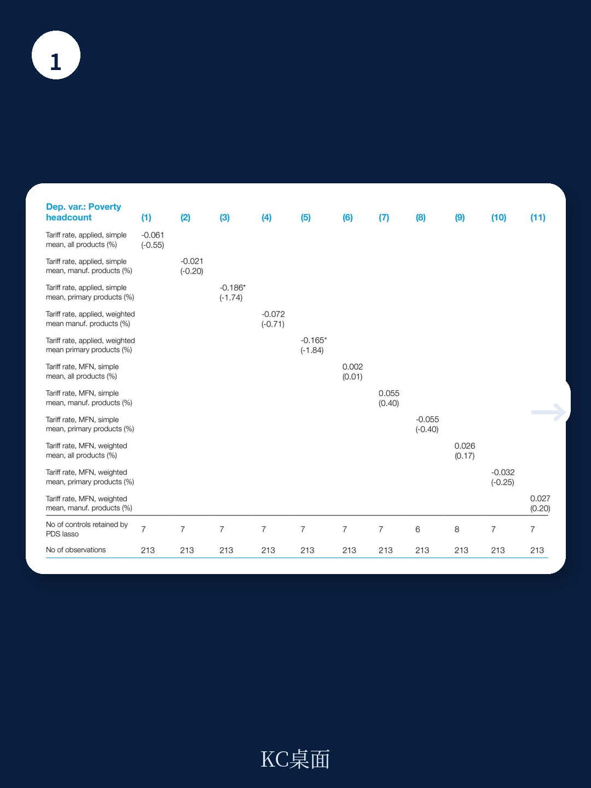
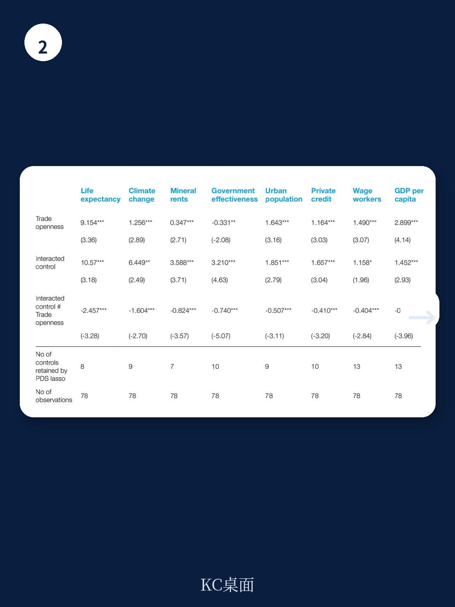

# 联合国贸发会议：从非洲悖论看全球供应链，贸易红利如何才能真正落地？

全球化的批评者与拥护者之间，长期存在一个核心争论：开放贸易究竟能否帮助最贫困的人口摆脱贫困？对于许多发展中国家，尤其是非洲国家，答案远非“是”或“否”那么简单。联合国贸发会议（UNCTAD）最新发布的工作论文《Revisiting the Trade-Poverty Nexus in Developing Countries》，利用前沿的计量方法，给出了一个严谨但令人不安的答案：贸易是减贫的必要条件，但绝非充分条件。这份报告的核心发现是，更高的贸易依存度在统计学上显著降低了发展中国家的贫困率，但在非洲，这一效应却消失了。更值得警惕的是，单纯的关税削减，无论在全球南方还是非洲，都没有系统性地影响贫困水平。这意味着，过去二十年被视为“标准药方”的贸易自由化，其减贫效果高度依赖于被长期忽视的国内结构性条件。

这不仅仅是一份学术论文。对于关注全球供应链布局、新兴市场消费潜力以及地缘经济格局的决策者而言，它提供了一个重新评估“开放红利”的框架。当贸易的潮水无法自动托起所有船只时，哪些国家正在构建能让“涓滴效应”生效的制度与产业基础？哪些国家则可能陷入“开放式贫困陷阱”？本文将梳理报告的核心逻辑，并探讨那些尚未被完全回答的关键问题。

## 1. 贸易总量与贫困的脱钩：非洲的统计显著性消失

报告首先通过面板数据和后双选择（PDS）Lasso估计方法，试图解决以往研究中因变量遗漏导致的偏误。结论非常清晰：对于整个发展中国家样本，以贸易占GDP比重衡量的贸易开放度，与贫困率呈显著的负相关。然而，当样本聚焦于非洲国家时，这一统计显著性完全消失。报告原文指出，贸易开放度对非洲贫困“没有统计上显著的影响”。

这意味着什么？简单来说，一个非洲国家即使大幅提升了其经济中的贸易比重——无论是出口更多原材料还是进口更多消费品——这本身并不会自动转化为贫困人口的收入增长。这与全球样本中观察到的减贫效应形成了鲜明对比。报告还发现，无论是用出口依存度还是进口依存度来衡量，结果都高度一致。这指向了一个更深层的问题：非洲经济体在融入全球贸易体系时，其增长与减贫之间的传导链条存在系统性的断裂。

> **KC评论：** 这个发现直接挑战了“贸易是脱贫最佳途径”的传统叙事。对于投资者而言，一个贸易依存度高但贫困率居高不下的经济体，其消费市场扩张潜力可能被高估。真正的增长红利，可能更多地流向那些能够通过贸易实现产业升级和就业吸纳的国家，而非仅仅依赖资源出口或转口贸易的经济体。完整报告中的图表和分国家数据，能帮助识别哪些非洲国家正在打破这一悖论。

## 2. 关税减让的“失效”：贸易政策工具并非万能钥匙

如果说贸易总量的影响存在区域差异，那么作为贸易政策核心工具的关税，其效果又如何？报告的第二个核心结论同样令人深思：无论是在发展中国家整体样本还是非洲样本中，关税变化（作为贸易改革的代理变量）对贫困均没有系统性的影响。

这并非说关税不重要，而是说明，单纯降低关税这一“门槛”，并不足以自动触发贫困减少。报告中的描述性统计显示，在发展中国家，关税税率与贫困率呈显著正相关（即高关税往往伴随高贫困），但在非洲，这一相关性在统计上不显著。这进一步印证了，非洲的贫困问题根源不在于贸易壁垒的高低，而在于经济体内部的结构性障碍——例如缺乏将关税减让带来的价格优势转化为本地就业和收入增长的能力。

对于政策制定者而言，这是一个重要的提醒。将有限的政治资本和行政资源全部投入到关税谈判和削减上，可能无法带来预期的减贫效果。真正需要关注的，是那些决定贸易能否“落地生根”的国内配套条件。

> **KC评论：** 这份报告最值得细读的部分，是其对交互效应的分析。它揭示了哪些国家特征能够“激活”贸易的减贫效应。例如，报告发现金融深化程度、教育水平和制度质量，是决定贸易红利能否惠及贫困人口的关键调节变量。这些变量在非洲的普遍薄弱，解释了为什么减贫效果会消失。继续看原文，真正有价值的是那些交互项的回归系数，它们给出了具体到每个变量的“门槛效应”。

## 3. 贸易是“必要条件”，而非“充分条件”：交互效应揭示的真相

报告的标题已经点明了核心主张：贸易是减贫的必要条件，但不是充分条件。这一判断并非空泛的结论，而是建立在对26个控制变量进行交互效应分析的坚实基础之上。

报告发现，当引入交互项后，贸易开放度的减贫效应高度依赖于特定国家特征。例如，贸易开放度与农业增加值、援助流入、互联网普及率、女性就业率等变量的交互项，在发展中国家样本中表现为显著的正向调节效应。这意味着，在一个农业基础好、接受大量援助、互联网普及率高或女性劳动参与率高的国家，贸易开放度的减贫效果会被显著放大。相反，在矿产资源依赖度高、汇率高估或人口抚养比高的国家，贸易的减贫效果则会被削弱甚至逆转。

在非洲样本中，交互效应的图景更为复杂。贸易开放度与预期寿命、政府效能、城市化率等变量的交互项，显示出了显著的减贫协同效应。这表明，提升治理能力、改善公共服务和推动城镇化，是非洲国家让贸易服务于减贫的关键前置条件。那些仅靠开放市场、但缺乏配套制度改革的国家，很可能在贸易增长的同时，贫困人口反而被边缘化。

## 4. 报告尚未完全回答的关键问题：因果链条的“黑箱”如何打开？

尽管报告在方法上取得了显著进步，但它也坦诚地指出了研究的局限性，这恰恰是留给后续研究者和决策者的核心悬念。

首先，报告未能完全打开贸易影响贫困的传导机制“黑箱”。它证明了贸易与贫困之间存在条件性关系，但没有深入拆解“贸易是通过改变相对价格、就业结构还是政府收入来影响贫困”。不同传导机制对应着完全不同的政策干预方向。例如，如果贸易主要通过压低进口消费品价格来惠及穷人，那么政策重点应是降低流通成本；如果主要通过创造制造业就业，那么政策重点应是技能培训和产业政策。

其次，报告的结论是基于1995-2019年的数据。这期间全球贸易经历了高速增长、金融危机到逆全球化的完整周期。一个悬而未决的问题是，在全球供应链重构、地缘政治碎片化和数字贸易崛起的“新常态”下，上述结论是否依然成立？特别是，非洲大陆自由贸易区（AfCFTA）的推进，是否会改变非洲内部贸易减贫的格局？这些都需要更细颗粒度的数据和时间序列来验证。

> **KC评论：** 报告在方法论上采用了PDS Lasso来规避变量遗漏偏误，这比传统回归更为严谨。但它也提醒，当惩罚参数变化时，系数的稳定性需要检验。对于希望将报告结论用于投资或政策判断的读者，理解其稳健性检验的细节至关重要。完整的附录表格提供了所有交互项的完整结果，这些才是报告真正的“富矿”。

## 5. 新的观察框架：从“贸易开放度”到“贸易转化能力”

基于这份报告的洞察，一个更有效的分析框架浮出水面：与其关注一个国家“有多开放”，不如评估其“将贸易流量转化为贫困减少的能力”。

这个能力至少包含三个维度。第一，**制度吸收能力**：政府效能、法治水平和腐败控制，决定了贸易带来的税收增长能否转化为有效的公共服务和基础设施。第二，**人力资本与就业弹性**：教育水平和健康水平，决定了劳动力能否适应贸易带来的产业结构变化。第三，**经济复杂度与产业关联**：一个经济体能否在出口资源的同时，发展出与之相关的本地加工、服务和物流产业，决定了贸易收益能否在本地循环。

对于关注新兴市场的机构而言，这个框架意味着需要将分析重心从宏观的贸易数据下沉到微观的治理和产业数据。那些在“贸易转化能力”上得分较高的国家，即使当前贸易规模不大，也可能孕育出更可持续的增长和消费市场。而一些贸易依存度极高但转化能力薄弱的经济体，其增长可能只是“虚胖”，且极易受到外部冲击。

**文末CTA：**

这份联合国贸发会议的研报，其价值远不止于证实一个“非洲悖论”。它通过严谨的计量方法，为重新审视贸易与发展的关系提供了新的标尺。然而，报告中大量的交互效应图表、稳健性检验以及分国别的详细数据，无法在一篇导读中完整呈现。这些细节恰恰是构建自己判断的基石。

更多国际信源汇编与深度评论，欢迎扫码交流。每日更新，我们将这份报告放回当天的全球贸易与宏观叙事主线中，整理出中文摘要、KC评论以及核心图表合集。这不仅便于您直接喂给AI助手进行二次分析，也方便人工快速扫描市场动态，捕捉边际变化。我们的交流社群汇聚了头部券商、PE/VC、投行、并购、对冲基金、资管机构、战略咨询和智库的朋友，期待与您共同探讨贸易、贫困与增长的真问题。

Personal reading notes and learning share only. Not investment advice.
