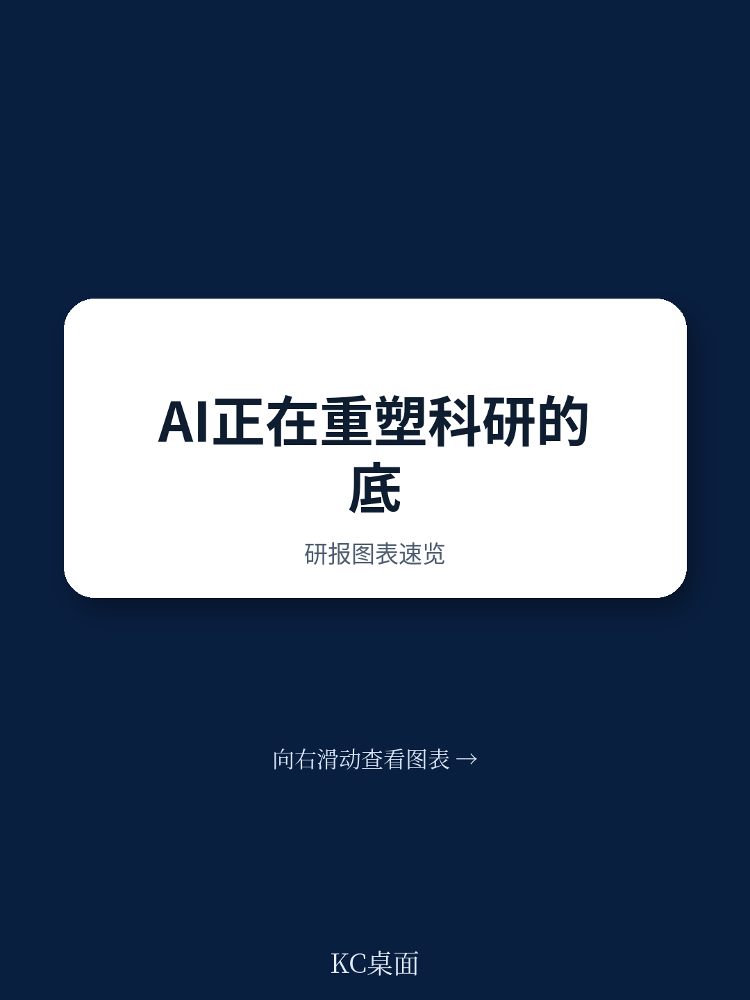

# 联合国贸发会议：发展中国家面临AI研发重构，不是追赶权而是参与权问题

一份来自联合国贸发会议的深度技术报告，揭示了一个正在发生的结构性变化：AI不再只是研发的工具箱，而是正在重塑研发本身的运行逻辑。如果只看算力竞赛或大模型参数，可能错过了更本质的变量——AI正在让“发现、实验、开发、部署”这四个传统上按顺序推进的环节，变成一个可以实时反馈、自我加速的闭环系统。

这份报告的核心判断是：AI对研发的渗透，正在从“提效”走向“重构”。它带来的不是单点效率提升，而是研发范式的整体迁移。对于企业、科研机构和国家创新体系而言，真正的挑战不是要不要用AI，而是能否建立适应“闭环加速”新型研发模式的组织能力和政策框架。

> **KC评论：**
> 这份报告的价值不在于告诉你AI多重要——那已经是共识。它真正值得读的是：AI通过哪四个具体渠道改变研发？每个渠道如何影响研发的不同阶段？这些机制对发展中国家意味着什么？完整报告中包含了详细的机制拆解图和行业案例，这些是判断自己所在行业是否会被“重构”的关键分析框架。
>
> 继续看原文，真正有价值的是图表、假设和验证路径；完整报告与KC评论在每日汇编。

## 1. 这轮变化真正考验的是企业能否把规模转化为议价权

报告开篇就指出，AI已经确立为“通用目的技术”，具备三个关键特征：普遍性、动态性和创新互补性。这意味着AI不是某个垂直领域的专用工具，而是可以渗透到几乎所有经济活动中，并且能够持续自我改进，同时催生大量互补性创新。

对于研发而言，这意味着什么？报告给出了一个清晰的框架：AI通过四个渠道影响研发——数据采集与整理、数据分析、假设生成、实验与模拟。这四个渠道覆盖了从“提出问题”到“验证答案”的全过程。

关键洞察在于：AI不是简单地把每个环节做得更快，而是强化了环节之间的反馈循环。比如，部署阶段产生的用户数据可以立即回传到概念化阶段，修正最初的假设；实验阶段的失败可以快速反馈，调整下一次实验设计。这种“闭环加速”让研发从线性推进变成了动态迭代。

> **KC评论：**
> 报告中引用了一项麦肯锡的估算：AI可能将研发速度翻倍，每年释放高达5000亿美元的价值。受益最大的行业是那些研发强度最高的领域——制药、半导体和软件。但报告没有充分展开的是：这种“速度翻倍”对不同规模的企业意味着什么？大企业能否凭借数据积累和算力投入拉大与中小企业的差距？这些问题的答案，需要结合报告中的行业案例来深入分析。

## 2. 研发模式的“闭环加速”正在改变竞争基础

报告详细描述了AI如何影响研发的四个阶段。在概念化阶段，AI可以自动化地从海量文献中提取和结构化信息，识别知识空白和新兴趋势。在研究阶段，AI能够整合多模态数据——基因组数据、传感器数据、图像数据——确保数据质量和一致性。在开发阶段，高质量的数据可以加速原型设计和测试。在部署阶段，用户数据和系统数据实现实时监控和迭代优化。

但最值得关注的不是这些单点能力，而是它们组合在一起产生的系统效应。报告特别强调：研发不是线性序列，而是动态迭代过程。AI正是强化了这种迭代性——部署阶段的洞见会反馈到研究阶段，引发新的研究方向；实验阶段的发现会修正概念化阶段的假设。

这种“闭环加速”意味着：谁能更快地完成“假设-实验-反馈-修正”的循环，谁就能在研发竞争中占据优势。对于企业而言，这意味着竞争基础正在从“拥有多少研发人员”转向“研发系统的闭环速度”。

## 3. 发展中国家面临的是“参与权”而非“追赶权”的问题

报告对发展中国家给予了特别关注。核心判断是：AI对研发的重构，可能加剧而非缩小国家间的技术差距。

原因在于：AI驱动的研发加速，高度依赖三个先决条件——高质量的数据集、充足的计算资源、以及能够驾驭AI工具的科研人才。这三个条件在当前全球分布极不均衡。发达国家的大型科技公司和顶尖研究机构已经建立了数据飞轮和算力优势，而大多数发展中国家仍然在建设基础的科研基础设施。

报告指出了一个值得警惕的趋势：如果发展中国家不能及时建立起适应AI时代的新型研发能力，它们不仅无法享受“闭环加速”带来的红利，还可能在全球知识生产体系中进一步边缘化。这不仅是技术差距的问题，更是“谁能参与定义未来知识”的问题。

> **KC评论：**
> 报告提出了一些政策建议，比如加强开放科学和开放创新、建设全球AI能力、确保AI伦理和问责。但这些建议在操作层面仍有很多未解问题：开放科学如何在知识产权保护与知识共享之间取得平衡？全球AI能力建设如何避免变成新一轮的“技术援助依赖”？这些是报告尚未完全回答的关键问题，也是值得深入讨论的方向。

## 4. 创新政策需要从“线性推动”转向“系统赋能”

报告回顾了创新政策的演变：从传统的“线性创新政策”——政府资助基础研究，然后期望成果自然转化为应用——到“变革性创新政策”——强调系统性、方向性和包容性。

AI的出现进一步推动了这种转变。报告认为，在AI时代，创新政策需要从“推动研发”转向“赋能系统”。具体来说，政策制定者需要关注：如何建设高质量的数据基础设施？如何培养跨学科的AI+科研人才？如何建立适应AI研发模式的评估和资助机制？如何确保AI在研发中的使用符合伦理标准？

这些问题的共同指向是：政策不能再只关注研发投入的规模，而要关注研发系统的运行效率。一个拥有先进AI工具但缺乏数据共享机制的研发系统，可能比一个算力不足但协作高效的研发系统产出更低。

## 5. 报告尚未完全回答的关键问题：谁来决定AI研发的方向

报告在结论部分提出了多项建议，包括加强国际合作、推动开放科学、建设AI能力、确保伦理问责。但这些建议背后隐藏着一个更深层的问题：在AI驱动的研发加速中，谁来设定研究方向和优先级？

当前，AI研发的方向很大程度上由少数科技巨头和发达国家的研究机构主导。报告提到的AlphaFold、气候模型、材料发现等案例，背后都是顶尖研究机构和大公司的投入。这种“方向设定权”的集中，可能导致全球研发资源向少数领域过度倾斜，而发展中国家面临的迫切问题——比如热带疾病、粮食安全、水资源管理——可能被忽视。

报告提到了“变革性创新政策”的概念，强调创新应该服务于可持续发展目标。但在实践中，如何将这种方向性转化为具体的政策工具和资源配置机制，报告没有给出详细的路径。这可能是未来政策讨论和学术研究需要重点突破的方向。

## 6. 观察框架：用三个维度判断AI对研发的真实影响

基于报告的框架，可以建立一个简洁的观察框架，用于判断AI对特定行业或国家研发体系的影响程度

**维度一：数据密度。** 该领域是否已经积累了足够多、足够高质量的数据？AI驱动的研发加速高度依赖数据，数据密度越高的领域，AI的渗透速度越快。

**维度二：闭环速度。** 研发流程中“假设-实验-反馈”的周期是多长？周期越短，AI的加速效应越显著。制药行业周期长，但AI在分子筛选环节的加速效应已经显现。

**维度三：能力门槛。** 使用AI工具需要什么样的技能和资源？门槛越低，扩散越快。但门槛低不等于竞争门槛低——谁拥有更好的数据和算力，谁就能在AI研发中建立护城河。

这个框架可以帮助决策者快速定位自己所在领域的“AI重构指数”，并据此制定相应的策略。

---

这份联合国贸发会议的报告提供了一个难得的宏观视角：它不局限于某个技术细节或商业案例，而是系统性地分析了AI如何改变研发本身的运行逻辑。对于产业决策者和政策制定者而言，理解这种“范式转变”的机制，比追逐最新的大模型参数更有长期价值。

报告的核心图表和案例分析——包括AI在生物科学、材料科学和气候科学中的具体应用，以及不同国家在AI研发能力上的对比数据——都值得仔细研读。这些内容在每日汇编中有完整的中文摘要和图表合集，便于喂给AI，也便于人工快速扫描市场动态。

目前，每日汇编汇聚了头部券商、PE/VC、投行、并购、hedge fund、资管机构、战略咨询、智库等朋友，期待交流。

Personal reading notes and learning share only. Not investment advice.
