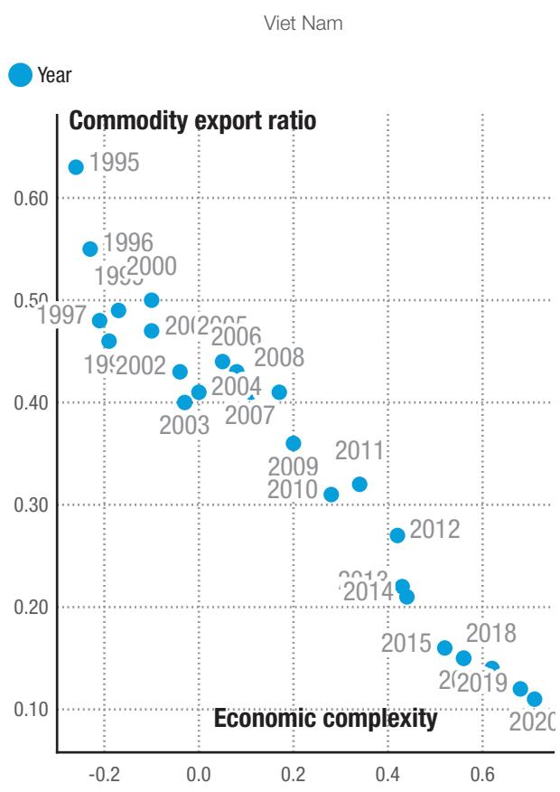
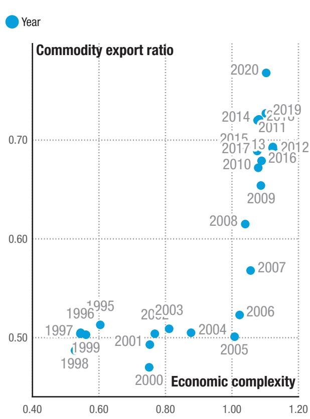
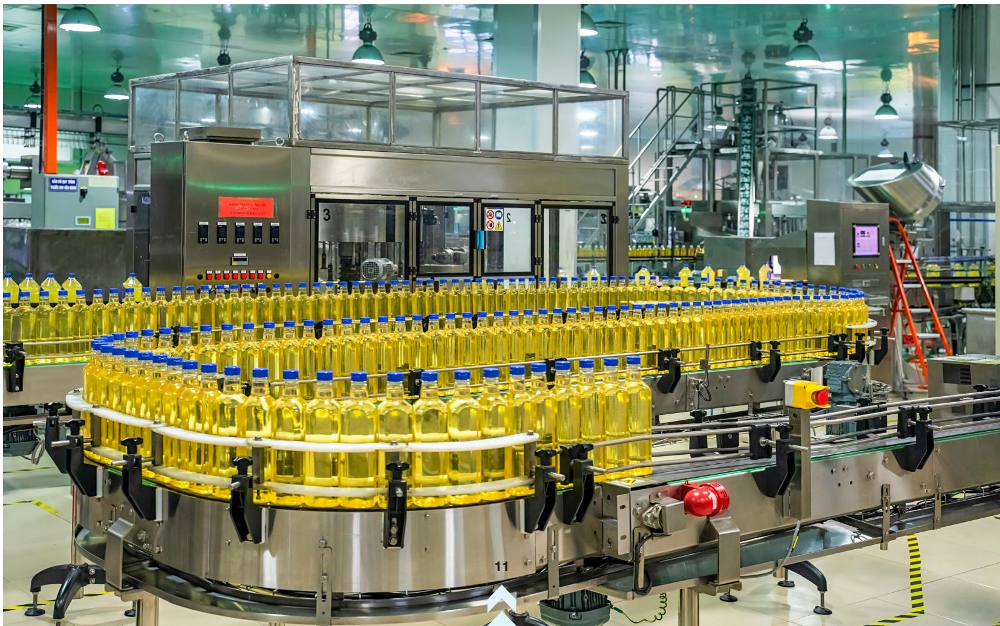
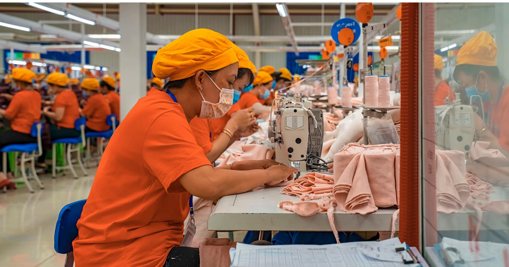
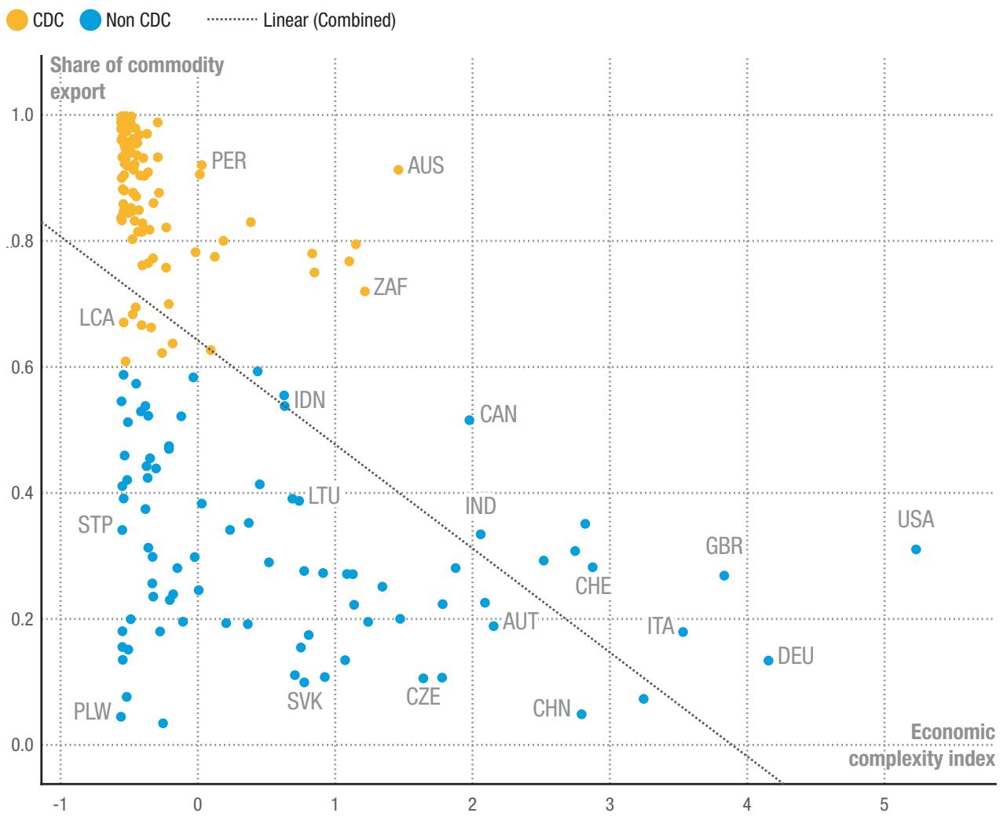
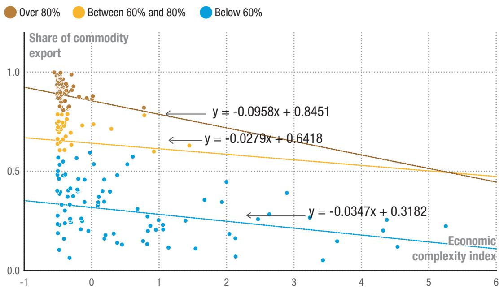
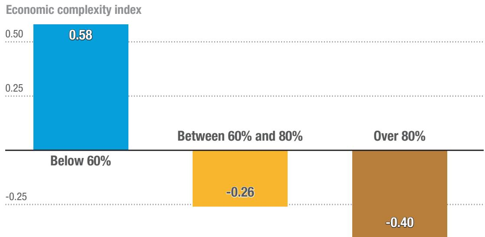
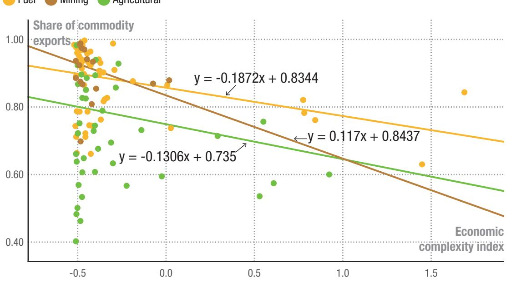
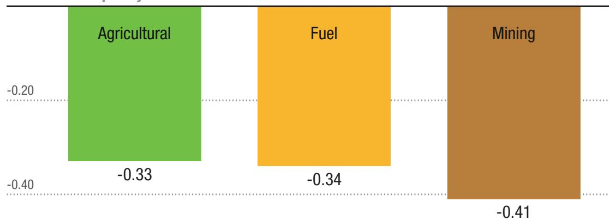

#13

March 2026
UNCTAD/WP/2026/2

# Strategic diversification: Empirical insights for leveraging economic complexity to break free from commodity dependence

Clovis Freire
Extractive Commodities
Section, Division on
International Trade and
Commodities, UNCTAD
freire@un.org

Sofia Dominguez
Cosimo Frontera
Extractive Commodities
Section, Division on
International Trade and
Commodities, UNCTAD
ditcinfo@unctad.org

## Abstract

Export diversification has long been promoted to reduce commodity dependence, yet its empirical relationship with commodity dependence may be more complex than traditionally understood. Using data from 183 countries between 1995 and 2019, this paper explores how economic complexity, a measure of the sophistication and technological intensity of a country's productive capacities, affects commodity dependence. This approach provides a more comprehensive understanding of how countries can design policies moving beyond diversification, shifting focus from the number of exports to the types of exportable products and the local productive capacities required to produce them. While the relationship between complexity and commodity dependence contains a definitional component in that commodities are inherently less complex products, the empirical analysis quantifies the magnitude of this association, uncovering heterogeneity across development stages, and identifying conditions under which complexity most effectively reduces commodity reliance. The results from a fixed effects model find that diversification towards higher complexity sectors significantly reduces commodity dependence. Importantly, the results indicate that economies with relatively less severe cases of commodity dependence, where commodities account for 60-80 per cent of exports, stand to benefit the most from policies aimed at increasing complexity. Paradoxically, the study also finds that global average income growth tends to deepen commodity dependence in exporting countries, reinforcing the global division of labour in which developing countries specialize in exporting raw materials. While the economic complexity framework offers valuable diagnostic insights for identifying promising diversification pathways, policymakers should recognize its function as a strategic compass rather than a prescriptive policy toolkit, requiring complementary context-specific analysis for implementation. These findings offer policy insights and highlight the importance of international collaboration in supporting commodity-dependent developing countries in creating a complex economic environment by building technological and productive capabilities. By adopting strategic diversification strategies grounded in product relatedness and complexity theory, these countries can better promote sustainable growth and drive economic transformations.

## Key words

Economic complexity, strategic diversification, commodity dependence, development.

## Contents

1. Introduction......3
2. Economic complexity and commodity dependence....6
3. Estimation approach......11
3.1 Theoretical model......12
3.2 Empirical specification......15
3.3 Data sources and variable definitions......17
3.4 Descriptive statistics......18
4. Regression results......22
4.1 Results......22
4.2 Robustness checks......26
5. Conclusions......29
References......31
Appendix......34
A. Computation of the modified economic complexity index...34
B. Diagnostic tests......35
C. Countries in the analysis (full sample)......37

# 1. Introduction

Economic diversification and complexity together are vital for sustainable growth, especially for commodity-dependent developing countries (CDDCs). UNCTAD defines an economy as commodity-dependent when over 60 per cent of merchandise export revenues come from primary commodities, such as food and agricultural raw materials, fuels, and minerals. In 2021, 101 countries met this criterion, of which 95 were developing countries and 34 least developed countries (UNCTAD, 2023a). These countries face significant challenges, as their reliance on commodity exports renders them highly vulnerable to external shocks stemming from volatility in commodity prices. Combined with factors like exchange rate overvaluation, market fluctuations and resource depletion, this reliance hampers stability, long-term planning, industrialization and the potential for sustainable investments in growth and development (UNCTAD, 2018). Recent global crises, including ongoing conflicts, and long-term global megatrends such as the impact of climate change and the digital and decarbonization agendas, further underscore the urgency for CDDCs to pursue strategic diversification. $^{1}$

Export diversification indicates the degree to which an economy exports products across various sectors or trading partners and can mitigate the risks of commodity dependence by enhancing resilience, stabilising revenues, and creating jobs and growth (Dominguez and Nkurunziza, 2024). However, while diversification is conceptually straightforward, its empirical relationship with commodity dependence may be more complex. Traditional measures of diversification focus on export market concentration or deviations from global trade patterns, offering a broad overview of export structures. Yet, diversification is not necessarily the contrary of commodity dependence, typically measured by the share of commodity exports in total exports. An economy may diversify its exports while maintaining or increasing the volume of commodity exports. For instance, an economy may diversify into other commodity sectors, going from exporting raw cotton to exporting raw cotton and bamboo.

Alternatively, an economy could diversify into commodity and non-commodity sectors simultaneously or increase commodity exports in quantities that outweigh the growth in the number of products exported. In such cases, the commodity export ratio would remain unchanged or even rise during diversification.

Increasing the number of products exported does not automatically reduce reliance on commodities, this is where economic complexity provides deeper insights. While diversification captures export variety, economic complexity measures an economy's sophistication and technological intensity, based on the diversity and ubiquity of its exports (Hidalgo and Hausmann, 2009). $^{2}$ In this context, diversity refers to the number of products exported by a country, while ubiquity refers to the number of countries exporting each product, indicating how common exported products are globally. This would provide information on the type rather than the number of exports, offering a more precise tool for understanding how economies can reduce their dependence on primary commodities. The empirical relationship between economic complexity and commodity dependence remains underexplored, with most related studies focusing on the links between economic complexity and development, natural resource rents, or export concentration. This paper addresses this gap by proposing a model derived from Pasinetti's (1993) model of structural change and economic dynamics, incorporating common assumptions from the economic complexity literature $^{3}$ regarding countries, capabilities, and products, and linking complexity to commodity dependence. To our knowledge, this is the first paper to propose such a framework. The model provides a strong theoretical foundation, identifies relevant covariates, and informs the expected associations of regressors. It is calibrated using data from 183 economies between 1995 and 2019 using a fixed effects model to examine the relationship between economic complexity and commodity dependence. Heterogeneity across different levels of commodity dependence is also explored. This study calculates economic complexity values using Hidalgo and Hausmann's (2009) Method of Reflections, with the modifications proposed by Freire (2017), which disaggregate Harmonized System (HS) 6-digit codes by quantity unit and unit price.

The analytical value of investigating this relationship extends beyond the observation that commodities are inherently less sophisticated products. Rather, the empirical contribution lies in quantifying the magnitude and potential heterogeneity across different development stages, and identifying the conditions under which increases in complexity most effectively reduce commodity export shares. This distinction is crucial because it explains why some countries experience significant increases in diversification yet fail to reduce commodity dependence, while others achieve substantial reductions despite more modest diversification gains. These patterns cannot be understood through observation alone but require econometric investigation that isolates the independent contribution of complexity while controlling for alternative explanations such as commodity price dynamics, exchange rate movements, and shifts in global demand. By treating complexity and diversification as complementary but distinct analytical dimensions, this paper addresses a substantive gap in the literature on how the sophistication of productive capabilities, rather than the mere number of products exported, drives structural economic transformation.

Beyond its theoretical contributions, the study offers practical insights for policymakers shaping industrial, trade, and innovation policies in CDDCs. The findings suggest that CDDCs should target not only diversification but also complexity in their export structures, a distinction that can inform more effective strategies to reduce vulnerability to commodity price fluctuations and achieve sustainable growth. Economic complexity metrics have already been applied in countries such as Rwanda (Hausmann and Chauvin, 2015), Brazil (Romero and Freitas, 2018; Romero and Silveira, 2019; Queiroz et al., 2023; Romero et al., 2024), Paraguay (Hartmann et al., 2019), and Panama (Obach et al., 2017), among many others, identifying promising development pathways.

However, policymakers should recognize that economic complexity functions as a diagnostic lens for identifying feasible targets rather than a prescriptive policy toolkit. Following Hidalgo (2023), complexity approaches excel at answering “what” questions: which products or sectors offer promising diversification targets, but require complementary analysis to address “how” questions regarding implementation mechanisms, institutional requirements, and policy instruments.

An added value of this paper lies in its use of disaggregated trade data by unit price, which enables more granular targeting of diversification opportunities within specific price ranges and sectors. For example, if the analysis reveals several promising diversification opportunities in the chemical sector, and this sector is prioritized by policymakers, then policy can be designed at the product and aggregate sector level. A targeted intervention, for instance, might involve training a specified number of chemical or production engineers by expanding enrollment in existing institutions in a specific city, or by updating curricula to include specialized modules aligned with industry needs. This contrasts with broader, abstract policy prescriptions, which, while valuable, may lack the specificity required to support targeted diversification. Consequently, the recommendations emerging from this analysis provide directional guidance for strategic planning rather than detailed blueprints for policy implementation.

The paper is organised as follows. Section 2 reviews the literature on economic complexity and commodity dependence. Section 3 introduces the empirical specification and estimation method adopted in the paper, together with the variables and data used. Section 4 discusses the results and robustness checks. Section 5 presents the conclusions.

2.

# Economic complexity and commodity dependence

Economic complexity, rooted in the seminal works of Hidalgo et al. (2007) and Hidalgo and Hausmann (2009), examines the relationship between a country's productive capabilities and its export structure. This measure is derived from the diversity and the ubiquity of a country's exports. Studies in this strand of the literature use algorithms, mostly the Method of Reflections (Hidalgo and Hausmann, 2009) or the Fitness method (Tacchella et al., 2012), to estimate the complexity of economies by iteratively calculating averages of the diversity and ubiquity of countries based on the similarity of their export baskets. $^{4}$

The core premise of economic complexity is that a country's exports reflect its underlying capabilities (Hidalgo and Hausmann, 2009). A bipartite network model links countries to the products they can produce based on these capabilities. The model shows that the average ubiquity of a country's products tends to decrease as its level of diversification increases. In short, more diverse economies tend to export less ubiquitous goods, and because complex products require a higher number of capabilities, fewer countries can produce them (Hidalgo and Hausmann, 2009). This theoretical framework also suggests that the economic and product complexity indices can help estimate the technological level of countries and products, with more complex products requiring higher technology. In turn, diversification towards more complex products is associated with development, spurring technology and innovation, productivity growth and resilience to external shocks (Freire, 2017).

Beyond Hidalgo and Hausmann (2009), empirical studies support the idea that an economy's productive structure influences long-term growth prospects. For instance, Anand et al. (2012) $^{5}$ and Ourens (2013) $^{6}$ cite a positive association between economic complexity and long-term growth. Bastos and Wang (2015) $^{7}$ also find a positive association between economic complexity and long-term growth of real GDP per capita. Zhu and Li (2017) $^{8}$ find similar results, citing the positive impact of economic complexity and varying levels of human capital on both long- and short-term growth.

4 A similar computation is made for product complexity indices.

5 Using a dynamic panel estimation of 100 countries from 1990 to 2008.

$^{6}$ Using a sample of 178 countries over 1995-2007.

7 Using a panel of 103 countries for 1970-2010.

8 Using a panel of 139 countries from 1995 to 2010

Moreover, measuring the economic complexity of 210 countries, they (Zhu and Li, 2017) support the general notion that high-income economies have higher complexity than low- and middle-income economies.

Other empirical studies reveal heterogeneity in the relationship between economic complexity and growth across different contexts. For instance, Ozguzer and Binatli (2015) note that for European Union countries below a certain complexity threshold, the relationship between complexity and growth is negative, while those above the threshold exhibit a positive correlation. The authors argue that the former's negative correlation may be attributed to new European Union member states leveraging access to the European Union market and trade agreements to accelerate growth, predominantly through producing goods that do not require high economic complexity (Ozguzer and Binatli, 2015). Similarly, Demiral (2016) finds that while complexity is positively associated with growth in factor-driven, efficiency-driven and transitioning economies, there is a negative association for innovation-based economies. $^{9}$

Economic complexity offers a structured and data-driven framework to identify feasible pathways for economic diversification. By applying an iterative formula to global export data, this assigns a measure of productive capabilities to each country, capturing the country's average positioning relative to the world in their product sophistication. When used alongside complementary analytical tools, such as product relatedness, it can inform strategic planning that accounts for a country's existing endowments and capabilities, including their stage of development. By assigning a value of complexity, this approach allows for a directional move in structural transformation that would be conducive to development (Freire, 2017, 2021).

This approach aligns with a strategy of related diversification, which is more prevalent empirically (Boschma, 2017; Xiao et al., 2018). Countries tend to diversify more easily into activities that are closely related to their existing productive capabilities, developing comparative advantages in new products that build on and combine local capabilities (Boschma, 2017). Considering the link between economic complexity and growth, targeting products that are within or adjacent to current capabilities allows governments to pursue diversification opportunities with higher likelihood of successful structural transformation while mitigating the risks associated with entering entirely new sectors (Xiao et al., 2018). This is particularly relevant for countries with constrained fiscal space, where large-scale interventions for diversification may be prohibitively expensive or too risky to be politically attractive.

On the other hand, commodity dependence, characterised by heavy reliance on primary commodities for export revenue, is associated with poor socio-economic performance (UNCTAD, 2023b). Commodity-dependent economies are highly vulnerable to price volatility, which disrupts revenue stability and hinders long-term planning and investment. Additionally, commodity dependence is linked to Dutch disease (UNCTAD, 2017; 2021a), where the rapid development of the commodity sector in an economy results in increasing export revenues and the appreciation of the currency. This harms the competitiveness of other export sectors, increasing the fragility of the economy. Moreover, low productivity growth and the impending depletion of finite natural resources present significant obstacles to sustainable economic development in CDDCs. Nkurunziza et al. (2017) $^{10}$ ascertain the negative relationship between commodity export dependence and human development in developing countries. This negative association holds irrespective of the groups of exported products considered.

While empirical studies directly addressing the relationship between commodity dependence and economic complexity are scarce, some literature exists on export concentration and complexity and the association between complexity and natural resource rents. $^{[11]}$ Drawing from these related research areas, we can gain a better understanding of potential parallels in the context of commodity dependence and economic complexity.

Martines de Camargo and Gala (2017) $^{12}$ find a negative association between export concentration and economic complexity. In testing the impact of Dutch disease $^{13}$ on economic complexity, they introduce an interactive term for export concentration and the complexity of the main exported product. Results indicate that a higher product complexity positively influences changes in overall complexity even at high levels of concentration. Conversely, a greater concentration of low-complex exports reduces a country's overall economic complexity. This implies that countries heavily dependent on low-complexity products, including commodities, face challenges in fostering innovation and multiplying know-how.

On the other hand, empirical studies on the relationship between economic complexity and natural resource rents suggest an inverted U-shaped association. UI-Durar et al. (2023) report these results using a panel quantile regression and an error correction model in resource-rich economies between 2000 and 2021. The authors find that economic complexity may initially increase natural resource extraction and use due to greater economic activities. However, in the long run, the production of complex goods decreases natural resource rents and dependence by upgrading production processes and increasing exports of value-added goods. This shift is attributed to the adoption of new production technologies and a transition towards knowledge-based activities, which diversifies production and reduces natural resource extraction.

Similarly, Li et al. (2024) $^{14}$ find an inverted U-shaped relationship between economic complexity and natural resource rents, indicating that while initial increases in complexity boost production and the demand for natural resources, economies eventually reach a threshold where specialisation in technology-based activities becomes more prominent.

This facilitates a transition from low-ubiquity resource-intensive products and diminishes reliance on resource rents.

Contrary to these findings, Canh et al. (2020) report a linear negative association between economic complexity and natural resource rents. When disaggregating by income group, the authors find that the relationship holds true in two out of three subsamples, comprising low- and middle-income and high-income economies, with upper-middle-income economies exhibiting non-significant associations. They propose two mechanisms to explain this relationship: in low and middle-income economies, a negative association is attributed to complexity inducing a shift towards manufacturing over raw materials exports. In higher-income counterparts, complexity brings about innovation and knowledge-based industries that reduce reliance on natural resources.

This provides valuable insights into the potential relationship between complexity and commodity dependence and points towards a negative association between the two. An important distinction between studies focusing on concentration and resource rents is that while economic complexity may drive resource inputs in the short term (as observed in studies by Canh et al. 2020; Ul-Durar et al., 2023; and Li et al., 2024), this may not necessarily lead to increased export concentration, especially if these resources are used to produce more complex goods. Consequently, countries undergoing an increase in their economy's complexity would theoretically experience a decline in their commodity export ratio.

However, this is not consistently supported by a straightforward correlation. For instance, while both Brazil and Viet Nam witnessed an increase in complexity between 1995-2020, Viet Nam's commodity dependence decreased significantly, whereas Brazil's increased. Based on the discussion on natural resource rents, this discrepancy could be due to heterogeneity in complexity levels, with countries with less complex structures requiring greater natural resource inputs and thus translating into greater exports. Nonetheless, in this case, Brazil shows greater levels of economic complexity than Viet Nam, with reported values ranging between 0.5 to 1.1 compared to -0.3 to 0.7, respectively $^{15}$ . This divergence is noteworthy: if the relationship between complexity and commodity dependence were purely definitional, both countries should have exhibited similar outcomes given their parallel complexity trajectories. Instead, the contrasting outcomes demonstrate that the relationship is mediated by additional factors, including potential heterogeneity across different levels of commodity dependence and indicating the need for further empirical investigation.

The empirical investigation of this relationship is analytically valuable despite the definitional observation that commodities are inherently less sophisticated products. While product complexity indices assign lower scores to primary commodities than to manufactured goods, reflecting the fewer capabilities required for commodity extraction relative to complex manufacturing, this definitional foundation does not render the empirical analysis circular. Rather, three dimensions of variation justify econometric investigation: First, understanding the magnitude of the complexity-dependence relationship matters for policy: Whether a one-unit increase in complexity corresponds to a 0.5, 2, or 5 per cent reduction in commodity dependence directly affects expected returns to investments. Second, the heterogeneity across different levels of commodity dependence, as explored through subsample analysis, cannot be derived from definitional reasoning alone and reveals whether complexity interventions are uniformly effective or more powerful at particular development stages. Third, whether and under what conditions countries actually transition toward greater complexity and lower commodity dependence over time constitute genuine empirical phenomena shaped by policy choices, external shocks, and path dependencies. By incorporating control variables for alternative mechanisms, the analysis isolates the specific contribution of productive capabilities, demonstrating that complexity captures meaningful variation beyond definitional overlap.

  
Figure 1
Relationship between complexity and commodity dependence in Viet Nam and Brazil, 1995 - 2020

  
Source: Author's calculation.

# Estimation approach

To empirically explore the relationship between economic complexity and commodity dependence, we first need a theoretical model to guide the analysis and interpretation of results. The objective is to integrate these concepts and show how changes in one could impact the other.

Commodity dependence is a straightforward concept, measured as the ratio of commodity exports to total exports. Conversely, economic complexity is more abstract, reflecting an economy's set of productive capacities. Freire (2017) reviews the literature on economic complexity and finds that few formal models have been proposed to explain the empirical regularities related to diversification and ubiquity, and most are not particularly grounded in economic theory. This limits their use to link concepts of complexity with economic variables such as output, exports, and prices. To fill this gap, Freire (2017) proposes a model based on Pasinetti's (1993) structural change and economic dynamics, incorporating assumptions common in the economic complexity literature and linking economic complexity with commodity dependence.

## 3.1 Theoretical model

This paper uses a simple labour-only multi-sector macro-economic model to guide the analysis. In this model, an economy at time t comprises m production sectors, each producing one type of product through labour alone, and a household sector that supplies labour and consumes the output. Each sector has a labour coefficient $l_{i}$ , indicating the labour required per unit of product, and a per-capita consumption coefficient $c_{i}$ , indicating household per-capita demand. Freire (2017) links this model with economic complexity by assuming that $l_{i}$ depends on the productive knowledge specific to producing i. This assumption follows Hidalgo and Hausmann (2009), who propose that: 1) products require specific capabilities to be produced; 2) countries have some, but not all, of these capabilities; and 3) only products with available capability sets in a country are produced in that country. Formally, $l_{i}$ is a function of the set of labour-embodied technologies ( $\tau_{i}$ ):

$$
\boldsymbol {l} _ {i} = \boldsymbol {f} (\boldsymbol {\tau} _ {i})
$$

$$
i = 1, 2, \dots , m,\tag{1}
$$

From Pasinetti's (1993) model, Freire's (2017) model takes the following relations: Quantities produced in each sector $i \left( Q_i \right)$ are given by the per-capita consumption coefficient $c_i$ multiplied by the population size ( $N$ ):

$$
Q _ {i} = c _ {i} N
$$

$$
i = 1, 2, \dots , m,\tag{2}
$$

Product prices are given by the labour coefficient $l_{i}$ multiplied by the wage rate in the country, which is taken as the numeraire and is considered as 1 for simplification. Thus, the price of a product i is given by:

$$
\boldsymbol {p} _ {i} = \boldsymbol {l} _ {i}
$$

$$
i = 1, 2, \dots , m,\tag{3}
$$

Based on (2) and (3), the total output of a sector $i(Y_{i})$ is the product of price and quantity:

$$
Y _ {i} = p _ {i} Q _ {i} = l _ {i} c _ {i} N
$$

$$
i = 1, 2, \dots , m,\tag{4}
$$

Summing outputs across m sectors gives the total economy output:

$$
Y = \sum_ {i = 1} ^ {m} Y _ {i} = N \sum_ {i = 1} ^ {m} l _ {i} c _ {i}
$$

$$
i = 1, 2, \dots , m,\tag{5}
$$

Based on (1) and (5), Freire (2017) links total output to the set of technologies:

$$
\boldsymbol {Y} = N \sum_ {i = 1} ^ {m} \boldsymbol {f} (\boldsymbol {\tau} _ {i}) \boldsymbol {c} _ {i}
$$

$$
i = 1, 2, \dots , m,\tag{6}
$$

This implies that a country's output is given by (a) the population size and (b) the sum of the result of the function of technologies required to produce each product, weighted by consumption coefficients. Based on the assumptions related to a specific set of technologies required for the production of a given product, Freire (2017) assumes that the measure of economic complexity can be used as a proxy of (b).

However, since Pasinetti's (1993) framework assumes a closed economy, this paper introduces a term representing the exchange rate $(\lambda_t)$ as a proxy for change in foreign consumption of domestically produced goods. When the exchange rate increases, the local currency depreciates relative to foreign currency, making the country's exports more affordable abroad, thus, increasing foreign demand. Conversely, a lower exchange rate reduces foreign consumption. We include this as a multiplicative term with population to account for the growing size of the consuming population when including foreign consumption. Thus, equation (6) for a country $k$ becomes:

$$
Y _ {k t} \approx N _ {k t} \lambda_ {k t} C o m p l e x i t y _ {k t}\tag{7}
$$

Having established an equation linking economic complexity to output, we now turn to derive a relation linking commodity dependence to output.

We start by considering the ratio of commodity exports of country k in time t, denoted $X_{kt}^{\alpha}$ , to the total output ( $Y_{kt}$ ). This ratio can then be expressed as a function of complexity as in equation (7):

$$
\frac {X _ {k t} ^ {\alpha}}{Y _ {k t}} \approx \frac {X _ {k t} ^ {\alpha}}{N _ {k t} \lambda_ {k t} C o m p l e x i t y _ {k t}}\tag{8}
$$

Given that the definition of commodity dependence in country k in time t ( $Dependence_{kt}$ ) is the share of total commodity exports ( $X_{kt}^{\alpha}$ ), to total exports ( $X_{kt}$ ), we can derive the relationship between commodity dependence and economic complexity by multiplying both sides of (8) by the inverse of the export-to-total-output ratio ( $\frac{Y_{kt}}{X_{kt}}$ ):

$$
\frac {X _ {k t} ^ {\alpha}}{Y _ {k t}} \frac {Y _ {k t}}{X _ {k t}} \approx \frac {X _ {k t} ^ {\alpha}}{N _ {k t} \lambda_ {k t} C o m p l e x i t y _ {k t}} \frac {Y _ {k t}}{X _ {k t}}\tag{9}
$$

The left side of (9) is the same as the commodity dependence in country k in time $t(Dependence_{kt})$ . Thus:

$$
D e p e n d e n c e _ {k t} \approx \frac {X _ {k t} ^ {\alpha}}{N _ {k t} \lambda_ {k t} C o m p l e x i t y _ {k t}} \frac {Y _ {k t}}{X _ {k t}}\tag{10}
$$

We assume that commodity prices are exogenously determined by the international market. The commodity prices for each country are estimated based on the shares of exports of the different commodities. Therefore, total commodity export is a function of the endogenized international prices of commodities $(P_{kt}^{\alpha})$ multiplied by the quantity exported $(Q_{kt}^{\alpha})$ :

$$
X _ {k t} ^ {\alpha} \approx P _ {k t} ^ {\alpha} Q _ {k t} ^ {\alpha}\tag{11}
$$

While the commodity price index captures pure price effects on dependence, $^{16}$ we use global per-capita consumption as a proxy for the quantity of commodities exported. Since consumption is a function of income, we assume per-capita consumption is a function of per-capita income. This decision is based on the nature of exports, where our interest lies in the consumption of all importers globally. Global GDP per capita serves as a proxy for quantity/demand-side dynamics. We express global per-capita GDP ( $GDPpc_{t}$ ) in constant (2015) US prices:

$$
X _ {k t} ^ {\alpha} \approx P _ {k t} ^ {\alpha} G D P p c _ {t}\tag{12}
$$

And substitute into $Dependence_{kt}$ :

$$
D e p e n d e n c e _ {k t} \approx \frac {P _ {k t} ^ {\alpha} G D P p c _ {t}}{N _ {k t} \lambda_ {k t} C o m p l e x i t y _ {k t}} \frac {Y _ {k t}}{X _ {k t}}\tag{13}
$$

Taking natural logarithms on both sides of the equation, we simplify:

$$
\ln (D e p e n d e n c e _ {i t}) \approx \ln (P _ {k t} ^ {\alpha}) + \ln (G D P p c _ {t}) - \ln (\lambda_ {k t}) - \ln (C o m p l e x i t y _ {i t}) - \ln (N _ {i t}) - \ln \left(\frac {X _ {k t}}{Y _ {k t}}\right)\tag{14}
$$

## 3.2

## Empirical specification

The resulting equation from the modelling exercise suggests that the association between a country's commodity dependence and economic complexity can be analysed by a panel data approach with a fixed-effects model that includes time-varying global GDP per capita, as well as country and time-varying variables, including a commodity-weighted price index, population size, the exchange rate of the country to US\$, and the export-to-GDP ratio. Using a fixed effects linear approach to estimate this relationship, the econometric model is given by Equation (15):

$$
\ln {(D e p e n d e n c e _ {i t})} = \alpha + \beta_ {1} \ln {(C o m p l e x i t y _ {i t})} + \beta_ {2} ^ {\prime} \mathbf {Z} _ {i t} + \mu_ {i} + \delta_ {t} + \varepsilon_ {i t}\tag{15}
$$

where subscripts i and t indicate, respectively, country and time. The share of commodity exports to total merchandise exports serves as the dependent variable, representing Dependence of country i in time t. Economic Complexity is calibrated using three different variables defined in 3.2. Given that the model is expressed in logarithmic terms, the relationship mirrors a full elasticity, whereby coefficient $\beta_{1}$ indicates the average percentage change in commodity share within a country i at a given time t, corresponding to a one-percentage increase in economic complexity. This coefficient captures within-country dynamics, explaining how economic complexity relates to shifts in commodity export dependence within countries over time. Based on the derivation, we expect the coefficient to be negative. Vector $Z_{it}$ represents country-specific and time-varying variables, including a commodity-weighted price index, population (in log), the exchange rate (in log), and the export-to-GDP ratio (in log). $\beta_{2}'$ is a vector of coefficients on these variables. The commodity price index is defined as a weighted average of prices across the different commodity groups. The index is calculated as a weighted sum of the prices of agricultural, mining and fuel commodity groups, where the weights are determined by the shares of agricultural exports to total exports, fuel exports to total exports and mining exports to total exports. Nominal exchange rates are used because we are observing the evolution of economic complexity within countries on a yearly basis, where the nominal exchange rate directly reflects the value of the country's currency in global markets. We expect the coefficient for commodity prices to be positive and the coefficients for population, the exchange rate, and the export-to-GDP ratio to be negative.

The term $\mu_{i}$ captures the country-fixed effects to account for unobserved time-invariant heterogeneity across countries, which is removed by the fixed effects estimation, while $\delta_{t}$ denotes time-specific factors that affect all countries simultaneously, including macroeconomic conditions and financial crises (e.g. financial crisis of 2008). This includes the logarithmic form of global GDP per capita, which is expected to have a positive coefficient. Finally, $\varepsilon_{it}$ is the error term.

We assess multicollinearity using a correlation matrix and find that all correlation coefficients were below the threshold of 0.8, indicating no signs of multicollinearity among the independent variables. $^{17}$ We also conduct a diagnostic test to check for model misspecification and confirm no issues are present. $^{18}$

Establishing causality is challenging due to potential simultaneity bias, where the association between complexity and commodity dependence in time t makes it difficult to disentangle the direction of the causal relationship. To address this potential endogeneity, we run equation (1) with a lagged term for complexity $(Complexity_{t-1})$ , such that it is predetermined in time t.

To explore heterogeneity across levels of commodity dependence, regressions are run on various subsamples. Economies are categorised into non-commodity-dependence (below 60 per cent share of commodity exports to total merchandise exports) and further split commodity dependence (over 60 per cent) into two: commodity dependence (between 60 and 80 per cent share) and strong commodity dependence (above 80 per cent share). $^{19}$ Commodity dependence groups are assigned following UNCTAD's State of Commodity Dependence series. $^{20}$ An economy falls under a specific commodity dependence group if 60 per cent of its exports come from commodities and 30 per cent of those commodity exports are from a particular group (i.e. agricultural, mining or fuel products). $^{21}$ To support the validity of the results, robustness checks using a randomized sample exercise and two alternate measures for commodity dependence are performed.

## 3.3 Data sources and variable definitions

The dependent variable is the share of commodity export values to total merchandise export values. The paper follows the classification of commodities defined in UNCTAD (2023a) and uses trade data from United Nations COMTRADE under the Harmonized System (HS) 2017 classification at the 6-digit level to calculate this variable.

As a robustness check, the share of commodity export values to total merchandise values is also calculated using the Standard International Trade Classification (SITC), computed using UNCTAD statistics. A second robustness check uses an export concentration indicator based on a modified Finger-Kreinin measure of similarity of trade, which reflects the extent to which a country's export structure differs from the world pattern. This measure ranges from 0 to 1, where values closer to 1 indicate a greater divergence from the world pattern and imply a narrow export basket (relative to the world export structure) and, thus, greater export concentration. This typically corresponds to greater commodity dependence, as the country relies on a few exports. $^{22}$ This variable was also sourced from UNCTAD statistics.

The main independent variable is the economic complexity index. Three metrics for this variable are considered. First, a modified economic complexity index is computed using the Method of Reflections (Hidalgo and Hausmann, 2009) with modifications proposed by Freire (2017). For the computation of the index, $^{23}$ disaggregated trade data from COMTRADE, using the HS 2002 classification at the 6-digit level, is used for 233 economies from 1995 to 2019. $^{24}$ Following Freire's (2017) method, the data is further disaggregated by quantity unit code and unit price range. $^{25}$ This approach statistically computes interquartile ranges of unit value distributions for each product, taken from bilateral trade data, treating products within different unit value ranges as distinct. This approach assesses countries' different capabilities when exporting the same HS 6-digit product at various price points, serving as a proxy for product quality and the required capabilities for production. This assumes product differentiation based on price to approximate real-world dynamics. The paper also considers Harvard's Growth Lab economic complexity index (referred to in the paper onwards as ECI) and the Economic Fitness measure, another indicator of the complexity of a country's productive structure. $^{26}$ These variables were drawn from Harvard Dataverse and the World Bank, respectively.

Additional variables include population and commodity-weighted price index as country-specific variables, along with a time-varying country-invariant variable, the global average GDP per capita (in current US\$). Data for the price index, population, and world GDP per capita was drawn from UNCTAD. The export-to-GDP and exchange rate data are drawn from the World Bank.

## 3.4 Descriptive statistics

Table 1 presents the definitions and descriptive statistics of the variables used. The data covers the period from 1995 to 2019 and includes 183 economies, $^{27}$ resulting in an unbalanced panel of 3,841 $^{28}$ observations. About 51 per cent of the sampled countries are classified as CDDCs. Of these, about 19 per cent are agricultural CDDCs, 19 per cent are fuel CDDCs, and 13 per cent are mining CDDCs.

## Table 1 Descriptive statistics

<table><tr><td>Variables</td><td>N</td><td>Mean</td><td>Median</td><td>Min</td><td>Max</td></tr><tr><td>Commodity export ratio, HS</td><td>3,841</td><td>58.72</td><td>63.22</td><td>2.22</td><td>99.92</td></tr><tr><td>Commodity export ratio, SITC</td><td>3,821</td><td>55.87</td><td>59.19</td><td>2.72</td><td>100.00</td></tr><tr><td>Export concentration index</td><td>3,841</td><td>0.66</td><td>0.71</td><td>0.23</td><td>0.94</td></tr><tr><td>Economic complexity (modified)</td><td>3,841</td><td>0.22</td><td>-0.32</td><td>-0.56</td><td>5.68</td></tr><tr><td>ECI, HS</td><td>3,251</td><td>-0.01</td><td>-0.11</td><td>-3.05</td><td>2.68</td></tr><tr><td>Economic fitness</td><td>2,586</td><td>1.105</td><td>0.47</td><td>0</td><td>10.69</td></tr><tr><td>Population (in thousands)</td><td>3,841</td><td>42,545.44</td><td>9,455.73</td><td>17.95</td><td>1,424,930.00</td></tr><tr><td>Official exchange rate</td><td>3,841</td><td>633.77</td><td>9.76</td><td>1.00</td><td>42,001.00</td></tr><tr><td>Commodity price index</td><td>3,841</td><td>99.93</td><td>101.73</td><td>30.78</td><td>197.64</td></tr><tr><td>World GDP per capita (in thousands)</td><td>3,841</td><td>9.09</td><td>9.18</td><td>7.17</td><td>10.69</td></tr><tr><td>Export to GDP ratio</td><td>3,841</td><td>0.27</td><td>0.23</td><td>0.02</td><td>3.61</td></tr><tr><td>Number of economies</td><td>183</td><td>183</td><td>183</td><td>183</td><td>183</td></tr></table>

Source: Authors' calculations.

Note: This scatter plot illustrates the average values of economic complexity and commodity dependence for each economy over the 25-year period between 1995 and 2020. This plot excludes commodity-dependent developed countries Australia, Iceland, New Zealand and Norway to avoid potential skewing of the relationship due to their development status.

The preliminary analysis shows a strong negative correlation between the share of commodity exports and economic complexity, using the modified index (Figure 2). This correlation is particularly pronounced among CDDCs, which show lower economic complexity levels than non-CDDCs. In the sample, within the CDDC group, South Africa stands out with the highest complexity index, registering a value of 1.22. This is well above the global average economic complexity of 0.11 between 1995-2020. In contrast, many developed non-CDDCs demonstrate substantially higher levels of economic complexity, with several surpassing a value of 2.

## Figure 2 Average economic complexity and commodity dependence between 1995-2020

  
Source: Authors' calculations.

Note: The graphs illustrate the average values of economic complexity and commodity dependence by commodity dependence ranges over the 25-year period between 1995 and 2020. This plot excludes commodity-dependent developed countries Australia, Iceland, New Zealand and Norway to avoid potential skewing of the relationship due to their development status.

When disaggregating countries by levels of commodity dependence, a more distinct pattern emerges (Figure 3). While non-commodity-dependent countries maintain an average index of 0.58, this decreases to -0.26 for countries with commodity export ratios between 60 and 80 per cent. The index drops further to -0.40 for commodity-dependent countries with over 80 per cent of commodity exports. Moreover, the scatter plot reveals that countries with high levels of commodity dependence exhibit the strongest correlation between economic complexity and commodity reliance, as shown by the relative steepness of their trendlines.

## Figure 3

Average economic complexity and commodity dependence by levels of commodity dependence, 1995-2020

  
Source: Authors' calculations.  
Note: The graphs illustrate the average values of economic complexity and commodity dependence by commodity dependence ranges over the 25-year period between 1995 and 2020. This plot excludes commodity-dependent developed countries Australia, Iceland, New Zealand and Norway to avoid potential skewing of the relationship due to their development status.

Figure 4 offers insights into the average complexity and its association with commodity dependence for CDDCs, categorised by the sectors on which they rely on. Albeit small, there are some differences in the average complexity across groups. All groups exhibit a negative complexity index, below the world average of 0.11. Among CDDCs, agricultural-dependent countries exhibit the largest level of complexity (-0.33), possibly due to the greater variation in economic complexity and levels of development within this group, e.g. exemplified by countries such as the Central African Republic, Fiji and Argentina. Countries relying on the export of fuels have only a slightly lower average value compared to agriculture, at -0.34. In contrast, mining countries have the lowest level of complexity on average, at -0.41.

## Figure 4

Average economic complexity and commodity dependence by commodity group, 1995-2020  

Economic complexity index  
  
Source: Authors' calculations.  
Note: The graphs illustrate the average values of economic complexity and commodity dependence by commodity dependence group over the 25-year period between 1995 and 2020. This plot excludes commodity-dependent developed countries Australia, Iceland, New Zealand and Norway to avoid potential skewing of the relationship due to their development status.

# 4. Regression results

## 4.1 Results

Table 2 shows the results of the fixed effects model for the full sample, examining the relationship between commodity dependence (ratio of commodity exports to total merchandise exports) and economic complexity, measured by three different metrics. Column 1 reports the model's results when considering the modified economic complexity; column 2 corresponds to the results with the ECI, and column 3 uses economic fitness as the main independent variable.

Column 1 presents the best-performing model, with all variables except for the export-to-GDP ratio showing statistical significance. This model confirms a statistically significant negative association between commodity dependence and economic complexity, consistent at the 1 per cent level. As a country's economic complexity increases, indicating a more diverse and technologically advanced economy, its share of commodity exports declines. The coefficient of -1.714 indicates that a 1 per cent increase in complexity in the previous year corresponds to a 1.714 per cent decrease in the share of commodity exports in time t. While the ECI in column 2 does not yield a statistically significant coefficient, the economic fitness index in column 3 shows significance at the 5 per cent level, though with a smaller magnitude than the modified economic complexity measure. The modified economic complexity index and economic fitness are highly correlated, $^{29}$ while the ECI is less aligned with the modified complexity measure, possibly explaining the variation in statistical significance. Overall, this suggests that higher economic complexity correlates with a lower share of commodity exports, as corroborated by subsample regressions and robustness checks.

This association indicates that economies with more diversified and sophisticated exports tend to rely less on commodities. This can be attributed to their greater productive and technological capacity. As technological capabilities grow, economies transition from exporting raw materials to more advanced goods. These findings align with Martines de Camargo and Gala (2017) and Canh et al. (2020), who report negative associations between export concentration and economic complexity and economic complexity and natural resource rents, respectively. In addition, the results expand on Freire (2017) work on economic complexity and development, highlighting the link between technological advancement and reduced reliance on commodity exports, often associated with lower socio-economic and development indicators.

The results suggest an interesting relationship between global GDP per capita and dependence on commodity exports. The coefficient is positive across all three models but is only statistically significant in the first model (at 1 per cent), suggesting that in this specification, higher global GDP per capita is associated with a higher share of commodity exports. Specifically, there is a 0.312 per cent increase in the share of commodity exports for a one per cent increase in the global GDP per capita of the previous year. This points to a perverse relationship between commodity dependence and global economic progress. $^{30}$ As world GDP per capita increases, consumption levels and the demand for commodities also increase, which is beneficial for CDDCs' exporters in the short term. However, this dynamic may push these countries further into commodity dependence if not accompanied by policies and strategies to increase diversification and economic complexity. It is important to note that the increase in dependence is outpaced by the increase in global income, indicating that while global economic activity drives higher demand for commodities, the proportionate increase in commodity dependence is smaller.

Concerning the effect of population, for every 1 per cent increase, there is a 0.162 and a 0.212 per cent decrease in the share of commodity exports for specifications 1 and 3, respectively. The direction of the effect aligns with our priors, as defined in the theoretical model. Larger populations tend to have a smaller share of their exports coming from raw materials. This result aligns with findings reported in UNCTAD (2019, 2021b), which shows that, generally, smaller countries, in terms of population, are more likely to be commodity-dependent. The studies attribute this to smaller countries often having fewer resources and industries to diversify their economies, leading to a heavy reliance on exporting a few primary commodities (UNCTAD, 2019, 2021b). In addition, larger populations may drive greater domestic demand for various goods and services, which could encourage diversification in production and exports, reducing reliance on commodity exports.

In line with the theoretical framework, commodity prices (measured by a composite index) are positively associated with commodity dependence. This result is significant across all models at the 1 per cent significance level, with coefficients ranging from 0.159 to 0.174. This suggests that higher commodity prices prompt economies to rely more on commodity exports, as the increased profitability of their revenues incentivises production and exports. Similarly, Nkurunziza et al. (2017) found a positive correlation between commodity prices and commodity dependence, noting that commodity price booms can stimulate economic growth in CDDCs. However, the growth generated by sudden rises in commodity prices may not be sustainable in the long term due to commodity price volatility and short-termism in planning. This can hinder smoothing the spending of commodity windfalls over booms and bust cycles, inhibiting long-term development planning and sustainable development for CDDCs.

Fixed effects coefficients, commodity dependence (HS codes), full sample

<table><tr><td></td><td>Economic complexity (modified) (1)</td><td>ECI (2)</td><td>Economic fitness (3)</td></tr><tr><td rowspan="2">L.Economic complexity (in log)</td><td>-1.714***</td><td>-0.067</td><td>-0.310**</td></tr><tr><td>(0.65)</td><td>(0.09)</td><td>(0.13)</td></tr><tr><td rowspan="2">L.World GDP per capita (in log)</td><td>0.312***</td><td>0.178</td><td>0.202</td></tr><tr><td>(0.11)</td><td>(0.12)</td><td>(0.12)</td></tr><tr><td rowspan="2">Population (in log)</td><td>-0.162**</td><td>-0.116</td><td>-0.212**</td></tr><tr><td>(0.08)</td><td>(0.08)</td><td>(0.08)</td></tr><tr><td rowspan="2">Commodity price index (in log)</td><td>0.160***</td><td>0.159***</td><td>0.174***</td></tr><tr><td>(0.02)</td><td>(0.02)</td><td>(0.03)</td></tr><tr><td rowspan="2">Official exchange rate (in log)</td><td>-0.027**</td><td>-0.021*</td><td>-0.021**</td></tr><tr><td>(0.01)</td><td>(0.01)</td><td>(0.01)</td></tr><tr><td rowspan="2">Export to GDP ratio (in log)</td><td>-0.020</td><td>-0.036</td><td>-0.012</td></tr><tr><td>(0.03)</td><td>(0.04)</td><td>(0.04)</td></tr><tr><td rowspan="2">Constant</td><td>7.076***</td><td>3.923***</td><td>4.845***</td></tr><tr><td>(1.37)</td><td>(0.55)</td><td>(0.60)</td></tr><tr><td>Observations</td><td>3,841</td><td>3,251</td><td>2,724</td></tr><tr><td>R-squared</td><td>0.123</td><td>0.145</td><td>0.172</td></tr><tr><td>Number of economies</td><td>183</td><td>144</td><td>147</td></tr></table>

Note: Robust standard errors in parentheses. \*\*\* p<0.01, \*\* p<0.05, \* p<0.1.

Lastly, the results reveal a small but statistically significant negative association between the exchange rate and commodity dependence. This is consistent across all specifications, with the coefficient oscillating at -0.023. A higher exchange rate against foreign currency (depreciation of the local currency) renders domestically produced goods cheaper for foreign buyers. This theoretically boosts foreign demand for exports across all sectors. However, non-commodity goods, often more sensitive to price fluctuations due to greater substitutability and differentiation, appear to experience a stronger demand increase than commodities, which are typically less price-elastic.

The subsample analysis highlights a consistently negative association between economic complexity and commodity dependence across different ranges of commodity export ratios, with significant results in 7 out of 9 specifications (Table 3). The magnitude of the coefficients varies, reflecting the different impacts of complexity on countries at varying stages of commodity dependence. For countries with a commodity export ratio below 60 per cent (not considered commodity-dependent), the coefficients for economic complexity are significant for the modified index (-1.722) and economic fitness (-0.315), while the ECI specification shows no statistical significance. This suggests that in relatively diversified economies, further gains in complexity can lead to reductions in the share of commodity exports, albeit with a modest impact.

  
Fixed effects coefficients (subsamples, by commodity dependence level)

<table><tr><td rowspan="3">Variables</td><td colspan="3">Economic complexity (Modified)</td><td colspan="3">ECI</td><td colspan="3">Economic fitness</td></tr><tr><td>Below 60%</td><td>Between 60% and 80%</td><td>Over 80%</td><td>Below 60%</td><td>Between 60% and 80%</td><td>Over 80%</td><td>Below 60%</td><td>Between 60% and 80%</td><td>Over 80%</td></tr><tr><td>(1)</td><td>(2)</td><td>(3)</td><td>(4)</td><td>(5)</td><td>(6)</td><td>(7)</td><td>(8)</td><td>(9)</td></tr><tr><td rowspan="2">L.Economic complexity (in log)</td><td>-1.722**</td><td>-6.552**</td><td>-1.448*</td><td>-0.108</td><td>-0.517</td><td>-0.058**</td><td>-0.315*</td><td>-0.560**</td><td>-0.483***</td></tr><tr><td>(0.66)</td><td>(2.75)</td><td>(0.73)</td><td>(0.30)</td><td>(0.59)</td><td>(0.02)</td><td>(0.17)</td><td>(0.24)</td><td>(0.12)</td></tr><tr><td rowspan="2">L.World GDP per capita (in log)</td><td>0.113</td><td>0.418</td><td>0.031</td><td>-0.039</td><td>-0.608</td><td>0.176</td><td>-0.110</td><td>-0.654</td><td>0.093</td></tr><tr><td>(0.16)</td><td>(0.25)</td><td>(0.13)</td><td>(0.15)</td><td>(0.64)</td><td>(0.11)</td><td>(0.17)</td><td>(0.42)</td><td>(0.07)</td></tr><tr><td rowspan="2">Population (in log)</td><td>0.239</td><td>-0.043</td><td>0.001</td><td>0.329*</td><td>0.465</td><td>-0.100*</td><td>0.284</td><td>0.139</td><td>-0.019</td></tr><tr><td>(0.19)</td><td>(0.24)</td><td>(0.08)</td><td>(0.19)</td><td>(0.28)</td><td>(0.06)</td><td>(0.25)</td><td>(0.16)</td><td>(0.06)</td></tr><tr><td rowspan="2">Commodity price index (in log)</td><td>0.326***</td><td>0.081</td><td>0.038**</td><td>0.324***</td><td>0.106</td><td>0.022</td><td>0.362***</td><td>0.149***</td><td>0.029*</td></tr><tr><td>(0.04)</td><td>(0.07)</td><td>(0.02)</td><td>(0.04)</td><td>(0.08)</td><td>(0.02)</td><td>(0.05)</td><td>(0.05)</td><td>(0.02)</td></tr><tr><td rowspan="2">Official exchange rate (in log)</td><td>-0.009</td><td>-0.036</td><td>-0.012*</td><td>-0.006</td><td>0.009</td><td>-0.012</td><td>-0.009</td><td>-0.016</td><td>-0.004</td></tr><tr><td>(0.02)</td><td>(0.07)</td><td>(0.01)</td><td>(0.02)</td><td>(0.08)</td><td>(0.01)</td><td>(0.02)</td><td>(0.09)</td><td>(0.00)</td></tr><tr><td rowspan="2">Export to GDP ratio (in log)</td><td>-0.028</td><td>-0.039</td><td>0.014</td><td>-0.089</td><td>-0.080</td><td>0.043***</td><td>-0.028</td><td>-0.011</td><td>0.021</td></tr><tr><td>(0.06)</td><td>(0.09)</td><td>(0.03)</td><td>(0.07)</td><td>(0.15)</td><td>(0.01)</td><td>(0.08)</td><td>(0.15)</td><td>(0.02)</td></tr><tr><td rowspan="2">Constant</td><td>2.588</td><td>14.748**</td><td>6.796***</td><td>-1.260</td><td>0.893</td><td>5.143***</td><td>-0.627</td><td>3.637***</td><td>4.434***</td></tr><tr><td>(2.05)</td><td>(5.61)</td><td>(1.09)</td><td>(1.72)</td><td>(2.32)</td><td>(0.35)</td><td>(2.19)</td><td>(1.16)</td><td>(0.41)</td></tr><tr><td>Observations</td><td>1,741</td><td>461</td><td>1,374</td><td>1,587</td><td>397</td><td>1,076</td><td>1,240</td><td>311</td><td>1,049</td></tr><tr><td>R-squared</td><td>0.283</td><td>0.134</td><td>0.033</td><td>0.355</td><td>0.055</td><td>0.116</td><td>0.363</td><td>0.079</td><td>0.106</td></tr><tr><td>Number of economies</td><td>79</td><td>21</td><td>66</td><td>67</td><td>17</td><td>49</td><td>64</td><td>16</td><td>58</td></tr></table>

Note: Robust standard errors in parentheses. \*\*\* p<0.01, \*\* p<0.05, \* p<0.1. Countries Norway and New Zealand are excluded from the subsample of countries with a commodity export ratio between 60 and 80 per cent such that only developing countries remain. Australia and Iceland are also excluded from the subsample of countries with a commodity export ratio above 80 per cent to only consider developing countries.

In contrast, for countries with a commodity export ratio between 60 and 80 per cent, the coefficients for economic complexity are much stronger under the modified index and the economic fitness specifications. The modified economic complexity index shows a significant coefficient of -6.552, indicating that increases in complexity have the greatest potential to reduce commodity dependence in this group. These countries are likely at a transitional stage, which may offer more potential for diversification, making gains in economic complexity more impactful.

In countries with commodity export ratios above 80 per cent, economic complexity remains consistently significant across all models. However, the effect appears to weaken compared to countries in the 60-80 per cent range, possibly due to entrenched structural dependencies and fewer alternatives for diversification.

Other variables show mixed effects across the subsamples. The commodity price index remains positively associated with commodity dependence across most specifications, particularly in the below 60 per cent category. Meanwhile, the exchange rate does not show a consistent pattern, though it is marginally significant under one specification.

## 4.2 Robustness checks

Robustness checks are important for assessing the reliability of the findings. To evaluate the statistical associations observed in the full sample, we conduct a random subsampling exercise. We sort the data by economy identifiers and randomly select 50 per cent of the economies, retaining all years for each selected economy. This approach preserves temporal and cross-sectional diversity while introducing variation through random selection, allowing us to determine whether the results hold under a different subsample.

Table 4 replicates the main regression results in Table 2. The findings from the random sample reaffirm a statistically significant negative association between economic complexity and commodity dependence for the modified economic complexity and economic fitness indices. This supports the robustness of the observed relationship. World GDP per capita is positive and consistently significant across all specifications. Indeed, all other covariates (excluding the export to GDP ratio) remain statistically significant.

We also explore the relationship between economic complexity and commodity dependence using alternate measures of commodity dependence. We compute the share of commodity export values to total merchandise values using the SITC codes and consider an export concentration index as a dependent variable for the full sample (Table 5). The negative association between the commodity export ratio and economic complexity remains statistically significant across these specifications.

Table 4
Robustness check, randomized sample

<table><tr><td></td><td>Economic complexity (modified) (1)</td><td>ECI (2)</td><td>Economic fitness (3)</td></tr><tr><td rowspan="2">L.Economic complexity (in log)</td><td>-2.566**</td><td>-0.167</td><td>-0.371**</td></tr><tr><td>(1.192)</td><td>(0.148)</td><td>(0.176)</td></tr><tr><td rowspan="2">L.World GDP per capita (in log)</td><td>0.588***</td><td>0.313*</td><td>0.373*</td></tr><tr><td>(0.167)</td><td>(0.187)</td><td>(0.213)</td></tr><tr><td rowspan="2">Population (in log)</td><td>-0.372***</td><td>-0.268***</td><td>-0.312**</td></tr><tr><td>(0.118)</td><td>(0.0886)</td><td>(0.135)</td></tr><tr><td rowspan="2">Commodity price index (in log)</td><td>0.158***</td><td>0.154***</td><td>0.174***</td></tr><tr><td>(0.0365)</td><td>(0.0355)</td><td>(0.0444)</td></tr><tr><td rowspan="2">Official exchange rate (in log)</td><td>-0.0351*</td><td>-0.0277*</td><td>-0.0230</td></tr><tr><td>(0.0191)</td><td>(0.0154)</td><td>(0.0145)</td></tr><tr><td rowspan="2">Export to GDP ratio (in log)</td><td>-0.00467</td><td>-0.0529</td><td>0.0113</td></tr><tr><td>(0.0402)</td><td>(0.0514)</td><td>(0.0490)</td></tr><tr><td rowspan="2">Constant</td><td>9.989***</td><td>5.237***</td><td>5.485***</td></tr><tr><td>(2.519)</td><td>(0.586)</td><td>(0.892)</td></tr><tr><td>Observations</td><td>1,905</td><td>1,605</td><td>1,366</td></tr><tr><td>R-squared</td><td>0.149</td><td>0.164</td><td>0.199</td></tr><tr><td>Number of economies</td><td>91</td><td>70</td><td>73</td></tr></table>

Note: Robust standard errors in parentheses. \*\*\* p<0.01, \*\* p<0.05, \* p<0.1.

## Table 5

Robustness check, alternate commodity dependence measures (full sample)

<table><tr><td rowspan="2"></td><td colspan="3">Commodity export ratio (in log) SITC</td><td colspan="3">Export concentration (in log)</td></tr><tr><td>Economic complexity (modified) (1)</td><td>ECI (2)</td><td>Economic fitness (3)</td><td>Economic complexity (modified) (4)</td><td>ECI (5)</td><td>Economic fitness (6)</td></tr><tr><td rowspan="2">L.Economic complexity (in log)</td><td>-1.786***</td><td>-0.138</td><td>-0.328**</td><td>-1.212***</td><td>-0.133***</td><td>-0.273***</td></tr><tr><td>(0.69)</td><td>(0.10)</td><td>(0.14)</td><td>(0.20)</td><td>(0.03)</td><td>(0.04)</td></tr><tr><td rowspan="2">L.World GDP per capita (in log)</td><td>0.172</td><td>0.033</td><td>0.001</td><td>0.138***</td><td>0.021</td><td>0.038</td></tr><tr><td>(0.12)</td><td>(0.13)</td><td>(0.13)</td><td>(0.04)</td><td>(0.05)</td><td>(0.05)</td></tr><tr><td rowspan="2">Population (in log)</td><td>-0.144*</td><td>-0.101</td><td>-0.199**</td><td>-0.030</td><td>0.021</td><td>-0.015</td></tr><tr><td>(0.08)</td><td>(0.08)</td><td>(0.09)</td><td>(0.03)</td><td>(0.04)</td><td>(0.04)</td></tr><tr><td rowspan="2">Commodity price index (in log)</td><td>0.138***</td><td>0.152***</td><td>0.166***</td><td>-0.043***</td><td>-0.042***</td><td>-0.038***</td></tr><tr><td>(0.02)</td><td>(0.02)</td><td>(0.02)</td><td>(0.01)</td><td>(0.01)</td><td>(0.01)</td></tr><tr><td rowspan="2">Official exchange rate (in log)</td><td>-0.014</td><td>-0.007</td><td>-0.012</td><td>-0.003</td><td>0.002</td><td>-0.002</td></tr><tr><td>(0.01)</td><td>(0.01)</td><td>(0.01)</td><td>(0.00)</td><td>(0.00)</td><td>(0.00)</td></tr><tr><td rowspan="2">Export to GDP ratio (in log)</td><td>0.020</td><td>-0.031</td><td>-0.015</td><td>0.026***</td><td>0.024***</td><td>0.016*</td></tr><tr><td>(0.02)</td><td>(0.03)</td><td>(0.03)</td><td>(0.01)</td><td>(0.01)</td><td>(0.01)</td></tr><tr><td rowspan="2">Constant</td><td>7.423***</td><td>4.140***</td><td>5.127***</td><td>1.961***</td><td>-0.328</td><td>-0.071</td></tr><tr><td>(1.47)</td><td>(0.57)</td><td>(0.64)</td><td>(0.41)</td><td>(0.29)</td><td>(0.28)</td></tr><tr><td>Observations</td><td>3,821</td><td>3,231</td><td>2,704</td><td>3,841</td><td>3,251</td><td>2,724</td></tr><tr><td>R-squared</td><td>0.088</td><td>0.102</td><td>0.134</td><td>0.144</td><td>0.076</td><td>0.189</td></tr><tr><td>Number of economies</td><td>180</td><td>141</td><td>144</td><td>183</td><td>144</td><td>147</td></tr></table>

Note: Robust standard errors in parentheses. \*\*\* p<0.01, \*\* p<0.05, \* p<0.1.

## 5. Conclusions

Economic complexity is crucial for CDDCs and developing economies to build the technological capabilities and know-how needed for producing a more diverse and sophisticated industrial base. This is important for diversification, which can mitigate the adverse effects of commodity dependence and strengthen performance by broadening income sources. While important, studies of the relationship between economic complexity and commodity dependence remains scarce. This paper contributes to the literature by examining the relationship between commodity dependence (measured by the ratio of commodity exports to total merchandised exports) and economic complexity (using three different metrics), proposing a simplified theoretical model based on Pasinetti (1993) and Freire (2017) that explains the link between the two.

The empirical findings support the idea that diversifying into more complex products, rather than merely increasing the number of exported products, is important for reducing commodity dependence. The analysis reveals a statistically significant negative correlation between economic complexity and commodity dependence, robust when using a randomized sample and other measures of commodity dependence. These findings align with our established priors and suggest that increasing economic complexity can help countries reduce their reliance on commodity exports. In addition, there is a positive association between global income per capita and commodity dependence, likely due to higher per capita income driving greater consumption and demand for commodities. This would help explain the persistence of commodity dependence.

The results also hold across subsamples with different ranges of commodity dependence, with the strongest effect observed in economies where commodity exports account for 60-80 per cent of total merchandise exports. These economies are likely at a transitional stage where improvements in complexity can lead to significant reductions in commodity dependence. For countries with the highest commodity export ratios, the magnitude of the effect may be diminished due to entrenched structural dependencies and limited alternatives for diversification. In countries below the 60 per cent threshold, the effect remains significant but less pronounced.

This has important implications for policymakers and international cooperation. CDDCs should focus not only on diversifying exports but also on enhancing the complexity of the goods they produce. This requires a strategic multi-sectoral policy approach that promotes innovation, invests in human capital, and supports the development of industries capable of producing higher-value, complex products. Targeted investments in productive and human capital are needed to build the technological and industrial foundations necessary for economic complexity. Partnerships with science, technology and research institutions are encouraged, as these collaborations can accelerate technology transfer, spur innovation and build specialized expertise in key sectors. Governments must create an enabling environment through regulatory reforms, infrastructure development, and incentives that attract private investment in complex industries.

These findings must be interpreted with an awareness of the analytical strengths and limitations of the economic complexity framework. While the definitional overlap between commodity dependence and low product complexity might suggest a simplistic relationship, the empirical analysis reveals policy-relevant insights that go beyond mere definition: the magnitude of the complexity-dependence association, its heterogeneity across development stages, and its persistence after controlling for alternative factors show that complexity captures meaningful variation in productive capabilities with development consequences. However, policymakers should recognize that economic complexity functions primarily as a directional tool—identifying what to target and where opportunities exist—rather than as a prescriptive framework specifying how to implement diversification strategies or which specific policy instruments to deploy. The latter requires complementary sector feasibility studies, institutional capacity assessments, and context-specific policy design that addresses implementation challenges, financing constraints, and political economy considerations.

Aligning industrial policies with national development plans that support strategic diversification is crucial. In a broader sense, these plans should be based on economic complexity and relatedness metrics to identify sectors with high growth potential. A clear understanding of a country's current productive capabilities and position in the product space is vital for identifying strategic sectors. Applied microeconomic research can help pinpoint promising products or sectors at national, sub-regional or municipal levels. By adopting data-informed diversification strategies towards complex products, CDDCs can reduce their vulnerability to global commodity market fluctuations and achieve more sustainable economic growth.

## References

Anand R, Mishra S and Spatafora N (2012). Structural Transformation and the Sophistication of Production. IMF Working Paper. 12/5951.

Bastos F and Wang K (2015). Long-Run Growth in Latin America and the Caribbean: The Role of Economic Diversification and Complexity. Regional Economic Outlook: Western Hemisphere.

Boschma R (2017). Relatedness as driver of regional diversification: a research agenda. Regional Studies. 51(3):351–364.

Canh NP, Schinckus C and Thanh SD (2020). The natural resources rents: Is economic complexity a solution for resource curse? Resources Policy. 69101800.

Demiral M (2016). Knowledge, complexity and economic growth: Multi-country evidence by development stages. Journal of Knowledge Management, Economics and Information Technology. 6(1):1–27.

Dominguez S and Nkurunziza JD (2024). Economic diversification: Its relationship with inequality and ensuing policy options. UNCTAD Working Papers.

Freire C (2017). Diversification and structural economic dynamics. Maastricht University / United Nations University.

Freire C (2021). Economic Complexity Perspectives on Structural Change. In Foster-McGregor N, Alcorta L, Szirmai A and Verspagen B (eds.), New Perspectives on Structural Change: Causes and Consequences of Structural Change in the Global Economy. Oxford University Press, Oxford: 188–214.

Hartmann D, Bezerra M and Pinheiro FL (2019). Identifying Smart Strategies for Economic Diversification and Inclusive Growth in Developing Economies. The Case of Paraguay March. Available at https://papers.ssrn.com/abstract=3346790 (accessed 5 September 2024).

Hausmann R and Chauvin J (2015). Moving to the Adjacent Possible: Discovering Paths for Export Diversification in Rwanda. CID Working Papers. CID Working Papers, Center for International Development at Harvard University.

Hegyi FB, Guzzo F, Perianez Forte I and Gianelle C (2021). The Smart Specialisation Policy Experience: Perspective of National and Regional Authorities. Publications Office of the European Union, Luxembourg.

Hidalgo CA (2023). The policy implications of economic complexity. Research Policy. 52(10), 104863.

Hidalgo CA and Hausmann R (2009). The building blocks of economic complexity. Proceedings of the National Academy of Sciences. 106(26):10570–10575.

Hidalgo CA, Klinger B, Barabási A-L and Hausmann R (2007). The Product Space Conditions the Development of Nations. Science. 317(5837):482–487, American Association for the Advancement of Science.

Li Z, Doğan B, Ghosh S, Chen W-M and Lorente DB (2024). Economic complexity, natural resources and economic progress in the era of sustainable development: Findings in the context of resource deployment challenges. Resources Policy. 88104504.

Martines de Camargo JS and Gala P (2017). The resource curse reloaded: revisiting the Dutch disease with economic complexity analysis. Sao Paulo School of Economics Woking Paper. 448.

Nkurunziza JD, Tsowou K and Cazzaniga S (2017). Commodity Dependence and Human Development. African Development Review. 29(S1):27–41.

Nkurunziza, JD. 2021. “The Commodity Dependence Trap.” Contemporary Issues in African Trade and Trade Finance 7 (1): 80–92.

Obach J, Santos MA and Hausmann R (2017). Appraising the Economic Potential of Panama Policy Recommendations for Sustainable and Inclusive Growth. CID Working Papers. CID Working Papers, Center for International Development at Harvard University.

Ourens G (2013). Can the Method of Reflections help predict future growth? Discussion Paper 2013-8. Institut de Recherches Économiques et Sociales de l'Université catholique de Louvain.

Ozguzer GE and Binatli AO (2015). Economic Convergence in the EU: A Complexity Approach. Working Paper No. 1503. Izmir University of Economics. (accessed 26 February 2024).

Pasinetti L (1993). Structural Economic Dynamics: A Theory of the Economic Consequences of Human Learning. Cambridge University Press.

Queiroz AR, Romero JP and Freitas EE (2023). Economic complexity and employment in Brazilian states. CEPAL Review. 2023(139):177–196, United Nations.

Romero JP et al. (2024). Complexity-based diversification strategies: a new method for ranking promising activities for regional diversification. Spatial Economic Analysis. 1–24.

Romero JP and Freitas E (2018). Setores Promissores Para o Desenvolvimento Do Brasil: Complexidade e Espaço Do Produto Como Instrumentos de Política. In M. Viegas, & E. Albuquerque (Eds.), Alternativas Para Uma Crise de Múltiplas Dimensões. First edition, pp. 358–374. Cedeplar-UFMG.

Romero JP and Silveira F (2019). Mudança estrutural e complexidade econômica: identificando setores promissores para o desenvolvimento dos estados brasileiros. Oficina de la CEPAL en Brasília (Estudios e Investigaciones). Oficina de la CEPAL en Brasília (Estudios e Investigaciones), Naciones Unidas Comisión Econômica para América Latina y el Caribe (CEPAL).

Shrestha N (2020). Detecting Multicollinearity in Regression Analysis. American Journal of Applied Mathematics and Statistics. 8(2):39–42.

Tacchella, A., Cristelli, M., Caldarelli, G., Gabrielli, A. and Pietronero, L. (2012). A New metrics for countries' fitness and products' complexity. Scientific Reports, 2: 723, DOI:10.1038/srep00723.

Ul-Durar S, Arshed N, Anwar A, Sharif A and Liu W (2023). How does economic complexity affect natural resource extraction in resource rich countries? Resources Policy. 86104214.

UNCTAD (2015). Reaping Benefits from Trade Facilitation. UNCTAD, Policy Brief, No. 42, no. December 2015.

UNCTAD (2017). Commodity dependence and the Sustainable Development Goals. Note by the UNCTAD secretariat for the Multi-year Expert Meeting on Commodities and Development, ninth session, Geneva, 12–13 October 2017. TD/B/C.I/MEM.2/37.

UNCTAD (2018). Diversification and value addition. Note by the UNCTAD secretariat for the Multi-year Expert Meeting on Commodities and Development, tenth session, Geneva, 25–26 April 2018. TD/B/C.I/MEM.2/42.

UNCTAD (2019). Commodity Dependence: A Twenty-Year Perspective. UNCTAD. Geneva.

UNCTAD, ed. (2021a). Escaping from the Commodity Dependence Trap through Technology and Innovation. Commodities and development report, No. 2021. United Nations. New York.

UNCTAD (2021b). State of Commodity Dependence 2021. State of Commodity Dependency No. E.21.
II.D.17. UNCTAD. Geneva.

UNCTAD (2023a). The State of Commodity Dependence 2023. The State of Commodity Dependence 2023. United Nations Conference on Trade and Development. Geneva.

UNCTAD (2023b). Commodities and Development Report 2023: Inclusive Diversification and Energy Transition. Commodities and Development Report. United Nations Conference on Trade and Development. UNCTAD. Geneva.

World Economic Forum (2014). The Global Competitiveness Report 2014-2015. World Economic Forum. Geneva.

Xiao J, Boschma R and Andersson M (2018). Industrial Diversification in Europe: The Differentiated Role of Relatedness. Economic Geography. 94(5):514–549.

Zhu S and Li R (2017). Economic complexity, human capital and economic growth: empirical research based on cross-country panel data. Applied Economics. 49(38):3815–3828.

## Appendix

## A. Computation of the modified economic complexity index

This study applies the Method of Reflections (Hidalgo and Hausmann, 2009) modified by Freire (2017) to consider all exports, not just those with a certain revealed comparative advantage (RCA), as the RCA measure is volatile for countries with low levels of diversification and high commodity export reliance.

The Method of Reflections constructs a country-product network and iteratively calculates generalised measures of diversification and ubiquity:

$$
k _ {c, N} = \frac {1}{K _ {c , 0}} \sum_ {p} M _ {c p} k _ {p, N - 1}
$$

$$
k _ {p, N} = \frac {1}{K _ {p , 0}} \sum_ {c} M _ {c p} k _ {c, N - 1}
$$

$$
\mathrm{for} N > 0
$$

$M_{cp}$ is a matrix with 1 if country c exports product p, and 0 otherwise. $k_{c,0}$ is the number of products exported by country c and $k_{p,0}$ is the number of countries exporting product p. For each country c, the Method of Reflections produces an ordered list of N real numbers ( $k_{c,0}$ , $k_{c,1}$ , $k_{c,2}$ , ..., $k_{c,N}$ ), where N is the number of iterations. The measure of economic complexity of countries considers the information in that ordered list as follows:

$$
E c o n \_ c o m p l e x i t y = \frac {k _ {c , 0} \times k _ {c , 2} \times k _ {c , 4} \times k _ {c , 6} \times k _ {c , 8} \times k _ {c , 1 0} \times k _ {c , 1 2} \times k _ {c , 1 4} \times k _ {c , 1 6} \times k _ {c , 1 8}}{k _ {c , 1} \times k _ {c , 3} \times k _ {c , 5} \times k _ {c , 7} \times k _ {c , 9} \times k _ {c , 1 1} \times k _ {c , 1 3} \times k _ {c , 1 5} \times k _ {c , 1 7} \times k _ {c , 1 9}}
$$

For analysis, we calculate Complexity as:

$$
C o m p l e x i t y = \frac {E c o n \_ c o m p l e x i t y - \overline {{E c o n \_ c o m p l e x i t y}}}{\sigma}
$$

Where $Econ\_complexity$ is the mean and $\sigma$ is the standard deviation of the distribution of countries' economic complexity. To ensure positive values when taking the logarithm, we add 3. $^{31}$

  
Table B1
Correlation matrix independent variable and controls

## B. Diagnostic tests

<table><tr><td></td><td>L.Modified economic complexity (in log)</td><td>L.World GDP per capita (in log)</td><td>Population (in log)</td><td>Commodity price index (in log)</td><td>Official exchange rate (in log)</td><td>Export to GDP ratio (in log)</td></tr><tr><td>L.Modified economic complexity (in log)</td><td>1</td><td></td><td></td><td></td><td></td><td></td></tr><tr><td>L.World GDP per capita (in log)</td><td>0.0172</td><td>1</td><td></td><td></td><td></td><td></td></tr><tr><td>Population (in log)</td><td>0.44</td><td>0.0464</td><td>1</td><td></td><td></td><td></td></tr><tr><td>Commodity price index (in log)</td><td>-0.0166</td><td>0.7219</td><td>0.0135</td><td>1</td><td></td><td></td></tr><tr><td>Official exchange rate (in log)</td><td>-0.2912</td><td>0.0385</td><td>0.2244</td><td>0.024</td><td>1</td><td></td></tr><tr><td>Export to GDP ratio (in log)</td><td>0.1409</td><td>0.018</td><td>-0.0037</td><td>0.0753</td><td>-0.122</td><td>1</td></tr></table>

Table B2
Correlation matrix independent variable and controls

<table><tr><td></td><td>Modified economic complexity (in log)</td><td>ECI (in log)</td><td>Economic fitness (in log)</td></tr><tr><td>Modified economic complexity (in log)</td><td>1</td><td></td><td></td></tr><tr><td>ECI (in log)</td><td>0.7041</td><td>1</td><td></td></tr><tr><td>Economic fitness (in log)</td><td>0.8972</td><td>0.8012</td><td>1</td></tr></table>

<table><tr><td></td><td>Commodity export ratio (in log), HS</td><td>Commodity export ratio (in log), SITC</td><td>Export concentration index (in log)</td></tr><tr><td>Commodity export ratio (in log), HS</td><td>1</td><td></td><td></td></tr><tr><td>Commodity export ratio (in log), SITC</td><td>0.9417</td><td>1</td><td></td></tr><tr><td>Export concentration index (in log)</td><td>0.58</td><td>0.6241</td><td>1</td></tr></table>

## B.4 Specification test

To assess the correct specification of the model, we use the Ramsey Regression Equation Specification Error Test (RESET), which verifies if non-linear combinations of fitted values help explain the dependent variable. Significant results indicate potential model misspecification due to omitted variables or incorrect functional form. In our case, the F-test result was not statistically significant $(F(1,189)=2.07, p=0.1514)$ , suggesting the model captures the main factors without non-linear relationships. This result supports the model's structure as an adequate representation of the relationships between variables, with no evidence of misspecification.

## C. Countries in the analysis (full sample)

<table><tr><td>Afghanistan</td><td>Chad</td><td>Grenada</td></tr><tr><td>Albania</td><td>Chile</td><td>Guatemala</td></tr><tr><td>Algeria</td><td>China</td><td>Guinea</td></tr><tr><td>Angola</td><td>Colombia</td><td>Guinea-Bissau</td></tr><tr><td>Antigua and Barbuda</td><td>Comoros</td><td>Guyana</td></tr><tr><td>Argentina</td><td>Congo</td><td>Haiti</td></tr><tr><td>Armenia</td><td>Congo, Dem. Rep. of the</td><td>Honduras</td></tr><tr><td>Australia</td><td></td><td>Hungary</td></tr><tr><td>Austria</td><td>Costa Rica</td><td>Iceland</td></tr><tr><td>Azerbaijan</td><td>Croatia</td><td>India</td></tr><tr><td>Bahamas</td><td>Cyprus</td><td>Indonesia</td></tr><tr><td>Bahrain</td><td>Czechia</td><td>Indonesia (...2002)</td></tr><tr><td>Bangladesh</td><td>Côte d'lvoire</td><td rowspan="2">Iran (Islamic Republic of)</td></tr><tr><td>Barbados</td><td>Denmark</td></tr><tr><td>Belarus</td><td>Djibouti</td><td>Iraq</td></tr><tr><td>Belgium</td><td>Dominica</td><td>Ireland</td></tr><tr><td>Belize</td><td>Dominican Republic</td><td>Israel</td></tr><tr><td>Benin</td><td>Ecuador</td><td>Italy</td></tr><tr><td>Bhutan</td><td>Egypt</td><td>Jamaica</td></tr><tr><td rowspan="2">Bolivia (Plurinational State of)</td><td>El Salvador</td><td>Japan</td></tr><tr><td>Equatorial Guinea</td><td>Jordan</td></tr><tr><td>Bosnia and Herzegovina</td><td>Eritrea</td><td>Kazakhstan</td></tr><tr><td>Botswana</td><td>Estonia</td><td>Kenya</td></tr><tr><td>Brazil</td><td>Eswatini</td><td>Korea, Republic of</td></tr><tr><td>Brunei Darussalam</td><td>Ethiopia</td><td>Kuwait</td></tr><tr><td>Bulgaria</td><td>Fiji</td><td>Kyrgyzstan</td></tr><tr><td>Burkina Faso</td><td>Finland</td><td rowspan="2">Lao People's Dem. Rep.</td></tr><tr><td>Burundi</td><td>France</td></tr><tr><td>Cabo Verde</td><td>Gabon</td><td>Latvia</td></tr><tr><td>Cambodia</td><td>Gambia</td><td>Lebanon</td></tr><tr><td>Cameroon</td><td>Georgia</td><td>Lesotho</td></tr><tr><td>Canada</td><td>Germany</td><td>Liberia</td></tr><tr><td rowspan="2">Central African Republic</td><td>Ghana</td><td>Libya</td></tr><tr><td>Greece</td><td>Lithuania</td></tr><tr><td>Luxembourg</td><td>Philippines</td><td>Liechtenstein*</td></tr><tr><td>Madagascar</td><td>Poland</td><td>Syrian Arab Republic</td></tr><tr><td>Malawi</td><td>Portugal</td><td>Tajikistan</td></tr><tr><td>Malaysia</td><td>Qatar</td><td rowspan="2">Tanzania, UnitedRepublic of</td></tr><tr><td>Maldives</td><td>Romania</td></tr><tr><td>Mali</td><td>Russian Federation</td><td rowspan="2">Thailand</td></tr><tr><td>Malta</td><td>Rwanda</td></tr><tr><td>Mauritania</td><td>Saint Kitts and Nevis</td><td>Timor-Leste</td></tr><tr><td>Mauritius</td><td>Saint Lucia</td><td>Togo</td></tr><tr><td>Mexico</td><td>Saint Vincent and the Grenadines</td><td>Tonga</td></tr><tr><td>Moldova, Republic of</td><td>Samoa</td><td>Trinidad and Tobago</td></tr><tr><td>Mongolia</td><td>Sao Tome and Principe</td><td>Tunisia</td></tr><tr><td>Montenegro</td><td>Saudi Arabia</td><td>Turkmenistan</td></tr><tr><td>Morocco</td><td>Senegal</td><td>Türkiye</td></tr><tr><td>Mozambique</td><td>Serbia</td><td>Uganda</td></tr><tr><td>Myanmar</td><td>Serbia and Montenegro</td><td>Ukraine</td></tr><tr><td>Namibia</td><td>Seychelles</td><td>United Arab Emirates</td></tr><tr><td>Nepal</td><td>Sierra Leone</td><td>United Kingdom</td></tr><tr><td>Netherlands</td><td>Singapore</td><td>United States of America</td></tr><tr><td>New Zealand</td><td>Slovakia</td><td>Uruguay</td></tr><tr><td>Nicaragua</td><td>Slovenia</td><td>Uzbekistan</td></tr><tr><td>Niger</td><td>Solomon Islands</td><td>Vanuatu</td></tr><tr><td>Nigeria</td><td>Somalia</td><td>Venezuela (Bolivarian Rep. of)</td></tr><tr><td>North Macedonia</td><td>South Africa</td><td>Viet Nam</td></tr><tr><td>Norway</td><td>Spain</td><td>Yemen</td></tr><tr><td>Oman</td><td>Sri Lanka</td><td rowspan="7">Zambia</td></tr><tr><td>Pakistan</td><td>Sudan</td></tr><tr><td>Palau</td><td>Sudan (...2011)</td></tr><tr><td>Panama</td><td>Suriname</td></tr><tr><td>Papua New Guinea</td><td>Sweden</td></tr><tr><td>Paraguay</td><td>Switzerland,</td></tr><tr><td>Peru</td><td></td></tr></table>

Note: CDDCs are in bold. \*This grouping follows UNCTAD's target economies classification (see https://unctadstat.unctad.org/EN/Classifications/DimCountries\_TargetEconomies\_Classification.pdf), and are counted as a single country in this study.

@UNCTAD
@UNCTAD
unctad.org/facebook
unctad.org/youtube
unctad.org/flickr
unctad.org/linkedin

