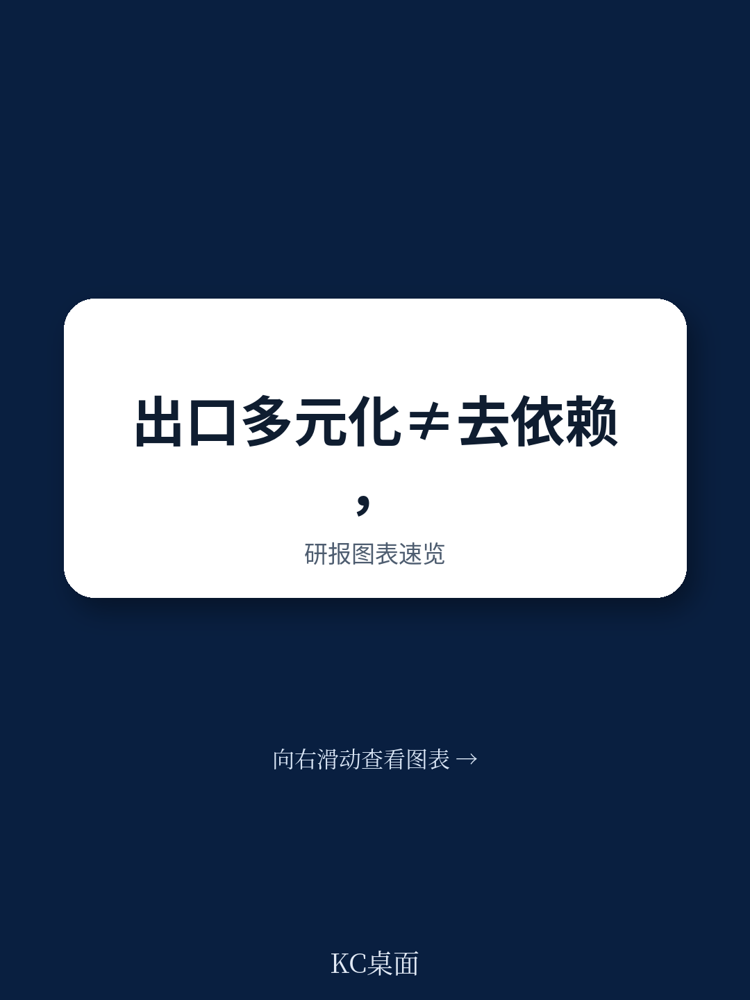
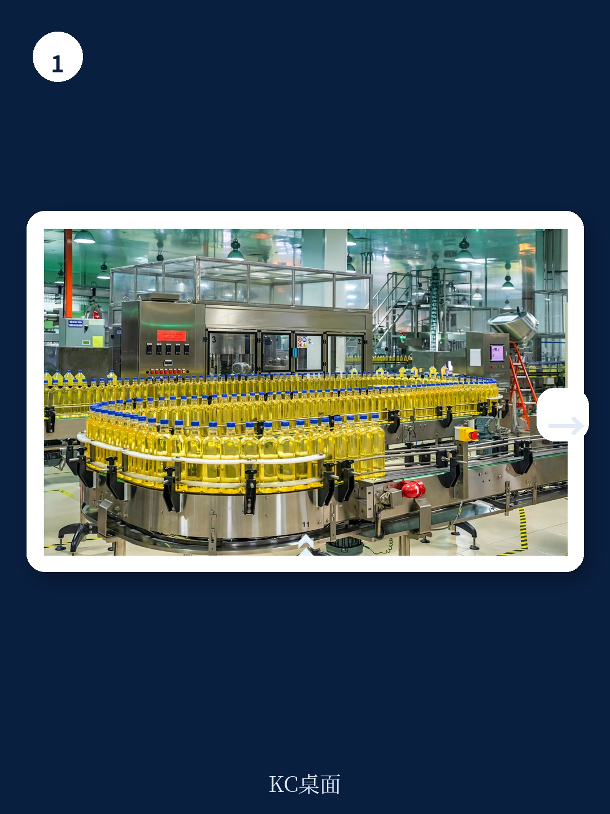

# 联合国贸发会议：联合国报告，全球经济增长反而加深资源依赖国困境

全球101个经济体仍深陷大宗商品依赖陷阱——出口收入的60%以上来自初级产品。过去二十年，许多国家尝试通过出口多元化来降低这种依赖，但结果往往令人失望：出口种类增加了，大宗商品出口占比却没有下降，甚至反而上升。

联合国贸发会议（UNCTAD）2026年3月发布的工作论文《战略多元化：利用经济复杂性摆脱大宗商品依赖的实证洞见》给出了一个关键判断：问题不在于出口了多少种产品，而在于出口了什么样的产品。传统多元化指标关注的是出口篮子的大小，而真正决定一个国家能否摆脱资源诅咒的，是其出口产品的技术复杂度和生产能力的精密度。

这份基于183个国家、1995年至2019年面板数据的研究，首次从理论上构建了经济复杂性与大宗商品依赖之间的因果框架，并量化了二者关系的异质性。结论清晰：向高复杂度部门多元化，能显著降低大宗商品依赖；但全球平均收入增长反而会加深依赖国的资源出口结构，强化发展中国家出口原材料、发达国家出口高附加值产品的全球分工格局。

---

> **KC评论：** 这篇报告的价值不在于重复“资源诅咒”的老生常谈，而在于提供了一个可操作的政策诊断工具——不是告诉你要多元化，而是告诉你应该往哪个方向多元化。完整报告中的图表和计量模型，展示了不同依赖程度国家的差异化路径，以及如何利用单位价格分层的贸易数据来精确定位产业目标。继续看原文，真正有价值的是图表、假设和验证路径；完整报告与KC评论在每日汇编。

---

## 1. 出口多元化不等于摆脱资源依赖，真正的变量是“经济复杂性”

传统上，政策制定者将出口多元化视为降低大宗商品依赖的直接手段——增加出口产品种类，分散收入来源。但这份报告揭示了一个反直觉的事实：多元化本身并不必然降低大宗商品出口占比。

一个经济体可以同时增加大宗商品和非大宗商品的出口，只要前者增长更快，商品出口比例就会上升。更极端的情况是，一个国家可以从出口原棉转向同时出口原棉和竹子——这确实是多元化，但仍然是初级产品内部的多元化，没有改变依赖结构。

经济复杂性指标提供了更精细的视角。它不只统计一个国家出口了多少种产品，而是衡量这些产品的“稀有度”和“技术含量”。复杂产品的核心特征：需要更多、更稀缺的生产能力，只有少数国家能生产。因此，当一个国家的经济复杂性提升时，意味着它正在积累更高级的制造能力和技术知识，其出口结构自然从初级产品向高附加值产品迁移。

报告的固定效应模型证实：在控制价格波动、汇率变动、全球需求等变量后，经济复杂性的提升对降低大宗商品依赖具有统计显著的负向影响。这一效应并非因为大宗商品本身“不复杂”这一定义性特征，而是因为复杂性提升代表了生产能力的结构性升级。

## 2. 最受益的不是最严重的依赖国，而是“临界区”经济体

这一发现可能是报告中最具政策含金量的部分。研究对不同程度的依赖国进行了异质性分析，结果令人意外：大宗商品出口占比在60%-80%之间的经济体，从提升经济复杂性中获益最大。

为什么不是那些依赖程度超过80%甚至90%的国家？原因在于，极端依赖国往往缺乏启动结构转型所需的基础能力——熟练劳动力、基础设施、制度环境。它们就像陷入流沙，越挣扎陷得越深。而60%-80%的“临界区”经济体，通常已经拥有一定的非商品部门基础，提升复杂性的边际收益最高。

这一发现对政策排序有直接含义：资源不应平均分配给所有依赖国，而应优先支持那些已具备转型条件的经济体。对于最严重的依赖国，可能需要先进行基础能力建设，而不是直接追求出口结构升级。

> **KC评论：** 这个“临界区”发现对投资者和产业决策者同样有启发。如果你在评估一个资源型经济体的转型潜力，不要只看其资源依赖的程度，还要看其非资源部门的规模和复杂度。完整的报告附有183个国家的分类表格，标出了哪些国家属于CDDCs（大宗商品依赖型发展中国家），并提供了单位价格分层的复杂度数据，这些细节在本文中无法展开。

---

## 3. 一个悖论：全球经济增长反而加深了依赖国的资源陷阱

报告揭示了一个令人不安的结构性矛盾：全球平均收入增长，会显著加深大宗商品出口国的依赖程度。

背后的机制并不难理解。当全球经济扩张时，对原材料的需求增加，推高了大宗商品价格。依赖国因此获得更多出口收入，本币升值，制造业竞争力下降——经典的“荷兰病”效应再次上演。更关键的是，高价格带来的短期收入激励，使得资源部门对其他部门的挤出效应更加明显。

这意味着，如果只靠全球经济增长的顺风，依赖国不仅不会自动实现结构转型，反而会陷入更深的路径依赖。全球分工体系在缺乏政策干预的情况下，存在自我强化的趋势：发达国家继续生产高复杂度产品，发展中国家继续输出原材料。

这一发现对当前的地缘经济格局有直接映射。在能源转型、供应链重构的背景下，许多资源国获得了新的出口机会，但如果不能同时提升经济复杂性，这些机会可能只是另一种形式的资源诅咒。

## 4. 报告尚未完全回答的关键问题：复杂性提升的“如何”问题

经济复杂性框架擅长回答“向哪里去”，即识别哪些产品是可行的多元化目标。但它对于“怎么去”的问题——具体的政策工具、制度安排、实施机制——提供的是方向性指引而非操作蓝图。

报告明确指出，复杂性方法应该被视为“战略指南针”而非“政策处方手册”。它可以帮助识别化学行业存在多元化机会，但无法回答：应该在哪个城市建厂？需要培训多少名化学工程师？课程应该如何设计？

这是当前经济复杂性研究面临的普遍挑战。从识别可行目标到实现目标之间，存在巨大的实施鸿沟。报告引用了卢旺达、巴西、巴拉圭、巴拿马等国应用复杂性框架的案例，但这些案例的成功条件和可复制性仍有待检验。

---

> **KC评论：** 报告的附录部分包含了完整的计量模型设定、稳健性检验和诊断测试结果，对于想深入理解方法论的研究者和政策分析者来说，这些内容比正文更有价值。特别是Ramsey RESET检验结果（F(1,189)=2.07,p=0.1514）表明模型设定无误，增加了结果的可信度。但报告没有展开的是：不同制度质量、治理水平、金融深化程度下，复杂性提升的效果是否一致？这些未解问题正是每日汇编中持续跟踪和讨论的重点。

---

## 5. 给读者的观察框架：如何判断一个经济体是否真正在“去依赖”

基于报告的结论，可以提炼出一个三层观察框架，用于评估资源型经济体的结构转型进展

第一层：看出口种类是否增加。这是最基础的指标，但也是最容易产生误导的指标。许多国家通过增加初级产品种类来实现“虚假多元化”。

第二层：看经济复杂性是否提升。这需要关注出口产品中高复杂度产品的占比变化，以及新进入的出口产品是否比退出的产品更复杂。报告使用的修正经济复杂性指数（Modified ECI）是一个有效的跟踪工具。

第三层：看全球周期中依赖度的变化方向。一个真正在转型的经济体，应该在全球大宗商品价格上涨时，其大宗商品出口占比不升反降，或者至少保持稳定。如果在涨价周期中依赖度快速上升，说明结构转型尚未取得实质性进展。

---

## 6. 战略多元化的真正含义：从“数量”到“质量”的范式转换

报告的核心贡献，是将政策讨论从“多元化”推进到“战略多元化”。后者强调的不是增加出口种类，而是增加复杂产品的出口种类，并且这些产品应该与现有生产能力具有相关性。

这意味着一国不应盲目追求高科技产业，而应从现有的能力基础出发，向“相邻可能”空间扩张。对于依赖铜矿出口的国家，进入铜加工和铜合金制造比直接进入半导体制造更具可行性。这种相关多元化策略，既能降低失败风险，又能逐步积累更复杂的能力。

报告使用的单位价格分层数据进一步增强了这一框架的可操作性。出口同一类产品但不同价格区间的国家，实际上拥有不同的生产能力。通过将6位HS编码按数量和价格进一步细分，可以更精确地识别那些真正代表能力升级的出口变化。

---

> **KC评论：** 报告没有完全展开的是：在AI和自动化技术快速发展的背景下，传统的能力积累路径是否仍然有效？一些发展中国家是否可能通过数字经济实现“能力跳跃”？这些问题的答案不在本文，但在每日汇编的持续跟踪中。更多国际信源汇编和评论，扫码交流，每日更新，汇总国际主流叙事、数据和图表，观测边际变化。

---

**未解问题与继续讨论**

- 经济复杂性框架在数字经济和服务贸易领域如何适用？当前模型主要基于商品贸易数据，对服务出口复杂度缺乏测量。
- 全球供应链重构（近岸外包、友岸外包）对依赖国的复杂性提升是机会还是威胁？
- 中国的产业升级经验（从低复杂度到高复杂度的成功案例）对CDDCs的可复制性有多大？

这些正是需要更深入讨论的问题。每日汇编会把单篇报告放回当天的主线，整理成中文摘要、KC评论和图表合集，便于喂给AI，也便于人工快速扫市场动态。这里汇聚了头部券商、PE/VC、投行、并购、对冲基金、资管机构、战略咨询、智库等机构的朋友，期待交流。

---

Personal reading notes and learning share only. Not investment advice.
