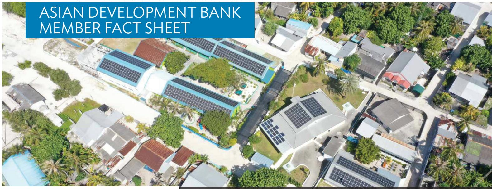

## ASIAN DEVELOPMENT BANK MEMBER FACT SHEET

## Maldives: 2025 Commitments (\$ million) $^{a}$

<table><tr><td>Product Type</td><td>Public Sector</td><td>Private Sector</td><td>Total</td></tr><tr><td>Technical  $Assistance^b$ </td><td>2.01</td><td>0.01</td><td>2.02</td></tr><tr><td>Total</td><td>2.01</td><td>0.01</td><td>2.02</td></tr></table>

## Note:

Commitment is the financing approved by ADB's Board of Directors or Management for which the legal agreement has been signed by the borrower, recipient, or the investee company and ADB. It comprises the amount indicated in the investment agreement, which—depending on the exchange rate at the time of signing—may or may not be equal to the approved amount.

$^{a}$ Numbers may not sum up precisely because of rounding.

$^{b}$ Financing for technical assistance projects with regional coverage is distributed to their specific ADB developing member countries where a breakdown is available.

Maldives: Cumulative Commitments $^{a,b,c}$

<table><tr><td rowspan="2">Sector</td><td rowspan="2">No.</td><td colspan="2">Total Amount ($ million)d</td></tr><tr><td>Public Sector</td><td>Private Sector</td></tr><tr><td>Agriculture, Natural Resources, and Rural Development</td><td>6</td><td>24.29</td><td>-</td></tr><tr><td>Education</td><td>8</td><td>14.97</td><td>-</td></tr><tr><td>Energy</td><td>20</td><td>136.34</td><td>-</td></tr><tr><td>Finance</td><td>9</td><td>0.90</td><td>30.62</td></tr><tr><td>Health</td><td>4</td><td>12.80</td><td>-</td></tr><tr><td>Industry and Trade</td><td>10</td><td>30.42</td><td>0.08</td></tr><tr><td>Information and Communication Technology</td><td>1</td><td>0.15</td><td>20.14</td></tr><tr><td>Multisector</td><td>5</td><td>33.73</td><td>-</td></tr><tr><td>Public Sector Management</td><td>35</td><td>130.64</td><td>-</td></tr><tr><td>Transport</td><td>21</td><td>46.76</td><td>-</td></tr><tr><td>Water and Other Urban Infrastructure and Services</td><td>9</td><td>124.64</td><td>-</td></tr><tr><td>Total</td><td>128</td><td>555.65</td><td>50.83</td></tr></table>

- = nil.

a Includes loans, grants, equity investments, and technical assistance.
b Using primary sector in the reporting of commitments.

$^{c}$ From 2020, financing for technical assistance projects with regional coverage is distributed to their specific ADB developing member countries where a breakdown is available.

$^{d}$ Numbers may not sum up precisely because of rounding.

ADB is helping Maldives through investment projects and technical assistance across various sectors, while fostering fiscal sustainability, inclusive growth, and regional cooperation.

## MALDIVES

Maldives joined the Asian Development Bank (ADB) in 1978. The country partnership strategy (CPS), 2020–2024, continues to guide ADB's engagement in the country. Its priorities include enhancing public sector efficiency and fiscal sustainability, strengthening competitiveness and diversifying the economy, and improving quality of life while ensuring environmental sustainability. The country is eligible for grants and concessional funding through the Asian Development Fund (ADF).

Recent ADB projects notably boost resilience and food security by improving flood and coastal protection and investing in local agri-food systems. ADB supports upgrading power grids to accommodate higher shares of renewable energy, while helping the government tender new solar power capacity. Efforts to advance social protection include building shelters for victims of domestic abuse and violence against women and girls. Investment in vaccine cold storage bolsters public health, while the development of an electronic single window aims to simplify export procedures. ADB also supports solid waste management through improved waste collection and converting waste to electricity, leading to lower emissions and greater energy independence.

Public sector operations. As of 31 December 2025, ADB had committed 121 public sector loans, grants, and technical assistance totaling \$556 million to Maldives. ADB's current public sector portfolio in the country includes 5 loans and 10 grants worth \$253.3 million. $^{1}$

In 2025, ADB approved a technical assistance project to help modernize Maldives' customs service. The country may also benefit from several regional technical assistance projects approved in 2025. These initiatives support evidence-based approaches to resilience and sustainability and accountability through stronger audit institutions. Technical assistance also emphasizes regional cooperation, supporting the regional cooperation and integration agenda of the South Asian Association for Regional Cooperation, as well as trade and transport facilitation in South Asia. Additional assistance focuses on expanding capacity development networks for government officials.

Private sector operations. Total outstanding balances and undisbursed commitments of ADB's private sector transactions in Maldives as of 31 December 2025 amounted to \$23.32 million, representing 0.15% of ADB's total private sector portfolio.

Cumulative disbursements. Cumulative public and private sector loan and grant disbursements to Maldives amount to \$392 million. These were financed by regular and concessional ordinary capital resources, ADF, and other special funds.

Operational challenges. A limited human resource pool limits the country's capacity to design and implement complex projects. In response, ADB provides technical assistance to strengthen the government's institutional and technical capacity. In addition, Maldives' weak business environment, small market size, and limited access to credit hinder opportunities for private-sector investments. ADB helps the country in this area through technical assistance and project financing.

## KNOWLEDGE WORK

In 2025, ADB released a study identifying sociocultural obstacles to workforce participation among women and disadvantaged groups, highlighting the need for stronger social protection, childcare, inclusive urban planning, and financing for women-owned businesses. Another study using machine learning generated granular poverty indicators to help tackle spatial inequality. ADB also supported efforts to diversify the economy within and beyond the dominant fisheries and tourism sectors. In 2025, a series of workshops brought business, civil society, and government stakeholders together to explore opportunities. The Maldives Tuna Think Tank workshop looked into strengthening sustainability, efficiency, and access to financing in the tuna value chain. Stakeholder workshops and policy dialogue deepened collaboration among local actors to support creative entrepreneurship, improve the livelihoods of island communities, and introduce new services for tourists visiting Maldives.

Maldives: Share of Procurement Contracts for Loan, Grant, and Technical Assistance Projects

<table><tr><td rowspan="2">Item</td><td colspan="2">Goods, Works, and Related Services</td></tr><tr><td>Amount($ million)</td><td>% ofADB Total</td></tr><tr><td>2024</td><td>1.17</td><td>0.01</td></tr><tr><td>2025</td><td>2.22</td><td>0.01</td></tr><tr><td>Cumulative (as of 31 Dec 2025)</td><td>166.80</td><td>0.06</td></tr></table>

<table><tr><td rowspan="2">Item</td><td colspan="2">Consulting Services</td></tr><tr><td>Amount($ million)</td><td>% ofADB Total</td></tr><tr><td>2024</td><td>0.74</td><td>0.14</td></tr><tr><td>2025</td><td>1.12</td><td>0.15</td></tr><tr><td>Cumulative (as of 31 Dec 2025)</td><td>8.40</td><td>0.05</td></tr></table>

<table><tr><td rowspan="2">Item</td><td colspan="2">Total Procurement</td></tr><tr><td>Amount($ million)</td><td>% ofADB Total</td></tr><tr><td>2024</td><td>1.91</td><td>0.01</td></tr><tr><td>2025</td><td>3.34</td><td>0.02</td></tr><tr><td>Cumulative (as of 31 Dec 2025)</td><td>175.20</td><td>0.06</td></tr></table>

Top 5 Contractors/Suppliers from Maldives Involved in Goods, Works, and Related Services Contracts under ADB Loan and Grant Projects, 1 January 2021–31 December 2025

<table><tr><td>Contractor/Supplier</td><td>Sector</td><td>Contract Amount($ million)</td></tr><tr><td>Central Line Pvt. Ltd.</td><td>WUS</td><td>1.65</td></tr><tr><td>Roseware Corporation Pvt. Ltd.</td><td>HLT, IND</td><td>0.98</td></tr><tr><td>Sunnyland Investments Pvt. Ltd.</td><td>WUS</td><td>0.51</td></tr><tr><td>Tradenet Corp. Ltd.</td><td>IND</td><td>0.26</td></tr><tr><td>Wee Hour Investment Pvt. Ltd.</td><td>WUS</td><td>0.22</td></tr><tr><td>Others</td><td></td><td>20.69</td></tr><tr><td>Total</td><td></td><td>24.31</td></tr></table>

HLT = health, IND = industry and trade, WUS = water and other urban infrastructure and services.

## Top 5 Consultants from Maldives Involved in Consulting Services Contracts under ADB Loan, Grant, and Technical Assistance Projects, 1 January 2021–31 December 2025

<table><tr><td>Consultant</td><td>Sector</td><td>Contract Amount($ million)</td></tr><tr><td>Land and Marine Environmental Resource Group</td><td>ANR</td><td>0.45</td></tr><tr><td>Water Solutions Pvt. Ltd.</td><td>ENE</td><td>0.10</td></tr><tr><td>Individual Consultants</td><td></td><td>2.74</td></tr><tr><td>Others</td><td></td><td>0.24</td></tr><tr><td>Total</td><td></td><td>3.53</td></tr></table>

ANR = agriculture, natural resources, and rural development; ENE = energy.

Maldives: Ordinary Capital Resources Private Sector Commitments by Product

<table><tr><td></td><td>2025</td><td>2021–2025</td></tr><tr><td>Number of Transactions Signed (OCR)</td><td>0</td><td>2</td></tr><tr><td>Number of Transactions Signed (Programs)</td><td>0</td><td>0</td></tr><tr><td></td><td colspan="2">Amount ($ million)</td></tr><tr><td>Loans</td><td>-</td><td>33.00</td></tr><tr><td>Equity Investments</td><td>-</td><td>-</td></tr><tr><td>Guarantees</td><td>-</td><td>-</td></tr><tr><td>Debt Security</td><td>-</td><td>-</td></tr><tr><td>Trade and Supply Chain Finance Programand Microfinance Program</td><td>-</td><td>-</td></tr><tr><td>Total</td><td>-</td><td>33.00</td></tr></table>

- = nil, OCR = ordinary capital resources.

## FINANCING PARTNERSHIPS

Financing partnerships enable ADB's partner governments or their agencies, multilateral financing institutions, and private organizations to participate in financing ADB projects. The additional funds provided may be in the form of loans and grants, technical assistance, and private sector cofinancing.

Cumulative cofinancing commitments in Maldives:

\- Public sector cofinancing: \$239.54 million for 10 investment projects and \$7.45 million for 10 technical assistance projects since 1981

\- Private sector cofinancing: \$24.91 million for 2 investment projects since 2022

Through its private sector operations, ADB also actively mobilizes capital by attracting funding from other institutions and helping close funding gaps to increase development impact across the region.

A summary of projects with cofinancing from 1 January 2021 to 31 December 2025 is available at www.adb.org/where-we-work/maldives/cofinancing.

## FUTURE DIRECTIONS

ADB's strategic directions will be guided by Maldives' forthcoming long-term national development plan, which will set development objectives by 2040. This forward-looking framework will notably target structural transformation, productivity gains, and inclusive, sustainable development. ADB's action will also be guided by ADB's Strategy 2030 and its midterm review. ADB is engaging with the government on a new country partnership strategy, which will remain anchored in strengthening fiscal sustainability, development sustainability, economic growth, and resilience.

Maldives: Portfolio Performance Quality Indicators for Public Sector Lending and Grants, 2024–2025

<table><tr><td>No. of Ongoing Loans $^{a}$  (as of 31 Dec 2025)</td><td colspan="2">5</td></tr><tr><td></td><td>2024 ($ million)</td><td>2025 ($ million)</td></tr><tr><td>Contract Awards $^{b}$ </td><td>1.34</td><td>-</td></tr><tr><td>Disbursements $^{c}$ </td><td>13.18</td><td>5.82</td></tr><tr><td>No. of Ongoing Grants $^{d}$  (as of 31 Dec 2025)</td><td colspan="2">10</td></tr><tr><td></td><td>2024 ($ million)</td><td>2025 ($ million)</td></tr><tr><td>Contract Awards $^{b}$ </td><td>5.66</td><td>5.63</td></tr><tr><td>Disbursements $^{c,e}$ </td><td>15.25</td><td>11.96</td></tr><tr><td>At Risk Projects (\%) $^{f}$  (as of 31 Dec 2025)</td><td colspan="2">-</td></tr></table>

\- = nil.

$^{a}$ Includes ADB-financed public sector loans committed and not financially closed.

b Includes closed loans that had contract awards during the year. Excludes policy-based lending, results-based lending, financial intermediation (FI) and FI component for combined FI/PROJECT, grants funded by the Asia Pacific Disaster Response Fund (APDRF), and ADB-financed projects administered by an external agency.

c Includes closed loans/grants that had disbursements during the year.

$^{d}$ Covers public sector grants financed by the Asian Development Fund (ADF) and other ADB special funds committed and not financially closed.

e Includes only the ADF.

$^{f}$ Covers active projects as of 31 December 2025.

Maldives: Independent Evaluation Ratings for Public and Private Sector Operations, 2016–2025

<table><tr><td rowspan="2"></td><td rowspan="2">Total Number of Validated and Evaluated Projects and Programs</td><td colspan="3">Evaluation Ratings</td></tr><tr><td>Highly successful and successful</td><td>Less than successful</td><td>Unsuccessful</td></tr><tr><td>Public Sector Operations</td><td>3</td><td>2</td><td>1</td><td>-</td></tr><tr><td>Private Sector Operations</td><td>1</td><td>1</td><td>-</td><td>-</td></tr></table>

Note: The numbers indicate public and private sector operations in the country that have been validated or evaluated by the Independent Evaluation Department (IED) and their overall performance ratings. The coverage consists of all validated or evaluated project completion reports and extended annual review reports circulated by ADB within the 10-year period from 1 July 2015 to 30 June 2025. The rating of one COVID-19 Pandemic Response Option (CPRO) project completed (validated) in 2023 is not included in the total. See evaluations related to Maldives.

Source: IED success rate database.

## Maldives: Projects Cofinanced,

1 January 2021–31 December 2025

<table><tr><td>Cofinancing</td><td>No. of Projects</td><td>Amount ($ million)</td></tr><tr><td>Public sector projects $^{a}$ </td><td>3</td><td>49.00</td></tr><tr><td>Loans</td><td>2</td><td>30.00</td></tr><tr><td>Grants</td><td>2</td><td>19.00</td></tr><tr><td>Private sector projects</td><td>2</td><td>25.91</td></tr><tr><td>Technical Assistance</td><td>3</td><td>3.23</td></tr></table>

$^{a}$ A project with more than one source of cofinancing is counted once.

## ADB AT A GLANCE

ADB is a leading multilateral development bank supporting inclusive, resilient, and sustainable growth across Asia and the Pacific. Founded in 1966, ADB is owned by 69 members—50 from the region and 19 outside. ADB is headquartered in Manila, Philippines, and has 43 offices around the world. Its 4,436 staff represented 67 of its 69 members as of 31 December 2025.

Working with its members and partners to solve complex challenges together, ADB's financial and technical support is transforming lives and economies across Asia and the Pacific—fueling prosperity, strengthening communities, and protecting the planet.

In 2025, ADB sharpened its focus on promoting private sector development as a key driver of growth. ADB's investments in 2025 across Asia and the Pacific are expected to generate more than 3.3 million jobs.

ADB operations. In 2025, ADB committed \$29.3 billion in loans, grants, equity investments, guarantees, private sector programs, and technical assistance to its borrowing members. ADB bolstered its total support with cofinancing of \$14.7 billion.

As of 31 December 2025, ADB's cumulative commitments in 46 members stood at \$423.4 billion covering 4,659 loans, \$15.7 billion in 719 grants, and \$6.3 billion in technical assistance grants, including regional technical assistance grants.

In addition to loans, grants, and technical assistance, ADB used equity investments, guarantees, and private sector programs to help its developing member countries.

Total project commitments in private sector loans, equity investments, and guarantees from ADB's own funds in 2025 amounted to \$3.1 billion for 49 transactions in economic and social infrastructure, the finance sector, and agribusiness. Commitments in ADB's Trade and Supply Chain Finance Program and Microfinance Program amounted to \$2.4 billion.

In 2025, ADB also directly mobilized \$6 billion in private capital across 35 projects, with an additional \$3.7 billion directly mobilized through its trade and supply chain finance and microfinance programs.

Total outstanding balances and undisbursed commitments of private sector transactions funded by ADB's own resources stood at \$15.1 billion as of 31 December 2025.

## FINANCING PARTNERSHIPS

Total public and private sector cofinancing commitments, 2025

\- \$14.7 billion for 224 projects, of which:

» \$13.7 billion, 92 investment projects,

» \$173.6 million, 130 technical assistance projects,

» \$781.18 million transaction advisory services for 2 projects.\*

Cumulative public and private sector cofinancing commitments, 1970–2025

\- \$197.72 billion for 3,777 projects, of which:

» \$189.9 billion, 1,430 investment projects,

» \$3.41 billion, 2,332 technical assistance projects,

» \$4.4 billion transaction advisory services for 15 projects.\*\*

\* Adjusted to exclude \$12.5 million A Loans mobilized under transaction advisory services reported under private sector operations financing, and \$158.8 million cofinancing reported in private sector projects cofinancing.

\*\* Adjusted to exclude \$53.9 million A Loans mobilized under transaction advisory services reported under private sector operations financing, and \$334.58 million cofinancing reported in private sector projects cofinancing.

## PROCUREMENT

ADB's procurement contracts in Asia and the Pacific for goods, works, and related services under loan and grant operations:

• \$13.98 billion in 2024

• \$14.89 billion in 2025

\- \$292.29 billion covering 238,051 contracts, cumulative procurement since 1966

ADB's procurement contracts in Asia and the Pacific for consulting services under loan, grant, and technical assistance operations:

• \$524.54 million in 2024

\- \$758.66 million in 2025

\- \$17.5 billion covering 91,335 contracts, cumulative procurement since 1966

## MORE ABOUT MALDIVES AND ADB

## Shareholding and Voting Power

Number of shares held: 426 (0.004% of total shares)
Votes: 38,973 (0.293% of total membership, 0.448% of total regional membership)
\*Overall capital subscription: \$5.84 million
\*Paid-in capital subscription: \$288,000

\*United States dollar figures are valued at the rate as of 31 December 2025.

## ADB Governor: Hassan Zareer

ADB Alternate Governor: Zidna Ibrahim  
ADB Director: Noor Ahmed (Pakistan)  
ADB Alternate Director: Rolando Tungpalan (Philippines)  
ADB Director's Advisors: Tanya Real (Philippines) and Ali Irufan (Maldives)

## CONTACTS

Maldives Coordination Office
Established: 2021
Desk Officer: Jules Hugot

ADB South Asia Department - Regional Cooperation and Operations Coordination Division
6 ADB Avenue, Mandaluyong City, 1550 Metro Manila, Philippines
Tel: +632-8632-4444
www.adb.org/maldives

## ADB Headquarters

6 ADB Avenue, Mandaluyong City
1550 Metro Manila, Philippines
Tel: +63 2 8632 4444
Fax: +63 2 8636 2444
www.adb.org

## Ministry of Finance and Planning

Ameenee Magu
Block 379 Malé, Republic of Maldives
Tel: +960 334 9200
admin@finance.gov.mv

## Useful ADB websites

Asian Development Bank
www.adb.org

Publications
www.adb.org/publications

Annual Reports
www.adb.org/documents/series/adb-annual-reports

Asian Development Outlook
www.adb.org/publications/series/asian-development-outlook

ADB Data Library
data.adb.org

Asian Development Blog https://blogs.adb.org/

Notes: (i) Figures are estimated by ADB unless otherwise stated. "\$" refers to United States dollars. (ii) Data are updated as of 31 December 2025 unless otherwise indicated.