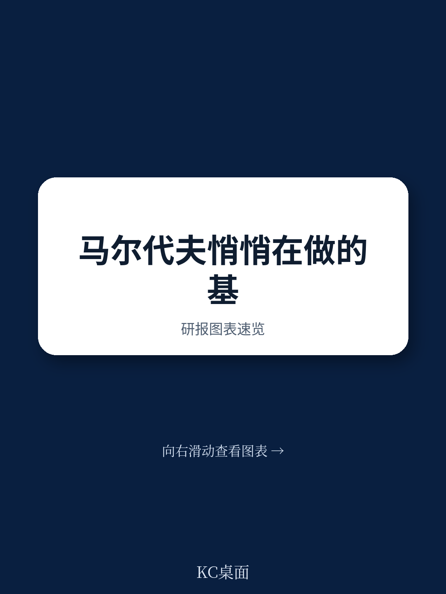
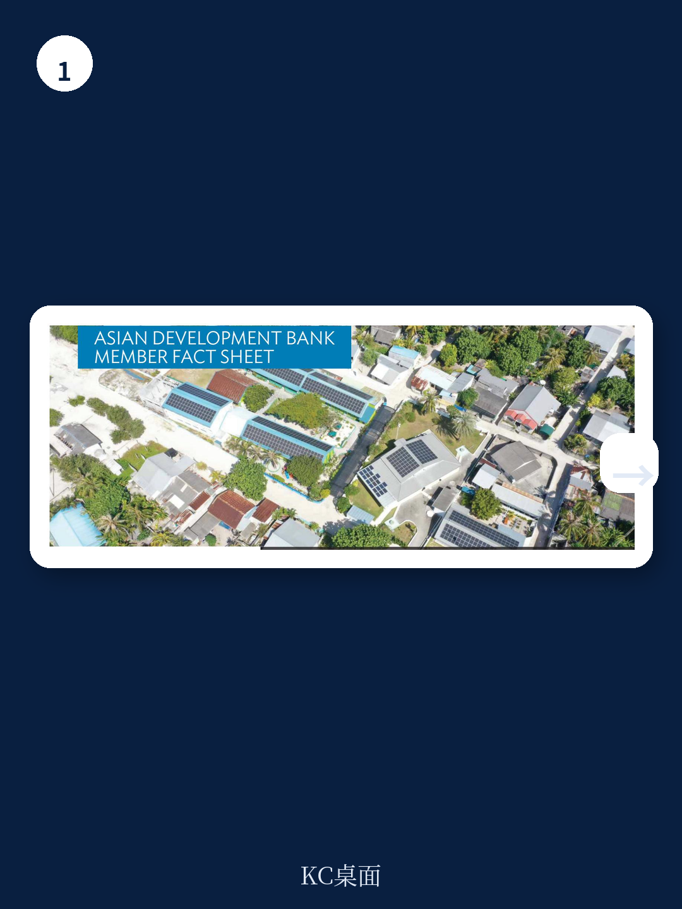
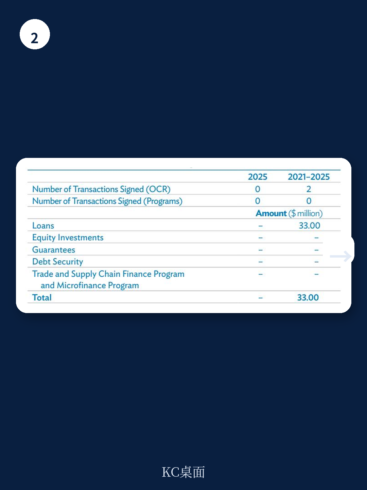

# 亚洲开发银行：马尔代夫最缺的不是旅游，是财政可持续

亚洲开发银行最新发布的马尔代夫国别简报，表面看是一份常规的发展合作数据汇总。但仔细拆解其中几个关键数字，它揭示了一个比旅游收入波动更深层的结构性问题：马尔代夫正处于从“小而美”到“小而脆”的转折点。报告最值得关注的判断是——这个岛国的发展瓶颈已经从地理限制转向制度能力。

截至2025年底，亚开行在马尔代夫累计承诺公共部门贷款、赠款和技术援助5.56亿美元，私营部门累计承诺5083万美元。2025年全年新批准项目仅一笔技术援助，金额202万美元。这个数字本身不惊人，但结合另一组数据看就有意思了：亚开行在马尔代夫的独立评价显示，2016年至2025年间被评估的3个公共部门项目中，1个被评为“低于成功”，成功率并非100%。

> **KC评论：** 亚开行在马尔代夫的业务规模很小，但项目成功率不是满分这一点值得注意。对于一个高度依赖外部援助的小岛国，每一笔资金的使用效率都直接影响其财政空间。完整报告里的独立评价章节值得细看，它列出了具体哪些项目被判定为“低于成功”，以及背后的原因。

## 1. 这轮变化真正考验的是政府能否把有限的人力资源转化为执行能力

报告在“运营挑战”部分点出了一个常被忽视的硬约束：有限的人力资源池限制了马尔代夫设计和实施复杂项目的能力。这不是客套话。马尔代夫全国人口仅约50万，公务员体系的技术深度和广度天然受限。亚开行的应对措施是提供技术援助来加强政府机构能力——但技术援助本身也需要本地团队承接。

2025年亚开行批准的技术援助项目聚焦于海关现代化，同时还有多个区域性技术援助项目涉及审计机构强化、贸易和运输便利化。这些项目看似分散，实则指向同一个核心：帮助马尔代夫用更少的人做更复杂的事。

## 2. 私营部门参与度极低，但方向已经明确

截至2025年底，亚开行在马尔代夫的私营部门未偿余额和未拨付承诺合计2332万美元，仅占亚开行全部私营部门组合的0.15%。这个比例说明马尔代夫尚未形成有规模的市场化融资生态。

但亚开行的策略正在调整。2025年的工作重点中出现了“利用机器学习生成精细贫困指标以解决空间不平等”的研究，以及围绕渔业和旅游业之外的宏观环境多元化讨论。这些知识工作不是可有可无的背景——它们是为下一阶段私营部门融资项目做铺垫。只有当私营部门能看到清晰的非旅游机会，外部资本才愿意进来。

## 3. 报告尚未完全回答的关键问题：财政可持续的路径依赖

亚开行明确表示，未来战略方向将由马尔代夫即将出台的2040年长期国家发展计划指导，重点目标包括结构转型、生产率提升和包容性可持续发展。但报告没有展开的是：马尔代夫当前财政高度依赖旅游相关税收和进口关税，而亚开行自身在马尔代夫的项目组合中，公共部门管理类项目数量最多（35个），累计承诺金额1.31亿美元，仅次于能源和水利。这意味着亚开行在过去几十年里一直在帮助马尔代夫维持政府运转，而不是推动宏观环境结构转型。真正的考验在于，当外部援助从“补运营”转向“促转型”时，马尔代夫能否自己接住。

这份亚开行国别简报的数据颗粒度很细，包括各行业累计承诺额、承包商和咨询商排名、联合融资结构等。完整报告、中文摘要和图表合集，适合放在当天国际发展合作的主线里继续跟踪，也方便后续对比其他小岛国的亚开行合作模式。